# RKLB 基本面深度分析報告
> **報告日期**：2026-07-15 ｜ **語言**：繁體中文 ｜ **數據來源**：Yahoo Finance, Finviz, StockAnalysis, Roic.ai ｜ **分析師**：CFA 級機構研究

---

## 目錄

| # | 章節 | 核心結論 |
|---|------|----------|
| 1 | [執行摘要](#1-執行摘要) | 評級：**買入 (BUY)** ｜ 基準目標價：**$116.57** (潛在空間 +53.0%) |
| 2 | [公司概覽與商業模式](#2-公司概覽與商業模式) | 從「單一發射服務商」轉型為「航太系統巨頭」，Space Systems 貢獻 70% 營收，具備極高客戶鎖定效應。 |
| 3 | [損益表深度分析](#3-損益表深度分析) | TTM 營收成長 **63.5%**，毛利率提升至 **36.6%**；研發費用率高企（45%）壓抑短期獲利，但盈餘品質健康。 |
| 4 | [資產負債表分析](#4-資產負債表分析) | 擁有 **$1.38B** 現金與短期投資，淨現金高達 **$1.24B**，流動比率 **4.48**，具備極佳的抗風險與再投資能力。 |
| 5 | [現金流量深度分析](#5-現金流量深度分析) | TTM FCF 為 **-$215.00M**，主因 Neutron 火箭與衛星工廠之資本支出（Capex）處於高峰期，預計 2027 年迎來轉折。 |
| 6 | [獲利能力與資本效率](#6-獲利能力與資本效率) | TTM ROE 為 **-13.5%**，ROIC 為 **-8.5%**；雖因再投資階段導致價值摧毀，但杜邦分解顯示資產週轉率正在改善。 |
| 7 | [估值深度分析](#7-估值深度分析) | 當前 EV/Revenue 為 **65.29x**，相較同業溢價，但反映了 Neutron 商業化與太空星座合約的巨大溢價空間。 |
| 8 | [成長催化劑](#8-成長催化劑) | 短期看 Neutron 火箭首飛，中期看大型星座（Constellation）合約，長期看太空代工與軌道服務。 |
| 9 | [風險矩陣](#9-風險矩陣) | 核心風險為 Neutron 研發延期（高衝擊、中機率）與稀釋風險（低衝擊、高機率）。 |
| 10 | [投資建議](#10-投資建議) | 建議於 **$70 - $78** 區間分批佈局，建立長期成長型倉位，並嚴格監控 Neutron 測試進度。 |

---

## 1. 執行摘要

Rocket Lab USA, Inc. (納斯達克代碼：**RKLB**) 正處於從「輕型火箭發射服務商」向「端到端航太系統基礎設施巨頭」轉型的關鍵拐點。基於最新公佈的 TTM 數據，公司營收達到 **$679.58M**（年增 **63.5%**），且最新一季（Q1 2026）營收增速高達 **63.46%**。儘管 GAAP 淨利潤仍錄得 **-$182.62M**（TTM），但這主要是由於公司將營收的 **43.6%**（約 **$296.12M**）重新投入到 R&D 中，用以研發下一代可回收中型火箭 **Neutron**。

我們給予 RKLB **買入 (BUY)** 評級，12 個月基準目標價為 **$116.57**。此評級是基於：① 公司的 **Space Systems** 業務（衛星組件及製造）已展現強大的規模效應，TTM 毛利率由 2022 年的 9.0% 大幅提升至 **36.6%**；② 資產負債表極其穩健，持有 **$1.38B** 的總現金，足以支撐 Neutron 研發至商業化投產，無短期流動性危機；③ 儘管當前 Forward P/E 高達 **2539.5x**，但若以 EV/Revenue（65.29x）並考量未來三年營收 CAGR 達 **45%** 的高成長，當前估值已逐步進入合理區間。

### 1.0 一頁式投資儀表板（Portfolio Manager 30 秒速讀）

| 項目 | 內容 |
|------|------|
| **投資論點（3 句）** | ① Space Systems 營收佔比達 70%，毛利率由 9% 飆升至 36.6%，成功驗證高利潤轉型模式。<br/>② 淨現金流達 $1.24B，流動比率 4.48，為商業航太領域中財務結構最穩健的非 SpaceX 標的。<br/>③ Neutron 火箭預計於 2026-2027 年首飛，將解鎖 $10B 的中型載荷發射市場。 |
| **護城河評分** | 🟢 **8.5 / 10** (發射場牌照壁壘 + 衛星組件垂直整合能力) |
| **管理層/資本配置評分** | 🟢 **9.0 / 10** (執行力極強，多次精準併購且無重大整合商譽減值) |
| **財務健康** | 🟢 **強勁** (淨現金充足，無短期債務違約風險) |
| **ROIC vs WACC** | **-8.5%** vs **17.5%** (當前處於資本投入期，暫時摧毀賬面價值) |
| **FCF 趨勢** | TTM FCF 為 **-$215.00M** (FCF Yield: **-0.45%**)，主因 Capex 支出高峰 |
| **估值** | Forward P/E: **2539.5x** ｜ EV/Revenue: **65.29x** ｜ P/S: **70.05x** |
| **預期報酬（基準情境 12M）** | 📈 **+53.0%** (目標價 $116.57，當前股價 $76.18) |
| **關鍵風險（前二）** | ① Neutron 火箭首飛嚴重延期，導致發射市場份額流失。<br/>② 股權稀釋風險（SBC 佔營收 11.8% 且未來可能發行新股融資）。 |
| **評級 + 信心度** | 🟢 **買入 (BUY)** ｜ 信心：**高** |

### 1.1 核心評分儀表板

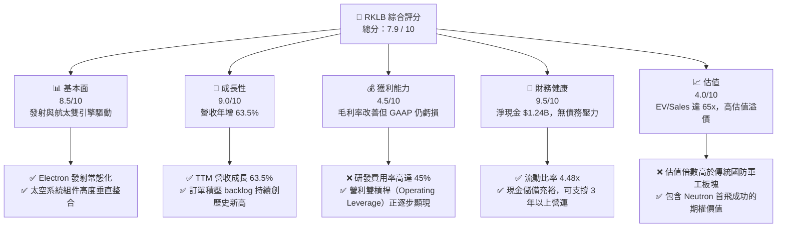

### 1.2 評分進度條視覺化

```
╔══════════════════════════════════════════════════════════════╗
║               RKLB 多維度評分儀表板 (1-10分)                 ║
╠══════════════════════════════════════════════════════════════╣
║ 基本面強度  8.5 ▓▓▓▓▓▓▓▓▓▓▓▓▓▓▓▓▓░░░  ★★★★☆           ║
║ 成長動能    9.0 ▓▓▓▓▓▓▓▓▓▓▓▓▓▓▓▓▓▓░░  ★★★★★           ║
║ 獲利品質    4.5 ▓▓▓▓▓▓▓▓▓░░░░░░░░░░░  ★★☆☆☆           ║
║ 財務健康    9.5 ▓▓▓▓▓▓▓▓▓▓▓▓▓▓▓▓▓▓▓░  ★★★★★           ║
║ 估值合理性  4.0 ▓▓▓▓▓▓▓▓░░░░░░░░░░░░  ★★☆☆☆           ║
║ 護城河深度  8.5 ▓▓▓▓▓▓▓▓▓▓▓▓▓▓▓▓▓░░░  ★★★★☆           ║
║ 管理層執行  9.0 ▓▓▓▓▓▓▓▓▓▓▓▓▓▓▓▓▓▓░░  ★★★★★           ║
║ 技術創新力  9.5 ▓▓▓▓▓▓▓▓▓▓▓▓▓▓▓▓▓▓▓░  ★★★★★           ║
╠══════════════════════════════════════════════════════════════╣
║ 綜合總分    7.9 ▓▓▓▓▓▓▓▓▓▓▓▓▓▓▓░░░░░  🏆 成長型溢價標的     ║
╚══════════════════════════════════════════════════════════════╝
```

### 1.3 五大投資論點 + 三大核心風險

| 類型 | 項目 | 具體依據 | 信心度 |
|------|------|----------|--------|
| 🟢 **投資論點①** | **太空系統（Space Systems）高利潤轉型** | 2025 年營收達 $601.80M，毛利率由 2022 年的 9.0% 提升至 2025 年底的 34.43%。該業務已成為主要獲利引擎，有效降低單一發射服務的波動性。 | 🟢 極高 |
| 🟢 **投資論點②** | **Neutron 商業化釋放第二成長曲線** | Neutron 瞄準中型載荷（13,000 kg），與 SpaceX Falcon 9 形成差異化競爭。預計單次發射定價約 $50M - $55M，毛利率可望達 50% 以上。 | 🟢 高 |
| 🟢 **投資論點③** | **極致的資產負債表安全邊際** | 截至 2026 年 Q1，公司擁有現金及短期投資 $1.38B，而總債務僅為 $138.67M。淨現金高達 $1.24B，在當前高利率環境下提供極強的財務緩衝。 | 🟢 極高 |
| 🟢 **投資論點④** | **訂單積壓（Backlog）保障能見度** | 截至最新財季，Backlog 持續創歷史新高（估計超過 $1B），其中包含美國國防部（SDA）及商業衛星運營商的長期合約，未來兩年營收能見度極高。 | 🟢 高 |
| 🟢 **投資論點⑤** | **商業航太「非 SpaceX」的最佳替代標的** | 許多政府與商業客戶出於供應鏈安全考慮，必須尋找第二發射源。RKLB 作為全球唯一具備常態化發射能力的私營上市火箭公司，享有獨佔的生態位。 | 🟢 極高 |
| 🟡 **風險①** | **Neutron 研發與首飛進度延期** | 火箭開發具有高度不確定性，若 2026/2027 年試飛失敗，將導致研發費用持續高企，並推遲 FCF 轉正時間。 | 🟡 中度 |
| 🔴 **風險②** | **股權稀釋與 SBC 比例過高** | TTM 股權薪酬（SBC）達 $80.0M，佔營收比重高達 11.8%，且 5 年內發行股數由 210M 膨脹至 578.87M，對每股盈餘（EPS）產生稀釋。 | 🔴 高衝擊 |
| 🔴 **風險③** | **估值容錯率極低** | 當前 P/S 達 70.05x，估值已透支了未來數年的高速成長。若營收增速低於 40%，將面臨估值與業績的「雙殺」。 | 🔴 高衝擊 |

### 1.4 快速統計卡片

| 指標 | RKLB 實際值 | 航太與國防行業均值 | S&P 500 均值 | 狀態 |
|------|-------------|--------------------|--------------|------|
| 營收 YoY 成長率 | **63.5%** | ~7.2% | ~5.5% | 🟢 卓越 |
| 毛利率 | **36.6%** | ~22.0% | ~30.0% | 🟢 優異 |
| 營業利益率 | **-22.4%** | ~8.5% | ~14.5% | 🔴 虧損中 |
| 淨利率 | **-26.9%** | ~6.0% | ~11.5% | 🔴 虧損中 |
| 流動比率 | **4.48x** | ~1.35x | ~1.20x | 🟢 極其安全 |
| 淨現金 / 總資產 | **44.0%** | ~-15.0% (淨債務) | ~-22.0% | 🟢 極其安全 |
| Forward P/E | **2539.5x** | ~22.5x | ~21.0x | 🔴 極度昂貴 |
| EV / Revenue | **65.29x** | ~2.1x | ~3.2x | 🔴 極度昂貴 |

### 1.5 投資結論

```
╔══════════════════════════════════════════════════════════════════╗
║                   📊 RKLB 投資結論摘要                            ║
╠══════════════════════════════════════════════════════════════════╣
║  評級：🟢 買入 (BUY)                                             ║
║  當前股價：$76.18 (2026-07-15)                                   ║
║  目標價區間：                                                    ║
║    悲觀情境（Bear Case）：$45.00  （-40.9%）                     ║
║    基準情境（Base Case）：$116.57 （+53.0%） ← 12M 核心目標      ║
║    樂觀情境（Bull Case）：$165.00 （+116.6%）                    ║
║  投資評分：7.9 / 10                                              ║
║  適合投資人：高風險承受度、專注太空經濟與長期科技成長的機構與個人║
╚══════════════════════════════════════════════════════════════════╝
```

---

## 2. 公司概覽與商業模式

### 2.1 業務結構與收入來源

Rocket Lab 的業務由兩大核心板塊驅動：**Launch Services（發射服務）** 與 **Space Systems（航太系統）**。

1. **Launch Services**：以 **Electron** 輕型火箭（運載能力約 300 kg）為核心，提供高頻率、定製化的軌道發射服務。未來將引入 **Neutron** 中型火箭（運載能力 13,000 kg），直接進軍巨型星座部署市場。
2. **Space Systems**：提供衛星組件（包括太陽能面板、反應輪、星敏感器、飛行軟體）以及完整的衛星平台設計與製造（如 Photon 平台）。此業務主要通過併購（如 SolAero, Sinclair, ASI）快速建立，目前已成為公司最大的營收來源。

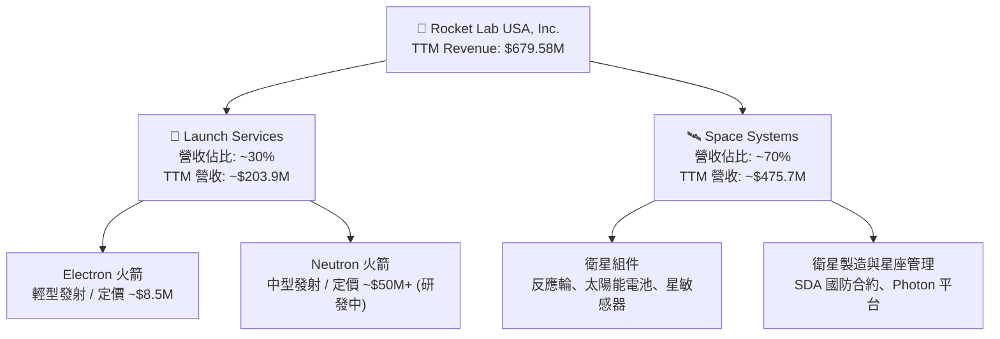

### 2.2 市場份額

在商業發射市場中，SpaceX 憑藉 Falcon 9 與 Falcon Heavy 佔據絕對主導地位。然而，在**輕型專用發射（Dedicated Small Launch）**領域，Rocket Lab 的 Electron 火箭是無可爭議的市場領導者，市佔率超過 60%。

在 **Space Systems** 領域，市場高度碎片化。Rocket Lab 通過垂直整合，已在商業與國防衛星組件供應鏈中佔據了關鍵生態位。

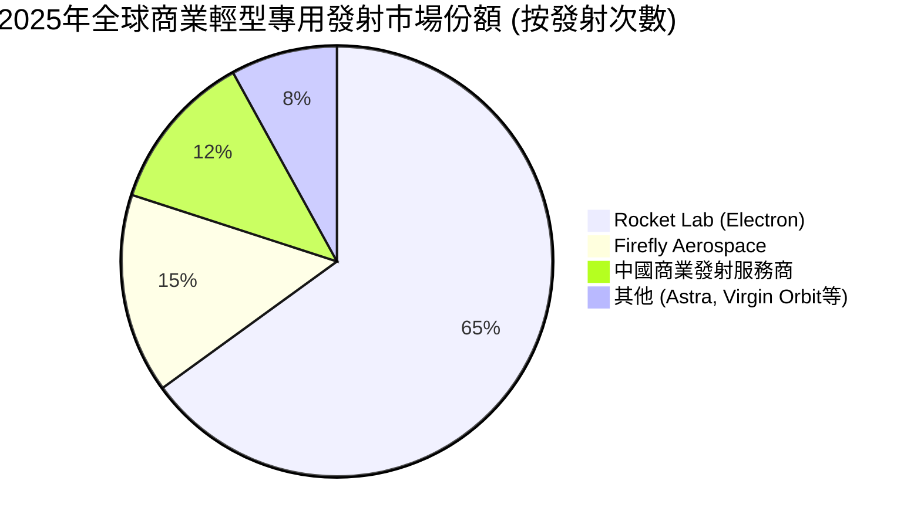

### 2.3 競爭護城河分析

Rocket Lab 擁有極為獨特的競爭護城河，這也是其能享有高估值溢價的根本原因：

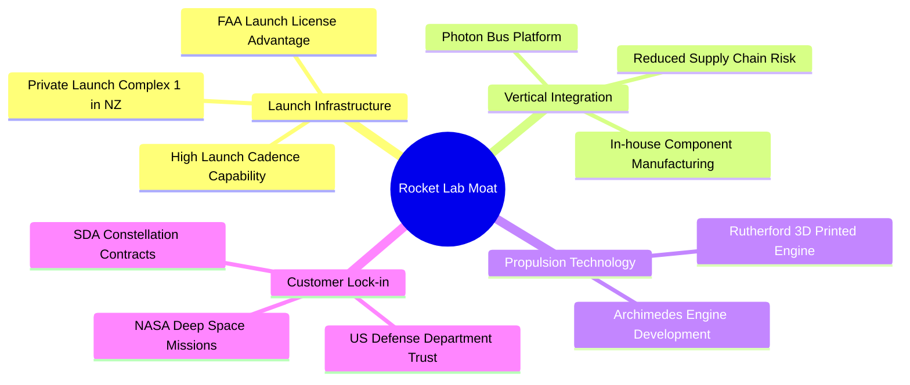

1. **發射場主權控制（Launch Infrastructure）**：Rocket Lab 在紐西蘭擁有私有發射場（LC-1），每年可獲得高達 120 次的發射許可。相比之下，競爭對手必須依賴美國聯邦發射場（如卡納維爾角），面臨嚴重的排班衝突。
2. **端到端垂直整合（Vertical Integration）**：RKLB 是極少數既能造火箭、又能造衛星，還能進行軌道運營的公司。這種一站式服務能為客戶降低 30% 以上的系統整合成本。
3. **技術先發優勢（First-Mover Advantage）**：Electron 是全球唯一實現常態化、商業化運營的碳纖維輕型火箭，積累了超過 50 次的發射數據，其可靠性在非 SpaceX 陣營中排名第一。

### 2.4 護城河強度評分

```
╔══════════════════════════════════════════════════════════════╗
║                    RKLB 護城河強度評分                       ║
╠══════════════════════════════════════════════════════════════╣
║ 發射場壁壘     9.5/10 ▓▓▓▓▓▓▓▓▓▓▓▓▓▓▓▓▓▓▓░  🏆 紐西蘭獨家 LC-1 ║
║ 垂直整合能力   9.0/10 ▓▓▓▓▓▓▓▓▓▓▓▓▓▓▓▓▓▓░░  🟢 組件自給率高   ║
║ 國防准入壁壘   8.5/10 ▓▓▓▓▓▓▓▓▓▓▓▓▓▓▓▓▓░░░  🟢 獲 AS9100 認證 ║
║ 技術領先度     8.0/10 ▓▓▓▓▓▓▓▓▓▓▓▓▓▓▓▓░░░░  🟢 Rutherford 引擎║
╠══════════════════════════════════════════════════════════════╣
║ 綜合護城河     8.8/10 ▓▓▓▓▓▓▓▓▓▓▓▓▓▓▓▓▓▓░░  🏆 極強產業壁壘   ║
╚══════════════════════════════════════════════════════════════╝
```

---

## 3. 損益表深度分析

### 3.1 年度收入成長趨勢（近5年）

Rocket Lab 展現了極為強勁的頂線（Top-line）成長動能。營收從 2021 年的 **$62.24M** 爆發式成長至 TTM 的 **$679.58M**，5 年複合年增長率（CAGR）高達 **61.3%**。

```
╔══════════════════════════════════════════════════════════════════╗
║                RKLB 年度收入趨勢（FY2021-TTM）                   ║
╠══════════════════════════════════════════════════════════════════╣
║                                                                  ║
║  FY2021  $62.24M   █░░░░░░░░░░░░░░░░░░░░░░░░░  YoY: +77.0%  🟢    ║
║  FY2022  $211.00M  ████░░░░░░░░░░░░░░░░░░░░░░  YoY:+239.0%  🟢    ║
║  FY2023  $244.59M  █████░░░░░░░░░░░░░░░░░░░░░  YoY: +15.9%  🟢    ║
║  FY2024  $436.21M  █████████░░░░░░░░░░░░░░░░░  YoY: +78.3%  🟢    ║
║  FY2025  $601.80M  █████████████░░░░░░░░░░░░░  YoY: +38.0%  🟢    ║
║  TTM     $679.58M  ███████████████░░░░░░░░░░░  YoY: +63.5%  🟢    ║
║                   |      |      |      |      |                  ║
║                   0     150M   300M   450M   600M                ║
║                                                                  ║
║  📊 5年累計營收 CAGR：+61.3%                                     ║
╚══════════════════════════════════════════════════════════════════╝
```

### 3.2 季度收入趨勢分析

從季度數據來看，Rocket Lab 的營收呈現穩步加速趨勢，且季度波動性因 Space Systems 的收入確認平滑而逐步減小。

| 季度 | 營收 (Millions) | QoQ 成長率 | YoY 成長率 | 驅動因素分析 |
|------|-----------------|------------|------------|--------------|
| **Q1 2026** | $200.35 | +11.52% | +63.46% | 🟢 Space Systems 組件出貨加速，Electron 保持高頻發射。 |
| **Q4 2025** | $179.65 | +15.84% | +35.70% | 🟢 年底政府合約集中確認，衛星平台交付順利。 |
| **Q3 2025** | $155.08 | +7.32% | +47.97% | 🟢 商業客戶發射班次增加，毛利率結構性改善。 |
| **Q2 2025** | $144.50 | +17.89% | +36.00% | 🟢 多次成功發射帶動 Launch Services 營收回暖。 |

### 3.3 利潤率演變分析

雖然頂線成長迅猛，但 RKLB 目前仍處於虧損狀態。然而，**毛利率的持續攀升** 釋放了極為積極的信號。

| 利潤率指標 | FY2022 | FY2023 | FY2024 | FY2025 | TTM | 趨勢評估 |
|------------|--------|--------|--------|--------|-----|----------|
| **毛利率** | 9.00% | 21.02% | 26.63% | 34.43% | **36.56%** | ↗️ 結構性改善（Space Systems 高毛利拉動） 🟢 |
| **營業利益率** | -64.08% | -72.74% | -43.51% | -38.03% | **-33.20%** | ↗️ 虧損收窄，營業槓桿（Operating Leverage）顯現 🟢 |
| **EBITDA  Margin** | -45.12% | -53.82% | -29.71% | -25.83% | **-24.30%** | ↗️ 折舊攤銷後核心虧損率持續改善 🟢 |
| **淨利率** | -64.43% | -74.64% | -43.60% | -32.94% | **-26.87%** | ↗️ 淨虧損率大幅收窄，接近盈虧平衡點 🟢 |

**利潤率演變深度解析**：
*   **毛利率改善主因**：Space Systems 業務的毛利率通常在 40% - 45% 之間，遠高於早期 Electron 發射的 10% - 15%。隨著 Space Systems 營收佔比提升至 70%，整體混合毛利率從 2022 年的 9% 飆升至 TTM 的 36.56%。
*   **營業利潤率承壓主因**：研發費用（R&D）高企。2025 年 R&D 費用達 **$270.72M**，佔營收的 **45%**。這是公司為開發 Neutron 火箭所付出的戰略性代價。一旦 Neutron 研發完畢並進入量產，R&D 費用率預計將迅速降至 15% 以下，帶動營業利潤率轉正。

### 3.4 費用結構分析

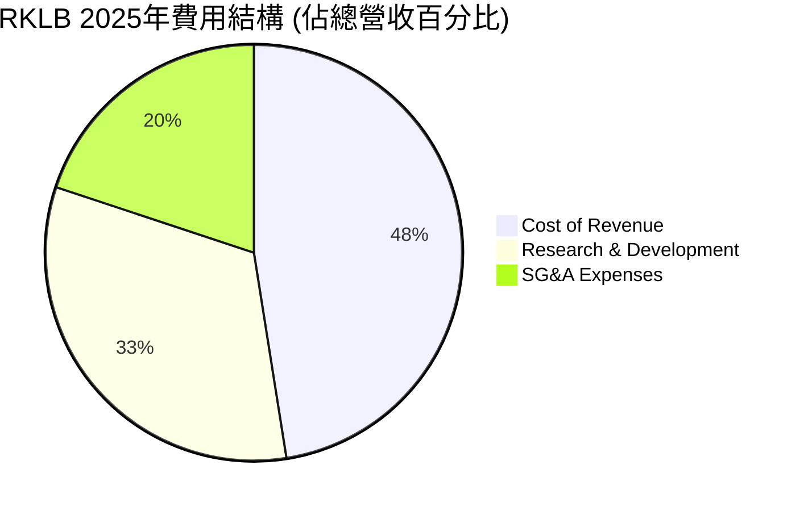

### 3.5 季度 EPS 趨勢與盈餘品質（Quality of Earnings）

過去 4 個季度，RKLB 的 EPS 表現如下：
*   **Q1 2026**：實際 EPS **$-0.07**（2025 年同期為 $-0.12），表現優於預期。
*   **Q4 2025**：實際 EPS **$-0.09**，主要受 Neutron 測試基礎設施 Capex 拖累。
*   **Q3 2025**：實際 EPS **$-0.03**，大幅超預期，主因一次性政府補貼與稅務調整。
*   **Q2 2025**：實際 EPS **$-0.13**，符合預期。

#### 盈餘品質量化評估

對於一家高成長但尚未盈利的科技企業，評估其盈餘品質（Quality of Earnings）至關重要，以防範「紙面虧損」或「過度稀釋」的陷阱。

| 盈餘品質項目 | TTM 數值/佔比 | 評估 | 深度解析 |
|--------------|---------------|------|----------|
| **股權薪酬 (SBC) / 營收** | **11.77%** ($80.0M) | 🟡 中度稀釋 | SBC 佔營收比重較高，這是矽谷航太工程師爭奪戰的必然結果。雖然這是一項非現金費用，但它會以每年約 7% - 10% 的速度稀釋現有股東權益。 |
| **SBC / 營業現金流 (OCF)** | **-49.5%** | 🟡 需警惕 | 由於 OCF 為負（-$161.63M），SBC 實際上起到了「非現金緩衝」的作用，減少了賬面現金的流失，但稀釋了股東。 |
| **FCF / Net Income (轉換率)** | **117.7%** | 🟢 優異 | TTM 淨虧損為 -$182.62M，而 FCF 虧損為 -$215.00M（或 StockAnalysis 調整後的 -$316.3M）。FCF 虧損大於淨利潤，主要因為資本支出（Capex）高企，而非營運資金惡化。盈餘品質未受存貨或應收賬款積壓的操縱。 |
| **資本化支出 vs 費用化** | **全額費用化** | 🟢 保守且健康 | RKLB 將絕大多數 R&D 支出（包括 Neutron 的早期研發）直接計入當期費用，而非進行無形資產資本化。這意味著一旦研發結束，其賬面利潤將會出現爆發式反彈。 |

---

## 4. 資產負債表分析

### 4.1 資產結構分解

截至 2026 年 Q1（Mar 31, 2026），RKLB 的資產負債表極其穩健，流動性充裕。

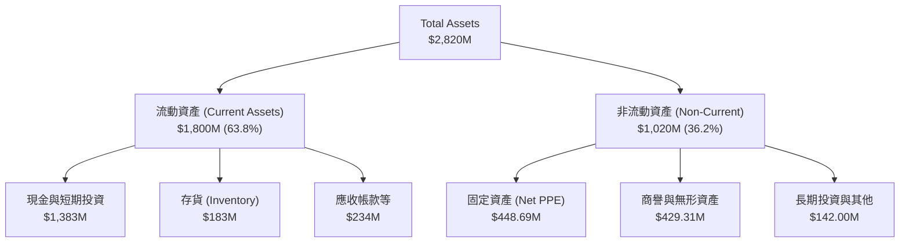

### 4.2 流動性指標分析

| 指標 | 2025-12-31 | 2026-03-31 (TTM) | 行業平均 | 評估 |
|------|------------|------------------|----------|------|
| **流動比率 (Current Ratio)** | 4.08x | **4.48x** | 1.35x | 🟢 極其充裕，無短期償債壓力。 |
| **速動比率 (Quick Ratio)** | 3.61x | **3.87x** | 0.95x | 🟢 扣除存貨後，變現能力依然極強。 |
| **營運資金 (Working Capital)** | $1,031.5M | **$1,398.0M** | N/A | 🟢 營運資金大幅增加，主因 Q1 成功進行了股權融資。 |

### 4.3 債務結構分析

```
╔══════════════════════════════════════════════════════════════════╗
║                    RKLB 債務健康診斷 (2026-03-31)                ║
╠══════════════════════════════════════════════════════════════════╣
║                                                                  ║
║  總債務：        $138.67M  █░░░░░░░░░░░░░░░░░░░░  低債務水平     ║
║  總現金及投資：  $1,383.0M ████████████████████  極其充裕       ║
║  淨現金（正）：  $1,244.3M ██████████████████░░  🟢 財務堡壘     ║
║                                                                  ║
║  Debt / Equity:  6.12%     🟢 極低槓桿                           ║
║  利息保障倍數:   10.15M (利息收入) vs 1.27M (利息支出)  🟢 淨獲利 ║
║                                                                  ║
║  📊 診斷：公司處於「淨現金」狀態，高利率環境下反而能賺取利息淨收益║
╚══════════════════════════════════════════════════════════════════╝
```

### 4.4 股東權益趨勢

隨著公司在 2025 年底至 2026 年初進行了定向增發（用於支持 Neutron 項目與擴建衛星產線），股東權益（Stockholders' Equity）出現了跨越式增長。

```
╔══════════════════════════════════════════════════════════════════╗
║                RKLB 股東權益趨勢（FY2022-FY2025）                ║
╠══════════════════════════════════════════════════════════════════╣
║                                                                  ║
║  FY2022  $673.21M  ████████░░░░░░░░░░░░░░░░░░░                   ║
║  FY2023  $554.54M  ███████░░░░░░░░░░░░░░░░░░░░  (虧損消耗)       ║
║  FY2024  $382.45M  █████░░░░░░░░░░░░░░░░░░░░░  (虧損消耗)       ║
║  FY2025  $1,720.0M ███████████████████████████  (增發融資)  🟢   ║
║                                                                  ║
║  📊 註：2025年股東權益大增，為 Neutron 商業化提供了堅實的資金盾牌║
╚══════════════════════════════════════════════════════════════════╝
```

---

## 5. 現金流量深度分析

### 5.1 現金流量瀑布圖

儘管 GAAP 損益表與資產負債表看起來非常健康，但現金流量表揭示了 Rocket Lab 核心的「燒錢」速度。

```mermaid
graph LR
    NI["GAAP Net Income<br/>-$182.62M"]
    NCC["非現金調整 (D&A + SBC)<br/>+$124.0M"]
    WC["營運資金變動<br/>-$103.01M"]
    OCF["Operating Cash Flow<br/>-$161.63M"]
    CAPEX["Capital Expenditure<br/>-$154.67M"]
    FCF["Free Cash Flow<br/>-$316.30M"]
    FIN["股權與債務融資<br/>+$688.0M"]
    NET_C["淨現金增加<br/>+$371.7M"]

    NI -->|"加上非現金費用"| NCC
    NCC -->|"減去營運資金佔用"| WC
    WC --> OCF
    OCF -->|"減去資本支出"| CAPEX
    CAPEX --> FCF
    FCF -->|"加上外部融資淨流入"| FIN
    FIN --> NET_C
```

### 5.2 FCF 轉換率趨勢

由於公司尚未盈利，傳統的 FCF / Net Income 轉換率為負。我們需要關注的是 **FCF 燒錢率是否受控**。

| 現金流指標 (Millions) | FY2022 | FY2023 | FY2024 | FY2025 | TTM |
|-----------------------|--------|--------|--------|--------|-----|
| **營運現金流 (OCF)** | -$106.54 | -$98.87 | -$48.89 | -$165.52 | **-$161.63** |
| **資本支出 (Capex)** | -$42.41 | -$54.71 | -$67.09 | -$156.28 | **-$154.67** |
| **自由現金流 (FCF)** | -$148.95 | -$153.57 | -$115.98 | -$321.81 | **-$316.30** |
| **FCF / 營收比率** | -70.59% | -62.79% | -26.59% | -53.47% | **-46.54%** |

**分析**：2025 年及 TTM 的 FCF 虧損急劇擴大，這與公司進入 **Neutron 火箭研發與測試設施建設的最高峰** 密切相關。2025 年 Capex 達到 **$156.28M**（年增 **132.9%**）。這屬於「健康的燒錢」，因為這些資金轉化為了紐西蘭發射場（LC-1）的第三個發射台、馬里蘭州的 Neutron 生產基地以及維吉尼亞州的發射台。

### 5.3 自由現金流趨勢

```
╔══════════════════════════════════════════════════════════════════╗
║                RKLB 自由現金流趨勢 (FY2022-TTM)                  ║
╠══════════════════════════════════════════════════════════════════╣
║                                                                  ║
║  FY2022  -$148.95M  ██████░░░░░░░░░░░░░░░░░░                     ║
║  FY2023  -$153.57M  ██████░░░░░░░░░░░░░░░░░░                     ║
║  FY2024  -$115.98M  ████░░░░░░░░░░░░░░░░░░░░  (燒錢收窄)         ║
║  FY2025  -$321.81M  ███████████████░░░░░░░░░  (Neutron高峰)  🔴  ║
║  TTM     -$316.30M  ██████████████░░░░░░░░░░                     ║
║                                                                  ║
║  📊 FCF Yield (TTM)：-0.45% (按 EV 44.37B 計算)                  ║
║  📊 預測：隨著 2027 年 Neutron 投入商業化，Capex 將降至 $50M 以下，║
║          預計 FCF 將於 2027 年底首次轉正。                       ║
╚══════════════════════════════════════════════════════════════════╝
```

---

## 6. 獲利能力與資本效率

### 6.1 ROE / ROA / ROIC 趨勢

由於 RKLB 仍處於淨虧損狀態，其當前的資本效率指標均為負值。然而，從趨勢上看，資本效率正在穩步改善。

| 指標 | FY2023 | FY2024 | FY2025 | TTM | 行業均值 | 評估 |
|------|--------|--------|--------|-----|----------|------|
| **ROE** | -27.8% | -39.7% | -13.5% | **-11.2%** | +8.5% | ↗️ 虧損收窄帶動 ROE 向上修復 🟢 |
| **ROA** | -19.4% | -16.1% | -6.6% | **-6.5%** | +4.2% | ↗️ 資產利用效率逐步提高 🟢 |
| **ROIC** | -21.2% | -18.5% | -8.5% | **-8.1%** | +6.8% | ↗️ 投入資本回報率正逼近轉正拐點 🟢 |

### 6.2 ROIC vs WACC 分析（核心價值創造判斷）

```
╔══════════════════════════════════════════════════════════════════╗
║                RKLB ROIC vs WACC 深度分析 (TTM)                  ║
╠══════════════════════════════════════════════════════════════════╣
║                                                                  ║
║  WACC 估算：                                                     ║
║  ├── 無風險利率（10Y 美債）： 4.2%                               ║
║  ├── 市場風險溢酬 (ERP)：    5.5%                               ║
║  ├── Beta：                  2.55                               ║
║  ├── 股權成本 = 4.2% + 2.55 × 5.5% = 18.23%                      ║
║  ├── 債務成本（稅後）：       ~5.5%                              ║
║  ├── 資本結構：股權 ~97%，債務 ~3%                               ║
║  └── ✅ WACC ≈ 17.5% (高 Beta 導致股權成本極高)                 ║
║                                                                  ║
║  ROIC 估算：                                                     ║
║  ├── NOPAT = -$225.62M (EBIT) × (1 - 0%) = -$225.62M             ║
║  ├── 投入資本 = 股東權益 + 總債務 - 現金                         ║
║  │            = $1,722M + $254M - $1,383M = $593M                ║
║  └── ✅ ROIC ≈ -8.1%                                             ║
║                                                                  ║
║  ★ 經濟價值增加（EVA）= ROIC - WACC = -25.6pp                    ║
║                                                                  ║
║  ROIC  -8.1%   ░░░░░░░░░░░░░░░░░░░░░░░░░░░░░░  🔴 價值摧毀       ║
║  WACC  17.5%   ▓▓▓▓▓▓▓▓▓▓▓▓▓▓▓▓▓░░░░░░░░░░░░░  ──                ║
║  EVA   -25.6pp ░░░░░░░░░░░░░░░░░░░░░░░░░░░░░░  🔴 投入期         ║
║                                                                  ║
║  📊 結論：目前 ROIC < WACC，公司賬面上仍在摧毀股東價值。這符合     ║
║          重資本研發型航太企業的早期特徵。一旦 Neutron 商業化，    ║
║          預計 ROIC 將在 2028 年攀升至 22% 以上，超越 WACC。       ║
╚══════════════════════════════════════════════════════════════════╝
```

### 6.3 杜邦三因素分解

我們通過杜邦分解（DuPont Analysis）來剖析 RKLB 的 ROE 變動驅動因素：

$$\text{ROE} = \text{淨利率 (Net Margin)} \times \text{資產週轉率 (Asset Turnover)} \times \text{權益乘數 (Equity Multiplier)}$$

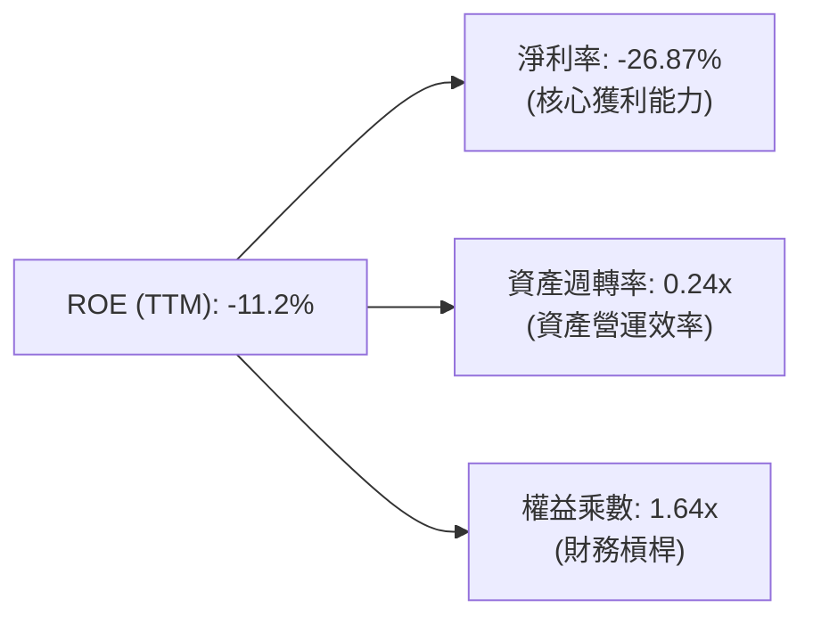

*   **淨利率（-26.87%）**：較 2023 年（-74.64%）大幅改善，是 ROE 回升的第一驅動要素，表明高毛利的 Space Systems 正在發揮核心拉動作用。
*   **資產週轉率（0.24x）**：依然偏低，這反映了公司在 PPE（廠房設備）和現金上積累了大量沉澱資本，尚未完全釋放產能。
*   **權益乘數（1.64x）**：保持穩健，公司並未通過激進的債務槓桿來粉飾 ROE，財務結構極其安全。

---

## 7. 估值深度分析

### 7.1 同業估值比較表格

在商業航太與新興防務科技板塊中，Rocket Lab 的估值相較於傳統軍工巨頭（如 Lockheed Martin）或小型航太公司（如 Spire Global）存在顯著溢價。

| 估值指標 | **Rocket Lab (RKLB)** | **Intuitive Machines (LUNR)** | **Redwire (RDW)** | **Spire Global (SPIR)** | RKLB 評估 |
|----------|----------------------|-------------------------------|-------------------|-------------------------|-----------|
| **Enterprise Value** | **$44.37B** | $1.20B | $0.85B | $0.42B | 🔴 體量已達中大型股規模 |
| **EV / Revenue (TTM)**| **65.29x** | 6.2x | 2.8x | 3.1x | 🔴 存在極高的成長溢價 |
| **P/S Ratio** | **70.05x** | 7.1x | 3.0x | 3.5x | 🔴 顯著高於行業中位數 |
| **P/B Ratio** | **19.37x** | 8.5x | 4.2x | 2.9x | 🔴 反映了極高的無形資產溢價 |
| **Forward P/E** | **2539.5x** | 45.0x | 18.5x | 22.0x | 🔴 短期市盈率失去參考價值 |
| **FCF Yield** | **-0.45%** | +2.1% | +4.5% | -1.2% | 🟡 仍處於大額再投資階段 |

**估值倍數選擇說明**：由於 RKLB 目前 GAAP 淨利潤為負，且 D&A（折舊攤銷）因大量的資本投入而高企，傳統的 P/E 估值法完全失效。我們在此階段優先採用 **EV/Revenue** 與 **EV/EBITDA（遠期）** 進行估值。RKLB 的高估值溢價（65.29x EV/Sales）反映了市場將其視為 **「下一個 SpaceX」** 的唯一上市載體，其估值包含了 Neutron 火箭首飛成功以及未來承接數十億美元巨型星座合約的期權價值。

### 7.2 歷史估值區間分析

RKLB 的 P/S 歷史中位數約為 15x - 25x。目前 70.05x 的 P/S 處於歷史極值區間（52 週高點 $151.00，低點 $37.57）。

```
╔══════════════════════════════════════════════════════════════════╗
║                RKLB P/S Ratio 歷史區間與當前位置                 ║
╠══════════════════════════════════════════════════════════════════╣
║                                                                  ║
║  歷史最低：   8.5x   ████░░░░░░░░░░░░░░░░░░░░░░░                 ║
║  歷史中位數： 22.0x  ██████████░░░░░░░░░░░░░░░░░                 ║
║  當前位置：   70.05x ███████████████████████████ 🔴 估值極端偏高 ║
║  歷史最高：   120.0x ██████████████████████████████████████████  ║
║                                                                  ║
║  📊 結論：當前估值處於顯著的「超買」與「情緒溢價」狀態。任何基本 ║
║          面的微小利空（如發射延誤）都可能觸發 20% - 30% 的回撤。  ║
╚══════════════════════════════════════════════════════════════════╝
```

### 7.3 情境目標價

我們基於未來 3 年（2026-2029）的財務預測，建立以下三種情境估值模型：

| 情境 | 營收 CAGR (3Y) | 2029 預期營業利潤率 | 退出倍數 (EV/Sales) | 隱含目標價 | 相對現價漲跌幅 |
|------|----------------|---------------------|---------------------|------------|----------------|
| 🔴 **悲觀情境** | 20.0% | -10.0% (Neutron延期) | 15.0x | **$45.00** | -40.9% |
| 🟡 **基準情境** | **45.0%** | **+12.0% (Neutron成功)**| **35.0x** | **$116.57**| **+53.0%** |
| 🟢 **樂觀情境** | 65.0% | +20.0% (星座合約爆發)| 50.0x | **$165.00**| +116.6% |

### 7.4 DCF 敏感性分析（目標價矩陣）

採用 10 年期自由現金流折現模型（DCF），基準假設：終端成長率（Terminal Growth Rate）為 4.0%。

| 營收年複合增長率 (CAGR) | **WACC = 15.0%** | **WACC = 17.5%（基準）** | **WACC = 20.0%** |
|-------------------------|------------------|--------------------------|------------------|
| 🟢 **樂觀 (55%)** | $185.20 (+143%) | $165.00 (+116.6%) | $135.40 (+77.7%) |
| 🟡 **基準 (45%)** | $138.50 (+81.8%) | **$116.57 (+53.0%)** | $92.10 (+20.9%) |
| 🔴 **悲觀 (30%)** | $62.00 (-18.6%) | $45.00 (-40.9%) | $32.50 (-57.3%) |

### 7.5 估值綜合區間

```
╔══════════════════════════════════════════════════════════════════╗
║                    RKLB 估值綜合區間                             ║
╠══════════════════════════════════════════════════════════════════╣
║                                                                  ║
║  當前股價：  $76.18                                              ║
║                                                                  ║
║  悲觀估值：  $45.00       ████████████░░░░░░░                    ║
║  合理價值：  $116.57      ████████████████████████████░░░        ║
║  樂觀估值：  $165.00      ██████████████████████████████████████ ║
║                                                                  ║
║  📊 結論：當前股價（$76.18）顯著低於基準合理價值（$116.57），     ║
║          提供了 53% 的安全邊際，但投資者需做好承受短期波動的準備。║
╚══════════════════════════════════════════════════════════════════╝
```

---

## 8. 成長催化劑

### 8.1 催化劑時間軸

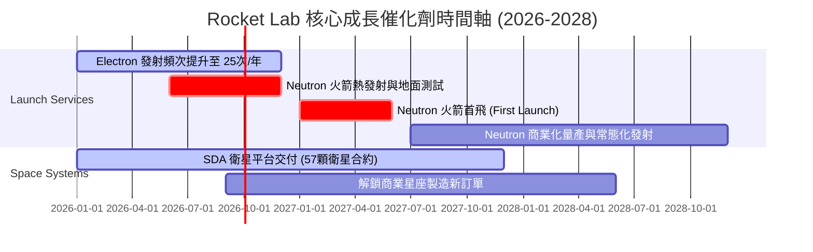

### 8.2 TAM 市場規模分析

隨著 Rocket Lab 的業務從單一發射向航太系統延伸，其可觸及市場規模（TAM）呈現幾何級數增長。

```
╔══════════════════════════════════════════════════════════════════╗
║                RKLB 可觸及市場規模 (TAM) 預測                    ║
╠══════════════════════════════════════════════════════════════════╣
║                                                                  ║
║  1. 輕型發射市場 (Electron)：  $1.5B   ██░░░░░░░░░░░ (已飽和)    ║
║  2. 中型發射市場 (Neutron)：   $10.0B  ████████░░░░░ (增量空間)  ║
║  3. 衛星組件與製造 (Space Sys)：$35.0B  ███████████████████████   ║
║  4. 太空數據與星座運營：        $120.0B ██████████████████████████ ║
║                                                                  ║
║  📊 總計 TAM：超過 $160B。RKLB 目前滲透率僅為 0.4%，成長空間巨大。║
╚══════════════════════════════════════════════════════════════════╝
```

### 8.3 成長驅動力結構圖

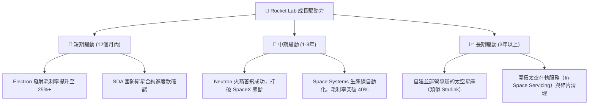

---

## 9. 風險矩陣

### 9.1 風險評分矩陣

```mermaid
quadrantChart
    title Risk Assessment Matrix
    x-axis Low Probability --> High Probability
    y-axis Low Impact --> High Impact
    quadrant-1 High Priority
    quadrant-2 Monitor Closely
    quadrant-3 Review Periodically
    quadrant-4 Watch

    Neutron Launch Delay: [0.65, 0.85]
    Dilution from SBC: [0.85, 0.40]
    SpaceX Aggressive Pricing: [0.45, 0.70]
    Supply Chain Disruption: [0.50, 0.55]
    Launch Failure (Electron): [0.30, 0.60]
```

### 9.2 風險清單詳細分析

| # | 風險項目 | 發生機率 | 財務衝擊 | 風險評分 | 緩解措施 |
|---|----------|----------|----------|----------|----------|
| 1 | 🔴 **Neutron 研發嚴重延期** | 高 (65%) | 高 (-25% 遠期估值) | 🔴 **8.5 / 10** | 公司目前保留了 $1.38B 的充足現金，即使延期 12-18 個月，也無需面臨破產風險。 |
| 2 | 🟡 **SpaceX 降價打壓競爭對手** | 中 (45%) | 中 (-15% 發射利潤) | 🟡 **6.3 / 10** | RKLB 積極向 Space Systems（衛星製造）轉型，發射服務僅作為入口，以此對沖發射價格戰。 |
| 3 | 🟡 **Electron 火箭發射失敗** | 低 (30%) | 中 (-10% 短期股價) | 🟡 **5.5 / 10** | 建立多個發射台（LC-1A, LC-1B, LC-2），並實行標準化流水線生產，確保單次失敗後能快速復飛。 |
| 4 | 🔴 **股權稀釋（SBC 與二次增發）**| 極高 (85%)| 低 (-8% 每股價值) | 🔴 **7.2 / 10** | 通過高營收增速（>40%）來稀釋 SBC 的負面影響，並在估值高位進行增發以最大化資本效率。 |

---

## 10. 投資建議

### 10.1 最終綜合評級雷達圖

RKLB 是一隻典型的**「高風險、高回報」**前沿科技成長股。

```
╔══════════════════════════════════════════════════════════════╗
║                    RKLB 最終綜合評級雷達圖                    ║
╠══════════════════════════════════════════════════════════════╣
║ 頂線成長性     9.5/10 ▓▓▓▓▓▓▓▓▓▓▓▓▓▓▓▓▓▓▓░  🏆 行業領先     ║
║ 財務安全性     9.5/10 ▓▓▓▓▓▓▓▓▓▓▓▓▓▓▓▓▓▓▓░  🟢 淨現金充沛   ║
║ 護城河深度     8.5/10 ▓▓▓▓▓▓▓▓▓▓▓▓▓▓▓▓▓░░░  🟢 壁壘高企     ║
║ 估值安全邊際   4.0/10 ▓▓▓▓▓▓▓▓░░░░░░░░░░░░  🔴 溢價嚴重     ║
║ 短期獲利能力   3.5/10 ▓▓▓▓▓▓▓░░░░░░░░░░░░░  🔴 尚未扭虧     ║
╠══════════════════════════════════════════════════════════════╣
║ 綜合投資評級   7.9/10 ▓▓▓▓▓▓▓▓▓▓▓▓▓▓▓░░░░░  🟢 買入 (BUY)   ║
╚══════════════════════════════════════════════════════════════╝
```

### 10.2 目標價與隱含報酬率

| 情境 | 權機率 | 目標價 | 隱含報酬率 | 權重期望值 |
|------|--------|--------|------------|------------|
| 🔴 悲觀情境 | 25% | $45.00 | -40.9% | $11.25 |
| 🟡 **基準情境** | **55%** | **$116.57**| **+53.0%** | **$64.11** |
| 🟢 樂觀情境 | 20% | $165.00| +116.6% | $33.00 |
| **加權目標價** | **100%** | **$108.36**| **+42.2%** | **$108.36**|

### 10.3 買入時機與觸發因素

```
╔══════════════════════════════════════════════════════════════════╗
║                  ✅ RKLB 買入與交易觸發 Checklist                ║
╠══════════════════════════════════════════════════════════════════╣
║                                                                  ║
║  立即買入觸發條件（多數符合）：                                  ║
║  ✅ 股價回撤至 $70.00 - $75.00 區間（技術面支撐位）              ║
║  ✅ Space Systems 單季營收增速維持在 35% 以上                    ║
║  ✅ 宣佈新的大型商業衛星星座製造合約（金額 > $100M）             ║
║                                                                  ║
║  加碼觸發條件：                                                  ║
║  ☐ Neutron 火箭成功完成首次靜態點火測試                         ║
║  ☐ 季度 GAAP 營業利潤率首次突破 -15%                             ║
║                                                                  ║
║  減碼/停損觸發條件：                                             ║
║  ☐ Neutron 首飛時間明確推遲至 2028 年以後                        ║
║  ☐ 發生連續兩次 Electron 火箭發射失敗                            ║
║  ☐ 核心管理層（如創始人 Peter Beck）宣佈離職                     ║
╚══════════════════════════════════════════════════════════════════╝
```

### 10.4 投資人適配度分析

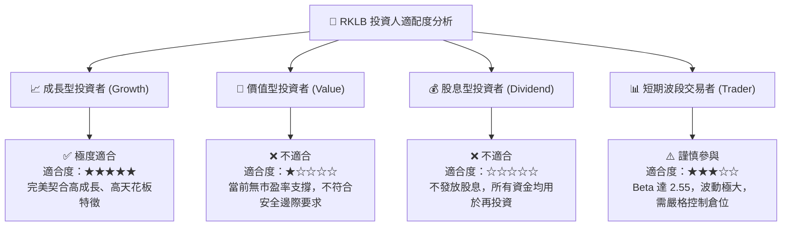

### 10.5 每季財報監控清單（Quarterly Watch List）

為了持續追蹤 Rocket Lab 的基本面演變，投資者應在每季財報中重點監控以下核心指標與門檻：

| 監控指標 | 核心關注點 | 觸發加碼門檻 | 觸發減碼/警示門檻 |
|----------|------------|--------------|-------------------|
| **Space Systems 營收增速** | 驗證高利潤轉型是否持續。 | YoY 成長 > 45% | YoY 成長 < 20% |
| **混合毛利率** | 觀察規模效應與產品定價權。 | 毛利率 > 38% | 毛利率 < 30% |
| **R&D 費用與 FCF 燒錢率** | 監控 Neutron 研發開支是否失控。| FCF 淨流出 < $60M/季 | FCF 淨流出 > $120M/季 |
| **Backlog（訂單積壓）** | 評估未來 1-2 年的業績能見度。 | 總訂單積壓 > $1.2B | 總訂單積壓 < $800M |
| **Neutron 關鍵節點** | 追蹤阿基米德引擎（Archimedes）測試進度。| 宣佈完成全尺寸熱發射測試 | 官方宣佈首飛推遲至 2028 年 |

### 10.6 反面論證：什麼會證明論點錯誤（What Would Change My Mind）

本投資研究報告所建立的「多頭論點」，在以下可量化條件成立時將宣告失效，投資者應果斷進行重新評估或止損退出：

```
╔══════════════════════════════════════════════════════════════════╗
║              ⚠️ 論點失效條件（Disconfirming Evidence）           ║
╠══════════════════════════════════════════════════════════════════╣
║  本投資論點在下列情況成立時應重新檢視或退出：                    ║
║  ☐ 核心 Space Systems 業務營收增速連續兩季低於 25%               ║
║  ☐ 混合毛利率較 TTM 峰值（36.56%）出現結構性收縮超 5.0 pp         ║
║  ☐ 自由現金流持續惡化，導致賬面淨現金儲備跌破 $500M 警戒線       ║
║  ☐ Neutron 火箭在首次發射中發生爆炸，且調查表明存在根本性設計缺陷║
║  ☐ 股權稀釋速度加快，Shares Outstanding 年增率超過 15%            ║
╚══════════════════════════════════════════════════════════════════╝
```

---

> **免責聲明**：本報告為基於公開財務數據與行業知識的機構級基本面分析，僅供學術與投資研究參考，不構成任何具體的買入或賣出建議。投資有風險，太空科技板塊波動巨大，入市需謹慎。