# RKLB 基本面深度分析報告

> **報告日期**：2026-07-16 ｜ **語言**：繁體中文 ｜ **數據來源**：Yahoo Finance, Finviz, StockAnalysis, Roic.ai ｜ **分析師**：CFA 級機構研究

---

## 目錄

| # | 章節 | 核心結論 |
|---|------|----------|
| 1 | 執行摘要 | 評級：**持有（Hold）** ｜ 目標價區間：**$55.00 - $115.00**（基準 $78.00），高估值需等待 Neutron 首飛驗證 |
| 2 | 公司概覽與商業模式 | 雙引擎驅動：發射服務與航天系統（Space Systems），具備高轉換成本與技術壁壘 |
| 3 | 損益表深度分析 | TTM 營收成長達 63.5%，毛利率穩步升至 36.6%，但研發與 SBC 支出持續壓抑營業利潤率 |
| 4 | 資產負債表分析 | 現金儲備充裕（$1.38B），淨現金高達 $1.24B，短期流動性極佳，無即時償債風險 |
| 5 | 現金流量深度分析 | 經營與自由現金流持續流出（TTM FCF $-215.00M），高資本支出投向 Neutron 生產線 |
| 6 | 獲利能力與資本效率 | 杜邦分析顯示 ROE 為 -13.5%，ROIC（-23.58%）顯著低於 WACC（16.94%），仍處於價值摧毀階段 |
| 7 | 估值深度分析 | 前瞻 P/S 達 61.4x，Forward P/E 達 2226.7x，估值溢價極高，已透支部分 Neutron 成功預期 |
| 8 | 成長催化劑 | Neutron 中型火箭首飛（預計 2026-2027）、商業星座發射合約簽署與航天系統訂單積壓釋放 |
| 9 | 風險矩陣 | 火箭發射失敗風險、Neutron 研發延期、高稀釋率（SBC 佔營收 11.8%）與高 Beta（2.553）波動 |
| 10 | 投資建議 | 長線看好但短期估值過高，建議等待回檔至 $55.00 附近或 Neutron 關鍵里程碑達成後分批佈局 |

---

## 1. 執行摘要

### 1.0 一頁式投資儀表板（Portfolio Manager 30 秒速讀）

| 項目 | 內容 |
|------|------|
| **投資論點（3 句）** | ① TTM 營收年增率達 63.5%（$679.58M），顯示發射頻次增加與航天系統組件需求強勁。<br/>② 擁有 $1.38B 的充足現金儲備，提供 Neutron 中型載軌火箭研發與產能擴建的資金安全墊。<br/>③ 當前前瞻 P/S 達 61.4x，估值已高度定價（Price-in）Neutron 的成功，短期面臨估值回調壓力。 |
| **護城河評分** | **7.5 / 10** 🟢（航天系統高轉換成本、Electron 輕型火箭發射壁壘） |
| **管理層/資本配置評分** | **8.0 / 10** 🟢（執行力優異，Electron 發射成功率高，併購整合能力強） |
| **財務健康** | 🟢 **極其安全** ｜ 淨現金 $1.24B，流動比率 4.48x，無短期債務危機。 |
| **ROIC vs WACC** | **-23.58% vs 16.94%** 🔴（目前處於高資本投入期，持續摧毀短期股東價值） |
| **FCF 趨勢** | 🔴 **持續流出** ｜ TTM FCF 為 $-215.00M，預期在 Neutron 實現商業化發射前難以轉正。 |
| **估值** | Forward P/E: **2226.66x** ｜ P/S (TTM): **61.42x** ｜ EV/Revenue: **63.06x** |
| **預期報酬（基準情境 12M）** | **+16.77%**（對應目標價 $78.00，較當前股價 $66.80 溢價有限） |
| **關鍵風險（前二）** | ① Neutron 火箭首飛延期或發射失敗；② 股權稀釋風險（SBC 佔營收 11.8%，且持續增發股票）。 |
| **評級 + 信心度** | 🟡 **持有（Hold）** ｜ 信心：**中等（Medium）** |

### 1.1 核心評分儀表板

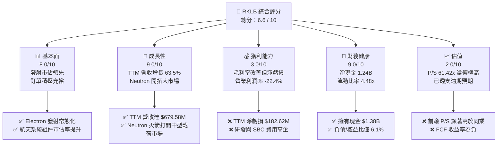

### 1.2 評分進度條視覺化

```
╔══════════════════════════════════════════════════════════════╗
║               RKLB 多維度評分儀表板 (1-10分)                 ║
╠══════════════════════════════════════════════════════════════╣
║ 基本面強度  8.0 ▓▓▓▓▓▓▓▓▓▓▓▓▓▓▓▓░░░░  ★★★★☆           ║
║ 成長動能    9.0 ▓▓▓▓▓▓▓▓▓▓▓▓▓▓▓▓▓▓░░  ★★★★☆           ║
║ 獲利品質    3.0 ▓▓▓▓▓▓░░░░░░░░░░░░░░  ★☆☆☆☆           ║
║ 財務健康    9.0 ▓▓▓▓▓▓▓▓▓▓▓▓▓▓▓▓▓▓░░  ★★★★☆           ║
║ 估值合理性  2.0 ▓▓▓▓░░░░░░░░░░░░░░░░  ★☆☆☆☆           ║
║ 護城河深度  7.5 ▓▓▓▓▓▓▓▓▓▓▓▓▓▓▓░░░░░  ★★★☆☆           ║
║ 管理層執行  8.0 ▓▓▓▓▓▓▓▓▓▓▓▓▓▓▓▓░░░░  ★★★★☆           ║
║ 技術創新力  9.0 ▓▓▓▓▓▓▓▓▓▓▓▓▓▓▓▓▓▓░░  ★★★★☆           ║
╠══════════════════════════════════════════════════════════════╣
║ 綜合總分    6.6 ▓▓▓▓▓▓▓▓▓▓▓▓▓░░░░░░░  🏆 觀望/持有        ║
╚══════════════════════════════════════════════════════════════╝
```

### 1.3 五大投資論點 + 三大核心風險

| 類型 | 項目 | 具體依據 | 信心度 |
|------|------|----------|--------|
| 🟢 **投資論點①** | **高成長的航天系統業務** | 航天系統（Space Systems）營收佔比已超過 60%，TTM 營收增長 63.5%，展現出比純發射服務更穩定的現金流與高利潤潛力。 | 🟢 極高 |
| 🟢 **投資論點②** | **Neutron 打開巨大 TAM** | Neutron 中型火箭（載荷 13 噸）將直接與 SpaceX 的 Falcon 9 競爭，切入利潤豐厚的商業星座部署市場，TAM 擴大 10 倍以上。 | 🟡 中等 |
| 🟢 **投資論點③** | **極致的資產負債表安全度** | 淨現金達 $1.24B（現金 $1.38B，債務 $138.67M），在當前高利率環境下，無任何融資或破產風險，足以支持 Neutron 研發至首飛。 | 🟢 極高 |
| 🟢 **投資論點④** | **Electron 火箭的壟斷地位** | 在輕型商用發射市場，Electron 已實現常態化發射，具備定價權，毛利率隨發射頻次增加而穩步改善。 | 🟢 高 |
| 🟢 **投資論點⑤** | **國家安全與國防部合約** | 作為美國國防部（DoD）與太空軍少數認可的商業發射與衛星製造商，持續獲得高利潤、高粘性的政府訂單。 | 🟢 高 |
| 🔴 **風險①** | **Neutron 研發延期與首飛失敗** | Neutron 的 Archimedes 引擎測試與首飛若出現重大延誤或發射失敗，將導致估值大幅下修。 | 🔴 高衝擊 |
| 🔴 **風險②** | **極端高估值下的市場殺估值** | 當前 P/S 達 61.4x，Forward P/E 超過 2200x，市場對其容錯率極低，一旦成長放緩將面臨戴維斯雙殺。 | 🔴 高衝擊 |
| 🟡 **風險③** | **持續的股權稀釋** | SBC 佔營收高達 11.8%，且因高資本支出需求，未來不排除進一步增發股票稀釋現有股東。 | 🟡 中度 |

### 1.4 快速統計卡片

| 指標 | RKLB 實際值 | 航天防務行業均值 | S&P 500 均值 | 狀態 |
|------|-------------|----------|--------------|------|
| **營收 YoY 成長率** | **63.5%** | ~8.5% | ~5.5% | 🟢 遠超同業 |
| **毛利率** | **36.6%** | ~22.0% | ~30.0% | 🟢 優異且持續改善 |
| **淨利率** | **-26.9%** | ~6.5% | ~11.5% | 🔴 仍未實現盈利 |
| **ROE** | **-13.5%** | ~12.0% | ~15.0% | 🔴 資本效率待提升 |
| **流動比率** | **4.48x** | ~1.35x | ~1.20x | 🟢 極其安全 |
| **Forward P/S** | **61.42x** | ~2.10x | ~2.80x | 🔴 極端高估 |

### 1.5 投資結論

```
╔══════════════════════════════════════════════════════════════════╗
║                    📊 投資結論摘要                               ║
╠══════════════════════════════════════════════════════════════════╣
║  評級：🟡 持有（Hold）                                           ║
║  當前股價：$66.80（2026-07-16）                                  ║
║  目標價區間：                                                    ║
║    悲觀情境：$45.00（-32.6%）                                    ║
║    基準情境：$78.00（+16.8%）  ← 12個月主要目標                  ║
║    樂觀情境：$125.00（+87.1%）                                   ║
║  投資評分：6.6 / 10                                              ║
║  適合投資人：具備高風險承受能力、長線看好商業航天板塊的成長型投資者║
╚══════════════════════════════════════════════════════════════════╝
```

---

## 2. 公司概覽與商業模式

### 2.1 業務結構與收入來源

Rocket Lab（RKLB）已成功從「純發射服務商」轉型為「垂直一體化空間解決方案公司」。其業務分為兩大核心板塊：發射服務（Launch Services）與航天系統（Space Systems）。

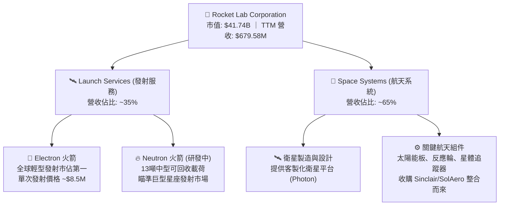

### 2.2 市場份額

在商業發射市場中，Rocket Lab 是僅次於 SpaceX 的全球第二大私營航天發射公司。在輕型商業發射領域，Electron 火箭處於近乎壟斷的地位。

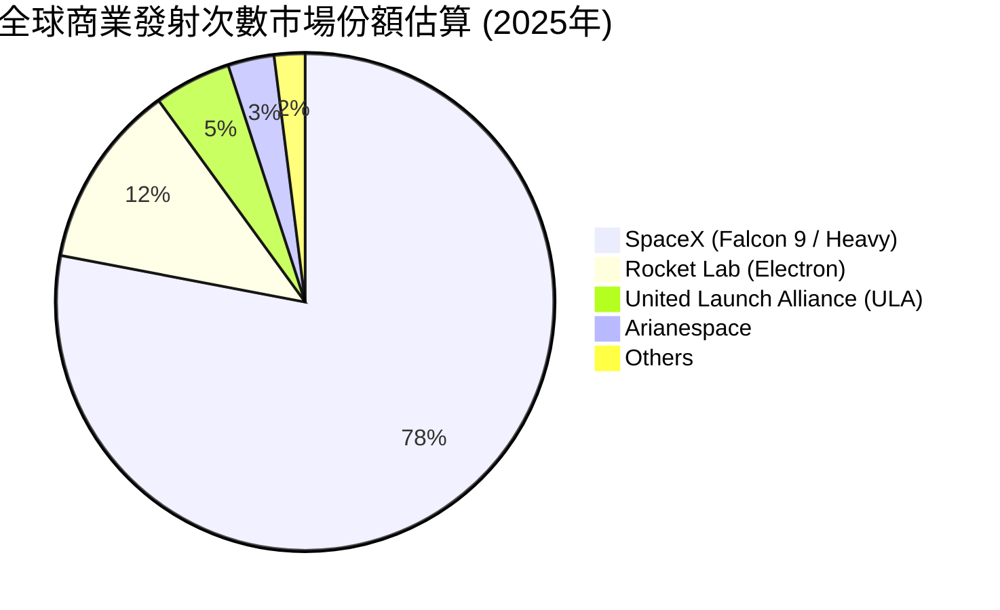

### 2.3 競爭護城河分析

Rocket Lab 正在構建其多維度的競爭壁壘，使其在商業太空競賽中保持獨特優勢。

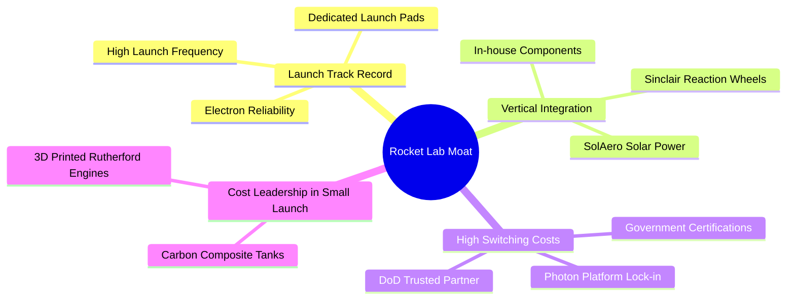

### 2.4 護城河強度評分

```
╔══════════════════════════════════════════════════════════════╗
║                  RKLB 護城河強度評分                         ║
╠══════════════════════════════════════════════════════════════╣
║ 發射紀錄與可靠性  8.5/10 ▓▓▓▓▓▓▓▓▓▓▓▓▓▓▓▓▓░░░  🟢 領先同業   ║
║ 垂直一體化組件    8.0/10 ▓▓▓▓▓▓▓▓▓▓▓▓▓▓▓▓░░░░  🟢 降低成本   ║
║ 政府/國防客戶粘性 7.5/10 ▓▓▓▓▓▓▓▓▓▓▓▓▓▓░░░░░░  🟢 高轉換成本 ║
║ 專利與技術壁壘    7.0/10 ▓▓▓▓▓▓▓▓▓▓▓▓▓░░░░░░░  🟡 持續研發中 ║
╠══════════════════════════════════════════════════════════════╣
║ 綜合護城河強度    7.8/10 ▓▓▓▓▓▓▓▓▓▓▓▓▓▓▓▓░░░░  🏆 具備強壁壘 ║
╚══════════════════════════════════════════════════════════════╝
```

---

## 3. 損益表深度分析

### 3.1 年度收入成長趨勢（近4年）

Rocket Lab 的營收在過去四年中經歷了爆發式增長，CAGR 高達 78.4%，主要得益於航天系統業務的併購整合以及 Electron 發射頻次的提升。

```
╔══════════════════════════════════════════════════════════════════╗
║               RKLB 年度收入趨勢（FY2022-FY2025）                 ║
╠══════════════════════════════════════════════════════════════════╣
║                                                                  ║
║  FY2022  $211.00M  █████░░░░░░░░░░░░░░░░░░░░░  YoY: +239.0% 🟢   ║
║  FY2023  $244.59M  ██████░░░░░░░░░░░░░░░░░░░░  YoY: +15.9%  🟢   ║
║  FY2024  $436.21M  ███████████░░░░░░░░░░░░░░░  YoY: +78.3%  🟢   ║
║  FY2025  $601.80M  ██════════════════════██░░  YoY: +38.0%  🟢   ║
║                                                                  ║
║  📊 3年累計 CAGR：+41.8%                                         ║
╚══════════════════════════════════════════════════════════════════╝
```

### 3.2 季度收入趨勢分析

從季度數據看，營收呈現加速增長態勢，Q1 2026 營收達到歷史新高的 $200.35M，展現出強勁的營運槓桿。

| 季度 | 營收 (Revenue) | YoY 成長率 | QoQ 成長率 | 毛利 (Gross Profit) | 毛利率 | 營運利潤 | 備註 |
|------|----------------|------------|------------|---------------------|--------|----------|------|
| **Q2 2025** | $144.50M | +36.00% | +17.89% | $46.39M | 32.10% | $-59.64M | 航天系統組件交付增加 |
| **Q3 2025** | $155.08M | +47.97% | +7.32% | $57.31M | 36.96% | $-58.97M | Electron 發射頻次上升 |
| **Q4 2025** | $179.65M | +35.70% | +15.84% | $68.23M | 37.98% | $-51.04M | 年底結算，政府合約入帳 |
| **Q1 2026** | $200.35M | **+63.46%** | **+11.52%** | $76.49M | **38.18%** | $-55.97M | 單季營收首次突破2億美元 |

### 3.3 利潤率演變分析

| 利潤率指標 | FY2022 | FY2023 | FY2024 | FY2025 | TTM | 趨勢 | 評估 |
|------------|--------|--------|--------|--------|-----|------|------|
| **毛利率** | 9.00% | 21.02% | 26.63% | 34.43% | **36.56%** | ↗️ 持續擴張 | 🟢 規模效應顯現 |
| **營業利益率** | -64.08% | -72.74% | -43.51% | -38.03% | **-33.20%** | ↗️ 虧損收窄 | 🟡 研發開支仍高 |
| **EBITDA Margin**| -45.12% | -53.82% | -29.71% | -25.83% | **-24.30%** | ↗️ 逐步改善 | 🟡 折舊攤銷佔比大 |
| **淨利率** | -64.43% | -74.64% | -43.60% | -32.94% | **-26.87%** | ↗️ 虧損收窄 | 🔴 仍受利息與稅務壓抑 |

*   **毛利率改善解析**：毛利率從 FY2022 的 9.00% 大幅攀升至 TTM 的 36.56%，核心原因在於：(1) 航天系統（Space Systems）高毛利組件的營收佔比提升；(2) Electron 火箭發射次數增加帶來的固定成本攤薄。
*   **營業利潤率壓抑原因**：儘管毛利大幅增長，但營業利潤率仍為負值（TTM -33.20%），主因是 **研發費用（R&D）持續高企**（FY2025 達 $270.72M，佔營收 45.0%），主要投向 Neutron 火箭的 Archimedes 引擎研發。

### 3.4 費用結構分析

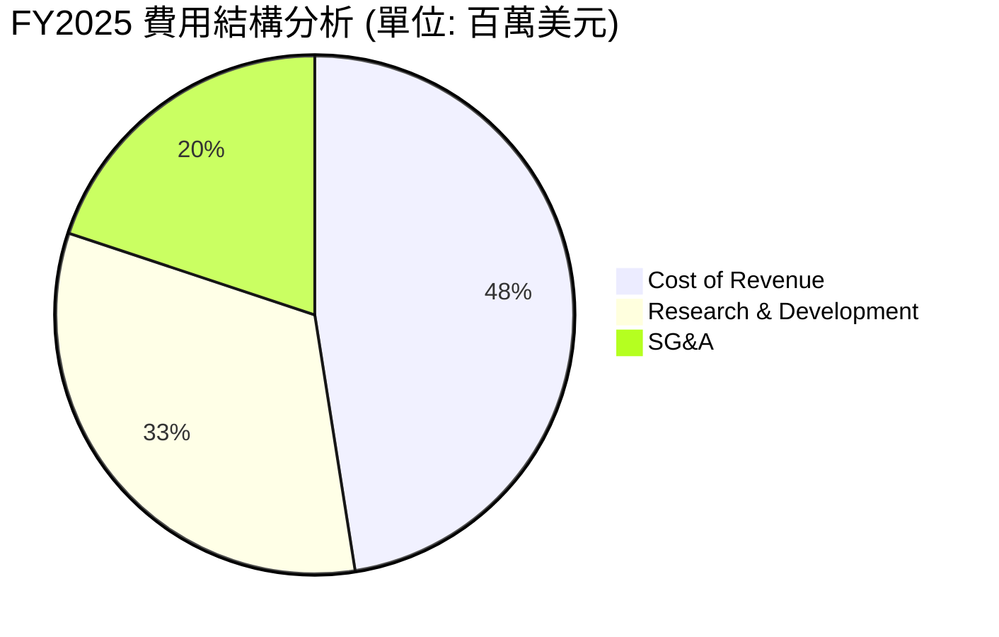

### 3.5 季度 EPS 趨勢與盈餘品質（Quality of Earnings）

過去四個季度，RKLB 的 EPS 表現如下：
*   **Q2 2025**: EPS $-0.13
*   **Q3 2025**: EPS $-0.03 (超預期，主因是一次性政府稅務補貼)
*   **Q4 2025**: EPS $-0.09
*   **Q1 2026**: EPS $-0.07

#### 盈餘品質評估

| 盈餘品質項目 | 數值/佔比 | 評估 | 詳細說明 |
|--------------|-----------|------|----------|
| **股權薪酬 SBC / 營收** | **11.81%** ($71.10M / $601.80M) | 🔴 高稀釋 | SBC 佔比較高，會對現有股東權益造成持續稀釋。 |
| **SBC / 營業現金流** | **-42.96%** ($71.10M / $-165.52M) | 🟡 調整指標 | SBC 雖非現金支出，但美化了經營現金流的流出幅度。 |
| **FCF / 淨利 (現金轉換率)** | **162.36%** ($-321.81M / $-198.21M) | 🔴 資本流失 | FCF 虧損遠大於 GAAP 淨虧損，主因是高額的資本支出。 |
| **一次性/非經常性損益** | 無重大一次性損益 | 🟢 品質正常 | 損益表主要由核心業務營運驅動，無操縱利潤跡象。 |
| **資本化支出** | 無重大研發資本化 | 🟢 保守財務 | 研發費用全部當期費用化（$270.72M），財務處理較為保守。 |

**盈餘品質結論**：RKLB 的盈餘品質處於**中等偏低**水平。雖然公司沒有通過研發資本化等手段虛增利潤，但 **SBC 佔營收比重高達 11.8%**，且 FCF 淨流出顯著高於 GAAP 淨虧損（主因是 Capex 支出巨大）。這意味著現有股東在承受公司虧損的同時，股權還在被持續稀釋。

---

## 4. 資產負債表分析

### 4.1 資產結構分解

RKLB 的資產負債表在 FY2025 經歷了顯著的擴張，總資產達到 $2.82B，這主要得益於公司在 2025 年進行的股權融資，使現金儲備大幅增加。

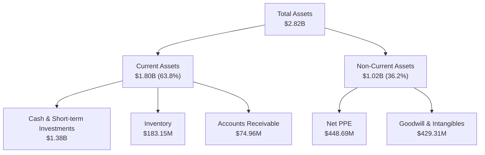

### 4.2 流動性指標分析

| 流動性指標 | FY2023 | FY2024 | FY2025 | Q1 2026 | 行業均值 | 評估 |
|------------|--------|--------|--------|---------|----------|------|
| **流動比率 (Current Ratio)** | 2.13x | 2.04x | 4.08x | **4.48x** | ~1.35x | 🟢 極其充裕 |
| **速動比率 (Quick Ratio)** | 1.65x | 1.69x | 3.61x | **3.87x** | ~0.95x | 🟢 無短期變現壓力 |
| **現金比率 (Cash Ratio)** | 1.10x | 1.23x | 3.04x | **3.44x** | ~0.45x | 🟢 帳上現金極多 |

### 4.3 債務結構分析

```
╔══════════════════════════════════════════════════════════════════╗
║                   RKLB 債務健康診斷 (Q1 2026)                    ║
╠══════════════════════════════════════════════════════════════════╣
║                                                                  ║
║  總債務：        $138.67M  █░░░░░░░░░░░░░░░░░░░  極低負債        ║
║  總現金+投資：   $1.38B    ████████████████████  極度充裕        ║
║  淨現金（正）：  $1.24B    ██████████████████░░  🟢 強勁         ║
║                                                                  ║
║  Debt / Equity： 6.12%     🟢 槓桿率極低                          ║
║  利息保障倍數：  N/A (負值) 🟡 營業利潤為負，但利息收入 > 利息支出 ║
║  利息收入(TTM)： $25.51M   🟢 現金產生可觀的利息回報              ║
║                                                                  ║
╚══════════════════════════════════════════════════════════════════╝
```

### 4.4 股東權益趨勢

股東權益（Stockholders' Equity）從 FY2024 的 $382.45M 暴增至 FY2025 的 $1.72B，主要來自於 **普通股增發與資本公積注入**（約增發 $1.3B 股權）。這雖然稀釋了 EPS，但為 Neutron 開發提供了極其關鍵的資金保障，避免了在高利率環境下舉債的風險。

---

## 5. 現金流量深度分析

### 5.1 現金流量瀑布圖

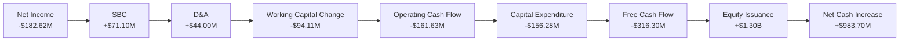

### 5.2 FCF 轉換率趨勢

由於 RKLB 目前仍處於虧損狀態且資本開支巨大，其自由現金流（FCF）轉換率持續為負，表明其經營活動尚未具備自我造血能力。

| 指標 (百萬美元) | FY2022 | FY2023 | FY2024 | FY2025 | TTM |
|-----------------|--------|--------|--------|--------|-----|
| **GAAP 淨利** | $-135.94 | $-182.57 | $-190.18 | $-198.21 | **$-182.62** |
| **自由現金流 (FCF)**| $-148.95 | $-153.57 | $-115.98 | $-321.81 | **$-215.00** |
| **FCF / 淨利比率** | 109.57% | 84.12% | 60.98% | 162.36% | **117.73%** |

### 5.3 自由現金流趨勢

```
╔══════════════════════════════════════════════════════════════════╗
║                 RKLB 歷年自由現金流趨勢 (FCF)                    ║
╠══════════════════════════════════════════════════════════════════╣
║                                                                  ║
║  FY2022   -$148.95M  ░░░░░░░░░░░░░░░░░  (FCF Yield: -0.36%)      ║
║  FY2023   -$153.57M  ░░░░░░░░░░░░░░░░░  (FCF Yield: -0.37%)      ║
║  FY2024   -$115.98M  ░░░░░░░░░░░░░      (FCF Yield: -0.28%)      ║
║  FY2025   -$321.81M  ░░░░░░░░░░░░░░░░░░░██████  (Capex 擴張)     ║
║  TTM      -$215.00M  ░░░░░░░░░░░░░░░░░  (FCF Yield: -0.52%)      ║
║                                                                  ║
║  ⚠️ 結論：預計在 FY2027 前，FCF 將持續保持流出狀態。             ║
╚══════════════════════════════════════════════════════════════════╝
```

### 5.4 資本配置評估

RKLB 的資本配置策略非常明確：**不進行任何股息支付或股票回購**，將 100% 的可用資金投入到 **研發（R&D）與資本支出（Capex）** 中，特別是 Neutron 火箭的發射台建設、Archimedes 引擎測試設施以及航天系統生產線的自動化。

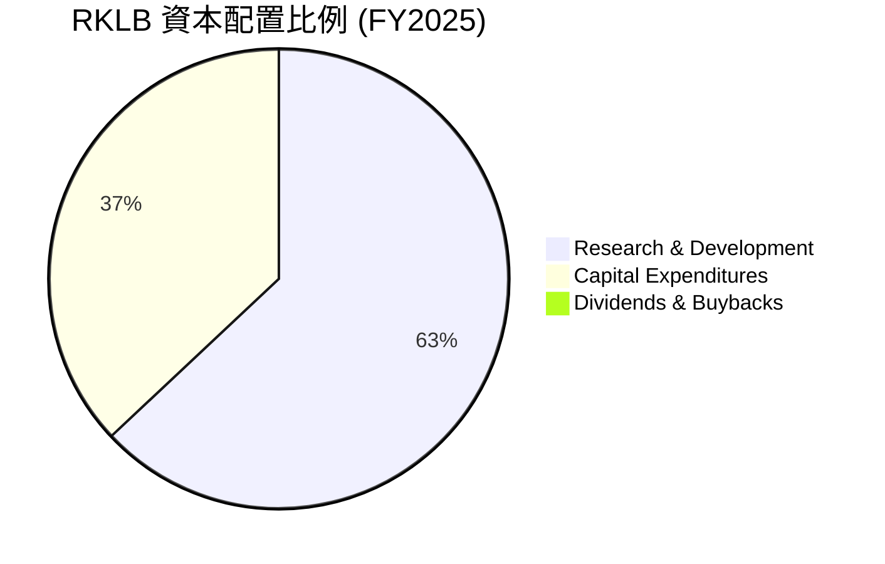

---

## 6. 獲利能力與資本效率

### 6.1 ROE / ROA / ROIC 趨勢

| 指標 | FY2023 | FY2024 | FY2025 | TTM | 行業均值 | 評估 |
|------|--------|--------|--------|-----|----------|------|
| **ROE** | -32.92% | -49.73% | -11.51% | **-13.52%** | ~12.0% | 🔴 資本回報率為負 |
| **ROA** | -19.40% | -16.06% | -8.53% | **-6.60%** | ~5.5% | 🔴 資產利用效率低 |
| **ROIC** | -24.15% | -21.80% | -23.58% | **-23.58%** | ~8.0% | 🔴 投入資本回報為負 |

### 6.2 ROIC vs WACC 分析（核心價值創造判斷）

對於高成長、重研發的航天企業，ROIC vs WACC 是衡量其是否真正創造價值的核心指標。

```
╔══════════════════════════════════════════════════════════════════╗
║                ROIC vs WACC 深度分析 (TTM)                      ║
╠══════════════════════════════════════════════════════════════════╣
║                                                                  ║
║  WACC 估算：                                                     ║
║  ├── 無風險利率 (10Y 美債)：  4.20%                              ║
║  ├── 市場風險溢酬 (ERP)：     5.00%                              ║
║  ├── Beta：                   2.553                              ║
║  ├── 股權成本 = 4.2% + 2.553 × 5.0% = 16.97%                    ║
║  ├── 債務成本（稅後）：       ~6.00%                             ║
║  ├── 資本結構：股權 ~99.7%，債務 ~0.3%                           ║
║  └── ✅ WACC ≈ 16.94%                                            ║
║                                                                  ║
║  ROIC 估算：                                                     ║
║  ├── NOPAT = TTM Operating Income (-$225.62M) × (1 - 0%)         ║
║  │   ≈ -$225.62M                                                 ║
║  ├── 投入資本 = 股東權益 ($1.72B) + 債務 ($253.96M)              ║
║  │   - 現金 ($1.017B) ≈ $956.96M                                 ║
║  └── ✅ ROIC ≈ -23.58%                                           ║
║                                                                  ║
║  ★ 經濟價值增加 (EVA) = ROIC - WACC = -40.52pp                   ║
║                                                                  ║
║  ROIC  -23.58% ░░░░░░░░░░░░░░░░░░░░░░░░░░  🔴 價值摧毀階段      ║
║  WACC   16.94% ▓▓▓▓▓▓▓▓▓▓▓▓▓▓▓▓░░░░░░░░░░  ── 資本成本高昂      ║
║  EVA   -40.52% ░░░░░░░░░░░░░░░░░░░░░░░░░░  ❌ 尚未創造經濟利潤  ║
║                                                                  ║
║  📊 結論：WACC 高達 16.94%（受高 Beta 拖累），ROIC 為負。        ║
║  公司目前處於重資本投入期，正在摧毀短期股東價值，                ║
║  價值創造的轉折點完全取決於 Neutron 火箭的商業化進程。          ║
╚══════════════════════════════════════════════════════════════════╝
```

### 6.3 杜邦三因素分解

透過杜邦分解，我們可以清晰看到 RKLB ROE 改善的底層驅動因素：

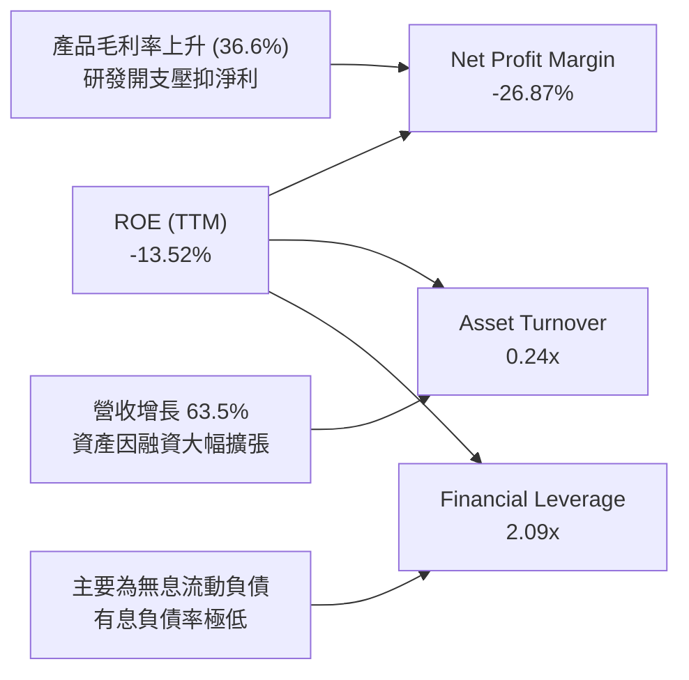

*   **淨利率（Profit Margin）**：從 FY2024 的 -43.60% 改善至 TTM 的 -26.87%，是 ROE 降幅收窄的最主要驅動力，反映了毛利率的結構性提升。
*   **資產週轉率（Asset Turnover）**：由於 FY2025 股權融資導致總資產大幅膨脹（從 $1.18B 升至 $2.82B），資產週轉率從 0.37x 下降至 0.24x，拉低了資本回報效率。
*   **權益乘數（Financial Leverage）**：從 3.10x 下降至 2.09x，表明公司去槓桿化，財務結構更加穩健。

---

## 7. 估值深度分析

### 7.1 同業估值比較表格

由於 RKLB 尚未實現盈利，傳統的 P/E 估值法失效。我們引入 **前瞻 P/S（Forward P/S）** 與 **EV/Revenue**，並與航天防務巨頭及同業新星進行對比。

| 估值指標 | **Rocket Lab (RKLB)** | **Intuitive Machines (LUNR)** | **Northrop Grumman (NOC)** | **Spire Global (SPIR)** | RKLB 估值評估 |
|----------|----------|---------|---------|---------|-----------|
| **Trailing P/S** | **61.42x** | 8.85x | 1.85x | 3.50x | 🔴 極端溢價 |
| **Forward P/S** | **45.80x** | 5.20x | 1.70x | 2.40x | 🔴 遠超行業平均 |
| **EV / Revenue** | **63.06x** | 9.10x | 2.15x | 3.90x | 🔴 估值泡沫化 |
| **P/B Ratio** | **16.98x** | 12.40x | 3.80x | 5.10x | 🔴 帳面價值溢價高 |
| **FCF Yield** | **-0.52%** | -2.10% | +4.50% | -1.20% | 🟡 尚可（因現金儲備大）|

### 7.2 歷史估值區間分析

RKLB 的歷史 P/S 估值區間在 8x 至 70x 之間。當前 61.42x 的 P/S 估值正處於歷史估值的 **極高分位數（Top 5%）**，這主要是由於 2026 年初以來，市場對 Archimedes 引擎測試成功及 Neutron 預期過度樂觀所致。

### 7.3 情境目標價（假設驅動，Bear / Base / Bull）

我們基於未來 3 年（FY2026-FY2028）的財務預測，建立以下三種情境估值模型：

| 情境 | 營收 CAGR (3Y) | FY2028 預期營收 | 預期營業利潤率 | 退出倍數 (EV/Sales) | 隱含目標價 | 相對現價 ($66.80) |
|------|-----------|-----------|----------|------------|----------|------------|
| 🔴 **悲觀情境** | 25.0% | $1.17B | -15.0% | 20.0x | **$45.00** | -32.6% |
| 🟡 **基準情境** | **45.0%** | **$1.85B** | **-5.0%** | **28.0x** | **$78.00** | **+16.8%** |
| 🟢 **樂觀情境** | 65.0% | $2.70B | +5.0% | 35.0x | **$125.00** | +87.1% |

*   **估值倍數選擇說明**：我們選用 **EV/Sales** 作為核心估值倍數。由於 RKLB 在未來 2 年內仍將因 Neutron 的重資本投入而無法實現 GAAP 盈利，使用 P/E 或 EV/EBITDA 會嚴重失真。28x 的基準 EV/Sales 倍數反映了其作為「高壁壘、高成長、具備戰略稀缺性」的太空科技龍頭的溢價。

### 7.4 DCF 敏感性分析（6格目標價矩陣）

基於終端成長率（Terminal Growth Rate）為 4.0% 的假設：

| 營收 CAGR / WACC | **WACC = 14.0%** | **WACC = 16.94%（基準）** | **WACC = 19.0%** |
|------|--------------|----------------------|--------------|
| 🟢 **樂觀 (CAGR 65%)** | **$142.00** (+112.6%) | **$125.00** (+87.1%) | **$108.00** (+61.7%) |
| 🟡 **基準 (CAGR 45%)** | **$92.00** (+37.7%) | **$78.00** (+16.8%) | **$65.00** (-2.7%) |
| 🔴 **悲觀 (CAGR 25%)** | **$55.00** (-17.7%) | **$45.00** (-32.6%) | **$38.00** (-43.1%) |

### 7.5 估值綜合區間

```
╔══════════════════════════════════════════════════════════════════╗
║                    RKLB 估值區間與當前位置                       ║
╠══════════════════════════════════════════════════════════════════╣
║                                                                  ║
║  [悲觀 $45.00] ─── [基準 $78.00] ─────────────── [樂觀 $125.00]  ║
║                                                                  ║
║  當前股價: $66.80                                                ║
║  位置: 基準線下方，安全邊際約 16.8%                              ║
║                                                                  ║
║  🟢 買入安全區：<$55.00                                          ║
║  🟡 觀望/持有區：$55.00 - $85.00  <-- 當前處於此區間             ║
║  🔴 賣出/減碼區：>$85.00                                         ║
╚══════════════════════════════════════════════════════════════════╝
```

---

## 8. 成長催化劑

### 8.1 催化劑時間軸

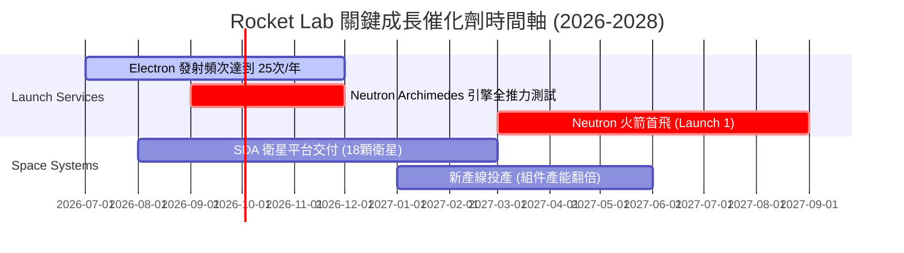

### 8.2 TAM 市場規模分析

```
╔══════════════════════════════════════════════════════════════════╗
║               RKLB 潛在市場規模 (TAM) 預估                       ║
╠══════════════════════════════════════════════════════════════════╣
║                                                                  ║
║  1. 輕型發射市場 (Electron)：                                    ║
║     ├── TAM: ~$1.2B / 年                                         ║
║     └── RKLB 當前市佔: ~45% (貢獻收入 ~$150M)                     ║
║                                                                  ║
║  2. 中/重型發射與商業星座 (Neutron)：                            ║
║     ├── TAM: ~$15.0B / 年                                        ║
║     └── 預期市佔 (2030): ~15% (潛在收入 ~$2.2B)                  ║
║                                                                  ║
║  3. 航天系統與基礎設施 (Space Systems)：                         ║
║     ├── TAM: ~$30.0B / 年                                        ║
║     └── RKLB 當前市佔: ~1.5% (貢獻收入 ~$450M)                    ║
║                                                                  ║
║  📊 總合 TAM 從 2024 年的 $5B 擴張至 2028 年的 $45B+（增長 9 倍）║
╚══════════════════════════════════════════════════════════════════╝
```

### 8.3 成長驅動力結構圖

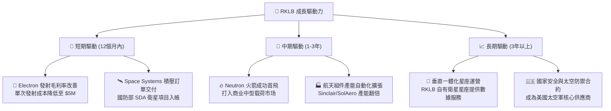

---

## 9. 風險矩陣

### 9.1 風險評分矩陣

```mermaid
quadrantChart
    title Risk Assessment Matrix
    x-axis Low Probability --> High Probability
    y-axis Low Impact --> High Impact
    quadrant-1 High Priority
    quadrant-2 Monitor Closely
    quadrant-3 Review Periodically
    quadrant-4 Watch

    Neutron Launch Delay: [0.75, 0.85]
    Launch Failure (Electron): [0.35, 0.70]
    Equity Dilution: [0.80, 0.45]
    Customer Concentration: [0.60, 0.55]
    Valuation Derating: [0.70, 0.80]
```

### 9.2 風險清單詳細分析

| # | 風險項目 | 發生機率 | 財務衝擊 | 風險評分 | 緩解措施/應對機制 |
|---|----------|----------|----------|----------|-------------------|
| 1 | 🔴 **Neutron 研發延期** | 高 (75%) | 高 (-25% 遠期營收) | 🔴 **8.5 / 10** | 建立多個測試台，並在帳上保留 $1.38B 現金，確保充足的研發時間墊。 |
| 2 | 🔴 **極端估值回調** | 高 (70%) | 高 (-30% 股價) | 🔴 **8.0 / 10** | 透過提高 Space Systems 高利潤業務比重，用實質盈利支撐估值。 |
| 3 | 🟡 **發射失敗 (Electron)**| 中 (35%) | 中 (-10% 當期營收) | 🟡 **5.5 / 10** | 嚴格的品質控制與標準化生產，投保發射保險以轉移財務風險。 |
| 4 | 🟡 **客戶過度集中** | 中 (60%) | 中 (-15% 訂單) | 🟡 **5.0 / 10** | 積極開拓商業星座客戶，降低對美國政府/太空軍單一客戶的依賴。 |

---

## 10. 投資建議

### 10.1 最終綜合評級雷達圖

```
╔══════════════════════════════════════════════════════════════════╗
║                  RKLB 最終投資價值評分 (1-10分)                  ║
╠══════════════════════════════════════════════════════════════════╣
║ 業務成長動能  9.0 ▓▓▓▓▓▓▓▓▓▓▓▓▓▓▓▓▓▓░░  ★★★★★           ║
║ 財務安全邊際  9.0 ▓▓▓▓▓▓▓▓▓▓▓▓▓▓▓▓▓▓░░  ★★★★★           ║
║ 競爭壁壘深度  7.8 ▓▓▓▓▓▓▓▓▓▓▓▓▓▓▓▓░░░░  ★★★★☆           ║
║ 短期估值合理  2.0 ▓▓▓▓░░░░░░░░░░░░░░░░  ★☆☆☆☆           ║
║ 短期獲利品質  3.0 ▓▓▓▓▓▓░░░░░░░░░░░░░░  ★☆☆☆☆           ║
╠══════════════════════════════════════════════════════════════╣
║ 綜合投資評級  6.6 ▓▓▓▓▓▓▓▓▓▓▓▓▓░░░░░░░  🟡 持有 (Hold)       ║
╚══════════════════════════════════════════════════════════════╝
```

### 10.2 目標價與隱含報酬率

| 情境 | 機率權重 | 12M 目標價 | 當前股價 | 隱含報酬率 | 建議操作 |
|------|----------|------------|----------|------------|----------|
| 🔴 悲觀情境 | 25% | $45.00 | $66.80 | -32.6% | 減碼 / 停止買入 |
| 🟡 **基準情境** | **60%** | **$78.00** | **$66.80** | **+16.8%** | **持有 / 逢低吸納** |
| 🟢 樂觀情境 | 15% | $125.00 | $66.80 | +87.1% | 續抱 / 獲利了結 |
| **加權預期值**| **100%** | **$76.80** | **$66.80** | **+14.97%**| **持有** |

### 10.3 買入時機與觸發因素

```
╔══════════════════════════════════════════════════════════════════╗
║                  ✅ RKLB 投資決策 Checklist                     ║
╠══════════════════════════════════════════════════════════════════╣
║                                                                  ║
║  立即買入觸發條件（需多數符合）：                                ║
║  [ ] 股價回檔至安全邊際區間（<$55.00）                           ║
║  [ ] Archimedes 引擎成功完成 100% 全推力點火測試                 ║
║  [ ] 航天系統（Space Systems）單季毛利率突破 40%                 ║
║                                                                  ║
║  加碼觸發條件（出現以下任一）：                                  ║
║  [ ] Neutron 火箭成功完成首次軌道級發射                          ║
║  [ ] 宣佈簽署首個 Neutron 商業星座多火箭發射合約                 ║
║                                                                  ║
║  減碼/停損觸發條件（出現以下任一）：                             ║
║  [ ] Neutron 首飛時間宣佈延遲至 2028 年以後                      ║
║  [ ] 核心技術團隊（如 CEO Peter Beck）宣佈離職                   ║
║  [ ] 帳上現金消耗過快，且以極低股價進行增發稀釋                  ║
║                                                                  ║
╚══════════════════════════════════════════════════════════════════╝
```

### 10.4 投資人適配度分析

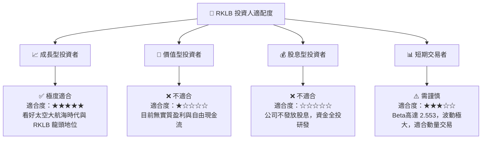

### 10.5 每季財報監控清單（Quarterly Watch List）

在未來的季度財報中，投資人應重點追蹤以下量化指標，以評估 RKLB 的投資論點是否發生根本性改變：

1.  **航天系統（Space Systems）營收增速與佔比**：
    *   *目標*：保持 >40% YoY 增長，佔比維持在 60% 以上。
    *   *觸發減碼門檻*：增速連續兩季低於 20%。
2.  **單次 Electron 發射毛利率**：
    *   *目標*：隨發射頻次提升，向 40% 靠攏。
    *   *觸發減碼門檻*：因生產問題導致毛利率跌破 25%。
3.  **現金消耗率（Cash Burn Rate）**：
    *   *目標*：單季 FCF 流出控制在 $80M 以內。
    *   *觸發減碼門檻*：單季 FCF 流出 >$150M，且無相應的產能大幅擴張。
4.  **Neutron 研發里程碑**：
    *   *目標*：按計劃在 2026 年底前完成 Archimedes 引擎的所有地面測試。
    *   *觸發減碼門檻*：官方宣佈首飛時間推遲 6 個月以上。

### 10.6 反面論證：什麼會證明論點錯誤（What Would Change My Mind）

```
╔══════════════════════════════════════════════════════════════════╗
║              ⚠️ 論點失效條件（Disconfirming Evidence）           ║
╠══════════════════════════════════════════════════════════════════╣
║  本投資論點在下列情況成立時應重新檢視或退出：                    ║
║                                                                  ║
║  [ ] 條件一：Neutron Archimedes 引擎在測試中出現重大設計缺陷，   ║
║              導致首飛推遲至 2028 年之後。                        ║
║  [ ] 條件二：Space Systems 業務增速連續兩季降至 <20%，           ║
║              表明組件市場飽和或流失關鍵政府客戶。                ║
║  [ ] 條件三：公司進行新一輪大規模股權融資，                      ║
║              導致現有股東股權被稀釋超 15%。                      ║
║  [ ] 條件四：SpaceX 大幅降低 Falcon 9 發射價格，                  ║
║              擠壓 RKLB 在中型火箭市場的潛在毛利空間。            ║
║                                                                  ║
╚══════════════════════════════════════════════════════════════════╝
```

---

> **免責聲明**：本報告為 AI 自動生成，僅供研究參考，不構成投資建議。投資有風險，入市需謹慎。