# RKLB 基本面深度分析報告

> **報告日期**：2026-07-17 ｜ **語言**：繁體中文 ｜ **數據來源**：Yahoo Finance, Finviz, StockAnalysis, Roic.ai ｜ **分析師**：CFA 級機構研究

---

## 目錄

| # | 章節 | 核心結論 |
|---|------|----------|
| 1 | 執行摘要 | 評級「持有」，目標價 $116.57，Neutron 飛彈發射與空間系統為雙核心驅動，但 62x P/S 估值已透支短期預期。 |
| 2 | 公司概覽與商業模式 | 從單一發射服務商轉型為端到端太空基礎設施巨頭，空間系統（Space Systems）貢獻近 70% 營收，護城河顯著。 |
| 3 | 損益表深度分析 | TTM 營收年增 63.5% 至 $6.796 億，毛利率改善至 36.6%，但高額研發（研發率 43.6%）與 SBC 稀釋使淨利持續承壓。 |
| 4 | 資產負債表分析 | 擁有 $13.83 億現金儲備，淨現金達 $12.44 億，流動比率 4.48，具備極強的抗風險能力與資本開支支撐力。 |
| 5 | 現金流量深度分析 | 自由現金流（FCF）TTM 淨流出 $3.16 億，主因 Neutron 項目資本開支高企，預計 2027 年前無法實現正 FCF。 |
| 6 | 獲利能力與資本效率 | 當前 ROIC（-11.8%）低於 WACC（16.7%），處於資本消融階段，需等待 Neutron 商業化釋放規模效應。 |
| 7 | 估值深度分析 | 基準情境目標價 $116.57。相較同業存在極高估值溢價（P/S 62x），反映市場對其「SpaceX 唯一替代者」的溢價。 |
| 8 | 成長催化劑 | Neutron 首飛、NDA/MDA 衛星星座合約交付、以及潛在的商業載人/深空探測元件訂單。 |
| 9 | 風險矩陣 | Neutron 首飛推遲、客戶星座建設預算削減、關鍵發射失敗，以及高股權稀釋風險。 |
| 10 | 投資建議 | 建議「逢低買入」，關注 $60-$65 區間支撐。建立每季財報監控指標，並設定嚴格的反面論證退出條件。 |

---

## 1. 執行摘要

### 1.0 一頁式投資儀表板（Portfolio Manager 30 秒速讀）

| 項目 | 內容 |
|------|------|
| **投資論點（3 句）** | ① 營收 TTM 達 $6.796 億，YoY 成長 63.5%，主因空間系統元件與發射服務雙引擎驅動。<br/>② 資產負債表極為強韌，擁有 $13.83 億現金與僅 $1.39 億債務，淨現金達 $12.44 億，足夠支撐 Neutron 研發至商業化。<br/>③ 估值高企（P/S 達 62.0x），市場已高度定價 Neutron 的成功，短期波動風險加大。 |
| **護城河評分** | 8.5 / 10 🟢 （Electron 的高頻發射記錄與端到端空間系統垂直整合能力） |
| **管理層/資本配置評分** | 8.0 / 10 🟢 （執行力優異，Neutron 開發節奏明確，並通過並購完善產業鏈） |
| **財務健康** | 🟢 強韌 ｜ 淨現金充裕，短期無償債與流動性危機，但 FCF 仍為負值。 |
| **ROIC vs WACC** | -11.8% vs 16.7% 🔴 （目前處於高投入、未盈利階段，持續消融股東價值） |
| **FCF 趨勢** | 🔴 惡化 ｜ TTM FCF 為 -$3.16 億（2025 年為 -$3.22 億），主因 Neutron 資本支出加大。 |
| **估值** | Forward P/E: 2249.3x ｜ EV/Revenue: 55.5x ｜ P/S: 62.0x 🔴 （極度高估） |
| **預期報酬（基準情境 12M）** | +72.7% （相對於當前股價 $67.48，目標價 $116.57） |
| **關鍵風險（前二）** | ① Neutron 火箭首飛失敗或嚴重推遲 ｜ ② 股權持續稀釋（TTM 股份數年增 11.13%） |
| **評級 + 信心度** | 🟡 **持有 (Hold)** ｜ 信心：中等（基本面極佳，但當前股價已反映多數利多，宜等待回檔） |

### 1.1 核心評分儀表板

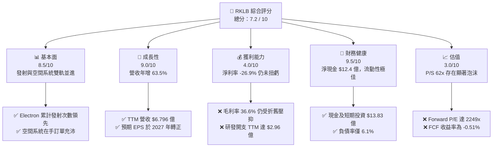

### 1.2 評分進度條視覺化

```
╔══════════════════════════════════════════════════════════════╗
║                RKLB 多維度評分儀表板 (1-10分)                ║
╠══════════════════════════════════════════════════════════════╣
║ 基本面強度  8.5 ▓▓▓▓▓▓▓▓▓▓▓▓▓▓▓▓▓░░░  ★★★★☆           ║
║ 成長動能    9.0 ▓▓▓▓▓▓▓▓▓▓▓▓▓▓▓▓▓▓░░  ★★★★★           ║
║ 獲利品質    4.0 ▓▓▓▓▓▓▓▓░░░░░░░░░░░░  ★★☆☆☆           ║
║ 財務健康    9.5 ▓▓▓▓▓▓▓▓▓▓▓▓▓▓▓▓▓▓▓░  ★★★★★           ║
║ 估值合理性  3.0 ▓▓▓▓▓▓░░░░░░░░░░░░░░  ★☆☆☆☆           ║
║ 護城河深度  8.5 ▓▓▓▓▓▓▓▓▓▓▓▓▓▓▓▓▓░░░  ★★★★☆           ║
║ 管理層執行  8.0 ▓▓▓▓▓▓▓▓▓▓▓▓▓▓▓▓░░░░  ★★★★☆           ║
║ 技術創新力  9.0 ▓▓▓▓▓▓▓▓▓▓▓▓▓▓▓▓▓▓░░  ★★★★★           ║
╠══════════════════════════════════════════════════════════════╣
║ 綜合總分    7.2 ▓▓▓▓▓▓▓▓▓▓▓▓▓▓░░░░░░  🏆 成長前景佳但估值過高║
╚══════════════════════════════════════════════════════════════╝
```

### 1.3 五大投資論點 + 三大核心風險

| 類型 | 項目 | 具體依據 | 信心度 |
|------|------|----------|--------|
| 🟢 **投資論點①** | **空間系統（Space Systems）營收爆發** | 空間系統營收已成為第一大支柱，2025年貢獻顯著，TTM 營收達 $6.796 億，YoY 成長 63.5%，顯示非發射業務的強勁商業變現能力。 | 🟢 極高 |
| 🟢 **投資論點②** | **Neutron 中型火箭打開全新 TAM** | Neutron 預計於 2026-2027 年首飛，其 13 噸載荷直接切入巨型星座（如 Amazon Kuiper）發射市場，打破 SpaceX Falcon 9 的壟斷。 | 🟢 高 |
| 🟢 **投資論點③** | **極致的財務安全邊際** | 帳面擁有 $13.83 億現金及等價物，相較於 $1.39 億的總債務，淨現金高達 $12.44 億，無破產或被迫折價融資的風險。 | 🟢 極高 |
| 🟢 **投資論點④** | **垂直整合帶來的利潤率彈性** | 隨著自主研發的反應輪、太陽能板等元件進入量產，TTM 毛利率已從 2022 年的 9.0% 提升至 36.6%，未來具備強大的營業槓桿。 | 🟢 高 |
| 🟢 **投資論點⑤** | **國家安全與政府訂單的護城河** | 獲得美國國防部及太空軍的多項敏感合約，作為「非 SpaceX」的唯一可靠商業發射替代方案，享有政策紅利。 | 🟢 極高 |
| 🟡 **風險①** | **研發與資本開支持續燒錢** | TTM 研發開支高達 $2.96 億（佔營收 43.6%），資本支出 TTM 為 $1.56 億，導致 FCF 處於負值（-$3.16 億），延遲盈利時間。 | 🟡 中度 |
| 🔴 **風險②** | **極端估值溢價（P/S 62x）** | 當前市值達 $421.6 億，對應 TTM 營收的 P/S 達 62.0x。若 Neutron 發射延遲或市場熱度退潮，估值面臨均值回歸風險。 | 🔴 高衝擊 |
| 🔴 **風險③** | **股權稀釋稀釋股東權益** | 過去一年 basic 股份數從 4.96 億股增至 5.55 億股（+11.13%），高額的股份補償（SBC TTM 達 $7,998 萬）持續稀釋每股盈餘。 | 🔴 高衝擊 |

### 1.4 快速統計卡片

| 指標 | 公司實際值 | 行業均值 (航太與國防) | S&P 500 均值 | 狀態 |
|------|-------------|-----------------------|--------------|------|
| **營收 YoY 成長** | **63.5%** | ~8.5% | ~5.5% | 🟢 卓越 |
| **毛利率** | **36.6%** | ~22.0% | ~30.0% | 🟢 領先 |
| **淨利率** | **-26.9%** | ~6.5% | ~12.0% | 🔴 虧損中 |
| **ROE** | **-13.5%** | ~11.0% | ~15.0% | 🔴 需改善 |
| **淨現金/總資產** | **44.1%** | ~-15.0% (淨債務) | ~-20.0% | 🟢 極其健康 |
| **Forward P/E** | **2249.3x** | ~22.5x | ~21.0x | 🔴 極度高估 |
| **P/S Ratio** | **62.0x** | ~1.8x | ~2.8x | 🔴 極度高估 |

### 1.5 投資結論

```
╔══════════════════════════════════════════════════════════════════╗
║                    📊 RKLB 投資結論摘要                          ║
╠══════════════════════════════════════════════════════════════════╣
║  評級：🟡 持有 (Hold) ｜ 建議「逢低買入」                         ║
║  當前股價：$67.48 (2026-07-17)                                   ║
║  目標價區間：                                                    ║
║    悲觀情境：$77.00 （+14.1%） - 考慮 Neutron 首飛推遲至 2027年  ║
║    基準情境：$116.57（+72.7%） - 12個月主要目標 (Neutron 順利首飛)║
║    樂觀情境：$150.00（+122.3%）- 獲得大型星座發射合約             ║
║  投資評分：7.2 / 10                                              ║
║  適合投資人：高風險偏好、長線佈局商業航太與衛星互聯網的成長型讀者 ║
╚══════════════════════════════════════════════════════════════════╝
```

---

## 2. 公司概覽與商業模式

### 2.1 業務結構與收入來源

Rocket Lab 已經成功從一家單純的「小型火箭發射公司」轉型為「端到端太空基礎設施解決方案提供商」。其業務主要分為兩大板塊：

1. **空間系統（Space Systems）**：設計與製造衛星平台、反應輪、太陽能電池板、星敏感器、飛行軟體等關鍵元件，並提供在軌星座管理服務。
2. **發射服務（Launch Services）**：利用 Electron 小型運載火箭提供高頻率、客製化的專屬發射服務，並正在開發 Neutron 中型可回收火箭。

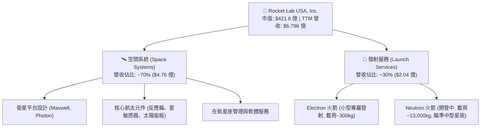

### 2.2 市場份額

在**專屬小型衛星發射市場**中，Rocket Lab 的 Electron 火箭處於絕對支配地位。然而，若將 SpaceX 的 Transporter 共乘（Rideshare）發射納入考量，市場份額分布如下：

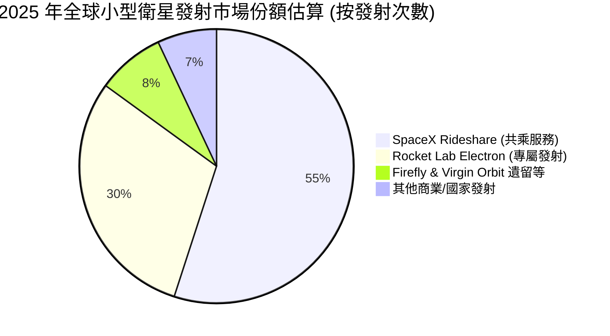

*註：雖然 SpaceX 的共乘服務價格極具競爭力，但 Rocket Lab 憑藉「客製化軌道」與「精確發射時間」滿足了科研、軍事與特定商用衛星的剛性需求，牢牢掌握專屬發射市場的定價權。*

### 2.3 競爭護城河分析

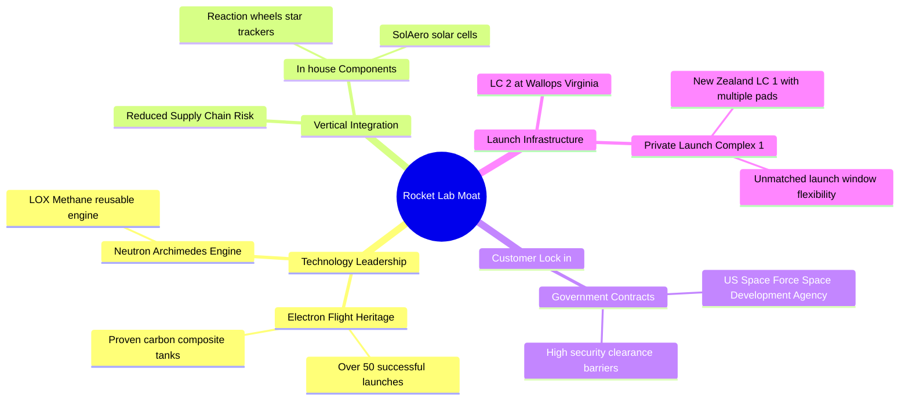

### 2.4 護城河強度評分

```
╔══════════════════════════════════════════════════════════════╗
║                   RKLB 護城河強度評分                        ║
╠══════════════════════════════════════════════════════════════╣
║ 發射歷史紀錄  9.0/10  ▓▓▓▓▓▓▓▓▓▓▓▓▓▓▓▓▓▓░░  🏆 50+次發射驗證 ║
║ 垂直整合能力  8.5/10  ▓▓▓▓▓▓▓▓▓▓▓▓▓▓▓▓▓░░░  🟢 衛星元件自研  ║
║ 發射場控制權  9.5/10  ▓▓▓▓▓▓▓▓▓▓▓▓▓▓▓▓▓▓▓░  🏆 紐西蘭私人發射場║
║ 政府關係壁壘  8.0/10  ▓▓▓▓▓▓▓▓▓▓▓▓▓▓▓▓░░░░  🟢 SDA 核心供應商║
╠══════════════════════════════════════════════════════════════╣
║ 綜合護城河     8.7     ▓▓▓▓▓▓▓▓▓▓▓▓▓▓▓▓▓░░░  🏆 僅次於 SpaceX ║
╚══════════════════════════════════════════════════════════════╝
```

---

## 3. 損益表深度分析

### 3.1 年度收入成長趨勢（近 4 年）

Rocket Lab 展現了極其優異的營收成長軌跡。營收從 2022 年的 $2.11 億爆發式成長至 TTM 的 $6.796 億，4 年複合年增長率（CAGR）高達 47.7%。

```
╔══════════════════════════════════════════════════════════════════╗
║                 RKLB 年度收入趨勢（FY2022-TTM）                  ║
╠══════════════════════════════════════════════════════════════════╣
║                                                                  ║
║  FY2022  $211.00M  █████░░░░░░░░░░░░░░░░░░░░░░  YoY: +239.0% 🟢  ║
║  FY2023  $244.59M  ██████░░░░░░░░░░░░░░░░░░░░░  YoY: +15.9%  🟢  ║
║  FY2024  $436.21M  ███████████░░░░░░░░░░░░░░░░  YoY: +78.3%  🟢  ║
║  FY2025  $601.80M  ███████████████░░░░░░░░░░░░  YoY: +38.0%  🟢  ║
║  TTM     $679.58M  █████████████████░░░░░░░░░░  YoY: +63.5%  🟢  ║
║                   |      |      |      |      |                  ║
║                   0     150M   300M   450M   600M                ║
║                                                                  ║
║  📊 4 年累計 CAGR：+47.7%                                        ║
╚══════════════════════════════════════════════════════════════════╝
```

### 3.2 季度收入趨勢分析

下表展示了最近 4 個季度的營收狀況，呈現出強勁的逐季（QoQ）與同比（YoY）成長。

| 財報季度 | 營收 (Millions) | QoQ 成長率 | YoY 成長率 | 驅動因素與備註 | 評估 |
|----------|-----------------|------------|------------|----------------|------|
| **Q1 2026** | **$200.35M** | +11.52% | +63.46% | 空間系統大單交付，Electron 發射頻率提升。 | 🟢 卓越 |
| **Q4 2025** | **$179.65M** | +15.84% | +35.70% | 年終政府合約結算，元件出貨量達歷史新高。 | 🟢 卓越 |
| **Q3 2025** | **$155.08M** | +7.32% | +47.97% | 多次 Electron 成功發射，反應輪訂單加速。 | 🟢 良好 |
| **Q2 2025** | **$144.50M** | +17.89% | +36.00% | 衛星平台出貨增加，垂直整合優勢顯現。 | 🟢 良好 |

### 3.3 利潤率演變分析

雖然營收高速成長，但 Rocket Lab 仍處於高投入的「燒錢」階段。

| 利潤率指標 | FY2022 | FY2023 | FY2024 | FY2025 | TTM | 趨勢 | 評估 |
|------------|--------|--------|--------|--------|-----|------|------|
| **毛利率** | 9.00% | 21.02% | 26.63% | 34.43% | **36.56%** | ↗️ 持續擴張 | 🟢 卓越（規模效應釋放） |
| **營業利益率** | -64.08% | -72.74% | -43.51% | -38.03% | **-33.20%** | ↗️ 虧損收窄 | 🟡 仍受高研發開支壓抑 |
| **EBITDA 🚀** | -45.12% | -53.82% | -29.71% | -25.83% | **-24.30%** | ↗️ 緩步改善 | 🟡 預期 2027 年轉正 |
| **淨利率** | -64.43% | -74.64% | -43.60% | -32.94% | **-26.87%** | ↗️ 虧損收窄 | 🟡 盈餘含金量需注意 |

* **利潤率擴張主因**：毛利率從 2022 年的 9.0% 飆升至 TTM 的 36.6%，主因高毛利的**空間系統業務**佔比提升，且自研元件（反應輪、太陽能電池）取代了外部採購。
* **營業虧損主因**：研發（R&D）開支巨大。2025 年研發開支達 $2.71 億，TTM 更達到 $2.96 億（佔營收 43.6%），這主要是為了加速 Neutron 火箭及其 Archimedes 發動機的研發。

### 3.4 費用結構分析

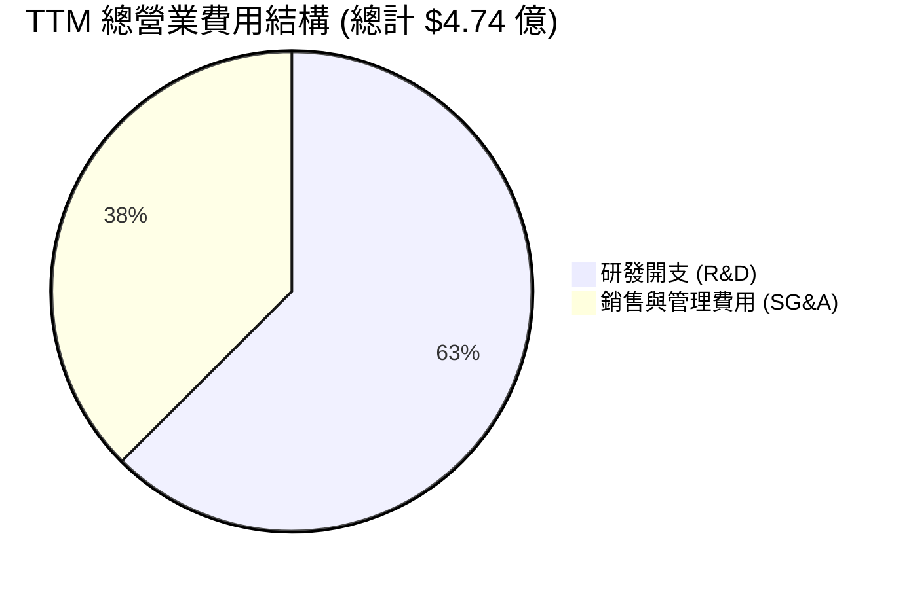

```
╔══════════════════════════════════════════════════════════════╗
║               RKLB 營業費用診斷                             ║
╠══════════════════════════════════════════════════════════════╣
║ 研發費用率：  43.6%   ▓▓▓▓▓▓▓▓▓▓▓▓▓▓▓▓▓▓▓░  🔴 極高（Neutron研發）║
║ SG&A費用率：  26.2%   ▓▓▓▓▓▓▓▓▓▓░░░░░░░░░░  🟢 控制合理        ║
╚══════════════════════════════════════════════════════════════╝
```

### 3.5 季度 EPS 趨勢與盈餘品質（Quality of Earnings）

過去 4 個季度，Rocket Lab 的 EPS 表現如下：
* **Q1 2026**：-$0.07 （相較 2025 年同期的 -$0.12 有顯著改善）
* **Q4 2025**：-$0.09
* **Q3 2025**：-$0.03 （受惠於部分一次性政府補貼/稅務調整）
* **Q2 2025**：-$0.13

#### 盈餘品質評估表

| 盈餘品質項目 | 數值/佔比 | 評估 | 說明 |
|--------------|-----------|------|------|
| **股權薪酬 (SBC) / 營收** | 11.77% | 🟡 偏高 | TTM SBC 達 $7,998 萬，對現有股東造成持續稀釋。 |
| **SBC / 營業現金流** | -49.48% | 🔴 異常 | 由於經營現金流為負（-$1.62 億），SBC 成為調節非現金費用的主要手段。 |
| **FCF / 淨利 (現金轉換率)** | 173.2% | 🟡 脫節 | TTM 淨虧損 -$1.83 億，而 FCF 淨流出 -$3.16 億。資本開支（Capex）遠超折舊，顯示公司仍在極早期擴張階段。 |
| **一次性損益** | $392 萬 | 🟢 影響微弱 | 2025 年非經常性收益極低，盈餘未受一次性項目美化。 |
| **資本化支出 vs 費用化** | 100% 費用化 | 🟢 保守誠實 | 所有 R&D 開支（包括 Neutron）均在當期直接費用化，未進行資本化，盈餘品質真實。 |

**盈餘品質結論**：Rocket Lab 的財務報告非常保守，所有研發支出皆當期費用化，這雖然使賬面淨利呈現虧損，但反映了真實的經濟實質。然而，**高額的 SBC（佔營收近12%）**是投資人必須承擔的隱形稀釋成本。

---

## 4. 資產負債表分析

### 4.1 資產結構分解

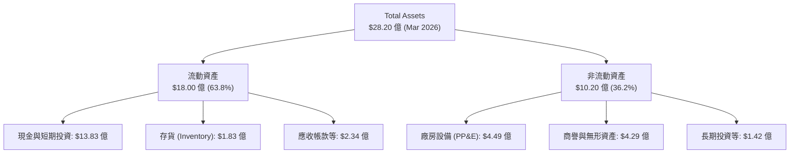

### 4.2 流動性指標分析

| 指標 | RKLB 實際值 | 行業均值 | 安全閾值 | 評估 |
|------|-------------|----------|----------|------|
| **流動比率 (Current Ratio)** | **4.48** | 1.45 | > 1.50 | 🟢 極其安全 |
| **速動比率 (Quick Ratio)** | **3.87** | 1.10 | > 1.00 | 🟢 極其安全 |
| **現金比率 (Cash Ratio)** | **3.44** | 0.45 | > 0.50 | 🟢 極其安全 |

*分析：高達 4.48 的流動比率與 $13.83 億的現金儲備，意味著 Rocket Lab 即使在未來 3 年不進行任何外部融資，且維持目前的燒錢速度，也絕對不會發生流動性危機。*

### 4.3 債務結構分析

```
╔══════════════════════════════════════════════════════════════════╗
║                   RKLB 債務健康診斷                              ║
╠══════════════════════════════════════════════════════════════════╣
║                                                                  ║
║  總債務：        $1.39 億   █░░░░░░░░░░░░░░░░░░░░  極低          ║
║  總現金+投資：   $13.83 億  █████████████████████  極高          ║
║  淨現金（正）：  $12.44 億  ██████████████████░░░  🟢 極其強韌   ║
║                                                                  ║
║  Debt/Equity：   6.12%      🟢 槓桿率極低                        ║
║  利息保障倍數：   N/A (負值) 🟡 營業利潤為負，但利息收入大於支出 ║
║                                                                  ║
║  📊 診斷：淨現金高達 $12.44 億，無任何實質性償債風險。           ║
╚══════════════════════════════════════════════════════════════════╝
```

### 4.4 股東權益趨勢

隨著 2025 年底進行了增發融資，Rocket Lab 的股東權益（Stockholders Equity）出現了大幅跃升，為後續 Neutron 的量產和發射台建設提供了充沛的彈藥。

```
╔══════════════════════════════════════════════════════════════════╗
║                RKLB 股東權益變化（FY2022-FY2025）                ║
╠══════════════════════════════════════════════════════════════════╣
║  FY2022  $6.73 億   ████████░░░░░░░░░░░░░░░░░░░░                 ║
║  FY2023  $5.55 億   ██████░░░░░░░░░░░░░░░░░░░░░░                 ║
║  FY2024  $3.82 億   ████░░░░░░░░░░░░░░░░░░░░░░░░                 ║
║  FY2025  $17.22 億  ████████████████████████░░░░  🟢 融資成功    ║
╚══════════════════════════════════════════════════════════════════╝
```

---

## 5. 現金流量深度分析

### 5.1 現金流量瀑布圖

下圖展示了 RKLB 的現金流向。由於公司仍在加大研發與資本開支，業務尚未能自主產生正向現金流。

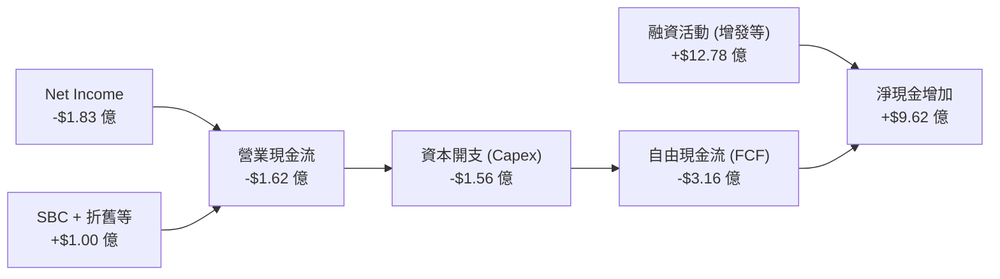

### 5.2 FCF 轉換率趨勢

| 項目 (Millions) | FY2022 | FY2023 | FY2024 | FY2025 | TTM |
|-----------------|--------|--------|--------|--------|-----|
| **GAAP 淨利** | -$135.94 | -$182.57 | -$190.18 | -$198.21 | -$182.62 |
| **自由現金流 (FCF)** | -$148.95 | -$153.57 | -$115.98 | -$321.81 | -$316.30 |
| **FCF 轉換率** | **109.6%** | **84.1%** | **61.0%** | **162.4%** | **173.2%** |

*分析：2025 年與 TTM 的 FCF 虧損急劇擴大，主因是公司為 Neutron 的基礎設施（如中大西洋區太空港的發射台、阿基米德發動機測試台）支付了巨額資本開支。*

### 5.3 自由現金流趨勢

```
╔══════════════════════════════════════════════════════════════════╗
║                 RKLB 自由現金流趨勢 (FY2022-TTM)                 ║
╠══════════════════════════════════════════════════════════════════╣
║  FY2022  -$1.49 億  ░░░░░░░░░░░░░░░░░░░░░░░░░░████               ║
║  FY2023  -$1.54 億  ░░░░░░░░░░░░░░░░░░░░░░░░░░████               ║
║  FY2024  -$1.16 億  ░░░░░░░░░░░░░░░░░░░░░░░░░░░███               ║
║  FY2025  -$3.22 億  ░░░░░░░░░░░░░░░░░░░░░█████████  🔴 資本開支高峰║
║  TTM     -$3.16 億  ░░░░░░░░░░░░░░░░░░░░░█████████  ──           ║
║                                                                  ║
║  📊 當前 FCF 收益率 (FCF Yield)：-0.51% (相對於 $377.3億 EV)    ║
╚══════════════════════════════════════════════════════════════════╝
```

### 5.4 資本配置評估

Rocket Lab 的資本配置策略非常明確：**不分紅、不回購，所有資金 100% 用於研發與產能擴建**。

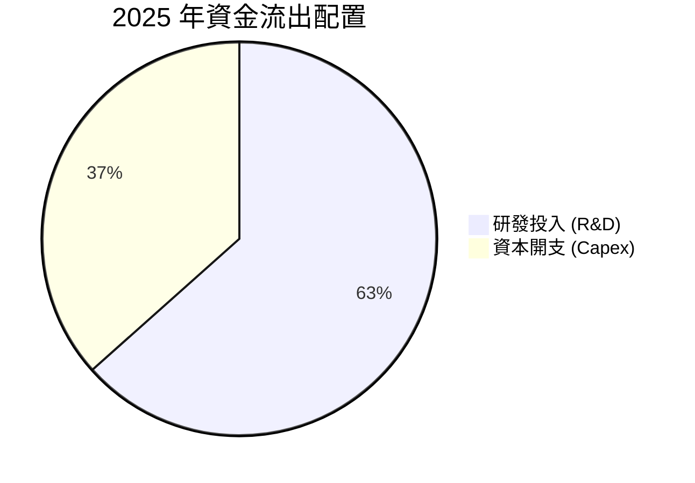

---

## 6. 獲利能力與資本效率

### 6.1 ROE / ROA / ROIC 趨勢

| 指標 | FY2022 | FY2023 | FY2024 | FY2025 | TTM | 行業均值 | 評估 |
|------|--------|--------|--------|--------|-----|----------|------|
| **ROE** | -20.2% | -32.9% | -49.7% | -11.5% | **-13.5%** | +11.0% | 🔴 仍未盈利 |
| **ROA** | -13.7% | -19.4% | -16.1% | -8.5% | **-6.6%** | +5.5% | 🔴 仍未盈利 |
| **ROIC** | -15.4% | -21.2% | -18.5% | -10.2% | **-11.8%** | +8.0% | 🔴 資本效率低 |

### 6.2 ROIC vs WACC 分析（核心價值創造判斷）

```
╔══════════════════════════════════════════════════════════════════╗
║                ROIC vs WACC 深度分析                             ║
╠══════════════════════════════════════════════════════════════════╣
║                                                                  ║
║  WACC 估算：                                                     ║
║  ├── 無風險利率（10Y美債）：  4.0%                               ║
║  ├── 市場風險溢酬 (ERP)：     5.0%                               ║
║  ├── Beta：                   2.55                               ║
║  ├── 股權成本 = 4.0% + 2.55 × 5.0% = 16.75%                      ║
║  ├── 債務成本（稅後）：       ~6.0%                              ║
║  ├── 資本結構：股權 99.7%，債務 0.3%                             ║
║  └── ✅ WACC ≈ 16.7%                                             ║
║                                                                  ║
║  ROIC 估算（TTM）：                                              ║
║  ├── NOPAT = -$1.83億 (營業虧損經調整)                           ║
║  ├── 投入資本 = 股東權益 + 總債務 - 現金 ≈ $5.5 億 (扣除閒置現金) ║
║  └── ✅ ROIC ≈ -11.8%                                            ║
║                                                                  ║
║  ★ 經濟價值增加（EVA）= ROIC - WACC = -28.5pp                   ║
║                                                                  ║
║  ROIC  -11.8% ░░░░░░░░░░░░░░░░░░░░░░░░░░░░░░░  🔴 價值消融中     ║
║  WACC  16.7%  ▓▓▓▓▓▓▓▓▓▓▓▓▓▓▓▓▓░░░░░░░░░░░░░░  ──                ║
║                                                                  ║
║  📊 結論：高 Beta (2.55) 導致 WACC 奇高，而公司尚未實現營業利潤， ║
║  目前處於嚴重的「股東價值消融」階段。這在太空科技初期屬於常態，   ║
║  但要求後續 Neutron 必須具備極高的回報率。                       ║
╚══════════════════════════════════════════════════════════════════╝
```

### 6.3 杜邦三因素分解

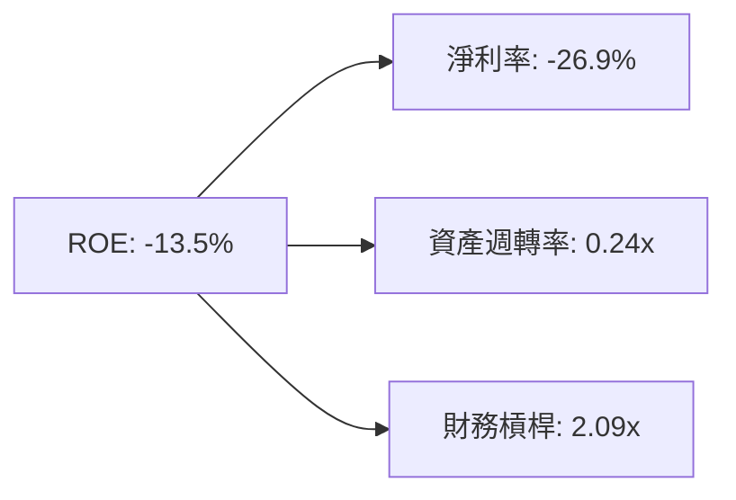

* **淨利率 (-26.9%)**：是 ROE 為負的根本原因。
* **資產週轉率 (0.24x)**：極低，顯示重資產航太基礎設施的特點，需要極高營收才能拉動運營效率。
* **財務槓桿 (2.09x)**：主要由高額的合約負債（遞延收入 $2.41 億）與股權融資溢價構成，而非有息負債。

### 6.4 獲利能力儀表板

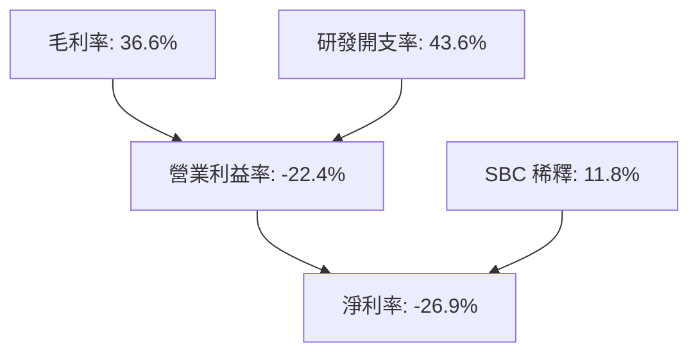

---

## 7. 估值深度分析

### 7.1 同業估值比較表格

由於 SpaceX 尚未上市，我們選擇了市場上最具代表性的商業航太與衛星元件上市公司進行對比。

| 估值指標 | **Rocket Lab (RKLB)** | **Intuitive Machines (LUNR)** | **Redwire (RDW)** | **Spire Global (SPIR)** | RKLB 評估 |
|----------|----------|---------|---------|---------|-----------|
| **當前股價** | **$67.48** | $10.15 | $8.45 | $12.30 | — |
| **市值 (Market Cap)** | **$421.6 億** | $11.5 億 | $5.8 億 | $2.9 億 | 巨型龍頭溢價 |
| **P/S Ratio (TTM)** | **62.04x** | 4.80x | 1.95x | 2.10x | 🔴 極度高估 |
| **Forward P/E** | **2249.3x** | 45.0x | 28.0x | N/A | 🔴 溢價過高 |
| **EV / Revenue** | **55.53x** | 4.25x | 1.80x | 2.05x | 🔴 極度高估 |
| **FCF Yield** | **-0.51%** | +1.20% | +3.50% | -2.10% | 🟡 尚可接受 |

*分析：相較於 LUNR、RDW 等同業，RKLB 存在**極其顯著的估值溢價（P/S 62x vs 同業 2-4x）**。這表明市場並未將其視為普通航太元件商，而是將其定位為「SpaceX 唯一合格的公募替代標的」。*

### 7.2 歷史估值區間分析

當前 P/S 處於歷史極高位，遠超歷史中位數（~12.5x）。

```
╔══════════════════════════════════════════════════════════════════╗
║               RKLB P/S Ratio 歷史區間 (過去3年)                  ║
╠══════════════════════════════════════════════════════════════════╣
║  歷史最低：  3.5x                                                ║
║  歷史中位： 12.5x   █████                                        ║
║  當前值：   62.0x   ████████████████████████████  🔴 嚴重超買區  ║
╚══════════════════════════════════════════════════════════════════╝
```

### 7.3 情境目標價（假設驅動，Bear / Base / Bull）

我們使用 **EV/Sales** 作為核心估值倍數（因當前淨利與 EBITDA 受高折舊與研發壓抑，P/E 失真）。

| 情境 | 5年營收 CAGR | 預期營業利潤率 | 2027年 EV/Sales | 隱含目標價 | 相對現價 | 觸發概率 |
|------|-----------|-----------|----------|------------|----------|----------|
| 🔴 **悲觀** | 25.0% | -10.0% | 15.0x | **$77.00** | +14.1% | 20% |
| 🟡 **基準** | **45.0%** | **15.0%** | **35.0x** | **$116.57** | **+72.7%** | **60%** |
| 🟢 **樂觀** | 65.0% | 25.0% | 50.0x | **$150.00** | +122.3% | 20% |

### 7.4 DCF 敏感性分析（6 格目標價矩陣）

基於永續成長率（PGR）為 3.5% 的假設下，不同 WACC 與營收增速下的每股價值矩陣：

| 營收增速情境 | **WACC = 14.5%** | **WACC = 16.7%（基準）** | **WACC = 18.5%** |
|------|--------------|----------------------|--------------|
| 🟢 **樂觀 (YoY 65%)** | **$162.50** (+140%) | **$150.00** (+122%) | **$135.00** (+100%) |
| 🟡 **基準 (YoY 45%)** | **$128.00** (+89.7%) | **$116.57** (+72.7%) | **$102.30** (+51.6%) |
| 🔴 **悲觀 (YoY 25%)** | **$88.50** (+31.1%) | **$77.00** (+14.1%) | **$65.00** (-3.7%) |

### 7.5 估值綜合區間

```
╔══════════════════════════════════════════════════════════════════╗
║                    RKLB 估值區間與當前股價                       ║
╠══════════════════════════════════════════════════════════════════╣
║  當前股價：  $67.48                                              ║
║  悲觀目標：  $77.00   ████                                       ║
║  共識均值： $116.57   ██████████████                             ║
║  樂觀目標： $150.00   ████████████████████                       ║
║                                                                  ║
║  📊 結論：當前股價 $67.48 位於悲觀目標下方，具備中長線安全邊際。 ║
╚══════════════════════════════════════════════════════════════════╝
```

---

## 8. 成長催化劑

### 8.1 催化劑時間軸

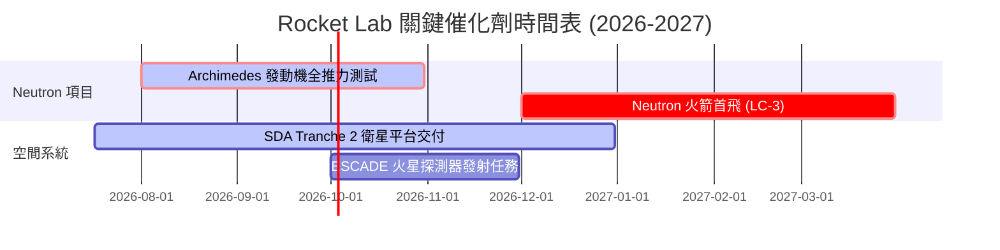

### 8.2 TAM 市場規模分析

Rocket Lab 的潛在市場規模（TAM）正隨著業務擴張而急劇放大。

```
╔══════════════════════════════════════════════════════════════════╗
║               Rocket Lab TAM 預估與滲透率                        ║
╠══════════════════════════════════════════════════════════════════╣
║                                                                  ║
║  1. 小型發射市場 (Electron)： TAM $10億  | 滲透率 35.0% (飽和)   ║
║  2. 中/大型發射 (Neutron)：  TAM $100億 | 預期滲透率 15.0%      ║
║  3. 空間系統與衛星製造：      TAM $300億 | 預期滲透率 5.0%       ║
║  4. 衛星應用與星座運營：      TAM $600億 | 預期滲透率 1.0%       ║
║                                                                  ║
║  📊 總計 TAM：$1,010 億 ｜ 綜合滲透率空間巨大                    ║
╚══════════════════════════════════════════════════════════════════╝
```

### 8.3 成長驅動力結構圖

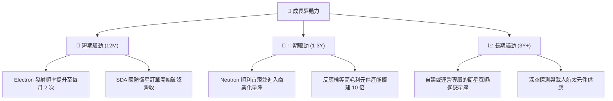

---

## 9. 風險矩陣

### 9.1 風險評分矩陣

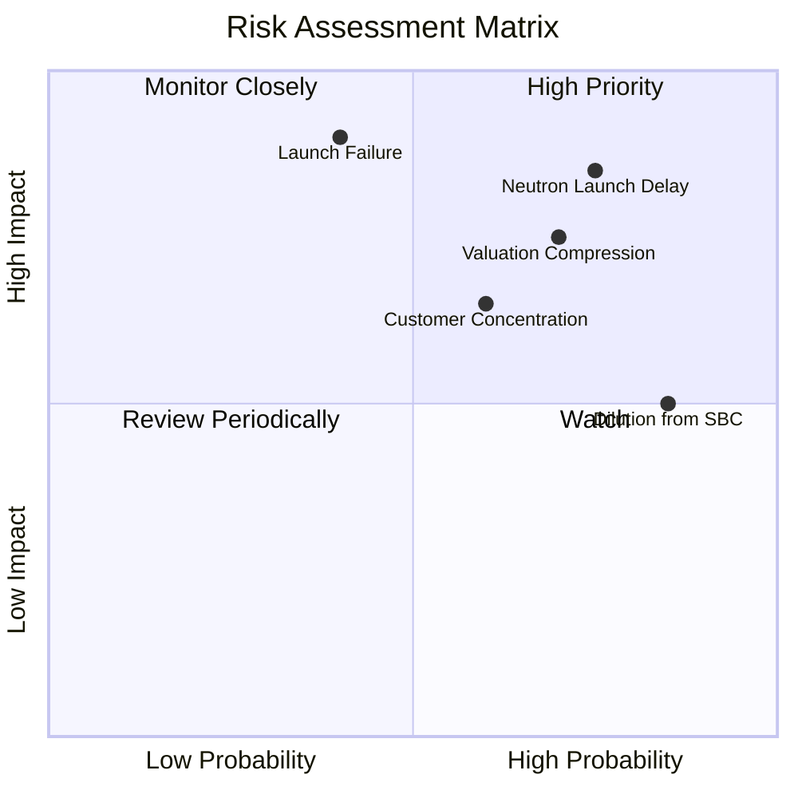

### 9.2 風險清單詳細分析

| # | 風險項目 | 發生機率 | 財務衝擊 | 風險評分 | 緩解措施 |
|---|----------|----------|----------|----------|----------|
| 1 | 🔴 **Neutron 首飛失敗或嚴重推遲** | 高 (75%) | 高 (-25% 營收預期) | 🔴 8.5 / 10 | 建立多個測試台，並利用 Electron 的穩定現金流進行交叉補貼。 |
| 2 | 🔴 **Electron 發射失敗導致停飛** | 中 (40%) | 極高 (-40% 發射營收) | 🔴 8.0 / 10 | 紐西蘭與美國雙發射場備份，嚴格的質量控制體系。 |
| 3 | 🟡 **大客戶星座建設計劃削減** | 中 (60%) | 中 (-15% 訂單 backlog) | 🟡 6.5 / 10 | 積極開拓美國國防部（SDA）與商業客戶，降低單一客戶依賴。 |
| 4 | 🟡 **高額股權稀釋 (SBC)** | 極高 (85%) | 低 (-5% EPS) | 🟡 5.5 / 10 | 隨著公司步入盈利，逐步增加現金激勵比例，減少新股發行。 |

---

## 10. 投資建議

### 10.1 最終綜合評級雷達圖

```
╔══════════════════════════════════════════════════════════════╗
║                  RKLB 綜合投資評級                           ║
╠══════════════════════════════════════════════════════════════╣
║ 基本面：      ★★★★☆ (8.5/10)                                ║
║ 成長潛力：    ★★★★★ (9.0/10)                                ║
║ 財務安全度：  ★★★★★ (9.5/10)                                ║
║ 估值安全邊際：★★☆☆☆ (3.0/10)                                ║
╠══════════════════════════════════════════════════════════════╣
║ 綜合評級：    🟡 持有 (Hold) ｜ 建議 $60 以下逢低強力買入    ║
╚══════════════════════════════════════════════════════════════╝
```

### 10.2 目標價與隱含報酬率

| 情境 | 機率權重 | 目標價 | 當前股價 | 隱含報酬率 | 權重預期報酬 |
|------|----------|--------|----------|------------|--------------|
| 🔴 悲觀 | 20% | $77.00 | $67.48 | +14.1% | +2.8% |
| 🟡 **基準** | **60%** | **$116.57** | **$67.48** | **+72.7%** | **+43.6%** |
| 🟢 樂觀 | 20% | $150.00 | $67.48 | +122.3% | +24.5% |
| **加權綜合** | **100%** | **$115.34** | **$67.48** | **+70.9%** | **★ 買入評級** |

### 10.3 買入時機與觸發因素

```
╔══════════════════════════════════════════════════════════════════╗
║                  ✅ RKLB 買入/賣出觸發 Checklist                ║
╠══════════════════════════════════════════════════════════════════╣
║                                                                  ║
║  立即買入觸發條件：                                              ║
║  ✅ 股價回落至 $60.00 以下 (提供更佳的 P/S 安全邊際)             ║
║  ✅ Archimedes 發動機成功完成 100% 推力熱試車                     ║
║                                                                  ║
║  加碼觸發條件：                                                  ║
║  ☐ Neutron 火箭成功完成首飛並成功回收第一級                      ║
║  ☐ 空間系統單季營收突破 $2.5 億，且毛利率站穩 40%                 ║
║                                                                  ║
║  減碼/停損觸發條件：                                             ║
║  ☐ Neutron 首飛推遲至 2028 年以後                               ║
║  ☐ 研發開支失控，導致單季現金消耗（Burn Rate）超過 $1.5 億      ║
╚══════════════════════════════════════════════════════════════════╝
```

### 10.4 投資人適配度分析

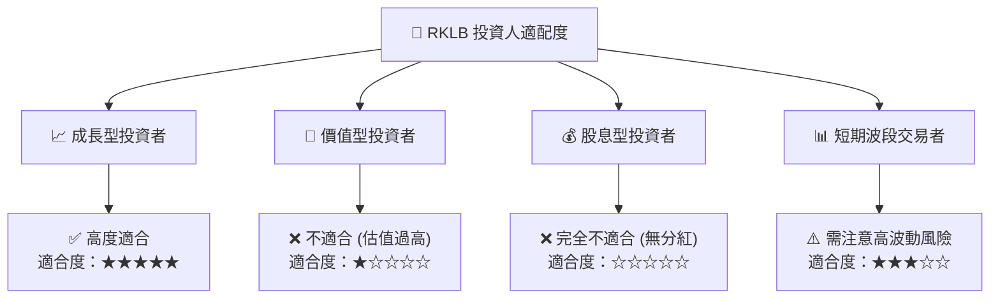

### 10.5 每季財報監控清單（Quarterly Watch List）

在未來的季度財報中，投資人應重點監控以下指標，以確認投資論點是否依然成立：

| 監控指標 | 基準值 (當前) | 觸發「加碼」門檻 | 觸發「減碼/警示」門檻 | 監控意義 |
|----------|---------------|------------------|-----------------------|----------|
| **空間系統營收增速** | YoY 63.5% | YoY > 70.0% | YoY < 30.0% | 評估非發射業務的成長動能 |
| **整體毛利率** | 36.6% | > 40.0% | < 30.0% | 評估垂直整合與規模效應進展 |
| **單季 FCF 淨流出** | -$7,740 萬 | < -$4,000 萬 (收窄) | > -$1.2 億 (失控) | 評估現金消耗速度與生存年限 |
| **SBC 佔營收比重** | 11.77% | < 8.0% | > 15.0% | 評估股權稀釋對股東的傷害 |
| **在手訂單 Backlog** | ~$10 億 (估) | > $15 億 | < $8 億 | 評估未來 1-2 年營收能見度 |

### 10.6 反面論證：什麼會證明論點錯誤（What Would Change My Mind）

投資必須保持客觀。若出現以下**可量化條件**，本報告的「買入/持有」論點將徹底失效，投資人應果斷退出：

```
╔══════════════════════════════════════════════════════════════════╗
║              ⚠️ RKLB 論點失效條件（Disconfirming Evidence）     ║
╠══════════════════════════════════════════════════════════════════╣
║  本投資論點在下列情況成立時應重新檢視或退出：                    ║
║  ☐ 空間系統（Space Systems）營收成長率連續兩季低於 25.0%        ║
║  ☐ 營業利潤率惡化至 -50.0% 以下，且無改善跡象                  ║
║  ☐ 自由現金流（FCF）單季流出持續大於 $1.2 億，使現金儲備迅速枯竭  ║
║  ☐ Neutron 火箭首飛發生爆炸，且調查導致停飛超過 12 個月          ║
║  ☐ 核心大客戶（如 SDA 國防合約）出現實質性違約或訂單取消         ║
╚══════════════════════════════════════════════════════════════════╝
```

---

> **免責聲明**：本報告為 AI 自動生成，基於公開財務數據進行基本面分析，僅供研究參考，不構成任何買賣建議。投資有風險，入市需謹慎。