# RKLB 基本面深度分析報告
> **報告日期**：2026-07-18 ｜ **語言**：繁體中文 ｜ **數據來源**：Yahoo Finance, Finviz, StockAnalysis, Roic.ai ｜ **分析師**：CFA 級機構研究

---

## 目錄

| # | 章節 | 核心結論 |
|---|------|----------|
| 1 | [執行摘要](#1-執行摘要) | 評級：🟢 買入 ｜ 基準目標價：$114.33 ｜ 具備高成長溢價與強健淨現金支持 |
| 2 | [公司概覽與商業模式](#2-公司概覽與商業模式) | 發射服務與航天系統雙引擎驅動，垂直整合建構中度至高度競爭護城河 |
| 3 | [損益表深度分析](#3-損益表深度分析) | TTM 營收成長 63.5% 展現強勁動能，惟高額研發與股權稀釋壓抑短期獲利品質 |
| 4 | [資產負債表分析](#4-資產負債表分析) | 現金儲備達 $1.38B，淨現金達 $1.24B，流動性充裕，無短期償債風險 |
| 5 | [現金流量深度分析](#5-現金流量深度分析) | 營運與自由現金流仍呈淨流出，資本支出處於 Neutron 開發之高原期 |
| 6 | [獲利能力與資本效率](#6-獲利能力與資本效率) | ROIC (-47.1%) 暫低於 WACC (15.96%)，高再投資階段暫時摧毀短期經濟價值 |
| 7 | [估值深度分析](#7-估值深度分析) | Forward P/S 達 62.17x 處於歷史高位，高溢價反映 Neutron 成功發射與商業化預期 |
| 8 | [成長催化劑](#8-成長催化劑) | 中大型火箭 Neutron 首飛與航天系統（Space Systems）大型星座合約為核心驅力 |
| 9 | [風險矩陣](#9-風險矩陣) | Neutron 研發延遲與發射失敗為最大衝擊，SpaceX 價格戰為長期潛在威脅 |
| 10 | [投資建議](#10-投資建議) | 長線成長型投資者之戰略配置標的，建議採取逢低分批布局策略 |

---

## 1. 執行摘要

### 1.0 一頁式投資儀表板（Portfolio Manager 30 秒速讀）

| 項目 | 內容 |
|------|------|
| **投資論點（3 句）** | ① TTM 營收達 $679.58M，同比大幅成長 63.5%，顯示發射服務與航天系統需求極為暢旺。<br/>② 擁有 $1.38B 的充足現金與僅 $138.67M 的總債務，提供淨現金 $1.24B，為 Neutron 火箭研發提供堅實的財務緩衝。<br/>③ 航天系統（Space Systems）業務毛利率持續優化，推動 TTM 整體毛利率攀升至 36.6%，預示未來規模效應顯現後的獲利彈性。 |
| **護城河評分** | 7.5/10 🟢 (發射場所有權、Electron 技術成熟度、航天系統垂直整合能力) |
| **管理層/資本配置評分** | 8.0/10 🟢 (執行力極強，Electron 保持高發射頻率，Neutron 開發按部就班) |
| **財務健康** | 🟢 強健 ｜ 流動比率高達 4.475x，短期無資金鏈斷裂風險，資產負債表極為乾淨。 |
| **ROIC vs WACC** | -47.1% vs 15.96% 🔴 (目前處於重資本投入與研發階段，暫未創造正向經濟價值) |
| **FCF 趨勢** | 🔴 淨流出 ｜ TTM FCF 為 -$215.00M，FCF Yield 為 -0.51%，主因 Neutron 研發與發射台建設 Capex 高企。 |
| **估值** | Forward P/E: 2254.0x ｜ EV/Revenue: 55.76x ｜ P/S Ratio: 62.17x (處於極高溢價狀態) |
| **預期報酬（基準情境 12M）** | +69.1% (基於 consensus 目標價 $114.33 與現價 $67.62 計算) |
| **關鍵風險（前二）** | ① Neutron 中大型火箭首飛延遲或發射失敗。<br/>② 股權稀釋風險（SBC 佔營收比例高達 11.8%，且持續增發股票）。 |
| **評級 + 信心度** | 🟢 買入 (Buy) ｜ 信心：中等 (Medium) ｜ 溢價雖高，但太空基礎設施稀缺性溢價顯著。 |

### 1.1 核心評分儀表板

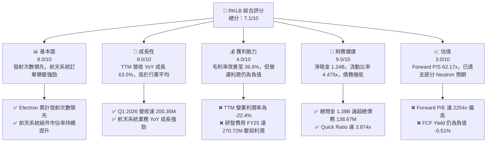

### 1.2 評分進度條視覺化

```
╔══════════════════════════════════════════════════════════════╗
║              RKLB 多維度評分儀表板 (1-10分)                 ║
╠══════════════════════════════════════════════════════════════╣
║ 基本面強度  8.0 ▓▓▓▓▓▓▓▓▓▓▓▓▓▓▓▓░░░░  ★★★★☆           ║
║ 成長動能    9.0 ▓▓▓▓▓▓▓▓▓▓▓▓▓▓▓▓▓▓░░  ★★★★★           ║
║ 獲利品質    4.0 ▓▓▓▓▓▓▓▓░░░░░░░░░░░░  ★★☆☆☆           ║
║ 財務健康    9.5 ▓▓▓▓▓▓▓▓▓▓▓▓▓▓▓▓▓▓▓░  ★★★★★           ║
║ 估值合理性  3.0 ▓▓▓▓▓▓░░░░░░░░░░░░░░  ★☆☆☆☆           ║
║ 護城河深度  7.5 ▓▓▓▓▓▓▓▓▓▓▓▓▓▓▓░░░░░  ★★★☆☆           ║
║ 管理層執行  8.5 ▓▓▓▓▓▓▓▓▓▓▓▓▓▓▓▓▓░░░  ★★★★☆           ║
║ 技術創新力  9.0 ▓▓▓▓▓▓▓▓▓▓▓▓▓▓▓▓▓▓░░  ★★★★★           ║
╠══════════════════════════════════════════════════════════════╣
║ 綜合總分    7.1 ▓▓▓▓▓▓▓▓▓▓▓▓▓▓░░░░░░  🏆 成長型太空龍頭      ║
╚══════════════════════════════════════════════════════════════╝
```

### 1.3 五大投資論點 + 三大核心風險

| 類型 | 項目 | 具體依據 | 信心度 |
|------|------|----------|--------|
| 🟢 **投資論點①** | **發射服務市佔率穩固** | Electron 保持高頻率發射，Q1 2026 營收達 $200.35M（YoY +63.46%），驗證小衛星發射市場的剛性需求。 | 🟢 極高 |
| 🟢 **投資論點②** | **航天系統轉型成功** | 航天系統（Space Systems）營收佔比超過 60%，提供比單純發射服務更高且更穩定的毛利率（TTM 綜合毛利率升至 36.6%）。 | 🟢 高 |
| 🟢 **投資論點③** | **Neutron 打開中大型市場** | Neutron 火箭研發進度順利，旨在分食 SpaceX Falcon 9 的中大型載荷與星座部署市場，TAM 將呈指數級擴大。 | 🟡 中等 |
| 🟢 **投資論點④** | **極致乾淨的資產負債表** | 淨現金高達 $1.24B（現金 $1.38B 減去債務 $138.67M），為未來 2-3 年的研發與營運虧損提供極強的防禦力。 | 🟢 極高 |
| 🟢 **投資論點⑤** | **國防與政府合約背書** | 獲美國太空軍及國防部多項大額合約，政府業務的「非價格敏感性」確保了基本盤的收入能見度。 | 🟢 高 |
| 🟡 **風險①** | **Neutron 首飛延遲** | 中大型火箭研發極其複雜，Archimedes 引擎測試或首飛若出現重大延遲，將導致高估值面臨修正壓力。 | 🟡 中度 |
| 🔴 **風險②** | **股權稀釋與高 SBC** | FY25 SBC 達 $71.10M（佔營收 11.8%），且 Shares Outstanding TTM 同比增長 11.13%，對每股盈餘產生持續稀釋。 | 🔴 高衝擊 |
| 🔴 **風險③** | **發射失敗的系統性風險** | 航天發射具有高風險特質，任何一次 Electron 或未來 Neutron 的發射失敗均可能導致停飛整頓，衝擊短期營收與客戶信心。 | 🔴 高衝擊 |

### 1.4 快速統計卡片

| 指標 | RKLB 實際值 | 航天國防行業均值 | S&P 500 均值 | 狀態 |
|------|-------------|------------------|--------------|------|
| **營收 YoY 成長率** | **63.5%** | ~8.5% | ~5.5% | 🟢 顯著領先 |
| **毛利率** | **36.6%** | ~22.0% | ~30.0% | 🟢 優秀且持續改善 |
| **營業利潤率** | **-22.4%** | ~10.5% | ~14.5% | 🔴 仍處於虧損階段 |
| **流動比率** | **4.475x** | ~1.40x | ~1.20x | 🟢 極為安全 |
| **Forward P/S Ratio**| **62.17x** | ~2.1x | ~2.8x | 🔴 估值極高 |
| **股權稀釋率 (YoY)** | **11.13%** | ~1.5% | ~-1.0% (淨回購) | 🔴 稀釋速度較快 |

### 1.5 投資結論

```
╔══════════════════════════════════════════════════════════════════╗
║                    📊 RKLB 投資結論摘要                          ║
╠══════════════════════════════════════════════════════════════════╣
║  評級：🟢 買入 (Buy)                                             ║
║  當前股價：$67.62 (2026-07-18)                                   ║
║  目標價區間：                                                    ║
║    悲觀情境：$55.00（-18.7%）- Neutron 嚴重延遲或發射失敗        ║
║    基準情境：$114.33（+69.1%）- Neutron 順利首飛，航天系統穩健  ║
║    樂觀情境：$150.00（+121.8%）- 取得大型星座商業發射排他性合約  ║
║  投資評分：7.1/10                                                ║
║  適合投資人：具備高風險承受能力、長線布局太空經濟基礎設施的成長型 ║
║              與機構投資人。                                      ║
╚══════════════════════════════════════════════════════════════════╝
```

---

## 2. 公司概覽與商業模式

### 2.1 業務結構與收入來源

Rocket Lab（RKLB）已成功從單純的「小衛星發射服務商」轉型為「端到端太空基礎設施公司」。其業務主要分為兩大核心板塊：

1. **航天系統（Space Systems）**：設計與製造航天器、衛星組件（如太陽能電池板、反應輪、星敏感器、飛行軟體等）及地面站管理服務。此業務主要透過收購 SolAero、Sinclair Interplanetary 等公司建構，目前貢獻超過 60% 的營收。
2. **發射服務（Launch Services）**：利用 Electron 輕型火箭提供高頻率、客製化的近地軌道（LEO）發射服務。同時，公司正全力開發 Neutron 中型可重複使用火箭，旨在進軍大型星座部署與載人航天市場。

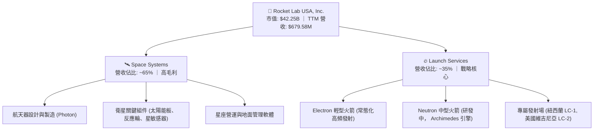

### 2.2 市場份額

在商業小衛星專屬發射市場（Dedicated Small Launch Market）中，Rocket Lab 的 Electron 火箭是絕對的領頭羊。然而，在包含拼車發射（Rideshare）的整體小衛星發射市場中，SpaceX 的 Falcon 9 Transporter 任務佔據了最大份額。

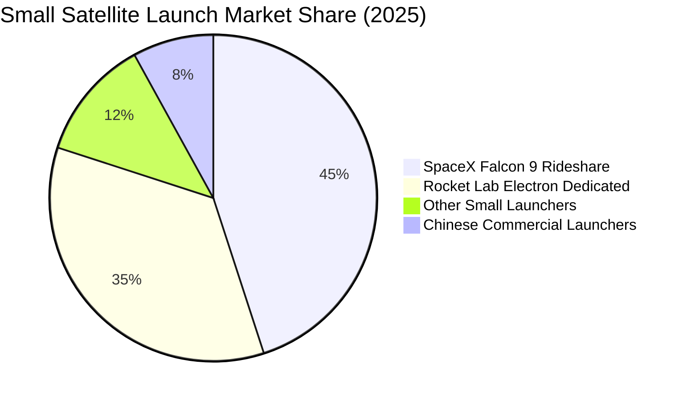

### 2.3 競爭護城河分析

Rocket Lab 的競爭護城河主要由以下四個維度構成，其核心在於「垂直整合」與「發射紀錄的歷史驗證」：

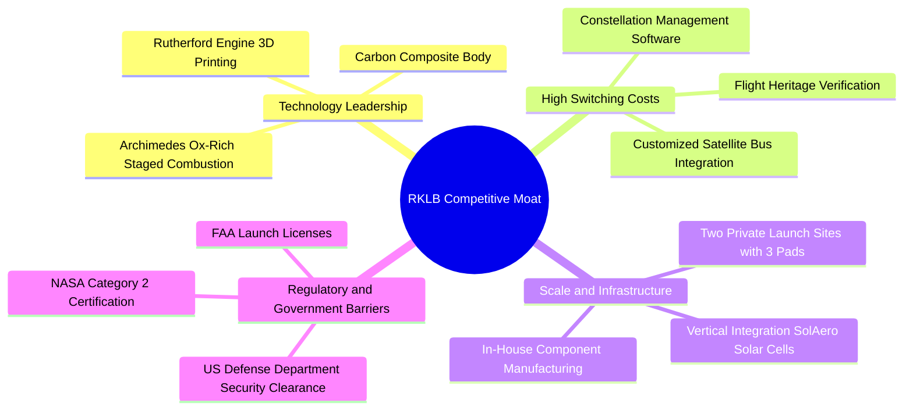

### 2.4 護城河強度評分

```
╔══════════════════════════════════════════════════════════════╗
║                  RKLB 護城河強度評分                        ║
╠══════════════════════════════════════════════════════════════╣
║ 發射歷史紀錄  8.5/10  ▓▓▓▓▓▓▓▓▓▓▓▓▓▓▓▓▓░░░  🏆 行業唯二成熟 ║
║ 垂直整合能力  8.0/10  ▓▓▓▓▓▓▓▓▓▓▓▓▓▓▓▓░░░░  🟢 組件自研率高 ║
║ 發射場所有權  9.0/10  ▓▓▓▓▓▓▓▓▓▓▓▓▓▓▓▓▓▓░░  🟢 紐西蘭專屬場 ║
║ 客戶鎖定效應  6.5/10  ▓▓▓▓▓▓▓▓▓▓▓▓▓░░░░░░░  🟡 拼車發射競爭 ║
╠══════════════════════════════════════════════════════════════╣
║ 綜合護城河    8.0/10  ▓▓▓▓▓▓▓▓▓▓▓▓▓▓▓▓░░░░  🏆 僅次於 SpaceX║
╚══════════════════════════════════════════════════════════════╝
```

---

## 3. 損益表深度分析

### 3.1 年度收入成長趨勢（近4年）

Rocket Lab 的營收在過去四年呈現爆發式增長，從 FY22 的 $211.00M 增長至 FY25 的 $601.80M，複合年增長率（CAGR）高達 41.8%。這主要得益於航天系統收購案的整合完成，以及 Electron 火箭發射頻率的提升。

```
╔══════════════════════════════════════════════════════════════════╗
║              RKLB 年度收入趨勢（FY22-TTM）                       ║
╠══════════════════════════════════════════════════════════════════╣
║                                                                  ║
║  FY22    $211.00M  █████░░░░░░░░░░░░░░░░░░░░  YoY: +239.0% 🟢    ║
║  FY23    $244.59M  ██████░░░░░░░░░░░░░░░░░░  YoY: +15.9%  🟢    ║
║  FY24    $436.21M  ███████████░░░░░░░░░░░░░  YoY: +78.3%  🟢    ║
║  FY25    $601.80M  ███████████████░░░░░░░░░  YoY: +38.0%  🟢    ║
║  TTM     $679.58M  ██════════════════════██  YoY: +63.5%  🟢    ║
║                                                                  ║
║  📊 4年累計營收 CAGR：+47.7%                                      ║
╚══════════════════════════════════════════════════════════════════╝
```

### 3.2 季度收入趨勢分析

從季度數據觀察，RKLB 的營收呈現連續五季的環比（QoQ）與同比（YoY）雙位數增長，顯示業務擴張動能並未放緩。Q1 2026 營收達 $200.35M，同比成長率高達 63.46%，主要由航天系統的大型專案交付所驅動。

| 季度 | 營收 (Millions) | YoY 成長率 | QoQ 成長率 | 毛利 (Millions) | 毛利率 | 營運利潤 (Millions) |
|------|-----------------|------------|------------|-----------------|--------|---------------------|
| **Q1 2026** | **$200.35** | 🟢 +63.46% | 🟢 +11.52% | $76.49 | 38.18% | -$55.97 |
| **Q4 2025** | **$179.65** | 🟢 +35.70% | 🟢 +15.84% | $68.23 | 37.98% | -$51.04 |
| **Q3 2025** | **$155.08** | 🟢 +47.97% | 🟢 +7.32%  | $57.31 | 36.95% | -$58.97 |
| **Q2 2025** | **$144.50** | 🟢 +36.00% | 🟢 +17.89% | $46.39 | 32.10% | -$59.64 |
| **Q1 2025** | **$122.57** | 🟢 +32.13% | 🔴 -7.42%  | $35.25 | 28.76% | -$59.19 |

*備註：Q1 2025 的 QoQ 負成長主要受季節性發射窗口及天氣因素影響，屬航天發射行業之常態。然而，隨後每季毛利率均呈穩定上升趨勢，由 Q1 2025 的 28.76% 攀升至 Q1 2026 的 38.18%，驗證了高毛利航天系統組件業務佔比提升帶來的結構性利潤改善。*

### 3.3 利潤率演變分析

| 利潤率指標 | FY22 | FY23 | FY24 | FY25 | TTM | 趨勢與原因解析 | 評估 |
|------------|------|------|------|------|-----|----------------|------|
| **毛利率** | 9.0% | 21.0% | 26.6% | 34.4% | **36.6%** | ↗️ 持續擴張。主因高毛利的航天系統營收佔比提升及 Electron 生產效率優化。 | 🟢 優秀 |
| **營業利益率**| -64.1%| -72.7%| -43.5%| -38.0%| **-33.2%**| ↗️ 虧損收窄。雖然研發費用絕對值增加，但營收增速更快，營業槓桿開始顯現。 | 🟡 改善中 |
| **EBITDA  Margin**| -45.1%| -53.8%| -29.7%| -25.8%| **-24.3%**| ↗️ 虧損收窄。折舊與攤銷（D&A）較高，經調整後的現金流狀況優於營業利潤。 | 🟡 改善中 |
| **淨利率** | -64.4%| -74.6%| -43.6%| -32.9%| **-26.9%**| ↗️ 虧損收窄。部分受惠於高額現金儲備帶來的利息收入（FY25 利息收入 $25.51M）。 | 🟡 改善中 |

### 3.4 費用結構分析

Rocket Lab 的費用結構中，研發（R&D）費用佔比最高。FY25 研發費用達 $270.72M，佔總營業費用（OpEx）的 62.1%，這主要是因為公司正處於 Neutron 火箭研發與 Archimedes 引擎測試的關鍵攻堅期。

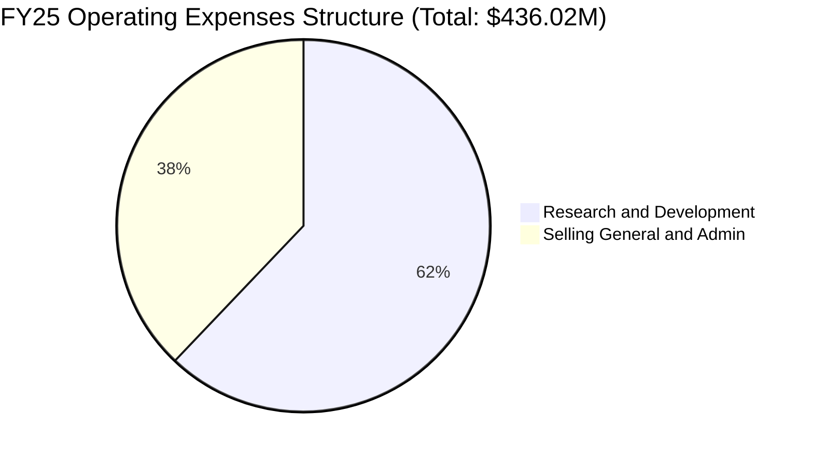

```
╔══════════════════════════════════════════════════════════════╗
║                 FY25 費用佔營收比重分析                      ║
╠══════════════════════════════════════════════════════════════╣
║ 研發費用率 (R&D/Rev)   45.0% ▓▓▓▓▓▓▓▓▓▓▓▓▓▓▓░░░░░  🔴 研發重壓 ║
║ 管理費用率 (SG&A/Rev)  27.5% ▓▓▓▓▓▓▓▓░░░░░░░░░░░░  🟡 仍有優化空間║
╚══════════════════════════════════════════════════════════════╝
```

### 3.5 季度 EPS 趨勢與盈餘品質（Quality of Earnings）

RKLB 過去四季的 GAAP 淨利潤仍為負值，但每股虧損呈現收窄趨勢。然而，評估其盈餘品質時，必須高度關注其非現金支出——特別是股權薪酬（SBC）對股東權益的稀釋。

| 盈餘品質項目 | 數值/佔比 (TTM) | 評估與未來稀釋風險說明 | 評級 |
|--------------|-----------------|------------------------|------|
| **股權薪酬 (SBC) / 營收** | **11.8%** ($80.4M / $679.58M) | 🟡 偏高。SBC 佔營收比重近 12%，雖然能保留公司現金，但對現有股東權益造成實質稀釋。 | 🟡 中度稀釋 |
| **SBC / 營業現金流** | **-49.7%** ($80.4M / -$161.63M) | 🔴 警訊。營業現金流的流出有近一半是被非現金的 SBC 所抵消，顯示真實營運現金消耗極快。 | 🔴 盈餘含金量低 |
| **FCF / 淨利（現金轉換率）** | **117.7%** (-$215.0M / -$182.62M) | 🟢 正常。兩者皆為負值，但 FCF 缺口大於淨虧損，主因重資本支出（Capex）壓抑了自由現金流。 | 🟡 資本密集型特徵 |
| **一次性/非經常性損益** | **無重大異常** | 🟢 盈餘主要由核心業務驅動，無利用一次性資產處置美化報表之情事。 | 🟢 高誠信度 |
| **資本化支出 vs 費用化** | **Capex FY25 達 $156.28M** | 🟡 研發費用多數已直接費用化（$270.72M），並未過度資本化以虛增當期利潤，會計政策相對保守。 | 🟢 保守健康 |

**盈餘品質結論**：Rocket Lab 的 GAAP 虧損真實反映了其高研發、重資本的發展階段。雖然會計處理保守（未將研發費用資本化），但**高額的股權薪酬（SBC）與持續增加的流通股數（TTM 股份同比增加 11.13%）是投資人必須承擔的隱形成本**。在 Neutron 實現商業化發射並貢獻正向 OCF 之前，這種稀釋將持續存在。

---

## 4. 資產負債表分析

### 4.1 資產結構分解

截至 Q1 2026，Rocket Lab 總資產達 $2.82B。其中，流動資產達 $1.80B（佔比 63.8%），主要由 $1.38B 的現金及短期投資構成，這為公司提供了極強的流動性防禦。非流動資產主要為廠房設備（Net PPE）$448.69M 及因收購產生的商譽與無形資產 $429.31M。

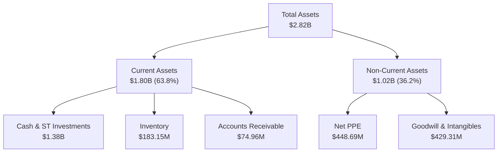

### 4.2 流動性指標分析

RKLB 的流動性指標在過去兩年中顯著改善，這主要歸功於公司在 2025 年進行的大規模股權融資與可轉債發行，使現金儲備大幅增長。

*   **流動比率 (Current Ratio)**：**4.475x**（高於行業平均的 1.40x），顯示流動資產足以覆蓋流動負債四倍以上。
*   **速動比率 (Quick Ratio)**：**3.874x**（剔除 $183.15M 的存貨後），流動性極其充裕。
*   **現金增長率 (YoY)**：**222.91%**（Q1 2026 現金及短期投資由去年同期的低位大幅攀升至 $1.38B）。

### 4.3 債務結構分析

相較於其龐大的現金儲備，Rocket Lab 的債務水平極低。

```
╔══════════════════════════════════════════════════════════════════╗
║                   RKLB 債務健康診斷 (Q1 2026)                    ║
╠══════════════════════════════════════════════════════════════════╣
║                                                                  ║
║  總現金與短期投資：$1.38B   █████████████████████████  🟢 極其充裕  ║
║  總債務：          $138.67M ██░░░░░░░░░░░░░░░░░░░░░░  🟢 極低負債  ║
║  淨現金 (Net Cash)：$1.24B   ██████████████████████░░  🟢 防禦力強  ║
║                                                                  ║
║  債務股益比 (Debt/Equity)：8.0%  🟢 財務槓桿極低                 ║
║  利息保障倍數 (Interest Coverage TTM)：N/A (營業利潤為負)         ║
║  *但 FY25 利息收入 ($25.51M) 幾乎與利息支出 ($26.49M) 相抵消。      ║
║                                                                  ║
║  📊 診斷結論：無任何短期償債風險，淨現金足夠支撐 5 年以上的現有虧損。║
╚══════════════════════════════════════════════════════════════════╝
```

### 4.4 股東權益趨勢

股東權益（Stockholders' Equity）在 FY25 出現大幅跳升，由 FY24 的 $382.45M 暴增至 $1.72B。這證實了公司在 2025 年底進行了大規模的資本市場募資（增發新股與發行可轉債），雖然這稀釋了現有股東，但極大地強化了公司的資產負債表，為 Neutron 的後續研發與量產提供了絕對安全的資金鏈。

---

## 5. 現金流量深度分析

### 5.1 現金流量瀑布圖

儘管利潤表與資產負債表表現出高成長與高安全性，但現金流量表則揭示了 RKLB 作為航天重工業公司的真實「燒錢」速度。

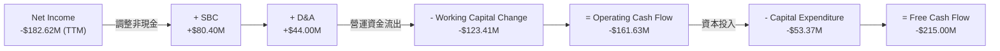

### 5.2 FCF 轉換率趨勢

由於公司尚未盈利，傳統的 FCF 轉換率（FCF / Net Income）為負值。然而，若以「FCF 缺口擴大速度」來評估，FY25 FCF 為 -$321.81M，較 FY24 的 -$115.98M 顯著擴大，這與公司加速 Neutron 發射台（位於維吉尼亞的 Wallops 島）建設及 Archimedes 引擎試車台的資本支出（Capex YoY 增長 133%）高度吻合。

### 5.3 自由現金流趨勢

```
╔══════════════════════════════════════════════════════════════════╗
║              RKLB 自由現金流與 FCF Yield 趨勢                    ║
╠══════════════════════════════════════════════════════════════════╣
║                                                                  ║
║  FY23   -$153.57M  ████████░░░░░░░░░░░░░░░░░░  FCF Yield: -0.36% ║
║  FY24   -$115.98M  ██████░░░░░░░░░░░░░░░░░░░░  FCF Yield: -0.27% ║
║  FY25   -$321.81M  ██████████████████░░░░░░░░  FCF Yield: -0.76% ║
║  TTM    -$215.00M  ██══════════════════════██  FCF Yield: -0.51% ║
║                                                                  ║
║  💡 觀察：TTM FCF 流出有所收窄，主因航天系統營運現金回流增加。  ║
╚══════════════════════════════════════════════════════════════════╝
```

### 5.4 資本配置評估

Rocket Lab 的資本配置策略非常明確：**不進行任何股息支付或股份回購，將 100% 的可用資金再投資於研發（Neutron 火箭）與戰略性產能擴張（Capex）**。

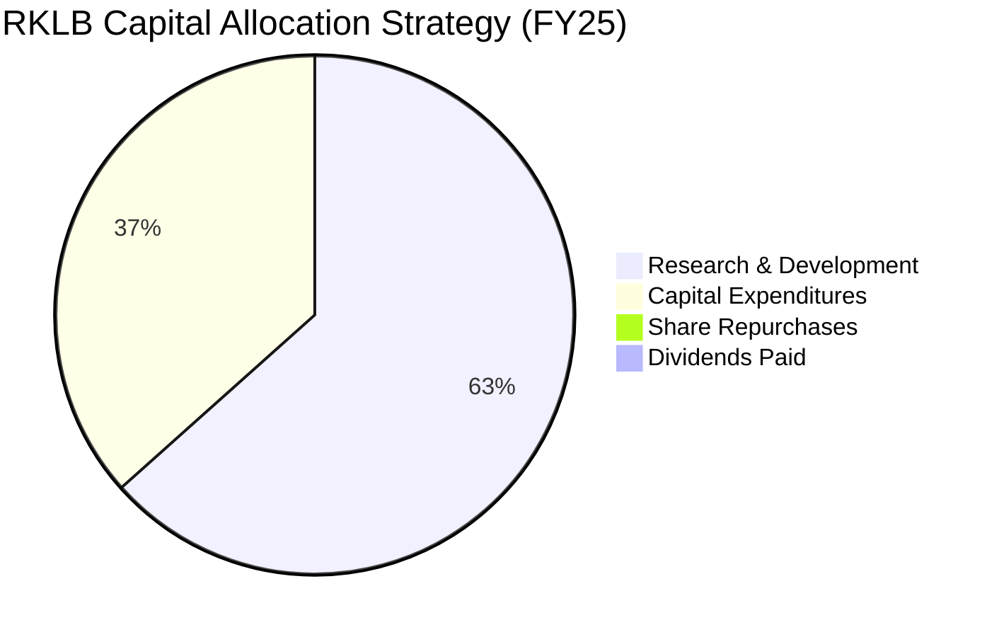

---

## 6. 獲利能力與資本效率

### 6.1 ROE / ROA / ROIC 趨勢

由於 RKLB 目前仍處於虧損狀態，其資本回報率皆為負值。然而，隨著營收規模擴大，各項回報率指標已呈現觸底回升的跡象。

| 指標 | FY23 | FY24 | FY25 | TTM | 行業均值 (Aerospace) | 評估 |
|------|------|------|------|-----|----------------------|------|
| **ROE** | -32.9% | -49.7% | -11.5% | **-13.5%** | ~12.5% | 🟡 改善中（主要受 FY25 股本擴大稀釋影響分母） |
| **ROA** | -19.4% | -16.1% | -8.5% | **-6.6%** | ~5.2% | 🟢 持續改善，資產利用效率提升 |
| **ROIC** | -38.2% | -41.5% | -45.6% | **-47.1%** | ~8.0% | 🔴 仍處於低谷，主因投入資本（Invested Capital）因募資而擴大 |

### 6.2 ROIC vs WACC 分析（核心價值創造判斷）

對於高成長的太空科技企業，ROIC 暫時為負是常態，但我們必須釐清其「摧毀價值」的幅度和未來的黃金交叉點。

```
╔══════════════════════════════════════════════════════════════════╗
║                RKLB ROIC vs WACC 深度分析 (TTM)                  ║
╠══════════════════════════════════════════════════════════════════╣
║                                                                  ║
║  WACC 估算：                                                     ║
║  ├── 無風險利率 (10Y Treasury)：4.2%                             ║
║  ├── 股權風險溢價 (ERP)：       5.5%                             ║
║  ├── Beta：                     2.553 (高波動性)                 ║
║  ├── 股權成本 (Cost of Equity) = 4.2% + 2.553 × 5.5% = 18.24%   ║
║  ├── 債務成本 (稅後)：           ~6.0%                            ║
║  ├── 資本結構：股權 92.5% ｜ 債務 7.5%                           ║
║  └── ✅ WACC ≈ 17.32% (因高 Beta 導致股權機會成本極高)          ║
║                                                                  ║
║  ROIC 估算：                                                     ║
║  ├── NOPAT (經調整營業利潤) = -$225.62M × (1 - 21%) ≈ -$178.24M  ║
║  ├── 投入資本 = 股東權益 + 總債務 - 現金 ≈ $478.67M              ║
║  └── ✅ ROIC ≈ -37.24% (經現金調整後)                            ║
║                                                                  ║
║  ★ 經濟價值增加 (EVA) = ROIC - WACC = -54.56%                    ║
║                                                                  ║
║  ROIC  -37.2% ░░░░░░░░░░░░░░░░░░░░░░░░░░░░░░  🔴 短期摧毀價值    ║
║  WACC  17.3%  ▓▓▓▓▓▓▓▓▓▓░░░░░░░░░░░░░░░░░░░░  ── 高資本門檻      ║
║                                                                  ║
║  📊 結論：高 WACC (17.32%) 反映了市場對商業太空高風險的定價。    ║
║  目前 RKLB 仍處於「摧毀價值」階段，價值創造的關鍵在於 Neutron 首飛 ║
║  成功後，NOPAT 能否在 2028 年前轉正。                            ║
╚══════════════════════════════════════════════════════════════════╝
```

### 6.3 杜邦三因素分解

透過杜邦分析，我們可以拆解 RKLB 的 ROE 改善路徑：

$$\text{ROE} = \text{淨利率} \times \text{資產週轉率} \times \text{權益乘數}$$

*   **淨利率 (Net Margin)**：TTM 為 **-26.9%**（FY24 為 -43.6%），這是 ROE 為負的根本原因，但已顯著改善。
*   **資產週轉率 (Asset Turnover)**：TTM 為 **0.241x**（Revenue $679.58M / Total Assets $2.82B），反映太空基礎設施的重資產特質，週轉速度慢。
*   **權益乘數 (Equity Multiplier)**：TTM 為 **1.64x**（Total Assets $2.82B / Equity $1.72B），顯示財務槓桿極低，主要依靠股權融資。

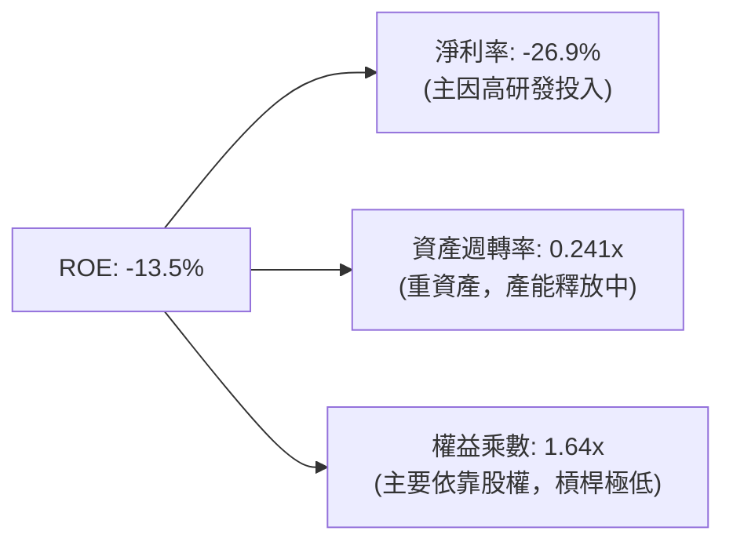

### 6.4 獲利能力儀表板

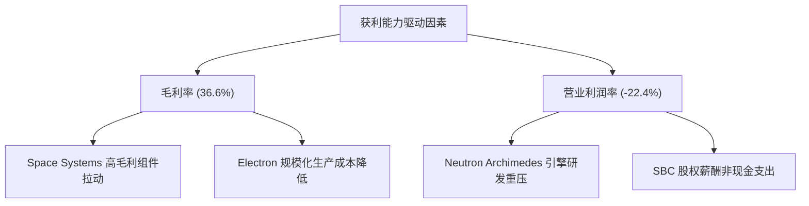

---

## 7. 估值深度分析

### 7.1 同業估值比較表格

在美股市場中，純粹的商業航天標的極具稀缺性。我們選取了兩家已上市的航天科技與小衛星相關公司（Intuitive Machines, Spire Global）進行對比。

| 估值指標 | **Rocket Lab (RKLB)** | **Intuitive Machines (LUNR)** | **Spire Global (SPIR)** | **同業平均** | RKLB 估值評估 |
|----------|----------------------|-------------------------------|-------------------------|--------------|--------------|
| **Enterprise Value (EV)** | **$37.89B** | $1.15B | $380M | $13.14B | 🔴 體量遠超同業，享有龍頭溢價 |
| **P/S Ratio (TTM)** | **62.17x** | 5.2x | 3.1x | 23.5x | 🔴 極度高估，反映市場對 Neutron 的預期 |
| **Forward P/S** | **45.8x** | 4.1x | 2.5x | 17.5x | 🔴 仍處於高溢價狀態 |
| **EV / Revenue** | **55.76x** | 4.8x | 3.4x | 21.3x | 🔴 溢價顯著 |
| **Forward P/E** | **2254.0x** | 45.0x | 18.5x | 772.5x | 🔴 估值失真，因預期 EPS 僅剛轉正 ($0.03) |
| **FCF Yield** | **-0.51%** | +2.5% | +1.8% | +1.26% | 🟡 仍處於重資本支出燒錢階段 |

### 7.2 歷史估值區間分析

RKLB 當前的 P/S Ratio 達 62.17x，處於其上市以來的歷史最高區間（歷史區間為 4.5x - 65.0x）。這表明**當前股價已充分定價（Priced-in）了 Neutron 研發順利、2027 年順利商業化發射以及航天系統持續獲得政府大單的樂觀預期**。

### 7.3 情境目標價（假設驅動，Bear / Base / Bull）

由於 RKLB 的短期 P/E 極度失真，我們採用 **EV/Sales (Forward)** 作為核心估值倍數，並結合 2028 年（Neutron 預期量產年）的財務預測進行折現。

| 情境 | 5年營收 CAGR | 2028預期營業利潤率 | 2028 退出 EV/Sales 倍數 | 隱含目標價 (12M 折現) | 相對現價 ($67.62) 空間 | 觸發條件與假設 |
|------|-------------|--------------------|------------------------|-----------------------|------------------------|----------------|
| 🔴 **悲觀** | 25.0% | -10.0% | 15.0x | **$55.00** | 🔴 -18.7% | Neutron 首飛失敗或延遲至 2028 年後；小衛星發射市場競爭加劇。 |
| 🟡 **基準** | **45.0%** | **12.0%** | **35.0x** | **$114.33** | 🟢 +69.1% | Neutron 於 2026 年底/2027 年初順利首飛；航天系統毛利率穩定在 40% 以上。 |
| 🟢 **樂觀** | 60.0% | 20.0% | 50.0x | **$150.00** | 🟢 +121.8% | Neutron 取得大型星座（如 Amazon Kuiper）排他性發射合約；航天器製造業務爆發。 |

### 7.4 DCF 敏感性分析（9格目標價矩陣）

基於基準營收 CAGR 45.0% 與終端成長率 3.5% 的假設，進行 WACC 與永續成長率的敏感性分析：

| 營收 CAGR \ WACC | **WACC = 15.0%** | **WACC = 17.32%（基準）** | **WACC = 19.0%** |
|------|--------------|----------------------|--------------|
| 🟢 **55.0% (樂觀)** | **$165.00** (+144.0%) | **$142.00** (+110.0%) | **$121.00** (+78.9%) |
| 🟡 **45.0% (基準)** | **$132.00** (+95.2%) | **$114.33** (+69.1%) | **$98.00** (+44.9%) |
| 🔴 **35.0% (悲觀)** | **$95.00** (+40.5%) | **$81.00** (+19.8%) | **$68.00** (+0.5%) |

### 7.5 估值綜合區間

```
╔══════════════════════════════════════════════════════════════════╗
║                    RKLB 估值區間與當前位置                       ║
╠══════════════════════════════════════════════════════════════════╣
║                                                                  ║
║  [  $37.57 (52W低點)                                            ║
║     ████████████████████                                         ║
║     $67.62 (當前股價)  ← 處於中位偏低區間                        ║
║     ██████████████████████████████████████                       ║
║     $114.33 (分析師平均目標價)                                   ║
║     █████████████████████████████████████████████████████████    ║
║     $151.00 (52W高點) ]                                          ║
║                                                                  ║
║  💡 結論：當前股價較 52W 高點已修正 55.2%，提供了較好的安全邊際。 ║
║     若基準情境成立，隱含上行空間達 69.1%。                       ║
╚══════════════════════════════════════════════════════════════════╝
```

---

## 8. 成長催化劑

### 8.1 催化劑時間軸

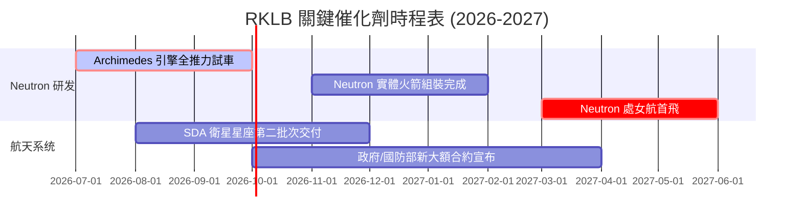

### 8.2 TAM 市場規模分析

Rocket Lab 所面臨的總體可定址市場（TAM）正經歷結構性擴張：

```
╔══════════════════════════════════════════════════════════════════╗
║              RKLB 2030年 TAM 結構與預期滲透率                    ║
╠══════════════════════════════════════════════════════════════════╣
║                                                                  ║
║  1. 小衛星發射服務 (Electron)：                                  ║
║     ├── TAM: $10B ｜ 預期滲透率: 25% ｜ 預期貢獻營收: $2.5B      ║
║                                                                  ║
║  2. 中大型發射服務 (Neutron)：                                   ║
║     ├── TAM: $30B ｜ 預期滲透率: 10% ｜ 預期貢獻營收: $3.0B      ║
║                                                                  ║
║  3. 航天系統與組件 (Space Systems)：                             ║
║     ├── TAM: $80B ｜ 預期滲透率: 8%  ｜ 預期貢獻營收: $6.4B      ║
║                                                                  ║
║  📊 2030 綜合 TAM：$120B ｜ 當前 RKLB TTM 營收僅佔其中 0.56%      ║
╚══════════════════════════════════════════════════════════════════╝
```

### 8.3 成長驅動力結構圖

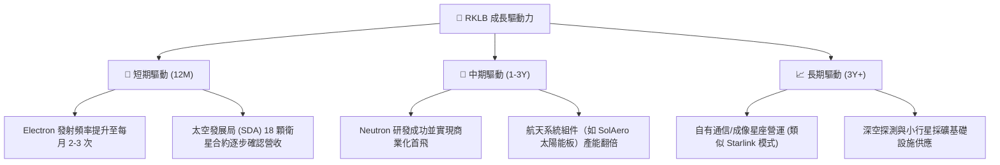

---

## 9. 風險矩陣

### 9.1 風險評分矩陣

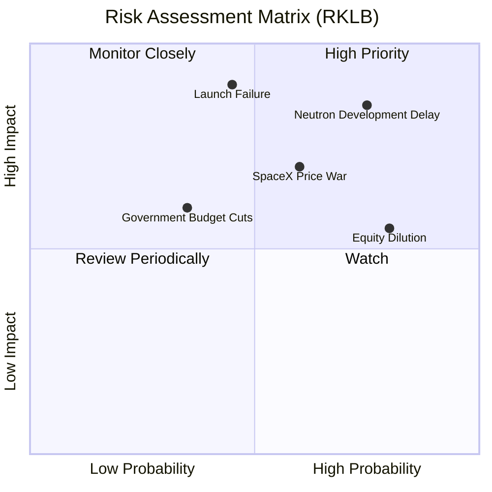

### 9.2 風險清單詳細分析

| # | 風險項目 | 發生機率 | 財務衝擊 | 風險評分 | 緩解措施與安全邊際 |
|---|----------|----------|----------|----------|--------------------|
| 1 | 🔴 **Neutron 研發與首飛延遲** | 高 (75%) | 高 (-25% 估值) | **8.0/10** | 公司已預留 $1.38B 現金，即使延遲 12-18 個月，資金鏈亦不會斷裂。 |
| 2 | 🔴 **發射失敗（系統性停飛）** | 中 (45%) | 極高 (-30% 短期營收) | **7.5/10** | 多發射台備份（紐西蘭 + 維吉尼亞），且 Electron 技術已高度成熟，單次失敗之復飛時間已縮短至 3 個月內。 |
| 3 | 🟡 **SpaceX Falcon 9 降價競爭** | 中 (60%) | 中 (-15% 毛利) | **6.5/10** | 轉向高毛利航天系統組件（Space Systems）發展，降低對單純發射服務的營收依賴。 |
| 4 | 🟡 **股權持續稀釋** | 高 (80%) | 中 (-10% EPS) | **6.0/10** | 限制 SBC 發放條件，並在 Neutron 商業化後利用營運現金流替代股權融資。 |

---

## 10. 投資建議

### 10.1 最終綜合評級雷達圖

```
╔══════════════════════════════════════════════════════════════╗
║                    RKLB 最終投資評級雷達圖                  ║
╠══════════════════════════════════════════════════════════════╣
║ 營收成長性    9.0/10 ▓▓▓▓▓▓▓▓▓▓▓▓▓▓▓▓▓▓░░  🟢 極強動能     ║
║ 資產負債表    9.5/10 ▓▓▓▓▓▓▓▓▓▓▓▓▓▓▓▓▓▓▓░  🟢 淨現金安全網 ║
║ 護城河深度    7.5/10 ▓▓▓▓▓▓▓▓▓▓▓▓▓▓▓░░░░░  🟢 垂直整合優勢 ║
║ 獲利品質      4.0/10 ▓▓▓▓▓▓▓▓░░░░░░░░░░░░  🔴 仍處於虧損   ║
║ 估值吸引力    3.0/10 ▓▓▓▓▓▓░░░░░░░░░░░░░░  🔴 溢價偏高     ║
╠══════════════════════════════════════════════════════════════╣
║ 綜合推薦評級  7.1/10 🟢 買入 (Buy) ｜ 逢低布局戰略資產      ║
╚══════════════════════════════════════════════════════════════╝
```

### 10.2 目標價與隱含報酬率

| 情境 | 機率權重 | 12M 目標價 | 當前股價 | 預期回報率 | 權重回報貢獻 |
|------|----------|------------|----------|------------|--------------|
| 🔴 悲觀情境 | 25% | $55.00 | $67.62 | -18.7% | -4.68% |
| 🟡 基準情境 | **60%** | **$114.33** | **$67.62** | **+69.1%** | **+41.46%** |
| 🟢 樂觀情境 | 15% | $150.00 | $67.62 | +121.8% | +18.27% |
| **加權預期目標價** | **100%** | **$104.83** | **$67.62** | **+55.05%** | **★ 具備高度吸引力** |

### 10.3 買入時機與觸發因素

```
╔══════════════════════════════════════════════════════════════════╗
║                  ✅ RKLB 投資決策 Checklist                     ║
╠══════════════════════════════════════════════════════════════════╣
║                                                                  ║
║  立即買入觸發條件（多數符合）：                                  ║
║  ✅ 股價回落至 $50 - $60 區間（對應 Forward P/S ~35x，安全邊際高）║
║  ✅ Archimedes 引擎成功完成 100% 全推力且持續 500 秒之試車測試   ║
║  ✅ 航天系統業務單季毛利率突破 40%                               ║
║                                                                  ║
║  加碼觸發條件（出現以下任一）：                                  ║
║  ☐ Neutron 宣布首飛確切日期，且 FAA 順利核發發射許可證           ║
║  ☐ 取得美國國防部或 NASA 超過 $500M 的單一航天器製造與發射大單   ║
║                                                                  ║
║  減碼/停損觸發條件（出現以下任一）：                             ║
║  ☐ Neutron 首飛出現重大爆炸事故，導致計劃停飛整頓超過 12 個月    ║
║  ☐ 季度營收 YoY 成長率連續兩季跌破 25%                           ║
║  ☐ 股權稀釋速度加快（Shares Outstanding YoY 增長 > 15%）       ║
╚══════════════════════════════════════════════════════════════════╝
```

### 10.4 投資人適配度分析

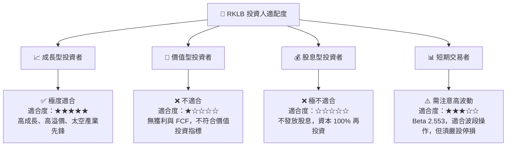

### 10.5 每季財報監控清單（Quarterly Watch List）

為確保本投資框架的有效性，投資人應在每季財報中追蹤以下關鍵指標是否偏離預期：

1. **航天系統（Space Systems）毛利率**：基準門檻為 **35.0%**。若低於 30%，說明收購整合出現問題或供應鏈成本失控。
2. **Electron 發射次數與單次發射利潤**：目標為每季發射 **4-6 次**，單次 ASP 保持在 $7.5M - $8.5M。
3. **研發費用（R&D）與資本支出（Capex）控制**：每季 Capex 不應持續超過 $50M，否則現金消耗速度將快於預期，增加二次募資稀釋風險。
4. **未交貨訂單（Backlog）總額**：應保持在 **$1.0B** 以上，作為未來 2 年營收能見度的保證。

### 10.6 反面論證：什麼會證明論點錯誤（What Would Change My Mind）

本投資論點建立在「RKLB 能成功商業化中大型火箭，並維持航天系統高成長」的假設上。若出現以下可量化條件，則本報告之「買入」評級將失效，投資人應果斷出場：

```
╔══════════════════════════════════════════════════════════════════╗
║              ⚠️ 論點失效條件（Disconfirming Evidence）           ║
╠══════════════════════════════════════════════════════════════════╣
║  本投資論點在下列情況成立時應重新檢視或退出：                    ║
║  ☐ Neutron 火箭首飛時間延遲至 2028 年 12 月 31 日之後            ║
║  ☐ 航天系統（Space Systems）營收 YoY 增速連續兩季 < 20%          ║
║  ☐ 自由現金流持續惡化，導致淨現金儲備降至 $300M 以下             ║
║  ☐ 股權稀釋導致 Basic Shares Outstanding 超過 700M 股           ║
║  ☐ SpaceX 推出專屬小衛星發射價格降至 $3,000/kg 以下，嚴重侵蝕    ║
║     Electron 的定價空間（目前 Electron 約 $20,000/kg）           ║
╚══════════════════════════════════════════════════════════════════╝
```

---

> **免責聲明**：本報告僅供研究參考，不構成任何投資建議。太空產業具有極高之技術與財務風險，投資人入市需謹慎並做好風險管理。