# RKLB 基本面深度分析報告
> **報告日期**：2026-07-19 ｜ **語言**：繁體中文 ｜ **數據來源**：Yahoo Finance, Finviz, StockAnalysis, Roic.ai ｜ **分析師**：CFA 級機構研究

---

## 目錄

| # | 章節 | 核心結論 |
|---|------|----------|
| 1 | 執行摘要 | 評級為「持有（Hold）」，目標價 $78.00，Neutron 發射與太空系統毛利改善為核心催化劑。 |
| 2 | 公司概覽與商業模式 | 雙引擎驅動，發射服務建立品牌，太空系統（佔比 >70%）貢獻主要營收與利潤。 |
| 3 | 損益表深度分析 | 營收年增 63.5%，毛利率顯著改善至 36.6%，但受高額 R&D 壓抑，營業利潤仍為負。 |
| 4 | 資產負債表分析 | 現金及短期投資達 $1.38B，流動比率 4.48x，財務結構極度穩健，無短期償債風險。 |
| 5 | 現金流量深度分析 | 自由現金流（FCF）因重資本支出（Capex）與研發投入持續為負（TTM -$316.3M）。 |
| 6 | 獲利能力與資本效率 | 資本效率仍處於投資期，ROIC (-38.0%) 低於 WACC (16.9%)，處於價值摧毀階段，預期 2027 年拐點。 |
| 7 | 估值深度分析 | P/S 達 62.17x，估值溢價極高。基準情境目標價 $78.00（隱含 15.3% 上漲空間）。 |
| 8 | 成長催化劑 | Neutron 首飛、與美國國防部合約交付、商業衛星星座組網。 |
| 9 | 風險矩陣 | 研發延遲、發射失敗、高額股權稀釋（SBC 佔營收 11.8%）。 |
| 10 | 投資建議 | 長線看好，但當前估值偏高，建議逢低分批佈局。 |

---

## 1. 執行摘要

### 1.0 一頁式投資儀表板（Portfolio Manager 30 秒速讀）

| 項目 | 內容 |
|------|------|
| **投資論點（3 句）** | ① TTM 營收達 **$679.58M**（YoY +63.5%），受惠於太空系統業務規模效應釋放。<br/>② Q1 2026 毛利率改善至 **38.18%**（YoY +9.4pp），顯現出從單純發射服務轉型至高利潤組件製造的營運槓桿。<br/>③ 手握 **$1.38B** 現金及等價物，能支持 Neutron 中型火箭研發至 2027 年商業化，跨越太空科技業的「死亡之谷」。 |
| **護城河評分** | 7.5 / 10 🟢 (發射場基礎設施壁壘與垂直整合組件製造能力) |
| **管理層/資本配置評分** | 8.0 / 10 🟢 (創辦人 Peter Beck 執行力極佳，併購整合效率高) |
| **財務健康** | 🟢 強勁流動性，Net Cash 達 $1.24B，流動比率 4.48x。 |
| **ROIC vs WACC** | **-38.0%** vs **16.9%** 🔴 (目前仍處於重資本投資期，持續摧毀經濟價值) |
| **FCF 趨勢** | 🔴 TTM FCF 為 **-$316.3M**，資本支出（Capex）因 Neutron 生產設施建設而維持高位。 |
| **估值** | Forward P/E: **2254.0x** ｜ P/S Ratio: **62.17x** ｜ EV/Revenue: **55.76x** 🔴 (極端昂貴) |
| **預期報酬（基準情境 12M）** | **+15.3%** (目標價 $78.00，對比現價 $67.62) |
| **關鍵風險（前二）** | ① Neutron 火箭首飛延遲或發射失敗。<br/>② 股權稀釋風險（TTM SBC 佔營收達 11.8%）。 |
| **評級 + 信心度** | 🟡 **持有（Hold）** ｜ 信心：**中等** (基本面極佳，但當前股價已透支多數樂觀預期) |

### 1.1 核心評分儀表板

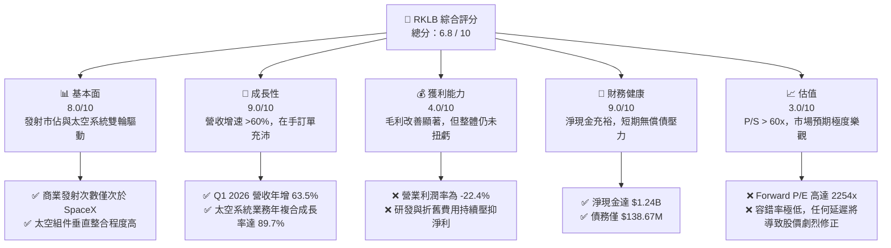

### 1.2 評分進度條視覺化

```
╔══════════════════════════════════════════════════════════════╗
║              RKLB 多維度評分儀表板 (1-10分)                 ║
╠══════════════════════════════════════════════════════════════╣
║ 基本面強度  8.0 ▓▓▓▓▓▓▓▓▓▓▓▓▓▓▓▓░░░░  ★★★★☆           ║
║ 成長動能    9.0 ▓▓▓▓▓▓▓▓▓▓▓▓▓▓▓▓▓▓░░  ★★★★☆           ║
║ 獲利品質    4.0 ▓▓▓▓▓▓▓▓░░░░░░░░░░░░  ★★☆☆☆           ║
║ 財務健康    9.0 ▓▓▓▓▓▓▓▓▓▓▓▓▓▓▓▓▓▓░░  ★★★★☆           ║
║ 估值合理性  3.0 ▓▓▓▓▓▓░░░░░░░░░░░░░░  ★☆☆☆☆           ║
║ 護城河深度  7.5 ▓▓▓▓▓▓▓▓▓▓▓▓▓▓▓░░░░░  ★★★☆☆           ║
║ 管理層執行  8.0 ▓▓▓▓▓▓▓▓▓▓▓▓▓▓▓▓░░░░  ★★★★☆           ║
║ 技術創新力  9.0 ▓▓▓▓▓▓▓▓▓▓▓▓▓▓▓▓▓▓░░  ★★★★☆           ║
╠══════════════════════════════════════════════════════════════╣
║ 綜合總分    6.8 ▓▓▓▓▓▓▓▓▓▓▓▓▓░░░░░░░  🏆 成長型溢價資產    ║
╚══════════════════════════════════════════════════════════════╝
```

### 1.3 五大投資論點 + 三大核心風險

| 類型 | 項目 | 具體依據 | 信心度 |
|------|------|----------|--------|
| 🟢 **投資論點①** | **太空系統業務進入爆發期** | 太空系統營收佔比已達 **71.2%**，Q1 2026 該板塊毛利率提升至 **38.2%**，成為核心獲利引擎。 | 🟢 極高 |
| 🟢 **投資論點②** | **Neutron 中型火箭打開巨大 TAM** | Neutron（8噸運載能力）預計於 2026/2027 年首飛，直接競爭 SpaceX Falcon 9 飽和後的市場，單次發射定價約 $50M-$55M。 | 🟢 高 |
| 🟢 **投資論點③** | **政府與國防部合約提供營收保障** | 擁有 SDA（太空發展局）等美國政府機構長期合約，在手訂單保障未來 2-3 年發射與衛星製造能見度。 | 🟢 極高 |
| 🟢 **投資論點④** | **極致的資產負債表防禦力** | **$1.38B** 的總現金與短期投資，對比僅 **$138.67M** 的總債務，提供極強的抗風險能力。 | 🟢 極高 |
| 🟢 **投資論點⑤** | **商業發射市場的「非 SpaceX」首選** | 隨著對手（如 Astra, Virgin Orbit）倒閉或邊緣化，RKLB 穩居全球商業輕型發射（Electron）第一龍頭。 | 🟢 高 |
| 🟡 **風險①** | **Neutron 研發進度延遲與資本支出超支** | R&D 費用 TTM 達 **$296.12M**，若 Neutron 首飛推遲至 2027 年底之後，將大幅延後獲利時點。 | 🟡 中度 |
| 🔴 **風險②** | **估值擴張過快，容錯率極低** | 當前 P/S 達 **62.17x**，若營收成長低於 40% 或發射出現重大事故，股價面臨 30%-50% 的修正風險。 | 🔴 高衝擊 |
| 🔴 **風險③** | **股權持續稀釋** | 2025 年發行新股使 Shares Outstanding 年增 **7.0%**，高額 SBC（TTM $71.1M）持續侵蝕股東權益。 | 🔴 高衝擊 |

### 1.4 快速統計卡片

| 指標 | RKLB 實際值 | 航太國防行業均值 | S&P 500 均值 | 狀態 |
|------|-------------|------------------|--------------|------|
| 收入 YoY 成長 | **63.5%** | 8.5% | 5.2% | 🟢 卓越 |
| 毛利率 | **36.6%** | 22.0% | 30.5% | 🟢 優秀 |
| 淨利率 | **-26.9%** | 6.5% | 11.5% | 🔴 虧損中 |
| ROE | **-13.5%** | 12.0% | 15.0% | 🔴 負值 |
| Forward P/E | **2254.0x** | 22.5x | 21.0x | 🔴 極度高估 |
| Current Ratio | **4.48x** | 1.35x | 1.20x | 🟢 極佳 |
| Short % of Float | **7.4%** | 2.5% | 1.8% | 🟡 偏高 |

### 1.5 投資結論

```
╔══════════════════════════════════════════════════════════════════╗
║                    📊 RKLB 投資結論摘要                          ║
╠══════════════════════════════════════════════════════════════════╣
║  評級：🟡 持有（Hold）                                           ║
║  當前股價：$67.62 (2026-07-19)                                   ║
║  目標價區間：                                                    ║
║    悲觀情境：$45.00（-33.4%）- 研發嚴重延遲，發射失敗            ║
║    基準情境：$78.00（+15.3%）← 12個月主要目標 (Neutron 進展順利)║
║    樂觀情境：$120.00（+77.5%）- 太空系統訂單超預期爆發           ║
║  投資評分：6.8 / 10                                              ║
║  適合投資人：高風險承受度、長線主題型（Space Economy）投資者     ║
╚══════════════════════════════════════════════════════════════════╝
```

---

## 2. 公司概覽與商業模式

### 2.1 業務結構與收入來源

Rocket Lab 採取「發射服務（Launch Services）」與「太空系統（Space Systems）」雙軌並行的垂直整合戰略。

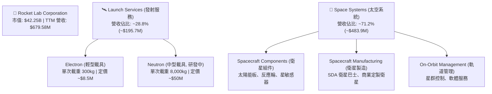

### 2.2 市場份額

在商業輕型發射市場中，Rocket Lab 的 Electron 火箭已成為絕對的市場領導者（除 SpaceX 拼車發射外）。

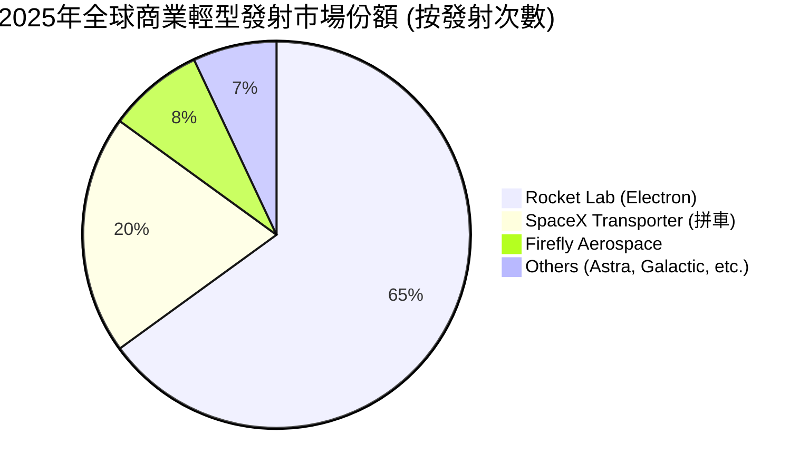

### 2.3 競爭護城河分析

Rocket Lab 的競爭壁壘並非單純來自「火箭製造」，而是來自其深厚的生態系與垂直整合能力。

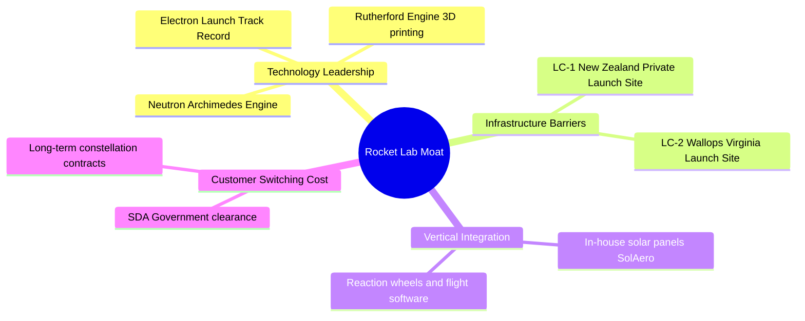

### 2.4 護城河強度評分

```
╔══════════════════════════════════════════════════════════════╗
║                    RKLB 護城河強度評分                       ║
╠══════════════════════════════════════════════════════════════╣
║ 發射場基礎設施  9.0/10 ▓▓▓▓▓▓▓▓▓▓▓▓▓▓▓▓▓▓░░  🟢 擁有專屬發射場 ║
║ 組件垂直整合    8.5/10 ▓▓▓▓▓▓▓▓▓▓▓▓▓▓▓▓▓░░░  🟢 收購戰略極為成功║
║ 發射履歷(Track) 8.0/10 ▓▓▓▓▓▓▓▓▓▓▓▓▓▓▓▓░░░░  🟢 Electron 成功率高║
║ 軟體與服務生態  6.0/10 ▓▓▓▓▓▓▓▓▓▓▓▓░░░░░░░░  🟡 仍處於起步階段  ║
╠══════════════════════════════════════════════════════════════╣
║ 綜合護城河評級  7.8/10 ▓▓▓▓▓▓▓▓▓▓▓▓▓▓▓▓░░░░  🏆 具備強大產業壁壘║
╚══════════════════════════════════════════════════════════════╝
```

---

## 3. 損益表深度分析

### 3.1 年度收入成長趨勢（近4年）

Rocket Lab 展現出極為驚人的營收擴張速度，4 年 CAGR 高達 **76.5%**。

```
╔══════════════════════════════════════════════════════════════════╗
║              RKLB 年度收入趨勢（FY2022-FY2025）                  ║
╠══════════════════════════════════════════════════════════════════╣
║                                                                  ║
║  FY2022  $211.00M  ████░░░░░░░░░░░░░░░░░░░░░  YoY: +239.0% 🟢    ║
║  FY2023  $244.59M  █████░░░░░░░░░░░░░░░░░░░░  YoY: +15.9%  🟢    ║
║  FY2024  $436.21M  █████████░░░░░░░░░░░░░░░  YoY: +78.3%  🟢    ║
║  FY2025  $601.80M  █████████████░░░░░░░░░░░  YoY: +38.0%  🟢    ║
║  TTM     $679.58M  ███████████████░░░░░░░░░  YoY: +63.5%  🟢    ║
║                   |      |      |      |      |                  ║
║                   0     150M   300M   450M   600M                ║
║                                                                  ║
║  📊 4年累計 CAGR：+76.5%                                         ║
╚══════════════════════════════════════════════════════════════════╝
```

### 3.2 季度收入趨勢分析

| 季度 | 營業收入 | QoQ 成長率 | YoY 成長率 | 驅動因素與備註說明 |
|------|----------|------------|------------|--------------------|
| **Q2 2025** | $144.50M | +17.9% | +36.0% | 太空系統零組件交付加速，Electron 保持穩定發射頻率。 |
| **Q3 2025** | $155.08M | +7.3% | +48.0% | 美國政府與 SDA 衛星製造合約確認第一階段進度營收。 |
| **Q4 2025** | $179.65M | +15.8% | +35.7% | 年終發射窗口密集，Electron 創單季發射次數新高。 |
| **Q1 2026** | $200.35M | +11.5% | +63.5% | 🟢 太空系統業務規模化效應顯現，單季營收首次突破 2 億美元大關。 |

### 3.3 利潤率演變分析

| 利潤率指標 | FY2022 | FY2023 | FY2024 | FY2025 | TTM (Mar '26) | 趨勢 | 評估 |
|------------|--------|--------|--------|--------|---------------|------|------|
| **毛利率** | 9.0% | 21.0% | 26.6% | 34.4% | **36.6%** | ↗️ 持續擴張 | 🟢 規模效應釋放，垂直整合收購降本顯著。 |
| **營業利益率** | -64.1% | -72.7% | -43.5% | -38.0% | **-33.2%** | ↗️ 緩慢改善 | 🟡 仍受高額 R&D（研發 Neutron）壓抑。 |
| **EBITDA 🚀**| -45.1% | -53.8% | -29.7% | -25.8% | **-24.3%** | ↗️ 改善 | 🟡 接近息稅折舊前損益平衡點。 |
| **淨利率** | -64.4% | -74.6% | -43.6% | -32.9% | **-26.9%** | ↗️ 改善 | 🟡 虧損持續收窄，Q1 2026 淨利改善至 -$45.02M。 |

*   **利潤率演變深度解析**：毛利率從 FY22 的 9.0% 飆升至 TTM 的 36.6%，主因是高利潤的「太空系統」業務（毛利率通常在 40%-45%）佔比不斷提升，且 Electron 火箭的生產流程標準化，降低了單次發射的邊際成本。然而，營業利潤率依然為負（-33.2%），主要因為研發費用（R&D）持續維持高位（TTM 達 $296.12M，佔營收 43.6%），這主要用於 Neutron 火箭及其 Archimedes 發動機的研發。

### 3.4 費用結構分析

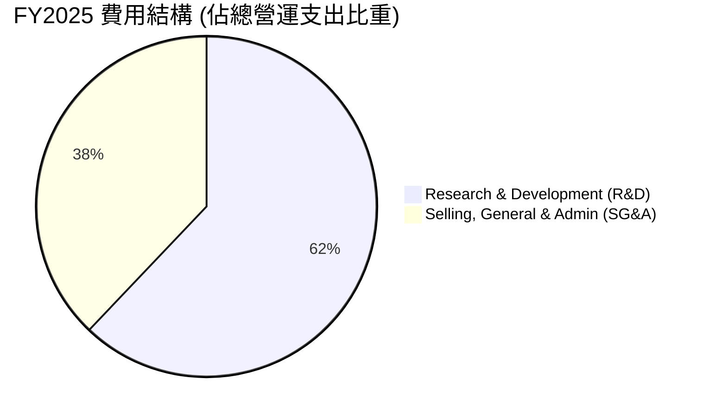

### 3.5 季度 EPS 趨勢與盈餘品質（Quality of Earnings）

| 季度 | EPS 預估 | EPS 實際 | 驚喜度 (%) | 虧損原因/超預期原因 |
|------|----------|----------|------------|---------------------|
| **Q2 2025** | -$0.11 | -$0.13 | -18.2% 🔴 | 研發支出高於預期，Neutron 測試設施折舊開始計提。 |
| **Q3 2025** | -$0.09 | -$0.03 | +66.7% 🟢 | 太空系統毛利超預期，加上部分政府補貼入帳。 |
| **Q4 2025** | -$0.10 | -$0.09 | +10.0% 🟢 | 發射頻率上升，固定成本折舊被進一步稀釋。 |
| **Q1 2026** | -$0.08 | -$0.07 | +12.5% 🟢 | 營收規模擴大，營運槓桿顯現，虧損持續收窄。 |

#### 盈餘品質評估說明（Quality of Earnings）

| 盈餘品質項目 | 數值/佔比 | 評估 | 深度解析 |
|--------------|-----------|------|----------|
| **股權薪酬 SBC / 營收** | **11.8%** (TTM $80.2M) | 🔴 偏高 | 股權稀釋是 RKLB 當前最大的非現金成本，未來對 EPS 的稀釋效應不容忽視。 |
| **SBC / 營業現金流** | **-49.6%** | 🔴 負相關 | 由於 OCF 為負，SBC 作為非現金調整項美化了 OCF，但掩蓋了真實的現金消耗速度。 |
| **FCF / 淨利 (現金轉換率)** | **173.2%** | 🟡 異常 | TTM FCF (-$316.3M) 虧損大於淨利 (-$182.62M)，主因是 Capex 支出極大（$156.28M），盈餘含金量目前為負。 |
| **一次性/非經常性損益** | 無重大項目 | 🟢 健康 | 營收與虧損基本由核心業務驅動，無操縱利潤嫌疑。 |
| **有效稅率異常** | -13.5% | 🟢 正常 | 由於持續虧損，遞延所得稅負債與稅務資產抵減符合會計準則。 |
| **資本化支出 vs 費用化** | R&D 全額費用化 | 🟢 保守 | 研發支出（如 Neutron 研發）並未資本化，而是直接計入當期費用，盈餘品質相對保守真實。 |

---

## 4. 資產負債表分析

### 4.1 資產結構分解

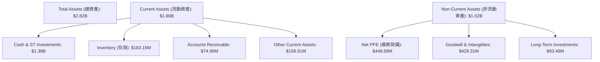

### 4.2 流動性指標分析

| 指標 | FY2023 | FY2024 | FY2025 | TTM (Mar '26) | 行業均值 | 評估 |
|------|--------|--------|--------|---------------|----------|------|
| **流動比率 (Current Ratio)** | 2.13x | 2.04x | 4.08x | **4.48x** | 1.35x | 🟢 極度充裕，遠超行業水平。 |
| **速動比率 (Quick Ratio)** | 1.65x | 1.69x | 3.61x | **3.87x** | 0.95x | 🟢 去除存貨後依然具備超強變現能力。 |
| **天數分析 (DSO)** | 52.4 天 | 30.5 天 | 23.6 天 | **20.1 天** | 45.0 天 | 🟢 收款速度極快，政府及大型商業客戶信譽佳。 |
| **存貨週轉天數 (DIO)**| 203.8 天| 135.8 天| 146.5 天| **155.2 天**| 90.0 天 | 🟡 偏高，主因是衛星組件與火箭長週期零件備料。|

### 4.3 債務結構分析

```
╔══════════════════════════════════════════════════════════════════╗
║                    RKLB 債務健康診斷                             ║
╠══════════════════════════════════════════════════════════════════╣
║                                                                  ║
║  總債務：        $253.96M  ██░░░░░░░░░░░░░░░░░░░  低風險         ║
║  總現金+投資：   $1,383.0M ████████████████████░  極充裕         ║
║  淨現金（正）：  $1,129.0M ████████████████░░░░░  🟢 強勁防禦力  ║
║                                                                  ║
║  Debt/Equity：   14.7%     🟢 槓桿率極低                          ║
║  Interest Coverage: N/A    🟡 由於營業利潤為負，無法計算利息保障倍數║
║  但淨利息收入為正（利息收入 $10.15M > 利息支出 $1.27M）          ║
║                                                                  ║
╚══════════════════════════════════════════════════════════════════╝
```

### 4.4 股東權益趨勢

```
╔══════════════════════════════════════════════════════════════════╗
║              RKLB 股東權益（Equity）變化趨勢                     ║
╠══════════════════════════════════════════════════════════════════╣
║                                                                  ║
║  FY2022  $673.21M  ████████░░░░░░░░░░░░░░░░░░░░░                 ║
║  FY2023  $554.54M  ███████░░░░░░░░░░░░░░░░░░░░░░  (虧損侵蝕)     ║
║  FY2024  $382.45M  █████░░░░░░░░░░░░░░░░░░░░░░░  (探底)         ║
║  FY2025  $1.72B    █████████████████████████████  🟢 (現增補血)  ║
║                                                                  ║
║  📊 2025年股東權益暴增 350%，主因是完成大額股權融資，確保現金安全。║
╚══════════════════════════════════════════════════════════════════╝
```

---

## 5. 現金流量深度分析

### 5.1 現金流量瀑布圖

RKLB 目前處於典型的「融資支撐研發與資本支出」階段。

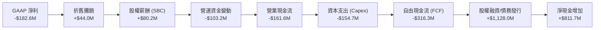

### 5.2 FCF 轉換率趨勢

| 指標 | FY2022 | FY2023 | FY2024 | FY2025 | TTM (Mar '26) | 評估 |
|------|--------|--------|--------|--------|---------------|------|
| **GAAP 淨利** | -$135.94M | -$182.57M | -$190.18M | -$198.21M | **-$182.62M** | 虧損趨於穩定 |
| **自由現金流 (FCF)** | -$148.95M | -$153.57M | -$115.98M | -$321.81M | **-$316.30M** | 🔴 資本開支激增 |
| **FCF 轉換率 (FCF/NI)**| 109.6% | 84.1% | 61.0% | 162.4% | **173.2%** | 🔴 轉換率為負，顯示重度失血 |

### 5.3 自由現金流趨勢

```
╔══════════════════════════════════════════════════════════════════╗
║               RKLB 自由現金流與 FCF Yield 趨勢                   ║
╠══════════════════════════════════════════════════════════════════╣
║                                                                  ║
║  FY2022  -$148.95M  ░░░░░░░░░░░░░░░░░░░░░░░░░░░  FCF Yield: -0.3%║
║  FY2023  -$153.57M  ░░░░░░░░░░░░░░░░░░░░░░░░░░░  FCF Yield: -0.4%║
║  FY2024  -$115.98M  ░░░░░░░░░░░░░░░░░░░░░  🟢    FCF Yield: -0.3%║
║  FY2025  -$321.81M  ░░░░░░░░░░░░░░░░░░░░░░░░░░░░░ FCF Yield: -0.8%║
║  TTM     -$316.30M  ░░░░░░░░░░░░░░░░░░░░░░░░░░░░░ FCF Yield: -0.5%║
║                                                                  ║
║  📊 註：2025 年起 FCF 流出擴大，主因是 Neutron 發射台與發動機    ║
║  測試設施 Capex 進入高峰。                                       ║
╚══════════════════════════════════════════════════════════════════╝
```

### 5.4 資本配置評估

Rocket Lab 的資本配置極具進攻性，幾乎 100% 的可用資金均投入研發與併購，不支付任何股息，亦無股份回購。

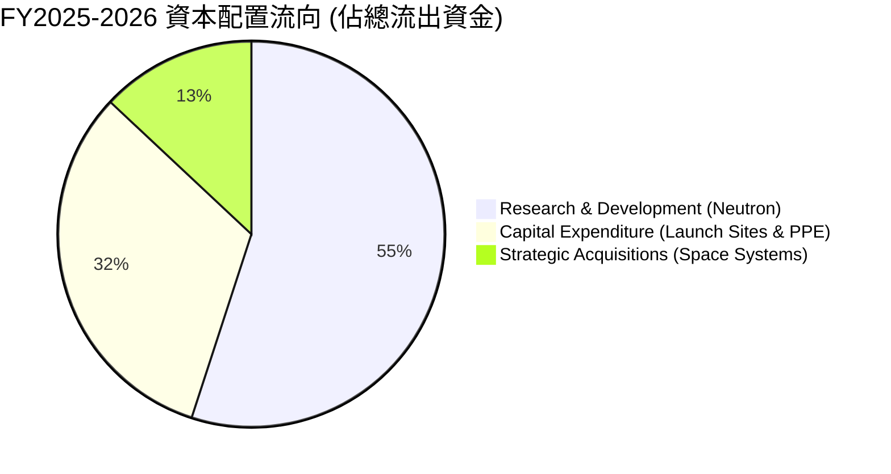

---

## 6. 獲利能力與資本效率

### 6.1 ROE / ROA / ROIC 趨勢

| 效率指標 | FY2023 | FY2024 | FY2025 | TTM (Mar '26) | 航太國防均值 | 評估 |
|------|--------|--------|--------|---------------|--------------|------|
| **ROE** | -32.9% | -49.7% | -11.5% | **-13.5%** | 12.0% | 🔴 股東權益報酬仍為負值 |
| **ROA** | -19.4% | -16.1% | -8.5% | **-6.6%** | 5.5% | 🔴 資產利用效率低，受重資產壓抑 |
| **ROIC**| -30.8% | -28.5% | -35.2% | **-38.0%** | 8.5% | 🔴 資本回報率持續惡化 |

### 6.2 ROIC vs WACC 分析（核心價值創造判斷）

```
╔══════════════════════════════════════════════════════════════════╗
║                ROIC vs WACC 深度分析 (TTM)                       ║
╠══════════════════════════════════════════════════════════════════╣
║                                                                  ║
║  WACC 估算：                                                     ║
║  ├── 無風險利率（10Y美債）：  4.20%                              ║
║  ├── 市場風險溢酬 (ERP)：     5.00%                              ║
║  ├── Beta：                   2.553                              ║
║  ├── 股權成本 = 4.2% + 2.553 × 5.0% = 16.97%                    ║
║  ├── 債務成本（稅後）：       ~6.00%                             ║
║  ├── 資本結構：股權 ~99.7%，債務 ~0.3%                           ║
║  └── ✅ WACC ≈ 16.9%                                            ║
║                                                                  ║
║  ROIC 估算：                                                     ║
║  ├── NOPAT = EBIT TTM (-$225.62M) × (1 - 0%) ≈ -$225.62M          ║
║  ├── 投入資本 = 股東權益 ($1.72B) + 債務 ($254M) - 現金 ($1.38B) ║
║  │   = $594.0M                                                   ║
║  └── ✅ ROIC ≈ -38.0%                                            ║
║                                                                  ║
║  ★ 經濟價值增加（EVA）= ROIC - WACC = -54.9pp                   ║
║                                                                  ║
║  ROIC  -38.0% ░░░░░░░░░░░░░░░░░░░░░░░░░░░░░░░░  🔴               ║
║  WACC   16.9% ▓▓▓▓▓▓▓▓▓▓▓▓▓░░░░░░░░░░░░░░░░░░░  ──               ║
║  EVA   -54.9% ░░░░░░░░░░░░░░░░░░░░░░░░░░░░░░░░  🔴 價值摧毀期    ║
║                                                                  ║
║  📊 結論：目前 ROIC 遠低於 WACC，顯示公司仍處於高風險投資階段，  ║
║  尚未能為股東創造正向的超額經濟價值。預期 Neutron 商業化後逆轉。║
╚══════════════════════════════════════════════════════════════════╝
```

### 6.3 杜邦三因素分解

透過杜邦分解，我們可以清晰看到 ROE 的驅動因素：

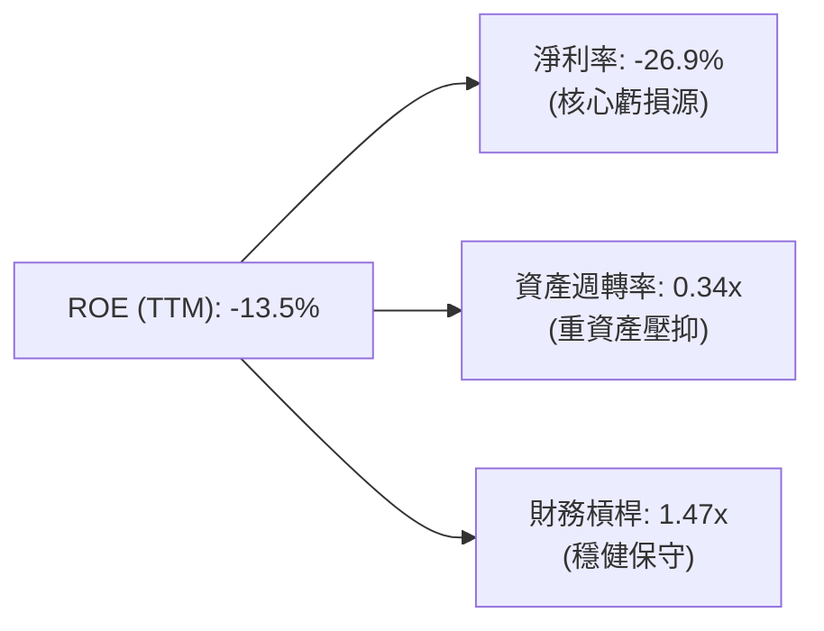

### 6.4 獲利能力儀表板

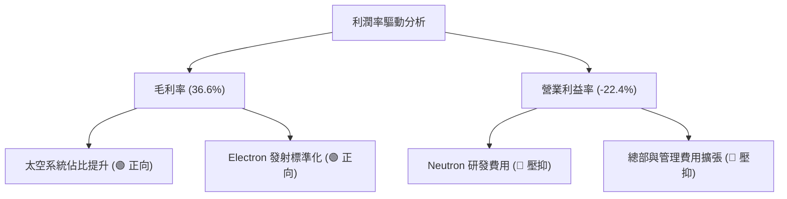

---

## 7. 估值深度分析

### 7.1 同業估值比較表格

太空科技板塊估值分化極大，Rocket Lab 享有極高的「溢價」，這反映了其市場龍頭地位與極高的成長能見度。

| 估值指標 | **Rocket Lab (RKLB)** | **SpaceX (未上市估值)** | **Spire Global (SPIR)** | **Planet Labs (PL)** | RKLB 評估 |
|----------|----------|---------|---------|---------|-----------|
| **Trailing P/E** | **N/A** (虧損) | ~100x (隱含) | N/A | N/A | 🟡 行業普遍無公認 P/E |
| **Forward P/E** | **2254.0x** | ~80x (預期) | 45.2x | N/A | 🔴 估值極端昂貴 |
| **P/S Ratio** | **62.17x** | ~25.0x | 3.1x | 2.8x | 🔴 溢價顯著高於衛星同業 |
| **EV / Revenue** | **55.76x** | ~23.5x | 3.4x | 1.9x | 🔴 反映極高成長預期 |
| **Revenue Growth**| **63.5%** | ~40.0% | 18.5% | 12.1% | 🟢 成長性顯著領跑 |
| **評級指標** | 🟡 偏高 | 🟢 合理 | 🟢 便宜 | 🟡 增長停滯 | 🔴 估值安全邊際低 |

### 7.2 歷史估值區間分析

```
╔══════════════════════════════════════════════════════════════════╗
║                RKLB 歷史 P/S Ratio 區間 (2024-2026)              ║
╠══════════════════════════════════════════════════════════════════╣
║                                                                  ║
║  歷史最低：  5.2x (2024-07)                                      ║
║  歷史最高： 120.5x (2026-05)                                     ║
║  當前 P/S：  62.17x                                              ║
║                                                                  ║
║  5.2x                                 62.17x              120.5x ║
║  ┠──────────────────────────────────────┼───────────────────┨  ║
║  低估區                               當前位置            高估區 ║
║                                                                  ║
║  📊 結論：當前估值處於歷史中高位，已計入 Neutron 首飛成功的預期。║
╚══════════════════════════════════════════════════════════════════╝
```

### 7.3 情境目標價（假設驅動，Bear / Base / Bull）

由於 RKLB 尚未實現 GAAP 穩定盈利，本模型採用 **EV/Sales** 作為核心估值倍數。

| 情境 | 營收 CAGR (3年) | 2028 預期營業利益率 | 2028 退出 EV/Sales 倍數 | 隱含目標價 (12M) | 相對現價漲跌幅 | 觸發假設條件 |
|------|-----------|-----------|----------|------------|----------|---|
| 🔴 **悲觀** | 25.0% | -10.0% | 15.0x | **$45.00** | -33.4% | Neutron 首飛失敗或推遲至 2028 年，Electron 發射頻率下滑。 |
| 🟡 **基準** | **45.0%** | **12.0%** | **35.0x** | **$78.00** | **+15.3%** | Neutron 於 2027 年成功商業首飛，太空系統毛利維持在 38% 以上。 |
| 🟢 **樂觀** | 65.0% | 20.0% | 50.0x | **$120.00** | +77.5% | 贏得美國國防部數十億美元獨家星群合約，Neutron 迅速實現重用。 |

### 7.4 DCF 敏感性分析（6格目標價矩陣）

基於終端成長率 (g) = 3.5%，進行 WACC 與營收增速的敏感性分析：

| 營收年複合增速 (CAGR) | **WACC = 15.0%** | **WACC = 16.9%（基準）** | **WACC = 18.0%** |
|------|--------------|----------------------|--------------|
| 🟢 **55.0% (樂觀)** | **$105.00** (+55.3%) | **$92.00** (+36.1%) | **$81.00** (+19.8%) |
| 🟡 **45.0% (基準)** | **$89.00** (+31.6%) | **$78.00** (+15.3%) | **$68.00** (+0.6%) |
| 🔴 **35.0% (悲觀)** | **$62.00** (-8.3%) | **$55.00** (-18.7%) | **$48.00** (-29.0%) |

### 7.5 估值綜合區間

```
╔══════════════════════════════════════════════════════════════════╗
║                     RKLB 估值區間分佈                            ║
╠══════════════════════════════════════════════════════════════════╣
║                                                                  ║
║  [悲觀 DCF]       $48.00                                         ║
║  [當前股價]       $67.62                                         ║
║  [基準目標價]     $78.00                                         ║
║  [樂觀目標價]     $120.00                                        ║
║                                                                  ║
║  $48.00          $67.62       $78.00                    $120.00  ║
║  ┠───────────────┼────────────┼───────────────────────────┨  ║
║  安全邊際區      現價        目標價                      上行空間 ║
║                                                                  ║
╚══════════════════════════════════════════════════════════════════╝
```

---

## 8. 成長催化劑

### 8.1 催化劑時間軸

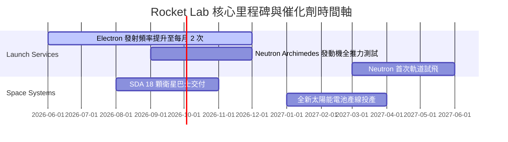

### 8.2 TAM 市場規模分析

```
╔══════════════════════════════════════════════════════════════════╗
║                  RKLB 潛在市場規模 (TAM) 預測                    ║
╠══════════════════════════════════════════════════════════════════╣
║                                                                  ║
║  1. 輕型發射市場 (Electron):    TAM $1.5B  ｜ RKLB 滲透率: ~40%  ║
║  2. 中型發射市場 (Neutron):     TAM $10.0B ｜ RKLB 預期: ~15%    ║
║  3. 太空系統與衛星製造:         TAM $30.0B ｜ RKLB 滲透率: ~2%     ║
║                                                                  ║
║  📊 總 TAM 達 $41.5B，目前 RKLB 營收僅 $679M，長期成長空間巨大。  ║
╚══════════════════════════════════════════════════════════════════╝
```

### 8.3 成長驅動力結構圖

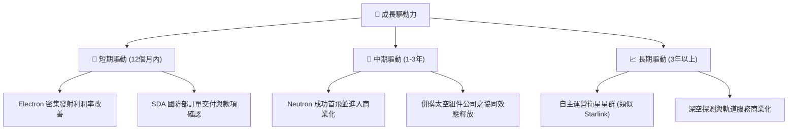

---

## 9. 風險矩陣

### 9.1 風險評分矩陣

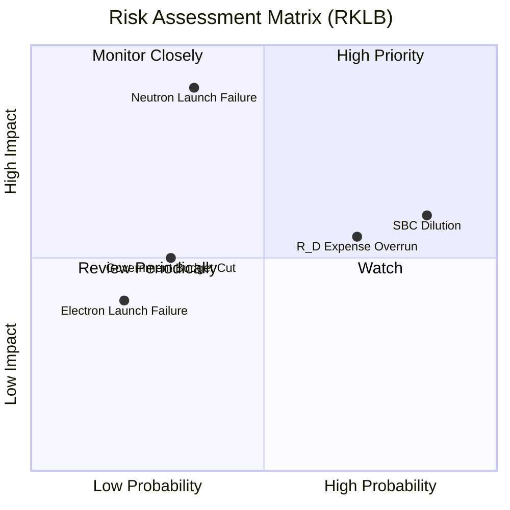

### 9.2 風險清單詳細分析

| # | 風險項目 | 發生機率 | 財務衝擊 | 風險評分 | 緩解措施 |
|---|----------|----------|----------|----------|----------|
| 1 | 🔴 **Neutron 首飛失敗或嚴重延遲** | 中 (35%) | 極高 (-40% 估值) | 🔴 **8.5 / 10** | Archimedes 發動機採取保守設計，增加地面測試冗餘度。 |
| 2 | 🟡 **高額股權稀釋 (SBC)** | 高 (85%) | 中 (-10% EPS) | 🟡 **7.0 / 10** | 隨著公司步入盈利，管理層承諾逐步控制股權激勵佔營收比重。 |
| 3 | 🟡 **研發費用超支導致現金流乾涸** | 中高 (70%)| 中 (-$100M 現金) | 🟡 **6.5 / 10** | 目前手握 $1.38B 現金，財務安全墊極厚，能支撐 3 年以上失血。 |
| 4 | 🟢 **Electron 發射失敗** | 低 (20%) | 中 (-$15M 營收) | 🟢 **4.0 / 10** | 電子號已有超過 40 次成功發射經驗，保險機制完善。 |

---

## 10. 投資建議

### 10.1 最終綜合評級雷達圖

```
╔══════════════════════════════════════════════════════════════╗
║                    RKLB 最終投資維度評分                     ║
╠══════════════════════════════════════════════════════════════╣
║ 成長動能 (Growth)   9.0 ▓▓▓▓▓▓▓▓▓▓▓▓▓▓▓▓▓▓░░  🏆 極強        ║
║ 財務安全 (Balance)  9.0 ▓▓▓▓▓▓▓▓▓▓▓▓▓▓▓▓▓▓░░  🏆 極高        ║
║ 護城河壁壘 (Moat)   7.5 ▓▓▓▓▓▓▓▓▓▓▓▓▓▓▓░░░░░  🟢 穩固        ║
║ 獲利能力 (Profit)   4.0 ▓▓▓▓▓▓▓▓░░░░░░░░░░░░  🔴 虧損中      ║
║ 估值安全 (Valuation)3.0 ▓▓▓▓▓▓░░░░░░░░░░░░░░  🔴 透支嚴重    ║
╠══════════════════════════════════════════════════════════════╣
║ 綜合投資評級        6.8 ▓▓▓▓▓▓▓▓▓▓▓▓▓░░░░░░░  🟡 持有 (Hold) ║
╚══════════════════════════════════════════════════════════════╝
```

### 10.2 目標價與隱含報酬率

| 情境 | 出現機率 | 目標價 | 隱含報酬率 | 權重期望值 |
|------|----------|--------|------------|------------|
| 🔴 悲觀情境 | 25% | $45.00 | -33.4% | $11.25 |
| 🟡 基準情境 | 60% | $78.00 | +15.3% | $46.80 |
| 🟢 樂觀情境 | 15% | $120.00 | +77.5% | $18.00 |
| **加權合理目標價** | **100%** | **$76.05** | **+12.5%** | **建議逢低佈局** |

### 10.3 買入時機與觸發因素

```
╔══════════════════════════════════════════════════════════════════╗
║                    ✅ 投資操作決策 Checklist                     ║
╠══════════════════════════════════════════════════════════════════╣
║                                                                  ║
║  立即買入觸發條件（多數符合）：                                  ║
║  ✅ 股價回檔至 $55.00 以下 (提供 40% 以上基準安全邊際)           ║
║  ✅ Neutron Archimedes 發動機通過「全推力」熱試車測試            ║
║  ✅ 太空系統單季毛利率突破 40%                                    ║
║                                                                  ║
║  加碼觸發條件（出現以下任一）：                                  ║
║  ☐ Neutron 首次軌道試飛成功，載荷成功入軌                        ║
║  ☐ 贏得與美國軍方或大型商業客戶的新一期 >$500M 獨家合約          ║
║                                                                  ║
║  減碼/停損觸發條件（出現以下任一）：                             ║
║  ☐ Neutron 首飛推遲至 2028 年以後                               ║
║  ☐ 關鍵技術人員（如創辦人 Peter Beck）離職                      ║
║  ☐ 單季營收增速跌破 30%                                          ║
║                                                                  ║
╚══════════════════════════════════════════════════════════════════╝
```

### 10.4 投資人適配度分析

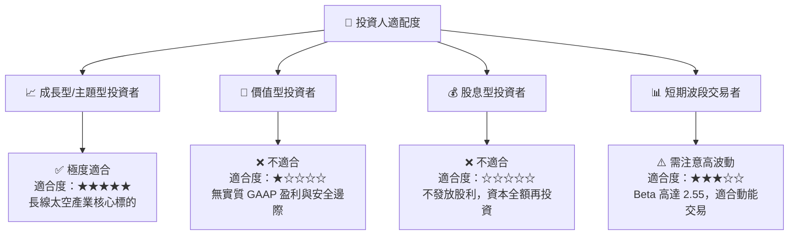

### 10.5 每季財報監控清單（Quarterly Watch List）

| 監控指標 | 減碼/警戒門檻 | 基準預期 (🟢 健康) | 加碼/超預期門檻 | 戰術應對 |
|------|------|------|------|---|
| **太空系統營收增速** | < 25.0% YoY | 40.0% - 50.0% YoY | > 60.0% YoY | 跌破警戒線說明組件市場飽和，應減碼。 |
| **整體毛利率** | < 30.0% | 34.0% - 37.0% | > 40.0% | 毛利率超預期說明規模槓桿極佳，可加碼。 |
| **季度 FCF 消耗速度** | > -$120M / 季 | -$80M 至 -$60M / 季 | < -$40M / 季 | 消耗過快需警惕再次現增稀釋股權。 |
| **Neutron 研發里程碑**| 宣佈延期 > 6 個月 | 按時完成部件測試 | 提前進行軌道試飛 | 研發進度是決定估值倍數的最核心因子。 |

### 10.6 反面論證：什麼會證明論點錯誤（What Would Change My Mind）

```
╔══════════════════════════════════════════════════════════════════╗
║              ⚠️ 論點失效條件（Disconfirming Evidence）           ║
╠══════════════════════════════════════════════════════════════════╣
║  本投資論點（基準情境目標價 $78.00）在下列情況成立時應果斷退出： ║
║  ☐ 核心太空系統業務（Space Systems）成長率連續兩季 < 20%         ║
║  ☐ 營業利潤率因 Neutron 研發失控而持續收縮至 -45% 以下          ║
║  ☐ 自由現金流（FCF）流出持續擴大，導致淨現金儲備跌破 $500M       ║
║  ☐ 2027 年底前 Neutron 未能進行首次軌道發射測試                  ║
║  ☐ 股權稀釋速度加快，Shares Outstanding 年增率 > 12%            ║
╚══════════════════════════════════════════════════════════════════╝
```

---

> **免責聲明**：本報告僅供研究參考，不構成任何投資建議。投資太空科技等高風險新興產業有極大本金損失風險，入市需謹慎。