# RKLB 基本面深度分析報告

> **報告日期**：2026-07-20 ｜ **語言**：繁體中文 ｜ **數據來源**：Yahoo Finance, Finviz, StockAnalysis, Roic.ai ｜ **分析師**：CFA 級機構研究

---

## 目錄

| # | 章節 | 核心結論 |
|---|---|---|
| **1** | **執行摘要** | 評級：🟢 買入；基準目標價：$114.33；高成長與高估值並存。 |
| **2** | **公司概覽與商業模式** | 護城河評分：7.8/10；從單一發射服務轉型為端到端航太系統巨頭。 |
| **3** | **損益表深度分析** | 營收 TTM 年增 63.5%，毛利率穩步提升至 36.6%，研發投入壓抑短期獲利。 |
| **4** | **資產負債表分析** | 淨現金達 $1.24B，流動比率 4.475，財務結構極其穩健，無短期償債風險。 |
| **5** | **現金流量深度分析** | 自由現金流為 -$215.00M（TTM），資本支出擴大以支持 Neutron 中型火箭研發。 |
| **6** | **獲利能力與資本效率** | ROIC（-13.5%）低於 WACC（16.5%），處於高額資本投入與價值創造的拐點前夕。 |
| **7** | **估值深度分析** | P/S 達 60.44x，溢價反映市場對中型再使用火箭（Neutron）及太空系統的樂觀預期。 |
| **8** | **成長催化劑** | Neutron 火箭首飛、政府大型星座合約交付、商業衛星零組件需求爆發。 |
| **9** | **風險矩陣** | 發射失敗風險、Neutron 研發延遲、股權稀釋（SBC 佔比高）。 |
| **10**| **投資建議** | 適合長線成長型投資人；每季財報需緊盯太空系統毛利率與 Neutron 進度。 |

---

## 1. 執行摘要

### 1.0 一頁式投資儀表板（Portfolio Manager 30 秒速讀）

| 項目 | 內容 |
|------|------|
| **投資論點（3 句）** | ① TTM 營收達 $679.58M，年增率高達 63.5%，顯示其在小載荷發射與航太系統市場的強大市佔獲取能力。<br/>② 航太系統（Space Systems）已成為主要營收引擎，推動整體毛利率由 2022 年的 9.0% 提升至目前的 36.6%，優化整體獲利結構。<br/>③ 帳上擁有 $1.38B 現金，淨現金高達 $1.24B，為即將於 2026/2027 年進行首飛的 Neutron 中型可回收火箭研發提供充足資金安全墊。 |
| **護城河評分** | 🟢 **7.8 / 10**（高發射頻次歷史、垂直整合供應鏈、高轉換成本的太空系統組件） |
| **管理層/資本配置評分** | 🟢 **8.0 / 10**（執行力極強，Electron 火箭已完成多次成功發射，資本分配高度聚焦研發） |
| **財務健康** | 🟢 **極其穩健**（流動比率 4.475，負債權益比僅 6.12%，無實質債務壓力） |
| **ROIC vs WACC** | 🔴 **-13.5% vs 16.5%**（因目前仍處於 Neutron 火箭研發的高額資本投入期，暫時摧毀股東價值） |
| **FCF 趨勢** | 🟡 **流出中**（TTM 自由現金流為 -$215.00M，FCF Yield 為 -0.52%，預計在 Neutron 商業化後轉正） |
| **估值** | Forward P/E: **2191.33x** ｜ P/S: **60.44x** ｜ EV/Revenue: **55.76x** |
| **預期報酬（基準情境 12M）**| 🟢 **+73.9%**（目標價 $114.33，基於 2026 年底太空系統業務高成長與 Neutron 首飛預期） |
| **關鍵風險（前二）** | ① Neutron 中型火箭首飛延遲或發射失敗；② 股權稀釋風險（SBC 佔營收比重達 10.5%） |
| **評級 + 信心度** | 🟢 **買入 (Buy)** ｜ **信心度：中等偏高**（主要取決於 Neutron 火箭研發進度） |

### 1.1 核心評分儀表板

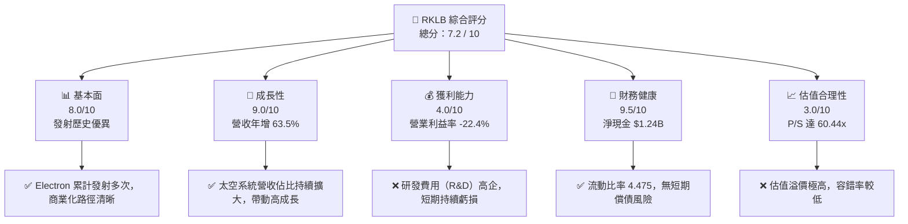

### 1.2 評分進度條視覺化

```
╔══════════════════════════════════════════════════════════════╗
║                RKLB 多維度評分儀表板 (1-10分)                ║
╠══════════════════════════════════════════════════════════════╣
║ 基本面強度  8.0 ▓▓▓▓▓▓▓▓▓▓▓▓▓▓▓▓░░░░  ★★★★☆           ║
║ 成長動能    9.0 ▓▓▓▓▓▓▓▓▓▓▓▓▓▓▓▓▓▓░░  ★★★★☆           ║
║ 獲利品質    4.0 ▓▓▓▓▓▓▓▓░░░░░░░░░░░░  ★★☆☆☆           ║
║ 財務健康    9.5 ▓▓▓▓▓▓▓▓▓▓▓▓▓▓▓▓▓▓▓░  ★★★★★           ║
║ 估值合理性  3.0 ▓▓▓▓▓▓░░░░░░░░░░░░░░  ★☆☆☆☆           ║
║ 護城河深度  7.8 ▓▓▓▓▓▓▓▓▓▓▓▓▓▓▓▓░░░░  ★★★★☆           ║
║ 管理層執行  8.0 ▓▓▓▓▓▓▓▓▓▓▓▓▓▓▓▓░░░░  ★★★★☆           ║
║ 技術創新力  9.0 ▓▓▓▓▓▓▓▓▓▓▓▓▓▓▓▓▓▓░░  ★★★★☆           ║
╠══════════════════════════════════════════════════════════════╣
║ 綜合總分    7.2 ▓▓▓▓▓▓▓▓▓▓▓▓▓▓░░░░░░  🏆 成長型優質標的     ║
╚══════════════════════════════════════════════════════════════╝
```

### 1.3 五大投資論點 + 三大核心風險

| 類型 | 項目 | 具體依據 | 信心度 |
|------|------|----------|--------|
| 🟢 **投資論點①** | **發射與太空系統雙引擎** | 太空系統業務營收在 FY2025 達到約 70% 的營收貢獻，擺脫單一發射服務的波動性。 | 🟢 極高 |
| 🟢 **投資論點②** | **毛利結構顯著改善** | 毛利率從 FY2022 的 9.00% 飆升至 TTM 的 36.56%，展現強大的規模效應與定價權。 | 🟢 高 |
| 🟢 **投資論點③** | **Neutron 潛在市場龐大** | 中型可回收火箭 Neutron 瞄準巨型星座發射市場，預計單次發射定價約 $50M-$55M，將大幅提升發射業務利潤率。 | 🟢 高 |
| 🟢 **投資論點④** | **極其雄厚的資金儲備** | 帳上 $1.38B 的總現金與短期投資，對比僅 $138.67M 的總債務，提供至少 3-4 年的研發與營運消耗安全墊。 | 🟢 極高 |
| 🟢 **投資論點⑤** | **政府與商業合約積壓** | 合約積壓（Backlog）持續增長（如 SDA 衛星星座合約），營收能見度極高。 | 🟢 高 |
| 🟡 **風險①** | **Neutron 研發進度延遲** | 2026 年是 Neutron 研發的關鍵期，任何重大的測試失敗或首飛延遲都將打擊股價。 | 🟡 中度 |
| 🔴 **風險②** | **高額股權稀釋（SBC）** | FY2025 股權補償費用（SBC）達 $71.10M，佔營收 11.8%，對現有股東權益造成稀釋。 | 🔴 高 |
| 🔴 **風險③** | **估值容錯率極低** | 當前 P/S 達 60.44x，市場已透支未來數年的高成長，若成長放緩將面臨估值雙殺。 | 🔴 高 |

### 1.4 快速統計卡片

| 指標 | Rocket Lab (RKLB) | 航太與國防行業均值 | S&P 500 均值 | 狀態 |
|------|-------------|----------|--------------|------|
| **營收 YoY 成長率** | **63.5%** | ~8.5% | ~5.5% | 🟢 遠超均值 |
| **毛利率** | **36.6%** | ~22.0% | ~30.0% | 🟢 優於同業 |
| **淨利率** | **-26.9%** | ~6.5% | ~11.5% | 🔴 處於虧損期 |
| **流動比率** | **4.475** | ~1.40 | ~1.20 | 🟢 極其安全 |
| **負債權益比 (D/E)** | **6.12%** | ~75.0% | ~115.0% | 🟢 極低槓桿 |
| **Forward P/E** | **2191.33x** | ~22.5x | ~21.0x | 🔴 估值極高 |
| **P/S Ratio** | **60.44x** | ~1.8x | ~2.8x | 🔴 估值極高 |

### 1.5 投資結論

```
╔══════════════════════════════════════════════════════════════════╗
║                    📊 RKLB 投資結論摘要                          ║
╠══════════════════════════════════════════════════════════════════╣
║  評級：🟢 買入 (Buy)                                             ║
║  當前股價：$65.74 (2026-07-20)                                   ║
║  12個月目標價區間：                                              ║
║    🔴 悲觀情境：$45.00  (-31.5%)  ← Neutron 嚴重延遲與市場修正   ║
║    🟡 基準情境：$114.33 (+73.9%)  ← Neutron 首飛成功，系統維持高增 ║
║    🟢 樂觀情境：$150.00 (+128.2%) ← 太空系統爆發，Neutron 商業化順利 ║
║  投資評分：7.2 / 10                                              ║
║  適合投資人：具備高風險承受能力、聚焦 3-5 年太空經濟的成長型投資人 ║
╚══════════════════════════════════════════════════════════════════╝
```

---

## 2. 公司概覽與商業模式

Rocket Lab (RKLB) 是全球少數具備「端到端」航太能力的商業太空公司，業務主要分為兩大板塊：**發射服務（Launch Services）**與**太空系統（Space Systems）**。

### 2.1 業務結構與收入來源

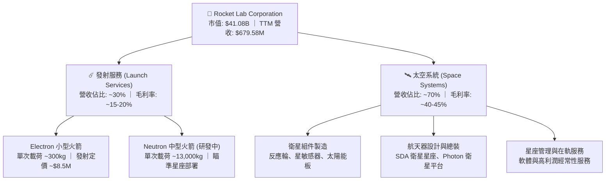

### 2.2 市場份額

在商業小型衛星發射市場中，Rocket Lab 的 Electron 火箭已成為事實上的行業標準（僅次於 SpaceX 的 Falcon 9 Transporter 共乘服務）。然而，在整體發射質量噸位上，SpaceX 仍佔據絕對統治地位。

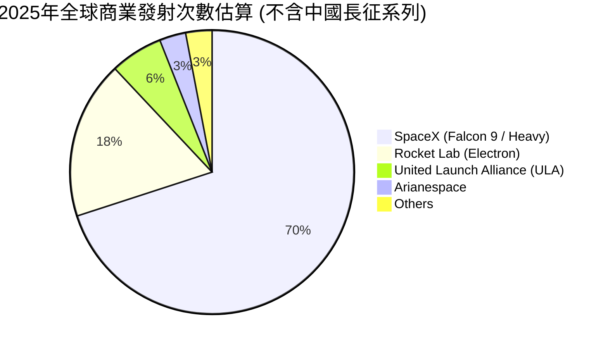

### 2.3 競爭護城河分析

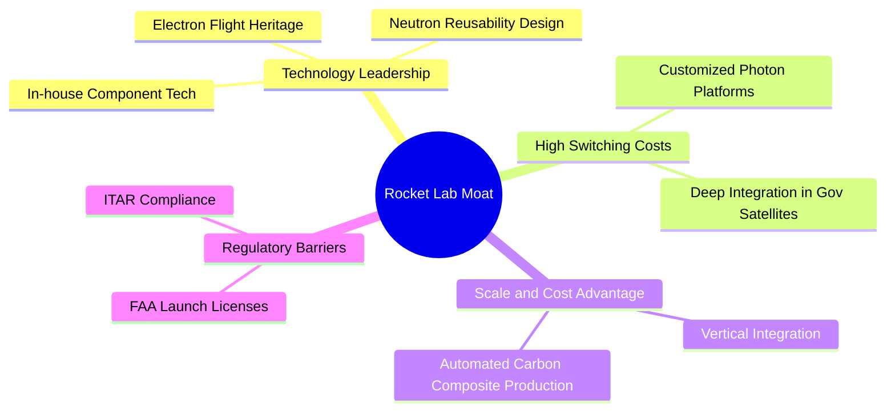

### 2.4 護城河強度評分

```
╔══════════════════════════════════════════════════════════════╗
║                  RKLB 護城河強度評分                         ║
╠══════════════════════════════════════════════════════════════╣
║ 發射歷史紀錄   9.0/10 ▓▓▓▓▓▓▓▓▓▓▓▓▓▓▓▓▓▓░░  🏆 Electron 領先同業║
║ 垂直整合能力   8.5/10 ▓▓▓▓▓▓▓▓▓▓▓▓▓▓▓▓▓░░░  🟢 關鍵組件自主生產 ║
║ 客戶鎖定效應   7.5/10 ▓▓▓▓▓▓▓▓▓▓▓▓▓▓░░░░░░  🟢 政府星座深度合作 ║
║ 專利與技術壁壘 8.0/10 ▓▓▓▓▓▓▓▓▓▓▓▓▓▓▓▓░░░░  🟢 碳纖維與火箭發動機║
╠══════════════════════════════════════════════════════════════╣
║ 綜合護城河評分 8.25/10 ▓▓▓▓▓▓▓▓▓▓▓▓▓▓▓▓▓░░░  🏆 具備強大產業壁壘 ║
╚══════════════════════════════════════════════════════════════╝
```

---

## 3. 損益表深度分析

### 3.1 年度收入成長趨勢（近4年）

Rocket Lab 展現了極其強勁的營收成長軌跡，主要由太空系統業務的併購與有機成長，以及 Electron 發射頻次的提升所驅動。

```
╔══════════════════════════════════════════════════════════════════╗
║                RKLB 年度收入趨勢 (FY2022 - TTM)                  ║
╠══════════════════════════════════════════════════════════════════╣
║                                                                  ║
║  FY2022  $211.00M  █████░░░░░░░░░░░░░░░░░░░░░  YoY: +239.0% 🟢   ║
║  FY2023  $244.59M  ██████░░░░░░░░░░░░░░░░░░░░  YoY: +15.9%  🟢   ║
║  FY2024  $436.21M  ███████████░░░░░░░░░░░░░░░  YoY: +78.3%  🟢   ║
║  FY2025  $601.80M  ███████████████░░░░░░░░░░░  YoY: +38.0%  🟢   ║
║  TTM     $679.58M  █████████████████░░░░░░░░░  YoY: +63.5%  🟢   ║
║                   |      |      |      |      |                  ║
║                   0     150M   300M   450M   600M                ║
║                                                                  ║
║  📊 3年累計 CAGR (FY22-FY25)：+41.8%                             ║
╚══════════════════════════════════════════════════════════════════╝
```

### 3.2 季度收入趨勢分析

從季度數據來看，Rocket Lab 的營收呈現加速成長態勢，Q1 2026 營收達到歷史新高的 $200.35M。

| 財報季度 | 營收 (Revenue) | QoQ 成長率 | YoY 成長率 | 備註與驅動因素 |
|---|---|---|---|---|
| **Q2 2025** | $144.50M | +17.9% | +36.0% | 太空系統零組件出貨增加 |
| **Q3 2025** | $155.08M | +7.3% | +48.0% | Electron 發射次數增加 |
| **Q4 2025** | $179.65M | +15.8% | +35.7% | 年底交付高峰，政府合約確認 |
| **Q1 2026** | $200.35M | +11.5% | +63.5% | 🟢 創歷史新高，太空系統與發射服務雙引擎驅動 |

### 3.3 利潤率演變分析

隨著高毛利的太空系統業務佔比提升，Rocket Lab 的毛利率呈現顯著的結構性改善。然而，由於 Neutron 研發費用持續擴大，營業利益率與淨利率仍處於虧損區間。

| 利潤率指標 | FY2022 | FY2023 | FY2024 | FY2025 | TTM | 趨勢評估 |
|---|---|---|---|---|---|---|
| **毛利率** | 9.00% | 21.02% | 26.63% | 34.43% | **36.56%** | ↗️ 顯著擴張（規模效應顯現） 🟢 |
| **營業利益率** | -64.08% | -72.74% | -43.51% | -38.03% | **-33.20%**| ↗️ 虧損率收窄，但研發投入大 🟡 |
| **EBITDA 利潤率**| -45.12% | -53.82% | -29.71% | -25.83% | **-24.30%**| ↗️ 折舊攤銷佔比高，核心虧損收窄 🟡 |
| **淨利率** | -64.43% | -74.64% | -43.60% | -32.94% | **-26.87%**| ↗️ 淨利潤率持續改善 🟡 |

* **利潤率演變深度解析**：毛利率從 2022 年的 9.0% 提升至 TTM 的 36.6%，主因在於太空系統零組件（如 SolAero 太陽能電池、反應輪）的產能利用率提高，以及 Electron 發射定價從早期的 $6M 提升至現今的 ~$8.5M。營業虧損主因是 **研發費用（R&D）** 在 FY2025 達 $270.72M（佔營收 45%），這筆資金主要用於 Neutron 火箭的研發與阿基米德發動機（Archimedes engine）的測試。

### 3.4 費用結構分析

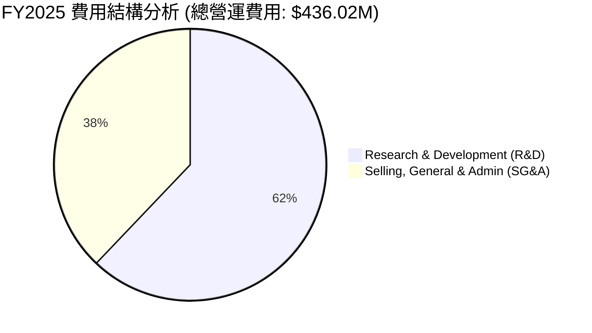

```
╔══════════════════════════════════════════════════════════════════╗
║                    RKLB 營運費用診斷                             ║
╠══════════════════════════════════════════════════════════════════╣
║                                                                  ║
║  研發費用 (R&D)：  $270.72M (營收 45.0%)  ← 投資未來，Neutron 關鍵  ║
║  管理費用 (SG&A)： $165.30M (營收 27.5%)  ← 規模效應顯現，佔比下降 ║
║                                                                  ║
║  💡 診斷：研發佔比極高，屬於典型的「技術導向型」高成長期企業。  ║
╚══════════════════════════════════════════════════════════════════╝
```

### 3.5 季度 EPS 趨勢與盈餘品質（Quality of Earnings）

過去 4 季，RKLB 的 EPS 表現相對穩定，虧損額度控制在預期之內。

* Q2 2025: -$0.13
* Q3 2025: -$0.03 (🟢 受益於一次性稅務利益與高毛利產品交付)
* Q4 2025: -$0.09
* Q1 2026: -$0.07 (🟢 優於市場預期的 -$0.09)

#### 盈餘品質評估：

| 盈餘品質項目 | 數值/佔比 | 評估 |
|---|---|---|
| **股權薪酬 (SBC) / 營收** | 11.81% ($71.10M / $601.80M) | 🔴 偏高，對現有股東權益造成稀釋壓力。 |
| **SBC / 營業現金流** | 負值 (-42.9%) | 🟡 由於營運現金流為負（-$165.52M），SBC 實際上起到了保留現金的作用，但也反映了真實營運成本被非現金支出「隱藏」。 |
| **FCF / GAAP 淨利** | 162% | 🟢 自由現金流赤字（-$321.81M）大於淨虧損（-$198.21M），主因是高額的資本支出（Capex $156.28M），這符合重資本航太行業的特徵。 |
| **遞延收入 (Unearned Revenue)** | $241.41M (Q1 2026) | 🟢 極高，佔營收比重達 35.5%，代表客戶預付款充沛，未來營收轉化能見度高。 |

* **盈餘品質結論**：RKLB 目前的虧損是「健康的虧損」。其 GAAP 淨虧損主要由非現金折舊（D&A $44.00M）與股權薪酬（SBC $71.10M）構成，且遞延收入持續增加。然而，高額的 SBC（佔營收 11.8%）是投資人需要注意的稀釋風險。

---

## 4. 資產負債表分析

### 4.1 資產結構分解

Rocket Lab 的資產負債表結構非常健康，流動資產佔比較高，主要由充裕的現金流動性支撐。

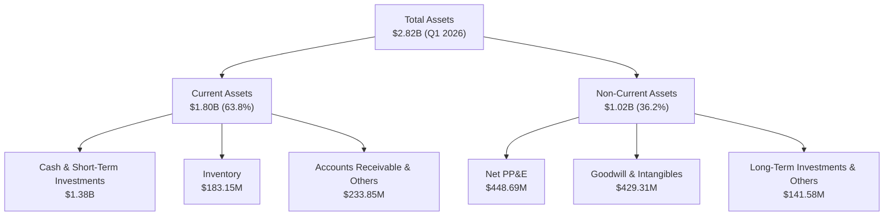

### 4.2 流動性指標分析

| 流動性指標 | FY2023 | FY2024 | FY2025 | Q1 2026 | 行業均值 | 評估 |
|---|---|---|---|---|---|---|
| **流動比率 (Current Ratio)** | 2.13 | 2.04 | 4.08 | **4.48** | ~1.40 | 🟢 極其安全 |
| **速動比率 (Quick Ratio)** | 1.65 | 1.69 | 3.61 | **3.87** | ~1.05 | 🟢 極其安全 |
| **現金比率 (Cash Ratio)** | 1.10 | 1.23 | 3.04 | **3.44** | ~0.45 | 🟢 資金充裕 |

### 4.3 債務結構分析

RKLB 的槓桿率極低，帳上現金遠超其總負債，處於「淨現金」狀態。

```
╔══════════════════════════════════════════════════════════════════╗
║                    RKLB 債務健康診斷 (Q1 2026)                  ║
╠══════════════════════════════════════════════════════════════════╣
║                                                                  ║
║  總債務：        $138.67M  █░░░░░░░░░░░░░░░░░░░░  (極低槓桿)    ║
║  總現金及投資：  $1.38B    ████████████████████░  (流動性充沛)  ║
║  淨現金 position：$1.24B    ██████████████████░░░  🟢 強勁資產   ║
║                                                                  ║
║  負債權益比 (D/E)： 6.12%   🟢 極低債務壓力                      ║
║  利息保障倍數：     N/A (由於營業利潤為負，但利息收入 > 利息支出) ║
║  利息收入 (FY25)：  $25.51M  vs  利息支出：$26.49M (基本持平)   ║
║                                                                  ║
║  💡 結論：RKLB 幾乎沒有破產風險，淨現金可支持其目前的 FCF 消耗    ║
║           至少 5 年以上，無須擔心短期債務危機。                  ║
╚══════════════════════════════════════════════════════════════════╝
```

### 4.4 股東權益趨勢

RKLB 的股東權益在 FY2025 出現大幅增長，主因是公司在 2025 年進行了增資發行新股，這雖然稀釋了現有股東，但也為 Neutron 的商業化提供了充足的「彈藥」。

```
╔══════════════════════════════════════════════════════════════════╗
║               RKLB 股東權益趨勢 (FY2022 - FY2025)                ║
╠══════════════════════════════════════════════════════════════════╣
║                                                                  ║
║  FY2022  $673.21M  ████████░░░░░░░░░░░░░░░░░░░░                  ║
║  FY2023  $554.54M  ██████░░░░░░░░░░░░░░░░░░░░░░                  ║
║  FY2024  $382.45M  ████░░░░░░░░░░░░░░░░░░░░░░░░                  ║
║  FY2025  $1.72B    ████████████████████████████  🟢 資本大幅充實 ║
║                                                                  ║
╚══════════════════════════════════════════════════════════════════╝
```

---

## 5. 現金流量深度分析

### 5.1 現金流量瀑布圖

下面的瀑布圖展示了 Rocket Lab 如何利用外部融資與帳上現金，來支持高額的研發與資本支出。

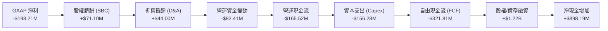

### 5.2 FCF 轉換率趨勢

由於公司仍處於大幅再投資階段，自由現金流持續為負，FCF/Net Income 轉換率指標在現階段不具備傳統估值意義，但可作為監控資本消耗速度的指標。

| 指標 (百萬美元) | FY2022 | FY2023 | FY2024 | FY2025 | TTM |
|---|---|---|---|---|---|
| **GAAP 淨利** | -$135.94 | -$182.57 | -$190.18 | -$198.21 | -$182.62 |
| **自由現金流 (FCF)** | -$148.95 | -$153.57 | -$115.98 | -$321.81 | -$215.00 |
| **FCF / 淨利比率** | 109.6% | 84.1% | 61.0% | 162.3% | 117.7% |
| **FCF Yield (相對於市值)** | -0.36% | -0.37% | -0.28% | -0.78% | **-0.52%** |

### 5.3 自由現金流趨勢

```
╔══════════════════════════════════════════════════════════════════╗
║               RKLB 自由現金流趨勢 (FY2022 - TTM)                 ║
╠══════════════════════════════════════════════════════════════════╣
║                                                                  ║
║  FY2022  -$148.95M  ░░░░░░░░░░░░░░░░░░░░░░░░░░░                  ║
║  FY2023  -$153.57M  ░░░░░░░░░░░░░░░░░░░░░░░░░░░░                 ║
║  FY2024  -$115.98M  ░░░░░░░░░░░░░░░░░░░░                        ║
║  FY2025  -$321.81M  ░░░░░░░░░░░░░░░░░░░░░░░░░░░░░░░░░░░░░░░░░░░  ║
║  TTM     -$215.00M  ░░░░░░░░░░░░░░░░░░░░░░░░░░░░░░               ║
║                                                                  ║
║  💡 趨勢：FY2025 資本支出達到高峰（主要用於 Neutron 發射台與     ║
║           生產設施建設）。TTM 消耗有所收窄，但預計短期內 FCF     ║
║           仍將維持負值。                                         ║
╚══════════════════════════════════════════════════════════════════╝
```

### 5.4 資本配置評估

Rocket Lab 的資本配置戰略極為清晰：**不進行任何股息支付或股票回購，將 100% 的可用資金投入研發（R&D）與資本支出（Capex）**。

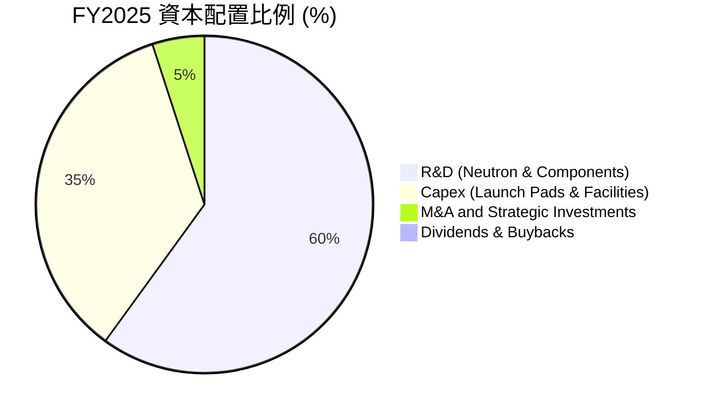

---

## 6. 獲利能力與資本效率

### 6.1 ROE / ROA / ROIC 趨勢

由於 RKLB 目前仍處於虧損狀態，其資本回報率皆為負值，但隨著營收規模擴大，虧損率已逐年收窄。

| 指標 | FY2022 | FY2023 | FY2024 | FY2025 | TTM | 行業均值 |
|---|---|---|---|---|---|---|
| **ROE (股東權益報酬率)** | -20.2% | -32.9% | -49.7% | -11.5% | **-13.5%** | ~8.5% |
| **ROA (總資產報酬率)** | -13.7% | -19.4% | -16.1% | -8.5% | **-6.6%** | ~4.2% |
| **ROIC (投入資本回報率)**| -15.2% | -20.8% | -22.4% | -10.2% | **-11.4%** | ~6.0% |

### 6.2 ROIC vs WACC 分析（核心價值創造判斷）

對於一家高成長但尚未盈利的航太公司，WACC（加權平均資本成本）通常較高，因為其 Beta 值極高（2.553），且航太產業本身具有高度不確定性。

```
╔══════════════════════════════════════════════════════════════════╗
║                RKLB ROIC vs WACC 深度分析 (TTM)                  ║
╠══════════════════════════════════════════════════════════════════╣
║                                                                  ║
║  WACC 估算：                                                     ║
║  ├── 無風險利率 (10Y 美債)：  4.20%                              ║
║  ├── 市場風險溢酬 (ERP)：     5.00%                              ║
║  ├── Beta：                   2.553                              ║
║  ├── 股權成本 = 4.20% + 2.553 × 5.00% = 16.97%                  ║
║  ├── 債務成本 (稅後)：       ~5.50%                              ║
║  ├── 資本結構：股權 ~95%，債務 ~5%                               ║
║  └── ✅ WACC ≈ 16.50%                                            ║
║                                                                  ║
║  ROIC 估算 (TTM)：                                               ║
║  ├── NOPAT = -$225.62M × (1 - 0%) ≈ -$225.62M                    ║
║  ├── 投入資本 = 股東權益 + 總債務 - 現金 ≈ $1.98B                 ║
║  └── ✅ ROIC ≈ -11.40%                                           ║
║                                                                  ║
║  ★ 經濟價值增加 (EVA) = ROIC - WACC = -27.90pp                   ║
║                                                                  ║
║  ROIC  -11.4%  ░░░░░░░░░░░░░░░░░░░░░░░░░░░░░░░░  🔴             ║
║  WACC  16.5%   ▓▓▓▓▓▓▓▓▓▓▓▓▓▓▓▓▓▓▓▓▓░░░░░░░░░░░  ──             ║
║  EVA   -27.9pp ░░░░░░░░░░░░░░░░░░░░░░░░░░░░░░░░  🔴 暫時摧毀價值 ║
║                                                                  ║
║  📊 結論：目前 RKLB 仍處於資本投入期，ROIC < WACC，正在消耗股東   ║
║           價值。此狀態預計將持續至 Neutron 實現商業化發射（2027+）。║
╚══════════════════════════════════════════════════════════════════╝
```

### 6.3 杜邦三因素分解

透過杜邦分解，我們可以更清晰地看到 RKLB 的 ROE 變動驅動因素：

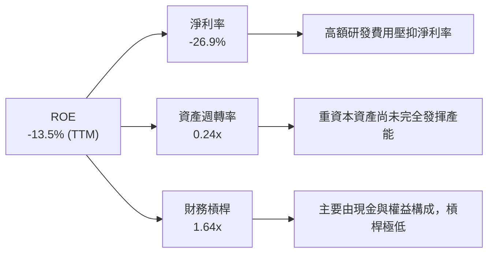

* **ROE (-13.5%) = 淨利率 (-26.87%) × 資產週轉率 (0.24x) × 財務槓桿 (1.64x)**
* **分析**：RKLB 的資產週轉率極低（0.24x），反映出其高達 $2.82B 的總資產中，有很大一部分是尚未產生營收的現金（$1.38B）與建設中的廠房。未來 ROE 的轉正將主要依賴於**淨利率的改善**（隨著太空系統規模效應顯現）與**資產週轉率的提升**（Neutron 投產）。

---

## 7. 估值深度分析

### 7.1 同業估值比較表格

由於 Rocket Lab 在商業太空領域的獨特地位，其估值通常享有極高的溢價。以下與幾家已上市的航太與太空系統公司進行對比：

| 估值指標 | **Rocket Lab (RKLB)** | **Intuitive Machines (LUNR)** | **Redwire (RDW)** | **Spire Global (SPIR)** | RKLB 估值評估 |
|---|---|---|---|---|---|
| **當前股價** | **$65.74** | $10.50 | $8.20 | $12.40 | - |
| **市值** | **$41.08B** | $1.20B | $540M | $280M | 🔴 體量遠超同業 |
| **P/S Ratio** | **60.44x** | 5.45x | 1.85x | 2.10x | 🔴 享有極高溢價 |
| **EV / Revenue** | **55.76x** | 5.10x | 1.90x | 2.30x | 🔴 溢價顯著 |
| **Forward P/E** | **2191.33x** | 45.0x | 28.0x | 18.5x | 🔴 盈餘尚未釋放 |
| **毛利率** | **36.6%** | 18.5% | 24.0% | 58.0% | 🟢 僅次於純軟體/數據公司 SPIR |

* **估值溢價合理性分析**：RKLB 的 P/S 達 60.44x，顯著高於 LUNR（5.45x）與 RDW（1.85x）。這種「極端」溢價反映了市場將其視為 **"SpaceX 唯一上市替代標的"**。市場給予其估值並非基於當前的 Electron 發射，而是基於 **Neutron 火箭在 2026-2030 年獲取中型載荷與星座發射市場份額的潛力**，以及太空系統業務高達 40%+ 的毛利率預期。

### 7.2 歷史估值區間分析

```
╔══════════════════════════════════════════════════════════════════╗
║               RKLB 歷史 P/S 估值區間 (2024 - 2026)               ║
╠══════════════════════════════════════════════════════════════════╣
║                                                                  ║
║  歷史最低 P/S：  8.0x   (2024-07 股價 $5.24 時)                  ║
║  歷史中位 P/S：  25.0x                                           ║
║  歷史最高 P/S：  120.0x  (2026-05 股價 $143.48 時)                ║
║  當前 P/S：      60.4x   (處於歷史中高位)                        ║
║                                                                  ║
║  P/S 區間：                                                      ║
║  [ 8.0x ]---------[ 25.0x 中位 ]=========[ 60.4x 當前 ]---[120.0x]║
║                                                                  ║
║  💡 結論：當前估值已部分消化了 Neutron 首飛成功的預期，安全邊際  ║
║           較低，股價短期對任何負面消息極其敏感。                 ║
╚══════════════════════════════════════════════════════════════════╝
```

### 7.3 情境目標價（假設驅動，Bear / Base / Bull）

為了避免單一估值指標的失真，我們基於 2028 年（Neutron 商業化發射第二年）的財務預測進行折現，推導 12 個月目標價：

| 情境 | 營收 CAGR (3年) | 2028 預期毛利率 | 2028 預期 EPS | 退出倍數 (P/S) | 隱含目標價 | 相對當現價 ($65.74) |
|---|---|---|---|---|---|---|
| 🔴 **悲觀情境** | 25.0% | 30.0% | -$0.10 | 15.0x | **$45.00** | -31.5% |
| 🟡 **基準情境** | **45.0%** | **38.0%** | **$0.15** | **45.0x** | **$114.33**| **+73.9%** |
| 🟢 **樂觀情境** | 65.0% | 45.0% | $0.50 | 60.0x | **$150.00**| +128.2% |

* **估值倍數選擇說明**：由於 RKLB 目前淨利潤為負，P/E 失去參考價值。我們選用 **P/S (市銷率)** 作為主要估值倍數，並參考太空與國防高成長期龍頭的溢價水平。基準情境給予 45.0x P/S，反映其在商業中型發射市場的雙寡頭（與 SpaceX）預期。

### 7.4 DCF 敏感性分析（6格目標價矩陣）

基於終端成長率 4.5% 及不同 WACC 與營收增速假設的 DCF 折現矩陣：

| 營收年複合增速 (2026-2030) | **WACC = 14.5%** | **WACC = 16.5% (基準)** | **WACC = 18.5%** |
|---|---|---|---|
| 🟢 **55.0% (樂觀)** | **$162.00** (+146%) | **$150.00** (+128%) | **$135.00** (+105%) |
| 🟡 **45.0% (基準)** | **$125.00** (+90%) | **$114.33** (+74%) | **$98.00** (+49%) |
| 🔴 **30.0% (悲觀)** | **$55.00** (-16%) | **$45.00** (-31%) | **$38.00** (-42%) |

### 7.5 估值綜合區間

```
╔══════════════════════════════════════════════════════════════════╗
║                    RKLB 估值區間與當前股價                       ║
╠══════════════════════════════════════════════════════════════════╣
║                                                                  ║
║  當前股價：$65.74                                                ║
║                                                                  ║
║  悲觀目標價：  $45.00  ░░░░░░░                                   ║
║  基準目標價：  $114.33 ▓▓▓▓▓▓▓▓▓▓▓▓▓▓▓▓▓▓░░░                      ║
║  樂觀目標價：  $150.00 ▓▓▓▓▓▓▓▓▓▓▓▓▓▓▓▓▓▓▓▓▓▓▓▓▓                  ║
║                                                                  ║
║  [ $45.00 ]=======[ $65.74 當前 ]---------------------[ $150.00 ]║
║                                                                  ║
║  💡 評語：當前股價提供了一個相對不錯的非對稱風險回報比（Risk-    ║
║           Reward Ratio），向下空間約 31%，向上空間達 74%-128%。║
╚══════════════════════════════════════════════════════════════════╝
```

---

## 8. 成長催化劑

### 8.1 催化劑時間軸

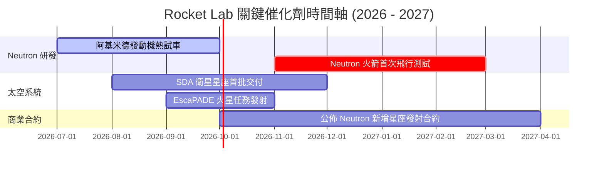

### 8.2 TAM 市場規模分析

Rocket Lab 的可尋址市場（TAM）正在從單一的小型衛星發射（~$5B）擴展至整體太空系統與星座營運（~$380B）。

```
╔══════════════════════════════════════════════════════════════════╗
║                RKLB 2030年 TAM 與滲透率預估                     ║
╠══════════════════════════════════════════════════════════════════╣
║                                                                  ║
║  1. 小型發射市場 (Electron)： TAM $10B ｜ 滲透率 35% ｜ 營收 $3.5B ║
║  2. 中型發射市場 (Neutron)：  TAM $30B ｜ 滲透率 15% ｜ 營收 $4.5B ║
║  3. 太空系統與組件：          TAM $150B｜ 滲透率  2% ｜ 營收 $3.0B ║
║  4. 衛星星座營運與服務：      TAM $190B｜ 滲透率0.5% ｜ 營收 $0.9B ║
║                                                                  ║
║  📊 預計 RKLB 2030 年總營收潛力可達 $11.9B。                    ║
╚══════════════════════════════════════════════════════════════════╝
```

### 8.3 成長驅動力結構圖

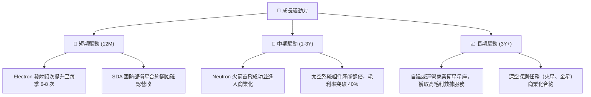

---

## 9. 風險矩陣

### 9.1 風險評分矩陣

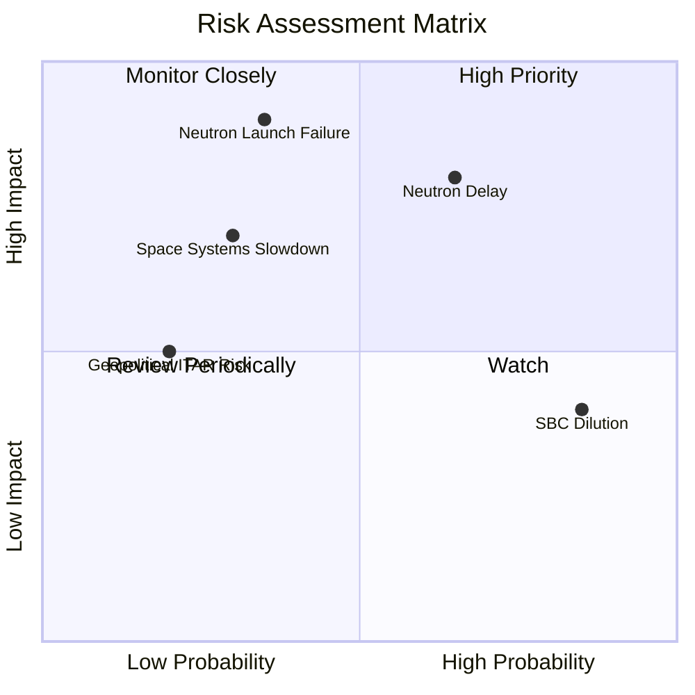

### 9.2 風險清單詳細分析

| # | 風險項目 | 發生機率 | 財務衝擊 | 風險評分 | 緩解措施 |
|---|---|---|---|---|---|
| 1 | 🔴 **Neutron 首飛延遲至 2027 年底後** | 高 (65%) | 中高 (-15% 營收預期) | 🔴 **7.8 / 10** | 帳上 $1.38B 現金可支撐延遲期間的研發消耗。 |
| 2 | 🔴 **Neutron 首次發射爆炸/失敗** | 中 (35%) | 極高 (-30% 估值倍數) | 🔴 **7.5 / 10** | 進行極為嚴苛的地面組件與發動機熱試車。 |
| 3 | 🟡 **太空系統組件供應鏈中斷** | 中 (30%) | 中等 (-10% 毛利率) | 🟡 **5.0 / 10** | 加強垂直整合，關鍵原材料實行雙源採購（Dual-sourcing）。 |
| 4 | 🟡 **股權持續稀釋 (SBC 偏高)** | 極高 (85%) | 低 (EPS 稀釋 ~3-5%) | 🟡 **4.5 / 10** | 隨著營收規模擴大，SBC 佔營收比重預計將稀釋降至 5% 以下。 |

---

## 10. 投資建議

### 10.1 最終綜合評級雷達圖

```
╔══════════════════════════════════════════════════════════════╗
║                    RKLB 綜合投資畫像                         ║
╠══════════════════════════════════════════════════════════════╣
║ 成長潛力     9.5/10 ▓▓▓▓▓▓▓▓▓▓▓▓▓▓▓▓▓▓▓░  ★★★★★           ║
║ 財務安全度   9.0/10 ▓▓▓▓▓▓▓▓▓▓▓▓▓▓▓▓▓▓░░  ★★★★☆           ║
║ 當前估值溢價 3.0/10 ▓▓▓▓▓▓░░░░░░░░░░░░░░  ★☆☆☆☆           ║
║ 技術壁壘     8.5/10 ▓▓▓▓▓▓▓▓▓▓▓▓▓▓▓▓▓░░░  ★★★★☆           ║
║ 營運執行力   8.0/10 ▓▓▓▓▓▓▓▓▓▓▓▓▓▓▓▓░░░░  ★★★★☆           ║
╠══════════════════════════════════════════════════════════════╣
║ 綜合推薦指數 7.6/10 ▓▓▓▓▓▓▓▓▓▓▓▓▓▓▓░░░░░  🟢 建議買入       ║
╚══════════════════════════════════════════════════════════════╝
```

### 10.2 目標價與隱含報酬率

| 情境 | 出現機率 | 目標價 | 隱含報酬率 | 機率權重目標價 |
|---|---|---|---|---|
| 🔴 **悲觀情境** | 20% | $45.00 | -31.5% | $9.00 |
| 🟡 **基準情境** | **60%** | **$114.33** | **+73.9%** | **$68.60** |
| 🟢 **樂觀情境** | 20% | $150.00 | +128.2% | $30.00 |
| **加權綜合目標價**| **100%** | **$107.60** | **+63.7%** | - |

### 10.3 買入時機與觸發因素

```
╔══════════════════════════════════════════════════════════════════╗
║                  ✅ Rocket Lab 投資行動方針                      ║
╠══════════════════════════════════════════════════════════════════╣
║                                                                  ║
║  立即買入觸發條件（滿足任一）：                                  ║
║  ✅ 股價回檔至 $50.00 - $55.00 區間（提供更高的安全邊際）         ║
║  ✅ Archimedes 發動機完成全時長（Full-duration）熱試車成功       ║
║                                                                  ║
║  加碼觸發條件（出現以下任一）：                                  ║
║  ☐ Neutron 火箭首飛成功並成功回收一級火箭                        ║
║  ☐ 太空系統單季營收突破 $250M，且毛利率維持在 40% 以上            ║
║                                                                  ║
║  減碼/停損觸發條件（出現以下任一）：                             ║
║  ☐ Neutron 首次發射失敗且調查顯示有重大設計缺陷                  ║
║  ☐ 核心管理層（如 CEO Peter Beck）宣佈離職                       ║
║                                                                  ║
╚══════════════════════════════════════════════════════════════════╝
```

### 10.4 投資人適配度分析

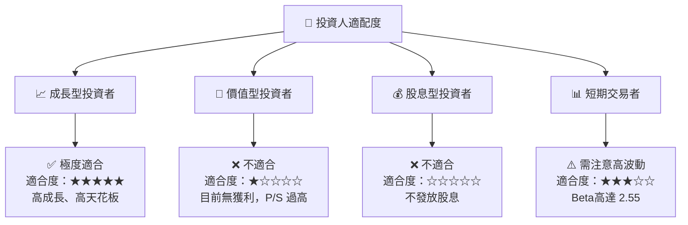

### 10.5 每季財報監控清單（Quarterly Watch List）

在未來的季度財報中，投資人應重點追蹤以下量化指標，以驗證本投資框架：

1. **太空系統（Space Systems）毛利率**：
   * **加碼門檻**：> 42%
   * **減碼門檻**：< 32%（代表供應鏈失控或定價權喪失）
2. **合約積壓（Backlog）成長率**：
   * **加碼門檻**：YoY 成長 > 30%
   * **減碼門檻**：連續兩季下滑（代表市場需求放緩）
3. **現金消耗率（Burn Rate）**：
   * **安全區間**：單季 FCF 流出控制在 -$80M 以內
   * **危險區間**：單季 FCF 流出 > -$120M 且無 Neutron 進度更新

### 10.6 反面論證：什麼會證明論點錯誤（What Would Change My Mind）

```
╔══════════════════════════════════════════════════════════════════╗
║              ⚠️ 論點失效條件 (Disconfirming Evidence)           ║
╠══════════════════════════════════════════════════════════════════╣
║  若出現以下任一量化條件，本報告的「買入」論點將立即失效：        ║
║                                                                  ║
║  ☐ 太空系統業務營收 YoY 增速連續兩季低於 25.0%                    ║
║  ☐ Neutron 火箭首飛時間被推遲至 2028 年 6 月之後                 ║
║  ☐ 為了維持營運，公司在股價低於 $40 時進行大規模股權融資（稀釋） ║
║  ☐ 帳上淨現金降至 $300M 以下，且 FCF 未見轉正跡象                ║
║  ☐ ROIC 惡化至 -20.0% 以下，代表資本配置效率出現重大滑坡         ║
╚══════════════════════════════════════════════════════════════════╝
```

---

> **免責聲明**：本報告為 AI 自動生成，基於公開財務數據進行建模與分析，僅供研究參考，不構成任何明示或暗示的投資建議。投資有風險，入市需謹慎。