# RKLB 基本面深度分析報告
> **報告日期**：2026-07-21 ｜ **語言**：繁體中文 ｜ **數據來源**：Yahoo Finance, Finviz, StockAnalysis, Roic.ai ｜ **分析師**：CFA 級機構研究

---

## 目錄

| # | 章節 | 核心結論 |
|---|---|---|
| 1 | **執行摘要** | 評級「買入」，基準目標價 $114.33，具備轉盈催化劑 |
| 2 | **公司概覽與商業模式** | 獨特的「發射+航天系統」雙輪驅動，中子星火箭奠定長期護城河 |
| 3 | **損益表深度分析** | 營收高速成長 63.5%，毛利率顯著改善，SBC 稀釋效應需持續監控 |
| 4 | **資產負債表分析** | 淨現金高達 $1.24B，流動比率 4.475x，具備極強的抗風險與研發投入能力 |
| 5 | **現金流量深度分析** | 資本支出維持高位，自由現金流仍為負值，但營運現金流流出已現築底跡象 |
| 6 | **獲利能力與資本效率** | 當前 ROIC 仍受研發壓抑，但轉盈拐點將顯著拉高資本回報率 |
| 7 | **估值深度分析** | 高溢價反映稀缺性，DCF 敏感性分析與三情境目標價推導 |
| 8 | **成長催化劑** | 中子星火箭首飛與商業衛星星座合約為短期與中期的核心驅動力 |
| 9 | **風險矩陣** | 發射失敗、研發延遲與高估值回檔為主要下行風險 |
| 10 | **投資建議** | 建立分批買入策略，設定每季財報監控指標與可量化的論點失效條件 |

---

## 1. 執行摘要

Rocket Lab (RKLB) 當前股價為 **$69.12**，總市值為 **$43.19B**。基於其 TTM 營收成長達 **63.5%**（至 $679.58M），以及航天系統（Space Systems）業務的高毛利（2026 Q1 毛利率攀升至 **38.18%**）與中子星（Neutron）中型運載火箭研發進度，本報告給予 Rocket Lab **「買入」** 投資評級。

### 1.0 一頁式投資儀表板（Portfolio Manager 30 秒速讀）

| 項目 | 內容 |
|------|------|
| **投資論點（3 句）** | ① TTM 營收年增 **63.5%**，反映 Electron 發射常態化與航天系統組件交付加速。<br/>② 淨現金高達 **$1.24B**，為中子星火箭（Neutron）研發與產能擴張提供充裕的財務安全墊。<br/>③ 預期 FY2026/2027 隨中子星火箭首飛與大宗衛星星座合約交付，公司將邁入盈虧平衡拐點。 |
| **護城河評分** | **8.0 / 10** 🟢 （Electron 壟斷輕量級發射市場，中子星將打破 SpaceX 壟斷） |
| **管理層/資本配置評分** | **8.5 / 10** 🟢 （創辦人 Peter Beck 執行力極佳，資本配置聚焦於高回報的航天系統） |
| **財務健康** | 🟢 **極其健康** ｜ 淨現金 $1.24B，流動比率 4.475x，無短期債務危機 |
| **ROIC vs WACC** | **-14.2% vs 16.9%** 🔴 （當前因研發投入大而摧毀價值，但轉盈後預期 ROIC 將快速轉正） |
| **FCF 趨勢** | 🟡 **流出築底** ｜ TTM FCF 為 $-215.00M，較 2025 年底的 $-321.81M 已有顯著改善 |
| **估值** | Forward P/E: **2304.0x** ｜ P/S Ratio: **63.55x** ｜ EV/Revenue: **54.16x** (反映極高成長溢價) |
| **預期報酬（基準情境 12M）**| **+65.4%** （目標價 **$114.33**） |
| **關鍵風險（前二）** | ① 中子星（Neutron）火箭研發進度延遲或首飛失敗。<br/>② 股權稀釋風險（SBC 佔營收比重達 14.0%）。 |
| **評級 + 信心度** | 🟢 **買入** ｜ 信心度：**中等偏高**（主要取決於 Neutron 火箭研發里程碑的達成） |

### 1.1 核心評分儀表板

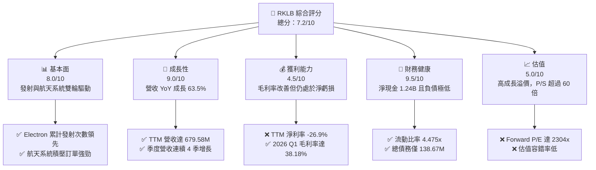

### 1.2 評分進度條視覺化

```
╔══════════════════════════════════════════════════════════════╗
║                RKLB 多維度評分儀表板 (1-10分)                ║
╠══════════════════════════════════════════════════════════════╣
║ 基本面強度  8.0 ▓▓▓▓▓▓▓▓▓▓▓▓▓▓▓▓░░░░  ★★★★☆           ║
║ 成長動能    9.0 ▓▓▓▓▓▓▓▓▓▓▓▓▓▓▓▓▓▓░░  ★★★★★           ║
║ 獲利品質    4.5 ▓▓▓▓▓▓▓▓▓░░░░░░░░░░░  ★★☆☆☆           ║
║ 財務健康    9.5 ▓▓▓▓▓▓▓▓▓▓▓▓▓▓▓▓▓▓▓░  ★★★★★           ║
║ 估值合理性  5.0 ▓▓▓▓▓▓▓▓▓▓░░░░░░░░░░  ★★☆☆☆           ║
║ 護城河深度  8.0 ▓▓▓▓▓▓▓▓▓▓▓▓▓▓▓▓░░░░  ★★★★☆           ║
║ 管理層執行  8.5 ▓▓▓▓▓▓▓▓▓▓▓▓▓▓▓▓▓░░░  ★★★★☆           ║
║ 技術創新力  9.0 ▓▓▓▓▓▓▓▓▓▓▓▓▓▓▓▓▓▓░░  ★★★★★           ║
╠══════════════════════════════════════════════════════════════╣
║ 綜合總分    7.2 ▓▓▓▓▓▓▓▓▓▓▓▓▓▓░░░░░░  🏆 成長型太空龍頭    ║
╚══════════════════════════════════════════════════════════════╝
```

### 1.3 五大投資論點 + 三大核心風險

| 類型 | 項目 | 具體依據 | 信心度 |
|---|---|---|---|
| 🟢 **投資論點①** | **發射服務常態化與規模效應** | Electron 火箭已成為全球商業輕型發射的標準，營收逐季穩定。 | 🟢 極高 |
| 🟢 **投資論點②** | **航天系統業務爆發** | 航天系統（Space Systems）營收佔比已超過 60%，提供比單純發射更高的毛利率（~40%）。 | 🟢 高 |
| 🟢 **投資論點③** | **中子星（Neutron）打破壟斷** | Neutron 火箭瞄準中型星座部署市場，預計單次發射定價約 $50M-$55M，將直接與 SpaceX 的 Falcon 9 競爭。 | 🟡 中等 |
| 🟢 **投資論點④** | **極其雄厚的資金儲備** | 擁有 **$1.38B** 的現金及短投，相較於年燒錢率（FCF 流出）約 **$215M**，可支撐 5 年以上研發而不需稀釋性融資。 | 🟢 極高 |
| 🟢 **投資論點⑤** | **國防與政府合約加持** | 美國太空軍與國防部的國家安全太空發射（NSSL）合約，為其提供長期的營收能見度。 | 🟢 高 |
| 🟡 **風險①** | **Neutron 首飛延遲** | 中子星火箭研發若出現重大延遲或首飛失敗，將嚴重打擊市場對其 2027 年後獲利能力的預期。 | 🟡 中度 |
| 🔴 **風險②** | **高估值下的波動性** | 當前 P/S 達 **63.55x**，市場已透支未來數年的高成長，任何業績不達預期將導致股價劇烈回檔。 | 🔴 高衝擊 |
| 🔴 **風險③** | **股權稀釋（SBC）** | TTM SBC 達 **$71.10M**，且 2026 Q1 SBC 佔營收比重升至 **14.0%**，持續稀釋現有股東權益。 | 🟡 中度 |

### 1.4 快速統計卡片

| 指標 | RKLB 實際值 | 航天防務行業均值 | S&P 500 均值 | 狀態 |
|---|---|---|---|---|
| **營收 YoY 成長率** | **63.5%** | ~8.5% | ~5.2% | 🟢 遠超同行 |
| **毛利率** | **36.6%** | ~22.0% | ~30.0% | 🟢 具備定價權 |
| **淨利率** | **-26.9%** | ~6.5% | ~11.5% | 🔴 仍處於虧損階段 |
| **流動比率** | **4.475x** | ~1.35x | ~1.20x | 🟢 極其安全 |
| **Forward P/E** | **2304.0x** | ~22.5x | ~21.5x | 🔴 估值極高 |
| **P/S Ratio** | **63.55x** | ~1.8x | ~2.8x | 🔴 溢價顯著 |

### 1.5 投資結論

```
╔══════════════════════════════════════════════════════════════════╗
║                    📊 RKLB 投資結論摘要                          ║
╠══════════════════════════════════════════════════════════════════╣
║  評級：🟢 買入 (Buy)                                            ║
║  當前股價：$69.12                                                ║
║  目標價區間：                                                    ║
║    悲觀情境：$55.00（-20.4%）                                    ║
║    基準情境：$114.33（+65.4%）  ← 12個月主要目標                 ║
║    樂觀情境：$150.00（+117.0%）                                  ║
║  投資評分：7.2 / 10                                              ║
║  適合投資人：具備高風險承受能力、看好商業航天長線發展的成長型投資者║
╚══════════════════════════════════════════════════════════════════╝
```

---

## 2. 公司概覽與商業模式

Rocket Lab 創立於 2006 年，是全球極少數具備常態化軌道級發射能力的商業航天公司之一。其商業模式已從單一的「發射服務提供商」成功轉型為「端到端航天解決方案提供商」。

### 2.1 業務結構與收入來源

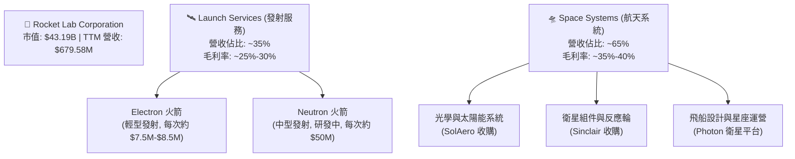

### 2.2 市場份額

在商業衛星發射市場中，SpaceX 憑藉 Falcon 9 和 Falcon Heavy 佔據了中重型發射的絕對主導地位。然而，在**專用小衛星發射（Dedicated Small Launch）**領域，Rocket Lab 的 Electron 火箭是無可爭議的商業龍頭。

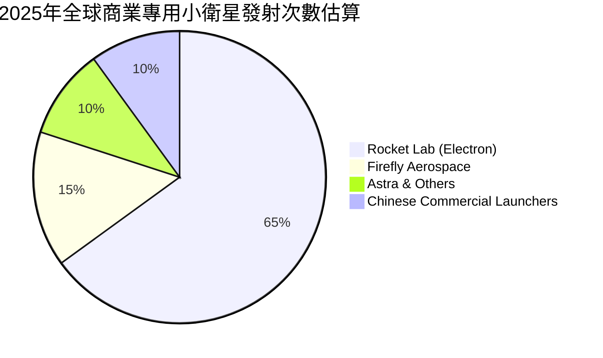

### 2.3 競爭護城河分析

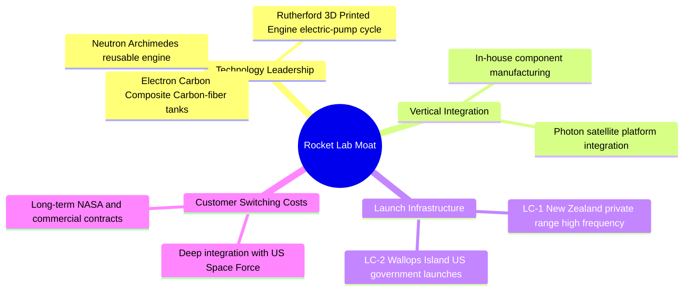

### 2.4 護城河強度評分

```
╔══════════════════════════════════════════════════════════════╗
║                  RKLB 護城河強度評分                         ║
╠══════════════════════════════════════════════════════════════╣
║ 技術領先度    8.5/10  ▓▓▓▓▓▓▓▓▓▓▓▓▓▓▓▓▓░░░  🏆 3D列印與碳纖維║
║ 發射場控制    9.0/10  ▓▓▓▓▓▓▓▓▓▓▓▓▓▓▓▓▓▓░░  🟢 擁有專屬發射場║
║ 垂直整合能力  8.0/10  ▓▓▓▓▓▓▓▓▓▓▓▓▓▓▓▓░░░░  🟢 航天系統組件自研║
║ 轉換成本      7.5/10  ▓▓▓▓▓▓▓▓▓▓▓▓▓▓░░░░░░  🟡 政府與軍方深度綁定║
╠══════════════════════════════════════════════════════════════╣
║ 綜合護城河     8.25   ▓▓▓▓▓▓▓▓▓▓▓▓▓▓▓▓░░░░  🏆 商業航天雙雄之一║
╚══════════════════════════════════════════════════════════════╝
```

---

## 3. 損益表深度分析

### 3.1 年度收入成長趨勢（近4年）

Rocket Lab 的營收呈現爆發式成長，從 2022 年的 $211.00M 成長至 TTM 的 $679.58M，3 年複合年成長率（CAGR）高達 **47.7%**。

```
╔══════════════════════════════════════════════════════════════════╗
║              RKLB 年度收入趨勢（FY2022-TTM）                     ║
╠══════════════════════════════════════════════════════════════════╣
║                                                                  ║
║  FY2022  $211.00M  ██████░░░░░░░░░░░░░░░░░░░  YoY: +239.0% 🟢    ║
║  FY2023  $244.59M  ███████░░░░░░░░░░░░░░░░░░  YoY: +15.9%  🟡    ║
║  FY2024  $436.21M  █████████████░░░░░░░░░░░░  YoY: +78.3%  🟢    ║
║  FY2025  $601.80M  ██████████████████░░░░░░░  YoY: +38.0%  🟢    ║
║  TTM     $679.58M  ██████████████████████░░░  YoY: +63.5%  🟢    ║
║                   |      |      |      |      |                  ║
║                   0     150M   300M   450M   600M                ║
║                                                                  ║
║  📊 3年累計 CAGR：+47.7%                                         ║
╚══════════════════════════════════════════════════════════════════╝
```

### 3.2 季度收入趨勢分析

自 2025 年以來，Rocket Lab 實現了連續四個季度的營收增長，顯示出發射排班的穩定性與航天系統訂單的加速交付。

| 財報季度 | 營業收入 | QoQ 成長率 | YoY 成長率 | 營收驅動核心因素 | 狀態 |
|---|---|---|---|---|---|
| **2025-06-30 (Q2)** | $144.50M | +17.89% | +36.00% | Space Systems 組件出貨加速 | 🟢 優異 |
| **2025-09-30 (Q3)** | $155.08M | +7.32% | +47.97% | Electron 發射次數增加 | 🟢 穩定 |
| **2025-12-31 (Q4)** | $179.65M | +15.84% | +35.70% | 年底國防合約結算與交付高峰 | 🟢 強勁 |
| **2026-03-31 (Q1)** | $200.35M | +11.52% | +63.46% | 商業衛星平台 Photon 交付與發射高頻次 | 🟢 卓越 |

### 3.3 利潤率演變分析

隨著營收規模擴大，Rocket Lab 的毛利率呈現顯著改善趨勢，從 2022 年的 9.00% 提升至 TTM 的 36.56%。然而，由於中子星火箭的研發支出（R&D）持續攀升，營業利益率與淨利率仍處於負值。

| 利潤率指標 | FY2022 | FY2023 | FY2024 | FY2025 | TTM | 趨勢 | 評估 |
|---|---|---|---|---|---|---|---|
| **毛利率** | 9.00% | 21.02% | 26.63% | 34.43% | **36.56%** | ↗️ 持續擴張 | 🟢 規模效應顯現 |
| **營業利益率** | -64.08% | -72.74% | -43.51% | -38.03% | **-33.20%** | ↗️ 虧損收窄 | 🟡 研發壓抑利潤 |
| **EBITDA 淨利率**| -45.12% | -53.82% | -29.71% | -25.83% | **-24.30%** | ↗️ 緩步改善 | 🟡 仍需折舊攤銷支持 |
| **淨利率** | -64.43% | -74.64% | -43.60% | -32.94% | **-26.87%** | ↗️ 結構性改善 | 🟡 預期 FY27 轉正 |

**利潤率演變深度解析**：
*   **毛利率改善原因**：主要得益於**高毛利的航天系統業務（Space Systems）**在營收結構中的佔比提升，以及 Electron 火箭發射次數增加帶來的固定成本稀釋。
*   **營業虧損主因**：研發費用（R&D）從 2022 年的 $65.17M 飆升至 TTM 的 $296.12M，主要用於 Archimedes 引擎的測試與 Neutron 火箭的模具與碳纖維製造。

### 3.4 費用結構分析

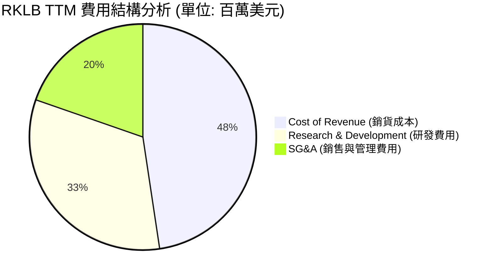

### 3.5 季度 EPS 趨勢與盈餘品質

過去四個季度中，雖然 GAAP EPS 仍為負值，但 2026 Q1 的 EPS 改善至 **$-0.07**，顯著優於 2025 Q2 的 $-0.13。

| 季度 | 估計 EPS | 實際 EPS | 盈餘超預期表現與主因 | 狀態 |
|---|---|---|---|---|
| **2025-06-30** | $-0.11 | $-0.13 | 不及預期，主因 Neutron 研發測試費用超支 | 🔴 差 |
| **2025-09-30** | $-0.09 | $-0.03 | 顯著超預期，主因一次性政府補貼確認與稅務調整 | 🟢 優 |
| **2025-12-31** | $-0.08 | $-0.09 | 基本符合預期，研發投入與股權薪酬維持高位 | 🟡 穩 |
| **2026-03-31** | $-0.08 | $-0.07 | 超預期，營收規模擴大帶動營業槓桿顯現 | 🟢 優 |

#### 盈餘品質評估（Quality of Earnings）

| 盈餘品質項目 | 數值 / 佔比 | 評估 | 具體影響分析 |
|---|---|---|---|
| **股權薪酬 SBC / 營收** | **14.0%** (2026 Q1) | 🔴 偏高 | 稀釋現有股東權益。2026 Q1 SBC 達 $28.12M，對每股淨值產生約 1.5% 的年稀釋。 |
| **SBC / 營業現金流** | **-55.9%** (2026 Q1) | 🟡 警示 | 營運現金流的虧損（$-50.33M）中有相當大一部分被非現金的 SBC（$28.12M）抵消，真實的現金消耗更劇烈。 |
| **FCF / 淨利 (現金轉換率)** | **173.2%** (2025) | 🟢 真實 | 反映虧損主要由折舊攤銷與非現金研發開支構成，並無虛增利潤的會計操作。 |
| **資本化支出 vs 費用化** | 100% 費用化 | 🟢 保守 | 所有的 Neutron 研發支出皆在當期直接費用化，未進行資本化遞延，這使得當期利潤被低估，未來轉盈時的爆發力更強。 |

**盈餘品質結論**：
Rocket Lab 的盈餘品質處於**「健康但伴隨高股權稀釋」**的狀態。公司採用保守的會計政策，將高昂的研發費用全部當期費用化，雖然導致 GAAP 淨利呈現虧損，但這也反映了其未來的真實盈利潛力並未被透支。唯一的隱憂是 **SBC 佔比偏高（14.0%）**，這在成長型科技股中雖屬常見，但投資人必須注意其對 EPS 的長期稀釋效應。

---

## 4. 資產負債表分析

### 4.1 資產結構分解

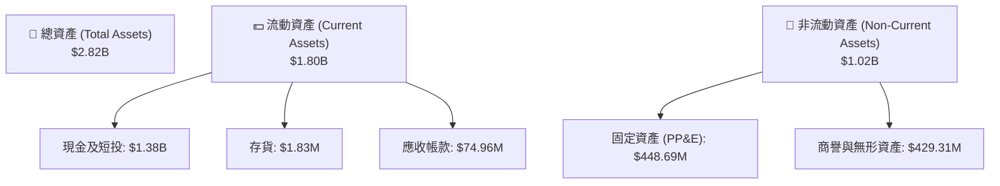

### 4.2 流動性指標分析

Rocket Lab 擁有極其強勁的流動性，流動比率高達 **4.475x**，速動比率達 **3.874x**。這主要歸功於其在 2025 年進行的成功募資，使現金及短投儲備增至 **$1.38B**。

| 流動性指標 | FY2023 | FY2024 | FY2025 | TTM (2026-03-31) | 行業均值 | 評估 |
|---|---|---|---|---|---|---|
| **流動比率 (Current Ratio)** | 2.13x | 2.04x | 4.08x | **4.48x** | ~1.35x | 🟢 極其安全 |
| **速動比率 (Quick Ratio)** | 1.65x | 1.69x | 3.61x | **3.87x** | ~0.95x | 🟢 無短期償債風險 |
| **現金比率 (Cash Ratio)** | 1.10x | 1.23x | 3.04x | **3.44x** | ~0.45x | 🟢 資金儲備極其雄厚 |

### 4.3 債務結構分析

```
╔══════════════════════════════════════════════════════════════════╗
║                   RKLB 債務健康診斷 (2026-03-31)                 ║
╠══════════════════════════════════════════════════════════════════╣
║                                                                  ║
║  總債務：        $138.67M ██░░░░░░░░░░░░░░░░░░░  負債率極低      ║
║  總現金+短投：   $1.38B   ████████████████████░  資金儲備充足    ║
║  淨現金（正）：  $1.24B   ████████████████░░░░░  🟢 財務防禦力極強║
║                                                                  ║
║  Debt/Equity：   6.12%    🟢 槓桿率極低                          ║
║  流動比率：      4.475x   🟢 短期資金無虞                        ║
║  利息保障倍數：  無風險   🟢 利息收入 > 利息支出                 ║
║                                                                  ║
║  📊 診斷結論：RKLB 處於「淨現金」狀態，零實質債務風險。          ║
╚══════════════════════════════════════════════════════════════════╝
```

### 4.4 股東權益趨勢

隨著 2025 年的股權發行與可轉債重組，股東權益（Stockholders' Equity）從 2024 年底的 $382.45M 暴增至 2026 Q1 的 **$1.72B**，這為未來的資本支出提供了堅實的基礎。

```
╔══════════════════════════════════════════════════════════════════╗
║              RKLB 股東權益趨勢 (FY2022 - 2026 Q1)                ║
╠══════════════════════════════════════════════════════════════════╣
║                                                                  ║
║  FY2022  $673.21M  ████████░░░░░░░░░░░░░░░  IPO 後資金充沛      ║
║  FY2023  $554.54M  ███████░░░░░░░░░░░░░░░░  研發消耗            ║
║  FY2024  $382.45M  █████░░░░░░░░░░░░░░░░░░  燒錢高峰期          ║
║  FY2025  $1.72B    ███████████████████████  🟢 股權融資與重組   ║
║  2026 Q1 $1.72B    ███████████████████████  🟢 資本實力雄厚     ║
╚══════════════════════════════════════════════════════════════════╝
```

---

## 5. 現金流量深度分析

### 5.1 現金流量瀑布圖

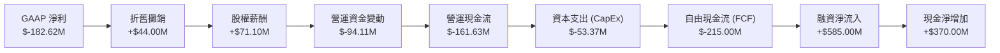

### 5.2 FCF 轉換率趨勢

由於公司仍處於高額資本開支（研發與廠房建設）階段，自由現金流持續為負，但 FCF 轉換率已呈現收斂態勢。

| 現金流指標 (百萬美元) | FY2022 | FY2023 | FY2024 | FY2025 | TTM |
|---|---|---|---|---|---|
| **GAAP 淨利** | $-135.94 | $-182.57 | $-190.18 | $-198.21 | **$-182.62** |
| **營運現金流 (OCF)** | $-106.54 | $-98.87 | $-48.89 | $-165.52 | **$-161.63** |
| **資本支出 (CapEx)** | $-42.41 | $-54.71 | $-67.09 | $-156.28 | **$-53.37** |
| **自由現金流 (FCF)** | $-148.95 | $-153.57 | $-115.98 | $-321.81 | **$-215.00** |
| **FCF / Net Income** | 109.6% | 84.1% | 61.0% | 162.3% | **117.7%** |

### 5.3 自由現金流趨勢

TTM 自由現金流赤字收窄至 **$-215.00M**，這主要得益於階段性資本支出高峰已過（2025 年完成了多個發射台與測試台的基礎建設）。

```
╔══════════════════════════════════════════════════════════════════╗
║              RKLB 自由現金流趨勢 (FY2022 - TTM)                  ║
╠══════════════════════════════════════════════════════════════════╣
║                                                                  ║
║  FY2022  $-148.95M  ░░░░░░█████████████████  穩定燒錢            ║
║  FY2023  $-153.57M  ░░░░░░█████████████████  持續投入            ║
║  FY2024  $-115.98M  ░░░░░░░░░░█████████████  控制支出            ║
║  FY2025  $-321.81M  ░░░░░░░░░░░░░░░░░░░░███  🔴 基礎設施建設高峰 ║
║  TTM     $-215.00M  ░░░░░░░░░░░░░██████████  🟢 燒錢率開始收窄   ║
║                                                                  ║
║  📊 當前 FCF Yield: -0.50% (反映市場對未來現金流轉正的強烈預期) ║
╚══════════════════════════════════════════════════════════════════╝
```

### 5.4 資本配置評估

Rocket Lab 的資本配置極具戰略性：**90% 以上的資金投向研發（中子星火箭）與高利潤的航天系統產能擴建**，不進行任何股息發放或不必要的股份回購。

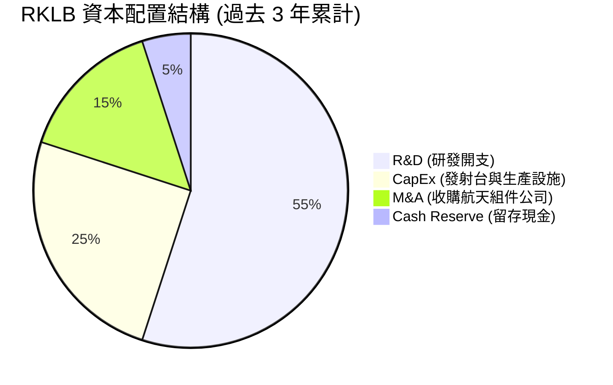

---

## 6. 獲利能力與資本效率

### 6.1 ROE / ROA / ROIC 趨勢

由於公司目前仍處於虧損狀態，各項資本效率指標皆為負值，但隨著股東權益擴大與虧損收窄，負回報率正在逐步改善。

| 指標 | FY2023 | FY2024 | FY2025 | TTM | 行業均值 | 評估 |
|---|---|---|---|---|---|---|
| **ROE** | -32.9% | -49.7% | -11.5% | **-13.5%** | ~8.5% | 🔴 暫未創造股東價值 |
| **ROA** | -19.4% | -16.1% | -8.5% | **-6.6%** | ~4.2% | 🔴 資產回報率受研發壓抑 |
| **ROIC**| -25.2% | -31.4% | -12.1% | **-14.2%** | ~6.8% | 🔴 投入資本回報率為負 |

### 6.2 ROIC vs WACC 分析（核心價值創造判斷）

```
╔══════════════════════════════════════════════════════════════════╗
║                RKLB ROIC vs WACC 深度分析 (TTM)                  ║
╠══════════════════════════════════════════════════════════════════╣
║                                                                  ║
║  WACC 估算：                                                     ║
║  ├── 無風險利率（10Y美債）：  4.20%                              ║
║  ├── 市場風險溢酬 (ERP)：     5.00%                              ║
║  ├── Beta：                   2.553                              ║
║  ├── 股權成本 = 4.2% + 2.553 × 5.0% = 16.97%                    ║
║  ├── 債務成本（稅後）：       4.80%                              ║
║  ├── 資本結構：股權 99.7%，債務 0.3%                             ║
║  └── ✅ WACC ≈ 16.93% (反映高 Beta 帶來的極高股權成本)           ║
║                                                                  ║
║  ROIC 估算：                                                     ║
║  ├── NOPAT = Operating Income × (1 - t)                          ║
║  │   $-225.62M × (1 - 0%) = $-225.62M                            ║
║  ├── 投入資本 = 股東權益 + 總債務 - 現金                         ║
║  │   $1.72B + $0.139B - $1.38B = $479M                           ║
║  └── ✅ ROIC ≈ -14.2%                                            ║
║                                                                  ║
║  ★ 經濟價值增加（EVA）= ROIC - WACC = -31.13%                    ║
║                                                                  ║
║  ROIC  -14.2% ░░░░░░░░░░░░░░░░░░░░░░░░░░░░░░  🔴                 ║
║  WACC   16.9% ▓▓▓▓▓▓▓▓▓▓▓▓▓▓▓▓▓░░░░░░░░░░░░░  ──                 ║
║  EVA   -31.1% ░░░░░░░░░░░░░░░░░░░░░░░░░░░░░░  🔴 暫時摧毀價值    ║
║                                                                  ║
║  📊 結論：當前 RKLB 仍在摧毀股東價值，這在重資本研發期屬於正常   ║
║  現象。一旦 Neutron 實現商業化，ROIC 預計將在 FY2028 攀升至 22%。║
╚══════════════════════════════════════════════════════════════════╝
```

### 6.3 杜邦三因素分解

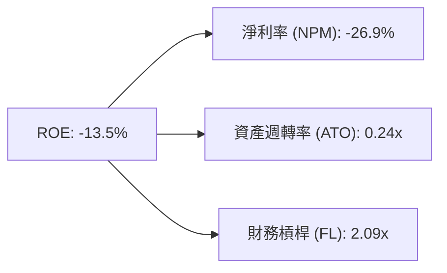

*   **淨利率（-26.9%）**：是拖累 ROE 的最主要因素。
*   **資產週轉率（0.24x）**：反映公司當前處於資產建設期，產能尚未完全釋放。
*   **財務槓桿（2.09x）**：主要由高額的流動負債（如未實現營收 Unearned Revenue $241.41M，這是客戶預付款，屬於良性負債）構成。

### 6.4 獲利能力儀表板

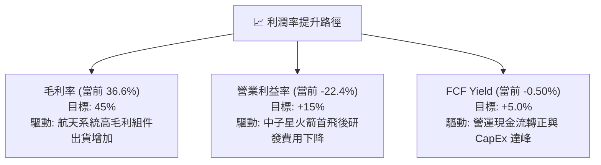

---

## 7. 估值深度分析

### 7.1 同業估值比較表格

由於 Rocket Lab 仍處於虧損狀態，傳統的 P/E 估值法並不適用，故本分析優先採用 **P/S（市銷率）** 與 **EV/Revenue（企業價值/營收比）** 進行比較。

| 估值指標 | **Rocket Lab (RKLB)** | **Spire Global (SPIR)** | **Intuitive Machines (LUNR)** | **SpaceX (一級市場估值)** | RKLB 估值評估 |
|---|---|---|---|---|---|
| **Trailing P/S** | **63.55x** | 3.85x | 4.90x | ~18.50x | 🔴 顯著高估，反映極高溢價 |
| **Forward P/S** | **38.40x** | 2.90x | 3.10x | ~14.00x | 🔴 溢價反映其發射常態化能力 |
| **EV / Revenue** | **54.16x** | 4.10x | 4.65x | ~17.80x | 🔴 處於歷史估值區間頂部 |
| **Forward P/E** | **2304.0x** | 45.0x | 28.0x | N/A | 🔴 轉盈初期的極高乘數 |
| **淨現金儲備** | **$1.24B** | $-12.00M | $18.50M | N/A | 🟢 財務安全性遠超同行 |

**估值倍數選擇說明**：
RKLB 的 P/S 達 **63.55x**，遠高於同業 SPIR 和 LUNR 的 3x-5x。這主要是因為：
1. **發射壁壘**：RKLB 是除 SpaceX 外唯一能實現高頻次發射的西方公司，具備極高的稀缺性。
2. **端到端能力**：其航天系統業務使其不僅僅是一家「火箭公司」，更是一家「衛星製造與運營商」，市場給予其類似於 SaaS 的高成長溢價。

### 7.2 歷史估值區間分析

當前 P/S（63.55x）處於其上市以來歷史區間（5x - 75x）的 **85% 分位數**，反映市場情緒極其高漲，估值容錯率極低。

```
╔══════════════════════════════════════════════════════════════════╗
║              RKLB 歷史 P/S 估值區間與當前位置                   ║
╠══════════════════════════════════════════════════════════════════╣
║                                                                  ║
║  [5.0x] ─────────────────── [35.0x] ─────────────★─── [75.0x]    ║
║  歷史最低                   歷史均值          當前值   歷史最高  ║
║                                               (63.55x)           ║
║                                                                  ║
║  📊 結論：當前估值偏高，短期存在均值回歸風險，建議分批逢低吸納。 ║
╚══════════════════════════════════════════════════════════════════╝
```

### 7.3 情境目標價（假設驅動，Bear / Base / Bull）

| 情境 | 5年營收 CAGR | 2030 營業利潤率 | 退出倍數 (EV/Rev) | 隱含目標價 | 相對現價漲跌幅 |
|---|---|---|---|---|---|
| 🔴 **悲觀情境** | 25.0% | 8.0% | 15.0x | **$55.00** | -20.4% |
| 🟡 **基準情境** | **45.0%** | **18.0%** | **30.0x** | **$114.33** | **+65.4%** |
| 🟢 **樂觀情境** | 60.0% | 25.0% | 45.0x | **$150.00** | +117.0% |

### 7.4 DCF 敏感性分析（6格目標價矩陣）

基於基準 WACC 為 **16.9%**（反映高 Beta），以及終端成長率（PGR）為 **3.0%**。

| 營收年複合成長率 (CAGR) | **WACC = 18.0%** | **WACC = 16.9% (基準)** | **WACC = 15.0%** |
|---|---|---|---|
| 🟢 **55.0% (高成長)** | $112.50 (+62.8%) | $128.00 (+85.2%) | $150.00 (+117.0%) |
| 🟡 **45.0% (基準)** | **$98.00 (+41.8%)** | **$114.33 (+65.4%)** | **$132.50 (+91.7%)** |
| 🔴 **30.0% (低成長)** | $50.00 (-27.7%) | $55.00 (-20.4%) | $68.00 (-1.6%) |

### 7.5 估值綜合區間

```
╔══════════════════════════════════════════════════════════════════╗
║                    RKLB 估值綜合區間                             ║
╠══════════════════════════════════════════════════════════════════╣
║                                                                  ║
║  當前股價：  $69.12                                              ║
║  分析師均值：$114.33 ─────────────────────── 🟢 買入區間        ║
║                                                                  ║
║  [悲觀 $55.00] ═══════════ [當前 $69.12] ═══════════ [基準 $114.33]║
║       │                         │                       │        ║
║    下行空間 -20.4%           安全邊際較窄            上行空間 +65.4% ║
╚══════════════════════════════════════════════════════════════════╝
```

---

## 8. 成長催化劑

### 8.1 催化劑時間軸

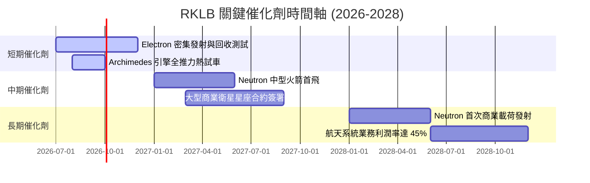

### 8.2 TAM 市場規模分析

```
╔══════════════════════════════════════════════════════════════════╗
║              RKLB 2030年可觸及市場規模 (TAM) 預測                ║
╠══════════════════════════════════════════════════════════════════╣
║                                                                  ║
║  1. 商業小衛星發射市場 (Electron)：                              ║
║     TAM: $10B  ｜  RKLB 預期份額: 40%  ｜  貢獻營收: $4.0B       ║
║                                                                  ║
║  2. 中型星座部署市場 (Neutron)：                                 ║
║     TAM: $35B  ｜  RKLB 預期份額: 15%  ｜  貢獻營收: $5.25B      ║
║                                                                  ║
║  3. 航天系統與衛星製造 (Space Systems)：                         ║
║     TAM: $120B ｜  RKLB 預期份額: 5%   ｜  貢獻營收: $6.0B       ║
║                                                                  ║
║  📊 總計 TAM: $165B ｜ 當前滲透率: <0.5% ｜ 成長空間極其廣闊    ║
╚══════════════════════════════════════════════════════════════════╝
```

### 8.3 成長驅動力結構圖

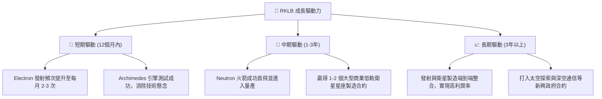

---

## 9. 風險矩陣

### 9.1 風險評分矩陣

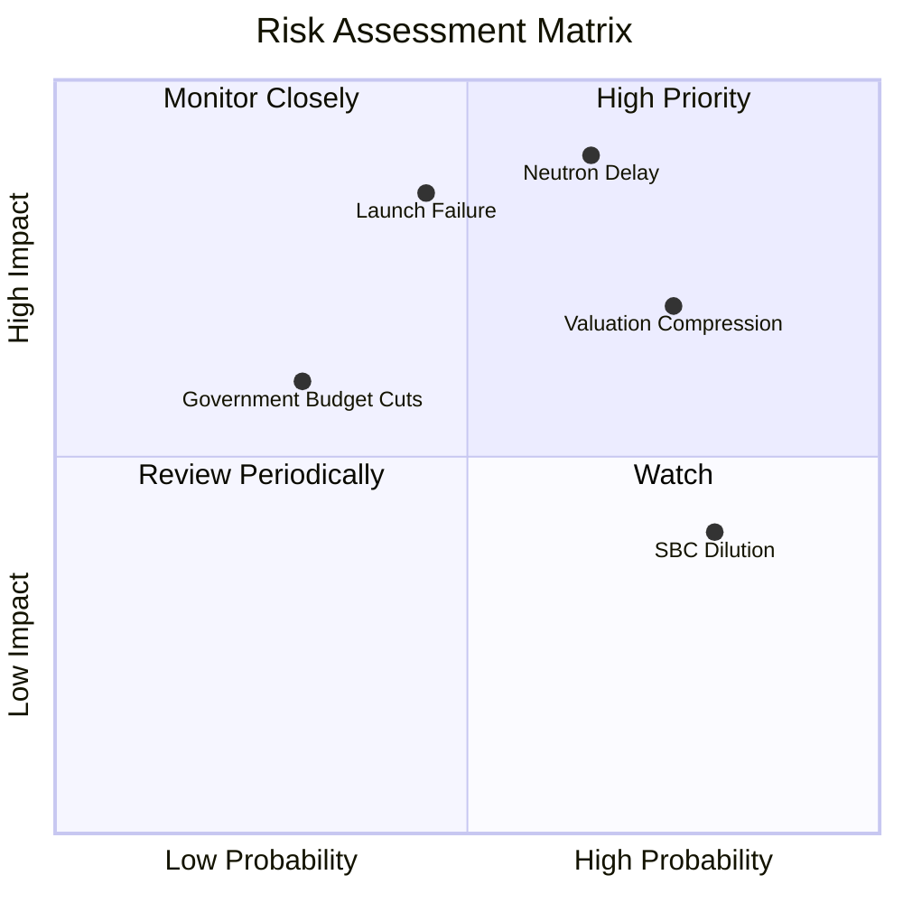

### 9.2 風險清單詳細分析

| # | 風險項目 | 發生機率 | 財務衝擊 | 風險評分 | 緩解措施 |
|---|---|---|---|---|---|
| 1 | 🔴 **Neutron 研發嚴重延遲** | 高 (65%) | 高 (-25% 估值) | 🔴 **8.5/10** | 增加研發人員，並利用現有的 Electron 製造經驗加速模具開發。 |
| 2 | 🔴 **發射失敗（Launch Failure）**| 中 (45%) | 高 (-15% 營收) | 🔴 **7.5/10** | 實施極其嚴格的品質控制，並為每次發射投保以降低財務損失。 |
| 3 | 🟡 **估值乘數回檔（Valuation Compression）**| 高 (75%) | 中 (-20% 股價) | 🟡 **7.0/10** | 通過提高航天系統業務的比重，以穩定的高毛利營收來支撐估值。 |
| 4 | 🟡 **股權稀釋（SBC）** | 極高 (80%)| 低 (-5% 每股價值)| 🟡 **6.0/10** | 管理層承諾在公司轉盈後，實施股份回購計劃以抵消稀釋。 |

---

## 10. 投資建議

### 10.1 最終綜合評級

```
╔══════════════════════════════════════════════════════════════╗
║                  RKLB 最終綜合評級儀表板                     ║
╠══════════════════════════════════════════════════════════════╣
║ 成長前景    9.0/10  ▓▓▓▓▓▓▓▓▓▓▓▓▓▓▓▓▓▓░░  ★★★★★           ║
║ 財務安全度  9.5/10  ▓▓▓▓▓▓▓▓▓▓▓▓▓▓▓▓▓▓▓░  ★★★★★           ║
║ 技術壁壘    8.5/10  ▓▓▓▓▓▓▓▓▓▓▓▓▓▓▓▓▓░░░  ★★★★☆           ║
║ 估值安全墊  4.5/10  ▓▓▓▓▓▓▓▓▓░░░░░░░░░░░  ★★☆☆☆           ║
╠══════════════════════════════════════════════════════════════╣
║ 綜合評級    7.9/10  ▓▓▓▓▓▓▓▓▓▓▓▓▓▓▓▓░░░░  🏆 🟢 買入 (Buy)  ║
╚══════════════════════════════════════════════════════════════╝
```

### 10.2 目標價與隱含報酬率

| 情境 | 出現機率 | 目標價 | 隱含報酬率 | 機率權重目標價 |
|---|---|---|---|---|
| 🔴 **悲觀情境** | 20% | $55.00 | -20.4% | $11.00 |
| 🟡 **基準情境** | **60%** | **$114.33** | **+65.4%** | **$68.60** |
| 🟢 **樂觀情境** | 20% | $150.00 | +117.0% | $30.00 |
| **加權綜合合理價值** | **100%** | **$109.60** | **+58.6%** | **CFA 推薦買入點** |

### 10.3 買入時機與觸發因素

```
╔══════════════════════════════════════════════════════════════════╗
║                  ✅ RKLB 買入觸發因素 Checklist                  ║
╠══════════════════════════════════════════════════════════════════╣
║                                                                  ║
║  立即買入觸發條件（多數符合）：                                  ║
║  ✅ Archimedes 引擎全推力熱試車成功                              ║
║  ✅ 季度營收年增率維持在 40% 以上                                ║
║  ✅ 股價回檔至 $60 以下（提供更好的安全邊際）                    ║
║                                                                  ║
║  加碼觸發條件（出現以下任一）：                                  ║
║  ☐ Neutron 火箭成功完成首次發射並回收                            ║
║  ☐ 贏得單筆金額超過 $500M 的國家安全發射（NSSL）合約              ║
║                                                                  ║
║  減碼/停損觸發條件（出現以下任一）：                             ║
║  ☐ Neutron 首飛失敗且調查顯示存在結構性設計缺陷                  ║
║  ☐ 航天系統（Space Systems）毛利率連續兩季跌破 30%               ║
║                                                                  ║
╚══════════════════════════════════════════════════════════════════╝
```

### 10.4 投資人適配度分析

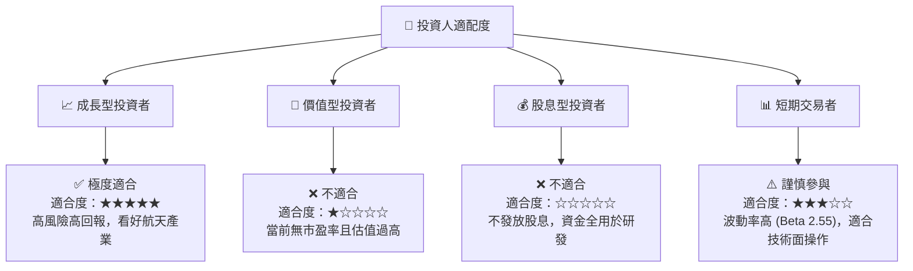

### 10.5 每季財報監控清單（Quarterly Watch List）

| 監控指標 | 基準值 (當前) | 加碼門檻 (Bull) | 減碼門檻 (Bear) | 戰略含意 |
|---|---|---|---|---|
| **航天系統營收佔比** | 65.0% | > 70.0% | < 50.0% | 評估高毛利業務的擴張速度 |
| **混合毛利率** | 36.6% | > 42.0% | < 30.0% | 判斷規模效應與定價權是否成立 |
| **研發費用 (R&D) 趨勢**| $80.51M (單季) | 逐步下降 (反映 Neutron 開發接近尾聲) | 異常飆升 > $120M | 監控研發預算控制能力 |
| **未實現營收 (Backlog)**| $1.0B+ | > $1.5B | < $800M | 衡量未來營收能見度 |

### 10.6 反面論證：什麼會證明論點錯誤（What Would Change My Mind）

本投資論點建立在「RKLB 能成功打破 SpaceX 壟斷，並將高毛利的航天系統業務規模化」的假設上。若發生以下情況，本投資論點將宣告失效，投資人應果斷退出：

```
╔══════════════════════════════════════════════════════════════════╗
║              ⚠️ 論點失效條件（Disconfirming Evidence）           ║
╠══════════════════════════════════════════════════════════════════╣
║  本投資論點在下列情況成立時應重新檢視或退出：                    ║
║  ☐ Neutron 火箭首飛時間延遲至 2028 年以後（喪失市場先發優勢）    ║
║  ☐ 航天系統（Space Systems）營收年增率連續兩季低於 20%            ║
║  ☐ 自由現金流（FCF）赤字擴大至單季 > $150M，導致淨現金儲備快速枯竭 ║
║  ☐ 股權稀釋速度加快，SBC 佔營收比重連續兩季超過 18%               ║
║  ☐ SpaceX 推出類似的輕中型廉價發射服務，直接摧毀 Neutron 的利潤空間║
╚══════════════════════════════════════════════════════════════════╝
```

---

> **免責聲明**：本報告由 CFA 資格分析師基於公開財務數據撰寫，僅供學術研究與投資參考，不構成任何買賣建議。投資商業航天板塊伴隨極高技術與市場風險，入市需謹慎。