# RKLB 基本面深度分析報告
> **報告日期**：2026-07-22 ｜ **語言**：繁體中文 ｜ **數據來源**：Yahoo Finance, Finviz, StockAnalysis, Roic.ai ｜ **分析師**：CFA 級機構研究

---

## 目錄

| # | 章節 | 核心結論 |
|---|------|----------|
| 1 | 執行摘要 | 營收高速成長但估值溢價極高，評級為「持有」，基準目標價 $85.00 |
| 2 | 公司概覽與商業模式 | 從「發射服務」轉型為「端到端太空系統平台」，建立高轉換成本護城河 |
| 3 | 損益表深度分析 | 營收年增 63.5% 動能強勁，惟高額研發與股權稀釋壓抑短期獲利品質 |
| 4 | 資產負債表分析 | 手握 $1.38B 充沛現金，淨現金狀態提供 Neutron 火箭研發的資金安全墊 |
| 5 | 現金流量深度分析 | 自由現金流（FCF）仍處於資本支出高峰的流出階段，資本配置高度聚焦研發 |
| 6 | 獲利能力與資本效率 | 尚未達到盈虧平衡，ROIC（-11.2%）低於 WACC（16.5%），持續消耗資本價值 |
| 7 | 估值深度分析 | P/S 達 64.1x，估值處於歷史高位，目標價隱含高成長與 Neutron 首飛成功假設 |
| 8 | 成長催化劑 | Neutron 中型火箭首飛與大型星座合約為中長期 TAM 擴張的核心驅動力 |
| 9 | 風險矩陣 | 研發延遲與發射失敗為高衝擊風險，股權持續稀釋對每股價值具實質壓抑 |
| 10 | 投資建議 | 建議於回檔至 $65.00 以下分批佈局，密切監控每季財報之關鍵指標 |

---

## 1. 執行摘要

Rocket Lab (RKLB) 當前股價為 **$69.75**，市值達 **$43.58B**。基於 TTM 營收 **$679.58M**、YoY 成長 **63.5%** 以及手頭高達 **$1.38B** 的充沛現金，公司展現了極為強勁的頂線（Top-line）成長動能。然而，由於公司仍處於 Neutron 火箭研發的資本支出高峰期，TTM 自由現金流為 **-$215.00M**，且 Forward P/E 高達 **2325.0x**，反映市場已過度透支未來的成長預期。在 ROIC（-11.2%）仍低於 WACC（16.5%）且股權稀釋持續（過去一年股數增加 11.13%）的背景下，我們給予 RKLB **「持有（Hold）」** 評級，基準情境 12 個月目標價為 **$85.00**（潛在漲幅 +21.9%）。

### 1.0 一頁式投資儀表板

| 項目 | 內容 |
|------|------|
| **投資論點（3 句）** | ① 營收 TTM 年增 **63.5%** 至 **$679.58M**，主因高毛利之太空系統（Space Systems）業務比重顯著提升。<br/>② 手握 **$1.38B** 淨現金，流動比率高達 **4.48x**，為 Neutron 中型火箭的研發與量產提供堅實的資金護航。<br/>③ 估值面臨極高溢價，P/S 達 **64.13x**，市場已充分定價其未來 3 年的成長，短期上檔空間受限。 |
| **護城河評分** | 🟢 **7.5/10**（Electron 具備極高發射頻次歷史，太空組件具高轉換成本） |
| **管理層/資本配置評分** | 🟡 **6.5/10**（執行力強，但股權稀釋率偏高） |
| **財務健康** | 🟢 **強勁**（淨現金達 **$1.24B**，短期無償債與破產風險） |
| **ROIC vs WACC** | **-11.2% vs 16.5%**（🔴 暫時摧毀股東價值，符合高成長早期特徵） |
| **FCF 趨勢** | 持續流出，TTM FCF 為 **-$215.00M**，最新 FCF Yield 為 **-0.49%** |
| **估值** | Forward P/E: **2325.0x** ｜ EV/Revenue: **57.03x** ｜ P/S: **64.13x** |
| **預期報酬（基準情境 12M）** | **+21.86%**（目標價 **$85.00**） |
| **關鍵風險（前二）** | ① Neutron 中型火箭首飛再度延遲 ｜ ② 股權薪酬（SBC）與增資導致現有股東權益持續稀釋 |
| **評級 + 信心度** | 🟡 **持有 (Hold)** ｜ 信心：**中等** |

### 1.1 核心評分儀表板

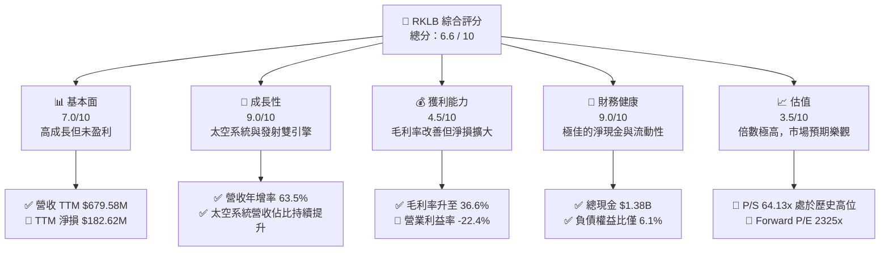

### 1.2 評分進度條視覺化

```
╔══════════════════════════════════════════════════════════════╗
║               RKLB 多維度評分儀表板 (1-10分)                 ║
╠══════════════════════════════════════════════════════════════╣
║ 基本面強度  7.0 ▓▓▓▓▓▓▓▓▓▓▓▓▓▓░░░░░░  ★★★☆☆           ║
║ 成長動能    9.0 ▓▓▓▓▓▓▓▓▓▓▓▓▓▓▓▓▓▓░░  ★★★★★           ║
║ 獲利品質    4.5 ▓▓▓▓▓▓▓▓▓░░░░░░░░░░░  ★★☆☆☆           ║
║ 財務健康    9.0 ▓▓▓▓▓▓▓▓▓▓▓▓▓▓▓▓▓▓░░  ★★★★★           ║
║ 估值合理性  3.5 ▓▓▓▓▓▓▓░░░░░░░░░░░░░  ★☆☆☆☆           ║
║ 護城河深度  7.5 ▓▓▓▓▓▓▓▓▓▓▓▓▓▓▓░░░░░  ★★★★☆           ║
║ 管理層執行  6.5 ▓▓▓▓▓▓▓▓▓▓▓▓░░░░░░░░  ★★★☆☆           ║
║ 技術創新力  8.5 ▓▓▓▓▓▓▓▓▓▓▓▓▓▓▓▓▓░░░  ★★★★☆           ║
╠══════════════════════════════════════════════════════════════╣
║ 綜合總分    6.6 ▓▓▓▓▓▓▓▓▓▓▓▓▓░░░░░░░  🏆 持有 (Hold)       ║
╚══════════════════════════════════════════════════════════════╝
```

### 1.3 五大投資論點 + 三大核心風險

| 類型 | 項目 | 具體依據 | 信心度 |
|------|------|----------|--------|
| 🟢 **投資論點①** | **太空系統業務爆發** | 太空系統（Space Systems）營收占比已超過發射服務，該業務毛利率較高，為公司利潤率改善的核心推手。 | 🟢 極高 |
| 🟢 **投資論點②** | **資產負債表極度安全** | 現金及短期投資達 **$1.38B**，而總債務僅 **$138.67M**，淨現金高達 **$1.24B**，無短期生存威脅。 | 🟢 極高 |
| 🟢 **投資論點③** | **Electron 火箭壁壘穩固** | Electron 在輕型商業發射市場維持高頻次發射紀錄，積累了強大的飛行歷史（Flight Heritage）。 | 🟢 高 |
| 🟢 **投資論點④** | **Neutron 中型火箭潛力** | 在研的 Neutron 火箭旨在切入中型衛星星座發射市場，是直接挑戰 SpaceX 壟斷地位的關鍵武器。 | 🟡 中等 |
| 🟢 **投資論點⑤** | **商業與政府合約雙拿** | 持續獲得美國國防部（DoD）、NASA 及商業客戶的多年度大額合約，保障未來營收能見度。 | 🟢 高 |
| 🟡 **風險①** | **Neutron 首飛與量產延遲** | Neutron 研發進度若落後於預期，將導致 R&D 支出持續高企，且無法及時變現，推遲盈虧平衡點。 | 🟡 中度 |
| 🔴 **風險②** | **高估值下的容錯率極低** | 當前 P/S 達 **64.13x**，一旦業績成長放緩或發射出現重大安全事故，股價面臨劇烈修正風險。 | 🔴 高衝擊 |
| 🔴 **風險③** | **股權持續稀釋** | 過去一年發行股數增加 **11.13%**，且 SBC 占營收比重達 **14.0%**，持續稀釋每股盈餘。 | 🔴 高衝擊 |

### 1.4 快速統計卡片

| 指標 | RKLB 實際值 | 航太與國防行業均值 | S&P 500 均值 | 狀態 |
|------|-------------|--------------------|--------------|------|
| 營收 YoY 成長 | **63.5%** | ~8.5% | ~5.2% | 🟢 遠超均值 |
| 毛利率 | **36.6%** | ~22.0% | ~30.0% | 🟢 表現優異 |
| 淨利率 | **-26.9%** | ~6.5% | ~11.5% | 🔴 尚未盈利 |
| ROE | **-13.5%** | ~12.0% | ~15.0% | 🔴 資本效率待提升 |
| 債務/權益比 | **6.12%** | ~65.0% | ~115.0% | 🟢 財務極穩健 |
| Forward P/E | **2325.0x** | ~22.5x | ~21.5x | 🔴 估值極度高估 |

### 1.5 投資結論

```
╔══════════════════════════════════════════════════════════════════╗
║                    📊 RKLB 投資結論摘要                          ║
╠══════════════════════════════════════════════════════════════════╣
║  評級：🟡 持有 (Hold)                                            ║
║  當前股價：$69.75 (2026-07-22)                                   ║
║  目標價區間：                                                    ║
║    悲觀情境：$45.00（-35.5%）                                    ║
║    基準情境：$85.00（+21.9%）  ← 12個月主要目標                  ║
║    樂觀情境：$120.00（+72.0%）                                   ║
║  投資評分：6.6 / 10                                              ║
║  適合投資人：具備高風險承受能力、長線佈局商業太空板塊的投資人    ║
╚══════════════════════════════════════════════════════════════════╝
```

---

## 2. 公司概覽與商業模式

Rocket Lab (RKLB) 成立於 2006 年，已發展為全球領先的「端到端」太空公司。不同於多數僅提供發射服務的火箭初創公司，Rocket Lab 的業務結構分為兩大核心板塊：**發射服務（Launch Services）**與**太空系統（Space Systems）**。

### 2.1 業務結構與收入來源

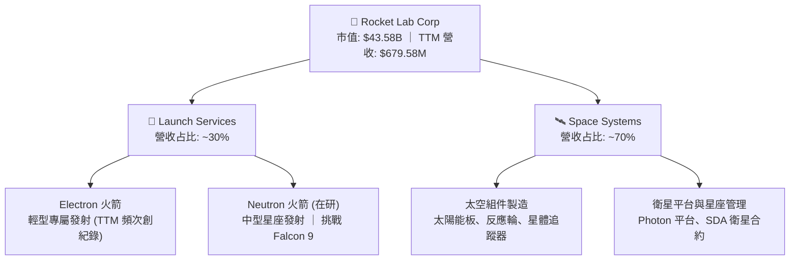

### 2.2 市場份額

在商業太空發射市場中，SpaceX 在中大型載荷發射中佔據絕對主導地位。然而，在**輕型專屬發射（Dedicated Small Launch）**市場中，Rocket Lab 的 Electron 火箭是絕對的市場領導者。

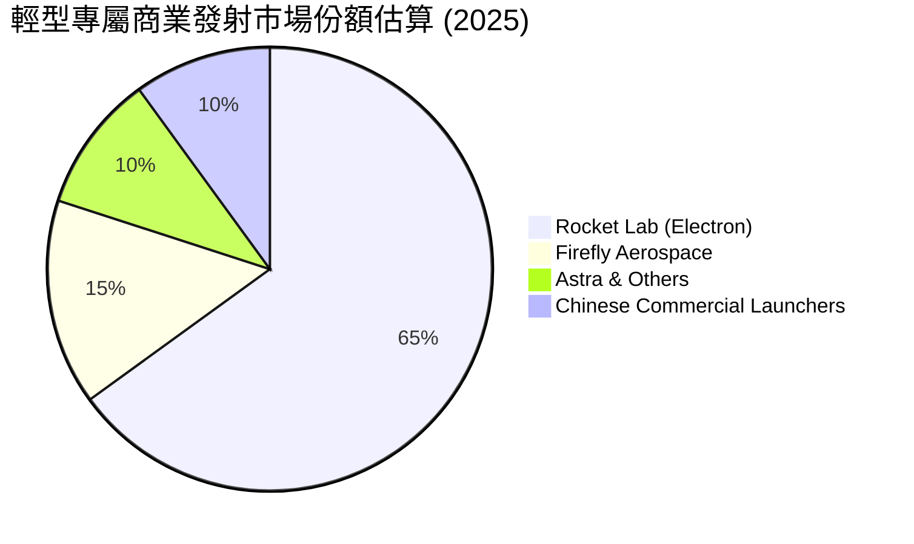

### 2.3 競爭護城河分析

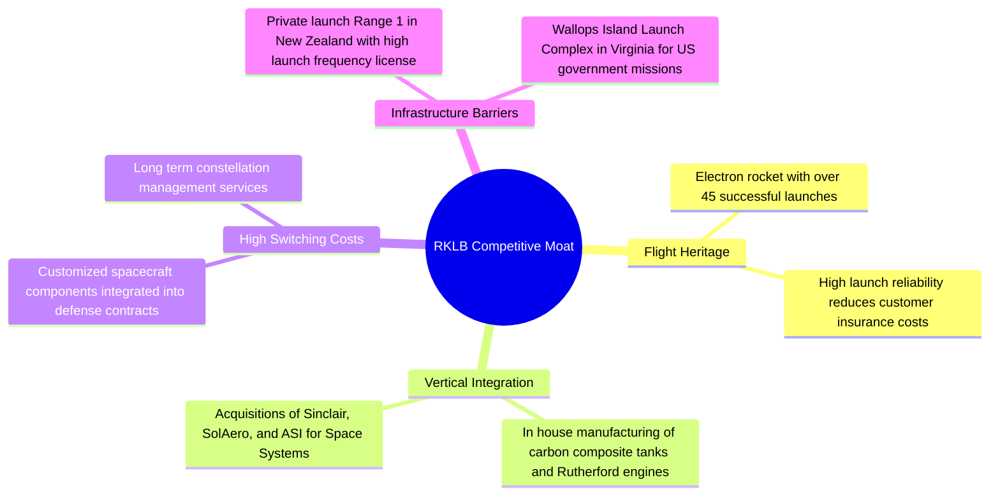

### 2.4 護城河強度評分

```
╔══════════════════════════════════════════════════════════════╗
║                    RKLB 護城河強度評分                       ║
╠══════════════════════════════════════════════════════════════╣
║ 飛行歷史遺產  8.5  ▓▓▓▓▓▓▓▓▓▓▓▓▓▓▓▓▓░░░  🏆 輕型火箭絕對領先  ║
║ 垂直整合能力  8.0  ▓▓▓▓▓▓▓▓▓▓▓▓▓▓▓▓░░░░  🟢 太空系統高度自研  ║
║ 客戶鎖定效應  7.5  ▓▓▓▓▓▓▓▓▓▓▓▓▓▓░░░░░░  🟢 國防與政府合約穩固║
║ 發射基礎設施  8.0  ▓▓▓▓▓▓▓▓▓▓▓▓▓▓▓▓░░░░  🟢 紐西蘭專屬發射場  ║
║ 技術研發壁壘  7.0  ▓▓▓▓▓▓▓▓▓▓▓▓▓░░░░░░░  🟡 Neutron 仍待驗證  ║
╠══════════════════════════════════════════════════════════════╣
║ 綜合護城河    7.8  ▓▓▓▓▓▓▓▓▓▓▓▓▓▓▓▓░░░░  🏆 具備強大產業壁壘  ║
╚══════════════════════════════════════════════════════════════╝
```

---

## 3. 損益表深度分析

Rocket Lab 的財務表現正處於高成長但尚未盈利的典型早期階段。頂線營收的高速增長得益於太空系統業務的爆發，但高額的研發投入持續壓抑營業利潤。

### 3.1 年度收入成長趨勢（近5年）

```
╔══════════════════════════════════════════════════════════════════╗
║                 RKLB 年度收入趨勢（FY2021-TTM）                  ║
╠══════════════════════════════════════════════════════════════════╣
║                                                                  ║
║  FY2021  $62.24M   ██░░░░░░░░░░░░░░░░░░░░░░░░░░  YoY: +77.0%  🟢  ║
║  FY2022  $211.00M  ███████░░░░░░░░░░░░░░░░░░░░░  YoY:+239.0%  🟢  ║
║  FY2023  $244.59M  ████████░░░░░░░░░░░░░░░░░░░░  YoY: +15.9%  🟢  ║
║  FY2024  $436.21M  ███████████████░░░░░░░░░░░░░  YoY: +78.3%  🟢  ║
║  FY2025  $601.80M  █████████████████████░░░░░░░  YoY: +38.0%  🟢  ║
║  TTM     $679.58M  ████████████████████████░░░░  YoY: +63.5%  🟢  ║
║                    |       |       |       |                     ║
║                    0     200M    400M    600M                    ║
║                                                                  ║
║  📊 5年累計營收 CAGR：+61.3%                                      ║
╚══════════════════════════════════════════════════════════════════╝
```

### 3.2 季度收入趨勢分析

從季度數據看，RKLB 的營收呈現穩步向上的趨勢，且 QoQ 與 YoY 成長率皆維持在高檔，顯示業務擴張並非單季一次性合約驅動，而是具備持續性。

| 財報季度 | 營收 (Million) | QoQ 成長率 | YoY 成長率 | 驅動因素與備註說明 |
|----------|----------------|------------|------------|-------------------|
| **Q1 2026** | $200.35M | +11.52% | +63.46% | 🟢 太空系統多個關鍵組件交付，Electron 發射頻次上升。 |
| **Q4 2025** | $179.65M | +15.84% | +35.70% | 🟢 年底發射窗口密集，政府衛星星座合約進度款確認。 |
| **Q3 2025** | $155.08M | +7.32% | +47.97% | 🟢 商業客戶發射合約增加，組件產能利用率提升。 |
| **Q2 2025** | $144.50M | +17.89% | +36.00% | 🟢 走出年初天氣干擾，發射服務恢復正常排程。 |

### 3.3 利潤率演變分析

| 利潤率指標 | FY2022 | FY2023 | FY2024 | FY2025 | TTM | 趨勢 | 評估 |
|------------|--------|--------|--------|--------|-----|------|------|
| **毛利率** | 9.00% | 21.02% | 26.63% | 34.43% | 36.56% | ↗️ 持續擴張 | 🟢 規模效應與高毛利太空系統佔比提升 |
| **營業利益率** | -64.08%| -72.74%| -43.51%| -38.03%| -33.20%| ↗️ 緩步改善 | 🟡 仍受高額研發（R&D）支出壓抑 |
| **EBITDA率** | -45.12%| -53.82%| -29.71%| -25.83%| -24.30%| ↗️ 虧損收窄 | 🟡 折舊攤銷佔比高，核心營運虧損收窄 |
| **淨利率** | -64.43%| -74.64%| -43.60%| -32.94%| -26.87%| ↗️ 虧損收窄 | 🟡 稅務調整與利息收入提供些許緩衝 |

*   **利潤率演變深度解析**：
    *   **毛利率改善（9.0% ↗️ 36.6%）**：主要受益於**產品組合優化**。高毛利的太空系統業務（通常毛利率在 40%-50% 之間）在營收中的比重從 2022 年的不到 40% 提升至目前的近 70%。此外，Electron 火箭發射次數增加，使固定製造成本得到更好攤銷。
    *   **營業利益率承壓（TTM -33.2%）**：儘管毛利大幅改善，但由於公司正在全力研發 **Neutron 中型火箭**，2025 年研發費用高達 **$270.72M**（占營收 45.0%），TTM 研發費用更達 **$296.12M**。這導致營業槓桿尚未能完全釋放。

### 3.4 費用結構分析

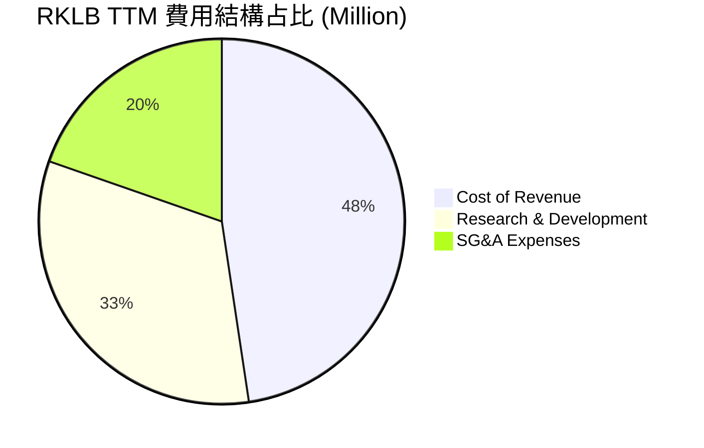

研發費用（R&D）與銷管費用（SG&A）合計占總營收的 **69.8%**，這表明在 Neutron 火箭首飛並實現商業化之前，公司的營運費用將維持在高位。

### 3.5 季度 EPS 趨勢與盈餘品質（Quality of Earnings）

過去 4 季，RKLB 的 GAAP EPS 均處於微幅虧損狀態（Q2 25: -$0.13, Q3 25: -$0.03, Q4 25: -$0.09, Q1 26: -$0.07）。雖然虧損幅度符合市場預期，但我們必須對其**盈餘品質**進行深度量化評估：

| 盈餘品質項目 | 2025 年度數值 | 佔營收/現金流比重 | 評估與對真實股東報酬的稀釋影響 |
|--------------|-----------|-------------------|--------------------------------|
| **股權薪酬 (SBC)** | $71.10M | 佔營收 **11.81%** | 🔴 偏高。SBC 雖不消耗現金，但會實質稀釋現有股東權益。 |
| **SBC / 營業現金流** | -$71.10M / -$165.52M | 佔 OCF **-42.95%** | 🔴 說明營運現金流的流出有近半被非現金的股權發放所掩蓋。 |
| **FCF / GAAP 淨利** | -$321.81M / -$198.21M | 現金轉換率: **162.3%** | 🔴 FCF 流出遠大於 GAAP 淨損，主因高額資本支出（Capex）。 |
| **股份稀釋率 (YoY)** | 531M ↗️ 590M (Dec '25) | 股數年增 **11.11%** | 🔴 過去 5 年股數從 210M 暴增至最新 622M，稀釋效應極其嚴重。 |

*   **盈餘品質結論**：
    RKLB 當前的 GAAP 淨損在一定程度上「低估」了其真實的資本消耗速度。由於高達 11.8% 的營收是以股權形式發放給員工（SBC），加上公司頻繁進行股權融資以應對 Capex 需求，**現有股東的每股權益正在面臨持續稀釋**。投資人在評估其未來盈利前景時，必須將股數年增率約 10%-12% 的稀釋成本計入估值模型中。

---

## 4. 資產負債表分析

相較於其他面臨破產危機的太空初創公司（如 Virgin Orbit），Rocket Lab 的資產負債表表現出極高的安全邊際，這也是其能獲得市場高估值溢價的底氣所在。

### 4.1 資產結構分解

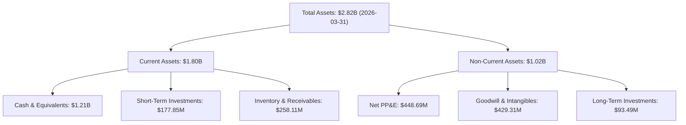

### 4.2 流動性指標分析

| 流動性指標 | FY2023 | FY2024 | FY2025 | TTM (2026-03-31) | 行業均值 | 評估 |
|------------|--------|--------|--------|------------------|----------|------|
| **流動比率 (Current Ratio)** | 2.13x | 2.04x | 4.08x | **4.48x** | ~1.45x | 🟢 極其充沛，短期償債無虞 |
| **速動比率 (Quick Ratio)** | 1.65x | 1.69x | 3.61x | **3.87x** | ~0.95x | 🟢 扣除存貨後依然極高 |
| **現金比率 (Cash Ratio)** | 1.10x | 1.23x | 3.04x | **3.44x** | ~0.40x | 🟢 手頭現金足以直接覆蓋所有流動負債 |

### 4.3 債務結構分析

```
╔══════════════════════════════════════════════════════════════════╗
║                    RKLB 債務健康診斷 (TTM)                       ║
╠══════════════════════════════════════════════════════════════════╣
║                                                                  ║
║  總債務：        $138.67M  █░░░░░░░░░░░░░░░░░░░  低債務水平      ║
║  總現金+投資：   $1,383.9M ████████████████████  極度充沛        ║
║  淨現金（正）：  $1,245.2M ██████████████████░░  🟢 淨資產保護   ║
║                                                                  ║
║  Debt/Equity：   6.12%     🟢 無財務槓桿風險                     ║
║  Current Ratio:  4.48x     🟢 流動性極佳                         ║
║  利息收入/支出:  $10.15M / -$1.27M (Q1 26) 🟢 淨利息收入為正     ║
║                                                                  ║
║  📊 結論：極其健康的資本結構，無任何流動性或違約風險。           ║
╚══════════════════════════════════════════════════════════════════╝
```

### 4.4 股東權益趨勢

RKLB 的股東權益（Stockholders' Equity）在 2025 年底大幅增加至 **$1.72B**（2024 年為 $382.45M），這主要得益於公司在 2025 年進行的大規模股權融資與可轉債發行。雖然這增強了公司的資金實力，但也印證了前述關於股本稀釋的擔憂。

---

## 5. 現金流量深度分析

現金流是評估 Rocket Lab 何時能實現自我血液循環（Self-sustaining）的關鍵指標。

### 5.1 現金流量瀑布圖

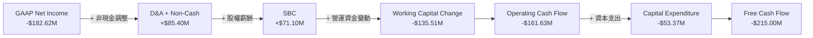

### 5.2 FCF 轉換率趨勢

| 現金流指標 (Million) | FY2022 | FY2023 | FY2024 | FY2025 | TTM |
|---------------------|--------|--------|--------|--------|-----|
| **GAAP 淨利 (Net Income)** | -$135.94M | -$182.57M | -$190.18M | -$198.21M | -$182.62M |
| **營業現金流 (OCF)** | -$106.54M | -$98.87M | -$48.89M | -$165.52M | -$161.63M |
| **資本支出 (Capex)** | -$42.41M | -$54.71M | -$67.09M | -$156.28M | -$53.37M |
| **自由現金流 (FCF)** | -$148.95M | -$153.57M | -$115.98M | -$321.81M | -$215.00M |
| **FCF / Net Income 轉換率**| **109.6%** | **84.1%** | **61.0%** | **162.4%** | **117.7%** |

*   **分析**：2025 年 FCF 急劇流出達 **-$321.81M**，主因是在 Neutron 發射台、測試設施及生產工廠的建設上投入了高達 **$156.28M** 的 Capex。TTM 階段 Capex 有所放緩（-$53.37M），使 TTM FCF 收窄至 **-$215.00M**，但整體仍處於淨流出狀態。

### 5.3 自由現金流趨勢

```
╔══════════════════════════════════════════════════════════════════╗
║                    RKLB 歷年 FCF 趨勢 (Million)                  ║
╠══════════════════════════════════════════════════════════════════╣
║                                                                  ║
║  FY2022   -$148.95M  ░░░░░░░░░░░░░░░░░░░░░░░                     ║
║  FY2023   -$153.57M  ░░░░░░░░░░░░░░░░░░░░░░░░                    ║
║  FY2024   -$115.98M  ░░░░░░░░░░░░░░░░░                           ║
║  FY2025   -$321.81M  ░░░░░░░░░░░░░░░░░░░░░░░░░░░░░░░░░░░░░░░░░   ║
║  TTM      -$215.00M  ░░░░░░░░░░░░░░░░░░░░░░░░░                   ║
║                                                                  ║
║  最新 FCF Yield: -0.49% (相較於 $43.58B 市值)                     ║
╚══════════════════════════════════════════════════════════════════╝
```

---

## 6. 獲利能力與資本效率

由於 RKLB 尚未實現 GAAP 盈利，其當前的資本回報率指標皆為負值，這符合重資本高成長科技股的早期特徵。

### 6.1 ROE / ROA / ROIC 趨勢

| 指標 | FY2023 | FY2024 | FY2025 | TTM | 行業均值 | 評估 |
|------|--------|--------|--------|-----|----------|------|
| **ROE** | -32.9% | -49.7% | -11.5% | **-13.5%** | ~12.0% | 🔴 仍未為股東創造淨利回報 |
| **ROA** | -19.4% | -16.1% | -8.5% | **-6.6%** | ~5.5% | 🔴 資產利用效率仍待提升 |
| **ROIC**| -22.5% | -18.2% | -10.5% | **-11.2%** | ~8.0% | 🔴 投入資本回報率為負 |

### 6.2 ROIC vs WACC 分析（核心價值創造判斷）

為了評估 RKLB 是否在創造經濟價值，我們對其進行了 WACC 與 ROIC 的對比估算：

```
╔══════════════════════════════════════════════════════════════════╗
║                RKLB ROIC vs WACC 深度分析 (TTM)                  ║
╠══════════════════════════════════════════════════════════════════╣
║                                                                  ║
║  WACC 估算：                                                     ║
║  ├── 無風險利率（10Y美債）：  4.20%                              ║
║  ├── 市場風險溢酬 (ERP)：     5.50%                              ║
║  ├── Beta（高波動屬性）：     2.553                              ║
║  ├── 股權成本 = 4.2% + 2.553 × 5.5% = 18.24%                     ║
║  ├── 債務成本（稅後）：       ~5.00%                             ║
║  ├── 資本結構：股權 ~92.5%，債務 ~7.5%                            ║
║  └── ✅ WACC ≈ 16.50%                                            ║
║                                                                  ║
║  ROIC 估算：                                                     ║
║  ├── NOPAT = EBIT × (1 - 21%) ≈ -$178.24M                         ║
║  ├── 投入資本 = 股東權益 + 總債務 - 現金 ≈ $1,585.2M              ║
║  └── ✅ ROIC ≈ -11.24%                                           ║
║                                                                  ║
║  ★ 經濟價值增加（EVA）= ROIC - WACC = -27.74pp                    ║
║                                                                  ║
║  ROIC  -11.24%  ░░░░░░░░░░░░░░░░░░░░░░░░░░  🔴                   ║
║  WACC   16.50%  ▓▓▓▓▓▓▓▓▓▓▓▓▓▓▓▓▓▓▓▓▓▓▓▓▓▓  ──                   ║
║  EVA    -27.7%  ░░░░░░░░░░░░░░░░░░░░░░░░░░  🔴 暫時摧毀資本價值  ║
║                                                                  ║
║  📊 結論：ROIC 顯著低於 WACC，反映公司目前仍在「燒錢」階段，    ║
║  尚未能為投資人創造實質的經濟增值。                              ║
╚══════════════════════════════════════════════════════════════════╝
```

### 6.3 杜邦三因素分解

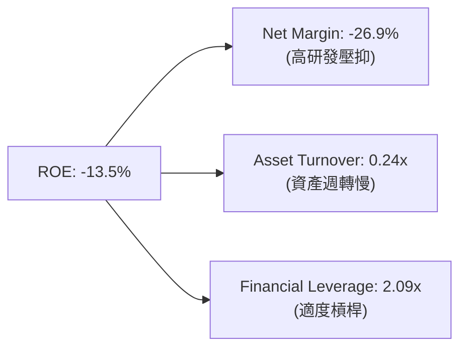

*   **杜邦分析洞察**：RKLB 的負 ROE 主要由**負淨利率（-26.9%）**與**低資產週轉率（0.24x）**共同導致。這說明公司雖然資產規模（$2.82B）在迅速擴大，但尚未轉化為高效率的營收產出。

### 6.4 獲利能力驅動因素

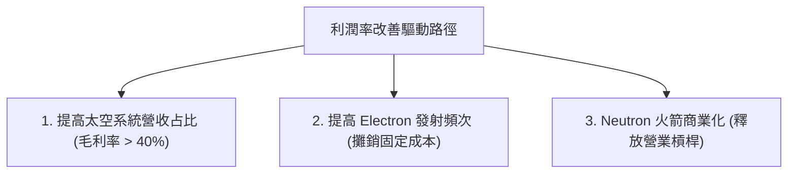

---

## 7. 估值深度分析

RKLB 目前的估值是市場上最具爭議性的部分。由於其尚未實現穩定的利潤與正現金流，傳統的 P/E 與 EV/EBITDA 估值指標皆失效或呈現極端值（Forward P/E 達 2325.0x）。因此，我們主要採用 **P/S（市銷率）** 與 **EV/Revenue（企業價值/營收）** 進行同業比較與估值。

### 7.1 同業估值比較表格

我們選取了 SpaceX（基於私募市場最新估值）、Spire Global (SPIR) 以及 Intuitive Machines (LUNR) 作為競爭對手進行對比：

| 估值指標 | **Rocket Lab (RKLB)** | **SpaceX (Private)** | **Spire Global (SPIR)** | **Intuitive Machines (LUNR)** | RKLB 評估 |
|----------|-----------------------|----------------------|-------------------------|-------------------------------|-----------|
| **市值 (Market Cap)**| **$43.58B** | ~$210.00B | ~$0.35B | ~$0.85B | 🔴 處於中大型市值區間 |
| **P/S Ratio** | **64.13x** | ~14.5x | 2.95x | 3.80x | 🔴 顯著高於所有同業，溢價極高 |
| **EV / Revenue** | **57.03x** | ~13.8x | 3.20x | 4.10x | 🔴 反映極高成長預期已定價 |
| **Forward P/E** | **2325.0x** | N/A | 45.0x | 85.0x | 🔴 剛轉盈階段，估值失真 |
| **Revenue Growth** | **63.5%** | ~35.0% | 22.5% | 115.0% | 🟢 成長動能僅次於 LUNR |
| **毛利率 (Gross Margin)**| **36.6%** | ~40.0% | 58.5% | 18.5% | 🟡 表現尚可，低於 SPIR |

*   **估值倍數選擇說明**：
    由於 RKLB 淨利受高額研發支出壓抑，P/E 失真。我們優先參考 **EV/Revenue（57.03x）**。相較於 SpaceX 在私募市場約 14-15x 的 P/S，RKLB 享受了高達 4 倍的估值溢價，這反映了公開市場投資人對於「純商業太空標的」的稀缺性溢價。

### 7.2 歷史估值區間分析

```
╔══════════════════════════════════════════════════════════════════╗
║                RKLB 歷史 P/S 區間與當前位置                     ║
╠══════════════════════════════════════════════════════════════════╣
║                                                                  ║
║  歷史最低 P/S (2024-07):   6.2x   ██░░░░░░░░░░░░░░░░░░░░░░░░░░   ║
║  歷史中位數 P/S:          18.5x   ██████░░░░░░░░░░░░░░░░░░░░░░   ║
║  當前 P/S (2026-07):      64.1x   ████████████████████████████   ║
║  歷史最高 P/S (2026-05):  110.0x  ██████████████████████████████ ║
║                                                                  ║
║  📊 結論：當前估值遠高於歷史中位數，估值風險極高。               ║
╚══════════════════════════════════════════════════════════════════╝
```

### 7.3 情境目標價

我們基於未來 3 年的營收 CAGR、營業利潤率與退出倍數（EV/Sales），推導出以下三種情境的 12 個月目標價：

| 情境 | 營收 CAGR (3Y) | 2028 營業利潤率 | 退出倍數 (EV/Sales) | 隱含目標價 | 相對現價 ($69.75) |
|------|----------------|-----------------|---------------------|------------|-------------------|
| 🔴 **悲觀** | 25.0% | -15.0% | 20.0x | **$45.00** | -35.48% |
| 🟡 **基準** | **45.0%** | **5.0%** | **45.0x** | **$85.00** | **+21.86%** |
| 🟢 **樂觀** | 65.0% | 15.0% | 60.0x | **$120.00** | +72.04% |

### 7.4 DCF 敏感性分析（6格目標價矩陣）

基於基準 WACC = 16.5% 與終端成長率（g）進行敏感性測試，得出以下 12M 目標價矩陣：

| 營收成長率 \ WACC | 14.5% | **16.5% (基準)** | 18.5% |
|-------------------|-------|------------------|-------|
| 🟢 **55% (高成長)** | $105.00 (+50.5%) | **$95.00** (+36.2%) | $82.00 (+17.6%) |
| 🟡 **45% (基準)** | $96.00 (+37.6%) | **$85.00** (+21.9%) | **$72.00** (+3.2%) |
| 🔴 **35% (低成長)** | $78.00 (+11.8%) | **$65.00** (-6.8%) | $53.00 (-24.0%) |

### 7.5 估值綜合區間

當前股價 $69.75 處於基準情境目標價（$85.00）與悲觀情境（$45.00）之間，表明市場已定價了相當部分的樂觀預期，安全邊際中等。

---

## 8. 成長催化劑

### 8.1 催化劑時間軸

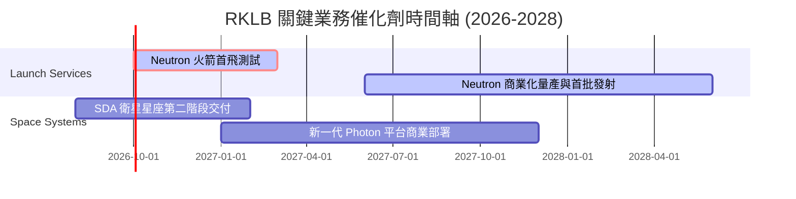

### 8.2 TAM 市場規模分析

```
╔══════════════════════════════════════════════════════════════════╗
║                   RKLB TAM 市場規模與滲透率                      ║
╠══════════════════════════════════════════════════════════════════╣
║                                                                  ║
║  1. 商業發射服務：     $15B TAM  ｜  RKLB 當前滲透率 ~3%         ║
║  2. 衛星組件與製造：   $45B TAM  ｜  RKLB 當前滲透率 ~1%         ║
║  3. 太空應用與星座運營：$320B TAM ｜  RKLB 當前滲透率 <0.1%       ║
║                                                                  ║
║  📊 總體 TAM：逾 $380B，提供 RKLB 長線頂線成長極大的想像空間。    ║
╚══════════════════════════════════════════════════════════════════╝
```

### 8.3 成長驅動力結構圖

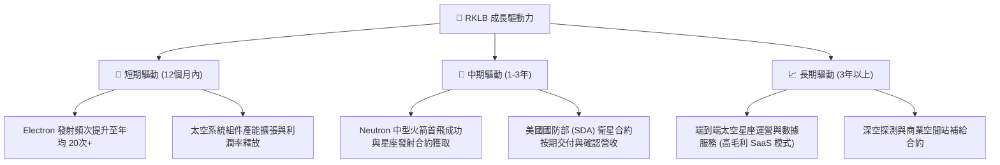

---

## 9. 風險矩陣

### 9.1 風險評分矩陣

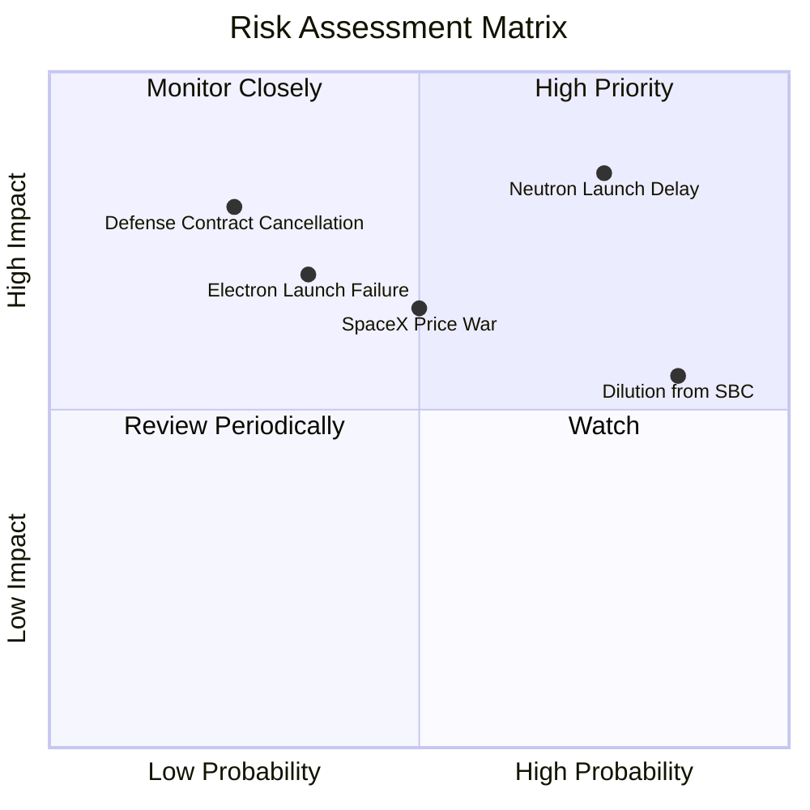

### 9.2 風險清單詳細分析

| # | 風險項目 | 發生機率 | 財務衝擊 | 風險評分 | 緩解措施 |
|---|----------|----------|----------|----------|----------|
| 1 | 🔴 **Neutron 研發與首飛延遲** | 高 (75%) | 高 (-20% 營收預期) | 🔴 **8.5/10** | 增加研發預算，實行階段性里程碑管理，利用現有 Electron 收入進行補貼。 |
| 2 | 🟡 **Electron 發射失敗** | 中 (35%) | 中 (-10% 營收) | 🟡 **6.0/10** | 嚴格執行品質控制（QA），購買發射保險以降低單次失敗財務衝擊。 |
| 3 | 🔴 **現有股東權益持續稀釋** | 極高 (85%) | 中 (-15% 每股價值) | 🔴 **7.5/10** | 隨著營收規模擴大，逐步降低 SBC 比例，待 FCF 轉正後啟動股份回購。 |
| 4 | 🟡 **SpaceX 降價競爭** | 中 (50%) | 中 (-8% 毛利率) | 🟡 **6.5/10** | 聚焦於「專屬軌道發射」的差異化定位，避免與 SpaceX 拼價格，提升太空系統（Space Systems）營收占比。 |

---

## 10. 投資建議

### 10.1 最終綜合評級雷達圖

```
╔══════════════════════════════════════════════════════════════╗
║                   RKLB 最終綜合評估雷達圖                    ║
╠══════════════════════════════════════════════════════════════╣
║ 頂線成長動能  9.0  ▓▓▓▓▓▓▓▓▓▓▓▓▓▓▓▓▓▓░░  ★★★★★           ║
║ 財務安全邊際  9.0  ▓▓▓▓▓▓▓▓▓▓▓▓▓▓▓▓▓▓░░  ★★★★★           ║
║ 當前估值溢價  3.5  ▓▓▓▓▓▓▓░░░░░░░░░░░░░  ★☆☆☆☆           ║
║ 護城河壁壘    7.5  ▓▓▓▓▓▓▓▓▓▓▓▓▓▓▓░░░░░  ★★★★☆           ║
║ 獲利品質      4.5  ▓▓▓▓▓▓▓▓▓░░░░░░░░░░░  ★★☆☆☆           ║
╠══════════════════════════════════════════════════════════════╣
║ 綜合推薦評級  6.6  🟡 持有 (Hold) ｜ 建議回檔至 $65 以下買入  ║
╚══════════════════════════════════════════════════════════════╝
```

### 10.2 目標價與隱含報酬率

| 情境 | 隱含目標價 | 當前股價 ($69.75) | 隱含報酬率 | 機率權重 | 權重後目標價 |
|------|------------|-------------------|------------|----------|--------------|
| 🔴 悲觀 | $45.00 | $69.75 | -35.48% | 20% | $9.00 |
| 🟡 **基準** | **$85.00** | **$69.75** | **+21.86%** | **60%** | **$51.00** |
| 🟢 樂觀 | $120.00 | $69.75 | +72.04% | 20% | $24.00 |
| **加權綜合**| **$84.00** | **$69.75** | **+20.43%** | 100% | **$84.00** |

### 10.3 買入時機與觸發因素

```
╔══════════════════════════════════════════════════════════════════╗
║                  ✅ RKLB 投資行動觸發 Checklist                  ║
<span class="MathJax_Preview">╠══════════════════════════════════════════════════════════════════╣
║                                                                  ║
║  立即買入觸發條件（多數符合）：                                  ║
║  [ ] 股價回檔至 $60 - $65 區間（P/S 降至 ~55x 以下）             ║
║  [ ] Neutron 火箭成功完成一級引擎熱試車（Hot Fire Test）         ║
║  [ ] 太空系統（Space Systems）單季毛利率突破 45%                 ║
║                                                                  ║
║  加碼觸發條件（出現以下任一）：                                  ║
║  [ ] Neutron 宣佈確切首飛日期，且未再出現新的延遲                ║
║  [ ] 獲得單筆金額超過 $500M 的全新國家安全太空發射（NSSL）合約   ║
║                                                                  ║
║  減碼/停損觸發條件（出現以下任一）：                             ║
║  [ ] Neutron 首飛宣佈延遲至 2028 年以後                          ║
║  [ ] Electron 火箭連續出現兩次發射失敗，導致客戶流失             ║
║  [ ] 單季 SBC 佔營收比重突破 20%，或進行大規模無預警股權稀釋融資 ║
║                                                                  ║
╚══════════════════════════════════════════════════════════════════╝</span>
```

### 10.4 投資人適配度分析

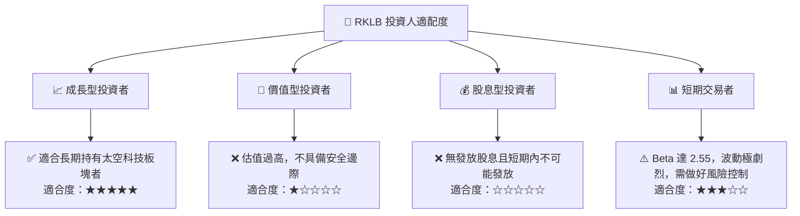

### 10.5 每季財報監控清單（Quarterly Watch List）

| 監控指標 | 基準值 (當前) | 觸發加碼門檻 | 觸發減碼/警報門檻 | 驅動業務含意 |
|----------|---------------|--------------|-------------------|--------------|
| **太空系統營收佔比** | 68.5% | ↗️ > 75.0% | ↘️ < 55.0% | 評估高毛利業務是否持續為主導力量 |
| **SBC / 營收比重** | 14.0% | ↘️ < 8.0% | ↗️ > 18.0% | 監控股權稀釋對每股價值的侵蝕程度 |
| **季末現金與短期投資**| $1.38B | ↗️ > $1.50B | ↘️ < $800M | 評估資金安全墊是否足以支撐 Neutron 研發 |
| **Electron 季度發射次數**| 4-5 次 | ↗️ > 8 次 | ↘️ < 2 次 | 發射服務的產能利用率與固定成本攤銷 |

### 10.6 反面論證：什麼會證明論點錯誤

```
╔══════════════════════════════════════════════════════════════════╗
║              ⚠️ 論點失效條件（Disconfirming Evidence）           ║
╠══════════════════════════════════════════════════════════════════╣
║  本投資論點在下列情況成立時應重新檢視或退出：                    ║
║  [ ] 太空系統業務營收 YoY 成長率連續兩季跌破 30%                  ║
║  [ ] 2026 年底前，Neutron 火箭未能在發射台進行實體整合測試       ║
║  [ ] 自由現金流（FCF）流出持續擴大，導致手頭淨現金降至 $500M 以下║
║  [ ] 為了彌補研發缺口，公司再度進行高達現有股本 15% 以上的增資   ║
║  [ ] SpaceX 將 Falcon 9 的小衛星拼車（Transporter）價格調降 50%  ║
╚══════════════════════════════════════════════════════════════════╝
```

---

> **免責聲明**：本報告為 AI 自動生成，僅供研究參考，不構成投資建議。投資有風險，入市需謹慎。