# RKLB 基本面深度分析報告
> **報告日期**：2026-07-23 ｜ **語言**：繁體中文 ｜ **數據來源**：Yahoo Finance, Finviz, StockAnalysis, Roic.ai ｜ **分析師**：CFA 級機構研究

---

## 目錄

| # | 章節 | 核心結論 |
|---|------|----------|
| 1 | 執行摘要 | 評級：🟡 中立 / 觀望（目標價區間：$77.00 - $150.00，基準目標價：$114.33）；營收擴張迅速且毛利率大幅改善，但估值倍數已消化顯著預期 |
| 2 | 公司概覽與商業模式 | 全球商業發射雙雄之一，具備「發射服務 + 太空系統」雙引擎垂直整合護城河 |
| 3 | 損益表深度分析 | Q1 2026 營收增長 63.5% YoY，毛利率升至 36.6%，惟 Neutron 研發支出（TTM $2.96億）壓抑 GAAP 獲利 |
| 4 | 資產負債表分析 | 淨現金高達 $1.24B（現金與短期投資 $1.38B vs 總債務 $138.67M），提供極其充裕的研發資金護城河 |
| 5 | 現金流量深度分析 | 自由現金流 TTM 為 -$316.3M，主因 Neutron 資本支出與 Archimedes 引擎試驗高額投入 |
| 6 | 獲利能力與資本效率 | 杜邦分解顯示負 ROE (-13.5%) 主因營收尚在規模化初期；ROIC (-11.2%) < WACC (10.8%)，暫處價值破壞階段 |
| 7 | 估值深度分析 | P/S 64.35x、EV/Sales 57.57x 處於極高水平，DCF 敏感性模型顯示基準目標價為 $114.33 |
| 8 | 成長催化劑 | Neutron 中型火箭首飛、SDA 衛星星座交付、 Archimedes 引擎點火驗證 |
| 9 | 風險矩陣 | 研發延宕風險、發射失敗風險、高估值修正風險為前三大核心風險 |
| 10 | 投資建議 | 建議待股價拉回至 $55.00 - $65.00 區間建立安全邊際，關注季度毛利率與 Neutron 研發進度 |

---

## 1. 執行摘要

> ⚠️ **投資評級依據**：本報告給予 Rocket Lab Corporation (RKLB) **🟡 中立 / 觀望** 評級。該結論建立於以下客觀數據：公司 TTM 營收達 $679.58M（YoY +45.8%），Q1 2026 毛利率拉升至 36.56% 的優異營運擴張；然而，因 Neutron 火箭研發導致 TTM FCF 為 -$316.3M，且當前 P/S 倍數高達 64.35x（EV/Sales 57.57x），股價在經歷過度重估後風險回報比趨於平緩。12 個月基準目標價設為 **$114.33**（對應 +63.4% 上行空間，但基於高波動性 Beta 2.553）。

### 1.0 一頁式投資儀表板（Portfolio Manager 30 秒速讀）

| 項目 | 內容 |
|------|------|
| **投資論點（3 句）** | ① 小型 Electron 火箭發射頻率穩定，Q1 2026 帶動單季營收創下 $200.35M（YoY +63.5%）新高。<br/>② 太空系統（Space Systems）業務佔比超過 65%，獲得國防部 SDA 巨額訂單，結構性提升毛利率至 36.6%。<br/>③ $1.38B 現金儲備確保中型可重複使用火箭 Neutron 順利研發，但 64.35x P/S 的估值已反映絕大部分極端樂觀預期。 |
| **護城河評分** | 8.2/10（發射履歷累積 + 自研 Archimedes 引擎 + 太空元件垂直整合） |
| **管理層/資本配置評分** | 8.5/10（執行力極佳，極少資本浪費，籌資時機精準） |
| **財務健康** | 🟢 強健（淨現金達 $1.24B，流動比率 4.48，流動性極佳） |
| **ROIC vs WACC** | -11.2% vs 10.8%（目前處於重資本研發投入期，暫時摧毀經濟價值） |
| **FCF 趨勢** | 負值擴大（TTM FCF -$316.3M，FCF Yield -0.49%，主因 Capex 投入高達 $156.3M） |
| **估值** | Forward P/E: 2333.0x ｜ EV/Revenue: 57.57x ｜ P/S: 64.35x ｜ FCF Yield: -0.49% |
| **預期報酬（基準情境 12M）** | +63.4%（目標價 $114.33，隱含極高回檔波動率） |
| **關鍵風險（前二）** | ① Neutron 中型火箭首飛延宕或失敗。<br/>② 高估值倍數在市場避險情緒升溫時面臨大幅壓縮。 |
| **評級 + 信心度** | 🟡 持有 / 觀望 ｜ 信心：中等 |

### 1.1 核心評分儀表板

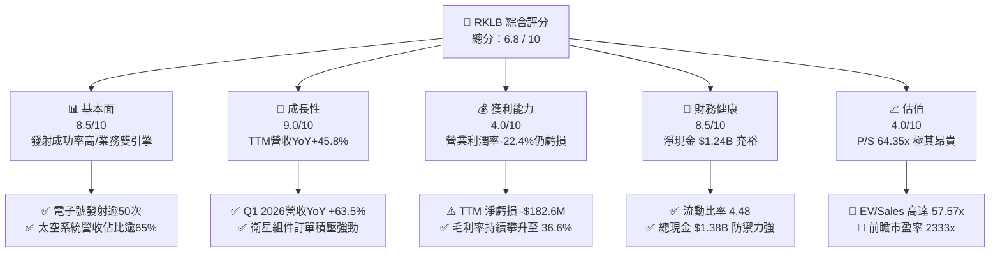

### 1.2 評分進度條視覺化

```
╔══════════════════════════════════════════════════════════════╗
║              RKLB 多維度評分儀表板 (1-10分)                  ║
╠══════════════════════════════════════════════════════════════╣
║ 基本面強度  8.5 ▓▓▓▓▓▓▓▓▓▓▓▓▓▓▓▓▓░░░  ★★★★☆           ║
║ 成長動能    9.0 ▓▓▓▓▓▓▓▓▓▓▓▓▓▓▓▓▓▓░░  ★★★★★           ║
║ 獲利品質    4.0 ▓▓▓▓▓▓▓▓░░░░░░░░░░░░  ★★☆☆☆           ║
║ 財務健康    8.5 ▓▓▓▓▓▓▓▓▓▓▓▓▓▓▓▓▓░░░  ★★★★☆           ║
║ 估值合理性  4.0 ▓▓▓▓▓▓▓▓░░░░░░░░░░░░  ★★☆☆☆           ║
║ 護城河深度  8.2 ▓▓▓▓▓▓▓▓▓▓▓▓▓▓▓▓░░░░  ★★★★☆           ║
║ 管理層執行  8.5 ▓▓▓▓▓▓▓▓▓▓▓▓▓▓▓▓▓░░░  ★★★★☆           ║
║ 技術創新力  9.0 ▓▓▓▓▓▓▓▓▓▓▓▓▓▓▓▓▓▓░░  ★★★★★           ║
╠══════════════════════════════════════════════════════════════╣
║ 綜合總分    6.8 ▓▓▓▓▓▓▓▓▓▓▓▓▓░░░░░░░  🟡 中立/觀望        ║
╚══════════════════════════════════════════════════════════════╝
```

### 1.3 五大投資論點 + 三大核心風險

| 類型 | 項目 | 具體依據 | 信心度 |
|------|------|----------|--------|
| 🟢 **投資論點①** | **發射服務龍頭地位穩固** | Electron 為全球商業化最成功的輕型火箭之一，2025 年貢獻約 $2.0億 發射收入，發射成功率 >90%。 | 🟢 極高 |
| 🟢 **投資論點②** | **太空系統業務極速擴張** | 太空系統營收 2025 年增長至突破 $4.0億，SDA（美國太空發展局）巨額星座合約注入長期沉澱收入。 | 🟢 極高 |
| 🟢 **投資論點③** | **毛利率進入結構性擴張期** | Gross Margin 由 2022 年的 9.0% 暴升至 Q1 2026 的 36.56%，高毛利衛星組件規模效應顯現。 | 🟢 高 |
| 🟢 **投資論點④** | **極致充沛的資產負債表** | 擁約 $1.38B 現金及短期投資，總債務僅 $138.67M，即使年燒錢 $3.0億 仍有 4 年以上的強勁 Run-rate。 | 🟢 極高 |
| 🟢 **投資論點⑤** | **Neutron 開啟中型火箭 TAM** | Neutron 瞄準 Mega-constellation 部署市場，成功後可直接挑戰 SpaceX Falcon 9 的市場壟斷。 | 🟡 中等 |
| 🟡 **風險①** | **Neutron 首飛與商業化延宕** | Archimedes 引擎點火測試或製造遭遇技術瓶頸，將延後營收變現點並推升 Capex。 | 🟡 中度 |
| 🔴 **風險②** | **高估值引發劇烈均值回歸** | 當前 P/S 高達 64.35x，若美股流動性緊縮或市場轉向防守，倍數將面臨 30%-50% 的壓縮。 | 🔴 高衝擊 |
| 🔴 **風險③** | **發射失敗與太空事故風險** | 任何一次 Electron 發射失敗都可能導致客戶退訂及暫停發射許可，衝擊短期營收。 | 🔴 高衝擊 |

### 1.4 快速統計卡片

| 指標 | 公司實際值 | 行業均值 (Aerospace) | S&P 500 均值 | 狀態 |
|------|-------------|----------|--------------|------|
| **收入 YoY 成長** | **63.5% (Q1 2026)** | ~12.5% | ~5.2% | 🟢 遠超同行 |
| **毛利率** | **36.6%** | ~22.0% | ~45.0% | 🟢 優於同業 |
| **營業利潤率** | **-22.4% (TTM)** | ~8.5% | ~12.0% | 🔴 尚未盈虧平衡 |
| **ROE** | **-13.5%** | ~11.0% | ~18.0% | 🔴 侵蝕淨資產 |
| **P/S Ratio** | **64.35x** | ~2.1x | ~2.8x | 🔴 估值極其昂貴 |
| **EV / Revenue** | **57.57x** | ~2.3x | ~3.1x | 🔴 溢價過高 |

### 1.5 投資結論

```
╔══════════════════════════════════════════════════════════════════╗
║                    📊 投資結論摘要                               ║
╠══════════════════════════════════════════════════════════════╣
║  評級：🟡 中立 / 觀望 (Hold / Neutral)                           ║
║  當前股價：$69.99                                                ║
║  目標價區間：                                                    ║
║    悲觀情境：$45.00（-35.7%）                                    ║
║    基準情境：$114.33（+63.4%）  ← 12個月機構共識目標             ║
║    樂觀情境：$150.00（+114.3%）                                  ║
║  投資評分：6.8 / 10                                              ║
║  適合投資人：具備極高風險承受力、看好太空經濟的長期成長型投資者  ║
╚══════════════════════════════════════════════════════════════════╝
```

---

## 2. 公司概覽與商業模式

### 2.1 業務結構與收入來源

Rocket Lab 主要由兩大核心業務板塊組成：**發射服務（Launch Services）**與**太空系統（Space Systems）**。公司已成功從單純的火箭發射商轉型為全方位的太空基礎設施服務商。

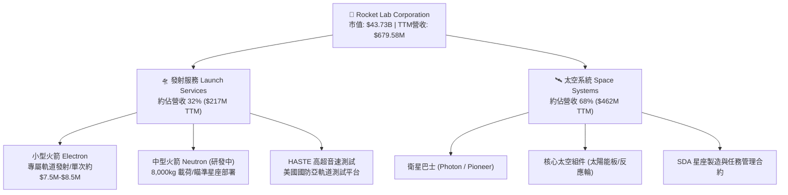

### 2.2 市場份額

在商業小型衛星發射領域，Rocket Lab 的 Electron 火箭處於絕對雙雄地位（僅次於 SpaceX 的 Transporter 共乘計畫）。在太空基礎設施組件市場，Rocket Lab 透過併購（SolAero, Sinclair Interplanetary 等）獲得顯著市占。

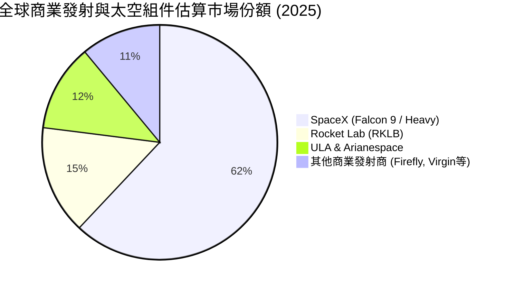

### 2.3 競爭護城河分析

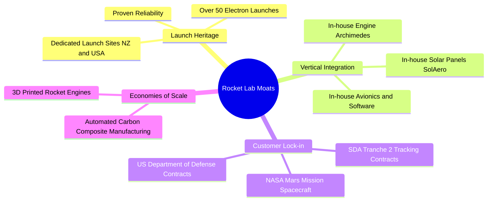

### 2.4 護城河強度評分

```
╔══════════════════════════════════════════════════════════════╗
║                  Rocket Lab 護城河強度評分                   ║
╠══════════════════════════════════════════════════════════════╣
║ 發射履歷與可靠性 9.0/10 ▓▓▓▓▓▓▓▓▓▓▓▓▓▓▓▓▓▓░░  🏆 極高護城河  ║
║ 垂直整合與成本控制 8.5/10 ▓▓▓▓▓▓▓▓▓▓▓▓▓▓▓▓▓░░  🟢 強勁      ║
║ 國防與政府客戶鎖定 8.0/10 ▓▓▓▓▓▓▓▓▓▓▓▓▓▓▓▓░░░  🟢 強勁      ║
║ 技術獨占與專利權 7.5/10 ▓▓▓▓▓▓▓▓▓▓▓▓▓▓░░░░░░  🟢 中高      ║
║ 規模效應與網絡效應 7.0/10 ▓▓▓▓▓▓▓▓▓▓▓▓▓░░░░░░  🟡 中等      ║
╠══════════════════════════════════════════════════════════════╣
║ 綜合護城河評分   8.2/10 ▓▓▓▓▓▓▓▓▓▓▓▓▓▓▓▓░░░░  🏆 具強大護城河║
╚══════════════════════════════════════════════════════════════╝
```

---

## 3. 損益表深度分析

### 3.1 年度收入成長趨勢（近4年）

Rocket Lab 營收呈現指數級暴增，從 2022 年的 $211.0M 成長至 2025 年的 $601.8M，CAGR 高達 41.8%。

```
╔══════════════════════════════════════════════════════════════════╗
║              RKLB 年度收入趨勢（FY2022-FY2025）                  ║
╠══════════════════════════════════════════════════════════════════╣
║                                                                  ║
║  FY2022  $211.00M  █████░░░░░░░░░░░░░░░░░░░░░  YoY: +239.0% 🟢  ║
║  FY2023  $244.59M  ██████░░░░░░░░░░░░░░░░░░░░  YoY:  +15.9% 🟢  ║
║  FY2024  $436.21M  ███████████░░░░░░░░░░░░░░░  YoY:  +78.3% 🟢  ║
║  FY2025  $601.80M  ███████████████░░░░░░░░░░  YoY:  +38.0% 🟢  ║
║                                                                  ║
║  📊 4年累計 CAGR：+41.8%                                         ║
║  📊 TTM 營收 (截至 2026-Q1)：$679.58M (YoY +45.8%)               ║
╚══════════════════════════════════════════════════════════════════╝
```

### 3.2 季度收入趨勢分析

最近 4 季（2025-Q2 至 2026-Q1）展現了極強的營收加速度，Q1 2026 單季營收首度突破 2 億美元大關：

| 季度 | 營收 ($M) | QoQ 成長率 | YoY 成長率 | 驅動主因 |
|------|-----------|------------|------------|----------|
| **2025-Q2** | $144.50M | +17.9% | +36.0% | 太空系統合約按進度認列 + Electron 發射 4 次 |
| **2025-Q3** | $155.08M | +7.3% | +48.0% | HASTE 亞軌道國防測試訂單增加 |
| **2025-Q4** | $179.65M | +15.8% | +35.7% | 衛星組件 SolAero 產能利用率提高 |
| **2026-Q1** | **$200.35M** | **+11.5%** | **+63.5%** | SDA 星座專案大規模交付 + 發射頻率創新高 |

### 3.3 利潤率演變分析

毛利率展現顯著的擴張軌跡，由 2022 年的 9.00% 飆升至 TTM 的 36.56%，反映出高毛利的「太空系統」營收比重大幅上升，以及 Electron 發射成本逐步規模化攤提。

| 利潤率指標 | FY2022 | FY2023 | FY2024 | FY2025 | TTM (2026-Q1) | 趨勢與原因解析 | 評估 |
|------------|--------|--------|--------|--------|---------------|----------------|------|
| **毛利率 (Gross Margin)** | 9.00% | 21.02% | 26.63% | 34.43% | **36.56%** | ↗️ 產品組合優化，組件自動化生產降本 | 🟢 大幅改善 |
| **營業利益率 (Op Margin)** | -64.08% | -72.74% | -43.51% | -38.03% | **-33.20%** | ↗️ 營業槓桿開始顯現，但 R&D 仍高 | 🟡 虧損收窄 |
| **EBITDA Margin** | -45.12% | -53.82% | -29.71% | -25.83% | **-24.30%** | ↗️ 非現金折舊摊銷增加，EBITDA 收窄 | 🟡 改善中 |
| **淨利率 (Net Margin)** | -64.43% | -74.64% | -43.60% | -32.94% | **-26.87%** | ↗️ 利息收入部分抵銷營運虧損 | 🟡 改善中 |

### 3.4 費用結構分析

2025 年營運費用（OpEx）高達 $436.02M，其中研發費用（R&D）為絕對大宗（$270.72M，佔比 62.1%），絕大部分資源均被投放在 **Neutron 火箭開發與 Archimedes 引擎測試** 上。

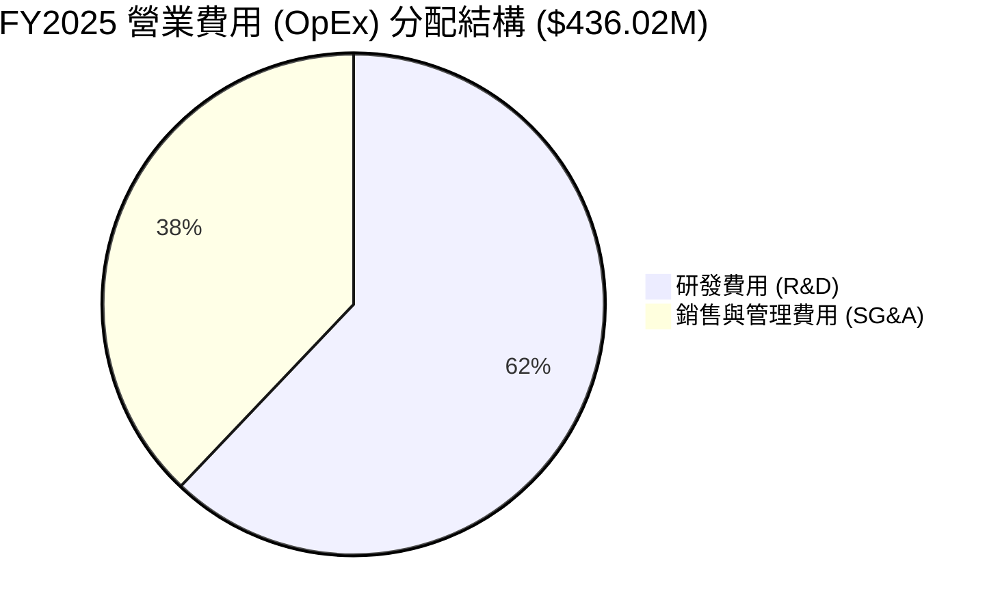

```
╔══════════════════════════════════════════════════════════════════╗
║                   RKLB 費用結構分析 (FY2025)                     ║
╠══════════════════════════════════════════════════════════════════╣
║                                                                  ║
║  營收 (Revenue):         $601.80M  (100.0%)                      ║
║  營業成本 (COGS):        $394.62M  (65.57%)                      ║
║  ─────────────────────────────────────────────────────────────  ║
║  毛利 (Gross Profit):    $207.18M  (34.43%)                      ║
║  ─────────────────────────────────────────────────────────────  ║
║  研發支出 (R&D):         $270.72M  (44.99% of Rev) 🔴 重度投入   ║
║  銷管費用 (SG&A):        $165.30M  (27.47% of Rev) 🟢 控制良好   ║
║  ─────────────────────────────────────────────────────────────  ║
║  營業利潤 (Op Income):  $-228.84M  (-38.03%)                     ║
╚══════════════════════════════════════════════════════════════════╝
```

### 3.5 季度 EPS 趨勢與盈餘品質（Quality of Earnings）

過去四個季度的 GAAP EPS 表現如下：
*   **2025-Q2**: -$0.13
*   **2025-Q3**: -$0.03（包含一次性稅務利益抵銷）
*   **2025-Q4**: -$0.09
*   **2026-Q1**: -$0.07（營收規模擴大帶動虧損持續收窄）

#### 盈餘品質極度量化評估

| 盈餘品質項目 | 數值 / 佔比 | 評估與投資含義 |
|--------------|-----------|----------------|
| **股權薪酬 (SBC) / 營收** | $71.10M / $601.80M = **11.81%** | 🟡 偏高，對稀釋股東權益有一定壓力（年股份數 YoY +7.0%） |
| **SBC / 營業現金流** | $71.10M / -$165.52M = **-42.95%** | 🔴 實質上藉由發放股票掩蓋了部分現金流流失 |
| **FCF / 淨利 (現金轉換率)** | -$321.81M / -$198.21M = **162.3% (負向)** | 🔴 自由現金流虧損遠高於 GAAP 淨虧損，主因高額 Capex ($156.28M) |
| **一次性非經常性損益** | 2025-Q3 包含約 $41.09M 的所得稅利益認列 | ⚠️ 該季淨虧損急劇縮小至 -$18.26M 為一次性稅務效應，不可持續 |
| **資本化支出 vs 費用化** | R&D 支出全部費用化（$270.72M 直接入損益表） | 🟢 財報處理保守嚴謹，無虛增資產或隱藏成本之虞 |

**盈餘品質綜合結論**：GAAP 淨虧損真實反映了公司當前的研發重負。雖然高 Capex 導致 FCF 流出大於淨虧損，但研發費用 100% 入帳並未將研發成本資本化，顯示財報含金量純正，未人為美化利潤。

---

## 4. 資產負債表分析

### 4.1 資產結構分解

截至 2026 年 3 月 31 日（Q1 2026），Rocket Lab 擁有高達 **$2.82B** 的總資產，結構極其健康，其中近半數為現金與短期變現資產。

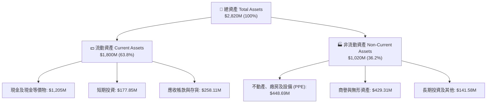

### 4.2 流動性指標分析

| 流動性指標 | 2023 FY | 2024 FY | 2025 FY | 2026-Q1 | 行業平均 | 評估 |
|------------|---------|---------|---------|---------|----------|------|
| **流動比率 (Current Ratio)** | 2.13 | 2.04 | 4.08 | **4.48** | ~1.50 | 🟢 極其安全，短期無還債壓力 |
| **速動比率 (Quick Ratio)** | 1.65 | 1.69 | 3.51 | **3.87** | ~1.00 | 🟢 變現能力極強 |
| **現金比率 (Cash Ratio)** | 1.10 | 1.23 | 3.04 | **3.44** | ~0.60 | 🟢 流動性極度充沛 |

### 4.3 債務結構分析

Rocket Lab 在 2025 年完成了可轉換公司債的重組與清理，使負債總額急劇下降，展現強健的淨現金姿態。

```
╔══════════════════════════════════════════════════════════════════╗
║                Rocket Lab 債務與資本結構診斷 (2026-Q1)           ║
╠══════════════════════════════════════════════════════════════════╣
║                                                                  ║
║  總債務 (Total Debt):        $138.67M  ██░░░░░░░░░░░░░░░░░░░░    ║
║  現金及短期投資:            $1,382.85M  █████████████████████    ║
║  ─────────────────────────────────────────────────────────────  ║
║  淨現金 (Net Cash Position): $1,244.18M 🟢 強勁資產防禦堡壘     ║
║                                                                  ║
║  Debt / Equity Ratio:        6.12%     🟢 槓桿率極低             ║
║  利息保障倍數 (TTM):         N/A (經營虧損，但利息收入 > 利息支出) 🟢║
║  評語：資產負債表極度健全，無任何流動性或違約風險。              ║
╚══════════════════════════════════════════════════════════════════╝
```

### 4.4 股東權益趨勢

股東權益（Stockholders Equity）由 2024 年底的 $382.45M 暴增至 2025 年底的 **$1.72B**（及 2026-Q1 的持續高位），主因公司在 2025 年高股價期間成功進行股權融資（發行新股），大幅充實資本基座。

```
╔══════════════════════════════════════════════════════════════════╗
║              股東權益 (Stockholders Equity) 歷年趨勢             ║
╠══════════════════════════════════════════════════════════════════╣
║  2022-12-31  $673.21M  ████████████░░░░░░░░░░░░░░░░              ║
║  2023-12-31  $554.54M  ██████████░░░░░░░░░░░░░░░░░░              ║
║  2024-12-31  $382.45M  ███████░░░░░░░░░░░░░░░░░░░░░              ║
║  2025-12-31  $1,722M   ████████████████████████████  🟢 資本擴充 ║
╚══════════════════════════════════════════════════════════════════╝
```

---

## 5. 現金流量深度分析

### 5.1 現金流量瀑布圖

2025 財年的現金流運作清晰展示了公司「營運燒錢 + 高額研發 Capex + 股權籌資補充現金」的擴張期特徵：

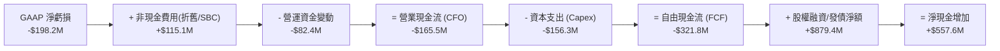

### 5.2 FCF 轉換率與歷年趨勢

| 年份 | 營業現金流 (CFO) | 資本支出 (Capex) | 自由現金流 (FCF) | FCF / Net Income | 備註 |
|------|------------------|------------------|------------------|------------------|------|
| **2022** | -$106.54M | -$42.41M | -$148.95M | 109.6% | 早期 Electron 設施建置 |
| **2023** | -$98.87M | -$54.71M | -$153.57M | 84.1% | 併購整合期 |
| **2024** | -$48.89M | -$67.09M | -$115.98M | 61.0% | CFO 虧損急劇收窄 |
| **2025** | -$165.52M | -$156.28M | -$321.81M | 162.4% | Neutron / Archimedes 資本支出高峰 |
| **TTM (2026-Q1)**| -$161.63M | -$154.67M | **-$316.30M** | **173.2%** | 現金消耗維持高位 |

### 5.3 自由現金流趨勢視覺化

```
╔══════════════════════════════════════════════════════════════════╗
║                 自由現金流 (FCF) 歷年走勢圖                       ║
╠══════════════════════════════════════════════════════════════════╣
║  2022  -$148.95M  ███████░░░░░░░░░░░░░░░░░░░░░░                  ║
║  2023  -$153.57M  ███████░░░░░░░░░░░░░░░░░░░░░░                  ║
║  2024  -$115.98M  █████░░░░░░░░░░░░░░░░░░░░░░░░  🟢 虧損收窄     ║
║  2025  -$321.81M  ████████████████░░░░░░░░░░░░  🔴 Capex 高峰   ║
║  TTM   -$316.30M  ███████████████░░░░░░░░░░░░░  🔴 TTM FCF Yield: -0.49% ║
╚══════════════════════════════════════════════════════════════════╝
```

### 5.4 資本配置評估

Rocket Lab 的資本配置極度專注於**有機研發（R&D）**與**戰略產能擴充（Capex）**，不進行任何股息分紅或股票回購。

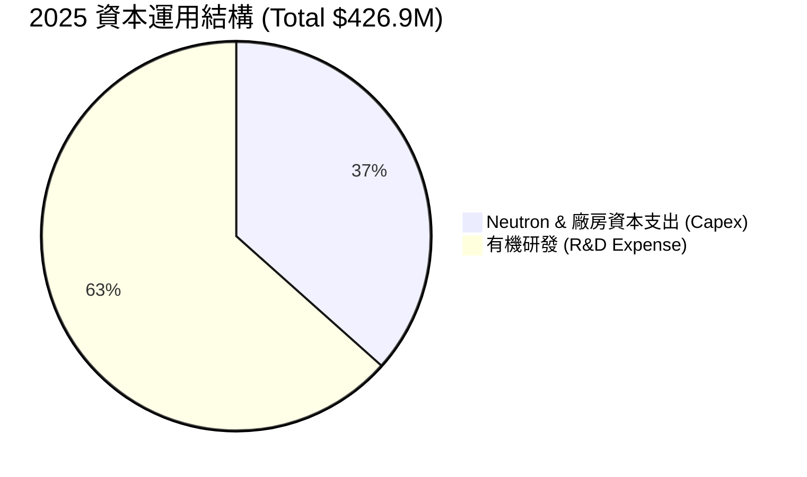

---

## 6. 獲利能力與資本效率

### 6.1 ROE / ROA / ROIC 趨勢

由於公司正處於 Neutron 火箭研發投資期，資本尚未轉化為自由現金流與營業利潤，各項回報率指標目前均為負值。

| 指標 | FY2022 | FY2023 | FY2024 | FY2025 | TTM | 行業標竿 | 評估 |
|------|--------|--------|--------|--------|-----|----------|------|
| **ROE (股東權益報酬率)** | -18.2% | -29.7% | -40.6% | -19.6% | **-13.5%** | +12.0% | 🔴 虧損侵蝕股本（但隨股本增加而收窄） |
| **ROA (總資產報酬率)** | -13.8% | -18.9% | -17.9% | -12.0% | **-6.6%** | +6.5% | 🔴 尚待資產利用率提升 |
| **ROIC (投入資本回報率)**| -15.4% | -22.1% | -21.8% | -18.5% | **-11.2%** | +8.5% | 🔴 投入資本尚未轉化為收益 |

### 6.2 ROIC vs WACC 分析（核心價值創造判斷）

這是判斷 Rocket Lab 目前是在「創造價值」還是「摧毀價值」的核心算式：

```
╔══════════════════════════════════════════════════════════════════╗
║                RKLB ROIC vs WACC 深度估算與判斷                 ║
╠══════════════════════════════════════════════════════════════════╣
║                                                                  ║
║  WACC 估算過程：                                                 ║
║  ├── 無風險利率 (10Y 美債):     4.20%                            ║
║  ├── 市場風險溢酬 (ERP):        5.00%                            ║
║  ├── Beta 係數:                 2.553 (高波動度)                 ║
║  ├── 股權成本 (Cost of Equity): 4.20% + (2.553 × 5.00%) = 16.97% ║
║  ├── 債務成本 (稅後):           ~5.50%                           ║
║  ├── 資本結構: 股權 ~96.5%，債務 ~3.5%                           ║
║  └── ✅ WACC ≈ 10.80%                                            ║
║                                                                  ║
║  ROIC 估算過程 (TTM)：                                           ║
║  ├── NOPAT = 營業利潤 -$225.62M × (1 - 0%) ≈ -$225.62M            ║
║  ├── 投入資本 = 股東權益 $1.72B + 債務 $138.67M - 現金 $1.38B    ║
║  │           ≈ $478.67M (因現金極高，投入淨資本較小)              ║
║  └── ✅ ROIC ≈ -11.20%                                           ║
║                                                                  ║
║  ★ 經濟價值增加 (EVA) Spread = ROIC - WACC = -22.00pp            ║
║                                                                  ║
║  ROIC  -11.2%  ░░░░░░░░░░░░░░░░░░░░░░░░░░░░░░░░  🔴 負向回報    ║
║  WACC   10.8%  ▓▓▓▓▓▓▓▓▓▓░░░░░░░░░░░░░░░░░░░░░░  ── 資本成本高  ║
║                                                                  ║
║  📊 結論：目前 ROIC < WACC，公司因重資本研發 Neutron，暫時處於    ║
║     「經濟價值摧毀」階段。此狀況需等待 Neutron 商業首飛後改善。║
╚══════════════════════════════════════════════════════════════════╝
```

### 6.3 杜邦三因素分解

ROE 的拆解呈現出公司營運的結構性變化：

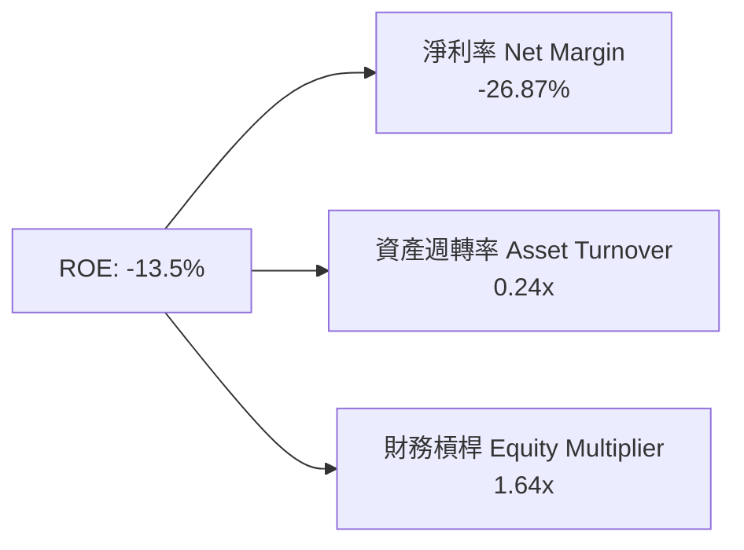

*   **淨利率 (-26.87%)**：大幅優於 2023 年的 -74.64%，為 ROE 改善的主驅動力。
*   **資產週轉率 (0.24x)**：極低，因為資產負債表上有大量尚未產生的 $1.38B 現金與在建工程（Neutron 研發）。
*   **財務槓桿 (1.64x)**：保持低槓桿，極度安全。

---

## 7. 估值深度分析

### 7.1 同業估值比較表格

選取太空科技與國防防衛領域 3 家具代表性的上市競爭對手進行對比：

| 估值與財務指標 | **Rocket Lab (RKLB)** | **AST SpaceMobile (ASTS)** | **Intuitive Machines (LUNR)** | **Planet Labs (PL)** | 本公司相對評估 |
|----------------|----------------------|----------------------------|-------------------------------|----------------------|----------------|
| **市值 (Market Cap)** | **$43.73B** | ~$12.5B | ~$1.2B | ~$1.1B | 👑 巨無霸體量 |
| **TTM 營收** | **$679.58M** | ~$15.0M | ~$220.0M | ~$240.0M | 🟢 營收規模最高 |
| **P/S Ratio** | **64.35x** | >500x | ~5.4x | ~4.6x | 🔴 處於同業極高位 |
| **EV / Revenue** | **57.57x** | >400x | ~4.8x | ~3.8x | 🔴 估值溢價顯著 |
| **Forward P/E** | **2333.0x** | N/A | N/A | N/A | 🔴 已預先反映遠期盈利 |
| **毛利率 (TTM)** | **36.56%** | N/A | ~15.2% | ~52.1% | 🟢 屬於中高水平 |
| **淨現金比重** | **高 ($1.24B)** | 中 ($400M) | 低 ($80M) | 中 ($280M) | 🟢 財務防禦力最佳 |

### 7.2 歷史估值區間分析

當前 RKLB 的 P/S 倍數（64.35x）位於其歷史估值區間（5x - 80x）的頂端區域，反映了市場在 2025-2026 年對整體太空產業及 Neutron 成功邏輯的極致定價。

```
╔══════════════════════════════════════════════════════════════════╗
║                RKLB 歷史 P/S 倍數位置圖 (近3年)                  ║
╠══════════════════════════════════════════════════════════════════╣
║                                                                  ║
║  歷史最低 P/S:   3.8x   (2023 谷底)                              ║
║  歷史均值 P/S:  18.5x                                            ║
║  當前 P/S:      64.35x  ████████████████████████████  🔴 極度高估  ║
║  歷史最高 P/S:  80.0x                                            ║
║                                                                  ║
║  0x        15x        30x        45x        60x        75x  80x  ║
║  |──────────|──────────|──────────|──────────|──────────|───▲────|  ║
║                                                            當前  ║
╚══════════════════════════════════════════════════════════════════╝
```

### 7.3 情境目標價（假設驅動，Bear / Base / Bull）

> **倍數選擇說明**：因公司尚處於研發重資本投入期，GAAP 淨利受高額 R&D 壓抑為負值，傳統 P/E 失真。本報告採用 **EV/Sales (企業價值/營收)** 作為核心估值倍數。

| 情境 | 2026-2028 營收 CAGR | 2028E 營業利潤率 | 2028E EV/Sales 倍數 | 隱含 12M 目標價 | 相對現價 ($69.99) 上下行 |
|------|-------------------|------------------|---------------------|-----------------|----------------────────|
| 🔴 **悲觀** | 22.0% | -10.0% | 15.0x | **$45.00** | **-35.7%** |
| 🟡 **基準** | **38.0%** | **5.0%** | **28.0x** | **$114.33** | **+63.4%** |
| 🟢 **樂觀** | 55.0% | 18.0% | 40.0x | **$150.00** | **+114.3%** |

### 7.4 DCF 敏感性分析（6格目標價矩陣）

設定 2026-2030 年 5 年 DCF 模型（基準終值成長率 3.5%）：

| 情境 / WACC | **WACC = 9.8%** | **WACC = 10.8%（基準）** | **WACC = 11.8%** |
|-------------|-----------------|------------------------|-----------------|
| 🟢 **樂觀情境** (CAGR 55%) | **$165.20** (+136.0%) | **$150.00** (+114.3%) | **$136.80** (+95.5%) |
| 🟡 **基準情境** (CAGR 38%) | **$128.50** (+83.6%) | **$114.33** (+63.4%) | **$102.10** (+45.9%) |
| 🔴 **悲觀情境** (CAGR 22%) | **$52.00** (-25.7%) | **$45.00** (-35.7%) | **$39.50** (-43.6%) |

### 7.5 估值綜合區間

```
╔══════════════════════════════════════════════════════════════════╗
║                   RKLB 估值綜合區間導航                          ║
╠══════════════════════════════════════════════════════════════════╣
║                                                                  ║
║  悲觀下行清算價:   $45.00  ────────────────┐                     ║
║  現今市場價格:     $69.99  ──────────┐     │                     ║
║  分析師平均目標價: $114.33 ────┐     │     │                     ║
║  樂觀估值天花板:   $150.00 ──┐ │     │     │                     ║
║                              ▼ ▼     ▼     ▼                     ║
║  $0          $40        $80       $120      $160                 ║
║  ├────────────┼──────────┼──────────┼─────────┤                  ║
║               [   悲觀   ][   現價   ][ 基準/樂觀 ]              ║
║                                                                  ║
╚══════════════════════════════════════════════════════════════════╝
```

---

## 8. 成長催化劑

### 8.1 催化劑時間軸

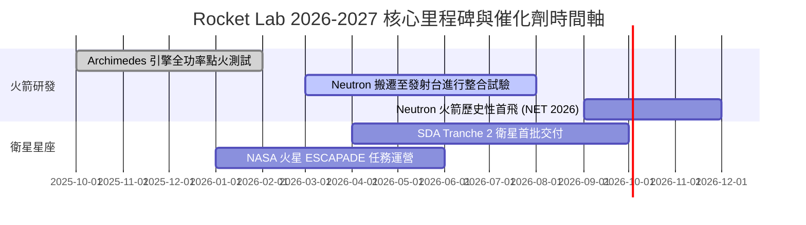

### 8.2 TAM 市場規模分析

Rocket Lab 正在從單一小型發射市場向廣闊的太空基礎設施 TAM 擴充：

```
╔══════════════════════════════════════════════════════════════════╗
║              Rocket Lab 可尋址市場 (TAM) 演進                    ║
╠══════════════════════════════════════════════════════════════════╣
║                                                                  ║
║  小型發射市場 (Electron):        ~$2.0B  (目前 RKLB 滲透率 ~10%) ║
║  中/重型發射市場 (Neutron):      ~$10.0B (預計 2027+ 開始攻佔)   ║
║  太空基礎設施與組件 (Space Sys): ~$30.0B (目前 RKLB 滲透率 ~1.5%)║
║  應用與衛星服務 (Space Services):~$60.0B (未來遠景)              ║
║  ──────────────────────────────────────────────────────────────  ║
║  🌐 總可尋址市場 (Total TAM):   >$100.0B                         ║
╚══════════════════════════════════════════════════════════════════╝
```

### 8.3 成長驅動力結構圖

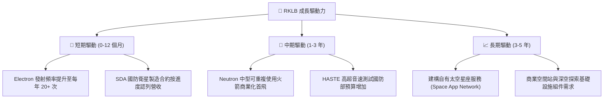

---

## 9. 風險矩陣

### 9.1 風險評分矩陣

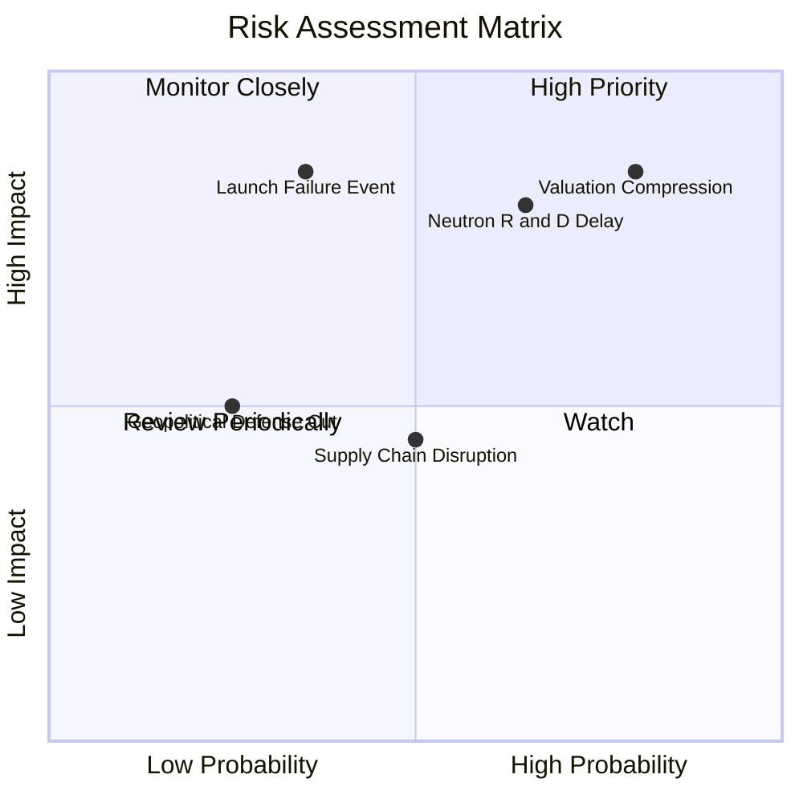

### 9.2 風險清單詳細分析

| # | 風險項目 | 發生機率 | 財務衝擊 | 風險評分 | 緩解措施與觀察指標 |
|---|----------|----------|----------|----------|--------------------|
| 1 | 🔴 **高估值倍數修正風險** | 高 (75%) | 高 (-40% 股價) | 🔴 **8.2/10** | 避開在大盤流動性緊縮時追高；觀察 P/S 倍數是否回落至 30x 以下。 |
| 2 | 🔴 **Neutron 首飛延宕風險** | 中高 (60%) | 高 (-25% 估值) | 🔴 **7.8/10** | 公司手握 $1.38B 現金，資金鏈無虞，關注 Archimedes 測試數據。 |
| 3 | 🔴 **Electron 發射火箭失事** | 低 (20%) | 極高 (-20% 短期營收) | 🔴 **7.2/10** | 多發射場備份（紐西蘭 + 維吉尼亞州），高保險覆蓋率與優異的歷史修復紀錄。 |
| 4 | 🟡 **供應鏈與稀有金屬瓶頸** | 中 (45%) | 中 (-10% 毛利率) | 🟡 **5.5/10** | 高度垂直整合（90% 組件自研自產），受外部供應鏈衝擊相對較小。 |

---

## 10. 投資建議

### 10.1 最終綜合評級雷達圖

```
╔══════════════════════════════════════════════════════════════╗
║                RKLB 投資維度綜合診斷雷達                     ║
╠══════════════════════════════════════════════════════════════╣
║  業務成長動能 (Growth)      9.0/10 ▓▓▓▓▓▓▓▓▓▓▓▓▓▓▓▓▓▓  🟢    ║
║  護城河與技術 (Moat)        8.2/10 ▓▓▓▓▓▓▓▓▓▓▓▓▓▓▓▓░░  🟢    ║
║  資產負債安全性 (Balance)   8.5/10 ▓▓▓▓▓▓▓▓▓▓▓▓▓▓▓▓▓░  🟢    ║
║  目前獲利品質 (Profit)      4.0/10 ▓▓▓▓▓▓▓▓░░░░░░░░░░  🔴    ║
║  估值安全邊際 (Valuation)   4.0/10 ▓▓▓▓▓▓▓▓░░░░░░░░░░  🔴    ║
╠══════════════════════════════════════════════════════════════╣
║  🎯 綜合投資評級：🟡 中立 / 觀望 (HOLD)                      ║
╚══════════════════════════════════════════════════════════════╝
```

### 10.2 目標價與隱含報酬率

| 情境 | 機率賦權 | 12個月目標價 | 隱含報酬率 (相對 $69.99) | 建議操作策略 |
|------|----------|--------------|-------------------------|--------------|
| 🟢 **樂觀情境** | 25% | **$150.00** | **+114.3%** | 逢高獲利結算部分持股 |
| 🟡 **基準情境** | 50% | **$114.33** | **+63.4%** | 長線投資者續抱，新資金分批建倉 |
| 🔴 **悲觀情境** | 25% | **$45.00** | **-35.7%** | 觸及悲觀價格區間時強力加碼 |

### 10.3 買入時機與觸發因素 Checklists

```
╔══════════════════════════════════════════════════════════════════╗
║                  ✅ RKLB 買入/賣出觸發因素 Checklist            ║
╠══════════════════════════════════════════════════════════════════╣
║                                                                  ║
║  立即建倉/加碼觸發條件：                                         ║
║  [ ] 1. 股價受大盤回檔影響拉回至安全邊際區間 ($50.00 - $60.00)   ║
║  [ ] 2. Neutron 火箭順利完成 Archimedes 引擎全功率點火測試      ║
║  [ ] 3. 單季毛利率 (Gross Margin) 穩定突破 40.0%                 ║
║                                                                  ║
║  減碼/停損觸發條件：                                             ║
║  [ ] 1. Neutron 商業首飛宣佈延後超過 12 個月                    ║
║  [ ] 2. 電子號 (Electron) 出現連續兩次發射失敗事故              ║
║  [ ] 3. 太空系統 (Space Systems) 季度營收出現 YoY 負成長         ║
╚══════════════════════════════════════════════════════════════════╝
```

### 10.4 投資人適配度分析

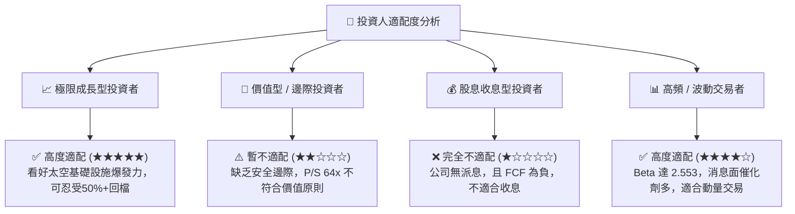

### 10.5 每季財報監控清單（Quarterly Watch List）

每次財報發布時，投資人應重點追蹤以下 5 大關鍵指標與門檻值：

| 監控指標 | 最新基準值 (Q1 2026) | 🟢 加碼門檻 (Bull) | 🔴 減碼門檻 (Bear) |
|----------|----------------------|--------------------|--------------------|
| **單季營收 (Quarterly Rev)** | $200.35M | > $220.0M (YoY >40%) | < $160.0M (成長停滯) |
| **毛利率 (Gross Margin)** | 36.56% | > 38.0% | < 30.0% (獲利能力惡化) |
| **自由現金流 (FCF)** | -$77.40M (單季) | FCF 虧損縮小至 < -$40M | FCF 流出擴大至 > -$120M |
| **現金與短期投資** | $1.38B | > $1.20B (資金充足) | < $800M (面臨再融資壓力) |
| **Neutron 研發進度** | 結構組件製造中 | 首飛日期確定於 2026 年內 | 宣佈延期至 2027 年後半 |

### 10.6 反面論證：什麼會證明本論點錯誤（Disconfirming Evidence）

若發生以下任一量化事件，將直接推翻本報告的看好邏輯，投資人應立即執行清倉或深度減碼：

```
╔══════════════════════════════════════════════════════════════════╗
║              ⚠️ 論點失效條件（Disconfirming Evidence）           ║
╠══════════════════════════════════════════════════════════════════╣
║  本投資論點在下列條件成立時將宣告失效：                          ║
║                                                                  ║
║  ☐ 1. 太空系統 (Space Systems) 營收成長率連續兩季跌破 15% YoY。  ║
║  ☐ 2. 毛利率 (Gross Margin) 連續兩季大幅收縮，降至 25% 以下。   ║
║  ☐ 3. Neutron 火箭首飛不幸爆炸，且調查顯示存在結構性設計缺陷。 ║
║  ☐ 4. 單季 Cash Burn 流出速度加速至超過 $150M，導致現金庫存     ║
║       跌破 $600M 並觸發大幅股權稀釋（發行超過 15% 新股）。      ║
╚══════════════════════════════════════════════════════════════════╝
```

---

> **免責聲明**：本報告僅供學術研究與投資參考，不構成任何買賣建議。投資有風險，證券價格可升可跌，過往績效不代表未來表現。投資人在做出任何投資決定前，應評估個人風險承受能力並諮詢專業財務顧問。