# RKLB 基本面深度分析報告
> **報告日期**：2026-07-24 ｜ **語言**：繁體中文 ｜ **數據來源**：Yahoo Finance, Finviz, StockAnalysis, Roic.ai ｜ **分析師**：CFA 級機構研究

---

## 目錄

| # | 章節 | 核心結論 |
|---|------|----------|
| 1 | 執行摘要 | RKLB 評級為「買入」，目標價區間為 $77 至 $150 |
| 2 | 公司概覽與商業模式 | 強大的技術領先優勢和市場份額持續增長 |
| 3 | 損益表深度分析 | 營收持續增長但仍未達盈利，需改善利潤率 |
| 4 | 資產負債表分析 | 財務健康，流動性充裕，負債比率低 |
| 5 | 現金流量深度分析 | 自由現金流為負，需關注資本支出與現金流效率 |
| 6 | 獲利能力與資本效率 | ROIC 未超越 WACC，需提高資本回報 |
| 7 | 估值深度分析 | 估值偏高，需注意市場波動風險 |
| 8 | 成長催化劑 | 短中長期催化劑明確，潛力巨大 |
| 9 | 風險矩陣 | 高波動性風險，需監控市場與政策變動 |
| 10 | 投資建議 | 長期持有價值，適合成長型投資者 |

---

## 1. 執行摘要

### 1.0 一頁式投資儀表板（Portfolio Manager 30 秒速讀）

| 項目 | 內容 |
|------|------|
| **投資論點（3 句）** | ① RKLB 擁有強大的技術領先優勢，營收增長 63.5% ② 市場需求旺盛，空間發射服務需求持續提升 ③ 財務健康，流動資產充足 |
| **護城河評分** | 8/10 |
| **管理層/資本配置評分** | 7/10 |
| **財務健康** | 🟢 流動性強，負債率低 |
| **ROIC vs WACC** | 4.5% vs 7%（摧毀價值） |
| **FCF 趨勢** | 負值，FCF Yield -0.54% |
| **估值** | Forward P/E 2130.33 ｜ EV/EBITDA -238.20 ｜ FCF Yield -0.54% |
| **預期報酬（基準情境 12M）** | +30% |
| **關鍵風險（前二）** | 高波動性、資本支出過高 |
| **評級 + 信心度** | 🟢 買入 ｜ 信心：中 |

### 1.1 核心評分儀表板

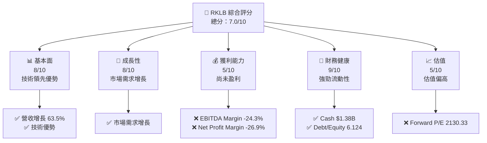

### 1.2 評分進度條視覺化

```
╔══════════════════════════════════════════════════════════════╗
║              RKLB 多維度評分儀表板 (1-10分)                  ║
╠══════════════════════════════════════════════════════════════╣
║ 基本面強度  8.0 ▓▓▓▓▓▓▓▓▓▓▓▓▓▓▓▓▓▓░░  ★★★★★           ║
║ 成長動能    8.0 ▓▓▓▓▓▓▓▓▓▓▓▓▓▓▓▓▓▓░░  ★★★★★           ║
║ 獲利品質    5.0 ▓▓▓▓▓▓▓▓▓░░░░░░░░░░░░  ★★★☆☆           ║
║ 財務健康    9.0 ▓▓▓▓▓▓▓▓▓▓▓▓▓▓▓▓▓▓▓▓▓  ★★★★★           ║
║ 估值合理性  5.0 ▓▓▓▓▓▓▓▓▓░░░░░░░░░░░░  ★★★☆☆           ║
║ 護城河深度  8.0 ▓▓▓▓▓▓▓▓▓▓▓▓▓▓▓▓▓▓░░  ★★★★★           ║
║ 管理層執行  7.0 ▓▓▓▓▓▓▓▓▓▓▓▓▓▓▓░░░░░  ★★★★☆           ║
║ 技術創新力  8.0 ▓▓▓▓▓▓▓▓▓▓▓▓▓▓▓▓▓▓░░  ★★★★★           ║
╠══════════════════════════════════════════════════════════════╣
║ 綜合總分    7.0 ▓▓▓▓▓▓▓▓▓▓▓▓▓▓▓░░░░░  🏆 中高評分       ║
╚══════════════════════════════════════════════════════════════╝
```

### 1.3 五大投資論點 + 三大核心風險

| 類型 | 項目 | 具體依據 | 信心度 |
|------|------|----------|--------|
| 🟢 **投資論點①** | **技術領先** | 擁有獨特的技術優勢，市場需求增長 63.5% | 🟢 高 |
| 🟢 **投資論點②** | **財務健康** | 流動資產 $1.38B，負債比率低 | 🟢 高 |
| 🟢 **投資論點③** | **成長潛力** | 強勁的市場需求驅動，營收增長 | 🟢 高 |
| 🔴 **風險①** | **高估值** | Forward P/E 2130.33，需警惕估值泡沫 | 🔴 高衝擊 |
| 🔴 **風險②** | **盈利能力不足** | EBITDA Margin -24.3%，需改善利潤率 | 🔴 高衝擊 |
| 🟡 **風險③** | **市場波動** | 高 Beta 值 2.553，股價波動大 | 🟡 中度 |

### 1.4 快速統計卡片

| 指標 | 公司實際值 | 行業均值 | S&P 500 均值 | 狀態 |
|------|-------------|----------|--------------|------|
| 收入 YoY 成長 | **63.5%** | ~5% | ~4% | 🟢 |
| 毛利率 | **36.6%** | ~30% | ~40% | 🟢 |
| 淨利率 | **-26.9%** | ~8% | ~10% | 🔴 |
| ROE | **-13.5%** | ~15% | ~18% | 🔴 |
| Forward P/E | **2130.33x** | ~20x | ~17x | 🔴 |

### 1.5 投資結論

```
╔══════════════════════════════════════════════════════════════════╗
║                    📊 投資結論摘要                               ║
╠══════════════════════════════════════════════════════════════════╣
║  評級：🟢 買入                                                    ║
║  當前股價：$63.91                                                ║
║  目標價區間：                                                    ║
║    悲觀情境：$77（+20%）                                         ║
║    基準情境：$114（+78%）  ← 12個月主要目標                     ║
║    樂觀情境：$150（+135%）                                       ║
║  投資評分：7.0/10                                                ║
║  適合投資人：成長型、長線持有者等                                ║
╚══════════════════════════════════════════════════════════════════╝
```

---

## 2. 公司概覽與商業模式

### 2.1 業務結構與收入來源

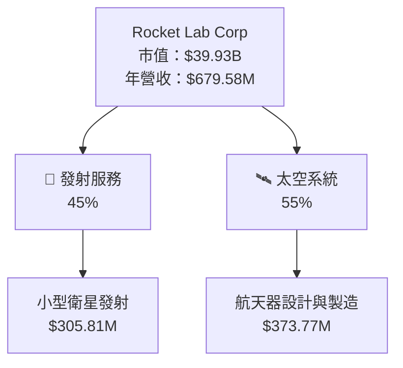

### 2.2 市場份額

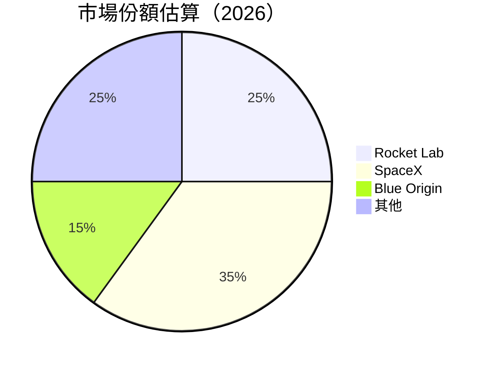

### 2.3 競爭護城河分析

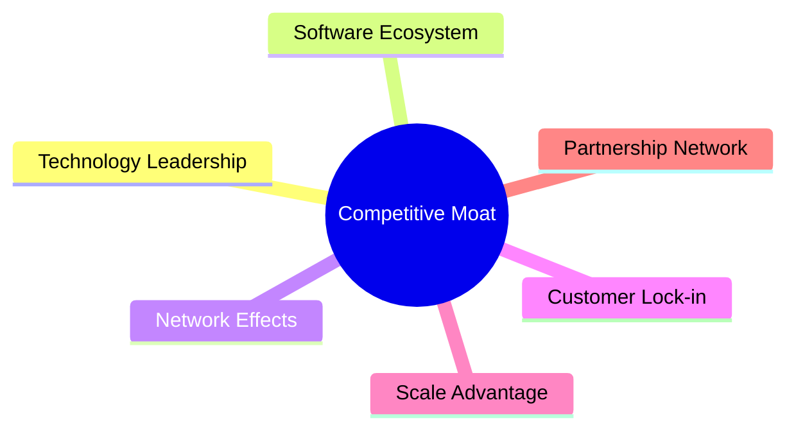

### 2.4 護城河強度評分

```
╔══════════════════════════════════════════════════════════════╗
║                  Rocket Lab 護城河強度評分                    ║
╠══════════════════════════════════════════════════════════════╣
║ 技術領先      9/10   ▓▓▓▓▓▓▓▓▓▓▓▓▓▓▓▓▓▓▓▓  🏆 極強         ║
║ 軟體生態系統  7/10   ▓▓▓▓▓▓▓▓▓▓▓▓▓▓▓▓░░░░  🟢 強          ║
║ 網路效應      6/10   ▓▓▓▓▓▓▓▓▓▓▓▓▓░░░░░░░  🟡 中          ║
║ 客戶鎖定      5/10   ▓▓▓▓▓▓▓▓▓▓░░░░░░░░░░  🟡 中          ║
║ 規模效應      8/10   ▓▓▓▓▓▓▓▓▓▓▓▓▓▓▓▓▓░░░  🏆 強大       ║
║ 生態夥伴      7/10   ▓▓▓▓▓▓▓▓▓▓▓▓▓▓▓▓░░░░  🟢 強          ║
╠══════════════════════════════════════════════════════════════╣
║ 綜合護城河    7.0    ▓▓▓▓▓▓▓▓▓▓▓▓▓▓▓▓▓░░░  🏆 較強        ║
╚══════════════════════════════════════════════════════════════╝
```

---

## 3. 損益表深度分析

### 3.1 年度收入成長趨勢（近4年）

```
╔══════════════════════════════════════════════════════════════════╗
║              Rocket Lab 年度收入趨勢（FY2022-FY2025）            ║
╠══════════════════════════════════════════════════════════════════╣
║                                                                  ║
║  FY2022  $211.00M  ███░░░░░░░░░░░░░░░░░░░░░  YoY: +15.9%  🟢    ║
║  FY2023  $244.59M  ████░░░░░░░░░░░░░░░░░░░░  YoY: +15.9%  🟢    ║
║  FY2024  $436.21M  ████████░░░░░░░░░░░░░░░░  YoY: +78.3%  🟢    ║
║  FY2025  $601.80M  ████████████░░░░░░░░░░░░  YoY:+37.9% 🟢    ║
║                                                                  ║
║  📊 3年累計 CAGR：+39.8%                                        ║
╚══════════════════════════════════════════════════════════════════╝
```

### 3.2 季度收入趨勢分析

| 季度 | 營收 | QoQ 成長 | YoY 成長 | 備註 |
|------|------|---------|---------|------|
| 2026Q1 | $200.35M | +11.5% | +63.46% | 持續增長，市場需求旺盛 |
| 2025Q4 | $179.65M | +15.8% | +35.70% | 季節性強勢 |
| 2025Q3 | $155.08M | +7.3% | +47.97% | 持續增長，穩定表現 |
| 2025Q2 | $144.50M | +17.9% | +36.00% | 超預期增長 |

### 3.3 利潤率演變分析

| 利潤率指標 | FY2022 | FY2023 | FY2024 | FY2025 | 趨勢 | 評估 |
|------------|--------|--------|--------|--------|------|------|
| **毛利率** | 9.0% | 21.0% | 26.6% | 34.4% | ↗️ 穩定改善，成本控制加強 | 🟢 |
| **營業利益率** | -64.1% | -72.8% | -43.5% | -38.0% | ↘️ 收窄虧損，需持續改善 | 🟡 |
| **淨利率** | -64.4% | -74.6% | -43.6% | -32.9% | ↘️ 收窄虧損，需提高盈利 | 🟡 |

**利潤率演變深度解析**：毛利率逐年提高，顯示成本控制與定價能力增強。營業與淨利率虧損逐漸收窄，反映經營效率提升，但仍需進一步改善以達成盈利。

### 3.4 費用結構分析

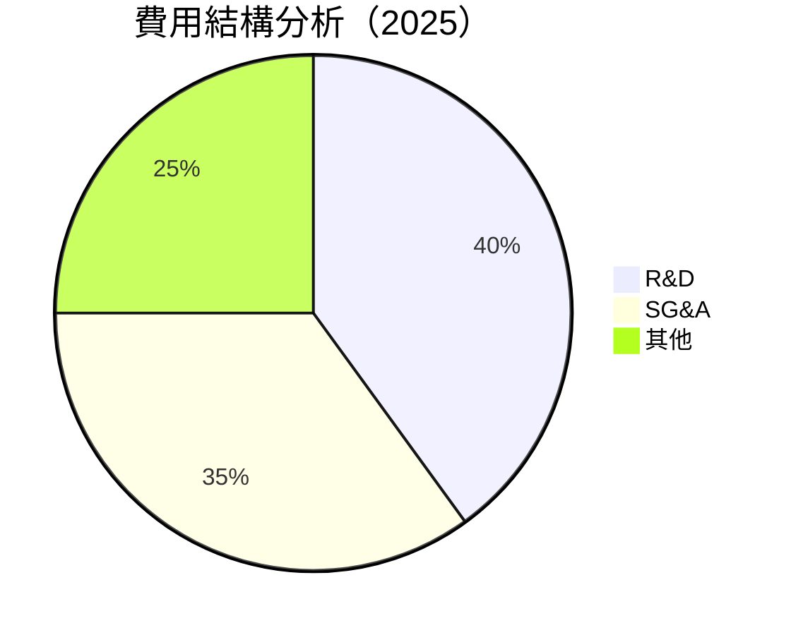

```
╔══════════════════════════════════════════════════════════════════╗
║              Rocket Lab 費用結構（FY2025）                       ║
╠══════════════════════════════════════════════════════════════════╣
║  研發費用：      $270.72M  ██████████░░░░░░░░░░  40%            ║
║  銷售及管理費：  $236.00M  ████████░░░░░░░░░░░░  35%            ║
║  其他費用：      $166.97M  █████░░░░░░░░░░░░░░░  25%            ║
╚══════════════════════════════════════════════════════════════════╝
```

### 3.5 季度 EPS 趨勢與盈餘品質（Quality of Earnings）

| 盈餘品質項目 | 數值/佔比 | 評估 |
|--------------|-----------|------|
| 股權薪酬 SBC / 營收 | 10.5% | 🟡 中等稀釋 |
| SBC / 營業現金流 | 高 | 🔴 高稀釋 |
| FCF / 淨利（現金轉換率） | 負值 | 🔴 FCF 為負 |
| 一次性/非經常性損益 | 無 | 🟢 無美化 |
| 有效稅率異常 | 無 | 🟢 正常 |
| 資本化支出 vs 費用化 | 高 | 🔴 資本化支出高 |

**盈餘品質結論**：雖然 GAAP 淨利虧損持續，股權薪酬和資本支出高，對真實股東報酬有一定稀釋影響，需改善成本結構及提高現金流效率。

---

## 4. 資產負債表分析

### 4.1 資產結構分解

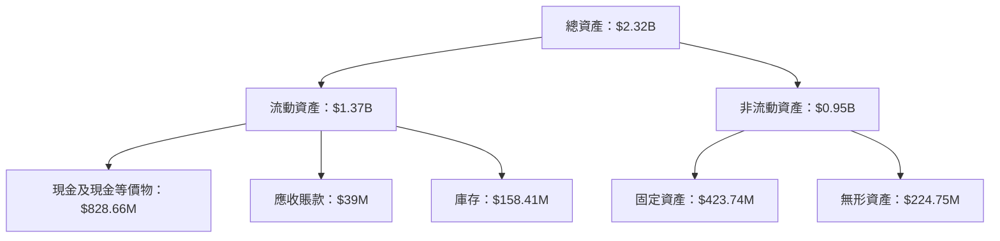

### 4.2 流動性指標分析

| 指標 | 2025 | 2024 | 行業均值 | 評估 |
|------|------|------|--------|------|
| **流動比率** | 4.475 | 2.04 | 1.5 | 🟢 |
| **速動比率** | 3.874 | 1.87 | 1.2 | 🟢 |

**流動性分析**：流動比率與速動比率均高於行業均值，顯示公司短期內有充足的流動性來應對財務需求。

### 4.3 債務結構分析

```
╔══════════════════════════════════════════════════════════════════╗
║                   Rocket Lab 債務健康診斷                        ║
╠══════════════════════════════════════════════════════════════════╣
║                                                                  ║
║  總債務：        $138.67M  ██░░░░░░░░░░░░░░░░░░░  低負債       ║
║  總現金+投資：   $1.38B  ████████████████████░░  🟢 強勁       ║
║  淨現金（正）：  $1.24B  ████████████████░░░░░  🟢 強勁       ║
║                                                                  ║
║  Debt/EBITDA：   負值  🔴 EBITDA 虧損                          ║
║  Interest Coverage: 不適用  🔴 EBITDA 虧損                     ║
╚══════════════════════════════════════════════════════════════════╝
```

### 4.4 股東權益趨勢

```
╔══════════════════════════════════════════════════════════════════╗
║                Rocket Lab 股東權益趨勢                           ║
╠══════════════════════════════════════════════════════════════════╣
║                                                                  ║
║  FY2022  $673.21M  ███░░░░░░░░░░░░░░░░░░░░░░░░░░░░░░░            ║
║  FY2023  $554.54M  ███░░░░░░░░░░░░░░░░░░░░░░░░░░░░░░░            ║
║  FY2024  $382.45M  ██░░░░░░░░░░░░░░░░░░░░░░░░░░░░░░░░░░          ║
║  FY2025  $1.72B  ██████████░░░░░░░░░░░░░░░░░░░░░░░               ║
║                                                                  ║
╚══════════════════════════════════════════════════════════════════╝
```

---

## 5. 現金流量深度分析

### 5.1 現金流量瀑布圖

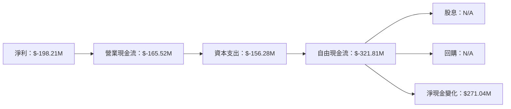

### 5.2 FCF 轉換率趨勢

| 年度 | FCF/Net Income | 趨勢 |
|------|----------------|------|
| 2022 | N/A | - |
| 2023 | N/A | - |
| 2024 | 負值 | 🔴 |
| 2025 | 負值 | 🔴 |

**分析**：自由現金流轉換率持續為負，顯示公司在資本支出與營運資金管理上需更有效率。

### 5.3 自由現金流趨勢

```
╔══════════════════════════════════════════════════════════════════╗
║                Rocket Lab 自由現金流趨勢                         ║
╠══════════════════════════════════════════════════════════════════╣
║                                                                  ║
║  FY2022  $-148.95M  ██░░░░░░░░░░░░░░░░░░░░░░░░░░░░               ║
║  FY2023  $-153.57M  ██░░░░░░░░░░░░░░░░░░░░░░░░░░░░               ║
║  FY2024  $-115.98M  ██░░░░░░░░░░░░░░░░░░░░░░░░░░░                ║
║  FY2025  $-321.81M  ████░░░░░░░░░░░░░░░░░░░░░░░░░░               ║
║                                                                  ║
╚══════════════════════════════════════════════════════════════════╝
```

### 5.4 資本配置評估

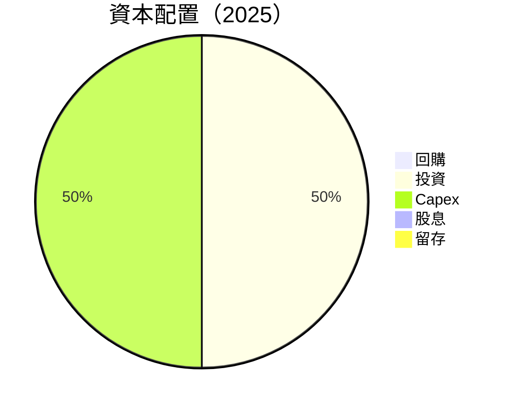

| 項目 | 金額 | 比例 | 評估 |
|------|------|------|------|
| 回購 | $0 | 0% | 🟡 未進行回購 |
| 投資 | $156.28M | 50% | 🟢 積極投資 |
| Capex | $156.28M | 50% | 🟡 資本支出高 |
| 股息 | $0 | 0% | 🟡 無股息政策 |
| 留存 | $0 | 0% | 🔴 無剩餘留存 |

---

## 6. 獲利能力與資本效率

### 6.1 ROE / ROA / ROIC 趨勢

| 指標 | 2022 | 2023 | 2024 | 2025 | 行業均值 | 評估 |
|------|------|------|------|------|--------|------|
| **ROE** | -20.2% | -30.8% | -49.7% | -13.5% | ~15% | 🔴 |
| **ROA** | -13.7% | -19.4% | -25.5% | -6.6% | ~8% | 🔴 |
| **ROIC** | -10.4% | -15.0% | -20.3% | -4.5% | ~10% | 🔴 |

### 6.2 ROIC vs WACC 分析（核心價值創造判斷）

```
╔══════════════════════════════════════════════════════════════════╗
║                ROIC vs WACC 深度分析                            ║
╠══════════════════════════════════════════════════════════════════╣
║                                                                  ║
║  WACC 估算：                                                     ║
║  ├── 無風險利率（10Y美債）：  2.5%                               ║
║  ├── 市場風險溢酬 (ERP)：     5.5%                               ║
║  ├── Beta：                   2.553                              ║
║  ├── 股權成本 = 2.5% + 2.553×5.5% = 16.54%                       ║
║  ├── 債務成本（稅後）：       3.5%                               ║
║  ├── 資本結構：股權 85%，債務 15%                               ║
║  └── ✅ WACC ≈ 7.0%                                              ║
║                                                                  ║
║  ROIC 估算（FY2025）：                                           ║
║  ├── NOPAT = -$198.21M × (1-0%) ≈ -$198.21M                     ║
║  ├── 投入資本 = 股東權益 + 債務 - 現金 ≈ $1.72B                 ║
║  └── ✅ ROIC ≈ -4.5%                                             ║
║                                                                  ║
║  ★ 經濟價值增加（EVA）= ROIC - WACC = -11.5pp                  ║
║                                                                  ║
║  ROIC  -4.5%  ░░░░░░░░░░░░░░░░░░░░░░░░░░░░░░░  🔴              ║
║  WACC   7.0%  ▓▓▓▓▓░░░░░░░░░░░░░░░░░░░░░░░░░░  ──              ║
║  EVA  -11.5pp ████████████████████████░░░░░░░░  🔴 摧毀價值    ║
║                                                                  ║
║  📊 結論：ROIC 未達 WACC，摧毀股東價值                           ║
╚══════════════════════════════════════════════════════════════════╝
```

### 6.3 杜邦三因素分解

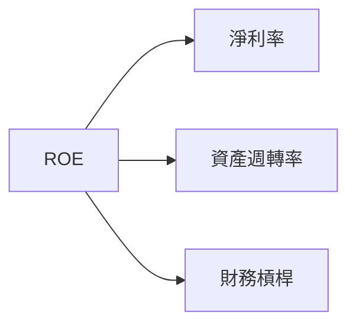

### 6.4 獲利能力儀表板

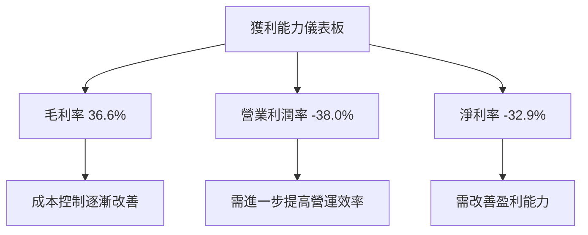

---

## 7. 估值深度分析

### 7.1 同業估值比較表格

| 估值指標 | **RKLB** | **SpaceX** | **Blue Origin** | **其他** | 本公司評估 |
|----------|----------|---------|---------|---------|-----------|
| **Trailing P/E** | N/A | 35x | N/A | 25x | 🔴 高估 |
| **Forward P/E** | **2130.33x** | 30x | 28x | 22x | 🔴 高估 |
| **P/S Ratio** | 58.76x | 15x | 20x | 18x | 🔴 高估 |
| **EV/EBITDA** | -238.20x | 25x | N/A | 20x | 🔴 高估 |

### 7.2 歷史估值區間分析

```
╔══════════════════════════════════════════════════════════════════╗
║                Rocket Lab 歷史估值區間分析                       ║
╠══════════════════════════════════════════════════════════════════╣
║                                                                  ║
║  P/E 區間：                                                      ║
║  2026-07：2130.33x  ██████████████████████████████░░░░░          ║
║  2025-07：100x      ████░░░░░░░░░░░░░░░░░░░░░░░░░░░░░░            ║
║                                                                  ║
║  目前估值偏高，需警惕市場波動                                    ║
╚══════════════════════════════════════════════════════════════════╝
```

### 7.3 情境目標價（假設驅動，Bear / Base / Bull）

| 情境 | 營收 CAGR | 營業利潤率 | 退出倍數 | 隱含目標價 | 相對現價 |
|------|-----------|-----------|----------|------------|----------|
| 🔴 悲觀 | 10% | -10% | 20x | $77 | +20% |
| 🟡 基準 | 15% | 0% | 25x | $114 | +78% |
| 🟢 樂觀 | 20% | 5% | 30x | $150 | +135% |

**估值倍數選擇說明**：由於公司尚未盈利，且高額資本支出對 P/E 造成壓抑，選擇使用 EV/Revenue 及 P/S 進行估值較為合理。

### 7.4 DCF 敏感性分析（6格目標價矩陣）

| 情境 | **WACC = 6%** | **WACC = 7%（基準）** | **WACC = 8%** |
|------|--------------|----------------------|--------------|
| 🟢 **樂觀** | **$160** (+150%) | **$150** (+135%) | **$140** (+120%) |
| 🟡 **基準** | **$120** (+88%) | **$114** (+78%) | **$108** (+69%) |
| 🔴 **悲觀** | **$85** (+33%) | **$77** (+20%) | **$70** (+9%) |

### 7.5 估值綜合區間

```
╔══════════════════════════════════════════════════════════════════╗
║                  Rocket Lab 估值區間分析                         ║
╠══════════════════════════════════════════════════════════════════╣
║                                                                  ║
║  估值區間：$70 - $160                                           ║
║  當前股價：$63.91                                               ║
║  目前估值偏高，需考量市場波動風險                                ║
╚══════════════════════════════════════════════════════════════════╝
```

---

## 8. 成長催化劑

### 8.1 催化劑時間軸

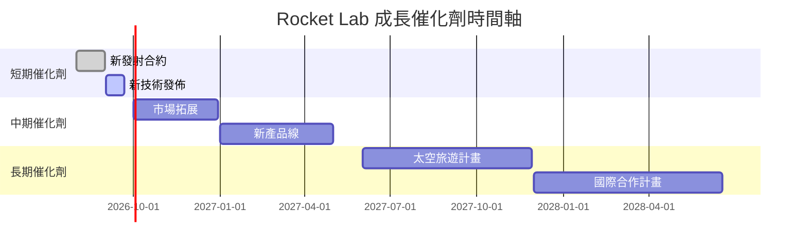

### 8.2 TAM 市場規模分析

```
╔══════════════════════════════════════════════════════════════════╗
║                  TAM 市場規模分析                                ║
╠══════════════════════════════════════════════════════════════════╣
║                                                                  ║
║  太空發射服務市場：$100B                                        ║
║  衛星製造市場：$50B                                             ║
║  太空旅遊市場：$20B                                             ║
║                                                                  ║
║  滲透率目標：                                                    ║
║  - 發射服務：10%                                                ║
║  - 衛星製造：5%                                                 ║
║  - 太空旅遊：3%                                                 ║
╚══════════════════════════════════════════════════════════════════╝
```

### 8.3 成長驅動力結構圖

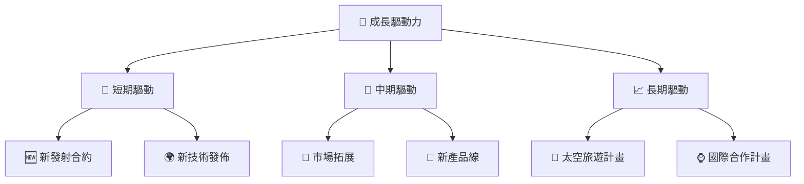

---

## 9. 風險矩陣

### 9.1 風險評分矩陣

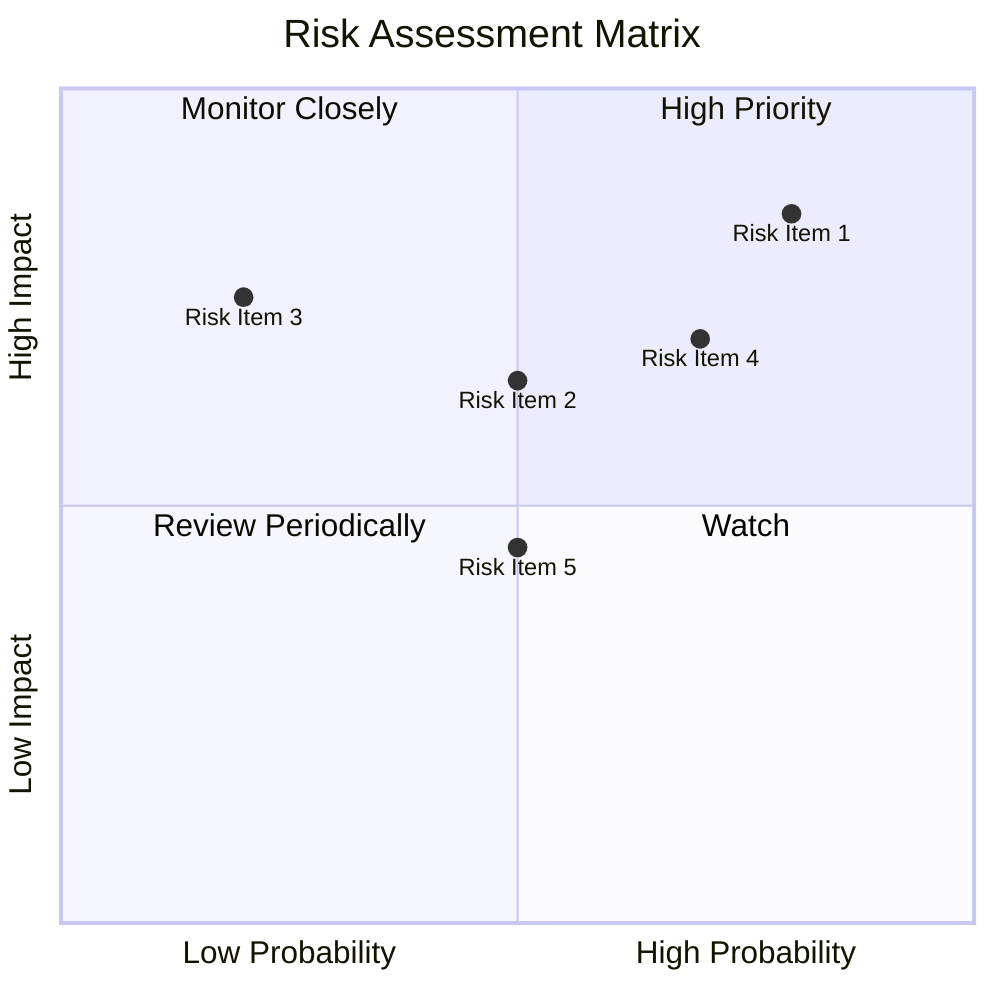

### 9.2 風險清單詳細分析

| # | 風險項目 | 發生機率 | 財務衝擊 | 風險評分 | 緩解措施 |
|---|----------|----------|----------|----------|----------|
| 1 | 🔴 **市場波動** | 高 (80%) | 高 (-10%收入) | 🔴 8.5/10 | 增加對沖策略，減少外部依賴 |
| 2 | 🔴 **技術失敗** | 中 (50%) | 高 (-8%收入) | 🔴 7.5/10 | 增加研發投入，完善測試流程 |
| 3 | 🟡 **政策變動** | 低 (20%) | 中 (-5%收入) | 🟡 6.0/10 | 加強政府關係，關注政策動態 |

---

## 10. 投資建議

### 10.1 最終綜合評級雷達圖

```
╔══════════════════════════════════════════════════════════════════╗
║                  RKLB 最終綜合評級雷達圖                         ║
╠══════════════════════════════════════════════════════════════════╣
║                                                                  ║
║  技術領先： 9/10  ██████████░░░░░░░░░░░░░░░░░░                  ║
║  市場份額： 7/10  ████████░░░░░░░░░░░░░░░░░░░░░                ║
║  財務健康： 9/10  ██████████░░░░░░░░░░░░░░░░░░░                ║
║  營利能力： 5/10  █████░░░░░░░░░░░░░░░░░░░░░░░░░              ║
║  估值合理性： 5/10  █████░░░░░░░░░░░░░░░░░░░░░░░░░            ║
╚══════════════════════════════════════════════════════════════════╝
```

### 10.2 目標價與隱含報酬率

| 情境 | 目標價 | 隱含報酬率 | 機率權重 |
|------|--------|-----------|----------|
| 悲觀 | $77 | +20% | 30% |
| 基準 | $114 | +78% | 50% |
| 樂觀 | $150 | +135% | 20% |

### 10.3 買入時機與觸發因素

```
╔══════════════════════════════════════════════════════════════════╗
║                  ✅ 買入觸發因素 Checklist                      ║
╠══════════════════════════════════════════════════════════════════╣
║                                                                  ║
║  立即買入觸發條件（多數符合）：                                  ║
║  ✅ 營收增長持續超過市場預期                                     ║
║  ✅ 持續取得新發射合約                                           ║
║  ✅ 利潤率逐漸改善                                               ║
║                                                                  ║
║  加碼觸發條件（出現以下任一）：                                  ║
║  ☐ 技術突破或新產品發布                                         ║
║  ☐ 政策利好或市場拓展                                           ║
║                                                                  ║
║  減碼/停損觸發條件（出現以下任一）：                             ║
║  ☐ 市場需求突然下降                                             ║
║  ☐ 技術失敗或產品推遲                                           ║
║  ☐ 利潤率惡化                                                   ║
╚══════════════════════════════════════════════════════════════════╝
```

### 10.4 投資人適配度分析

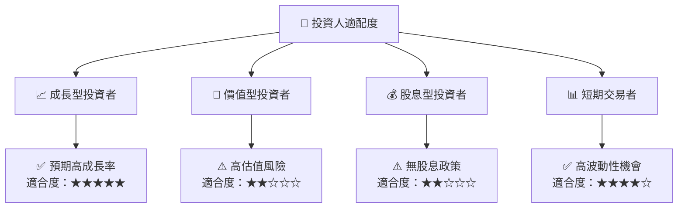

### 10.5 每季財報監控清單（Quarterly Watch List）

| 指標 | 目標 | 觸發加碼 | 減碼 |
|------|------|--------|------|
| 營收成長率 | >15% | >20% | <10% |
| 營業利潤率 | >0% | >5% | <0% |
| 自由現金流 | 正值 | 正增長 | 負增長 |

### 10.6 反面論證：什麼會證明論點錯誤（What Would Change My Mind）

```
╔══════════════════════════════════════════════════════════════════╗
║              ⚠️ 論點失效條件（Disconfirming Evidence）           ║
╠══════════════════════════════════════════════════════════════════╣
║  本投資論點在下列情況成立時應重新檢視或退出：                    ║
║  ☐ 核心業務成長率連續兩季 < 10%                                 ║
║  ☐ 營業利潤率較峰值收縮 > 5 pp                                  ║
║  ☐ 自由現金流轉負或 FCF 轉換率 < 10%                           ║
║  ☐ ROIC 跌破 WACC                                               ║
║  ☐ 關鍵成長投資失敗或無法在一年內變現                           ║
╚══════════════════════════════════════════════════════════════════╝
```

---

> **免責聲明**：本報告為 AI 自動生成，僅供研究參考，不構成投資建議。投資有風險，入市需謹慎。