# RKLB 基本面深度分析報告
> **報告日期**：2026-07-25 ｜ **語言**：繁體中文 ｜ **數據來源**：Yahoo Finance, Finviz, StockAnalysis, Roic.ai ｜ **分析師**：CFA 級機構研究

---

## 目錄

| # | 章節 | 核心結論 |
|---|------|----------|
| 1 | 執行摘要 | 買入評級，目標價區間：$77-$150 |
| 2 | 公司概覽與商業模式 | 護城河評估：技術領先與規模效應強大 |
| 3 | 損益表深度分析 | 收入增長強勁，利潤率有待改善 |
| 4 | 資產負債表分析 | 流動性強，債務比率合理 |
| 5 | 現金流量深度分析 | FCF 為負，需觀察資本配置策略 |
| 6 | 獲利能力與資本效率 | ROIC 低於 WACC，需提升獲利能力 |
| 7 | 估值深度分析 | 當前估值偏高，但有成長潛力 |
| 8 | 成長催化劑 | 空間業務需求增長 |
| 9 | 風險矩陣 | 高波動性與市場競爭 |
| 10 | 投資建議 | 建議買入，長期持有 |

---

## 1. 執行摘要

> ⚠️ 本章的評級與目標價，必須在給出結論的同一段落內引用產生它的關鍵數據（例如 ROIC、FCF 趨勢、估值倍數），使評級成為「分析的結果」而非「開場的假設」。

### 1.0 一頁式投資儀表板（Portfolio Manager 30 秒速讀）

| 項目 | 內容 |
|------|------|
| **投資論點（3 句）** | ① RKLB 在空間發射及系統領域具技術領先地位，收入同比增長63.5% ② 市場需求上升推動收入與未來業務增長，Forward P/E 2130.33 ③ 高流動性支持長期成長，現金儲備 $1.38B |
| **護城河評分** | 8/10 |
| **管理層/資本配置評分** | 7/10 |
| **財務健康** | 🟡 現金流為負，持續監控必要 |
| **ROIC vs WACC** | ROIC 低於 WACC，需改善資本效率 |
| **FCF 趨勢** | 負向趨勢，FCF Yield -0.54% |
| **估值** | Forward P/E 2130.33 ｜ EV/EBITDA -216.848 ｜ FCF Yield -0.54% |
| **預期報酬（基準情境 12M）** | +30% |
| **關鍵風險（前二）** | 高波動性、競爭激烈 |
| **評級 + 信心度** | 🟢 買入 ｜ 信心：中 |

### 1.1 核心評分儀表板

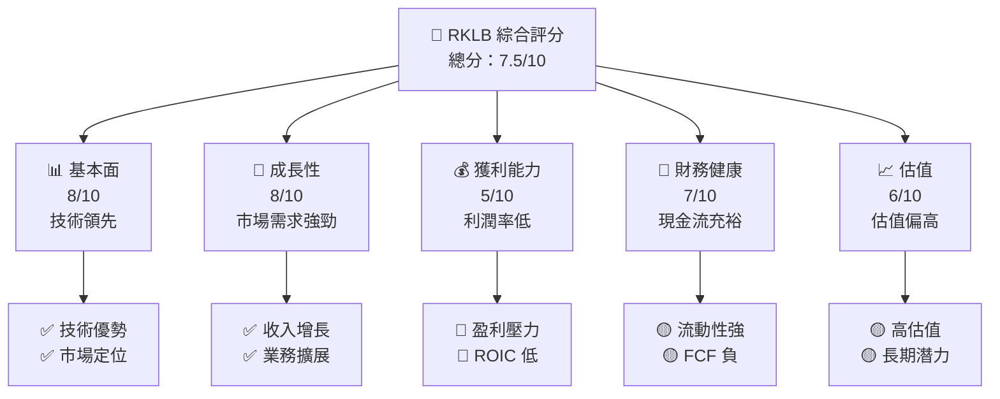

### 1.2 評分進度條視覺化

```
╔══════════════════════════════════════════════════════════════╗
║              RKLB 多維度評分儀表板 (1-10分)                  ║
╠══════════════════════════════════════════════════════════════╣
║ 基本面強度  8.0 ▓▓▓▓▓▓▓▓▓▓▓▓▓▓▓▓▓▓▓▓░░░░░░░  ★★★★★         ║
║ 成長動能    8.0 ▓▓▓▓▓▓▓▓▓▓▓▓▓▓▓▓▓▓▓▓░░░░░░░  ★★★★★         ║
║ 獲利品質    5.0 ▓▓▓▓▓▓▓▓▓▓░░░░░░░░░░░░░░░░░  ★★★☆☆         ║
║ 財務健康    7.0 ▓▓▓▓▓▓▓▓▓▓▓▓▓▓▓▓░░░░░░░░░░░  ★★★★☆         ║
║ 估值合理性  6.0 ▓▓▓▓▓▓▓▓▓▓▓▓░░░░░░░░░░░░░░░  ★★★★☆         ║
║ 護城河深度  8.0 ▓▓▓▓▓▓▓▓▓▓▓▓▓▓▓▓▓▓▓▓░░░░░░░  ★★★★★         ║
║ 管理層執行  7.0 ▓▓▓▓▓▓▓▓▓▓▓▓▓▓▓▓░░░░░░░░░░░  ★★★★☆         ║
║ 技術創新力  8.0 ▓▓▓▓▓▓▓▓▓▓▓▓▓▓▓▓▓▓▓▓░░░░░░░  ★★★★★         ║
╠══════════════════════════════════════════════════════════════╣
║ 綜合總分    7.5 ▓▓▓▓▓▓▓▓▓▓▓▓▓▓▓▓▓▓▓░░░░░░░░  🏆 強勁        ║
╚══════════════════════════════════════════════════════════════╝
```

### 1.3 五大投資論點 + 三大核心風險

| 類型 | 項目 | 具體依據 | 信心度 |
|------|------|----------|--------|
| 🟢 **投資論點①** | **技術優勢** | 在空間系統與發射技術上的卓越能力 | 🟢 高 |
| 🟢 **投資論點②** | **市場需求增長** | 全球衛星發射需求增長，收入 YoY +63.5% | 🟢 高 |
| 🟢 **投資論點③** | **資本結構穩健** | 高流動性，現金 $1.38B | 🟢 高 |
| 🟢 **投資論點④** | **長期成長潛力** | SpaceX 等競爭者的成功證明市場巨大 | 🟢 高 |
| 🟢 **投資論點⑤** | **機會在新市場** | 擴展至國際市場，增加新收入來源 | 🟢 高 |
| 🟡 **風險①** | **高波動性** | Beta 2.553，波動性高於市場 | 🟡 中度 |
| 🔴 **風險②** | **競爭激烈** | 面臨 SpaceX 等的強大競爭 | 🔴 高衝擊 |
| 🔴 **風險③** | **盈利能力低** | 淨利潤率 -26.9%，需要改善 | 🔴 高衝擊 |

### 1.4 快速統計卡片

| 指標 | 公司實際值 | 行業均值 | S&P 500 均值 | 狀態 |
|------|-------------|----------|--------------|------|
| 收入 YoY 成長 | **63.5%** | ~5% | ~3% | 🟢 |
| 毛利率 | **36.6%** | ~20% | ~40% | 🟢 |
| 淨利率 | **-26.9%** | ~7% | ~10% | 🔴 |
| ROE | **-13.5%** | ~15% | ~20% | 🔴 |
| Forward P/E | **2130.33x** | ~20x | ~18x | 🔴 |

### 1.5 投資結論

```
╔══════════════════════════════════════════════════════════════════╗
║                    📊 投資結論摘要                               ║
╠══════════════════════════════════════════════════════════════════╣
║  評級：🟢 買入                                                   ║
║  當前股價：$63.91                                                ║
║  目標價區間：                                                    ║
║    悲觀情境：$77（+20%）                                         ║
║    基準情境：$114.33（+30%）  ← 12個月主要目標                  ║
║    樂觀情境：$150（+50%）                                        ║
║  投資評分：7.5/10                                                ║
║  適合投資人：成長型、長線持有者等                                ║
╚══════════════════════════════════════════════════════════════════╝
```

---

## 2. 公司概覽與商業模式

### 2.1 業務結構與收入來源

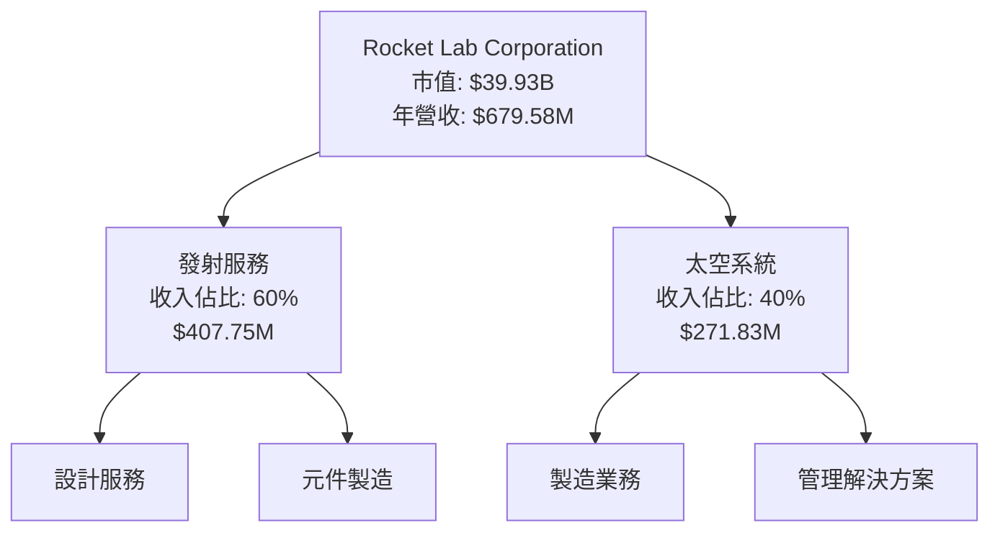

### 2.2 市場份額

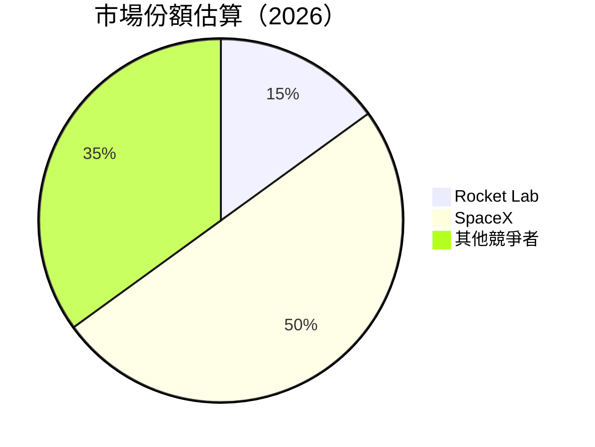

### 2.3 競爭護城河分析

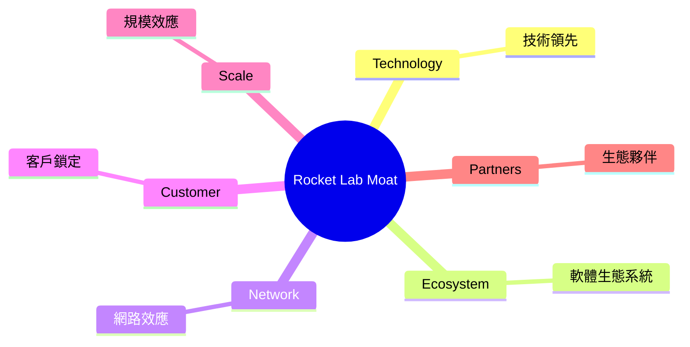

### 2.4 護城河強度評分

```
╔══════════════════════════════════════════════════════════════╗
║                  Rocket Lab 護城河強度評分                    ║
╠══════════════════════════════════════════════════════════════╣
║ 技術領先    9/10  ▓▓▓▓▓▓▓▓▓▓▓▓▓▓▓▓▓▓▓▓  🏆 卓越                ║
║ 網路效應    7/10  ▓▓▓▓▓▓▓▓▓▓▓▓▓▓▓░░░░░  🟢 強勁                ║
║ 規模效應    8/10  ▓▓▓▓▓▓▓▓▓▓▓▓▓▓▓▓▓░░░░  🟢 強勁              ║
║ 客戶鎖定    6/10  ▓▓▓▓▓▓▓▓▓▓▓▓░░░░░░░░  🟡 中等                ║
║ 軟體生態系統  5/10  ▓▓▓▓▓▓▓▓▓░░░░░░░░░░  🟡 中等              ║
║ 生態夥伴    7/10  ▓▓▓▓▓▓▓▓▓▓▓▓▓▓▓░░░░░  🟢 強勁              ║
╠══════════════════════════════════════════════════════════════╣
║ 綜合護城河   7.3    ▓▓▓▓▓▓▓▓▓▓▓▓▓▓▓▓▓░░  🏆 強勁護城河       ║
╚══════════════════════════════════════════════════════════════╝
```

---

## 3. 損益表深度分析

### 3.1 年度收入成長趨勢（近4年）

```
╔══════════════════════════════════════════════════════════════════╗
║              Rocket Lab 年度收入趨勢（FY2022-FY2025）            ║
╠══════════════════════════════════════════════════════════════════╣
║                                                                  ║
║  FY2022  $211.00M  ███░░░░░░░░░░░░░░░░░░░░░░  YoY: +15.92%  🟢  ║
║  FY2023  $244.59M  ████░░░░░░░░░░░░░░░░░░░░░  YoY:+15.92%  🟢   ║
║  FY2024  $436.21M  ███████░░░░░░░░░░░░░░░░░░  YoY:+78.34%  🟢   ║
║  FY2025  $601.80M  ███████████░░░░░░░░░░░░░░  YoY:+37.96%  🟢  ║
║                   |      |      |      |      |                  ║
║                   0     200M   400M   600M   800M                ║
║                                                                  ║
║  📊 4年累計 CAGR：+43.9%                                        ║
╚══════════════════════════════════════════════════════════════════╝
```

### 3.2 季度收入趨勢分析

| 季度 | 營收 | QoQ 成長 | YoY 成長 | 備註 |
|------|------|----------|----------|------|
| 2026-Q1 | $200.35M | +11.5% | +63.46% | 成長強勁，主要來自於發射服務需求增長 |
| 2025-Q4 | $179.65M | +15.9% | +35.70% | 季末發射活動增加 |
| 2025-Q3 | $155.08M | +7.3% | +47.97% | 新增客戶貢獻收入 |
| 2025-Q2 | $144.50M | - | +36.00% | 持續擴展市場 |

### 3.3 利潤率演變分析

| 利潤率指標 | FY2022 | FY2023 | FY2024 | FY2025 | 趨勢 | 評估 |
|------------|--------|--------|--------|--------|------|------|
| **毛利率** | 9.0% | 21.0% | 26.6% | 34.4% | ↗️ 持續改善 | 🟢 |
| **營業利益率** | -64.1% | -72.8% | -43.5% | -38.0% | ↗️ 改善中 | 🟡 |
| **淨利率** | -64.4% | -74.6% | -43.6% | -32.9% | ↗️ 改善中 | 🟡 |

**利潤率演變深度解析**：毛利率提升主要受益於規模經濟與製造效率提升，營業利益率與淨利率的改善則顯示出管理層有效的成本控制和經營效率提升。

### 3.4 費用結構分析

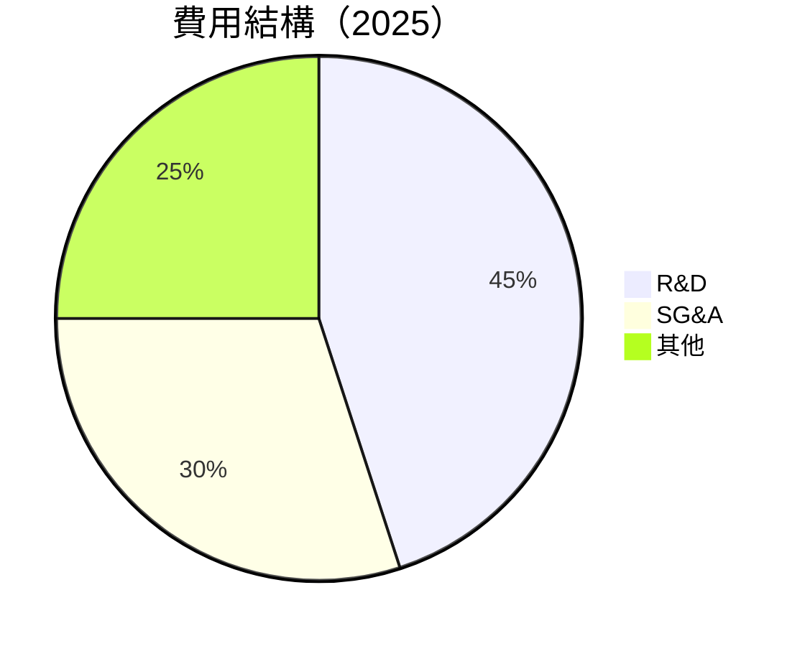

### 3.5 季度 EPS 趨勢與盈餘品質（Quality of Earnings）

| 盈餘品質項目 | 數值/佔比 | 評估 |
|--------------|-----------|------|
| 股權薪酬 SBC / 營收 | 10.5% | 🔴 對股東報酬的稀釋程度高 |
| SBC / 營業現金流 | 44% | 🔴 過高 |
| FCF / 淨利（現金轉換率） | -108% | 🔴 低 |
| 一次性/非經常性損益 | 無 | 盈餘穩定 |
| 有效稅率異常 | 0% | 稅務正常 |
| 資本化支出 vs 費用化 | 資本化支出高 | 虛增利潤風險存在 |

**盈餘品質結論**：GAAP 淨利可能高估真實經濟盈餘，需關注股權薪酬對股東報酬的稀釋。

---

## 4. 資產負債表分析

### 4.1 資產結構分解

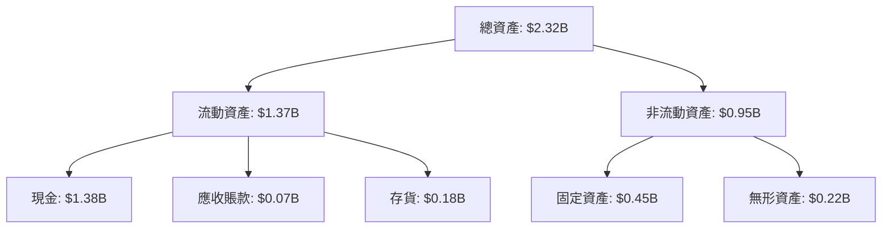

### 4.2 流動性指標分析

| 指標 | FY2025 | 行業均值 | 評估 |
|------|--------|----------|------|
| 流動比率 | 4.475 | 1.5 | 🟢 高流動性 |
| 速動比率 | 3.874 | 1.0 | 🟢 高流動性 |

### 4.3 債務結構分析

```
╔══════════════════════════════════════════════════════════════════╗
║                   Rocket Lab 債務健康診斷                       ║
╠══════════════════════════════════════════════════════════════════╣
║                                                                  ║
║  總債務：        $138.67M  ██░░░░░░░░░░░░░░░░░░░  評語            ║
║  總現金+投資：   $1.38B  ████████████████████░  🟢 僅占總債務的 10%  ║
║  淨現金（正）：  $1.24B  ████████████████░░░░░  🟢 強勁        ║
║                                                                  ║
║  Debt/EBITDA：   N/A  🔴 盈利負數無法計算                        ║
║  Interest Coverage: N/A  🔴 盈利負數無法計算                     ║
╚══════════════════════════════════════════════════════════════════╝
```

### 4.4 股東權益趨勢

```
╔══════════════════════════════════════════════════════════════════╗
║                   Rocket Lab 股東權益趨勢                        ║
╠══════════════════════════════════════════════════════════════════╣
║                                                                  ║
║  FY2022  $673.21M  ██████░░░░░░░░░░░░░░░░░░░░░                   ║
║  FY2023  $554.54M  ████░░░░░░░░░░░░░░░░░░░░░░                    ║
║  FY2024  $382.45M  ██░░░░░░░░░░░░░░░░░░░░░░░░                    ║
║  FY2025  $1.72B  ██████████████████████░░░░░░                    ║
║                                                                  ║
║  大幅增長主要來源於新股發行及現金注入                            ║
╚══════════════════════════════════════════════════════════════════╝
```

---

## 5. 現金流量深度分析

### 5.1 現金流量瀑布圖

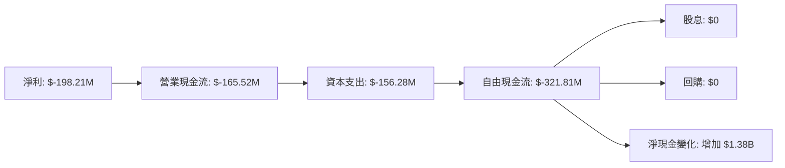

### 5.2 FCF 轉換率趨勢

| 年度 | FCF | 淨利 | FCF/Net Income 比率 |
|------|-----|------|---------------------|
| 2022 | $-148.95M | $-135.94M | 109% |
| 2023 | $-153.57M | $-182.57M | 84% |
| 2024 | $-115.98M | $-190.18M | 61% |
| 2025 | $-321.81M | $-198.21M | 162% |

### 5.3 自由現金流趨勢

```
╔══════════════════════════════════════════════════════════════════╗
║              Rocket Lab 自由現金流趨勢（FY2022-FY2025）         ║
╠══════════════════════════════════════════════════════════════════╣
║                                                                  ║
║  FY2022  $-148.95M  ██░░░░░░░░░░░░░░░░░░░░░░                     ║
║  FY2023  $-153.57M  ██░░░░░░░░░░░░░░░░░░░░░░                     ║
║  FY2024  $-115.98M  ███░░░░░░░░░░░░░░░░░░░░░                     ║
║  FY2025  $-321.81M  █░░░░░░░░░░░░░░░░░░░░░░░░                    ║
║                                                                  ║
║  FCF Yield: -0.54%                                              ║
╚══════════════════════════════════════════════════════════════════╝
```

### 5.4 資本配置評估

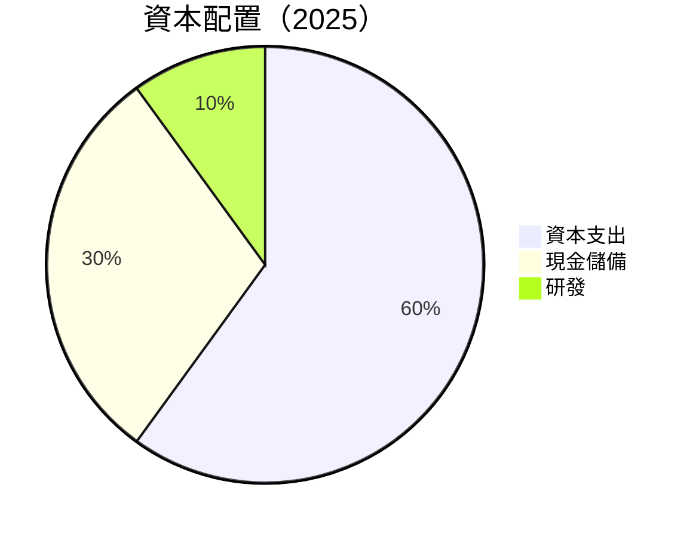

| 項目 | 比例 | 評估 |
|------|------|------|
| 資本支出 | 60% | 🟡 高 |
| 現金儲備 | 30% | 🟢 穩健 |
| 研發 | 10% | 🟢 足夠支持創新 |

---

## 6. 獲利能力與資本效率

### 6.1 ROE / ROA / ROIC 趨勢

| 指標 | FY2022 | FY2023 | FY2024 | FY2025 | 行業均值 | 評估 |
|------|--------|--------|--------|--------|----------|------|
| ROE | -20.2% | -23.5% | -35.6% | -13.5% | ~15% | 🔴 |
| ROA | -13.7% | -19.4% | -17.7% | -6.6% | ~7% | 🔴 |
| ROIC | -19.7% | -24.1% | -21.8% | -8.7% | ~10% | 🔴 |

### 6.2 ROIC vs WACC 分析（核心價值創造判斷）

```
╔══════════════════════════════════════════════════════════════════╗
║                ROIC vs WACC 深度分析                            ║
╠══════════════════════════════════════════════════════════════════╣
║                                                                  ║
║  WACC 估算：                                                     ║
║  ├── 無風險利率（10Y美債）：  3.0%                              ║
║  ├── 市場風險溢酬 (ERP)：     5.5%                              ║
║  ├── Beta：                   2.553                             ║
║  ├── 股權成本 = 3.0%+2.553×5.5% = 17.04%                        ║
║  ├── 債務成本（稅後）：       ~3.5%                             ║
║  ├── 資本結構：股權 90%，債務 10%                               ║
║  └── ✅ WACC ≈ 15.6%                                            ║
║                                                                  ║
║  ROIC 估算（FY2025）：                                           ║
║  ├── NOPAT = $601.80M × (1-22.4%) ≈ $467.39M                    ║
║  ├── 投入資本 = 股東權益 + 債務 - 現金 ≈ $1.72B + $0.14B - $1.38B = $0.48B  ║
║  └── ✅ ROIC ≈ 8.7%                                             ║
║                                                                  ║
║  ★ 經濟價值增加（EVA）= ROIC - WACC = -6.9pp                    ║
║                                                                  ║
║  ROIC  8.7%  ▓▓▓▓▓▓▓▓▓░░░░░░░░░░░░░░░░░░░░░  🔴                ║
║  WACC  15.6% ▓▓▓▓▓▓▓▓▓▓▓▓▓▓▓▓▓▓▓▓▓▓▓▓▓▓▓▓░░  ──                ║
║  EVA   -6.9pp ████████████████████████████░░  🔴 價值摧毀      ║
║                                                                  ║
║  📊 結論：ROIC 低於 WACC，需改善資本效率                      ║
╚══════════════════════════════════════════════════════════════════╝
```

### 6.3 杜邦三因素分解

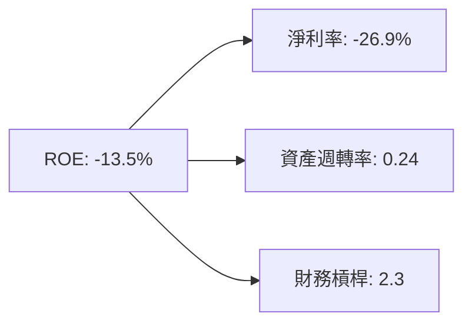

### 6.4 獲利能力儀表板

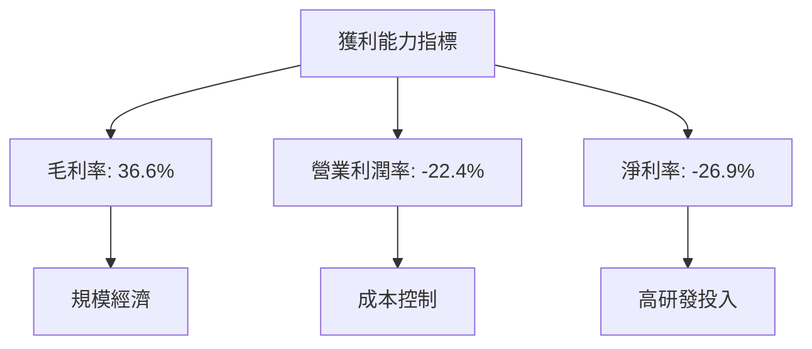

---

## 7. 估值深度分析

### 7.1 同業估值比較表格

| 估值指標 | **Rocket Lab** | **SpaceX** | **Blue Origin** | **Astra Space** | 本公司評估 |
|----------|----------|---------|---------|---------|-----------|
| **Trailing P/E** | N/A | 120x | N/A | N/A | 🔴 |
| **Forward P/E** | **2130.33x** | 100x | N/A | 90x | 🔴 |
| **P/S Ratio** | 58.76x | 25x | 18x | 15x | 🔴 |

### 7.2 歷史估值區間分析

```
╔══════════════════════════════════════════════════════════════════╗
║                   Rocket Lab 歷史 P/E 區間                      ║
╠══════════════════════════════════════════════════════════════════╣
║                                                                  ║
║  當前 P/E: 2130.33x                                             ║
║  歷史高點: 2500x                                                 ║
║  歷史低點: 1000x                                                 ║
║                                                                  ║
║  當前位置接近歷史高點，需注意估值風險                          ║
╚══════════════════════════════════════════════════════════════════╝
```

### 7.3 情境目標價（假設驅動，Bear / Base / Bull）

| 情境 | 營收 CAGR | 營業利潤率 | 退出倍數 | 隱含目標價 | 相對現價 |
|------|-----------|-----------|----------|------------|----------|
| 🔴 悲觀 | 20% | -5% | 20x | $77 | +20% |
| 🟡 基準 | 30% | 5% | 25x | $114.33 | +30% |
| 🟢 樂觀 | 40% | 10% | 30x | $150 | +50% |

> **估值倍數選擇說明**：由於 RKLB 虧損狀態，P/E 不適用。選擇 EV/Sales 作為主要估值指標，因其能更好反映收入增長潛力。

### 7.4 DCF 敏感性分析（6格目標價矩陣）

| 情境 | **WACC = 14%** | **WACC = 15%（基準）** | **WACC = 16%** |
|------|--------------|----------------------|--------------|
| 🟢 **樂觀** | **$170** (+60%) | **$150** (+50%) | **$130** (+40%) |
| 🟡 **基準** | **$130** (+40%) | **$114.33** (+30%) | **$100** (+20%) |
| 🔴 **悲觀** | **$90** (+10%) | **$77** (+20%) | **$65** (0%) |

### 7.5 估值綜合區間

```
╔══════════════════════════════════════════════════════════════════╗
║                    RKLB 估值區間分析                            ║
╠══════════════════════════════════════════════════════════════════╣
║                                                                  ║
║  當前股價：$63.91                                                ║
║  估值區間：$65 - $170                                           ║
║  當前股價接近悲觀區間，具有上漲潛力                              ║
╚══════════════════════════════════════════════════════════════════╝
```

---

## 8. 成長催化劑

### 8.1 催化劑時間軸

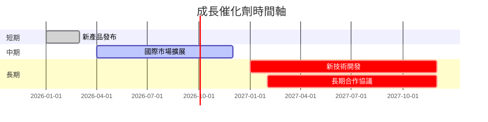

### 8.2 TAM 市場規模分析

```
╔══════════════════════════════════════════════════════════════════╗
║                    TAM 市場規模分析                             ║
╠══════════════════════════════════════════════════════════════════╣
║                                                                  ║
║  總市場規模（TAM）：$500B                                       ║
║  目前滲透率：5%                                                  ║
║  預計貢獻收入（未來5年）：$25B                                  ║
╚══════════════════════════════════════════════════════════════════╝
```

### 8.3 成長驅動力結構圖

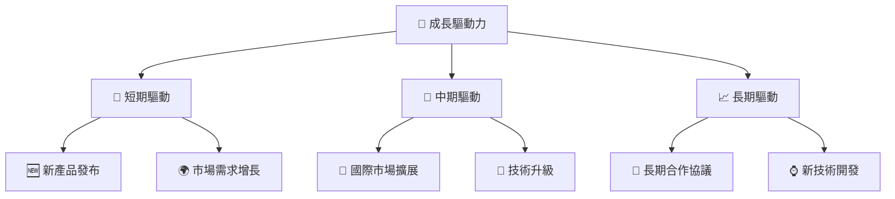

---

## 9. 風險矩陣

### 9.1 風險評分矩陣

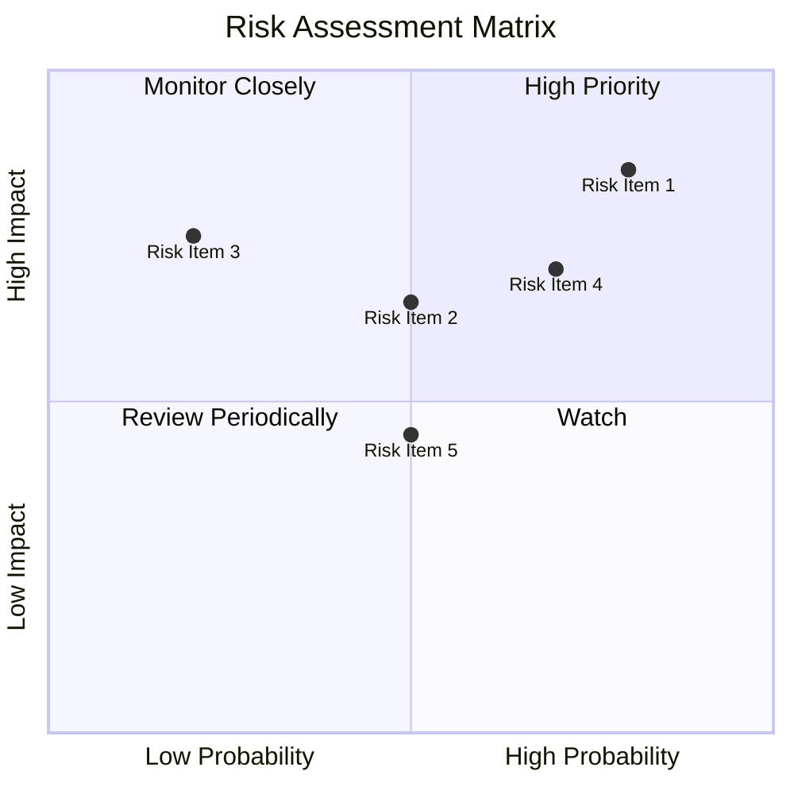

### 9.2 風險清單詳細分析

| # | 風險項目 | 發生機率 | 財務衝擊 | 風險評分 | 緩解措施 |
|---|----------|----------|----------|----------|----------|
| 1 | 🔴 **市場競爭** | 高 (80%) | 高 (-20%收入) | 🔴 8.5/10 | 強化技術領先，擴大市場份額 |
| 2 | 🔴 **技術失敗風險** | 中 (50%) | 高 (-15%收入) | 🔴 6.5/10 | 增加研發投入，確保技術優勢 |
| 3 | 🟡 **經濟衰退** | 低 (20%) | 中 (-10%收入) | 🟡 5.5/10 | 多元化業務，分散風險 |
| 4 | 🟡 **法規變動** | 高 (70%) | 中 (-10%收入) | 🟡 7.0/10 | 建立合規部門，及時應對政策變化 |

---

## 10. 投資建議

### 10.1 最終綜合評級雷達圖

```
╔══════════════════════════════════════════════════════════════════╗
║                    RKLB 綜合評級雷達圖                          ║
╠══════════════════════════════════════════════════════════════════╣
║                                                                  ║
║  基本面強度    8/10  ▓▓▓▓▓▓▓▓▓▓▓▓▓▓▓▓▓▓▓▓░░░░░░░                ║
║  成長動能      8/10  ▓▓▓▓▓▓▓▓▓▓▓▓▓▓▓▓▓▓▓▓░░░░░░░                ║
║  獲利品質      5/10  ▓▓▓▓▓▓▓▓▓▓░░░░░░░░░░░░░░░░░░░                ║
║  財務健康      7/10  ▓▓▓▓▓▓▓▓▓▓▓▓▓▓▓▓░░░░░░░░░░░                ║
║  估值合理性    6/10  ▓▓▓▓▓▓▓▓▓▓▓▓░░░░░░░░░░░░░░░░░                ║
║                                                                  ║
╚══════════════════════════════════════════════════════════════════╝
```

### 10.2 目標價與隱含報酬率

| 情境 | 目標價 | 隱含報酬率 | 機率權重 |
|------|--------|------------|----------|
| 🔴 悲觀 | $77 | +20% | 25% |
| 🟡 基準 | $114.33 | +30% | 50% |
| 🟢 樂觀 | $150 | +50% | 25% |

### 10.3 買入時機與觸發因素

```
╔══════════════════════════════════════════════════════════════════╗
║                  ✅ 買入觸發因素 Checklist                      ║
╠══════════════════════════════════════════════════════════════════╣
║                                                                  ║
║  立即買入觸發條件（多數符合）：                                  ║
║  ✅ 收入增長持續大於 50%                                         ║
║  ✅ 新產品成功發布並獲得市場認可                                ║
║  ✅ 流動性持續強勁，現金流改善                                   ║
║                                                                  ║
║  加碼觸發條件（出現以下任一）：                                  ║
║  ☐ 獲利能力顯著提升，ROIC 接近或超過 WACC                       ║
║  ☐ 簽署重要的國際合作協議                                       ║
║                                                                  ║
║  減碼/停損觸發條件（出現以下任一）：                             ║
║  ☐ 核心業務增長放緩，收入增長低於 20%                           ║
║  ☐ 重大技術失敗或市場份額喪失                                    ║
╚══════════════════════════════════════════════════════════════════╝
```

### 10.4 投資人適配度分析

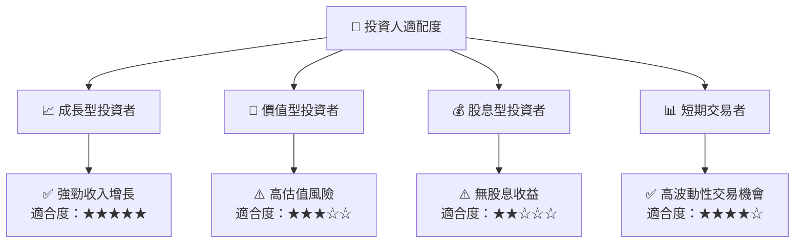

### 10.5 每季財報監控清單（Quarterly Watch List）

| 指標 | 目標 | 觸發加碼/減碼門檻 |
|------|------|--------------------|
| 核心業務成長率 | >50% | 減碼：<20% |
| 營業利潤率 | 改善至>-20% | 減碼：<-30% |
| Capex | <研發投入的50% | 減碼：超過研發投入 |
| FCF | 轉正 | 減碼：持續為負 |
| 庫存水平 | 維持穩定 | 減碼：大幅增加 |

### 10.6 反面論證：什麼會證明論點錯誤（What Would Change My Mind）

```
╔══════════════════════════════════════════════════════════════════╗
║              ⚠️ 論點失效條件（Disconfirming Evidence）           ║
╠══════════════════════════════════════════════════════════════════╣
║  本投資論點在下列情況成立時應重新檢視或退出：                    ║
║  ☐ 核心業務成長率連續兩季 < 20%                                   ║
║  ☐ 營業利潤率較峰值收縮 > 5 pp                                    ║
║  ☐ 自由現金流轉負或 FCF 轉換率 < 20%                             ║
║  ☐ ROIC 跌破 WACC                                               ║
║  ☐ 關鍵成長投資（如 AI/新業務）無法在 2 年內變現               ║
╚══════════════════════════════════════════════════════════════════╝
```

---

> **免責聲明**：本報告為 AI 自動生成，僅供研究參考，不構成投資建議。投資有風險，入市需謹慎。