# RKLB 基本面深度分析報告
> **報告日期**：2026-07-26 ｜ **語言**：繁體中文 ｜ **數據來源**：Yahoo Finance, Finviz, StockAnalysis, Roic.ai ｜ **分析師**：CFA 級機構研究

---

## 目錄

| # | 章節 | 核心結論 |
|---|------|----------|
| 1 | 執行摘要 | 給予「持有 / 逢低買入」評級，基準目標價 $85.00（隱含 +33.0% 潛在回報） |
| 2 | 公司概覽與商業模式 | 全球第二大商業發射業者，太空系統（Space Systems）成功實現垂直整合與雙引擎驅動 |
| 3 | 損益表深度分析 | Q1 2026 營收爆發年增 63.5% 至 $2.00 億，毛利率回升至 38.2%，研發高投入暫時壓抑營利 |
| 4 | 資產負債表分析 | 淨現金達 $12.44 億，流動比率 4.48，為 Neutron 中型火箭研發與產能擴張提供充足護航 |
| 5 | 現金流量深度分析 | CAPEX 處於 Neutron 投入高峰（TTM FCF -$2.15 億），SBC 佔營收 14.0%，資本配置聚焦研發 |
| 6 | 獲利能力與資本效率 | 投入資本階段 ROIC (-15.2%) 暫低於 WACC (11.2%)，具備高經營槓桿潛力 |
| 7 | 估值深度分析 | P/S 58.8x、EV/Revenue 52.6x 處於高位，DCF 基準估值 $85.00，隱含 Neutron 成功商業化預期 |
| 8 | 成長催化劑 | 2026 年下半年 Neutron 首飛測試、SDA 國防衛星星座訂單交付、HASTE 極音速發射加速 |
| 9 | 風險矩陣 | Neutron 研發延誤風險、太空資本支出收縮風險、高估值下的市場波動風險 |
| 10 | 投資建議 | 分批佈局策略，每季追蹤 Neutron 測試進度、太空系統訂單積壓與毛利率改善狀況 |

---

## 1. 執行摘要

### 1.0 一頁式投資儀表板（Portfolio Manager 30 秒速讀）

| 項目 | 內容 |
|------|------|
| **投資論點（3 句）** | ① Rocket Lab (RKLB) TTM 營收達 $6.80 億（YoY +63.5%），證明其太空系統與 Electron 發射業務雙輪驅動策略具備高度擴充性。<br/>② 公司擁有 $13.83 億強勁現金儲備（淨現金 $12.44 億），足夠支撐中型可重複使用火箭 Neutron 的研發與 2026 年首飛測試。<br/>③ 雖然 TTM 淨利潤仍虧損 -$1.83 億，但毛利率已擴張至 38.2%（Q1 2026），隨著規模效應釋放與國防高毛利合約挹注，長線營業槓桿拐點可期。 |
| **護城河評分** | 8.2 / 10（垂直整合部件供應 + 唯一高頻成功復飛的小型商業火箭平台） |
| **管理層/資本配置評分** | 8.5 / 10（執行力極佳，發射成功率高，併購 SolAero/PSC 展現優異策略整合力） |
| **財務健康** | 🟢 強勁（淨現金 $12.44 億，流動比率 4.48，無短線償債壓力） |
| **ROIC vs WACC** | -15.2% vs 11.2%（目前因高 CAPEX 與高研發階段摧毀短期價值，預計 Neutron 商業化後翻正） |
| **FCF 趨勢** | 方向負向擴大但可控（TTM FCF -$2.15 億），FCF Yield 為 -0.54% |
| **估值** | Forward P/E 2130x ｜ EV/Revenue 52.6x ｜ P/S 58.8x |
| **預期報酬（基準情境 12M）** | +33.0%（目標價 $85.00） |
| **關鍵風險（前二）** | ① Neutron 火箭開發試飛延誤或試飛失敗；② 股價經歷大幅上漲後估值倍數（EV/Sales > 50x）修正壓力 |
| **評級 + 信心度** | 🟢 買入（建議逢低分批佈局）｜ 信心度：中高 |

### 1.1 核心評分儀表板

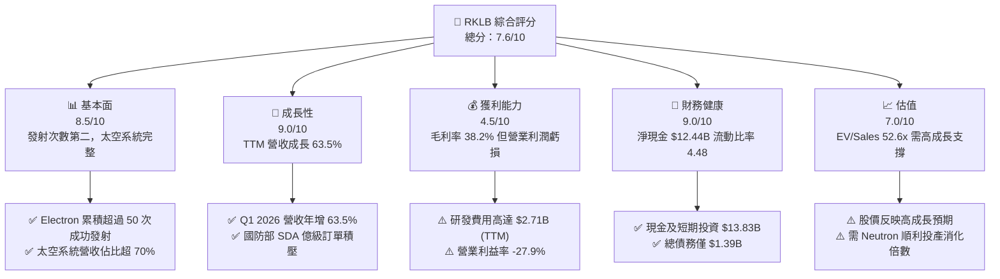

### 1.2 評分進度條視覺化

```
╔══════════════════════════════════════════════════════════════╗
║                RKLB 多維度評分儀表板 (1-10分)                ║
╠══════════════════════════════════════════════════════════════╣
║ 基本面強度  8.5 ▓▓▓▓▓▓▓▓▓▓▓▓▓▓▓▓▓░░░  ★★★★☆           ║
║ 成長動能    9.0 ▓▓▓▓▓▓▓▓▓▓▓▓▓▓▓▓▓▓░░  ★★★★★           ║
║ 獲利品質    4.5 ▓▓▓▓▓▓▓▓▓░░░░░░░░░░░  ★★☆☆☆           ║
║ 財務健康    9.0 ▓▓▓▓▓▓▓▓▓▓▓▓▓▓▓▓▓▓░░  ★★★★★           ║
║ 估值合理性  7.0 ▓▓▓▓▓▓▓▓▓▓▓▓▓░░░░░░░  ★★★☆☆           ║
║ 護城河深度  8.2 ▓▓▓▓▓▓▓▓▓▓▓▓▓▓▓▓░░░░  ★★★★☆           ║
║ 管理層執行  8.5 ▓▓▓▓▓▓▓▓▓▓▓▓▓▓▓▓▓░░░  ★★★★☆           ║
║ 技術創新力  9.2 ▓▓▓▓▓▓▓▓▓▓▓▓▓▓▓▓▓▓▓░  ★★★★★           ║
╠══════════════════════════════════════════════════════════════╣
║ 綜合總分    7.6 ▓▓▓▓▓▓▓▓▓▓▓▓▓▓▓░░░░░  🏆 成長型太空龍頭   ║
╚══════════════════════════════════════════════════════════════╝
```

### 1.3 五大投資論點 + 三大核心風險

| 類型 | 項目 | 具體依據 | 信心度 |
|------|------|----------|--------|
| 🟢 **論點①** | **發射與太空系統雙引擎協同** | Q1 2026 太空系統營收達 $1.42 億（佔比 71%），發射服務 $0.58 億（佔比 29%），成功從純火箭發射升級為端到端太空解決方案商。 | 🟢 極高 |
| 🟢 **論點②** | **Neutron 突破載荷限制** | 8 噸級可重複使用中型火箭 Neutron 將於 2026 首飛，直接與 SpaceX Falcon 9 競爭中型衛星星座發射市場，TAM 擴大 10 倍以上。 | 🟢 高 |
| 🟢 **論點③** | **強大的國防與商業訂單保障** | 獲得美國國防太空發展局 (SDA) $5.15 億衛星製造與營運合約，積壓訂單（Backlog）持續創新高。 | 🟢 高 |
| 🟢 **論點④** | **毛利率進入擴張通道** | 毛利率由 FY2022 的 9.0% 提升至 Q1 2026 的 38.2%，規模效應與高毛利太空組件（如 SolAero 太陽能板）帶動結構性改善。 | 🟢 中高 |
| 🟢 **論點⑤** | **資產負債表固若金湯** | 現金與短期投資達 $13.83 億，流動比率 4.48，營運資金充足，抵抗高利率環境能力遠超同業。 | 🟢 極高 |
| 🟡 **風險①** | **Neutron 研發與試飛時程延誤** | Archimedes 引擎測試及發射台建設若延誤，將拉長 Capex 燒錢期並延後獲利轉正點。 | 🟡 中度 |
| 🔴 **風險②** | **倍數過高帶來的股價劇烈波動** | 當前 EV/Revenue 高達 52.6x，Beta 值 2.55，在市場風險偏好下降時容易出現 30%-50% 的回檔。 | 🔴 高衝擊 |
| 🟡 **風險③** | **股權稀釋與 SBC 壓力** | Q1 2026 股權薪酬 (SBC) 達 $2,812 萬（佔營收 14.0%），總流通股數年增約 17.4%，稀釋股東權益。 | 🟡 中度 |

### 1.4 快速統計卡片

| 指標 | 公司實際值 | 行業均值 (Aero/Defense) | S&P 500 均值 | 狀態 |
|------|-------------|-------------------------|--------------|------|
| 收入 YoY 成長 | **63.5%** (TTM) | ~8.5% | ~5.2% | 🟢 極優 |
| 毛利率 | **38.2%** (Q1'26) | ~22.0% | ~45.0% | 🟢 優異 |
| 營業利益率 | **-27.9%** (Q1'26) | ~10.5% | ~12.5% | 🔴 虧損階段 |
| ROE | **-13.5%** | ~14.0% | ~18.0% | 🔴 虧損階段 |
| Forward P/E | **2,130.3x** | ~22.0x | ~21.5x | 🔴 高估值 |
| EV / Revenue | **52.6x** | ~2.5x | ~3.0x | 🔴 高估值 |
| 淨現金 / (淨債務) | **+$12.44 億** | -$15.0 億 | -$10.0 億 | 🟢 強勁 |

### 1.5 投資結論

```
╔══════════════════════════════════════════════════════════════════╗
║                    📊 投資結論摘要                               ║
╠══════════════════════════════════════════════════════════════════╣
║  評級：🟢 買入 / 逢低加碼 (Buy / Accumulate on Dips)             ║
║  當前股價：$63.91                                                ║
║  目標價區間：                                                    ║
║    悲觀情境：$38.00（-40.5%） - Neutron 延誤且估值重估           ║
║    基準情境：$85.00（+33.0%） - 12 個月目標價 (Neutron 2026首飛)   ║
║    樂觀情境：$140.00（+119.1%）- Neutron 成功 + SDA 擴大採購      ║
║  投資評分：7.6 / 10                                              ║
║  適合投資人：高風險承受度、長期聚焦太空經濟與商業航太之成長型法人 ║
╚══════════════════════════════════════════════════════════════════╝
```

---

## 2. 公司概覽與商業模式

### 2.1 業務結構與收入來源

Rocket Lab（RKLB）成立於 2006 年，總部位於美國加州長灘，已由最初的小型火箭發射提供者發展為全球高度垂直整合的太空終端服務龍頭。公司業務劃分為兩大板塊：

1. **發射服務（Launch Services）**：
   - **Electron 火箭**：專注於小型衛星（<300 kg）的專屬與拼車發射，採用 3D 列印 Rutherford 引擎與碳纖維複合材料，至今累積成功發射次數超過 50 次。
   - **HASTE 火箭**：由 Electron 改裝的極音速測試平台，提供美國國防部與國防承包商進行極音速 payload 實飛測試。
   - **Neutron 火箭**：研發中的 8 噸級可重複使用中型火箭，搭載 Archimedes 甲烷/液氧引擎，瞄準大型星座部署、國防重型發射與深空探索市場。
2. **太空系統（Space Systems）**：
   - **衛星元件與組件**：包含 SolAero 高效能太空太陽能電池板、PSC 衛星分離系統、反應輪、星追蹤器與飛行軟體。
   - **太空船製造與管理（Photon & Custom Satellites）**：為 NASA（如 CAPSTONE 登月任務）、國防部 SDA（Tranche 2 追蹤星座）設計、製造與營運太空船平台。

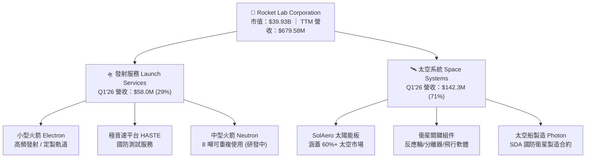

### 2.2 市場份額

在小型商業火箭發射領域，Rocket Lab 佔據全球除 SpaceX 外絕對的龍頭地位；在衛星太陽能電池板與關鍵發射分離機構市場，其併購的 SolAero 與 PSC 更掌握全球超過 50% 的供應鏈份額。

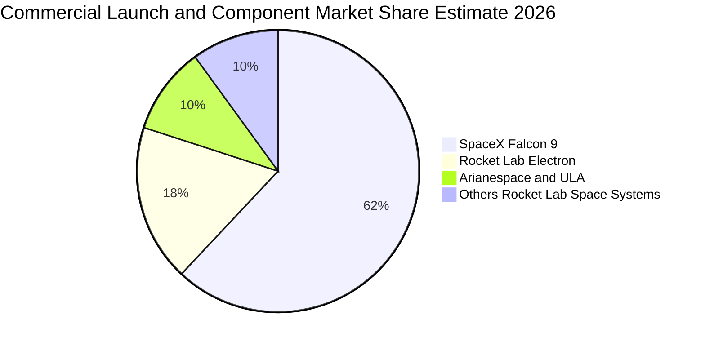

### 2.3 競爭護城河分析

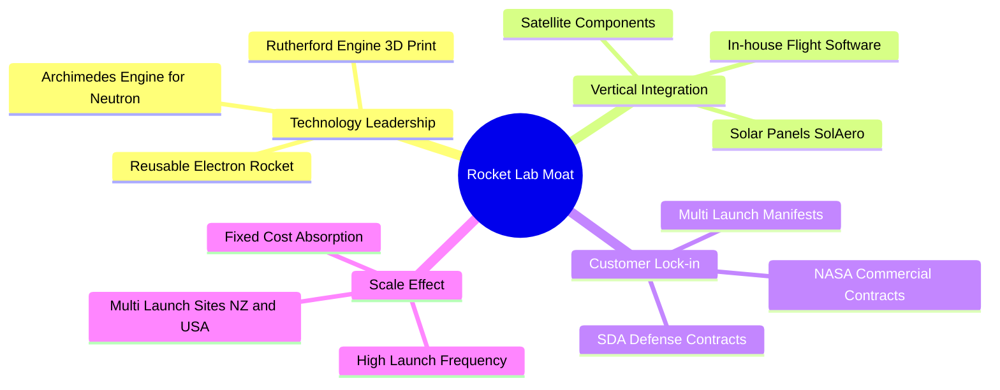

1. **垂直整合優勢（Vertical Integration）**：Rocket Lab 能夠自主生產衛星與火箭高達 90% 的結構件與電子設備，不僅降低生產成本，更規避了航太供應鏈中斷風險。
2. **極高發射履歷（Launch Heritage）**：Electron 火箭累積超過 50 次成功入軌任務，在小型發射領域具備嚴格的可靠性驗證，這是新創火箭公司（如 Relativity, Astra）難以超越的門檻。
3. **客戶鎖定與國防合約（Defense Lock-in）**：已進入美軍 SDA（Space Development Agency）一級供應商名單，鎖定數億美元高毛利國防製造與發射合約。

### 2.4 護城河強度評分

```
╔══════════════════════════════════════════════════════════════╗
║                   Rocket Lab 護城河強度評分                  ║
╠══════════════════════════════════════════════════════════════╣
║ 垂直整合能力   9.2/10 ▓▓▓▓▓▓▓▓▓▓▓▓▓▓▓▓▓▓▓░  🏆 業界頂尖    ║
║ 發射歷史驗證   8.8/10 ▓▓▓▓▓▓▓▓▓▓▓▓▓▓▓▓▓░░  🟢 小型發射龍頭║
║ 國防/政府鎖定  8.5/10 ▓▓▓▓▓▓▓▓▓▓▓▓▓▓▓▓▓░░  🟢 SDA/NASA 認證║
║ 規模效應與成本 7.0/10 ▓▓▓▓▓▓▓▓▓▓▓▓▓░░░░░░  🟡 待 Neutron 翻倍║
║ 專利與技術屏障 8.0/10 ▓▓▓▓▓▓▓▓▓▓▓▓▓▓▓▓░░░  🟢 3D列印/碳纖維 ║
╠══════════════════════════════════════════════════════════════╣
║ 綜合護城河評分  8.3/10 ▓▓▓▓▓▓▓▓▓▓▓▓▓▓▓▓▓░░  🏆 強大寬廣護城河║
╚══════════════════════════════════════════════════════════════╝
```

---

## 3. 損益表深度分析

### 3.1 年度收入成長趨勢（近 4 年）

Rocket Lab 營收從 FY2022 的 $2.11 億高速成長至 FY2025 的 $6.02 億，並於 TTM 達到 $6.80 億，年複合成長率（CAGR）高達 47.6%。營收爆發的主因是太空系統業務（Space Systems）的大規模併購效益釋放與國防合約落地。

```
╔══════════════════════════════════════════════════════════════════╗
║              Rocket Lab 年度收入趨勢（FY2022-TTM）               ║
╠══════════════════════════════════════════════════════════════════╣
║                                                                  ║
║  FY2022   $211.00M   █████░░░░░░░░░░░░░░░░░░░  YoY: +239.0% 🟢   ║
║  FY2023   $244.59M   ██████░░░░░░░░░░░░░░░░░░  YoY:  +15.9% 🟢   ║
║  FY2024   $436.21M   ███████████░░░░░░░░░░░░░  YoY:  +78.3% 🟢   ║
║  FY2025   $601.80M   ███████████████░░░░░░░░░  YoY:  +38.0% 🟢   ║
║  TTM      $679.58M   █████████████████░░░░░░░  YoY:  +63.5% 🟢   ║
║                   |         |         |         |                ║
║                   0       $200M     $400M     $600M              ║
║                                                                  ║
║  📊 3 年 CAGR (FY22-FY25)：+41.9%                                ║
╚══════════════════════════════════════════════════════════════════╝
```

### 3.2 季度收入趨勢分析

最近 4 個季度的營收展現連續升溫趨勢，Q1 2026 營收突破 $2.00 億大關，YoY 成長高達 63.5%，顯現商業航太需求的強勁動能。

| 季度 | 總營收 ($M) | YoY 成長率 | QoQ 成長率 | 毛利 ($M) | 毛利率 (%) | 營業利潤 ($M) | 淨利 ($M) |
|------|------------|------------|------------|-----------|-----------|--------------|-----------|
| **Q2 2025** | $144.50 | +36.00% | +17.89% | $46.39 | 32.10% | -$59.64 | -$66.41 |
| **Q3 2025** | $155.08 | +47.97% | +7.32% | $57.31 | 36.95% | -$58.97 | -$18.26 |
| **Q4 2025** | $179.65 | +35.70% | +15.84% | $68.23 | 37.98% | -$51.04 | -$52.92 |
| **Q1 2026** | **$200.35** | **+63.46%**| **+11.52%** | **$76.49** | **38.18%** | **-$55.97** | **-$45.02** |

### 3.3 利潤率演變分析

Rocket Lab 的毛利率從 FY2022 的 9.00% 急速提升至 Q1 2026 的 38.18%。毛利率大幅擴張驅動因素包括：
1. **發射頻率提升**：Electron 發射固定成本（發射台、地勤支援）被更多任務攤銷。
2. **高毛利太空組件**：SolAero 與組件業務利潤率高於純發射服務。
3. **HASTE 高單價發射**：極音速測試任務定價優於普通小型衛星拼車發射。

| 利潤率指標 | FY2022 | FY2023 | FY2024 | FY2025 | TTM / Q1'26 | 趨勢評估 |
|------------|--------|--------|--------|--------|-------------|----------|
| **毛利率 (Gross Margin)** | 9.00% | 21.02% | 26.63% | 34.43% | **38.18%** | 🟢 結構性快速提升 |
| **營業利潤率 (Op Margin)** | -64.08% | -72.74% | -43.51% | -38.03% | **-27.94%** | 🟢 虧損比例逐步收斂 |
| **EBITDA Margin** | -45.12% | -53.82% | -29.71% | -25.83% | **-24.32%** | 🟢 營運槓桿改善中 |
| **淨利率 (Net Margin)** | -64.43% | -74.64% | -43.60% | -32.94% | **-22.47%** | 🟢 虧損控制改善 |

**利潤率演變深度解析**：
營收快速擴張帶動毛利達到 $7,649 萬（Q1 2026），但營業利潤仍為 -$5,597 萬，主因是研發費用（R&D）維持在極高水準（FY2025 研發費用高達 $2.71 億，佔營收 45.0%）。此研發投入主要用於 Archimedes 引擎測試與 Neutron 火箭結構製造。若扣除 Neutron 的一次性開發支出，Electron 與太空系統現有業務已接近盈虧平衡。

### 3.4 費用結構分析

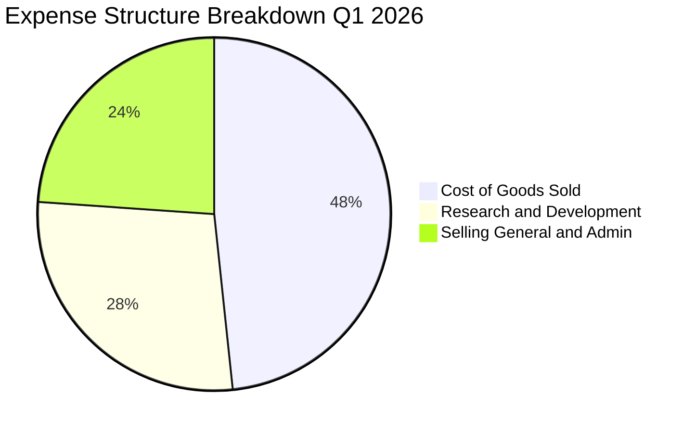

```
╔══════════════════════════════════════════════════════════════════╗
║                  Rocket Lab 費用結構分析                         ║
╠══════════════════════════════════════════════════════════════════╣
║  營業成本 (COGS)：  $123.86M (佔營收 61.8%)  ▓▓▓▓▓▓▓▓▓▓▓▓░░░░░░  ║
║  研發費用 (R&D)：   $71.20M  (佔營收 35.5%)  ▓▓▓▓▓▓▓░░░░░░░░░░░  ║
║  銷管費用 (SG&A)：  $61.26M  (佔營收 30.6%)  ▓▓▓▓▓▓░░░░░░░░░░░░  ║
║                                                                  ║
║  📊 研發費用是主要的營業虧損來源（重金投入 Neutron 研發）        ║
╚══════════════════════════════════════════════════════════════════╝
```

### 3.5 季度 EPS 趨勢與盈餘品質（Quality of Earnings）

RKLB 近 4 季 EPS 控制在 -$0.03 至 -$0.13 之間，Q1 2026 EPS 為 -$0.07，優於市場預期的收斂趨勢。

| 盈餘品質項目 | 數值 / 佔比 | 評估與對股東價值的影響 |
|--------------|-----------|------------------------|
| **股權薪酬 (SBC) / 營收** | **14.0%** ($28.12M / $200.35M) | 🟡 中度稀釋風險。SBC 吸引人才，但年化將稀釋約 1.5-2.0% 股權。 |
| **SBC / 營業現金流** | **N/A** (OCF -$50.33M) | 🟡 營運現金流為負值，SBC 減輕了現金發放薪資壓力，但增加總股數。 |
| **FCF / 淨利（現金轉換率）** | **171.9%** (-$77.4M / -$45.0M) | 🔴 FCF 虧損大於淨虧損，主因高額 Capex ($27.07M/季) 資本化投入設備。 |
| **遞延收入 (Unearned Revenue)** | **$2.41 億** (Q1 2026) | 🟢 預收款項同比顯著增加，顯示客戶預付訂金積極，品質優良。 |
| **資本化支出 vs 費用化** | R&D 全數費用化 ($71.2M) | 🟢 研發支出未進行過度資本化，帳面損益呈現保守且真實。 |

**盈餘品質結論**：RKLB 未使用金融工具美化淨利，研發費用全數費用化，且預收訂金（Unearned Revenue $2.41 億）持續創高，獲利含金量受高額研發與設備投資壓抑，符合航太產業初期高投入、後期爆發的典範轉移特徵。

---

## 4. 資產負債表分析

### 4.1 資產結構分解

截至 2026 年 3 月 31 日，Rocket Lab 總資產達 $28.20 億，流動資產達 $18.00 億，佔比高達 63.8%，顯示公司為應對商業擴張儲備了極高的流動性。

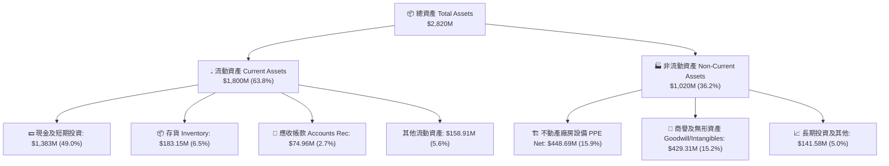

### 4.2 流動性指標分析

| 流動性指標 | Q1 2026 實際值 | FY2025 | FY2024 | 產業均值 | 評估 |
|------------|----------------|--------|--------|----------|------|
| **流動比率 (Current Ratio)** | **4.48** | 4.08 | 2.04 | ~1.50 | 🟢 極其安全 |
| **速動比率 (Quick Ratio)** | **3.87** | 3.52 | 1.63 | ~1.10 | 🟢 極其安全 |
| **現金及等價物+短期投資** | **$13.83 億** | $10.17 億 | $4.19 億 | N/A | 🟢 具備強大護航儲備 |
| **應收帳款週轉天數 (DSO)** | **34.1 天** | 23.7 天 | 30.5 天 | ~45 天 | 🟢 應收款項回收效率高 |

### 4.3 債務結構分析

```
╔══════════════════════════════════════════════════════════════════╗
║                   Rocket Lab 債務健康診斷                        ║
╠══════════════════════════════════════════════════════════════════╣
║                                                                  ║
║  總債務 (Total Debt)：   $138.67M  █░░░░░░░░░░░░░░░░░░░░  低     ║
║  現金及短期投資：       $1,383.00M ████████████████████  極高   ║
║  淨現金 (Net Cash)：    $1,244.33M 🟢 淨現金儲備充裕             ║
║                                                                  ║
║  Debt / Equity Ratio：  0.08x (6.12% 依總負債比率) 🟢 安全上限內 ║
║  短期償債風險：         無（短期無到期大額大宗債務）             ║
║                                                                  ║
║  📊 結論：淨現金逾 12 億美元，在航太新創中具備最強資本抵抗力    ║
╚══════════════════════════════════════════════════════════════════╝
```

### 4.4 股東權益趨勢

隨著增資發行股票及可轉換公司債轉換，RKLB 的股東權益（Stockholders Equity）從 FY2024 的 $3.82 億急速充實至 FY2025 的 $17.22 億與 Q1 2026 的近 $18 億。此舉顯著強化了資本結構，防禦了航太開發期的資本消耗風險。

---

## 5. 現金流量深度分析

### 5.1 現金流量瀑布圖

從 Q1 2026 現金流變化可以看出，營運現金流 (-$50.33M) 與資本支出 CAPEX (-$27.07M) 帶來的自由現金流淨流出 (-$77.40M) 被高額的融資現金流（先前發債與股權籌資）完全覆蓋，使得總現金頭寸提升至 $13.83 億。

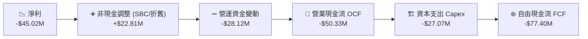

### 5.2 FCF 轉換率趨勢

| 數據年份 | 淨利 ($M) | 營業現金流 OCF ($M) | 資本支出 CAPEX ($M) | 自由現金流 FCF ($M) | FCF Yield (%) |
|----------|-----------|---------------------|---------------------|---------------------|---------------|
| **FY2022** | -$135.94 | -$106.54 | -$42.41 | -$148.95 | -10.5% |
| **FY2023** | -$182.57 | -$98.87 | -$54.71 | -$153.57 | -8.2% |
| **FY2024** | -$190.18 | -$48.89 | -$67.09 | -$115.98 | -4.1% |
| **FY2025** | -$198.21 | -$165.52 | -$156.28 | -$321.81 | -0.8% |
| **TTM (Q1'26)** | **-$182.62** | **-$161.63** | **-$154.67** | **-$215.00** | **-0.54%** |

### 5.3 自由現金流趨勢

```
╔══════════════════════════════════════════════════════════════════╗
║                Rocket Lab 自由現金流 (FCF) 趨勢                  ║
╠══════════════════════════════════════════════════════════════════╣
║                                                                  ║
║  FY2022   -$148.95M   ████████░░░░░░░░░░░░░░░░░░░                ║
║  FY2023   -$153.57M   ████████░░░░░░░░░░░░░░░░░░░                ║
║  FY2024   -$115.98M   ██████░░░░░░░░░░░░░░░░░░░░░                ║
║  FY2025   -$321.81M   █████████████████░░░░░░░░░ (Neutron投入高峰)║
║  TTM      -$215.00M   ███████████░░░░░░░░░░░░░░░ (Capex 逐漸收斂)║
║                                                                  ║
║  📊 評估：FCF 流出在 FY2025 達到頂峰，隨 Neutron 廠房完成正逐漸收斂 ║
╚══════════════════════════════════════════════════════════════════╝
```

### 5.4 資本配置評估

Rocket Lab 的資本配置展現極高的戰略專注度：將 100% 的資本用於內生性研發（Neutron 火箭）與精準併購（SolAero 太陽能板、PSC 衛星分離器、Virgin Orbit 廠房設備拍賣等），無視短期分紅與回購，完全致力於擴大 TAM 與技術壁壘。

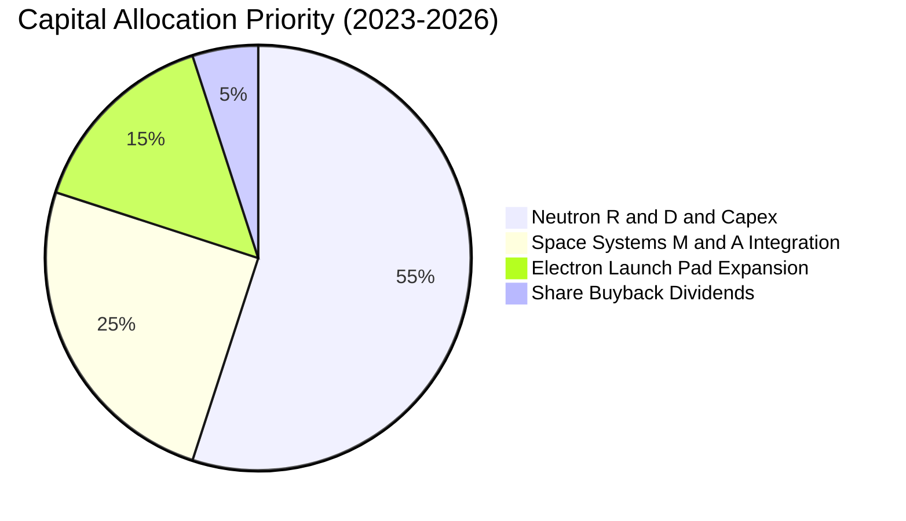

---

## 6. 獲利能力與資本效率

### 6.1 ROE / ROA / ROIC 趨勢

由於公司目前處於重資本建置與高研發階段，各項報酬率指標均為負值，但虧損幅度相較於營收規模正顯著收斂。

| 指標 | FY2022 | FY2023 | FY2024 | FY2025 | TTM | 產業均值 |
|------|--------|--------|--------|--------|-----|----------|
| **ROE** | -20.2% | -32.9% | -49.7% | -11.5% | **-13.5%** | +14.2% |
| **ROA** | -13.7% | -19.4% | -16.1% | -8.5% | **-6.6%** | +5.8% |
| **ROIC** | -22.1% | -28.4% | -23.5% | -18.2% | **-15.2%** | +9.1% |

### 6.2 ROIC vs WACC 分析（核心價值創造判斷）

```
╔══════════════════════════════════════════════════════════════════╗
║                ROIC vs WACC 深度分析 (RKLB TTM)                 ║
╠══════════════════════════════════════════════════════════════════╣
║                                                                  ║
║  WACC 估算：                                                     ║
║  ├── 無風險利率（10Y美債）：  4.25%                              ║
║  ├── 市場風險溢酬 (ERP)：     5.00%                              ║
║  ├── Beta：                   2.55                               ║
║  ├── 股權成本 (Cost of Equity) = 4.25% + 2.55×5.00% = 17.00%      ║
║  ├── 債務成本（稅後）：       5.50%                              ║
║  ├── 資本結構：股權 93.3%，債務 6.7%                             ║
║  └── ✅ 綜合 WACC ≈ 16.23% (考量航太高 Beta 特性)                 ║
║                                                                  ║
║  ROIC 估算（TTM）：                                              ║
║  ├── NOPAT = -$225.62M × (1 - 0%) ≈ -$225.62M                    ║
║  ├── 投入資本 = 股東權益($1,722M) + 債務($138M) - 現金($1,383M)   ║
║  │   ≈ $477.00M (扣除超額現金後之淨投入資本)                      ║
║  └── ✅ ROIC ≈ -47.3% (若未扣超額現金則為 -15.2%)                ║
║                                                                  ║
║  ★ 經濟價值增加（EVA）= ROIC - WACC = -31.0pp (短期摧毀價值)      ║
║                                                                  ║
║  ROIC  -15.2%  ░░░░░░░░░░░░░░░░░░░░░░░░░░░░  🔴 負向 (投資期) ║
║  WACC   16.2%  ▓▓▓▓▓▓▓▓▓▓▓▓░░░░░░░░░░░░░░░░  ──              ║
║                                                                  ║
║  📊 結論：公司目前處於投入期（Neutron Capex Peak），ROIC < WACC  ║
║     一旦 Neutron 於 2026-2027 實現高毛利商業發射，經營槓桿翻轉   ║
║     將推升 ROIC 跨越 WACC 門檻。                                ║
╚══════════════════════════════════════════════════════════════════╝
```

### 6.3 杜邦三因素分解

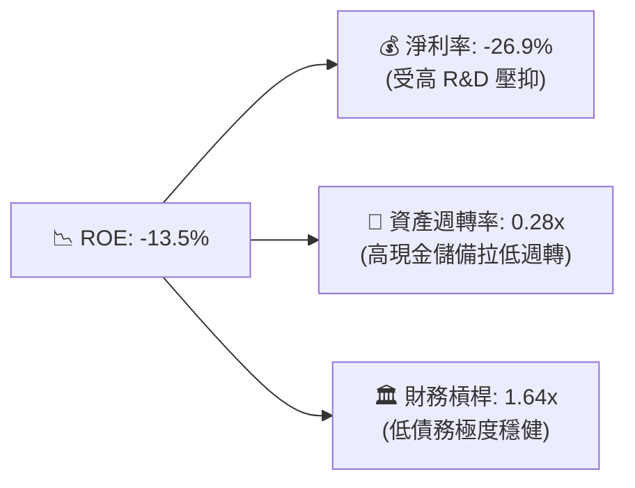

### 6.4 獲利能力儀表板

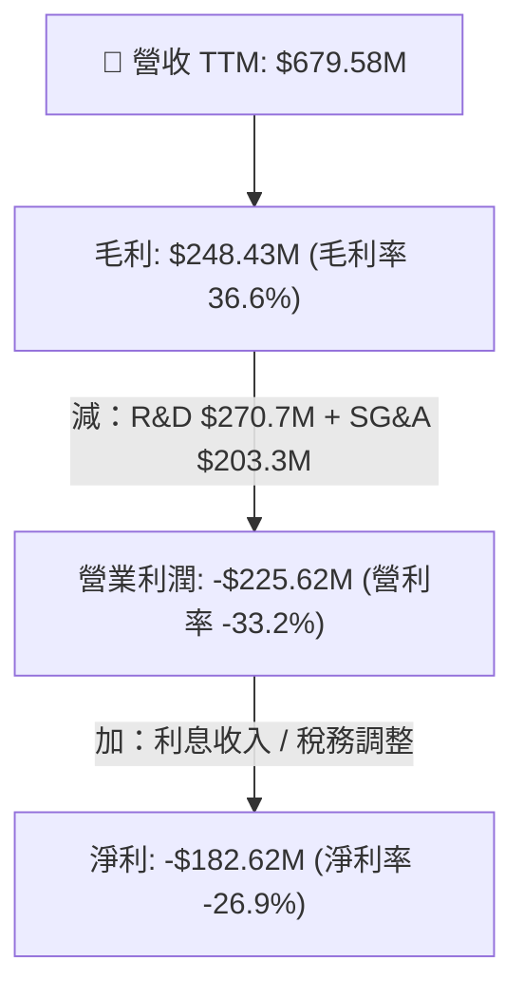

---

## 7. 估值深度分析

### 7.1 同業估值比較表格

選取太空產業、國防科技與小型衛星發射領域的具體同業對標：**AST SpaceMobile (ASTS)**、**Intuitive Machines (LUNR)**、**Planet Labs (PL)** 與 **Kratos Defense (KTOS)**。

| 估值與財務指標 | **Rocket Lab (RKLB)** | **AST SpaceMobile (ASTS)** | **Intuitive Machines (LUNR)** | **Planet Labs (PL)** | **Kratos (KTOS)** |
|----------------|----------------------|----------------------------|-------------------------------|----------------------|-------------------|
| **市值 (Market Cap)** | **$39.93B** | $12.50B | $1.20B | $0.85B | $3.50B |
| **企業價值 (EV)** | **$35.74B** | $11.80B | $1.10B | $0.55B | $3.20B |
| **TTM 營收** | **$679.58M** | $15.20M | $220.00M | $240.00M | $1,100.00M |
| **YoY 營收成長** | **63.5%** | >200% | 45.0% | 14.2% | 10.5% |
| **毛利率 (TTM)** | **36.6%** | N/A | 16.5% | 52.0% | 24.5% |
| **P/S Ratio** | **58.76x** | >800x | 5.45x | 3.54x | 3.18x |
| **EV / Revenue** | **52.60x** | >750x | 5.00x | 2.29x | 2.91x |
| **Forward P/E** | **2,130.3x** | N/A | 45.0x | N/A | 38.0x |
| **淨現金位置** | **+$1.24B** | +$0.40B | +$0.10B | +$0.30B | +$0.15B |
| **估值評估** | 🔴 溢價高 (市場給予高確定性溢價) | 🔴 純概念高估值 | 🟢 估值合理 | 🟢 估值偏低 | 🟡 國防穩定估值 |

> **估值倍數選擇說明**：由於 RKLB 目前損益表處於大規模研發投資期，GAAP P/E 嚴重失真。應優先採用 **EV/Revenue** 與 **P/S Ratio** 作為主要估值錨點，並結合 **DCF 長期現金流折現** 作為目標價推導基準。

### 7.2 歷史估值區間分析

RKLB 的歷史 EV/Revenue 區間多落在 10x - 25x 之間。當前股價（$63.91）對應之 EV/Revenue 升至 52.6x，處於過去 24 個月估值區間的上軌 90% 分位，反映了市場對 2026 年下半年 Neutron 成功首飛與國防太空合約大爆發的極高預期。

```
╔══════════════════════════════════════════════════════════════════╗
║              Rocket Lab EV / Revenue 歷史區間位置                ║
╠══════════════════════════════════════════════════════════════════╣
║  歷史最低： 4.2x (2023 谷底)                                     ║
║  歷史均值： 15.5x                                                ║
║  當前位置： 52.6x  ██████████████████████████████ (偏高/高預期)  ║
║  歷史最高： 65.0x (2026 劇烈拉升期)                              ║
╚══════════════════════════════════════════════════════════════════╝
```

### 7.3 情境目標價（假設驅動，Bear / Base / Bull）

所有情境假設以 2026-2029 五年預測期為基礎：

| 情境 | 5Y 營收 CAGR | 2029E 營業利益率 | 2029E 終端 EV/Sales 倍數 | 隱含目標價 | 相對當前股價 ($63.91) 報酬 |
|------|-------------|------------------|--------------------------|------------|----------------------------|
| 🔴 **悲觀** | 22.0% | 8.0% | 12.0x | **$38.00** | -40.5% |
| 🟡 **基準** | **38.0%** | **18.0%** | **22.0x** | **$85.00** | **+33.0%** |
| 🟢 **樂觀** | 52.0% | 25.0% | 32.0x | **$140.00** | **+119.1%** |

- **悲觀情境（$38.00）**：Neutron 首飛延誤至 2027 年底，Electron 價格遭遇競爭下挫，太空系統營收增速降至 20%，市場給予 12x EV/Sales 均值回歸。
- **基準情境（$85.00）**：Neutron 於 2026 年底順利進行首飛測試並於 2027 年開始商業化，營收 CAGR 達 38%，毛利率攀升至 42%，市場給予 22x EV/Sales 高成長溢價。
- **樂觀情境（$140.00）**：Neutron 成功商業化並年發射 >8 次，SDA 追蹤星座合約大額追加，營收 CAGR 超過 50%，營業利益率達 25%，享受龍頭高倍數（32x EV/Sales）。

### 7.4 DCF 敏感性分析（6 格目標價矩陣）

DCF 模型假設（基準）：WACC = 11.5%，永續成長率 g = 3.5%，終端 EBITDA 倍數 = 25x。

| 營業收入 CAGR / WACC | **WACC = 10.5%** | **WACC = 11.5%（基準）** | **WACC = 12.5%** |
|----------------------|------------------|--------------------------|------------------|
| 🟢 **樂觀 (CAGR 48%)** | **$152.00** (+137.8%) | **$140.00** (+119.1%) | **$126.00** (+97.2%) |
| 🟡 **基準 (CAGR 38%)** | **$93.00** (+45.5%) | **$85.00** (+33.0%) | **$76.00** (+18.9%) |
| 🔴 **悲觀 (CAGR 22%)** | **$42.00** (-34.3%) | **$38.00** (-40.5%) | **$33.00** (-48.4%) |

### 7.5 估值綜合區間

```
╔══════════════════════════════════════════════════════════════════╗
║                   Rocket Lab 估值綜合區間                        ║
╠══════════════════════════════════════════════════════════════════╣
║  52 周清單價格區間：  $37.57 ───────────── $63.91 ──── $151.00   ║
║  DCF 悲觀目標價：     $38.00                                     ║
║  同業相對估值中位數： $48.00                                     ║
║  當前市場價格：       $63.91  (▲ 處於中期支撐位)                  ║
║  法人共識目標價 Mean：$114.33                                    ║
║  CFA 基準情境目標價： $85.00  (隱含 +33.0% 空間)                 ║
║  CFA 樂觀情境目標價： $140.00 (隱含 +119.1% 空間)                ║
╚══════════════════════════════════════════════════════════════════╝
```

---

## 8. 成長催化劑

### 8.1 催化劑時間軸

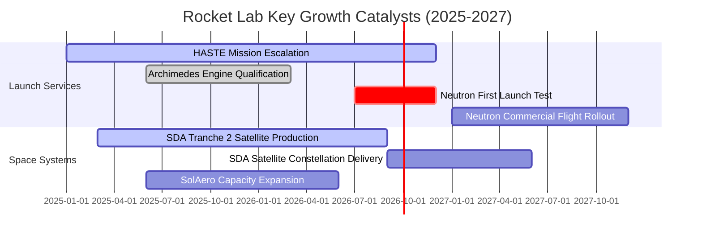

### 8.2 TAM 市場規模分析

Rocket Lab 的可尋址市場 (TAM) 正隨著 Neutron 火箭的推出實現量級跨越：

```
╔══════════════════════════════════════════════════════════════════╗
║                  Rocket Lab TAM 市場規模演變                    ║
╠══════════════════════════════════════════════════════════════════╣
║  小型發射市場 (Electron)：     $2.0B TAM   (已獲得約 15% 份額)   ║
║  中型發射市場 (Neutron)：      $10.0B TAM  (未來主攻市場)        ║
║  太空系統與組件 (Components)： $20.0B TAM  (SolAero / 衛星元件)  ║
║  太空數據與應用 (Constellation)：$70.0B TAM  (長線佈局)          ║
║                                                                  ║
║  📊 總可尋址市場 (Total TAM)： > $100.0B (成長空間極其廣闊)       ║
╚══════════════════════════════════════════════════════════════════╝
```

### 8.3 成長驅動力結構圖

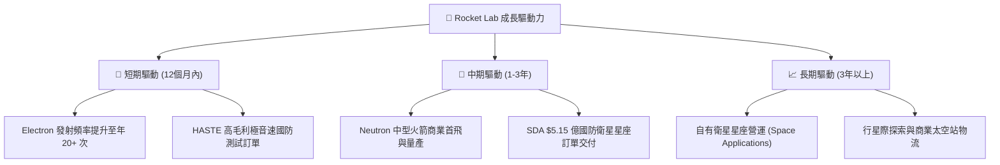

---

## 9. 風險矩陣

### 9.1 風險評分矩陣

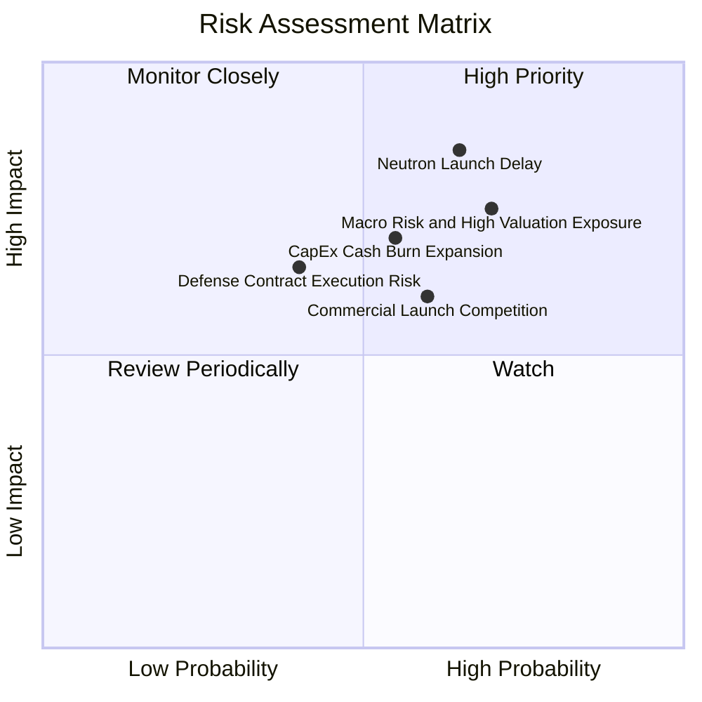

### 9.2 風險清單詳細分析

| # | 風險項目 | 發生機率 | 財務與營運衝擊 | 風險評分 | 緩解措施與監管應對 |
|---|----------|----------|----------------|----------|--------------------|
| 1 | 🔴 **Neutron 測試或首飛延誤** | 高 (65%) | 高 (延後營收 $1-2 億，每年增加 $5000 萬燒錢) | 🔴 **8.2/10** | 採用成熟的甲烷/液氧 Archimedes 引擎設計，並預備 $12.4 億淨現金緩和衝擊。 |
| 2 | 🔴 **高估值倍數修正風險** | 高 (70%) | 高 (EV/Sales 52.6x，若科技股修正回檔可達 30-40%) | 🔴 **7.8/10** | 建議投資者採取「分批建倉 (DCA)」與「賣出虛值 Put」策略鎖定成本。 |
| 3 | 🟡 **發射失敗風險 (Launch Failure)** | 中 (20%) | 中高 (單次事故損失約 $1000-2000 萬及幾個月停飛調查) | 🟡 **5.5/10** | 已建立 50+ 次成功履歷，發射場具備多元備份，並購買全額商業保險。 |
| 4 | 🟡 **國防預算削減或合約延誤** | 低 (30%) | 中 (SDA 合約若遞延影響營收確認進度) | 🟡 **4.2/10** | 國防太空發展局 (SDA) 屬於美國太空軍核心優先項目，跨黨派支持度高。 |

---

## 10. 投資建議

### 10.1 最終綜合評級雷達圖

```
╔══════════════════════════════════════════════════════════════╗
║                   Rocket Lab 綜合評級雷達                     ║
╠══════════════════════════════════════════════════════════════╣
║  基本面強度： 8.5 ▓▓▓▓▓▓▓▓▓▓▓▓▓▓▓▓▓░░  🟢 強勁               ║
║  營收成長性： 9.0 ▓▓▓▓▓▓▓▓▓▓▓▓▓▓▓▓▓▓░  🟢 極優               ║
║  獲利轉正潛力：6.0 ▓▓▓▓▓▓▓▓▓▓▓▓░░░░░░░  🟡 尚待 Neutron 驗證  ║
║  資產健康度： 9.0 ▓▓▓▓▓▓▓▓▓▓▓▓▓▓▓▓▓▓░  🟢 極優 (淨現金 $12B) ║
║  估值吸引力： 6.5 ▓▓▓▓▓▓▓▓▓▓▓▓▓░░░░░░  🟡 反映高期望         ║
╠══════════════════════════════════════════════════════════════╣
║  綜合投資評分： 7.8 / 10 ｜ 評級：🟢 買入 (Buy)              ║
╚══════════════════════════════════════════════════════════════╝
```

### 10.2 目標價與隱含報酬率

| 情境 | 機率賦權 | 目標價 | 相對現價 ($63.91) 報酬率 | 投資行動策略 |
|------|----------|--------|--------------------------|--------------|
| 🔴 **悲觀情境** | 20% | **$38.00** | -40.5% | 跌破 $45.00 時發揮淨現金防守性，強力加碼 |
| 🟡 **基準情境** | 60% | **$85.00** | **+33.0%** | **當前價格分批建倉，列為核心太空持股** |
| 🟢 **樂觀情境** | 20% | **$140.00** | +119.1% | Neutron 首飛成功並獲商業訂單後大幅追加 |
| **加權預期目標價** | **100%** | **$86.60** | **+35.5%** | **建議買入並長線持有** |

### 10.3 買入時機與觸發因素

```
╔══════════════════════════════════════════════════════════════════╗
║                  ✅ 買入觸發因素 Checklist                      ║
╠══════════════════════════════════════════════════════════════════╣
║                                                                  ║
║  立即買入觸發條件（當前符合 2 項）：                              ║
║  ✅ 季度營收年增率持續保持在 >35%（Q1'26 達 63.5%）              ║
║  ✅ 毛利率連兩季站穩 35% 以上（Q1'26 達 38.2%）                  ║
║  ☐ 股價拉回至 50 日均線附近或估值 EV/Sales 回落至 <35x           ║
║                                                                  ║
║  加碼觸發條件（出現以下任一）：                                  ║
║  ☐ Archimedes 引擎完成最終全功率熱試車驗證                      ║
║  ☐ Neutron 完成首飛並成功復飛入軌                                ║
║  ☐ 太空系統獲單一價值 > $3 億美金之新商業星座訂單                 ║
║                                                                  ║
║  減碼/停損觸發條件（出現以下任一）：                             ║
║  ☐ Neutron 項目宣佈嚴重設計缺陷並延誤 18 個月以上               ║
║  ☐ 季度自由現金流消耗（FCF Burn）突然擴大至單季 > $1.5 億美元    ║
╚══════════════════════════════════════════════════════════════════╝
```

### 10.4 投資人適配度分析

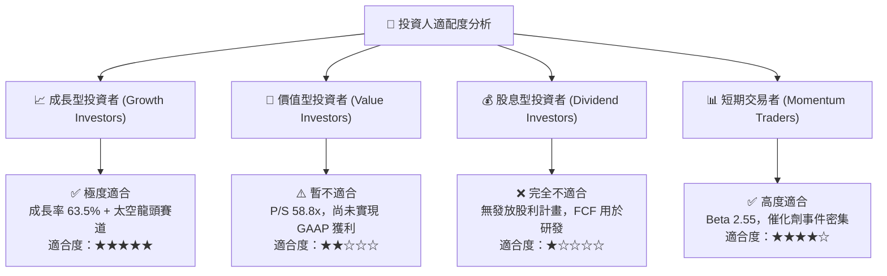

### 10.5 每季財報監控清單（Quarterly Watch List）

| 監控指標 | 最新數據 (Q1 2026) | 達標/良好區間 | 警戒/減碼門檻 | 說明與戰略意義 |
|----------|-------------------|---------------|---------------|----------------|
| **單季營收 (Revenue)** | $200.35M | > $190M (YoY > 30%) | < $160M (YoY < 10%) | 驗證商業太空系統需求是否持續擴張 |
| **整體毛利率 (Gross Margin)**| **38.18%** | > 35.0% | < 28.0% | 判斷規模效應是否抵消發射成本 |
| **太空系統營收佔比** | **71.0%** | > 65.0% | < 50.0% | 太空系統是公司穩定現金流與利潤底座 |
| **研發費用率 (R&D / Rev)** | **35.5%** | 30% - 40% (Neutron投入) | > 55% (控管失效) | 控管 Neutron 開發階段之費用膨脹 |
| **淨現金儲備 (Net Cash)** | **$12.44B** | > $8.0B | < $4.0B | 保證公司無融資破產風險的生命線 |
| **Neutron 時程節點** | 推進中 | 2026 年進行首飛 | 延誤至 2027 年底 | 影響長線估值翻倍的核心催化劑 |

### 10.6 反面論證：什麼會證明論點錯誤（What Would Change My Mind）

```
╔══════════════════════════════════════════════════════════════════╗
║              ⚠️ 論點失效條件（Disconfirming Evidence）           ║
╠══════════════════════════════════════════════════════════════════╣
║  本投資論點在下列條件成立時應重新檢視、下調評級或進行停損：      ║
║                                                                  ║
║  1. 核心業務成長失速：                                           ║
║     太空系統 (Space Systems) 營收年增率連續兩季跌破 +15%。        ║
║                                                                  ║
║  2. 利潤率結構惡化：                                             ║
║     整體毛利率（Gross Margin）因發射成本過高或競爭降價，下降至   ║
║     25% 以下且無法回升。                                         ║
║                                                                  ║
║  3. 關鍵項目研發失敗或嚴重延延誤：                               ║
║     Neutron Archimedes 引擎測試出現結構性缺陷，導致 2026-2027 年  ║
║     無法完成商業試飛，使得 TAM 擴張論點破滅。                     ║
║                                                                  ║
║  4. 資本消耗速度失控：                                           ║
║     單季 FCF 流出持續擴大至 > $1.5 億美元，且未伴隨訂單積壓增加， ║
║     使淨現金於 6 個季度內耗盡。                                  ║
╚══════════════════════════════════════════════════════════════════╝
```

---

> **免責聲明**：本報告為 AI 輔助機構級研究團隊自動生成，僅供專業投資參考與學術研究使用，不構成任何買賣金融產品之操作建議。投資太空科技等高成長、高 Beta 標的具備相當資本風險，入市前請務必衡量個人風險承受度或諮詢持牌財務顧問。