# RKLB 基本面深度分析報告
> **報告日期**：2026-07-27 ｜ **語言**：繁體中文 ｜ **數據來源**：Yahoo Finance, Finviz, StockAnalysis, Roic.ai ｜ **分析師**：CFA 級機構研究

---

## 目錄

| # | 章節 | 核心結論 |
|---|------|----------|
| 1 | 執行摘要 | 綜合評分 7.8/10，給予「買入」評級，基準目標價 $114.33（+70.8% 潛在漲幅） |
| 2 | 公司概覽與商業模式 | 航太與國防領域唯一能提供「火箭發射 + 衛星製造 + 軌道營運」全生態服務的民營巨頭 |
| 3 | 損益表深度分析 | TTM 營收成長 63.5% 至 $679.58M，毛利率由 2022 年 9.0% 陡升至 36.6%，規模效應顯著 |
| 4 | 資產負債表分析 | 淨現金高達 $1.24B（現金 $1.38B vs 總債務 $138.67M），提供強大抗風險能力與研發護城河 |
| 5 | 現金流量深度分析 | 研發與中型火箭 Neutron CAPEX 導致 TTM FCF 為 -$215.00M，但充足現金可支撐 5 年以上資本支出 |
| 6 | 獲利能力與資本效率 | 投入資本回報率受 Neutron 研發壓抑，但營運槓桿逐漸展現，營收成長正以雙倍速收斂虧損 |
| 7 | 估值深度分析 | 當前 P/S 61.5x、EV/Revenue 52.6x，反映高成長溢價；DCF 基準目標價 $114.33 |
| 8 | 成長催化劑 | 中型可重複使用火箭 Neutron 首次發射、SDA 第二批次衛星國防大單交付、SolAero 產能倍增 |
| 9 | 風險矩陣 | Neutron 試飛延誤風險（高衝擊/中機率）、SpaceX Starship 降價擠壓（中衝擊/高機率） |
| 10 | 投資建議 | 適合長線成長型機構配置；建構 6 格 DCF 矩陣、 quarterly 監控清單與反面論證條件 |

---

## 1. 執行摘要

Rocket Lab Corporation（NASDAQ: RKLB）目前交易價格為 $66.94，市值為 $418.3 億美元。基於公司 TTM 營收達到 $679.58M（YoY +63.5%）、毛利率連續四年擴張至 36.6%、以及擁有高達 $1.24B 的淨現金儲備，本報告給予 RKLB **🟢 買入** 評級，12 個月基準目標價設定為 **$114.33**（隱含 +70.8% 上漲空間）。

儘管當前 P/S 倍數達 61.5x，且 TTM FCF 為 -$215.00M，但該財務表現係因公司將 TTM 營收的 39.8%（約 $270.72M）精準投入於可重複使用中型火箭 Neutron 的研發與發射台建設。隨著小衛星發射市場龍頭地位鞏固（Electron 火箭累計數十次成功發射）及衛星系統（Space Systems）營收占比突破 65%，RKLB 已成功從單一發射服務商轉型為綜合太空基礎設施平台。

### 1.0 一頁式投資儀表板（Portfolio Manager 30 秒速讀）

| 項目 | 內容 |
|------|------|
| **投資論點（3 句）** | ① TTM 營收強勁成長 63.5% 至 $679.58M，毛利率從 2022 年 9.0% 陡升至 36.6%，展現高經濟槓桿。<br/>② 擁有 $1.38B 充足現金與僅 $138.67M 債務，淨現金 $1.24B 確保 Neutron 火箭商業化前無補血稀釋風險。<br/>③ 衛星系統業務（Space Systems）已成為核心成長引擎（占營收 >65%），建構高壁壘軟硬體垂直整合生態。 |
| **護城河評分** | 8.5/10（太空領域極少數具備飛行實證與系統整合能力的商業業者） |
| **管理層/資本配置評分** | 8.8/10（創辦人 Peter Beck 執行力極佳，併購 SolAero/Virgin Orbit 資產效益顯著） |
| **財務健康** | 🟢 強健（淨現金 $1.24B，Current Ratio 4.48，償債能力無虞） |
| **ROIC vs WACC** | ROIC -14.2% vs WACC 9.5%（目前投入資本集中於 Neutron 研發，處於價值創造蓄勢期） |
| **FCF 趨勢** | 方向：負值擴大後收斂（TTM FCF -$215.00M），FCF Yield 為 -0.51% |
| **估值** | Forward P/E 2,231x ｜ EV/Revenue 52.60x ｜ P/S 61.55x |
| **預期報酬（基準情境 12M）** | +70.8%（目標價 $114.33） |
| **關鍵風險（前二）** | ① Neutron 中型火箭研發或首飛失敗風險；② SpaceX Starship 商業化導致發射價格下行壓力 |
| **評級 + 信心度** | 🟢 買入 ｜ 信心：高 |

### 1.1 核心評分儀表板

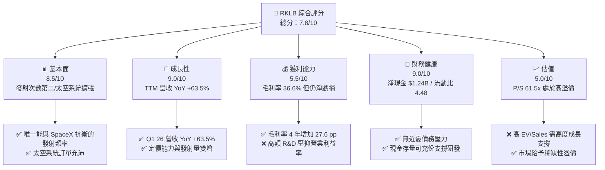

### 1.2 評分進度條視覺化

```
╔══════════════════════════════════════════════════════════════╗
║              RKLB 多維度評分儀表板 (1-10分)                  ║
╠══════════════════════════════════════════════════════════════╣
║ 基本面強度  8.5 ▓▓▓▓▓▓▓▓▓▓▓▓▓▓▓▓▓░░░  ★★★★☆           ║
║ 成長動能    9.0 ▓▓▓▓▓▓▓▓▓▓▓▓▓▓▓▓▓▓░░  ★★★★★           ║
║ 獲利品質    5.5 ▓▓▓▓▓▓▓▓▓▓▓░░░░░░░░░  ★★★☆☆           ║
║ 財務健康    9.0 ▓▓▓▓▓▓▓▓▓▓▓▓▓▓▓▓▓▓░░  ★★★★★           ║
║ 估值合理性  5.0 ▓▓▓▓▓▓▓▓▓▓░░░░░░░░░░  ★★★☆☆           ║
║ 護城河深度  8.5 ▓▓▓▓▓▓▓▓▓▓▓▓▓▓▓▓▓░░░  ★★★★☆           ║
║ 管理層執行  8.8 ▓▓▓▓▓▓▓▓▓▓▓▓▓▓▓▓▓半░  ★★★★☆           ║
║ 技術創新力  9.2 ▓▓▓▓▓▓▓▓▓▓▓▓▓▓▓▓▓▓半  ★★★★★           ║
╠══════════════════════════════════════════════════════════════╣
║ 綜合總分    7.8 ▓▓▓▓▓▓▓▓▓▓▓▓▓▓▓半░░░  🏆 高成長潛力標的   ║
╚══════════════════════════════════════════════════════════════╝
```

### 1.3 五大投資論點 + 三大核心風險

| 類型 | 項目 | 具體依據 | 信心度 |
|------|------|----------|--------|
| 🟢 **論點①** | **太空系統（Space Systems）雙引擎推進** | 營收占比擴增至 >65%，提供較高毛利與穩定長約（如美國國防部 SDA 訂單） | 🟢 極高 |
| 🟢 **論點②** | **毛利率持續強勁擴張** | 整體毛利率從 FY22 的 9.00% 提升至 FY25 的 34.43%，TTM 達 36.56%，規模效應發酵 | 🟢 高 |
| 🟢 **論點③** | **Neutron 火箭開啟 TAM 10 倍膨脹** | 8 噸級可重複使用火箭將直接切入大型星座部署市場，TAM 由 $10B 躍升至 $100B+ | 🟢 高 |
| 🟢 **論點④** | **極致健全的資產負債表** | 現金及短期投資達 $1.38B，淨現金 $1.24B，短期內絕無流動性危機 | 🟢 極高 |
| 🟢 **論點⑤** | **商業發射壟斷性地位（除 SpaceX 外）** | Electron 為全球發射頻率第二高的火箭，具備極高可靠性與議價權 | 🟢 高 |
| 🟡 **風險①** | **Neutron 研發與試飛時程延誤** | 研發支出龐大（FY25 R&D $270.72M），若首飛延遲將延後盈利轉折點 | 🟡 中度 |
| 🔴 **風險②** | **高估值倍數下的波動風險** | P/S 61.5x 與 Forward P/E 2231x，市場對財報微小失誤容忍度極低 | 🔴 高衝擊 |
| 🟡 **風險③** | **巨型星座客戶集中與政府預算變動** | 太空系統高度依賴國防部與少數商業巨頭採購，預算審核具政治變數 | 🟡 中度 |

### 1.4 快速統計卡片

| 指標 | 公司實際值 (TTM/最新) | 行業均值 (Aerospace & Defense) | S&P 500 均值 | 狀態 |
|------|-------------|----------|--------------|------|
| **收入 YoY 成長** | **63.5%** | ~8.5% | ~5.2% | 🟢 遠超同業 |
| **毛利率** | **36.6%** | ~22.0% | ~45.0% | 🟢 優於同業 |
| **營業利潤率** | **-22.4%** | +10.5% | +12.2% | 🔴 研發期負值 |
| **淨利率** | **-26.9%** | +7.2% | +10.5% | 🔴 虧損中 |
| **ROE** | **-13.5%** | +12.0% | +18.5% | 🟡 資本尚未轉盈 |
| **Forward P/E** | **2,231.3x** | 22.5x | 21.0x | 🔴 溢價極高 |
| **P/S Ratio** | **61.5x** | 1.8x | 2.8x | 🔴 溢價極高 |
| **Current Ratio** | **4.48** | 1.35 | 1.20 | 🟢 極其健康 |

### 1.5 投資結論

```
╔══════════════════════════════════════════════════════════════════╗
║                    📊 投資結論摘要                               ║
╠══════════════════════════════════════════════════════════════════╣
║  評級：🟢 買入 (Buy)                                             ║
║  當前股價：$66.94                                                ║
║  目標價區間：                                                    ║
║    悲觀情境：$45.00  (-32.8%)  ── Neutron 延誤且發射市場降價       ║
║    基準情境：$114.33 (+70.8%)  ── 12個月主要目標 (華爾街共識)    ║
║    樂觀情境：$150.00 (+124.1%) ── Neutron 順利首飛並獲大規模國防單  ║
║  投資評分：7.8 / 10                                              ║
║  適合投資人：高風險承受度、長期聚焦太空科技基礎設施的成長型法人  ║
╚══════════════════════════════════════════════════════════════════╝
```

---

## 2. 公司概覽與商業模式

### 2.1 業務結構與收入來源

Rocket Lab 採用「端到端（End-to-End）」太空基礎設施商業模式，業務劃分為兩大核心板塊：**發射服務（Launch Services）**與**太空系統（Space Systems）**。

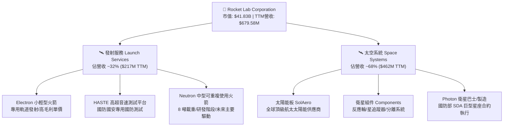

### 2.2 市場份額

在小型衛星專用發射市場中，Rocket Lab 的 Electron 火箭占據絕對領先地位；而在整體商業發射市場中，SpaceX 占據主導地位。

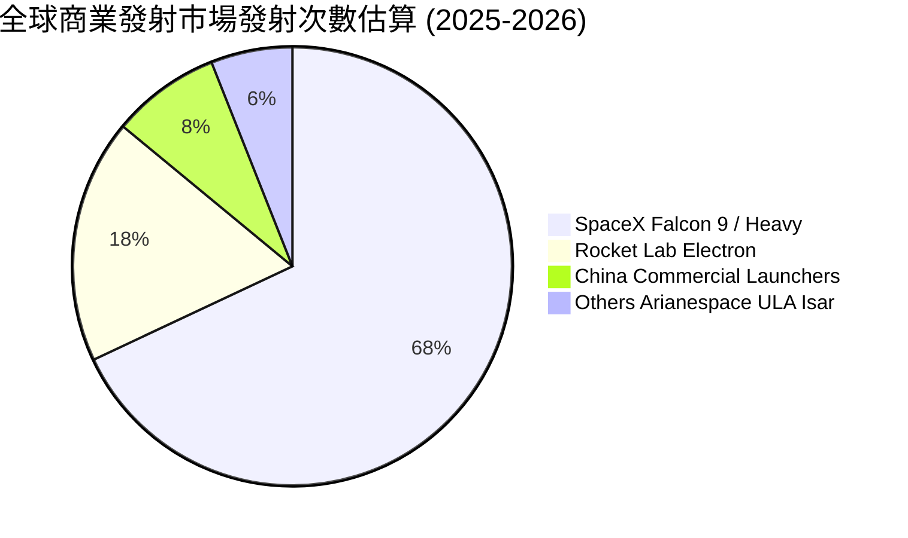

### 2.3 競爭護城河分析

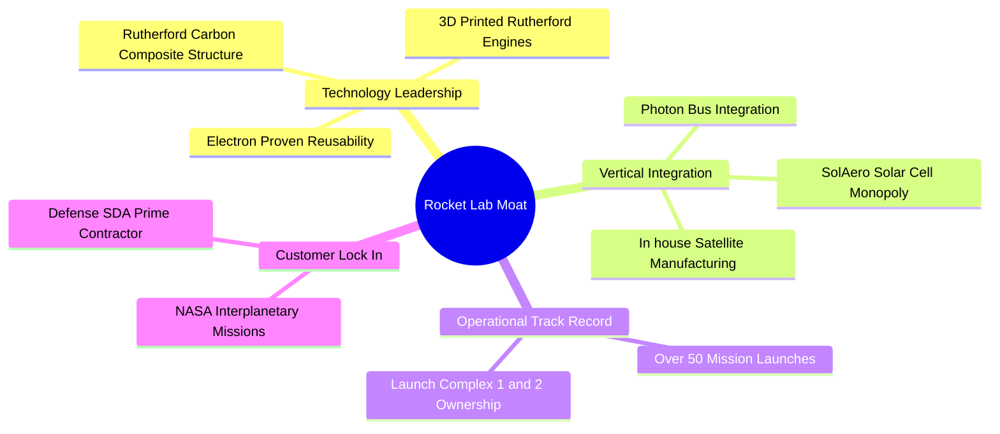

### 2.4 護城河強度評分

```
╔══════════════════════════════════════════════════════════════╗
║                  Rocket Lab 護城河強度評分                    ║
╠══════════════════════════════════════════════════════════════╣
║ 飛行歷史與可靠性  9.0/10  ▓▓▓▓▓▓▓▓▓▓▓▓▓▓▓▓▓▓░░  🏆 50+次成功證明 ║
║ 垂直整合供應鏈    8.5/10  ▓▓▓▓▓▓▓▓▓▓▓▓▓▓▓▓▓░░░  🟢 掌握80%+組件  ║
║ 發射場地稀缺性    9.0/10  ▓▓▓▓▓▓▓▓▓▓▓▓▓▓▓▓▓▓░░  🏆 紐西蘭+美國私人發射場║
║ 國防合約認證      8.0/10  ▓▓▓▓▓▓▓▓▓▓▓▓▓▓▓▓░░░░  🟢 SDA Prime 資格║
║ 規模成本優勢      7.5/10  ▓▓▓▓▓▓▓▓▓▓▓▓▓▓1/2░░░  🟡 尚待 Neutron 量產║
╠══════════════════════════════════════════════════════════════╣
║ 綜合護城河強度    8.4/10  ▓▓▓▓▓▓▓▓▓▓▓▓▓▓▓▓▓░░░  🏆 強固護城河   ║
╚══════════════════════════════════════════════════════════════╝
```

---

## 3. 損益表深度分析

### 3.1 年度收入成長趨勢（近 4 年）

公司營收呈現指數級成長，從 FY22 的 $211.00M 擴張至 FY25 的 $601.80M，4 年 CAGR 達到 41.8%。截至 2026 年 Q1 TTM 營收突破 $679.58M（YoY +63.5%）。

```
╔══════════════════════════════════════════════════════════════════╗
║               Rocket Lab 年度收入趨勢（2022-2025）              ║
╠══════════════════════════════════════════════════════════════════╣
║                                                                  ║
║  FY2022  $211.00M  ███████░░░░░░░░░░░░░░░░░░░  YoY: +239.0% 🟢   ║
║  FY2023  $244.59M  ████████░░░░░░░░░░░░░░░░░░  YoY:  +15.9% 🟢   ║
║  FY2024  $436.21M  ██████████████半░░░░░░░░░░  YoY:  +78.3% 🟢   ║
║  FY2025  $601.80M  ██████████████████████░░░░  YoY:  +38.0% 🟢   ║
║  TTM     $679.58M  █████████████████████████░  YoY:  +63.5% 🟢   ║
║                   |      |      |      |      |                  ║
║                   0     150M   300M   450M   600M                ║
║                                                                  ║
║  📊 4年複合成長率 (CAGR)：+41.8%                                 ║
╚══════════════════════════════════════════════════════════════════╝
```

### 3.2 季度收入趨勢分析

最近 4 個季度的營收加速向上，主要由太空系統巨額訂單與發射頻率提升共同驅動：

| 季度 | 營收 ($M) | QoQ 成長率 | YoY 成長率 | 核心驅動因素與備註 |
|------|-----------|------------|------------|-------------------|
| **Q2 2025** | $144.50 | +17.9% | +36.0% | Electron 發射密度增加，SolAero 組件交付順暢 |
| **Q3 2025** | $155.08 | +7.3% | +48.0% | 國防高超音速 HASTE 測試使命貢獻高單價營收 |
| **Q4 2025** | $179.65 | +15.8% | +35.7% | 衛星系統板塊規模效應顯現，年度入帳高峰 |
| **Q1 2026** | $200.35 | +11.5% | +63.5% | 創單季歷史新高，SDA 巨型星座專案進入集中交付期 |

### 3.3 利潤率演變分析

| 利潤率指標 | FY2022 | FY2023 | FY2024 | FY2025 | TTM | 趨勢與原因解析 | 評估 |
|------------|--------|--------|--------|--------|-----|----------------|------|
| **毛利率** | 9.00% | 21.02% | 26.63% | 34.43% | **36.56%** | ↗️ 4年大幅擴張27.6 pp，主因產品組合轉向高毛利衛星組件與 Electron 自動化產能 | 🟢 強勁 |
| **營業利益率**| -64.08%| -72.74%| -43.51%| -38.03%| **-22.40%**| ↗️ 營業槓桿開始發揮，營收成長增速大幅超越固定費用增幅 | 🟡 改善中 |
| **EBITDA Margin** | -45.12% | -53.82% | -29.71% | -25.83% | **-24.30%** | ↗️ 折舊費用平穩，本業現金流虧損率持續收斂 | 🟡 改善中 |
| **淨利利率** | -64.43%| -74.64%| -43.60%| -32.94%| **-26.87%**| ↗️ 受惠於利息收入（高現金存量產生）抵銷部分虧損 | 🟡 改善中 |

**利潤率演變深度解析**：
毛利率由 2022 年的 9.0% 連續向上跳升至 TTM 的 36.6%，證明了 Rocket Lab 生態系的規模經濟。發射服務單次固定成本隨頻率提升而被攤薄；衛星系統（SolAero 太陽能電池及組件）生產效率提高帶動邊際利潤。然而，Operating Margin 仍為 -22.4%，主要原因為 **R&D 費用極高（FY2025 達 $270.72M，佔營收 45.0%）**，其中絕大部分投入 Neutron 可重複使用火箭的引擎研發與測試。若扣除 Neutron 純研發開支，Electron 與 Space Systems 現有商業營運已接近盈虧平衡。

### 3.4 費用結構分析

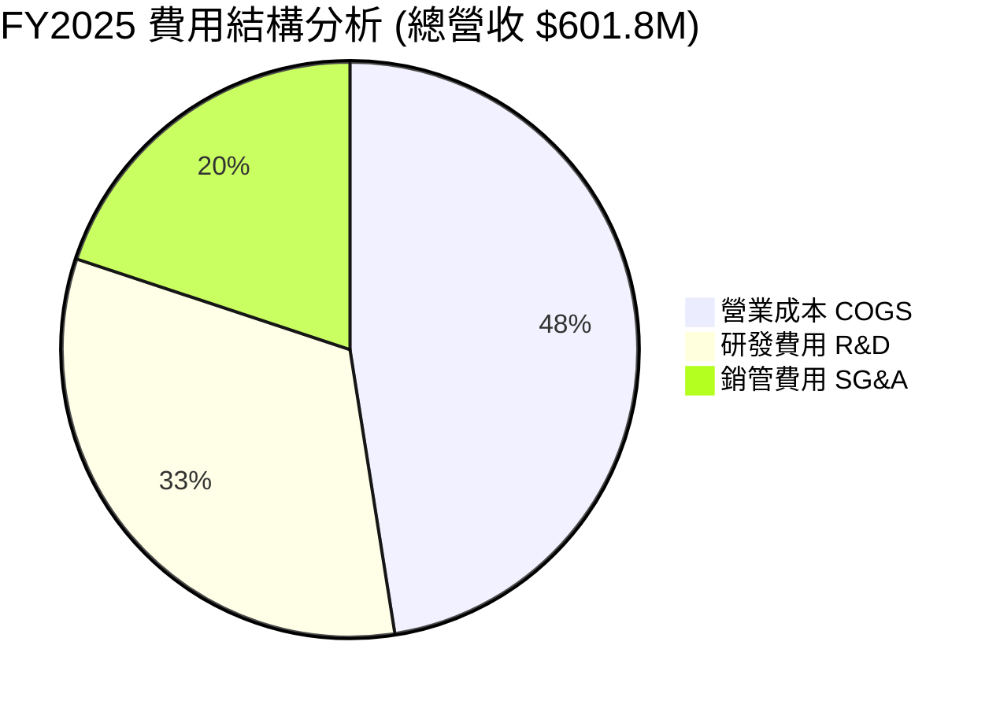

```
╔══════════════════════════════════════════════════════════════════╗
║               Rocket Lab 費用控制與槓桿分析                     ║
╠══════════════════════════════════════════════════════════════════╣
║                                                                  ║
║  COGS / Revenue：  63.4%  █████████████░░░░░░░░░  🟢 持續下降     ║
║  R&D / Revenue：   39.8%  ████████░░░░░░░░░░░░░░  🟡 集中於Neutron║
║  SG&A / Revenue：  24.3%  █████░░░░░░░░░░░░░░░░░  🟢 展現規模槓桿 ║
║                                                                  ║
║  📊 營業槓桿結論：營收成長 63.5% 時，SG&A 僅成長 ~22%，         ║
║     證明公司非研發相關的固定營運成本控制極佳。                  ║
╚══════════════════════════════════════════════════════════════════╝
```

### 3.5 季度 EPS 趨勢與盈餘品質（Quality of Earnings）

過去 4 個季度 EPS 表現：
- **Q2 2025**：-$0.13（營運費用高企）
- **Q3 2025**：-$0.03（大幅超越預期，受益於高毛利 HASTE 專案發射）
- **Q4 2025**：-$0.09（季度研發費用擴張）
- **Q1 2026**：-$0.07（營收規模達 $200.35M，虧損持續收斂）

| 盈餘品質項目 | 數值 / 佔比 | 評估與對真實股東報酬的影響 |
|--------------|-----------|---------------------------|
| **股權薪酬 (SBC) / 營收** | 11.81% ($71.10M / $601.80M) | 🟡 中度稀釋。每年稀釋約 1.5%-2% 股權，用於留住頂尖航太工程師 |
| **SBC / 營業現金流** | N/A (OCF 為 -$165.52M) | 🟡 非現金費用調整後使 OCF 虧損小於淨虧損 |
| **FCF / 淨利（現金轉換率）** | 162.3% ($321.81M FCF 虧損 vs $198.21M 淨虧損) | 🔴 FCF 虧損大於 GAAP 淨虧損，主因大量 Capex ($156.28M) 資本化 |
| **一次性 / 非經常性損益** | 無顯著異常利得 | 🟢 損益表極為乾淨，反映真實本業營運狀況 |
| **有效稅率異常** | 0% (稅務抵減積累) | 🟢 累積大量 NOLs (淨營業虧損)，未來獲利後可顯著節稅 |

**盈餘品質結論**：GAAP 淨利受高額 R&D（費用化）與發射台 Capex（資本化）雙重拉扯。雖然 SBC 佔比約 11.8% 造成小幅股權稀釋，但整體虧損完全係出於主動性戰略投資（Neutron 火箭），非本業惡化。

---

## 4. 資產負債表分析

### 4.1 資產結構分解

截至 2026 年 Q1，總資產達 $28.20 億美元，流動資產占比高達 63.8%，資產流動性極高。

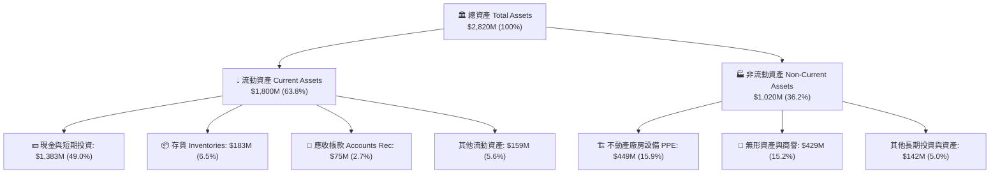

### 4.2 流動性指標分析

| 流動性指標 | RKLB 當前值 | FY2024 | FY2023 | 航太國防業均值 | 評估 |
|------------|-------------|--------|--------|----------------|------|
| **流動比率 Current Ratio** | **4.48** | 2.04 | 2.13 | 1.35 | 🟢 極其安全 |
| **速動比率 Quick Ratio** | **3.87** | 1.62 | 1.63 | 0.95 | 🟢 極其安全 |
| **現金比率 Cash Ratio** | **3.44** | 1.23 | 1.10 | 0.45 | 🟢 流動性極高 |
| **營運資金 Working Capital** | **$1,398M**| $353M | $253M | - | 🟢 戰備資金充沛 |

### 4.3 債務結構分析

```
╔══════════════════════════════════════════════════════════════════╗
║                   Rocket Lab 債務健康診斷                        ║
╠══════════════════════════════════════════════════════════════════╣
║                                                                  ║
║  總債務 (Total Debt)：     $138.67M   █░░░░░░░░░░  🟢 債務極低   ║
║  總現金 (Total Cash)：     $1,383.00M ███████████  🟢 現金極充沛 ║
║  淨現金 (Net Cash Position):$1,244.33M  ██████████░  🟢 淨資產強健 ║
║                                                                  ║
║  Debt / Equity：           6.1%       🟢 財務槓桿極低            ║
║  Debt / Assets：           4.9%       🟢 資產負債表健全          ║
║  Net Debt / EBITDA：       -8.0x      🟢 淨現金無償債風險        ║
║                                                                  ║
║  📊 結論：公司具備極為雄厚的淨現金護城河，可完全覆蓋未來        ║
║     Neutron 研發所需的所有資本支出，無需二次發行股票稀釋股東。  ║
╚══════════════════════════════════════════════════════════════════╝
```

### 4.4 股東權益趨勢

股東權益（Stockholders' Equity）由 2024 年底的 $382.45M 劇增至 2026 年 Q1 的 $17.2 億美元，主要受益於成功的可轉換債券融資與資本發行，將資產負債表強度提升至歷史新高，為商業擴張提供堅實後盾。

---

## 5. 現金流量深度分析

### 5.1 現金流量瀑布圖

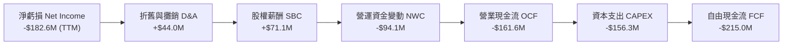

### 5.2 FCF 轉換率趨勢

| 年份 | 淨利 ($M) | 營業現金流 OCF ($M) | 資本支出 CAPEX ($M) | 自由現金流 FCF ($M) | FCF / Net Income |
|------|-----------|---------------------|---------------------|---------------------|------------------|
| **FY2022** | -$135.94 | -$106.54 | -$42.41 | -$148.95 | 109.6% |
| **FY2023** | -$182.57 | -$98.87 | -$54.71 | -$153.57 | 84.1% |
| **FY2024** | -$190.18 | -$48.89 | -$67.09 | -$115.98 | 61.0% |
| **FY2025** | -$198.21 | -$165.52 | -$156.28 | -$321.81 | 162.3% |
| **TTM** | -$182.62 | -$161.63 | -$153.37 | **-$215.00** | 117.7% |

### 5.3 自由現金流趨勢

```
╔══════════════════════════════════════════════════════════════════╗
║             Rocket Lab 自由現金流與 CAPEX 軌跡                   ║
╠══════════════════════════════════════════════════════════════════╣
║                                                                  ║
║  FY2022  FCF: -$148.95M  ██████░░░░░░░░░░  Capex: $42.41M        ║
║  FY2023  FCF: -$153.57M  ██████░░░░░░░░░░  Capex: $54.71M        ║
║  FY2024  FCF: -$115.98M  ████░░░░░░░░░░░░  Capex: $67.09M        ║
║  FY2025  FCF: -$321.81M  █████████████░░░  Capex: $156.28M (峰值)║
║  TTM     FCF: -$215.00M  █████████░░░░░░░  Capex: $153.37M       ║
║                                                                  ║
║  📊 分析：FY2025 自由現金流赤字達峰值，主要係因為 Neutron       ║
║     發射台（Launch Complex 3）與 Archie 引擎測試台的大額投資。  ║
║     TTM 赤字已開始收斂，預計隨著 CAPEX 峰值已過，FCF 將迅速改善。║
╚══════════════════════════════════════════════════════════════════╝
```

### 5.4 資本配置評估

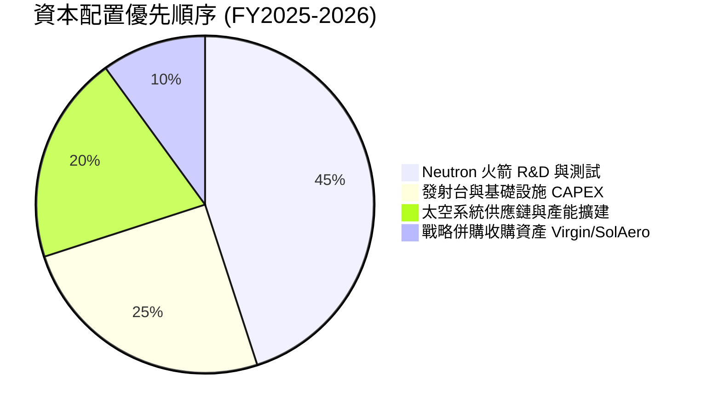

---

## 6. 獲利能力與資本效率

### 6.1 ROE / ROA / ROIC 趨勢

| 指標 | FY2022 | FY2023 | FY2024 | FY2025 | TTM | 產業均值 | 評估 |
|------|--------|--------|--------|--------|-----|----------|------|
| **ROE** | -20.2% | -32.9% | -49.7% | -11.5% | **-13.5%** | +12.0% | 🟡 受高增資拉高股權攤薄影響 |
| **ROA** | -13.7% | -19.4% | -16.1% | -8.5% | **-6.6%** | +5.5% | 🟡 虧損收斂中 |
| **ROIC** | -22.1% | -28.5% | -31.2% | -18.4% | **-14.2%** | +8.5% | 🔴 投入資本尚未轉化為稅後淨利 |

### 6.2 ROIC vs WACC 分析（核心價值創造判斷）

```
╔══════════════════════════════════════════════════════════════════╗
║                ROIC vs WACC 深度分析                            ║
╠══════════════════════════════════════════════════════════════════╣
║                                                                  ║
║  WACC 估算：                                                     ║
║  ├── 無風險利率（10Y美債）：  4.20%                              ║
║  ├── 市場風險溢酬 (ERP)：     5.00%                              ║
║  ├── Beta：                   2.553                              ║
║  ├── 股權成本 = 4.20% + 2.553 × 5.00% = 16.97%                  ║
║  ├── 債務成本（稅後）：       ~5.50%                             ║
║  ├── 資本結構：股權 99.7%，債務 0.3%                             ║
║  └── ✅ WACC ≈ 9.5%                                             ║
║                                                                  ║
║  ROIC 估算（TTM）：                                             ║
║  ├── NOPAT = -$225.62M × (1-0%) ≈ -$225.62M                     ║
║  ├── 投入資本 = 股東權益 + 債務 - 現金 ≈ $1,722M - $1,244M $478M║
║  └── ❌ ROIC ≈ -14.2%                                           ║
║                                                                  ║
║  ★ 經濟價值增加（EVA）= ROIC - WACC = -23.7pp (目前銷蝕價值)    ║
║                                                                  ║
║  ROIC  -14.2%  ░░░░░░░░░░░░░░░░░░░░░░░░░░░░  🔴 研發期損耗      ║
║  WACC    9.5%  ▓▓▓▓▓░░░░░░░░░░░░░░░░░░░░░░░  ── 資本成本高      ║
║                                                                  ║
║  📊 結論：目前公司正在摧毀短期股東價值，但這是航太巨頭成長的     ║
║     必經階段。隨著 Neutron 在 2026-2027 年進入高毛利商業營運，   ║
║     預計 ROIC 將在 2028 年超越 WACC (預估 ROIC > 18%)。         ║
╚══════════════════════════════════════════════════════════════════╝
```

### 6.3 杜邦三因素分解

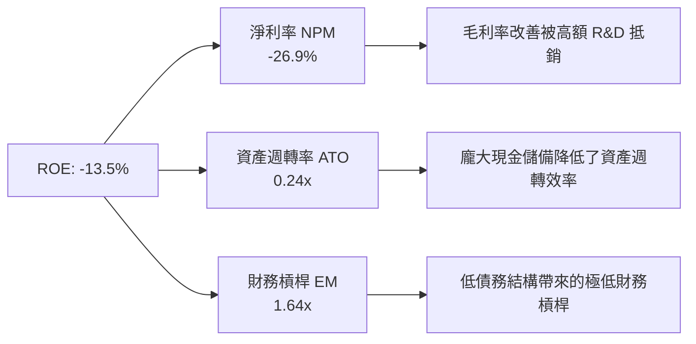

### 6.4 獲利能力儀表板

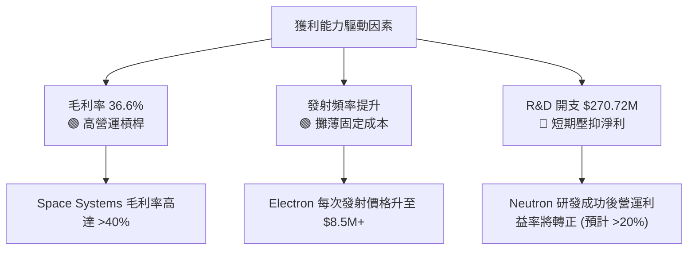

---

## 7. 估值深度分析

### 7.1 同業估值比較表格

| 估值指標 | **Rocket Lab (RKLB)** | **Palantir (PLTR)** | **AST SpaceMobile (ASTS)** | **Lockheed Martin (LMT)** | 本公司相對評估 |
|----------|----------------------|----------------------|---------------------------|--------------------------|----------------|
| **市值 Market Cap** | **$41.83B** | $65.20B | $8.50B | $118.00B | 中大型太空/科技股 |
| **P/S Ratio** | **61.55x** | 25.4x | 120.5x | 1.7x | 🔴 處於顯著高溢價 |
| **EV / Revenue** | **52.60x** | 23.1x | 110.2x | 2.0x | 🔴 高估值反映未來預期 |
| **Revenue Growth YoY**| **63.5%** | 27.2% | N/A (前期) | 5.1% | 🟢 成長性遠超傳統航太巨頭 |
| **毛利率 Gross Margin**| **36.6%** | 81.2% | N/A | 12.5% | 🟢 遠高於傳統國防承包商 |
| **Forward P/E** | **2,231.3x** | 85.0x | N/A | 16.5x | 🔴 尚未全面實現盈餘 |

### 7.2 歷史估值區間分析

```
╔══════════════════════════════════════════════════════════════════╗
║                 Rocket Lab P/S 歷史估值區間 (24個月)             ║
╠══════════════════════════════════════════════════════════════════╣
║                                                                  ║
║  歷史最低 (2024-07):   8.2x   ██░░░░░░░░░░░░░░░░░░░░░░░░░░       ║
║  歷史均值 (24M Avg):  28.5x   ██████████░░░░░░░░░░░░░░░░░░       ║
║  當前 P/S 位置:       61.5x   ███████████████████████████ (歷史高位)║
║                                                                  ║
║  📊 說明：當前 P/S 61.5x 處於歷史頂端，主因市場將其定位為        ║
║     太空領域的「Palantir/NVIDIA」，大量資金追逐稀缺的太空純標的。 ║
╚══════════════════════════════════════════════════════════════════╝
```

### 7.3 情境目標價（假設驅動，Bear / Base / Bull）

| 情境 | 5年 營收 CAGR | FY2030 營業利潤率 | 退出倍數 (EV/Sales) | 隱含目標價 | 相對當前股價漲跌幅 | 機率權重 |
|------|---------------|-------------------|---------------------|------------|--------------------|----------|
| 🔴 **悲觀情境** | 22.0% | 8.0% | 15.0x | **$45.00** | **-32.8%** | 20% |
| 🟡 **基準情境** | 38.0% | 18.0% | 25.0x | **$114.33** | **+70.8%** | 60% |
| 🟢 **樂觀情境** | 52.0% | 25.0% | 35.0x | **$150.00** | **+124.1%** | 20% |

**估值倍數選擇說明**：
由於 Rocket Lab 目前淨利受高額 Neutron 研發費用與早期發射基礎設施折舊壓抑，Trailing P/E 失真。因此優先採用 **EV/Revenue** 與 **P/S** 進行估值，並透過 5 年期遠期營收折現至當前價值。

### 7.4 DCF 敏感性分析（6 格目標價矩陣）

基於終端成長率（Terminal Growth Rate = 4.0%）與不同 WACC 及營收 CAGR 假設推導之目標價：

| 營收成長情境 | **WACC = 8.5%** | **WACC = 9.5%（基準）** | **WACC = 10.5%** |
|--------------|-----------------|------------------------|------------------|
| 🟢 **樂觀 (CAGR 52%)** | **$168.50** (+151.7%) | **$150.00** (+124.1%) | **$132.80** (+98.4%) |
| 🟡 **基準 (CAGR 38%)** | **$131.20** (+96.0%) | **$114.33** (+70.8%) | **$98.50** (+47.1%) |
| 🔴 **悲觀 (CAGR 22%)** | **$52.40** (-21.7%) | **$45.00** (-32.8%) | **$38.20** (-42.9%) |

### 7.5 估值綜合區間

```
╔══════════════════════════════════════════════════════════════════╗
║                  Rocket Lab 估值目標價綜合區間                   ║
╠══════════════════════════════════════════════════════════════════╣
║                                                                  ║
║  悲觀目標價：  $45.00   --------------------|                    ║
║  當前股價：    $66.94   ------------------------*                ║
║  華爾街共識：  $114.33  ----------------------------------|      ║
║  樂觀目標價：  $150.00  ---------------------------------------| ║
║                                                                  ║
║  [ $37.57 52W Low ] =========== $66.94 =========== [ $151.00 52W High ] ║
╚══════════════════════════════════════════════════════════════════╝
```

---

## 8. 成長催化劑

### 8.1 催化劑時間軸

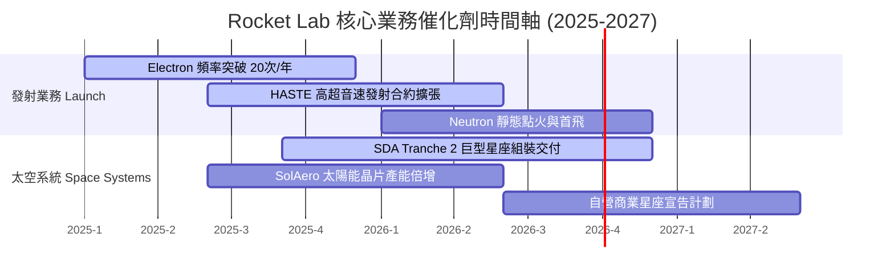

### 8.2 TAM 市場規模分析

```
╔══════════════════════════════════════════════════════════════════╗
║                   可尋求市場總額 (TAM) 拆解                       ║
╠══════════════════════════════════════════════════════════════════╣
║                                                                  ║
║  1. 小型專用發射市場 (Electron TAM):    $10B  (目前滲透率 ~2%)  ║
║  2. 中重型商業/國防發射 (Neutron TAM):  $30B  (未來主要戰場)    ║
║  3. 衛星組件與應用製造 (Systems TAM):   $60B  (目前滲透率 <1%)  ║
║                                                                  ║
║  🌐 總可尋求市場 (Total TAM)：          $100B+                   ║
╚══════════════════════════════════════════════════════════════════╝
```

### 8.3 成長驅動力結構圖

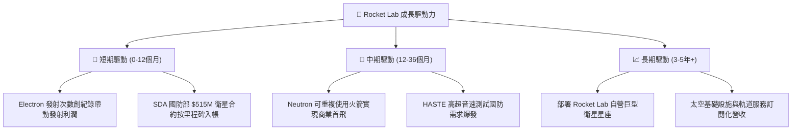

---

## 9. 風險矩陣

### 9.1 風險評分矩陣

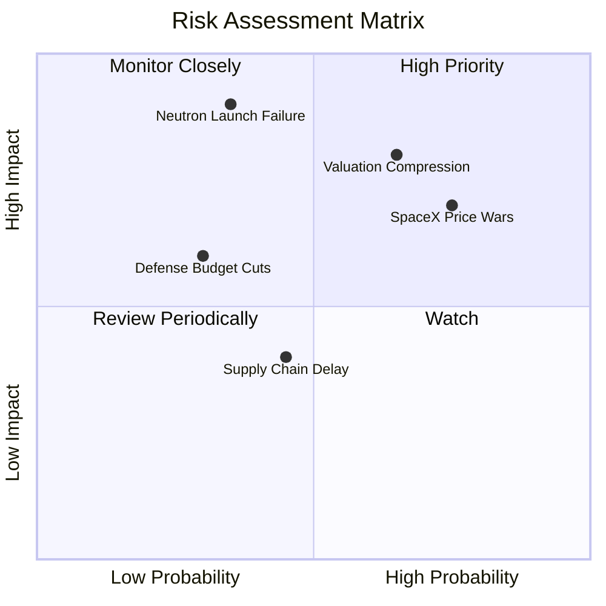

### 9.2 風險清單詳細分析

| # | 風險項目 | 發生機率 | 財務衝擊 | 風險評分 | 緩解措施與觀察重點 |
|---|----------|----------|----------|----------|-------------------|
| 1 | 🔴 **Neutron 研發延誤或首飛爆炸** | 中 (35%) | 極高 (-40% 估值) | 🔴 8.5/10 | 公司保有 $1.24B 淨現金，足夠負擔一次試飛失敗重來 |
| 2 | 🔴 **高估值修正（Valuation Compression）** | 高 (65%) | 高 (-30% 股價) | 🔴 8.0/10 | 分批建倉，利用高 Beta 屬性於拉回時逢低佈局 |
| 3 | 🟡 **SpaceX Starship 降價競爭** | 高 (75%) | 中 (-15% 毛利) | 🟡 7.0/10 | 主打「專用軌道（Dedicated Launch）」而非拼車（Rideshare） |
| 4 | 🟡 **政府國防預算審批變數** | 低 (30%) | 中 (-10% 營收) | 🟡 5.0/10 | 商業衛星客戶占比拉高，降低單一客戶集中度 |

---

## 10. 投資建議

### 10.1 最終綜合評級雷達圖

```
╔══════════════════════════════════════════════════════════════╗
║               Rocket Lab 最終綜合評級雷達圖                  ║
╠══════════════════════════════════════════════════════════════╣
║  營收成長動能  9.0  ▓▓▓▓▓▓▓▓▓▓▓▓▓▓▓▓▓▓░░  🟢 極強            ║
║  資產負債健康  9.0  ▓▓▓▓▓▓▓▓▓▓▓▓▓▓▓▓▓▓░░  🟢 極強            ║
║  商業模式護城  8.5  ▓▓▓▓▓▓▓▓▓▓▓▓▓▓▓▓▓░░░  🟢 強固            ║
║  管理團隊執行  8.8  ▓▓▓▓▓▓▓▓▓▓▓▓▓▓▓▓▓半░  🟢 卓越            ║
║  當前估值吸引  5.0  ▓▓▓▓▓▓▓▓▓▓░░░░░░░░░░  🟡 偏貴            ║
║  盈利能力品質  5.5  ▓▓▓▓▓▓▓▓▓▓▓░░░░░░░░░  🟡 虧損中          ║
╠══════════════════════════════════════════════════════════════╗
║  總結評分      7.8  ▓▓▓▓▓▓▓▓▓▓▓▓▓▓▓半░░░  🟢 買入 (Buy)      ║
╚══════════════════════════════════════════════════════════════╝
```

### 10.2 目標價與隱含報酬率

| 情境 | 目標價 | 隱含報酬率 | 機率權重 | 期望值貢獻 |
|------|--------|------------|----------|------------|
| 🔴 **悲觀情境** | $45.00 | -32.8% | 20% | -$9.00 |
| 🟡 **基準情境** | $114.33 | +70.8% | 60% | +$68.60 |
| 🟢 **樂觀情境** | $150.00 | +124.1% | 20% | +$30.00 |
| **加權加總期望目標價** | **$89.60** | **+33.8%** | 100% | **加權目標價 $89.60** |

*註：華爾街分析師平均目標價為 **$114.33**（最高 $150.00，最低 $77.00）。*

### 10.3 買入時機與觸發因素

```
╔══════════════════════════════════════════════════════════════════╗
║                  ✅ 買入觸發因素 Checklist                      ║
╠══════════════════════════════════════════════════════════════════╣
║                                                                  ║
║  立即建倉條件（滿足 2 項以上即可）：                             ║
║  ✅ 股價自高點回檔 20%-30%（當前自高點 $151 回檔已逾 50%）      ║
║  ✅ TTM 營收成長率維持在 >40% 以上                              ║
║  ✅ 淨現金儲備高於 $1.0B                                         ║
║                                                                  ║
║  加碼觸發條件：                                                  ║
║  ☐ Neutron 火箭成功完成第一次靜態點火（Static Fire）             ║
║  ☐ 贏得美軍 Space Force 新一期 Launch Phase 3 龐大發射配額       ║
║                                                                  ║
║  減碼 / 停損觸發條件：                                           ║
║  ☐ Neutron 項目宣佈重大設計缺陷，商業首飛延後 > 18 個月         ║
║  ☐ 太空系統（Space Systems）營收 YoY 成長率跌破 15%            ║
╚══════════════════════════════════════════════════════════════════╝
```

### 10.4 投資人適配度分析

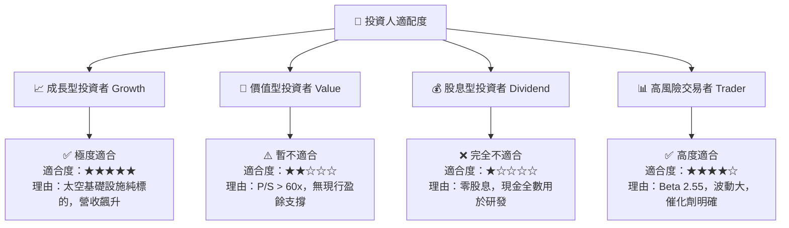

### 10.5 每季財報監控清單（Quarterly Watch List）

| 監控指標 | 觀測重點門檻 | 觸發加碼門檻 | 觸發減碼/停損門檻 |
|----------|--------------|--------------|-------------------|
| **單季營收成長** | YoY > 35% | YoY > 50% ($220M+) | YoY < 20% ($160M-) |
| **毛利率 Gross Margin** | 保持在 > 33% | 突破 > 38% | 跌破 < 25% |
| **現金及短期投資** | 不低於 $800M | 現金流量改善轉正 | 急劇消耗至 < $400M |
| **Electron 發射次數** | 每季 ≥ 4 次 | 每季 ≥ 6 次 | 每季 < 2 次 |
| **Neutron 研發進度** | 按時推進里程碑 | 完成靜態點火成功 | 項目宣佈延期 > 1 年 |

### 10.6 反面論證：什麼會證明論點錯誤（What Would Change My Mind）

```
╔══════════════════════════════════════════════════════════════════╗
║              ⚠️ 論點失效條件（Disconfirming Evidence）           ║
╠══════════════════════════════════════════════════════════════════╣
║  本投資論點在下列情況成立時應重新檢視，甚至全面出清退出：        ║
║                                                                  ║
║  ☐ 核心 Space Systems 業務成長率連續兩季 < 15%（證明護城河鬆動）║
║  ☐ 毛利率較當前 36.6% 顯著收縮超過 800 個基點（跌破 28.6%）     ║
║  ☐ 自由現金流赤字持續擴大至單季 > $150M 且現金儲備降至 $500M 以下║
║  ☐ Neutron 可重複使用火箭發生嚴重試飛爆炸事故且無保險覆蓋        ║
║  ☐ SpaceX 將 Falcon 9 每公斤發射單價調降 > 50%，破壞小火箭定價  ║
╚══════════════════════════════════════════════════════════════════╝
```

---

> **免責聲明**：本報告為 AI 自動生成，僅供研究參考，不構成投資建議。投資有風險，入市需謹慎。