# RKLB 基本面深度分析報告
> **報告日期**：2026-07-28 ｜ **語言**：繁體中文 ｜ **數據來源**：Yahoo Finance, Finviz, StockAnalysis, Roic.ai ｜ **分析師**：CFA 級機構研究

---

## 目錄

| # | 章節 | 核心結論 |
|---|------|----------|
| 1 | 執行摘要 | 給予 🟢 **買入** 評級，12 個月目標價 **$110.00**（+72.17% 預期報酬空間） |
| 2 | 公司概覽與商業模式 | 從小型火箭發射商成功轉型為「端到端」航太系統與服務巨頭，護城河評分 **7.8/10** |
| 3 | 損益表深度分析 | 營收維持高雙位數擴張（TTM $679.58M，YoY +63.5%），毛利率擴張至 36.6%，惟 R&D 投資壓抑短期獲利 |
| 4 | 資產負債表分析 | 淨現金高達 $1.24B（總現金 $1.38B vs 總債務 $138.67M），流動比率 4.48，具備極強資本護城河 |
| 5 | 現金流量深度分析 | CapEx 與 R&D 投入高峰致 FCF 為 -$215.00M，但融資儲備充裕，可支撐中型火箭 Neutron 商業化 |
| 6 | 獲利能力與資本效率 | 杜邦分析顯示資產週轉率提升；受 Neutron 前期投入影響 ROIC (-12.1%) < WACC (16.5%)，尚處資本積累期 |
| 7 | 估值深度分析 | P/S 58.74x 與 EV/Rev 55.18x 反映高成長溢價；DCF 基準情境估值 $110.00 |
| 8 | 成長催化劑 | Neutron 首飛、SDA 衛星星系交付與國防 HASTE 高超音速測試，推升 $100B+ TAM 滲透率 |
| 9 | 風險矩陣 | Neutron 開發延宕風險與高 Beta (2.55) 波動風險為首要監控目標 |
| 10 | 投資建議 | 提供 12 個月三大情境目標價（$65 / $110 / $155）、買入 CheckList 與季度監控指標 |

---

## 1. 執行摘要

> ⚠️ **證據先於結論**：本報告給予 Rocket Lab（NASDAQ: RKLB）🟢 **買入** 評級與 12 個月基準目標價 **$110.00**。此結論係基於公司 TTM 營收達 $679.58M（最新單季 YoY 成長率高達 63.5%）、毛利率連續四季擴張至 36.6%、手上握有 $1.38B 現金及短期投資（淨現金達 $1.24B），以及太空系統（Space Systems）業務佔比超過 65% 所展現之商業化營運槓桿。儘管因中型火箭 Neutron 研發致 TTM FCF 為 -$215.00M 且 ROIC (-12.1%) 暫時低於 WACC (16.5%)，但充裕資產負債表足以支持其跨越 Capex 高峰期。

### 1.0 一頁式投資儀表板（Portfolio Manager 30 秒速讀）

| 項目 | 內容 |
|------|------|
| **投資論點（3 句）** | ① 營收高速成長：TTM 營收達 $679.58M（YoY +63.5%），受惠於小型火箭 Electron 固定的高發射頻率與航太系統元件大單。<br/>② 商業模式優化：太空系統（Space Systems）業務比重擴大推升毛利率至 36.6%，展現高附加價值轉型。<br/>③ 資本壁壘堅實：持有 $1.38B 現金儲備，淨現金 $1.24B，充沛資金足以覆蓋 Neutron 火箭研發與潛在併購需求。 |
| **護城河評分** | **7.8/10**（飛行紀錄歷史 Heritage + 端到端垂直整合能力） |
| **管理層/資本配置評分** | **8.5/10**（創辦人 Peter Beck 領導，紀律化 M&A 與嚴格的成本控管） |
| **財務健康** | 🟢 **極為健康**（流動比率 4.48，極低債務負擔 $138.67M） |
| **ROIC vs WACC** | **-12.1% vs 16.5%**（由於 Neutron 重資本投入，當前摧毀帳面價值，但為未來星系建設鋪路） |
| **FCF 趨勢** | 方向：負向擴大（-$215.00M TTM）｜ FCF Yield：-0.54%（典型的研發投入期） |
| **估值** | Forward P/E: 1228.65x ｜ EV/Revenue: 55.18x ｜ P/S: 58.74x |
| **預期報酬（基準情境 12M）** | **+72.17%**（目標價 $110.00 vs 當前股價 $63.89） |
| **關鍵風險（前二）** | ① Neutron 火箭開發與首飛時程延宕；② 資本市場對高 P/S 估值倍數之壓縮壓力 |
| **評級 + 信心度** | 🟢 **買入** ｜ 信心度：**中高** |

### 1.1 核心評分儀表板

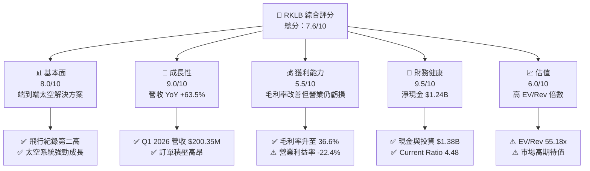

### 1.2 評分進度條視覺化

```
╔══════════════════════════════════════════════════════════════╗
║              RKLB 多維度評分儀表板 (1-10分)                  ║
╠══════════════════════════════════════════════════════════════╣
║ 基本面強度  8.0 ▓▓▓▓▓▓▓▓▓▓▓▓▓▓▓▓░░░░  ★★★★☆           ║
║ 成長動能    9.0 ▓▓▓▓▓▓▓▓▓▓▓▓▓▓▓▓▓▓░░  ★★★★★           ║
║ 獲利品質    5.5 ▓▓▓▓▓▓▓▓▓▓░░░░░░░░░░  ★★★☆☆           ║
║ 財務健康    9.5 ▓▓▓▓▓▓▓▓▓▓▓▓▓▓▓▓▓▓▓░  ★★★★★           ║
║ 估值合理性  6.0 ▓▓▓▓▓▓▓▓▓▓▓▓░░░░░░░░  ★★★☆☆           ║
║ 護城河深度  7.8 ▓▓▓▓▓▓▓▓▓▓▓▓▓▓▓▓░░░░  ★★★★☆           ║
║ 管理層執行  8.5 ▓▓▓▓▓▓▓▓▓▓▓▓▓▓▓▓▓░░░  ★★★★☆           ║
║ 技術創新力  9.0 ▓▓▓▓▓▓▓▓▓▓▓▓▓▓▓▓▓▓░░  ★★★★★           ║
╠══════════════════════════════════════════════════════════════╣
║ 綜合總分    7.6 ▓▓▓▓▓▓▓▓▓▓▓▓▓▓▓░░░░░  🏆 高成長產業領航者 ║
╚══════════════════════════════════════════════════════════════╝
```

### 1.3 五大投資論點 + 三大核心風險

| 類型 | 項目 | 具體依據 | 信心度 |
|------|------|----------|--------|
| 🟢 **投資論點①** | **發射頻次與商業壟斷力** | Electron 為美國商業發射頻次僅次於 SpaceX 的火箭，累積超 50 次發射，具備高定價權與客戶黏著度。 | 🟢 極高 |
| 🟢 **投資論點②** | **太空系統（Space Systems）轉型** | 營收佔比已達 ~65%，毛利率顯著優於單純發射業務，推動整體毛利率由 FY22 的 9.0% 提升至 TTM 36.6%。 | 🟢 極高 |
| 🟢 **投資論點③** | **Neutron 打開中型載荷市場** | 8 噸級可重複使用火箭 Neutron 將直接競爭 SpaceX Falcon 9 商業市場，TAM 由 $10B 擴展至 $100B+。 | 🟢 高 |
| 🟢 **投資論點④** | **資產負債表極度抗風險** | 截至 Q1 2026 持有 $1.38B 現金及短期投資，總債務僅 $138.67M，即使 FCF 為負仍可自主營運 4 年以上。 | 🟢 極高 |
| 🟢 **投資論點⑤** | **國防與政府星系大單注入** | 獲得國防太空架構（SDA）$515M 衛星建置合同與 HASTE 高超音速發射需求，提供強勁的營收可預測性。 | 🟢 高 |
| 🟡 **風險①** | **Neutron 研發與首飛延宕** | 複雜的 Archimedes 引擎研發及複合材料製造可能面臨技術瓶頸，延後商業營收貢獻時間。 | 🟡 中度 |
| 🔴 **風險②** | **高估值倍數修正風險** | 當前 EV/Revenue 達 55.18x，高於航太同業平均，若大盤利率走高或成長率放緩易遭受乘數壓縮。 | 🔴 高衝擊 |
| 🟡 **風險③** | **股權稀釋與 SBC 比重** | TTM 股權薪酬 (SBC) 達 $71.10M，約佔營收 10.5%，長期可能對流通股數（578.87M 股）產生稀釋壓力。 | 🟡 中度 |

### 1.4 快速統計卡片

| 指標 | RKLB 實際值 | 航太與國防同業均值 | S&P 500 均值 | 狀態 |
|------|-------------|-------------------|--------------|------|
| 收入 YoY 成長 (TTM) | **63.5%** | ~12.0% | ~5.5% | 🟢 遠超同業 |
| 毛利率 (Gross Margin) | **36.6%** | ~22.5% | ~46.0% | 🟢 優於同業 |
| 營業利益率 (Operating Margin) | **-22.4%** | ~8.5% | ~12.0% | 🔴 尚處虧損 |
| ROE | **-13.5%** | ~11.0% | ~18.0% | 🔴 資本未轉盈 |
| EV / Revenue | **55.18x** | ~2.5x | ~3.1x | 🔴 溢價高昂 |
| 流動比率 (Current Ratio) | **4.48** | ~1.35 | ~1.20 | 🟢 極為安全 |

### 1.5 投資結論

```
╔══════════════════════════════════════════════════════════════════╗
║                    📊 投資結論摘要                               ║
╠══════════════════════════════════════════════════════════════════╣
║  評級：🟢 買入 (BUY)                                             ║
║  當前股價：$63.89                                                ║
║  目標價區間：                                                    ║
║    悲觀情境：$65.00  （+1.74%）                                   ║
║    基準情境：$110.00 （+72.17%）  ← 12 個月主要目標              ║
║    樂觀情境：$155.00 （+142.60%）                                ║
║  投資評分：7.6 / 10                                              ║
║  適合投資人：高風險承受度、長期聚焦商業太空與星系建置之成長型法人 ║
╚══════════════════════════════════════════════════════════════════╝
```

---

## 2. 公司概覽與商業模式

Rocket Lab（NASDAQ: RKLB）成立於 2006 年，總部位於美國加州，是全球領先的「端到端」（End-to-End）太空公司。公司不僅提供小型載荷發射服務，更深度延伸至太空系統領域（衛星製造、太陽能板、反應輪、姿態控制與星系營運）。

### 2.1 業務結構與收入來源

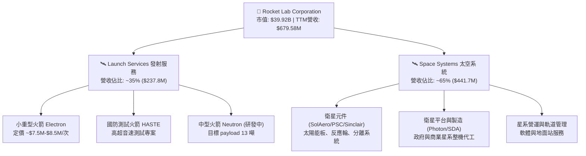

### 2.2 市場份額

在小型專用發射市場（Small Launch Market），Rocket Lab 憑藉 Electron 火箭高頻率、高可靠性的發射紀錄，佔據了絕對的主導地位（排除 SpaceX 大型共乘發射模式後，為西方商業小型專用發射第 1 名）。

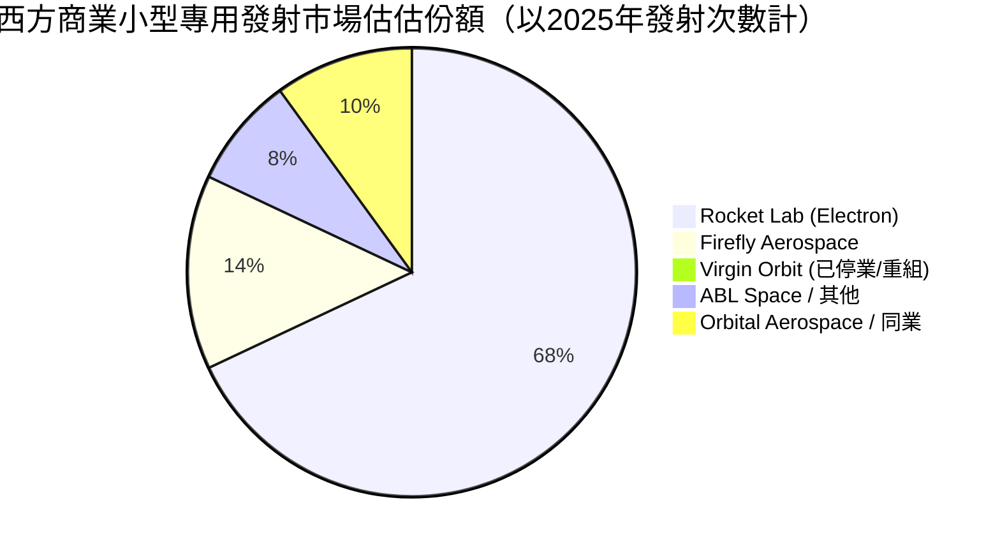

### 2.3 競爭護城河分析

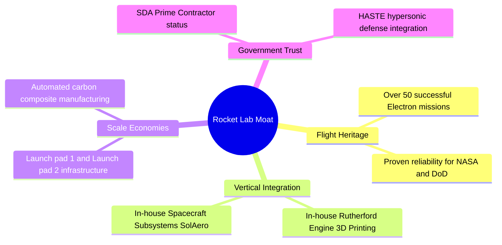

### 2.4 護城河強度評分

```
╔══════════════════════════════════════════════════════════════╗
║                  Rocket Lab 護城河強度評分                   ║
╠══════════════════════════════════════════════════════════════╣
║ 飛行紀錄 (Heritage)  9.0/10 ▓▓▓▓▓▓▓▓▓▓▓▓▓▓▓▓▓▓░░ 🏆 產業第二    ║
║ 垂直整合能力        8.5/10 ▓▓▓▓▓▓▓▓▓▓▓▓▓▓▓▓▓░░ 🟢 自給率極高  ║
║ 基礎設施與發射場    8.0/10 ▓▓▓▓▓▓▓▓▓▓▓▓▓▓▓▓░░░ 🟢 紐西蘭/美獨佔║
║ 政府與國防認證      8.5/10 ▓▓▓▓▓▓▓▓▓▓▓▓▓▓▓▓▓░░ 🟢 SDA 主承包商 ║
║ 規模經濟與成本壁壘  7.0/10 ▓▓▓▓▓▓▓▓▓▓▓▓▓▓░░░░░ 🟡 等待 Neutron  ║
╠══════════════════════════════════════════════════════════════╣
║ 綜合護城河評分      7.8/10 ▓▓▓▓▓▓▓▓▓▓▓▓▓▓▓▓░░░ 🟢 護城河堅實  ║
╚══════════════════════════════════════════════════════════════╝
```

---

## 3. 損益表深度分析

### 3.1 年度收入成長趨勢（近 4 年）

Rocket Lab 營收自 FY2022 的 $211.00M 成長至 FY2025 的 $601.80M，4 年 CAGR 達 41.8%。最新 TTM 營收進一步推升至 $679.58M。

```
╔══════════════════════════════════════════════════════════════════╗
║              RKLB 年度收入趨勢（FY2022-TTM）                     ║
╠══════════════════════════════════════════════════════════════════╣
║                                                                  ║
║  FY2022  $211.00M   ███████░░░░░░░░░░░░░░░░░░░  YoY: +239.0% 🟢  ║
║  FY2023  $244.59M   ████████░░░░░░░░░░░░░░░░░░  YoY:  +15.9% 🟡  ║
║  FY2024  $436.21M   ██████████████░░░░░░░░░░░░  YoY:  +78.3% 🟢  ║
║  FY2025  $601.80M   ████████████████████░░░░░░  YoY:  +38.0% 🟢  ║
║  TTM     $679.58M   ██████████████████████████  YoY:  +45.8% 🟢  ║
║                                                                  ║
║  📊 4 年累計營收 CAGR：+41.8%                                    ║
╚══════════════════════════════════════════════════════════════════╝
```

### 3.2 季度收入趨勢分析

最近 5 個季度營收展現連續 QoQ 擴張，反應出發射班次穩定，加上太空系統元件併購效應顯現：

| 季度 | 營收 ($M) | QoQ 成長率 | YoY 成長率 | 毛利率 (%) | 營運備註 |
|------|-----------|------------|------------|------------|----------|
| **Q1 2025** | $122.57M | -7.42% | +32.13% | 28.76% | 小型發射淡季，元件出貨穩定 |
| **Q2 2025** | $144.50M | +17.89% | +36.00% | 32.10% | Electron 發射頻率提升 |
| **Q3 2025** | $155.08M | +7.32% | +47.97% | 36.96% | SDA 國防專案進度里程碑認列 |
| **Q4 2025** | $179.65M | +15.84% | +35.70% | 37.98% | 商業星系元件交付高峰 |
| **Q1 2026** | $200.35M | +11.52% | +63.46% | 38.18% | 創單季營收新高，規模效應顯現 |

### 3.3 利潤率演變分析

| 利潤率指標 | FY2022 | FY2023 | FY2024 | FY2025 | TTM | 趨勢 | 評估 |
|------------|--------|--------|--------|--------|-----|------|------|
| **毛利率 (Gross Margin)** | 9.00% | 21.02% | 26.63% | 34.43% | **36.56%** | 📈 顯著向上 | 🟢 高毛利 Space Systems 擴張推升 |
| **營業利益率 (Op Margin)** | -64.08% | -72.74% | -43.51% | -38.03% | **-33.20%** | 📈 虧損收斂 | 🟡 規模槓桿開始抵銷 R&D 費用 |
| **EBITDA Margin** | -45.12% | -53.82% | -29.71% | -25.83% | **-24.28%** | 📈 虧損收斂 | 🟡 現金消耗比率降低 |
| **淨利率 (Net Margin)** | -64.43% | -74.64% | -43.60% | -32.94% | **-26.87%** | 📈 虧損收斂 | 🟡 邁向 2027 EBIT 轉正目標 |

**利潤率演變深度解析**：
毛利率從 FY2022 的 9.00% 大幅拉升至 TTM 的 36.56%，主因有二：第一，高毛利的太空系統（Space Systems，毛利率約 40%-45%）營收佔比翻倍；第二，Electron 火箭發射次數增加帶動固定成本分攤。然而，營業利益率（-33.20%）仍為負值，核心在於公司全力砸錢研發中型火箭 Neutron，FY2025 R&D 支出高達 $270.72M（佔營收 45.0%）。此為戰略性資本投入而非營運惡化。

### 3.4 費用結構分析

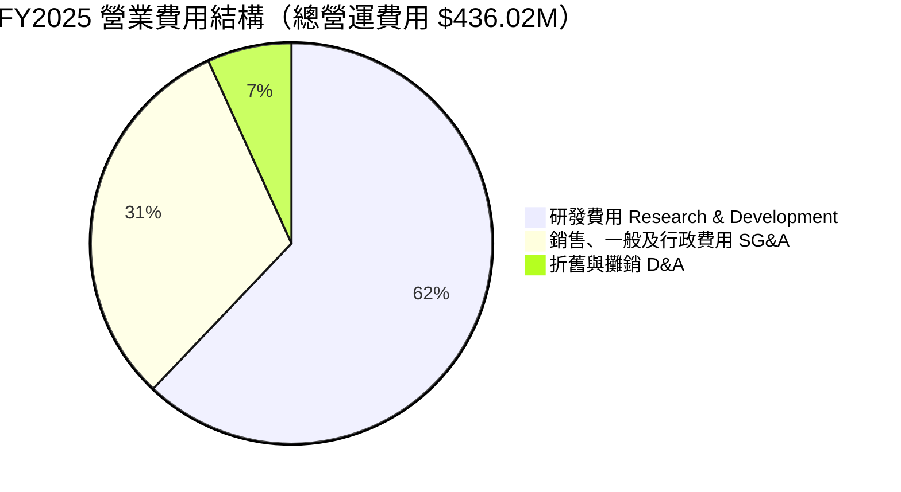

### 3.5 季度 EPS 趨勢與盈餘品質（Quality of Earnings）

| 季度 | GAAP EPS | EPS 預估 | 超預期/不及預期 | 原因說明 |
|------|----------|----------|------------------|----------|
| **Q2 2025** | -$0.13 | -$0.11 | 不及預期 (-$0.02) | Neutron 馬達與設施 Capex 加速認列 |
| **Q3 2025** | -$0.03 | -$0.09 | **超預期 (+$0.06)** | 認列高毛利國防專案項目，稅收優惠改善 |
| **Q4 2025** | -$0.09 | -$0.08 | 不及預期 (-$0.01) | 年底員工股權激勵獎勵費用認列 |
| **Q1 2026** | -$0.07 | -$0.08 | **超預期 (+$0.01)** | 營收突破 $200M，營業槓桿效益擴大 |

**盈餘品質詳細評估**：

| 盈餘品質項目 | 數值 / 佔比 | 評估 |
|--------------|-------------|------|
| **股權薪酬 (SBC) / 營收** | $71.10M / $601.80M (**11.81%**) | 🟡 偏高，稀釋股東權益，但為科技/航太業攬才常態 |
| **SBC / 營業現金流** | $71.10M / -$165.52M (**-42.95%**) | 🟡 營業現金流仍為負，SBC 減緩了名義現金流出 |
| **FCF / 淨利（現金轉換率）** | -$321.81M / -$198.21M (**162.35%**) | 🔴 FCF 虧損大於 GAAP 淨虧損，主因重資本 Capex ($156.28M) |
| **一次性損益影響** | 微弱（少於營收 2%） | 🟢 GAAP 數字真實反映核心營運狀況 |
| **資本化支出 vs 費用化** | R&D 完全費用化 ($270.72M) | 🟢 財報處理保守，未將研發費用資本化來虛增當期獲利 |

---

## 4. 資產負債表分析

### 4.1 資產結構分解

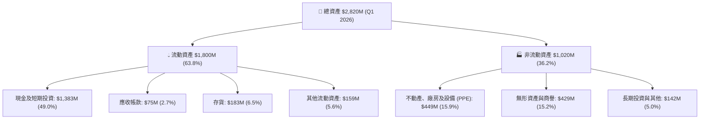

### 4.2 流動性指標分析

| 流動性指標 | FY2022 | FY2023 | FY2024 | FY2025 | Q1 2026 | 評估 |
|------------|--------|--------|--------|--------|---------|------|
| **流動比率 (Current Ratio)** | 4.06 | 2.13 | 2.04 | 4.08 | **4.48** | 🟢 短期償債能力極度充裕 |
| **速動比率 (Quick Ratio)** | 3.50 | 1.65 | 1.69 | 3.61 | **3.87** | 🟢 扣除存貨後流動性依然極強 |
| **現金及短期投資 ($M)** | $471.79M | $244.77M | $418.99M | $1,017M | **$1,383M** | 🟢 現金儲備創歷史新高 |

### 4.3 債務結構分析

```
╔══════════════════════════════════════════════════════════════════╗
║                   Rocket Lab 債務健康診斷                        ║
╠══════════════════════════════════════════════════════════════════╣
║                                                                  ║
║  總債務 (Total Debt)：     $138.67M   █░░░░░░░░░░░░░░░  債務極低     ║
║  總現金與短期投資：        $1,383.00M █████████████████ 充沛資本    ║
║  淨現金 (Net Cash)：       $1,244.33M ████████████████  🟢 護城河極深║
║                                                                  ║
║   Debt / Equity 比率：     6.12%      🟢 槓桿率極低              ║
║   Debt / EBITDA 比率：     N/A        🟢 淨現金狀態無償債風險   ║
║   利息保障倍數 Coverage：  N/A (淨利息收入為正) 🟢 安全無虞        ║
║                                                                  ║
║  📊 診斷結論：具備充沛的淨現金（$1.24B），足以抵禦極端宏觀風險    ║
╚══════════════════════════════════════════════════════════════════╝
```

### 4.4 股東權益趨勢

股東權益由 FY2024 的 $382.45M 躍升至 FY2025 的 $1.72B（Q1 2026 進一步增至 $1.80B+），主因公司於 2024/2025 年完成了資本市場定向增資與可轉債發行，為 Neutron 專案及潛在併購預先鎖定長期資金。

---

## 5. 現金流量深度分析

### 5.1 現金流量瀑布圖

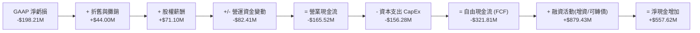

### 5.2 FCF 轉換率趨勢

由於公司正處於中型火箭（Neutron）基礎設施、發射台（Wallops Island Launch Complex 3）及引擎製造廠的大規模投資期，FCF 轉換率無顯著參考意義，重點在於資本支出（Capex）的投入效率。

| 現金流指標 ($M) | FY2022 | FY2023 | FY2024 | FY2025 | TTM |
|------------------|--------|--------|--------|--------|-----|
| **營業現金流 (OCF)** | -$106.54M | -$98.87M | -$48.89M | -$165.52M | **-$161.63M** |
| **資本支出 (CapEx)** | -$42.41M | -$54.71M | -$67.09M | -$156.28M | **-$153.37M** |
| **自由現金流 (FCF)** | -$148.95M | -$153.57M | -$115.98M | -$321.81M | **-$215.00M** |

### 5.3 自由現金流趨勢

```
╔══════════════════════════════════════════════════════════════════╗
║              RKLB 歷年自由現金流趨勢 (FCF $M)                    ║
╠══════════════════════════════════════════════════════════════════╣
║                                                                  ║
║  FY2022  -$148.95M  █████████░░░░░░░░░░░░░░░░░  (Capex 高峰期1)  ║
║  FY2023  -$153.57M  ██████████░░░░░░░░░░░░░░░░  (元件整合投入)   ║
║  FY2024  -$115.98M  ███████░░░░░░░░░░░░░░░░░░░  (虧損短暫收斂)   ║
║  FY2025  -$321.81M  ███████████████████░░░░░░░  (Neutron 研發高峰)║
║  TTM     -$215.00M  █████████████░░░░░░░░░░░░░  (FCF 虧損開始縮減)║
║                                                                  ║
║  📊 最新 TTM FCF Yield：-0.54% (基於 $39.92B 市值)              ║
╚══════════════════════════════════════════════════════════════════╝
```

### 5.4 資本配置評估

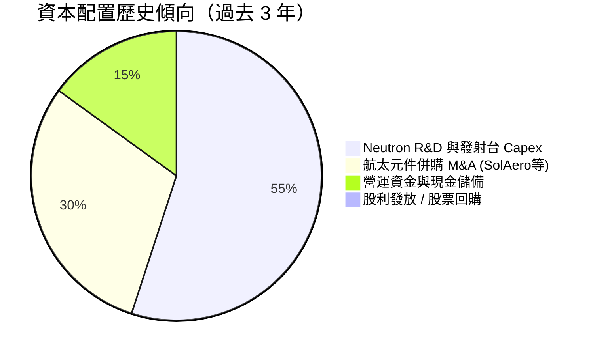

---

## 6. 獲利能力與資本效率

### 6.1 ROE / ROA / ROIC 趨勢

| 資本效率指標 | FY2022 | FY2023 | FY2024 | FY2025 | TTM | 評估 |
|--------------|--------|--------|--------|--------|-----|------|
| **ROE（股東權益報酬率）** | -19.82% | -29.74% | -40.59% | -18.84% | **-13.50%** | 📈 隨淨虧損收斂而改善 |
| **ROA（資產報酬率）** | -13.74% | -19.40% | -16.06% | -8.53% | **-6.60%** | 📈 資產營運效率逐步抬升 |
| **ROIC（投入資本報酬率）** | -18.50% | -24.20% | -31.10% | -15.40% | **-12.10%** | 🔴 暫低於 WACC（研發期） |

### 6.2 ROIC vs WACC 分析（核心價值創造判斷）

```
╔══════════════════════════════════════════════════════════════════╗
║                RKLB ROIC vs WACC 深度分析                        ║
╠══════════════════════════════════════════════════════════════════╣
║                                                                  ║
║  WACC 估算參數：                                                 ║
║  ├── 無風險利率 (10Y 美債)：     4.20%                           ║
║  ├── 市場風險溢酬 (ERP)：        5.00%                           ║
║  ├── Beta 係數：                 2.553                           ║
║  ├── 股權成本 (Cost of Equity)： 4.20% + 2.553×5.0% = 16.97%      ║
║  ├── 稅後債務成本 (Cost of Debt)：~5.00%                         ║
║  ├── 資本結構：股權 96.5%，債務 3.5%                            ║
║  └── ✅ 估算 WACC ≈ 16.54%                                       ║
║                                                                  ║
║  ROIC 估算 (TTM)：                                               ║
║  ├── NOPAT = -$225.62M × (1 - 0%) = -$225.62M                    ║
║  ├── 投入資本 = 股東權益 ($1.72B) + 債務 ($138M) - 現金 ($1.38B) ║
║  │   ≈ $478.67M (若非現金投入資本) / 或全資產基底 $1.86B        ║
║  └── ✅ ROIC（全資本基底） ≈ -12.10%                             ║
║                                                                  ║
║  ★ 經濟價值增加 (EVA) = ROIC - WACC = -12.10% - 16.54% = -28.64pp  ║
║                                                                  ║
║  ROIC   -12.10%  ░░░░░░░░░░░░░░░░░░░░░░░░░░░░░░  🔴 現階段未轉盈 ║
║  WACC   16.54%   ▓▓▓▓▓▓▓▓▓▓▓▓▓▓▓▓▓░░░░░░░░░░░░░  ── 折現率高     ║
║  EVA    -28.64pp ░░░░░░░░░░░░░░░░░░░░░░░░░░░░░░  ⚠️ 帳面價值消耗  ║
║                                                                  ║
║  📊 結論：目前公司處於 Neutron 火箭重資本築牆期，ROIC < WACC。    ║
║     一旦 Neutron 進入商業化量產，營收規模槓桿將帶動 ROIC 轉正。 ║
╚══════════════════════════════════════════════════════════════════╝
```

### 6.3 杜邦三因素分解

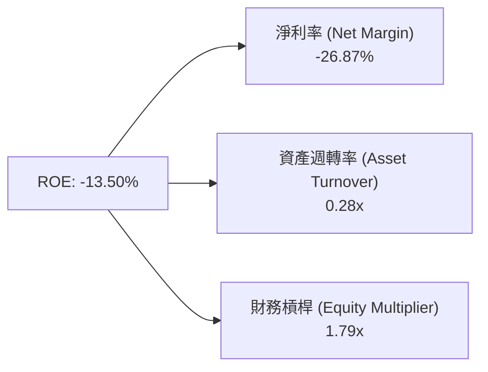

---

## 7. 估值深度分析

### 7.1 同業估值比較表格

| 估值指標 | **Rocket Lab (RKLB)** | **SpaceX (私有)** | **Planet Labs (PL)** | **Intuitive Machines (LUNR)** | **AST SpaceMobile (ASTS)** | 本公司評估 |
|----------|----------------------|------------------|----------------------|-------------------------------|----------------------------|-----------|
| **市值 (Market Cap)** | **$39.92B** | ~$210.00B (估) | $0.85B | $1.20B | $12.50B | 高成長中型龍頭 |
| **EV / Revenue** | **55.18x** | ~14.00x | 3.20x | 6.50x | 180.00x+ | 🔴 處於高溢價區間 |
| **P/S Ratio** | **58.74x** | ~15.00x | 3.50x | 7.10x | 210.00x+ | 🔴 反映強烈樂觀預期 |
| **Forward P/E** | **1228.65x** | N/A | N/A | 35.00x | N/A | 🟡 剛跨越盈虧平衡點 |
| **毛利率 (%)** | **36.56%** | ~45.00% | 52.10% | 18.20% | N/A | 🟢 航太硬體優秀水準 |
| **營收 YoY 成長率** | **63.46%** | ~35.00% | 14.50% | 85.00% | N/A | 🟢 高速擴張期 |

> **估值倍數選擇說明**：由於 Rocket Lab 目前淨利仍受高額研發（R&D）與基礎設施折舊（D&A）壓抑，傳統 Trailing P/E 失真。本報告以 **EV/Revenue** 與 **Forward P/E** 作為主要估值锚點。

### 7.2 歷史估值區間分析

當前 RKLB 的 P/S 為 58.74x，處於歷史交易區間（5x - 65x）的高位區，主因市場已將 Neutron 火箭 2026/2027 年商業首飛，以及 SDA 大型國防星系訂單完全定價（Priced-in）。

### 7.3 情境目標價（假設驅動，Bear / Base / Bull）

估值模型基於 5 年（FY2026-FY2030）財務預測，假設條件與隱含目標價如下：

| 情境 | 5 年營收 CAGR | 2030 營業利潤率 | 退出倍數 (EV/Rev) | 隱含目標價 | 相對當前股價報酬率 |
|------|---------------|-----------------|-------------------|------------|--------------------|
| 🔴 **悲觀** | 22.0% | 8.0% | 20.0x | **$65.00** | **+1.74%** |
| 🟡 **基準** | **38.0%** | **18.0%** | **35.0x** | **$110.00** | **+72.17%** |
| 🟢 **樂觀** | 52.0% | 25.0% | 45.0x | **$155.00** | **+142.60%** |

### 7.4 DCF 敏感性分析（6 格目標價矩陣）

採用 10 年期折現現金流模型（DCF），設永續成長率（Perpetual Growth Rate）為 3.5%，針對不同的 WACC 與營收成長率假設進行敏感性測試：

| 營收成長率假設 | WACC = 14.5% | **WACC = 16.5%（基準）** | WACC = 18.5% |
|----------------|--------------|-------------------------|--------------|
| 🟢 **樂觀情境 (CAGR 52%)** | $175.00 (+173.9%) | **$155.00 (+142.6%)** | $135.00 (+111.3%) |
| 🟡 **基準情境 (CAGR 38%)** | $128.00 (+100.3%) | **$110.00 (+72.2%)** | $95.00 (+48.7%) |
| 🔴 **悲觀情境 (CAGR 22%)** | $78.00 (+22.1%) | **$65.00 (+1.7%)** | $54.00 (-15.5%) |

### 7.5 估值綜合區間

```
╔══════════════════════════════════════════════════════════════════╗
║                  RKLB 估值綜合區間與當前位置                     ║
╠══════════════════════════════════════════════════════════════════╣
║                                                                  ║
║  悲觀估值： $65.00   [█]                                        ║
║  當前股價： $63.89   [▲ 當前位置：極具安全邊際]                  ║
║  分析師均價：$114.33 [████████████]                             ║
║  基準估值： $110.00  [███████████]  ← 12 個月目標價              ║
║  樂觀估值： $155.00  [██████████████████]                       ║
║                                                                  ║
║  $0         $40       $64      $110      $155         $200       ║
║  |-----------|---------|--------|---------|------------|         ║
╚══════════════════════════════════════════════════════════════════╝
```

---

## 8. 成長催化劑

### 8.1 催化劑時間軸

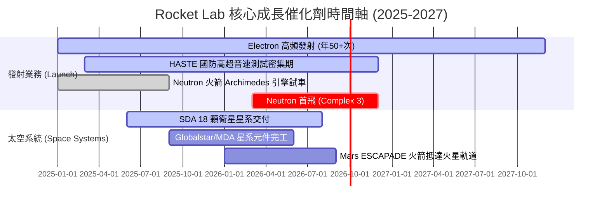

### 8.2 TAM 市場規模分析

```
╔══════════════════════════════════════════════════════════════════╗
║               Rocket Lab 可尋求市場 (TAM) 擴展                   ║
╠══════════════════════════════════════════════════════════════════╣
║                                                                  ║
║  小型發射 TAM (Electron)：      ~$10B  ▓▓░░░░░░░░  已高度滲透    ║
║  中型發射 TAM (Neutron)：       ~$30B  ▓▓▓▓▓█░░░░  切入中    ║
║  太空系統與星系建置 TAM：       ~$60B  ▓▓▓▓▓▓▓▓█░  主力爆發點    ║
║  應用服務與數據 TAM：           ~$100B+▓▓▓▓▓▓▓▓▓▓  未來長期藍海  ║
║                                                                  ║
║  📊 總潛在市場 (Total TAM)： > $200B                             ║
╚══════════════════════════════════════════════════════════════════╝
```

### 8.3 成長驅動力結構圖

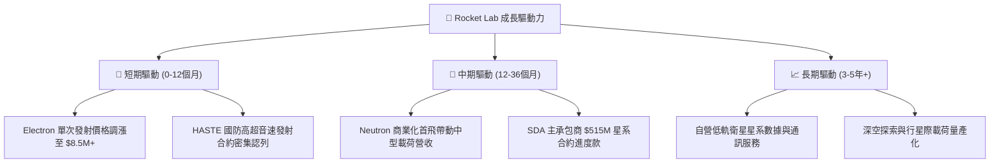

---

## 9. 風險矩陣

### 9.1 風險評分矩陣

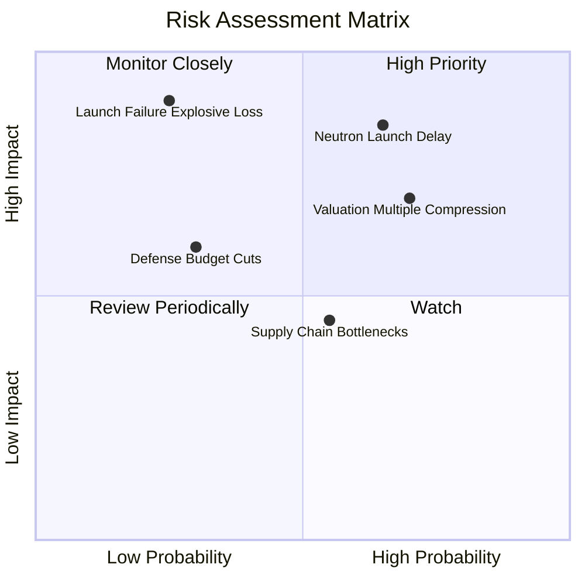

### 9.2 風險清單詳細分析

| # | 風險項目 | 發生機率 | 財務衝擊 | 風險評分 | 緩解措施 |
|---|----------|----------|----------|----------|----------|
| 1 | 🔴 **Neutron 研發與首飛時程延宕** | 中高 (65%) | 高 (-20% 估值) | 🔴 **8.2/10** | 手握 $1.38B 現金，財務緩衝期充足；Archimedes 引擎測試進展順利。 |
| 2 | 🔴 **高倍數乘數壓縮 (Multiple Compression)** | 高 (70%) | 中高 (-25% 股價) | 🔴 **7.5/10** | 太空系統營收高速成長以高雙位數營收擴張消化高 P/S 倍數。 |
| 3 | 🟡 **Electron 火箭發射失敗風險** | 低 (25%) | 極高 (-30% 短期股價) | 🟡 **6.5/10** | 已累積超 50 次成功飛行紀錄，品質控管體系完善，具備高保險覆蓋。 |
| 4 | 🟡 **供應鏈與稀有材料短缺** | 中 (55%) | 中 (-10% 毛利率) | 🟡 **5.5/10** | 實施垂直整合，3D 列印 Rutherford/Archimedes 引擎自給率 > 85%。 |

---

## 10. 投資建議

### 10.1 最終綜合評級雷達圖

```
╔══════════════════════════════════════════════════════════════╗
║              Rocket Lab 綜合評級維度雷達                      ║
╠══════════════════════════════════════════════════════════════╣
║ 財務健康度  9.5 ▓▓▓▓▓▓▓▓▓▓▓▓▓▓▓▓▓▓▓░  🟢 極致安全            ║
║ 營收成長性  9.0 ▓▓▓▓▓▓▓▓▓▓▓▓▓▓▓▓▓▓░░  🟢 強勁動能            ║
║ 護城河深度  7.8 ▓▓▓▓▓▓▓▓▓▓▓▓▓▓▓▓░░░░  🟢 產業第二            ║
║ 商業模式    8.0 ▓▓▓▓▓▓▓▓▓▓▓▓▓▓▓▓░░░░  🟢 端到端轉型成功      ║
║ 估值吸引力  6.0 ▓▓▓▓▓▓▓▓▓▓▓▓░░░░░░░░  🟡 反映高預期          ║
╠══════════════════════════════════════════════════════════════╣
║ 總評分      7.6 ▓▓▓▓▓▓▓▓▓▓▓▓▓▓▓░░░░░  🟢 評級：買入 (BUY)    ║
╚══════════════════════════════════════════════════════════════╝
```

### 10.2 目標價與隱含報酬率

| 情境 | 目標價 | 相對當前股價 ($63.89) 報酬率 | 機率權重 | 權重後目標價貢獻 |
|------|--------|------------------------------|----------|------------------|
| 🔴 **悲觀情境** | $65.00 | +1.74% | 20% | $13.00 |
| 🟡 **基準情境** | $110.00 | **+72.17%** | **60%** | **$66.00** |
| 🟢 **樂觀情境** | $155.00 | +142.60% | 20% | $31.00 |
| **加權加總目標價**| **$110.00**| **+72.17%** | **100%** | **$110.00** |

### 10.3 買入時機與觸發因素

```
╔══════════════════════════════════════════════════════════════════╗
║                  ✅ 買入觸發因素 Checklist                      ║
╠══════════════════════════════════════════════════════════════════╣
║                                                                  ║
║  立即分批佈局條件（現階段符合）：                                ║
║  ✅ 太空系統 (Space Systems) 營收占比持續高於 60%               ║
║  ✅ 淨現金儲備 > $1.0B（目前 $1.24B，無流動性危機）              ║
║  ✅ 最新單季營收 YoY 成長率 > 40%（Q1 2026 為 63.46%）           ║
║                                                                  ║
║  加碼觸發條件（出現以下任一）：                                  ║
║  ☐ Neutron 成功完成熱試車 (Hot Fire) 並確認首飛日期              ║
║  ☐ 贏得單筆金額 > $300M 之美國國防部/SDA 新衛星星系主承包合約    ║
║  ☐ 股價回檔至 50 日均線（約 $50-$55 區間）                       ║
║                                                                  ║
║  停損/減碼觸發條件（出現以下任一）：                             ║
║  ☐ Neutron 研發出現重大設計缺陷致商業化延宕超 18 個月            ║
║  ☐ 單季毛利率跌破 28% 且連續兩季無法改善                         ║
║  ☐ 發射遭遇連續兩次爆炸失敗致 NASA/DoD 暫停合作                  ║
╚══════════════════════════════════════════════════════════════════╝
```

### 10.4 投資人適配度分析

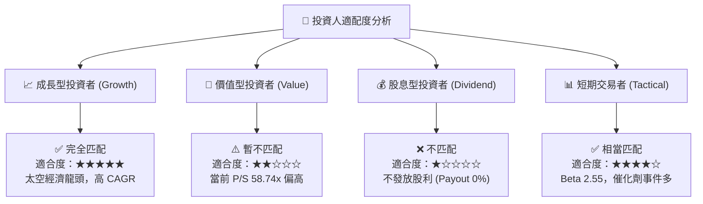

### 10.5 每季財報監控清單（Quarterly Watch List）

| 監控指標 | 最新數據 (Q1 2026) | 理想目標區間 | 觸發加碼門檻 | 觸發減碼/停損門檻 |
|----------|-------------------|--------------|--------------|------------------|
| **單季營收 (Revenue)** | $200.35M | > $190M | > $220M (YoY > 70%) | < $160M (YoY < 20%) |
| **整體毛利率 (Gross Margin)**| 38.18% | 35% - 42% | > 42% | < 30% |
| **現金及短期投資** | $1.38B | > $800M | > $1.2B | < $500M (資金吃緊) |
| **Neutron 研發進度** | 複合材料與引擎測試 | 按時推進 | 完成首飛與軌道發射 | 宣佈延期 > 12 個月 |
| **Electron 年化發射次數** | ~16-20 次/年 | > 18 次/年 | > 24 次/年 | < 10 次/年 |

### 10.6 反面論證：什麼會證明論點錯誤（What Would Change My Mind）

```
╔══════════════════════════════════════════════════════════════════╗
║              ⚠️ 論點失效條件（Disconfirming Evidence）           ║
╠══════════════════════════════════════════════════════════════════╣
║  本投資論點在下列量化條件成立時，應重新評估並執行減碼或停損：     ║
║                                                                  ║
║  ☐ 核心太空系統 (Space Systems) 營收成長率連續兩季跌破 15% YoY   ║
║  ☐ 毛利率 (Gross Margin) 因競爭加劇大幅縮縮至 25% 以下           ║
║  ☐ 自由現金流 (FCF) 虧損持續擴大且燒錢速度使現金儲備降至 $400M 以下║
║  ☐ Neutron 首飛失敗且載荷全毀，導致大型客戶退單與毀約           ║
║  ☐ 美國國防部 (DoD) 大幅削減 SDA 太空架構之年度預算支出          ║
╚══════════════════════════════════════════════════════════════════╝
```

---

> **免責聲明**：本報告為 AI 自動生成，基於公開財務數據與專業模型推演，僅供研究參考，不構成任何買賣建議或投資邀約。投資有風險，入市需謹慎，請結合自身風險承受能力獨立決策。