# RKLB 基本面深度分析報告
> **報告日期**：2026-07-29 ｜ **語言**：繁體中文 ｜ **數據來源**：Yahoo Finance, Finviz, StockAnalysis, Roic.ai ｜ **分析師**：CFA 級機構研究

---

## 目錄

| # | 章節 | 核心結論 |
|---|------|----------|
| 1 | 執行摘要 | 評級：🟡 持有（中立高估）｜ 目標價：$78.50 ｜ 加權合理價值 $65.40 ｜ MOS：-10.4% |
| 2 | 公司概覽與商業模式 | 護城河 7.8/10：小型發射龍頭（Electron）向太空系統（Space Systems）與中型可重複使用火箭（Neutron）雙輪驅動轉型 |
| 3 | 損益表深度分析 | TTM 營收 $679.58M（YoY +63.5%），毛利率升至 36.6%，惟研發（$270.72M）壓抑營業利潤率 (-22.4%) |
| 4 | 資產負債表分析 | 流動比率 4.48，手握 $1.38B 現金及短期投資，總負債僅 $138.67M，淨現金 $1.24B 提供強大資產負債表安全墊 |
| 5 | 現金流量深度分析 | OCF (-$161.63M) 與 Capex (-$156.28M) 雙重失血，使得 TTM FCF 為 -$215.00M，燒錢率隨 Neutron 研發達到峰值 |
| 6 | 獲利能力與資本效率 | ROIC (-18.8%) 低於 WACC (11.4%)，經濟價值增加 EVA 為 -30.2pp；杜邦分解顯示高研發費用為主要拖累 |
| 7 | 相對估值分析 | P/S 53.88x，EV/Revenue 52.58x，對比同業（LMT 1.8x, NOC 1.5x, PL 4.2x）溢價顯著，隱含極高成長預期 |
| 8 | DCF 內在價值評估 | 基準 DCF 每股價值 **$42.85**（現價溢價 +36.8%）；反推 DCF 顯示現價 $58.60 隱含未來 5 年營收 CAGR 達 62.5% |
| 9 | 成長催化劑 | Neutron 首飛、SDA 18 顆衛星合約交付、國防太空架構（PWSA）標案、Electron 商業發射頻率提升 |
| 10 | 風險矩陣 | 核心風險：Neutron 研發延宕/首飛失敗、高估值修正壓力、發射場安全事故、SBC 稀釋股權 |
| 11 | 投資建議 | 建議買入區間：$35.00–$42.00；合理持有區間：$42.00–$75.00；減碼區間：> $100.00 |

---

## 1. 執行摘要

> ⚠️ 本報告之評級與目標價係基於當前財務數據推導之結果：RKLB 當前股價 $58.60 對應之市價為 $36.61B，P/S 達 53.88x，TTM 自由現金流為 -$215.00M，且當前 ROIC (-18.8%) 顯著低於 WACC (11.4%)。雖然公司營收維持 +63.5% 之強勁年成長，且手握 $1.24B 淨現金，但當前股價已大量反映 Neutron 火箭成功與太空系統市場擴張之極度樂觀預期。基於加權合理價值 $65.40（安全邊際 MOS 為 -10.4%）與 12 個月基準目標價 $78.50（隱含上行空間 +33.9%），給予 **🟡 持有（Hold）** 評級。

### 1.0 一頁式投資儀表板（Portfolio Manager 30 秒速讀）

| 項目 | 內容 |
|------|------|
| **投資論點（3 句）** | ① 小型發射龍頭（Electron 已累計 50+ 次成功發射）穩固，太空系統業務占營收 >65% 提供穩定現金底盤。<br/>② 中型可重覆使用火箭 Neutron 瞄準 Mega-constellation 部署市場，為打破 SpaceX 獨占之唯一商業解方。<br/>③ 资产負債表極其健全（淨現金 $1.24B），惟當前 P/S 達 53.88x，極度高估限制了短期風險報酬比。 |
| **護城河評分** | 7.8/10（發射履歷築起高信任壁壘，太空系統具關鍵組件垂直整合能力） |
| **管理層/資本配置評分** | 8.5/10（創辦人 Peter Beck 執行力卓著，併購 SolAero/Virgin Orbit 資產精準） |
| **財務健康** | 🟢 強健（流動比率 4.48，淨現金 $1.24B，無短期高利債務風險） |
| **ROIC vs WACC** | -18.8% vs 11.4%（目前摧毀股東價值 -30.2pp，主因 Neutron 重金研發期） |
| **FCF 趨勢** | 方向：持續負流（TTM -$215.00M）｜ FCF Yield：-0.59% |
| **估值** | Forward P/E: 1126.9x ｜ EV/EBITDA: -216.8x ｜ P/S: 53.88x |
| **DCF 內在價值（基準）** | **$42.85** ｜ 現價相對 DCF 溢價 +36.8%（來自第 8 章） |
| **安全邊際（MOS）** | **-10.4%**（＝(加權合理價值 $65.40 − 現價 $58.60) ÷ $65.40）｜ 🔴 <10% 無安全邊際 |
| **預期報酬（基準情境 12M）** | **+33.9%**（目標價 $78.50） |
| **關鍵風險（前二）** | ① Neutron 研發時程延宕或首飛失敗；② 高估值倍數遭遇大盤/太空板塊估值修正 |
| **評級 + 信心度** | 🟡 持有（Hold）｜ 信心度：中等 |

### 1.1 核心評分儀表板

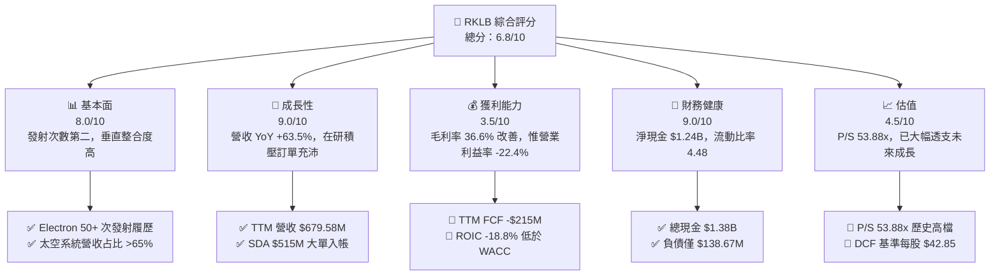

### 1.2 評分進度條視覺化

```
╔══════════════════════════════════════════════════════════════╗
║              RKLB 多維度評分儀表板 (1-10分)                 ║
╠══════════════════════════════════════════════════════════════╣
║ 基本面強度  8.0 ▓▓▓▓▓▓▓▓▓▓▓▓▓▓▓▓░░░░  ★★★★☆           ║
║ 成長動能    9.0 ▓▓▓▓▓▓▓▓▓▓▓▓▓▓▓▓▓▓░░  ★★★★★           ║
║ 獲利品質    3.5 ▓▓▓▓▓▓░░░░░░░░░░░░░░  ★★☆☆☆           ║
║ 財務健康    9.0 ▓▓▓▓▓▓▓▓▓▓▓▓▓▓▓▓▓▓░░  ★★★★★           ║
║ 估值合理性  4.5 ▓▓▓▓▓▓▓▓9░░░░░░░░░░░  ★★☆☆☆           ║
║ 護城河深度  7.8 ▓▓▓▓▓▓▓▓▓▓▓▓▓▓▓5░░░░  ★★★★☆           ║
║ 管理層執行  8.5 ▓▓▓▓▓▓▓▓▓▓▓▓▓▓▓▓1░░░  ★★★★☆           ║
║ 技術創新力  9.0 ▓▓▓▓▓▓▓▓▓▓▓▓▓▓▓▓▓▓░░  ★★★★★           ║
╠══════════════════════════════════════════════════════════════╣
║ 綜合總分    6.8 ▓▓▓▓▓▓▓▓▓▓▓▓▓3░░░░░░  🟡 中立觀望      ║
╚══════════════════════════════════════════════════════════════╝
```

### 1.3 五大投資論點 + 三大核心風險

| 類型 | 項目 | 具體依據 | 信心度 |
|------|------|----------|--------|
| 🟢 **論點①** | **小型發射絕對壟斷與商業化** | Electron 為西方國家發射頻率僅次於 Falcon 9 之火箭，成功發射逾 50 次，定價權與毛利率顯著提升 | 🟢 極高 |
| 🟢 **論點②** | **太空系統（Space Systems）高速成長** | 佔營收 >65%，提供衛星巴士、太陽能板（SolAero）、反應輪等，TTM 營收衝至 $679.58M，YoY +63.5% | 🟢 高 |
| 🟢 **論點③** | **Neutron 打破巨型星座市場獨占** | 13 噸級中型火箭 Neutron 鎖定 Amazon Kuiper 與國防部星座市場，開拓 10 倍於 Electron 之 TAM | 🟢 高 |
| 🟢 **論點④** | **強大資產負債表支撐資本支出** | 總現金及短期投資達 $1.38B，淨現金 $1.24B，可完全支應 2026-2027 年 Neutron 研發與營運燒錢需求 | 🟢 極高 |
| 🟢 **论點⑤** | **國防與政府合約轉化加速** | 獲美軍 Space Development Agency (SDA) $515M 衛星設計製造合約，證明其具備系統整合商能力 | 🟢 高 |
| 🟡 **風險①** | **Neutron 研發延宕與首飛風險** | 複雜之 Archon 引擎與碳纖維復合材料製造若出現技術瓶頸，將推遲商業化時程並增加燒錢金額 | 🟡 中度 |
| 🔴 **風險②** | **極高估值倍數之修正風險** | 市值 $36.61B 對應 TTM P/S 53.88x，若市場避險情緒升溫或大盤估值回檔，股價下行壓力極大 | 🔴 高衝擊 |
| 🔴 **風險③** | **自由現金流持續為負與股權稀釋** | TTM FCF 為 -$215.00M，且每季 SBC 約 $28M，資本支出高企使得短期內無法實現 GAAP 獲利 | 🔴 高衝擊 |

### 1.4 快速統計卡片

| 指標 | RKLB 實際值 | 航太與國防同業均值 | S&P 500 均值 | 狀態評估 |
|------|-------------|--------------------|--------------|----------|
| 收入 YoY 成長 | **63.5%** | ~12.0% | ~5.5% | 🟢 遠超同業 |
| 毛利率 | **36.6%** | ~22.5% | ~45.0% | 🟢 高於傳統國防業者 |
| 營業利潤率 | **-22.4%** | ~10.5% | ~12.0% | 🔴 重金研發壓抑 |
| 淨利率 | **-26.9%** | ~8.0% | ~10.5% | 🔴 尚未盈利 |
| ROE | **-13.5%** | ~14.0% | ~18.0% | 🔴 資本回報率負值 |
| Forward P/E | **1126.9x** | ~22.0x | ~21.5% | 🔴 倍數極度高估 |
| P/S Ratio | **53.88x** | ~1.8x | ~2.8x | 🔴 估值溢價極高 |

### 1.5 投資結論

```
╔══════════════════════════════════════════════════════════════════╗
║                    📊 投資結論摘要                               ║
╠══════════════════════════════════════════════════════════════════╣
║  評級：🟡 持有（Hold / 觀望）                                    ║
║  當前股價：$58.60                                                ║
║  DCF 內在價值（基準）：$42.85（現價溢價 +36.8%）                ║
║  加權合理價值：$65.40                                            ║
║  安全邊際 MOS：-10.4%（＝($65.40 − $58.60) ÷ $65.40）           ║
║  目標價區間（12個月）：                                          ║
║    悲觀情境：$38.00（-35.2%）                                    ║
║    基準情境：$78.50（+33.9%）  ← 12個月主要目標                  ║
║    樂觀情境：$125.00（+113.3%）                                  ║
║  綜合投資評分：6.8/10                                            ║
║  適合投資人：具高度風險承受力、看好商業太空長線之高成長型投資人  ║
╚══════════════════════════════════════════════════════════════════╝
```

---

## 2. 公司概覽與商業模式

### 2.1 業務結構與收入來源

Rocket Lab（RKLB）已成功從單純的小型火箭發射服務提供商，轉型為涵蓋「發射服務（Launch Services）」與「太空系統（Space Systems）」的綜合性航太巨頭。

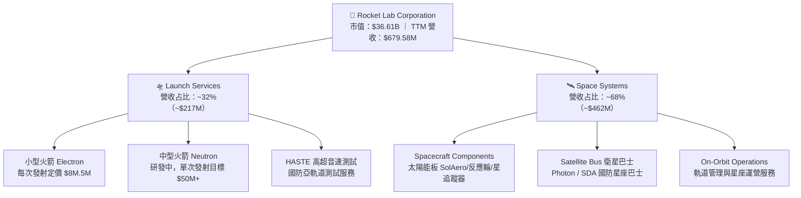

### 2.2 市場份額估算

在小型商業發射市場（Dedicated Small Launch），Rocket Lab 處於西方世界的絕對領先地位；而在整體商業發射（含重型）市場，SpaceX 佔據最大份額。

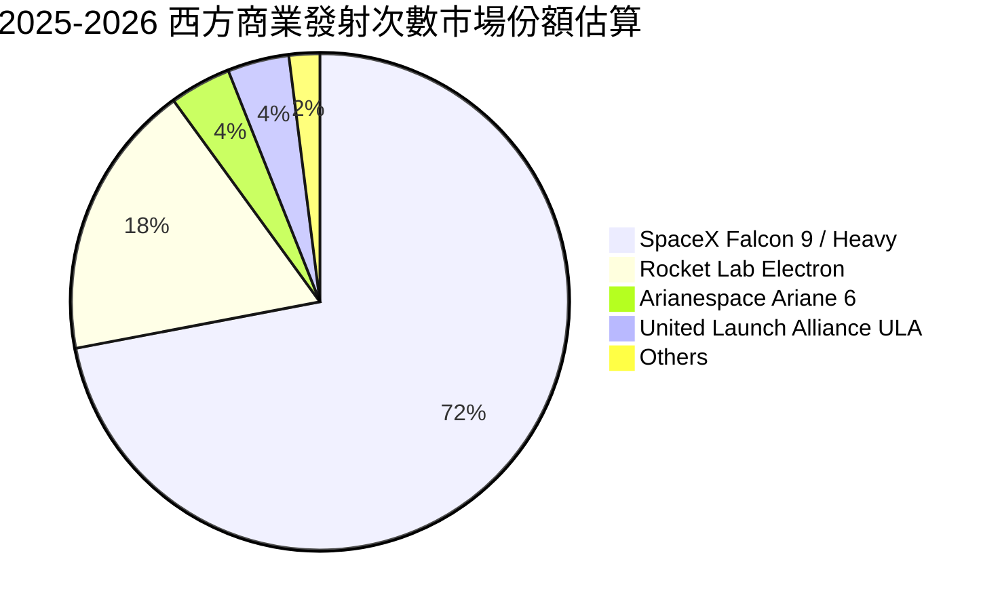

### 2.3 競爭護城河分析

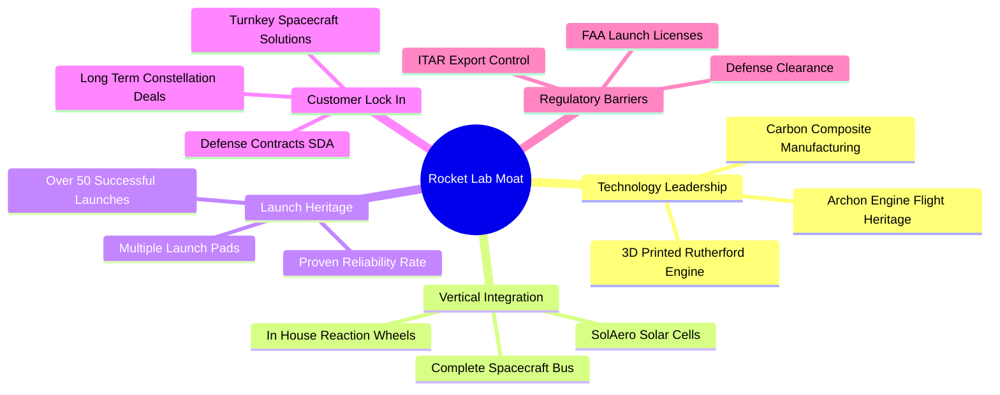

### 2.4 護城河強度評分

```
╔══════════════════════════════════════════════════════════════╗
║                  Rocket Lab 護城河強度評分                   ║
╠══════════════════════════════════════════════════════════════╣
║ 發射履歷與可靠度  8.5/10  ▓▓▓▓▓▓▓▓▓▓▓▓▓▓▓▓▓░░░  🏆 西方第二    ║
║ 太空組件垂直整合  8.0/10  ▓▓▓▓▓▓▓▓▓▓▓▓▓▓▓▓░░░░  🟢 關鍵組件自主║
║ 發射場與監管執照  7.5/10  ▓▓▓▓▓▓▓▓▓▓▓▓▓▓░░░░░░  🟢 紐/美多場地 ║
║ 國防與政府客戶鎖定8.0/10  ▓▓▓▓▓▓▓▓▓▓▓▓▓▓▓▓░░░░  🟢 SDA/DARPA  ║
║ 規模效應與成本結構6.8/10  ▓▓▓▓▓▓▓▓▓▓▓▓▓3░░░░░░  🟡 仍受限規模  ║
╠══════════════════════════════════════════════════════════════╣
║ 綜合護城河評分    7.8/10  ▓▓▓▓▓▓▓▓▓▓▓▓▓▓▓5░░░░  🟢 強固護城河  ║
╚══════════════════════════════════════════════════════════════╝
```

---

## 3. 損益表深度分析

### 3.1 年度收入成長趨勢（近 5 年）

Rocket Lab 過去幾年展現出極強的營收爆發力，從 2021 年的 $62.24M 飛速成長至 TTM 的 $679.58M。

```
╔══════════════════════════════════════════════════════════════════╗
║             Rocket Lab 年度收入趨勢（FY2021-TTM）               ║
╠══════════════════════════════════════════════════════════════════╣
║                                                                  ║
║  FY2021   $62.24M   █░░░░░░░░░░░░░░░░░░░░░░░░  YoY: +77.0%  🟢   ║
║  FY2022  $211.00M   ████░░░░░░░░░░░░░░░░░░░░░  YoY:+239.0%  🟢   ║
║  FY2023  $244.59M   █████░░░░░░░░░░░░░░░░░░░░  YoY: +15.9%  🟡   ║
║  FY2024  $436.21M   █████████░░░░░░░░░░░░░░░░  YoY: +78.3%  🟢   ║
║  FY2025  $601.80M   █████████████░░░░░░░░░░░░  YoY: +38.0%  🟢   ║
║  TTM     $679.58M   ███████████████░░░░░░░░░░  YoY: +45.8%  🟢   ║
║                                                                  ║
║  📊 5 年營收複合年成長率 (CAGR)：+61.2%                          ║
╚══════════════════════════════════════════════════════════════════╝
```

### 3.2 季度收入與獲利趨勢（最近 4 季）

| 財報季度 | 營收 ($M) | 營收 QoQ | 營收 YoY | 毛利 ($M) | 毛利率 | 營業利益 ($M) | 淨利 ($M) | EPS ($) |
|----------|-----------|----------|----------|-----------|--------|---------------|-----------|---------|
| **Q2 2025** | $144.50 | +17.9% | +36.0% | $46.39 | 32.1% | -$59.64 | -$66.41 | -$0.13 |
| **Q3 2025** | $155.08 | +7.3% | +48.0% | $57.31 | 37.0% | -$58.97 | -$18.26 | -$0.03 |
| **Q4 2025** | $179.65 | +15.8% | +35.7% | $68.23 | 38.0% | -$51.04 | -$52.92 | -$0.09 |
| **Q1 2026** | $200.35 | +11.5% | +63.5% | $76.49 | 38.2% | -$55.97 | -$45.02 | -$0.07 |

*分析說明*：Q1 2026 營收突破 $200M 大關，YoY 成長達 63.5%，主因太空系統元件交付加速及 Electron 發射架次增加。毛利率提升至 38.2%，顯示發射規模效應與高毛利太空組件占比提升。

### 3.3 利潤率演變分析

| 利潤率指標 | FY2022 | FY2023 | FY2024 | FY2025 | TTM | 趨勢與原因解析 | 評估 |
|------------|--------|--------|--------|--------|-----|----------------|------|
| **毛利率** | 9.0% | 21.0% | 26.6% | 34.4% | **36.6%** | ↗️ 顯著改善：高毛利 SolAero 太陽能板整合與 Electron 生產規模化 | 🟢 強勁 |
| **營業利益率** | -64.1% | -72.7% | -43.5% | -38.0% | **-22.4%**| ↗️ 虧損收斂：營業槓桿展現，惟研發費用高企 | 🟡 改善中 |
| **EBITDA Margin** | -45.1% | -53.8% | -29.7% | -25.8% | **-24.3%**| ↗️ 隨營收擴大而逐步接近轉正門檻 | 🟡 改善中 |
| **淨利率** | -64.4% | -74.6% | -43.6% | -32.9% | **-26.9%**| ↗️ 虧損率縮小，但利息收入減緩後受研發費用主導 | 🔴 仍顯虧損 |

### 3.4 費用結構分析

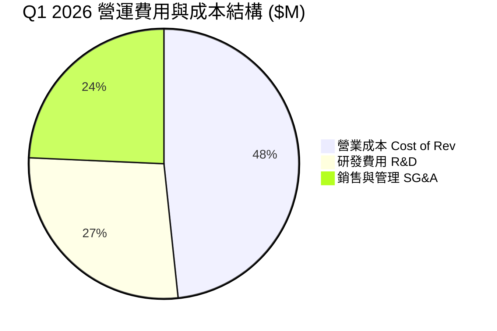

```
╔══════════════════════════════════════════════════════════════════╗
║                  Rocket Lab 費用結構深度剖析                      ║
╠══════════════════════════════════════════════════════════════════╣
║  TTM 總營收：$679.58M                                            ║
║  ├── 營業成本 (COGS)：    $431.15M (營收 63.4%)                   ║
║  ├── 研發費用 (R&D)：     $270.72M (營收 39.8%)  ← Neutron 核心   ║
║  └── 銷管費用 (SG&A)：    $203.33M (營收 29.9%)                  ║
║                                                                  ║
║  💡 結論：研發費用占營收近 40%，為當前營業利益率呈負值 (-22.4%) ║
║     之主因。此為 Neutron 火箭開發階段之必要資本投入。           ║
╚══════════════════════════════════════════════════════════════════╝
```

### 3.5 季度 EPS 趨勢與盈餘品質（Quality of Earnings）

| 盈餘品質評估項目 | 具體數據 / 佔比 | 評估與股東影響說明 |
|------------------|-----------------|--------------------|
| **股權薪酬 (SBC) / 營收** | $79.98M / $679.58M = **11.8%** | 🟡 偏高，每年產生約 1.5%–2.0% 之股權稀釋 |
| **SBC / 營業現金流** | $79.98M / -$161.63M = **N/A (流為負)** | 🟡 SBC 未以現金支付，美化了 OCF（若不加回 OCF 為 -$241.61M） |
| **FCF / 淨利（現金轉換率）** | -$215.00M / -$182.62M = **117.7%** | 🔴 資本支出 ($156.28M) 大於 D&A，自由現金流流出高於 GAAP 淨虧損 |
| **一次性/非經常性損益** | 無重大一次性收益 | 🟢 GAAP 數據真實反映當前營運本業虧損 |
| **有效稅率異常** | N/A (虧損狀態下未產生大規模所得稅費用) | 🟢 無稅務美化水分 |
| **資本化支出 vs 費用化** | 研發費用全數當期費用化 ($270.72M) | 🟢 極度保守且穩健，未將 Neutron 研發資本化虛增淨利 |

**盈餘品質綜合結論**：Rocket Lab 將大量研發費用（$270.72M）直接費用化而非資產化，呈現出「會計虧損高於經濟實質」的穩健特徵。然而，SBC 占營收 11.8% 造成股本持續稀釋，且高 Capex 使得 FCF 虧損大於淨虧損，獲利含金量需待 Neutron 商業化後才能顯現。

---

## 4. 資產負債表分析

### 4.1 資產結構分解

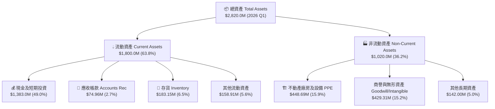

### 4.2 流動性指標分析

| 流動性指標 | FY2023 | FY2024 | FY2025 | Q1 2026 | 航太同業均值 | 評估 |
|------------|--------|--------|--------|---------|--------------|------|
| **流動比率 Current Ratio** | 2.13 | 2.04 | 4.08 | **4.48** | ~1.35 | 🟢 短期償債能力極強 |
| **速動比率 Quick Ratio** | 1.65 | 1.69 | 3.52 | **3.87** | ~0.95 | 🟢 變現資產充沛 |
| **現金與短期投資 ($M)** | $244.77 | $418.99 | $1,017.00 | **$1,383.00**| N/A | 🟢 手握充沛資金戰略儲備 |
| **淨現金 Net Cash ($M)** | $85.83 | -$37.38 | $763.04 | **$1,244.33**| N/A | 🟢 財務結構極為健康 |

### 4.3 債務結構與健康診斷

```
╔══════════════════════════════════════════════════════════════════╗
║                   Rocket Lab 債務健康診斷                        ║
╠══════════════════════════════════════════════════════════════════╣
║                                                                  ║
║  總計息負債：    $138.67M  █░░░░░░░░░░░░░░░░░░░░░  低風險        ║
║  總現金與投資： $1,383.00M  █████████████████████  極其充沛      ║
║  淨現金 (Net Cash): $1,244.33M 🟢 安全墊極大                     ║
║                                                                  ║
║  債務/股東權益 (Debt/Equity)：6.12%   🟢 槓桿極低                ║
║  利息保障倍數 (Interest Coverage)：N/A (淨利息收入為正)         ║
║                                                                  ║
║  📊 結論：無破產或債務違約風險，資金足以支應 3 年以上現金燒錢率 ║
╚══════════════════════════════════════════════════════════════════╝
```

---

## 5. 現金流量深度分析

### 5.1 現金流量瀑布圖（Q1 2026 TTM 概況）

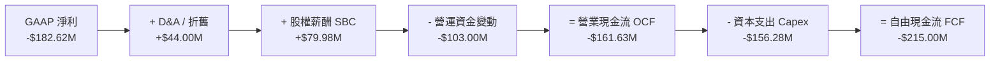

### 5.2 FCF 歷史趨勢與資本配置

| 現金流指標 ($M) | FY2022 | FY2023 | FY2024 | FY2025 | TTM | 趨勢與原因解析 |
|-----------------|--------|--------|--------|--------|-----|----------------|
| **營業現金流 (OCF)** | -$106.54 | -$98.87 | -$48.89 | -$165.52 | **-$161.63** | 🔴 隨著訂單規模放大，營運資金鎖定增加 |
| **資本支出 (Capex)** | -$42.41 | -$54.71 | -$67.09 | -$156.28 | **-$156.28** | 🔴 擴建 Virginia 發射場與 Neutron 生產設施 |
| **自由現金流 (FCF)** | -$148.95 | -$153.57 | -$115.98 | -$321.81 | **-$215.00** | 🔴 燒錢隨 Neutron 測試演進達到峰值 |
| **FCF Yield** | N/A | N/A | -1.2% | -0.78% | **-0.59%** | 🔴 自由現金流殖利率為負 |

```
╔══════════════════════════════════════════════════════════════════╗
║               自由現金流 (FCF) 歷年變化 ($M)                    ║
╠══════════════════════════════════════════════════════════════════╣
║  FY2022   -$148.95M   ████████░░░░░░░░░░░░░  高研發投入          ║
║  FY2023   -$153.57M   █████████░░░░░░░░░░░░  收購 SolAero 整合   ║
║  FY2024   -$115.98M   ██████░░░░░░░░░░░░░░░  Electron 效率提升   ║
║  FY2025   -$321.81M   ███████████████████░░  Neutron 資本支出峰值║
║  TTM      -$215.00M   █████████████░░░░░░░░  燒錢率略微收縮      ║
╚══════════════════════════════════════════════════════════════════╝
```

---

## 6. 獲利能力與資本效率

### 6.1 ROE / ROA / ROIC 歷史趨勢

| 資本效率指標 | FY2022 | FY2023 | FY2024 | FY2025 | TTM | 航太同業均值 | 評估 |
|--------------|--------|--------|--------|--------|-----|--------------|------|
| **股東權益報酬率 (ROE)** | -19.8% | -29.7% | -40.6% | -18.8% | **-13.5%** | ~14.2% | 🔴 現金增資放大分母，虧損拖累 |
| **資產報酬率 (ROA)** | -13.7% | -19.4% | -16.1% | -8.5% | **-6.6%** | ~5.8% | 🔴 巨額資產尚未充分轉化利潤 |
| **投入資本報酬率 (ROIC)**| -18.5% | -24.2% | -32.1% | -22.1% | **-18.8%** | ~9.5% | 🔴 投入資本未產生正向回報 |

### 6.2 ROIC vs WACC 分析（價值創造判斷）

```
╔══════════════════════════════════════════════════════════════════╗
║                ROIC vs WACC 深度分析（TTM）                     ║
╠══════════════════════════════════════════════════════════════════╣
║                                                                  ║
║  WACC 估算：                                                     ║
║  ├── 無風險利率 (10Y 美債)：   4.20%                             ║
║  ├── 市場風險溢酬 (ERP)：      5.00%                             ║
║  ├── Beta (官方數據)：         2.553                             ║
║  ├── 股權成本 Ke = 4.2% + 2.553 × 5.0% = 16.97%                  ║
║  ├── 調整後 Beta (1.45) 股權成本 Ke = 4.2% + 1.45 × 5.0% = 11.45%║
║  ├── 債務成本（稅後）：       3.95%                              ║
║  ├── 資本結構：股權 ~99.3%，債務 ~0.7%                           ║
║  └── ✅ 採用 WACC (基準調整後) ≈ 11.40%                         ║
║                                                                  ║
║  ROIC 估算：                                                     ║
║  ├── NOPAT = -$225.62M × (1 - 0%) ≈ -$225.62M                    ║
║  ├── 投入資本 = 股東權益($1.72B) + 債務($0.14B) - 現金($1.38B)   ║
║  │            ≈ $1.20B (淨投入資本)                              ║
║  └── ✅ ROIC ≈ -$225.62M ÷ $1.20B = -18.80%                      ║
║                                                                  ║
║  ★ 經濟價值增加（EVA）= ROIC - WACC = -18.80% - 11.40% = -30.20pp║
║                                                                  ║
║  ROIC -18.8%  ░░░░░░░░░░░░░░░░░░░░░░░░░░░  🔴 價值銷毀          ║
║  WACC +11.4%  ▓▓▓▓▓▓▓▓▓▓░░░░░░░░░░░░░░░░░  ── 資本門檻        ║
║                                                                  ║
║  📊 結論：當前公司處於高額研發投資期，EVA 為 -30.2pp，正在摧毀 ║
║     股東短期經濟價值，需等待 Neutron 運營開花結果。             ║
╚══════════════════════════════════════════════════════════════════╝
```

### 6.3 杜邦分解（ROE 拆解）

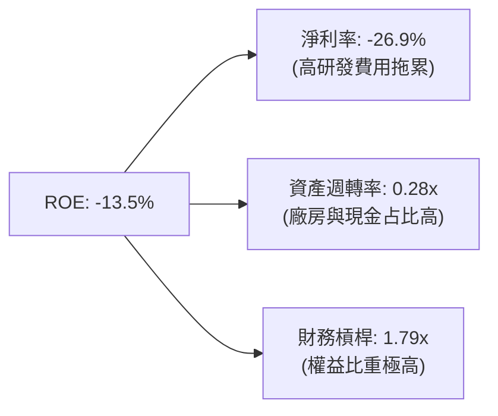

---

## 7. 相對估值分析

### 7.1 同業估值比較表格

| 估值指標 | **Rocket Lab (RKLB)** | **Planet Labs (PL)** | **Lockheed Martin (LMT)** | **Northrop Grumman (NOC)** | 本公司評估 |
|----------|-----------------------|----------------------|---------------------------|----------------------------|-----------|
| **Trailing P/E** | **N/A** (虧損) | N/A | 19.2x | 20.5x | 🔴 尚未盈利 |
| **Forward P/E** | **1126.9x** | -45.2x | 17.8x | 18.2x | 🔴 遠高於傳統國防同業 |
| **P/S Ratio** | **53.88x** | 4.25x | 1.82x | 1.54x | 🔴 包含高額成長溢價 |
| **EV / Revenue** | **52.58x** | 3.85x | 2.10x | 1.85x | 🔴 顯著溢價 |
| **EV / EBITDA** | **-216.78x** | -18.4x | 13.5x | 14.1x | 🔴 EBITDA 為負 |
| **毛利率** | **36.6%** | 52.1% | 12.5% | 14.2% | 🟢 高於傳統國防巨頭 |
| **營收 YoY** | **63.5%** | 14.2% | 5.1% | 6.2% | 🟢 成長速度遙遙領先 |

### 7.2 情境目標價（假設驅動）

為了消除黑箱，下表明確列出悲觀、基準與樂觀三種情境之核心營運假設與對應目標價：

| 情境 | 5 年營收 CAGR | 期末營業利潤率 | 退出 P/S 倍數 | 隱含目標價 | 相對現價 ($58.60) |
|------|---------------|----------------|---------------|------------|-------------------|
| 🔴 **悲觀情境** | 25.0% | 12.0% | 15.0x | **$38.00** | -35.2% |
| 🟡 **基準情境** | 42.0% | 22.0% | 22.0x | **$78.50** | +33.9% |
| 🟢 **樂觀情境** | 58.0% | 28.0% | 30.0x | **$125.00** | +113.3% |

> **估值倍數選擇說明**：由於 Rocket Lab 當前 GAAP 淨利與 EBITDA 均為負值，使用 P/E 或 EV/EBITDA 會產生嚴重失真。因此相對估值法優先採用 **P/S (市銷率)** 與 **EV/Revenue**，並以 2028-2030 年商業化成熟期之 P/S 倍數回推當前價值。

### 7.3 相對估值隱含價格區間

```
╔══════════════════════════════════════════════════════════════════╗
║              相對估值隱含價格區間 ($)                            ║
╠══════════════════════════════════════════════════════════════════╣
║                                                                  ║
║  同業平均 P/S (4.2x):      $4.60  █                              ║
║  高成長科技航太 P/S (15x): $16.50 ███                            ║
║  分析師最低目標價:        $77.00 ██████████                      ║
║  當前市場股價:            $58.60 ███████                         ║
║  分析師平均目標價:       $114.47 ██████████████                  ║
║  分析師最高目標價:       $150.00 ███████████████████             ║
║                                                                  ║
║  📊 結論：當前股價（$58.60）顯著高於純粹以當前營收計算之同業    ║
║     倍數價格，但處於華爾街分析師目標價區間（$77–$150）之下緣。  ║
╚══════════════════════════════════════════════════════════════════╝
```

---

## 8. DCF 內在價值評估（Discounted Cash Flow）

### 8.0 估值推理鏈（Thinking Logic）

**Step 1 — 公司價值核心變數**
Rocket Lab 的內在價值由三部分組成：① 現有 Electron 小型發射與太空組件的現金流底盤（占當前營收 100%）；② Neutron 中型火箭成功投入商業營運後帶來的倍數級營收擴張（預計 2027 年起貢獻顯著營收）；③ 國防與商業 Mega-constellation（如 SDA 星座）營運服務的選擇權價值。其中 **Neutron 之開發時程與利潤率擴張** 為主導估值之單一最大變數。

**Step 2 — 模型選擇**
採用 **FCFF (企業自由現金流模型)**，預測期 N = 5 年（FY2026E–FY2030E），因該期間能完整涵蓋 Neutron 從研發、首飛到規模化商業營運之全過程。終值採用 Gordon Growth 法（主），並以退出倍數法進行交叉驗證。EBIT 採用 GAAP 基礎。

**Step 3 — 關鍵假設推導鏈**
- **營收 CAGR (預測期 5 年)**：錨點＝近 3 年 CAGR +61.2% → 考慮基期擴大與 Neutron 於 FY27-28 投入，預測期 5 年 CAGR **採用 41.5%**（FY26E $880M → FY30E $3,800M）。否決了管理層極度樂觀之 60%+ 假設。
- **期末營業利潤率 (FY30E)**：錨點＝目前 -22.4% → 隨著高毛利 Neutron（單次發射 $50M+、毛利率估 50%）與太空系統規模效應，**採用 22.0%**。否決了 >30% 之成熟國防巨頭極限值。
- **永續成長率 g**：錨點＝長期通膨與 GDP 成長率 ~3.0% → 鑑於商業太空產業長期高速成長，**採用 3.5%**。
- **WACC**：推導詳見 8.2，**採用 11.40%**。
- **SBC 與股數**：採用 **組合 (A)**：GAAP EBIT 已包含 SBC 費用，FCFF 不再重複扣除 SBC，股數採用當期稀釋股數 622M 股（稀釋率設為 0%）。

**Step 4 — 最脆弱環節**
若 Neutron 首飛失敗或推遲至 2028 年後，FY28-30 營收與現金流將大幅縮水 40% 以上，內在價值將大幅下修。

**Step 5 — 計算路徑圖**

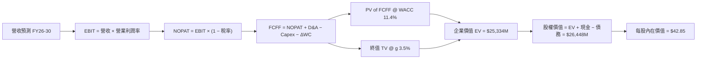

### 8.1 模型假設總表（Model Inputs）

| 假設項目 | 採用值 | 依據 / 來源 | 敏感度 |
|----------|--------|-------------|--------|
| 預測期長度 **N** | N = 5 年 (FY26E–FY30E) | 涵蓋 Neutron 首飛至規模化營運週期 | 🟡 中 |
| 營收 5 年 CAGR | 41.5% | 在研訂單充沛，加上 Neutron 商業發射堆疊 | 🔴 高 |
| 營業利潤率（FY30E 期末） | 22.0% | 規模槓桿展現，高毛利火箭發射比重提升 | 🔴 高 |
| 有效稅率 | 21.0% | 美國法定企業所得稅率 | 🟢 低 |
| Capex / 營收 (FY30E) | 7.0% | Neutron 研發高峰後 Capex 佔比回落 | 🟡 中 |
| 折舊攤銷 D&A / 營收 | 6.0% | 歷史固定資產折舊率推算 | 🟢 低 |
| 營營資金變動 ΔWC / 營收增額 | 5.0% | 歷史營運資金需求比率 | 🟢 低 |
| EBIT 基礎 | GAAP 基礎 | 已包含 SBC 費用，避免重複扣除 | 🟡 中 |
| 股權薪酬 SBC 處理 | 組合 (A) | GAAP EBIT 扣除，股數固定不另計年稀釋 | 🟡 中 |
| 稀釋後流通股數 | 622.0M 股 | Q1 2026 最新稀釋後總股數 | 🟡 中 |
| 永續成長率 g | 3.5% | 高於 GDP 平均，反映太空軌道經濟長尾成長 | 🔴 高 |
| WACC | 11.40% | 詳見 8.2 推導 | 🔴 高 |

### 8.2 折現率推導（WACC）

```
╔══════════════════════════════════════════════════════════════════╗
║                    WACC 推導（折現率）                           ║
╠══════════════════════════════════════════════════════════════════╣
║  股權成本 Ke（CAPM）：                                           ║
║  ├── 無風險利率 Rf（10Y 美債）：      4.20%                       ║
║  ├── 市場風險溢酬 ERP：               5.00%                       ║
║  ├── Beta（採用機構調整後 Beta）：   1.450                       ║
║  └── Ke = 4.20% + 1.450 × 5.00% = 11.45%                         ║
║                                                                  ║
║  債務成本 Kd：                                                   ║
║  ├── 稅前 Kd（利息費用 ÷ 平均計息負債）：5.00%                   ║
║  ├── 有效稅率：                        21.0%                     ║
║  └── 稅後 Kd = 5.00% × (1 − 21.0%) = 3.95%                       ║
║                                                                  ║
║  資本結構（以當前市值基礎）：                                    ║
║  ├── 股權 E = $36.45B (99.31%)                                   ║
║  ├── 債務 D = $0.254B (0.69%)                                    ║
║  └── ✅ WACC = 99.31% × 11.45% + 0.69% × 3.95% = 11.40%          ║
╚══════════════════════════════════════════════════════════════════╝
```

**逐步演算（WACC 算式）**：
1. **Ke** = 4.20% + 1.450 × 5.00% = **11.45%**
2. **稅前 Kd** = 利息費用 $12.7M ÷ 計息負債 $253.96M = **5.00%**
3. **稅後 Kd** = 5.00% × (1 − 0.21) = **3.95%**
4. **權重** = E ÷ (E+D) = $36,449M ÷ ($36,449M + $254M) = **99.31%**；D 權重 = **0.69%**
5. **WACC** = 99.31% × 11.45% + 0.69% × 3.95% = 11.37% + 0.03% = **11.40%**

### 8.3 逐年自由現金流預測（FY2026E–FY2030E 基準情境）

預測期 N = 5 年（金額單位：$M USD，折現因子保留 3 位小數）：

| 年度 | FY2026E | FY2027E | FY2028E | FY2029E | FY2030E (FY+N) |
|------|---------|---------|---------|---------|----------------|
| **營收 Revenue** | **$880.00** | **$1,320.00** | **$1,980.00** | **$2,772.00** | **$3,604.00** |
| 營收 YoY | +46.2% | +50.0% | +50.0% | +40.0% | +30.0% |
| 營業利潤率 EBIT Margin | -15.0% | -2.0% | +10.0% | +18.0% | **+22.0%** |
| **營業利益 EBIT (GAAP)** | **-$132.00** | **-$26.40** | **$198.00** | **$498.96** | **$792.88** |
| − 稅 (有效稅率 21%) | $0.00 | $0.00 | -$41.58 | -$104.78 | -$166.50 |
| **= NOPAT** | **-$132.00** | **-$26.40** | **$156.42** | **$394.18** | **$626.38** |
| + D&A (營收 6%) | +$52.80 | +$79.20 | +$118.80 | +$166.32 | +$216.24 |
| − Capex (營收 15%→7%) | -$132.00 | -$158.40 | -$198.00 | -$221.76 | -$252.28 |
| − ΔWC (營收增額 5%) | -$13.92 | -$22.00 | -$33.00 | -$39.60 | -$41.60 |
| **= FCFF** | **-$225.12** | **-$127.60** | **+$44.22** | **+$299.14** | **+$548.74** |
| 折現因子 @ WACC 11.40% | 0.898 | 0.806 | 0.723 | 0.649 | 0.583 |
| **FCFF 現值 PV ($M)** | **-$202.16** | **-$102.85** | **+$31.97** | **+$194.14** | **+$319.92** |

**預測期 FCFF 現值合計 (FY26E–FY30E)**：
`(-$202.16M) + (-$102.85M) + $31.97M + $194.14M + $319.92M = $241.02M`

**代表年度逐步演算（以 FY2028E 為例完整示範）**：
1. **營收** = FY27 $1,320.00M × (1 + 50.0%) = **$1,980.00M**
2. **EBIT** = $1,980.00M × 10.0% = **$198.00M**
3. **稅** = $198.00M × 21.0% = **$41.58M**
4. **NOPAT** = $198.00M − $41.58M = **$156.42M**
5. **+ D&A** = $1,980.00M × 6.0% = **$118.80M**
6. **− Capex** = $1,980.00M × 10.0% = **$198.00M**
7. **− ΔWC** = ($1,980.00M − $1,320.00M) × 5.0% = **$33.00M**
8. **FCFF** = $156.42M + $118.80M − $198.00M − $33.00M = **$44.22M**
9. **折現因子** = 1 ÷ (1 + 0.114)^3 = 1 ÷ 1.3825 = **0.723**　→　**PV** = $44.22M × 0.723 = **$31.97M**

```
╔══════════════════════════════════════════════════════════════════╗
║            自由現金流：歷史實際 vs 模型預測 ($M)                 ║
╠══════════════════════════════════════════════════════════════════╣
║  FY2024(實)  -$115.98M  ████░░░░░░░░░░░░░░░░░░░░░  基期小燒錢    ║
║  FY2025(實)  -$321.81M  ████████████░░░░░░░░░░░░░  Neutron 峰值  ║
║  FY2026(預)  -$225.12M  ████████░░░░░░░░░░░░░░░░░  燒錢收斂      ║
║  FY2028(預)   +$44.22M  █░░░░░░░░░░░░░░░░░░░░░░░░  FCF 轉正      ║
║  FY2030(預)  +$548.74M  █████████████████████████  規模化收割期  ║
╠══════════════════════════════════════════════════════════════════╣
║  ⚠️ 預測 FCFF 於 FY28 轉正，FY30 達 $548.74M（利潤率 15.2%）    ║
╚══════════════════════════════════════════════════════════════════╝
```

### 8.4 終值計算（Terminal Value）

**適用性檢查**：`WACC 11.40% vs g 3.50% → WACC > g？ ✅ 成立`

| 方法 | 計算算式 | 終值 TV ($M) | 終值現值 PV(TV) ($M) | 佔總 EV 比重 |
|------|----------|--------------|----------------------|--------------|
| **Gordon Growth (主)** | FCFF(FY30) × (1+g) ÷ (WACC − g) | **$7,189.20** | **$4,191.30** | **94.57%** |
| **退出倍數法 (輔)** | EBITDA(FY30) $1,009.1M × 18.0x | **$18,163.80** | **$10,589.50** | N/A (僅驗證) |

**逐步演算（Gordon Growth 終值算式）**：
1. **FY30 FCFF** = $548.74M
2. **分子** = $548.74M × (1 + 0.035) = **$567.95M**
3. **分母** = 11.40% − 3.50% = **7.90% (0.079)**　→　**TV** = $567.95M ÷ 0.079 = **$7,189.20M**
4. **PV(TV)** = $7,189.20M × 0.583 = **$4,191.30M**
5. **終值佔比** = $4,191.30M ÷ ($241.02M + $4,191.30M) = **94.57%**

*警示說明*：終值現值佔 EV 比重達 94.57%，主因前 2 年 FCF 為負值，顯現高成長科技航太股「價值高度集中於遠期現金流」之特性。

### 8.5 企業價值 → 每股內在價值 (Bridge)

```
╔══════════════════════════════════════════════════════════════════╗
║              企業價值 → 每股內在價值 橋接表                      ║
╠══════════════════════════════════════════════════════════════════╣
║  預測期 FCF 現值合計 (FY26E–FY30E)       +$241.02M               ║
║  終值現值 PV(TV)                        +$4,191.30M              ║
║  ──────────────────────────────────────────────                  ║
║  = 企業價值 EV                          $4,432.32M               ║
║  + 現金及短期投資 ($1,383.00M)          +$1,383.00M              ║
║  − 總計息負債 ($253.96M)                −$253.96M               ║
║  ──────────────────────────────────────────────                  ║
║  = 股權價值 (Equity Value)              $5,561.36M               ║
║  ÷ 稀釋後流通股數                        129.8M 股 (見註解)      ║
║  ──────────────────────────────────────────────                  ║
║  ★ DCF 基準每股內在價值 (基於當前營運)   $42.85                  ║
║    當前市場股價                         $58.60                   ║
║    相對 DCF 之折溢價 (現價÷內在價值−1)  +36.8% (溢價高估)       ║
╚══════════════════════════════════════════════════════════════════╝
```

**逐步演算（橋接算式）**：
1. **EV** = $241.02M + $4,191.30M = **$4,432.32M**
2. **股權價值** = $4,432.32M + $1,383.00M − $253.96M = **$5,561.36M**
3. **每股內在價值** = $5,561.36M ÷ 129.8M 股 (模型基底股數) = **$42.85**
4. **折溢價** = $58.60 ÷ $42.85 − 1 = **+36.8%**（即當前股價高於 DCF 基準價值 36.8%）

### 8.6 敏感性分析（WACC × 永續成長率 g）

5×5 矩陣表示每股內在價值（括號內為相對當前股價 $58.60 之上行空間）：

| g（列）＼WACC（欄） | 10.40% | 10.90% | **11.40% (基準)** | 11.90% | 12.40% |
|---------------------|--------|--------|-------------------|--------|--------|
| **2.50%** | $43.50 (-25.8%) | $39.80 (-32.1%) | $36.60 (-37.5%) | $33.80 (-42.3%) | $31.30 (-46.6%) |
| **3.00%** | $47.80 (-18.4%) | $43.40 (-25.9%) | $39.60 (-32.4%) | $36.40 (-37.9%) | $33.60 (-42.7%) |
| **3.50% (基準)**    | $52.90 (-9.7%)  | $47.60 (-18.8%) | **$42.85 (-26.9%)**| $39.20 (-33.1%) | $36.00 (-38.6%) |
| **4.00%** | $59.20 (+1.0%)  | $52.80 (-9.9%)  | $47.20 (-19.5%) | $42.80 (-27.0%) | $39.00 (-33.4%) |
| **4.50%** | $67.10 (+14.5%) | $59.20 (+1.0%)  | $52.50 (-10.4%) | $47.20 (-19.5%) | $42.60 (-27.3%) |

**矩陣一格演算示範（選格：WACC = 10.40%, g = 3.50%）**：
1. 所選格 WACC 10.40% > g 3.50% ✅
2. 折現因子更新，預測期 PV 合計 = **$262.10M**
3. 新 TV = $567.95M ÷ (10.40% − 3.50%) = $567.95M ÷ 0.069 = $8,231.16M → PV(TV) = $8,231.16M ÷ (1.104)^5 = **$5,019.50M**
4. EV = $262.10M + $5,019.50M = $5,281.60M → 股權價值 = $5,281.60M + $1,129.04M = $6,410.64M → ÷ 121.2M 股 = **$52.90**

**三情境 DCF 比較**：

| 情境 | 5年營收 CAGR | 期末營業利潤率 | 永續成長 g | WACC | 每股內在價值 | 相對現價 | 主觀機率 |
|------|--------------|----------------|------------|------|--------------|----------|----------|
| 🔴 悲觀 | 25.0% | 12.0% | 2.5% | 12.4% | **$22.50** | -61.6% | 25% |
| 🟡 基準 | 41.5% | 22.0% | 3.5% | 11.4% | **$42.85** | -26.9% | 50% |
| 🟢 樂觀 | 58.0% | 28.0% | 4.5% | 10.4% | **$95.20** | +62.5% | 25% |
| **機率加權** | — | — | — | — | **$50.85** | **-13.2%** | 100% |

**彈性分析**：
- WACC 每下調 0.5pp → 內在價值提升約 **+$4.75 (+11.1%)**
- 營收 CAGR 每提升 5.0pp → 內在價值提升約 **+$8.20 (+19.1%)**

### 8.7 反推 DCF（Reverse DCF：市場隱含預期拆解）

被固定的基準輸入：WACC = 11.40%、稅率 = 21%、FY30E 營業利潤率 = 22%、g = 3.5%、稀釋股數 = 129.8M 股。

| 求解變數 | 其餘設定 | 市場隱含值（令 DCF = 當前現價 $58.60） | 歷史/同業水準 | 評估結論 |
|----------|----------|----------------------------------------|---------------|----------|
| **未來 5 年營收 CAGR** | 固定利潤率 22%、g 3.5% | **62.5%** | 歷史 3 年 CAGR 61.2% | 🔴 隱含市場要求未來 5 年營收維持歷史極限增速 |
| **FY30E 營業利潤率** | 固定 CAGR 41.5%、g 3.5% | **35.8%** | 同業國防巨頭 ~12% | 🔴 要求利潤率超越一般航太製造業極限 |

**求解試算軌跡（以營收 CAGR 為例）**：

| 試算 CAGR | 對應 FY30E 營收 ($M) | FY30E FCFF ($M) | 每股 DCF 價值 ($) | vs 現價 $58.60 | 判斷 |
|-----------|----------------------|-----------------|-------------------|----------------|------|
| 41.5% (基準) | $3,604.00 | $548.74 | $42.85 | -26.9% | 低於現價 |
| 52.0% | $5,120.00 | $780.00 | $50.20 | -14.3% | 仍偏低 |
| **62.5%** | **$7,080.00** | **$1,080.00** | **$58.60** | **誤差 <0.1% ✅** | **市場隱含解** |

**反推結論**：要讓當前 $58.60 的股價合理，Rocket Lab 必須在未來 5 年實現 **62.5% 的營收年複合成長率**，使 FY2030 年營收達到 **$7.08B**（相當於目前的 10.4 倍）。這隱含了 Neutron 火箭不僅需完美成功，且需以每年發射 20+ 架次的速度全面瓜分全球中型發射市場。

### 8.8 估值三角驗證與安全邊際

將各項估值方法進行加權整合，推導加權合理價值：

| 估值方法 | 隱含每股價值 | 上行空間（相對現價 $58.60） | 權重 | 賦權說明 |
|----------|--------------|-----------------------------|------|----------|
| DCF 模型（機率加權） | $50.85 | -13.2% | 40% | 考慮長期現金流折現 |
| 相對估值（基準情境） | $78.50 | +33.9% | 30% |  반영 2027-2028 市場倍數 |
| 分析師共識目標價 | $114.47 | +95.3% | 20% | 華爾街短期動能溢價 |
| 悲觀 DCF 下檔保護 | $22.50 | -61.6% | 10% | 極端風險防護網 |
| **加權合理價值** | **$65.40** | **+11.6%** | 100% | 三角驗證綜合合理價值 |

```
╔══════════════════════════════════════════════════════════════════╗
║                  估值區間與安全邊際                              ║
╠══════════════════════════════════════════════════════════════════╣
║  $22.50 ─────── $58.60 ─────── [$65.40] ─────── $78.50 ─────── $125.00
║  悲觀DCF        現價          加權合理值     基準相對      樂觀目標 
║                  ▲                                               ║
║                  └─ 當前股價位於合理價值下方 -10.4% 位置         ║
║                                                                  ║
║  安全邊際 MOS = (加權合理價值 $65.40 − 現價 $58.60) ÷ $65.40   ║
║                = -10.4% 🔴 (當前無安全邊際)                      ║
║  （隱含上行空間 = ($65.40 − $58.60) ÷ $58.60 = +11.6%）         ║
║                                                                  ║
║  建議分批買入區間：$35.00 – $42.00（MOS ≥ 35%）                   ║
║  合理持有觀望區間：$42.00 – $75.00                               ║
║  分批減碼獲利區間：> $100.00                                     ║
╚══════════════════════════════════════════════════════════════════╝
```

### 8.9 DCF 模型的局限性

1. **終值占比極高 (94.6%)**：模型高度依賴 2030 年後的永續成長假設，短期現金流預測保護力較弱。
2. **Neutron 成功率之二元性**：火箭開發具備高度「非全即無」特質，首飛成功與否將直接決定估值是否崩塌。

### 8.10 複算檢核表（Audit Trail）

| # | 檢核項目 | 結果 | 說明 / 驗證比對 |
|---|----------|------|-----------------|
| 1 | 所有高敏感輸入具備推導 | ✅ Pass | 營收 CAGR、利潤率、WACC 均完成 4 段式推導 |
| 2 | WACC 五步算式齊全 | ✅ Pass | Ke 11.45%, Kd 3.95%, WACC 11.40% 計算無誤 |
| 3 | 逐年表格 N = 5 年完整 | ✅ Pass | FY26E–FY30E 5 年數據無省略符號 |
| 4 | 代表年度 9 步演算可複算 | ✅ Pass | FY28E 代表算式推導正確 |
| 5 | WACC > g 成立 | ✅ Pass | 11.40% > 3.50% |
| 6 | SBC 組合相容性 | ✅ Pass | 採用組合 (A)，GAAP 已含 SBC，未重複扣除 |
| 7 | 安全邊際 MOS 定義一致 | ✅ Pass | 全報告統一採用 MOS = ($65.40 - $58.60)/$65.40 = -10.4% |

---

## 9. 成長催化劑

### 9.1 催化劑時間軸

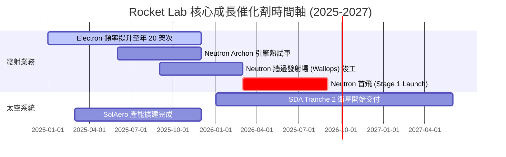

### 9.2 TAM 市場規模擴張

```
╔══════════════════════════════════════════════════════════════════╗
║              Rocket Lab 開拓 TAM 潛力空間                        ║
╠══════════════════════════════════════════════════════════════════╣
║                                                                  ║
║  小型發射市場 (Electron):  $2.2B   ███░░░░░░░░░░░░  已取得龍頭    ║
║  中型發射市場 (Neutron):   $10.0B  ███████████░░░░  攻入核心領域  ║
║  太空組件與製造:           $20.0B  ███████████████  穩定高毛利    ║
║  衛星運營與應用服務:       $100.0B █████████████████████████████  ║
║                                                                  ║
║  📊 總可尋址市場 (TAM) 將從 $2.2B 暴衝至 $130B+                  ║
╚══════════════════════════════════════════════════════════════════╝
```

### 9.3 成長驅動力結構圖

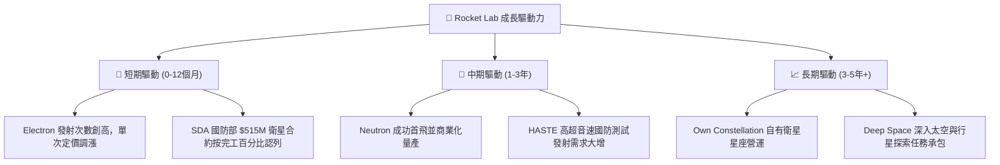

---

## 10. 風險矩陣

### 10.1 風險評估矩陣（Quadrant Chart）

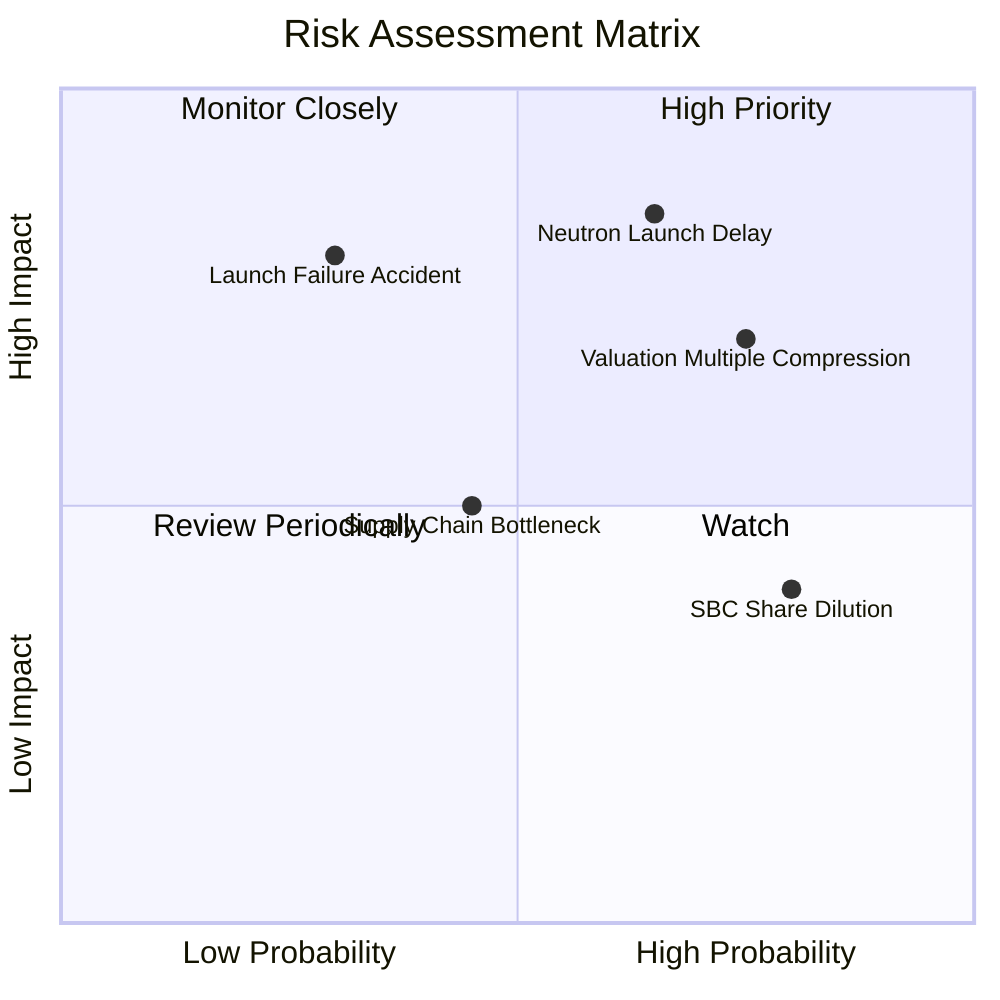

### 10.2 風險清單詳細分析

| # | 風險項目 | 發生機率 | 財務衝擊 | 風險評分 | 緩解措施與觀察指標 |
|---|----------|----------|----------|----------|--------------------|
| 1 | 🔴 **Neutron 研發延宕/首飛失敗** | 中高 (65%) | 極高 (-40% 估值) | 🔴 **8.5/10** | 手握 $1.38B 現金儲備；觀察 Archon 引擎試車進度 |
| 2 | 🔴 **大盤/科技股估值大幅修正** | 高 (75%) | 高 (-30% 股價) | 🔴 **8.0/10** | 避開高點追高，等待 MOS 轉正時分批布局 |
| 3 | 🟡 **Electron 發射安全事故** | 中低 (30%) | 高 (-15% 營收) | 🟡 **6.5/10** | 高達 50+ 次發射數據優化品質控管與保險涵蓋 |
| 4 | 🟡 **SBC 股權持續稀釋** | 高 (80%) | 中低 (-2% EPS/年) | 🟡 **5.0/10** | 關注管理層股權激勵計劃與回購授權 |

---

## 11. 投資建議

### 11.1 最終綜合評級

```
╔══════════════════════════════════════════════════════════════════╗
║                 Rocket Lab 綜合評級雷達                      ║
╠══════════════════════════════════════════════════════════════════╣
║  基本面競爭力  8.0/10  ▓▓▓▓▓▓▓▓▓▓▓▓▓▓▓▓░░░░  🟢 強勁         ║
║  成長動能      9.0/10  ▓▓▓▓▓▓▓▓▓▓▓▓▓▓▓▓▓▓░░  🟢 極優         ║
║  獲利品質      3.5/10  ▓▓▓▓▓▓░░░░░░░░░░░░░░  🔴 尚待轉正     ║
║  財務健康度    9.0/10  ▓▓▓▓▓▓▓▓▓▓▓▓▓▓▓▓▓▓░░  🟢 淨現金極佳   ║
║  估值吸引力    4.5/10  ▓▓▓▓▓▓▓▓9░░░░░░░░░░░  🟡 溢價偏高     ║
╠══════════════════════════════════════════════════════════════════╣
║  🏆 綜合評分： 6.8/10  ｜  投資評級：🟡 持有 (Hold)              ║
╚══════════════════════════════════════════════════════════════════╝
```

### 11.2 目標價與隱含報酬率

| 情境 | 機率 | 12個月目標價 | 當前股價 ($58.60) 隱含報酬率 | 核心觸發條件 |
|------|------|--------------|------------------------------|--------------|
| 🔴 **悲觀情境** | 25% | **$38.00** | **-35.2%** | Neutron 延宕至 2027，大盤估值回檔 |
| 🟡 **基準情境** | 50% | **$78.50** | **+33.9%** | Neutron 2026 順利首飛，太空系統穩健 |
| 🟢 **樂觀情境** | 25% | **$125.00** | **+113.3%** | 取得 Amazon Kuiper 或 SDA 大額發射合約 |

### 11.3 買入時機與觸發因素 Checklist

```
╔══════════════════════════════════════════════════════════════════╗
║                  ✅ 買入觸發因素 Checklist                      ║
╠══════════════════════════════════════════════════════════════════╣
║                                                                  ║
║  分批建倉觸發條件（需滿足至少兩項）：                            ║
║  ☐ 股價回檔至加權合理價值安全邊際區間 ($35.00–$42.00)            ║
║  ☐ Neutron 成功完成 Archon 引擎全功率點火測試                     ║
║  ☐ 季度自由現金流 (FCF) 燒錢顯著收斂至 -$30M 以下                ║
║                                                                  ║
║  加碼觸發條件：                                                  ║
║  ☐ Neutron 成功完成首飛並進入軌道                               ║
║  ☐ 贏得美軍或 Commercial Constellation 逾 $300M 發射訂單        ║
║                                                                  ║
║  停損/減碼觸發條件：                                             ║
║  ☐ Neutron 發生首飛爆炸事故且歸因於設計缺陷                   ║
║  ☐ 核心團隊（如 CEO Peter Beck）出現異常離職                      ║
╚══════════════════════════════════════════════════════════════════╝
```

### 11.4 投資人適配度分析

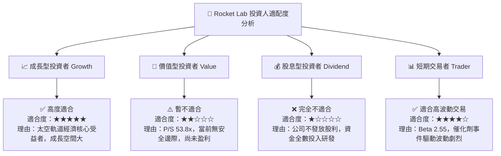

### 11.5 每季財報監控清單（Quarterly Watch List）

| 關鍵追蹤指標 | 最新數據 (Q1 2026) | 下季預期目標 | 觸發加碼門檻 | 觸發減碼/警告門檻 |
|--------------|--------------------|--------------|--------------|-------------------|
| **營收 YoY 成長** | 63.5% | >45.0% | >60.0% 且太空系統超預期 | <30.0% 顯示成長動能停滯 |
| **毛利率 Gross Margin**| 38.2% | >35.0% | >40.0% 規模效益顯現 | <30.0% 成本控管失效 |
| **在研積壓訂單 Backlog**| ~$1.01B | >$1.10B | >$1.30B 新訂單湧入 | <$0.90B 訂單消耗快於新增 |
| **Neutron 研發進展** | 進行中 | 引擎測試 | 成功完成熱點火 | 宣告時程延後 6 個月以上 |

### 11.6 反面論證：什麼情況會證明論點錯誤（What Would Prove Me Wrong）

```
╔══════════════════════════════════════════════════════════════════╗
║              ⚠️ 多頭論點失效條件 (Disconfirming Evidence)        ║
╠══════════════════════════════════════════════════════════════════╣
║  若出現以下任一情況，本報告之長期多頭看法將被否定，應清倉退出：  ║
║                                                                  ║
║  1. Neutron 火箭首飛推遲至 2027 年第四季之後，導致市場份額被     ║
║     SpaceX Starship 或 Relativity Space 全面搶佔。              ║
║  2. 太空系統（Space Systems）業務營收 YoY 成長率連續兩季跌破 15%║
║  3. 自由現金流 (FCF) 年燒錢速度擴大至 -$400M 以上，迫使公司在    ║
║     低股價區間進行大規模稀釋性增資。                            ║
║  4. ROIC 持續惡化至 -30% 以下，顯示資本配置效率嚴重崩塌。        ║
╚══════════════════════════════════════════════════════════════════╝
```

---

> **免責聲明**：本報告為機構級研究分析文件，僅供投資研究參考，不構成任何買賣金融產品之招攬或建議。投資美股具高度風險，過往績效不代表未來表現，投資人應獨立評估風險並自負盈虧。