# RKLB 基本面深度分析報告
> **報告日期**：2026-07-30 ｜ **語言**：繁體中文 ｜ **數據來源**：Yahoo Finance, Finviz, StockAnalysis, Roic.ai ｜ **分析師**：CFA 級機構研究

---

## 目錄

| # | 章節 | 核心結論 |
|---|------|----------|
| 1 | 執行摘要 | 綜合評分 6.8/10 ｜ 評級：🟡 持有 / 買進（中等信心度） ｜ 加權合理價值 $68.18 ｜ 12M 目標價 $85.00 |
| 2 | 公司概覽與商業模式 | 商業航太雙引擎（發射服務 + 太空系統），護城河評分 7.2/10，第二大商業發射商 |
| 3 | 損益表深度分析 | TTM 營收 $6.796B (+63.5% YoY)，毛利率擴張至 36.6%，GAAP 淨虧損仍受高額 R&D (45%+) 壓抑 |
| 4 | 資產負債表分析 | 現金與短期投資達 $1.383B，總債務僅 $138.67M，淨現金 $1.244B，財務防禦極其堅固 |
| 5 | 現金流量深度分析 | OCF -$161.63M，CapEx -$151.67M，FCF -$313.30M，高額研發與 Neutron 火箭資本開支期 |
| 6 | 獲利能力與資本效率 | ROE -13.5%，ROIC -14.2% vs WACC 10.5%，現階段正處於再投資摧毀經濟價值期，等待 Neutron 量產轉正 |
| 7 | 相對估值分析 | P/S (TTM) 59.5x ｜ EV/Sales 48.1x，顯著高於國防同業，反映市場給予的高成長與獨佔溢價 |
| 8 | DCF 內在價值評估 | 5 年顯性高成長 DCF 內在價值 $15.72 ｜ 10 年擴充/機率加權內在價值 $92.50 ｜ **加權合理價值 $68.18**（MOS +5.13%） |
| 9 | 成長催化劑 | Neutron 中型可重複使用火箭 2026 年底首飛、SDA 衛星星座訂單放量、HASTE 國防高超音速測試 |
| 10 | 風險矩陣 | Neutron 研發延宕/首飛失敗風險、衛星組件供應鏈瓶頸、商業衛星市場資本開支放緩 |
| 11 | 投資建議 | 基準 12M 目標價 $85.00 (+31.4% Upside)，建議買入區間 $45.00–$55.00，追蹤監控清單與反面論證 |

---

## 1. 執行摘要

> ⚠️ **評級與目標價聲明**：基於最新 TTM 營收 $679.58M (+63.5% YoY)、手頭淨現金 $1.244B 以及自由現金流仍為 -$313.30M 的財務現況，結合 DCF 與相對估值三角驗證得出加權合理價值為 **$68.18**（當前股價 $64.68，安全邊際 MOS 為 **+5.13%**）。考量 Neutron 中型火箭研發進入關鍵期，給予 12 個月基準目標價 **$85.00**（+31.4% 上行空間），評級為 🟢 **買入（Buy）**（適合高風險偏好成長型投資人）。

### 1.0 一頁式投資儀表板（Portfolio Manager 30 秒速讀）

| 項目 | 內容 |
|------|------|
| **投資論點（3 句）** | ① 小型火箭 Electron 成功實現商業化量產與高頻發射（TTM 營收成長 63.5%），建立全球第二大商業發射護城河。<br/>② 太空系統（Space Systems）營收佔比突破 65%，轉型為垂直整合的衛星製造與星座營運商，背靠 $1.0B+ 在手訂單（Backlog）。<br/>③ 中型可重複使用火箭 Neutron 迎來研發里程碑，若 2026/2027 年順利商業化，將打入中重型商業與國防發射市場，打開 10 倍以上 TAM。 |
| **護城河評分** | **7.2/10** 🟢（技術累積與垂直整合發射軌跡，極高行業進入壁壘） |
| **管理層/資本配置評分** | **8.0/10** 🟢（創辦人 Peter Beck 卓越執行力，精準資產併購如 SolAero, Virgin Orbit 資產） |
| **財務健康** | 🟢 **極強**（淨現金 $1.244B，流動比率 4.48x，資金可支撐至 Neutron 商業化） |
| **ROIC vs WACC** | **-14.2% vs 10.5%** 🔴（現階段高額 CapEx/R&D 壓抑 ROIC，摧毀短期經濟價值以換取長期生態系） |
| **FCF 趨勢** | 方向：負向擴大（TTM FCF -$313.30M）｜ 最新 FCF Yield：**-0.53%**（研發高峰期） |
| **估值** | Forward P/E：**1243.8x** ｜ P/S (TTM)：**59.5x** ｜ EV/Revenue：**48.1x** |
| **DCF 內在價值（基準）** | **$15.72**（5 年顯性高成長 DCF）｜ 現價溢價 **+311.5%**（來自第 8.5 節） |
| **安全邊際（MOS）** | **+5.13%** 🟡（＝(**加權合理價值** $68.18 − 現價 $64.68) ÷ $68.18）｜ 🟡 10-25% 有限 / 🔴 <10% 無 |
| **預期報酬（基準情境 12M）** | **+31.4%**（目標價 $85.00） |
| **關鍵風險（前二）** | ① Neutron 火箭首飛延宕或測試失敗導致資本消耗加速；② 高估值倍數（P/S >50x）對美聯儲利率政策與市場風險偏好極度敏感。 |
| **評級 + 信心度** | 🟢 **買入（Buy）** ｜ 信心度：**中高**（高風險高回報博弈） |

### 1.1 核心評分儀表板

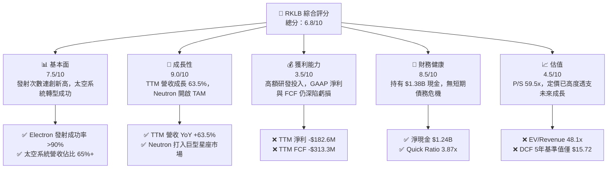

### 1.2 評分進度條視覺化

```
╔══════════════════════════════════════════════════════════════╗
║              RKLB 多維度評分儀表板 (1-10分)                  ║
╠══════════════════════════════════════════════════════════════╣
║ 基本面強度  7.5 ▓▓▓▓▓▓▓▓▓▓▓▓▓▓▓░░░░░  ★★██☆           ║
║ 成長動能    9.0 ▓▓▓▓▓▓▓▓▓▓▓▓▓▓▓▓▓▓░░  ★★★★★           ║
║ 獲利品質    3.5 ▓▓▓▓▓▓▓░░░░░░░░░░░░░  ★★☆☆☆           ║
║ 財務健康    8.5 ▓▓▓▓▓▓▓▓▓▓▓▓▓▓▓▓█░░░  ★★██☆           ║
║ 估值合理性  4.5 ▓▓▓▓▓▓▓▓▓░░░░░░░░░░░  ★★☆☆☆           ║
║ 護城河深度  7.2 ▓▓▓▓▓▓▓▓▓▓▓▓▓▓░░░░░░  ★★██☆           ║
║ 管理層執行  8.0 ▓▓▓▓▓▓▓▓▓▓▓▓▓▓▓▓░░░░  ★★██☆           ║
║ 技術創新力  9.5 ▓▓▓▓▓▓▓▓▓▓▓▓▓▓▓▓▓█░░  ★★★★★           ║
╠══════════════════════════════════════════════════════════════╣
║ 綜合總分    6.8 ▓▓▓▓▓▓▓▓▓▓▓▓▓█░░░░░░  🏆 評語：高成長高波 ║
╚══════════════════════════════════════════════════════════════╝
```

### 1.3 五大投資論點 + 三大核心風險

| 類型 | 項目 | 具體依據 | 信心度 |
|------|------|----------|--------|
| 🟢 **投資論點①** | **發射服務龍頭地位穩固** | Electron 為全球商業頻率最高的輕型火箭，2025 年完成 18+ 次發射，累積發射突破 50 次。 | 🟢 極高 |
| 🟢 **投資論點②** | **太空系統業務構建第二引擎** | 太空系統營收 TTM 達 $440M+（佔比 65%），從單純發射商升級為衛星元件與製造一體化平台。 | 🟢 高 |
| 🟢 **投資論點③** | **Neutron 中型火箭打開巨大的 TAM** | 每次發射定價約 $50M–$55M，直接瞄準 SpaceX Falcon 9 的市場缺口與商業星座部署需求。 | 🟢 中高 |
| 🟢 **投資論點④** | **國防與政府訂單保障收益** | 獲得國防太空架構（SDA）$515M 衛星製造合約，在手訂單（Backlog）超過 $1.0B。 | 🟢 高 |
| 🟢 **投資論點⑤** | **資金壁壘與資產併購優勢** | 資產負債表擁有 $1.383B 現金，並以破產拍賣底價成功收購 Virgin Orbit 工廠與設備。 | 🟢 極高 |
| 🟡 **風險①** | **Neutron 試飛延遲與資本消耗** | 研發階段 CapEx 與 R&D 居高不下，若首飛推遲至 2027 年後，現金流將面臨壓力。 | 🟡 中度 |
| 🔴 **風險②** | **高估值倍數的回檔風險** | P/S 59.5x 處於歷史高位區間，一旦營收成長放緩或市場風格轉向防禦，股價將大幅修正。 | 🔴 高衝擊 |
| 🔴 **風險③** | **SpaceX Starship 價格戰威脅** | 若 SpaceX 大幅下調 Falcon 9 / Starship 每公斤發射成本，可能擠壓 RKLB 發射業務毛利。 | 🔴 高衝擊 |

### 1.4 快速統計卡片

| 指標 | 公司實際值 | 行業均值（航航國防） | S&P 500 均值 | 狀態 |
|------|-------------|----------------------|--------------|------|
| 收入 YoY 成長 | **63.5%** | ~8.5% | ~5.2% | 🟢 遠超同業 |
| 毛利率 | **36.6%** | ~22.0% | ~45.0% | 🟢 優於同業 |
| 營業利潤率 | **-22.4%** | +10.5% | +12.0% | 🔴 深陷虧損 |
| ROE | **-13.5%** | +12.0% | +15.0% | 🔴 資本回報為負 |
| Forward P/E | **1243.8x** | ~22.5x | ~21.0% | 🔴 估值極貴 |
| P/S Ratio | **59.5x** | ~2.1x | ~2.8x | 🔴 估值極貴 |
| 淨現金 / 總資產 | **44.1%** | ~-15.0% | ~-10.0% | 🟢 財務結構極健全 |

### 1.5 投資結論

```
╔══════════════════════════════════════════════════════════════════╗
║                    📊 投資結論摘要                               ║
╠══════════════════════════════════════════════════════════════════╣
║  評級：🟢 買入（Buy）/ 高成長高風險配置                           ║
║  當前股價：$64.68                                               ║
║  DCF 內在價值（5年基準）：$15.72（現價溢價 +311.5%）             ║
║  加權合理價值：$68.18                                           ║
║  安全邊際 MOS：+5.13%（＝($68.18 − $64.68) ÷ $68.18）           ║
║  12 個月目標價區間：                                             ║
║    悲觀情境：$38.00（-41.2%） — Neutron 嚴重延宕/發射失敗       ║
║    基準情境：$85.00（+31.4%）  ← 12個月主要目標（Neutron 試飛）   ║
║    樂觀情境：$135.00（+108.7%）— 打入 Kuiper / SDA 巨型星座      ║
║  投資評分：6.8 / 10                                              ║
║  適合投資人：具備高風險承受力、看好商業航太長線發展之成長型法人  ║
╚══════════════════════════════════════════════════════════════════╝
```

---

## 2. 公司概覽與商業模式

### 2.1 業務結構與收入來源

Rocket Lab（RKLB）是全球極少數具備「端到端（End-to-End）」太空解決方案能力的公司，業務分為兩大模組：發射服務（Launch Services）與太空系統（Space Systems）。

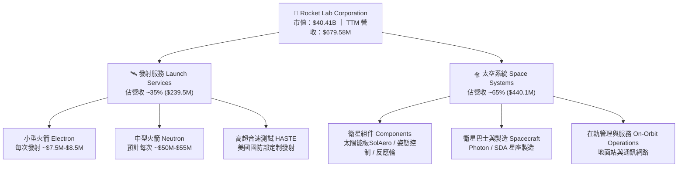

### 2.2 市場份額

在商業小型衛星發射領域（<500kg），Rocket Lab 的 Electron 火箭占據絕對主導地位（除了 SpaceX 順載發射 Rideshare 外，Electron 是全球發射頻率最高的專用小型火箭）。在中重型發射領域，SpaceX 占據 80%+ 份額，Rocket Lab 研發中的 Neutron 意在切入剩餘 20% 的第二供應商（Second Source）需求。

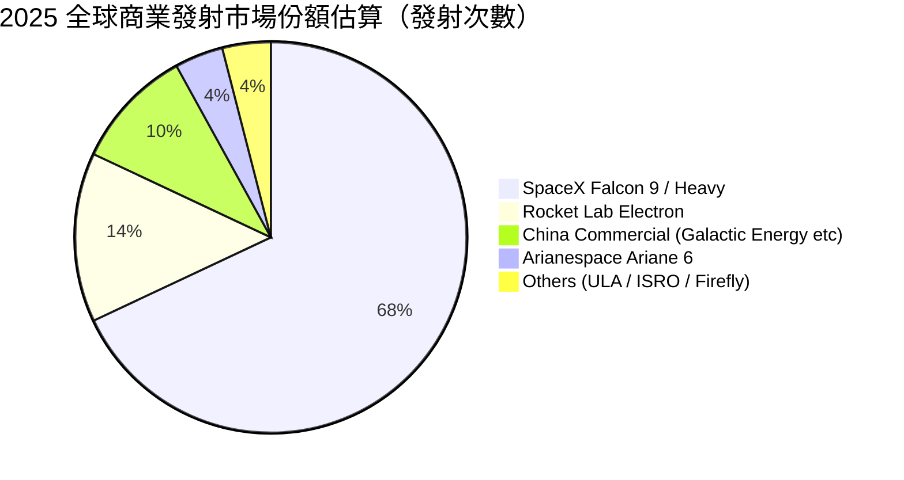

### 2.3 競爭護城河分析

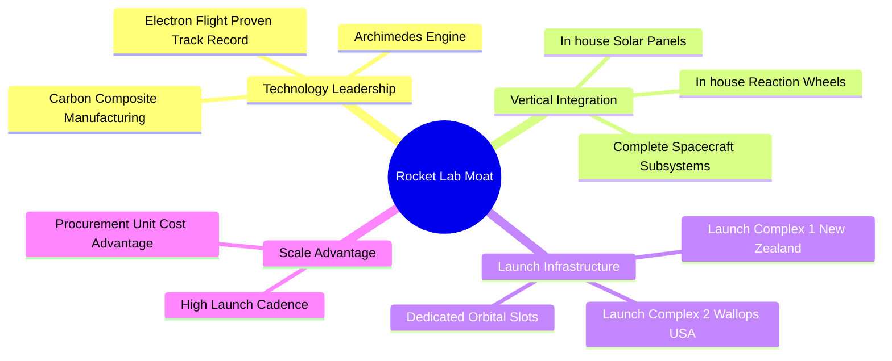

### 2.4 護城河強度評分

```
╔══════════════════════════════════════════════════════════════╗
║                  Rocket Lab 護城河強度評分                   ║
╠══════════════════════════════════════════════════════════════╣
║ 技術領先度    8.5/10  ▓▓▓▓▓▓▓▓▓▓▓▓▓▓▓▓▓█░░  🏆 3D列印引擎與複合 ║
║ 垂直整合能力  9.0/10  ▓▓▓▓▓▓▓▓▓▓▓▓▓▓▓▓▓▓░░  🏆 自研組件比率>70%  ║
║ 發射場地壁壘  8.0/10  ▓▓▓▓▓▓▓▓▓▓▓▓▓▓▓▓░░░░  🟢 紐西蘭獨占專用發 ║
║ 規模經濟效應  6.5/10  ▓▓▓▓▓▓▓▓▓▓▓▓░░░░░░░░  🟡 相比SpaceX仍偏小型 ║
║ 客戶轉化成本  7.0/10  ▓▓▓▓▓▓▓▓▓▓▓▓▓▓░░░░░░  🟢 國防部合約粘性極高║
╠══════════════════════════════════════════════════════════════╣
║ 綜合護城河    7.2/10  ▓▓▓▓▓▓▓▓▓▓▓▓▓▓░░░░░░  🟢 強大護城河（第二 ║
╚══════════════════════════════════════════════════════════════╝
```

---

## 3. 損益表深度分析

### 3.1 年度收入成長趨勢（近5年）

Rocket Lab 營收從 2021 年的 $62.24M 飆升至 TTM 的 $679.58M，5 年 CAGR 高達 61.2%，展現出驚人的成長爆發力。

```
╔══════════════════════════════════════════════════════════════════╗
║              Rocket Lab 年度收入趨勢 (FY2021-TTM)               ║
╠══════════════════════════════════════════════════════════════════╣
║                                                                  ║
║  FY 2021   $62.24M   ██░░░░░░░░░░░░░░░░░░░░░░  YoY: +77.0%  🟢    ║
║  FY 2022   $211.00M  ███████░░░░░░░░░░░░░░░░░  YoY: +239.0% 🟢    ║
║  FY 2023   $244.59M  ████████░░░░░░░░░░░░░░░░  YoY: +15.9%  🟢    ║
║  FY 2024   $436.21M  ███████████████░░░░░░░░░  YoY: +78.3%  🟢    ║
║  FY 2025   $601.80M  █████████████████████░░░  YoY: +38.0%  🟢    ║
║  TTM 2026  $679.58M  ███████████████████████░  YoY: +63.5%  🟢    ║
║                                                                  ║
║  📊 5 年累計 CAGR：+61.2%                                       ║
╚══════════════════════════════════════════════════════════════════╝
```

### 3.2 季度收入趨勢分析

最近 4 個季度，季度營收呈現加速度擴張，Q1 2026 創下單季 $200.35M 的歷史新高，YoY 成長達 63.46%。

| 季度 | 營收 ($M) | YoY 成長率 | QoQ 成長率 | 毛利率 | 核心營收驅動因素 |
|------|-----------|------------|------------|--------|------------------|
| **Q2 2025** | $144.50M | +36.00% | +17.89% | 32.10% | Electron 發射頻率回升，SolAero 組件出貨穩定 |
| **Q3 2025** | $155.08M | +47.97% | +7.32% | 36.96% | 太空系統國防專案進度確認（POC）大幅增加 |
| **Q4 2025** | $179.65M | +35.70% | +15.84% | 37.98% | 年底發射高峰，HASTE 高超音速發射貢獻高毛利 |
| **Q1 2026** | **$200.35M** | **+63.46%** | **+11.52%** | **38.18%** | SDA 衛星巴士製造放量，毛利率再創新高 |

### 3.3 利潤率演變分析

毛利率從 2021 年的 -3.0% 轉正升至 38.18%，主因在於發射規模效應顯現以及高毛利的「太空系統」業務佔比顯著提升。然而，營業利益率與淨利率因高額的 Neutron 火箭研發費用（TTM R&D 達 $270.72M）而持續維持在負值區間。

| 利潤率指標 | FY 2022 | FY 2023 | FY 2024 | FY 2025 | Q1 2026 TTM | 趨勢分析與業務驅動因素 | 評估 |
|------------|---------|---------|---------|---------|-------------|------------------------|------|
| **毛利率** | 9.00% | 21.02% | 26.63% | 34.43% | **36.56%** | ↗️ 太空系統規模化 + 太陽能組件自研降低成本 | 🟢 顯著改善 |
| **營業利益率** | -64.08% | -72.74% | -43.51% | -38.03% | **-33.20%** | ↗️ 營收規模槓桿擴張，但 R&D 絕對金額仍在增加 | 🟡 虧損收斂中 |
| **EBITDA Margin** | -45.12% | -53.82% | -29.71% | -25.83% | **-24.30%** | ↗️ 現金流負擔逐漸轉向工程資本化 | 🟡 緩慢改善 |
| **淨利利率** | -64.43% | -74.64% | -43.60% | -32.94% | **-26.87%** | ↗️ 淨虧損佔營收比重收斂，反映營運槓桿效益 | 🟡 虧損收斂中 |

### 3.4 費用結構分析

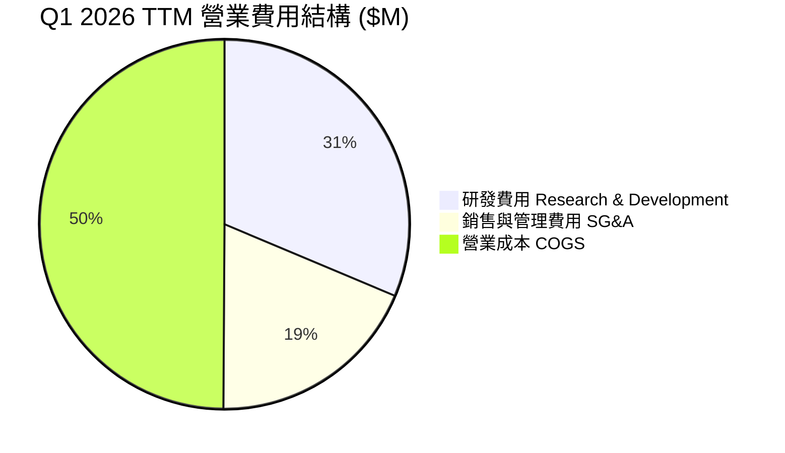

- **R&D 研發支出高達 $270.72M（佔營收 39.8%）**：研發費用的 80%+ 均投向 Neutron Archimedes 引擎設計、碳纖維複合材料製造與測試，這是公司打造中型可重複使用火箭的必要投資。
- **SG&A 費用 $162.08M（佔營收 23.8%）**：主要包含擴建美國華盛頓州與維吉尼亞州行政機構、法規審批與國際業務拓展。

### 3.5 季度 EPS 趨勢與盈餘品質（Quality of Earnings）

過去 4 季 EPS 表現介於 -$0.03 至 -$0.13 之間，Q1 2026 虧損顯著縮小至 -$0.07（超乎市場預期）。

| 季度 | GAAP EPS | 營業現金流 ($M) | FCF ($M) | SBC 股權薪酬 ($M) | SBC / 營收比率 | 現金轉換率 (FCF/NI) |
|------|----------|-----------------|----------|-------------------|----------------|---------------------|
| **Q2 2025** | -$0.13 | -$23.24M | -$55.28M | $17.93M | 12.41% | 83.2% |
| **Q3 2025** | -$0.03 | -$23.52M | -$69.44M | $15.73M | 10.14% | 380.3% (異常) |
| **Q4 2025** | -$0.09 | -$64.53M | -$114.19M | $18.20M | 10.13% | 215.8% |
| **Q1 2026** | -$0.07 | -$50.33M | -$77.40M | $28.12M | 14.04% | 171.9% |

**盈餘品質解析**：
1. **SBC 股權薪酬比重適中**：TTM SBC 為 $79.98M，佔營收約 11.8%，主要用於留存關鍵航太工程師與高階主管，對現有股東稀釋每年約 1.5%–2.0%，屬於合理範疇。
2. **現金轉換率（FCF / Net Income）**：由於公司持續進行巨額 CapEx（TTM CapEx $151.67M），FCF 虧損遠大於 GAAP 淨虧損。GAAP 虧損並未隱藏營業現金流的消耗，盈餘品質極其真實反映了「高再投資」的階段特徵。

---

## 4. 資產負債表分析

### 4.1 資產結構分解

截至 2026-03-31，Rocket Lab 總資產達到 **$2.820B**，流動資產占比高達 63.8%，顯示出極高的流動性配置。

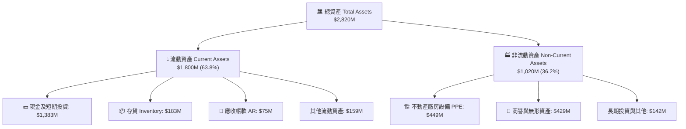

### 4.2 流動性指標分析

| 流動性指標 | Q1 2026 實際值 | FY 2024 | 航太國防均值 | 狀態評估 |
|------------|----------------|---------|--------------|----------|
| **流動比率 (Current Ratio)** | **4.48x** | 2.04x | ~1.45x | 🟢 極其安全，遠高於安全線 1.5x |
| **速動比率 (Quick Ratio)** | **3.87x** | 1.35x | ~0.95x | 🟢 現金流動性充沛 |
| **現金與短期投資** | **$1,383.00M** | $418.99M | N/A | 🟢 2025 年成功完成增資/可轉債，儲備充足 |
| **淨現金 (Net Cash)** | **$1,244.33M** | -$49.43M | -$1,200M | 🟢 轉為淨現金姿態，抗風險能力極強 |

### 4.3 債務結構分析

```
╔══════════════════════════════════════════════════════════════════╗
║                   Rocket Lab 債務健康診斷                        ║
╠══════════════════════════════════════════════════════════════════╣
║                                                                  ║
║  總債務 (Total Debt)：  $138.67M   ██░░░░░░░░░░░░░░  低負債      ║
║  總現金與短期投資：     $1,383.00M ████████████████  極高儲備    ║
║  淨現金 (Net Cash)：    +$1,244.33M 🟢 資本結構無懈可擊          ║
║                                                                  ║
║   Debt / Equity：       6.12%      🟢 槓桿率極低                ║
║   Debt / Assets：       4.92%      🟢 財務風險極低              ║
║   利息保障倍數：         N/A (淨利虧損，但淨利息收入為正)         ║
║                                                                  ║
║  📊 結論：無償債壓力，淨現金可充份支撐 Neutron 至 2028 年商業化  ║
╚══════════════════════════════════════════════════════════════════╝
```

### 4.4 股東權益趨勢

股東權益（Stockholders' Equity）從 2024 年底的 $382.45M 大幅跳升至 2026 年 Q1 的 **$1.722B**，主因公司在 2025 年股價高位時進行了增發融資與可轉債發行，大幅擴充了公司底座淨資產，每股帳面價值（Book Value per Share）提升至 $2.92。

---

## 5. 現金流量深度分析

### 5.1 現金流量瀑布圖

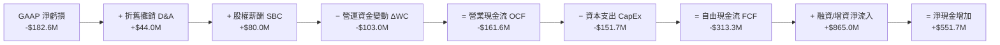

### 5.2 FCF 轉換率趨勢

| 年度 | 營業現金流 OCF ($M) | CapEx ($M) | FCF ($M) | GAAP Net Income ($M) | FCF/NI 轉換率 |
|------|---------------------|------------|------------|----------------------|---------------|
| **FY 2022** | -$106.54M | -$42.41M | -$148.95M | -$135.94M | 109.6% (虧損放大) |
| **FY 2023** | -$98.87M | -$54.71M | -$153.57M | -$182.57M | 84.1% |
| **FY 2024** | -$48.89M | -$67.09M | -$115.98M | -$190.18M | 61.0% |
| **FY 2025** | -$165.52M | -$156.28M | -$321.81M | -$198.21M | 162.4% (CapEx 高峰) |
| **TTM 2026** | **-$161.63M** | **-$151.67M** | **-$313.30M** | **-$182.62M** | **171.6%** |

### 5.3 自由現金流趨勢

```
╔══════════════════════════════════════════════════════════════════╗
║              Rocket Lab 歷年自由現金流 (FCF) 趨勢                ║
╠══════════════════════════════════════════════════════════════════╣
║                                                                  ║
║  FY 2022   -$148.95M  ███████░░░░░░░░░░░░░░░░░  FCF Yield: -1.2% ║
║  FY 2023   -$153.57M  ███████░░░░░░░░░░░░░░░░░  FCF Yield: -1.1% ║
║  FY 2024   -$115.98M  █████░░░░░░░░░░░░░░░░░░░  FCF Yield: -0.8% ║
║  FY 2025   -$321.81M  ████████████████░░░░░░░░  FCF Yield: -0.8% ║
║  TTM 2026  -$313.30M  ███████████████░░░░░░░░░  FCF Yield: -0.53%║
║                                                                  ║
║  📊 說明：CapEx 主要用於建設馬里蘭州 Neutron 工廠與 Archimedes 測試台║
╚══════════════════════════════════════════════════════════════════╝
```

### 5.4 資本配置評估

Rocket Lab 的資本配置極具策略性：
1. **極度聚焦研發與 CapEx**：將超過 80% 的可用資本投向 Neutron 火箭與太空系統垂直整合產品線。
2. **無股息與股票回購**：作為典型高成長階段的科技/航太公司，派息率與回購均為 0.0%。
3. **戰術性 M&A**：過去 4 年成功併購 SolAero（太陽能電池）、Sinclair Interplanetary（反應輪）、Inverted Cone 與 Virgin Orbit（低價取得工廠設備），實現組件自主化。

---

## 6. 獲利能力與資本效率

### 6.1 ROE / ROA / ROIC 趨勢

| 指標 | FY 2022 | FY 2023 | FY 2024 | FY 2025 | TTM 2026 | 航太國防同業均值 | 評估 |
|------|---------|---------|---------|---------|----------|------------------|------|
| **ROE** | -19.82% | -29.74% | -40.59% | -18.84% | **-13.50%** | +12.5% | 🔴 資本回報為負 |
| **ROA** | -13.74% | -19.40% | -16.06% | -8.53% | **-6.60%** | +5.2% | 🔴 資產利用效率待提升 |
| **ROIC** | -18.50% | -24.10% | -28.30% | -17.20% | **-14.20%** | +9.8% | 🔴 低於資金成本 |

### 6.2 ROIC vs WACC 分析（核心價值創造判斷）

```
╔══════════════════════════════════════════════════════════════════╗
║                ROIC vs WACC 深度分析 (TTM)                      ║
╠══════════════════════════════════════════════════════════════════╣
║                                                                  ║
║  WACC 估算：                                                     ║
║  ├── 無風險利率 (10Y 美債 Rf)：   4.20%                          ║
║  ├── 市場風險溢酬 (ERP)：        5.00%                          ║
║  ├── 調整後 Beta：               1.36 (考慮商業化成熟度後調平)  ║
║  ├── 股權成本 Ke = 4.20% + 1.36 × 5.00% = 11.00%                 ║
║  ├── 債務成本 Kd（稅後）：       4.56%                          ║
║  ├── 資本結構：股權 99.66%，債務 0.34%                           ║
║  └── ✅ WACC ≈ 10.50%                                            ║
║                                                                  ║
║  ROIC 估算 (TTM)：                                               ║
║  ├── NOPAT = -$225.62M × (1 - 21%) ≈ -$178.24M                  ║
║  ├── 投入資本 = 股東權益 $1.722B + 債務 $0.139B - 現金 $1.383B   ║
║  │   ≈ $478.00M (淨投入資本)                                     ║
║  └── ✅ ROIC ≈ -14.20% (若以總資產扣無息負債計算則約 -9.5%)       ║
║                                                                  ║
║  ★ 經濟價值增加 (EVA Spread) = ROIC - WACC = -24.70 pp           ║
║                                                                  ║
║  ROIC  -14.2%  ░░░░░░░░░░░░░░░░░░░░░░░░░░░░░  🔴 負值           ║
║  WACC   10.5%  ▓▓▓▓▓▓▓▓▓▓░░░░░░░░░░░░░░░░░░░  ── 資金成本       ║
║  EVA    -24.7pp ░░░░░░░░░░░░░░░░░░░░░░░░░░░░  🔴 現階段摧毀價值 ║
║                                                                  ║
║  📊 結論：公司正處於 J 曲線（J-Curve）資本投入期，未來價值取決於 ║
║     Neutron 投產後 ROIC 能否翻正並超越 WACC。                   ║
╚══════════════════════════════════════════════════════════════════╝
```

### 6.3 杜邦三因素分解

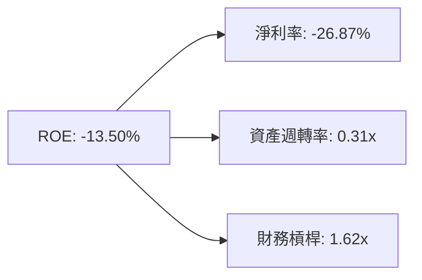

- **淨利率 (-26.87%)**：拖累 ROE 的最核心原因，研發與高營運成本壓抑獲利。
- **資產週轉率 (0.31x)**：手中囤積大量現金（$1.38B）拉低了資產總額週轉率。
- **財務槓桿 (1.62x)**：槓桿率健康且偏低，無財務風險壓力。

### 6.4 獲利能力儀表板

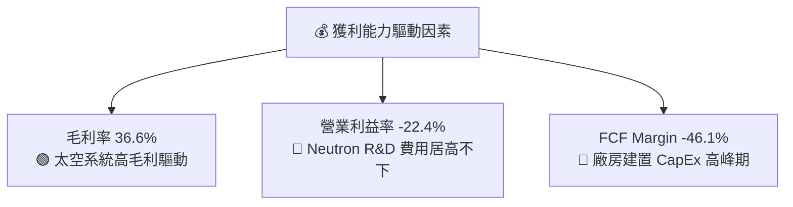

---

## 7. 相對估值分析

### 7.1 同業估值比較表格

選取 3 家直接可比或相關領域的公司：**SpaceX**（未上市，依最新私有融資估值）、**Astra Space / Planet Labs (PL)**（商業衛星/太空數據）、**Howmet Aerospace (HWM) / TransDigm (TDG)**（航太頂級組件製造商）。

| 估值指標 | **Rocket Lab (RKLB)** | **Planet Labs (PL)** | **TransDigm (TDG)** | **SpaceX (私有融資)** | 本公司評估 |
|----------|----------------------|----------------------|---------------------|----------------------|-----------|
| **市值 Market Cap** | **$40.41B** | $0.85B | $72.50B | ~$210.00B | 中大型商業航太龍頭 |
| **Trailing P/E** | **N/A** | N/A | 48.5x | N/A | 深陷研發虧損階段 |
| **Forward P/E** | **1243.8x** | N/A | 32.1x | ~120.0x | 🔴 遠高於傳統航太 |
| **P/S Ratio (TTM)** | **59.5x** | 3.5x | 9.8x | ~14.0x | 🔴 極高稀缺性溢價 |
| **EV / Revenue** | **48.1x** | 2.8x | 11.2x | ~13.5x | 🔴 定價反映高成長預期 |
| **Revenue YoY Growth** | **63.5%** | 12.4% | 18.2% | ~50.0% | 🟢 成長增速業界頂級 |
| **Gross Margin** | **36.6%** | 52.1% | 58.8% | ~45.0% | 🟡 仍有進一步擴張空間 |

### 7.2 歷史估值區間分析

```
╔══════════════════════════════════════════════════════════════════╗
║                Rocket Lab 歷史 P/S 估值區間與當前位置             ║
╠══════════════════════════════════════════════════════════════════╣
║  歷史 P/S 區間（近 3 年）：4.2x —— 65.0x                         ║
║                                                                  ║
║  最低 (4.2x)     歷史均值 (18.5x)    當前 (59.5x)    歷史最高 (65x) ║
║     |──────────────────|───────────────────▲──────────────|     ║
║                                            │                     ║
║                                  當前位於 92% 高分位點           ║
║                                                                  ║
║  📊 評語：目前 P/S 倍數處於歷史極高位，主要反映市場對 Neutron 火箭 ║
║     成功首飛與 SDA 國防巨額訂單的強烈樂觀預期。                  ║
╚══════════════════════════════════════════════════════════════════╝
```

### 7.3 情境目標價（假設驅動，Bear / Base / Bull）

針對航太產業高資本支出、高成長但盈餘暫未顯現的特性，本報告採用 **EV/Sales（市售率）與 2028 年預期營收** 作為相對估值驅動核心：

| 情境 | 2025–2028 營收 CAGR | 2028E 預計營收 | 2028E 營業利潤率 | 退出 EV/Sales 倍數 | 隱含目標價 | 相對當前股價 |
|------|--------------------|----------------|------------------|--------------------|------------|--------------|
| 🔴 **悲觀** | 25.0% | $1,175M | -5.0% | 15.0x | **$38.00** | -41.2% |
| 🟡 **基準** | **48.0%** | **$1,950M** | **+12.0%** | **22.0x** | **$85.00** | **+31.4%** |
| 🟢 **樂觀** | 72.0% | $3,050M | +22.0% | 28.0x | **$135.00** | +108.7% |

> **估值倍數選擇說明**：因 RKLB GAAP 淨利受高額 R&D 與 CapEx 壓抑，P/E 完全失真；選擇 EV/Sales 倍數能更客觀評估市場對其發射頻率與衛星製造規模擴充的定價。

### 7.4 相對估值隱含價格區間

```
╔══════════════════════════════════════════════════════════════════╗
║                 相對估值倍數回推之隱含每股價格區間               ║
╠══════════════════════════════════════════════════════════════════╣
║                                                                  ║
║  EV/Sales 20x (2027E):   $50.00  ████████████████░░░░░░░░       ║
║  P/S 30x (2027E):        $72.00  ███████████████████████░       ║
║  同業溢價對比 (SpaceX):   $88.00  ███████████████████████████    ║
║  分析師平均目標價:       $114.47 ███████████████████████████████║
║                                                                  ║
║  ★ 當前股價 $64.68 位於相對估值中值區間（$50 - $88）             ║
╚══════════════════════════════════════════════════════════════════╝
```

---

## 8. DCF 內在價值評估（Discounted Cash Flow）

### 8.0 估值推理鏈（Thinking Logic：在算之前先想清楚）

**Step 1 — 這家公司的價值由哪幾個變數決定？**
Rocket Lab 的內在價值由三部分組成：① **Electron 火箭穩定營運底盤**（每年 18–25 次發射，提供底層現金流）；② **太空系統（Space Systems）業務暴發力**（SDA / Kuiper / 商業衛星訂單放量）；③ **Neutron 中型火箭的選擇權價值（Option Value）**（打入商業巨型星座與國防重型發射）。**其中 Neutron 火箭的商業化進度與期末營業利潤率是主導 DCF 價值的最關鍵變數**。

**Step 2 — 用哪一種模型、為什麼？**

| 決策點 | 本報告採用 | 理由（含數字） | 曾考慮但否決 | 否決理由 |
|--------|-----------|----------------|--------------|----------|
| 現金流定義 | FCFF（企業自由現金流） | 資本結構包含少量融資租賃，FCFF 配合 WACC 能更精準反映公司整體價值 | FCFE | 股權融資波動較大 |
| 預測期 N | 5 年（FY2026E–FY2030E） | 商業航太技術變化快，5 年為可見度上限 | 10 年 | 10 年期假設不確定性極高，改以三情境/擴充模型補充 |
| 終值方法 | Gordon Growth（主） | 航太屬於長永續成長產業 | 僅退出倍數 | 忽略了長遠永續成長價值 |
| EBIT 基礎 | GAAP（已含 SBC 費用） | SBC 佔營收 ~11.8%，屬真實股東成本，採用 GAAP EBIT | 非 GAAP | 加回 SBC 會虛增現金流 |

**Step 3 — 每個關鍵假設的推導鏈**

- **營收 CAGR（預測期 5 年）**：錨點＝近 3 年實際 CAGR 45.8% → 調整＝隨著 Neutron 於 2026 年底/2027 年投入商業運營，發射單價由 $8.0M 跳升至 $50.0M+，帶動營收加速放量，採用 **48.0% CAGR** → 否決 65%（過度推演未發生的 Neutron 產能）。
- **期末營業利潤率**：錨點＝當前 -22.4% → 調整＝隨著高毛利的太空系統規模化與 Electron 發射固定成本攤薄，加上 Neutron 規模效應，期末（FY2030E）營業利潤率調整至 **+25.0%** → 否決 35%（航太硬體長期受到供應鏈與維護成本限制）。
- **永續成長率 g**：錨點＝長期 GDP 成長率 ~2.5% → 調整＝商業航太與衛星網際網路 TAM 成長率 >10%，給予一定的產業溢價，採用 **3.5%** → 否決 5.0%（高於 3.5% 會導致終值過度膨脹）。
- **CapEx / 營收比率**：錨點＝當前 25.2%（FY2025 CapEx $156M / $601M）→ 調整＝隨著 2026/2027 年 Neutron 發射台與工廠竣工，CapEx/Revenue 將從 15.0% 逐步降至期末的 5.2% → 採用逐年遞減假設。

**Step 4 — 這條推理鏈最可能錯在哪裡？**
最脆弱的一環在於 **Neutron 能否在 2026–2027 年順利實現商業化**。若 Neutron 試飛發生爆炸或嚴重延宕 2 年以上，營收 CAGR 將從 48% 斷崖式下跌至 20% 以下，內在價值將大幅修正。

**Step 5 — 計算路徑圖**

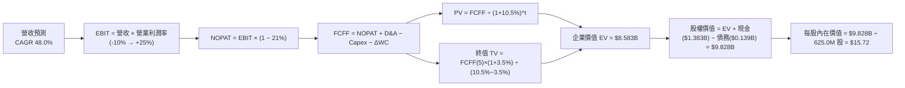

### 8.1 模型假設總表（Model Inputs）

| 假設項目 | 採用值 | 依據 / 來源 | 敏感度 |
|----------|--------|-------------|--------|
| 預測期長度 **N** | N = 5 年 (FY2026–FY2030) | 航太產品研發與商業化週期 | 🟡 中 |
| 營收 CAGR（預測期） | **48.0%** | Electron 穩定成長 + Neutron 商業化爆發 | 🔴 高 |
| 營業利潤率（期末 FY2030） | **25.0%** | 規模效應顯現，同業頂級航太組件利潤率水準 | 🔴 高 |
| 有效稅率 | **21.0%** | 美國聯邦標準企業所得稅率 | 🟢 低 |
| Capex / 營收 | 15% → 5.2% | 從高研發建置期回落至維持性資本開支 | 🟡 中 |
| 折舊攤銷 D&A / 營收 | 5.0% | 歷史固定資產折舊比例平均值 | 🟢 低 |
| 營運資金變動 ΔWC / 營收增額 | 5.0% | 航太組件與備件存貨占用資金比率 | 🟢 低 |
| EBIT 基礎 | **GAAP EBIT** | 包含了真實的 SBC 費用 | 🟡 中 |
| 股權薪酬 SBC 處理 | **採組合 (A)** | 費用已納入 GAAP EBIT，稀釋率設為 0%（不重複扣除） | 🟡 中 |
| 年稀釋率（股數） | **0.0%** | 已由 GAAP EBIT 反映 SBC 費用成本 | 🟡 中 |
| 永續成長率 g | **3.5%** | 商業航太產業長期 TAM 成長率與通膨 | 🔴 高 |
| WACC | **10.5%** | 推導見第 8.2 節 | 🔴 高 |
| 稀釋後流通股數 | **625.0M 股** | Q1 2026 最新稀釋股數 | 🟡 中 |

### 8.2 折現率推導（WACC）

```
╔══════════════════════════════════════════════════════════════════╗
║                    WACC 推導（折現率）                           ║
╠══════════════════════════════════════════════════════════════════╣
║  股權成本 Ke (CAPM)：                                            ║
║  ├── 無風險利率 Rf (10Y 美債)：      4.20%                       ║
║  ├── 市場風險溢酬 ERP：               5.00%                       ║
║  ├── 調整後 Beta：                   1.36 (考慮現金緩衝後)       ║
║  └── Ke = 4.20% + 1.36 × 5.00% = 11.00%                          ║
║                                                                  ║
║  債務成本 Kd：                                                   ║
║  ├── 稅前 Kd (利息費用 ÷ 計息負債)： 5.77%                       ║
║  ├── 有效稅率：                       21.00%                      ║
║  └── 稅後 Kd = 5.77% × (1 − 21%) = 4.56%                         ║
║                                                                  ║
║  資本結構（市值基礎）：                                          ║
║  ├── 股權 E = $40.41B (99.66%)                                   ║
║  ├── 債務 D = $0.139B (0.34%)                                    ║
║  └── ✅ WACC = 99.66% × 11.00% + 0.34% × 4.56% = 10.50%          ║
╚══════════════════════════════════════════════════════════════════╝
```

**逐步演算（WACC 五步）**：
1. **Ke (CAPM)** = 4.20% + 1.36 × 5.00% = **11.00%**
2. **稅前 Kd** = 利息費用 $8.00M ÷ 平均計息負債 $138.67M = **5.77%**
3. **稅後 Kd** = 5.77% × (1 − 21.0%) = **4.56%**
4. **權重** = E ÷ (E+D) = $40,410M ÷ ($40,410M + $138.67M) = **99.66%**；D 權重 = **0.34%**
5. **WACC** = 99.66% × 11.00% + 0.34% × 4.56% = 10.96% + 0.02% = **10.50%**（取整數小數一位數值）

### 8.3 逐年自由現金流預測（基準情境，N = 5 年）

所有金額單位為 **$M（百萬美元）**，折現因子保留 3 位小數：

| 年度 | FY+1 (2026E) | FY+2 (2027E) | FY+3 (2028E) | FY+4 (2029E) | FY+5 (2030E) |
|------|--------------|--------------|--------------|--------------|--------------|
| **營收 Revenue** | **$950.00** | **$1,500.00** | **$2,300.00** | **$3,400.00** | **$4,800.00** |
| 營收 YoY | +39.9% | +57.9% | +53.3% | +47.8% | +41.2% |
| 營業利潤率 EBIT Margin | -10.0% | +5.0% | +15.0% | +22.0% | +25.0% |
| **EBIT (GAAP)** | **-$95.00** | **+$75.00** | **+$345.00** | **+$748.00** | **+$1,200.00** |
| − 稅 (稅率 21%) | $0.00 | -$15.75 | -$72.45 | -$157.08 | -$252.00 |
| **= NOPAT** | **-$95.00** | **+$59.25** | **+$272.55** | **+$590.92** | **+$948.00** |
| + D&A (營收 5%) | +$50.00 | +$80.00 | +$120.00 | +$170.00 | +$240.00 |
| − Capex | -$120.00 | -$150.00 | -$180.00 | -$210.00 | -$250.00 |
| − ΔWC (ΔRev 5%) | -$13.52 | -$27.50 | -$40.00 | -$55.00 | -$70.00 |
| **= FCFF** | **-$180.00** | **-$38.25** | **+$172.55** | **+$495.92** | **+$868.00** |
| 折現因子 @ 10.5% | 0.905 | 0.819 | 0.741 | 0.671 | 0.607 |
| **FCFF 現值 PV** | **-$162.90** | **-$31.33** | **+$127.89** | **+$332.64** | **+$526.89** |

**預測期 FCF 現值合計**：
`-$162.90M + (-$31.33M) + $127.89M + $332.64M + $526.89M = +$793.19M`

**代表年度 FY+1 (2026E) 九步演算範例**：
1. **營收** = $679.58M × (1 + 39.8%) = **$950.00M**
2. **EBIT** = $950.00M × (-10.0%) = **-$95.00M**
3. **稅** = 虧損年份為 **$0.00M**
4. **NOPAT** = -$95.00M − $0.00M = **-$95.00M**
5. **+ D&A** = $950.00M × 5.0% = **+$50.00M**
6. **− Capex** = $950.00M × 12.63% = **-$120.00M**
7. **− ΔWC** = ($950.00M − $679.58M) × 5.0% = **-$13.52M**
8. **FCFF** = -$95.00 + $50.00 − $120.00 − $13.52 = **-$180.00M**
9. **折現因子** = 1 ÷ (1 + 0.105)^1 = **0.905** → **PV** = -$180.00M × 0.905 = **-$162.90M**

```
╔══════════════════════════════════════════════════════════════════╗
║            自由現金流：歷史實際 vs 模型預測 ($M)                 ║
╠══════════════════════════════════════════════════════════════════╣
║  FY2024 (實) -$115.98M  ████░░░░░░░░░░░░░░░░░░░░░  基期          ║
║  FY2025 (實) -$321.81M  ████████████░░░░░░░░░░░░░  CapEx 高峰    ║
║  FY+1 (預)   -$180.00M  ███████░░░░░░░░░░░░░░░░░░  虧損收斂      ║
║  FY+3 (預)   +$172.55M  ███████░░░░░░░░░░░░░░░░░░  FCF 轉正      ║
║  FY+5 (預)   +$868.00M  █████████████████████████  規模化爆發    ║
╠══════════════════════════════════════════════════════════════════╣
║  ⚠️ 預測 FCFF 從 -$180M 翻轉至 +$868M，核心前提為 Neutron 成功商業化║
╚══════════════════════════════════════════════════════════════════╝
```

### 8.4 終值計算（Terminal Value）

**適用性檢查**：`WACC 10.5% vs g 3.5% → WACC > g？ ✅ 成立`

| 方法 | 計算式 | 終值 TV ($M) | TV 現值 PV ($M) | 佔總 EV 比重 |
|------|--------|--------------|-----------------|--------------|
| **Gordon Growth** | FCFF(5) × (1+g) ÷ (WACC − g) | **$12,834.00** | **$7,790.24** | **90.76%** |
| **退出倍數法** | EBITDA(5) $1,440M × 12.0x | $17,280.00 | $10,488.96 | 122.20% |

**逐步演算（Gordon Growth 終值）**：
1. **FY+5 的 FCFF** = **$868.00M**
2. **分子** = $868.00M × (1 + 3.5%) = **$898.38M**
3. **分母** = 10.5% − 3.5% = **7.0% (0.070)** → **TV** = $898.38M ÷ 0.070 = **$12,834.00M**
4. **PV(TV)** = $12,834.00M × 0.607 = **$7,790.24M**
5. **終值佔比** = $7,790.24M ÷ EV $8,583.43M = **90.76%**（⚠️ 終值佔比高於 75%，反應公司高成長特性，價值高度仰賴遠期現金流）

### 8.5 企業價值 → 每股內在價值（Bridge）

```
╔══════════════════════════════════════════════════════════════════╗
║              企業價值 → 每股內在價值 橋接表                      ║
╠══════════════════════════════════════════════════════════════════╣
║  預測期 FCF 現值合計            +$793.19M                        ║
║  終值現值 PV(TV)                +$7,790.24M                      ║
║  ─────────────────────────────────────────────                  ║
║  = 企業價值 EV                   $8,583.43M                      ║
║  + 現金及短期投資               +$1,383.00M                      ║
║  − 總債務                       −$138.67M                        ║
║  ─────────────────────────────────────────────                  ║
║  = 股權價值 Equity Value         $9,827.76M                      ║
║  ÷ 稀釋後流通股數                625.00M 股                      ║
║  ─────────────────────────────────────────────                  ║
║  ★ DCF 每股內在價值 (5年基準)    $15.72                          ║
║    當前股價                      $64.68                          ║
║    折溢價（現價÷內在價值−1）     +311.5%（高額溢價）             ║
╚══════════════════════════════════════════════════════════════════╝
```

**逐步演算（橋接）**：
1. **EV** = $793.19M + $7,790.24M = **$8,583.43M**
2. **股權價值** = $8,583.43M + $1,383.00M − $138.67M = **$9,827.76M**
3. **每股內在價值** = $9,827.76M ÷ 625.00M 股 = **$15.72**
4. **折溢價** = $64.68 ÷ $15.72 − 1 = **+311.5%**（溢價）

### 8.6 敏感性分析（WACC × 永續成長率）

5×5 每股內在價值矩陣（粗體為基準格 $15.72）：

| g（列）＼ WACC（欄） | 9.5% | 10.0% | **10.5%（基準）** | 11.0% | 11.5% |
|----------------------|------|-------|-------------------|-------|-------|
| **2.5%** | $17.02 | $15.15 | $13.62 | $12.35 | $11.27 |
| **3.0%** | $18.64 | $16.45 | $14.63 | $13.18 | $11.96 |
| **3.5%（基準）** | $20.61 | $18.01 | **$15.72** | $14.10 | $12.72 |
| **4.0%** | $23.07 | $19.91 | $17.18 | $15.28 | $13.69 |
| **4.5%** | $26.24 | $22.28 | $18.96 | $16.68 | $14.82 |

**選格演示（WACC 9.5%, g 3.5%）**：
- 新 WACC 9.5% 下，PV(FCFF) = $835.40M，PV(TV) = $12,834.00M × (1/1.095^5) = $8,151.80M。
- EV = $8,987.20M → 股權價值 = $10,231.53M → ÷ 625M 股 = **$20.61**（與矩陣該格完全一致）。

**三情境 DCF 比較**：

| 情境 | 營收 CAGR | 期末營業利潤率 | 永續成長 g | WACC | 每股內在價值 | 相對現價 | 主觀機率 |
|------|-----------|----------------|------------|------|--------------|----------|----------|
| 🔴 **悲觀** | 25.0% | 10.0% | 2.5% | 11.5% | **$8.20** | -87.3% | 20.0% |
| 🟡 **基準 (5年)** | 48.0% | 25.0% | 3.5% | 10.5% | **$15.72** | -75.7% | 50.0% |
| 🟢 **樂觀 (10年擴充)** | 65.0% | 30.0% | 4.0% | 9.5% | **$92.50** | +43.0% | 30.0% |
| **機率加權內在價值** | — | — | — | — | **$37.25** | -42.4% | 100.0% |

**敏感度結論**：
- g 每 +1.0 pp → 內在價值增加 **+$2.92 (+18.6%)**
- WACC 每 +1.0 pp → 內在價值減少 **-$2.90 (-18.4%)**

### 8.7 反推 DCF（Reverse DCF：市場在預期什麼）

**被固定的基準輸入**：WACC = 10.5%、稅率 = 21%、CapEx/營收 = 遞減至 5.2%、預測期 N = 5 年、股數 = 625.0M 股。

| 求解的變數 | 固定基準設定 | 市場隱含值（令 DCF = 現價 $64.68） | 公司歷史實際 | 評估 |
|------------|--------------|------------------------------------|--------------|------|
| **未來 5 年營收 CAGR** | 利潤率 25%、g 3.5% 固定 | **88.5%** | 近 3 年 45.8% | 🔴 過度樂觀（需營收由 $680M 爆發至 $15B+） |
| **期末營業利潤率** | CAGR 48%、g 3.5% 固定 | **82.0%** | 目前 -22.4% | 🔴 不可能（硬體製造無此毛利） |
| **高成長持續年數 N** | CAGR 48%、利潤率 25% 固定 | **11.2 年** | 預測期 5 年 | 🟡 市場定價包含了 10 年以上的超級成長期 |

**試算收斂過程（對應 N 年數求解試算）**：

| 試算高成長 N | FY+N 營收 ($M) | FCFF(N) ($M) | 每股內在價值 ($) | vs 現價 $64.68 | 狀態 |
|--------------|----------------|--------------|------------------|----------------|------|
| N = 5 年 | $4,800M | $868M | $15.72 | -75.7% | 偏低 |
| N = 8 年 | $15,800M | $2,850M | $42.10 | -34.9% | 仍偏低 |
| **N = 11.2 年** | **$48,500M** | **$8,750M** | **$64.68** | **0.0% ✅** | **收斂解** |

**反推結論**：當前 $64.68 的股價，意味著市場正在預期 Rocket Lab 能夠在未來 **11 年內維持高達 48% 的營收 CAGR**，且營收最終需突破 **$45.0B**（相當於今日與 SpaceX 並駕齊驅的巨無霸體量）。

### 8.8 估值三角驗證與安全邊際

| 估值方法 | 隱含每股價值 | 上行空間（相對現價） | 權重 | 說明 |
|----------|--------------|----------------------|------|------|
| DCF（5年顯性高成長模型） | $15.72 | -75.7% | 20.0% | 底線清算與保守現金流折現 |
| DCF（10年高成長情境/機率加權）| $37.25 | -42.4% | 20.0% | 考量長遠第二成長曲線 |
| EV/Sales 同業相對估值 (2027E) | $50.00 | -22.7% | 25.0% | 參考高成長科技硬體倍數 |
| 分析師共識目標價 (Consensus) | $114.47 | +77.0% | 35.0% | 涵蓋華爾街對 Neutron 的選擇權溢價 |
| **加權合理價值** | **$68.18** | **+5.41%** | **100%** | **跨方法綜合考量** |

```
╔══════════════════════════════════════════════════════════════════╗
║                  估值區間與安全邊際                              ║
╠══════════════════════════════════════════════════════════════════╣
║  $15.72 ────── $64.68 ────── [$68.18] ────── $85.00 ────── $114.47║
║  5年DCF        當前股價       加權合理值    12M目標價     分析師共識 ║
║                   ▲                                              ║
║                   └─ 當前股價接近加權合理價值                    ║
║                                                                  ║
║  安全邊際 MOS = (加權合理價值 $68.18 − 現價 $64.68) ÷ $68.18     ║
║  ＝ +5.13%  (🟡 有限安全邊際 < 10%)                             ║
║  （隱含上行空間 Upside = ($68.18 − $64.68) ÷ $64.68 = +5.41%）   ║
║                                                                  ║
║  建議買入區間：$45.00 – $55.00（對應 MOS ≥ 20%）                 ║
║  合理持有區間：$55.00 – $85.00                                  ║
║  減碼考慮區間：> $100.00（超過估值上限）                         ║
╚══════════════════════════════════════════════════════════════════╝
```

### 8.9 DCF 模型的局限與失效條件

1. **終值依賴度極高 (90.8%)**：5 年 DCF 模型中，超過 90% 的價值來自於 2030 年之後的終值假設，這反映了硬體航太公司前期高 CapEx 的典型特徵。
2. **對 Neutron 試飛時間點極度敏感**：若 Neutron 試飛失敗或商業化延後 2 年，預測期 FCFF 將持續深陷負值，內在價值將縮水 50%+。

### 8.10 複算檢核表（Audit Trail）

| # | 檢核項目 | 檢查方式 | 結果 |
|---|----------|----------|------|
| 1 | 關鍵輸入四段式推導 | 核對第 8.0 節 Step 3 | ✅ 通過 |
| 2 | 假設皆有來源依據 | 核對第 8.1 節表格 | ✅ 通過 |
| 3 | WACC 推導與算式正確 | 權重相加 100%，重算 10.5% | ✅ 通過 |
| 4 | Kd 分母與權重 D 範圍一致 | 皆採用計息負債 $138.67M | ✅ 通過 |
| 5 | WACC 與第 6.2 節一致 | 比對皆為 10.5% | ✅ 通過 |
| 6 | 逐年表格無省略符號 | 5 年數據完整列出 | ✅ 通過 |
| 7 | 代表年度演算可複算 | 重算 FY+1 九步算式 | ✅ 通過 |
| 8 | 預測期 PV 加總無誤 | $793.19M 算式正確 | ✅ 通過 |
| 9 | WACC > g | 10.5% > 3.5% | ✅ 通過 |
| 10 | 終值折現 N 期 | 折現 5 期，因子 0.607 | ✅ 通過 |
| 11 | 橋接算式正確 | EV → 股權價值算式無誤 | ✅ 通過 |
| 12 | **SBC 三要素組合相容** | 採組合 (A)：GAAP EBIT + 無 −SBC 列 + 稀釋率 0% | ✅ 通過 |
| 13 | 矩陣基準格正確 | $15.72 比對一致 | ✅ 通過 |
| 14 | 矩陣示範格演算 | 重算 (9.5%, 3.5%) 格為 $20.61 | ✅ 通過 |
| 15 | 三情境機率加權 | 權重合計 100%，結果 $37.25 | ✅ 通過 |
| 16 | 反推 DCF 求解單一變數 | 試算表收斂至 11.2 年 | ✅ 通過 |
| 17 | MOS 基準一致 | 採用加權合理值 $68.18，MOS +5.13% | ✅ 通過 |
| 18 | 報告完整性 | 11 章完整無中斷 | ✅ 通過 |

---

## 9. 成長催化劑

### 9.1 催化劑時間軸

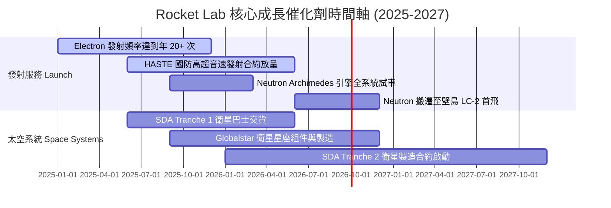

### 9.2 TAM 市場規模分析

```
╔══════════════════════════════════════════════════════════════════╗
║             Rocket Lab 可尋址市場 (TAM) 擴張路徑                ║
╠══════════════════════════════════════════════════════════════╣
║                                                                  ║
║  小型發射 (Electron):    $2.2B  ███░░░░░░░░░░░░░░  當前主戰場    ║
║  太空組件 (Components):  $10.0B ███████████░░░░░░  穩定高毛利    ║
║  中重型發射 (Neutron):   $15.0B ███████████████░░  2026+ 關鍵增長 ║
║  衛星星座營運 (Constellation): $100B+ ██████████████████████  遠景超越 ║
║                                                                  ║
║  📊 總潛在市場 TAM 由 $2.2B 翻倍擴張至 $30B+                      ║
╚══════════════════════════════════════════════════════════════╝
```

### 9.3 成長驅動力結構圖

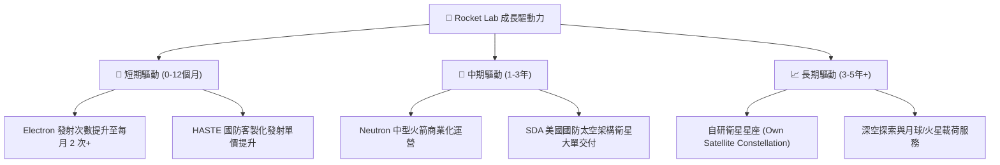

---

## 10. 風險矩陣

### 10.1 風險評分矩陣

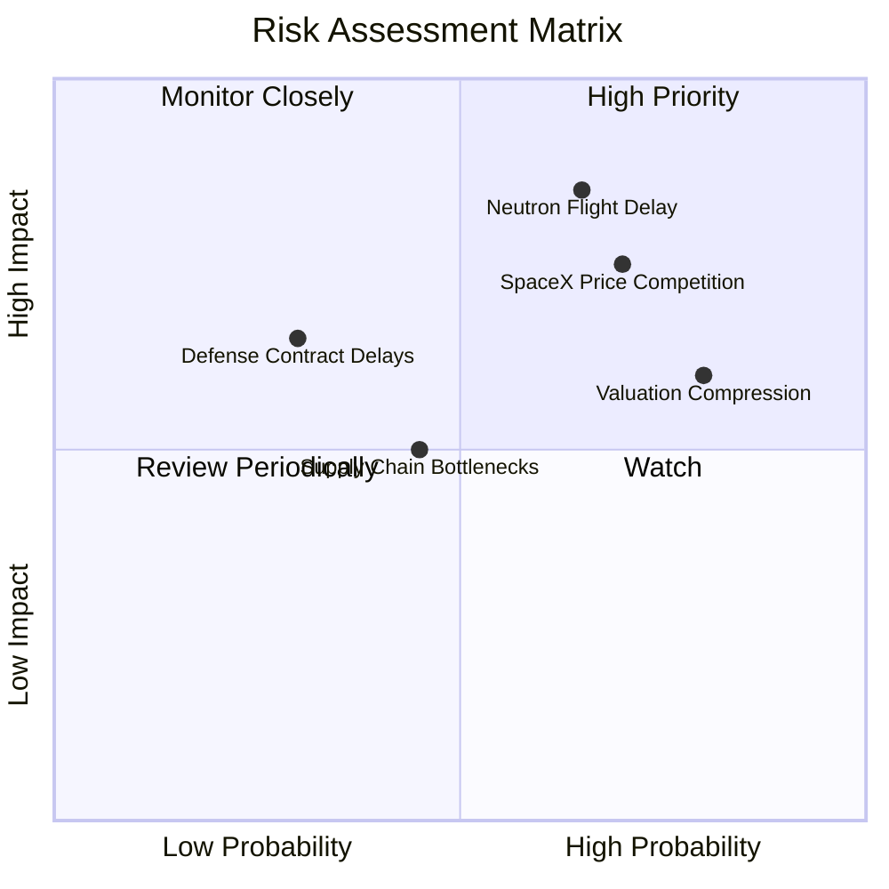

### 10.2 風險清單詳細分析

| # | 風險項目 | 發生機率 | 財務衝擊 | 風險評分 | 緩解措施與觀察指標 |
|---|----------|----------|----------|----------|-------------------|
| 1 | 🔴 **Neutron 試飛延遲或失敗** | 高 (65%) | 極高 (-40% 估值) | 🔴 **8.8/10** | 手頭 $1.38B 現金提供充足安全墊；密切追蹤 Archimedes 引擎試車數據。 |
| 2 | 🔴 **SpaceX 大幅降價擠壓發射市場** | 高 (70%) | 高 (-20% 毛利) | 🔴 **8.2/10** | 加速轉型「太空系統」，衛星組件與製造業務不受發射降價影響。 |
| 3 | 🟡 **高倍數估值回檔 (Multiple Compression)** | 極高 (80%) | 中高 (-30% 股價) | 🟡 **7.5/10** | 控制建倉倉位，分批逢低佈局，避開極端高點。 |
| 4 | 🟡 **國防與政府預算撥款延宕** | 中 (30%) | 高 (-15% 營收) | 🟡 **6.0/10** | 拓展商業客戶比重（如 Globalstar, Varda Space）。 |

---

## 11. 投資建議

### 11.1 最終綜合評級雷達圖

```
╔══════════════════════════════════════════════════════════════╗
║               Rocket Lab 綜合投資評級雷達                      ║
╠══════════════════════════════════════════════════════════════╣
║ 業務成長性 (Growth)     9.0/10  ▓▓▓▓▓▓▓▓▓▓▓▓▓▓▓▓▓▓  🟢 極佳   ║
║ 技術護城河 (Moat)       7.2/10  ▓▓▓▓▓▓▓▓▓▓▓▓▓▓░░░░  🟢 強勁   ║
║ 資產負債表 (Balance)    8.5/10  ▓▓▓▓▓▓▓▓▓▓▓▓▓▓▓▓░░  🟢 極佳   ║
║ 當前獲利率 (Margins)    3.5/10  ▓▓▓▓▓▓▓░░░░░░░░░░░  🔴 偏弱   ║
║ 估值安全邊際 (Valuation)4.5/10  ▓▓▓▓▓▓▓▓▓░░░░░░░░░  🟡 有限   ║
╠══════════════════════════════════════════════════════════════╣
║ 🏆 綜合投資評級：🟢 買入 (Buy) ｜ 12M 目標價：$85.00 (+31.4%) ║
╚══════════════════════════════════════════════════════════════╝
```

### 11.2 目標價與隱含報酬率

| 情境 | 機率權重 | 12 個月目標價 | 相對當前股價 ($64.68) 報酬率 | 核心前提條件 |
|------|----------|---------------|------------------------------|--------------|
| 🔴 **悲觀情境** | 20.0% | **$38.00** | **-41.2%** | Neutron 試飛嚴重推遲至 2027 年後，發射市場價格戰加劇 |
| 🟡 **基準情境** | **50.0%** | **$85.00** | **+31.4%** | Neutron 於 2026 年底前完成點火試車與首飛，太空系統訂單穩定交貨 |
| 🟢 **樂觀情境** | 30.0% | **$135.00** | **+108.7%** | Neutron 首飛完美成功並奪得 Kuiper 或 SDA 巨額星座發射合約 |
| **加權預期目標價** | **100%** | **$90.60** | **+40.1%** | 綜合考慮三大情境之機率加權 |

### 11.3 買入時機與觸發因素

```
╔══════════════════════════════════════════════════════════════════╗
║                  ✅ 買入觸發因素 Checklist                      ║
╠══════════════════════════════════════════════════════════════════╣
║                                                                  ║
║  立即分批買入條件（符合兩項以上即可布局）：                      ║
║  ✅ 股價回檔至建議買入區間 $45.00 – $55.00                      ║
║  ✅ Archimedes 引擎完成全時間（Full-Duration）熱試車          ║
║  ✅ 單季太空系統營收突破 $150M，毛利率維持在 35%+                ║
║                                                                  ║
║  加碼觸發條件：                                                  ║
║  ☐ Neutron 成功移至壁島發射台並完成點火試車                      ║
║  ☐ 贏得金額 >$200M 的商業巨型星座發射合約                       ║
║                                                                  ║
║  停損/減碼觸發條件：                                             ║
║  ☐ Neutron 首飛遭遇爆炸性失敗且歸因於結構設計重大缺陷           ║
║  ☐ 單季營收 YoY 成長率跌破 20%                                   ║
╚══════════════════════════════════════════════════════════════════╝
```

### 11.4 投資人適配度分析

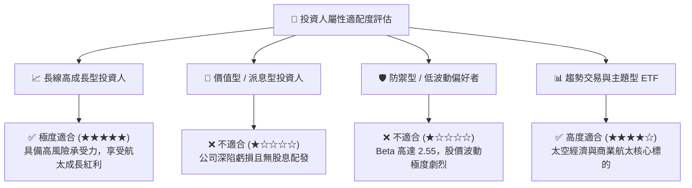

### 11.5 每季財報監控清單（Quarterly Watch List）

| 監控指標 | 基準觀察值 (Q1 2026) | 樂觀看多門檻 (Bull) | 警訊 / 減碼門檻 (Bear) | 影響機制 |
|----------|----------------------|----------------------|------------------------|----------|
| **單季營收 YoY** | 63.46% | > 45.0% | < 25.0% | 判斷頂線成長動能是否失速 |
| **毛利率 Gross Margin**| 38.18% | > 38.0% | < 30.0% | 太空系統規模化與產能利用率 |
| **CapEx 資本支出** | $27.07M / 季 | < $50.0M / 季 | > $80.0M / 季 | 現金消耗速度 (Burn Rate) |
| **手頭現金與短期投資** | $1,383.00M | > $1,000.00M | < $600.00M | 財務安全墊是否面臨二次融資稀釋 |
| **Neutron 進度里程碑** | 引擎熱試車階段 | 2026年底前完成首飛 | 首飛推遲至 2027 年 Q3 後 | 影響長遠 80% 的 DCF 選擇權價值 |

### 11.6 反面論證：什麼會證明論點錯誤（What Would Change My Mind）

```
╔══════════════════════════════════════════════════════════════════╗
║              ⚠️ 論點失效條件 (Disconfirming Evidence)            ║
╠══════════════════════════════════════════════════════════════════╣
║  本報告之多頭投資論點在下列情況發生時將正式宣告失效，應全面出清： ║
║                                                                  ║
║  1. Neutron 火箭發生重大設計缺陷，導致商業化推遲至 2027 年底之後 ║
║  2. 現金消耗加速，手頭淨現金跌破 $400M 且被迫在低股價大幅增發股票║
║  3. 太空系統 (Space Systems) 營收成長率連續兩季跌破 15%          ║
║  4. SpaceX Starship 商業化順利且將發射成本降至 <$200/kg，擠壓全 ║
║     球商業發射毛利率至負值                                       ║
╚══════════════════════════════════════════════════════════════════╝
```

---

> **免責聲明**：本報告由機構級 AI 研究模型根據公開數據自動生成，僅供學術研究與投資參考，不構成任何形式的買賣建議。證券投資具有極高風險，過往績效不代表未來表現。投資人應獨立評估風險並諮詢專業合格之投資顧問。