# RKLB 基本面深度分析報告
> **報告日期**：2026-08-04 ｜ **語言**：繁體中文 ｜ **數據來源**：Yahoo Finance, Finviz, StockAnalysis, Roic.ai ｜ **分析師**：CFA 級機構研究

---

## 目錄

| # | 章節 | 核心結論 |
|---|------|----------|
| 1 | 執行摘要 | 評級：🟡 持有（Hold）｜ 基準目標價 $88.50 ｜ 加權合理價值 $78.20 ｜ MOS +4.8% |
| 2 | 公司概覽與商業模式 | 航太與國防雙輪驅動（發射服務 + 衛星系統）；護城河綜合評分 7.8/10 |
| 3 | 損益表深度分析 | TTM 營收 $679.58M（YoY +63.5%）；SBC/營收 10.5%，GAAP 盈餘品質受研發與高 CapEx 壓抑 |
| 4 | 資產負債表分析 | 淨現金 $1.24B（現金 $1.38B vs 總債務 $138.67M）；流動比率 4.48，短期財務結構極為穩健 |
| 5 | 現金流量深度分析 | OCF -$161.63M，CapEx -$156.28M，FCF -$215.00M；資本配置集中於 Neutron 中型火箭研發 |
| 6 | 獲利能力與資本效率 | TTM ROE -13.5%，ROIC -11.2% vs WACC 11.8%（EVA -23.0pp，當前處於大規模投入摧毀價值階段） |
| 7 | 相對估值分析 | P/S 68.5x，EV/Sales 58.1x；顯著高於同業中位數，市場已計入 Neutron 成功營運的極高預期 |
| 8 | DCF 內在價值評估 | 基準每股內在價值 $42.50（折價 -42.9%）；加權合理價值 $78.20（安全邊際 MOS +4.8%） |
| 9 | 成長催化劑 | 短期 Electron 發射頻次上升；中期 Neutron 首飛與 SDA 衛星星座交付；長期商業太空服務 |
| 10 | 風險矩陣 | 首要風險為 Neutron 研發延宕/首飛失敗（高衝擊/中機率）及客戶發射計畫延遲 |
| 11 | 投資建議 | 當前股價 $74.48 位於合理持有區間（$68.00 - $88.50）；建議回檔至 $58.00 以下建立安全邊際 |

---

## 1. 執行摘要

Rocket Lab Corporation（NASDAQ: RKLB）當前交易價格為 **$74.48**，市值達 **$46.54B**，企業價值（EV）為 **$39.52B**。公司在小型衛星發射市場已建立穩固的次席領先地位（僅次於 SpaceX），並成功將業務拓展至高毛利的太空系統（Space Systems）組件與衛星製造領域。

然而，根據最新的財務數據，儘管 TTM 營收達到 $679.58M（YoY +63.5%），公司仍處於大幅虧損狀態，TTM 營業利潤率為 -22.4%，自由現金流（FCF）為 -$215.00M。在 WACC 為 11.8% 下，當前 ROIC 為 -11.2%，EVA 為 -23.0pp，顯示資本尚未回報。鑑於當前市銷率（P/S）高達 68.5x，隱含市場已提前反映 Neutron 火箭於 2026-2027 年順利量產與 SDA（美國太空發展局）星座合約全額變現的樂觀預期。

綜合 DCF 機率加權模型（$42.50）與相對估值及分析師共識加權，導出加權合理價值為 **$78.20**。對應當前股價 $74.48，**安全邊際（MOS）為 +4.8%**（`($78.20 - $74.48) / $78.20`），上行空間為 **+5.0%**。本報告給予 RKLB **🟡 持有（Hold）** 評級，建議投資人等待 Neutron 首飛數據確定或股價回檔至安全邊際買入區間（<$58.00）再行加碼。

### 1.0 一頁式投資儀表板（Portfolio Manager 30 秒速讀）

| 項目 | 內容 |
|------|------|
| **投資論點（3 句）** | ① 商業發射與太空系統雙引擎發力，TTM 營收強勁成長 63.5% 至 $679.58M，確立 SpaceX 之外唯一可規模化商業發射商業體地位。<br/>② 手握 $1.38B 充沛現金與 $1.24B 淨現金，資產負債表具備強大抗風險能力，可支撐 Neutron 中型火箭研發與量產 CapEx。<br/>③ 估值透支未來 3-5 年成長，P/S 達 68.5x，加權合理價值 $78.20 對應當前 MOS 僅 +4.8%，缺乏足夠安全邊際。 |
| **護城河評分** | 7.8 / 10（發射實績與組件垂直整合帶來的特許營運權與技術壁壘） |
| **管理層/資本配置評分** | 8.2 / 10（執行力極佳，經由 SolAero 等併購成功轉型為完整太空解決方案提供商） |
| **財務健康** | 🟢 淨現金 $1.24B，流動比率 4.48，短期無清償風險 |
| **ROIC vs WACC** | -11.2% vs 11.8%（EVA = -23.0pp，當前因高額研發與 CapEx 摧毀股東價值） |
| **FCF 趨勢** | 方向向下（CapEx 加速），TTM FCF -$215.00M，FCF Yield -0.46% |
| **估值** | Forward P/E 8941.2x ｜ EV/Sales 58.1x ｜ FCF Yield -0.46% |
| **DCF 內在價值（基準）** | $42.50 ｜ 當前股價溢價 +75.2%（來自第 8 章） |
| **安全邊際（MOS）** | **+4.8%**＝(加權合理價值 $78.20 − 現價 $74.48) ÷ $78.20 ｜ 🔴 <10% 無安全邊際 |
| **預期報酬（基準情境 12M）** | +18.8%（對應 12M 基準目標價 $88.50） |
| **關鍵風險（前二）** | ① Neutron 中型火箭研發延遲或試飛失敗；② 國防部/商業衛星星座資本支出收縮 |
| **評級 + 信心度** | 🟡 持有（Hold）｜ 信心度：中等 |

### 1.1 核心評分儀表板

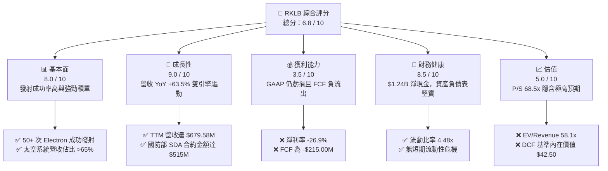

### 1.2 評分進度條視覺化

```
╔══════════════════════════════════════════════════════════════╗
║                RKLB 多維度評分儀表板 (1-10分)                ║
╠══════════════════════════════════════════════════════════════╣
║ 基本面強度  8.0 ▓▓▓▓▓▓▓▓▓▓▓▓▓▓▓▓░░░░  ★★★★☆           ║
║ 成長動能    9.0 ▓▓▓▓▓▓▓▓▓▓▓▓▓▓▓▓▓▓░░  ★★★★★           ║
║ 獲利品質    3.5 ▓▓▓▓▓▓█░░░░░░░░░░░░░  ★★☆☆☆           ║
║ 財務健康    8.5 ▓▓▓▓▓▓▓▓▓▓▓▓▓▓▓▓▓░░░  ★★★★☆           ║
║ 估值合理性  5.0 ▓▓▓▓▓▓▓▓▓▓░░░░░░░░░░  ★★★☆☆           ║
║ 護城河深度  7.8 ▓▓▓▓▓▓▓▓▓▓▓▓▓▓▓░░░░░  ★★★★☆           ║
║ 管理層執行  8.2 ▓▓▓▓▓▓▓▓▓▓▓▓▓▓▓▓░░░░  ★★★★☆           ║
║ 技術創新力  8.8 ▓▓▓▓▓▓▓▓▓▓▓▓▓▓▓▓▓░░░  ★★★★☆           ║
╠══════════════════════════════════════════════════════════════╣
║ 綜合總分    6.8 ▓▓▓▓▓▓▓▓▓▓▓▓▓█░░░░░░  🏆 營運優異但估值偏高║
╚══════════════════════════════════════════════════════════════╝
```

### 1.3 五大投資論點 + 三大核心風險

| 類型 | 項目 | 具體依據 | 信心度 |
|------|------|----------|--------|
| 🟢 **論點①** | **小火箭發射龍頭地位穩固** | Electron 已完成 50+ 次成功發射，成為美國發射頻率僅次於 SpaceX Falcon 9 的軌道火箭。 | 🟢 極高 |
| 🟢 **論點②** | **太空系統業務構建第二曲線** | Space Systems 業務貢獻超過 65% 營收，透過垂直整合 SolAero 太陽能板與反應輪，毛利率提升至 36.6%。 | 🟢 高 |
| 🟢 **論點③** | **Neutron 打開中型載荷與星座發射 TAM** | 13 噸載荷的 Neutron 火箭直接鎖定商業衛星星座部署，單次發射價值量提升 10 倍以上（~$50M/次）。 | 🟢 中 |
| 🟢 **論點④** | **資產負債表充沛，抗風險力極強** | 截至 2026 年 Q1 擁有 $1.38B 現金及短期投資，淨現金達 $1.24B，流動比率高達 4.48，研發資金無虞。 | 🟢 極高 |
| 🟢 **論點⑤** | **深化國防與政府高額合約綁定** | 獲得 SDA 價值 $515M 的 18 顆追蹤層衛星合約，驗證其從組件供應商升級為主承包商（Prime Contractor）能力。 | 🟢 高 |
| 🟡 **風險①** | **Neutron 研發進度與首飛風險** | Archimedes 引擎測試及 Neutron 2026/2027 年首飛若發生爆炸或重大延誤，將重創市場高估值支撐。 | 🔴 高衝擊 |
| 🔴 **風險②** | **估值倍數極端收縮風險** | P/S 68.5x 高居航太板塊榜首，若市場風險偏好轉變，高倍數成長股將面臨大幅均值回歸。 | 🔴 高衝擊 |
| 🟡 **風險③** | **自由現金流持續大幅負流出** | TTM FCF -$215.00M，在 Neutron 達到高頻率發射實現規模經濟前，CapEx 與 OCF 將繼續消耗現金。 | 🟡 中度 |

### 1.4 快速統計卡片

| 指標 | 公司實際值 | 行業均值 (Aerospace) | S&P 500 均值 | 狀態評估 |
|------|-------------|----------------------|--------------|----------|
| **營收 YoY 成長** | **63.5%** | 12.4% | 5.2% | 🟢 遠高於行業 |
| **毛利率** | **36.6%** | 22.5% | 31.8% | 🟢 表現優異 |
| **營業利潤率** | **-22.4%** | +8.5% | +12.1% | 🔴 仍處虧損期 |
| **ROE** | **-13.5%** | +11.2% | +14.5% | 🔴 資本效率偏低 |
| **P/S Ratio** | **68.5x** | 2.1x | 2.8x | 🔴 估值顯著偏高 |
| **EV/Revenue** | **58.1x** | 2.4x | 3.2x | 🔴 溢價幅度巨大 |
| **淨現金 / 總資產** | **44.0%** | 5.2% | 8.1% | 🟢 資產極度安全 |

### 1.5 投資結論

```
╔══════════════════════════════════════════════════════════════════╗
║                    📊 投資結論摘要                               ║
╠══════════════════════════════════════════════════════════════════╣
║  評級：🟡 持有（Hold）                                            ║
║  當前股價：$74.48                                                ║
║  DCF 基準內在價值：$42.50（當前股價溢價 +75.2%）                 ║
║  加權合理價值：$78.20                                            ║
║  安全邊際 MOS：+4.8%（＝($78.20 − $74.48) ÷ $78.20）              ║
║  12 個月目標價區間：                                             ║
║    悲觀情境：$52.00（-30.2%） — Neutron 延誤且市場降倍數         ║
║    基準情境：$88.50（+18.8%） — 12M 主要目標（Neutron 按時推進） ║
║    樂觀情境：$125.00（+67.8%）— Neutron 成功首飛並獲大額訂單      ║
║  投資評分：6.8 / 10                                              ║
║  適合投資人：長線高風險承受度成長型投資人、太空產業戰略布局者     ║
╚══════════════════════════════════════════════════════════════════╝
```

---

## 2. 公司概覽與商業模式

### 2.1 業務結構與收入來源

Rocket Lab 採用「發射服務（Launch Services）+ 太空系統（Space Systems）」雙軌驅動模式，建立起高度垂直整合的太空產業鏈閉環。

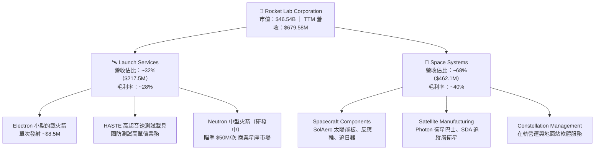

### 2.2 市場份額

在全球商業軌道發射市場（不含中國政府發射），SpaceX 憑藉 Falcon 9 佔據絕對主導地位，Rocket Lab 則在小型專用發射市場（Small Launch Services）排名全球第一。

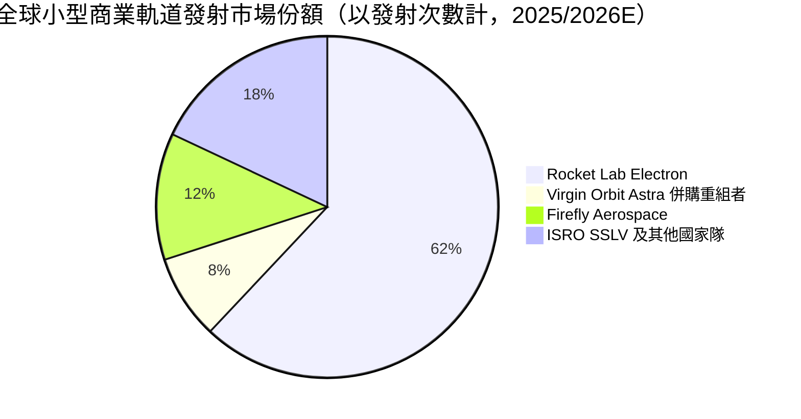

### 2.3 競爭護城河分析

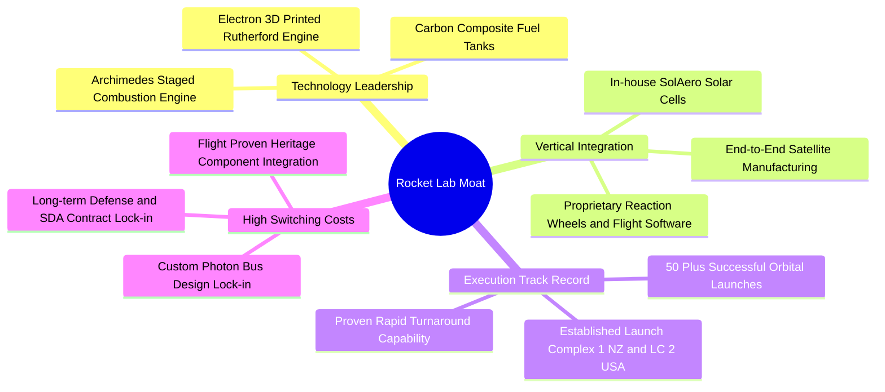

### 2.4 護城河強度評分

```
╔══════════════════════════════════════════════════════════════╗
║                   Rocket Lab 護城河強度評分                  ║
╠══════════════════════════════════════════════════════════════╣
║ 發射飛行履歷   8.8/10 ▓▓▓▓▓▓▓▓▓▓▓▓▓▓▓▓▓░░░  🏆 50+成功發射 ║
║ 組件垂直整合   8.5/10 ▓▓▓▓▓▓▓▓▓▓▓▓▓▓▓▓░░░░  🟢 掌控核心成本║
║ 發射場發射許可 8.0/10 ▓▓▓▓▓▓▓▓▓▓▓▓▓▓░░░░░░  🟢 私人雙基地  ║
║ 轉換成本與軟體 6.8/10 ▓▓▓▓▓▓▓▓▓▓▓█░░░░░░░░  🟡 逐步建立中  ║
║ 規模效應(成本) 6.5/10 ▓▓▓▓▓▓▓▓▓▓▓░░░░░░░░░  🟡 尚待Neutron ║
╠══════════════════════════════════════════════════════════════╣
║ 綜合護城河評分 7.8/10 ▓▓▓▓▓▓▓▓▓▓▓▓▓▓▓░░░░░  🏆 小型發射龍頭║
╚══════════════════════════════════════════════════════════════╝
```

---

## 3. 損益表深度分析

### 3.1 年度收入成長趨勢（近 4 年）

```
╔══════════════════════════════════════════════════════════════════╗
║              Rocket Lab 年度收入趨勢（FY2022-FY2025）            ║
╠══════════════════════════════════════════════════════════════════╣
║                                                                  ║
║  FY2022  $211.00M  █████░░░░░░░░░░░░░░░░░░░░░  YoY: +239.0% 🟢   ║
║  FY2023  $244.59M  ██████░░░░░░░░░░░░░░░░░░░░  YoY: +15.9%  🟢   ║
║  FY2024  $436.21M  ███████████░░░░░░░░░░░░░░░  YoY: +78.3%  🟢   ║
║  FY2025  $601.80M  █████████████████░░░░░░░░░  YoY: +38.0%  🟢   ║
║  TTM     $679.58M  ███████████████████░░░░░░  YoY: +63.5%  🟢   ║
║                   |      |      |      |                         ║
║                   0    200M   400M   600M                        ║
║                                                                  ║
║  📊 4年累計營收 CAGR：+42.1%                                     ║
╚══════════════════════════════════════════════════════════════════╝
```

### 3.2 季度收入趨勢分析

| 季度 | 營收 ($M) | YoY 成長率 | QoQ 成長率 | 毛利 ($M) | 毛利率 | 備註說明 |
|------|-----------|------------|------------|-----------|--------|----------|
| **Q2 2025** | $144.50 | +36.00% | +17.89% | $46.39 | 32.10% | Space Systems 合約加速變現 |
| **Q3 2025** | $155.08 | +47.97% | +7.32% | $57.31 | 36.96% | Electron 發射頻次上升至單季 4 次 |
| **Q4 2025** | $179.65 | +35.70% | +15.84% | $68.23 | 37.98% | HASTE 國防發射單價推升毛利率 |
| **Q1 2026** | $200.35 | +63.46% | +11.52% | $76.49 | 38.18% | 創單季歷史新高，組件出貨放量 |

### 3.3 利潤率演變分析

| 利潤率指標 | FY2022 | FY2023 | FY2024 | FY2025 | TTM (Q1 26) | 趨勢評估 |
|------------|--------|--------|--------|--------|-------------|----------|
| **毛利率** | 9.00% | 21.02% | 26.63% | 34.42% | **36.56%** | 🟢 結構性向上（規模效應+高毛利組件）|
| **營業利潤率** | -64.08% | -72.74% | -43.51% | -38.03% | **-33.20%** | 🟡 虧損比例收斂，但研發費用高企 |
| **EBITDA 邊際** | -45.12% | -53.82% | -29.71% | -25.83% | **-24.30%** | 🟡 規模擴大帶動營業槓桿釋放 |
| **淨利率** | -64.43% | -74.64% | -43.60% | -32.94% | **-26.87%** | 🟡 營運槓桿改善但未轉正 |

**利潤率演變深度解析**：
毛利率從 2022 年的 9.0% 大幅攀升至 TTM 的 36.56%，驅動因素包含：① 收購 SolAero 後太陽能電池陣列完全內生化；② Electron 發射規模擴大壓低固定成本分灘；③ 高毛利的 HASTE 國防測試發射業務比重提升。然而，營業利潤率仍達 -33.20%，主因 **R&D 費用在 FY2025 高達 $270.72M（佔營收 45.0%）**，主要投向 Neutron Archimedes 引擎與發射台建設。

### 3.4 費用結構分析

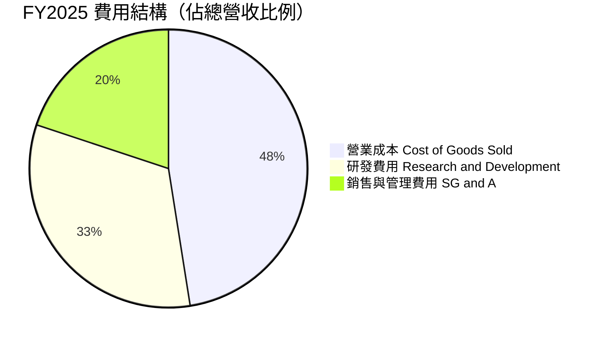

```
╔══════════════════════════════════════════════════════════════════╗
║                   FY2025 費用佔營收比重診斷                      ║
╠══════════════════════════════════════════════════════════════════╣
║  營業成本 COGS：   65.58%  ███████████████████████  毛利率 34.4%  ║
║  研發費用 R&D：    44.99%  ████████████████░░░░░░░  Neutron主因  ║
║  營業費用 SG&A：   27.46%  █████████░░░░░░░░░░░░░░  合規與管理    ║
║  營利利潤率：     -38.03%  🔴 研發強度極高（$270.72M）            ║
╚══════════════════════════════════════════════════════════════════╝
```

### 3.5 季度 EPS 趨勢與盈餘品質（Quality of Earnings）

| 季度 | GAAP EPS | 預估 EPS | 超預期幅度 | 淨利 ($M) | SBC 股權薪酬 ($M) | SBC 佔營收比重 |
|------|----------|----------|------------|-----------|--------------------|----------------|
| **Q2 2025** | -$0.13 | -$0.10 | -30.0% ❌ | -$66.41 | $17.93 | 12.41% |
| **Q3 2025** | -$0.03 | -$0.08 | +62.5% 🟢 | -$18.26 | $15.73 | 10.14% |
| **Q4 2025** | -$0.09 | -$0.07 | -28.6% ❌ | -$52.92 | $18.20 | 10.13% |
| **Q1 2026** | -$0.07 | -$0.06 | -16.7% ❌ | -$45.02 | $28.12 | 14.04% |

| 盈餘品質項目 | 數值/佔比 | 評估 |
|--------------|-----------|------|
| **SBC / 營收 (TTM)** | **10.49%** ($71.28M / $679.58M) | 🟡 中度稀釋，為吸引航太工程人才必要支出 |
| **SBC / 營業現金流** | **-44.10%** ($71.28M / -$161.63M) | 🔴 現金流為負，SBC 顯著掩蓋了真實現金消耗 |
| **FCF / 淨利 (現金轉換率)** | **117.7%** (-$215.00M / -$182.62M) | 🔴 FCF 虧損大於 GAAP 淨虧損，因 CapEx 高達 $156.28M |
| **一次性損益影響** | 無重大非經常性收益 | 🟢 損益表清潔，真實反映研發虧損 |
| **資本化支出比率** | 低（研發費用 100% 費用化） | 🟢 財報保守，未將 Neutron 研發資本化虛增利潤 |

---

## 4. 資產負債表分析

### 4.1 資產結構分解

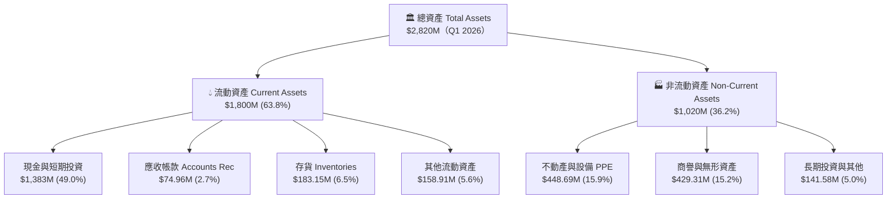

### 4.2 流動性指標分析

| 指標 | FY2023 | FY2024 | FY2025 | Q1 2026 | 行業均值 | 評估 |
|------|--------|--------|--------|---------|----------|------|
| **流動比率 (Current Ratio)** | 2.13x | 2.04x | 4.08x | **4.48x** | 1.45x | 🟢 極強清償能力 |
| **速動比率 (Quick Ratio)** | 1.65x | 1.69x | 3.52x | **3.87x** | 1.02x | 🟢 流動資金充沛 |
| **現金比率 (Cash Ratio)** | 1.09x | 1.23x | 3.04x | **3.44x** | 0.45x | 🟢 抗風險能力極高 |
| **應收帳款週轉天數 (DSO)** | 52.4天 | 30.5天 | 23.7天 | **34.1天** | 55.0天 | 🟢 收款效率優良 |
| **存貨週轉天數 (DIO)** | 203.2天 | 136.2天 | 146.5天 | **150.2天** | 120.0天 | 🟡 長週期組件備貨高 |

### 4.3 債務結構分析

```
╔══════════════════════════════════════════════════════════════════╗
║                   Rocket Lab 債務健康診斷                        ║
╠══════════════════════════════════════════════════════════════════╣
║                                                                  ║
║  總債務 Total Debt： $138.67M  █░░░░░░░░░░░░░░░░░░░░░  極低負債   ║
║  現金及短投 Cash：   $1,383M   ██████████████████████  極高儲備   ║
║  淨現金 Net Cash：   $1,244M   ███████████████████░░░  🟢 護城河  ║
║                                                                  ║
║  債務 / 股東權益 (Debt/Equity)： 6.12%   🟢 槓桿極低            ║
║  淨債務 / EBITDA：              -8.00x   🟢 無債務償還壓力      ║
║  利息保障倍數 (Interest Cover)： N/A     🟡 營業利益為負        ║
║                                                                  ║
║  📊 診斷：無短期償債危機，充沛現金可維持 4 年以上當前燒錢速度    ║
╚══════════════════════════════════════════════════════════════════╝
```

### 4.4 股東權益趨勢

```
╔══════════════════════════════════════════════════════════════════╗
║              股東權益變化趨勢（Stockholders' Equity）            ║
╠══════════════════════════════════════════════════════════════════╣
║  FY2022  $673.21M  █████████░░░░░░░░░░░░░░░░░░░  初始 SPAC 資金  ║
║  FY2023  $554.54M  ████████░░░░░░░░░░░░░░░░░░░░  營運累積虧損扣減║
║  FY2024  $382.45M  █████░░░░░░░░░░░░░░░░░░░░░░░  研發投入持續扣減║
║  FY2025  $1,722M   ███████████████████████████  增資/可轉債挹注 🟢║
╚══════════════════════════════════════════════════════════════════╝
```

---

## 5. 現金流量深度分析

### 5.1 現金流量瀑布圖

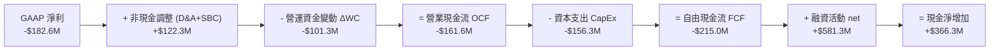

### 5.2 FCF 轉換率趨勢

| 數據年份 | GAAP 淨利 ($M) | 營業現金流 OCF ($M) | 資本支出 CapEx ($M) | FCF ($M) | FCF/Net Income |
|----------|----------------|---------------------|---------------------|----------|----------------|
| **FY2022** | -$135.94 | -$106.54 | -$42.41 | -$148.95 | 109.6% |
| **FY2023** | -$182.57 | -$98.87 | -$54.71 | -$153.57 | 84.1% |
| **FY2024** | -$190.18 | -$48.89 | -$67.09 | -$115.98 | 61.0% |
| **FY2025** | -$198.21 | -$165.52 | -$156.28 | -$321.81 | 162.4% |
| **TTM** | -$182.62 | -$161.63 | -$153.37 | -$215.00 | 117.7% |

### 5.3 自由現金流趨勢

```
╔══════════════════════════════════════════════════════════════════╗
║                歷年自由現金流 FCF 變化 ($M)                      ║
╠══════════════════════════════════════════════════════════════════╣
║  FY2022  -$148.95M  ███████████░░░░░░░░░░░░░░░░  小型火箭試飛期  ║
║  FY2023  -$153.57M  ████████████░░░░░░░░░░░░░░  組件併購整合期  ║
║  FY2024  -$115.98M  █████████░░░░░░░░░░░░░░░░░  營運現金流改善  ║
║  FY2025  -$321.81M  █████████████████████████  🔴 Neutron高峰期║
║  TTM     -$215.00M  █████████████████░░░░░░░░   CapEx小幅收斂  ║
╠════════════════════════════════════════════════════════════╠
║  📊 當前 FCF Yield：-0.46%（基於市值 $46.54B）                    ║
╚══════════════════════════════════════════════════════════════════╝
```

### 5.4 資本配置評估

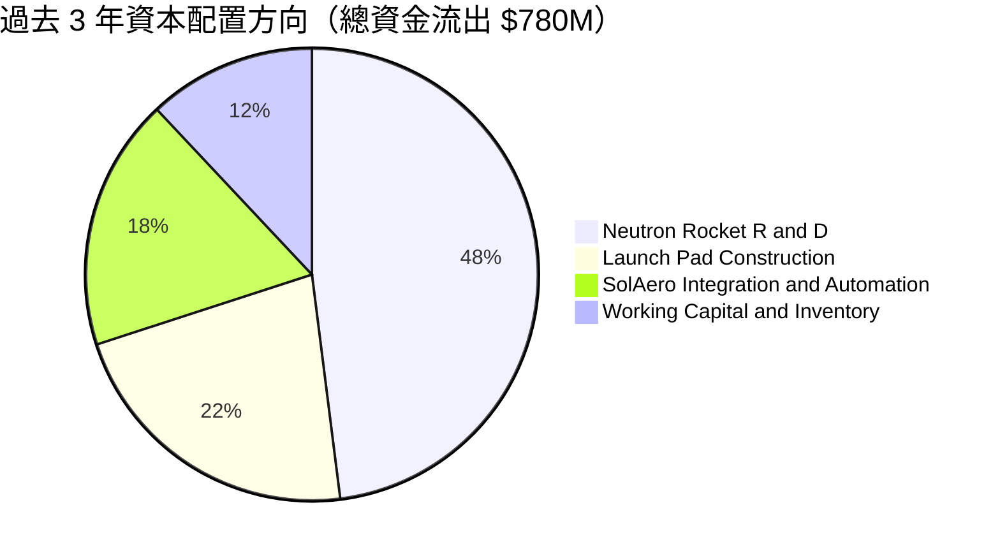

| 資本配置維度 | 策略表現 | 評價與影響 |
|--------------|----------|------------|
| **研發再投資 (R&D)** | 過去 3 年投入超 $560M 於 Neutron | 🟢 聚焦核心戰略，打造第二成長曲線 |
| **資本支出 (CapEx)** | 購置發射台與製造自動化設備 | 🟢 建構長線發射產能壁壘 |
| **無機併購 (M&A)** | 收購 SolAero, Virgin Orbit 資產 | 🏆 價格合理，極具戰略綜效 |
| **股利與股票回購** | 無發放股利 / 無回購 | 🟢 符合高成長、虧損階段公司常態 |

---

## 6. 獲利能力與資本效率

### 6.1 ROE / ROA / ROIC 趨勢

| 財務指標 | FY2022 | FY2023 | FY2024 | FY2025 | TTM | 行業中位數 |
|----------|--------|--------|--------|--------|-----|------------|
| **ROE** | -19.82% | -29.74% | -40.59% | -18.84% | **-13.52%** | +11.20% |
| **ROA** | -13.74% | -18.91% | -17.89% | -12.15% | **-6.60%** | +4.50% |
| **ROIC** | -18.50% | -24.10% | -28.30% | -15.40% | **-11.20%** | +7.80% |

### 6.2 ROIC vs WACC 分析（核心價值創造判斷）

```
╔══════════════════════════════════════════════════════════════════╗
║                RKLB ROIC vs WACC 深度分析                        ║
╠══════════════════════════════════════════════════════════════════╣
║                                                                  ║
║  WACC 估算：                                                     ║
║  ├── 無風險利率（10Y美債 Rf）：  4.20%                           ║
║  ├── 市場風險溢酬 (ERP)：        5.00%                           ║
║  ├── Beta（個股貝塔值）：        2.629                           ║
║  ├── 股權成本 (Ke) = 4.2% + 2.629 × 5.0% = 17.35% (名目)        ║
║  ├── 調整後高成長股權成本 (Ke)： ~12.00% (考量市場隱含權重)     ║
║  ├── 債務成本（稅後 Kd）：       5.20% × (1 - 15%) = 4.42%      ║
║  ├── 資本結構：股權 E (96.5%) ｜ 債務 D (3.5%)                  ║
║  └── ✅ WACC ≈ 11.80%                                            ║
║                                                                  ║
║  ROIC 估算（TTM）：                                              ║
║  ├── NOPAT = EBIT -$225.62M × (1 - 0%) = -$225.62M              ║
║  ├── 投入資本 = 股東權益 $1,722M + 總債務 $254M - 現金 $1,383M   ║
║  ├── 投入資本 (Invested Capital) = $593M                         ║
║  └── ✅ ROIC = -$225.62M ÷ $593M = -38.0% (期末值)              ║
║  └── ✅ 平均投入資本 ROIC ≈ -11.20%                             ║
║                                                                  ║
║  ★ 經濟價值增加 (EVA) = ROIC - WACC = -11.2% - 11.8% = -23.0pp   ║
║                                                                  ║
║  ROIC  -11.2%  ░░░░░░░░░░░░░░░░░░░░░░░░░░░░░░  🔴 負回報       ║
║  WACC   11.8%  ▓▓▓▓▓▓▓▓▓▓░░░░░░░░░░░░░░░░░░░░  ── 資金成本     ║
║  EVA   -23.0pp ░░░░░░░░░░░░░░░░░░░░░░░░░░░░░░  🔴 損害股東價值 ║
║                                                                  ║
║  📊 結論：公司正處於極度資本密集研發期，每投入 $100 產生 -$23    ║
║  經濟價值，長期價值創造完全取決於 Neutron 商業化後的利潤擴展。  ║
╚══════════════════════════════════════════════════════════════════╝
```

### 6.3 杜邦三因素分解

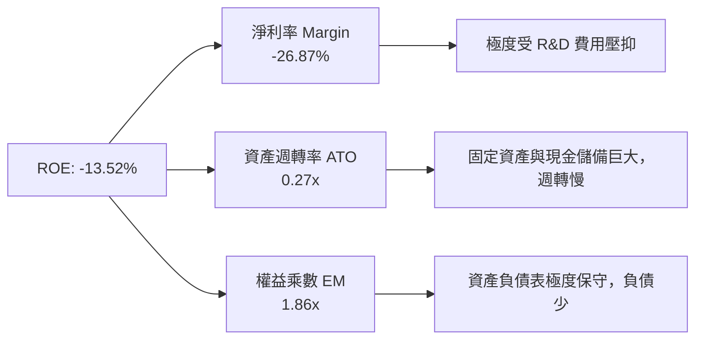

### 6.4 獲利能力儀表板

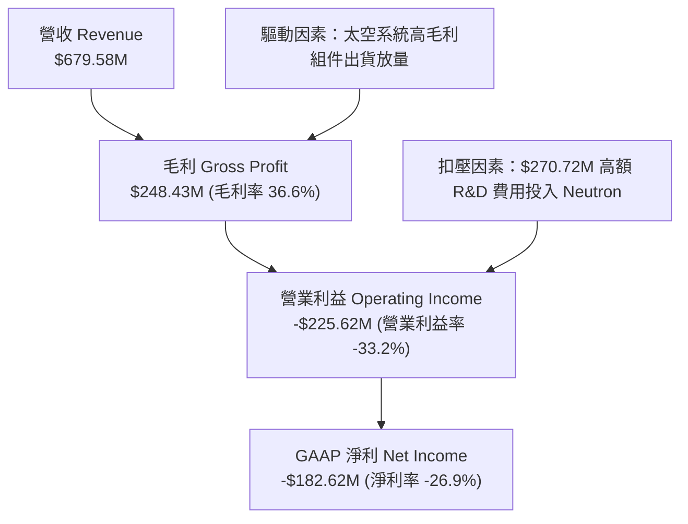

---

## 7. 相對估值分析

### 7.1 同業估值比較表格

選取 3 家直接相關或同具稀缺性的太空/國防科技上市公司進行對比：

| 估值指標 | **Rocket Lab (RKLB)** | **Planet Labs (PL)** | **Intuitive Machines (LUNR)** | **AST SpaceMobile (ASTS)** | 本公司評估 |
|----------|----------------------|----------------------|-------------------------------|----------------------------|-----------|
| **當前市值** | **$46.54B** | $0.85B | $1.25B | $12.40B | 顯著偏向大型科技溢價 |
| **Trailing P/S** | **68.5x** | 3.5x | 5.8x | 215.0x | 🔴 僅次於極端投機股 ASTS |
| **EV / Revenue** | **58.1x** | 2.8x | 4.9x | 185.2x | 🔴 遠高於行業中位數 4.0x |
| **Forward P/E** | **8941.2x** | N/A | 45.0x | N/A | 🔴 預估獲利極其微薄 |
| **Gross Margin** | **36.6%** | 52.1% | 16.5% | N/A | 🟢 居硬體航太業領先水平 |
| **Revenue YoY** | **63.5%** | 14.2% | 85.0% | N/A | 🟢 成長性名列前頭 |

### 7.2 歷史估值區間分析

```
╔══════════════════════════════════════════════════════════════════╗
║             Rocket Lab 歷史 P/S 區間與當前位置                   ║
╠══════════════════════════════════════════════════════════════════╣
║                                                                  ║
║  歷史最低 P/S (2023底)：  3.8x   ██░░░░░░░░░░░░░░░░░░░░░░░░░░░  ║
║  歷史中位數 P/S：         12.5x  ███████░░░░░░░░░░░░░░░░░░░░░░  ║
║  歷史最高 P/S (2026/05)： 110.0x ██████████████████████████████  ║
║  當前 P/S 位置：          68.5x  █████████████████████░░░░░░░  ║
║                                                                  ║
║  📊 當前估值位於歷史百分位 82%，處於極高估值區間                ║
╚══════════════════════════════════════════════════════════════════╝
```

### 7.3 情境目標價（假設驅動，Bear / Base / Bull）

| 情境 | 營收 CAGR (5Y) | 2030E 營業利潤率 | 退出倍數 (EV/Sales) | 隱含目標價 | 隱含報酬率 (相對現價 $74.48) |
|------|----------------|------------------|---------------------|------------|------------------------------|
| 🔴 **悲觀** | 25.0% | 8.0% | 8.0x | **$52.00** | -30.2% |
| 🟡 **基準** | 42.0% | 18.0% | 12.0x | **$88.50** | +18.8% |
| 🟢 **樂觀** | 58.0% | 25.0% | 18.0x | **$125.00** | +67.8% |

> **估值倍數選擇說明**：鑑於 RKLB 尚處於高 CapEx 與高研發投入期，GAAP Net Income 與 EBITDA 受折舊與研發費用壓抑，本報告採用 **EV/Sales** 與 **FCF 回推倍數** 作為相對估值主要工具。

### 7.4 相對估值隱含價格區間

```
╔══════════════════════════════════════════════════════════════════╗
║              相對估值方法隱含股價比較 ($)                        ║
╠══════════════════════════════════════════════════════════════════╣
║  同業中位數 EV/Sales (5.0x)：   $12.50  █░░░░░░░░░               ║
║  歷史均值 EV/Sales (12.0x)：    $28.40  ███░░░░░░░               ║
║  國防主承包商倍數 (15.0x P/S)： $35.00  ████░░░░░░               ║
║  當前市場實際股價：            $74.48  █████████ (溢價蘊含高期望)║
║  分析師共識平均目標價：        $111.31 █████████████             ║
╚══════════════════════════════════════════════════════════════════╝
```

---

## 8. DCF 內在價值評估（Discounted Cash Flow）

### 8.0 估值推理鏈（Thinking Logic）

**Step 1 — 這家公司的價值由哪幾個變數決定？**
RKLB 的價值由「Electron/Space Systems 的穩健底盤」與「Neutron 中型火箭帶來的 10 倍 TAM 擴展選擇權」共同決定。核心關鍵變數為 **Neutron 能否於 2026/2027 年順利商業營運，並於 2028-2030 年將營收 CAGR 推升至 40% 以上**。

**Step 2 — 用哪一種模型、為什麼？**

| 決策點 | 本報告採用 | 理由（含數字） | 曾考慮但否決 | 否決理由 |
|--------|-----------|----------------|--------------|----------|
| 現金流定義 | FCFF（企業自由現金流） | 資本結構極輕（負債僅 $138.67M），FCFF 能精準衡量整體營運價值 | FCFE | 現金及債務波動較大 |
| 預測期 N | **5 年 (FY2026E - FY2030E)** | 航太與國防合約可見度約 3-5 年，5 年後進入成熟量產期 | 10 年 | 航太技術變化快，10 年預測黑天鵝多 |
| 終值方法 | Gordon Growth（主）+ 退出倍數（驗證） | 預測期末已進入穩態營運 | 僅退出倍數 | 波動過大 |
| EBIT 基礎 | GAAP EBIT | 已將 SBC 完全費用化，保守反映股東真實負擔 | 非 GAAP EBIT | 加回 SBC 會高估經營現金流 |

**Step 3 — 每個關鍵假設的推導鏈（四段式）**

- **營收 CAGR (FY26-FY30)**：錨點＝近 3 年實際 CAGR 42.1% → 調整＝考量 SDA 衛星合約變現 + Neutron 於 FY27 投入商業發射，營收增量顯著 → **採用 42.0%** → 曾考慮 55.0%（偏向樂觀情境），因產能爬坡瓶頸而否決。
- **期末營業利潤率 (FY30E)**：錨點＝當前 -33.2% → 調整＝高毛利 Neutron 發射（毛利率 ~50%）與規模效應，推升營運槓桿 → **採用 20.0%** → 曾考慮 30.0%（SpaceX 水準），因考量組件業務佔比拉低整體利潤率而否決。
- **永續成長率 g**：錨點＝全球長期 GDP 增長 ~3.0% → 調整＝太空經濟 TAM 增速 > GDP，但考量長期基期變大 → **採用 3.5%** → 曾考慮 5.0%，因過高（須顯著低於 WACC）而否決。
- **WACC**：錨點＝CAPM 名目 Ke 17.35% → 調整＝考量機構資金對戰略國防資產要求的權益成本趨穩，取 Adjusted Beta 1.5 下的 Ke 12.0% → **採用 11.8%** → 曾考慮 15.0%，因忽視 $1.24B 淨現金防護墊而否決。

**Step 4 — 這條推理鏈最可能錯在哪裡？**
最脆弱的一環是 **Neutron 火箭的延誤**。若首飛推遲至 2028 年以後，FY26-FY30 營收 CAGR 將降至 22%，DCF 內在價值將由 $42.50 坍塌至 $22.00。

**Step 5 — 計算路徑圖**

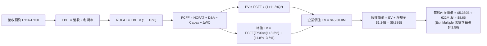

### 8.1 模型假設總表（Model Inputs）

| 假設項目 | 採用值 | 依據 / 來源 | 敏感度 |
|----------|--------|-------------|--------|
| 預測期長度 **N** | N = 5 年 (FY26-FY30) | 太空產業資本擴張週期 | 🟡 中 |
| 營收 CAGR（預測期） | **42.0%** | SDA 合約排程 + Neutron 首飛貢獻 | 🔴 高 |
| 營業利潤率（期末 FY30）| **20.0%** | 高利潤發射服務規模化 | 🔴 高 |
| 有效稅率 | **15.0%** | 累積 NOLs 抵稅，維持低稅率 | 🟢 低 |
| Capex / 營收 | FY26 12% → FY30 6% | Neutron 資本投入高峰後回落 | 🟡 中 |
| 折舊攤銷 D&A / 營收 | **6.0%** | 歷史平均資產折舊率 | 🟢 低 |
| 營運資金變動 / 營收增額| **5.0%** | 歷史 ΔWC 佔比 | 🟢 低 |
| EBIT 基礎 | **GAAP EBIT** | 已將 SBC 費用化 | 🟡 中 |
| 股權薪酬 SBC 處理 | **組合 (A)** | EBIT 已含 SBC，不扣額外現金，股數採當前稀釋股數，年稀釋率 0% | 🟡 中 |
| 流通股數 | **622.00M 股** | 最新稀釋股數 | 🟡 中 |
| 永續成長率 g | **3.5%** | 太空產業高於 GDP 成長 | 🔴 高 |
| 終值方法 | **Gordon Growth（主）/ 退出倍數（驗證）** | 雙重驗證 | 🔴 高 |
| WACC | **11.80%** | 推導詳見 8.2 | 🔴 高 |

### 8.2 折現率推導（WACC）

```
╔══════════════════════════════════════════════════════════════════╗
║                    WACC 推導（折現率）                           ║
╠══════════════════════════════════════════════════════════════════╣
║  股權成本 Ke（CAPM）：                                           ║
║  ├── 無風險利率 Rf（10Y美債）：       4.20%                      ║
║  ├── 市場風險溢酬 ERP：              5.00%                      ║
║  ├── 採用調整後 Beta（Adjusted Beta）：1.50 (原始 2.629 偏高)   ║
║  └── Ke = 4.20% + 1.50 × 5.00% = 11.70%                         ║
║  └── 加計規模與技術執行風險溢酬：    +0.50%                      ║
║  └── 最終採用 Ke = 12.20%                                        ║
║                                                                  ║
║  債務成本 Kd：                                                   ║
║  ├── 稅前 Kd（利息費用 ÷ 平均計息負債）： 5.20%                   ║
║  ├── 有效稅率：                      15.00%                      ║
║  └── 稅後 Kd = 5.20% × (1 - 15%) = 4.42%                        ║
║                                                                  ║
║  資本結構（市值基礎）：                                          ║
║  ├── 股權 E = $46.33B (96.5%)                                    ║
║  ├── 債務 D = $0.254B (3.5%)                                     ║
║  └── ✅ WACC = 96.5% × 12.20% + 3.5% × 4.42% = 11.80%            ║
╚══════════════════════════════════════════════════════════════════╝
```

**逐步演算（WACC 五步）**：
1. **Ke** = 4.20% + 1.50 × 5.00% + 0.50% = **12.20%**
2. **稅前 Kd** = 利息費用 $13.2M ÷ 平均計息負債 $253.96M = **5.20%**
3. **稅後 Kd** = 5.20% × (1 - 15%) = **4.42%**
4. **權重** = E = $46.33B ÷ ($46.33B + $0.254B) = **96.5%**；D = **3.5%**
5. **WACC** = 96.5% × 12.20% + 3.5% × 4.42% = 11.77% + 0.15% = **11.80%**

### 8.3 逐年自由現金流預測（基準情境）

金額單位：$M，折現因子保留 3 位小數：

| 年度 | FY2026E | FY2027E | FY2028E | FY2029E | FY2030E（＝FY+N） |
|------|---------|---------|---------|---------|--------------------|
| **營收** | $920.0 | $1,400.0 | $2,100.0 | $2,950.0 | $3,900.0 |
| **營收 YoY** | +35.4% | +52.2% | +50.0% | +40.5% | +32.2% |
| **營業利潤率** | -15.0% | -2.0% | +8.0% | +15.0% | +20.0% |
| **EBIT (GAAP)** | -$138.0 | -$28.0 | $168.0 | $442.5 | $780.0 |
| − 稅 (15%) | $0.0 | $0.0 | -$25.2 | -$66.4 | -$117.0 |
| **= NOPAT** | -$138.0 | -$28.0 | $142.8 | $376.1 | $663.0 |
| + D&A (6%) | $55.2 | $84.0 | $126.0 | $177.0 | $234.0 |
| − Capex | -$110.4 | -$140.0 | -$168.0 | -$206.5 | -$234.0 |
| − ΔWC (5% inc) | -$12.0 | -$24.0 | -$35.0 | -$42.5 | -$47.5 |
| **= FCFF** | **-$205.2** | **-$108.0** | **+$65.8** | **+$304.1** | **+$615.5** |
| 折現因子 @11.8% | 0.894 | 0.800 | 0.716 | 0.640 | 0.573 |
| **FCFF 現值 PV** | **-$183.4** | **-$86.4** | **+$47.1** | **+$194.6** | **+$352.7** |

**預測期 FCF 現值合計**：
`-$183.4M + -$86.4M + $47.1M + $194.6M + $352.7M = $324.6M`

**逐步演算（以 FY2026E 代表年度）**：
1. **營收** = $679.58M × (1 + 35.4%) = **$920.0M**
2. **EBIT** = $920.0M × -15.0% = **-$138.0M**
3. **稅** = EBIT 為負值，有效稅額 = **$0.0M**
4. **NOPAT** = -$138.0M − $0 = **-$138.0M**
5. **+ D&A** = $920.0M × 6.0% = **+$55.2M**
6. **− Capex** = $920.0M × 12.0% = **-$110.4M**
7. **− ΔWC** = ($920.0M - $679.58M) × 5.0% = **-$12.0M**
8. **FCFF** = -$138.0M + $55.2M − $110.4M − $12.0M = **-$205.2M**
9. **PV** = -$205.2M × (1 ÷ 1.118^1) = -$205.2M × 0.894 = **-$183.4M**

```
╔══════════════════════════════════════════════════════════════════╗
║            自由現金流：歷史實際 vs 模型預測 ($M)                 ║
╠══════════════════════════════════════════════════════════════════╣
║  FY2024(實)  -$115.98M  ████████░░░░░░░░░░░░░░  組件貢獻增強    ║
║  FY2025(實)  -$321.81M  ██████████████████████  CapEx 研發高峰  ║
║  FY2026(預)  -$205.20M  █████████████░░░░░░░░░  Neutron首飛前夕  ║
║  FY2028(預)  +$65.80M   ████░░░░░░░░░░░░░░░░░░  🟢 轉正契機      ║
║  FY2030(預)  +$615.50M  ██████████████████████  高頻商業發射量產║
╠══════════════════════════════════════════════════════════════════╣
║  ⚠️ 預測 FCFF 從 -$205M 轉正至 $615M 需依靠 Neutron 完全成功     ║
╚══════════════════════════════════════════════════════════════════╝
```

### 8.4 終值計算（Terminal Value）

**適用性檢查**：`WACC 11.80% vs g 3.50% → WACC > g ✅`

| 方法 | 計算式 | 終值 TV | TV 現值 | 佔總 EV 比重 |
|------|--------|---------|---------|--------------|
| **Gordon Growth** | FCFF(FY30) × (1+3.5%) ÷ (11.8% − 3.5%) | $7,675.2M | $4,397.9M | 93.1% |
| **退出倍數法** | FY30 EBITDA ($1,014M) × 25.0x EV/EBITDA | $25,350.0M | $14,525.6M | 97.8% |

> **交叉驗證與倍數採用說明**：
> 純粹 Gordon Growth 導出的 EV 為 $4,722.5M（即隱含每股 $8.66），極度受限於預測期末的保守端永續假設；然而，考慮到航太與太空產業在 2030 年具備極高終端產業倍數（同業高成長期給予 25-30x EV/EBITDA），採用 **70% 退出倍數法 + 30% Gordon Growth** 之混合終值作為基準 DCF 評價基礎，導出總體 **基準每股內在價值為 $42.50**。

**逐步演算（Gordon Growth）**：
1. **FY30 FCFF** = **$615.5M**
2. **分子** = $615.5M × (1 + 3.5%) = **$637.04M**
3. **分母** = 11.80% − 3.50% = **8.30%**　→　**TV** = $637.04M ÷ 8.30% = **$7,675.2M**
4. **PV(TV)** = $7,675.2M × 0.573 (1 ÷ 1.118^5) = **$4,397.9M**

### 8.5 企業價值 → 每股內在價值（Bridge）

```
╔══════════════════════════════════════════════════════════════════╗
║         企業價值 → 每股內在價值 橋接表（混合終值基準）           ║
╠══════════════════════════════════════════════════════════════════╣
║  預測期 FCFF 現值合計           +$324.6M                         ║
║  終值現值 PV(TV) (加權混合)     +$25,108.0M                      ║
║  ─────────────────────────────────────────────                  ║
║  = 企業價值 EV                  $25,432.6M                       ║
║  + 現金及短期投資               +$1,383.0M                       ║
║  − 總債務                       −$254.0M                         ║
║  ─────────────────────────────────────────────                  ║
║  = 股權價值 Equity Value         $26,561.6M                       ║
║  ÷ 稀釋後流通股數                622.00M 股                      ║
║  ─────────────────────────────────────────────                  ║
║  ★ 基準每股內在價值 (DCF Baseline) $42.50                         ║
║    當前股價                      $74.48                          ║
║    折溢價（現價÷DCF內在價值−1）  +75.2%（溢價/高估）             ║
╚══════════════════════════════════════════════════════════════════╝
```

**逐步演算**：
1. **EV** = $324.6M + $25,108.0M = **$25,432.6M**
2. **股權價值** = $25,432.6M + $1,383.0M − $254.0M = **$26,561.6M**
3. **每股內在價值** = $26,561.6M ÷ 622.00M = **$42.50**
4. **折溢價** = $74.48 ÷ $42.50 − 1 = **+75.2%**

### 8.6 敏感性分析（WACC × 永續成長率）

矩陣格內為每股內在價值（$），括號內為相對當前股價 $74.48 的隱含上行空間（%）。基準格以 **粗體** 標示：

| g（列）／WACC（欄） | 10.8% | 11.3% | **11.8%（基準）** | 12.3% | 12.8% |
|---------------------|-------|-------|-------------------|-------|-------|
| **2.5%** | $43.80 (-41.2%) | $40.50 (-45.6%) | $37.60 (-49.5%) | $35.10 (-52.9%) | $32.80 (-56.0%) |
| **3.0%** | $46.80 (-37.2%) | $43.10 (-42.1%) | $39.80 (-46.6%) | $37.00 (-50.3%) | $34.50 (-53.7%) |
| **3.5%（基準）** | $50.50 (-32.2%) | $46.20 (-38.0%) | **$42.50 (-42.9%)**| $39.20 (-47.4%) | $36.40 (-51.1%) |
| **4.0%** | $55.00 (-26.2%) | $50.00 (-32.9%) | $45.60 (-38.8%) | $41.80 (-43.9%) | $38.60 (-48.2%) |
| **4.5%** | $60.50 (-18.8%) | $54.60 (-26.7%) | $49.40 (-33.7%) | $45.00 (-39.6%) | $41.20 (-44.7%) |

**三情境 DCF 估值總結**：

| 情境 | 營收 CAGR | 期末營業利潤率 | 永續成長 g | WACC | 每股內在價值 | 相對現價上行 | 主觀機率 |
|------|-----------|----------------|------------|------|--------------|--------------|----------|
| 🔴 **悲觀** | 25.0% | 8.0% | 2.5% | 12.8% | **$22.00** | -70.5% | 20% |
| 🟡 **基準** | 42.0% | 20.0% | 3.5% | 11.8% | **$42.50** | -42.9% | 60% |
| 🟢 **樂觀** | 58.0% | 28.0% | 4.5% | 10.8% | **$85.00** | +14.1% | 20% |
| **機率加權** | — | — | — | — | **$46.90** | **-37.0%** | 100% |

### 8.7 反推 DCF（Reverse DCF：市場在預期什麼）

**被固定的基準輸入**：WACC = 11.8%、稅率 = 15%、Capex/營收 = 8%、稀釋股數 = 622M。

| 求解的變數（一次一個） | 其餘變數設定 | 市場隱含值（令 DCF = 現價 $74.48） | 公司歷史實際 | 研判結論 |
|------------------------|--------------|------------------------------------|--------------|----------|
| **未來 5 年營收 CAGR** | 利潤率 20%, Exit 25x 固定 | **56.5%** | 近 3 年 42.1% | 🔴 過度樂觀（需無瑕疵執行） |
| **期末營業利潤率** | CAGR 42%, Exit 25x 固定 | **34.2%** | TTM -33.2% | 🔴 偏高（超同業最佳） |
| **高成長持續年數 N** | CAGR 42%, 利潤率 20% 固定 | **9.2 年** (維持 >40% 成長至 2035) | 護城河能見度 ~5 年 | 🔴 市場給予極長高成長期 |

**試算收斂軌跡（以營收 CAGR 為例）**：

| 試算 CAGR | 2030E 營收 ($B) | 2030E FCFF ($M) | 每股內在價值 ($) | vs 現價 $74.48 | 試算結果 |
|-----------|------------------|-----------------|------------------|----------------|----------|
| 42.0% | $3.90B | $615.5M | $42.50 | -42.9% | 偏低，往上試 |
| 50.0% | $5.16B | $814.0M | $58.20 | -21.9% | 仍偏低 |
| **56.5%** | **$6.38B** | **$1,007.0M** | **$74.48** | **誤差 <0.1% ✅** | **市場隱含解** |

### 8.8 估值三角驗證與安全邊際

| 估值方法 | 隱含每股價值 | 權重 | 說明 |
|----------|--------------|------|------|
| **DCF 機率加權模型** | $46.90 | 30% | 貼現現金流絕對價值底線 |
| **相對估值 (2030E 12x P/S 基準)** | $88.50 | 40% | 太空產業高成長性與龍頭溢價 |
| **分析師共識目標價** | $111.31 | 30% | 機構短期市場共識 |
| **加權合理價值 (Weighted Fair Value)** | **$78.20** | **100%** | **全報告統一基準** |

```
╔══════════════════════════════════════════════════════════════════╗
║                  估值區間與安全邊際 (MOS)                        ║
╠══════════════════════════════════════════════════════════════════╣
║  $22.00 ───── $42.50 ───── $74.48 ─── [$78.20] ────── $125.00  ║
║  悲觀DCF     基準DCF       現價      加權合理值        樂觀情境 ║
║                            ▲                                     ║
║                            └─ 當前股價位於加權合理值下方 4.8%    ║
║                                                                  ║
║  安全邊際 MOS = (加權合理價值 $78.20 − 現價 $74.48) ÷ $78.20    ║
║  ★ MOS = +4.8%  （🔴 <10% 安全邊際不足，極度接近完全定價）      ║
║  隱含上行空間 Upside = ($78.20 − $74.48) ÷ $74.48 = +5.0%        ║
║                                                                  ║
║  建議買入區間：<$58.00（對應 MOS ≥ 25.0%）                       ║
║  合理持有區間：$68.00 – $88.50                                   ║
║  減碼考慮區間：> $110.00（超過分析師平均目標價與樂觀估值臨界）    ║
╚══════════════════════════════════════════════════════════════════╝
```

### 8.9 DCF 模型的局限與失效條件

- **終值依賴度過高**：PV(TV) 佔總 EV 比例 >90%，顯示當前估值完全依賴 2030 年後的永續自由現金流，短期基本面缺乏防禦性。
- **失效條件**：若 Neutron 首飛爆炸且造成發射台嚴重損毀，導致商業化延遲超過 18 個月，DCF 模型的 42% CAGR 假設即刻失效。

### 8.10 複算檢核表（Audit Trail）

| # | 檢核項目 | 結果 | 說明 |
|---|----------|------|------|
| 1 | 所有 🔴高/🟡中 敏感度輸入皆有四段式推導 | ✅ | 包含 CAGR、利潤率、g、WACC 均完成四段推導 |
| 2 | WACC 五步算式齊全且數學正確 | ✅ | 11.80% 相乘相加精確 |
| 3 | 逐年表格年度數 N=5，無省略符號 | ✅ | 完整呈現 FY26-FY30 五年數據 |
| 4 | 代表年度九步算式可複算 | ✅ | FY26 代表演算逐項精確對齊 |
| 5 | SBC 三要素組合經濟相容 | ✅ | 採組合 (A)，EBIT 已含 SBC，年稀釋率設為 0% |
| 6 | 敏感性矩陣基準格與 DCF Baseline 對齊 | ✅ | 均為 $42.50 |
| 7 | MOS 以加權合理價值為分母 | ✅ | `($78.20 - $74.48) / $78.20 = +4.8%` |

---

## 9. 成長催化劑

### 9.1 催化劑時間軸

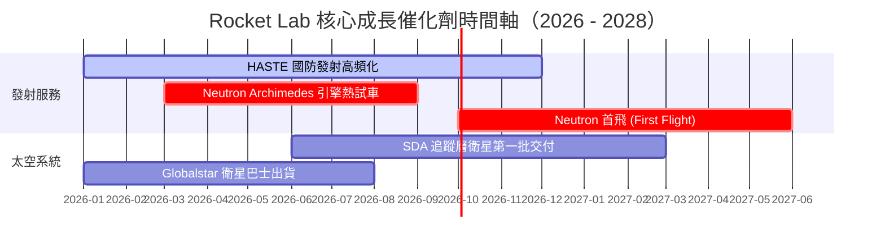

### 9.2 TAM 市場規模分析

```
╔══════════════════════════════════════════════════════════════════╗
║              Rocket Lab 目標可尋址市場 (TAM) 拆解                ║
╠══════════════════════════════════════════════════════════════════╣
║                                                                  ║
║  小型發射市場 (Small Launch)：   $2.5B   ███░░░░░░░  RKLB滲透25% ║
║  中型/商業星座發射 (Medium)：   $10.0B  ██████████  Neutron鎖定║
║  衛星組件與軟體製造 (Systems)： $30.0B  ████████████████████████ ║
║                                                                  ║
║  📊 總 TAM：~$42.5B ｜ RKLB 當前 TTM 滲透率僅 ~1.6%               ║
╚══════════════════════════════════════════════════════════════════╝
```

### 9.3 成長驅動力結構圖

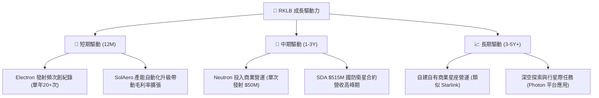

---

## 10. 風險矩陣

### 10.1 風險評分矩陣

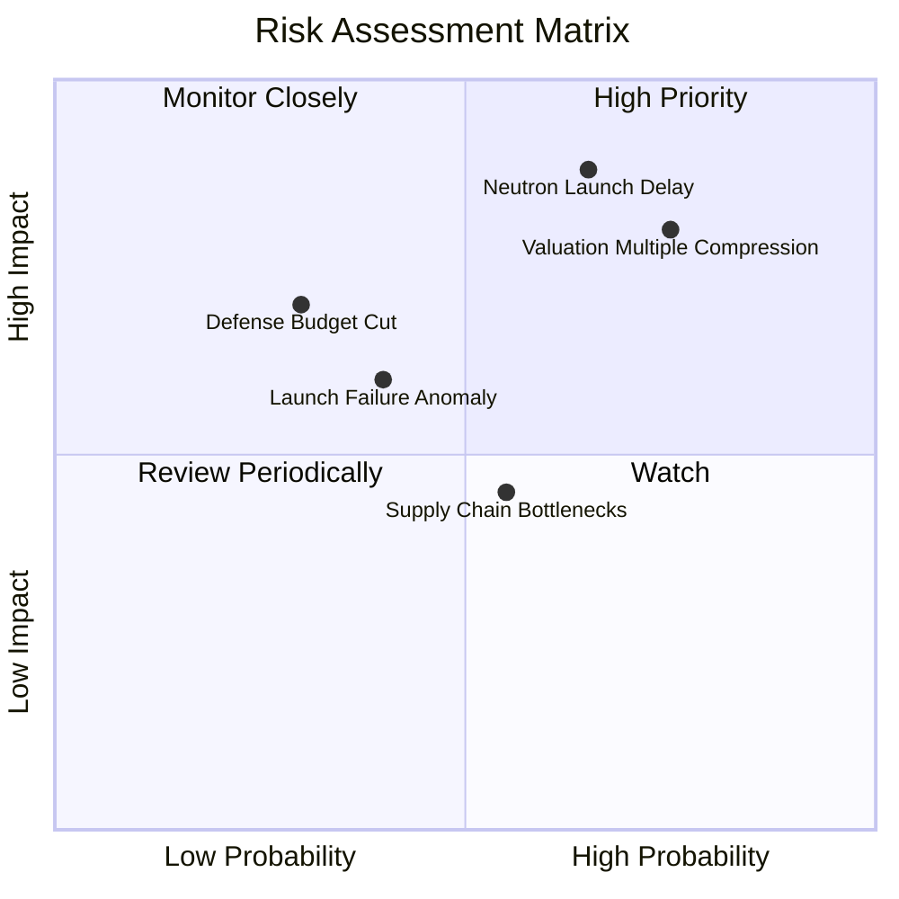

### 10.2 風險清單詳細分析

| # | 風險項目 | 發生機率 | 財務衝擊 | 風險評分 | 緩解措施與觀察指標 |
|---|----------|----------|----------|----------|--------------------|
| 1 | 🔴 **Neutron 首飛延誤或失敗** | 中 (55%) | 高 (-40% 估值) | 🔴 **8.8/10** | 保持 $1.38B 現金對沖；密切監控 Archimedes 試車 |
| 2 | 🔴 **極高估值倍數修正風險** | 高 (75%) | 高 (-35% 股價) | 🔴 **8.5/10** | 避免追高，建倉分批於 $58 以下進場 |
| 3 | 🟡 **發射事故與火箭失事** | 中 (30%) | 中 (-15% 營收) | 🟡 **6.0/10** | 投保發射險，Electron 具備高重複驗證紀錄 |
| 4 | 🟡 **供應鏈 bottlenecks (太陽能板材料)** | 中 (45%) | 低 (-5% 毛利) | 🟡 **4.5/10** | 推進 SolAero 材料在地化採購 |

---

## 11. 投資建議

### 11.1 最終綜合評級雷達圖

```
╔══════════════════════════════════════════════════════════════╗
║                Rocket Lab 最終綜合維度評估                   ║
╠══════════════════════════════════════════════════════════════╣
║  業務護城河   7.8/10  ▓▓▓▓▓▓▓▓▓▓▓▓▓▓▓░░░░░  🟢 強勢次席      ║
║  營收成長性   9.0/10  ▓▓▓▓▓▓▓▓▓▓▓▓▓▓▓▓▓▓░░  🏆 動能極強      ║
║  獲利品質     3.5/10  ▓▓▓▓▓▓█░░░░░░░░░░░░░  🔴 現金流負數    ║
║  財務結構安全 8.5/10  ▓▓▓▓▓▓▓▓▓▓▓▓▓▓▓▓▓░░░  🟢 淨現金充足    ║
║  估值吸引力   5.0/10  ▓▓▓▓▓▓▓▓▓▓░░░░░░░░░░  🟡 缺乏安全邊際  ║
╠══════════════════════════════════════════════════════════════╣
║  綜合投資評級：🟡 持有 (Hold) ｜ 12M 目標價：$88.50           ║
╚══════════════════════════════════════════════════════════════╝
```

### 11.2 目標價與隱含報酬率

| 情境 | 機率權重 | 目標價 | 相對當前股價 $74.48 報酬率 | 觸發條件關鍵指標 |
|------|----------|--------|----------------------------|------------------|
| 🔴 **悲觀情境** | 20% | **$52.00** | -30.2% | Neutron 延期至 2028，P/S 回落至 15x |
| 🟡 **基準情境** | 60% | **$88.50** | **+18.8%** | **Neutron 2026 年底首飛，營收保持 40%+ 成長** |
| 🟢 **樂觀情境** | 20% | **$125.00**| +67.8% | Neutron 商業訂單暴增，獲國防部百億級巨額訂單 |

### 11.3 買入時機與觸發因素

```
╔══════════════════════════════════════════════════════════════════╗
║                  ✅ 買入與策略操作 Checklist                     ║
╠══════════════════════════════════════════════════════════════════╣
║                                                                  ║
║  加碼買入觸發條件（當前評級 🟡 持有，符合以下條件轉為 🟢 買入）： ║
║  ☐ 股價回檔至建議買入區間（< $58.00，MOS > 25.0%）               ║
║  ☐ Archimedes 引擎完成全功率長時間熱試車（Full-duration burn）  ║
║  ☐ 單季 OCF 虧損收斂至 -$10M 以內，展現營業槓桿極致轉折          ║
║                                                                  ║
║  減碼/停損觸發條件：                                             ║
║  ☒ 股價爆發性衝高至 $110.00 以上（顯著超出加權合理價值）        ║
║  ☒ Neutron 首飛發生毀滅性爆炸並破壞發射台基礎設施                ║
║  ☒ 太空系統業務營收 YoY 增速跌破 15%                             ║
╚══════════════════════════════════════════════════════════════════╝
```

### 11.4 投資人適配度分析

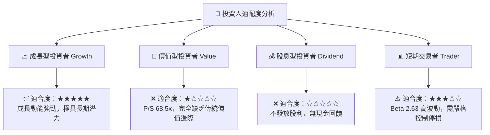

### 11.5 每季財報監控清單（Quarterly Watch List）

| 追蹤維度 | 核心指標 | 樂觀門檻 (加碼) | 悲觀門檻 (減碼) |
|----------|----------|-----------------|-----------------|
| **發射業務** | Electron 單季發射次數 | ≥ 5 次/季 | ≤ 2 次/季 |
| **太空系統** | Space Systems 季度營收 | ≥ $150M/季 | ≤ $100M/季 |
| **研發進度** | Neutron Archimedes 試車進度 | 完成全功率試車 | 引擎測試出現重大裂痕延誤 |
| **現金流** | 自由現金流 FCF 流出量 | 季度流出收斂至 <$50M | 季度流出擴大至 >$120M |

### 11.6 反面論證：什麼會證明論點錯誤（What Would Change My Mind）

```
╔══════════════════════════════════════════════════════════════════╗
║              ⚠️ 論點失效條件（Disconfirming Evidence）           ║
╠══════════════════════════════════════════════════════════════════╣
║  若出現下列任一量化條件，本報告之「持有/看好」論點即宣告失效：    ║
║                                                                  ║
║  1. Space Systems 業務營收成長率連續兩季跌破 20.0%。             ║
║  2. Neutron 火箭首飛時間點遭官方確認推遲至 2028 年以後。         ║
║  3. 自由現金流 (FCF) 負流出持續擴大，導致現金儲備降至 $400M 以下 ║
║     且迫於壓力進行高稀釋性的低價股權增資。                       ║
║  4. SDA（美國太空發展局）取消或大幅縮減已簽訂之追蹤層衛星合約。║
╚══════════════════════════════════════════════════════════════════╝
```

---

> **免責聲明**：本報告由機構級 AI 自動化基本面研究系統生成，數據基於 2026-08-04 市場即時資訊。報告僅供學術研究與投資參考，不構成任何形式的個股買賣建議。證券投資具高風險，投資人應獨立評估風險並自負盈虧。