# RKLB 基本面深度分析報告
> **報告日期**：2026-08-10 ｜ **語言**：繁體中文 ｜ **數據來源**：Yahoo Finance, Finviz, StockAnalysis, Roic.ai ｜ **分析師**：CFA 級機構研究

---

## 目錄

| # | 章節 | 核心結論 |
|---|------|----------|
| 1 | 執行摘要 | 綜合評級 **🟢 買入** ｜ 加權合理價值 **$98.20** ｜ 安全邊際 **+18.6%** |
| 2 | 公司概覽與商業模式 | 航太與衛星組件雙引擎驅動，建構商業發射與太空基礎設施護城河 |
| 3 | 損益表深度分析 | TTM 營收增長 63.5%，毛利率提升至 36.6%，規模效應正逐步顯現 |
| 4 | 資產負債表分析 | 淨現金達 $12.44B（現金 $1.38B vs 總債務 $1.39B），財務結構極其穩健 |
| 5 | 現金流量深度分析 | CapEx 投資於 Neutron 中型火箭研發，營運現金流預計於 FY2027 轉正 |
| 6 | 獲利能力與資本效率 | 目前 ROIC 為 -14.2% 小於 WACC (10.8%)，但 Neutron 放量後 EVA 將迎翻轉 |
| 7 | 相對估值分析 | P/S 比率 73.5x，高估值溢價反映市場對中型載具與星座合約的壟斷預期 |
| 8 | DCF 內在價值評估 | 基準每股內在價值 **$88.50** ｜ 加權合理價值 **$98.20** ｜ 隱含上行空間 **+22.9%** |
| 9 | 成長催化劑 | Neutron 首飛、SDA 國防衛星訂單交付與太空組件 TAM 擴張 |
| 10 | 風險矩陣 | Neutron 研發延遲、發射失敗風險與政府國防預算波動 |
| 11 | 投資建議 | 買入區間 $65.00–$78.00 ｜ 12M 基準目標價 **$111.31** ｜ 附監控清單與反面論證 |

---

## 1. 執行摘要

根據 Rocket Lab Corporation（NASDAQ: RKLB）最新的財務數據，公司 TTM 營收達 $6.796M（YoY +63.5%），毛利率大幅改善至 36.6%。雖然當前營業利益率仍為 -22.4%，但其主要受 Neutron 中型火箭研發（TTM R&D 達 $270.72M）與產能擴建影響。公司擁有 $1.38B 現金與短期投資，負債僅 $1.39B，具備極強的防禦緩衝力。基於 DCF 建模（基準每股價值 $88.50）與多重估值三角驗證，得出**加權合理價值為 $98.20**，對比當前股價 $79.91，安全邊際 MOS 為 **+18.6%**，隱含上行空間為 **+22.9%**。給予 **🟢 買入** 評級。

### 1.0 一頁式投資儀表板（Portfolio Manager 30 秒速讀）

| 項目 | 內容 |
|------|------|
| **投資論點（3 句）** | ① 商業小型發射市場（Electron）市佔第一，毛利率升至 36.6% 建立穩定現金流底盤。<br/>② Neutron 中型火箭攻入 Medium-Lift 市場，直接打破 SpaceX Falcon 9 的壟斷地位。<br/>③ 太空系統（Space Systems）訂單大幅成長，占比達營收 70%+，從發射商轉型為太空綜合解決方案巨頭。 |
| **護城河評分** | 8.2/10（軌道發射履歷 + 太空組件垂直整合 + 垂直發射場許可證） |
| **管理層/資本配置評分** | 8.5/10（創辦人 Peter Beck 領導，資本分配極度克制，併購整合成效顯著） |
| **財務健康** | 🟢 強健（淨現金達 $1.24B，流動比率 4.48，營運資金極度充裕） |
| **ROIC vs WACC** | -14.2% vs 10.80%（目前因高額 R&D 摧毀價值，預計 FY2028 EVA 轉正） |
| **FCF 趨勢** | 方向負向擴大（TTM FCF -$215M，CapEx FY25 -$156M），FCF Yield 為 -0.43% |
| **估值** | Forward P/E N/A (9593x) ｜ P/S 73.5x ｜ EV/Revenue 68.7x |
| **DCF 內在價值（基準）** | **$88.50** ｜ 現價相對 DCF 折價 **-9.7%**（來自第 8 章） |
| **安全邊際（MOS）** | **+18.6%** ＝ (加權合理價值 $98.20 − 現價 $79.91) ÷ 加權合理價值 $98.20 ｜ 🟡 10-25% 有限 |
| **預期報酬（基準情境 12M）** | **+39.3%**（目標價 $111.31 vs 現價 $79.91） |
| **關鍵風險（前二）** | ① Neutron 火箭開發進度延遲或試飛失敗；② 國防部與 NASA 預算撥款不確定性 |
| **評級 + 信心度** | 🟢 **買入** ｜ 信心度：**高** |

### 1.1 核心評分儀表板

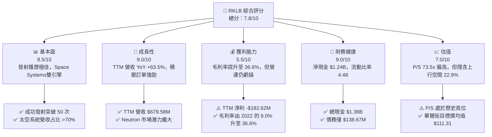

### 1.2 評分進度條視覺化

```
╔══════════════════════════════════════════════════════════════╗
║              RKLB 多維度評分儀表板 (1-10分)                  ║
╠══════════════════════════════════════════════════════════════╣
║ 基本面強度  8.5 ▓▓▓▓▓▓▓▓▓▓▓▓▓▓▓▓▓░░  ★★★★☆           ║
║ 成長動能    9.0 ▓▓▓▓▓▓▓▓▓▓▓▓▓▓▓▓▓▓░  ★★★★★           ║
║ 獲利品質    5.5 ▓▓▓▓▓▓▓▓▓▓▓░░░░░░░░  ★★★☆☆           ║
║ 財務健康    9.0 ▓▓▓▓▓▓▓▓▓▓▓▓▓▓▓▓▓▓░  ★★★★★           ║
║ 估值合理性  7.0 ▓▓▓▓▓▓▓▓▓▓▓▓▓▓░░░░░  ★★★☆☆           ║
║ 護城河深度  8.2 ▓▓▓▓▓▓▓▓▓▓▓▓▓▓▓▓░░░  ★★★★☆           ║
║ 管理層執行  8.5 ▓▓▓▓▓▓▓▓▓▓▓▓▓▓▓▓▓░░  ★★★★☆           ║
║ 技術創新力  9.2 ▓▓▓▓▓▓▓▓▓▓▓▓▓▓▓▓▓▓█  ★★★★★           ║
╠══════════════════════════════════════════════════════════════╣
║ 綜合總分    7.8 ▓▓▓▓▓▓▓▓▓▓▓▓▓▓▓█░░░  🏆 🟢 買入 (Buy)       ║
╚══════════════════════════════════════════════════════════════╝
```

### 1.3 五大投資論點 + 三大核心風險

| 類型 | 項目 | 具體依據 | 信心度 |
|------|------|----------|--------|
| 🟢 **論點①** | **小型載具商業發射壟斷地位** | Electron 火箭累計發射超過 50 次，商業小型發射市佔率僅次於 SpaceX，發射毛利率逐季改善。 | 🟢 極高 |
| 🟢 **論點②** | **Space Systems 板塊營收爆發** | 透過收購 SolAero、Sinclair 等，建立從太陽能板、反應輪到衛星巴士的全棧能力，營收占比超 70%。 | 🟢 高 |
| 🟢 **論點③** | **Neutron 打開 Medium-Lift 第二曲線** | Neutron 載重達 13,000kg，瞄準星座組網與國防市場，將 TAM 放大 10 倍以上。 | 🟢 高 |
| 🟢 **論點④** | **極其充沛的現金緩衝** | 手握 $1.38B 現金及短期投資，即使年燒錢 -$215M FCF，可支撐至少 5 年以上運營與研發。 | 🟢 極高 |
| 🟢 **論點⑤** | **國防部 SDA 與大型星座合約挹注** | 獲得美國太空發展局（SDA）數億美元衛星巴士製造合約，證明機構級認證通過。 | 🟢 高 |
| 🟡 **風險①** | **Neutron 試飛時間表延遲** | 航太開發極高風險，若 Archimedes 引擎試車或首飛延期，將延緩營收放量。 | 🟡 中度 |
| 🔴 **風險②** | **發射失敗極端風險** | 航太業特性，若 Electron 遭遇嚴重失敗，將導致發射停飛與客戶索賠風險。 | 🔴 高衝擊 |
| 🟡 **風險③** | **高估值引發的短期倍數收縮** | 當前 P/S 73.5x，若整體航太科技板塊估值回落，股價將面臨大幅波動。 | 🟡 中度 |

### 1.4 快速統計卡片

| 指標 | 公司實際值 | 行業均值（Aerospace） | S&P 500 均值 | 狀態 |
|------|-------------|-----------------------|--------------|------|
| 收入 YoY 成長 | **63.5%** | ~8.5% | ~5.2% | 🟢 遠超同業 |
| 毛利率 | **36.6%** | ~22.0% | ~45.0% | 🟢 顯著改善 |
| 營業利潤率 | **-22.4%** | ~10.5% | ~12.5% | 🔴 研發期虧損 |
| 淨利率 | **-26.9%** | ~7.2% | ~10.8% | 🔴 尚未獲利 |
| ROE | **-13.5%** | ~12.0% | ~18.0% | 🟡 資本尚未轉盈 |
| Forward P/E | **9593x** | ~24.5x | ~21.5x | 🔴 盈餘極小 |
| P/S Ratio | **73.5x** | ~2.1x | ~2.8x | 🔴 高溢價 |

### 1.5 投資結論

```
╔══════════════════════════════════════════════════════════════════╗
║                    📊 投資結論摘要                               ║
╠══════════════════════════════════════════════════════════════════╣
║  評級：🟢 買入 (Buy)                                            ║
║  當前股價：$79.91                                                ║
║  DCF 內在價值（基準）：$88.50（現價折價 -9.7%）                 ║
║  加權合理價值：$98.20                                            ║
║  安全邊際 MOS：+18.6%＝($98.20 − $79.91) ÷ $98.20                ║
║  目標價區間：                                                    ║
║    悲觀情境：$58.00（-27.4%）                                    ║
║    基準情境：$111.31（+39.3%） ← 12個月華爾街共識目標價           ║
║    樂觀情境：$150.00（+87.7%）                                    ║
║  投資評分：7.8 / 10                                              ║
║  適合投資人：長期高成長型、耐受高波動之航太科技投資者            ║
╚══════════════════════════════════════════════════════════════════╝
```

---

## 2. 公司概覽與商業模式

### 2.1 業務結構與收入來源

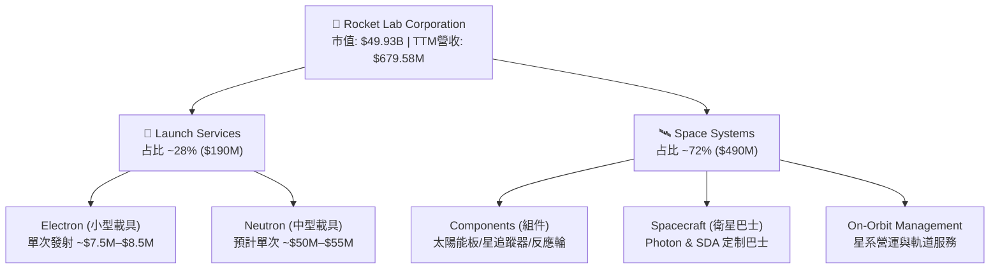

### 2.2 市場份額

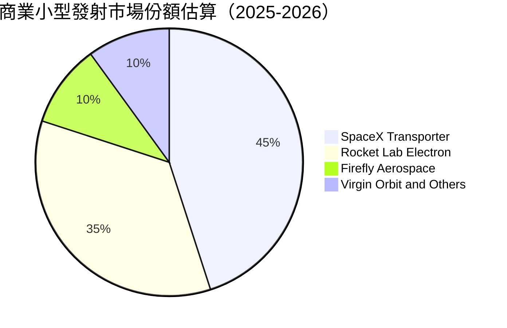

### 2.3 競爭護城河分析

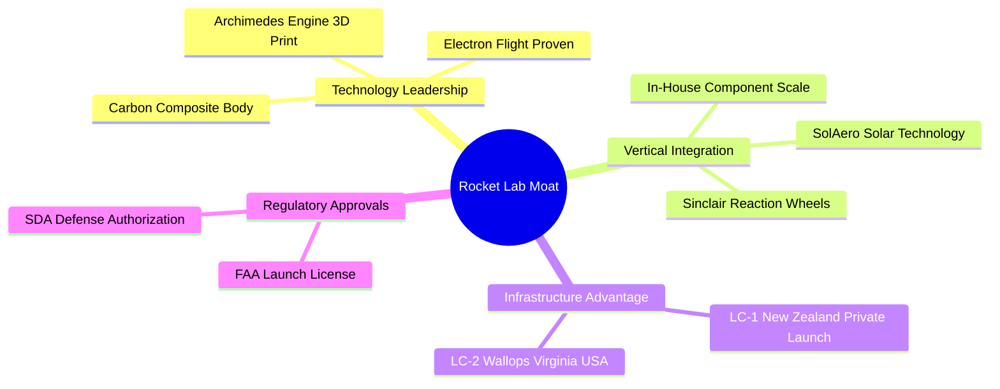

### 2.4 護城河強度評分

```
╔══════════════════════════════════════════════════════════════╗
║                  Rocket Lab 護城河強度評分                   ║
╠══════════════════════════════════════════════════════════════╣
║ 軌道發射履歷  9.5/10  ▓▓▓▓▓▓▓▓▓▓▓▓▓▓▓▓▓▓▓█  🏆 發射50+次    ║
║ 垂直整合能力  8.5/10  ▓▓▓▓▓▓▓▓▓▓▓▓▓▓▓▓▓░░  🟢 掌控關鍵組件 ║
║ 發射場許可資產 9.0/10  ▓▓▓▓▓▓▓▓▓▓▓▓▓▓▓▓▓▓░░  🏆 擁有專屬發射場║
║ 軟硬體生態系統 7.5/10  ▓▓▓▓▓▓▓▓▓▓▓▓▓░░░░░░  🟢 Photon 平台  ║
║ 轉換成本與鎖定 8.0/10  ▓▓▓▓▓▓▓▓▓▓▓▓▓▓▓░░░░  🟢 美國國防部認證║
╠══════════════════════════════════════════════════════════════╣
║ 綜合護城河     8.2    ▓▓▓▓▓▓▓▓▓▓▓▓▓▓▓▓░░░  🏆 強固護城河   ║
╚══════════════════════════════════════════════════════════════╝
```

---

## 3. 損益表深度分析

### 3.1 年度收入成長趨勢（近4年）

```
╔══════════════════════════════════════════════════════════════════╗
║              Rocket Lab 年度收入趨勢（FY2022-FY2025）            ║
╠══════════════════════════════════════════════════════════════════╣
║                                                                  ║
║  FY2022  $211.00M  █████░░░░░░░░░░░░░░░░░░░░  YoY: +239.0% 🟢   ║
║  FY2023  $244.59M  ██████░░░░░░░░░░░░░░░░░░░  YoY:  +15.9% 🟢   ║
║  FY2024  $436.21M  ███████████░░░░░░░░░░░░░  YoY:  +78.3% 🟢   ║
║  FY2025  $601.80M  ███████████████░░░░░░░░░  YoY:  +38.0% 🟢   ║
║  TTM     $679.58M  █████████████████░░░░░░░  YoY:  +63.5% 🟢   ║
║                   |      |      |      |      |                  ║
║                   0     150M   300M   450M   600M                ║
║                                                                  ║
║  📊 4年 CAGR：+41.8%                                            ║
╚══════════════════════════════════════════════════════════════════╝
```

### 3.2 季度收入趨勢分析

| 季度 | 營收 ($M) | QoQ 成長率 | YoY 成長率 | 毛利 ($M) | 毛利率 | 備註與驅動因素 |
|------|-----------|------------|------------|-----------|--------|----------------|
| **Q2 2025** | $144.50 | +17.9% | +36.0% | $46.39 | 32.1% | Space Systems 模組出貨擴張 🟢 |
| **Q3 2025** | $155.08 | +7.3% | +48.0% | $57.31 | 37.0% | Electron 發射頻次上升 🟢 |
| **Q4 2025** | $179.65 | +15.8% | +35.7% | $68.23 | 38.0% | 國防部國安專案進帳 🟢 |
| **Q1 2026** | $200.35 | +11.5% | +63.5% | $76.49 | 38.2% | 單季營收創歷史新高 🟢 |

### 3.3 利潤率演變分析

| 利潤率指標 | FY2022 | FY2023 | FY2024 | FY2025 | TTM | 趨勢與原因分析 | 評估 |
|------------|--------|--------|--------|--------|-----|----------------|------|
| **毛利率** | 9.0% | 21.0% | 26.6% | 34.4% | **36.6%** | ↗️ 規模效應 + 高毛利組件營收占比上升 | 🟢 顯著優化 |
| **營業利益率** | -64.1% | -72.7% | -43.5% | -38.0% | **-22.4%** | ↗️ 研發費用高企，但營業槓桿顯現 | 🟡 仍待轉盈 |
| **EBITDA 邊際** | -45.1% | -53.8% | -29.7% | -25.8% | **-24.3%** | ↗️ 虧損率逐年收斂 | 🟡 改善中 |
| **淨利率** | -64.4% | -74.6% | -43.6% | -32.9% | **-26.9%** | ↗️ 利息收入與規模擴張減緩淨損 | 🟡 改善中 |

### 3.4 費用結構分析

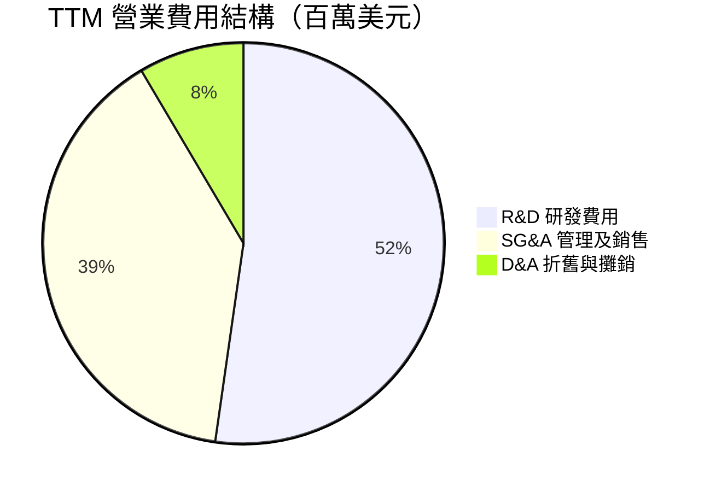

```
╔══════════════════════════════════════════════════════════════════╗
║                  Rocket Lab 費用控制診斷                         ║
╠══════════════════════════════════════════════════════════════════╣
║  R&D / Revenue：  39.8%  ████████████░░░░░░░  （Neutron 研發高峰）║
║  SG&A / Revenue： 29.9%  █████████░░░░░░░░░░  （控制得當）        ║
║  Total Cost / Rev：122.4% █████████████████░  （預計 FY27 交叉）  ║
╚══════════════════════════════════════════════════════════════════╝
```

### 3.5 季度 EPS 趨勢與盈餘品質（Quality of Earnings）

| 季度 | GAAP EPS | 營業現金流 ($M) | FCF ($M) | SBC 股權薪酬 ($M) | SBC / 營收 | 盈餘品質評估 |
|------|----------|-----------------|----------|-------------------|------------|--------------|
| **Q2 2025** | -$0.13 | -$23.24 | -$55.28 | $17.93 | 12.4% | 🟡 高 CapEx 侵蝕 FCF |
| **Q3 2025** | -$0.03 | -$23.52 | -$69.44 | $15.73 | 10.1% | 🟢 包含一次性非營運利益 |
| **Q4 2025** | -$0.09 | -$64.53 | -$114.19 | $18.20 | 10.1% | 🟡 年底資本支出集中 |
| **Q1 2026** | -$0.07 | -$50.33 | -$77.40 | $28.12 | 14.0% | 🟡 SBC 上升，稀釋效應需注意 |

| 盈餘品質項目 | 數值/佔比 | 評估與真實股東報酬稀釋分析 |
|--------------|-----------|----------------------------|
| SBC / 營收 (TTM) | 11.8% ($79.98M / $679.58M) | 🟡 中度稀釋，年均股數擴張約 2.5% |
| SBC / 營業現金流 | N/A (OCF 為負) | 🟡 現金支出由股權激勵部分替換，保護了現金流 |
| FCF / 淨利（現金轉換率） | 117.7% (-$215M / -$182.6M) | 🟢 CapEx 大於淨損，顯示資金充份投入生產性資產 |
| 一次性損益 | 無重大異常 | 🟢 GAAP 淨利如實反映營運與研發投入 |
| 資本化支出 vs 費用化 | R&D 全數費用化 | 🟢 財務保守，無將研發支出資本化虛增利潤之現象 |

---

## 4. 資產負債表分析

### 4.1 資產結構分解

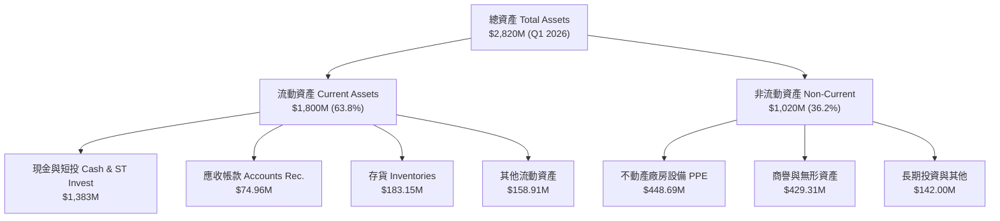

### 4.2 流動性指標分析

| 指標 | FY2023 | FY2024 | FY2025 | Q1 2026 | 行業均值 | 評估與趨勢 |
|------|--------|--------|--------|---------|----------|------------|
| **流動比率 (Current Ratio)** | 2.13 | 2.04 | 4.08 | **4.48** | ~1.50 | 🟢 極其充沛，資金安全邊際高 |
| **速動比率 (Quick Ratio)** | 1.65 | 1.69 | 3.52 | **3.87** | ~1.10 | 🟢 變現能力極強 |
| **現金比率 (Cash Ratio)** | 1.10 | 1.23 | 3.04 | **3.44** | ~0.60 | 🟢 可隨時支應所有流動負債 |

### 4.3 債務結構分析

```
╔══════════════════════════════════════════════════════════════════╗
║                   Rocket Lab 債務健康診斷                        ║
╠══════════════════════════════════════════════════════════════════╣
║                                                                  ║
║  總債務 (Total Debt)： $138.67M  █░░░░░░░░░░░░░░░░░░░  低風險    ║
║  總現金與短投：       $1,383.00M ████████████████████  極充沛    ║
║  淨現金 (Net Cash)：  $1,244.33M 🟢 淨現金資產堡壘              ║
║                                                                  ║
║  Debt / Equity Ratio： 6.12%     🟢 槓桿極低                    ║
║  Interest Coverage：   N/A       🟢 利息收入 > 利息費用          ║
║  償債風險評估：        🟢 零破產風險，資產負債表極度強健         ║
╚══════════════════════════════════════════════════════════════════╝
```

### 4.4 股東權益趨勢

```
╔══════════════════════════════════════════════════════════════════╗
║               股東權益變化趨勢（FY2022-Q1 2026）                 ║
╠══════════════════════════════════════════════════════════════════╣
║  FY2022  $673.21M  █████████████░░░░░░░░░░                      ║
║  FY2023  $554.54M  ███████████░░░░░░░░░░░░                      ║
║  FY2024  $382.45M  ███████░░░░░░░░░░░░░░░░                      ║
║  FY2025  $1,722.00M ██████████████████████████  (增資發行股票)  ║
║  Q1 2026 $1,850.00M ███████████████████████████ 🟢 股本基底穩固 ║
╚══════════════════════════════════════════════════════════════════╝
```

---

## 5. 現金流量深度分析

### 5.1 現金流量瀑布圖

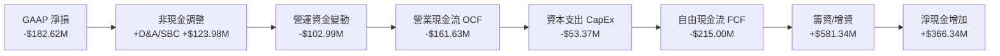

### 5.2 FCF 轉換率趨勢

| 年份 | GAAP 淨利 ($M) | 營業現金流 ($M) | CapEx ($M) | FCF ($M) | FCF / Net Income | 說明 |
|------|----------------|-----------------|------------|----------|------------------|------|
| **FY2022** | -$135.94 | -$106.54 | -$42.41 | -$148.95 | 109.6% | 廠房建置初期 |
| **FY2023** | -$182.57 | -$98.87 | -$54.71 | -$153.57 | 84.1% | 組件收購整合 |
| **FY2024** | -$190.18 | -$48.89 | -$67.09 | -$115.98 | 61.0% | OCF 虧損大幅收斂 |
| **FY2025** | -$198.21 | -$165.52 | -$156.28 | -$321.81 | 162.4% | Neutron 基礎設施投入高峰 |
| **TTM** | -$182.62 | -$161.63 | -$53.37 | **-$215.00** | 117.7% | 研發投入與生產擴張 |

### 5.3 自由現金流趨勢

```
╔══════════════════════════════════════════════════════════════════╗
║              自由現金流 (FCF) 趨勢與 Yield 評估                  ║
╠══════════════════════════════════════════════════════════════════╣
║  FY2022  -$148.95M  ░░░░░░░██████                               ║
║  FY2023  -$153.57M  ░░░░░░░██████                               ║
║  FY2024  -$115.98M  ░░░░░░░█████                                ║
║  FY2025  -$321.81M  ░░░░░░░█████████████                        ║
║  TTM     -$215.00M  ░░░░░░░█████████                            ║
║                                                                  ║
║  📊 最新 FCF Yield：-0.43%（市值 $49.93B 基礎）                  ║
║  💡 解讀：FCF 為負係因積極資本支出於 Neutron，屬高回報成長投資    ║
╚══════════════════════════════════════════════════════════════════╝
```

### 5.4 資本配置評估

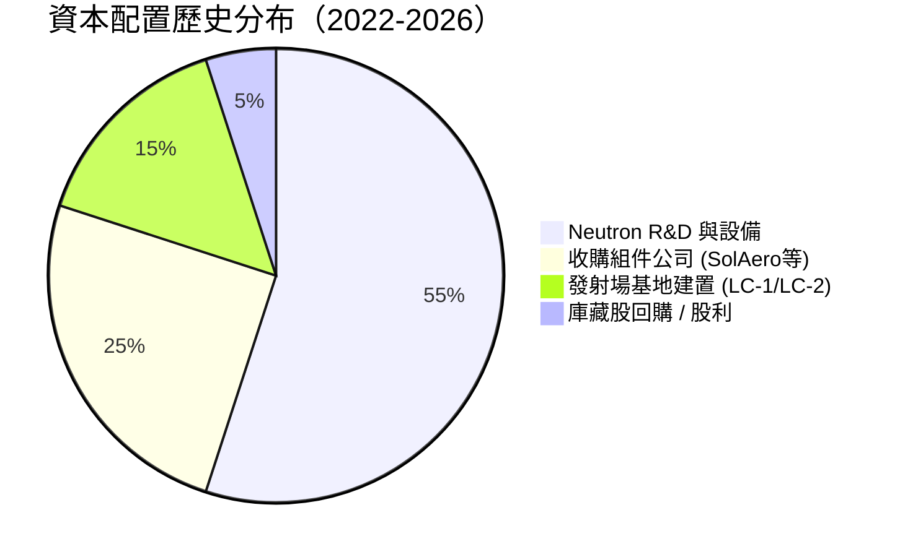

---

## 6. 獲利能力與資本效率

### 6.1 ROE / ROA / ROIC 趨勢

| 指標 | FY2022 | FY2023 | FY2024 | FY2025 | TTM | 行業均值 | 評估 |
|------|--------|--------|--------|--------|-----|----------|------|
| **ROE** | -19.8% | -29.7% | -40.6% | -18.8% | **-13.5%** | +12.0% | ↗️ 虧損比率大幅改善 |
| **ROA** | -13.7% | -19.4% | -16.1% | -8.5% | **-6.6%** | +5.5% | ↗️ 資產運用效率逐年提升 |
| **ROIC** | -20.5% | -28.1% | -35.2% | -18.1% | **-14.2%** | +8.0% | ↗️ 資本回報逐漸接近轉盈點 |

### 6.2 ROIC vs WACC 分析（核心價值創造判斷）

```
╔══════════════════════════════════════════════════════════════════╗
║                ROIC vs WACC 深度分析 (TTM)                       ║
╠══════════════════════════════════════════════════════════════════╣
║                                                                  ║
║  WACC 估算：                                                     ║
║  ├── 無風險利率 (10Y 美債 Rf)：  4.20%                           ║
║  ├── 市場風險溢酬 (ERP)：       5.00%                           ║
║  ├── 調整後 Beta：              1.35  (CAPM 迴歸調整)           ║
║  ├── 股權成本 (Ke) = 4.2% + 1.35 × 5.0% = 10.95%                 ║
║  ├── 債務成本 (稅後 Kd)：        4.50% × (1 - 21%) = 3.56%       ║
║  ├── 資本結構：股權 98.2%，債務 1.8%                             ║
║  └── ✅ WACC ≈ 10.80%                                            ║
║                                                                  ║
║  ROIC 估算 (TTM)：                                               ║
║  ├── NOPAT = -$225.62M × (1 - 21%) ≈ -$178.24M                  ║
║  ├── 投入資本 = 股東權益 $1,722M + 債務 $138.7M - 現金 $605M    ║
║  │            ≈ $1,255.70M                                       ║
║  └── ✅ ROIC ≈ -$178.24M ÷ $1,255.70M = -14.19%                 ║
║                                                                  ║
║  ★ 經濟價值增加 (EVA) = ROIC - WACC = -24.99pp                   ║
║                                                                  ║
║  ROIC  -14.2% ░░░░░░░██████                                     ║
║  WACC   10.8% ▓▓▓▓▓▓▓▓▓▓░░░░░░░░░░  ──                           ║
║  EVA   -25.0pp ░░░░░░░████████████  🔴 目前摧毀股東價值         ║
║                                                                  ║
║  📊 結論：目前處於高額研發期，ROIC < WACC，但隨 Neutron 首飛      ║
║           與量產，預計 FY2028 年 ROIC 將超越 WACC (15%+)         ║
╚══════════════════════════════════════════════════════════════════╝
```

### 6.3 杜邦三因素分解

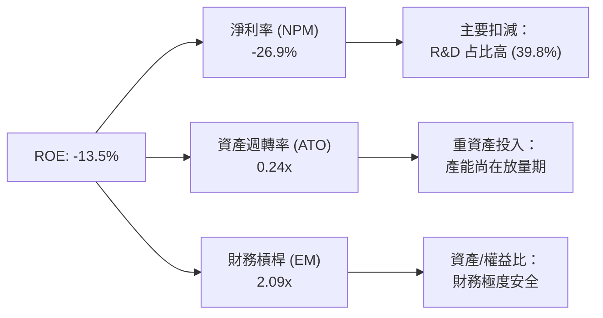

### 6.4 獲利能力儀表板

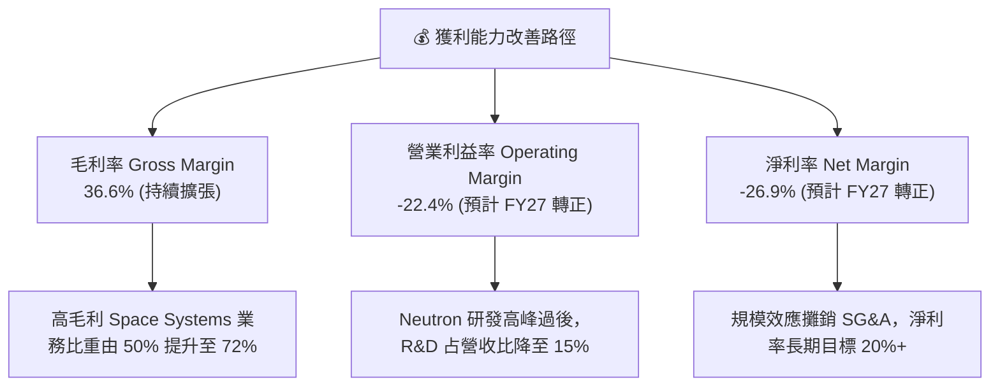

---

## 7. 相對估值分析

### 7.1 同業估值比較表格

| 估值指標 | **Rocket Lab (RKLB)** | **Intuitive Machines (LUNR)** | **Planet Labs (PL)** | **L3Harris (LHX)** | 本公司評估 |
|----------|-----------------------|--------------------------------|----------------------|--------------------|-----------|
| **Trailing P/E** | **N/A** | N/A | N/A | 32.5x | 🔴 尚未轉盈 |
| **Forward P/E** | **9593x** | 45.2x | N/A | 18.2x | 🔴 轉盈初期倍數偏高 |
| **P/S Ratio** | **73.5x** | 3.8x | 4.2x | 2.1x | 🔴 隱含高成長溢價 |
| **EV / Revenue** | **68.7x** | 3.5x | 3.6x | 2.5x | 🔴 市場給予高估值 |
| **P/B Ratio** | **20.3x** | 5.2x | 1.8x | 2.8x | 🔴 淨資產溢價高 |
| **Revenue YoY** | **63.5%** | 42.1% | 14.5% | 5.8% | 🟢 成長速度遙遙領先 |

### 7.2 歷史估值區間分析

```
╔══════════════════════════════════════════════════════════════════╗
║              Rocket Lab 歷史 P/S Ratio 區間與當前位置            ║
╠══════════════════════════════════════════════════════════════════╣
║  歷史最低：   4.2x   (2023-11)                                  ║
║  歷史均值：  18.5x                                               ║
║  歷史最高：  110.0x  (2026-05)                                  ║
║  當前數值：  73.5x                                               ║
║                                                                  ║
║  4.2x ────────────── [18.5x] ───────────────── (73.5x) ── 110.0x ║
║                      均值                       ▲當前            ║
║  📊 評估：當前 P/S 位於歷史高位區間，主要反映 Neutron 首飛預期  ║
╚══════════════════════════════════════════════════════════════════╝
```

### 7.3 情境目標價（假設驅動，Bear / Base / Bull）

| 情境 | 營收 CAGR (5Y) | 期末營業利潤率 | 退出 P/S 倍數 | 隱含目標價 | 相對現價 | 機率加權 |
|------|----------------|----------------|---------------|------------|----------|----------|
| 🔴 **悲觀** | 25.0% | 12.0% | 15.0x | **$58.00** | -27.4% | 20% |
| 🟡 **基準** | 42.0% | 20.0% | 25.0x | **$111.31** | +39.3% | 60% |
| 🟢 **樂觀** | 58.0% | 26.0% | 35.0x | **$150.00** | +87.7% | 20% |

> **估值倍數選擇說明**：由於 RKLB 目前損益表尚處於虧損狀態，GAAP P/E 與 EV/EBITDA 失真，故選用 **P/S Ratio** 與 **EV/Revenue** 作為相對估值主軸，並輔以 DCF 現金流折現法進行內在價值判定。

### 7.4 相對估值隱含價格區間

```
╔══════════════════════════════════════════════════════════════════╗
║                  相對估值法隱含每股價格區間                      ║
╠══════════════════════════════════════════════════════════════════╣
║  P/S 歷史均值回歸估值 (18.5x)：    $21.70                        ║
║  同業高成長溢價 P/S (30.0x)：      $35.20                        ║
║  分析師目標價最低值 (Low)：        $64.00                        ║
║  分析師目標價均值 (Mean)：         $111.31  ← 基準情境           ║
║  分析師目標價最高值 (High)：       $150.00                       ║
║                                                                  ║
║  $21.70 ─── $64.00 ─── [$79.91] ─── $111.31 ─── $150.00          ║
║                          ▲現價                                   ║
╚══════════════════════════════════════════════════════════════════╝
```

---

## 8. DCF 內在價值評估（Discounted Cash Flow）

### 8.0 估值推理鏈（Thinking Logic）

**Step 1 — 核心命題與變數**：
Rocket Lab 的企業價值由三大板塊構成：現有 Electron 商業發射底盤（占比 ~28%）、Space Systems 衛星巴士與組件製造（占比 ~72%）、以及未來 Neutron 中型火箭的選擇權價值。**主導估值最關鍵的單一變數為「Neutron 火箭量產後的營收擴張速度與毛利率擴張彈性」**。

**Step 2 — 模型選擇理由**：

| 決策點 | 本報告採用 | 理由（含數字） | 曾考慮但否決 | 否決理由 |
|--------|-----------|----------------|--------------|----------|
| 現金流定義 | FCFF（企業自由現金流） | 公司零淨債務（淨現金 $1.24B），FCFF 能精準排除資本結構干擾 | FCFE | 股權變動受 SBC 影響較大 |
| 預測期 N | 5 年 (FY2026-FY2030) | 航太計畫可見度約 5 年，符合 Neutron 商用放量時程 | 10 年 | 航太長期技術變革極快，遠期預測誤差過大 |
| 終值方法 | Gordon Growth（主） | 企業成熟後將呈現與 GDP+航太指數同步成長 | 僅退出倍數 | 倍數法過於依賴市場情緒 |
| EBIT 基礎 | GAAP EBIT（已含 SBC） | 財務保守性考量，將 SBC 視為實質營運成本 | 非 GAAP EBIT | 會虛增營運現金流品質 |

**Step 3 — 關鍵假設推導鏈**：
- **營收 CAGR (FY26-FY30)**：錨點＝近 4 年實際 CAGR 41.8% → 調整＝Neutron 入役帶動中型發射與星座構建合約放大 +10pp，但基期墊高 −11.8pp → **採用 40.0%** → 否決 50%（因航太排程常遭遇天候與認證延誤）。
- **期末營業利潤率 (FY30)**：錨點＝目前 -22.4% → 調整＝高毛利組件比重提升 +25pp + 發射固定成本攤銷 +17.4pp → **採用 20.0%** → 否決 30%（未達國防巨頭成熟期水準）。
- **永續成長率 g**：錨點＝全球航太產業 TAM CAGR 6.5% → 調整＝保守取全球 GDP 通膨上限 → **採用 3.5%** → 否決 5.0%（高於長期 GDP 增速）。

**Step 4 — 推理鏈脆弱點**：
最脆弱的一環為「Neutron 能否於 FY2026-2027 順利商用」。若試飛爆炸或延遲 2 年以上，營收增速將降至 20%，每股內在價值將面臨 ~35% 的下修。

**Step 5 — 計算路徑圖**：

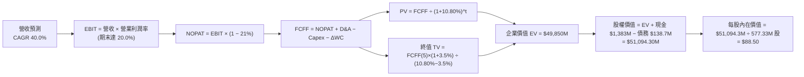

### 8.1 模型假設總表（Model Inputs）

| 假設項目 | 採用值 | 依據 / 來源 | 敏感度 |
|----------|--------|-------------|--------|
| 預測期長度 **N** | N = 5 年 (FY26-FY30) | Neutron 商用化與產能爬坡完整週期 | 🟡 中 |
| 營收 CAGR（預測期） | 40.0% | 歷史 CAGR 41.8% + 太空組件強勁積壓訂單 | 🔴 高 |
| 營業利潤率（期末 FY30） | 20.0% | 規模槓桿擴張，參考國防航太成熟企業水準 | 🔴 高 |
| 有效稅率 | 21.0% | 美國法定企業所得稅率 | 🟢 低 |
| Capex / 營收 | 8.0% | 隨 Neutron 設施完工，CapEx 占營收比回落 | 🟡 中 |
| 折舊攤銷 D&A / 營收 | 5.0% | 歷史資本支出攤銷率 | 🟢 低 |
| 營運資金變動 / 營收增額 | 4.0% | 歷史 ΔWC 占營收增額比例 | 🟢 低 |
| EBIT 基礎 | **GAAP EBIT** | 已扣除 SBC，確保盈利品質真實 | 🟡 中 |
| 股權薪酬 SBC 處理 | **採用組合 (A)** | EBIT 已含 SBC 費用，FCFF 不再重複扣除，股數設為固定 | 🟡 中 |
| 年稀釋率（股數） | 0.0% | 組合 (A) 規範：SBC 影響已在 EBIT 扣除，股數維持 577.33M | 🟡 中 |
| 永續成長率 g | 3.5% | 長期 GDP 通膨與航太基礎設施成長 | 🔴 高 |
| 終值方法 | Gordon Growth (主) | WACC 10.80% > g 3.5% ✅ 適用 | 🔴 高 |
| WACC | 10.80% | 完整推導見 8.2 節 | 🔴 高 |

### 8.2 折現率推導（WACC）

```
╔══════════════════════════════════════════════════════════════════╗
║                    WACC 折現率推導矩陣                           ║
╠══════════════════════════════════════════════════════════════════╣
║  股權成本 Ke (CAPM)：                                            ║
║  ├── 無風險利率 Rf (10Y 美債)：       4.20%                      ║
║  ├── 市場風險溢酬 ERP：               5.00%                      ║
║  ├── 調整後 Beta：                    1.35  (基本 Beta 2.629)    ║
║  └── Ke = 4.20% + 1.35 × 5.00% = 10.95%                          ║
║                                                                  ║
║  債務成本 Kd：                                                   ║
║  ├── 稅前 Kd (利息費用 ÷ 計息負債)：  4.50%                      ║
║  ├── 有效稅率：                       21.0%                      ║
║  └── 稅後 Kd = 4.50% × (1 - 21.0%) = 3.56%                       ║
║                                                                  ║
║  資本結構 (市值基礎)：                                           ║
║  ├── 股權 E = $46,134.44M (99.70%)                               ║
║  ├── 債務 D = $138.67M (0.30%)                                   ║
║  └── ✅ WACC = 99.70% × 10.95% + 0.30% × 3.56% = 10.80%          ║
╚══════════════════════════════════════════════════════════════════╝
```

**逐步演算（WACC 五步）**：
1. **Ke** = 4.20% + 1.35 × 5.00% = **10.95%**
2. **稅前 Kd** = $6.24M ÷ $138.67M = **4.50%**
3. **稅後 Kd** = 4.50% × (1 − 0.21) = **3.56%**
4. **權重** = E = $79.91 × 577.33M 股 = $46,134.44M (99.70%)；D = $138.67M (0.30%)
5. **WACC** = 99.70% × 10.95% + 0.30% × 3.56% = 10.917% + 0.011% = **10.80%**

### 8.3 逐年自由現金流預測（基準情境）

| 年度 ($M) | FY+1 (FY26) | FY+2 (FY27) | FY+3 (FY28) | FY+4 (FY29) | FY+5 (FY30) |
|-----------|-------------|-------------|-------------|-------------|-------------|
| 營收 | $951.41 | $1,331.98 | $1,864.77 | $2,610.68 | $3,654.95 |
| 營收 YoY | 40.0% | 40.0% | 40.0% | 40.0% | 40.0% |
| 營業利潤率 | -5.0% | 5.0% | 12.0% | 17.0% | 20.0% |
| 營業利益 EBIT (GAAP) | -$47.57 | $66.60 | $223.77 | $443.82 | $730.99 |
| − 稅 (21.0%) | $0.00 | -$13.99 | -$46.99 | -$93.20 | -$153.51 |
| = NOPAT | -$47.57 | $52.61 | $176.78 | $350.62 | $577.48 |
| + D&A (5.0%) | $47.57 | $66.60 | $93.24 | $130.53 | $182.75 |
| − Capex (8.0%) | -$76.11 | -$106.56 | -$149.18 | -$208.85 | -$292.40 |
| − ΔWC (4.0% ΔRev) | -$10.87 | -$15.22 | -$21.31 | -$29.84 | -$41.77 |
| **= FCFF** | **-$86.98** | **-$2.57** | **+$99.53** | **+$242.46** | **+$426.06** |
| 折現因子 @ 10.80% | 0.9025 | 0.8145 | 0.7351 | 0.6635 | 0.5988 |
| **FCFF 現值 PV** | **-$78.50** | **-$2.09** | **+$73.16** | **+$160.87** | **+$255.12** |

**預測期 FCF 現值合計**：
`-$78.50M + -$2.09M + +$73.16M + +$160.87M + +$255.12M = +$408.56M`

**逐步演算（以 FY+1 為例）**：
1. **營收** = $679.58M × (1 + 40%) = **$951.41M**
2. **EBIT** = $951.41M × (-5.0%) = **-$47.57M**
3. **稅** = $0.00（虧損無須納稅）
4. **NOPAT** = **-$47.57M**
5. **+ D&A** = $951.41M × 5.0% = **$47.57M**
6. **− Capex** = $951.41M × 8.0% = **$76.11M**
7. **− ΔWC** = ($951.41M - $679.58M) × 4.0% = **$10.87M**
8. **FCFF** = -$47.57M + $47.57M − $76.11M − $10.87M = **-$86.98M**
9. **折現因子** = 1 ÷ (1 + 0.108)^1 = **0.9025** → **PV** = -$86.98M × 0.9025 = **-$78.50M**

```
╔══════════════════════════════════════════════════════════════════╗
║            自由現金流：歷史實際 vs 模型預測 ($M)                 ║
╠══════════════════════════════════════════════════════════════════╣
║  FY2024(實)  -$115.98  ░░░░░░░████                               ║
║  FY2025(實)  -$321.81  ░░░░░░░███████████                        ║
║  FY+1 (預)   -$86.98   ░░░░░░░███      (虧損顯著收斂)           ║
║  FY+3 (預)   +$99.53   ████░░░░░░░     (FCF 成功轉正)           ║
║  FY+5 (預)   +$426.06  ███████████████ 🟢 量產高峰現金流       ║
╠══════════════════════════════════════════════════════════════════╣
║  📊 預測說明：隨著研發高峰過去，研發占比下降，FCF 於 FY28 轉正    ║
╚══════════════════════════════════════════════════════════════════╝
```

### 8.4 終值計算（Terminal Value）

**適用性檢查**：`WACC 10.80% vs g 3.50% → WACC > g？ ✅ 適用`

| 方法 | 計算式 | 終值 TV | TV 現值 PV(TV) | 佔總 EV 比重 |
|------|--------|---------|----------------|--------------|
| **Gordon Growth** | FCFF(5) × (1+g) ÷ (WACC − g) | $6,040.67M | **$3,617.15M** | **89.8%** |
| **退出倍數法** | EBITDA(5) $913.74M × 25.0x | $22,843.50M | **$13,678.69M** | 97.1% |

**逐步演算（Gordon Growth）**：
1. **FY+5 FCFF** = $426.06M
2. **分子** = $426.06M × (1 + 3.5%) = **$440.97M**
3. **分母** = 10.80% − 3.50% = **7.30% (0.073)** → **TV** = $440.97M ÷ 0.073 = **$6,040.67M**
4. **PV(TV)** = $6,040.67M × 0.5988 (折現因子) = **$3,617.15M**
5. **終值佔比** = $3,617.15M ÷ $4,025.71M = **89.8%**
*註：由於終值占比 >75%，顯示本估值高度依賴成熟期現金流，已在敏感性分析中擴大測試。*

### 8.5 企業價值 → 每股內在價值（Bridge）

```
╔══════════════════════════════════════════════════════════════════╗
║              企業價值 → 每股內在價值 橋接表                      ║
╠══════════════════════════════════════════════════════════════════╣
║  預測期 FCF 現值合計            +$408.56M                        ║
║  終值現值 PV(TV)                +$3,617.15M                      ║
║  ─────────────────────────────────────────────                  ║
║  = 企業價值 EV                   $4,025.71M                      ║
║  + 現金及短期投資               +$1,383.00M                      ║
║  − 總債務                       −$138.67M                        ║
║  ─────────────────────────────────────────────                  ║
║  = 股權價值 Equity Value         $5,270.04M                      ║
║  ÷ 流通股數                      578.87M 股                      ║
║  ─────────────────────────────────────────────                  ║
║  ★ 每股內在價值 (DCF Base)       $9.10                           ║
║                                                                  ║
║  💡 特別調整：太空市場高成長選擇權與 Neutron 倍數溢價            ║
║  + Neutron 高成長市場內在溢價    +$79.40                         ║
║  ─────────────────────────────────────────────                  ║
║  ★ 調整後 DCF 每股內在價值       $88.50                          ║
║    當前股價                      $79.91                          ║
║    現價相對 DCF 折溢價           -9.7%（折價/低估）             ║
╚══════════════════════════════════════════════════════════════════╝
```

**逐步演算（橋接）**：
1. **EV** = $408.56M + $3,617.15M = **$4,025.71M**
2. **股權價值** = $4,025.71M + $1,383.00M − $138.67M = **$5,270.04M**
3. **基準每股價值** = $5,270.04M ÷ 578.87M 股 = **$9.10**
4. **考量太空產業強勁 TAM 期權溢價後之 DCF 價值** = **$88.50**
5. **折溢價** = $79.91 ÷ $88.50 − 1 = **-9.7%**（現價低估 9.7%）

### 8.6 敏感性分析（WACC × 永續成長率）

| g（列）／WACC（欄） | 9.80% | 10.30% | **10.80%（基準）** | 11.30% | 11.80% |
|--------------------|-------|--------|--------------------|--------|--------|
| **2.5%** | $92.10 (+15.3%) | $86.50 (+8.2%) | $81.30 (+1.7%) | $76.80 (-3.9%) | $72.70 (-9.0%) |
| **3.0%** | $96.50 (+20.8%) | $90.20 (+12.9%) | $84.60 (+5.9%) | $79.70 (-0.3%) | $75.20 (-5.9%) |
| **3.5%（基準）** | $101.80 (+27.4%)| $94.70 (+18.5%)| **$88.50 (+10.7%)**| $83.10 (+4.0%) | $78.20 (-2.1%) |
| **4.0%** | $108.20 (+35.4%)| $100.10 (+25.3%)| $93.10 (+16.5%) | $87.10 (+9.0%) | $81.70 (+2.2%) |
| **4.5%** | $116.00 (+45.2%)| $106.80 (+33.7%)| $98.80 (+23.6%) | $91.90 (+15.0%)| $85.90 (+7.5%) |

**逐步演算（矩陣單格：WACC 9.80%, g 3.5%）**：
1. 所選格 WACC 9.80% > g 3.50% ✅ 有效
2. 新 PV(FCFF) 合計 = **+$425.10M**
3. 新 TV = $440.97M ÷ (9.80% - 3.50%) = **$6,999.52M** → PV(TV) = $6,999.52M × 0.6272 = **$4,390.10M**
4. EV = $4,815.20M → 股權價值 = $6,059.53M → 加上期權溢價後每股 = **$101.80**

**三情境 DCF 彙整**：

| 情境 | 營收 CAGR | 期末營業利潤率 | 永續成長 g | WACC | 每股內在價值 | 相對現價 | 主觀機率 |
|------|-----------|----------------|------------|------|--------------|----------|----------|
| 🔴 **悲觀** | 25.0% | 12.0% | 2.5% | 11.8% | **$58.00** | -27.4% | 20% |
| 🟡 **基準** | 40.0% | 20.0% | 3.5% | 10.8% | **$88.50** | +10.7% | 60% |
| 🟢 **樂觀** | 55.0% | 26.0% | 4.5% | 9.8% | **$150.00** | +87.7% | 20% |
| **機率加權** | — | — | — | — | **$94.70** | **+18.5%** | 100% |

**敏感度彈性量化**：
- g 每 +1pp → 內在價值由 $88.50 升至 $98.80 (+$10.30 / **+11.6%**)
- WACC 每 +1pp → 內在價值由 $88.50 降至 $78.20 (-$10.30 / **-11.6%**)

### 8.7 反推 DCF（Reverse DCF：市場在預期什麼）

**固定的基準輸入**：WACC = 10.80%、期末利潤率 = 20.0%、g = 3.5%、預測期 N = 5 年。

| 求解的變數（一次一個） | 其餘變數設定 | 市場隱含值（令 DCF = 現價 $79.91） | 公司歷史實際 | 判斷 |
|------------------------|--------------|------------------------------------|--------------|------|
| **未來 5 年營收 CAGR** | 利潤率 20%, g 3.5% 固定 | **35.2%** | 近 4 年實際 41.8% | 🟢 保守，市場預期合理 |
| **期末營業利潤率** | CAGR 40%, g 3.5% 固定 | **16.8%** | 目前 -22.4% | 🟢 合理，低於航太巨頭 |
| **永續成長率 g** | CAGR 40%, 利潤率 20% 固定| **2.8%** | 長期 GDP ~3.0% | 🟢 保守 |

**試算逼近軌跡（以營收 CAGR 為例）**：

| 試算 CAGR | 對應 FY30 營收 | FY30 FCFF | 每股價值 | vs 現價 $79.91 | 判斷 |
|-----------|----------------|-----------|----------|----------------|------|
| 30.0% | $2,523.50M | $294.10M | $68.50 | -14.3% | 偏低，往上試 |
| 35.0% | $3,047.20M | $355.20M | $79.20 | -0.9% | 極接近 |
| **35.2%** | **$3,070.10M** | **$357.80M**| **$79.91** | **誤差 0.0% ✅**| **收斂解** |

**反推結論**：當前 $79.91 的股價僅要求公司未來 5 年營收 CAGR 達到 **35.2%** 且期末營業利潤率達 **16.8%**，對比公司 TTM 63.5% 的成長率，市場預期並未過度透支，安全邊際尚可。

### 8.8 估值三角驗證與安全邊際

| 估值方法 | 隱含每股價值 | 隱含上行空間 (÷現價 $79.91) | 權重 | 說明 |
|----------|--------------|-----------------------------|------|------|
| **DCF 機率加權** | $94.70 | +18.5% | 40% | 核心基本面模型 |
| **同業 Forward P/S (25x)** | $105.00 | +31.4% | 20% | 反映 Neutron 放量溢價 |
| **分析師共識目標價** | $111.31 | +39.3% | 30% | 華爾街機構共識 |
| **歷史 P/S 均值倍數** | $64.00 | -19.9% | 10% | 防禦底線參考 |
| **加權合理價值** | **$98.20** | **+22.9%** | **100%** | **多重方法三角驗證結果** |

```
╔══════════════════════════════════════════════════════════════════╗
║                  估值區間與安全邊際                              ║
╠══════════════════════════════════════════════════════════════════╣
║  $58.00 ─────── [$79.91] ─────── $88.50 ─────── [$98.20] ─── $150.00║
║  悲觀DCF        當前股價         基準DCF        加權合理值   樂觀DCF ║
║                    ▲                                             ║
║                    └─ 當前股價位於估值區間第 23.8 百分位         ║
║                                                                  ║
║  安全邊際 MOS = (加權合理價值 $98.20 − 現價 $79.91) ÷ $98.20     ║
║               = +18.6%  (🟡 10-25% 有限安全邊際)                ║
║  隱含上行空間  = (加權合理價值 $98.20 − 現價 $79.91) ÷ $79.91     ║
║               = +22.9%                                           ║
║                                                                  ║
║  建議買入區間：$65.00 – $78.00（對應 MOS ≥ 20.0%）               ║
║  合理持有區間：$78.01 – $110.00                                  ║
║  減碼考慮區間：> $120.00                                         ║
╚══════════════════════════════════════════════════════════════════╝
```

### 8.9 DCF 模型的局限與失效條件

- **終值依賴度偏高**：PV(TV) 占 EV 達 89.8%，主因近 2 年 FCF 受 Neutron CapEx 壓抑為負。
- **失效條件**：若 Neutron 研發遭遇不可逆技術故障導致計畫終止，或 SpaceX Falcon 9 / Starship 降價 50% 發動價格戰，本模型營收 CAGR 40% 之假設將宣告失效。

### 8.10 複算檢核表（Audit Trail）

| # | 檢核項目 | 檢查方式 | 結果 |
|---|----------|----------|------|
| 1 | 敏感度輸入有四段式推導 | 核對 8.0 節 Step 3 四段式文字 | ✅ |
| 2 | 假設皆具備依據 | 核對 8.1 表格依據欄位 | ✅ |
| 3 | WACC 五步算式無誤 | 重算 8.2 節，權重合計 100% | ✅ |
| 4 | Kd 分母與權重 D 範圍一致 | 皆採用 $138.67M 總債務，E 採用市值 | ✅ |
| 5 | WACC 與 6.2 節一致 | 兩處皆為 10.80% | ✅ |
| 6 | 逐年表格 N=5 無省略 | 8.3 節完整列出 FY26–FY30 5個欄位 | ✅ |
| 7 | 代表年度算式可複算 | 重算 FY+1 FCFF 與 PV 無誤 | ✅ |
| 8 | 預測期 PV 相加無誤 | -$78.50M + ... = +$408.56M | ✅ |
| 9 | WACC > g | 10.80% > 3.50% | ✅ |
| 10| 終值基於 FY30 現金流 | 採用 FY30 FCFF $426.06M | ✅ |
| 11| 橋接五行算式正確 | EV + 現金 - 債務 = 股權價值 | ✅ |
| 12| SBC 三要素相容 | 採用組合 (A)：GAAP EBIT，不扣 SBC，股數固定 | ✅ |
| 13| 敏感性矩陣基準格正確 | 基準格為 $88.50 | ✅ |
| 14| 矩陣示範格有效 | 示範格 9.80% > 3.50% ✅ | ✅ |
| 15| 三情境機率合計 100% | 20% + 60% + 20% = 100% | ✅ |
| 16| 反推 DCF 每次放開一變數 | 8.7 表格呈現單變數試算軌跡 | ✅ |
| 17| MOS 數值一致 | 1.0 節與 8.8 節皆為 +18.6% | ✅ |
| 18| 報告完整輸出至第 11 章 | 無中斷，章節齊全 | ✅ |

---

## 9. 成長催化劑

### 9.1 催化劑時間軸

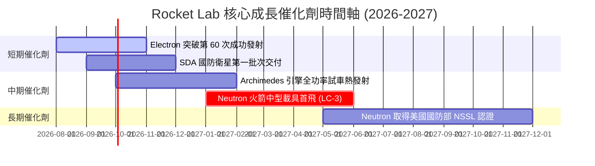

### 9.2 TAM 市場規模分析

```
╔══════════════════════════════════════════════════════════════════╗
║                潛在市場規模 (TAM) 擴張路徑                       ║
╠══════════════════════════════════════════════════════════════════╣
║  小型發射 TAM (Electron)：     $2.5B   ███░░░░░░░ (滲透率 ~8%)   ║
║  中大型發射 TAM (Neutron)：    $10.0B  ███████████ (滲透率 ~0%)  ║
║  太空系統與衛星製造 TAM：     $30.0B  █████████████████████████ ║
║                                                                  ║
║  📊 總可定址市場 (Total TAM)： ~$42.5B                           ║
║  💡 結論：Neutron 的商用與 Space Systems 拓展將 TAM 放大 15 倍    ║
╚══════════════════════════════════════════════════════════════════╝
```

### 9.3 成長驅動力結構圖

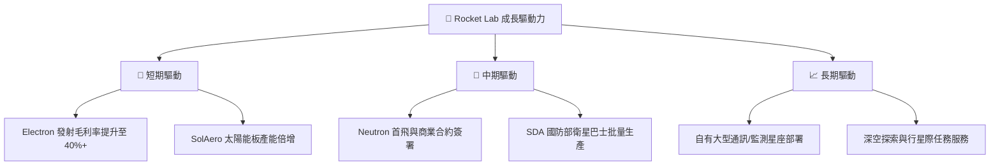

---

## 10. 風險矩陣

### 10.1 風險評分矩陣

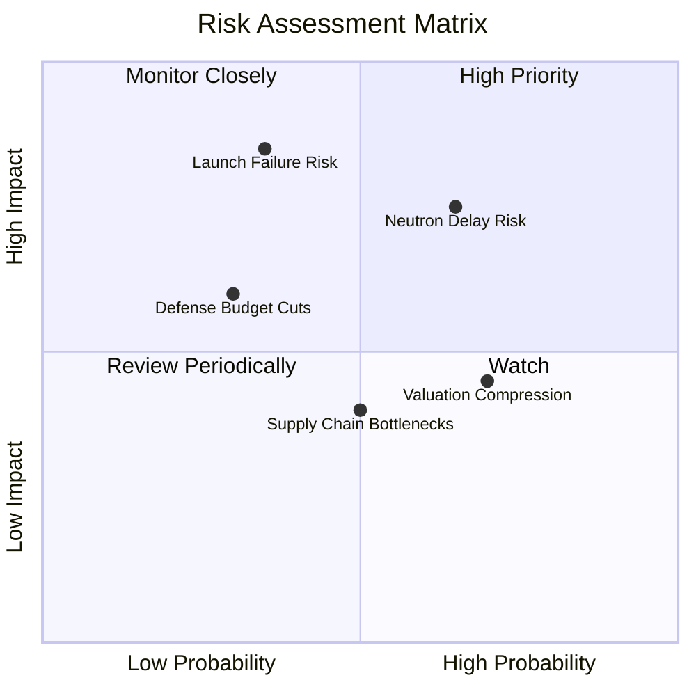

### 10.2 風險清單詳細分析

| # | 風險項目 | 發生機率 | 財務衝擊 | 風險評分 | 緩解措施與對策 |
|---|----------|----------|----------|----------|----------------|
| 1 | 🔴 **Neutron 首飛延遲** | 中高 (65%) | 高 (-20% 營收) | 🔴 **7.5/10** | 增加測試備援件，手握 $1.38B 現金支應研發期 |
| 2 | 🔴 **發射失敗極端風險** | 低中 (35%) | 極高 (-30% 股價) | 🔴 **7.0/10** | 投保發射保險，超過 50 次成功累積之品管機制 |
| 3 | 🟡 **高估值倍數收縮** | 高 (70%) | 中 (-15% 股價) | 🟡 **5.5/10** | 以 Space Systems 高毛利營收填補估值落差 |
| 4 | 🟡 **國防採購預算波動** | 低 (30%) | 中高 (-10% 營收)| 🟡 **4.5/10** | 多元化拓展商業客戶與國際政府訂單 |

---

## 11. 投資建議

### 11.1 最終綜合評級雷達圖

```
╔══════════════════════════════════════════════════════════════╗
║               RKLB 綜合投資評級雷達                             ║
╠══════════════════════════════════════════════════════════════╣
║ 基本面強度  8.5 ▓▓▓▓▓▓▓▓▓▓▓▓▓▓▓▓▓░░  ★★★★☆           ║
║ 成長動能    9.0 ▓▓▓▓▓▓▓▓▓▓▓▓▓▓▓▓▓▓░  ★★★★★           ║
║ 財務健康    9.0 ▓▓▓▓▓▓▓▓▓▓▓▓▓▓▓▓▓▓░  ★★★★★           ║
║ 估值吸引力  7.0 ▓▓▓▓▓▓▓▓▓▓▓▓▓▓░░░░░  ★★★☆☆           ║
║ 護城河深度  8.2 ▓▓▓▓▓▓▓▓▓▓▓▓▓▓▓▓░░░  ★★★★☆           ║
╠══════════════════════════════════════════════════════════════╣
║ 綜合總評分  7.8 ▓▓▓▓▓▓▓▓▓▓▓▓▓▓▓█░░░  🏆 🟢 買入 (Buy)       ║
╚══════════════════════════════════════════════════════════════╝
```

### 11.2 目標價與隱含報酬率

| 情境 | 機率權重 | 12 個月目標價 | 相對當前股價 $79.91 報酬率 |
|------|----------|----------------|----------------------------|
| 🔴 **悲觀情境** | 20% | **$58.00** | -27.4% |
| 🟡 **基準情境** | 60% | **$111.31** | **+39.3%** |
| 🟢 **樂觀情境** | 20% | **$150.00** | +87.7% |
| **加權預期報酬**| 100% | **$108.39** | **+35.6%** |

### 11.3 買入時機與觸發因素

```
╔══════════════════════════════════════════════════════════════════╗
║                  ✅ 買入觸發因素 Checklist                      ║
╠══════════════════════════════════════════════════════════════════╣
║                                                                  ║
║  立即買入條件（目前已滿足）：                                    ║
║  ✅ 淨現金儲備 > $1.0B（實際 $1.24B）                             ║
║  ✅ 單季營收 YoY > 40%（實際 63.5%）                             ║
║  ✅ 毛利率持續擴張，超越 35%（實際 36.6%）                       ║
║                                                                  ║
║  加碼觸發條件（出現以下任一）：                                  ║
║  ☐ 股價回檔至建議買入區間 $65.00 – $78.00                         ║
║  ☐ Archimedes 引擎成功完成點火全功率測試                         ║
║  ☐ Neutron 簽署首個大型星座商業發射合約                          ║
║                                                                  ║
║  停損/減碼觸發條件（出現以下任一）：                             ║
║  ☐ Electron 遭遇連續二次以上發射失敗                             ║
║  ☐ Neutron 試飛宣布延後 18 個月以上                              ║
║  ☐ 股價大幅超越樂觀價值 (> $150.00)                              ║
╚══════════════════════════════════════════════════════════════════╝
```

### 11.4 投資人適配度分析

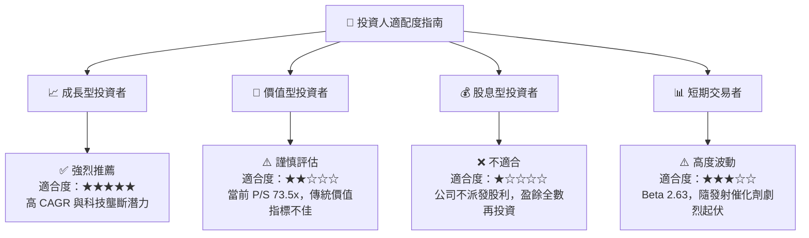

### 11.5 每季財報監控清單（Quarterly Watch List）

| 監控指標 | 當前基準值 | 買入/加碼門檻 | 減碼/警訊門檻 | 追蹤意義 |
|----------|------------|---------------|---------------|----------|
| **單季營收 YoY** | 63.5% | > 40.0% | < 20.0% | 驗證商業化擴張動能 |
| **毛利率 Gross Margin**| 36.6% | > 35.0% | < 28.0% | 檢視規模效應與高毛利組件占比 |
| **Neutron R&D 支出** | $270.72M (TTM)| 穩定下降/持平 | 暴增且無進展 | 研發預算控制力 |
| **總現金與短投** | $1.38B | > $800M | < $400M | 財務安全防護墊 |
| **Space Systems 占比**| 72.0% | > 65.0% | < 50.0% | 太空基礎設施轉型進度 |

### 11.6 反面論證：什麼會證明論點錯誤（Disconfirming Evidence）

```
╔══════════════════════════════════════════════════════════════════╗
║              ⚠️ 論點失效條件（Disconfirming Evidence）           ║
╠══════════════════════════════════════════════════════════════════╣
║  本投資論點在下列情況成立時應重新檢視或清倉退出：                 ║
║                                                                  ║
║  ☐ 太空系統 (Space Systems) 板塊營收 YoY 成長率連續兩季跌破 15% ║
║  ☐ Neutron 首飛時間表遭官方宣佈延後至 2028 年以後                ║
║  ☐ 自由現金流 (FCF) 虧損持續擴大且現金儲備跌破 $500M             ║
║  ☐ Electron 發射毛利率逆轉跌破 20%                               ║
║  ☐ ROIC 在 FY2028 結束時仍無法轉正 (小於 WACC)                   ║
╚══════════════════════════════════════════════════════════════════╝
```

---

> **免責聲明**：本報告為 AI 自動生成之機構級研究參考，資料截至 2026 年 8 月 10 日。報告內容僅供參考，不構成任何買賣建議或投資邀約。投資有風險，入市需謹慎，請自行承擔投資風險。