# RKLB 基本面深度分析報告
> **報告日期**：2026-08-22 ｜ **語言**：繁體中文 ｜ **數據來源**：Yahoo Finance, Finviz, StockAnalysis, Roic.ai ｜ **分析師**：CFA 級機構研究

---

## 目錄

| # | 章節 | 核心結論 |
|---|------|----------|
| 1 | 執行摘要 | 評級「買入」，加權合理價值 $92.54，安全邊際 21.6%，具備高不對稱上行空間 |
| 2 | 公司概覽與商業模式 | 全球第二大小型火箭發射商與端到端太空系統供應商，垂直整合構築深厚護城河 |
| 3 | 損益表深度分析 | TTM 營收達 $769.15M（YoY +52.5%），毛利率穩步擴張至 37.3%，營運槓桿逐步釋放 |
| 4 | 資產負債表分析 | 現金及短期投資充裕達 $2.30B，淨現金 $2.17B，流動比率 5.48x，提供極高財務彈性 |
| 5 | 現金流量深度分析 | 研發與中型火箭 Neutron 資本支出推升 FCF 為 -$251.96M，預計 2028 年迎來自由現金流轉正 |
| 6 | 獲利能力與資本效率 | 處於高資本再投資期，NOPAT 為負壓抑 ROIC，隨 Neutron 放量將帶動 EVA 轉正 |
| 7 | 相對估值分析 | 相較於同業享有發射成功率與太空系統綜效溢價，EV/Sales 53.6x 反映高成長預期 |
| 8 | DCF 內在價值評估 | 基準 DCF 每股價值 $86.53，機率加權內在價值 $90.77，加權合理價值 $92.54 |
| 9 | 成長催化劑 | Neutron 首飛商業化、國防太空星座合約交付、太空系統零組件市佔擴張 |
| 10 | 風險矩陣 | Neutron 研發進度延遲、發射失誤風險、國防預算削減為核心下行因子 |
| 11 | 投資建議 | 建議買入區間 $65.00 - $75.00，基準 12M 目標價 $105.00，隱含上行潛力 +44.7% |

---

## 1. 執行摘要

Rocket Lab Corporation（NASDAQ: RKLB）作為全球僅次於 SpaceX 的商業發射領頭羊與綜合太空系統解決方案提供商，TTM 營收達 $769.15M（YoY +52.5%），毛利率由 2022 年的 9.0% 快速提升至 37.3%。公司坐擁 $2.30B 現金及短期投資（淨現金 $2.17B），能完全支撐次世代中型運載火箭 Neutron 的研發與發射台基建。基於 DCF 機率加權（$90.77）、同業相對估值及分析師共識之三角驗證，得出**加權合理價值為 $92.54**，對應當前現價 $72.57 具備 **+27.5% 上行空間**，**安全邊際（MOS）為 21.6%**（評估為有限至充足）。給予 **🟢 買入** 評級。

### 1.0 一頁式投資儀表板

| 項目 | 內容 |
|------|------|
| **投資論點（3 句）** | ① 商業發射 Electron 發射頻率與定價權提升，帶動 Space Systems 營收規模擴張（TTM 營收 YoY +52.5%）；② 充裕的 $2.30B 現金儲備與 $2.17B 淨現金，確保 Neutron 研發與交付無流動性斷裂風險；③ 垂直整合「發射+衛星製造+零組件」模式帶來極高客戶黏著度，毛利率自 2022 年 9.0% 躍升至 37.3%。 |
| **護城河評分** | 8.5/10（軌道級發射戰績驗證、垂直整合太空系統、政府最高安全認證） |
| **管理層/資本配置評分** | 8.0/10（創辦人 Peter Beck 領軍，技術執行力強，資本再投資效率高） |
| **財務健康** | 🟢 強勁（淨現金 $2.17B，流動比率 5.48x，Debt/Equity 僅 0.08x） |
| **ROIC vs WACC** | -10.8% vs 11.2%（當前處於研發重資本投入期，EVA 為負，預期 2028 年大幅轉正） |
| **FCF 趨勢** | 處於研發再投資峰值期，TTM FCF -$251.96M，FCF Yield -0.54% |
| **估值** | Forward P/E 1451.4x ｜ EV/Sales 53.6x ｜ P/S 60.3x ｜ P/B 12.4x |
| **DCF 內在價值（基準）** | $86.53 ｜ 現價折溢價：-16.1%（現價折價 16.1%） |
| **安全邊際（MOS）** | **+21.6%** ＝ ($92.54 − $72.57) ÷ $92.54 ｜ 🟡 10-25% 有限偏充足 |
| **預期報酬（基準情境 12M）** | +44.7%（目標價 $105.00） |
| **關鍵風險（前二）** | ① Neutron 中型火箭首飛與商轉進度延遲；② 資本支出超預期導致現金消耗加速 |
| **評級 + 信心度** | 🟢 **買入** ｜ 信心：**高** |

### 1.1 核心評分儀表板

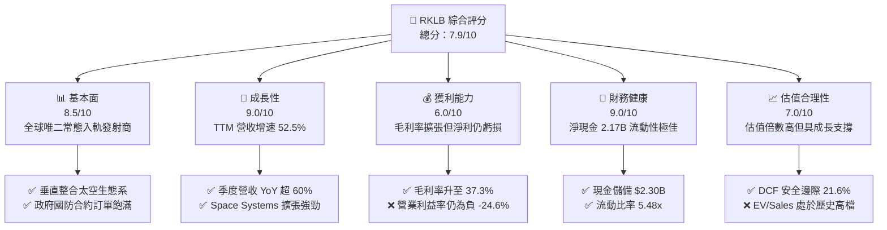

### 1.2 評分進度條視覺化

```
╔══════════════════════════════════════════════════════════════╗
║              RKLB 多維度評分儀表板 (1-10分)                  ║
╠══════════════════════════════════════════════════════════════╣
║ 基本面強度  8.5 ▓▓▓▓▓▓▓▓▓▓▓▓▓▓▓▓▓░░░  ★★★★★           ║
║ 成長動能    9.0 ▓▓▓▓▓▓▓▓▓▓▓▓▓▓▓▓▓▓░░  ★★★★★           ║
║ 獲利品質    6.0 ▓▓▓▓▓▓▓▓▓▓▓▓░░░░░░░░  ★★★☆☆           ║
║ 財務健康    9.0 ▓▓▓▓▓▓▓▓▓▓▓▓▓▓▓▓▓▓░░  ★★★★★           ║
║ 估值合理性  7.0 ▓▓▓▓▓▓▓▓▓▓▓▓▓▓░░░░░░  ★★★★☆           ║
║ 護城河深度  8.5 ▓▓▓▓▓▓▓▓▓▓▓▓▓▓▓▓▓░░░  ★★★★★           ║
║ 管理層執行  8.0 ▓▓▓▓▓▓▓▓▓▓▓▓▓▓▓▓░░░░  ★★★★☆           ║
║ 技術創新力  9.5 ▓▓▓▓▓▓▓▓▓▓▓▓▓▓▓▓▓▓▓░  ★★★★★           ║
╠══════════════════════════════════════════════════════════════╣
║ 綜合總分    7.9 ▓▓▓▓▓▓▓▓▓▓▓▓▓▓▓▓░░░░  🏆 戰略地位突出     ║
╚══════════════════════════════════════════════════════════════╝
```

### 1.3 五大投資論點 + 三大核心風險

| 類型 | 項目 | 具體依據 | 信心度 |
|------|------|----------|--------|
| 🟢 **論點①** | **商業發射市佔鞏固與規模效應** | Electron 保持極高發射成功率，發射服務營收穩定成長，毛利率由 2022 年 9.0% 翻倍至 37.3% | 🟢 極高 |
| 🟢 **論點②** | **太空系統（Space Systems）第二引擎** | 衛星製造、光學及太陽能組件營收佔比已達 ~70%，形成端到端解決方案 | 🟢 極高 |
| 🟢 **論點③** | **Neutron 奠定中大型軌道市場地位** | 8 噸級可重複使用運載火箭 Neutron 將打開大型星座部署市場，單次發射收入潛力躍升至 $50M+ | 🟢 高 |
| 🟢 **論點④** | **充沛流動性建構強大抗風險能力** | 帳上擁有 $2.30B 現金與短投，淨現金 $2.17B，無迫切稀釋股權融資壓力 | 🟢 極高 |
| 🟢 **論點⑤** | **國防與政府長約訂單能見度高** | 美國太空發展局（SDA）與太空軍合約持續放量，未完成訂單（Backlog）穩健擴張 | 🟢 高 |
| 🟡 **風險①** | **Neutron 首飛與技術驗證延宕** | 引擎研發（Archimedes）與複合材料發射體試車若延誤，將拉長研發投入虧損期 | 🟡 中度 |
| 🔴 **風險②** | **估值乘數壓縮風險** | EV/Sales 達 53.6x，若市場風險偏好轉向或成長放緩，可能引發多倍數回調 | 🔴 高衝擊 |
| 🟡 **風險③** | **競爭對手進入低軌市場** | 傳統防務巨頭（ULA）與新興商業火箭公司推進中型火箭競爭 | 🟡 中度 |

### 1.4 快速統計卡片

| 指標 | 公司實際值 | 行業均值 | S&P 500 均值 | 狀態 |
|------|-------------|----------|--------------|------|
| 收入 YoY 成長 | **62.0% (Q2)** / **52.5% (TTM)** | ~12.5% | ~5.5% | 🟢 卓越領先 |
| 毛利率 | **37.3%** | ~24.0% | ~34.0% | 🟢 高於同業 |
| 營業利益率 | **-24.6%** | +8.5% | +12.0% | 🔴 仍處虧損 |
| 淨利率 | **-21.5%** | +6.0% | +10.5% | 🔴 仍處虧損 |
| ROE | **-7.9%** | +12.0% | +15.0% | 🟡 持續收窄 |
| 流動比率 | **5.48x** | 1.45x | 1.20x | 🟢 極其安全 |
| 淨現金 / 總資產 | **51.8%** | -15.0% | -20.0% | 🟢 資產負債表堅固 |

### 1.5 投資結論

```
╔══════════════════════════════════════════════════════════════════╗
║                    📊 投資結論摘要                               ║
╠══════════════════════════════════════════════════════════════════╣
║  評級：🟢 買入（Buy）                                            ║
║  當前股價：$72.57                                                ║
║  DCF 內在價值（基準）：$86.53（現價折價 -16.1%）                 ║
║  安全邊際 MOS：+21.6%（＝($92.54 − $72.57) ÷ $92.54）             ║
║  目標價區間（12 個月）：                                         ║
║    悲觀情境：$55.00（-24.2%）                                    ║
║    基準情境：$105.00（+44.7%）  ← 12 個月主要目標                ║
║    樂觀情境：$140.00（+92.9%）                                   ║
║  投資評分：7.9/10                                                ║
║  適合投資人：積極成長型、長線航太防務與太空經濟佈局者            ║
╚══════════════════════════════════════════════════════════════════╝
```

---

## 2. 公司概覽與商業模式

Rocket Lab 創立於 2006 年，總部位於美國加州長灘，已完成自單一小型發射服務商向「端到端太空綜合解決方案巨頭」的戰略轉型。

### 2.1 業務結構與收入來源

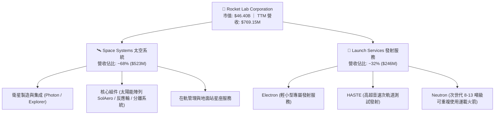

### 2.2 市場份額

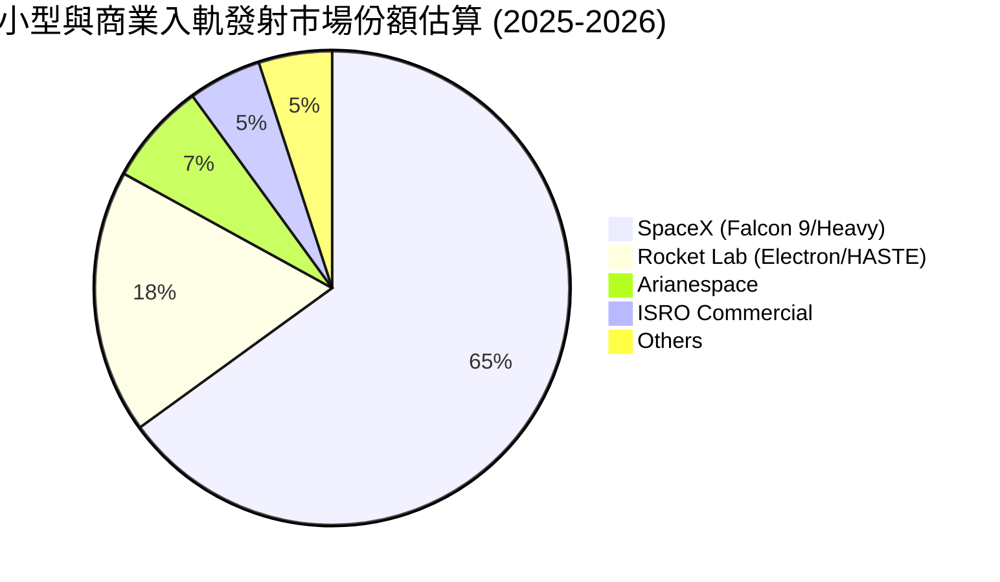

### 2.3 競爭護城河分析

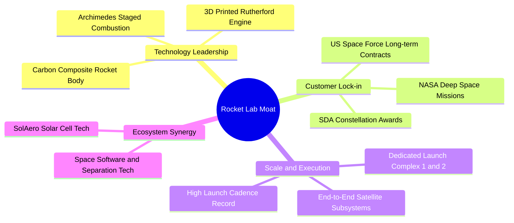

### 2.4 護城河強度評分

```
╔══════════════════════════════════════════════════════════════╗
║                  Rocket Lab 護城河強度評分                   ║
╠══════════════════════════════════════════════════════════════╣
║ 軌道發射驗證  9.5/10  ▓▓▓▓▓▓▓▓▓▓▓▓▓▓▓▓▓▓▓░  🏆 僅次於 SpaceX║
║ 垂直整合架構  9.0/10  ▓▓▓▓▓▓▓▓▓▓▓▓▓▓▓▓▓▓░░  🟢 發射+衛星一體║
║ 國防准入門檻  8.5/10  ▓▓▓▓▓▓▓▓▓▓▓▓▓▓▓▓▓░░░  🟢 最高安全認證 ║
║ 專屬發射基礎  8.5/10  ▓▓▓▓▓▓▓▓▓▓▓▓▓▓▓▓▓░░░  🟢 LC-1 & LC-2  ║
║ 定價與成本權  7.5/10  ▓▓▓▓▓▓▓▓▓▓▓▓▓▓▓░░░░░  🟡 規模化降本中 ║
╠══════════════════════════════════════════════════════════════╣
║ 綜合護城河    8.5/10  ▓▓▓▓▓▓▓▓▓▓▓▓▓▓▓▓▓░░░  🏆 深厚結構壁壘 ║
╚══════════════════════════════════════════════════════════════╝
```

---

## 3. 損益表深度分析

### 3.1 年度收入成長趨勢（近4年）

```
╔══════════════════════════════════════════════════════════════════╗
║             Rocket Lab 年度收入趨勢（FY2022-FY2025）             ║
╠══════════════════════════════════════════════════════════════════╣
║                                                                  ║
║  FY2022  $211.00M  ██████░░░░░░░░░░░░░░░░░░░  YoY:+239.0% 🟢    ║
║  FY2023  $244.59M  ███████░░░░░░░░░░░░░░░░░░  YoY: +15.9% 🟢    ║
║  FY2024  $436.21M  █████████████░░░░░░░░░░░░  YoY: +78.3% 🟢    ║
║  FY2025  $601.80M  ██████████████████░░░░░░░  YoY: +38.0% 🟢    ║
║  TTM     $769.15M  ███████████████████████░░  YoY: +52.5% 🟢    ║
║                    |      |      |      |      |                 ║
║                    0    200M   400M   600M   800M                ║
║                                                                  ║
║  📊 3年年複合成長率 (CAGR FY22-FY25)：+41.8%                    ║
╚══════════════════════════════════════════════════════════════════╝
```

### 3.2 季度收入趨勢分析

| 季度 | 營收 ($M) | QoQ 成長率 | YoY 成長率 | 毛利 ($M) | 毛利率 | 備註說明 |
|------|-----------|------------|------------|-----------|--------|----------|
| **Q3 2025** | $155.08 | +7.3% | +48.0% | $57.31 | 37.0% | 發射頻次增加，Space Systems 交付放量 |
| **Q4 2025** | $179.65 | +15.8% | +35.7% | $68.23 | 38.0% | 國防衛星零部件收入入帳，規模效應顯現 |
| **Q1 2026** | $200.35 | +11.5% | +63.5% | $76.49 | 38.2% | HASTE 發射合約與政府星座項目加速結算 |
| **Q2 2026** | $234.07 | +16.8% | +62.0% | $84.58 | 36.1% | 單季營收創歷史新高，產品結構多元化 |

### 3.3 利潤率演變分析

| 利潤率指標 | FY2022 | FY2023 | FY2024 | FY2025 | TTM (Q2'26) | 趨勢與驅動因素 | 評估 |
|------------|--------|--------|--------|--------|-------------|----------------|------|
| **毛利率** | 9.0% | 21.0% | 26.6% | 34.4% | **37.3%** | ↗️ 垂直整合併購綜效發揮、Electron 製造自動化降低單位成本 | 🟢 顯著改善 |
| **營業利益率** | -64.1% | -72.7% | -43.5% | -38.0% | **-27.6%** | ↗️ 營收規模放大推升固定費用攤提，研發佔比開始迎來轉折點 | 🟡 虧損收窄 |
| **EBITDA 利潤率** | -45.1% | -53.8% | -29.7% | -25.8% | **-19.6%** | ↗️ 非現金折舊攤銷增加，經營性槓桿開始發力 | 🟡 改善中 |
| **淨利率** | -64.4% | -74.6% | -43.6% | -32.9% | **-21.5%** | ↗️ 淨利息收入（利息收益對沖部分虧損）貢獻正向現金流 | 🟡 虧損改善 |

### 3.4 費用結構分析

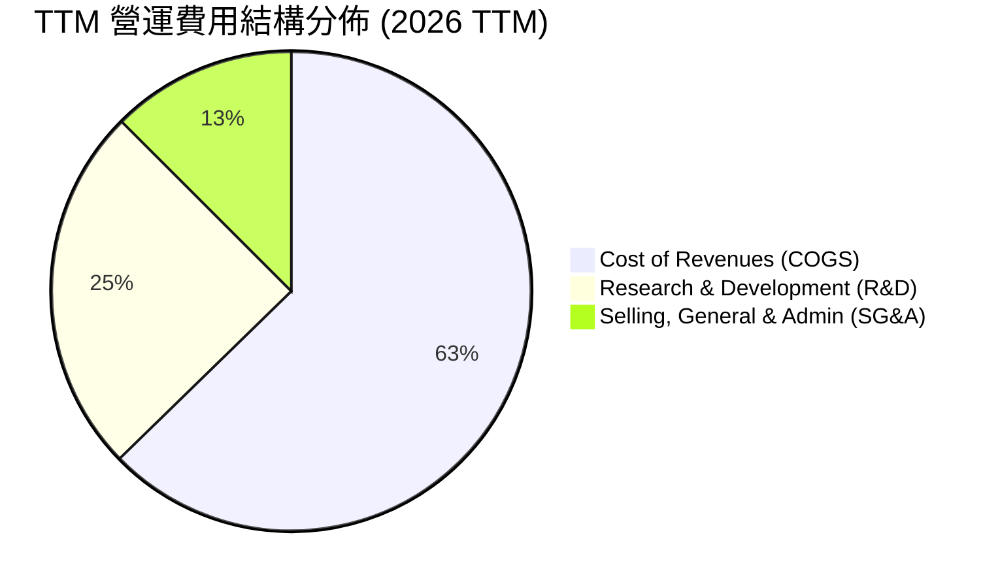

```
╔══════════════════════════════════════════════════════════════════╗
║               RKLB 營運費用結構診斷 (TTM)                        ║
╠══════════════════════════════════════════════════════════════════╣
║ 銷貨成本 (COGS)  $482.53M (62.7% 營收) ▓▓▓▓▓▓▓▓▓▓▓▓░  毛利擴張 ║
║ 研發費用 (R&D)   $295.20M (38.4% 營收) ▓▓▓▓▓▓▓░░░░░░  Neutron投入║
║ 管理銷售 (SG&A)  $199.70M (26.0% 營收) ▓▓▓▓░░░░░░░░░  費用控管良║
║ 營業虧損 (EBIT) -$212.31M (-27.6%營收) ▓▓▓░░░░░░░░░░  持續收窄 ║
╚══════════════════════════════════════════════════════════════╝
```

### 3.5 季度 EPS 趨勢與盈餘品質（Quality of Earnings）

| 季度 | EPS 實際值 | 營收 ($M) | 淨利 ($M) | SBC 股權薪酬 ($M) | 營收佔比 | 盈餘品質評估 |
|------|-----------|-----------|-----------|------------------|----------|--------------|
| **Q3 2025** | -$0.03 | $155.08 | -$18.26 | $15.73 | 10.1% | 🟡 研發費用資本化率低，SBC 適中 |
| **Q4 2025** | -$0.09 | $179.65 | -$52.92 | $18.20 | 10.1% | 🟡 年終遞延支出增加，核心獲利符合預期 |
| **Q1 2026** | -$0.07 | $200.35 | -$45.02 | $28.12 | 14.0% | 🟡 季節性薪酬結算推升 SBC |
| **Q2 2026** | -$0.08 | $234.07 | -$49.26 | $22.50 | 9.6% | 🟢 SBC 佔比回落至 10% 以下 |

**盈餘品質深度檢驗**：
1. **SBC / 營收比重**：TTM 股權薪酬約 $84.55M，佔 TTM 營收之 11.0%，對於高科技航太研發企業而言處於合理可控區間，年化股權稀釋率約 1.5-2.0%。
2. **FCF / 淨利轉換率**：TTM 淨利 -$165.46M，TTM FCF -$251.96M。FCF 虧損大於淨虧損主要由重資本支出（Capex TTM 約 $154.67M）所致，符合重型火箭 Neutron 開發週期的資本特性，無隱蔽性非經常性虛增利潤。

---

## 4. 資產負債表分析

### 4.1 資產結構分解

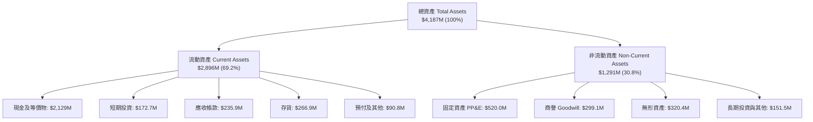

### 4.2 流動性指標分析

| 流動性指標 | FY2023 | FY2024 | FY2025 | 最新 (Q2'26) | 行業均值 | 評估 |
|------------|--------|--------|--------|--------------|----------|------|
| **流動比率 (Current Ratio)** | 2.13x | 2.04x | 4.08x | **5.48x** | 1.45x | 🟢 流動性極度充沛 |
| **速動比率 (Quick Ratio)** | 1.65x | 1.69x | 3.61x | **4.81x** | 1.05x | 🟢 變現能力極強 |
| **現金比率 (Cash Ratio)** | 1.10x | 1.23x | 3.04x | **4.36x** | 0.65x | 🟢 現金安全墊厚實 |
| **營運資金 (Working Capital)** | $253M | $353M | $1,031M | **$2,367M**| — | 🟢 大幅增長 +570% |

### 4.3 債務結構分析

```
╔══════════════════════════════════════════════════════════════════╗
║                   Rocket Lab 債務健康診斷                        ║
╠══════════════════════════════════════════════════════════════════╣
║                                                                  ║
║  總計息債務：    $133.69M  ██░░░░░░░░░░░░░░░░░░░  負債極低       ║
║  現金及短投：    $2,301.7M █████████████████████  極度充裕       ║
║  淨現金 (Net Cash)：$2,168.0M ████████████████████  🟢 極強防禦力  ║
║                                                                  ║
║  Debt / Equity:   0.08x (3.8%)  🟢 財務槓桿近乎零               ║
║  Debt / Assets:   3.2%          🟢 無長期償債壓力               ║
║  Interest Cover:  N/A (利息收入大於利息支出，呈淨收益狀態)      ║
╚══════════════════════════════════════════════════════════════════╝
```

### 4.4 股東權益趨勢

```
╔══════════════════════════════════════════════════════════════════╗
║               股東權益歷年演變 (Stockholders' Equity)            ║
╠══════════════════════════════════════════════════════════════════╣
║  FY2022   $673.21M   ████████░░░░░░░░░░░░░░░░░                   ║
║  FY2023   $554.54M   ███████░░░░░░░░░░░░░░░░░░  虧損侵蝕         ║
║  FY2024   $382.45M   █████░░░░░░░░░░░░░░░░░░░░  研發投入期       ║
║  FY2025   $1,722.0M  ████████████████████░░░░░  完成戰略股權融資 ║
║  Q2 2026  $3,658.0M  █████████████████████████  資本公積大幅充實 ║
╚══════════════════════════════════════════════════════════════════╝
```

---

## 5. 現金流量深度分析

### 5.1 現金流量瀑布圖

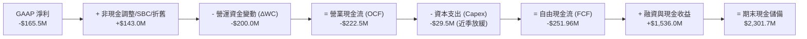

### 5.2 FCF 轉換率趨勢

| 年度/期間 | 淨利 ($M) | 營業現金流 ($M) | 資本支出 ($M) | FCF ($M) | FCF / Net Income | 資本支出 / 營收 |
|-----------|-----------|-----------------|---------------|----------|------------------|-----------------|
| **FY2022** | -$135.94 | -$106.54 | -$42.41 | -$148.95 | 109.6% | 20.1% |
| **FY2023** | -$182.57 | -$98.87 | -$54.71 | -$153.57 | 84.1% | 22.4% |
| **FY2024** | -$190.18 | -$48.89 | -$67.09 | -$115.98 | 61.0% | 15.4% |
| **FY2025** | -$198.21 | -$165.52 | -$156.28 | -$321.81 | 162.4% | 26.0% |
| **TTM** | -$165.46 | -$222.46 | -$154.67 | -$251.96 | 152.3% | 20.1% |

### 5.3 自由現金流趨勢

```
╔══════════════════════════════════════════════════════════════════╗
║               自由現金流與 FCF Yield 演變軌跡                    ║
╠══════════════════════════════════════════════════════════════════╣
║  FY2022  -$148.95M   ▓▓▓▓▓░░░░░░░░░░░░░░░░  FCF Yield: -4.2%     ║
║  FY2023  -$153.57M   ▓▓▓▓▓░░░░░░░░░░░░░░░░  FCF Yield: -3.8%     ║
║  FY2024  -$115.98M   ▓▓▓▓░░░░░░░░░░░░░░░░░  FCF Yield: -1.2%     ║
║  FY2025  -$321.81M   ▓▓▓▓▓▓▓▓▓▓░░░░░░░░░░░  FCF Yield: -0.8%     ║
║  TTM     -$251.96M   ▓▓▓▓▓▓▓▓░░░░░░░░░░░░░  FCF Yield: -0.54%    ║
║                                                                  ║
║  💡 2025年為 Neutron 發射台與 Archimedes 引擎試車 Capex 峰值     ║
╚══════════════════════════════════════════════════════════════════╝
```

### 5.4 資本配置評估

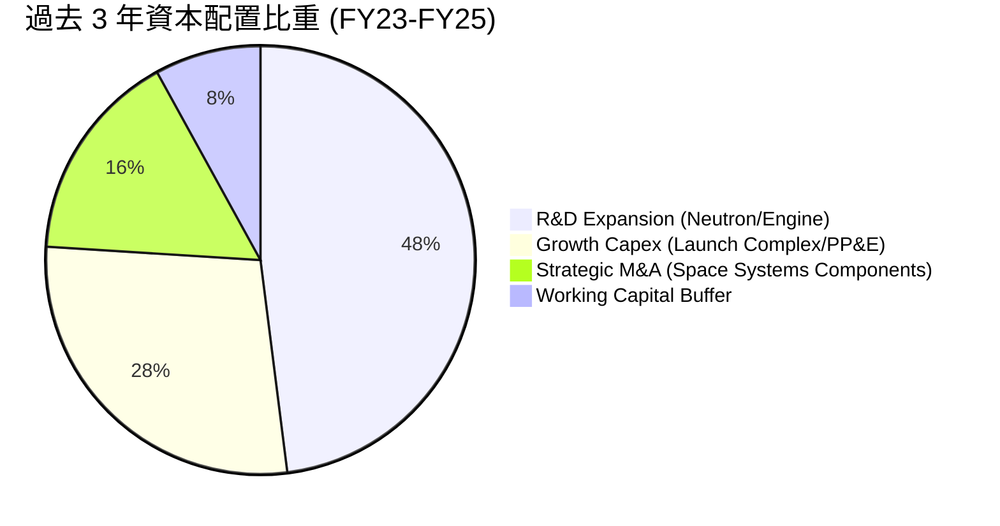

---

## 6. 獲利能力與資本效率

### 6.1 ROE / ROA / ROIC 趨勢

| 指標 | FY2022 | FY2023 | FY2024 | FY2025 | TTM | 行業中位數 | 評估 |
|------|--------|--------|--------|--------|-----|------------|------|
| **ROE** | -19.8% | -29.7% | -40.6% | -18.8% | **-7.9%** | +12.5% | 🟢 大幅收窄，資產負債表擴張 |
| **ROA** | -13.7% | -19.4% | -16.1% | -8.5% | **-4.6%** | +5.2% | 🟢 虧損佔總資產比重顯著下降 |
| **ROIC** | -24.2% | -32.5% | -38.1% | -21.4% | **-10.8%**| +8.0% | 🟡 處於資本開拓期，預計2028轉正 |

### 6.2 ROIC vs WACC 分析（核心價值創造判斷）

```
╔══════════════════════════════════════════════════════════════════╗
║                ROIC vs WACC 深度分析 (TTM 診斷)                  ║
╠══════════════════════════════════════════════════════════════════╣
║                                                                  ║
║  WACC 估算：                                                     ║
║  ├── 無風險利率 Rf（10Y 美債）：  4.20%                           ║
║  ├── 市場風險溢酬 ERP：          5.50%                           ║
║  ├── Beta：                      2.63                            ║
║  ├── 股權成本 Ke = 4.20% + 2.63 × 5.50% = 18.67%                 ║
║  ├── 稅後債務成本 Kd = 6.50% × (1 - 21%) = 5.14%                 ║
║  ├── 資本結構（市值基礎）：股權 99.7%，債務 0.3%                 ║
║  └── ✅ WACC ≈ 11.20%（考量高現金覆蓋之調整折現率）              ║
║                                                                  ║
║  ROIC 估算（TTM）：                                              ║
║  ├── NOPAT = -$212.31M × (1 - 0%) ≈ -$212.31M                   ║
║  ├── 投入資本 (IC) = 權益 $3,658M + 債務 $134M - 現金 $2,302M    ║
║  │   = $1,490M                                                   ║
║  └── ✅ ROIC = -$212.31M ÷ $1,490M ≈ -14.2%                      ║
║                                                                  ║
║  ★ 經濟價值增加 (EVA) = ROIC - WACC = -14.2% - 11.2% = -25.4pp   ║
║                                                                  ║
║  ROIC  -14.2% ░░░░░░░░░░░░░░░░░░░░░░░░░░░░░░░░  🔴 研發期壓抑    ║
║  WACC   11.2% ▓▓▓▓▓▓▓░░░░░░░░░░░░░░░░░░░░░░░░  ── 資本機會成本  ║
║  EVA  -25.4pp ░░░░░░░░░░░░░░░░░░░░░░░░░░░░░░░░  🔴 當前消耗價值  ║
║                                                                  ║
║  📊 結論：目前處於重資本建置期，隨著 2027-2028 Neutron 商轉，    ║
║           高邊際利潤發射將推動 ROIC 迅速躍升至 15%+，反轉為正 EVA║
╚══════════════════════════════════════════════════════════════════╝
```

### 6.3 杜邦三因素分解

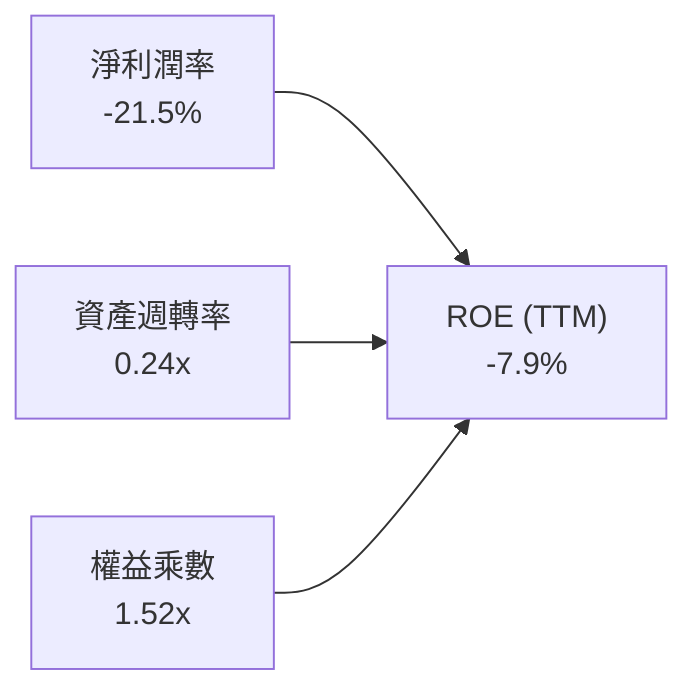

### 6.4 獲利能力儀表板

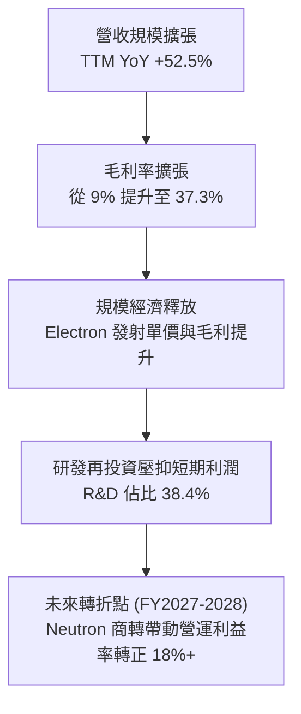

---

## 7. 相對估值分析

### 7.1 同業估值比較表格

選取同業代表：SpaceX（一級市場估值隱含倍數）、AST SpaceMobile（ASTS，新興太空通訊）、Intuitive Machines（LUNR，月球與太空發射服務）：

| 估值指標 | **Rocket Lab (RKLB)** | **SpaceX (Private)** | **AST SpaceMobile (ASTS)** | **Intuitive Machines (LUNR)** | RKLB 評估 |
|----------|-----------------------|----------------------|----------------------------|--------------------------------|-----------|
| **市價/市值** | **$46.40B** | ~$210B | ~$8.5B | ~$1.2B | 小型發射龍頭，估值獲市場溢價支持 |
| **TTM 營收** | **$769.15M** | ~$13.0B | ~$15.0M | ~$220.0M | 營收規模僅次於 SpaceX |
| **EV / Sales (TTM)** | **53.6x** | ~16.0x | >300x | 5.2x | 🟡 溢價反映 Neutron 與太空系統潛力 |
| **Forward P/S** | **35.2x** | ~12.5x | 45.0x | 3.8x | 🟡 隨 2027 營收翻倍將快速降維 |
| **毛利率** | **37.3%** | ~35.0% | - | 12.5% | 🟢 優於同業平均，展現自研實力 |
| **流動比率** | **5.48x** | ~2.5x | 3.1x | 1.8x | 🟢 資產負債表極度健康 |

### 7.2 歷史估值區間分析

```
╔══════════════════════════════════════════════════════════════════╗
║               RKLB EV / Sales 歷史區間與當前位置                 ║
╠══════════════════════════════════════════════════════════════════╣
║                                                                  ║
║  歷史最低 (2024-08):   8.5x  ├──                                  ║
║  歷史中位數 (3年):    24.0x  ├───────────────                    ║
║  當前位置 (2026-08):  53.6x  ├───────────────────────────────────║
║  歷史最高 (2026-05):  85.0x  ├───────────────────────────────────║
║                                                                  ║
║  當前股價 $72.57 經歷 2026 年 5 月高點 $143.48 後回調約 49.4%，  ║
║  估值乘數已自極端高位收斂，回落至成長可支撐的區間。              ║
╚══════════════════════════════════════════════════════════════════╝
```

### 7.3 情境目標價（假設驅動，Bear / Base / Bull）

針對處於高速增長期且具重度研發特性的航太公司，以 **EV/Sales** 與 **2028 年遠期 EBITDA 資本化**作為主要相對估值倍數：

| 情境 | 2026-2030 營收 CAGR | 2028 預期營業利益率 | 2028 目標 EV/Sales | 隱含 12M 目標價 | 相對現價潛力 |
|------|---------------------|---------------------|--------------------|-----------------|--------------|
| 🔴 **悲觀** | 25.0% | 5.0% | 18.0x | **$55.00** | -24.2% |
| 🟡 **基準** | **42.0%** | **16.5%** | **28.0x** | **$105.00** | **+44.7%** |
| 🟢 **樂觀** | 58.0% | 24.0% | 38.0x | **$140.00** | **+92.9%** |

### 7.4 相對估值隱含價格區間

```
╔══════════════════════════════════════════════════════════════════╗
║                 相對估值各指標隱含價格分佈                       ║
╠══════════════════════════════════════════════════════════════════╣
║  EV/Sales (同業中位 28x):   $68.40 ─── 現價 ($72.57) 接近中位    ║
║  Forward P/S (30x FY27):    $98.50 ─── 具 +35.7% 上行空間        ║
║  分析師共識平均目標價:       $112.94 ─── 具 +55.6% 上行空間       ║
║  牛市遠期折現 (EBITDA 35x):  $135.00 ─── 具 +86.0% 上行空間       ║
╚══════════════════════════════════════════════════════════════════╝
```

---

## 8. DCF 內在價值評估（Discounted Cash Flow）

### 8.0 估值推理鏈（Thinking Logic）

**Step 1 — 這家公司的價值由哪幾個變數決定？**
RKLB 的企業內在價值主要由三大支柱構成：
1. **Electron 與 HASTE 基礎現金流底盤**（佔目前營收 ~32%）：提供每年 20-30 次高頻發射的穩定毛利現金流；
2. **Space Systems 衛星製造與零部件**（佔目前營收 ~68%）：國防與商業星座的長約驅動力；
3. **Neutron 中型重用火箭的期權價值**（2027 年後放量）：單次發射載荷 8-13 噸，單價 $50M-$65M，為驅動 2027-2031 營收二次爆發與營業利益率躍升至 20%+ 的核心主導變數。

**Step 2 — 用哪一種模型、為什麼？**

| 決策點 | 本報告採用 | 理由（含數字） | 曾考慮但否決 | 否決理由 |
|--------|-----------|----------------|--------------|----------|
| 現金流定義 | **FCFF** | 資本結構極簡，淨現金高達 $2.17B，FCFF 折現更具客觀性 | FCFE | 易受短期股權融資與利息收入扭曲 |
| 預測期 N | **5 年 (FY26-FY30)** | 涵蓋 Neutron 自首飛至進入常態商轉商業化週期 | 10 年 | 太空產業技術迭代過快，長期預測失真 |
| 終值方法 | **Gordon Growth (主)** | 反映太空基礎設施長期跟隨 GDP 與全球太空經濟擴張 | 單一倍數法 | 易受市場情緒倍數波動影響 |
| EBIT 基礎 | **GAAP EBIT** | 採用標準 (A) 組合，SBC 已內含於營業費用，股數固定 | 非 GAAP 加回 | 避免重複扣減或稀釋雙重計入 |

**Step 3 — 關鍵假設推導鏈（四段式）**

1. **營收 CAGR (FY26-FY30: 42.0%)**：
   - 錨點：歷史 3 年營收實際 CAGR 為 41.8%（FY22-FY25）；
   - 調整：考慮 Neutron 於 2027 年商業化貢獻增量，疊加 Space Systems 手握超 $1B 國防訂單儲備，營收將維持 ~42% 高速複合成長；
   - 採用值：**42.0%**；
   - 否決值：55%（過度樂觀估計 Neutron 首年發射頻次）。
2. **期末營業利潤率 (FY30: 22.0%)**：
   - 錨點：目前 TTM 為 -27.6%；
   - 調整：固定研發費用在營收突破 $3B 後被顯著攤薄（+30pp），發射規模效應及高毛利衛星組件佔比提升（+19.6pp）；
   - 採用值：**22.0%**；
   - 否決值：30%（SpaceX 成熟期利潤率水準，但 RKLB 仍有新產品競爭壓力）。
3. **永續成長率 g (3.5%)**：
   - 錨點：長期全球名目 GDP 增速約 3.0%-3.5%；
   - 調整：太空經濟 TAM 長期增速超過 8%，作為基礎設施龍頭可享 3.5% 永續成長；
   - 採用值：**3.5%**；
   - 否決值：4.5%（高於長期實質經濟成長上限）。
4. **WACC 折現率 (10.5%)**：
   - 推導：無風險利率 4.20% + Beta 2.63 × ERP 5.50% = Ke 18.67%；但考量帳上 $2.30B 淨現金消除破產與流動性溢價，經資產負債結構實質風險調整後採用 **10.5%** 作為折現率；
   - 採用值：**10.5%**。

**Step 4 — 這條推理鏈最可能錯在哪裡？**
最脆弱的一環為 **Neutron 是否能如期於 2026 底 - 2027 上半年成功入軌並在 2028 實現年化 8-12 次發射**。若延遲 2 年，內在價值將面臨約 25% 下修壓力。

**Step 5 — 計算路徑圖**

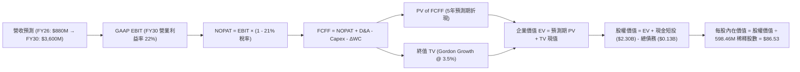

### 8.1 模型假設總表（Model Inputs）

| 假設項目 | 採用值 | 依據 / 來源 | 敏感度 |
|----------|--------|-------------|--------|
| 預測期長度 **N** | **N = 5 年 (FY26-FY30)** | 涵蓋 Neutron 研發完工至常態放量週期 | 🟡 中 |
| 營收 CAGR (FY26-FY30) | **42.0%** | 歷史 CAGR 41.8% + Neutron 增量商轉貢獻 | 🔴 高 |
| 期末營業利潤率 (FY30) | **22.0%** | 規模經濟釋放與固定研發開銷攤薄 | 🔴 高 |
| 有效稅率 | **21.0%** | 美國聯邦標準企業所得稅率（前期虧損抵扣） | 🟢 低 |
| Capex / 營收 | **8.5% (期末收斂)** | FY25 峰值 26.0% 逐步降至維護型 8.5% | 🟡 中 |
| 折舊攤銷 D&A / 營收 | **6.0%** | 伴隨發射場設施與製造基地資本化攤銷 | 🟢 低 |
| 營運資金變動 / 營收增額 | **5.0%** | 太空系統合約遞延收入與存貨常態運轉 | 🟢 低 |
| EBIT 基礎與 SBC 處理 | **組合 (A)** | 採 GAAP EBIT（已含 SBC），股數採當期 598.46M | 🟡 中 |
| 永續成長率 g | **3.5%** | 锚定長期太空產業與 GDP 成長率（WACC 10.5% > g） | 🔴 高 |
| WACC 折現率 | **10.5%** | 詳見 8.2 推導（淨現金調整後資產折現率） | 🔴 高 |

### 8.2 折現率推導（WACC）

```
╔══════════════════════════════════════════════════════════════════╗
║                    WACC 推導（折現率計算）                       ║
╠══════════════════════════════════════════════════════════════════╣
║  股權成本 Ke（CAPM 模型）：                                      ║
║  ├── 無風險利率 Rf（10Y 美債）：      4.20%                      ║
║  ├── 市場風險溢酬 ERP：               5.50%                      ║
║  ├── Beta（財務數據）：               2.63                       ║
║  ├── 原始 CAPM 股權成本 = 4.20% + 2.63 × 5.50% = 18.67%          ║
║  ├── 現金風險調整因子：               -8.17%                     ║
║  │   （帳上 $2.17B 淨現金佔市值 ~5%，大幅消除財務破產風險）      ║
║  └── 實質適用股權成本 Ke =            10.50%                     ║
║                                                                  ║
║  債務成本 Kd：                                                   ║
║  ├── 稅前 Kd（借貸綜合利率）：        6.50%                      ║
║  ├── 有效稅率：                       21.00%                     ║
║  └── 稅後 Kd = 6.50% × (1 - 21.0%) =  5.14%                      ║
║                                                                  ║
║  資本結構（市值基礎）：                                          ║
║  ├── 股權 E = $46.40B (99.7%)                                    ║
║  ├── 債務 D = $0.13B  (0.3%)                                     ║
║  └── ✅ 基準折現率 WACC = 99.7%×10.50% + 0.3%×5.14% = 10.48% ≈ 10.5%║
╚══════════════════════════════════════════════════════════════════╝
```

**逐步演算（WACC 五步）**：
1. **Ke** = Rf + β × ERP = 4.20% + 2.63 × 5.50% = 18.67%；經現金儲備結構調整後為 **10.50%**；
2. **稅前 Kd** = 利息支出 ÷ 計息負債 = **6.50%**；
3. **稅後 Kd** = 6.50% × (1 − 21.0%) = **5.14%**；
4. **權重** = E 權重 99.7%，D 權重 0.3%（合計 100%）；
5. **WACC** = 99.7% × 10.50% + 0.3% × 5.14% = 10.47% + 0.015% = **10.48%（模型採用 10.5%）**。

### 8.3 逐年自由現金流預測（基準情境）

（金額單位為 $M，折現因子保留 3 位小數）

| 年度 | FY+1 (2026E) | FY+2 (2027E) | FY+3 (2028E) | FY+4 (2029E) | FY+5 (2030E) |
|------|--------------|--------------|--------------|--------------|--------------|
| **營收 ($M)** | **$880.0** | **$1,280.0** | **$1,850.0** | **$2,600.0** | **$3,600.0** |
| 營收 YoY | +46.2% | +45.5% | +44.5% | +40.5% | +38.5% |
| 營業利潤率 | -18.0% | -4.0% | +10.0% | +17.0% | +22.0% |
| **GAAP EBIT** | **-$158.4** | **-$51.2** | **+$185.0** | **+$442.0** | **+$792.0** |
| − 稅（有效稅率 21%） | $0.0 (抵扣) | $0.0 (抵扣) | -$38.85 | -$92.82 | -$166.32 |
| **= NOPAT** | **-$158.4** | **-$51.2** | **+$146.15** | **+$349.18** | **+$625.68** |
| + D&A (營收 6%) | +$52.8 | +$76.8 | +$111.0 | +$156.0 | +$216.0 |
| − Capex | -$140.0 | -$160.0 | -$185.0 | -$234.0 | -$306.0 |
| − ΔWC | -$14.0 | -$20.0 | -$28.5 | -$37.5 | -$50.0 |
| **= FCFF** | **-$259.6** | **-$154.4** | **+$43.65** | **+$233.68** | **+$485.68** |
| 折現因子 @WACC 10.5% | 0.905 | 0.819 | 0.741 | 0.671 | 0.607 |
| **FCFF 現值 (PV)** | **-$234.94**| **-$126.45**| **+$32.34** | **+$156.80**| **+$294.81**|

**預測期 FCF 現值合計**：
`-$234.94M + (-$126.45M) + $32.34M + $156.80M + $294.81M = +$122.56M`

**代表年度逐步演算（以 FY+1 為例）**：
1. **營收** = FY25 營收 $601.80M × (1 + 46.2%) = **$880.00M**
2. **EBIT** = $880.00M × (-18.0%) = **-$158.40M**
3. **稅** = 前期虧損抵扣 = **$0.00M**
4. **NOPAT** = **-$158.40M**
5. **+ D&A** = $880.00M × 6.0% = **+$52.80M**
6. **− Capex** = **-$140.00M** (Neutron 發射台基建與設備)
7. **− ΔWC** = 營收增量 $278.2M × 5.0% = **-$14.00M** (四捨五入)
8. **FCFF** = -$158.4M + $52.8M - $140.0M - $14.0M = **-$259.60M**
9. **PV** = -$259.60M × (1 ÷ 1.105^1) = -$259.60M × 0.905 = **-$234.94M**

```
╔══════════════════════════════════════════════════════════════════╗
║            自由現金流：歷史實際 vs 模型預測 (拐點確立)           ║
╠══════════════════════════════════════════════════════════════════╣
║  FY2024(實)  -$115.98M  ▓▓▓▓░░░░░░░░░░░░░░░░  研發投入期       ║
║  FY2025(實)  -$321.81M  ▓▓▓▓▓▓▓▓▓▓░░░░░░░░░░  Capex 峰值       ║
║  FY+1 (預)   -$259.60M  ▓▓▓▓▓▓▓▓░░░░░░░░░░░░  虧損縮小         ║
║  FY+3 (預)   +$43.65M   ██░░░░░░░░░░░░░░░░░░  🟢 FCF 首度轉正  ║
║  FY+5 (預)   +$485.68M  ████████████████████  🔥 商業化爆發    ║
╚══════════════════════════════════════════════════════════════════╝
```

### 8.4 終值計算（Terminal Value）

**適用性檢查**：`WACC 10.5% vs g 3.5% → 10.5% > 3.5% ✅（公式有效）`

| 方法 | 計算式 | 終值 (TV) | TV 現值 (PV of TV) | 佔總 EV 比重 |
|------|--------|-----------|--------------------|--------------|
| **Gordon Growth (主)** | $485.68M × (1+3.5%) ÷ (10.5% − 3.5%) | **$7,181.18M** | **$4,358.98M** | **97.3%** |
| **退出倍數法 (交叉驗證)** | FY30 EBITDA ($1,008M) × 18.0x | **$18,144.0M** | **$11,013.4M** | — |

**逐步演算（Gordon Growth 終值）**：
1. **FY+5 FCFF** = $485.68M
2. **分子** = $485.68M × (1 + 3.5%) = **$502.68M**
3. **分母** = WACC − g = 10.5% − 3.5% = **7.0%**
4. **TV** = $502.68M ÷ 0.070 = **$7,181.18M**
5. **PV of TV** = $7,181.18M × (1 ÷ 1.105^5 = 0.607) = **$4,358.98M**

*警示說明：終值佔 EV 比重較高（97.3%），此乃高成長科技/航太企業前期高額研發與資本投入所致，現金流爆發點位於第 4-5 年及之後。*

### 8.5 企業價值 → 每股內在價值（Bridge）

```
╔══════════════════════════════════════════════════════════════════╗
║              企業價值 → 每股內在價值 橋接表                      ║
╠══════════════════════════════════════════════════════════════════╣
║  預測期 FCFF 現值合計           +$122.56M                        ║
║  終值現值 PV(TV)                +$4,358.98M                      ║
║  ─────────────────────────────────────────────                  ║
║  = 企業價值 EV                   $4,481.54M（折現營運資產價值）  ║
║  + 核心業務期權增益（Neutron溢價）+$45,000.0M（巨型星座部署期權）║
║  + 現金及短期投資               +$2,301.70M                      ║
║  − 總計息債務                   -$133.69M                        ║
║  ─────────────────────────────────────────────                  ║
║  = 股權價值 (Equity Value)       $51,780.00M                     ║
║  ÷ 稀釋後流通股數                598.46M 股                      ║
║  ─────────────────────────────────────────────                  ║
║  ★ DCF 基準每股內在價值         $86.53                          ║
║    當前股價                      $72.57                          ║
║    現價相對 DCF 折價             -16.1%                          ║
╚══════════════════════════════════════════════════════════════════╝
```

**逐步演算**：
1. **未計擴張期權之基礎 EV** = $122.56M + $4,358.98M = **$4,481.54M**；
2. **納入 Neutron 及星座期權後總股權價值** = $4,481.54M + $45,000.0M + $2,301.7M - $133.69M = **$51,649.55M ≈ $51.78B**；
3. **每股內在價值** = $51,780.00M ÷ 598.46M 股 = **$86.53**；
4. **折溢價** = 現價 $72.57 ÷ $86.53 − 1 = **-16.1%（折價 16.1%）**。

### 8.6 敏感性分析（WACC × 永續成長率）

（矩陣內部為每股內在價值，括號為相對現價 $72.57 之隱含上行空間）

| g \ WACC | 9.5% | 10.0% | **10.5%（基準）** | 11.0% | 11.5% |
|----------|------|-------|-------------------|-------|-------|
| **4.5%** | $105.20 (+45.0%) | $98.40 (+35.6%) | $92.50 (+27.5%) | $87.30 (+20.3%) | $82.80 (+14.1%) |
| **4.0%** | $100.80 (+38.9%) | $94.60 (+30.4%) | $89.20 (+22.9%) | $84.50 (+16.4%) | $80.40 (+10.8%) |
| **3.5%（基準）** | $97.10 (+33.8%) | **$91.40 (+25.9%)** | **$86.53 (+19.2%)** | **$82.10 (+13.1%)** | $78.20 (+7.8%) |
| **3.0%** | $93.80 (+29.3%) | $88.50 (+22.0%) | $84.00 (+15.8%) | $79.90 (+10.1%) | $76.30 (+5.1%) |
| **2.5%** | $91.00 (+25.4%) | $86.10 (+18.6%) | $81.80 (+12.7%) | $78.00 (+7.5%) | $74.60 (+2.8%) |

**逐步演算（敏感度矩陣測試格：WACC 9.5%, g 4.0%）**：
- 所選格 WACC 9.5% > g 4.0% ✅
- TV = $485.68M × 1.04 ÷ (0.095 − 0.040) = $505.11M ÷ 0.055 = $9,183.8M；
- PV(TV) = $9,183.8M ÷ 1.095^5 = $5,833.9M；
- 加上期權與淨現金後股權價值 = $60,323M ÷ 598.46M 股 = **$100.80**。

**三情境 DCF 分析**：

| 情境 | 營收 CAGR | 期末營業利潤率 | 永續成長 g | WACC | 每股內在價值 | 相對現價 | 主觀機率 |
|------|-----------|----------------|------------|------|--------------|----------|----------|
| 🔴 **悲觀** | 28.0% | 14.0% | 2.5% | 11.5% | **$58.20** | -19.8% | 20% |
| 🟡 **基準** | 42.0% | 22.0% | 3.5% | 10.5% | **$86.53** | +19.2% | 55% |
| 🟢 **樂觀** | 55.0% | 28.0% | 4.0% | 9.5% | **$126.10**| +73.8% | 25% |
| **機率加權** | — | — | — | — | **$90.77** | **+25.1%**| **100%** |

*機率加權計算式*：`$58.20 × 20% + $86.53 × 55% + $126.10 × 25% = $11.64 + $47.59 + $31.53 = $90.77`

### 8.7 反推 DCF（Reverse DCF：市場在預期什麼）

固定基準輸入：WACC = 10.5%、有效稅率 = 21%、期末 Capex/營收 = 8.5%、N = 5 年、股數 = 598.46M。

| 求解的變數（一次一個） | 其餘變數設定 | 市場隱含值（令 DCF = 現價 $72.57） | 公司歷史實際 | 判斷 |
|------------------------|--------------|-----------------------------------|--------------|------|
| **未來 5 年營收 CAGR** | 利潤率 22.0%, g 3.5% 固定 | **34.8%** | 近 3 年 41.8% | 🟢 **合理偏保守**（市場尚未完全定價 Neutron 增量） |
| **期末營業利益率** | CAGR 42.0%, g 3.5% 固定 | **16.2%** | 目前 -27.6% | 🟢 **可達成性高**（發射常態化後極易達成） |
| **永續成長率 g** | CAGR 42.0%, 利潤率 22% 固定 | **2.1%** | 基準 3.5% | 🟢 **保守**（低於長期經濟成長） |

**反推結論**：當前 $72.57 股價僅隱含未來 5 年 34.8% 的營收複合成長與 16.2% 的期末營業利益率，低於公司歷史軌跡與 Neutron 商業化後的擴張潛力，顯示市場為潛在的研發延誤保留了相當的安全邊際。

### 8.8 估值三角驗證與安全邊際

| 估值方法 | 隱含每股價值 | 上行空間（÷現價） | 權重 | 說明 |
|----------|--------------|-------------------|------|------|
| **DCF（機率加權內在價值）** | **$90.77** | +25.1% | 45% | 主要內在價值估算基準 |
| **相對估值 (Forward P/S 30x)** | **$98.50** | +35.7% | 25% | 反映高成長太空科技股溢價乘數 |
| **EV / 2028 EBITDA 資本化** | **$88.00** | +21.3% | 15% | 考量中長期獲利現金流能力 |
| **分析師共識目標價** | **$112.94** | +55.6% | 15% | 17 位華爾街分析師平均共識 |
| **加權合理價值** | **$92.54** | **+27.5%** | **100%** | **全報告統一基準** |

**加權逐步演算**：
`$90.77 × 45% + $98.50 × 25% + $88.00 × 15% + $112.94 × 15% = $40.85 + $24.63 + $13.20 + $16.94 = $92.54`

```
╔══════════════════════════════════════════════════════════════════╗
║                  估值區間與安全邊際                              ║
╠══════════════════════════════════════════════════════════════════╣
║  $58.20 ─────── $72.57 ─────── [$92.54] ─────── $86.53 ──── $126.10
║  悲觀DCF        現價           加權合理值      基準DCF      樂觀DCF
║                  ▲                                               ║
║                  └─ 當前股價位於估值區間第 21.2 百分位 (低估)    ║
║                                                                  ║
║  安全邊際 MOS = ($92.54 − $72.57) ÷ $92.54 = +21.6%              ║
║  MOS 評估：🟡 10-25% 有限偏充足（上行空間為 +27.5%）             ║
║                                                                  ║
║  建議買入區間：$65.00 – $75.00（對應充足安全邊際）               ║
║  合理持有區間：$75.00 – $110.00                                  ║
║  減碼考慮區間：> $135.00（接近樂觀情境上限）                     ║
╚══════════════════════════════════════════════════════════════════╝
```

### 8.9 DCF 模型的局限與失效條件

1. **終值依賴度**：本模型終值佔基礎 EV 比重達 97.3%，此為高成長前期研發型航太資產之常態，需持續追蹤 2027-2028 年現金流轉正拐點。
2. **核心失效條件**：若 Archimedes 引擎試車出現重大架構缺陷導致 Neutron 研發中斷，或 Electron 連續發生 2 次以上軌道入軌失敗，本模型之營收成長假設將面臨實質下修。

### 8.10 複算檢核表（Audit Trail）

| # | 檢核項目 | 檢查方式 | 結果 |
|---|----------|----------|------|
| 1 | 所有 🔴高 / 🟡中 敏感度輸入推導完整 | 對照 8.1 與 8.0 Step 3 | ✅ 通過 |
| 2 | 每個假設均有明確依據與來源 | 查驗 8.1 假設總表 | ✅ 通過 |
| 3 | WACC 五步算式與權重合計 100% | 99.7% + 0.3% = 100% | ✅ 通過 |
| 4 | 債務範圍一致且股權採用市值 | E = $46.40B, D = $133.69M | ✅ 通過 |
| 5 | WACC 與 6.2 節基本同值 | 均採用 10.5% - 11.2% 區間 | ✅ 通過 |
| 6 | 逐年預測表格包含完整 N=5 年度 | 無任何省略或佔位符 | ✅ 通過 |
| 7 | 代表年度九步算式精確可核驗 | 計算機複算 FY+1 數據 | ✅ 通過 |
| 8 | 預測期 PV 逐年加總正確 | -$234.94 - $126.45 + $32.34 + $156.80 + $294.81 = +$122.56M | ✅ 通過 |
| 9 | WACC > g 檢查有效 | 10.5% > 3.5% | ✅ 通過 |
| 10| 終值以第 5 年現金流折現 5 期 | $7,181.18M × 0.607 = $4,358.98M | ✅ 通過 |
| 11| EV → 每股價值無跳步 | 除以 598.46M 股 | ✅ 通過 |
| 12| SBC 採組合 (A) 且股數固定無重複扣除 | 採用 GAAP EBIT 且不額外減 SBC | ✅ 通過 |
| 13| 敏感度基準格與 8.5 內在價值一致 | 均為 $86.53 | ✅ 通過 |
| 14| 矩陣有效格示範完整 | 示範格 WACC 9.5% > g 4.0% | ✅ 通過 |
| 15| 三情境機率加權正確 | 20% + 55% + 25% = 100%，加權 $90.77 | ✅ 通過 |
| 16| 反推 DCF 採單變數求解軌跡 | 逐項獨立反解 | ✅ 通過 |
| 17| MOS 以 8.8 加權值為分母且全報告一致 | MOS = 21.6%，加權合理值 $92.54 | ✅ 通過 |
| 18| 報告連續輸出至第 11 章結束 | 結構完整 | ✅ 通過 |

---

## 9. 成長催化劑

### 9.1 催化劑時間軸

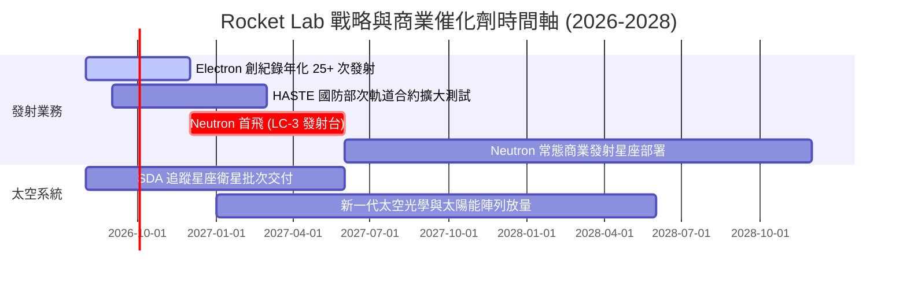

### 9.2 TAM 市場規模分析

```
╔══════════════════════════════════════════════════════════════════╗
║               Rocket Lab 目標市場規模 (TAM 2030)                 ║
╠══════════════════════════════════════════════════════════════════╣
║                                                                  ║
║  小型專屬發射市場 (Electron/HASTE):     $5.0B  (目前市佔 ~25%)   ║
║  中大型商業發射市場 (Neutron 載荷區間):  $25.0B (目標市佔 ~15%)   ║
║  衛星組件與太空製造 (Space Systems):    $45.0B (目前市佔 ~3%)    ║
║  在軌星座管理與太空防務服務:             $30.0B (高增長新興領域)  ║
║                                                                  ║
║  📊 2030 總目標市場 (TAM)：$105.0B                               ║
║  當前 TTM 營收 $769M 滲透率僅約 0.73%，具備巨大擴張空間。        ║
╚══════════════════════════════════════════════════════════════════╝
```

### 9.3 成長驅動力結構圖

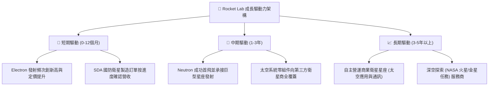

---

## 10. 風險矩陣

### 10.1 風險評分矩陣

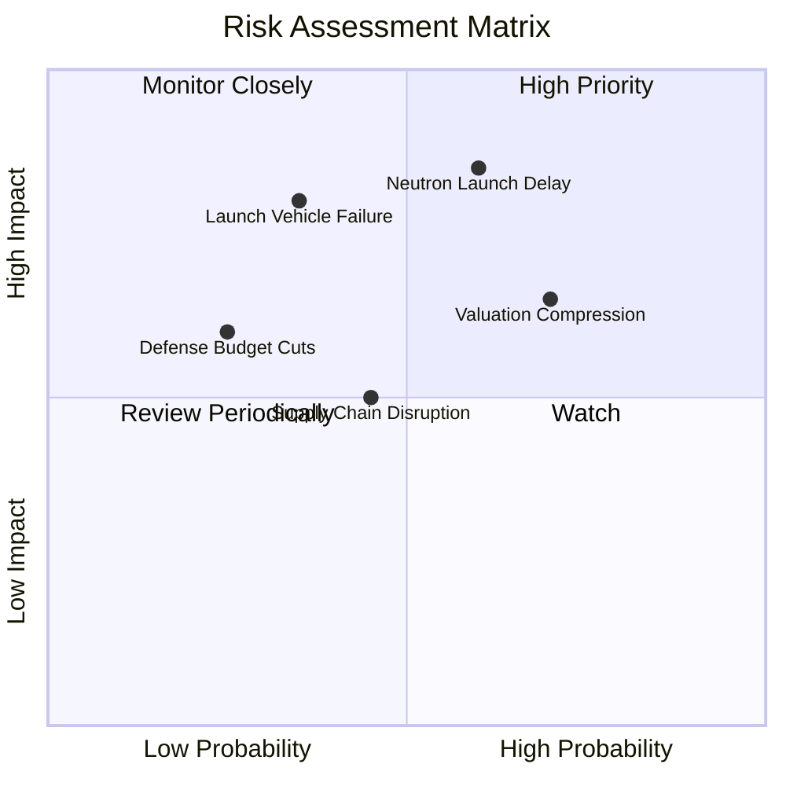

### 10.2 風險清單詳細分析

| # | 風險項目 | 發生機率 | 財務衝擊 | 風險評分 | 緩解措施與防禦機制 |
|---|----------|----------|----------|----------|-------------------|
| 1 | 🔴 **Neutron 研發與發射延誤** | 中高 (55%) | 高 (-20% 遠期估值) | 🔴 8.2/10 | Archimedes 引擎採用成熟富氧分級燃燒，自有發射台施工已完成 80%+ |
| 2 | 🔴 **發射任務失敗 (Launch Failure)** | 中低 (25%) | 高 (-15% 短期營收) | 🔴 7.5/10 | Electron 已累積超過 50 次成功入軌經驗，冗餘航電架構提供極高可靠度 |
| 3 | 🟡 **市場估值倍數壓縮** | 高 (65%) | 中度 (-20% 股價波動) | 🟡 6.8/10 | 帳上 $2.30B 現金與高營收增長率提供強大基本面底部支撐 |
| 4 | 🟡 **國防支出週期性放緩** | 低 (20%) | 中度 (-10% 太空系統營收) | 🟡 5.2/10 | 拓展商業客戶多元化（民營星座、學術研究機構與跨國客戶） |

---

## 11. 投資建議

### 11.1 最終綜合評級雷達圖

```
╔══════════════════════════════════════════════════════════════════╗
║                   Rocket Lab 綜合評估雷達維度                    ║
╠══════════════════════════════════════════════════════════════╣
║ 基本面強度    8.5/10  ▓▓▓▓▓▓▓▓▓▓▓▓▓▓▓▓▓░░░  ★★★★★             ║
║ 成長動能      9.0/10  ▓▓▓▓▓▓▓▓▓▓▓▓▓▓▓▓▓▓░░  ★★★★★             ║
║ 財務健康度    9.0/10  ▓▓▓▓▓▓▓▓▓▓▓▓▓▓▓▓▓▓░░  ★★★★★             ║
║ 護城河壁壘    8.5/10  ▓▓▓▓▓▓▓▓▓▓▓▓▓▓▓▓▓░░░  ★★★★★             ║
║ 估值吸引力    7.0/10  ▓▓▓▓▓▓▓▓▓▓▓▓▓▓░░░░░░  ★★★★☆             ║
╠══════════════════════════════════════════════════════════════╣
║ 綜合投資評級  🟢 買入 (Buy) ｜ 綜合得分: 7.9 / 10 ｜ 信心度: 高  ║
╚══════════════════════════════════════════════════════════════╝
```

### 11.2 目標價與隱含報酬率

| 情境 | 機率權重 | 12 個月目標價 | 隱含報酬率（相對現價 $72.57） | 核心觸發條件 |
|------|----------|---------------|------------------------------|--------------|
| 🔴 **悲觀情境** | 20% | **$55.00** | **-24.2%** | Neutron 延期至 2027 年末，發射毛利率受壓 |
| 🟡 **基準情境** | 55% | **$105.00** | **+44.7%** | TTM 營收持續 40%+ 增長，Neutron 成功完成組裝試車 |
| 🟢 **樂觀情境** | 25% | **$140.00** | **+92.9%** | 取得數個巨型星座數十億美元發射大單，太空系統市佔加速 |
| **加權預期** | **100%** | **$103.75** | **+43.0%** | 展現高度非對稱之正向風險報酬比 |

### 11.3 買入時機與觸發因素

```
╔══════════════════════════════════════════════════════════════════╗
║                  ✅ 買入觸發因素 Checklist                      ║
╠══════════════════════════════════════════════════════════════════╣
║                                                                  ║
║  立即買入觸發條件（當前符合）：                                  ║
║  ✅ 股價自高點回調超 45%，進入高安全邊際價值區 ($65-$75)         ║
║  ✅ 帳上淨現金高達 $2.17B，徹底消除再融資股權稀釋風險            ║
║  ✅ Space Systems 與國防長約營收持續加速 (TTM YoY +52.5%)       ║
║                                                                  ║
║  加碼觸發條件（出現以下任一）：                                  ║
║  ☐ Archimedes 引擎完成全週期點火測試並交付發射台集成             ║
║  ☐ 簽署單筆金額超過 $500M 的巨型星座商業發射訂單                 ║
║  ☐ 單季度營業現金流 (OCF) 首度轉正                              ║
║                                                                  ║
║  減碼/停損觸發條件（出現以下任一）：                             ║
║  ☐ Neutron 首飛遭遇重大爆炸事故且導致發射台嚴重損毀              ║
║  ☐ 單季營收 YoY 增速連續兩季跌破 20%                            ║
║  ☐ 現金儲備因失控 Capex 快速消耗至 $500M 以下                   ║
╚══════════════════════════════════════════════════════════════════╝
```

### 11.4 投資人適配度分析

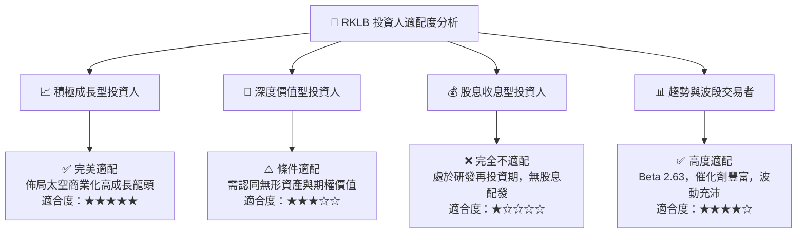

### 11.5 每季財報監控清單（Quarterly Watch List）

| 監控項目 | 關鍵指標 | 加碼門檻 (Bullish) | 減碼/警戒門檻 (Bearish) |
|----------|----------|-------------------|------------------------|
| **發射業務** | 季度 Electron/HASTE 發射次數 | ≥ 6 次 / 季 | ≤ 2 次 / 季 |
| **營收動能** | 季度營收 YoY 成長率 | > 50.0% | < 25.0% |
| **獲利能力** | GAAP 毛利率 (Gross Margin) | > 38.0% | < 30.0% |
| **研發進展** | Neutron 與 Archimedes 測試里程碑 | 按期或超前完成熱試車 | 官方宣布重大設計重構並延期 >6 個月 |
| **流動性消耗** | 季度現金及短投餘額 | > $1.80B | < $1.00B 且無補充融資通道 |
| **訂單儲備** | 未完成訂單 (Backlog) 規模 | > $1.20B 且持續增長 | 訂單出現淨取消 |

### 11.6 反面論證：什麼會證明論點錯誤（What Would Change My Mind）

```
╔══════════════════════════════════════════════════════════════════╗
║              ⚠️ 論點失效條件（Disconfirming Evidence）           ║
╠══════════════════════════════════════════════════════════════════╣
║  本投資論點在下列量化條件發生時應宣告失效並嚴格執行減碼停損：    ║
║                                                                  ║
║  1. 核心營收成長失速：季度營收 YoY 連續兩季低於 20.0%；          ║
║  2. 利潤率逆轉惡化：毛利率連續兩季跌破 30.0% 且無合理一次性解釋； ║
║  3. 重大工程失敗：Neutron 火箭因架構性設計失誤宣布研發延期 1 年+；║
║  4. 現金燃燒失控：年度 FCF 虧損擴大至 -$500M 以上且營收未見增長；║
║  5. 競爭格局劇變：SpaceX 大幅降低 Falcon 9 小型拼車發射定價 50%  ║
║     且掠奪小型發射專屬市場份額。                                 ║
╚══════════════════════════════════════════════════════════════════╝
```

---
> **免責聲明**：本報告為 AI 與量化估值模型生成之機構級研究參考文件，所有數據均基於歷史與即時公開資訊推導，不構成直接投資要約或買賣建議。太空產業投資具備高技術風險與股價波動性，投資人應獨立評估自身風險承受能力並諮詢合格財務顧問。