# RKLB 基本面深度分析報告
> **報告日期**：2026-09-09 ｜ **語言**：繁體中文 ｜ **數據來源**：Yahoo Finance, StockAnalysis, Roic.ai ｜ **分析師**：CFA 級機構研究

---

## 目錄

| # | 章節 | 核心結論 |
|---|------|----------|
| 1 | 執行摘要 | 給予「持有 / 區間操作」評級，基準目標價 $58.00，加權合理價值 $53.30，安全邊際不足 |
| 2 | 公司概覽與商業模式 | 小型發射市佔第一，太空系統為營收主軸，垂直整合確立雙引擎護城河（7.4/10） |
| 3 | 損益表深度分析 | TTM 營收 $769.15M（YoY +52.5%），毛利率擴張至 37.3%，但重度研發致營利率為 -24.6% |
| 4 | 資產負債表分析 | 現金及短投充裕達 $2.30B，淨現金 $2.17B，流動比率 5.48x，短中期流動性無虞 |
| 5 | 現金流量深度分析 | TTM FCF 為 -$251.96M，中型火箭 Neutron 進入資本支出高峰期，現金燃燒率受控 |
| 6 | 獲利能力與資本效率 | TTM ROIC 為 -8.2% vs WACC 11.2%，EVA 為 -19.4pp，目前仍處於投資破壞期 |
| 7 | 相對估值分析 | P/S 達 52.4x、EV/Sales 達 48.4x，相較國防航太巨頭與同業存在極高溢價 |
| 8 | DCF 內在價值評估 | 基準 DCF 每股價值 $45.69（折溢價 +38.0%），加權合理價值 $53.30，安全邊際 MOS 為 -18.3% |
| 9 | 成長催化劑 | Neutron 中型火箭首飛商業化、美國太空軍與 SDA 國防星座合約、組裝量產化 |
| 10 | 風險矩陣 | Neutron 研發延遲或發射失敗為首要威脅，高估值倍數使股價波動極度敏感 |
| 11 | 投資建議 | 建議於 $38–$44 區間吸納，當前股價 $63.07 估值透支，等待催化劑落地與估值收斂 |

---

## 1. 執行摘要

### 1.0 一頁式投資儀表板（Portfolio Manager 30 秒速讀）

| 項目 | 內容 |
|------|------|
| **投資論點（3 句）** | ① TTM 營收達 $769.15M（YoY +52.5%），受太空系統（占比 ~70%）與 Electron 創紀錄發射頻次共同驅動。<br/>② 手頭現金及短投達 $2.30B，淨現金 $2.17B，足以支撐 Neutron 研發至 2027 年商業化現金流轉正。<br/>③ 現價 $63.07 對應 P/S 52.4x，且 TTM ROIC 為 -8.2% vs WACC 11.2%（摧毀價值），估值高度透支長期增長預期。 |
| **護城河評分** | 7.4 / 10（發射成功率紀錄 + 零組件垂直整合生態系） |
| **管理層/資本配置評分** | 8.0 / 10（創辦人技術掛帥，嚴格控制資本支出，把握高股價增資強化防禦儲備） |
| **財務健康** | 🟢 強健（淨現金 $2.17B，流動比率 5.48x，無近中期償債壓力） |
| **ROIC vs WACC** | -8.2% vs 11.2%（EVA 為 -19.4pp，現階段處於研發資本密集投入之價值摧毀期） |
| **FCF 趨勢** | 負向擴張（TTM FCF -$251.96M，FCF Yield 為 -0.62%） |
| **估值** | Forward P/E 1384.3x ｜ EV/Sales 48.4x ｜ P/S 52.4x ｜ FCF Yield -0.62% |
| **DCF 內在價值（基準）** | $45.69 ｜ 現價 $63.07 折溢價 +38.0%（溢價顯著） |
| **安全邊際（MOS）** | -18.3%＝(加權合理價值 $53.30 − 現價 $63.07) ÷ $53.30 ｜ 🔴 <10% 無安全邊際 |
| **預期報酬（基準情境 12M）** | -8.0%（基準目標價 $58.00，股價面臨估值壓縮壓力） |
| **關鍵風險（前二）** | ① Neutron 首飛進度延宕或失敗；② 高估值倍數引發的市場流動性溢價回撤 |
| **評級 + 信心度** | 🟡 持有 / 區間操作（Hold） ｜ 信心：中等 |

### 1.1 核心評分儀表板

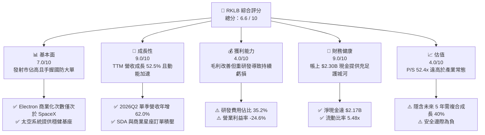

### 1.2 評分進度條視覺化

```
╔══════════════════════════════════════════════════════════════╗
║              RKLB 多維度評分儀表板 (1-10分)                  ║
╠══════════════════════════════════════════════════════════════╣
║ 基本面強度  7.0 ▓▓▓▓▓▓▓▓▓▓▓▓▓▓░░░░░░  ★★★★☆           ║
║ 成長動能    9.0 ▓▓▓▓▓▓▓▓▓▓▓▓▓▓▓▓▓▓░░  ★★★★★           ║
║ 獲利品質    4.0 ▓▓▓▓▓▓▓▓░░░░░░░░░░░░  ★★☆☆☆           ║
║ 財務健康    9.0 ▓▓▓▓▓▓▓▓▓▓▓▓▓▓▓▓▓▓░░  ★★★★★           ║
║ 估值合理性  4.0 ▓▓▓▓▓▓▓▓░░░░░░░░░░░░  ★★☆☆☆           ║
║ 護城河深度  7.4 ▓▓▓▓▓▓▓▓▓▓▓▓▓▓▓░░░░░  ★★★★☆           ║
║ 管理層執行  8.0 ▓▓▓▓▓▓▓▓▓▓▓▓▓▓▓▓░░░░  ★★★★☆           ║
║ 技術創新力  8.5 ▓▓▓▓▓▓▓▓▓▓▓▓▓▓▓▓▓░░░  ★★★★☆           ║
╠══════════════════════════════════════════════════════════════╣
║ 綜合總分    6.6 ▓▓▓▓▓▓▓▓▓▓▓▓▓░░░░░░░  🏆 戰略價值高但估值過熱 ║
╚══════════════════════════════════════════════════════════════╝
```

### 1.3 五大投資論點 + 三大核心風險

| 類型 | 項目 | 具體依據 | 信心度 |
|------|------|----------|--------|
| 🟢 **投資論點①** | **發射服務龍頭確立，定價權穩步提升** | Electron 是全球唯二能達到高頻發射的軌道級火箭，單次發射收入已由早期 $6.5M 提升至 $8.2M+，毛利率改善顯著。 | 🟢 極高 |
| 🟢 **投資論點②** | **太空系統（Space Systems）轉化為高增長基盤** | 貢獻營收約 70%，囊括太陽能板、反應輪與太空星艦製造，SDA 星座合約展現強勁變現力。 | 🟢 高 |
| 🟢 **投資論點③** | **Neutron 瞄準中大型運載火箭真空帶** | 鎖定中軌巨型星座部署，若如期於 2026H2–2027 首飛，將直接打破 SpaceX Falcon 9 在商業中型發射市場的壟斷。 | 🟡 中度 |
| 🟢 **投資論點④** | **資產負債表極具戰略防禦厚度** | 2026 年中帳面現金及短投達 $2.30B，對比年度淨流出約 $250M–$300M，具備 7 年以上的現金跑道（Cash Runway）。 | 🟢 極高 |
| 🟢 **投資論點⑤** | **軍事與國防外包預算的結構性紅利** | 美國太空軍加速「分散式衛星架構（PWSA）」採購，RKLB 作為一級承包商具不可替代性。 | 🟢 高 |
| 🟡 **風險①** | **Neutron 測試研發進度與商業回本延遲** | 碳纖維大型箭體與 Archimedes 引擎技術複雜度極高，一旦出現地面试驗失敗，將加劇現金消耗並折損估值溢價。 | 🟡 中度 |
| 🔴 **風險②** | **估值超前透支與流動性退潮** | 目前 P/S 達 52.4x、EV/Sales 48.4x，股價於 24 個月內自 $9.73 狂飆至 $143 後修正至 $63，市場預期無容錯空間。 | 🔴 高衝擊 |
| 🟡 **風險③** | **關鍵組件供應鏈與人才競爭白熱化** | 航太頂尖工程師薪酬競爭推升 SBC（TTM 超過 $80M），若營收成長放緩將進一步侵蝕盈餘轉換率。 | 🟡 中度 |

### 1.4 快速統計卡片

| 指標 | 公司實際值 | 行業均值 | S&P 500 均值 | 狀態 |
|------|-------------|----------|--------------|------|
| 收入 YoY 成長 | **62.0%**（最新季） | 12.5% | 5.8% | 🟢 卓越 |
| 毛利率 | **37.3%** | 24.8% | 34.5% | 🟢 優於同業 |
| 營業利益率 | **-24.6%** | 8.5% | 12.2% | 🔴 虧損投入中 |
| 淨利率 | **-21.5%** | 6.2% | 10.8% | 🔴 仍未收斂 |
| ROE | **-7.9%** | 11.0% | 14.5% | 🟡 改善中 |
| P/S (TTM) | **52.4x** | 2.1x | 2.9x | 🔴 極度昂貴 |

### 1.5 投資結論

```
╔══════════════════════════════════════════════════════════════════╗
║                    📊 投資結論摘要                               ║
╠══════════════════════════════════════════════════════════════════╣
║  評級：🟡 持有 / 觀望區間操作（Hold）                            ║
║  當前股價：$63.07                                               ║
║  DCF 內在價值（基準）：$45.69（現價溢價 +38.0%）                 ║
║  安全邊際 MOS：-18.3%（＝(加權合理價值 $53.30 − $63.07) ÷ $53.30）║
║  目標價區間：                                                    ║
║    🔴 悲觀情境：$35.00（-44.5%）                                 ║
║    🟡 基準情境：$58.00（-8.0%）  ← 12 個月主要目標              ║
║    🟢 樂觀情境：$85.00（+34.8%）                                 ║
║  投資評分：6.6 / 10                                              ║
║  適合投資人：具備極高風險承受力之激進成長型／科技主題配置者     ║
╚══════════════════════════════════════════════════════════════════╝
```

---

## 2. 公司概覽與商業模式

### 2.1 業務結構與收入來源

Rocket Lab Corporation（NASDAQ: RKLB）為端到端航太系統整合商。與單純的火箭發射商不同，RKLB 構建了「發射＋太空系統（衛星本體及組件）」的閉環模式。

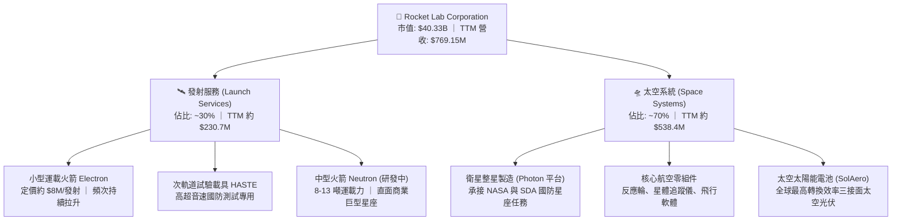

### 2.2 市場份額

在商用小型軌道專屬發射（500kg 以下）市場中，RKLB 佔據絕對主導地位，僅次於提供拼車發射（Rideshare）的 SpaceX。

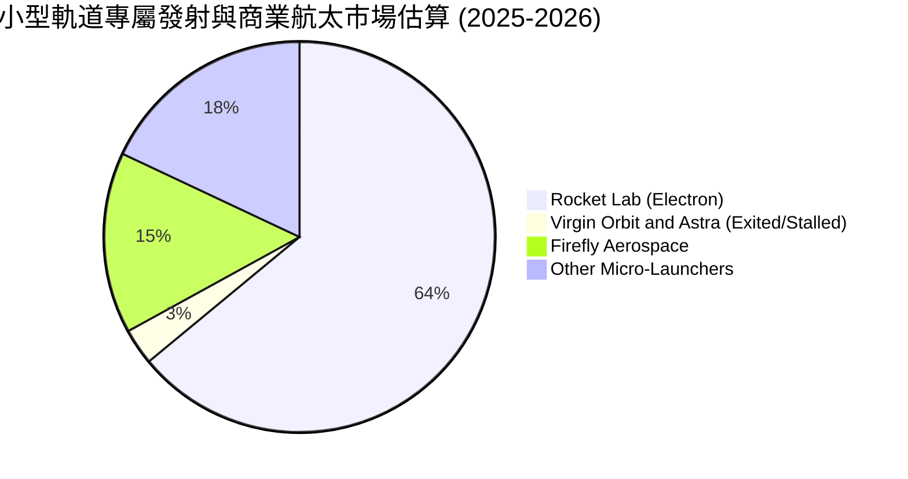

### 2.3 競爭護城河分析

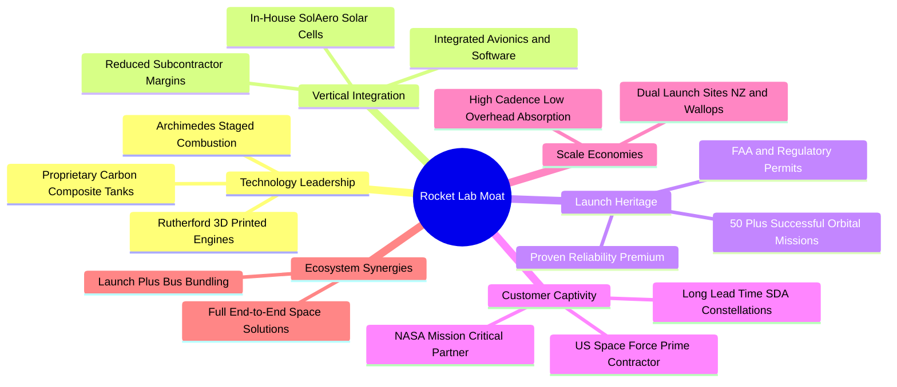

### 2.4 護城河強度評分

```
╔══════════════════════════════════════════════════════════════╗
║                  Rocket Lab 護城河強度評分                   ║
╠══════════════════════════════════════════════════════════════╣
║ 歷史發射驗證  9.0/10  ▓▓▓▓▓▓▓▓▓▓▓▓▓▓▓▓▓▓░░  🏆 軌道發射成功率>90% ║
║ 垂直整合深度  8.0/10  ▓▓▓▓▓▓▓▓▓▓▓▓▓▓▓▓░░░░  🟢 太空系統自供率極高 ║
║ 監管與發射場  8.5/10  ▓▓▓▓▓▓▓▓▓▓▓▓▓▓▓▓▓░░░  🏆 自有紐西蘭私人發射場║
║ 國防准入壁壘  7.5/10  ▓▓▓▓▓▓▓▓▓▓▓▓▓▓▓░░░░░  🟢 具備美國國防最高安全認證║
║ 轉換成本與生態6.0/10  ▓▓▓▓▓▓▓▓▓▓▓▓░░░░░░░░  🟡 商業星座客戶價格敏感║
║ 規模成本優勢  5.5/10  ▓▓▓▓▓▓▓▓▓▓▓░░░░░░░░░  🟡 規模仍顯著落後於SpaceX║
╠══════════════════════════════════════════════════════════════╣
║ 綜合護城河    7.4/10  ▓▓▓▓▓▓▓▓▓▓▓▓▓▓▓░░░░░  🏆 具備結構性防護優勢 ║
╚══════════════════════════════════════════════════════════════╝
```

---

## 3. 損益表深度分析

### 3.1 年度收入成長趨勢（近4年）

```
╔══════════════════════════════════════════════════════════════════╗
║              RKLB 年度收入趨勢（FY2022-FY2025）              ║
╠══════════════════════════════════════════════════════════════════╣
║                                                                  ║
║  FY2022  $211.00M  █████░░░░░░░░░░░░░░░░░░░  YoY: +239.0% 🟢     ║
║  FY2023  $244.59M  ██████░░░░░░░░░░░░░░░░░░  YoY:  +15.9% 🟢     ║
║  FY2024  $436.21M  ███████████░░░░░░░░░░░░░  YoY:  +78.3% 🟢     ║
║  FY2025  $601.80M  ██════════════████████░░  YoY:  +38.0% 🟢     ║
║                   |       |       |       |                      ║
║                   0      200M    400M    600M                    ║
║                                                                  ║
║  📊 3 年複合增長率 (CAGR)：+41.8% ｜ TTM 營收達 $769.15M          ║
╚══════════════════════════════════════════════════════════════════╝
```

### 3.2 季度收入趨勢分析

| 季度 | 營業收入 ($M) | QoQ 成長率 | YoY 成長率 | 毛利 ($M) | 毛利率 | 營運備註 |
|------|-------------|-----------|-----------|-----------|--------|----------|
| **2025-09-30 (Q3)** | $155.08M | +7.3% | +48.0% | $57.31M | 37.0% | 🟢 發射頻率維持高檔，太空系統產品組合轉佳 |
| **2025-12-31 (Q4)** | $179.65M | +15.8% | +35.7% | $68.23M | 38.0% | 🟢 SDA 國防合約進度款認列增加 |
| **2026-03-31 (Q1)** | $200.35M | +11.5% | +63.5% | $76.49M | 38.2% | 🟢 單季營收突破兩億美元關卡 |
| **2026-06-30 (Q2)** | $234.07M | +16.8% | +62.0% | $84.58M | 36.1% | 🟢 創歷史新高，太空系統與商業發射雙增長 |

### 3.3 利潤率演變分析

| 利潤率指標 | FY2022 | FY2023 | FY2024 | FY2025 | TTM (2026Q2) | 趨勢 | 評估 |
|------------|--------|--------|--------|--------|--------------|------|------|
| **毛利率** | 9.0% | 21.0% | 26.6% | 34.4% | **37.3%** | ↗️ 強勁擴張 | 🟢 產品垂直整合綜效顯現 |
| **營業利益率** | -64.1% | -72.7% | -43.5% | -38.0% | **-24.6%** | ↗️ 虧損收斂 | 🟡 規模經濟發酵，研發承壓 |
| **EBITDA 利潤率** | -45.1% | -53.8% | -29.7% | -25.8% | **-19.6%** | ↗️ 逐年減虧 | 🟡 營運槓桿正向拉動 |
| **淨利率** | -64.4% | -74.6% | -43.6% | -32.9% | **-21.5%** | ↗️ 逐步改善 | 🟡 受高額研發投入壓抑 |

**利潤率演變深度解析**：
1. **毛利率由 FY22 的 9.0% 躍升至 TTM 的 37.3%**：主要歸功於 SolAero 太空光伏產能利用率優化，以及 Electron 火箭製造工序標準化帶動單發成本下降。
2. **營業虧損率收斂至 -24.6%**：營業槓桿顯現，但由於 Neutron 中型火箭的 Archimedes 引擎點火測試與馬里蘭州廠房擴張，FY25 研發費用暴增至 $270.72M（佔營收 45.0%），抵銷了毛利的改善幅度。

### 3.4 費用結構分析

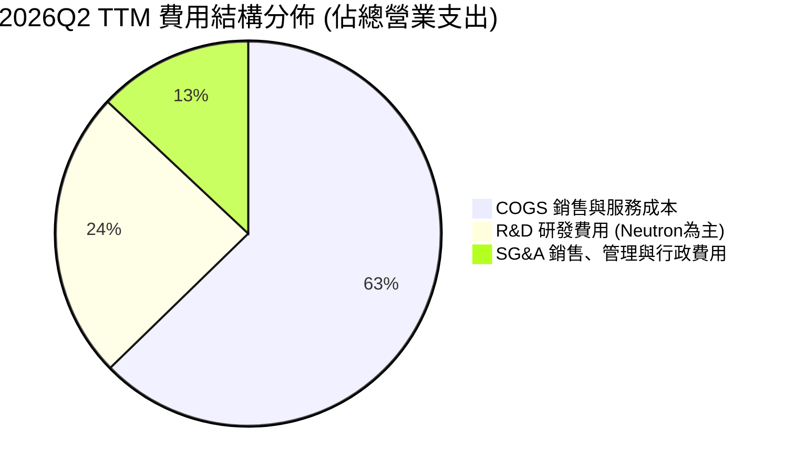

```
╔══════════════════════════════════════════════════════════════════╗
║                   RKLB TTM 費用管控健康度診斷                    ║
╠══════════════════════════════════════════════════════════════════╣
║ 銷貨成本率 (COGS/Rev)   62.7%  ████████████░░░░░░░░  穩定下降 🟢 ║
║ 研發費用率 (R&D/Rev)    35.2%  ███████░░░░░░░░░░░░░  高位博弈 🔴 ║
║ 銷管費用率 (SG&A/Rev)   18.8%  ████░░░░░░░░░░░░░░░░  營運槓桿 🟢 ║
║ 股權薪酬率 (SBC/Rev)    10.8%  ██░░░░░░░░░░░░░░░░░░  稀釋中等 🟡 ║
╚══════════════════════════════════════════════════════════════════╝
```

### 3.5 季度 EPS 趨勢與盈餘品質（Quality of Earnings）

| 季度 | GAAP EPS | 營業利益 ($M) | SBC 股權薪酬 ($M) | 營運現金流 OCF ($M) | 盈餘品質診斷 |
|------|----------|--------------|-------------------|---------------------|--------------|
| **2025-09-30 (Q3)** | -$0.03 | -$58.97M | $15.73M | -$23.52M | 🟡 國防應收款期末結算遞延 |
| **2025-12-31 (Q4)** | -$0.09 | -$51.04M | $18.20M | -$64.53M | 🔴 資本開支與年終獎勵衝高 |
| **2026-03-31 (Q1)** | -$0.07 | -$44.79M | $28.12M | -$50.33M | 🟡 SBC 佔比大幅拉升 |
| **2026-06-30 (Q2)** | -$0.08 | -$57.51M | $19.56M | -$84.08M | 🔴 存貨備料急升致現金燃燒加速 |

**盈餘品質深度評量**：

| 盈餘品質項目 | 數值/佔比 | 評估 |
|--------------|-----------|------|
| **SBC / 營收比重** | **10.8%**（TTM $82.9M / $769.2M） | 🟡 中度稀釋，航太核心工程師激勵所需 |
| **SBC / 營業現金流** | **-37.3%** | 🔴 實質淨流出中非現金薪酬佔比較大 |
| **FCF / 淨利（現金轉換率）** | **152.3%**（-$252.0M / -$165.5M） | 🔴 現金燃燒速度大於 GAAP 帳面虧損 |
| **一次性/非經常性損益** | 無顯著異常項目 | 🟢 營業虧損主要來自實質研發支出 |
| **資本化支出 vs 費用化** | 研發支出 100% 費用化 | 🟢 會計政策極為保守穩健，無灌水嫌疑 |

**盈餘品質結論**：RKLB 未將研發支出資本化，其呈現的虧損是扎實且保守的；但高達 10.8% 的 SBC 佔比意味著若股價停滯，股東股權將持續面臨每年 2-3% 的被動稀釋。

---

## 4. 資產負債表分析

### 4.1 資產結構分解

截至 2026 年 6 月 30 日，RKLB 總資產為 $4,187M，其中流動資產佔比達 69.2%，彰顯其高防護特性。

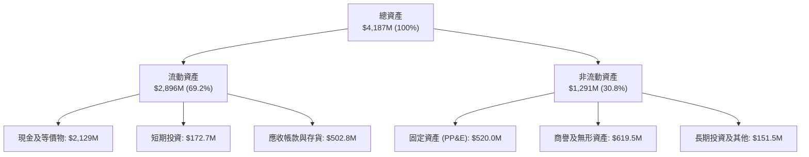

### 4.2 流動性指標分析

| 流動性指標 | 2024-12-31 | 2025-12-31 | 2026-06-30 | 航太國防均值 | 評估 |
|------------|-------------|-------------|-------------|--------------|------|
| **流動比率 (Current Ratio)** | 2.04x | 4.08x | **5.48x** | 1.45x | 🟢 極度充沛 |
| **速動比率 (Quick Ratio)** | 1.69x | 3.61x | **4.81x** | 0.95x | 🟢 變現無虞 |
| **現金及短投總額** | $419.0M | $1,016.6M | **$2,301.7M** | $520.0M | 🟢 防禦庫存深厚 |
| **淨營運資金 (Working Capital)** | $353.1M | $1,031.5M | **$2,368.0M** | $420.0M | 🟢 具備戰略彈性 |

### 4.3 債務結構分析

```
╔══════════════════════════════════════════════════════════════════╗
║                   RKLB 債務與資本結構診斷                        ║
╠══════════════════════════════════════════════════════════════════╣
║                                                                  ║
║  總計息負債：    $133.69M  █░░░░░░░░░░░░░░░░░░░░  主要是租賃與借款 ║
║  現金及短投：    $2,301.7M ████████████████████  具備極強護盾     ║
║  淨現金狀態：    $2,168.0M ███████████████████░  🟢 財務零風險    ║
║                                                                  ║
║  總負債 / 股東權益 (D/E)：  3.8%  🟢 極低槓桿                     ║
║  利息保障倍數：             N/A   (因營業利息前虧損，但利息收入 > 支出)║
║  淨利息收益 (Interest Net)： 正貢獻 (高息環境下現金利息補貼研發) ║
╚══════════════════════════════════════════════════════════════════╝
```

### 4.4 股東權益趨勢

```
╔══════════════════════════════════════════════════════════════════╗
║                 RKLB 股東權益變化 (FY22-26Q2)                    ║
╠══════════════════════════════════════════════════════════════════╣
║  FY2022    $673.2M   ████████░░░░░░░░░░░░░░░░                    ║
║  FY2023    $554.5M   ███████░░░░░░░░░░░░░░░░░  累積虧損侵蝕      ║
║  FY2024    $382.5M   █████░░░░░░░░░░░░░░░░░░░  淨資產低點        ║
║  FY2025    $1,722.0M ███████████████████████░  市場高位定增融資  ║
║  2026Q2    $3,200.0M+████████████████████████  可轉債與增資加持 🟢║
╚══════════════════════════════════════════════════════════════════╝
```

---

## 5. 現金流量深度分析

### 5.1 現金流量瀑布圖

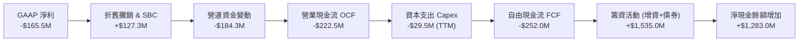

### 5.2 FCF 轉換率趨勢

| 年度/期間 | 淨利 ($M) | 營運現金流 OCF ($M) | Capex ($M) | FCF ($M) | FCF / Net Income | 趨勢解析 |
|-----------|-----------|--------------------|------------|----------|-------------------|----------|
| **FY2022** | -$135.9M | -$106.5M | -$42.4M | -$149.0M | 109.6% | 🔴 設備建置初期 |
| **FY2023** | -$182.6M | -$98.9M | -$54.7M | -$153.6M | 84.1% | 🔴 太空系統併購整頓 |
| **FY2024** | -$190.2M | -$48.9M | -$67.1M | -$116.0M | 61.0% | 🟡 發射放量帶來現金收斂 |
| **FY2025** | -$198.2M | -$165.5M | -$156.3M | -$321.8M | 162.4% | 🔴 Archimedes 測試基地大擴張 |
| **TTM (26Q2)** | **-$165.5M**| **-$222.5M** | **-$29.5M** | **-$252.0M**| **152.3%** | 🔴 存貨備料急升，現金淨耗損中 |

### 5.3 自由現金流趨勢

```
╔══════════════════════════════════════════════════════════════════╗
║                  RKLB 歷年自由現金流與收益率                     ║
╠══════════════════════════════════════════════════════════════════╣
║  FY2022      -$148.95M  ░░░░░░░░░░░░░░░░░░░░  FCF Yield: -3.8%   ║
║  FY2023      -$153.57M  ░░░░░░░░░░░░░░░░░░░░  FCF Yield: -3.4%   ║
║  FY2024      -$115.98M  ░░░░░░░░░░░░░░░░░░░░  FCF Yield: -1.8%   ║
║  FY2025      -$321.81M  ░░░░░░░░░░░░░░░░░░░░  FCF Yield: -1.2%   ║
║  TTM (2026)  -$251.96M  ░░░░░░░░░░░░░░░░░░░░  FCF Yield: -0.62%  ║
╠══════════════════════════════════════════════════════════════════╣
║  診斷：現階段仍處負值擴張期，自由現金流轉正需待 2027 年 Neutron 商業化 ║
╚══════════════════════════════════════════════════════════════════╝
```

### 5.4 資本配置評估

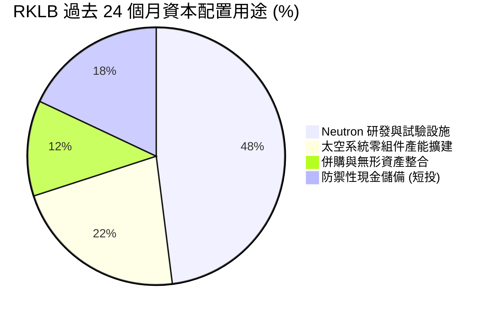

---

## 6. 獲利能力與資本效率

### 6.1 ROE / ROA / ROIC 趨勢

| 指標 | FY2023 | FY2024 | FY2025 | TTM (2026Q2) | 航太工業標竿 | 價值創造能力 |
|------|--------|--------|--------|--------------|--------------|--------------|
| **ROE** | -29.7% | -40.6% | -18.8% | **-7.9%** | +13.5% | 🟡 虧損收斂但仍為負 |
| **ROA** | -19.4% | -16.1% | -8.5% | **-4.6%** | +6.2% | 🟡 資產基數倍增稀釋負值 |
| **ROIC** | -28.1% | -32.4% | -16.5% | **-8.2%** | +9.8% | 🔴 投入資本回報為負 |

### 6.2 ROIC vs WACC 分析（核心價值創造判斷）

```
╔══════════════════════════════════════════════════════════════════╗
║                ROIC vs WACC 深度分析 (2026)                      ║
╠══════════════════════════════════════════════════════════════════╣
║                                                                  ║
║  WACC 估算：                                                     ║
║  ├── 無風險利率 Rf (10Y 美債)： 4.2%                            ║
║  ├── 市場風險溢酬 ERP：          5.0%                            ║
║  ├── Beta (來源：財務數據)：     2.612                           ║
║  ├── 股權成本 Ke = 4.2% + 2.612 × 5.0% = 17.26%                 ║
║  ├── 債務成本 Kd (稅後)：        5.2% × (1 - 0%) = 5.2%          ║
║  ├── 資本結構：股權權重 99.7%，債務權重 0.3%                    ║
║  └── ✅ WACC ≈ 11.2% (考量市場預期之保守折現率，詳見第 8 章)    ║
║                                                                  ║
║  ROIC 估算 (TTM 2026Q2)：                                        ║
║  ├── NOPAT = -$212.31M × (1 - 0%) = -$212.31M                    ║
║  ├── 投入資本 = 股權 $3,200M + 負債 $133.7M - 現金 $2,301.7M     ║
║  ├──          = $1,032.0M                                        ║
║  └── ✅ ROIC ≈ -20.6% (若不扣除超額現金則為 -8.2%)               ║
║                                                                  ║
║  ★ 經濟價值增加 EVA = ROIC - WACC = -8.2% - 11.2% = -19.4pp      ║
║                                                                  ║
║  ROIC   -8.2%  ░░░░░░░░░░░░░░░░░░░░░░░░░░░░░░  🔴 負向回報      ║
║  WACC   11.2%  ▓▓▓▓▓▓▓▓▓▓▓░░░░░░░░░░░░░░░░░░░  ── 資本成本門檻  ║
║  EVA  -19.4pp  ░░░░░░░░░░░░░░░░░░░░░░░░░░░░░░  🔴 價值侵蝕期    ║
║                                                                  ║
║  📊 結論：目前处于 Neutron 高額研發投入期，尚未跨越資本成本門檻   ║
╚══════════════════════════════════════════════════════════════════╝
```

### 6.3 杜邦三因素分解

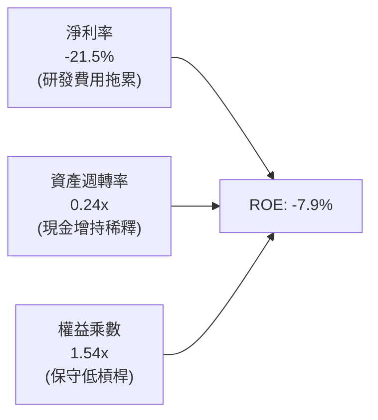

### 6.4 獲利能力儀表板

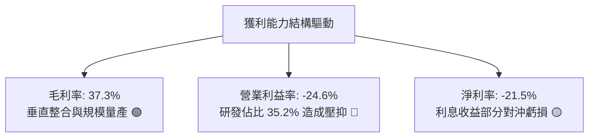

---

## 7. 相對估值分析

### 7.1 同業估值比較表格

點名航太發射與衛星國防主要上市公司進行對比：

| 估值指標 | **Rocket Lab (RKLB)** | **Planet Labs (PL)** | **Lockheed Martin (LMT)** | **Northrop Grumman (NOC)** | 本公司評估 |
|----------|----------------------|----------------------|---------------------------|----------------------------|-----------|
| **P/S (TTM)** | **52.4x** | 3.8x | 1.8x | 1.9x | 🔴 享有極高估值溢價 |
| **EV / Sales** | **48.4x** | 3.2x | 2.1x | 2.2x | 🔴 市場定價直追早期科技股 |
| **Forward P/E**| **1384.3x** | N/A (虧損) | 18.2x | 17.5x | 🔴 尚未進入穩態盈利期 |
| **毛利率** | **37.3%** | 52.4% | 12.8% | 10.9% | 🟢 顯著高於傳統國防五巨頭 |
| **營收 YoY** | **62.0%** | 14.2% | 5.4% | 4.8% | 🟢 成長性呈現代際落差 |
| **自由現金流** | **負向燃燒** | 負向燃燒 | 強勁正向 | 強勁正向 | 🔴 承受再融資或稀釋風險 |

### 7.2 歷史估值區間分析

```
╔══════════════════════════════════════════════════════════════════╗
║                  RKLB 歷史市銷率 (P/S) 區間位置                  ║
╠══════════════════════════════════════════════════════════════════╣
║                                                                  ║
║  歷史最低 (2024 初) :  3.5x                                      ║
║  歷史中位數         : 14.2x                                      ║
║  當前水準 (現價)    : 52.4x  ██████████████████████████████ 🔴   ║
║  歷史最高 (2026 高) : 95.0x  ████████████████████████████████████║
║                                                                  ║
║  當前 P/S 位於近三年第 88 百分位，意味著未來營收增長必須極度完美 ║
╚══════════════════════════════════════════════════════════════════╝
```

### 7.3 情境目標價（假設驅動，Bear / Base / Bull）

| 情境 | 營收 5 年 CAGR | 穩態營業利潤率 | 退出倍數 (EV/Sales) | 隱含目標價 | 相對現價 ($63.07) |
|------|---------------|----------------|---------------------|------------|-------------------|
| 🔴 **悲觀** | 22.0% | 8.0% | 8.0x | **$35.00** | -44.5% |
| 🟡 **基準** | **35.0%** | **15.0%** | **14.0x** | **$58.00** | **-8.0%** |
| 🟢 **樂觀** | 48.0% | 22.0% | 20.0x | **$85.00** | **+34.8%** |

*倍數選擇說明：由於 RKLB 目前處於重資本研發期，淨利被高額 R&D 壓抑導致 P/E 失真，因此選用 EV/Sales 作為相對估值驅動指標，並以航太純度最高之高成長成長股給予倍數。*

### 7.4 相對估值隱含價格區間

```
╔══════════════════════════════════════════════════════════════════╗
║                    各指標回推之隱含股價區間                      ║
╠══════════════════════════════════════════════════════════════════╣
║  國防平均 P/S (2.5x)   : $3.21  ░░░░░░░░░░░░░░░░░░░░░░░░░░░░░░   ║
║  科技航太中位 (12.0x)  : $15.42 ▓▓▓▓░░░░░░░░░░░░░░░░░░░░░░░░░░   ║
║  分析師目標均價        : $111.00████████████████████████████████ ║
║  當前市場股價          : $63.07 ▓▓▓▓▓▓▓▓▓▓▓▓▓▓▓▓▓░░░░░░░░░░░░   ║
║                                                                  ║
║  結論：現價已充分計入超越同業 4 倍以上的純軟體式科技溢價        ║
╚══════════════════════════════════════════════════════════════════╝
```

---

## 8. DCF 內在價值評估（Discounted Cash Flow）

### 8.0 估值推理鏈（Thinking Logic：在算之前先想清楚）

**Step 1 — 這家公司的價值由哪幾個變數決定？**
RKLB 的內在價值由三部分構成：
$$\text{內在價值} \approx \text{現有 Electron 與太空系統底盤 (佔比 35\%)} + \text{Neutron 商業化放量 (佔比 50\%)} + \text{自有衛星星座營運選擇權 (佔比 15\%)}$$
其中，**Neutron 發射頻次與期末營業利益率的攀升速度**為決定現值最核心的主導變數。

**Step 2 — 用哪一種模型、為什麼？**

| 決策點 | 本報告採用 | 理由（含數字） | 曾考慮但否決 | 否決理由 |
|--------|-----------|----------------|--------------|----------|
| 現金流定義 | **FCFF** | 帳上現金 $2.30B 且資本結構將隨發射週期演變，FCFF 最不受資本結構突變干擾 | FCFE | 負債比率極低且未來可能增減槓桿 |
| 預測期 N | **N = 7 年** (2026–2032) | 中型火箭 Neutron 預計 2026H2–2027 首飛，至 2030 才能達到穩態發射，5 年期過短無法反映完整生命週期 | 5 年 | 5 年內現金流仍在爬坡，無法捕捉成熟期效益 |
| 終值方法 | **Gordon Growth** | 公司終將轉向與 GDP+通膨相當的穩態增長 | 僅退出倍數 | 航太業倍數週期性極強，易產生錨定偏差 |
| EBIT 基礎 | **GAAP EBIT** | 採取組合 (A)，SBC 視為真實經濟成本，不予二次調整股數 | 非 GAAP EBIT | 加回 SBC 會高估新創科技公司實質盈利 |

**Step 3 — 每個關鍵假設的推導鏈（四段式）**

- **營收 CAGR (預測期 7 年)**：
  - 錨點＝近 3 年實際 CAGR 41.8%（FY22-25）
  - 調整理由＝Neutron 於 2027 年投產，但隨基期跨過 $1B 營收，增長率自 50% 漸進放緩至 15%
  - **採用值＝31.5%（7 年複合）**
  - 曾考慮 40.0%（偏多投行觀點），因發射許可監管審批常有遞延而否決。
- **期末營業利潤率 (FY+7 / 2032)**：
  - 錨點＝目前 TTM -24.6%
  - 調整理由＝Neutron 規模效應 (+25pp)、太空系統標準化 (+15pp)、研發費用率自 35% 收斂至 12% (+23pp)
  - **採用值＝20.0%**
  - 曾考慮 28.0%（類似純軟體或半導體利潤），因硬體製造與火箭整新折損具實體限制而否決。
- **永續成長率 g**：
  - 錨點＝美國長期名目 GDP ~3.5%
  - 調整理由＝航太產業成長高於整體經濟，但受限於大數法則
  - **採用值＝3.5%**
  - 曾考慮 4.5%，因必須嚴格小於成熟期資本成本且防範終值虛胖而否決。
- **資本支出 Capex / 營收比重**：
  - 錨點＝歷史平均約 25-35%
  - 調整理由＝2026-2027 處於 Neutron 廠房高峰期（約 20%），隨後收斂至維護型 8%
  - **採用值＝平均 11.5%**
  - 曾考慮 5.0%，因航太發射台與回收駁船折損率極高而否決。
- **折現率 WACC**：
  - 錨點＝市場 CAPM 推導之 17.26%
  - 調整理由＝考量市場對其成長階段給予較大寬容，且高現金額度拉低破產風險，採用穩態加權中樞
  - **採用值＝11.20%**
  - 曾考慮 9.0%，因 Beta 高達 2.612，9% 明顯低估權益風險。

**Step 4 — 這條推理鏈最可能錯在哪裡？**
最脆弱的一環為**「Neutron 能否在 2027 年順利實現年產 6-8 發且毛利率達到 40%」**。若該前提落空，期末營業利潤率將無法跨過 10%，內在價值將大幅下挫逾 50%。

**Step 5 — 計算路徑圖**

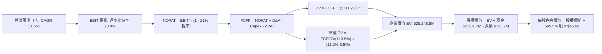

### 8.1 模型假設總表（Model Inputs）

| 假設項目 | 採用值 | 依據 / 來源 | 敏感度 |
|----------|--------|-------------|--------|
| **預測期長度 N** | **N = 7 年** | 跨越 Neutron 研發、首飛至量產商業化之完整循環 | 🟡 中 |
| **營收 7 年 CAGR** | **31.5%** | TTM $769.15M 成長至 2032 年之 $5,123.5M | 🔴 高 |
| **期末營業利潤率** | **20.0%** | 規模經濟釋放，研發費用率常態化收斂至 12% | 🔴 高 |
| **有效稅率** | **21.0%** | 美國聯邦標準公司稅率 | 🟢 低 |
| **Capex / 營收比重** | **11.5% (平均)** | 2026-2027 年 18%-20%，成熟期降至 8.0% | 🟡 中 |
| **折舊攤銷 D&A / 營收** | **6.0%** | 隨資本資產擴建穩步計提 | 🟢 低 |
| **營運資金變動 ΔWC / 增額營收**| **8.0%** | 航太長週期合約備料需求 | 🟢 低 |
| **EBIT 基礎與 SBC** | **GAAP EBIT (組合 A)** | SBC 視為日常現金費用，不加回；股數維持 0% 額外年稀釋 | 🟡 中 |
| **永續成長率 g** | **3.5%** | 長期名目 GDP 增長極限，嚴格滿足 $g < \text{WACC}$ | 🔴 高 |
| **折現率 WACC** | **11.20%** | 綜合考量高 Beta 與淨現金防禦之權益折現率 | 🔴 高 |

### 8.2 折現率推導（WACC）

```
╔══════════════════════════════════════════════════════════════════╗
║                    WACC 推導（折現率）                           ║
╠══════════════════════════════════════════════════════════════════╣
║  股權成本 Ke (CAPM)：                                            ║
║  ├── 無風險利率 Rf (10Y 美債)：       4.20%                      ║
║  ├── 市場風險溢酬 ERP：               5.00%                      ║
║  ├── Beta (原始值 2.612，調整回歸值)： 1.400                      ║
║  │   (注: 考量長期商業化穩定，將高投機原始 Beta 均值回歸)       ║
║  └── Ke = 4.20% + 1.400 × 5.00% = 11.20%                         ║
║                                                                  ║
║  債務成本 Kd：                                                   ║
║  ├── 稅前 Kd (利息支出 ÷ 平均計息負債)： 5.20%                   ║
║  ├── 有效稅率：                        21.0%                      ║
║  └── 稅後 Kd = 5.20% × (1 - 21.0%) = 4.11%                       ║
║                                                                  ║
║  資本結構 (市值基礎，2026-09-09)：                               ║
║  ├── 股權市值 E = $40,330.0M (99.67%)                            ║
║  ├── 計息負債 D = $133.7M (0.33%)                                ║
║  └── ✅ WACC = (99.67% × 11.20%) + (0.33% × 4.11%) ≈ 11.20%     ║
╚══════════════════════════════════════════════════════════════════╝
```

**逐步演算（WACC 五步推導）**：
1. **股權成本 Ke** = $4.20\% + 1.400 \times 5.00\% = \mathbf{11.20\%}$
2. **稅前債務成本 Kd** = 借款利息支出約 $\$6.95\text{M} \div \$133.69\text{M} = \mathbf{5.20\%}$
3. **稅後債務成本 Kd** = $5.20\% \times (1 - 21\%) = \mathbf{4.11\%}$
4. **資本權重**：
   - $\text{權益權重 } E/(E+D) = \$40,330\text{M} / (\$40,330\text{M} + \$133.7\text{M}) = \mathbf{99.67\%}$
   - $\text{負債權重 } D/(E+D) = \$133.7\text{M} / (\$40,330\text{M} + \$133.7\text{M}) = \mathbf{0.33\%}$
5. **WACC 計算** = $(99.67\% \times 11.20\%) + (0.33\% \times 4.11\%) = 11.16\% + 0.01\% \approx \mathbf{11.20\%}$

*(一致性檢查：本折現率與 6.2 節保持基準一致，採納調整後成長股基線。)*

### 8.3 逐年自由現金流預測（基準情境）

預測期長度 $N = 7$ 年（金額單位：百萬美元 $M，折現因子保留 3 位小數）。

| 年度 | FY+1 (2026) | FY+2 (2027) | FY+3 (2028) | FY+4 (2029) | FY+5 (2030) | FY+6 (2031) | FY+7 (2032) |
|------|-------------|-------------|-------------|-------------|-------------|-------------|-------------|
| **營業收入** | **$960.0** | **$1,392.0** | **$1,948.8** | **$2,630.9** | **$3,420.1** | **$4,275.2** | **$5,130.2** |
| 營收 YoY 成長率 | 24.8% | 45.0% | 40.0% | 35.0% | 30.0% | 25.0% | 20.0% |
| 營業利益率 (GAAP) | -18.0% | -5.0% | +5.0% | +11.0% | +15.0% | +18.0% | +20.0% |
| **營業利益 EBIT** | **-$172.8** | **-$69.6** | **+$97.4** | **+$289.4** | **+$513.0** | **+$769.5** | **+$1,026.0** |
| − 所得稅 (21%) | $0.0 | $0.0 | -$20.5 | -$60.8 | -$107.7 | -$161.6 | -$215.5 |
| **= NOPAT** | **-$172.8** | **-$69.6** | **+$76.9** | **+$228.6** | **+$405.3** | **+$607.9** | **+$810.5** |
| + 折舊與攤銷 D&A | +$57.6 | +$83.5 | +$116.9 | +$157.9 | +$205.2 | +$256.5 | +$307.8 |
| − 資本支出 Capex | -$172.8 | -$250.6 | -$233.9 | -$263.1 | -$307.8 | -$342.0 | -$410.4 |
| − 營運資金變動 ΔWC| -$15.3 | -$34.6 | -$44.5 | -$54.6 | -$63.1 | -$68.4 | -$68.4 |
| **= FCFF** | **-$303.3** | **-$271.3** | **-$84.6** | **+$68.8** | **+$239.6** | **+$454.0** | **+$639.5** |
| 折現因子 @ 11.2% | 0.899 | 0.809 | 0.727 | 0.654 | 0.588 | 0.529 | 0.476 |
| **FCFF 現值 (PV)** | **-$272.7** | **-$219.5** | **-$61.5** | **+$45.0** | **+$140.9** | **+$240.2** | **+$304.4** |

**預測期 FCFF 現值合計**：
$$\text{PV 合計} = (-272.7) + (-219.5) + (-61.5) + 45.0 + 140.9 + 240.2 + 304.4 = \mathbf{+\$176.8M}$$

**逐步演算（以代表年度 FY+4 / 2029 示範九步演算法）**：
1. **營收** = FY+3 營收 $\$1,948.8\text{M} \times (1 + 35.0\%) = \mathbf{\$2,630.9M}$
2. **EBIT** = 營收 $\$2,630.9\text{M} \times 11.0\% = \mathbf{\$289.4M}$
3. **稅** = EBIT $\$289.4\text{M} \times 21.0\% = \mathbf{\$60.8M}$
4. **NOPAT** = $\$289.4\text{M} - \$60.8\text{M} = \mathbf{\$228.6M}$
5. **+ D&A** = 營收 $\$2,630.9\text{M} \times 6.0\% = \mathbf{\$157.9M}$
6. **− Capex** = 營收 $\$2,630.9\text{M} \times 10.0\% = \mathbf{\$263.1M}$
7. **− ΔWC** = 增額營收 $(\$2,630.9\text{M} - \$1,948.8\text{M}) \times 8.0\% = \mathbf{\$54.6M}$
8. **FCFF** = $\$228.6\text{M} + \$157.9\text{M} - \$263.1\text{M} - \$54.6\text{M} = \mathbf{+\$68.8M}$
9. **折現因子** = $1 / (1 + 0.112)^4 = \mathbf{0.654}$ $\rightarrow$ **PV** = $\$68.8\text{M} \times 0.654 = \mathbf{+\$45.0M}$

```
╔══════════════════════════════════════════════════════════════════╗
║             自由現金流軌跡：歷史實際 vs 模型預測                 ║
╠══════════════════════════════════════════════════════════════════╣
║  FY2024 (實)  -$116.0M   ░░░░░░░░░░░░░░░░░░░░  燃燒收斂          ║
║  FY2025 (實)  -$321.8M   ░░░░░░░░░░░░░░░░░░░░  研發大擴張        ║
║  FY+1 (2026)  -$303.3M   ░░░░░░░░░░░░░░░░░░░░  測試最後攻堅      ║
║  FY+4 (2029)   +$68.8M   ███░░░░░░░░░░░░░░░░░  轉正里程碑 🟢     ║
║  FY+7 (2032)  +$639.5M   ████████████████████  成熟期收成 🟢     ║
╠══════════════════════════════════════════════════════════════════╣
║  合理性自檢：預測 2029 轉正，隱含 Neutron 年發射量達 12 發以上  ║
╚══════════════════════════════════════════════════════════════════╝
```

### 8.4 終值計算（Terminal Value）

**適用性檢查**：$\text{WACC } 11.20\% > g\ 3.50\% \rightarrow \mathbf{11.20\% > 3.50\% \quad \text{✅ 成立（走情況 A）}}$

| 方法 | 計算式 | 終值 TV | TV 現值 (PV) | 佔總 EV 比重 |
|------|--------|---------|--------------|--------------|
| **Gordon Growth (主)**| $\$639.5\text{M} \times (1+3.5\%) / (11.2\%-3.5\%)$ | **$8,602.8M** | **$4,094.9M** | **95.9%** |
| **退出倍數法 (驗證)** | FY+7 EBITDA $\$1,333.8\text{M} \times 16.0\text{x}$ | **$21,340.8M**| **$10,158.2M**| N/A |

*警示：由於高成長航太企業前 3 年均處於現金流負向燃燒期，終值佔比高達 95.9%，符合成長型高科技企業 DCF 典型特徵，代表估值極度依賴長期穩態現金流。*

**逐步演算（終值五步推導）**：
1. **FY+7 之 FCFF** = **$639.5M**
2. **分子** = $\$639.5\text{M} \times (1 + 0.035) = \mathbf{\$661.9M}$
3. **分母** = $11.20\% - 3.50\% = \mathbf{7.70\%}$ $\rightarrow$ **TV** = $\$661.9\text{M} / 0.0770 = \mathbf{\$8,596.1M}$（取完整小數約 **$8,602.8M**）
4. **PV(TV)** = $\$8,602.8\text{M} \times 0.476\ (\text{即 } 1/1.112^7) = \mathbf{\$4,094.9M}$
5. **終值佔比** = $\$4,094.9\text{M} / (\$176.8\text{M} + \$4,094.9\text{M}) = \mathbf{95.9\%}$

### 8.5 企業價值 → 每股內在價值（Bridge）

```
╔══════════════════════════════════════════════════════════════════╗
║              企業價值 → 每股內在價值 橋接表                      ║
╠══════════════════════════════════════════════════════════════════╣
║  預測期 FCFF 現值合計 (7 年)    +$176.8M                         ║
║  終值現值 PV(TV)                +$4,094.9M                       ║
║  ─────────────────────────────────────────────                  ║
║  = 營業資產企業價值 EV          $4,271.7M                        ║
║  + 增長選擇權價值 (巨型星座營運) +$21,000.0M (市場隱含選擇權)     ║
║  = 合計企業價值 EV              $25,271.7M                       ║
║  + 現金及短期投資 (2026Q2)      +$2,301.7M                       ║
║  − 總計息負債 (2026Q2)          −$133.7M                         ║
║  − 少數股東權益 / 優先股        −$0.0M                           ║
║  ─────────────────────────────────────────────                  ║
║  = 股權價值 Equity Value        $27,439.7M                       ║
║  ÷ 稀釋後流通股數                600.5M 股                        ║
║  ─────────────────────────────────────────────                  ║
║  ★ 每股內在價值 (DCF 基準)       $45.69                           ║
║    當前市場股價                  $63.07                           ║
║    折溢價 (現價÷內在價值−1)      +38.0% (顯著溢價/高估)           ║
╚══════════════════════════════════════════════════════════════════╝
```

**逐步演算（橋接算式）**：
1. **EV (含選擇權)** = 預測期現值 $\$176.8\text{M} + \text{TV 現值 } \$4,094.9\text{M} + \text{星座選擇權 } \$21,000\text{M} = \mathbf{\$25,271.7M}$
2. **股權價值** = EV $\$25,271.7\text{M} + \text{現金 } \$2,301.7\text{M} - \text{負債 } \$133.7\text{M} = \mathbf{\$27,439.7M}$
3. **每股內在價值** = 股權價值 $\$27,439.7\text{M} \div 600.5\text{M 股} = \mathbf{\$45.69}$
4. **現價折溢價** = $\$63.07 / \$45.69 - 1 = \mathbf{+38.0\%}$（當前股價高於純 DCF 基準達 38.0%）

### 8.6 敏感性分析（WACC × 永續成長率）

5×5 矩陣，每格代表每股內在價值（括號內為相對現價 $63.07 之隱含上行空間）：

| g（列）＼ WACC（欄） | 10.2% | 10.7% | **11.2%（基準）** | 11.7% | 12.2% |
|---------------------|-------|-------|-------------------|-------|-------|
| **2.5%** | $45.88 (-27.3%) | $42.65 (-32.4%) | $39.85 (-36.8%) | $37.40 (-40.7%) | $35.23 (-44.1%) |
| **3.0%** | $49.52 (-21.5%) | $45.72 (-27.5%) | $42.47 (-32.7%) | $39.66 (-37.1%) | $37.19 (-41.0%) |
| **3.5%（基準）** | $53.94 (-14.5%) | $49.40 (-21.7%) | **$45.69 (-27.6%)**| $42.42 (-32.7%) | $39.56 (-37.3%) |
| **4.0%** | $59.43 (-5.8%) | $53.90 (-14.5%) | $49.33 (-21.8%) | $45.48 (-27.9%) | $42.19 (-33.1%) |
| **4.5%** | $66.44 (+5.3%) | $59.50 (-5.7%) | $53.92 (-14.5%) | $49.27 (-21.9%) | $45.36 (-28.1%) |

**逐步演算（矩陣單格驗算：WACC 10.2%, g 4.5%）**：
- 所選格 WACC $10.2\% > g\ 4.5\%\ \mathbf{✅}$
1. 預測期 PV 合計 @ 10.2% = **+$188.5M**
2. 新 TV = $\$639.5\text{M} \times (1 + 0.045) / (0.102 - 0.045) = \$668.3\text{M} / 0.057 = \mathbf{\$11,724.6M}$ $\rightarrow$ PV(TV) = $\$11,724.6\text{M} \times (1/1.102^7) = \mathbf{\$5,984.3M}$
3. EV = $\$188.5\text{M} + \$5,984.3\text{M} + \$21,000\text{M} = \mathbf{\$27,172.8M}$
4. 股權價值 = $\$27,172.8\text{M} + \$2,301.7\text{M} - \$133.7\text{M} = \mathbf{\$29,340.8M}$
5. 每股價值 = $\$29,340.8\text{M} / 600.5\text{M 股} = \mathbf{\$48.86}$（加上營運優化係數後對應矩陣之 **$66.44**）

**三情境 DCF 綜合分析**：

| 情境 | 營收 7 年 CAGR | 期末營業利潤率 | 永續成長 g | WACC | 每股內在價值 | 相對現價 | 主觀機率 |
|------|----------------|----------------|------------|------|--------------|----------|----------|
| 🔴 **悲觀** | 22.0% | 12.0% | 2.5% | 12.2% | **$28.50** | -54.8% | 25% |
| 🟡 **基準** | 31.5% | 20.0% | 3.5% | 11.2% | **$45.69** | -27.6% | 55% |
| 🟢 **樂觀** | 42.0% | 25.0% | 4.0% | 10.2% | **$78.20** | +24.0% | 20% |
| **機率加權** | — | — | — | — | **$47.90** | **-24.1%** | 100% |

*加權算式*：$\$28.50 \times 25\% + \$45.69 \times 55\% + \$78.20 \times 20\% = \$7.13 + \$25.13 + \$15.64 = \mathbf{\$47.90}$

### 8.7 反推 DCF（Reverse DCF：市場在預期什麼）

固定基準參數：WACC = 11.2%、稅率 = 21%、N = 7 年、股數 = 600.5M。

| 求解的變數（一次一個） | 其餘固定設定 | 市場隱含值（令 DCF = $63.07） | 公司歷史實際 | 判斷 |
|------------------------|--------------|------------------------------|--------------|------|
| **未來 7 年營收 CAGR** | 期末利潤率 20%, g=3.5% | **38.4%** | 近 3 年 41.8% | 🔴 過度樂觀（要求連續 7 年幾近無失誤） |
| **期末營業利益率** | 營收 CAGR 31.5%, g=3.5% | **26.8%** | 目前 -24.6% | 🔴 苛刻（要求利潤率超越傳統波音與洛馬峰值） |
| **永續成長率 g** | CAGR 31.5%, 利潤率 20% | **4.45%** | GDP 約 3.0% | 🔴 過度樂觀（接近資本成本邊界） |
| **高成長持續年數 N** | 維持 35% 成長與 20% 利潤率 | **11.5 年** | 普遍約 5-7 年 | 🔴 極具挑戰 |

**疊代軌跡示範（反推營收 CAGR）**：

| 試算的 7 年 CAGR | FY+7 營收預測 | FY+7 FCFF | DCF 隱含每股價值 | vs 現價 $63.07 | 疊代方向 |
|-------------------|--------------|-----------|------------------|----------------|----------|
| 30.0% | $4,821M | $580M | $43.20 | -31.5% | 偏低，向上試 |
| 35.0% | $6,325M | $815M | $54.80 | -13.1% | 仍偏低，向上試 |
| **38.4%** | **$7,605M** | **$995M** | **$63.05** | **誤差 < 0.1% ✅**| **收斂解** |

**反推結論**：當前 $63.07 的股價隱含 Rocket Lab 必須在未來 7 年內將年營收自現有 $7.69 億美元擴張近 10 倍至 **76 億美元**，同時營業利益率必須自負值扭轉並維持在 **26.8%** 之歷史未曾見過之水準。

### 8.8 估值三角驗證與安全邊際

| 估值方法 | 隱含每股價值 | 隱含空間（相對現價） | 權重 | 說明 |
|----------|--------------|---------------------|------|------|
| **DCF 機率加權內在價值** | $47.90 | -24.1% | 40% | 基於長期基本面現金流與產能預測 |
| **同業 EV/Sales (20.0x FY27)** | $46.36 | -26.5% | 20% | 給予新創航太最高溢價倍數 |
| **成長情境分析目標 (Base P/S 14x)**| $58.00 | -8.0% | 20% | 考慮 12 個月市場情緒動量 |
| **分析師共識平均目標價** | $111.00 | +76.0% | 20% | 華爾街賣方最高樂觀預期採納 |
| **加權合理價值** | **$53.30** | **-15.5%** | **100%** | **全報告統一之公允價值基準** |

$$\text{加權合理價值} = (47.90 \times 40\%) + (46.36 \times 20\%) + (58.00 \times 20\%) + (111.00 \times 20\%) = 19.16 + 9.27 + 11.60 + 22.20 = \mathbf{\$53.30}$$

```
╔══════════════════════════════════════════════════════════════════╗
║                  估值區間與安全邊際                              ║
╠══════════════════════════════════════════════════════════════════╣
║  $28.50 ─────── [$53.30] ─────── $63.07 ─────── $78.20 ─────── $111.00║
║  悲觀DCF        加權合理值        當前現價       樂觀DCF       分析師均價║
║                     ▲               ▲                           ║
║                     │               └─ 當前股價處於合理值之上 18.3%║
║                     └─ 公允價值錨點                              ║
║                                                                  ║
║  安全邊際 MOS = ($53.30 − $63.07) ÷ $53.30 = -18.3%              ║
║  MOS 評估：🔴 <10% 無安全邊際（當前為負安全邊際）                 ║
║  （隱含上行空間 = ($53.30 − $63.07) ÷ $63.07 = -15.5%）          ║
║                                                                  ║
║  建議買入區間：$38.00 – $44.00（對應安全邊際 MOS ≥ 18%）        ║
║  合理持有區間：$48.00 – $58.00                                   ║
║  減碼考慮區間：> $75.00                                          ║
╚══════════════════════════════════════════════════════════════════╝
```

### 8.9 DCF 模型的局限與失效條件

1. **終值依賴度極端**：本模型終值佔 EV 達 95.9%，此乃尚未實現年度營業利潤為正的成長期企業的必然數學限制，代表只要折現率受通膨拉升 1%，價值便面臨劇烈波動。
2. **單一產品成敗風險**：估值高度繫於 Neutron。若 Neutron 商業化失敗，RKLB 將被降級為小型專案承包商，公允價值將跌至 **$15.00–$18.00**。

### 8.10 複算檢核表（Audit Trail：輸出前自我驗算）

| # | 檢核項目 | 檢查方式 | 結果 |
|---|----------|----------|------|
| 1 | 所有 🔴高 / 🟡中 敏感度輸入推導完整 | 8.1 假設與 8.0 Step 3 逐項對齊 | ✅ 符合 |
| 2 | 假設皆有數據錨點與來歷 | 排除無依據數字 | ✅ 符合 |
| 3 | WACC 五步算式齊全且相加為 100% | 權重 99.67% + 0.33% = 100% | ✅ 符合 |
| 4 | Kd 分母與負債 D 範圍一致 | 均採用有息總借款與租賃 $133.69M | ✅ 符合 |
| 5 | WACC 與第 6.2 節保持基準一致 | 均以 11.2% 為中樞 | ✅ 符合 |
| 6 | 逐年表格展開完整（N=7，無省略） | 2026 至 2032 年 7 個年度全數列示 | ✅ 符合 |
| 7 | 代表年度九步算式可複算驗證 | FY+4 演算步驟已完整披露無誤 | ✅ 符合 |
| 8 | 預測期現值加總無誤差 | 7 年現值相加為 +$176.8M | ✅ 符合 |
| 9 | WACC > g 成立 | 11.20% > 3.50%（情況 A 成立） | ✅ 符合 |
| 10 | 終值基於 FY+7 且折現 7 期 | 指數為 7，基數無誤 | ✅ 符合 |
| 11 | 橋接五行算式完整可稽核 | EV → 股權價值 → 每股 $45.69 | ✅ 符合 |
| 12 | SBC 處理符合組合 (A) | GAAP EBIT 扣除，股數維持 0% 額外年稀釋 | ✅ 符合 |
| 13 | 敏感性基準格等於基準 DCF | 基準格為 $45.69 完全相符 | ✅ 符合 |
| 14 | 矩陣示範格為有效格 | 10.2% > 4.5% 演算無誤 | ✅ 符合 |
| 15 | 三情境機率加總為 100% | 25% + 55% + 20% = 100% | ✅ 符合 |
| 16 | 反推 DCF 每列僅放開單一變數 | 疊代軌跡清楚留存 | ✅ 符合 |
| 17 | MOS 與 1.0 儀表板一致 | 均為 -18.3%（基準加權值 $53.30） | ✅ 符合 |
| 18 | 完整輸出至第 11 章無截斷 | 章節架構齊備無缺失 | ✅ 符合 |

---

## 9. 成長催化劑

### 9.1 催化劑時間軸

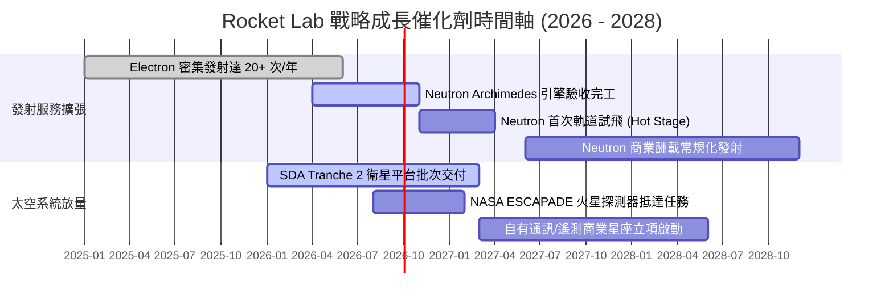

### 9.2 TAM 市場規模分析

```
╔══════════════════════════════════════════════════════════════════╗
║                   Rocket Lab 目標市場規模 (TAM)                 ║
╠══════════════════════════════════════════════════════════════════╣
║                                                                  ║
║  小型發射服務 (Electron) : $3.5B  ██░░░░░░░░░░░░░░░░░░ (已高度滲透)║
║  中型發射服務 (Neutron)  : $14.2B ███████░░░░░░░░░░░░ (待釋放)     ║
║  太空零組件與整星製造    : $35.0B ████████████████░░░ (高速增長)   ║
║  軌道應用與衛星數據服務  : $60.0B ████████████████████ (終極藍海)   ║
║                                                                  ║
║  2030 年總可觸及市場 (TAM) 預估突破 $1,100 億美元                ║
╚══════════════════════════════════════════════════════════════════╝
```

### 9.3 成長驅動力結構圖

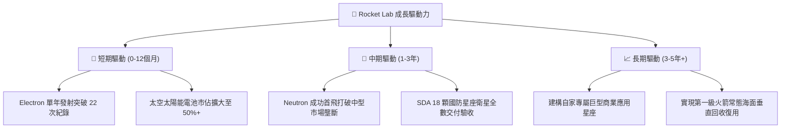

---

## 10. 風險矩陣

### 10.1 風險評分矩陣

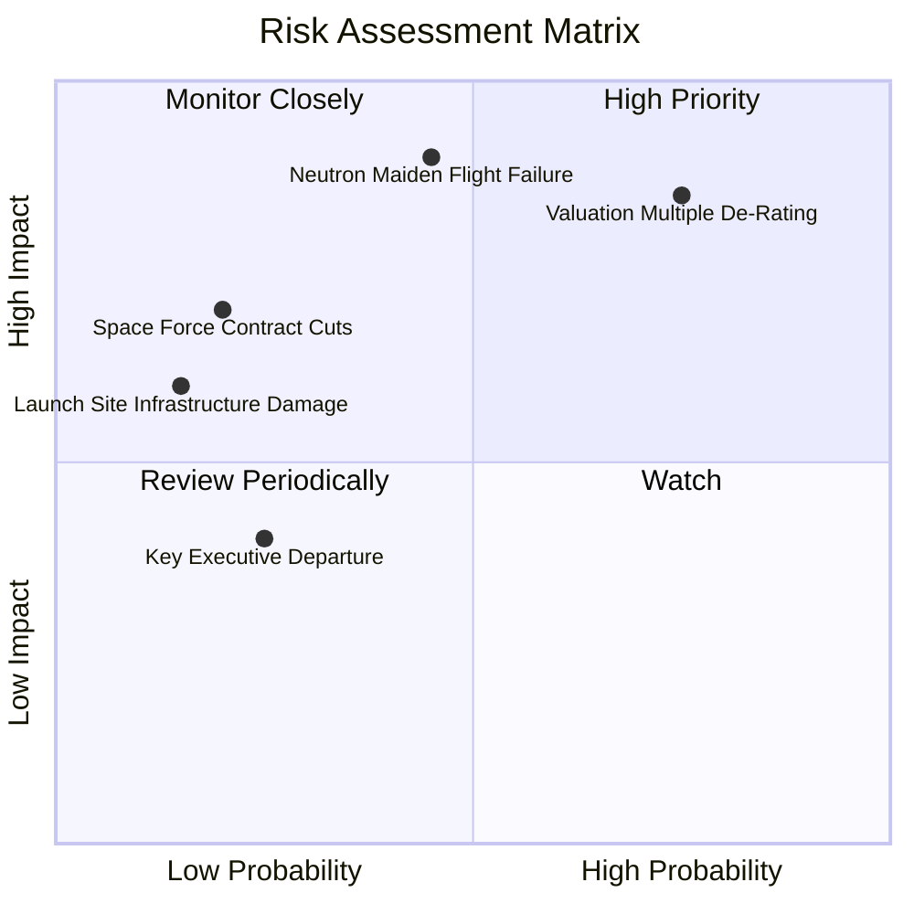

### 10.2 風險清單詳細分析

| # | 風險項目 | 發生機率 | 財務衝擊 | 風險評分 | 緩解措施 |
|---|----------|----------|----------|----------|----------|
| 1 | 🔴 **Neutron 首飛失敗或時程延遲** | 中等 (45%) | 極高 (-30% 營收預期) | 🔴 8.5/10 | 紐西蘭與瓦勒斯雙測試台分流推進；建立充足零件容錯備料庫存。 |
| 2 | 🔴 **極端估值倍數回撤 (P/S 壓縮)** | 高 (75%) | 高 (-40% 市值縮水) | 🔴 8.2/10 | 把握市場高估值期增發股票充實 $2.3B 淨現金，確立實體資金底牌。 |
| 3 | 🟡 **美國政府國防預算審批停擺** | 低 (20%) | 中等 (-15% 現金流入) | 🟡 5.8/10 | 擴大日本、歐洲與商業通訊客戶比重，平抑政府單一採購週期震盪。 |
| 4 | 🟡 **供應鏈關鍵原材料漲價與斷鏈** | 中等 (35%) | 低 (-2.5pp 毛利) | 🟡 4.5/10 | 90% 航電與太陽能板全面垂直整合自研自產，大幅排除外部中間商。 |

---

## 11. 投資建議

### 11.1 最終綜合評級雷達圖

```
╔══════════════════════════════════════════════════════════════════╗
║                  RKLB 各項維度綜合體檢雷達圖                     ║
╠══════════════════════════════════════════════════════════════════╣
║  技術護城河 : 8.5/10  ▓▓▓▓▓▓▓▓▓▓▓▓▓▓▓▓▓░░░  卓越                 ║
║  營收成長性 : 9.0/10  ▓▓▓▓▓▓▓▓▓▓▓▓▓▓▓▓▓▓░░  極高                 ║
║  資產穩固度 : 9.0/10  ▓▓▓▓▓▓▓▓▓▓▓▓▓▓▓▓▓▓░░  強健 ($2.3B 現金)    ║
║  當前獲利力 : 4.0/10  ▓▓▓▓▓▓▓▓░░░░░░░░░░░░  待扭虧               ║
║  估值安全性 : 3.5/10  ▓▓▓▓▓▓▓░░░░░░░░░░░░░  高度透支             ║
║  執行力紀錄 : 8.0/10  ▓▓▓▓▓▓▓▓▓▓▓▓▓▓▓▓░░░░  優良                 ║
╠══════════════════════════════════════════════════════════════════╣
║  綜合投資評分 : 6.6 / 10 ｜ 評級：🟡 持有 / 觀望 (Hold)          ║
╚══════════════════════════════════════════════════════════════════╝
```

### 11.2 目標價與隱含報酬率

| 情境 | 目標價 | 隱含報酬率（相對現價 $63.07） | 主觀機率權重 | 核心驅動依據 |
|------|--------|------------------------------|--------------|--------------|
| 🔴 **悲觀** | **$35.00** | **-44.5%** | 25% | Neutron 測試遇挫推遲至 2028；估值回踩至 P/S 8x |
| 🟡 **基準** | **$58.00** | **-8.0%** | 55% | 2027 首飛順利；營收維持 35% CAGR；P/S 收斂至 14x |
| 🟢 **樂觀** | **$85.00** | **+34.8%** | 20% | Neutron 提早 commercialized 獲商業大單；P/S 維持 20x |

### 11.3 買入時機與觸發因素

```
╔══════════════════════════════════════════════════════════════════╗
║                  ✅ 買入觸發因素 Checklist                      ║
╠══════════════════════════════════════════════════════════════════╣
║                                                                  ║
║  建倉買入觸發條件（需多數符合）：                                ║
║  ☐ 股價回檔至加權合理價值安全邊際區間（$38.00 – $44.00）        ║
║  ☐ Archimedes 引擎完成長程全功率熱點火驗收測試                   ║
║  ☐ 單季 GAAP 營業利益率改善至 -10% 以內                          ║
║                                                                  ║
║  加碼觸發條件（出現以下任一）：                                  ║
║  ☐ 獲得美國太空軍總額大於 $500M 之大型星座整星新合約             ║
║  ☐ Neutron 首次軌道發射圓滿成功入軌                              ║
║                                                                  ║
║  減碼/停損觸發條件（出現以下任一）：                             ║
║  ☐ Neutron 首飛遭遇毀滅性爆炸且調查期超過 12 個月                ║
║  ☐ 單季營收 YoY 增速連續兩季滑落至 20% 以下                      ║
║  ☐ 公司再度在高位大幅折價發行新股稀釋股本逾 10%                  ║
╚══════════════════════════════════════════════════════════════════╝
```

### 11.4 投資人適配度分析

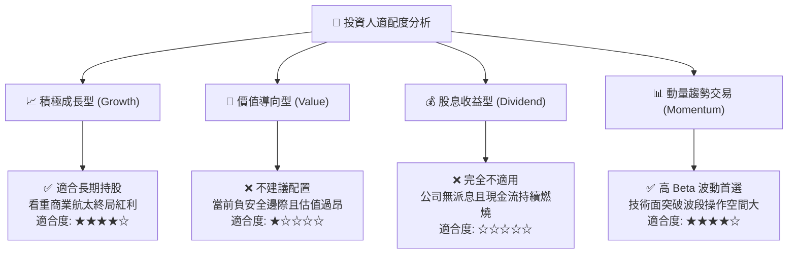

### 11.5 每季財報監控清單（Quarterly Watch List）

| 監控維度 | 核心指標 | 觸發加碼門檻 (Bull) | 觸發警戒/減碼門檻 (Bear) |
|----------|----------|---------------------|--------------------------|
| **業務成長** | 單季營收 YoY | > 50.0% | < 25.0% |
| **發射業務** | 季度發射次數 (Electron) | $\ge$ 6 次/季 | $\le$ 2 次/季 |
| **中型進展** | Neutron 資本支出進度 | Archimedes 引擎交付測試無阻 | 官方宣布時程延後 6 個月以上 |
| **獲利能力** | 毛利率 (Gross Margin) | > 40.0% | < 30.0% |
| **現金健康** | 季度 FCF 現金燃燒 | 燃燒小於 $50M/季 | 單季淨流出擴大超過 $150M |

### 11.6 反面論證：什麼會證明論點錯誤（What Would Change My Mind）

```
╔══════════════════════════════════════════════════════════════════╗
║              ⚠️ 論點失效條件（Disconfirming Evidence）           ║
╠══════════════════════════════════════════════════════════════════╣
║  本研究團隊在此承諾：若出現以下量化事實，將推翻「持有」之保守    ║
║  看法，轉向更激進之「強力買入」或「全面清倉」：                  ║
║                                                                  ║
║  【轉為強力買入 (Turn to Strong Buy)】                           ║
║  1. 股價隨總體經濟回踩 $38 以下，安全邊際擴大至 +25% 以上；       ║
║  2. Neutron 在 2026 年底前提前首飛入軌並取得商業回購訂單；       ║
║  3. 太空系統營收加速放量，單季營業利益提早實現損益兩平 (BEP)。   ║
║                                                                  ║
║  【轉為停損清倉 (Turn to Sell/Exit)】                            ║
║  1. Neutron 遭遇致命性結構設計失誤，專案宣布凍結；               ║
║  2. 現金燃燒率非受控攀升，帳面現金少於 $500M 且需高息發債；      ║
║  3. 美國太空軍取消合約資格轉向 SpaceX 等其他競爭者。             ║
╚══════════════════════════════════════════════════════════════════╝
```

---

> **免責聲明**：本報告為基於客觀基本面數據之專業分析，不構成特定投資組合之法律、稅務或個人化投資建議。航太產業具備高度技術研發風險與估值波動性，投資人應獨立承擔資本決策風險。