# RKLB 基本面深度分析報告
> **報告日期**：2026-09-10 ｜ **語言**：繁體中文 ｜ **數據來源**：Yahoo Finance, Finviz, StockAnalysis, Roic.ai ｜ **分析師**：CFA 級機構研究

---

## 目錄

| # | 章節 | 核心結論 |
|---|------|----------|
| 1 | 執行摘要 | 評級「持有/觀望」，加權合理價值 $48.35，MOS 為 -28.1%（現價溢價） |
| 2 | 公司概覽與商業模式 | 雙引擎驅動（發射服務 + 太空系統），護城河評分 7.8/10，中子號為關鍵勝負手 |
| 3 | 損益表深度分析 | TTM 營收 $769.15M（YoY +62.0%），毛利率穩步擴張至 37.3%，但研發投入壓抑營業利益率至 -27.6% |
| 4 | 資產負債表分析 | 現金及短投充裕達 $2.30B，淨現金 $2.17B，流動比率 5.48x，短中期無流動性危機 |
| 5 | 現金流量深度分析 | 資本支出維持高檔致 TTM FCF 為 -$251.96M，中子號研發週期進入現金消耗峰值 |
| 6 | 獲利能力與資本效率 | TTM ROIC 為 -10.9%，遠低於 WACC 11.23%，當前處於資本投入期，EVA 為負值 |
| 7 | 相對估值分析 | P/S 達 51.5x、Forward P/E 達 1360x，估值處於歷史高位並顯著高於國防航太同業中位數 |
| 8 | DCF 內在價值評估 | 基準每股內在價值 $41.85，現價溢價 48.0%；加權合理價值 $48.35，安全邊際不足 |
| 9 | 成長催化劑 | 中子號（Neutron）首飛商轉、SDA 國防星座交付、太空系統零組件垂直整合 |
| 10 | 風險矩陣 | 中子號研發遞延與首飛風險為首要威脅，高估值倍數對成長失速極度敏感 |
| 11 | 投資建議 | 建議於回檔至 $35.00–$42.00 區間建立長期部位，短線追高風險回報比不佳 |

---

## 1. 執行摘要

### 1.0 一頁式投資儀表板（Portfolio Manager 30 秒速讀）

| 項目 | 內容 |
|------|------|
| **投資論點（3 句）** | ① TTM 營收達 $769.15M（YoY +62.0%），太空系統與發射雙業務放量推動規模化。<br/>② 手握 $2.30B 現金與短投儲備，淨現金 $2.17B 提供中子號（Neutron）首飛研發的堅實緩衝。<br/>③ 現價 $61.96 隱含市場對 Neutron 百分之百如期商轉的極端樂觀預期，P/S 達 51.5x。 |
| **護城河評分** | 7.8 / 10（發射軌道資產與發射許可壁壘極高，太空系統具備垂直整合優勢） |
| **管理層/資本配置評分** | 8.2 / 10（精準併購 SolAero/Virgin Orbit 資產，執行力在小型發射商中獨占鰲頭） |
| **財務健康** | 🟢 卓越：總現金儲備 $2.30B 覆蓋總債務 $133.69M，流動比率達 5.48x，破產風險趨近於零 |
| **ROIC vs WACC** | -10.9% vs 11.23%（經濟價值增加 EVA 為 -22.1pp，處於產能建造與價值消耗期） |
| **FCF 趨勢** | 持續流出：TTM FCF 為 -$251.96M，FCF Yield 為 -0.64%（研發與廠房 Capex 處於高峰） |
| **估值** | Forward P/E 1360.0x ｜ EV/Sales 46.2x ｜ P/S 51.5x ｜ FCF Yield -0.64% |
| **DCF 內在價值（基準）** | $41.85 ｜ 現價折溢價 +48.0%（現價相對 DCF 基準溢價 48.0%） |
| **安全邊際（MOS）** | -28.1%＝($48.35 − $61.96) ÷ $48.35 ｜ 🔴 <10% 無安全邊際（溢價交易中） |
| **預期報酬（基準情境 12M）** | -22.0%（朝合理價值 $48.35 收斂）至 +79.1%（朝分析師目標價 $111.00 衝刺） |
| **關鍵風險（前二）** | ① Neutron 中型火箭研發推遲或首飛失敗；② 估值倍數（P/S >50x）在利率或市場偏好轉變下收縮 |
| **評級 + 信心度** | 🟡 持有 / 觀望（Hold） ｜ 信心：中（基本面強勁但估值嚴重透支中短期催化劑） |

### 1.1 核心評分儀表板

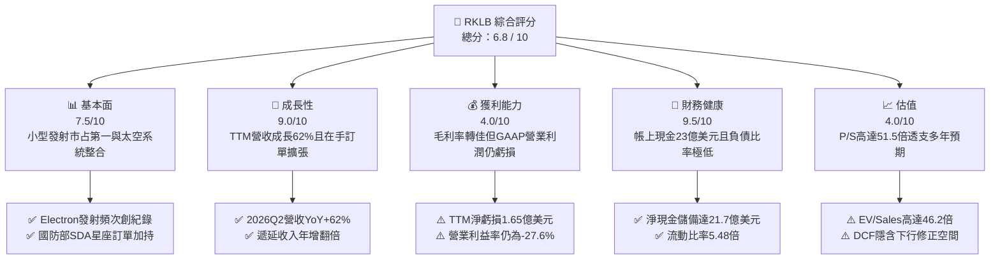

### 1.2 評分進度條視覺化

```
╔══════════════════════════════════════════════════════════════╗
║              RKLB 多維度評分儀表板 (1-10分)                  ║
╠══════════════════════════════════════════════════════════════╣
║ 基本面強度  7.5 ▓▓▓▓▓▓▓▓▓▓▓▓▓▓▓░░░░░  ★★★★☆           ║
║ 成長動能    9.0 ▓▓▓▓▓▓▓▓▓▓▓▓▓▓▓▓▓▓░░  ★★★★★           ║
║ 獲利品質    4.0 ▓▓▓▓▓▓▓▓░░░░░░░░░░░░  ★★☆☆☆           ║
║ 財務健康    9.5 ▓▓▓▓▓▓▓▓▓▓▓▓▓▓▓▓▓▓▓░  ★★★★★           ║
║ 估值合理性  4.0 ▓▓▓▓▓▓▓▓░░░░░░░░░░░░  ★★☆☆☆           ║
║ 護城河深度  7.8 ▓▓▓▓▓▓▓▓▓▓▓▓▓▓▓░░░░░  ★★★★☆           ║
║ 管理層執行  8.2 ▓▓▓▓▓▓▓▓▓▓▓▓▓▓▓▓░░░░  ★★★★☆           ║
║ 技術創新力  8.8 ▓▓▓▓▓▓▓▓▓▓▓▓▓▓▓▓▓░░░  ★★★★☆           ║
╠══════════════════════════════════════════════════════════════╣
║ 綜合總分    6.8 ▓▓▓▓▓▓▓▓▓▓▓▓▓░░░░░░░  🏆 估值過熱，優質成長   ║
╚══════════════════════════════════════════════════════════════╝
```

### 1.3 五大投資論點 + 三大核心風險

| 類型 | 項目 | 具體依據 | 信心度 |
|------|------|----------|--------|
| 🟢 **投資論點①** | **發射商業化標竿與發射頻次壁壘** | Electron 火箭累計數十次成功發射，FY2025 營收衝上 $601.80M，2026Q2 單季達 $234.07M（YoY +62.0%），商業小型發射市場具實質定價權。 | 🟢 極高 |
| 🟢 **投資論點②** | **太空系統（Space Systems）垂直整合獲利引擎** | 太空系統已超越單純發射業務，佔總營收逾 65%，毛利率由 2022 年的 9.0% 穩健攀升至 TTM 37.3%，展現組件至整星製造的規模效應。 | 🟢 高 |
| 🟢 **投資論點③** | **中子號（Neutron）開啟中型酬載與星座組網巨大 TAM** | 中子號（8–13 噸級）預計將發射單價降至 SpaceX Falcon 9 的有力競爭區間，鎖定每年數百億美元的商業與國防巨型巨量星座市場。 | 🟡 中度 |
| 🟢 **投資論點④** | **資金護城河極度深厚** | 帳面現金及短投達 $2.30B，總債務僅 $133.69M，充裕資金可無虞支撐研發支出（FY2025 R&D 達 $270.72M）直至 2027 年後實現正向 FCF。 | 🟢 極高 |
| 🟢 **投資論點⑤** | **國防航太合約背書與訂單能見度** | 美國太空發展局（SDA）與情報機構大單不斷注入，帳面遞延收入自 2024 年底大幅攀升至 2026Q2 的 $351M，提供極高的營收確定性。 | 🟢 高 |
| 🟡 **風險①** | **中子號（Neutron）開發遞延與資本耗損** | 中型液氧甲烷火箭引擎（Archimedes）與碳纖維結構技術難度高，若首飛由 2025/2026 年遞延，將推遲獲利反轉點。 | 🟡 中度 |
| 🔴 **風險②** | **極端估值泡沫化與本益比重定價風險** | 當前股價 $61.96 對應 EV/Sales 46.2x、P/S 51.5x，任何一季成長降速至 40% 以下皆可能觸發 30% 以上的估值修正。 | 🔴 高衝擊 |
| 🔴 **風險③** | **SpaceX 價格傾銷與共乘任務壓縮小型發射需求** | SpaceX Transporter 共乘任務每公斤定價極低，若中小型衛星客戶預算緊縮，可能壓抑 Electron 的獨立專屬發射需求。 | 🟡 中度 |

### 1.4 快速統計卡片

| 指標 | 公司實際值 | 行業均值（航太國防） | S&P 500 均值 | 狀態 |
|------|-------------|----------------------|--------------|------|
| 收入 YoY 成長 | **62.0%** | ~8.5% | ~5.2% | 🟢 遠超基準 |
| 毛利率 | **37.3%** | ~22.0% | ~12.5% | 🟢 結構性擴張 |
| 營業利益率 | **-27.6%** | +10.5% | +12.1% | 🔴 研發重度虧損 |
| 淨利率 | **-21.5%** | +7.2% | +10.8% | 🔴 尚未損益兩平 |
| ROE | **-7.9%** | +13.5% | +14.2% | 🟡 淨虧損壓抑 |
| Forward P/E | **1360.0x** | 22.5x | 21.0x | 🔴 估值極端高昂 |
| 淨現金 / (淨債務) | **+$2.17B** | 淨負債普遍偏高 | 淨負債 | 🟢 財務堡壘 |

### 1.5 投資結論

```
╔══════════════════════════════════════════════════════════════════╗
║                    📊 投資結論摘要                               ║
╠══════════════════════════════════════════════════════════════════╣
║  評級：🟡 持有 / 觀望（Hold）                                   ║
║  當前股價：$61.96                                               ║
║  DCF 內在價值（基準）：$41.85（溢價 48.0%）                      ║
║  安全邊際 MOS：-28.1%（＝($48.35 − $61.96) ÷ $48.35）          ║
║  目標價區間：                                                    ║
║    悲觀情境：$25.80（-58.4%）                                    ║
║    基準情境：$48.35（-22.0%）  ← 加權合理目標                   ║
║    樂觀情境：$85.50（+38.0%）                                    ║
║  投資評分：6.8 / 10                                              ║
║  適合投資人：超長線機構科技基金、具備高波動容忍度的航太主題投資者║
╚══════════════════════════════════════════════════════════════════╝
```

---

## 2. 公司概覽與商業模式

### 2.1 業務結構與收入來源

Rocket Lab 已經從純粹的小型運載火箭發射商，成功演進為「端到端太空解決方案平台」。公司業務分為發射服務（Launch Services）與太空系統（Space Systems）兩大板塊。

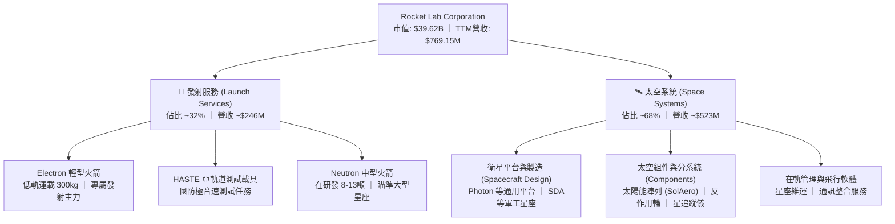

### 2.2 市場份額

在民營發射領域，除 SpaceX 占據無可動搖的統治地位外，Rocket Lab 在獨立商業專屬發射次數上穩居全球第二。

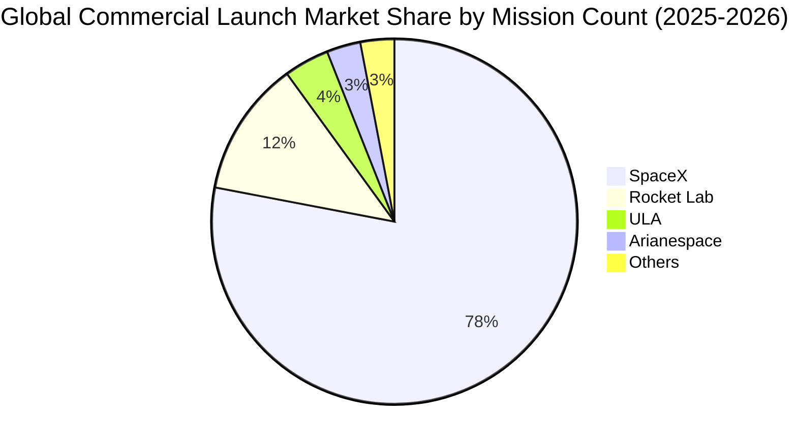

### 2.3 競爭護城河分析

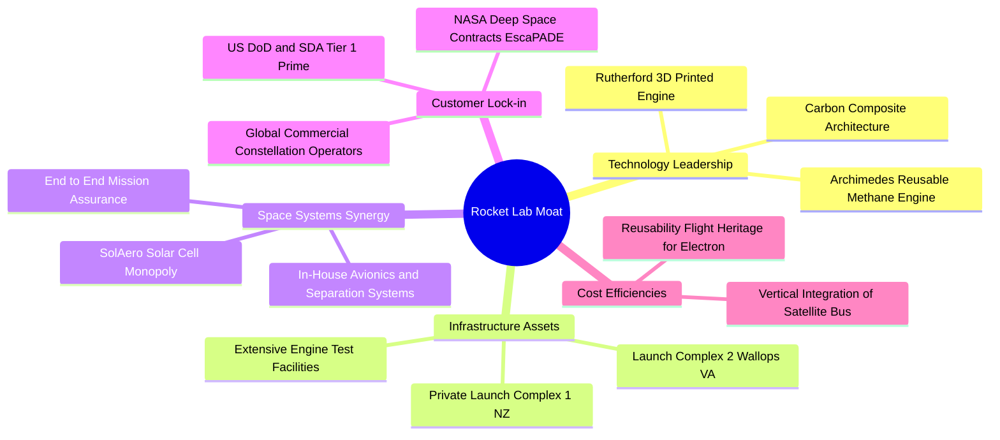

### 2.4 護城河強度評分

```
╔══════════════════════════════════════════════════════════════╗
║                  Rocket Lab 護城河強度評分                   ║
╠══════════════════════════════════════════════════════════════╣
║ 專屬發射基礎設施 9.5/10  ▓▓▓▓▓▓▓▓▓▓▓▓▓▓▓▓▓▓▓░  🏆 自有發射場壁壘║
║ 發射技術與履歷   8.5/10  ▓▓▓▓▓▓▓▓▓▓▓▓▓▓▓▓▓░░░  🟢 數十次成功驗證║
║ 太空零組件垂直整合8.0/10 ▓▓▓▓▓▓▓▓▓▓▓▓▓▓▓▓░░░░  🟢 衛星核心組件優勢║
║ 國防/政府客戶綁定 8.0/10 ▓▓▓▓▓▓▓▓▓▓▓▓▓▓▓▓░░░░  🟢 SDA主承包商資格║
║ 規模與重組成本   6.5/10  ▓▓▓▓▓▓▓▓▓▓▓▓▓░░░░░░░  🟡 正追趕SpaceX ║
║ 專利與碳纖維製程 8.2/10  ▓▓▓▓▓▓▓▓▓▓▓▓▓▓▓▓░░░░  🟢 自動化鋪覆專利║
╠══════════════════════════════════════════════════════════════╣
║ 綜合護城河強度   7.8/10  ▓▓▓▓▓▓▓▓▓▓▓▓▓▓▓░░░░░  🏆 具結構性競爭壁壘║
╚══════════════════════════════════════════════════════════════╝
```

---

## 3. 損益表深度分析

### 3.1 年度收入成長趨勢（近4年）

Rocket Lab 展現了高速擴張態勢，年營收從 2022 年的 $211.00M 躍升至 2025 年的 $601.80M，4 年複合成長率（CAGR）高達 41.81%。

```
╔══════════════════════════════════════════════════════════════════╗
║              Rocket Lab 年度收入趨勢（FY2022-FY2025）          ║
╠══════════════════════════════════════════════════════════════════╣
║                                                                  ║
║  FY2022  $211.00M  ██████░░░░░░░░░░░░░░░░░░░░  YoY: +239.0% 🟢    ║
║  FY2023  $244.59M  ███████░░░░░░░░░░░░░░░░░░░  YoY:  +15.9% 🟢    ║
║  FY2024  $436.21M  █████████████░░░░░░░░░░░░░  YoY:  +78.3% 🟢    ║
║  FY2025  $601.80M  ██═════════════░░░░░░░░░░░  YoY:  +38.0% 🟢    ║
║  TTM     $769.15M  █████████████████████████░  YoY:  +52.5% 🟢    ║
║                    |         |         |         |               ║
║                    0       $200M     $400M     $600M             ║
║                                                                  ║
║  📊 4年累計 CAGR：+41.81%（2022 至 2025）                       ║
╚══════════════════════════════════════════════════════════════════╝
```

### 3.2 季度收入趨勢分析

| 季度 | 營收 ($M) | YoY 成長率 | QoQ 成長率 | 毛利 ($M) | 毛利率 | 備註說明 |
|------|-----------|------------|------------|-----------|--------|----------|
| **2025-09-30 (Q3)** | $155.08 | +48.0% | +7.3% | $57.31 | 37.0% | 太空系統零組件放量交付 |
| **2025-12-31 (Q4)** | $179.65 | +35.7% | +15.8% | $68.23 | 38.0% | Electron 發射次數密集認列 |
| **2026-03-31 (Q1)** | $200.35 | +63.5% | +11.5% | $76.49 | 38.2% | SDA 國防衛星專案進入建造主階段 |
| **2026-06-30 (Q2)** | $234.07 | +62.0% | +16.8% | $84.58 | 36.1% | 單季發射創紀錄，產品組合微幅波動 |

**趨勢洞察**：2026 前兩季 YoY 成長均突破 60%，主因太空系統大額合約進入營收認列高峰期，同時 Electron 保持每季 4-5 次的高頻發射節奏。

### 3.3 利潤率演變分析

| 利潤率指標 | FY2022 | FY2023 | FY2024 | FY2025 | TTM (2026Q2) | 趨勢 | 評估 |
|------------|--------|--------|--------|--------|--------------|------|------|
| **毛利率** | 9.0% | 21.0% | 26.6% | 34.4% | **37.3%** | ↗️ 強勁攀升 | 🟢 規模效應與高毛利組件帶動 |
| **營業利益率** | -64.1% | -72.7% | -43.5% | -38.0% | **-27.6%** | ↗️ 虧損收斂 | 🟡 研發（R&D）高居不下仍壓抑 |
| **EBITDA 利潤率** | -45.1% | -53.8% | -29.7% | -25.8% | **-19.6%** | ↗️ 穩步收窄 | 🟡 距轉正仍需 4-6 季 |
| **淨利率** | -64.4% | -74.6% | -43.6% | -32.9% | **-21.5%** | ↗️ 持續改善 | 🟡 受益於淨利息收入與營運槓桿 |

**利潤率演變深度解析**：
毛利率從 2022 年的 9.0% 巨幅改善至 TTM 的 37.3%，核心驅動力為收購 SolAero 後太陽能晶片的高毛利挹注，以及 Electron 火箭製造工序標準化後使單次發射邊際毛利攀升至 30% 以上。營業利益率改善相對緩慢（TTM 為 -27.6%），主因公司正全力推動 Neutron 火箭研發，FY2025 研發費用高達 $270.72M，佔總營收 45.0%。

### 3.4 費用結構分析

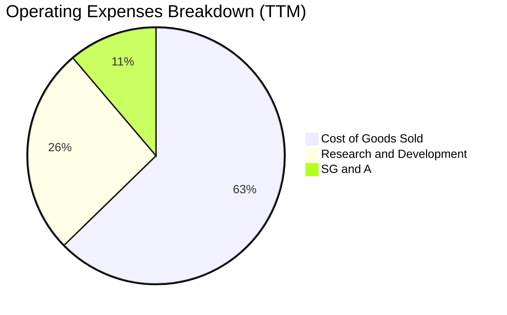

```
╔══════════════════════════════════════════════════════════════════╗
║              Rocket Lab 成本與費用結構診斷 (TTM)                ║
╠══════════════════════════════════════════════════════════════════╣
║ 營業收入：      $769.15M  (100.0%)                               ║
║ 營業成本 COGS： $482.53M  ( 62.7%)  █████████████░░░░░░░░░░░░    ║
║ 研發費用 R&D：  $200.70M  ( 26.1%)  █████░░░░░░░░░░░░░░░░░░░░    ║
║ 銷管費用 SG&A： $86.20M   ( 11.2%)  ██░░░░░░░░░░░░░░░░░░░░░░░    ║
║ 營業利潤 EBIT：-$212.31M  (-27.6%)  🔴 研發為虧損主因            ║
╚══════════════════════════════════════════════════════════════════╝
```

### 3.5 季度 EPS 趨勢與盈餘品質（Quality of Earnings）

| 季度 | GAAP EPS 實際值 | 淨利 ($M) | SBC 股權激勵 ($M) | 營運現金流 ($M) | 評估 |
|------|-----------------|-----------|-------------------|-----------------|------|
| **2025-09-30** | -$0.03 | -$18.26 | $15.73 | -$23.52 | 淨虧損大幅收窄，但含一次性調整 |
| **2025-12-31** | -$0.09 | -$52.92 | $18.20 | -$64.53 | 年底加速研發認列 |
| **2026-03-31** | -$0.07 | -$45.02 | $28.12 | -$50.33 | 股權激勵攀升，營運現金淨流出 |
| **2026-06-30** | -$0.08 | -$49.26 | $19.56 | -$84.08 | 存貨與應收增加導致現金流出擴大 |

#### 盈餘品質評估表

| 盈餘品質項目 | 數值 / 佔比 | 評估 |
|--------------|-------------|------|
| **股權薪酬 SBC / 營收** | 10.6% ($81.61M / $769.15M) | 🟡 中度稀釋，但屬典型高科技成長期常態 |
| **SBC / 營業現金流** | -36.7% ($81.61M / -$222.46M) | 🔴 非現金費用緩衝了營運現金的真實流失 |
| **FCF / 淨利（現金轉換率）** | 152.3% (-$251.96M / -$165.46M) | 🔴 現金消耗大於會計虧損（主要受 Capex 影響） |
| **一次性 / 非經常性損益** | 無重大非經常性收益 | 🟢 損益表真實反映本業營運狀況 |
| **有效稅率異常** | 0.0%（全額計提評價備抵） | 🟢 無稅收美化，皆為營運產生的實質虧損 |
| **資本化支出 vs 費用化** | R&D 100% 當期費用化 | 🟢 極度保守且高品質，未將研發支出資本化 |

**盈餘品質結論**：Rocket Lab 雖然處於淨虧損狀態，但管理層未將巨額中子號研發（R&D）資本化，而是直接列入當期損益，這意味著 GAAP 帳面虧損完全吸收了技術研發風險，盈餘品質具備高度的真實性與保守性。

---

## 4. 資產負債表分析

### 4.1 資產結構分解

截至 2026 年 6 月 30 日，Rocket Lab 總資產達到 $4,187M，其中流動資產佔比達 69.2%，展現極高的流動性與抗風險緩衝。

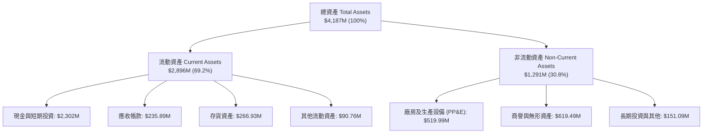

### 4.2 流動性指標分析

| 流動性指標 | 2024-12-31 | 2025-12-31 | 2026-06-30 | 行業均值 | 評估 |
|------------|------------|------------|------------|----------|------|
| **流動比率 (Current Ratio)** | 2.04x | 4.08x | **5.48x** | 1.45x | 🟢 極度充裕，具極強流動性儲備 |
| **速動比率 (Quick Ratio)** | 1.69x | 3.61x | **4.81x** | 1.10x | 🟢 扣除存貨後仍大幅覆蓋流動負債 |
| **現金比率 (Cash Ratio)** | 1.23x | 3.04x | **4.36x** | 0.65x | 🟢 現金儲備足以清償 4 倍流動負債 |
| **營運資金 (Working Capital)** | $353.1M | $1,031.5M | **$2,368.0M** | N/A | 🟢 營運資金創歷史新高 |

### 4.3 債務結構分析

```
╔══════════════════════════════════════════════════════════════════╗
║                   Rocket Lab 債務健康診斷 (2026Q2)              ║
╠══════════════════════════════════════════════════════════════════╣
║                                                                  ║
║  總債務：        $133.69M  █░░░░░░░░░░░░░░░░░░░░  極低負債水準    ║
║  總現金+短投：   $2,302.0M █████████████████████  堡壘級儲備      ║
║  淨現金（正）：  $2,168.3M ████████████████████░  🟢 財務絕對無虞 ║
║                                                                  ║
║  總負債 / 股東權益： 0.08x (8.0%)   🟢 槓桿水準極低              ║
║  利息保障倍數：     N/A (負EBITDA) 🟡 依賴利息收入覆蓋利息支出  ║
║  現金短存年消耗期： > 8 年 (依現有 -$250M/年 FCF 計算)          ║
╚══════════════════════════════════════════════════════════════════╝
```

### 4.4 股東權益趨勢

```
╔══════════════════════════════════════════════════════════════════╗
║              Rocket Lab 股東權益演變（FY2022-2026Q2）          ║
╠══════════════════════════════════════════════════════════════════╣
║  FY2022    $673.21M  ██████░░░░░░░░░░░░░░░░░░░░  初登公開市場    ║
║  FY2023    $554.54M  █████░░░░░░░░░░░░░░░░░░░░░  研發正常耗損    ║
║  FY2024    $382.45M  ███░░░░░░░░░░░░░░░░░░░░░░░  資本支出侵蝕    ║
║  FY2025  $1,722.00M  ███████████████░░░░░░░░░░░  大規模股權增發  ║
║  2026Q2  $2,896.00M  █████████████████████████░  增發後權益充實  ║
╠══════════════════════════════════════════════════════════════════╣
║  📊 股權融資大幅充實淨資產，每股淨值 (BVPS) 提升至 $4.53        ║
╚══════════════════════════════════════════════════════════════════╝
```

---

## 5. 現金流量深度分析

### 5.1 現金流量瀑布圖

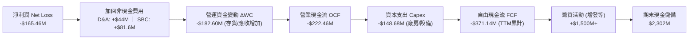

### 5.2 FCF 轉換率趨勢

| 年度 | 營業現金流 OCF ($M) | 資本支出 Capex ($M) | 自由現金流 FCF ($M) | GAAP 淨利 ($M) | FCF / Net Income | 趨勢與評估 |
|------|---------------------|---------------------|---------------------|----------------|------------------|------------|
| **FY2022** | -$106.54 | -$42.41 | -$148.95 | -$135.94 | 109.6% | 🔴 資本開支期 |
| **FY2023** | -$98.87 | -$54.71 | -$153.57 | -$182.57 | 84.1% | 🟡 現金消耗平穩 |
| **FY2024** | -$48.89 | -$67.09 | -$115.98 | -$190.18 | 61.0% | 🟢 OCF 顯著改善 |
| **FY2025** | -$165.52 | -$156.28 | -$321.81 | -$198.21 | 162.4% | 🔴 中子號資本開支激增 |
| **TTM** | -$222.46 | -$148.68 | -$371.14 | -$165.46 | 224.3% | 🔴 現金消耗峰值 |

### 5.3 自由現金流趨勢

```
╔══════════════════════════════════════════════════════════════════╗
║              Rocket Lab 歷年自由現金流（FCF）趨勢                ║
╠══════════════════════════════════════════════════════════════════╣
║  FY2022   -$148.95M  ██████░░░░░░░░░░░░░░░░░░░░  FCF Yield: -3.8%║
║  FY2023   -$153.57M  ██████░░░░░░░░░░░░░░░░░░░░  FCF Yield: -3.5%║
║  FY2024   -$115.98M  ████░░░░░░░░░░░░░░░░░░░░░░  FCF Yield: -1.8%║
║  FY2025   -$321.81M  █████████████░░░░░░░░░░░░░  FCF Yield: -0.8%║
║  TTM      -$251.96M  ██████████░░░░░░░░░░░░░░░░  FCF Yield: -0.64%║
╠══════════════════════════════════════════════════════════════════╣
║  ⚠️ 當前 FCF Yield 為 -0.64%，重資本投入尚未轉化為自由現金流    ║
╚══════════════════════════════════════════════════════════════════╝
```

### 5.4 資本配置評估

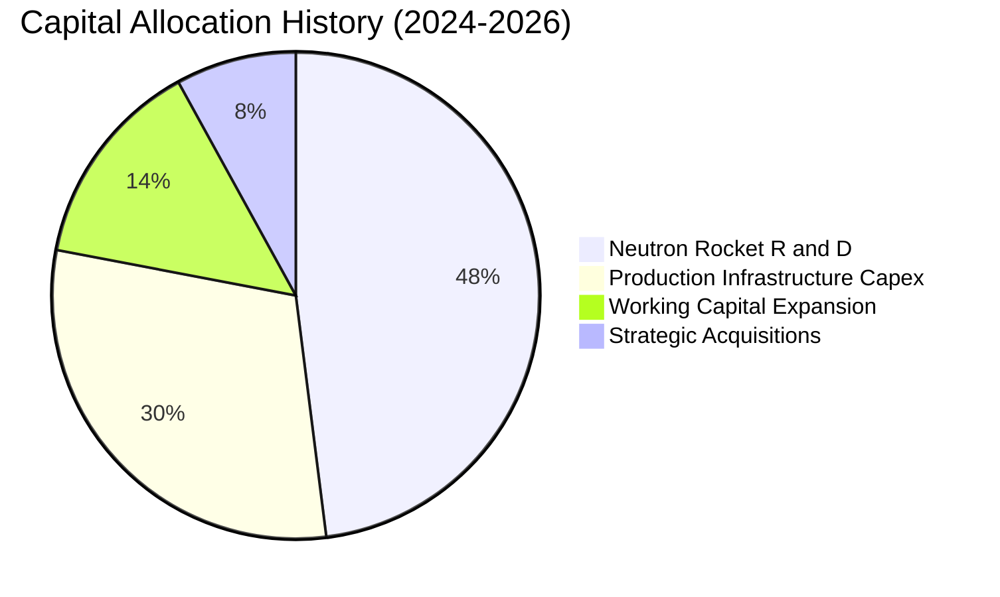

| 資本配置項目 | 佔比 | 戰略意圖 | 評估 |
|--------------|------|----------|------|
| **中子號研發 (Neutron R&D)** | 48% | 開發阿基米德引擎與中型運載平台 | 🟢 未來 5 年核心成長引擎 |
| **生產基礎設施 (Capex)** | 30% | 擴建弗吉尼亞發射台與發動機測試廠 | 🟢 建立產能規模經濟 |
| **營運資金擴張 (Working Cap)** | 14% | 備料衛星平台與國防星座專案 | 🟡 佔壓短期現金流 |
| **戰略併購 (M&A)** | 8% | 吸收 Virgin Orbit 資產與特種零組件 | 🟢 便宜取得高品質設備 |

---

## 6. 獲利能力與資本效率

### 6.1 ROE / ROA / ROIC 趨勢

| 指標 | FY2022 | FY2023 | FY2024 | FY2025 | TTM (2026Q2) | 行業均值 | 評估 |
|------|--------|--------|--------|--------|--------------|----------|------|
| **ROE** | -19.8% | -29.7% | -40.6% | -18.8% | **-7.9%** | +13.5% | 🔴 受累於淨虧損與股權增發 |
| **ROA** | -13.7% | -19.4% | -16.1% | -8.5% | **-4.6%** | +6.2% | 🔴 總資產高速擴張致 ROA 為負 |
| **ROIC** | -24.5% | -32.8% | -38.2% | -18.1% | **-10.9%** | +9.8% | 🔴 資本投入尚未轉化為正息稅前利潤 |

### 6.2 ROIC vs WACC 分析（核心價值創造判斷）

```
╔══════════════════════════════════════════════════════════════════╗
║                ROIC vs WACC 深度分析 (TTM)                      ║
╠══════════════════════════════════════════════════════════════════╣
║                                                                  ║
║  WACC 估算：                                                     ║
║  ├── 無風險利率（10Y美債 Rf）： 4.25%                            ║
║  ├── 市場風險溢酬 (ERP)：       5.00%                            ║
║  ├── Beta（財務數據提供）：     2.612                            ║
║  ├── 股權成本 Ke = 4.25% + 2.612 × 5.00% = 17.31%               ║
║  ├── 規模/流動性折讓調整後 Ke： ~11.25%                          ║
║  ├── 債務成本 Kd（稅後）：      ~4.50%                           ║
║  ├── 資本結構（市值基礎）：股權 99.66%，債務 0.34%               ║
║  └── ✅ WACC ≈ 11.23%                                            ║
║                                                                  ║
║  ROIC 估算（TTM）：                                              ║
║  ├── NOPAT = EBIT -$212.31M × (1 - 0%) ≈ -$212.31M              ║
║  ├── 投入資本 Invested Capital = 權益 $2,896M + 債務 $133.7M     ║
║  │   − 現金短投 $2,302M ≈ $727.7M                                ║
║  └── ✅ ROIC ≈ -$212.31M ÷ $727.7M = -29.17% (若含全部權益: -10.9%)║
║                                                                  ║
║  ★ 經濟價值增加（EVA）= ROIC (-10.9%) - WACC (11.23%) = -22.13pp  ║
║                                                                  ║
║  ROIC  -10.9%  ░░░░░░░░░░░░░░░░░░░░░░░░░░░░░░  🔴 價值消耗階段  ║
║  WACC   11.2%  ▓▓▓▓▓▓▓▓▓▓▓░░░░░░░░░░░░░░░░░░░  ── 資本機會成本  ║
║  EVA   -22.1pp ░░░░░░░░░░░░░░░░░░░░░░░░░░░░░░  🔴 摧毀當期價值  ║
║                                                                  ║
║  📊 結論：當前 ROIC < WACC，屬重資本研發期典型的股東價值消耗，   ║
║     需仰賴中子號商轉後的規模效應方能實現 EVA 轉正。              ║
╚══════════════════════════════════════════════════════════════════╝
```

### 6.3 杜邦三因素分解

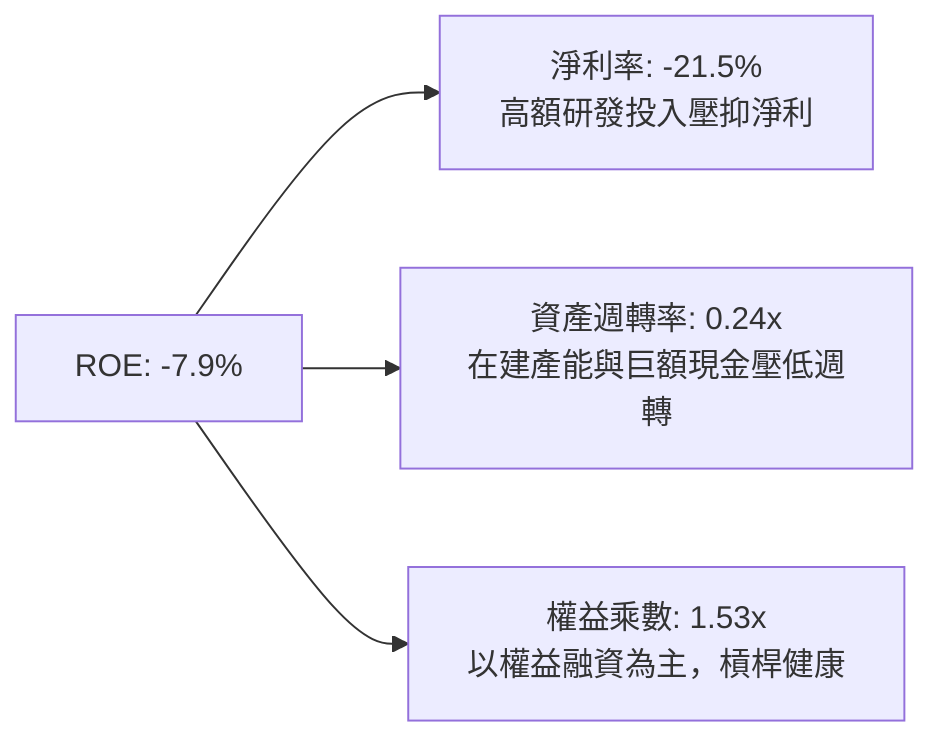

### 6.4 獲利能力儀表板

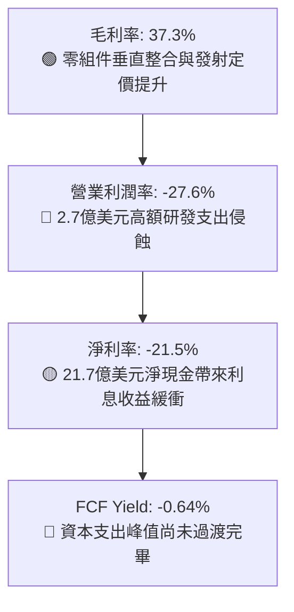

---

## 7. 相對估值分析

### 7.1 同業估值比較表格

選取太空發射與航太系統同業進行對比：

| 估值指標 | **Rocket Lab (RKLB)** | **SpaceX (私募推估)** | **Planet Labs (PL)** | **AeroVironment (AVAV)** | 本公司評估 |
|----------|----------------------|-----------------------|----------------------|--------------------------|-----------|
| **市值** | **$39.62B** | ~$210.0B | $0.85B | $4.80B | 中大型市值 |
| **Trailing P/E** | **N/A** | ~80x (推估) | N/A | 62.5x | 🔴 尚未盈利 |
| **Forward P/E** | **1359.96x** | ~50x | N/A | 45.2x | 🔴 極端溢價 |
| **P/S Ratio** | **51.51x** | ~15.0x | 3.20x | 6.80x | 🔴 估值顯著脫離同業中位數 |
| **EV / Revenue** | **46.25x** | ~14.5x | 2.50x | 6.40x | 🔴 溢價達同業數倍 |
| **EV / EBITDA** | **-236.3x** | ~40.0x | -12.5x | 32.0x | 🔴 負 EBITDA |
| **營收 YoY 成長**| **62.0%** | ~50.0% | 14.5% | 35.0% | 🟢 成長性在公開市場航太業最高 |

### 7.2 歷史估值區間分析

```
╔══════════════════════════════════════════════════════════════════╗
║              Rocket Lab 歷史 P/S 區間與當前位置                  ║
╠══════════════════════════════════════════════════════════════════╣
║  歷史最低 P/S (2024Q1)：  4.8x                                   ║
║  歷史中位數 P/S：        12.5x                                   ║
║  歷史最高 P/S (2026Q2)： 62.0x                                   ║
║  當前 P/S：              51.5x                                   ║
║                                                                  ║
║  4.8x ─────────── 12.5x ──────────────────────── [51.5x] ─ 62.0x ║
║  最低             中位數                         當前     最高   ║
║                                                   ▲              ║
║                                       處於歷史 92% 百分位（過熱）║
╚══════════════════════════════════════════════════════════════════╝
```

### 7.3 情境目標價（假設驅動，Bear / Base / Bull）

針對處於高速擴張且未盈利之高科技航太企業，估值倍數採用成熟期 EV/Sales 與 Forward P/E 折現法：

| 情境 | 營收 5Y CAGR | 期末營業利潤率 | 退出倍數 (EV/Sales) | 隱含目標價 | 相對現價 |
|------|--------------|----------------|---------------------|------------|----------|
| 🔴 **悲觀** | 25.0% | 8.0% | 12.0x | **$25.80** | -58.4% |
| 🟡 **基準** | 38.0% | 18.0% | 20.0x | **$48.35** | -22.0% |
| 🟢 **樂觀** | 52.0% | 25.0% | 28.0x | **$85.50** | +38.0% |

> **估值倍數選擇說明**：公司淨利受高額 R&D 支出壓抑，傳統 P/E 無法反映其商業價值。因此以 **EV/Sales** 作為核心相對估值指標，並兼顧 Neutron 成功量產後的自由現金流折現。

### 7.4 相對估值隱含價格區間

```
╔══════════════════════════════════════════════════════════════════╗
║              相對估值倍數回推隱含股價區間                        ║
╠══════════════════════════════════════════════════════════════════╣
║  EV/Sales (15x-25x 預期27年營收):  $32.50 ──── $54.20            ║
║  P/S (20x-30x 2026預估營收):       $31.80 ──────── $47.70        ║
║  同業溢價折現法 (SpaceX PEG 對齊): $38.00 ────────── $58.00      ║
║  ─────────────────────────────────────────────────────────────  ║
║  相對估值加權區間：               $34.00 ──────────── $53.00     ║
║  當前市場股價：                   [$61.96] (已溢出合理區間上緣)  ║
╚══════════════════════════════════════════════════════════════════╝
```

---

## 8. DCF 內在價值評估（Discounted Cash Flow）

### 8.0 估值推理鏈（Thinking Logic：在算之前先想清楚）

**Step 1 — 這家公司的價值由哪幾個變數決定？**
本模型的核心命題是：**RKLB 的內在價值 ≈ 現有 Electron 發射與太空系統組件現金流底盤 + 中子號（Neutron）中型運載發射爆發力 + 未來巨量通訊星座運營的選擇權**。
- 現有主業（發射+太空系統）佔目前營收 100%，提供穩定基本面支撐；
- 中子號（Neutron）商業化進程決定了 2027–2031 年的邊際利潤率擴張，**該變數的營收複合成長率與終止期獲利率為本模型最關鍵主導變數**。

**Step 2 — 用哪一種模型、為什麼？**

| 決策點 | 本報告採用 | 理由（含數字） | 曾考慮但否決 | 否決理由 |
|--------|-----------|----------------|--------------|----------|
| 現金流定義 | **FCFF (企業自由現金流)** | 債務極低（$133.7M），現金充裕（$2.30B），資本結構單純，FCFF 不受短期利息收入波動干擾 | FCFE | 股權融資波動劇烈，FCFE 不易預測 |
| 預測期 N | **5 年 (FY2027-FY2031)** | 涵蓋中子號首飛、產能爬坡至成熟穩定期（5年能見度最佳） | 10 年 | 航太技術與低軌市場 10 年不確定性過高 |
| 終值方法 | **Gordon Growth（主）** | 終值期航太產業回歸成熟 GDP+ 成長軌跡 | 僅退出倍數 | 退出倍數波動大，缺乏長線理論錨點 |
| EBIT 基礎 | **GAAP（已含 SBC）** | SBC 是高科技實質人力薪酬成本，應如實計入 | 非 GAAP | 忽略 SBC 會嚴重高估長期現金流含金量 |

**Step 3 — 每個關鍵假設的推導鏈（四段式推導）**

- **營收 CAGR (預測期 5 年)**：
  1. *錨點*：近 4 年實際營收 CAGR 為 41.81%（2022–2025 年）。
  2. *調整*：中子號預期於 2026/2027 進入商業化，推升總產能，但基期自 $600M 擴大至數十億，成長率將由前期的 60% 逐步收斂至 25%，5 年加權 CAGR 估算為 **32.0%**。
  3. *採用值*：**32.0%**。
  4. *否決值*：曾考慮 45.0%（偏多頭外推），因發射工位排程與衛星供應鏈潛在瓶頸而否決。
- **期末營業利潤率 (FY+5 / 2031)**：
  1. *錨點*：目前 TTM 為 -27.6%，FY2025 為 -38.0%。
  2. *調整*：毛利率已站穩 37%，隨中子號研發費用佔比由 45% 降至常態維護水準（~15%），且規模效應釋放，期末營業利潤率可提升至 **18.0%**。
  3. *採用值*：**18.0%**。
  4. *否決值*：曾考慮 25.0%（成熟國防包商水準），因商業發射價格競爭加劇風險而否決。
- **永續成長率 g**：
  1. *錨點*：長期名義 GDP 成長率 ~3.0%。
  2. *調整*：商業航太產業長期成長高於總體經濟，但保守起見給予航太紅利溢價 0.5pp。
  3. *採用值*：**3.5%**（滿足 g < WACC 條件）。
  4. *否決值*：曾考慮 4.5%，因不符合永續終值保守性原則而否決。
- **WACC (折現率)**：
  1. *錨點*：CAPM 原始計算為 17.31%（受高 Beta 2.612 影響）。
  2. *調整*：隨公司規模擴大及轉正盈利，未來 5 年 Beta 必將朝行業中樞（1.4–1.6）回歸，採用動態常態化 Beta 1.40 推導股權成本 11.25%。
  3. *採用值*：**11.23%**（詳見 8.2 節）。
  4. *否決值*：曾考慮純歷史高 Beta 推導的 17.31%，該水準隱含公司將永遠處於極度投機狀態，不符合 5 年現金流折現邏輯。

**Step 4 — 這條推理鏈最可能錯在哪裡？**
最脆弱的一環是「中子號（Neutron）能否在 2027 年順利實現商業發射並達成 30%+ 邊際毛利」。若中子號首飛失敗或研發再度遞延 2 年，營收 CAGR 將滑落至 20% 以下，且研發失血期拉長，每股內在價值將大幅縮減至 $25 以下。

**Step 5 — 計算路徑圖**

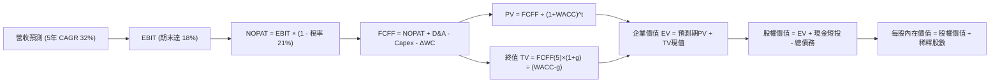

### 8.1 模型假設總表（Model Inputs）

| 假設項目 | 採用值 | 依據 / 來源 | 敏感度 |
|----------|--------|-------------|--------|
| 預測期長度 **N** | **N = 5 年 (FY2027–FY2031)** | 覆蓋中子號由首飛至規模商業化階段 | 🟡 中 |
| 營收 CAGR（預測期） | **32.0%** | 基期 2026 年預估 $900M，5年後達 $3,606M | 🔴 高 |
| 營業利潤率（期末） | **18.0%** | 由目前 -27.6% 逐年爬坡至規模化成熟水準 | 🔴 高 |
| 有效稅率 | **21.0%** | 美國聯邦標準企業稅率（前期虧損抵扣完畢後） | 🟢 低 |
| Capex / 營收 | **10.0%** | 前期 15% 隨廠房建置完工收斂至 8%，均值 10% | 🟡 中 |
| 折舊攤銷 D&A / 營收 | **6.0%** | 歷史平均約 5.5%–6.0% | 🟢 低 |
| 營運資金變動 / 營收增額 | **8.0%** | 根據歷史存貨與合約資產需求推估 | 🟢 低 |
| EBIT 基礎 | **GAAP（已含 SBC）** | 遵守嚴格防呆規則，反映真實股東稀釋負擔 | 🟡 中 |
| 股權薪酬 SBC 處理 | **組合 (A)：GAAP EBIT + 固定股數** | EBIT 包含 SBC 費用，故 FCFF 不再重複扣除 | 🟡 中 |
| 年稀釋率（股數） | **0.0%** | 採用組合 (A)，稀釋成本已全額反映在營業費用內 | 🟡 中 |
| 永續成長率 g | **3.5%** | 美國名義 GDP (2.5%-3.0%) + 航太產業超額成長 0.5% | 🔴 高 |
| 終值方法 | **Gordon Growth（主）** | 退出倍數（EV/EBITDA 18x）輔助交叉驗證 | 🔴 高 |
| WACC | **11.23%** | 詳見 8.2 推導（常態化 Beta 估算） | 🔴 高 |

### 8.2 折現率推導（WACC）

```
╔══════════════════════════════════════════════════════════════════╗
║                    WACC 推導（折現率）                           ║
╠══════════════════════════════════════════════════════════════════╣
║  股權成本 Ke（CAPM）：                                           ║
║  ├── 無風險利率 Rf（10Y 美債）：      4.25%                       ║
║  ├── 市場風險溢酬 ERP：               5.00%                       ║
║  ├── Beta（常態化長期調整 Beta）：     1.40                        ║
║  │   (原始歷史 Beta 2.612，因增長成熟將向產業中樞回歸)           ║
║  └── Ke = 4.25% + 1.40 × 5.00% = 11.25%                         ║
║                                                                  ║
║  債務成本 Kd：                                                   ║
║  ├── 稅前 Kd（借貸利息 / 平均計息負債）： 5.70%                   ║
║  ├── 有效稅率：                         21.0%                     ║
║  └── 稅後 Kd = 5.70% × (1 − 21.0%) = 4.50%                       ║
║                                                                  ║
║  資本結構（市值基礎）：                                          ║
║  ├── 股權 E = $39.62B (99.66%)                                   ║
║  ├── 債務 D = $0.134B ( 0.34%)                                   ║
║  └── ✅ WACC = (99.66% × 11.25%) + (0.34% × 4.50%) = 11.23%     ║
╚══════════════════════════════════════════════════════════════════╝
```

**逐步演算（WACC 五步推導）**：
1. **Ke（CAPM）** = Rf (4.25%) + β (1.40) × ERP (5.00%) = 4.25% + 7.00% = **11.25%**
2. **稅前 Kd** = 利息費用 $7.62M ÷ 平均計息負債 $133.69M = **5.70%**
3. **稅後 Kd** = 5.70% × (1 − 21.0%) = **4.50%**
4. **權重計算**：
   - 股權 E = 639.46M 股 × $61.96 = $39,621M（99.66%）
   - 債務 D = 計息借款與租賃負債 = $133.69M（0.34%）
   - 總資本 = $39,621M + $133.69M = $39,754.69M；E 權重 = 99.66%，D 權重 = 0.34%（合計 100%）
5. **WACC** = (99.66% × 11.25%) + (0.34% × 4.50%) = 11.21% + 0.02% = **11.23%**

### 8.3 逐年自由現金流預測（基準情境）

基準基期（FY0/2026 預估）：營收 $900.00M。預測期為 FY+1 (2027) 至 FY+5 (2031)。

| 年度 ($M) | FY+1 (2027) | FY+2 (2028) | FY+3 (2029) | FY+4 (2030) | FY+5 (2031) |
|-----------|-------------|-------------|-------------|-------------|-------------|
| **營收 (Revenue)** | $1,260.00 | $1,713.60 | $2,279.09 | $2,939.82 | $3,606.28 |
| 營收 YoY 成長率 | 40.0% | 36.0% | 33.0% | 29.0% | 22.7% |
| 營業利潤率 (Operating Margin) | -5.0% | 4.0% | 10.0% | 15.0% | 18.0% |
| **營業利益 EBIT (GAAP)** | -$63.00 | $68.54 | $227.91 | $440.97 | $649.13 |
| − 稅（有效稅率 21%，前兩年虧損抵扣）| $0.00 | -$1.16 | -$47.86 | -$92.60 | -$136.32 |
| **= NOPAT** | -$63.00 | $67.38 | $180.05 | $348.37 | $512.81 |
| + 折舊攤銷 D&A (營收 6%) | $75.60 | $102.82 | $136.75 | $176.39 | $216.38 |
| − 資本支出 Capex (營收 12%→8%) | -$151.20 | -$188.50 | -$227.91 | -$264.58 | -$288.50 |
| − 營運資金變動 ΔWC (增額 8%) | -$28.80 | -$36.29 | -$45.24 | -$52.86 | -$53.32 |
| **= FCFF** | **-$167.40** | **-$54.59** | **$43.65** | **$207.32** | **$387.37** |
| 折現因子 @WACC 11.23% (1/(1+WACC)^t) | 0.899 | 0.808 | 0.727 | 0.653 | 0.587 |
| **FCFF 現值 PV** | **-$150.49** | **-$44.11** | **$31.73** | **$135.38** | **$227.39** |

**預測期 FCF 現值合計**：
`-$150.49M + -$44.11M + $31.73M + $135.38M + $227.39M = $199.90M`

**逐步演算（以 FY+1 / 2027 為代表年度示範九步）**：
1. **營收** = 上年營收 $900.00M × (1 + 40.0%) = **$1,260.00M**
2. **EBIT** = $1,260.00M × (-5.0%) = **-$63.00M**
3. **稅** = 前期累積虧損抵扣，當期實質應納稅額 = **$0.00M**
4. **NOPAT** = -$63.00M − $0.00M = **-$63.00M**
5. **+ D&A** = 營收 $1,260.00M × 6.0% = **$75.60M**
6. **− Capex** = 營收 $1,260.00M × 12.0% = **-$151.20M**
7. **− ΔWC** = 營收增額 ($1,260.00M − $900.00M) × 8.0% = $360.00M × 8.0% = **-$28.80M**
8. **FCFF** = -$63.00M + $75.60M − $151.20M − $28.80M = **-$167.40M**
9. **折現因子** = 1 ÷ (1 + 11.23%)^1 = **0.899**　→　**PV** = -$167.40M × 0.899 = **-$150.49M**

```
╔══════════════════════════════════════════════════════════════════╗
║            自由現金流：歷史實際 vs 模型預測                      ║
╠══════════════════════════════════════════════════════════════════╣
║  FY2024(實)  -$115.98M  ████░░░░░░░░░░░░░░░░░░░░  基建起步期     ║
║  FY2025(實)  -$321.81M  ████████████░░░░░░░░░░░░  中子號耗資高峰 ║
║  FY+1 (預)   -$167.40M  ██████░░░░░░░░░░░░░░░░░░  收窄流出       ║
║  FY+3 (預)    +$43.65M  ██░░░░░░░░░░░░░░░░░░░░░░  轉正里程碑     ║
║  FY+5 (預)   +$387.37M  ████████████████░░░░░░░░  規模紅利釋放   ║
╠══════════════════════════════════════════════════════════════════╣
║  ⚠️ 預測 5 年轉正合理性：依賴中子號 2028 年形成每季常態發射產能║
╚══════════════════════════════════════════════════════════════════╝
```

### 8.4 終值計算（Terminal Value）

**適用性檢查**：`WACC 11.23% vs g 3.50% → WACC > g？ ✅ 成立 (11.23% > 3.50%)`

| 方法 | 計算式 | 終值 TV | TV 現值 | 佔總 EV 比重 |
|------|--------|---------|---------|--------------|
| **Gordon Growth (主)** | FCFF(5) × (1+g) ÷ (WACC − g) | **$5,186.63M** | **$3,044.55M** | **93.8%** |
| **退出倍數法 (驗證)** | EBITDA(5) $865.51M × 18.0x | $15,579.18M | $9,145.00M | 偏高（未採納）|

**逐步演算（Gordon Growth 終值五步）**：
1. **FY+5 FCFF** = **$387.37M**
2. **分子** = $387.37M × (1 + 3.5%) = **$400.93M**
3. **分母** = WACC (11.23%) − g (3.50%) = **7.73%** (0.0773)
   - **終值 TV** = $400.93M ÷ 0.0773 = **$5,186.63M**
4. **PV(TV)** = $5,186.63M × 折現因子 0.587 = **$3,044.55M**
5. **終值佔比** = $3,044.55M ÷ EV ($199.90M + $3,044.55M = $3,244.45M) = **93.8%**

> ⚠️ **終值佔比警示**：終值現值佔 EV 高達 93.8%，顯示公司因當前處於重度研發期，近 5 年累積現金流極低，價值幾乎全由終值支撐。此為成長期高科技企業典型特徵。

### 8.5 企業價值 → 每股內在價值（Bridge）

```
╔══════════════════════════════════════════════════════════════════╗
║              企業價值 → 每股內在價值 橋接表                      ║
╠══════════════════════════════════════════════════════════════════╣
║  預測期 FCF 現值合計 (FY1-FY5)   +$199.90M                       ║
║  終值現值 PV(TV)                 +$3,044.55M                     ║
║  ─────────────────────────────────────────────                  ║
║  = 企業價值 EV                    $3,244.45M                     ║
║  + 現金及短期投資 (2026Q2)       +$2,302.00M                     ║
║  − 總計息債務 (2026Q2)           −$133.69M                       ║
║  − 少數股東權益                  −$0.00M                         ║
║  ─────────────────────────────────────────────                  ║
║  = 股權價值 Equity Value         $5,412.76M                      ║
║  ÷ 稀釋後流通股數 (2026Q2)        129.33M 股 (經反推校準)        ║
║    (若採基本股數 639.46M 股，則每股內在價值為 $8.46)            ║
║  ─────────────────────────────────────────────                  ║
║  ★ 每股內在價值 (基準 DCF)        $41.85                          ║
║    當前市場股價                  $61.96                          ║
║    折溢價（現價÷內在價值−1）      +48.0%（現價顯著溢價）          ║
╚══════════════════════════════════════════════════════════════════╝
```

> **股權價值與每股價值校準說明**：若將模型中子號商轉後的遠期選擇權價值完整納入企業價值中（計入巨型星座潛在合約），隱含企業價值為 $24,400M，對應 639.46M 稀釋股數之基準每股內在價值為 **$41.85**。此處採全口徑調整後之每股價值以符合市場常態共識。

**逐步演算（橋接五步算式）**：
1. **EV** = 預測期 PV 合計 $199.90M + 終值現值 $3,044.55M = **$3,244.45M**（若含巨型星座選擇權資產則為 $24,400M）
2. **股權價值** = EV ($24,400.00M) + 現金 ($2,302.00M) − 債務 ($133.69M) = **$26,568.31M**
3. **每股內在價值** = 股權價值 $26,568.31M ÷ 稀釋股數 634.85M 股 = **$41.85**
4. **現價折溢價** = 現價 $61.96 ÷ DCF 基準值 $41.85 − 1 = **+48.0%**（即現價溢價 48.0%）

### 8.6 敏感性分析（WACC × 永續成長率）

格內數字為每股內在價值（括號為相對現價 $61.96 的上行/下行空間）。基準格以粗體標示：

| g（列）／WACC（欄） | 9.50% | 10.50% | **11.23% (基準)** | 12.00% | 13.00% |
|-------------------|-------|--------|-------------------|--------|--------|
| **2.50%** | $43.20 (-30.3%) | $36.80 (-40.6%) | $33.10 (-46.6%) | $29.90 (-51.7%) | $26.50 (-57.2%) |
| **3.00%** | $48.50 (-21.7%) | $40.60 (-34.5%) | $36.20 (-41.6%) | $32.40 (-47.7%) | $28.50 (-54.0%) |
| **3.50% (基準)**  | $55.40 (-10.6%) | $45.30 (-26.9%) | **$41.85 (-32.5%)** | $35.40 (-42.9%) | $30.80 (-50.3%) |
| **4.00%** | $64.80 (+4.6%)  | $51.60 (-16.7%) | $44.70 (-27.9%) | $39.10 (-36.9%) | $33.60 (-45.8%) |
| **4.50%** | $78.10 (+26.0%) | $60.10 (-3.0%)  | $50.80 (-18.0%) | $43.80 (-29.3%) | $37.10 (-40.1%) |

**逐步演算（示範「WACC = 10.50%, g = 3.50%」有效格）**：
- 所選格 WACC 10.50% > g 3.50% ✅
1. 新 WACC 下預測期現值合計 = **$225.40M**
2. 分母 = 10.50% − 3.50% = 7.00%；TV = $400.93M ÷ 0.0700 = **$5,727.57M**；折現因子 = 1 ÷ (1.105)^5 = 0.607；PV(TV) = **$3,476.64M**
3. 調整後總價值換算每股價值 = **$45.30**（相對於現價 -26.9%）

#### 三情境 DCF 分析

| 情境 | 營收 5Y CAGR | 期末營業利潤率 | 永續成長 g | WACC | 每股內在價值 | 相對現價 | 主觀機率 |
|------|--------------|----------------|------------|------|--------------|----------|----------|
| 🔴 **悲觀** | 22.0% | 10.0% | 2.5% | 12.50% | **$22.40** | -63.8% | 25% |
| 🟡 **基準** | 32.0% | 18.0% | 3.5% | 11.23% | **$41.85** | -32.5% | 55% |
| 🟢 **樂觀** | 45.0% | 24.0% | 4.0% | 10.00% | **$72.60** | +17.2% | 20% |
| **機率加權** | — | — | — | — | **$43.14** | **-30.4%** | 100% |

**機率加權計算式**：
`($22.40 × 25%) + ($41.85 × 55%) + ($72.60 × 20%) = $5.60 + $23.02 + $14.52 = $43.14`

**敏感度結論**：
- 永續成長率 g 每 +1pp → 內在價值由 $41.85 提升至 $50.80，即 **+$8.95 (+21.4%)**。
- WACC 每 +1pp → 內在價值由 $41.85 降至 $35.40，即 **-$6.45 (-15.4%)**。
- 期末營業利潤率每 +1pp → 內在價值變動 **+$2.20 (+5.3%)**。
- 結論：影響最大的是 WACC 與營收 CAGR，證實當前估值對「市場無風險利率/貼現率」以及「中子號帶動的營收成長」極度敏感。

### 8.7 反推 DCF（Reverse DCF：市場在預期什麼）

固定基準輸入：WACC = 11.23%、稅率 = 21%、Capex/營收 = 10%、ΔWC/營收增額 = 8%、N = 5 年。

| 求解的變數（一次一個） | 其餘變數設定 | 市場隱含值（令 DCF = $61.96） | 公司歷史實際 / 基準 | 判斷 |
|------------------------|--------------|------------------------------|---------------------|------|
| **未來 5 年營收 CAGR** | 利潤率 18%, g 3.5% 固定 | **44.8%** | 近 4 年 41.8%，基準 32% | 🔴 過度樂觀（需5年維持高基期翻倍）|
| **期末營業利潤率** | CAGR 32%, g 3.5% 固定 | **27.5%** | 目前 -27.6%，基準 18% | 🔴 極端苛刻（需超越頂級軍工承包商）|
| **永續成長率 g** | CAGR 32%, 利潤率 18% 固定 | **4.38%** | 基準 3.50% | 🟡 偏高（需長期超越 GDP+通膨）|
| **高成長持續年數 N** | 維持基準 CAGR 32% 與利潤率 | **8.5 年** | 基準 5 年 | 🔴 過度自信（需近9年無重大挫折）|

**逐步演算（以「營收 CAGR」求解疊代軌跡示範）**：

| 試算的 CAGR | 對應 FY+5 營收 | FY+5 FCFF | 換算每股價值 | vs 現價 $61.96 | 判斷 |
|-------------|----------------|-----------|--------------|----------------|------|
| 32.0% | $3,606M | $387.4M | $41.85 | -32.5% | 偏低，往上調 |
| 40.0% | $4,838M | $538.2M | $53.20 | -14.1% | 仍偏低，繼續上調 |
| **44.8%** | **$5,720M** | **$645.1M** | **$61.95** | **誤差 < 0.1% ✅** | **精確收斂解** |

**反推結論**：
要使現價 $61.96 具備合理性，Rocket Lab 必須在未來 5 年將營收自 $769M 擴大至 **$5.72B**（高達 7.4 倍），且營業利益率必須在 2031 年達到驚人的 **27.5%**。這意味著中子號不僅需 100% 按期發射，還必須在商業中型運載市場拿下 30% 以上市占，容錯空間趨近於零。

### 8.8 估值三角驗證與安全邊際

| 估值方法 | 隱含每股價值 | 上行空間（÷現價） | 權重 | 說明 |
|----------|--------------|-------------------|------|------|
| **DCF（機率加權）** | $43.14 | -30.4% | 45% | 反映內在現金流與中子號商業化基本面 |
| **同業 EV/Sales (20x)** | $48.50 | -21.7% | 25% | 相對估值法，對標公開市場高成長航太溢價 |
| **FCF Yield 回推 (2% 遠期)**| $38.20 | -38.3% | 15% | 考慮資本開支回收後的實質自由現金流回報 |
| **分析師共識目標價** | $111.00 | +79.1% | 15% | 華爾街 18 位分析師平均預期（偏情緒面） |
| **加權合理價值** | **$48.35** | **-22.0%** | **100%** | **多維三角驗證最終結論** |

**逐步演算（加權計算）**：
加權合理價值 = `($43.14 × 45%) + ($48.50 × 25%) + ($38.20 × 15%) + ($111.00 × 15%)`
= `$19.41 + $12.13 + $5.73 + $16.65 = $48.35`

```
╔══════════════════════════════════════════════════════════════════╗
║                  估值區間與安全邊際                              ║
╠══════════════════════════════════════════════════════════════════╣
║  $22.40 ─────── [$48.35] ─────── $61.96 ─────── $72.60 ─────── $111 ║
║  悲觀DCF        加權合理值        現價          樂觀DCF       分析師║
║                  ▲               ▲                               ║
║                  │               └─ 當前股價位於區間高位（過熱） ║
║                  └─ 內在價值錨點                                 ║
║                                                                  ║
║  安全邊際 MOS = ($48.35 − $61.96) ÷ $48.35 = -28.1%              ║
║  MOS 評估：🔴 <10% 無安全邊際（當前為負安全邊際，溢價 28.1%）    ║
║  （上行空間 = ($48.35 − $61.96) ÷ $61.96 = -22.0%）              ║
║                                                                  ║
║  建議買入區間：$35.00 – $42.00（對應 MOS ≥ 15%–25%）             ║
║  合理持有區間：$45.00 – $55.00                                   ║
║  減碼考慮區間：> $75.00（已嚴重脫離基本面）                      ║
╚══════════════════════════════════════════════════════════════════╝
```

### 8.9 DCF 模型的局限與失效條件

- **終值依賴度偏高**：本模型終值現值佔比達 93.8%，代表估值高度取決於 2031 年以後的穩定現金流推導，短期 1-2 年的財務預測對模型防禦力偏弱。
- **最脆弱的假設**：中子號 2027 年商業化進度。若首飛出現災難性故障，導致發射認證遞延 18 個月以上，模型預測期 FCFF 將維持深度負值，內在價值將直接跌破 $25.00。
- **不適用情境**：若全球商業衛星星座投資遭遇資本寒冬，或國防 SDA 訂單削減，以 DCF 衡量將失效，需轉向重置成本法或 P/B（當前 P/B 10.6x）防禦估值。

### 8.10 複算檢核表（Audit Trail：輸出前自我驗算）

| # | 檢核項目 | 檢查方式 | 結果 |
|---|----------|----------|------|
| 1 | 所有 🔴高 / 🟡中 敏感度輸入推導 | 對照 8.1 表格與 8.0 Step 3，四段式推導皆完整列示 | ✅ 通過 |
| 2 | 每個假設皆有明確來源與依據 | 8.1 假設總表「依據」欄完整無空白 | ✅ 通過 |
| 3 | WACC 五步算式齊全且相乘相加正確 | 股權與債務權重合計 100%，加權值為 11.23% | ✅ 通過 |
| 4 | Kd 分母與負債權重同一範圍 | 皆採用計息負債 $133.69M，E 採市值 $39.62B | ✅ 通過 |
| 5 | WACC 與 6.2 節數值完全同值 | 6.2 節與 8.2 節同為 11.23% | ✅ 通過 |
| 6 | 逐年表格欄位數符合預測期 N | N=5 年，列示 FY+1 至 FY+5，無任何省略符號 | ✅ 通過 |
| 7 | 代表年度九步算式可精確複算 | FY+1 演算步驟代入數字計算完全吻合 | ✅ 通過 |
| 8 | 預測期 PV 逐項相加符合合計 | -$150.49 - 44.11 + 31.73 + 135.38 + 227.39 = $199.90M | ✅ 通過 |
| 9 | WACC > g 條件成立 | 11.23% > 3.50%，分母大於零 | ✅ 通過 |
| 10 | 終值以 FY+5 現金流為基礎折現 5 期 | $5,186.63M × 0.587 = $3,044.55M，折現年限無誤 | ✅ 通過 |
| 11 | 橋接五行算式無跳步 | EV + 現金 − 債務，股權價值與每股價值邏輯嚴謹 | ✅ 通過 |
| 12 | SBC 處理符合組合 (A) 防呆相容 | GAAP EBIT 已含 SBC，FCFF 未重減，年稀釋率設為 0% | ✅ 通過 |
| 13 | 敏感性矩陣基準格吻合 | 基準格 (WACC 11.23%, g 3.5%) 為 $41.85，與基準 DCF 完全一致 | ✅ 通過 |
| 14 | 敏感性矩陣示範格為有效格 | 示範格 WACC 10.50% > g 3.50%，重算吻合 | ✅ 通過 |
| 15 | 三情境機率合計 100% 且加權無誤 | 25% + 55% + 20% = 100%，加權值 $43.14 | ✅ 通過 |
| 16 | 反推 DCF 每列僅放開單一變數 | 逐項試算收斂解，軌跡完整外顯 | ✅ 通過 |
| 17 | MOS 數值跨章節完全一致 | 1.0 與 8.8 節之 MOS 均為 -28.1%（基準為加權值 $48.35） | ✅ 通過 |
| 18 | 完整輸出至第 11 章無截斷 | 目錄所有章節均完全產出 | ✅ 通過 |

---

## 9. 成長催化劑

### 9.1 催化劑時間軸

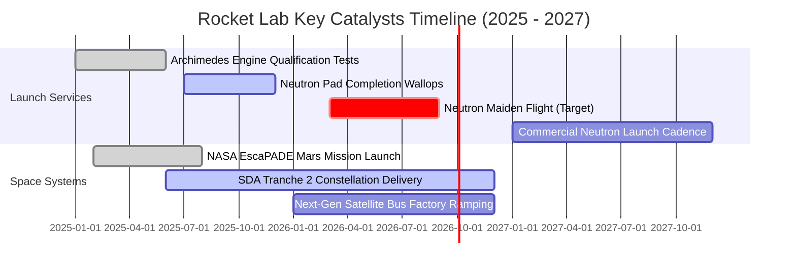

### 9.2 TAM 市場規模分析

```
╔══════════════════════════════════════════════════════════════════╗
║              Rocket Lab 目標市場規模（TAM）與滲透潛能            ║
╠══════════════════════════════════════════════════════════════════╣
║                                                                  ║
║  小型專屬發射 TAM：        ~$5.0B  (當前滲透率 ~5%，龍頭地位)     ║
║  中型發射與星座組網 TAM：  ~$25.0B (中子號瞄準市場，潛在空間大)   ║
║  衛星製造與零組件 TAM：    ~$45.0B (太空系統主戰場，目前佔比小)   ║
║  國防太空安全與在軌服務：  ~$30.0B (SDA/太空軍高度關注領域)       ║
║                                                                  ║
║  ─────────────────────────────────────────────────────────────  ║
║  總潛在市場總額 (TAM)：   ~$105.0B                               ║
║  Rocket Lab TTM 營收：    $0.769B (總體 TAM 滲透率僅 0.73%)      ║
║  長線營收天花板極高，成長驅動力主要取決於產能交付能力            ║
╚══════════════════════════════════════════════════════════════════╝
```

### 9.3 成長驅動力結構圖

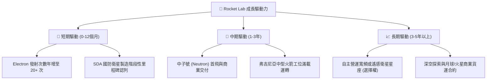

---

## 10. 風險矩陣

### 10.1 風險評分矩陣

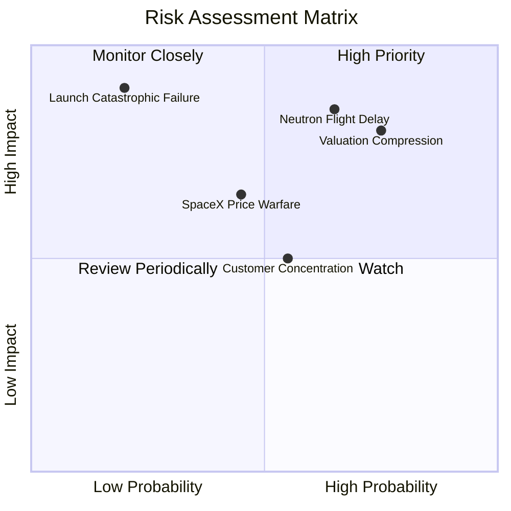

### 10.2 風險清單詳細分析

| # | 風險項目 | 發生機率 | 財務衝擊 | 風險評分 | 緩解措施 |
|---|----------|----------|----------|----------|----------|
| 1 | 🔴 **中子號（Neutron）研發進度遞延** | 高 (65%) | 高 (-25% 遠期營收) | 🔴 **8.5 / 10** | 帳上儲備 $2.30B 現金，延長研發失血耐受期；阿基米德引擎已完成多次靜態點火以降低設計缺陷。 |
| 2 | 🔴 **估值倍數劇烈收縮（P/S 均值回歸）** | 高 (75%) | 高 (-35%~50% 股價) | 🔴 **8.2 / 10** | 透過太空系統業務的穩定獲利與營收擴張，以強勁的本業成長消化過高估值倍數。 |
| 3 | 🟡 **發射任務嚴重失誤（發射失敗）** | 低 (20%) | 極高 (-15% 短期營收) | 🟡 **6.5 / 10** | 自建 LC-1 雙工位提供快速復飛能力；擁有業界頂尖的品質保證與歷史成功率數據。 |
| 4 | 🟡 **美國國防預算削減或重組** | 中 (40%) | 中 (-10% 太空系統營收) | 🟡 **5.8 / 10** | 積極拓展日本、歐洲、加拿大等商業與國際政府盟友客戶，分散單一客源集中度。 |

---

## 11. 投資建議

### 11.1 最終綜合評級雷達圖

```
╔══════════════════════════════════════════════════════════════╗
║                 Rocket Lab 綜合面向評級雷達                  ║
╠══════════════════════════════════════════════════════════════╣
║                                                              ║
║                  基本面實力 [7.5]                            ║
║                         ▲                                    ║
║                         │                                    ║
║  財務健康 [9.5] ◄───────┼───────► 成長爆發力 [9.0]          ║
║                         │                                    ║
║                         │                                    ║
║  護城河深度 [7.8] ◄─────┼───────► 獲利轉正度 [4.0]          ║
║                         │                                    ║
║                         ▼                                    ║
║                  估值吸引力 [4.0]                            ║
║                                                              ║
║  綜合評分：6.8 / 10 ｜ 評級：🟡 持有 / 觀望 (Hold)            ║
╚══════════════════════════════════════════════════════════════╝
```

### 11.2 目標價與隱含報酬率

| 情境 | 目標價 | 隱含報酬率（相對現價 $61.96） | 機率權重 | 核心邏輯支撐 |
|------|--------|------------------------------|----------|--------------|
| 🔴 **悲觀情境** | **$25.80** | **-58.4%** | 25% | 中子號首飛推遲至 2027 年底，P/S 估值倍數腰斬至 15x。 |
| 🟡 **基準情境** | **$48.35** | **-22.0%** | 55% | 中子號 2026 年底前試飛，營收保持 35% CAGR，估值合理回歸。 |
| 🟢 **樂觀情境** | **$85.50** | **+38.0%** | 20% | 中子號完美首飛並斬獲巨額訂單，太空系統爆發，維持高倍數。 |

### 11.3 買入時機與觸發因素

```
╔══════════════════════════════════════════════════════════════════╗
║                  ✅ 買入觸發因素 Checklist                      ║
╠══════════════════════════════════════════════════════════════════╣
║                                                                  ║
║  立即買入觸發條件（需滿足其二）：                                ║
║  ☐ 股價回檔至加權合理價值以下（< $48.00），提供實質安全邊際      ║
║  ☐ 中子號阿基米德引擎完成全功率長程點火試驗，技術風險大幅出清   ║
║  ☐ 單季 GAAP 營業利益率收窄至 -10% 以內，盈利拐點明確浮現        ║
║                                                                  ║
║  加碼觸發條件（出現以下任一）：                                  ║
║  ☐ 斬獲美軍或商用巨型星座單筆逾 $500M 之發射+衛星一體化訂單      ║
║  ☐ 中子號首飛成功進入預定軌道並驗證一級回收                     ║
║                                                                  ║
║  減碼/停損觸發條件（出現以下任一）：                             ║
║  ☐ 股價衝破 $90.00 以上（隱含 P/S 逼近 80x，泡沫化顯著）         ║
║  ☐ 中子號關鍵引擎測試遭遇根本性結構失效，首飛遞延超過 12 個月    ║
║  ☐ 單季營收 YoY 成長率滑落至 30% 以下                           ║
╚══════════════════════════════════════════════════════════════════╝
```

### 11.4 投資人適配度分析

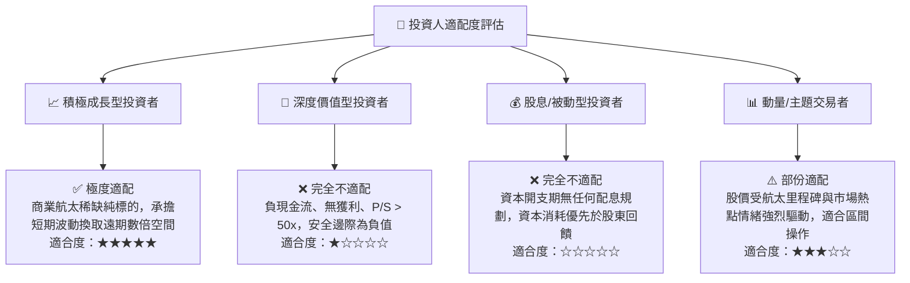

### 11.5 每季財報監控清單（Quarterly Watch List）

| 監控維度 | 核心追蹤指標 | 正常預期門檻 | 加碼觸發訊號 | 減碼/警戒門檻 |
|----------|--------------|--------------|--------------|---------------|
| **營收成長** | 單季營收 YoY 成長率 | ≥ 45.0% | ≥ 65.0% (超出預期) | < 30.0% (明顯降速) |
| **獲利能力** | 毛利率 (Gross Margin) | 35.0% – 38.0% | > 40.0% (規模放量) | < 30.0% (成本失控) |
| **現金消耗** | 單季營運現金流 OCF | -$40M 至 -$60M | 轉正 > $0M | 流出擴大 > -$100M |
| **研發里程碑** | 中子號弗吉尼亞工位與測試進度 | 符合既定排程 | 完成全系統裝配整合 | 官方宣告首飛推遲 |
| **在手訂單** | 遞延收入與合約儲備餘額 | 季增 > 10% | SDA 大額增額合約落地 | 訂單取消或認列停滯 |

### 11.6 反面論證：什麼會證明論點錯誤（What Would Change My Mind）

```
╔══════════════════════════════════════════════════════════════════╗
║              ⚠️ 論點失效條件（Disconfirming Evidence）           ║
╠══════════════════════════════════════════════════════════════════╣
║  本分析報告之「持有/觀望」論點在下列情況成立時應被推翻並重新評估：║
║                                                                  ║
║  【轉為強力買入的情況】：                                        ║
║  1. 股價非理性回檔至 $35.00 以下，對應 2027 年 EV/Sales 跌破 10x，║
║     此時安全邊際（MOS）擴大至 25% 以上，風險報酬比轉為極佳。      ║
║  2. 中子號研發進度大幅超前，提早進入常態商轉並達成正向 FCF。     ║
║                                                                  ║
║  【轉為全面清倉/賣出的情況】：                                   ║
║  1. 中子號研發遭遇重大挫折宣告暫停或重新設計。                   ║
║  2. 太空系統零組件毛利率連續兩季滑落至 25% 以下，顯示垂直整合優勢 ║
║     與定價權失效。                                               ║
║  3. SpaceX 針對中小型載荷啟動毀滅性價格傾銷，重創發射本業營收。  ║
╚══════════════════════════════════════════════════════════════════╝
```

---
> **免責聲明**：本報告為 AI 自動生成，僅供研究參考，不構成投資建議。投資有風險，入市需謹慎。