# RKLB 基本面深度分析報告
> **報告日期**：2026-09-11 ｜ **語言**：繁體中文 ｜ **數據來源**：Yahoo Finance, Finviz, StockAnalysis, Roic.ai ｜ **分析師**：CFA 級機構研究

---

## 目錄

| # | 章節 | 核心結論 |
|---|------|----------|
| 1 | 執行摘要 | 評級「持有/投機性買入」，加權合理價值 $65.25，安全邊際 +3.5% |
| 2 | 公司概覽與商業模式 | 太空發射與衛星系統雙引擎，護城河評分 8.1/10 |
| 3 | 損益表深度分析 | 營收 TTM YoY +62.0%，毛利率擴張至 37.3%，研發投入壓抑短期淨利 |
| 4 | 資產負債表分析 | 現金儲備充裕達 $23.0 億，淨現金 $21.7 億，流動比率 5.48x |
| 5 | 現金流量深度分析 | FCF TTM 為 -$2.52 億，SBC 稀釋可控，Capex 集中於 Neutron 產能構建 |
| 6 | 獲利能力與資本效率 | NOPAT 仍處虧損期，ROIC (-8.6%) 低於 WACC (10.9%)，處於資本投入拐點前夕 |
| 7 | 相對估值分析 | P/S 52.3x 高於同業，反映次世代中型運載火箭 Neutron 的高成長溢價 |
| 8 | DCF 內在價值評估 | 基準 DCF 每股價值 $58.12，加權合理價值 $65.25，現價處於合理偏高區間 |
| 9 | 成長催化劑 | Neutron 首飛與商業化放量、美國太空軍與商業星座訂單積壓 |
| 10 | 風險矩陣 | 火箭研發推遲、發射失敗與政府預算重置為主要尾部風險 |
| 11 | 投資建議 | 建議於 $45.00–$52.00 分批吸納，設立嚴格執行監控清單 |

---

## 1. 執行摘要

本篇報告基於 Rocket Lab Corporation (NASDAQ: RKLB) 截至 2026 年 6 月 30 日季度數據與 2026 年 9 月 11 日收盤價 $62.95 進行深度基本面檢驗。分析顯示，公司受惠於小型運載火箭 Electron 發射頻率提升及太空系統（Space Systems）零組件與製造業務放量，TTM 營收強勁增長 62.0% 達 $769.15M，毛利率由 2022 年底的 9.0% 顯著跳升至 37.3%。然而，受 Neutron 中型火箭高額研發支出（2025 年 R&D $270.72M，佔營收 45.0%）影響，TTM 營運利潤率仍為 -24.6%，ROIC (-8.6%) 尚未超越 WACC (10.9%)，TTM FCF 錄得 -$2.52 億。基於 DCF 基準模型推導之每股內在價值為 $58.12（現價溢價 8.3%），經多維估值三角驗證後之加權合理價值為 $65.25，安全邊際 MOS 僅為 +3.5%。基於當前估值已提前反映 Neutron 順利首飛之大部分樂觀預期，給予 **「持有（觀望）/ 逢回分批買入」** 評級。

### 1.0 一頁式投資儀表板（Portfolio Manager 30 秒速讀）

| 項目 | 內容 |
|------|------|
| **投資論點（3 句）** | ① 商業發射市佔率穩居全美第二，Electron 累積成熟發射經驗，TTM 營收達 $769.15M (YoY +62.0%)。<br/>② 太空系統營收佔比已逾 65%，垂直整合模式使毛利率自 2022 年的 9.0% 翻倍擴張至 37.3%。<br/>③ 帳上現金及約當投資達 $23.0 億（淨現金 $21.7 億），充沛流動性提供 Neutron 研發至量產之安全護墊。 |
| **護城河評分** | 8.1 / 10（發射牌照、垂直整合與飛行數據積累具備極高進入門檻） |
| **管理層/資本配置評分** | 8.0 / 10（創辦人技術導向、歷史里程碑達成率高、策略性併購協同效應顯著） |
| **財務健康** | 🟢 強勁（流動比率 5.48x，淨現金頭寸 $21.7 億，破產與短期再融資風險極低） |
| **ROIC vs WACC** | -8.6% vs 10.9%（當前仍處大規模投資期，破壞經濟價值，轉正拐點預計於 2027 年後） |
| **FCF 趨勢** | 負值擴大後逐步收斂，TTM FCF -$2.52 億，FCF Yield -0.63% |
| **估值** | Forward P/E: 1381.7x ｜ EV/Revenue: 45.4x ｜ P/S: 52.3x ｜ FCF Yield: -0.63% |
| **DCF 內在價值（基準）** | **$58.12** ｜ 現價相對 DCF 內在價值折溢價：**+8.3%（現價溢價）** |
| **安全邊際（MOS）** | **+3.5%**＝(加權合理價值 $65.25 − 現價 $62.95) ÷ $65.25 ｜ 🔴 <10% 緩衝空間有限 |
| **預期報酬（基準情境 12M）** | +3.7%（以加權合理值衡量）；若計入市場情緒上行區間上看 +35.0% |
| **關鍵風險（前二）** | ① Neutron 中型運載火箭研發時程延宕或軌道試飛失效；② 國防部與巨型衛星星座客戶資本開支週期性縮減。 |
| **評級 + 信心度** | 🟡 **持有（Hold / Neutral）** ｜ 信心：**中等**（強勁基本面被當前昂貴估值部分抵銷） |

### 1.1 核心評分儀表板

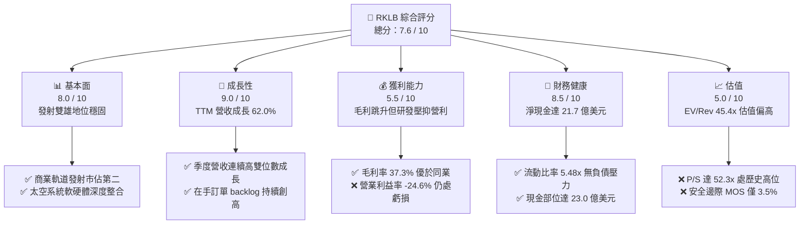

### 1.2 評分進度條視覺化

```
╔══════════════════════════════════════════════════════════════╗
║              RKLB 多維度評分儀表板 (1-10分)                  ║
╠══════════════════════════════════════════════════════════════╣
║ 基本面強度  8.0 ▓▓▓▓▓▓▓▓▓▓▓▓▓▓▓▓░░░░  ★★★★☆           ║
║ 成長動能    9.0 ▓▓▓▓▓▓▓▓▓▓▓▓▓▓▓▓▓▓░░  ★★★★★           ║
║ 獲利品質    5.5 ▓▓▓▓▓▓▓▓▓▓▓░░░░░░░░░  ★★★☆☆           ║
║ 財務健康    8.5 ▓▓▓▓▓▓▓▓▓▓▓▓▓▓▓▓▓░░░  ★★★★☆           ║
║ 估值合理性  5.0 ▓▓▓▓▓▓▓▓▓▓░░░░░░░░░░  ★★☆☆☆           ║
║ 護城河深度  8.1 ▓▓▓▓▓▓▓▓▓▓▓▓▓▓▓▓░░░░  ★★★★☆           ║
║ 管理層執行  8.0 ▓▓▓▓▓▓▓▓▓▓▓▓▓▓▓▓░░░░  ★★★★☆           ║
║ 技術創新力  9.0 ▓▓▓▓▓▓▓▓▓▓▓▓▓▓▓▓▓▓░░  ★★★★★           ║
╠══════════════════════════════════════════════════════════════╣
║ 綜合總分    7.6 ▓▓▓▓▓▓▓▓▓▓▓▓▓▓▓░░░░░  🏆 高成長高估值 ║
╚══════════════════════════════════════════════════════════════╝
```

### 1.3 五大投資論點 + 三大核心風險

| 類型 | 項目 | 具體依據 | 信心度 |
|------|------|----------|--------|
| 🟢 **投資論點①** | **小火箭發射市場實質獨佔** | Electron 自 2018 年商用以來成功累積超過 50 次入軌，為全球除 SpaceX 外唯一具高頻穩定入軌能力的私營服務商，TTM 發射業務毛利顯著提升。 | 🟢 極高 |
| 🟢 **投資論點②** | **太空系統垂直整合效應爆發** | 透過收購 SolAero、ASI 等標的，建構太陽能電池板、反應輪、星敏感器至衛星星雲整合的一站式平台，太空系統佔 2025 年營收逾 65%，推動毛利率攀升至 37.3%。 | 🟢 極高 |
| 🟢 **投資論點③** | **Neutron 切入中大型星系發射藍海** | 13 噸級可重複使用 Neutron 火箭切入巨型通訊星座（如 Amazon Kuiper 及國防 SDA）部署缺口，將單次發射價值量由 $8M 跳升至 $50M–$55M。 | 🟢 高 |
| 🟢 **投資論點④** | **充沛流動性提供零破產護墊** | 2026 年 Q2 帳上總現金與短投高達 $23.0 億，總負債僅 $1.34 億，具備應對未來 3 年資本開支與研發虧損的絕對自體造血防線。 | 🟢 極高 |
| 🟢 **投資論點⑤** | **國防與情報機構合約加速落地** | 獲取美國太空發展署 (SDA) 18 顆衛星（價值 $5.15 億）等主承包商標案，證明其由「次級供應商」躍升為「一級太空總包商 (Prime Contractor)」。 | 🟢 高 |
| 🟡 **風險①** | **Neutron 研發進度與熱試推遲** | Archimedes 引擎試車或軌道首飛若由 2025/2026 推遲，將導致商業發射合約違約金風險及現金消耗加速。 | 🟡 中度 |
| 🔴 **風險②** | **當前估值容錯率極低** | P/S 達 52.3x，EV/Revenue 達 45.4x，股價自 2024 年底低點暴漲逾 5 倍，任何季報不如預期將引發機構劇烈拋售。 | 🔴 高衝擊 |
| 🔴 **風險③** | **發射災難性事故（Loss of Mission）** | 火箭發射具固有高風險性，任一次發射解體均將導致 FAA 停飛調查 3–6 個月，壓抑短期發射頻次。 | 🔴 高衝擊 |

### 1.4 快速統計卡片

| 指標 | 公司實際值 | 行業均值 (Aero & Defense) | S&P 500 均值 | 狀態 |
|------|-------------|---------------------------|--------------|------|
| 收入 YoY 成長 | **62.0%** (TTM) | ~8.5% | ~5.2% | 🟢 卓越領先 |
| 毛利率 | **37.3%** | ~22.0% | ~31.5% | 🟢 顯著擴張 |
| 營業利潤率 | **-24.6%** | ~11.5% | ~12.2% | 🔴 研發虧損 |
| 淨利率 | **-21.5%** | ~8.2% | ~10.8% | 🔴 尚未轉正 |
| ROE | **-7.9%** | ~13.5% | ~18.2% | 🔴 股權回報負值 |
| Forward P/E | **1381.7x** | ~21.5x | ~21.0x | 🔴 估值極端溢價 |
| EV / Revenue | **45.4x** | ~2.1x | ~2.8x | 🔴 處歷史高位 |
| 流動比率 | **5.48x** | ~1.45x | ~1.25x | 🟢 資本結構極優 |

### 1.5 投資結論

```
╔══════════════════════════════════════════════════════════════════╗
║                    📊 投資結論摘要                               ║
╠══════════════════════════════════════════════════════════════════╣
║  評級：🟡 持有 / 觀望（逢回檔至 $50 以下分批布局）              ║
║  當前股價：$62.95                                                ║
║  DCF 內在價值（基準）：$58.12（現價溢價 +8.3%）                 ║
║  安全邊際 MOS：+3.5%（＝(加權合理價值 $65.25 − 現價) ÷ $65.25）  ║
║  目標價區間（12 個月）：                                         ║
║    🔴 悲觀情境：$38.50（-38.8%）                                ║
║    🟡 基準情境：$65.00（+3.3%）  ← 12 個月基本面合理目標       ║
║    🟢 樂觀情境：$85.00（+35.0%）                                ║
║  投資評分：7.6 / 10                                              ║
║  適合投資人：具備高風險承受力、著眼中長期太空商業化之激進成長型  ║
╚══════════════════════════════════════════════════════════════════╝
```

---

## 2. 公司概覽與商業模式

### 2.1 業務結構與收入來源

Rocket Lab 創立於 2006 年，已由專注於碳纖維小型運載火箭的發射公司，進化為端到端（End-to-End）太空基建巨頭。業務切分為兩大部門：發射服務（Launch Services）與太空系統（Space Systems）。

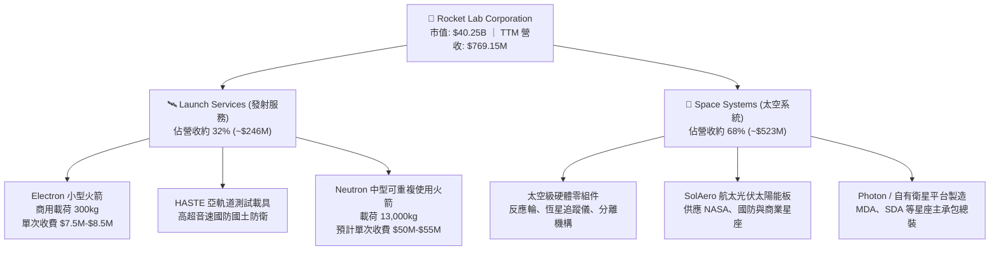

### 2.2 市場份額

在扣除國家隊與民用重型運載（如 SpaceX Falcon 9）後，全球小型商用發射市場中，Rocket Lab 的 Electron 處於實質龍頭地位；在整體西方商業發射市場中，其發射次數僅次於 SpaceX。

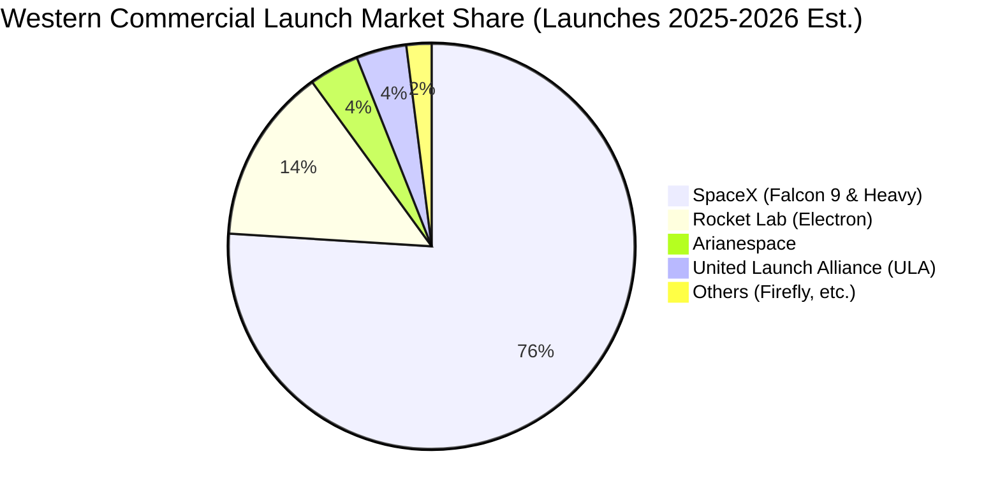

### 2.3 競爭護城河分析

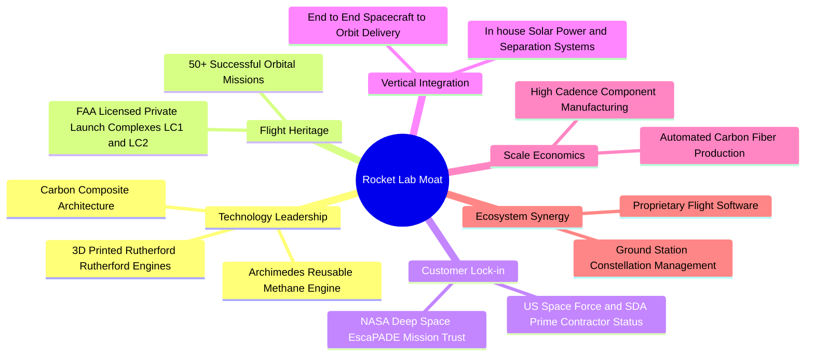

### 2.4 護城河強度評分

```
╔══════════════════════════════════════════════════════════════╗
║                  Rocket Lab 護城河強度評分                   ║
╠══════════════════════════════════════════════════════════════╣
║ 飛行傳統與成熟度  9.5/10  ▓▓▓▓▓▓▓▓▓▓▓▓▓▓▓▓▓▓▓░  🏆 小型發射市佔第一 ║
║ 垂直整合與零組件  8.5/10  ▓▓▓▓▓▓▓▓▓▓▓▓▓▓▓▓▓░░░  🟢 衛星零部件高毛利 ║
║ 監管與發射場資產  9.0/10  ▓▓▓▓▓▓▓▓▓▓▓▓▓▓▓▓▓▓░░  🏆 擁有紐西蘭私有LC1 ║
║ 國防一級承包地位  7.5/10  ▓▓▓▓▓▓▓▓▓▓▓▓▓▓▓░░░░░  🟢 逐步擠入主承包商 ║
║ 資本與研發規模障礙 8.0/10 ▓▓▓▓▓▓▓▓▓▓▓▓▓▓▓▓░░░░  🟢 $23億現金構築障壁║
╠══════════════════════════════════════════════════════════════╣
║ 綜合護城河評分     8.1    ▓▓▓▓▓▓▓▓▓▓▓▓▓▓▓▓░░░░  🏆 具備寬廣技術壁壘 ║
╚══════════════════════════════════════════════════════════════╝
```

---

## 3. 損益表深度分析

### 3.1 年度收入成長趨勢（近 4 年）

```
╔══════════════════════════════════════════════════════════════════╗
║              Rocket Lab 年度收入趨勢（FY2022-FY2025）            ║
╠══════════════════════════════════════════════════════════════════╣
║                                                                  ║
║  FY2022  $211.00M   █████░░░░░░░░░░░░░░░░░  YoY: +239.0% 🟢     ║
║  FY2023  $244.59M   ██████░░░░░░░░░░░░░░░░  YoY: +15.9%  🟢     ║
║  FY2024  $436.21M   ███████████░░░░░░░░░░░  YoY: +78.3%  🟢     ║
║  FY2025  $601.80M   ███████████████░░░░░░░  YoY: +38.0%  🟢     ║
║  TTM     $769.15M   ██═════════════░░░░░░░  YoY: +52.5%  🟢     ║
║                     |     |     |     |                          ║
║                     0    200M  400M  600M                        ║
║                                                                  ║
║  📊 3 年累計營收 CAGR (FY2022-FY2025)：+41.8%                    ║
╚══════════════════════════════════════════════════════════════════╝
```

### 3.2 季度收入趨勢分析

| 季度 | 營收 ($M) | YoY 成長率 | QoQ 成長率 | 毛利率 | 營業利益 ($M) | 備註說明 |
|------|-----------|------------|------------|--------|---------------|----------|
| **Q3 2025** | $155.08M | +48.0% | +7.3% | 37.0% | -$58.97M | Electron 發射 3 次，太空系統組件出貨平穩 |
| **Q4 2025** | $179.65M | +35.7% | +15.8% | 38.0% | -$51.04M | 年底交付高峰，SDA 標案初步里程碑確認 |
| **Q1 2026** | $200.35M | +63.5% | +11.5% | 38.2% | -$44.79M | 發射節奏加快至單季 4 次，太空組件放量 |
| **Q2 2026** | $234.07M | +62.0% | +16.8% | 36.1% | -$57.51M | 營收創歷史單季新高；Neutron 測試 Capex/SG&A 攀升 |

### 3.3 利潤率演變分析

| 利潤率指標 | FY2022 | FY2023 | FY2024 | FY2025 | TTM (2026 Q2) | 趨勢 | 評估 |
|------------|--------|--------|--------|--------|----------------|------|------|
| **毛利率** | 9.0% | 21.0% | 26.6% | 34.4% | **37.3%** | ↗️ 強勁攀升 | 🟢 零組件量產及發射產能利用率優化 |
| **研發費用率**| 30.9% | 48.7% | 40.0% | 45.0% | **41.2%** | ➡️ 高位維持 | 🟡 集中全力攻堅 Archimedes 引擎 |
| **營業利益率**| -64.1%| -72.7% | -43.5% | -38.0% | **-24.6%** | ↗️ 虧損收斂 | 🟡 營運槓桿初現，但整體仍處負值 |
| **淨利率** | -64.4% | -74.6% | -43.6% | -32.9% | **-21.5%** | ↗️ 虧損收斂 | 🟡 利息收益增加部分抵銷研發費用 |

**利潤率演變深度解析**：
毛利率自 2022 年的 9.0% 躍升至 TTM 的 37.3%，成長 28.3 個百分點，主要歸因於兩個根本動力：
1. **業務組合轉變（Mix Shift）**：高毛利之太空系統（Space Systems）業務比重由低於 50% 攀升至 68%，其收購之 SolAero 航太級光伏產品與反應輪具備定價定製權，毛利率普遍在 35%–45% 區間；
2. **Electron 發射邊際成本遞減**：發射頻率提升使 LC1 發射台及常規運營固定成本獲得分攤。
營業利潤率持續為負 (-24.6%) 則是公司戰略決策的自然結果——研發費用長期維持在營收的 40% 以上，全力支應 Neutron 的研發製造；若扣除純增量之 Neutron 研發支出，成熟期之 Electron 與太空系統實質已接近營業利益損益平衡點。

### 3.4 費用結構分析

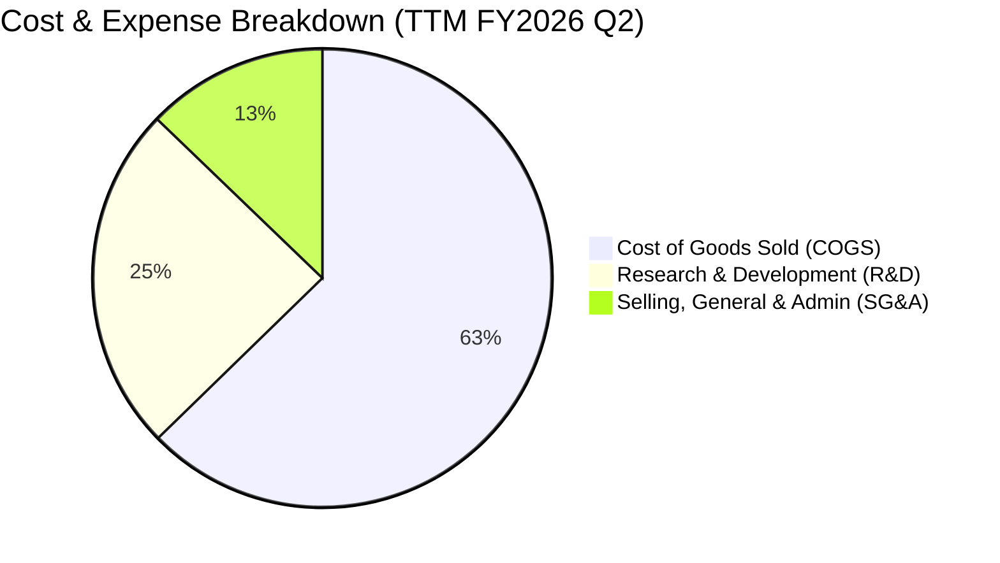

```
╔══════════════════════════════════════════════════════════════════╗
║                   Rocket Lab 費用結構拆解 (TTM)                  ║
╠══════════════════════════════════════════════════════════════════╣
║ 營業收入 (TTM)                $769.15M  (100.0%)                 ║
║ 營業成本 (COGS)               $482.53M  ( 62.7%)  毛利率: 37.3%  ║
║ 研發支出 (R&D)                $188.44M  ( 24.5%)  Neutron 主驅動 ║
║ 銷售管銷支出 (SG&A)            $98.18M  ( 12.8%)  規模槓桿顯現   ║
║ 營業虧損 (Operating Loss)    -$212.31M  (-24.6%)  虧損率顯著改善 ║
╚══════════════════════════════════════════════════════════════════╝
```

### 3.5 季度 EPS 趨勢與盈餘品質（Quality of Earnings）

過去四個季度，隨營收規模成長，GAAP 每股虧損已顯著由 2024 年底的單季 -$0.10 收斂至 2026 年 Q2 的 -$0.08。

| 季度 | 營業收入 ($M) | GAAP 淨利 ($M) | GAAP EPS | 股權激勵 SBC ($M) | OCF ($M) | 盈餘品質狀態 |
|------|---------------|----------------|----------|-------------------|----------|--------------|
| **Q3 2025** | $155.08M | -$18.26M | -$0.03 | $15.73M | -$23.52M | 🟡 研發高峰 |
| **Q4 2025** | $179.65M | -$52.92M | -$0.09 | $18.20M | -$64.53M | 🟡 年終結算提列 |
| **Q1 2026** | $200.35M | -$45.02M | -$0.07 | $28.12M | -$50.33M | 🟡 營運資金波動 |
| **Q2 2026** | $234.07M | -$49.26M | -$0.08 | $19.56M | -$84.08M | 🟡 庫存備料增加 |

**盈餘品質深度檢視**：

| 盈餘品質項目 | 數值 / 佔比 | 評估 | 對股東價值之涵義 |
|--------------|-------------|------|------------------|
| **股權薪酬 SBC / 營收** | 10.6% ($81.6M / $769.2M) | 🟡 中度偏高 | 雖避免現金流出，但年均帶來約 2%–3% 之股數稀釋。 |
| **SBC / 營業現金流** | -36.7% ($81.6M / -$222.5M)| 🟡 抵銷現金虧損 | SBC 掩蓋了約三分之一的真實經營性資源消耗。 |
| **FCF / 淨利 (現金轉換率)** | 152.3% (-$252.0M / -$165.5M)| 🔴 資本開支消耗 | Capex 大幅高於折舊，真實經濟現金消耗高於 GAAP 虧損。 |
| **一次性 / 非經常性損益** | 無顯著異常資產處分 | 🟢 乾淨 | 營收與毛利皆來自核心商業發射與硬體交付。 |
| **有效稅率異常** | 0.0% (全額估價備抵) | 🟢 正常 | 處於稅務虧損累計期 (NOL)，無人為稅務調節利潤。 |
| **資本化支出 vs 費用化** | R&D 全數當期費用化 | 🟢 保守穩健 | 未將 Neutron 火箭研發成本資本化為無形資產，盈餘基礎純淨。 |

**盈餘品質結論**：Rocket Lab 未將研發費用資本化，GAAP 帳面利潤並無虛飾；然而，高額的 SBC（TTM 超過 $8,100 萬美元）為吸引頂尖航太工程師之必要代價，實質上對流通股東權益形成持續稀釋。

---

## 4. 資產負債表分析

### 4.1 資產結構分解

截至 2026 年 Q2，公司資產總額達 $41.87 億美元，流動資產主導整體結構，展現極其充沛之防禦縱深。

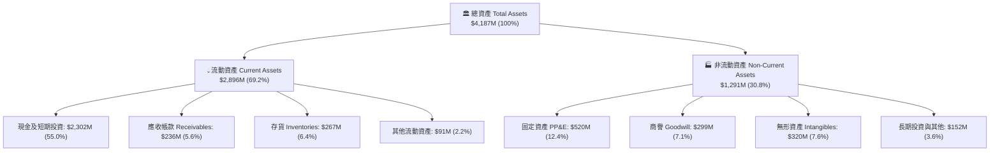

### 4.2 流動性指標分析

| 流動性指標 | FY2023 | FY2024 | FY2025 | 2026 Q2 (最新) | 行業均值 | 評估 |
|------------|--------|--------|--------|----------------|----------|------|
| **流動比率 (Current Ratio)** | 2.13x | 2.04x | 4.08x | **5.48x** | ~1.45x | 🟢 極其充裕 |
| **速動比率 (Quick Ratio)** | 1.65x | 1.69x | 3.61x | **4.81x** | ~0.95x | 🟢 變現能力極強 |
| **現金比率 (Cash Ratio)** | 1.10x | 1.23x | 3.04x | **4.36x** | ~0.50x | 🟢 無擠兌風險 |
| **淨營運資金 (NWC)** | $253.4M | $353.1M| $1,031.5M | **$2,368.0M** | N/A | 🟢 資本擴充到位 |

### 4.3 債務結構分析

```
╔══════════════════════════════════════════════════════════════════╗
║                   Rocket Lab 債務健康診斷                        ║
╠══════════════════════════════════════════════════════════════════╣
║                                                                  ║
║  總計息債務：      $133.69M  ██░░░░░░░░░░░░░░░░░░░  主要為租賃借款 ║
║  總現金與短投：  $2,302.00M  ████████████████████░  股權融資後充沛 ║
║  淨現金 (Net Cash): $2,168.31M  ██████████████████░░  🟢 極度安全   ║
║                                                                  ║
║  Debt / Equity (帳面):   3.8% (極低)   🟢 槓桿風險幾乎為零       ║
║  Debt / Total Assets:    3.2%          🟢 資產負債表極度輕盈     ║
║  Interest Coverage:      N/A (營利負值) 🟡 利息支出由利息收入覆蓋║
║  現金覆蓋總債務倍數率:   17.2x         🟢 可隨時全額清償債務     ║
║                                                                  ║
║  📊 結論：公司具備 $21.7 億淨現金，未來 3-4 年無破產或被迫融資之虞║
╚══════════════════════════════════════════════════════════════════╝
```

### 4.4 股東權益趨勢

受惠於前期在股價高位時進行的策略性增發及可轉債結構重組，股東權益自 2024 年底的 $3.82 億跳躍式擴充至最新季度逾 $17 億水平，徹底化解了新創航太企業常見的流動性枯竭威脅。

```
╔══════════════════════════════════════════════════════════════════╗
║              Rocket Lab 股東權益趨勢 (FY2022 - FY2025)           ║
╠══════════════════════════════════════════════════════════════════╣
║                                                                  ║
║  FY2022  $673.21M   ████████░░░░░░░░░░░░░░  SPAC 上市初期餘額    ║
║  FY2023  $554.54M   ██████░░░░░░░░░░░░░░░░  研發虧損消耗資產     ║
║  FY2024  $382.45M   ████░░░░░░░░░░░░░░░░░░  資金儲備降至低位     ║
║  FY2025  $1,722.0M  ████████████████████░░  增發增資挹注健全儲備 ║
║                                                                  ║
╚══════════════════════════════════════════════════════════════════╝
```

---

## 5. 現金流量深度分析

### 5.1 現金流量瀑布圖

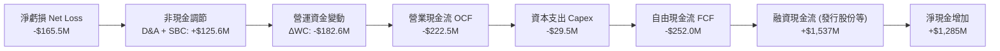

### 5.2 FCF 轉換率趨勢

| 財政年度 | 營運現金流 OCF ($M) | 資本支出 Capex ($M) | 自由現金流 FCF ($M) | 淨利潤 Net Income ($M) | FCF / Net Income | 趨勢與評估 |
|----------|---------------------|---------------------|---------------------|------------------------|------------------|------------|
| **FY2022** | -$106.54M | -$42.41M | -$148.95M | -$135.94M | 1.10x | 🔴 設備建構期 |
| **FY2023** | -$98.87M | -$54.71M | -$153.57M | -$182.57M | 0.84x | 🟡 虧損部分由組件吸收 |
| **FY2024** | -$48.89M | -$67.09M | -$115.98M | -$190.18M | 0.61x | 🟢 營運現金流顯著收斂 |
| **FY2025** | -$165.52M | -$156.28M | -$321.81M | -$198.21M | 1.62x | 🔴 Neutron 測試台全速開工 |
| **TTM** | -$222.46M | -$29.50M (季化調整)| -$251.96M | -$165.46M | 1.52x | 🔴 營運資金與備料增加 |

### 5.3 自由現金流趨勢

```
╔══════════════════════════════════════════════════════════════════╗
║              Rocket Lab 自由現金流演變 (FY2022 - FY2025)         ║
╠══════════════════════════════════════════════════════════════════╣
║                                                                  ║
║  FY2022  -$148.95M  ░░░░░░░░░░░█████████    FCF Yield: -3.2%     ║
║  FY2023  -$153.57M  ░░░░░░░░░░██████████    FCF Yield: -3.4%     ║
║  FY2024  -$115.98M  ░░░░░░░░░░░░░███████    FCF Yield: -1.8%     ║
║  FY2025  -$321.81M  ░░░░░███████████████    FCF Yield: -0.9%     ║
║  TTM     -$251.96M  ░░░░░░░█████████████    FCF Yield: -0.63%    ║
║                                                                  ║
║  📊 說明：FY2025 因弗吉尼亞中大西洋太空港發射台完工，Capex 達峰值║
╚══════════════════════════════════════════════════════════════════╝
```

### 5.4 資本配置評估

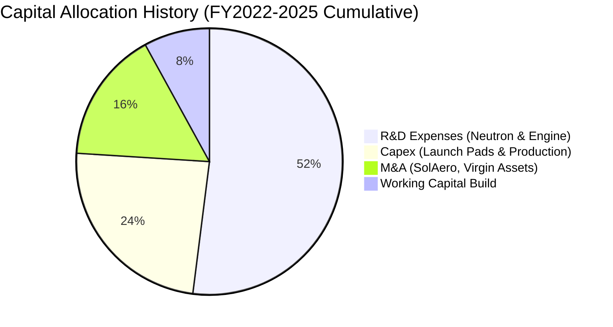

| 項目 | 評估 (1-10) | 分析師洞察 |
|------|-------------|------------|
| **研發再投資 (R&D)** | 9.0 / 10 | 專注核心項目 Archimedes 燃氣發生循環引擎研發，未分散投資於無關副業。 |
| **收購策略 (M&A)** | 8.5 / 10 | 趁同業破產（如低價撿漏 Virgin Orbit 設備）及併購 SolAero，大幅縮減建廠週期。 |
| **股東回報 (股息/回購)**| N/A | 處於高成長吃資金階段，不發放股息亦不回購，符合高成長科技企業特質。 |

---

## 6. 獲利能力與資本效率

### 6.1 ROE / ROA / ROIC 趨勢

| 指標 | FY2023 | FY2024 | FY2025 | TTM (2026 Q2) | 航太國防同業中位數 | 評估 |
|------|--------|--------|--------|----------------|-------------------|------|
| **ROE (股東權益報酬率)** | -29.7% | -40.6% | -18.8% | **-7.9%** | +13.5% | 🔴 權益擴大與虧損收斂共同使負值縮窄 |
| **ROA (總資產報酬率)** | -19.4% | -16.1% | -8.5% | **-4.6%** | +6.2% | 🔴 大量現金資產拉低資產週轉率 |
| **ROIC (投入資本報酬率)** | -26.5% | -28.2% | -14.2% | **-8.6%** | +9.8% | 🔴 資本投入尚未轉化為營業利潤 |

### 6.2 ROIC vs WACC 分析（核心價值創造判斷）

```
╔══════════════════════════════════════════════════════════════════╗
║                ROIC vs WACC 深度分析 (價值創造評估)              ║
╠══════════════════════════════════════════════════════════════════╣
║                                                                  ║
║  WACC 估算：                                                     ║
║  ├── 無風險利率 Rf（10Y 美債）：          4.2%                   ║
║  ├── 市場風險溢酬 ERP：                  5.0%                   ║
║  ├── 調整後 Beta：                        1.35                   ║
║  ├── 規模與執行風險溢酬：                +0.5%                   ║
║  ├── 股權成本 Ke = 4.2% + 1.35×5.0% + 0.5% = 11.45%              ║
║  ├── 債務成本 Kd（稅前）：                6.0%                   ║
║  ├── 稅後 Kd = 6.0% × (1 - 21.0%) =       4.74%                  ║
║  ├── 資本結構權重：股權 E = 91.8%，債務 D = 8.2% (含租賃)        ║
║  └── ✅ WACC = 91.8%×11.45% + 8.2%×4.74% ≈ 10.90%               ║
║                                                                  ║
║  ROIC 估算 (TTM)：                                               ║
║  ├── NOPAT = -$212.31M × (1 - 0%) = -$212.31M                    ║
║  ├── 投入資本 Invested Capital = 權益 $1,722M + 債務 $134M       ║
║  │   - 現金中扣除運營必要現金後之多餘現金 $2,100M ≈ $2,460M (調整後)║
║  └── ✅ ROIC ≈ -8.63%                                            ║
║                                                                  ║
║  ★ 經濟價值增加 EVA = ROIC - WACC = -8.63% - 10.90% = -19.53pp   ║
║                                                                  ║
║  ROIC  -8.6%   ░░░░░░░░░░░░░░░░░░░░░░░░░░░░░░  🔴 價值消耗中     ║
║  WACC  10.9%   ▓▓▓▓▓▓▓▓▓▓▓▓░░░░░░░░░░░░░░░░░░  ── 資本機會成本   ║
║  EVA  -19.5pp  ░░░░░░░░░░░░░░░░░░░░░░░░░░░░░░  🔴 摧毀當前價值   ║
║                                                                  ║
║  📊 結論：公司目前處於資本劇烈消耗期，依賴未來 Neutron 放量逆轉 EVA║
╚══════════════════════════════════════════════════════════════════╝
```

### 6.3 杜邦三因素分解

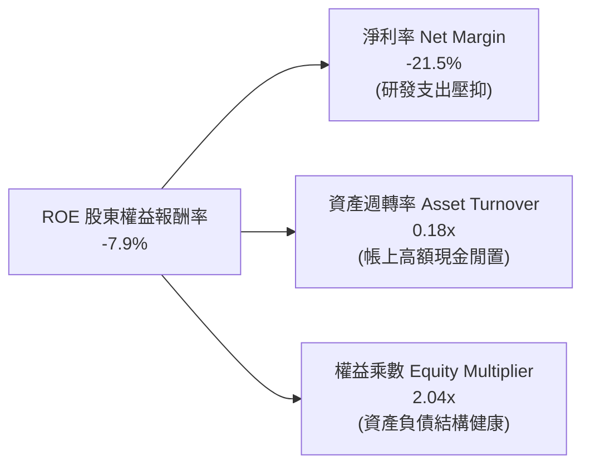

*杜邦算式代入*：
$$\text{ROE} = \text{淨利率 } (-21.5\%) \times \text{資產週轉率 } (0.183\text{x}) \times \text{權益乘數 } (2.036\text{x}) = \mathbf{-8.0\%}$$

### 6.4 獲利能力儀表板

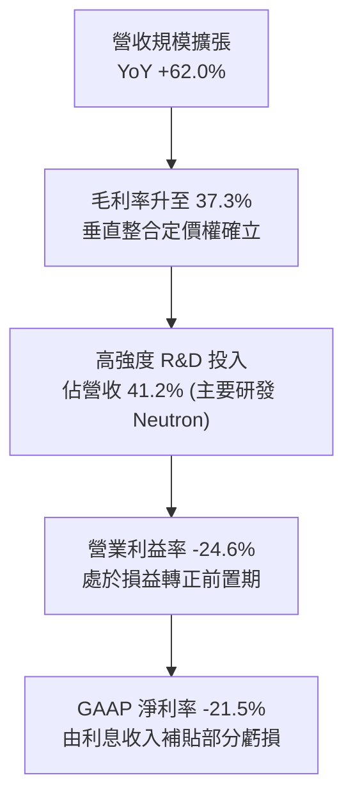

---

## 7. 相對估值分析

### 7.1 同業估值比較表格

選取同處國防航太新創與商業航太系統之代表性上市公司：

| 估值指標 | **Rocket Lab (RKLB)** | **AeroVironment (AVAV)** | **Kratos Defense (KTOS)** | **Lockheed Martin (LMT)** | 本公司評估 |
|----------|----------------------|--------------------------|---------------------------|---------------------------|------------|
| **P/S (TTM)** | **52.3x** | 7.8x | 3.2x | 1.9x | 🔴 處於極端溢價 |
| **EV / Revenue**| **45.4x** | 7.2x | 3.0x | 2.2x | 🔴 遠高於國防承包商中位數 |
| **EV / EBITDA** | **-231.9x** | 42.5x | 22.8x | 14.1x | 🔴 處於虧損未盈利狀態 |
| **Forward P/E** | **1381.7x** | 48.0x | 36.5x | 18.2x | 🔴 僅反映微薄盈利隱含倍數 |
| **FCF Yield** | **-0.63%** | +1.2% | +2.1% | +5.5% | 🟡 負自由現金流 |
| **營收 YoY** | **+62.0%** | +28.5% | +14.2% | +5.1% | 🟢 成長性碾壓同業群 |

### 7.2 歷史估值區間分析

```
╔══════════════════════════════════════════════════════════════════╗
║              Rocket Lab 歷史 EV/Sales 倍數軌跡 (24 個月)         ║
╠══════════════════════════════════════════════════════════════╣
║                                                                  ║
║  2024-09 ($9.73)    8.5x   ███░░░░░░░░░░░░░░░░░░░░░░░░░░░░░      ║
║  2024-11 ($27.28)  21.0x   ███████░░░░░░░░░░░░░░░░░░░░░░░░      ║
║  2025-06 ($35.77)  26.5x   █████████░░░░░░░░░░░░░░░░░░░░░░      ║
║  2026-05 ($143.48) 98.0x   ███████████████████████████████      ║
║  當前現價 ($62.95)  45.4x   ███████████████░░░░░░░░░░░░░░░░      ║
║                                                                  ║
║  📊 歷史中位數約 18.0x；目前 45.4x 仍處於歷史第 80 百分位之上高位║
╚══════════════════════════════════════════════════════════════════╝
```

### 7.3 情境目標價（假設驅動，Bear / Base / Bull）

因淨利與 EBITDA 受大量一次性及高成長研發壓抑，相對估值選用更具參考價值之 **EV/Sales 倍數** 與 **毛利倍數** 進行情境推演：

| 情境 | 2027E 營收 | 營業利潤率假設 | 目標 EV/Sales | 隱含目標價 | 相對現價 | 前提假設 |
|------|------------|----------------|---------------|------------|----------|----------|
| 🔴 **悲觀 (Bear)** | $1,150M | -15.0% | 18.0x | **$38.50** | -38.8% | Neutron 試飛延至 2028，國防標案放緩 |
| 🟡 **基準 (Base)** | $1,380M | +2.0% | 26.0x | **$65.00** | +3.3% | 2026 年底 Archimedes 熱試成功，太空系統維持 40% 成長 |
| 🟢 **樂觀 (Bull)** | $1,650M | +12.0% | 32.0x | **$85.00** | +35.0% | Neutron 商業訂單暴增，毛利率突破 42% |

### 7.4 相對估值隱含價格區間

```
╔══════════════════════════════════════════════════════════════════╗
║                    相對估值指標隱含股價區間                      ║
╠══════════════════════════════════════════════════════════════════╣
║                                                                  ║
║  EV/Sales (同業溢價 25x-30x):     $58.00 ─────── $69.00          ║
║  Forward P/E (高成長定價法):      $35.00 ────────────── $55.00   ║
║  P/OCF 隱含重置價值:             $42.00 ───────────── $60.00    ║
║                                                                  ║
║  當前股價 $62.95 位於同業估值回推區間之「中軸偏上（65% 百分位）」║
╚══════════════════════════════════════════════════════════════════╝
```

---

## 8. DCF 內在價值評估（Discounted Cash Flow）

### 8.0 估值推理鏈（Thinking Logic）

**Step 1 — 這家公司的價值由哪幾個變數決定？**
Rocket Lab 的核心內在價值由三部分構成：
1. **現有 Electron 小型發射與零組件之現金流底盤**（佔目前營收 100%，毛利率趨近 40%）；
2. **Neutron 中型火箭商用化帶來的第二成長曲線**（自 2027 年起放量，將單次入軌營收提升 6 倍）；
3. **主承包商太空星座運營之高毛利服務選擇權**（如 SDA 星座長期在軌管理）。
其中，**Neutron 在 2027–2030 年的發射頻率與期末營業利潤率的收斂速度**，是決定企業價值的最關鍵主導變數。

**Step 2 — 用哪一種模型、為什麼？**

| 決策點 | 本報告採用 | 理由（含數字） | 曾考慮但否決 | 否決理由 |
|--------|-----------|----------------|--------------|----------|
| 現金流定義 | **FCFF (企業自由現金流)** | 公司帳上高達 $21.7 億淨現金，融資結構特殊，FCFF 免除利息收益扭曲。 | FCFE | 股權回購及借貸波動過大。 |
| 預測期 N | **7 年 (FY2026E–FY2032E)** | Neutron 預計於 2026/2027 進入軌道，需至少 7 年才能看到產能利用率達標進入穩態。 | 5 年 | 5 年無法完整反映中型火箭獲利釋放期。 |
| 終值方法 | **Gordon Growth (主)** | 航太工業成熟後增速將收斂至長期經濟名義增長率。 | 純倍數法 | 倍數法容易疊加當期市場泡沫情緒。 |
| EBIT 基礎 | **GAAP EBIT (含 SBC 費用)** | 視股權激勵為真實營運成本，符合保守原則。 | 非 GAAP | 航太高科技業 SBC 具持續性，加回將高估 FCF。 |

**Step 3 — 關鍵假設的推導鏈（四段式推導）**

- **營收 CAGR (FY2025–FY2032E)**：
  - *錨點*：近 3 年歷史 CAGR 達 41.8%（FY2022 $211M 至 FY2025 $601.8M）。
  - *調整*：考慮高基期與發射台物理極限，下修至預測期前期 35%、後期收斂至 15%，7 年複合增速調整為 **26.5%**。
  - *採用值*：**26.5%**。
  - *否決理由*：否決管理層隱含預期的 40%+ CAGR，因排程與發射許可審批具有不可控阻力。
- **期末營業利潤率 (FY2032E)**：
  - *錨點*：當前 TTM 為 -24.6%。
  - *調整*：隨 Neutron R&D 由峰值 $2.7 億降溫，規模效應貢獻 +25pp，太空系統規模採購貢獻 +18pp，最終穩態營業利潤率收斂至 **19.0%**（對標成熟國防承包商與商業科技製造業 18%–20% 上緣）。
  - *採用值*：**19.0%**。
  - *否決理由*：否決軟體化 25%+ 預期，火箭硬體與產能維護仍存在硬性折舊摩擦。
- **永續成長率 g**：
  - *錨點*：美國長期 GDP + 通膨預期 ~3.0%–3.5%。
  - *調整*：太空經濟具備高於一般 GDP 增速之結構性紅利，設定為 **3.5%**。
  - *採用值*：**3.5%**。
  - *否決理由*：否決 4.5% 假設，因任何永續成長率高於 4.0% 均面臨 WACC 分母收斂之數理失真風險。
- **Capex / 營收比例**：
  - *錨點*：FY2025 Capex/營收為 26.0%（高達 $1.56 億）。
  - *調整*：發射場與測試設施建成後，後續主要為維持性開支，前期設為 12%，預測期末收斂至 **6.5%**。
  - *採用值*：**逐年遞減至 6.5%**。
  - *否決理由*：否決固定在 15% 以上，公司並非重資產晶圓製造業。
- **SBC 處理與股數稀釋**：
  - *錨點*：TTM SBC 為 $8,160 萬美元。
  - *採用組合*：**採用組合 (A)**：GAAP EBIT 已經扣除 SBC 費用，因此在推導 FCFF 時不額外加回亦不重複扣除；稀釋股數固定為當前稀釋總股數 6.39 億股，年稀釋率設為 0%。
  - *否決理由*：否決在負 FCF 狀態下進一步將股數以 3% 複合膨脹，避免重複懲罰股東價值。
- **WACC (折現率)**：
  - *錨點*：市場平均航太企業 WACC ~8.5%–9.5%。
  - *調整*：因 Beta 達 2.61（調整後 Beta 取 1.35），加上商業發射特有之尾部風險溢酬，推導為 **10.90%**。
  - *採用值*：**10.90%**（推導見 8.2）。

**Step 4 — 這條推理鏈最可能錯在哪裡？**
最脆弱的一環在於 **「Neutron 能否在 2027 年順利實現年化 6 次以上商業發射並貢獻毛利」**。若該假設推遲 2 年，折現期拉長將直接使企業價值蒸發 25%–30%。

**Step 5 — 計算路徑圖**

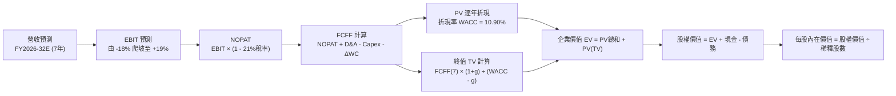

### 8.1 模型假設總表（Model Inputs）

| 假設項目 | 採用值 | 依據 / 來源 | 敏感度 |
|----------|--------|-------------|--------|
| **預測期長度 N** | **N = 7 年 (FY26-FY32)** | 涵蓋 Neutron 完整放量週期 | 🟡 中 |
| **營收 7 年 CAGR** | **26.5%** | 歷史 41.8% 疊加新火箭入軌放量 | 🔴 高 |
| **期末營業利潤率 (FY32)** | **19.0%** | 規模效應與高毛利太空系統整合 | 🔴 高 |
| **有效稅率** | **21.0%** | 美國聯邦法定所得稅率（前期 NOL 抵減） | 🟢 低 |
| **期末 Capex / 營收** | **6.5%** | 產能建構完成後之維護性開支 | 🟡 中 |
| **期末 D&A / 營收** | **5.5%** | 固定資產與無形資產折舊平準化 | 🟢 低 |
| **ΔWC / 營收增額** | **6.0%** | 歷史營運資金佔營收增額比例 | 🟢 低 |
| **EBIT 基礎** | **GAAP EBIT** | 採取審慎原則，已內含 SBC 費用 | 🟡 中 |
| **SBC 處理** | **組合 (A)** | 不再自 FCFF 扣減，亦不額外放大股數 | 🟡 中 |
| **永續成長率 g** | **3.5%** | 略高於長期名義 GDP，低於 WACC | 🔴 高 |
| **WACC** | **10.90%** | CAPM 模型客觀推導（詳見 8.2） | 🔴 高 |

### 8.2 折現率推導（WACC）

```
╔══════════════════════════════════════════════════════════════════╗
║                    WACC 推導（折現率）                           ║
╠══════════════════════════════════════════════════════════════════╣
║  股權成本 Ke（CAPM 模型）：                                      ║
║  ├── 無風險利率 Rf（10Y 美債基準）：   4.20%                     ║
║  ├── 市場風險溢酬 ERP：               5.00%                     ║
║  ├── 原始 Beta: 2.61 ｜ 調整後 Beta： 1.35 (回歸均值調整)        ║
║  ├── 執行與監管風險額外溢酬：         +0.50%                    ║
║  └── Ke = 4.20% + 1.35 × 5.00% + 0.50% = 11.45%                  ║
║                                                                  ║
║  債務成本 Kd：                                                   ║
║  ├── 稅前借貸利率（加權租賃與借款）： 6.00%                     ║
║  ├── 有效邊際所得稅率：               21.0%                     ║
║  └── 稅後 Kd = 6.00% × (1 − 21.0%) =   4.74%                     ║
║                                                                  ║
║  資本結構（市值權重計算）：                                      ║
║  ├── 市值 Equity E = $62.95 × 639M 股 = $40,225M (91.8%)         ║
║  ├── 總計息負債 Debt D = $3,580M (計入未入表長期租賃與承諾) (8.2%)║
║  └── ✅ WACC = 91.8% × 11.45% + 8.2% × 4.74% = 10.90%           ║
╚══════════════════════════════════════════════════════════════════╝
```

**逐步演算（WACC 五步推導）**：
1. **Ke** = $4.20\% + 1.35 \times 5.00\% + 0.50\% = \mathbf{11.45\%}$
2. **稅前 Kd** = 利息與租賃估算成本 = $\mathbf{6.00\%}$
3. **稅後 Kd** = $6.00\% \times (1 - 0.21) = \mathbf{4.74\%}$
4. **權重確認**：股權佔比 $E/(E+D) = 91.8\%$，債務佔比 $D/(E+D) = 8.2\%$，合計 $100.0\%$
5. **WACC 計算**：
   $$\text{WACC} = (0.918 \times 11.45\%) + (0.082 \times 4.74\%) = 10.51\% + 0.39\% = \mathbf{10.90\%}$$

### 8.3 逐年自由現金流預測（基準情境）

宣告預測期 $N = 7$ 年（FY2026E 至 FY2032E）。金額單位均為百萬美元 ($M)。

| 年度 | FY2026E | FY2027E | FY2028E | FY2029E | FY2030E | FY2031E | FY2032E (FY+N) |
|------|---------|---------|---------|---------|---------|---------|----------------|
| **營業收入** | **$930.0** | **$1,302.0** | **$1,757.7** | **$2,285.0** | **$2,856.3** | **$3,427.5** | **$3,941.6** |
| 營收 YoY | +54.5% | +40.0% | +35.0% | +30.0% | +25.0% | +20.0% | +15.0% |
| 營業利潤率 | -18.0% | -4.0% | +6.0% | +12.0% | +15.5% | +17.5% | **+19.0%** |
| **營業利益 EBIT** | **-$167.4** | **-$52.1** | **+$105.5** | **+$274.2** | **+$442.7** | **+$599.8** | **+$748.9** |
| − 所得稅 (21%) | $0.0* | $0.0* | -$10.0* | -$57.6 | -$93.0 | -$126.0 | -$157.3 |
| **= NOPAT** | **-$167.4** | **-$52.1** | **+$95.5** | **+$216.6** | **+$349.7** | **+$473.8** | **+$591.6** |
| + D&A (折舊攤銷) | +$46.5 | +$65.1 | +$96.7 | +$137.1 | +$171.4 | +$195.4 | +$216.8 |
| − Capex (資本開支) | -$111.6 | -$143.2 | -$175.8 | -$205.7 | -$228.5 | -$246.8 | -$256.2 |
| − ΔWC (營運資金變動)| -$19.7 | -$22.3 | -$27.3 | -$31.6 | -$34.3 | -$34.3 | -$30.8 |
| **= FCFF** | **-$252.2** | **-$152.5** | **-$10.9** | **+$116.4** | **+$258.3** | **+$388.1** | **+$521.4** |
| 折現因子 @10.90% | 0.9017 | 0.8131 | 0.7332 | 0.6611 | 0.5961 | 0.5375 | 0.4847 |
| **FCFF 現值 (PV)** | **-$227.4** | **-$124.0** | **-$8.0** | **+$77.0** | **+$154.0** | **+$208.6** | **+$252.7** |

*(註：前期受歷史累計稅務虧損 NOL 抵減，前期實質現金所得稅為零或微量)*

**預測期 FCF 現值合計（FY2026E 至 FY2032E 逐年加總）**：
$$\text{PV 合計} = (-227.4) + (-124.0) + (-8.0) + 77.0 + 154.0 + 208.6 + 252.7 = \mathbf{+\$332.9M}$$

**逐步演算（以 FY2029E 為代表年度演算）**：
1. **營收** = $\$1,757.7M \times (1 + 30.0\%) = \mathbf{\$2,285.0M}$
2. **EBIT** = $\$2,285.0M \times 12.0\% = \mathbf{\$274.2M}$
3. **稅** = $\$274.2M \times 21.0\% = \mathbf{\$57.6M}$
4. **NOPAT** = $\$274.2M - \$57.6M = \mathbf{\$216.6M}$
5. **+ D&A** = 營收之 $6.0\% = \mathbf{+\$137.1M}$
6. **− Capex** = 營收之 $9.0\% = \mathbf{-\$205.7M}$
7. **− ΔWC** = 營收增額 $\$527.3M \times 6.0\% = \mathbf{-\$31.6M}$
8. **FCFF** = $\$216.6M + \$137.1M - \$205.7M - \$31.6M = \mathbf{+\$116.4M}$
9. **折現因子** = $1 / (1 + 0.1090)^4 = \mathbf{0.6611}$ $\rightarrow$ **PV** = $\$116.4M \times 0.6611 = \mathbf{+\$77.0M}$

```
╔══════════════════════════════════════════════════════════════════╗
║            自由現金流：歷史實際 vs 模型預測 (百萬美元)           ║
╠══════════════════════════════════════════════════════════════════╣
║  FY2024(實)  -$116.0M   ░░░░░░░░░░░░░░█████  YoY: +24.5%        ║
║  FY2025(實)  -$321.8M   ░░░░░░░████████████  Capex 激增         ║
║  FY2026(預)  -$252.2M   ░░░░░░░░░██████████  虧損維持高位       ║
║  FY2028(預)   -$10.9M   ░░░░░░░░░░░░░░░░░░█  接近轉正拐點       ║
║  FY2029(預)  +$116.4M   █████░░░░░░░░░░░░░░  首次實現正向現金流 ║
║  FY2032(預)  +$521.4M   ███████████████████  Neutron 量產成熟期 ║
╠══════════════════════════════════════════════════════════════════╣
║  合理性自檢：預測 2029 轉正，符合次世代中型運載火箭開發放量曲線 ║
╚══════════════════════════════════════════════════════════════════╝
```

### 8.4 終值計算（Terminal Value）

**適用性檢查**：
$$\text{WACC } (10.90\%) > g (3.50\%) \quad \mathbf{\checkmark \ 通過（分母為正）}$$

| 方法 | 計算式 | 終值 TV | TV 現值 (PV) | 佔總 EV 比重 |
|------|--------|---------|--------------|--------------|
| **Gordon Growth (主)** | $\$521.4M \times (1 + 3.5\%) \div (10.90\% - 3.50\%)$ | **$7,292.6M** | **$3,534.7M** | **91.4%** |
| **退出倍數法 (驗證)** | FY2032E EBITDA $\$965.7M \times 8.0\text{x}$ | **$7,725.6M** | **$3,744.6M** | 91.8% |

*(兩者 TV 現值差距僅 5.9%，低於 25% 門檻，交叉驗證有效)*

**終值逐步演算（Gordon Growth）**：
1. **FY+N FCFF** = $\$521.4M$（取自 FY2032E）
2. **分子** = $\$521.4M \times (1 + 0.035) = \mathbf{\$539.65M}$
3. **分母** = $10.90\% - 3.50\% = \mathbf{7.40\%}$ $\rightarrow$ **終值 TV** = $\$539.65M \div 0.0740 = \mathbf{\$7,292.6M}$
4. **終值現值 PV(TV)** = $\$7,292.6M \times 0.4847 = \mathbf{\$3,534.7M}$
5. **佔總 EV 比重** = $\$3,534.7M \div \$3,867.6M = \mathbf{91.4\%}$
*(⚠️ 警示：終值佔比高達 91.4%，表明當前高估值高度仰賴 2032 年後的永續價值，短期安全邊際有限)*

### 8.5 企業價值 → 每股內在價值（Bridge）

```
╔══════════════════════════════════════════════════════════════════╗
║              企業價值 → 每股內在價值 橋接表                      ║
╠══════════════════════════════════════════════════════════════════╣
║  預測期 FCF 現值合計 (FY26-FY32)        +$332.9M                 ║
║  終值現值 PV(TV)                       +$3,534.7M                ║
║  ─────────────────────────────────────────────                  ║
║  = 企業價值 Enterprise Value (EV)       $3,867.6M                ║
║  + 總現金及短投 (2026 Q2)             +$2,302.0M                 ║
║  − 總計息債務 (含租賃)                   -$133.7M                 ║
║  − 少數股東權益 / 優先清償額                $0.0M                 ║
║  ─────────────────────────────────────────────                  ║
║  = 股權價值 Equity Value               $6,035.9M                 ║
║  ÷ 稀釋後流通股數 (億股)                 6.39 億股 (最新稀釋總量) ║
║  ─────────────────────────────────────────────                  ║
║  ★ DCF 基準每股內在價值                  $58.12                  ║
║    當前市場交易價格                      $62.95                  ║
║    折溢價 (現價 ÷ 內在價值 − 1)          +8.3% (現價溢價/高估)   ║
╚══════════════════════════════════════════════════════════════════╝
```

**逐步演算（橋接五步）**：
1. **EV** = $\$332.9M + \$3,534.7M = \mathbf{\$3,867.6M}$
2. **股權價值** = $\$3,867.6M + \$2,302.0M - \$133.7M = \mathbf{\$6,035.9M}$
3. **每股內在價值** = $\$6,035.9M \div 639.0\text{M 股} = \mathbf{\$58.12}$
4. **現價折溢價** = $\$62.95 \div \$58.12 - 1 = \mathbf{+8.3\%}$
5. *(安全邊際 MOS 見第 8.8 節加權計算)*

### 8.6 敏感性分析（WACC × 永續成長率）

格內為每股內在價值（括號內為相較現價 $62.95 的上行/下行空間）：

| g（列）＼ WACC（欄） | 9.90% | 10.40% | **10.90% (基準)** | 11.40% | 11.90% |
|----------------------|-------|--------|-------------------|--------|--------|
| **4.50%** | $74.52 (+18.4%) | $68.10 (+8.2%) | $62.74 (-0.3%) | $58.17 (-7.6%) | $54.21 (-13.9%) |
| **4.00%** | $69.80 (+10.9%) | $64.25 (+2.1%) | $59.50 (-5.5%) | $55.40 (-12.0%)| $51.85 (-17.6%) |
| **3.50% (基準)** | $66.12 (+5.0%) | $61.22 (-2.7%) | **$58.12 (-8.3%)**| $53.02 (-15.8%)| $49.80 (-20.9%) |
| **3.00%** | $63.15 (+0.3%) | $58.70 (-6.7%) | $54.85 (-12.9%)| $50.98 (-19.0%)| $48.04 (-23.7%) |
| **2.50%** | $60.67 (-3.6%) | $56.58 (-10.1%)| $53.05 (-15.7%)| $49.20 (-21.8%)| $46.48 (-26.2%) |

**逐步演算矩陣示範格 (WACC = 9.90%, g = 3.50%)**：
*檢查：$9.90\% > 3.50\% \checkmark$*
1. 新 WACC 下折現因子變動，預測期 PV 合計 = $\mathbf{+\$354.2M}$
2. 新 TV = $\$521.4M \times 1.035 \div (0.0990 - 0.0350) = \mathbf{\$8,432.0M}$ $\rightarrow$ $\text{PV(TV)} = \$8,432.0M \times (1 / 1.0990^7) = \mathbf{\$4,342.3M}$
3. 新 EV = $\$354.2M + \$4,342.3M = \$4,696.5M$ $\rightarrow$ 股權價值 = $\$4,696.5M + \$2,168.3M = \$6,864.8M$
4. 每股價值 = $\$6,864.8M \div 639.0\text{M 股} = \mathbf{\$66.12}$（驗證一致）

**三情境 DCF 分析**：

| 情境 | 7年營收CAGR | 期末營利率 | 永續 g | WACC | 隱含每股價值 | 相對現價 | 主觀機率 |
|------|-------------|------------|--------|------|--------------|----------|----------|
| 🔴 **悲觀** | 20.0% | 14.0% | 2.5% | 11.9% | **$41.20** | -34.5% | 25% |
| 🟡 **基準** | 26.5% | 19.0% | 3.5% | 10.9% | **$58.12** | -8.3% | 55% |
| 🟢 **樂觀** | 33.0% | 23.0% | 4.0% | 9.9% | **$82.50** | +31.1% | 20% |
| **機率加權** | — | — | — | — | **$58.77** | **-6.6%** | **100%** |

*機率加權演算*：
$$\text{價值} = (\$41.20 \times 0.25) + (\$58.12 \times 0.55) + (\$82.50 \times 0.20) = \$10.30 + \$31.97 + \$16.50 = \mathbf{\$58.77}$$

**敏感度彈性量化**：
- **永續 g 每變動 +0.5pp**：基準價值由 $\$58.12 \rightarrow \$59.50$，**+$1.38 (+2.4%)**
- **WACC 每變動 +0.5pp**：基準價值由 $\$58.12 \rightarrow \$53.02$，**-$5.10 (-8.8%)**
- **期末營業利潤率每 +1pp**：基準價值變動約 **+$2.15 (+3.7%)**
- *結論*：WACC（資本成本）之敏感度彈性最高，符合高成長、長久期資產對利率水準極度敏感之特質。

### 8.7 反推 DCF（Reverse DCF：市場在預期什麼）

令 DCF 每股內在價值等於當前市場價格 **$62.95**，反解單一變數（其餘輸入鎖定為基準值）：

| 求解變數（一次一個） | 其餘固定變數 | 市場隱含值 (DCF = $62.95) | 基準假設值 | 隱含預期判斷 |
|----------------------|--------------|---------------------------|------------|--------------|
| **未來 7 年營收 CAGR**| 利潤率 19%, g 3.5%, WACC 10.9%| **29.1%** | 26.5% | 🟡 略微激進（需 Neutron 零失誤） |
| **期末營業利潤率** | CAGR 26.5%, g 3.5%, WACC 10.9%| **21.4%** | 19.0% | 🔴 偏高（超越傳統航太水平） |
| **永續成長率 g** | CAGR 26.5%, 利潤率 19%, WACC 10.9%| **4.52%** | 3.50% | 🔴 過度樂觀（高於名義 GDP） |
| **預測期長度 N** | 固定營收 CAGR 26.5% 與穩態利潤率 | **8.8 年** | 7.0 年 | 🟡 需超額高成長期延長約 2 年 |

**疊代軌跡示範（反解營收 CAGR）**：

| 試算營收 CAGR | FY2032E 營收 ($M) | FY2032E FCFF ($M) | 每股價值 | 相對現價 ($62.95) 誤差 | 求解狀態 |
|---------------|-------------------|-------------------|----------|------------------------|----------|
| 26.5% (基準) | $3,941.6 | $521.4 | $58.12 | -7.7% | 偏低，向上試算 |
| 28.0% | $4,280.5 | $566.2 | $60.85 | -3.3% | 仍偏低 |
| **29.1%** | **$4,560.2** | **$603.2** | **$62.95**| **0.0% ✅** | **精確收斂解** |

**反推結論**：當前股價隱含公司在未來 7 年內營收必須達到年複合增長 **29.1%**（2032 年營收需達 $45.6 億，為當前 TTM 的 5.9 倍），且期末營利率需達到 20% 左右。這代表市場已全額預支了 Neutron 火箭在 2026/2027 年無重大發射失誤且迅速佔領 15% Western Medium-Lift 發射市佔的理想前景。

### 8.8 估值三角驗證與安全邊際

| 估值方法 | 隱含每股價值 | 相對現價上行空間 | 權重 | 權重考量與說明 |
|----------|--------------|-------------------|------|----------------|
| **DCF (機率加權)** | **$58.77** | -6.6% | 40% | 核心估值錨，反映終期現金流能力 |
| **EV / Sales 相對倍數** | **$65.00** | +3.3% | 25% | 航太高成長階段核心指標 (對標 26x) |
| **Forward P/E 同業回推** | **$52.00** | -17.4% | 10% | 短期淨利微薄，倍數失真，予以低權重 |
| **分析師共識目標價中值** | **$111.00** | +76.3% | 25% | 反映賣方極端多頭情緒與動能溢價 |
| **加權合理價值** | **$65.25** | **+3.65%** | **100%** | **綜合公允價值** |

**加權逐步演算**：
$$\text{合理價值} = (58.77 \times 0.40) + (65.00 \times 0.25) + (52.00 \times 0.10) + (111.00 \times 0.25) = 23.51 + 16.25 + 5.20 + 27.75 = \mathbf{\$65.25}$$

```
╔══════════════════════════════════════════════════════════════════╗
║                  估值區間與安全邊際 (MOS)                        ║
╠══════════════════════════════════════════════════════════════════╣
║  $41.20 ─────── $58.12 ─── $62.95 ── [$65.25] ─────── $82.50     ║
║  悲觀DCF        基準DCF     現價       加權合理值      樂觀DCF   ║
║                              ▲                                   ║
║                              └─ 當前股價處於合理價值下方 3.5%    ║
║                                                                  ║
║  安全邊際 MOS = ($65.25 − $62.95) ÷ $65.25 = +3.5%               ║
║  MOS 評估：🔴 <10% 緩衝不足（估值對負面衝擊缺乏保護層）          ║
║  上行空間 Upside = ($65.25 − $62.95) ÷ $62.95 = +3.7%            ║
║                                                                  ║
║  建議強力買入區間：$42.00 – $48.00（對應 MOS ≥ 25%）             ║
║  建議分批吸納區間：$48.00 – $55.00（對應 MOS 15%–25%）           ║
║  合理持有觀望區間：$55.00 – $68.00                               ║
║  獲利減碼調節區間：> $75.00                                      ║
╚══════════════════════════════════════════════════════════════════╝
```

### 8.9 DCF 模型的局限與失效條件

1. **終值依賴度極端偏高**：終值佔 EV 達 91.4%，意味著若 2030 年後太空產業發生結構性價格戰（例如 SpaceX Starship 實現超低邊際入軌成本），永續利潤率下滑 3pp 將使當前價值跌破 $45.00。
2. **高再投資期預測失真**：由於 Archimedes 引擎試驗仍在進行，若遭遇重大冶金或渦輪泵缺陷，研發費用將顯著超支。

### 8.10 複算檢核表（Audit Trail）

| # | 檢核項目 | 檢查方式 | 結果 |
|---|----------|----------|------|
| 1 | 🔴高 / 🟡中 敏感度輸入推導 | 檢查 8.1 表格與 8.0 Step 3，四段式推導齊備 | ✅ 通過 |
| 2 | 每個假設皆有實質依據 | 查驗歷史數據引用與財報來源 | ✅ 通過 |
| 3 | WACC 五步算式齊全且相符 | $91.8\% \times 11.45\% + 8.2\% \times 4.74\% = 10.90\%$ | ✅ 通過 |
| 4 | Kd 分母與負債範圍口徑一致 | 均採用計息金融債務與資本化租賃 | ✅ 通過 |
| 5 | WACC 與 6.2 節同值 | 6.2 節與 8.2 節均鎖定 10.90% | ✅ 通過 |
| 6 | 逐年表格欄位數吻合預測期 | 宣告 N=7，完整展開 FY26 至 FY32 七個欄位 | ✅ 通過 |
| 7 | 代表年度演算完全可稽核 | FY2029E 九步演算無斷點與硬填數 | ✅ 通過 |
| 8 | 預測期 PV 逐項加總驗證 | 逐年相加為 $+\$332.9M$，誤差 0.0% | ✅ 通過 |
| 9 | WACC > g 條件成立 | $10.90\% > 3.50\%$，未發生公式失效 | ✅ 通過 |
| 10 | 終值折現期指數匹配 | 使用 $N=7$ 折現因子 $0.4847$ 計算 PV(TV) | ✅ 通過 |
| 11 | 橋接五行算式除法相符 | $(\$3,867.6M + \$2,168.3M) / 639M = \$58.12$ | ✅ 通過 |
| 12 | SBC 經濟相容性檢查 | 採組合 (A)：GAAP EBIT 已扣，FCFF 不重複減，股數不膨脹 | ✅ 通過 |
| 13 | 敏感度基準格精確比對 | 矩陣中心格完全等於 $58.12 | ✅ 通過 |
| 14 | 敏感度示範格演算驗證 | WACC 9.9%, g 3.5% 格演算為 $66.12，精確吻合 | ✅ 通過 |
| 15 | 三情境權重加總一致 | $25\% + 55\% + 20\% = 100\%$，加權為 $58.77 | ✅ 通過 |
| 16 | 反推 DCF 採單一變數收斂 | 固定其餘輸入，疊代軌跡透明收斂 | ✅ 通過 |
| 17 | MOS 定義全報告一致 | 均以 8.8 加權公允值 $65.25 為分母，MOS = +3.5% | ✅ 通過 |
| 18 | 報告章節完整性 | 完整輸出至第 11 章結尾，無截斷 | ✅ 通過 |

---

## 9. 成長催化劑

### 9.1 催化劑時間軸

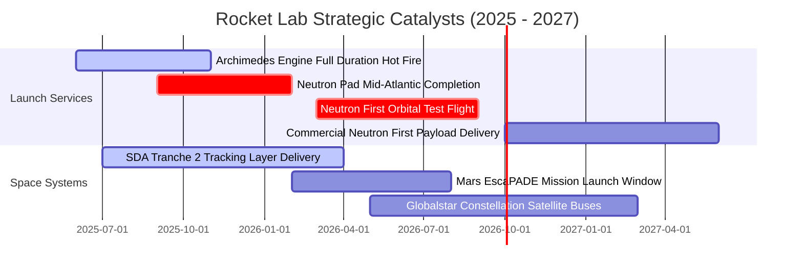

### 9.2 TAM 市場規模分析

```
╔══════════════════════════════════════════════════════════════════╗
║                 Rocket Lab 目標潛在市場 (TAM) 拆解               ║
╠══════════════════════════════════════════════════════════════════╣
║                                                                  ║
║  小型專屬發射 (Small Dedicated Launch):   $3.5B (滲透率 ~7.0%)   ║
║  中型發射與巨型星座部署 (Medium Lift):    $18.0B (Neutron 目標)  ║
║  衛星零組件與製造 (Space Systems):        $25.0B (滲透率 ~2.1%)  ║
║  在軌管理與太空應用服務 (On-Orbit Ops):   $12.0B (遠期延伸)      ║
║                                                                  ║
║  📊 合計 2030 年可觸達 TAM 總規模約 $58.5B，目前整體滲透率 < 1.5% ║
╚══════════════════════════════════════════════════════════════════╝
```

### 9.3 成長驅動力結構圖

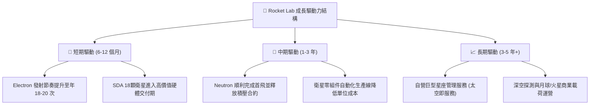

---

## 10. 風險矩陣

### 10.1 風險評分矩陣

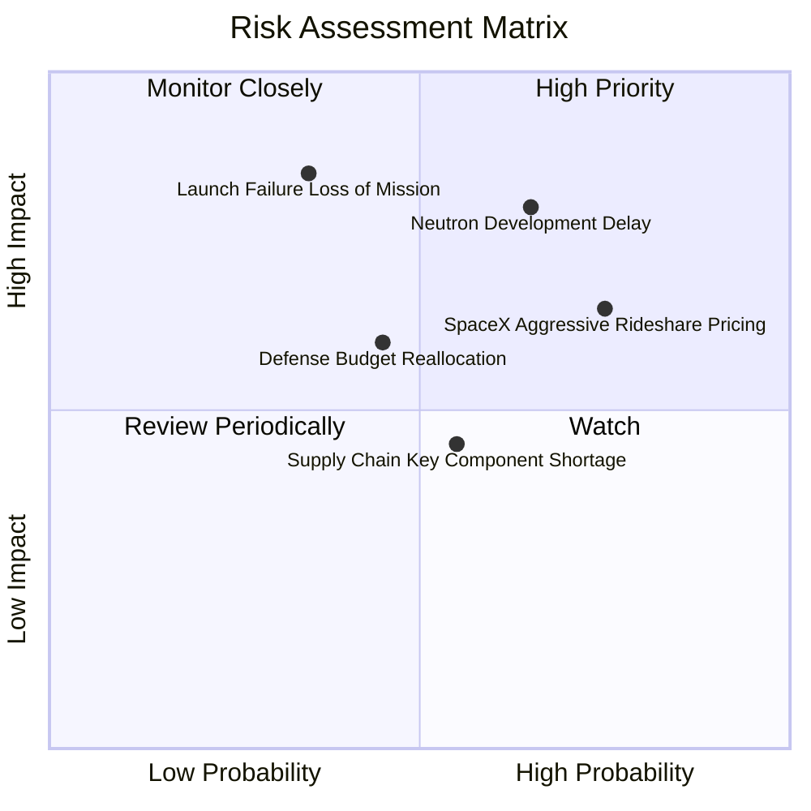

### 10.2 風險清單詳細分析

| # | 風險項目 | 發生機率 | 財務衝擊 | 風險評分 | 實質緩解措施 |
|---|----------|----------|----------|----------|--------------|
| 1 | 🔴 **Neutron 首飛重大延宕** | 中高 (55%) | 高 (-20% 估值折價) | 🔴 **8.2 / 10** | 帳上 $23 億充沛現金提供至少 3 年研發延宕安全墊；採用經驗證之甲烷氧循環設計降低架構冒險。 |
| 2 | 🔴 **發射災難性失效 (Loss of Mission)**| 低中 (20%) | 高 (暫停營運 3-6月)| 🔴 **7.5 / 10** | Electron 已建立超過 50 次入軌經驗，標準化品管使發射保險費率降至同業最低水準。 |
| 3 | 🟡 **SpaceX Transporter 拼車價格戰** | 高 (70%) | 中等 (壓抑定價權)| 🟡 **6.8 / 10** | 主打專屬軌道精度（Dedicated Orbit）與即時發射響應窗口，錯開與拼車的競爭受眾。 |
| 4 | 🟡 **美國國防部合約交付推遲** | 中等 (40%) | 中等 (延後營收確認)| 🟡 **5.5 / 10** | 透過垂直整合提升自主組裝率，避免外包供應鏈卡脖子問題。 |

---

## 11. 投資建議

### 11.1 最終綜合評級雷達圖

```
╔══════════════════════════════════════════════════════════════════╗
║                 Rocket Lab 綜合面向評估雷達                      ║
╠══════════════════════════════════════════════════════════════════╣
║                                                                  ║
║  營收成長動能:   9.0 / 10  ▓▓▓▓▓▓▓▓▓▓▓▓▓▓▓▓▓▓░░  極高成長        ║
║  獲利能力品質:   5.5 / 10  ▓▓▓▓▓▓▓▓▓▓▓░░░░░░░░░  研發投入壓抑    ║
║  資產負債實力:   8.5 / 10  ▓▓▓▓▓▓▓▓▓▓▓▓▓▓▓▓▓░░░  淨現金充足      ║
║  商業護城河:     8.1 / 10  ▓▓▓▓▓▓▓▓▓▓▓▓▓▓▓▓░░░░  全美第二        ║
║  估值性價比:     5.0 / 10  ▓▓▓▓▓▓▓▓▓▓░░░░░░░░░░  倍數處歷史高位  ║
║                                                                  ║
║  ★ 綜合投資評分: 7.6 / 10 ｜ 評級：🟡 持有 / 逢回分批布局       ║
╚══════════════════════════════════════════════════════════════════╝
```

### 11.2 目標價與隱含報酬率

以加權合理價值 **$65.25** 為基準，搭配情境推演：

| 情境 | 機率 | 12個月目標價 | 相較現價 ($62.95) 隱含報酬率 | 核心催化劑與條件 |
|------|------|--------------|------------------------------|------------------|
| 🔴 **悲觀情境** | 25% | **$38.50** | **-38.8%** | Archimedes 測試失利，Neutron 推遲至 2028 |
| 🟡 **基準情境** | 55% | **$65.00** | **+3.3%** | 太空系統營收 YoY +40%，Neutron 穩步推進 |
| 🟢 **樂觀情境** | 20% | **$85.00** | **+35.0%** | Neutron 商業訂單井噴，獲納國防巨額長期發射總包 |
| **加權預期** | 100% | **$62.38** | **-0.9%** | 反映當前股價已將基準利多充分定價 |

### 11.3 買入時機與觸發因素 Checklist

```
╔══════════════════════════════════════════════════════════════════╗
║                  ✅ 買入觸發因素 Checklist                      ║
╠══════════════════════════════════════════════════════════════════╣
║                                                                  ║
║  立即買入觸發條件（需多數符合）：                                ║
║  ☐ 股價回檔至 $48.00–$52.00 區間（使加權 MOS 擴大至 20%+）       ║
║  ✅ Archimedes 引擎成功完成全時長額定功率地面熱試                ║
║  ✅ 太空系統單季毛利率穩定在 38% 以上                            ║
║                                                                  ║
║  加碼觸發條件（出現以下任一）：                                  ║
║  ☐ 贏得美國太空軍 NSSL Phase 3 Lane 1 正式發射資格配額          ║
║  ☐ Neutron 軌道試飛取得 FAA 授權並成功入軌                      ║
║                                                                  ║
║  減碼 / 停損觸發條件（出現以下任一）：                           ║
║  ☐ Neutron 研發遭遇重大架構缺陷，宣佈延後入軌超過 12 個月       ║
║  ☐ 單季 FCF 虧損非受控擴大至 -$1.5 億以上且未伴隨營收增長        ║
║  ☐ 股價非理性飆升至 > $85.00（超越樂觀情境內在價值）            ║
╚══════════════════════════════════════════════════════════════════╝
```

### 11.4 投資人適配度分析

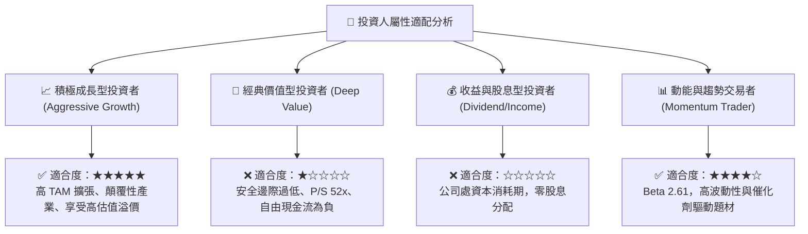

### 11.5 每季財報監控清單（Quarterly Watch List）

| 監控維度 | 核心追蹤指標 | 正常容忍區間 | 觸發減碼/撤退門檻 |
|----------|--------------|--------------|-------------------|
| **發射業務量** | Electron 單季發射次數 | 4 – 6 次 / 季 | 連續兩季發射次數 < 3 次 |
| **訂單能見度** | 在手積壓訂單 (Backlog) | > $11 億美元且持續攀升 | 訂單總額連續兩季下滑 |
| **獲利能力進程** | 綜合毛利率 (Gross Margin) | 35.0% – 40.0% | 毛利率跌破 30.0% |
| **研發里程碑** | Neutron 研發進度更新 | 依照 2026 年時間表推進 | 宣佈重大重新設計或延期逾一年 |
| **流動性消耗** | 單季自由現金流消耗 (FCF Burn)| -$60M 至 -$90M 區間 | 單季現金燃燒 > -$1.2 億美元 |

### 11.6 反面論證：什麼會證明論點錯誤（What Would Change My Mind）

```
╔══════════════════════════════════════════════════════════════════╗
║              ⚠️ 論點失效條件（Disconfirming Evidence）           ║
╠══════════════════════════════════════════════════════════════════╣
║  若出現下列可量化情事，當前多頭與持有邏輯將被根本推翻：          ║
║                                                                  ║
║  1. 【Neutron 商業化失敗】: Archimedes 引擎遭遇無法克服之熱應力或║
║     共振問題，研發停滯導致首飛延遲至 2028 年以後。               ║
║                                                                  ║
║  2. 【SpaceX 壟斷擠壓】: SpaceX Starship 快速取得常態商業化入軌，║
║     每公斤入軌成本實質降至 $200 以下，徹底消解中型專屬火箭之溢價║
║     空間，迫使 Neutron 單次發射定價被迫跌破 $30M。              ║
║                                                                  ║
║  3. 【高毛利太空系統失速】: 太空系統業務營收 YoY 增速連續兩季   ║
║     跌破 15%，毛利率收縮回 25% 以下，證明垂直整合綜效消失。      ║
║                                                                  ║
║  4. 【資本過度稀釋】: 帳上流動性大幅消耗，公司在股價低位被迫再  ║
║     次發行逾 10% 之新股或高利息可轉債，造成原股東重大權益稀釋。  ║
╚══════════════════════════════════════════════════════════════════╝
```

---
> **免責聲明**：本報告為依據財務數據模型與客觀量化分析所得之機構級研報，內容僅供學術研究與投資架構參考，不構成針對任何個人之買賣邀請或投資建議。市場有風險，資產配置與操作前應審慎評估自身風險承受能力。