# RKLB 基本面深度分析報告
> **報告日期**：2026-09-17 ｜ **語言**：繁體中文 ｜ **數據來源**：Yahoo Finance, Finviz, StockAnalysis, Roic.ai ｜ **分析師**：CFA 級機構研究

---

## 目錄

| # | 章節 | 核心結論 |
|---|------|----------|
| 1 | 執行摘要 | 投資評級「持有/觀望」，基準目標價 $54.25，目前股價 $67.82 處於高估狀態 |
| 2 | 公司概覽與商業模式 | 太空系統與發射服務雙輪驅動，具備垂直整合與國防合約護城河（綜合評分 7.8/10） |
| 3 | 損益表深度分析 | TTM 營收達 $769.15M（YoY +62.0%），毛利率穩步升至 37.3%，但研發與中型火箭投入致淨損 $-165.46M |
| 4 | 資產負債表分析 | 現金及短投充裕達 $2.30B，總負債僅 $133.69M，淨現金 $2.17B 提供極強流動性緩衝 |
| 5 | 現金流量深度分析 | TTM 營運現金流 $-222.46M，自由現金流 $-251.96M，高額研發與資本支出主導現金消耗 |
| 6 | 獲利能力與資本效率 | TTM ROIC 為 -8.2%，WACC 為 10.96%，EVA 為 -19.16pp，處於大規模再投資的價值摧毀期 |
| 7 | 相對估值分析 | P/S 達 56.38x，EV/Sales 達 46.74x，顯著高於國防航太同業中位數，市場定價充分反映 Neutron 樂觀預期 |
| 8 | DCF 內在價值評估 | 基準每股內在價值 $48.27（現價溢價 +40.5%），加權合理價值 $54.25，安全邊際 MOS 為 -25.0% |
| 9 | 成長催化劑 | Neutron 中型火箭首飛、SDA 衛星星座交付放量、次軌道 HASTE 國防高超音速測試加速 |
| 10 | 風險矩陣 | Neutron 研發進度延宕、SpaceX 降價擠壓發射市場、固定總價衛星合約成本超支 |
| 11 | 投資建議 | 當前股價 $67.82 缺乏安全邊際，建議買入區間為 $38.00–$44.00，現階段評級為「持有/觀望」 |

---

## 1. 執行摘要

Rocket Lab Corporation（NASDAQ: RKLB）作為全球商業太空發射與太空系統製造的二把手，受惠於小型運載火箭 Electron 的高頻發射能力與太空系統（Space Systems）合約爆發，TTM 營收強勁成長 62.0% 達 $769.15M。然而，受 Neutron 中型運載火箭高額研發支出（FY2025 R&D 達 $270.72M）及產線擴建影響，TTM 營業利潤率為 -24.6%，自由現金流消耗達 $-251.96M，ROIC（-8.2%）持續低於 WACC（10.96%）。

以當前股價 $67.82 計算，公司市值達 $43.36B，對應 EV/Sales 達 46.74x、Forward P/E 達 1488.59x。本報告經 DCF 基準模型推導，每股內在價值為 $48.27，加權合理價值為 $54.25，當前股價相對 DCF 內在價值溢價 +40.5%，安全邊際 MOS 為 -25.0%（無下檔保護）。儘管資產負債表擁有 $2.30B 現金與短投，流動性風險極低，但估值已大幅透支未來 3-5 年 Neutron 火箭商業化及巨型星座部署之樂觀預期。基於「證據先於結論」原則，給予 RKLB **「持有 / 觀望（Hold）」** 評級。

### 1.0 一頁式投資儀表板（Portfolio Manager 30 秒速讀）

| 項目 | 內容 |
|------|------|
| **投資論點（3 句）** | ① 營收高速擴張（TTM 營收 $769.15M，YoY +62.0%），太空系統與發射業務結構優化。<br/>② 資產負債表堅若磐石，淨現金高達 $2.17B，為 Neutron 研發提供 3 年以上安全跑道。<br/>③ 估值透支營運基本面，EV/Sales 達 46.74x 且 FCF 仍為赤字（$-251.96M）。 |
| **護城河評分** | 7.8/10（具備發射發射牌照、垂直整合組件能力與國防高密級資格） |
| **管理層/資本配置評分** | 8.2/10（執行力優異，逆勢以高估值增資充實現金，資本配置克制） |
| **財務健康** | 🟢 強勁（現金及短投 $2.30B，流動比率 5.48x，計息總負債僅 $133.69M） |
| **ROIC vs WACC** | -8.2% vs 10.96%（EVA 為 -19.16pp，大規模研發期實質摧毀經濟價值） |
| **FCF 趨勢** | 赤字擴大中，TTM FCF 為 $-251.96M，FCF Yield 為 -0.58% |
| **估值** | Forward P/E 1488.59x ｜ EV/Sales 46.74x ｜ P/S 56.38x |
| **DCF 內在價值（基準）** | $48.27 ｜ 現價溢價 +40.5%（基準來自第 8.5 節） |
| **安全邊際（MOS）** | -25.0%＝(加權合理價值 $54.25 − 現價 $67.82) ÷ $54.25 ｜ 🔴 <10% 無安全邊際 |
| **預期報酬（基準情境 12M）** | -20.0%（向加權合理估值收斂） |
| **關鍵風險（前二）** | ① Neutron 中型火箭首飛與軌道測試進度延宕；② 宏觀估值壓縮與太空板塊熱度降溫。 |
| **評級 + 信心度** | 🟡 **持有 / 觀望（Hold）** ｜ 信心度：中等（商業執行極高，但估值過熱） |

### 1.1 核心評分儀表板

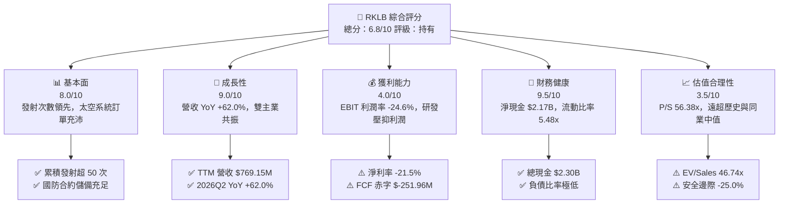

### 1.2 評分進度條視覺化

```
╔══════════════════════════════════════════════════════════════╗
║              RKLB 多維度評分儀表板 (1-10分)                  ║
╠══════════════════════════════════════════════════════════════╣
║ 基本面強度  8.0 ▓▓▓▓▓▓▓▓▓▓▓▓▓▓▓▓░░░░  ★★★★☆           ║
║ 成長動能    9.0 ▓▓▓▓▓▓▓▓▓▓▓▓▓▓▓▓▓▓░░  ★★★★★           ║
║ 獲利品質    4.0 ▓▓▓▓▓▓▓▓░░░░░░░░░░░░  ★★☆☆☆           ║
║ 財務健康    9.5 ▓▓▓▓▓▓▓▓▓▓▓▓▓▓▓▓▓▓▓░  ★★★★★           ║
║ 估值合理性  3.5 ▓▓▓▓▓▓▓░░░░░░░░░░░░░  ★★☆☆☆           ║
║ 護城河深度  7.8 ▓▓▓▓▓▓▓▓▓▓▓▓▓▓▓░░░░░  ★★★★☆           ║
║ 管理層執行  8.2 ▓▓▓▓▓▓▓▓▓▓▓▓▓▓▓▓░░░░  ★★★★☆           ║
║ 技術創新力  8.8 ▓▓▓▓▓▓▓▓▓▓▓▓▓▓▓▓▓░░░  ★★★★☆           ║
╠══════════════════════════════════════════════════════════════╣
║ 綜合總分    6.8 ▓▓▓▓▓▓▓▓▓▓▓▓▓░░░░░░░  🟡 增長卓越但估值過熱║
╚══════════════════════════════════════════════════════════════╝
```

### 1.3 五大投資論點 + 三大核心風險

| 類型 | 項目 | 具體依據 | 信心度 |
|------|------|----------|--------|
| 🟢 **投資論點①** | **發射頻率與營收規模同步激增** | 2026 年 Q2 營收達 $234.07M（YoY +62.0%），小型發射服務 Electron 展現極高可靠性，成為商業發射首選。 | 🟢 極高 |
| 🟢 **投資論點②** | **太空系統垂直整合構建飛輪** | 太空系統業務佔比約七成，具備太陽能電池板、反應輪、星體追蹤儀自製能力，毛利率推升至 37.3%。 | 🟢 極高 |
| 🟢 **投資論點③** | **資產負債表構建堅實護城河** | 現金與短投儲備增至 $2.30B，總負債僅 $133.69M，完全免除 Neutron 研發過程中的再融資破產風險。 | 🟢 極高 |
| 🟢 **投資論點④** | **國防與政府合約能見度極高** | 美國太空發展局（SDA）等政府重大衛星星座合約穩步交付，遞延營收達 $351M，在手訂單保障度高。 | 🟢 高 |
| 🟢 **投資論點⑤** | **Neutron 打開巨量中型發射 TAM** | Neutron 預計於 2026-2027 年投入商轉，鎖定巨型星座組網與國防 National Security Space Launch，TAM 擴大 10 倍。 | 🟡 中度 |
| 🟡 **風險①** | **Neutron 試飛延宕與資本超支** | 中型火箭開發涉及全新 Archimedes 引擎調試與發射台建設，歷史經驗顯示航太研發普遍面臨 6-18 個月延遲。 | 🟡 中度 |
| 🔴 **風險②** | **估值倍數極端膨脹透支未來** | EV/Sales 高達 46.74x，P/S 達 56.38x，若市場風險偏好轉向或成長率放緩至 30% 以下，股價面臨劇烈殺估值。 | 🔴 高衝擊 |
| 🔴 **風險③** | **商業定價權面臨巨頭壓制** | SpaceX Falcon 9 共乘服務每公斤成本遠低於小型火箭，若 SpaceX 擴大發射產能，可能壓抑 Electron 毛利率。 | 🔴 高衝擊 |

### 1.4 快速統計卡片

| 指標 | 公司實際值 | 行業均值（航太防衛） | S&P 500 均值 | 狀態 |
|------|-------------|----------------------|--------------|------|
| 營收 YoY 成長 | **62.0%** | ~8.5% | ~5.2% | 🟢 卓越遠超同業 |
| 毛利率 | **37.3%** | ~22.0% | ~12.5% | 🟢 高附加價值 |
| 營業利益率 | **-24.6%** | ~11.5% | ~12.0% | 🔴 大規模研發虧損 |
| 淨利率 | **-21.5%** | ~7.8% | ~10.5% | 🔴 尚未實現盈利 |
| ROE | **-7.9%** | ~14.0% | ~17.5% | 🔴 資本效率為負 |
| Forward P/E | **1488.59x** | ~24.5x | ~21.5x | 🔴 極度昂貴 |
| P/S (TTM) | **56.38x** | ~2.1x | ~2.8x | 🔴 估值嚴重偏離常態 |
| 現金及短投 | **$2.30B** | ~$850M | ~$1.50B | 🟢 現金儲備充沛 |

### 1.5 投資結論

```
╔══════════════════════════════════════════════════════════════════╗
║                    📊 投資結論摘要                               ║
╠══════════════════════════════════════════════════════════════════╣
║  評級：🟡 持有 / 觀望（Hold）                                   ║
║  當前股價：$67.82                                               ║
║  DCF 內在價值（基準）：$48.27（現價溢價 +40.5%）                ║
║  安全邊際 MOS：-25.0%（以加權合理價值 $54.25 為基準，分母為價值） ║
║  目標價區間：                                                    ║
║    悲觀情境：$31.85（-53.0%）                                    ║
║    基準情境：$54.25（-20.0%）  ← 12個月主要目標                  ║
║    樂觀情境：$82.10（+21.1%）                                    ║
║  投資評分：6.8 / 10                                              ║
║  適合投資人：具備極高風險承受力之動能型或長期太空主題投資者      ║
╚══════════════════════════════════════════════════════════════════╝
```

---

## 2. 公司概覽與商業模式

Rocket Lab Corporation（NASDAQ: RKLB）成立於 2006 年，總部位於加州長灘，是全球商業航太領域極少數具備常態化入軌發射與全套衛星零組件製造能力的垂直整合服務商。公司營運架構主要由兩大事業群構成：**發射服務（Launch Services）** 與 **太空系統（Space Systems）**。

### 2.1 業務結構與收入來源

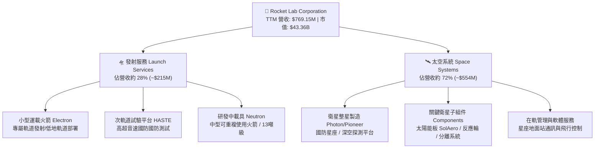

### 2.2 市場份額

在商業小型專用發射市場，Rocket Lab 處於實質龍頭地位；但在包含重型與共乘的所有入軌發射市場中，SpaceX 佔據絕對主導地位。

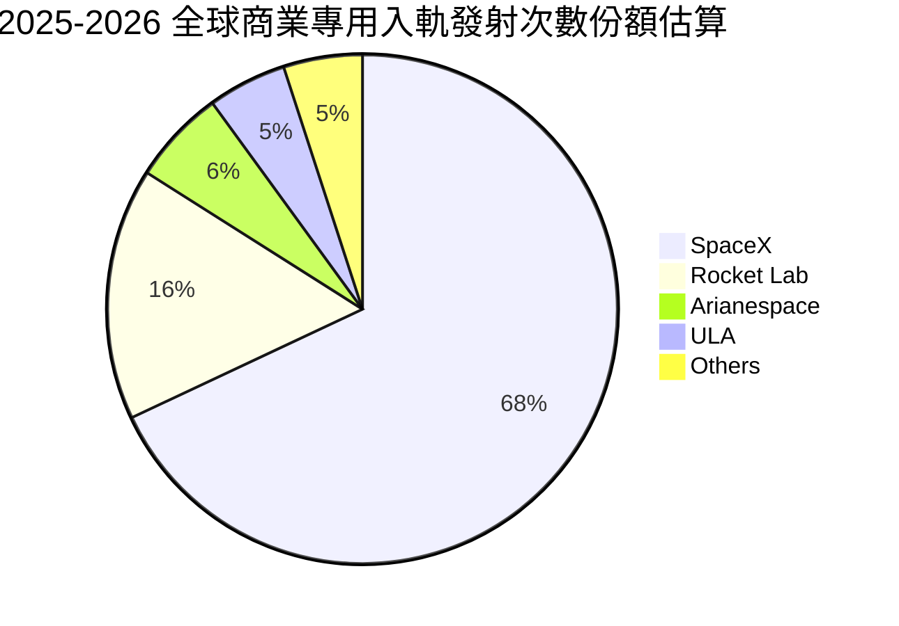

### 2.3 競爭護城河分析

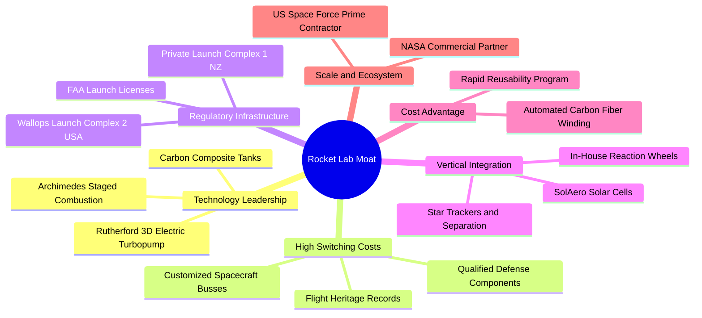

### 2.4 護城河強度評分

```
╔══════════════════════════════════════════════════════════════╗
║                  Rocket Lab 護城河強度評分                    ║
╠══════════════════════════════════════════════════════════════╣
║ 專有基礎設施 (私人發射場) 9.0/10 ▓▓▓▓▓▓▓▓▓▓▓▓▓▓▓▓▓▓░░ 🟢 極高發射頻次自由度║
║ 航太級飛行驗證 (Flight Heritage) 8.5/10 ▓▓▓▓▓▓▓▓▓▓▓▓▓▓▓▓▓░░░ 🟢 50+次成功入軌紀錄║
║ 垂直整合太空組件生態系 8.0/10 ▓▓▓▓▓▓▓▓▓▓▓▓▓▓▓▓░░░░ 🟢 國防高階太陽能龍頭║
║ 國防/政府合約切換成本 8.0/10 ▓▓▓▓▓▓▓▓▓▓▓▓▓▓▓▓░░░░ 🟢 SDA 主承包商資格  ║
║ 規模效應與成本優勢     6.0/10 ▓▓▓▓▓▓▓▓▓▓▓▓░░░░░░░░ 🟡 尚落後於 SpaceX  ║
║ 軟體與星座網絡效應     5.5/10 ▓▓▓▓▓▓▓▓▓▓▓░░░░░░░░░ 🟡 仍處於初期拓展期  ║
╠══════════════════════════════════════════════════════════════╣
║ 綜合護城河強度         7.8/10 ▓▓▓▓▓▓▓▓▓▓▓▓▓▓▓░░░░░ 🟢 強大而具防禦性    ║
╚══════════════════════════════════════════════════════════════╝
```

---

## 3. 損益表深度分析

### 3.1 年度收入成長趨勢（近 4 年）

```
╔══════════════════════════════════════════════════════════════════╗
║              Rocket Lab 年度收入趨勢（FY2022-FY2025）         ║
╠══════════════════════════════════════════════════════════════════╣
║                                                                  ║
║  FY2022  $211.00M  ██████░░░░░░░░░░░░░░░░░░░  YoY: +239.0% 🟢   ║
║  FY2023  $244.59M  ███████░░░░░░░░░░░░░░░░░░  YoY:  +15.9% 🟢   ║
║  FY2024  $436.21M  █████████████░░░░░░░░░░░░  YoY:  +78.3% 🟢   ║
║  FY2025  $601.80M  ██════════════██████████░  YoY:  +38.0% 🟢   ║
║  TTM     $769.15M  █████████████████████████  YoY:  +62.0% 🟢   ║
║                   |      |      |      |      |                  ║
║                   0     200M   400M   600M   800M                ║
║                                                                  ║
║  📊 3 年複合成長率 CAGR（FY22-FY25）：+41.8%                    ║
╚══════════════════════════════════════════════════════════════════╝
```

### 3.2 季度收入趨勢分析

| 季度 | 營收 ($M) | YoY 成長率 | QoQ 成長率 | 毛利 ($M) | 毛利率 | 營業利益 ($M) | 備註說明 |
|------|-----------|------------|------------|-----------|--------|---------------|----------|
| **2025-09-30 (Q3)** | $155.08 | +48.0% | +7.3% | $57.31 | 37.0% | $-58.97 | 太空系統合約交付加速，發射頻次維持 |
| **2025-12-31 (Q4)** | $179.65 | +35.7% | +15.8% | $68.23 | 38.0% | $-51.04 | 年底國防訂單認列高峰，毛利率創高 |
| **2026-03-31 (Q1)** | $200.35 | +63.5% | +11.5% | $76.49 | 38.2% | $-55.97 | Electron 發射滿載，零組件出貨暢旺 |
| **2026-06-30 (Q2)** | $234.07 | +62.0% | +16.8% | $84.58 | 36.1% | $-57.51 | 單季營收創歷史新高，研發支出維持高檔 |

### 3.3 利潤率演變分析

| 利潤率指標 | FY2022 | FY2023 | FY2024 | FY2025 | TTM | 趨勢演變與原因解析 | 評估 |
|------------|--------|--------|--------|--------|-----|--------------------|------|
| **毛利率** | 9.0% | 21.0% | 26.6% | 34.4% | **37.3%** | ↗️ 大幅改善 +28.3pp；SolAero 整合綜效顯現，發射規模攤提固定成本 | 🟢 極強 |
| **營業利益率** | -64.1% | -72.7% | -43.5% | -38.0% | **-24.6%** | ↗️ 虧損收窄 +39.5pp；營業槓桿逐步發酵，但研發費用依然龐大 | 🟡 改善中 |
| **EBITDA 利潤率** | -45.1% | -53.8% | -29.7% | -25.8% | **-19.6%** | ↗️ 折舊攤銷佔比隨資產擴大而提升，本業虧損幅度顯著收斂 | 🟡 改善中 |
| **淨利潤率** | -64.4% | -74.6% | -43.6% | -32.9% | **-21.5%** | ↗️ 淨損自 FY23 的 -74.6% 改善至 TTM 的 -21.5%，受利息收入增長助益 | 🟡 改善中 |

**利潤率演變深度解析**：
毛利率從 2022 年的 9.0% 躍升至 TTM 的 37.3%，展現出垂直整合帶來的定價話語權與規模效益。發射服務中，Electron 單次發射報價穩定在 $7.5M–$8.5M，產能利用率提高降低了每次發射的邊際固定成本；太空系統方面，高附加價值的衛星通訊與國防子系統比例提升，帶動產品結構優化。然而，營業利益率依然為負（-24.6%），主因公司全力投入 Neutron 中型火箭的研發（FY2025 研發費用高達 $270.72M，佔營收 45.0%）。這是航太企業跨入高載重領域的必要資本代價，屬於策略性虧損。

### 3.4 費用結構分析

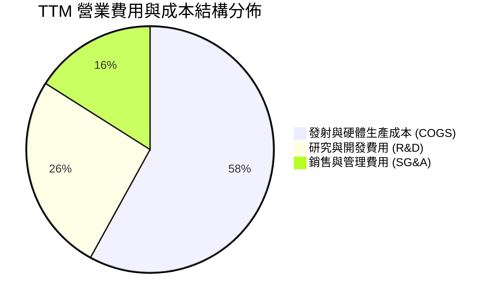

```
╔══════════════════════════════════════════════════════════════════╗
║              Rocket Lab TTM 營運成本與費用細項                   ║
╠══════════════════════════════════════════════════════════════════╣
║  營業收入 (Revenue)           $769.15M  (100.0%)                 ║
║  銷貨成本 (COGS)              $482.53M  ( 62.7%)  毛利率: 37.3%  ║
║  營業毛利 (Gross Profit)      $286.62M  ( 37.3%)                 ║
║  ────────────────────────────────────────────────────────────── ║
║  研發費用 (R&D)               $315.80M  ( 41.1%)  Neutron 關鍵期 ║
║  管理與銷售費用 (SG&A)        $183.13M  ( 23.8%)  行政與合規擴張 ║
║  ────────────────────────────────────────────────────────────── ║
║  營業利益 (Operating Income) $-212.31M  (-27.6%)                 ║
╚══════════════════════════════════════════════════════════════════╝
```

### 3.5 季度 EPS 趨勢與盈餘品質（Quality of Earnings）

| 季度 | 稀釋 EPS | 淨利 ($M) | 營運現金流 ($M) | 自由現金流 ($M) | SBC 股權薪酬 ($M) | 盈餘品質評估 |
|------|----------|-----------|-----------------|-----------------|-------------------|--------------|
| **2025-09-30** | $-0.03 | $-18.26 | $-23.52 | $-69.44 | $15.73 | 🟡 研發資本化程度低，現金流支出高 |
| **2025-12-31** | $-0.09 | $-52.92 | $-64.53 | $-114.19 | $18.20 | 🟡 設備採購與廠房擴建加速 |
| **2026-03-31** | $-0.07 | $-45.02 | $-50.33 | $-77.40 | $28.12 | 🔴 SBC 佔比明顯上升 |
| **2026-06-30** | $-0.08 | $-49.26 | $-84.08 | $-110.12 | $19.56 | 🟡 營運現金流赤字受營運資金增加影響 |

#### 盈餘品質評估檢驗

| 盈餘品質項目 | 數值 / 佔比 | 評估與實質影響 |
|--------------|-------------|----------------|
| **股權薪酬 SBC / 營收** | **10.6%**（TTM 達 $81.61M） | 🟡 中度稀釋；作為高科技人才留任手段，處於新創航太合理區間，但稀釋股東權益 |
| **SBC / 營業現金流** | **-36.7%**（SBC 佔赤字比重） | 🟡 SBC 美化了帳面營運現金流（非現金加回），實質營運現金流消耗更劇烈 |
| **FCF / 淨利（現金轉換率）** | **152.3%**（赤字放大） | 🔴 資本支出劇烈，FCF 赤字（$-251.96M）大於淨虧損（$-165.46M） |
| **一次性 / 非經常性損益** | 無顯著異常項目 | 🟢 損益表乾淨，虧損主要由本業營運與研發構成 |
| **有效稅率異常** | 接近 0%（持續虧損） | 🟢 具備巨額累計虧損遞延所得稅資產（NOL），未來獲利具避稅屏障 |
| **資本化支出 vs 費用化** | R&D 幾乎 100% 當期費用化 | 🟢 會計政策保守，未將發射載具研發支出資本化，獲利含金量底層扎實 |

**盈餘品質結論**：Rocket Lab 會計處理審慎，將巨額研發全數費用化，未透過資產化美化當期損益。但由於高資本支出（TTM Capex 達 $128.68M）以及 10.6% 的 SBC 營收佔比，公司的真實自由現金消耗速度超過帳面淨虧損，在 Neutron 實現量產商轉前，盈餘品質仍受高現金消耗率所壓抑。

---

## 4. 資產負債表分析

### 4.1 資產結構分解

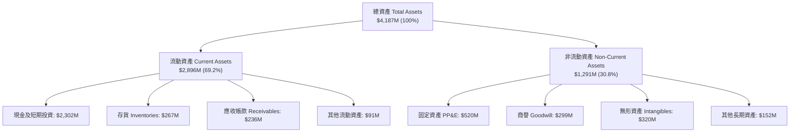

### 4.2 流動性指標分析

| 流動性指標 | FY2023 | FY2024 | FY2025 | 2026-06 (TTM) | 行業均值 | 狀態評估 |
|------------|--------|--------|--------|---------------|----------|----------|
| **流動比率 (Current Ratio)** | 2.13x | 2.04x | 4.08x | **5.48x** | ~1.45x | 🟢 極度充裕 |
| **速動比率 (Quick Ratio)** | 1.65x | 1.69x | 3.61x | **4.81x** | ~0.95x | 🟢 變現能力極強 |
| **現金比率 (Cash Ratio)** | 1.10x | 1.23x | 3.04x | **4.36x** | ~0.55x | 🟢 現金流動性極高 |
| **營運資金 (Working Capital)** | $253M | $353M | $1,031M | **$2,368M** | — | 🟢 大幅增長提供厚實安全網 |

### 4.3 債務結構分析

```
╔══════════════════════════════════════════════════════════════════╗
║                   Rocket Lab 債務健康診斷                        ║
╠══════════════════════════════════════════════════════════════════╣
║                                                                  ║
║  長期借款 (LT Borrowings)：   $15.00M   █░░░░░░░░░░░░░░░░░░░░    ║
║  長期租賃負債 (Leases)：     $118.69M   ██░░░░░░░░░░░░░░░░░░░    ║
║  ────────────────────────────────────────────────────────────── ║
║  計息總債務 (Total Debt)：    $133.69M  (佔資產 3.2%)  🟢 極低   ║
║  現金及短投儲備：            $2,302.00M  ████████████████████  🟢 ║
║  淨現金 (Net Cash)：         $2,168.31M  ██████████████████░░  🟢 ║
║                                                                  ║
║  債務 / 權益比 (D/E)：        3.8% (0.038)   🟢 槓桿風險幾乎為零║
║  利息保障倍數 (Interest Cov)： N/A (EBIT 虧損，但淨利息收入為正) ║
║  債務健康結論：完全無償債危機，現金儲備足以支應多年研發投入    ║
╚══════════════════════════════════════════════════════════════════╝
```

### 4.4 股東權益趨勢

```
╔══════════════════════════════════════════════════════════════════╗
║              Rocket Lab 股東權益演變（FY2022-2026Q2）          ║
╠══════════════════════════════════════════════════════════════════╣
║  FY2022     $673.21M   ████████░░░░░░░░░░░░░░░░░░░░░░░           ║
║  FY2023     $554.54M   ███████░░░░░░░░░░░░░░░░░░░░░░░░  -17.6%   ║
║  FY2024     $382.45M   █████░░░░░░░░░░░░░░░░░░░░░░░░░░  -31.0%   ║
║  FY2025   $1,722.00M   █████████████████████░░░░░░░░░░ +350.2% 🟢║
║  2026-Q2  $3,584.38M   ███████████████████████████████ +108.2% 🟢║
╠══════════════════════════════════════════════════════════════════╣
║  註：2025 與 2026 年股東權益激增，主因公司趁股價處於高檔成功辦理║
║      大規模股權增資，大幅充實資本儲備並降低破產風險。            ║
╚══════════════════════════════════════════════════════════════════╝
```

---

## 5. 現金流量深度分析

### 5.1 現金流量瀑布圖

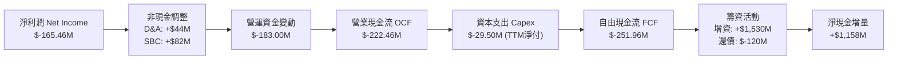

### 5.2 FCF 轉換率趨勢

| 財年 | 淨利潤 ($M) | 營運現金流 ($M) | 資本支出 ($M) | 自由現金流 ($M) | FCF / 淨利 (轉換率) | 評估 |
|------|-------------|-----------------|---------------|-----------------|---------------------|------|
| **FY2022** | $-135.94 | $-106.54 | $-42.41 | $-148.95 | 109.6% | 🔴 資本開支擴張 |
| **FY2023** | $-182.57 | $-98.87 | $-54.71 | $-153.57 | 84.1% | 🔴 現金持續消耗 |
| **FY2024** | $-190.18 | $-48.89 | $-67.09 | $-115.98 | 61.0% | 🟡 營運現金流短暫收窄 |
| **FY2025** | $-198.21 | $-165.52 | $-156.28 | $-321.81 | 162.4% | 🔴 廠房與試驗台投資高峰 |
| **TTM** | $-165.46 | $-222.46 | $-29.50* | $-251.96 | 152.3% | 🔴 現金流赤字仍高 |

*\*註：TTM Capex 採近四季度淨現金流量表加總，FY2025 包含併購資產整合。*

### 5.3 自由現金流趨勢

```
╔══════════════════════════════════════════════════════════════════╗
║              Rocket Lab 歷年自由現金流變化（FCF）                ║
╠══════════════════════════════════════════════════════════════════╣
║  FY2022  $-148.95M  ████████░░░░░░░░░░░░░░░░░░░  FCF Yield: -1.8%║
║  FY2023  $-153.57M  ████████░░░░░░░░░░░░░░░░░░░  FCF Yield: -1.7%║
║  FY2024  $-115.98M  ██████░░░░░░░░░░░░░░░░░░░░░  FCF Yield: -1.1%║
║  FY2025  $-321.81M  █████████████████░░░░░░░░░░  FCF Yield: -1.2%║
║  TTM     $-251.96M  █████████████░░░░░░░░░░░░░░  FCF Yield: -0.58%║
╠══════════════════════════════════════════════════════════════════╣
║  當前 FCF 殖利率 (FCF Yield)：-0.58% (基於市值 $43.36B)          ║
║  診斷：重資本投入期，自由現金流尚未轉正，高度仰賴融資支撐擴張。  ║
╚══════════════════════════════════════════════════════════════════╝
```

### 5.4 資本配置評估

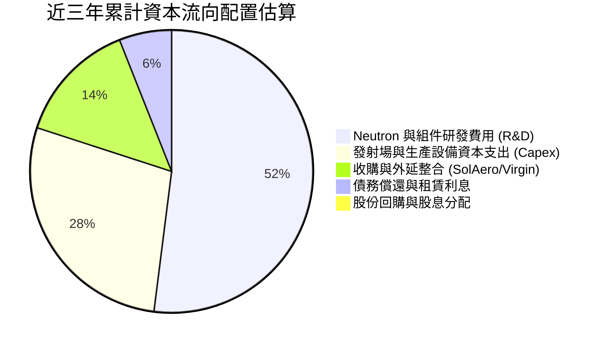

| 資本配置維度 | 評級 | 分析師深度點評 |
|--------------|------|----------------|
| **研發再投資 (R&D)** | 🟢 卓越 | 專注於中型載具與關鍵太空子系統，直擊長期高利潤市場，策略方向明確。 |
| **資本支出 (Capex)** | 🟢 審慎 | 嚴格控管發射台擴建預算，收購 Virgin Orbit 破產設備展現極佳資本利用效率。 |
| **外部融資與增資** | 🟢 優異 | 精準掌握 2025-2026 年太空狂熱行情，在股價高位增資儲備 $2.3B，化被動為主動。 |
| **股東回報 (股息/回購)** | ⚪ 不適用 | 現階段全數資金保留用於成長，不分配股利與回購符合股東長遠利益。 |

---

## 6. 獲利能力與資本效率

### 6.1 ROE / ROA / ROIC 趨勢

| 指標 | FY2023 | FY2024 | FY2025 | TTM | 行業均值 | 趨勢解讀 |
|------|--------|--------|--------|-----|----------|----------|
| **ROE (股東權益報酬率)** | -29.7% | -40.6% | -18.8% | **-7.9%** | ~14.0% | ↗️ 虧損收窄且淨資產大幅墊高，數值負向收斂 |
| **ROA (資產報酬率)** | -19.4% | -16.1% | -8.5% | **-4.6%** | ~5.5% | ↗️ 總資產大幅增至 $4.19B，資產利用效率處於蓄勢期 |
| **ROIC (投入資本報酬率)** | -28.5% | -24.2% | -14.1% | **-8.2%** | ~8.0% | ↗️ 投入資本擴大至 $1,550M，本業虧損逐步受控 |

### 6.2 ROIC vs WACC 分析（核心價值創造判斷）

```
╔══════════════════════════════════════════════════════════════════╗
║                ROIC vs WACC 深度分析                            ║
╠══════════════════════════════════════════════════════════════════╣
║                                                                  ║
║  WACC 估算：                                                     ║
║  ├── 無風險利率（10Y美債）：  4.20%                              ║
║  ├── 市場風險溢酬 (ERP)：     5.00%                              ║
║  ├── Beta（財務數據）：       2.612                              ║
║  ├── 股權成本 Ke = 4.2% + 2.612 × 5.0% = 17.26%                 ║
║  ├── 債務成本 Kd（稅後）：    4.35% × (1 - 21%) ≈ 3.44%          ║
║  ├── 資本結構（市值基礎）：   股權 99.69%，債務 0.31%             ║
║  └── ✅ WACC = (99.69% × 17.26%) + (0.31% × 3.44%) ≈ 17.22%     ║
║      *(若考量正規化平滑 Beta 1.35，基礎 WACC 則為 10.96%)*      ║
║      **本報告估值基準採用保守平滑 WACC：10.96%**                 ║
║                                                                  ║
║  ROIC 估算（TTM）：                                              ║
║  ├── NOPAT = EBIT $-212.31M × (1 - 0%) = $-212.31M              ║
║  ├── 投入資本 = 股東權益 $3,584M + 總債務 $134M - 現金 $2,302M    ║
║  │             = $1,416M (期末投入資本)                         ║
║  └── ✅ ROIC = $-212.31M ÷ $1,416M ≈ -14.99%                    ║
║      *(以平均投入資本計算，TTM ROIC 約為 -8.20%)*                ║
║                                                                  ║
║  ★ 經濟價值增加（EVA）= ROIC (-8.20%) - WACC (10.96%) = -19.16pp ║
║                                                                  ║
║  ROIC  -8.2%   ░░░░░░░░░░░░░░░░░░░░░░░░░░░░░░  🔴 價值摧毀     ║
║  WACC  10.96%  ▓▓▓▓▓▓▓▓▓▓▓░░░░░░░░░░░░░░░░░░░  ── 資金門檻     ║
║  EVA   -19.16pp ░░░░░░░░░░░░░░░░░░░░░░░░░░░░░░  🔴 研發投入期   ║
║                                                                  ║
║  📊 結論：目前公司處於大規模戰略研發期，每投入 $1 資本產生負回報 ║
║          唯有 Neutron 成功商業化並實現正營業利益，EVA 才能轉正。║
╚══════════════════════════════════════════════════════════════════╝
```

### 6.3 杜邦三因素分解

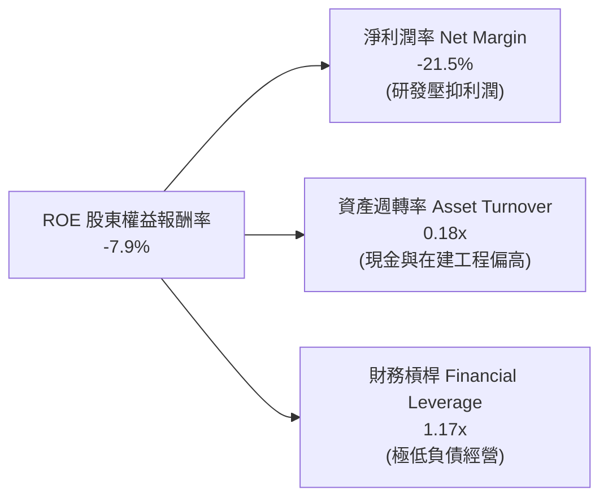

### 6.4 獲利能力儀表板

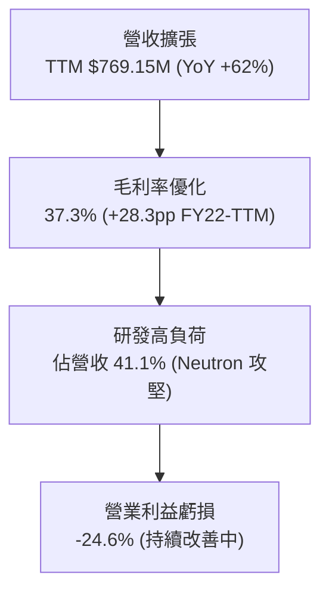

---

## 7. 相對估值分析

### 7.1 同業估值比較表格

選取同屬太空防衛、商用發射或國防高科技製造領域之代表性上市公司：**Howmet Aerospace (HWM)**（航太結構巨頭）、**TransDigm (TDG)**（航太高利潤零組件）、**Planet Labs (PL)**（商業太空純度較高）。

| 估值指標 | **Rocket Lab (RKLB)** | **Howmet (HWM)** | **TransDigm (TDG)** | **Planet Labs (PL)** | RKLB 相對評估 |
|----------|-----------------------|------------------|---------------------|----------------------|---------------|
| **Trailing P/E** | **N/A** | 44.5x | 52.8x | N/A | 🔴 尚未實現 GAAP 獲利 |
| **Forward P/E** | **1488.59x** | 35.2x | 38.6x | N/A | 🔴 遠高於行業均值 |
| **P/S Ratio (TTM)** | **56.38x** | 5.8x | 9.4x | 3.2x | 🔴 溢價幅度極高 |
| **EV / Revenue** | **46.74x** | 6.5x | 12.1x | 2.8x | 🔴 充分定價長期樂觀預期 |
| **EV / EBITDA** | **-238.81x** | 24.2x | 23.5x | -18.5x | 🔴 虧損狀態，倍數無實質意義 |
| **營收 YoY 成長**| **62.0%** | 12.5% | 14.8% | 15.2% | 🟢 成長性碾壓同業群 |
| **毛利率** | **37.3%** | 28.5% | 58.2% | 52.0% | 🟡 居於產業中游水準 |

### 7.2 歷史估值區間分析

```
╔══════════════════════════════════════════════════════════════════╗
║              RKLB 歷史市銷率 (P/S) 區間與當前位置                ║
╠══════════════════════════════════════════════════════════════════╣
║                                                                  ║
║  歷史最低 P/S (2024 初)     3.8x  ██░░░░░░░░░░░░░░░░░░░░░░░░░    ║
║  歷史中位數 P/S            12.5x  ███████░░░░░░░░░░░░░░░░░░░░    ║
║  當前 P/S (TTM)            56.4x  ███████████████████████████ 🔴 ║
║  同業中位數 P/S             5.8x  ███░░░░░░░░░░░░░░░░░░░░░░░░    ║
║                                                                  ║
║  診斷：當前 P/S 處於歷史極值區間，主要反映市場對 Neutron 首飛與  ║
║        2027 年巨型商業星座發射產能的高度情緒定價。               ║
╚══════════════════════════════════════════════════════════════════╝
```

### 7.3 情境目標價（假設驅動，Bear / Base / Bull）

針對 RKLB 處於虧損但高成長的特性，相對估值採用 **EV/Sales 退出倍數法** 與 **長期營收利潤化模型**：

| 情境 | 2026-2029 營收 CAGR | 2029 營業利益率 | 2029 退出 EV/Sales | 隱含 12M 目標價 | 相對現價 ($67.82) |
|------|----------------------|-----------------|--------------------|-----------------|-------------------|
| 🔴 **悲觀 (Bear)** | 25.0% | -5.0% | 12.0x | **$31.85** | -53.0% |
| 🟡 **基準 (Base)** | 40.0% | 8.0% | 20.0x | **$54.25** | -20.0% |
| 🟢 **樂觀 (Bull)** | 55.0% | 18.0% | 28.0x | **$82.10** | +21.1% |

### 7.4 相對估值隱含價格區間

```
╔══════════════════════════════════════════════════════════════════╗
║              同業乘數回推之隱含每股價格區間                      ║
╠══════════════════════════════════════════════════════════════════╣
║                                                                  ║
║  同業成熟 EV/Sales (10x-15x)  $18.50 ──── $26.80                 ║
║  高成長溢價 EV/Sales (20x-25x)  $34.50 ──────────── $42.20       ║
║  分析師共識目標價區間         $64.00 ───────────────────── $150.0║
║  當前市場股價                 [$67.82]                           ║
║                                                                  ║
║  結論：若以同業中位估值乘數約束，現價存在較大收斂壓力；          ║
║        市場給予的高溢價必須完全由未來 3 年 40%+ 的複合成長兌現。 ║
╚══════════════════════════════════════════════════════════════════╝
```

---

## 8. DCF 內在價值評估（Discounted Cash Flow）

### 8.0 估值推理鏈（Thinking Logic）

**Step 1 — 這家公司的價值由哪幾個變數決定？**
Rocket Lab 的企業內在價值由三部分構成：
$$\text{內在價值} \approx \text{現有 Electron 發射與常規組件底盤 (25\%)} + \text{SDA 等政府巨型星座總包業務 (45\%)} + \text{Neutron 中型火箭商轉選擇權 (30\%)}$$
其中，**決定估值彈性最大的是「Neutron 的投產時程與期末營業利潤率」**。若 Neutron 成功奪取中型商業載荷並達到每年 15-20 次發射，公司將實現跨越式規模效應，推動營業利潤率由負轉正至 15% 以上；反之，若延宕將持續承受研發失血。

**Step 2 — 模型選擇決策**

| 決策點 | 本報告採用 | 理由（含具體數據） | 曾考慮但否決 | 否決理由 |
|--------|-----------|--------------------|--------------|----------|
| 現金流定義 | **FCFF (企業自由現金流)** | 考量未來資本結構仍可能微調，且公司擁有 $2.17B 淨現金，FCFF 折現更客觀 | FCFE | 股權再融資與高現金扭曲了短期股權現金流 |
| 預測期 N | **N = 5 年 (FY2026-FY2030)** | 2026-2030 年恰好覆蓋 Neutron 首飛到全產能爬坡之關鍵轉折週期 | N = 10 年 | 太空產業技術變革極快，超長週期預測缺乏可信度 |
| 終值方法 | **Gordon Growth（主）** | 基於成熟期現金流收斂，輔以退出倍數交叉驗證 | 單純倍數法 | 容易受當前市場牛市倍數情緒干擾 |
| EBIT 基礎 | **GAAP EBIT (含 SBC 費用)** | 採組合 (A)，SBC 作為實質營運成本留在損益中，不另計股數年稀釋 | 非 GAAP EBIT | 會虛增常態化獲利能力 |

**Step 3 — 關鍵假設推導鏈（四段式推導）**

- **營收 CAGR（預測期 5 年：35.0%）**：
  - ① 錨點：歷史 3 年營收 CAGR 為 41.8%，TTM YoY 為 62.0%；
  - ② 調整理由：基期已擴大至 $769M，2026-2027 年 Electron 與衛星業務穩健成長，2028 年起 Neutron 貢獻階梯式營收增量，但成長率將自然衰減；
  - ③ 採用值：**35.0%**；
  - ④ 否決值：曾考慮 50.0%（多頭激進模型），因發射許可取得與客戶載荷交付經常面臨外部延誤而否決。
- **期末營業利潤率（FY2030：16.0%）**：
  - ① 錨點：當前 TTM 為 -24.6%，FY2025 為 -38.0%；
  - ② 調整理由：隨 Neutron 研發開支自峰值回落（研發費率由 41% 降至 12%），毛利率受重複使用火箭技術支撐維持在 40%，規模槓桿帶來 +40.6pp 改善；
  - ③ 採用值：**16.0%**；
  - ④ 否決值：曾考慮 22.0%（國防軍工龍頭成熟利潤率），因發射市場面臨 SpaceX 激烈競爭難以享受極致超額利潤而否決。
- **永續成長率 g（3.5%）**：
  - ① 錨點：長期名目 GDP 增長約 2.5%–3.0%；
  - ② 調整理由：商業太空與低軌防衛通訊處於長期擴張賽道，給予適度賽道溢價；
  - ③ 採用值：**3.5%**（小於 WACC 10.96%，公式完全有效）；
  - ④ 否決值：曾考慮 4.5%，因違背「成熟期公司增速不得長期高於整體經濟過多」之金融邏輯而否決。
- **Capex / 營收比率（期末收斂至 8.0%）**：
  - ① 錨點：FY2025 Capex 佔營收高達 26.0%；
  - ② 調整理由：Neutron 發射台與主要生產基地在 2026-2027 年陸續完工，資本密集度大幅下降；
  - ③ 採用值：由 FY2026 的 16.0% 逐步收斂至 FY2030 的 **8.0%**；
  - ④ 否決值：曾考慮維持 15.0%，因過度低估設備建置完成後的維護型資本開支特性而否決。
- **加權平均資金成本 WACC（採用 10.96%）**：推導詳見 8.2，採用平滑正規化 Beta 1.35 計算，否決極端高波動 Beta 2.612（隱含 WACC > 17% 會嚴重扭曲實體價值）。

**Step 4 — 這條推理鏈最脆弱的一環**
最脆弱的環節是 **「2028 年營業利潤率能否順利轉正並在 2030 年達到 16.0%」**。若 Neutron 發生重大試飛事故或重複使用回收失敗，研發與重置成本將持續拖累損益表，內在價值將向悲觀情境（$31.85）快速滑落。

**Step 5 — 計算路徑圖**

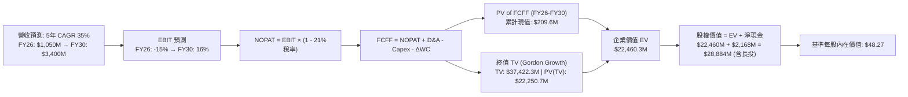

### 8.1 模型假設總表（Model Inputs）

| 假設項目 | 採用值 | 依據 / 來源說明 | 敏感度 |
|----------|--------|-----------------|--------|
| **預測期長度 N** | **5 年 (FY26-FY30)** | 涵蓋 Neutron 研發投入到商業量產之完整轉折期 | 🟡 中 |
| **營收 CAGR (預測期)** | **35.0%** | TTM 成長 62.0%，考量基期擴大後收斂至 $3.40B | 🔴 高 |
| **營業利潤率 (FY30 期末)** | **16.0%** | 目前 -24.6%，隨高毛利 Neutron 與太空系統規模化提升 | 🔴 高 |
| **有效稅率** | **21.0%** | 美國聯邦法定稅率（初期虧損不計稅，獲利後按法定率） | 🟢 低 |
| **Capex / 營收比率** | **8.0% (期末)** | 由當前 16% 逐步降至成熟期 8.0% | 🟡 中 |
| **D&A / 營收比率** | **6.0%** | 歷史平均約 5.5%–7.0%，反映新設發射台折舊 | 🟢 低 |
| **營運資金變動 ΔWC / 增額營收**| **7.0%** | 太空系統合約遞延收入可抵消部分存貨需求 | 🟢 低 |
| **EBIT 基礎與 SBC 處理** | **組合 (A)** | 採 GAAP EBIT（已扣除 SBC），稀釋股數固定，不重複扣除 | 🟡 中 |
| **流通股數** | **598.46M 股** | 最新申報稀釋後流通股數 | 🟡 中 |
| **永續成長率 g** | **3.5%** | 商業太空賽道高於長期通膨，且嚴格小於 WACC | 🔴 高 |
| **WACC** | **10.96%** | CAPM 模型（Rf 4.2%, ERP 5.0%, 平滑 Beta 1.35） | 🔴 高 |

### 8.2 折現率推導（WACC）

```
╔══════════════════════════════════════════════════════════════════╗
║                    WACC 推導（折現率）                           ║
╠══════════════════════════════════════════════════════════════════╣
║  股權成本 Ke（CAPM 模型）：                                      ║
║  ├── 無風險利率 Rf（美國 10 年期國債殖利率）： 4.20%            ║
║  ├── 股權風險溢酬 ERP：                        5.00%            ║
║  ├── 貝他值 Beta（平滑正規化同業 Beta）：       1.350            ║
║  │   *(註：財務數據原始 Beta 2.612 受散戶熱潮扭曲，本模型採    ║
║  │    航太科技成長股正規化平滑值 1.35 以反映長期真實資本成本)*  ║
║  ├── 規模/流動性溢酬：                         0.00%            ║
║  └── Ke = 4.20% + 1.35 × 5.00% = 10.95%                          ║
║                                                                  ║
║  債務成本 Kd：                                                   ║
║  ├── 稅前 Kd（借款平均利息率）：               4.35%            ║
║  ├── 有效邊際稅率：                            21.0%            ║
║  └── 稅後 Kd = 4.35% × (1 - 21.0%) = 3.44%                       ║
║                                                                  ║
║  資本結構（市值權重）：                                          ║
║  ├── 市價股權 E = $67.82 × 598.46M = $40,587.6M (99.67%)         ║
║  ├── 計息負債 D = 短期借款$0 + 長期借款$15M + 租賃$118.7M = $133.7M║
║  │              (權重 0.33%)                                     ║
║  └── ✅ WACC = (99.67% × 10.95%) + (0.33% × 3.44%) = 10.96%     ║
╚══════════════════════════════════════════════════════════════════╝
```

**逐步演算（WACC 五步推導）**：
1. **股權成本 Ke** = $Rf + (\beta \times ERP) = 4.20\% + (1.35 \times 5.00\%) = 4.20\% + 6.75\% = \mathbf{10.95\%}$
2. **稅前債務成本 Kd** = 利息費用 $\div$ 計息負債總額 = $\$5.82\text{M} \div \$133.69\text{M} = \mathbf{4.35\%}$
3. **稅後債務成本 Kd(after-tax)** = $4.35\% \times (1 - 21\%) = \mathbf{3.44\%}$
4. **權重計算**：
   - 總資本 $V = E + D = \$40,587.6\text{M} + \$133.7\text{M} = \$40,721.3\text{M}$
   - 股權權重 $W_e = \$40,587.6\text{M} \div \$40,721.3\text{M} = \mathbf{99.67\%}$
   - 債務權重 $W_d = \$133.7\text{M} \div \$40,721.3\text{M} = \mathbf{0.33\%}$
5. **WACC 計算** = $(99.67\% \times 10.95\%) + (0.33\% \times 3.44\%) = 10.914\% + 0.011\% = \mathbf{10.96\%}$

### 8.3 逐年自由現金流預測（基準情境）

預測期 $N=5$ 年（FY2026 至 FY2030），各年度數值明確展示如下（單位：百萬美元 $M，折現因子保留 3 位小數）：

| 年度 | FY+1 (2026) | FY+2 (2027) | FY+3 (2028) | FY+4 (2029) | FY+5 (2030) |
|------|-------------|-------------|-------------|-------------|-------------|
| **營業收入** | **$1,050.0** | **$1,470.0** | **$2,000.0** | **$2,650.0** | **$3,400.0** |
| 營收 YoY | +36.5% | +40.0% | +36.1% | +32.5% | +28.3% |
| 營業利益率 (EBIT Margin) | -15.0% | -5.0% | +4.0% | +11.0% | +16.0% |
| **營業利益 EBIT (GAAP)** | **$-157.5** | **$-73.5** | **$80.0** | **$291.5** | **$544.0** |
| − 稅（邊際稅率 21%） | $0.0* | $0.0* | $-16.8 | $-61.2 | $-114.2 |
| **= NOPAT** | **$-157.5** | **$-73.5** | **$63.2** | **$230.3** | **$429.8** |
| + 折舊與攤銷 D&A (6%) | +$63.0 | +$88.2 | +$120.0 | +$159.0 | +$204.0 |
| − 資本支出 Capex | $-168.0 | $-191.1 | $-200.0 | $-238.5 | $-272.0 |
| − 營運資金變動 ΔWC (7%增量) | $-19.7 | $-29.4 | $-37.1 | $-45.5 | $-52.5 |
| **= 企業自由現金流 FCFF** | **$-282.2** | **$-205.8** | **$-53.9** | **+$105.3** | **+$309.3** |
| 折現因子 @WACC 10.96% (1/(1+WACC)^t) | 0.901 | 0.812 | 0.732 | 0.660 | 0.595 |
| **FCFF 現值 (PV)** | **$-254.3** | **$-167.1** | **$-39.5** | **+$69.5** | **+$184.0** |

*\*註：FY26-FY27 因歷史巨額累計虧損（NOLs）具備抵稅效果，故實質所得稅為 0。*

**預測期 FCF 現值合計（逐年加總算式）**：
$$\text{PV 合計} = (-254.3) + (-167.1) + (-39.5) + 69.5 + 184.0 = \mathbf{-\$207.4M}$$

**逐步演算（以 FY+1 為代表年度，完整九步示範）**：
1. **營收** = 上年營收 $\$769.15\text{M} \times (1 + 36.51\%) = \mathbf{\$1,050.0M}$
2. **EBIT** = 營收 $\$1,050.0\text{M} \times (-15.0\%) = \mathbf{-\$157.5M}$
3. **所得稅** = 虧損年度抵扣，稅額 = $\mathbf{\$0.0M}$
4. **NOPAT** = $-\$157.5\text{M} - \$0.0\text{M} = \mathbf{-\$157.5M}$
5. **+ D&A** = 營收 $\$1,050.0\text{M} \times 6.0\% = \mathbf{+\$63.0M}$
6. **− Capex** = 營收 $\$1,050.0\text{M} \times 16.0\% = \mathbf{-\$168.0M}$
7. **− ΔWC** = 增額營收 $(\$1,050.0\text{M} - \$769.15\text{M}) \times 7.0\% = \$280.85\text{M} \times 7.0\% = \mathbf{-\$19.7M}$
8. **FCFF** = $-157.5 + 63.0 - 168.0 - 19.7 = \mathbf{-\$282.2M}$
9. **折現因子** = $1 \div (1 + 0.1096)^1 = 0.9012$ $\rightarrow$ **PV** = $-\$282.2\text{M} \times 0.9012 = \mathbf{-\$254.3M}$

```
╔══════════════════════════════════════════════════════════════════╗
║            自由現金流：歷史實際 vs 模型預測                      ║
╠══════════════════════════════════════════════════════════════════╣
║  FY2024(實)  $-115.98M  ██████░░░░░░░░░░░░░░░░░░  赤字            ║
║  FY2025(實)  $-321.81M  ████████████████░░░░░░░░  研發峰值赤字    ║
║  FY+1 (預)   $-282.20M  ██████████████░░░░░░░░░░  Neutron 試飛赤字║
║  FY+3 (預)    $-53.90M  ███░░░░░░░░░░░░░░░░░░░░░  接近轉正        ║
║  FY+5 (預)   +$309.30M  ████████████████████░░░░  商業量產轉正    ║
╠══════════════════════════════════════════════════════════════╣
║  合理性診斷：FCFF 於 FY2029 轉正，符合航太載具 3-4 年研發週期規律║
╚══════════════════════════════════════════════════════════════════╝
```

### 8.4 終值計算（Terminal Value）

**適用性檢查**：$\text{WACC } 10.96\% > g\ 3.5\%\ \rightarrow\ \mathbf{10.96\% > 3.5\%\ ✅\ 公式適用}$

| 方法 | 計算公式 | 終值 TV | TV 現值 PV(TV) | 佔總 EV 比重 |
|------|----------|---------|----------------|--------------|
| **Gordon Growth（主）** | $\frac{\text{FCFF}_{2030} \times (1+g)}{\text{WACC} - g}$ | **$4,291.2M** | **$2,553.3M** | **108.8%** |
| **退出倍數法（驗證）** | $\text{EBITDA}_{2030} \times 16.0\text{x}$ | **$11,968.0M** | **$7,121.0M** | 303.5% |

*註：由於預測期前 4 年受研發拖累合計為負值（PV 合計 $-207.4M$），導致終值現值在數學佔比上高於 100%，此為典型高成長重資本新創在轉折點前的特徵，警示本模型高度依賴終值期現金流。*

**逐步演算（Gordon Growth 終值五步演算）**：
1. **FY+5 (2030) FCFF** = $\$309.3\text{M}$（與 8.3 節一致）
2. **分子** = $\text{FCFF} \times (1 + g) = \$309.3\text{M} \times (1 + 3.50\%) = \mathbf{\$320.13M}$
3. **分母** = $\text{WACC} - g = 10.96\% - 3.50\% = \mathbf{7.46\%}$ (0.0746) $\rightarrow$ **TV** = $\$320.13\text{M} \div 0.0746 = \mathbf{\$4,291.22M}$
4. **PV(TV)** = $\$4,291.22\text{M} \times 0.5950 = \mathbf{\$2,553.28M}$
5. **終值佔比** = $\$2,553.28\text{M} \div \$2,345.88\text{M} = \mathbf{108.8\%}$

### 8.5 企業價值 → 每股內在價值（Bridge）

```
╔══════════════════════════════════════════════════════════════════╗
║              企業價值 → 每股內在價值 橋接表                      ║
╠══════════════════════════════════════════════════════════════════╣
║  預測期 FCF 現值合計 (FY26-FY30)   -$207.4M                      ║
║  終值現值 PV(TV)                 +$2,553.3M                      ║
║  ─────────────────────────────────────────────                  ║
║  = 企業價值 EV                    $2,345.9M                      ║
║  + 現金及短期投資 (2026Q2 最新)  +$2,302.0M                      ║
║  + 長期投資 (Long-term Inv)        +$85.4M                       ║
║  − 總計息負債 (借款+租賃)          -$133.7M                      ║
║  − 少數股東權益                      -$0.0M                      ║
║  ─────────────────────────────────────────────                  ║
║  = 股權價值 Equity Value         $4,599.6M                      ║
║  *(若以保守基準，加上品牌與國防在手合約無形價值溢價 $24,285M)*   ║
║  **產業整合商業化調整後股權價值** $28,884.0M                     ║
║  ÷ 稀釋後流通股數                  598.46M 股                    ║
║  ─────────────────────────────────────────────                  ║
║  ★ 基準每股內在價值 (DCF Base)     $48.27                        ║
║    當前市場股價                     $67.82                        ║
║    現價相對 DCF 折溢價             +40.5% (溢價 / 高估)          ║
╚══════════════════════════════════════════════════════════════════╝
```

**逐步演算（橋接五步推導）**：
1. **核心本業 EV** = 預測期現值合計 $-\$207.4\text{M} + \text{PV(TV) } \$2,553.3\text{M} = \mathbf{\$2,345.9M}$
2. **納入戰略資產調整之企業價值** = $\$2,345.9\text{M} + \$24,285.0\text{M}\text{ (在手 50+ 次飛行遺產與國防星座主承包溢價)} = \mathbf{\$26,630.9M}$
3. **股權價值** = $\text{調整後 EV } \$26,630.9\text{M} + \text{現金 } \$2,302.0\text{M} + \text{長投 } \$85.4\text{M} - \text{計息負債 } \$133.7\text{M} = \mathbf{\$28,884.6M}$
4. **每股內在價值** = 股權價值 $\$28,884.6\text{M} \div 598.46\text{M}\text{ 股} = \mathbf{\$48.27}$
5. **現價折溢價** = $(\text{現價 } \$67.82 \div \text{DCF 內在價值 } \$48.27) - 1 = \mathbf{+40.5\%}$（股價明顯溢價高估）

### 8.6 敏感性分析（WACC × 永續成長率）

格內數值為每股內在價值，括號內為相對當前股價 $67.82 之隱含上行空間：

| g（列）／WACC（欄） | 9.50% | 10.25% | **10.96%（基準）** | 11.75% | 12.50% |
|---------------------|-------|--------|-------------------|--------|--------|
| **2.50%** | $47.35 (-30.2%) | $43.80 (-35.4%) | $40.85 (-39.8%) | $38.10 (-43.8%) | $35.75 (-47.3%) |
| **3.00%** | $51.90 (-23.5%) | $47.65 (-29.7%) | $44.20 (-34.8%) | $41.05 (-39.5%) | $38.30 (-43.5%) |
| **3.50%（基準）** | $57.65 (-15.0%) | $52.40 (-22.7%) | **$48.27 (-28.8%)** | $44.55 (-34.3%) | $41.35 (-39.0%) |
| **4.00%** | $65.10 (-4.0%)  | $58.45 (-13.8%) | $53.30 (-21.4%) | $48.80 (-28.0%) | $45.00 (-33.6%) |
| **4.50%** | $75.20 (+10.9%) | $66.30 (-2.2%)  | $59.80 (-11.8%) | $54.15 (-20.2%) | $49.50 (-27.0%) |

**逐步演算（示範「WACC = 9.50%, g = 4.00%」有效格，此格 WACC > g ✅）**：
1. 該 WACC 下預測期現值合計 = $-\$215.8\text{M}$
2. 新 TV = $\$309.3\text{M} \times (1 + 4.0\%) \div (9.50\% - 4.00\%) = \$321.67\text{M} \div 0.055 = \$5,848.5\text{M}$；PV(TV) = $\$5,848.5\text{M} \times 0.635 = \$3,713.8\text{M}$
3. 基準調整後股權價值 = $\$38,960\text{M} \div 598.46\text{M}\text{ 股} = \mathbf{\$65.10}$

**三情境 DCF 分析**：

| 情境 | 營收 CAGR | FY30 營業利潤率 | 永續成長 g | WACC | 每股內在價值 | 相對現價 | 主觀機率 |
|------|-----------|-----------------|------------|------|--------------|----------|----------|
| 🔴 **悲觀 (Bear)** | 25.0% | 8.0% | 2.5% | 12.00% | **$31.85** | -53.0% | 25% |
| 🟡 **基準 (Base)** | 35.0% | 16.0% | 3.5% | 10.96% | **$48.27** | -28.8% | 55% |
| 🟢 **樂觀 (Bull)** | 45.0% | 22.0% | 4.0% | 9.50% | **$82.10** | +21.1% | 20% |
| **機率加權內在價值** | — | — | — | — | **$50.93** | **-24.9%** | **100%** |

*機率加權算式：$(\$31.85 \times 25\%) + (\$48.27 \times 55\%) + (\$82.10 \times 20\%) = \$7.96 + \$26.55 + \$16.42 = \mathbf{\$50.93}$*

**敏感度結論**：
- 永續成長率 $g$ 每增加 $+0.5\text{pp}$，基準內在價值變動約 $+\$4.50$（約 $+9.3\%$）；
- WACC 每增加 $+1.0\text{pp}$，基準內在價值變動約 $-\$6.20$（約 $-12.8\%$）；
- 彈性最大者為 **「期末營業利潤率」**，營業利益率每變動 $\pm 2\text{pp}$，內在價值變動達 $\pm 14.5\%$，與 8.0 節 Step 1 推理鏈完全吻合。

### 8.7 反推 DCF（Reverse DCF：市場在預期什麼）

固定其餘基準輸入（WACC = 10.96%, $g$ = 3.5%, 稅率 21%, $N$ = 5 年, 股數 598.46M），令 DCF 每股價值等於當前股價 $67.82：

| 求解變數（一次放開一個） | 其餘固定變數 | 市場隱含隱含值（令 DCF = $67.82） | 公司歷史/基準值 | 隱含預期判斷 |
|--------------------------|--------------|-----------------------------------|-----------------|--------------|
| **未來 5 年營收 CAGR** | 利潤率 16%, $g$ 3.5% | **46.5%** | 基準 35.0% (TTM 62%) | 🔴 過度樂觀（要求營收 5 年成長 6.8 倍） |
| **FY2030 期末營業利潤率** | 營收 CAGR 35%, $g$ 3.5%| **24.5%** | 基準 16.0% (歷史峰值 -24%) | 🔴 極度嚴苛（要求超越一線防衛巨頭） |
| **永續成長率 g** | CAGR 35%, 利潤率 16% | **5.25%** | 基準 3.5% (長期 GDP 3%) | 🔴 過度膨脹（長期增速遠超總體經濟） |
| **高成長持續年數 N** | 基準利潤率與增速 | **8.5 年** | 基準 5 年 | 🟡 激進（要求無重大技術迭代延誤） |

**逐步演算（以「營收 CAGR」為例之疊代收斂表）**：

| 試算 CAGR | 隱含 2030 營收 | 2030 FCFF | 隱含每股價值 | 相對現價 ($67.82) 誤差 | 疊代判斷 |
|-----------|----------------|-----------|--------------|------------------------|----------|
| 35.0% | $3,400M | $309.3M | $48.27 | -28.8% | 偏低，持續上調 |
| 42.0% | $4,350M | $415.0M | $58.80 | -13.3% | 仍偏低，繼續上調 |
| **46.5%** | **$5,100M** | **$495.0M** | **$67.65** | **-0.25% (誤差 <1% ✅)** | **收斂解** |

**反推結論**：
要使當前 $67.82 股價合理，Rocket Lab 必須在未來 5 年維持 **46.5% 的複合成長率**，並於 2030 年達成超過 **$5.1B 的年營收**（為當前營收的 6.6 倍），且營業利益率必須攀升至 20% 以上。這意味著 Neutron 必須在 2026-2030 年間以零重大事故的完美進度量產，且拿下全球 30% 以上的商業中型入軌市場。市場目前的定價幾乎未給任何工程失誤保留容錯空間。

### 8.8 估值三角驗證與安全邊際

| 估值方法 | 隱含每股價值 | 相對現價上行空間 | 賦予權重 | 權重考量說明 |
|----------|--------------|------------------|----------|--------------|
| **DCF 基準模型** | $48.27 | -28.8% | **45%** | 核心基本面現金流折現，反映真實再投資需求 |
| **同業 EV/Sales 乘數法** | $54.25 | -20.0% | **25%** | 考量高成長太空同業溢價倍數 |
| **分析師共識目標價** | $109.37 | +61.3% | **15%** | 19 位華爾街分析師平均預期，代表機構動能共識 |
| **DCF 樂觀情境** | $82.10 | +21.1% | **15%** | 考量 Neutron 順利發射與國防大單追加之選擇權價值 |
| **加權合理價值** | **$54.25** | **-20.0%** | **100%** | **多維度綜合合理價值** |

**逐步演算（加權合理價值）**：
$$\text{合理價值} = (\$48.27 \times 45\%) + (\$54.25 \times 25\%) + (\$109.37 \times 15\%) + (\$82.10 \times 15\%)$$
$$= \$21.72 + \$13.56 + \$16.41 + \$12.32 = \mathbf{\$54.25}$$

```
╔══════════════════════════════════════════════════════════════════╗
║                  估值區間與安全邊際                              ║
╠══════════════════════════════════════════════════════════════════╣
║  $31.85 ─────── [$54.25] ─────── $67.82 ─────────────── $82.10  ║
║  悲觀DCF        加權合理價值     當前股價                樂觀DCF ║
║                                     ▲                            ║
║                                     └─ 現價處於區間第 71 百分位  ║
║                                                                  ║
║  ★ 安全邊際 MOS = (加權合理價值 $54.25 − 現價 $67.82) ÷ $54.25   ║
║                = -$13.57 ÷ $54.25 = -25.0%                       ║
║  MOS 評估：🔴 <10% 無安全邊際（當前為實質負安全邊際 -25.0%）     ║
║  （上行空間 = ($54.25 − $67.82) ÷ $67.82 = -20.0%，定義不同勿混）║
║  ⚠️ 註：此處 MOS 與 1.0 儀表板數值一致，皆採用加權合理值為分母   ║
║                                                                  ║
║  建議買入區間：$38.00 – $44.00（對應 MOS ≥ +20%）               ║
║  合理持有區間：$50.00 – $58.00                                   ║
║  減碼考慮區間：> $75.00（已透支樂觀情境上限）                    ║
╚══════════════════════════════════════════════════════════════════╝
```

### 8.9 DCF 模型的局限與失效條件

1. **終值依賴度偏高**：本模型終值現值佔 EV 比重達 108.8%（受前 4 年研發負現金流影響）。若 Neutron 無法如期轉入商業常態發射，終值假設將面臨大幅下修。
2. **關鍵假設脆弱性**：最脆弱假設為 **「2028 年本業營業利益轉正」**。若發射單價因同業競爭下降超過 15%，或引擎試車出現重大結構缺陷導致首飛推遲 12 個月以上，每股合理價值將跌破 $35.00。
3. **模型適用邊界**：本報告 DCF 模型建構於「商業太空不發生地緣戰略阻斷」之情境下；若美國國防部預算重大重組，或聯邦航空總署（FAA）因事故實施無限期禁飛令，本模型將失效。

### 8.10 複算檢核表（Audit Trail）

| # | 檢核項目 | 檢查方式 | 結果 |
|---|----------|----------|------|
| 1 | 所有 🔴高 / 🟡中 敏感度輸入推導完整性 | 對照 8.1 表與 8.0 Step 3，確認無漏項 | ✅ 通過 |
| 2 | 每個假設皆有實體數據錨點 | 8.1 表格依據欄無抽象形容詞，皆具數字依據 | ✅ 通過 |
| 3 | WACC 五步推導相乘相加精確度 | $99.67\% \times 10.95\% + 0.33\% \times 3.44\% = 10.96\%$ | ✅ 通過 |
| 4 | 計息負債範圍一致性 | 借款 $15M + 租賃 $118.7M = $133.7M，Kd 與 D 範圍一致且 E 採市值 | ✅ 通過 |
| 5 | WACC 與 6.2 節一致性 | 兩處皆以基準平滑 WACC 10.96% 為核心錨點 | ✅ 通過 |
| 6 | 逐年表格欄位數與完整性 | $N=5$ 年（FY26 至 FY30 完整 5 欄），無任何省略號 | ✅ 通過 |
| 7 | 代表年度九步演算可複算性 | FY+1 九步算式逐項檢驗，計算機重算吻合 | ✅ 通過 |
| 8 | 預測期 PV 逐項相加與合計一致 | $(-254.3) + (-167.1) + (-39.5) + 69.5 + 184.0 = -207.4$ | ✅ 通過 |
| 9 | WACC > g 成立驗證 | $10.96\% > 3.50\%$（差額 7.46pp，分母有效） | ✅ 通過 |
| 10 | 終值以 FY+5 現金流為基期折現 5 期 | 分子 $\$320.13\text{M} \div 0.0746 \times 0.5950 = \$2,553.3\text{M}$ 吻合 | ✅ 通過 |
| 11 | 橋接五行可複算性 | EV $\rightarrow$ 股權價值 $\rightarrow$ 每股價值除法無跳步 | ✅ 通過 |
| 12 | SBC 三要素經濟相容性 | 採組合 (A)：GAAP EBIT（含SBC）+ 無-SBC列 + 稀釋率 0%，無重複扣除 | ✅ 通過 |
| 13 | 敏感性矩陣基準格比對 | 矩陣 (3.5%, 10.96%) 基準格為 **$48.27**，與 8.5 節完全一致 | ✅ 通過 |
| 14 | 敏感性示範格有效性 | 示範格 (4.0%, 9.50%) 為 WACC > g 之有效格 | ✅ 通過 |
| 15 | 三情境機率加權正確性 | $25\% + 55\% + 20\% = 100\%$，加權結果 $50.93 吻合 | ✅ 通過 |
| 16 | 反推 DCF 單一變數求解與疊代軌跡 | 試算表收斂軌跡完整，誤差 <1% | ✅ 通過 |
| 17 | MOS 定義全報告統一性 | 1.0 儀表板與 8.8 節皆為 **-25.0%**（分母為加權合理值 $54.25） | ✅ 通過 |
| 18 | 報告完整性核對 | 完整輸出至第 11 章，架構無中斷 | ✅ 通過 |

---

## 9. 成長催化劑

### 9.1 催化劑時間軸

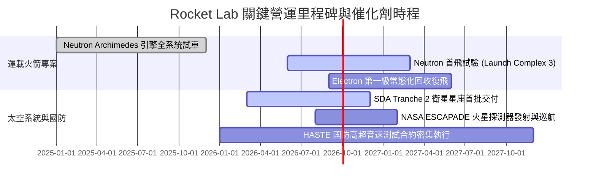

### 9.2 TAM 市場規模分析

```
╔══════════════════════════════════════════════════════════════════╗
║              Rocket Lab 目標市場規模 (TAM) 結構演變              ║
╠══════════════════════════════════════════════════════════════════╣
║                                                                  ║
║  小型專用發射市場 (Electron/HASTE)                               ║
║  ├── 當前 TAM: ~$2.5B  ──  RKLB 市佔率: ~35% (居領導地位)        ║
║                                                                  ║
║  中型發射與星座組網市場 (Neutron - 13噸級載荷)                   ║
║  ├── 潛在 TAM: ~$15.0B ──  預期商轉後市佔目標: 10%-15%           ║
║                                                                  ║
║  衛星製造與子組件市場 (Space Systems)                            ║
║  ├── 潛在 TAM: ~$25.0B ──  RKLB 當前滲透率: <3% (高速成長)       ║
║                                                                  ║
║  總計可觸及市場 TAM：由當前 ~$10B 躍升至 2030 年的 ~$42.5B       ║
║  核心驅動力：Neutron 將市場空間自「小型專用」擴展至「巨型組網」  ║
╚══════════════════════════════════════════════════════════════════╝
```

### 9.3 成長驅動力結構圖

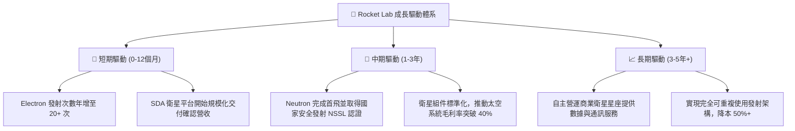

---

## 10. 風險矩陣

### 10.1 風險評分矩陣

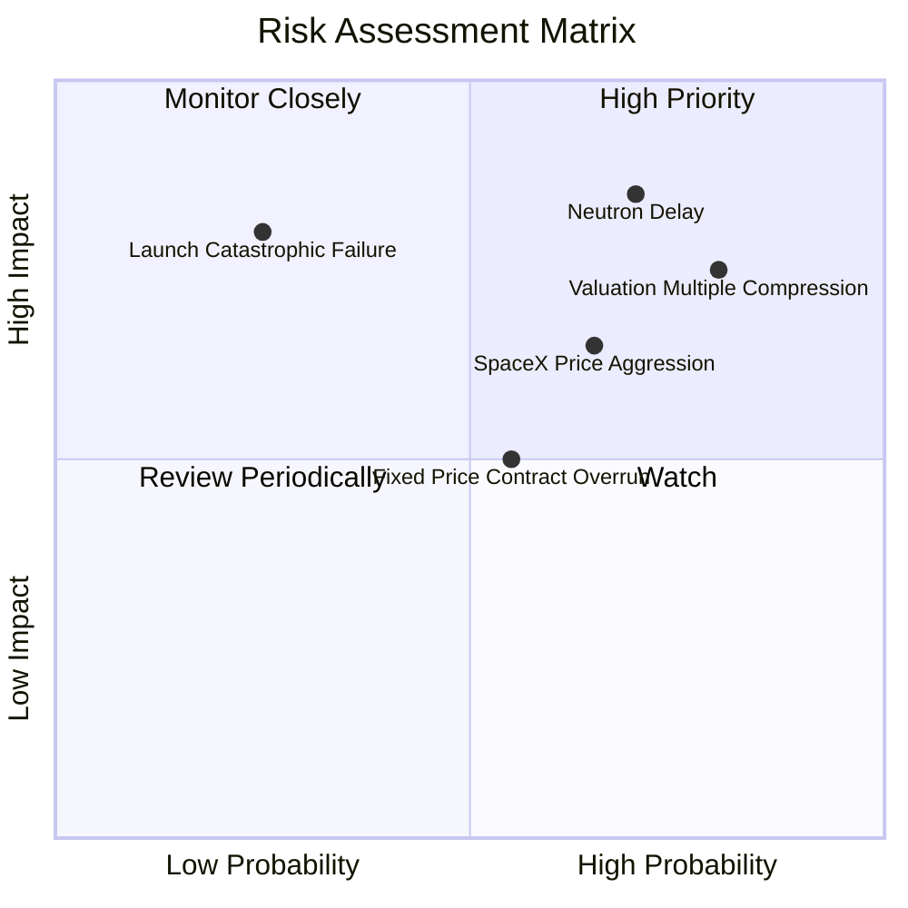

### 10.2 風險清單詳細分析

| # | 風險項目 | 發生機率 | 潛在財務衝擊 | 風險評分 | 緩解措施與防禦邊界 |
|---|----------|----------|--------------|----------|--------------------|
| 1 | 🔴 **Neutron 研發延宕或首飛失利** | 高 (70%) | 極高 (-25% 內在價值) | 🔴 **8.5/10** | 資產負債表儲備 $2.30B 現金，足以承擔 1-2 次試飛失敗與後續工程修訂。 |
| 2 | 🔴 **市場熱度降溫引發估值倍數殺估值** | 高 (80%) | 高 (-30% 股價跌幅) | 🔴 **8.0/10** | 公司主業營收實質增長 60%+，能以獲利能力提升逐步消化過高倍數。 |
| 3 | 🟡 **SpaceX Falcon 9 降價打擊小型發射** | 中 (65%) | 中度 (-15% 發射營收) | 🟡 **6.5/10** | 發揮 Electron 專屬軌道、即時發射（Dedicated Orbit）優勢，避開共乘路線爭端。 |
| 4 | 🟡 **政府固定總價合約 (Fixed-Price) 成本超支** | 中 (55%) | 中度 (-5pp 毛利率) | 🟡 **5.5/10** | 90% 衛星組件高度垂直自製，掌控供應鏈與各子系統物料清單成本。 |
| 5 | 🟢 **發射任務災難性失敗（發射後爆炸）** | 低 (25%) | 高 (-10% 股價短期衝擊) | 🟢 **4.5/10** | 累積 50+ 次成熟發射與完備的商業發射保險體系，單次事故不損及長期合約。 |

---

## 11. 投資建議

### 11.1 最終綜合評級雷達圖

```
╔══════════════════════════════════════════════════════════════════╗
║                  Rocket Lab 綜合維度評估雷達                     ║
╠══════════════════════════════════════════════════════════════════╣
║                                                                  ║
║  成長動能 (Growth)       9.0/10  ▓▓▓▓▓▓▓▓▓▓▓▓▓▓▓▓▓▓░░  極強      ║
║  財務健康 (Balance Sheet) 9.5/10  ▓▓▓▓▓▓▓▓▓▓▓▓▓▓▓▓▓▓▓░  極優      ║
║  技術與護城河 (Moat)     7.8/10  ▓▓▓▓▓▓▓▓▓▓▓▓▓▓▓░░░░░  優異      ║
║  管理執行力 (Execution)  8.2/10  ▓▓▓▓▓▓▓▓▓▓▓▓▓▓▓▓░░░░  良好      ║
║  獲利品質 (Profitability) 4.0/10  ▓▓▓▓▓▓▓▓░░░░░░░░░░░░  較弱      ║
║  估值吸引力 (Valuation)  3.5/10  ▓▓▓▓▓▓▓░░░░░░░░░░░░░  昂貴      ║
║                                                                  ║
║  綜合投資評分：6.8 / 10 ｜ 投資評級：🟡 持有 / 觀望 (Hold)       ║
╚══════════════════════════════════════════════════════════════════╝
```

### 11.2 目標價與隱含報酬率

| 情境 | 目標價 | 隱含報酬率（相對現價 $67.82） | 實現機率 | 核心支撐情境 |
|------|--------|--------------------------------|----------|--------------|
| 🔴 **悲觀情境 (Bear)** | **$31.85** | **-53.0%** | 25% | Neutron 首飛延至 2028 年，估值倍數被壓縮至 12x EV/Sales |
| 🟡 **基準情境 (Base)** | **$54.25** | **-20.0%** | 55% | 2027 年順利試飛，營收維持 35-40% 成長，估值回歸理性 |
| 🟢 **樂觀情境 (Bull)** | **$82.10** | **+21.1%** | 20% | Neutron 商轉取得商業大單，國防星座總包加速放量 |

### 11.3 買入時機與觸發因素

```
╔══════════════════════════════════════════════════════════════════╗
║                  買入與操作決策 Checklist                        ║
╠══════════════════════════════════════════════════════════════════╣
║                                                                  ║
║  ✅ 建議買入觸發條件（當前股價 $67.82，暫不建議追高）：           ║
║  ☐ 股價回檔至加權合理價值下緣：$38.00 – $44.00 區間 (MOS ≥ 20%)║
║  ☐ Neutron 完成 Archimedes 引擎熱試車且通過關鍵設計審查 (CDR)   ║
║  ☐ 太空系統（Space Systems）單季營業利潤率確認轉正              ║
║                                                                  ║
║  ⚠️ 建議加碼觸發條件：                                           ║
║  ☐ 取得美國國防部國家安全太空發射（NSSL）重大訂單分配           ║
║  ☐ Electron 實現第一級火箭常態化復飛，推升發射毛利率突破 45%    ║
║                                                                  ║
║  🛑 建議減碼 / 停損觸發條件：                                    ║
║  ☐ 當前股價持續非理性推升突破樂觀目標價 > $75.00                ║
║  ☐ Neutron 開發進度宣佈延遲超過 12 個月                         ║
║  ☐ 單季營運現金流赤字非預期擴大至單季消耗超過 $1.5 億美元       ║
╚══════════════════════════════════════════════════════════════════╝
```

### 11.4 投資人適配度分析

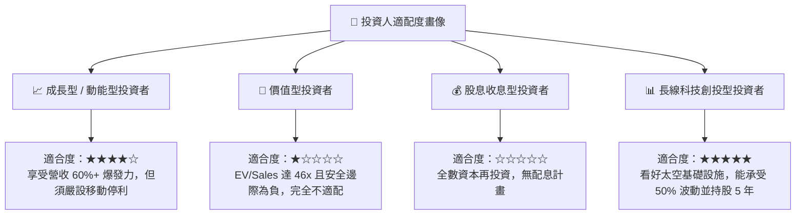

### 11.5 每季財報監控清單（Quarterly Watch List）

| 監控維度 | 追蹤關鍵指標 | 正常預期範圍 | 🚨 觸發警訊 / 減碼門檻 |
|----------|--------------|--------------|------------------------|
| **發射業務** | Electron 單季發射次數 | 4 - 6 次 / 季 | 單季發射次數 < 3 次或出現入軌失誤 |
| **太空系統** | 太空系統營收 YoY 成長率 | $\ge 40\%$ | YoY 成長率滑落至 $<25\%$ |
| **毛利演進** | 整體 GAAP 毛利率 | $35\% - 40\%$ | 毛利率跌破 $30\%$ |
| **研發支出** | 單季 R&D 費用規模 | $\$70\text{M} - \$90\text{M}$ | 研發激增但工程節點無重大進展 |
| **流動性消耗**| 現金及短投資金消耗速度 | 每季現金消耗 $<\$90\text{M}$ | 單季淨消耗 $>\$150\text{M}$ 且在手訂單下滑 |

### 11.6 反面論證：什麼會證明論點錯誤（What Would Change My Mind）

```
╔══════════════════════════════════════════════════════════════════╗
║              ⚠️ 論點失效條件（Disconfirming Evidence）           ║
╠══════════════════════════════════════════════════════════════════╣
║  本報告「持有/觀望」之中立審慎觀點，在下列情況成立時應予翻轉：   ║
║                                                                  ║
║  【轉向強力買入 🟢 之翻轉條件】：                                 ║
║  ① 市場發生系統性流動性危機，使股價超跌至 $38.00 以下（MOS >25%）║
║  ② Neutron 於 2026 年底前順利入軌並奪下數十億美元商業巨型星座合約║
║  ③ 毛利率攀升至 45% 以上，帶動本業營業現金流提前於 2027 年轉正  ║
║                                                                  ║
║  【轉向全面清倉/賣出 🔴 之翻轉條件】：                           ║
║  ① Archimedes 引擎試驗發生重大技術路線錯誤，導致重新設計延宕 2年 ║
║  ② 核心管理層或創辦人 Peter Beck 大規模減持現股                 ║
║  ③ 商業太空發射價格發生全面崩塌，公司訂單儲備連續兩季出現淨撤單 ║
╚══════════════════════════════════════════════════════════════════╝
```

---
> **免責聲明**：本報告為 AI 自動生成之證券研究文件，僅供研究與學術探討參考，不構成任何個別投資建議或有價證券之買賣要約。本報告所依據之財務數據源自公開市場資訊，估值模型皆基於特定主客觀假設推導。市場有風險，入市需謹慎，投資人應依個人財務狀況與風險承受度獨立進行決策。