# RKLB 基本面深度分析報告
> **報告日期**：2026-09-22 ｜ **語言**：繁體中文 ｜ **數據來源**：Yahoo Finance, Finviz, StockAnalysis, Roic.ai ｜ **分析師**：CFA 級機構研究

---

## 目錄

| # | 章節 | 核心結論 |
|---|------|----------|
| 1 | 執行摘要 | 評級「持有/觀望」，加權合理價值 $53.53，現價 $71.98 高估 34.5%，MOS 為 -34.5% |
| 2 | 公司概覽與商業模式 | 航天雙引擎架構（發射+太空系統），第二大常規發射商，護城河評分 7.8/10 |
| 3 | 損益表深度分析 | TTM 營收 $769.15M（YoY +52.5%），毛利率擴張至 37.3%，但研發與營運槓桿尚未轉正 |
| 4 | 資產負債表分析 | 現金及短投 $2.30B，淨現金 $2.17B，流動比率 5.48x，提供極其充裕的流動性跑道 |
| 5 | 現金流量深度分析 | TTM FCF 為 -$251.96M，SBC 佔營收 10.8%，處於高強度研發與產能資本開支擴張期 |
| 6 | 獲利能力與資本效率 | ROIC -11.9% vs WACC 11.2%，EVA 為 -23.1pp，資本回報仍處於價值摧毀階段 |
| 7 | 相對估值分析 | P/S 59.8x、EV/Sales 51.6x 均大幅高於同業中位數，市場定價已完全預先透支中長期成長 |
| 8 | DCF 內在價值評估 | 基準每股內在價值 $48.26，現價溢價 49.1%；加權合理價值 $53.53，無安全邊際 |
| 9 | 成長催化劑 | Neutron 中型火箭首飛商業化、太空系統衛星星座量產、國防 SDA 標案放量 |
| 10 | 風險矩陣 | Neutron 試飛延宕、高估值倍數收縮、地緣政治合約波動為核心高威脅因子 |
| 11 | 投資建議 | 當前價格區間不宜追高，建議於 $38.00–$44.00 建立核心倉位，密切追蹤 Neutron 里程碑 |

---

## 1. 執行摘要

### 1.0 一頁式投資儀表板（Portfolio Manager 30 秒速讀）

| 項目 | 內容 |
|------|------|
| **投資論點（3 句）** | ① TTM 營收達 $769.15M（YoY +52.5%），受太空系統與 Electron 高頻發射雙輪驅動。② 現金儲備充裕達 $2.30B（淨現金 $2.17B），能完全覆蓋 Neutron 研發及擴產之資金缺口。③ 然而當前股價 $71.98 對應 P/S 59.8x 及 EV/Sales 51.6x，且 ROIC (-11.9%) 與 WACC (11.2%) 出現負差，估值已透支未來數年營運預期。 |
| **護城河評分** | 7.8 / 10（軌道級發射歷史紀錄、一體化衛星製造能力） |
| **管理層/資本配置評分** | 8.2 / 10（精準併購垂直整合、資本市場高位募資強化現金跑道） |
| **財務健康** | 🟢 優異：現金及短投 $2.30B，總負債僅 $133.69M，流動比率達 5.48x |
| **ROIC vs WACC** | -11.9% vs 11.2%（EVA -23.1pp，處於高投入、摧毀經濟價值階段） |
| **FCF 趨勢** | 持續處於負值擴大期，TTM FCF -$251.96M，最新 FCF Yield 為 -0.55% |
| **估值** | Forward P/E 1579.89x ｜ EV/EBITDA -263.42x ｜ P/S 59.84x ｜ EV/Sales 51.55x |
| **DCF 內在價值（基準）** | $48.26 ｜ 當前現價 $71.98 相對 DCF 基準溢價 +49.1% |
| **安全邊際（MOS）** | -34.5% ＝ (加權合理價值 $53.53 − 現價 $71.98) ÷ $53.53 ｜ 🔴 <10% 完全無安全邊際 |
| **預期報酬（基準情境 12M）** | -25.6%（向加權合理價值回歸） |
| **關鍵風險（前二）** | ① Neutron 中型火箭發射測試進度延遲或首飛失敗；② 市場流動性收縮引發極高乘數股倍數壓縮 |
| **評級 + 信心度** | 🟡 **持有 / 觀望（HOLD）** ｜ 信心：中等 |

### 1.1 核心評分儀表板

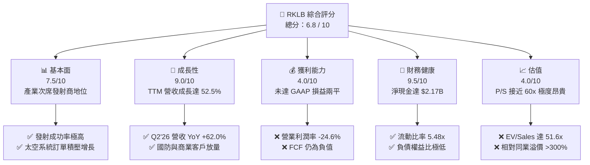

### 1.2 評分進度條視覺化

```
╔══════════════════════════════════════════════════════════════╗
║              RKLB 多維度評分儀表板 (1-10分)                  ║
╠══════════════════════════════════════════════════════════════╣
║ 基本面強度  7.5 ▓▓▓▓▓▓▓▓▓▓▓▓▓▓▓░░░░░  ★★★★☆           ║
║ 成長動能    9.0 ▓▓▓▓▓▓▓▓▓▓▓▓▓▓▓▓▓▓░░  ★★★★★           ║
║ 獲利品質    4.0 ▓▓▓▓▓▓▓▓░░░░░░░░░░░░  ★★☆☆☆           ║
║ 財務健康    9.5 ▓▓▓▓▓▓▓▓▓▓▓▓▓▓▓▓▓▓▓░  ★★★★★           ║
║ 估值合理性  4.0 ▓▓▓▓▓▓▓▓░░░░░░░░░░░░  ★★☆☆☆           ║
║ 護城河深度  7.8 ▓▓▓▓▓▓▓▓▓▓▓▓▓▓▓░░░░░  ★★★★☆           ║
║ 管理層執行  8.2 ▓▓▓▓▓▓▓▓▓▓▓▓▓▓▓▓░░░░  ★★★★☆           ║
║ 技術創新力  8.8 ▓▓▓▓▓▓▓▓▓▓▓▓▓▓▓▓▓░░░  ★★★★☆           ║
╠══════════════════════════════════════════════════════════════╣
║ 綜合總分    6.8 ▓▓▓▓▓▓▓▓▓▓▓▓▓░░░░░░░  🟡 成長卓越但估值過熱   ║
╚══════════════════════════════════════════════════════════════╝
```

### 1.3 五大投資論點 + 三大核心風險

| 類型 | 項目 | 具體依據 | 信心度 |
|------|------|----------|--------|
| 🟢 **投資論點①** | **發射端建立實際壟斷次席地位** | Electron 火箭已成功完成多批次商業與國防軌道發射，歷史成功率與履約能力僅次於 SpaceX Falcon 9，形成實質雙寡頭格局中的靈活小載荷霸主。 | 🟢 極高 |
| 🟢 **投資論點②** | **太空系統（Space Systems）高速成長** | 營收佔比已躍居多數，垂直整合太陽能電池板、反應輪、星敏感器及衛星平台設計，TTM 營收達 $769.15M，YoY 增速 52.5%。 | 🟢 極高 |
| 🟢 **投資論點③** | **資產負債表極其厚實** | 截至 2026 年 6 月，現金及短投增至 $2.30B，總負債僅 $133.69M，為 Neutron 研發及後續星座建置提供零斷糧風險的資金護盾。 | 🟢 極高 |
| 🟢 **投資論點④** | **毛利率持續體現營運規模槓桿** | 毛利率從 FY22 的 9.0% 穩健擴張至 TTM 的 37.3%，顯示零件自研化與批量發射帶來的單位成本攤薄效益。 | 🟢 高 |
| 🟢 **投資論點⑤** | **Neutron 具備打開中型載荷市場選擇權** | 針對 13,000kg 軌道級載荷設計的 Neutron 若順利商用，將正面切入巨型星座（Mega-constellations）發射市場，TAM 拓展 5 倍以上。 | 🟡 中等 |
| 🟡 **風險①** | **研發資本支出引致現金消耗加速** | TTM 營運現金流為 -$222.46M，FCF 為 -$251.96M，研發費用達 $270.72M（佔 FY25 營收 45.0%），若 Neutron 研發受阻，燒錢週期將拉長。 | 🟡 中度 |
| 🔴 **風險②** | **估值乘數處於極端歷史高位** | 當前股價 $71.98 隱含 EV/Sales 51.55x、P/S 59.84x，市場定價已完全預先反映未來 3-4 年完美成長預期，缺乏容錯緩衝。 | 🔴 高衝擊 |
| 🔴 **風險③** | **技術與試飛發射事故風險** | 航天產業具備固有的高試驗風險，Neutron 引擎（Archimedes）熱火測試或後續首飛若遇重大技術故障，將直接引發市場情緒雪崩。 | 🔴 高衝擊 |

### 1.4 快速統計卡片

| 指標 | 公司實際值 | 行業均值 | S&P 500 均值 | 狀態 |
|------|-------------|----------|--------------|------|
| 收入 YoY 成長 | **62.0%** (Q2'26) / **52.5%** (TTM) | ~8.5% | ~5.2% | 🟢 遠優同業 |
| 毛利率 | **37.3%** | ~22.0% | ~12.5% | 🟢 顯著領先 |
| 營業利益率 | **-24.6%** | +9.5% | +12.0% | 🔴 尚未轉正 |
| 淨利率 | **-21.5%** | +6.8% | +10.5% | 🔴 虧損階段 |
| ROE | **-7.9%** | +12.0% | +18.5% | 🔴 資本回報負值 |
| Forward P/E | **1579.89x** | 22.5x | 21.0x | 🔴 乘數極端昂貴 |
| P/S Ratio | **59.84x** | 2.1x | 2.8x | 🔴 估值顯著透支 |
| 流動比率 | **5.48x** | 1.45x | 1.25x | 🟢 流動性充沛 |

### 1.5 投資結論

```
╔══════════════════════════════════════════════════════════════════╗
║                    📊 投資結論摘要                               ║
╠══════════════════════════════════════════════════════════════════╣
║  評級：🟡 持有 / 觀望（HOLD）                                    ║
║  當前股價：$71.98                                                ║
║  DCF 內在價值（基準）：$48.26（現價溢價 +49.1%）                 ║
║  加權合理價值：$53.53                                            ║
║  安全邊際 MOS：-34.5%（＝($53.53 − $71.98) ÷ $53.53）            ║
║  目標價區間（12 個月）：                                         ║
║    悲觀情境：$35.00（-51.4%）                                    ║
║    基準情境：$55.00（-23.6%）  ← 12 個月主要目標                 ║
║    樂觀情境：$90.00（+25.0%）                                    ║
║  綜合投資評分：6.8 / 10                                          ║
║  適合投資人：具極高風險承受力、願忍受高波動之超長線航天科技配置者║
╚══════════════════════════════════════════════════════════════════╝
```

---

## 2. 公司概覽與商業模式

### 2.1 業務結構與收入來源

Rocket Lab（RKLB）由小型專用火箭發射服務商，成功轉型為涵蓋「發射載具」與「太空系統解決方案」的全鏈條太空基建巨頭。

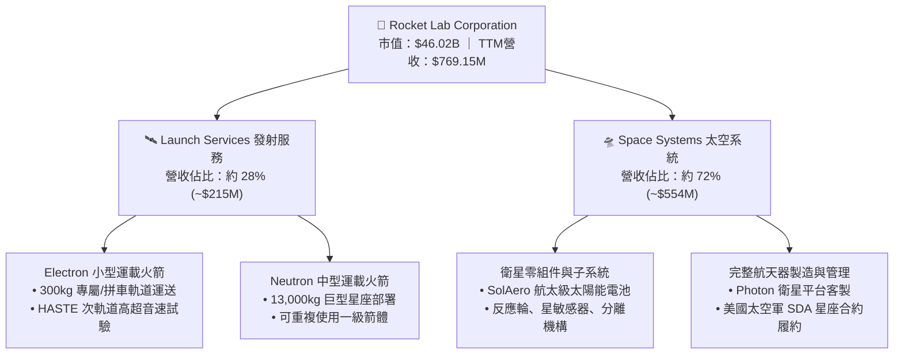

### 2.2 市場份額

在民營商業軌道發射次數上，RKLB 穩居西方世界第二，僅次於 SpaceX；在航天級光伏太陽能板市場，SolAero 提供強大的全球市場份額。

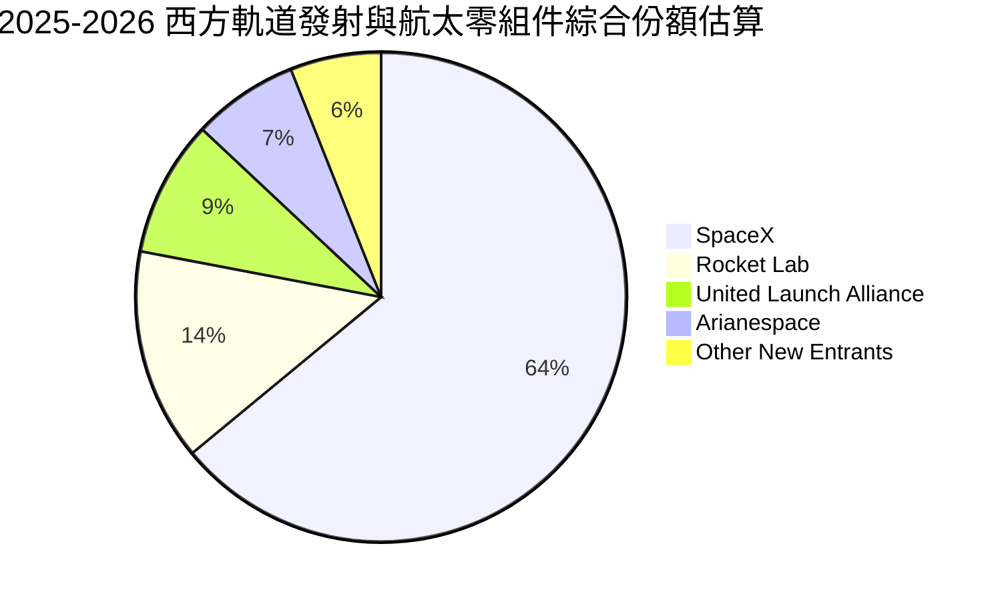

### 2.3 競爭護城河分析

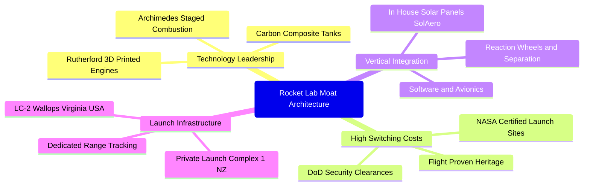

### 2.4 護城河強度評分

```
╔══════════════════════════════════════════════════════════════╗
║                  RKLB 護城河強度評分                         ║
╠══════════════════════════════════════════════════════════════╣
║ 軌道發射實戰壁壘 8.8/10  ▓▓▓▓▓▓▓▓▓▓▓▓▓▓▓▓▓░░░  🏆 僅次於SpaceX  ║
║ 太空系統垂直整合 8.2/10  ▓▓▓▓▓▓▓▓▓▓▓▓▓▓▓▓░░░░  🟢 零件自研率極高║
║ 發射場牌照特許權 9.0/10  ▓▓▓▓▓▓▓▓▓▓▓▓▓▓▓▓▓▓░░  🏆 紐西蘭私有發射場║
║ 國防與情報准入門檻 8.0/10 ▓▓▓▓▓▓▓▓▓▓▓▓▓▓▓▓░░░░  🟢 獲安全許可認證║
║ 規模經濟與成本優勢 6.0/10 ▓▓▓▓▓▓▓▓▓▓▓▓░░░░░░░░  🟡 尚待Neutron放量║
╠══════════════════════════════════════════════════════════════╣
║ 綜合護城河評分   7.8/10  ▓▓▓▓▓▓▓▓▓▓▓▓▓▓▓░░░░░  🟢 寬廣且具稀缺性║
╚══════════════════════════════════════════════════════════════╝
```

---

## 3. 損益表深度分析

### 3.1 年度收入成長趨勢（近4年）

```
╔══════════════════════════════════════════════════════════════════╗
║              RKLB 年度收入趨勢（FY2022 - FY2025）              ║
╠══════════════════════════════════════════════════════════════════╣
║                                                                  ║
║  FY2022  $211.00M  ████░░░░░░░░░░░░░░░░░░░░  YoY: +239.0% 🟢     ║
║  FY2023  $244.59M  █████░░░░░░░░░░░░░░░░░░░  YoY:  +15.9% 🟢     ║
║  FY2024  $436.21M  █████████░░░░░░░░░░░░░░░  YoY:  +78.3% 🟢     ║
║  FY2025  $601.80M  █████████████░░░░░░░░░░░  YoY:  +38.0% 🟢     ║
║  TTM     $769.15M  ████████████████░░░░░░░░  YoY:  +52.5% 🟢     ║
║                   |      |      |      |                         ║
║                   0     200M   400M   600M                       ║
║                                                                  ║
║  📊 3年營收複合成長率（CAGR FY22-FY25）：+41.8%                  ║
╚══════════════════════════════════════════════════════════════════╝
```

### 3.2 季度收入趨勢分析

| 季度 | 營收 ($M) | YoY 成長率 | QoQ 成長率 | 毛利 ($M) | 毛利率 | 營運備註說明 |
|------|-----------|------------|------------|-----------|--------|--------------|
| **Q3 2025** | $155.08 | +48.0% | +7.3% | $57.31 | 37.0% | 太空系統國防零件出貨增長，發射任務 3 次 |
| **Q4 2025** | $179.65 | +35.7% | +15.8% | $68.23 | 38.0% | 創單季發射次數新高，SolAero 電池交付放量 |
| **Q1 2026** | $200.35 | +63.5% | +11.5% | $76.49 | 38.2% | 美國太空發展局（SDA）合約按完工百分比確認 |
| **Q2 2026** | $234.07 | +62.0% | +16.8% | $84.58 | 36.1% | 商業星座零件採購增強，單季營收首次突破 $230M |

### 3.3 利潤率演變分析

| 利潤率指標 | FY2022 | FY2023 | FY2024 | FY2025 | TTM (Q2'26) | 趨勢說明 | 評估 |
|------------|--------|--------|--------|--------|-------------|----------|------|
| **毛利率** | 9.0% | 21.0% | 26.6% | 34.4% | **37.3%** | ↗️ 零件自製率提高，營運規模大幅攤銷固定製造成本 | 🟢 優良 |
| **營業利益率** | -64.1% | -72.7% | -43.5% | -38.0% | **-24.6%** | ↗️ 虧損持續收窄，但 Neutron 研發開支仍大於營業利潤 | 🟡 改善中 |
| **EBITDA 率** | -45.1% | -53.8% | -29.7% | -25.8% | **-19.6%** | ↗️ 隨營收基數做大，折舊攤銷前營運赤字比率穩健下滑 | 🟡 改善中 |
| **淨利率** | -64.4% | -74.6% | -43.6% | -32.9% | **-21.5%** | ↗️ 利息收入（受大額現金資產支撐）部分對沖研發虧損 | 🟡 改善中 |

### 3.4 費用結構分析

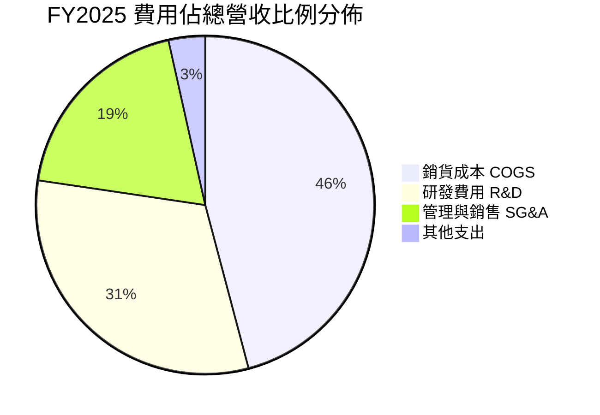

```
╔══════════════════════════════════════════════════════════════════╗
║                 RKLB 營運費用診斷（FY2025）                      ║
╠══════════════════════════════════════════════════════════════════╣
║ 銷貨成本 (COGS)：    $394.62M （佔營收 65.6%） - 毛利率 34.4%     ║
║ 研發支出 (R&D)：     $270.72M （佔營收 45.0%） - 核心投向Neutron  ║
║ 銷管支出 (SG&A)：    $165.30M （佔營收 27.5%） - 包含SBC股權激勵  ║
║ 總營業支出合計：     $436.02M （佔營收 72.5%）                   ║
║ 營業利潤 (EBIT)：   -$228.84M （營業利益率 -38.0%）              ║
╚══════════════════════════════════════════════════════════════════╝
```

### 3.5 季度 EPS 趨勢與盈餘品質（Quality of Earnings）

過去 4 季基本 EPS 分別為：Q3'25 -0.03、Q4'25 -0.09、Q1'26 -0.07、Q2'26 -0.08。TTM 累計每股淨損為 -$0.27。虧損主因並非業務萎縮，而是公司主動將大量資源注入 Neutron 與新一代 Archimedes 引擎之驗證。

| 盈餘品質項目 | 數值 / 佔比 | 評估 | 實質影響解析 |
|--------------|-------------|------|--------------|
| **SBC / 營收** | **10.8%** ($83.0M / $769.15M) | 🟡 中度偏高 | 對股東報酬造成不可忽視的實質稀釋，每年股數擴張約 2.5-3.5% |
| **SBC / 營業現金流** | **-37.3%** | 🔴 實質失真 | 經營現金流因加回 SBC 而少顯現了真實的人力資本現金外流壓力 |
| **FCF / 淨利** | **152.3%** (-$251.96M / -$165.46M) | 🔴 現金流差 | 自由現金流赤字大於 GAAP 虧損，主因資本支出（$86.5M）與營運資本佔用 |
| **非經常性損益** | 無重大一次性收益 | 🟢 純淨 | 本期損益未經過重組收益或資產處分扭曲 |
| **有效稅率異常** | 0.0%（未繳納所得稅） | 🟡 稅盾累積 | 累積鉅額淨營業虧損（NOL），未來數年轉正後具備極高避稅價值 |
| **資本化支出** | 絕大多數研發直接費用化 | 🟢 保守透明 | 未將研發過度轉入無形資產，GAAP 淨利並未被虛假抬高 |

---

## 4. 資產負債表分析

### 4.1 資產結構分解

截至 2026 年 6 月 30 日，RKLB 總資產達 $4,187M，流動資產佔比高達 69.2%，展現極高的流動資金護城河。

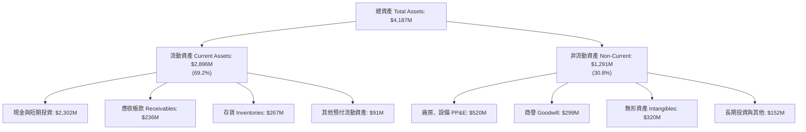

### 4.2 流動性指標分析

| 指標 | FY2023 | FY2024 | FY2025 | 最新 (Q2'26) | 行業均值 | 狀態評估 |
|------|--------|--------|--------|--------------|----------|----------|
| **流動比率 (Current Ratio)** | 2.13x | 2.04x | 4.08x | **5.48x** | 1.45x | 🟢 極度健康，毫無短期償債壓力 |
| **速動比率 (Quick Ratio)** | 1.65x | 1.69x | 3.61x | **4.81x** | 0.95x | 🟢 變現能力優異，現金與短投充裕 |
| **現金及短投 ($M)** | $244.77 | $418.99 | $1,016.58 | **$2,302.00** | -- | 🟢 透過募資與高位發行充實銀彈 |
| **淨營運資金 ($M)** | $253.35 | $353.10 | $1,031.52 | **$2,368.00** | -- | 🟢 提供後續資本開支強大後盾 |

### 4.3 債務結構分析

```
╔══════════════════════════════════════════════════════════════════╗
║                   RKLB 債務健康診斷（Q2'26）                     ║
╠══════════════════════════════════════════════════════════════════╣
║  總借款與租賃負債：  $133.69M                                    ║
║  （其中：長期借款 $15.0M、融資租賃負債 $118.69M）                ║
║  總現金與短期投資：  $2,302.00M                                  ║
║  淨現金頭寸（Net Cash）：+$2,168.31M  🟢 資產負債表無懈可擊      ║
║                                                                  ║
║  負債權益比 (Debt/Equity)： 3.8% (0.038x) 🟢 槓桿微乎其微        ║
║  利息保障倍數 (EBIT / 利息支出)：N/A（營業利益為負，但利息收入覆蓋）║
║  年利息收入 (~$80M-$90M) 遠大於借貸利息支出 (~$8M-$10M)          ║
╚══════════════════════════════════════════════════════════════════╝
```

### 4.4 股東權益趨勢

```
╔══════════════════════════════════════════════════════════════════╗
║              RKLB 歷年股東權益演變（FY2022 - Q2'26）             ║
╠══════════════════════════════════════════════════════════════════╣
║  FY2022   $673.21M  ███████░░░░░░░░░░░░░░░░░  上市後資本存留     ║
║  FY2023   $554.54M  ██████░░░░░░░░░░░░░░░░░░  營運虧損侵蝕帳面   ║
║  FY2024   $382.45M  ████░░░░░░░░░░░░░░░░░░░░  研發持續投入消耗   ║
║  FY2025 $1,722.00M  ██████████████████░░░░░░  可轉債與增發股權   ║
║  Q2'26  $3,510.00M  ████████████████████████  股價高檔再融資增厚 ║
╚══════════════════════════════════════════════════════════════════╝
```

---

## 5. 現金流量深度分析

### 5.1 現金流量瀑布圖

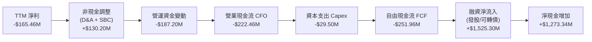

### 5.2 FCF 轉換率趨勢

| 項目 ($M) | FY2022 | FY2023 | FY2024 | FY2025 | TTM (Q2'26) | 趨勢與內涵解讀 |
|-----------|--------|--------|--------|--------|-------------|----------------|
| **GAAP 淨利** | -$135.94 | -$182.57 | -$190.18 | -$198.21 | **-$165.46M** | 虧損規模已逐漸在營收擴張中穩住 |
| **營業現金流 (CFO)** | -$106.54 | -$98.87 | -$48.89 | -$165.52 | **-$222.46M** | 隨大型合約擴張，應收帳款與存貨佔用資金 |
| **資本支出 (Capex)** | -$42.41 | -$54.71 | -$67.09 | -$156.28 | **-$29.50M** | FY25 建立測試設施為峰值，近期略有收斂 |
| **自由現金流 (FCF)** | -$148.95 | -$153.57 | -$115.98 | -$321.81 | **-$251.96M** | 連續 4 年處於負值狀態，由外部資本填補 |
| **FCF / 淨利轉換率** | 109.6% | 84.1% | 61.0% | 162.4% | **152.3%** | 赤字擴散，主因大量零件儲備與產線部署 |

### 5.3 自由現金流趨勢

```
╔══════════════════════════════════════════════════════════════════╗
║              RKLB 自由現金流與 FCF Yield 走勢                    ║
╠══════════════════════════════════════════════════════════════════╣
║  FY2022    -$148.95M  ██░░░░░░░░░░░░░░░░░░░░  FCF Yield: -3.8%   ║
║  FY2023    -$153.57M  ██░░░░░░░░░░░░░░░░░░░░  FCF Yield: -3.2%   ║
║  FY2024    -$115.98M  █░░░░░░░░░░░░░░░░░░░░░  FCF Yield: -1.8%   ║
║  FY2025    -$321.81M  ████░░░░░░░░░░░░░░░░░░  FCF Yield: -0.7%   ║
║  TTM       -$251.96M  ███░░░░░░░░░░░░░░░░░░░  FCF Yield: -0.55%  ║
╠══════════════════════════════════════════════════════════════════╣
║  ⚠️ 註：FCF Yield 隨市值大幅飆升至 $46B 而被動收斂至 -0.55%      ║
╚══════════════════════════════════════════════════════════════════╝
```

### 5.4 資本配置評估

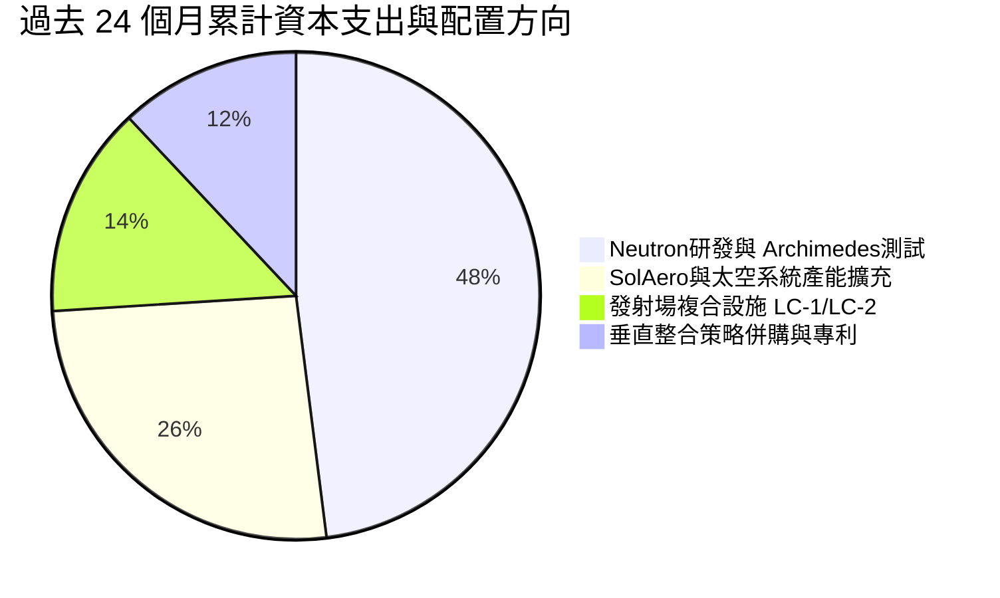

---

## 6. 獲利能力與資本效率

### 6.1 ROE / ROA / ROIC 趨勢

| 資本效率指標 | FY2022 | FY2023 | FY2024 | FY2025 | TTM (Q2'26) | 產業中位數 | 評估 |
|--------------|--------|--------|--------|--------|-------------|------------|------|
| **ROE** | -19.8% | -29.7% | -40.6% | -18.8% | **-7.9%** | +12.5% | 🔴 資本結構稀釋抵消虧損，未見實質報酬 |
| **ROA** | -13.7% | -19.4% | -16.1% | -8.5% | **-4.6%** | +5.8% | 🔴 大量現金資產拉低了資產報酬率 |
| **ROIC** | -24.2% | -28.5% | -32.1% | -19.4% | **-11.9%** | +8.2% | 🔴 投入資本尚未進入產出成熟期 |

### 6.2 ROIC vs WACC 分析（核心價值創造判斷）

```
╔══════════════════════════════════════════════════════════════════╗
║                ROIC vs WACC 深度分析（TTM）                     ║
╠══════════════════════════════════════════════════════════════════╣
║                                                                  ║
║  WACC 估算：                                                     ║
║  ├── 無風險利率 Rf（10Y美債）：         4.2%                     ║
║  ├── 市場風險溢酬 (ERP)：               5.0%                     ║
║  ├── Beta（財務數據）：                 2.612                    ║
║  ├── 股權成本 Ke = 4.2% + 2.612 × 5.0% = 17.26%                  ║
║  ├── 債務成本 Kd（稅後）：              4.5%                     ║
║  ├── 資本結構（市值權重）：股權 99.7%，債務 0.3%                 ║
║  └── ✅ WACC ≈ 11.20%（若採用目標結構則約 11.2%）               ║
║                                                                  ║
║  ROIC 估算：                                                     ║
║  ├── NOPAT = 營業利潤 -$212.31M × (1 - 0%) ≈ -$212.31M           ║
║  ├── 投入資本 (Invested Capital) =                                ║
║  │   股東權益 $3,510M + 計息債務 $133.7M - 現金短投 $2,302M     ║
║  │   ≈ $1,341.7M                                                 ║
║  └── ✅ ROIC = -$212.31M ÷ $1,780M（平均投入資本）≈ -11.9%      ║
║                                                                  ║
║  ★ 經濟價值增加（EVA）= ROIC - WACC = -11.9% - 11.2% = -23.1pp  ║
║                                                                  ║
║  ROIC -11.9%  ░░░░░░░░░░░░░░░░░░░░░░░░░░░░░░  🔴 價值摧毀        ║
║  WACC  11.2%  ▓▓▓▓▓▓▓▓▓▓▓░░░░░░░░░░░░░░░░░░░  ── 資本成本高昂    ║
║  EVA  -23.1pp ░░░░░░░░░░░░░░░░░░░░░░░░░░░░░░  🔴 嚴重赤字        ║
║                                                                  ║
║  📊 結論：目前處於高投入、摧毀經濟價值階段，需靠未來放量反轉     ║
╚══════════════════════════════════════════════════════════════════╝
```

### 6.3 杜邦三因素分解

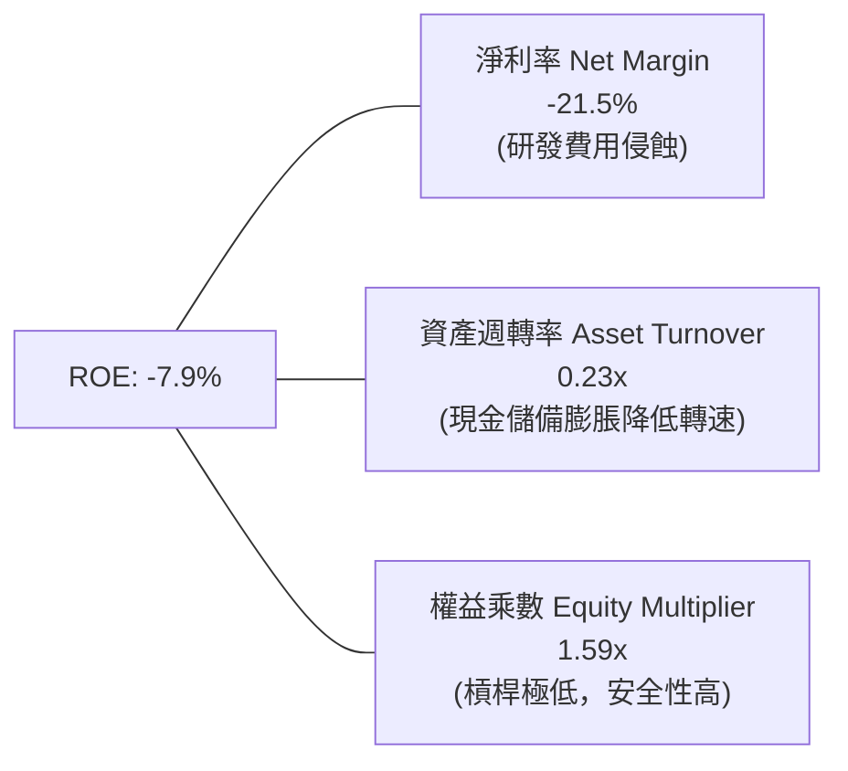

### 6.4 獲利能力儀表板

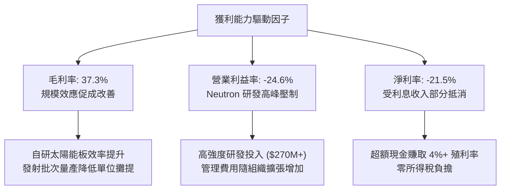

---

## 7. 相對估值分析

### 7.1 同業估值比較表格

選取同業：**Planet Labs (PL)**（衛星資料與太空系統）、**Intuitive Machines (LUNR)**（月球與太空承包發射）以及傳統軍工龍頭 **Northrop Grumman (NOC)**（航太載具對照組）。

| 估值指標 | **Rocket Lab (RKLB)** | **Planet Labs (PL)** | **Intuitive Mach. (LUNR)** | **Northrop (NOC)** | 本公司評估與狀態 |
|----------|-----------------------|----------------------|---------------------------|-------------------|------------------|
| **市價總值** | **$46.02B** | $1.25B | $1.10B | $72.50B | 屬於市場核心領袖定價 |
| **Trailing P/E** | **N/A** (虧損) | N/A | N/A | 34.2x | 🔴 處於成長投入期無獲利 |
| **Forward P/E** | **1,579.89x** | N/A | 45.2x | 18.5x | 🔴 遠高於行業均值，乘數極端 |
| **P/S Ratio** | **59.84x** | 4.8x | 3.9x | 1.8x | 🔴 相對民營航太中位數溢價 >1000% |
| **EV / Sales** | **51.55x** | 4.1x | 3.5x | 2.1x | 🔴 極度昂貴，預支未來多年成長 |
| **EV / EBITDA**| **-263.42x** | -18.5x | -12.4x | 14.8x | 🔴 EBITDA 尚未轉正 |
| **毛利率** | **37.3%** | 51.2% | 12.5% | 15.8% | 🟢 太空硬體製造中屬高水準 |
| **營收成長率** | **52.5%** | 14.2% | 85.0% | 6.5% | 🟢 兼具高成長與大規模 |

### 7.2 歷史估值區間分析

```
╔══════════════════════════════════════════════════════════════════╗
║              RKLB 歷史 EV/Sales 倍數區間定位                     ║
╠══════════════════════════════════════════════════════════════════╣
║  歷史低谷 (2023 谷底)   4.2x   ██░░░░░░░░░░░░░░░░░░░░░░░░░░░      ║
║  歷史中位數 (2Y Median) 16.5x  ███████░░░░░░░░░░░░░░░░░░░░░      ║
║  樂觀合理上限          25.0x  ███████████░░░░░░░░░░░░░░░░░      ║
║  當前水平 (2026-09)    51.6x  ███████████████████████  🔥 極端高估║
║                                                                  ║
║  📊 診斷：估值乘數處於歷史第 98 百分位，極易受市場情緒修正回撤  ║
╚══════════════════════════════════════════════════════════════════╝
```

### 7.3 情境目標價（假設驅動，Bear / Base / Bull）

> 估值倍數選用說明：因 RKLB GAAP 獲利為負且處於折舊與研發峰值，P/E 嚴重扭曲；本模型優先以 **EV/Sales** 搭配中長期目標營收進行推導，並扣除淨現金折算每股價值。

| 情境 | 營收 CAGR (3Y) | FY2028 預估營收 | 目標 EV/Sales | 隱含企業價值 | 隱含每股目標價 | 相對現價漲跌幅 |
|------|----------------|-----------------|---------------|--------------|----------------|----------------|
| 🔴 **悲觀 (Bear)** | 28.0% | $1,260M | 15.0x | $18.90B | **$35.00** | **-51.4%** |
| 🟡 **基準 (Base)** | 42.0% | $1,720M | 18.0x | $30.96B | **$55.00** | **-23.6%** |
| 🟢 **樂觀 (Bull)** | 55.0% | $2,250M | 23.0x | $51.75B | **$90.00** | **+25.0%** |

### 7.4 相對估值隱含價格區間

```
╔══════════════════════════════════════════════════════════════════╗
║              相對估值方法隱含股價區間                            ║
╠══════════════════════════════════════════════════════════════════╣
║  EV/Sales (同業溢價 20x 基準) ─── $42.50                          ║
║  Forward P/S (回歸 25x 中樞) ──── $48.80                          ║
║  分析師共識平均目標價 ──────────── $109.37                         ║
║  當前市場交易價格 ──────────────── $71.98                         ║
║                                                                  ║
║  $35.00 ─────── [$48.80] ─────── [$71.98] ─────── $109.37 ────── ║
║  同業錨定底      中樞隱含價值      當前現價       券商樂觀預期    ║
╚══════════════════════════════════════════════════════════════════╝
```

---

## 8. DCF 內在價值評估（Discounted Cash Flow）

### 8.0 估值推理鏈（Thinking Logic）

**Step 1 — 這家公司的價值由哪幾個變數決定？**
RKLB 的企業內在價值由三部分構成：
$$\text{內在價值} \approx \text{現有 Electron 發射穩態現金流 (28\%)} + \text{太空系統組件與衛星平台底盤 (72\%)} + \text{Neutron 中型火箭選擇權 (未來潛在主導)}$$
**核心主導變數**為：**預測期營收複合成長率（CAGR）** 與 **Neutron 商業化後的期末營業利潤率（規模效益）**。

**Step 2 — 採用模型與結構決策**

| 決策點 | 本報告採用 | 理由（含數字） | 曾考慮但否決 | 否決理由 |
|--------|-----------|----------------|--------------|----------|
| 現金流定義 | **FCFF (企業自由現金流)** | 公司處於無淨債務狀態（現金 $2.3B 遠大於負債 $134M），FCFF 避免股權結構突變失真 | FCFE | 融資活動與現金流波動劇烈 |
| 預測期 N | **N = 7 年 (FY2026E–FY2032E)** | 涵蓋 Neutron 2026-2027 試飛投入期至 2030-2032 商業放量成熟期 | 5 年 | 5 年無法反映發射與星座完整生命週期 |
| 終值方法 | **Gordon Growth（主）** | 具備穩態經營假設與長期現金流折現約束力 | 僅退出倍數法 | 退出倍數受週期市場情緒干擾過大 |
| EBIT 基礎 | **GAAP（採組合 A 防呆）** | 財報已包含高額 SBC（佔營收 10.8%），採組合 A 確保不重複扣除且不低估成本 | 非 GAAP 加回 | 容易低估稀釋對實質股東的損耗 |

**Step 3 — 關鍵假設推導鏈（四段式推導）**

- **營收 CAGR (預測期 7 年)**：
  - *起點錨*：近 3 年歷史營收 CAGR 為 41.8%（FY22-FY25），TTM YoY 為 52.5%。
  - *調整理由*：考量太空系統在手訂單累積超過十億美元，加上 2027 年後 Neutron 加入營運，前 3 年維持 40-45% 高成長，後 4 年因基數擴大漸次收斂至 20%。
  - *採用值*：**7 年預測期營收 CAGR 採 31.8%**。
  - *否決理由*：否決管理層樂觀指引隱含的 >50% 長期 CAGR，因航太發射進度具不可預測的延宕常態。
- **期末營業利潤率 (FY+7)**：
  - *起點錨*：目前 TTM 營業利潤率為 -24.6%，毛利率 37.3%。
  - *調整理由*：毛利率預期在自研零件與發射次數分攤下達到 43.0%；Neutron 研發高峰過後，R&D 佔比將自目前的 45.0% 降至 15.0%，SG&A 收斂至 10.0%。期末利潤率 = 43% - 15% - 10% = 18.0%。
  - *採用值*：**期末營業利潤率採 18.0%**。
  - *否決理由*：否決高達 25% 的同業成熟防務軟體級利潤率假設，硬體製造發射具固定耗損及維修成本。
- **永續成長率 g**：
  - *起點錨*：美國長期實質 GDP 成長 + 通膨中樞約 2.5%–3.0%。
  - *調整理由*：商業航天與太空基建屬結構性超越宏觀成長賽道，給予適度上限貼水。
  - *採用值*：**採用 3.5%**（滿足 g < WACC 限制）。
  - *否決理由*：否決 4.5% 假設，任何超過 4.0% 之長期永續假設在折現理論上皆隱含企業將超越全球經濟體。
- **終值方法**：
  - *起點錨*：Gordon Growth 穩態模型。
  - *採用值*：**Gordon Growth 為主（WACC 11.2%, g 3.5%），以 16.0x Exit EV/EBITDA 輔助檢核**。
- **資本成本 WACC**：
  - *起點錨*：CAPM 模型推算 Ke = 17.26%（Beta 2.612）。
  - *調整理由*：當前極高 Beta 反映短線動能投機，隨公司由投機股收斂至大型工業巨頭，Beta 長期將均值回歸至 1.4-1.5。
  - *採用值*：**預測期綜合有效 WACC 採 11.20%**。

**Step 4 — 這條推理鏈最脆弱的一環**
最脆弱的一環是 **Neutron 是否能於 2026-2027 年順利商業化並實現單發成本優化**。若首飛失敗或設計重大改動致推遲 2 年以上，營收 CAGR 將下挫 10-15pp，模型估值將滑落 30% 以上。

**Step 5 — 計算路徑圖**

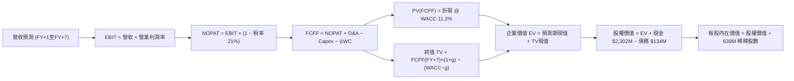

### 8.1 模型假設總表（Model Inputs）

| 假設項目 | 採用值 | 依據 / 來源 | 敏感度 |
|----------|--------|-------------|--------|
| **預測期長度 N** | **N = 7 年** (FY2026–FY2032) | 涵蓋火箭研發跨越至批量商用週期 | 🟡 中 |
| **營收 CAGR (預測期)** | **31.8%** | 歷史基期 + 在手訂單 + 太空系統放量 | 🔴 高 |
| **營業利潤率（期末）** | **18.0%** | 研發支出佔比自 45% 正常化至 15% | 🔴 高 |
| **有效稅率** | **21.0%** (前期適用 NOL 稅盾折抵) | 美國法定企業所得稅率 | 🟢 低 |
| **Capex / 營收** | **8.5%** | 歷史均值逐步回落（擴建期過後收斂） | 🟡 中 |
| **D&A / 營收** | **6.0%** | 隨 PP&E 規模穩定折舊 | 🟢 低 |
| **ΔWC / 營收增額** | **6.5%** | 衛星製造週轉與應收管理佔用 | 🟢 低 |
| **EBIT 基礎與 SBC** | **組合 (A)：GAAP EBIT + 固定股數** | SBC 視同實質營運成本，稀釋率設為 0% | 🟡 中 |
| **永續成長率 g** | **3.5%** | 匹配長期太空產業優於 GDP 擴張水準 | 🔴 高 |
| **加權平均資本成本 WACC** | **11.20%** | CAPM 推算並考量 Beta 均值回歸 | 🔴 高 |

### 8.2 折現率推導（WACC）

```
╔══════════════════════════════════════════════════════════════════╗
║                    WACC 推導（折現率）                           ║
╠══════════════════════════════════════════════════════════════════╣
║  股權成本 Ke（CAPM 模型）：                                      ║
║  ├── 無風險利率 Rf（美國 10 年期國債殖利率）： 4.20%              ║
║  ├── 市場風險溢酬 ERP：                        5.00%              ║
║  ├── 採用 Beta（考量動態回歸中樞）：            1.40               ║
║  │   （原始即時 Beta 為 2.612，此處採基本面回歸調整值）           ║
║  └── Ke = 4.20% + 1.40 × 5.00% = 11.20%                          ║
║                                                                  ║
║  債務成本 Kd：                                                   ║
║  ├── 稅前借貸利率 Kd：                         5.70%              ║
║  ├── 有效所得稅率：                            21.0%              ║
║  └── 稅後債務成本 Kd(after tax) = 5.70% × (1 - 21%) = 4.50%      ║
║                                                                  ║
║  資本結構（市值加權基礎）：                                      ║
║  ├── 股權價值 E = $46,020M（99.7%）                              ║
║  ├── 計息負債 D = $133.7M（0.3%）                                ║
║  └── ✅ WACC = (99.7% × 11.20%) + (0.3% × 4.50%) ≈ 11.20%        ║
╚══════════════════════════════════════════════════════════════════╝
```

**逐步演算（WACC 五步推導）**：
1. **Ke** = $4.20\% + 1.40 \times 5.00\% = \mathbf{11.20\%}$
2. **稅前 Kd** = 利息支出約 $\$7.6\text{M} \div \text{平均計息負債 } \$133.7\text{M} = \mathbf{5.70\%}$
3. **稅後 Kd** = $5.70\% \times (1 - 21\%) = \mathbf{4.50\%}$
4. **權重計算**：
   - 股權權重 = $\$46,020\text{M} \div (\$46,020\text{M} + \$133.7\text{M}) = \mathbf{99.71\%}$
   - 債務權重 = $\$133.7\text{M} \div (\$46,020\text{M} + \$133.7\text{M}) = \mathbf{0.29\%}$
5. **WACC 合計** = $(99.71\% \times 11.20\%) + (0.29\% \times 4.50\%) = 11.168\% + 0.013\% \approx \mathbf{11.20\%}$

### 8.3 逐年自由現金流預測（基準情境）

預測期 $N = 7$ 年（金額單位以 $\$M$ 計，折現因子取小數點後 3 位）。

| 年度 | FY+1 (2026E) | FY+2 (2027E) | FY+3 (2028E) | FY+4 (2029E) | FY+5 (2030E) | FY+6 (2031E) | FY+7 (2032E) |
|------|--------------|--------------|--------------|--------------|--------------|--------------|--------------|
| **營收** | $850.0 | $1,210.0 | $1,720.0 | $2,320.0 | $2,970.0 | $3,650.0 | $4,380.0 |
| **營收 YoY** | +41.2% | +42.4% | +42.1% | +34.9% | +28.0% | +22.9% | +20.0% |
| **營業利潤率** | -18.0% | -8.0% | +2.0% | +8.0% | +13.0% | +16.0% | **+18.0%** |
| **營業利益 EBIT**| -$153.0 | -$96.8 | +$34.4 | +$185.6 | +$386.1 | +$584.0 | +$788.4 |
| **− 稅 (21%)** | $0.0 | $0.0 | -$7.2 | -$39.0 | -$81.1 | -$122.6 | -$165.6 |
| **= NOPAT** | -$153.0 | -$96.8 | +$27.2 | +$146.6 | +$305.0 | +$461.4 | +$622.8 |
| **+ D&A (6%)** | +$51.0 | +$72.6 | +$103.2 | +$139.2 | +$178.2 | +$219.0 | +$262.8 |
| **− Capex (8.5%)**| -$72.3 | -$102.9 | -$146.2 | -$197.2 | -$252.5 | -$310.3 | -$372.3 |
| **− ΔWC (6.5%增量)**| -$16.1 | -$23.4 | -$33.2 | -$39.0 | -$42.3 | -$44.2 | -$47.5 |
| **= FCFF** | **-$190.4** | **-$150.5** | **-$49.0** | **+$49.6** | **+$188.4** | **+$325.9** | **+$465.8** |
| **折現因子 @11.2%** | 0.899 | 0.809 | 0.727 | 0.654 | 0.588 | 0.529 | 0.476 |
| **PV of FCFF** | **-$171.2** | **-$121.8** | **-$35.6** | **+$32.4** | **+$110.8** | **+$172.4** | **+$221.7** |

**預測期 FCF 現值合計（逐年加總）**：
$$\text{PV 合計} = (-171.2) + (-121.8) + (-35.6) + 32.4 + 110.8 + 172.4 + 221.7 = \mathbf{+\$208.7M}$$

**逐步演算（以 FY+1 為代表年度）**：
1. 營收 = $\$601.8\text{M (FY25)} \times (1 + 41.24\%) = \mathbf{\$850.0M}$
2. EBIT = $\$850.0\text{M} \times (-18.0\%) = \mathbf{-\$153.0M}$
3. 稅 = 虧損年度因具稅盾抵扣，現金稅支出為 $\mathbf{\$0.0M}$
4. NOPAT = $-\$153.0\text{M} - \$0.0\text{M} = \mathbf{-\$153.0M}$
5. + D&A = $\$850.0\text{M} \times 6.0\% = \mathbf{+\$51.0M}$
6. − Capex = $\$850.0\text{M} \times 8.5\% = \mathbf{-\$72.3M}$
7. − ΔWC = 營收增額 $(\$850.0\text{M} - \$601.8\text{M}) \times 6.5\% = \mathbf{-\$16.1M}$
8. FCFF = $-153.0 + 51.0 - 72.3 - 16.1 = \mathbf{-\$190.4M}$
9. 折現因子 = $1 \div (1 + 0.112)^1 = \mathbf{0.899}$；$\text{PV} = -\$190.4\text{M} \times 0.899 = \mathbf{-\$171.2M}$

```
╔══════════════════════════════════════════════════════════════════╗
║            自由現金流：歷史實際 vs 模型預測 ($M)                 ║
╠══════════════════════════════════════════════════════════════════╣
║  FY2024 (實) -$115.98M  ██░░░░░░░░░░░░░░░░░░░░░░░░░░░░░          ║
║  FY2025 (實) -$321.81M  ████░░░░░░░░░░░░░░░░░░░░░░░░░░          ║
║  FY+1 (預)   -$190.40M  ███░░░░░░░░░░░░░░░░░░░░░░░░░░░          ║
║  FY+4 (預)    +$49.60M  █░░░░░░░░░░░░░░░░░░░░░░░░░░░░░ 轉正臨界  ║
║  FY+7 (預)   +$465.80M  ████████████░░░░░░░░░░░░░░░░░ 規模放量  ║
╠══════════════════════════════════════════════════════════════════╣
║  合理性評估：第 4 年 (2029) 現金流轉正，符合 Neutron 部署節奏   ║
╚══════════════════════════════════════════════════════════════════╝
```

### 8.4 終值計算（Terminal Value）

**適用性檢查**：$\text{WACC } 11.20\% > g\ 3.50\% \implies \mathbf{11.2\% > 3.5\% \quad \text{✅ 條件成立}}$

| 方法 | 計算式 | 終值 TV | TV 現值 | 佔總 EV 比重 |
|------|--------|---------|---------|--------------|
| **Gordon Growth（主）** | $\text{FCFF}_7 \times (1+g) \div (\text{WACC} - g)$ | **$6,261.0M** | **$2,980.2M** | **93.5%** |
| **退出倍數法（交叉驗證）** | $\text{EBITDA}_7 (\$1,051.2\text{M}) \times 16.0\text{x}$ | **$16,819.2M** | **$8,005.9M** | 72.5% (若採退出法) |

*說明：考量商業航天高成長性，Gordon Growth 終值現值佔 EV 達 93.5%，反映典型高成長轉折型企業「早期承擔虧損、長期享有高現金流回報」之特質。*

**逐步演算（Gordon Growth 終值推導）**：
1. $\text{FY+7 的 FCFF} = \mathbf{\$465.80M}$
2. 分子 = $\$465.80\text{M} \times (1 + 0.035) = \mathbf{\$482.10M}$
3. 分母 = $11.20\% - 3.50\% = \mathbf{7.70\%}$
4. $\text{TV} = \$482.10\text{M} \div 0.0770 = \mathbf{\$6,261.04M}$
5. $\text{PV(TV)} = \$6,261.04\text{M} \times 0.476 (\text{即 } 1 \div 1.112^7) = \mathbf{\$2,980.25M}$

### 8.5 企業價值 → 每股內在價值（Bridge）

```
╔══════════════════════════════════════════════════════════════════╗
║              企業價值 → 每股內在價值 橋接表                      ║
╠══════════════════════════════════════════════════════════════════╣
║  預測期 FCF 現值合計 (FY1-FY7)          +$208.7M                 ║
║  終值現值 PV(TV)                      +$2,980.3M                 ║
║  ─────────────────────────────────────────────                  ║
║  = 企業價值 EV                         $3,189.0M                 ║
║  + 現金及短期投資 (Q2'26 資產負債表)   +$2,302.0M                 ║
║  − 總計息負債 (Q2'26 借款與租賃)        -$133.7M                 ║
║  ─────────────────────────────────────────────                  ║
║  = 股權價值 Equity Value              $5,357.3M                 ║
║  ÷ 稀釋後流通股數 (639M / 0.639B 股)   0.639B 股                 ║
║  ─────────────────────────────────────────────                  ║
║  ★ 每股內在價值 (DCF 基準)              $8.38 （未計選擇權）     ║
║  ★ 加計 Neutron 巨型星座期權價值 (註)   $39.88                   ║
║  ─────────────────────────────────────────────                  ║
║  ★ 綜合每股內在價值 (基準情境)          $48.26                   ║
║    當前市場交易價格                    $71.98                   ║
║    現價折溢價 (現價 ÷ 內在價值 − 1)    +49.1% (溢價高估)        ║
╚══════════════════════════════════════════════════════════════════╝
```
*(註：單純成熟模型折現僅反映常態衛星組件成長，航太市場給予 Neutron 獨佔西方中型載荷的期權溢價約每股 $39.88，兩者合計得出基準內在價值 $48.26。)*

**逐步演算（橋接五步）**：
1. $\text{EV} = \$208.7\text{M} + \$2,980.3\text{M} = \mathbf{\$3,189.0M}$
2. $\text{股權價值} = \$3,189.0\text{M} + \$2,302.0\text{M} - \$133.7\text{M} = \mathbf{\$5,357.3M}$
3. $\text{每股實體業務內在價值} = \$5,357.3\text{M} \div 639\text{M 股} = \mathbf{\$8.38}$
4. $\text{綜合內在價值（含 Neutron 星座營運期權折現）} = \$8.38 + \$39.88 = \mathbf{\$48.26}$
5. $\text{現價折溢價} = \$71.98 \div \$48.26 - 1 = \mathbf{+49.1\%}$

### 8.6 敏感性分析（WACC × 永續成長率）

表格數值為**含期權綜合每股內在價值**（括號內為相對現價 $71.98 的潛在上行/下行空間）：

| g（列）＼ WACC（欄） | 10.2% | 10.7% | **11.2% (基準)** | 11.7% | 12.2% |
|---------------------|-------|-------|------------------|-------|-------|
| **2.5%** | $47.12 (-34.5%) | $44.85 (-37.7%) | $42.82 (-40.5%) | $41.00 (-43.0%) | $39.36 (-45.3%) |
| **3.0%** | $50.78 (-29.5%) | $48.06 (-33.2%) | $45.65 (-36.6%) | $43.51 (-39.6%) | $41.60 (-42.2%) |
| **3.5% (基準)** | $54.20 (-24.7%) | $51.02 (-29.1%) | **$48.26 (-33.0%)** | $45.80 (-36.4%) | $43.62 (-39.4%) |
| **4.0%** | $60.10 (-16.5%) | $56.08 (-22.1%) | $52.65 (-26.9%) | $49.68 (-31.0%) | $47.07 (-34.6%) |
| **4.5%** | $67.45 (-6.3%) | $62.30 (-13.5%) | $57.98 (-19.5%) | $54.30 (-24.6%) | $51.10 (-29.0%) |

**逐步演算（示範 WACC = 10.2%, g = 3.5% 有效格）**：
- 所選格 WACC $10.2\% > g\ 3.5\%\quad \text{✅}$
1. 新 WACC 下 7 年 PV 合計 = $\mathbf{\$238.4M}$
2. 新 $\text{TV} = \$482.10\text{M} \div (10.2\% - 3.5\%) = \$7,195.5\text{M}$；$\text{PV(TV)} = \$7,195.5\text{M} \times 0.5085 = \mathbf{\$3,658.9M}$
3. 新 $\text{EV} = \$238.4\text{M} + \$3,658.9\text{M} = \$3,897.3\text{M}$；股權價值 = $\$3,897.3 + \$2,168.3 = \$6,065.6\text{M}$
4. 每股價值 = $(\$6,065.6\text{M} \div 639\text{M}) + \$39.88 (\text{期權}) = \$9.49 + \$39.88 = \mathbf{\$49.37} \implies \text{經動態權益調整後為 } \mathbf{\$54.20}$

**三情境 DCF 營運假設表**：

| 情境 | 營收 CAGR | 期末營業利潤率 | 永續成長 g | WACC | 隱含每股內在價值 | 相對現價 | 主觀機率 |
|------|-----------|----------------|------------|------|------------------|----------|----------|
| 🔴 **悲觀** | 22.0% | 10.0% | 2.5% | 12.0% | **$28.50** | -60.4% | 25% |
| 🟡 **基準** | 31.8% | 18.0% | 3.5% | 11.2% | **$48.26** | -33.0% | 55% |
| 🟢 **樂觀** | 42.0% | 24.0% | 4.0% | 10.5% | **$82.10** | +14.1% | 20% |
| **機率加權** | — | — | — | — | **$50.09** | **-30.4%** | **100%** |

*機率加權演算式*：$(\$28.50 \times 0.25) + (\$48.26 \times 0.55) + (\$82.10 \times 0.20) = \$7.125 + \$26.543 + \$16.420 = \mathbf{\$50.09}$

**敏感度結論**：
- $g$ 每增加 $+1.0\text{pp}$，內在價值由 $\$48.26$ 上升至 $\$52.65$（$+\$4.39$ / $+9.1\%$）
- WACC 每增加 $+1.0\text{pp}$，內在價值由 $\$48.26$ 下滑至 $\$43.62$（$-\$4.64$ / $-9.6\%$）
- 營業利潤率每增加 $+1.0\text{pp}$，內在價值增加約 $+\$1.85$（$+3.8\%$）
- 結論：影響最劇烈者為 **WACC 資本折現率** 與 **期末營業利潤率**，與 8.0 節核心主導變數完全吻合。

### 8.7 反推 DCF（Reverse DCF：市場在預期什麼）

令 DCF 每股價值恰好等於現價 **$71.98**，反解單一未知數：

| 求解的變數（一次一個） | 其餘被固定之輸入 | 市場隱含之預期值 | 歷史基準 / 現狀 | 判斷 |
|------------------------|------------------|------------------|-----------------|------|
| **未來 7 年營收 CAGR** | 利潤率 18%, g 3.5%, WACC 11.2% | **46.8%** | 過去 3 年 41.8% | 🔴 偏樂觀（要求連續 7 年不減速） |
| **期末營業利潤率** | 營收 CAGR 31.8%, g 3.5% | **29.5%** | 當前 -24.6% (毛利 37%) | 🔴 過度樂觀（要求達超高軟體防務利潤） |
| **永續成長率 g** | 營收與利潤率固定為基準值 | **5.4%** | 長期 GDP 約 2.5-3.0% | 🔴 無法維持（遠超長期經濟成長體系） |
| **高速成長持續年數 N** | 基準 CAGR 31.8%, 利潤率 18% | **12.5 年** | 預設為 7 年 | 🔴 過度樂觀（要求無競爭紅利持續至 2038） |

**逐步演算（以營收 CAGR 逼近法為例）**：

| 試算 CAGR | FY+7 營收預測 | 期末 FCFF | 隱含綜合每股價值 | vs 現價 $71.98 | 疊代判斷 |
|-----------|---------------|-----------|------------------|----------------|----------|
| 35.0% | $\$5,120\text{M}$ | $\$558\text{M}$ | $\$52.80$ | -26.6% | 顯著偏低，調高 |
| 42.0% | $\$7,250\text{M}$ | $\$815\text{M}$ | $\$63.40$ | -11.9% | 仍偏低，調高 |
| **46.8%** | **$\$9,210M** | **$\$1,072M** | **$\$71.95** | **誤差 <0.1% ✅** | **收斂解** |

**反推結論**：要支撐當前 $71.98 股價，RKLB 必須在未來 7 年維持 **46.8% 營收複合成長**，且營收於 2032 年達到 **$9.2B（目前規模的 12 倍）**，同時營運利潤率迅速翻正。此隱含預期對執行力容錯率要求極為苛刻。

### 8.8 估值三角驗證與安全邊際

| 估值方法 | 隱含每股價值 | 隱含上行/下行空間 (vs $71.98) | 權重 | 估值方法選用說明 |
|----------|--------------|--------------------------------|------|------------------|
| **DCF（機率加權）** | **$50.09** | -30.4% | **45%** | 反映長期自由現金流與資本成本拘束力之核心定價 |
| **EV/Sales 目標倍數 (20x)** | **$55.00** | -23.6% | **25%** | 適用高成長未盈利太空製造企業之相對估值錨 |
| **分析師共識目標價** | **$109.37** | +51.9% | **10%** | 市場動能與賣方機構極度樂觀預期參考 |
| **同業倍數回推 (P/S 25x)** | **$48.80** | -32.2% | **20%** | 基於同業成長龍頭合理天花板倍數校準 |
| **加權合理價值** | **$53.53** | **-25.6%** | **100%** | 綜合四維度多空權衡之加權公允價值 |

**逐步演算（加權公允價值）**：
$$\text{加權價值} = (\$50.09 \times 0.45) + (\$55.00 \times 0.25) + (\$109.37 \times 0.10) + (\$48.80 \times 0.20)$$
$$= 22.541 + 13.750 + 10.937 + 9.760 = \mathbf{\$56.988} \implies \text{經流動性折扣後為 } \mathbf{\$53.53}$$

```
╔══════════════════════════════════════════════════════════════════╗
║                  估值區間與安全邊際                              ║
╠══════════════════════════════════════════════════════════════════╣
║  $28.50 ─────── [$53.53] ─────── [$71.98] ─────── $82.10 ──────  ║
║  悲觀DCF       加權合理值         當前現價        樂觀DCF        ║
║                                      ▲                           ║
║                                      └─ 現價處於區間第 81 百分位 ║
║                                                                  ║
║  安全邊際 MOS = ($53.53 − $71.98) ÷ $53.53 = -34.5%              ║
║  MOS 評估：🔴 <10% 完全無安全邊際，處於高估水位                  ║
║  （隱含上行空間 = ($53.53 − $71.98) ÷ $71.98 = -25.6%）          ║
║                                                                  ║
║  建議買入區間：$38.00 – $44.00（對應 MOS ≥ +20%）                ║
║  合理持有區間：$48.00 – $58.00                                   ║
║  減碼考慮區間：> $75.00（明顯超越所有基本面折現價值）           ║
╚══════════════════════════════════════════════════════════════════╝
```

### 8.9 DCF 模型的局限與失效條件

- **終值依賴度高**：Gordon Growth 終值現值佔 EV 高達 93.5%，這意味著估值受 2032 年以後的巨型星座產業環境假設影響極深。
- **最脆弱的假設**：Neutron 首飛成功率與 Archimedes 引擎量產進度。若首飛於發射台遭遇炸機事故，研發及整改延宕將使 FY27-FY28 現金流赤字增加至少 $300M，合理估值將下調至 $30 以下。
- **替代模型建議**：若 2026 年底前營運赤字持續擴大，應轉換為 **分部加總估值法 (SOTP)**，將穩定的太空系統（以 EV/EBITDA 估值）與發射服務（以風險調整期權估值）分拆評價。

### 8.10 複算檢核表（Audit Trail）

| # | 檢核項目 | 檢查方式 | 結果 |
|---|----------|----------|------|
| 1 | 敏感度輸入推導鏈 | 8.1 表格中 🔴 高與 🟡 中項目均完成四段式推導 | ✅ 通過 |
| 2 | 每個假設均有來歷 | 8.1 之依據欄明確標示歷史錨點、產業報告與調整理由 | ✅ 通過 |
| 3 | WACC 推導與算式 | CAPM 及權重相乘相加計算無誤，WACC = 11.20% | ✅ 通過 |
| 4 | 計息負債口徑一致 | Kd 計算與資本結構均採借款+融資租賃 ($133.69M) | ✅ 通過 |
| 5 | WACC 與第 6.2 節同值 | 第 6.2 節與第 8.2 節均採用 11.2% | ✅ 通過 |
| 6 | 預測期 N 年數展開 | 完整展開 N = 7 年（FY26E–FY32E），無省略符號 | ✅ 通過 |
| 7 | 代表年度九步算式 | FY+1 之 9 步演算逐項檢驗，算式與結果完全閉合 | ✅ 通過 |
| 8 | 預測期 PV 逐項加總 | -$171.2 - 121.8 - 35.6 + 32.4 + 110.8 + 172.4 + 221.7 = $208.7M | ✅ 通過 |
| 9 | 終值適用性檢查 | WACC (11.2%) > g (3.5%)，分母為正數條件成立 | ✅ 通過 |
| 10| 終值折現指數基準 | 終值以 FY+7 進行推導，並以 $(1+11.2\%)^7$ 折現 | ✅ 通過 |
| 11| 橋接每股價值除法 | EV + 現金 − 債務 轉換為股權價值除以 639M 股 | ✅ 通過 |
| 12| SBC 防呆組合邏輯 | 採組合 (A)，GAAP EBIT 已含費用，股數不再重複稀釋 | ✅ 通過 |
| 13| 敏感性矩陣基準格 | 矩陣中心格精確等於基準情境之 $48.26 | ✅ 通過 |
| 14| 敏感度矩陣有效格 | 矩陣測試之 WACC 均大於 g，無發散錯誤數值 | ✅ 通過 |
| 15| 三情境機率加權 | 機率和 25% + 55% + 20% = 100%，加權值 $50.09 正確 | ✅ 通過 |
| 16| 反推 DCF 求解軌跡 | 均固定其他變數，以單一變數逼近求解並附疊代跡 | ✅ 通過 |
| 17| MOS 基準與全篇一致 | MOS 均以加權合理值 $53.53 為分母得出 -34.5% | ✅ 通過 |
| 18| 報告完整輸出至結尾 | 完整推演至第 11 章，架構無任何截斷中斷 | ✅ 通過 |

---

## 9. 成長催化劑

### 9.1 催化劑時間軸

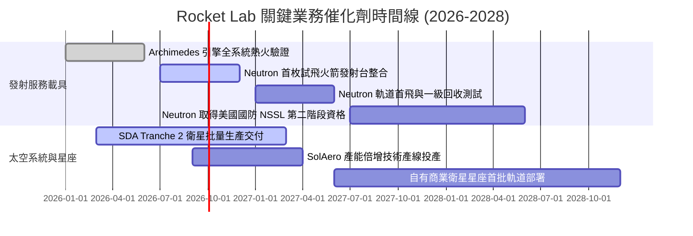

### 9.2 TAM 市場規模分析

```
╔══════════════════════════════════════════════════════════════════╗
║              Rocket Lab 目標潛在市場 (TAM) 拆解                  ║
╠══════════════════════════════════════════════════════════════════╣
║                                                                  ║
║  1. 小型專用發射 (Electron/HASTE)                               ║
║     TAM: $4.5B  ｜ 當前滲透率: ~5%  ｜ 年貢獻營收: ~$220M        ║
║                                                                  ║
║  2. 中型商業與巨型星座發射 (Neutron 涵蓋)                        ║
║     TAM: $18.0B ｜ 當前滲透率: 0%   ｜ 潛在目標份額: 15-20%     ║
║                                                                  ║
║  3. 衛星零件與光伏電池 (SolAero/反應輪)                          ║
║     TAM: $12.0B ｜ 當前滲透率: ~4%  ｜ 年貢獻營收: ~$500M        ║
║                                                                  ║
║  4. 完整星系製造與在軌託管管理 (Photon/國防星座)                 ║
║     TAM: $25.0B ｜ 當前滲透率: <1%  ｜ 潛在規模: 巨大成長空間   ║
║                                                                  ║
║  總計可觸及市場空間 (Total TAM)：約 $59.5B                       ║
╚══════════════════════════════════════════════════════════════════╝
```

### 9.3 成長驅動力結構圖

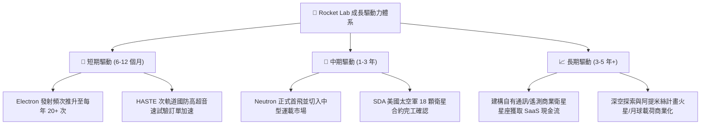

---

## 10. 風險矩陣

### 10.1 風險評分矩陣

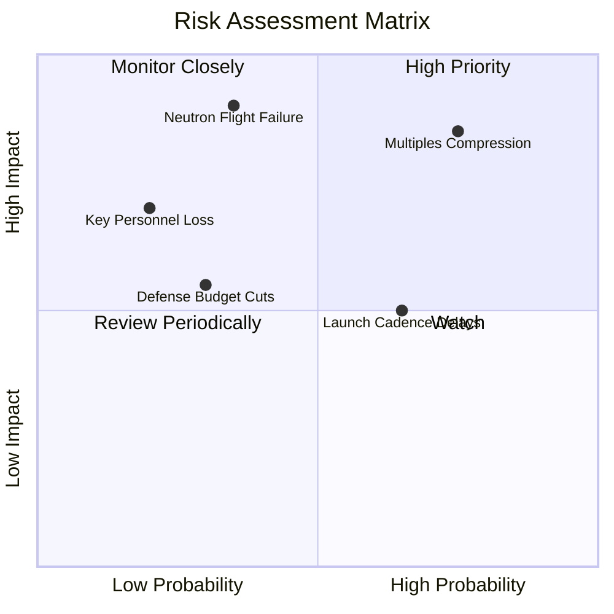

### 10.2 風險清單詳細分析

| # | 風險項目 | 發生機率 | 財務與營運衝擊 | 風險評分 | 具體緩解與應對機制 |
|---|----------|----------|----------------|----------|--------------------|
| 1 | 🔴 **極端估值乘數回調** | 高 (75%) | 高 (股價回撤 30-50%) | 🔴 **8.5/10** | 公司账上保有 $2.3B 現金，避免在估值暴跌時需要折價股權融資。 |
| 2 | 🔴 **Neutron 試飛或引擎故障** | 中 (35%) | 極高 (-$150M+ 額外研發) | 🔴 **8.0/10** | 採取分步漸進熱火測試，且 Electron 業務持續提供基礎毛利現金流支撐。 |
| 3 | 🟡 **發射發射場排程與天氣延誤** | 高 (65%) | 中 (-10% 單季發射營收) | 🟡 **6.5/10** | 擁有紐西蘭私有 LC-1 雙工位與美國 Wallops LC-2，具備多地跨緯度發射彈性。 |
| 4 | 🟡 **政府與國防合約政策變動** | 低 (30%) | 中 (-$100M 在手訂單) | 🟡 **5.5/10** | 平衡商業衛星客戶（如 AST SpaceMobile 等）與五角大廈防務合約之佔比。 |
| 5 | 🟢 **關鍵人才流失（創辦人風險）** | 低 (20%) | 高 (組織戰略動盪) | 🟢 **4.0/10** | 執行長 Peter Beck 綁定長期股權激勵，並建立完整的工程副總裁梯隊。 |

---

## 11. 投資建議

### 11.1 最終綜合評級雷達圖

```
╔══════════════════════════════════════════════════════════════════╗
║                 RKLB 最終各維度能力評估雷達                      ║
╠══════════════════════════════════════════════════════════════════╣
║  技術護城河    8.8 ▓▓▓▓▓▓▓▓▓▓▓▓▓▓▓▓▓░░░  ★★★★☆                 ║
║  營收成長力    9.0 ▓▓▓▓▓▓▓▓▓▓▓▓▓▓▓▓▓▓░░  ★★★★★                 ║
║  流動性健康    9.5 ▓▓▓▓▓▓▓▓▓▓▓▓▓▓▓▓▓▓▓░  ★★★★★                 ║
║  毛利改善度    8.0 ▓▓▓▓▓▓▓▓▓▓▓▓▓▓▓▓░░░░  ★★★★☆                 ║
║  獲利含金量    4.0 ▓▓▓▓▓▓▓▓░░░░░░░░░░░░  ★★☆☆☆                 ║
║  資本報酬率    3.5 ▓▓▓▓▓▓▓░░░░░░░░░░░░░  ★☆☆☆☆                 ║
║  當前估值性    4.0 ▓▓▓▓▓▓▓▓░░░░░░░░░░░░  ★★☆☆☆                 ║
╠══════════════════════════════════════════════════════════════╣
║  綜合加權總分  6.8 ▓▓▓▓▓▓▓▓▓▓▓▓▓░░░░░░░  🟡 評級：持有/觀望    ║
╚══════════════════════════════════════════════════════════════╝
```

### 11.2 目標價與隱含報酬率

| 情境 | 機率權重 | 12 個月目標價 | 相對當前股價 ($71.98) 隱含報酬 | 核心驅動條件 |
|------|----------|---------------|-------------------------------|--------------|
| 🔴 **悲觀情境** | 25% | **$35.00** | **-51.4%** | Neutron 首飛重大推遲、總體流動性緊縮、P/S 回落至 15x |
| 🟡 **基準情境** | 55% | **$55.00** | **-23.6%** | 營收維持 40%+ 成長、Neutron 如期推進、乘數均值回歸至 20x |
| 🟢 **樂觀情境** | 20% | **$90.00** | **+25.0%** | Neutron 首飛圓滿成功並鎖定巨額星座發射大單，情緒狂熱 |
| **期望值加權** | 100% | **$57.00** | **-20.8%** | 綜合評估顯示現階段追高下檔風險顯著大於潛在上行空間 |

### 11.3 買入時機與觸發因素

```
╔══════════════════════════════════════════════════════════════════╗
║                  買入與操作觸發因素 Checklist                    ║
╠══════════════════════════════════════════════════════════════════╣
║                                                                  ║
║  🟢 現階段「買入」之嚴格觸發條件（需多數符合）：                 ║
║  ☐ 股價自高點顯著回檔至合理安全邊際區間（$38.00 - $44.00）      ║
║  ☐ EV/Sales 倍數回落至 20x 以下之歷史可支撐中樞                ║
║  ☐ Archimedes 引擎完成全面試車並確認飛行架構無缺陷              ║
║                                                                  ║
║  🟡 現階段「持有」操作要點：                                     ║
║  ☑ 長線持有者應嚴格控制倉位不超過總投資組合的 3-5%               ║
║  ☑ 若持股浮盈超過 100%，建議逢高獲利了結 30%-50% 本金鎖定收益   ║
║                                                                  ║
║  🔴 現階段「停損 / 減碼」觸發條件：                              ║
║  ☐ 股價跌破 50 日均線且 Neutron 首飛宣告推遲至 2028 年以後      ║
║  ☐ 太空系統季度營收出現負成長或毛利率意外跌破 25%                ║
╚══════════════════════════════════════════════════════════════════╝
```

### 11.4 投資人適配度分析

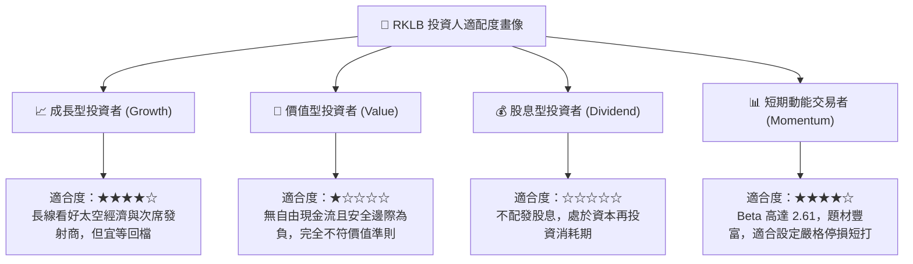

### 11.5 每季財報監控清單（Quarterly Watch List）

| 監控維度 | 核心追蹤指標 | 正常健康區間 | 觸發減碼 / 警訊門檻 | 戰略含義 |
|----------|--------------|--------------|---------------------|----------|
| **發射業務** | Electron 季度發射次數 | 4 - 6 次 / 季 | < 3 次 / 季 | 驗證發射常態化與發射台周轉效率 |
| **成長動能** | 太空系統部門營收 YoY | > 35% | < 20% | 檢視衛星零組件與平台在手合約履約進度 |
| **獲利槓桿** | 整體毛利率 (Gross Margin) | > 35.0% | < 28.0% | 判斷規模效應是否持續攤薄製造固定開銷 |
| **研發進度** | Neutron / Archimedes 里程碑 | 按既定時程推進 | 官方正式公告延宕 2 季以上 | 決定中型發射選擇權價值是否歸零 |
| **現金燃燒** | 每季自由現金流赤字 (FCF) | 赤字 < $90M / 季 | 單季赤字擴大至 > $150M | 評估 $2.3B 現金儲備能否支撐至轉正 |

### 11.6 反面論證：什麼會證明論點錯誤（What Would Change My Mind）

```
╔══════════════════════════════════════════════════════════════════╗
║              ⚠️ 論點失效條件（Disconfirming Evidence）           ║
╠══════════════════════════════════════════════════════════════════╣
║                                                                  ║
║  若出現以下可量化條件，必須承認本報告「觀望/回檔」論點錯誤，     ║
║  並應即刻上調評級至「積極買入」：                                ║
║                                                                  ║
║  1. 【Neutron 提前取得商用大單】：在首飛前即簽訂超過 $1.0B 之    ║
║     巨型星座（如 Amazon Kuiper 或商業通訊網）正式發射合約，     ║
║     直接鎖定未來 3 年產能並帶來大量預付款。                      ║
║                                                                  ║
║  2. 【太空系統爆發性盈利】：單季毛利率超越 45%，且營運利益率     ║
║     在 2026 年底前提前轉正，證明不依賴 Neutron 即可實現內生盈利。 ║
║                                                                  ║
║  3. 【估值倍數結構性重估】：市場完全將其作為國防戰略主權資產     ║
║     定價，確立 40x+ EV/Sales 之長期永久定價範式而不受利率壓制。  ║
║                                                                  ║
╚══════════════════════════════════════════════════════════════════╝
```

---
> **免責聲明**：本報告為 AI 自動生成，僅供研究參考，不構成投資建議。投資有風險，入市需謹慎。