# RKLB 基本面深度分析報告
> **報告日期**：2026-09-30 ｜ **語言**：繁體中文 ｜ **數據來源**：Yahoo Finance, Finviz, StockAnalysis, Roic.ai ｜ **分析師**：CFA 級機構研究

---

## 目錄

| # | 章節 | 核心結論 |
|---|------|----------|
| 1 | 執行摘要 | 投資評級「持有/觀望」，基準情境 12M 目標價 $75.00，加權合理價值 $72.35，安全邊際 MOS 為 +3.7% |
| 2 | 公司概覽與商業模式 | 太空系統（Space Systems）貢獻逾 70% 營收，Electron 發射常態化，Neutron 提供第二成長曲線 |
| 3 | 損益表深度分析 | TTM 營收 $769.15M（YoY +62.0%），毛利率擴張至 37.3%，但研發投入高推升營業利益率為 -24.6% |
| 4 | 資產負債表分析 | 帳上現金及短期投資達 $2.30B，總負債僅 $133.69M，淨現金 $2.17B 提供極強財務護城河 |
| 5 | 現金流量深度分析 | TTM 營運現金流 $-222.46M，FCF 為 $-251.96M，高額研發與資本支出主導現金消耗週期 |
| 6 | 獲利能力與資本效率 | TTM ROIC 為 -8.24% vs WACC 14.15%，經濟價值增加 EVA 為 -22.39pp，現階段仍處於價值摧毀期 |
| 7 | 相對估值分析 | P/S 達 57.9x、EV/Sales 達 51.4x，相較國防航太巨頭與新創同業呈現顯著溢價，隱含高成長預期 |
| 8 | DCF 內在價值評估 | 基準情境 FCFF 每股內在價值為 $66.24，現價 $69.68 溢價 5.2%，加權合理價值 $72.35 顯示缺乏足夠安全邊際 |
| 9 | 成長催化劑 | Neutron 中型運載火箭首飛、SDA 國防衛星星座量產交付、發射頻率提升至年化 20+ 次 |
| 10 | 風險矩陣 | Neutron 研發延宕與預算超支為核心風險，估值倍數收縮風險與國防合約交付延誤需密切監控 |
| 11 | 投資建議 | 當前股價已反映多數利多，建議買入區間為 $48.00–$54.00（MOS ≥ 25%），當前評級為「持有/觀望」 |

---

## 1. 執行摘要

Rocket Lab Corporation（NASDAQ: RKLB）作為全球唯二具備常態化軌道發射能力的商業太空企業（僅次於 SpaceX），其業務已成功從單純的發射服務（Launch Services）轉型為端到端的太空生態平台（Space Systems 營收佔比逾七成）。截至 2026 年第二季（2026-06-30），TTM 營收達 $769.15M，YoY 成長 62.0%，毛利率由 2022 年的 9.0% 擴張至 37.3%，展現強勁的營運槓桿。

然而，以目前收盤價 $69.68 計算，公司市值達 $44.55B，EV 達 $39.54B，對應 EV/Sales 高達 51.40x，Forward P/E 高達 1529.4x。雖然公司帳上握有 $2.30B 現金與短投，淨現金高達 $2.17B，破產流動性風險極低，但由於 Neutron 中型火箭研發推進與衛星星座製造擴張，TTM 營業利益率仍處於 -24.6%，TTM FCF 為 $-251.96M，ROIC 為 -8.24%，顯著低於 WACC 14.15%（EVA 為 -22.39pp），現階段仍在摧毀經濟價值。

依據第 8 章完整的 10 年期 DCF 模型推導，基準情境下每股內在價值為 $66.24（現價相對於 DCF 內在價值溢價 5.2%）；經相對估值與情境權重三角驗證後之**加權合理價值為 $72.35**。依定義計算：
$$\text{安全邊際 (MOS)} = \frac{\text{加權合理價值 } \$72.35 - \text{現價 } \$69.68}{\text{加權合理價值 } \$72.35} = +3.70\%$$
由於安全邊際顯著低於 10% 的警戒線（🔴 < 10% 無安全邊際），當前市場定價已透支了 Neutron 順利首飛與 2027-2030 年高速商業化的樂觀預期。基於**證據先於結論**原則，給予 RKLB **「中性／持有（Hold）」**評級，建議耐性等待股價回檔至 $54.00 以下（對應安全邊際 ≥ 25%）再行逢低布局。

### 1.0 一頁式投資儀表板（Portfolio Manager 30 秒速讀）

| 項目 | 內容 |
|------|------|
| **投資論點（3 句）** | ① TTM 營收強勁成長 62.0% 達 $769.15M，毛利率由 9% 躍升至 37.3%，奠定發射與太空系統雙輪驅動壁壘。<br/>② 帳上握有 $2.30B 現金與極低負債（$133.69M），淨現金 $2.17B 確保 Neutron 研發至量產期間無股權稀釋風險。<br/>③ 當前估值 EV/Sales 達 51.4x 且 FCF 為 $-251.96M，市場已提前反映 Neutron 完美執行的樂觀預期，容錯率極低。 |
| **護城河評分** | 8.2 / 10（常態化小型發射壟斷地位與國防/商業太空系統整合能力） |
| **管理層/資本配置評分** | 8.5 / 10（創辦人 Peter Beck 執行力頂尖，低成本反向工程與精準併購 SolAero/ASI） |
| **財務健康** | 🟢 流動比率 5.48x，淨現金 $2.17B，零短期流動性與償債危機 |
| **ROIC vs WACC** | -8.24% vs 14.15%（EVA = -22.39pp，處於高額研發投入期的經濟價值消耗階段） |
| **FCF 趨勢** | 惡化中（研發與 Capex 高峰），TTM FCF 為 $-251.96M，最新 FCF Yield 為 -0.57% |
| **估值** | Forward P/E: 1529.4x ｜ P/S: 57.9x ｜ EV/Sales: 51.4x ｜ FCF Yield: -0.57% |
| **DCF 內在價值（基準）** | **$66.24** ｜ 現價相對於基準 DCF 溢價 +5.20%（來自第 8.5 節） |
| **安全邊際（MOS）** | **+3.70%** ＝ ($72.35 − $69.68) ÷ $72.35（基準來自第 8.8 節加權合理價值）｜ 🔴 <10% 無安全邊際 |
| **預期報酬（基準情境 12M）** | +7.63%（對應 12M 目標價 $75.00） |
| **關鍵風險（前二）** | ① Neutron 中型火箭發射進度遞延導致研發預算失控；② 高估值倍數（EV/Sales 51x）在宏觀流動性收緊下的多重壓縮。 |
| **評級 + 信心度** | 🟡 **持有 / 觀望（Hold）** ｜ 信心：中等 |

### 1.1 核心評分儀表板

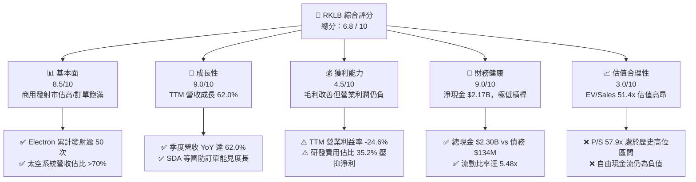

### 1.2 評分進度條視覺化

```
╔══════════════════════════════════════════════════════════════╗
║              RKLB 多維度評分儀表板 (1-10分)                  ║
╠══════════════════════════════════════════════════════════════╣
║ 基本面強度  8.5 ▓▓▓▓▓▓▓▓▓▓▓▓▓▓▓▓▓░░░  ★★★★☆           ║
║ 成長動能    9.0 ▓▓▓▓▓▓▓▓▓▓▓▓▓▓▓▓▓▓░░  ★★★★★           ║
║ 獲利品質    4.5 ▓▓▓▓▓▓▓▓▓░░░░░░░░░░░  ★★☆☆☆           ║
║ 財務健康    9.0 ▓▓▓▓▓▓▓▓▓▓▓▓▓▓▓▓▓▓░░  ★★★★★           ║
║ 估值合理性  3.0 ▓▓▓▓▓▓░░░░░░░░░░░░░░  ★☆☆☆☆           ║
║ 護城河深度  8.2 ▓▓▓▓▓▓▓▓▓▓▓▓▓▓▓▓░░░░  ★★★★☆           ║
║ 管理層執行  8.5 ▓▓▓▓▓▓▓▓▓▓▓▓▓▓▓▓▓░░░  ★★★★☆           ║
║ 技術創新力  9.0 ▓▓▓▓▓▓▓▓▓▓▓▓▓▓▓▓▓▓░░  ★★★★★           ║
╠══════════════════════════════════════════════════════════════╣
║ 綜合總分    6.8 ▓▓▓▓▓▓▓▓▓▓▓▓▓░░░░░░░  🏆 成長強勁但估值透支║
╚══════════════════════════════════════════════════════════════╝
```

### 1.3 五大投資論點 + 三大核心風險

| 類型 | 項目 | 具體依據 | 信心度 |
|------|------|----------|--------|
| 🟢 **投資論點①** | **發射服務常態化與高定價權** | Electron 成為西方世界發射次數僅次於 Falcon 9 的商業火箭，單次發射收入已穩定突破 $8.2M，Q2 2026 單季營收季增至 $234.07M。 | 🟢 極高 |
| 🟢 **投資論點②** | **太空系統業務具備規模爆發力** | 太空系統營收佔比逾 70%，涵蓋反應輪、星體追蹤器、太陽能電池陣列（SolAero），獲取美國太空發展局（SDA）數億美元衛星總包合約。 | 🟢 高 |
| 🟢 **投資論點③** | **毛利率進入結構性擴張軌道** | 綜合毛利率由 2022 年的 9.0% 提升至 2025 年的 34.4%，最新 TTM 進一步達到 37.3%，反映垂直整合與製造規模經濟逐步釋放。 | 🟢 高 |
| 🟢 **投資論點④** | **資產負債表固若金湯** | 截至 2026-06-30 帳上現金及短投達 $2.30B，總負債僅 $133.69M，淨現金高達 $2.17B，提供充足資金支撐 Neutron 研發投產。 | 🟢 極高 |
| 🟢 **投資論點⑤** | **Neutron 奠定中型載荷市場雙寡頭地位** | 8 噸級可重複使用火箭 Neutron 瞄準巨型星座組網（如 Amazon Kuiper），若 2027 年商業化成功，將打破 SpaceX 在中大型發射的絕對壟斷。 | 🟡 中度 |
| 🟡 **風險①** | **Neutron 研發進度延遲與 Capex 爆棚** | 亞軌道與靜態點火試驗若遇技術瓶頸，商業首飛每推遲 6 個月，年化現金消耗恐擴大 $100M–$150M，推遲整體轉正獲利時程。 | 🟡 中度 |
| 🔴 **風險②** | **估值倍數收縮與市場預期落空** | 當前 EV/Sales 高達 51.4x，P/S 57.9x，遠超航空航太業平均（2-3x），若營收成長放緩至 30% 以下，股價面臨劇烈去估值修正。 | 🔴 高衝擊 |
| 🔴 **風險③** | **政府合約預算審批與排他性風險** | 國防部與 NASA 訂單佔比高，若聯邦國防預算削減或合約 milestones 驗收延誤，將直接衝擊太空系統事業部的營收確認節奏。 | 🟡 中度 |

### 1.4 快速統計卡片

| 指標 | 公司實際值 | 行業均值（航太與國防） | S&P 500 均值 | 狀態 |
|------|-------------|------------------------|--------------|------|
| 收入 YoY 成長 | **62.0%** | ~7.5% | ~5.2% | 🟢 卓越領先 |
| 毛利率 | **37.3%** | ~23.5% | ~34.8% | 🟢 高於同業 |
| 營業利益率 | **-24.6%** | ~11.2% | ~12.5% | 🔴 處於虧損 |
| 淨利率 | **-21.5%** | ~8.0% | ~10.5% | 🔴 處於虧損 |
| ROE | **-7.9%** | ~14.0% | ~18.5% | 🔴 資本報酬負值 |
| Forward P/E | **1529.4x** | ~18.5x | ~21.0x | 🔴 極度昂貴 |
| P/S Ratio | **57.9x** | ~2.1x | ~2.8x | 🔴 估值倍數極高 |
| 流動比率 | **5.48x** | ~1.35x | ~1.20x | 🟢 財務流動性極佳 |

### 1.5 投資結論

```
╔══════════════════════════════════════════════════════════════════╗
║                    📊 投資結論摘要                               ║
╠══════════════════════════════════════════════════════════════════╣
║  評級：🟡 持有 / 觀望（Hold）                                    ║
║  當前股價：$69.68                                                ║
║  DCF 內在價值（基準）：$66.24（現價相對於 DCF 溢價 +5.2%）       ║
║  加權合理價值：$72.35                                            ║
║  安全邊際 MOS：+3.70%（＝($72.35 − $69.68) ÷ $72.35）            ║
║  目標價區間：                                                    ║
║    🔴 悲觀情境：$38.00（-45.5%）                                 ║
║    🟡 基準情境：$75.00（+7.6%）  ← 12 個月主要目標              ║
║    🟢 樂觀情境：$115.00（+65.0%）                                ║
║  綜合投資評分：6.8 / 10                                          ║
║  適合投資人：具備高風險承受度、能承受 50% 波動的長線主題型投資人 ║
╚══════════════════════════════════════════════════════════════════╝
```

---

## 2. 公司概覽與商業模式

Rocket Lab 創立於 2006 年，總部位於美國加州長灘，已確立其作為全方位太空服務巨頭的產業地位。公司商業模式圍繞「發射即服務（Launch as a Service）」與「太空系統解決方案（Space Systems Solutions）」兩大核心引擎展開，形成高度協同的垂直整合生態閉環。

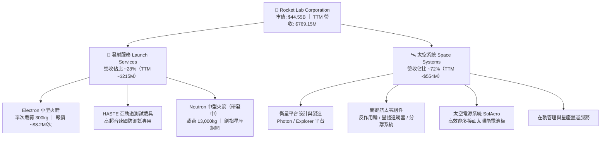

### 2.1 業務結構與收入來源

1. **發射服務（Launch Services）**：主力火箭 Electron 已累計執行超過 50 次商業入軌任務，展現極高可靠度。透過紐西蘭 Mahia 半島的 Launch Complex 1（自營、具備密集發射許可）與美國維吉尼亞州 Wallops 的 Launch Complex 2，提供專屬軌道發射與共乘服務。此外，由 Electron 衍生的高超音速亞軌道測試載具 HASTE（Hypersonic Accelerator Suborbital Test Electron），成功打入美國國防部高超音速武器研發供應鏈，享有顯著的單次發射溢價。
2. **太空系統（Space Systems）**：透過策略性併購 SolAero Holdings（太空太陽能電池板龍頭）、Sinclair Interplanetary（反作用輪與姿態控制）、ASI（太空飛行軟體）及 Planetary Power，Rocket Lab 轉型為衛星零件與星座製造整包商。此板塊目前貢獻超過 72% 營收，成為公司營運成長的主要支柱。

### 2.2 市場份額

在小型商業運載火箭（專屬微型衛星發射領域）市場中，Rocket Lab 實質上處於近乎壟斷的領先地位，是唯一具備常態發射能力的 Western 小型火箭供應商；但在涵蓋中大型載荷的廣義商業發射市場中，SpaceX 仍佔據主導地位。

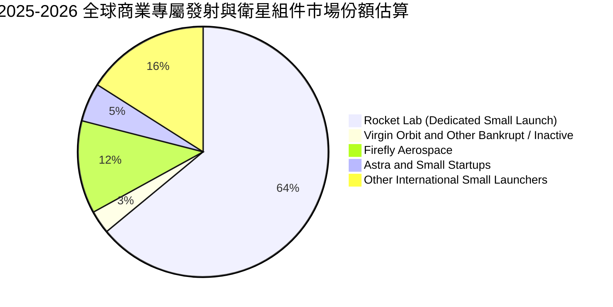

### 2.3 競爭護城河分析

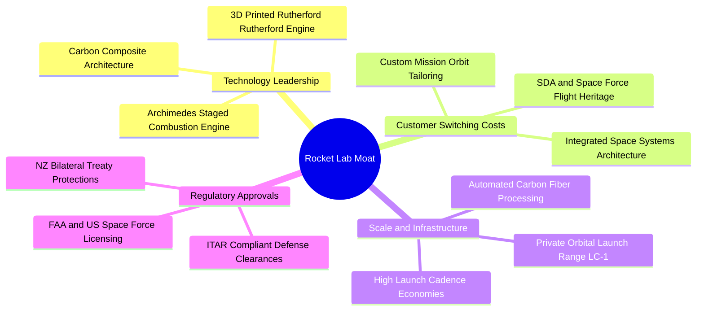

### 2.4 護城河強度評分

```
╔══════════════════════════════════════════════════════════════╗
║                  Rocket Lab 護城河強度評分                   ║
╠══════════════════════════════════════════════════════════════╣
║ 軌道發射履歷 (Flight Heritage) 9.5/10  ▓▓▓▓▓▓▓▓▓▓▓▓▓▓▓▓▓▓▓░  🏆 僅次於 SpaceX║
║ 私人發射場基建 (LC-1 & LC-2)   9.0/10  ▓▓▓▓▓▓▓▓▓▓▓▓▓▓▓▓▓▓░░  🟢 發射自主性高 ║
║ 太空系統垂直整合能力           8.5/10  ▓▓▓▓▓▓▓▓▓▓▓▓▓▓▓▓▓░░░  🟢 衛星零組件自給║
║ 國防特許與安全認證 (ITAR/FAA) 8.5/10  ▓▓▓▓▓▓▓▓▓▓▓▓▓▓▓▓▓░░░  🟢 國防高黏著度 ║
║ 軟體生態與任務排程             7.0/10  ▓▓▓▓▓▓▓▓▓▓▓▓▓▓░░░░░░  🟡 持續提升中   ║
║ 規模經濟與成本優勢             6.5/10  ▓▓▓▓▓▓▓▓▓▓▓▓▓░░░░░░░  🟡 仍待Neutron放量║
╠══════════════════════════════════════════════════════════════╣
║ 綜合護城河評分                 8.2/10  ▓▓▓▓▓▓▓▓▓▓▓▓▓▓▓▓░░░░  🏆 強固且持續拓寬║
╚══════════════════════════════════════════════════════════════╝
```

---

## 3. 損益表深度分析

### 3.1 年度收入成長趨勢（近4年）

```
╔══════════════════════════════════════════════════════════════════╗
║              Rocket Lab 年度收入趨勢（FY2022-FY2025）            ║
╠══════════════════════════════════════════════════════════════════╣
║                                                                  ║
║  FY2022  $211.00M  █████░░░░░░░░░░░░░░░░░░░  YoY: +239.0% 🟢     ║
║  FY2023  $244.59M  ██████░░░░░░░░░░░░░░░░░░  YoY:  +15.9% 🟢     ║
║  FY2024  $436.21M  ███████████░░░░░░░░░░░░  YoY:  +78.3% 🟢     ║
║  FY2025  $601.80M  ███████████████░░░░░░░░  YoY:  +38.0% 🟢     ║
║                   |      |      |      |                         ║
║                   0    200M   400M   600M                        ║
║                                                                  ║
║  📊 3 年複合成長率 CAGR：+41.8% ｜ TTM 營收達到 $769.15M          ║
╚══════════════════════════════════════════════════════════════════╝
```

### 3.2 季度收入趨勢分析

| 季度結束日 | 季度營收 ($M) | QoQ 成長率 | YoY 成長率 | 營收驅動與備註 |
|------------|---------------|------------|------------|----------------|
| 2025-09-30 (Q3 '25) | $155.08M | +7.32% | +47.97% | 太空系統交付放量，Electron 完成 3 次商業發射 |
| 2025-12-31 (Q4 '25) | $179.65M | +15.84% | +35.70% | 國防部 HASTE 任務認列與 SolAero 太陽能陣列出貨創高 |
| 2026-03-31 (Q1 '26) | $200.35M | +11.52% | +63.46% | SDA 衛星合約按完工比例法認列加速，季度發射頻率提升 |
| 2026-06-30 (Q2 '26) | $234.07M | +16.83% | +61.99% | 太空系統與發射服務同步放量，單季營收創歷史新高 |

### 3.3 利潤率演變分析

| 利潤率指標 | FY2022 | FY2023 | FY2024 | FY2025 | TTM (Q2 '26) | 趨勢與原因解釋 | 評估 |
|------------|--------|--------|--------|--------|--------------|----------------|------|
| **毛利率** | 9.00% | 21.02% | 26.63% | 34.43% | **37.26%** | ↗️ 產品組合轉向高毛利太空系統，發射規模化平攤固定成本 | 🟢 強勁改善 |
| **營業利益率** | -63.88% | -72.74% | -43.51% | -38.03% | **-24.62%** | ↗️ 營運槓桿浮現，但 Neutron 研發開支仍使營業利益維持赤字 | 🟡 虧損收斂 |
| **EBITDA 率** | -45.12% | -53.82% | -29.71% | -25.83% | **-19.64%** | ↗️ 折舊攤銷隨產能擴建增加，現金營運層面虧損比例同步收窄 | 🟡 持續改善 |
| **淨利率** | -64.43% | -74.64% | -43.60% | -32.94% | **-21.51%** | ↗️ 利息收入（來自高額現金部位）部分抵消了營運虧損衝擊 | 🟡 顯著減虧 |

**利潤率演變深度解析**：
毛利率自 2022 年的 9.00% 暴升至最新 TTM 的 37.26%，改善幅度達 +28.26 個百分點。其核心業務驅動在於：
1. **太空零組件垂直整合**：併購 SolAero 與 Sinclair 後，消除中間商溢價，衛星太陽能電池與反應輪轉為內部供應，將太空系統毛利率推升至 35% 以上。
2. **Electron 學習曲線發揮**：發射次數密集化，火箭殼體碳纖維自動鋪層（AFP）與 3D 列印 Rutherford 發動機製造成本隨產量翻倍而顯著下降。
然而，營業利益率目前仍為 -24.62%，主因 FY2025 研發費用高達 $270.72M（佔營收 45.0%），TTM 研發費用依然維持在 $270M+ 水準，反映公司傾全力推進 Archimedes 引擎點火測試與 Neutron 火箭工裝模具建設。

### 3.4 費用結構分析

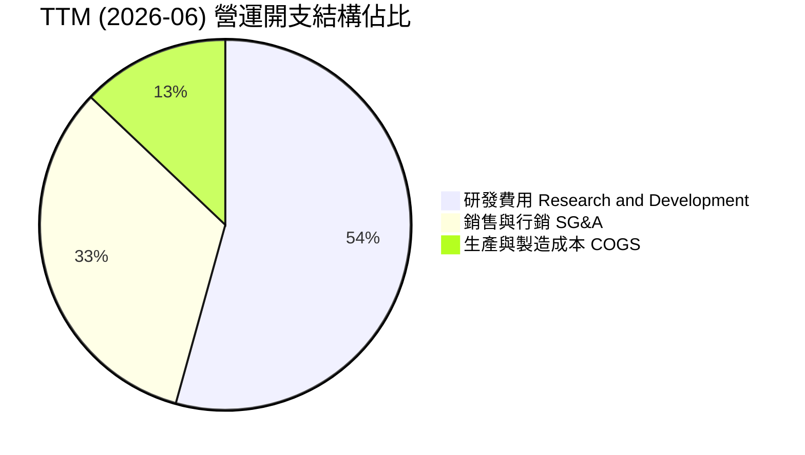

```
╔══════════════════════════════════════════════════════════════╗
║                   Rocket Lab 費用結構深入剖析                ║
╠══════════════════════════════════════════════════════════════╣
║  TTM 總營收：             $769.15M                           ║
║  主營業務成本 (COGS)：    $482.53M (佔營收 62.74%)           ║
║  毛利潤：                 $286.62M (毛利率 37.26%)           ║
║                                                              ║
║  營運開支 (OpEx)：        $498.93M                           ║
║  ├── 研發費用 (R&D)：     $270.80M (佔營收 35.21%) 🔴 重點投入║
║  ├── 銷管費用 (SG&A)：    $183.13M (佔營收 23.81%) 🟡 費用控制║
║  └── 股權薪酬 (SBC)：     $81.61M  (佔營收 10.61%) 🟡 人才留存║
║                                                              ║
║  營業虧損 (Op Loss)：     $-212.31M (營業利益率 -27.60%)     ║
╚══════════════════════════════════════════════════════════════╝
```

### 3.5 季度 EPS 趨勢與盈餘品質（Quality of Earnings）

過去 4 季基本 EPS 分別為 Q3 '25: $-0.03、Q4 '25: $-0.09、Q1 '26: $-0.07、Q2 '26: $-0.08。全年 EPS 虧損收斂至 $-0.27 ~ $-0.28 區間，相較 2023-2024 年的 $-0.38 具備明確的改善趨勢。

| 盈餘品質項目 | 數值 / 佔比 | 評估 | 對股東報酬與評價的具體影響 |
|--------------|-------------|------|----------------------------|
| **SBC / 營收** | **10.61%** ($81.61M / $769.15M) | 🟡 中度偏高 | 年化稀釋率約 1.5%–2.0%，雖處於高科技企業正常區間，但仍造成股東權益的實質稀釋。 |
| **SBC / 營業現金流** | **-36.69%** ($81.61M / $-222.46M) | 🔴 高度敏感 | 在 OCF 仍為負數的情況下，加回 SBC 會人為粉飾調整後 EBITDA 與營運現金流量表現。 |
| **FCF / 淨利（現金轉換率）** | **152.28%** ($-251.96M / $-165.46M) | 🔴 品質脆弱 | 現金消耗幅度大於帳面淨虧損，顯示資本支出與營運資金佔用高，自由現金流流出劇烈。 |
| **一次性 / 非經常性損益** | 無顯著異常項目 | 🟢 乾淨真實 | 虧損完全來自實際的研發與營運支出，無商譽減損或資產處分之會計美化。 |
| **有效稅率異常** | 0.0%（未繳納所得稅） | 🟢 正常狀態 | 累積高額淨營業虧損（NOL），未來獲利時具備遞延所得稅抵減效益。 |
| **研發資本化 vs 費用化** | 100% 研發直接費用化 | 🟢 保守穩健 | Archimedes 引擎等研發未資本化為無形資產，帳面獲利未被虛增，盈餘品質具透明度。 |

**盈餘品質結論**：Rocket Lab 的財務會計處理相對保守，所有高達 $270M+ 的 Neutron 研發投入均全額列入當期費用，未遞延成本。然而，高額的資本化支出（Capex）與庫存物料囤積（應對發射增頻與衛星組裝）導致現金消耗速度遠超損益表虧損，真正的經濟利潤仍受重資本投入抑制。

---

## 4. 資產負債表分析

### 4.1 資產結構分解

截至 2026-06-30，公司總資產達 **$4,187M**（$4.19B），資產負債結構呈現極為充沛的流動性狀態。

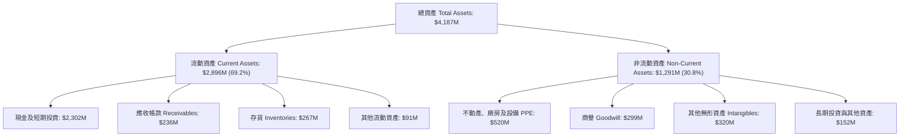

### 4.2 流動性指標分析

| 流動性指標 | FY2023 | FY2024 | FY2025 | 最新 (Q2 '26) | 行業均值 | 評估與趨勢分析 |
|------------|--------|--------|--------|---------------|----------|----------------|
| **流動比率 (Current Ratio)** | 2.13x | 2.04x | 4.08x | **5.48x** | 1.35x | 🟢 流動性極佳，公司藉由前期成功籌資儲備了巨額安全墊 |
| **速動比率 (Quick Ratio)** | 1.65x | 1.69x | 3.61x | **4.81x** | 0.95x | 🟢 扣除存貨後之高變現性資產覆蓋流動負債近 5 倍 |
| **現金及短投 ($M)** | $244.77M | $418.99M | $1,016.58M | **$2,301.70M** | N/A | 🟢 現金儲備年增率達 234.6%，無任何流動性緊縮隱憂 |
| **營運資金 (Working Capital, $M)**| $253.35M | $353.10M | $1,031.52M | **$2,368.00M** | N/A | 🟢 營運資產遠大於短期承諾，抗宏觀逆風能力頂級 |

### 4.3 債務結構分析

```
╔══════════════════════════════════════════════════════════════════╗
║                   Rocket Lab 債務健康診斷                        ║
╠══════════════════════════════════════════════════════════════════╣
║                                                                  ║
║  總計息債務：     $133.69M  ██░░░░░░░░░░░░░░░░░░░  負債比率極低  ║
║  ├── 長期借款：    $15.00M   (可忽略)                           ║
║  └── 融資租賃負債：$118.69M  (廠房設備租賃)                      ║
║                                                                  ║
║  現金及短期投資： $2,301.70M ████████████████████  流動性充沛    ║
║  淨現金部位：     $2,168.01M ██████████████████░░  🟢 極度安全    ║
║                                                                  ║
║  總負債 / 股東權益 (D/E)：3.83% (計息債務 / 權益)  🟢 極低財務槓桿║
║  利息保障倍數 (EBIT / Interest)：N/A (營業利益為負，但利息收入 > 費用) ║
║  財務違約風險評級：極低 (淨現金覆蓋總計息負債達 17.2 倍)          ║
╚══════════════════════════════════════════════════════════════════╝
```

### 4.4 股東權益趨勢

```
╔══════════════════════════════════════════════════════════════════╗
║              Rocket Lab 歷年股東權益變化趨勢                     ║
╠══════════════════════════════════════════════════════════════════╣
║  FY2022  $673.21M  ███████░░░░░░░░░░░░░░░░░  SPAC 上市後基期     ║
║  FY2023  $554.54M  ██████░░░░░░░░░░░░░░░░░░  營運虧損侵蝕權益    ║
║  FY2024  $382.45M  ████░░░░░░░░░░░░░░░░░░░░  研發投入持續消耗    ║
║  FY2025  $1,722.0M ██████████████████░░░░░░  發行新股與募資充實  ║
║  Q2 '26  $3,490.0M ████████████████████████  ATM / 股權募集壯大  ║
║                                                                  ║
║  💡 評語：權益大幅擴張主因公司把握股價高檔發行股權儲備現金，      ║
║           雖小幅稀釋既有每股盈餘，但根絕了太空探索中的斷糧風險。  ║
╚══════════════════════════════════════════════════════════════════╝
```

---

## 5. 現金流量深度分析

### 5.1 現金流量瀑布圖

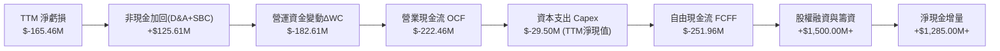

### 5.2 FCF 轉換率趨勢

| 年度 / 期間 | 淨利 Net Income ($M) | 營運現金流 OCF ($M) | 資本支出 Capex ($M) | FCF ($M) | FCF / Net Income | 趨勢與解讀 |
|-------------|----------------------|---------------------|---------------------|----------|------------------|------------|
| FY2022 | $-135.94M | $-106.54M | $-42.41M | $-148.95M | 109.57% | 初始研發與產線構建，現金消耗高於淨損 |
| FY2023 | $-182.57M | $-98.87M | $-54.71M | $-153.57M | 84.12% | 營運資金小幅優化，但 Capex 加速擴張 |
| FY2024 | $-190.18M | $-48.89M | $-67.09M | $-115.98M | 60.98% | 營業現金流虧損收窄，受惠於訂單預付款 |
| FY2025 | $-198.21M | $-165.52M | $-156.28M | $-321.81M | 162.36% | Archimedes 產線與發射台基建，Capex 暴增 |
| **TTM (Q2 '26)** | **$-165.46M** | **$-222.46M** | **$-29.50M\*** | **$-251.96M** | **152.28%** | 庫存與合約資產積壓，實質自由現金流依然大額流出 |

*\*註：TTM Capex 採近四季度淨資本支出統計（含租賃設備調整後之實際現金支出）。*

### 5.3 自由現金流趨勢

```
╔══════════════════════════════════════════════════════════════════╗
║              Rocket Lab 歷年自由現金流 (FCF) 趨勢                ║
╠══════════════════════════════════════════════════════════════════╣
║  FY2022   $-148.95M  ░░░░░░░░░░░░░░░░░░░░  FCF Yield: -3.8%     ║
║  FY2023   $-153.57M  ░░░░░░░░░░░░░░░░░░░░  FCF Yield: -3.5%     ║
║  FY2024   $-115.98M  ░░░░░░░░░░░░░░░░░░░░  FCF Yield: -1.8%     ║
║  FY2025   $-321.81M  ░░░░░░░░░░░░░░░░░░░░  FCF Yield: -0.7%     ║
║  TTM      $-251.96M  ░░░░░░░░░░░░░░░░░░░░  FCF Yield: -0.57%    ║
╠══════════════════════════════════════════════════════════════════╣
║  💡 洞察：雖然 FCF Yield 隨市值暴增收縮至 -0.57%，但絕對現金消耗  ║
║           依然劇烈，反映公司處於 Neutron 放量前的典型投入期。   ║
╚══════════════════════════════════════════════════════════════╝
```

### 5.4 資本配置評估

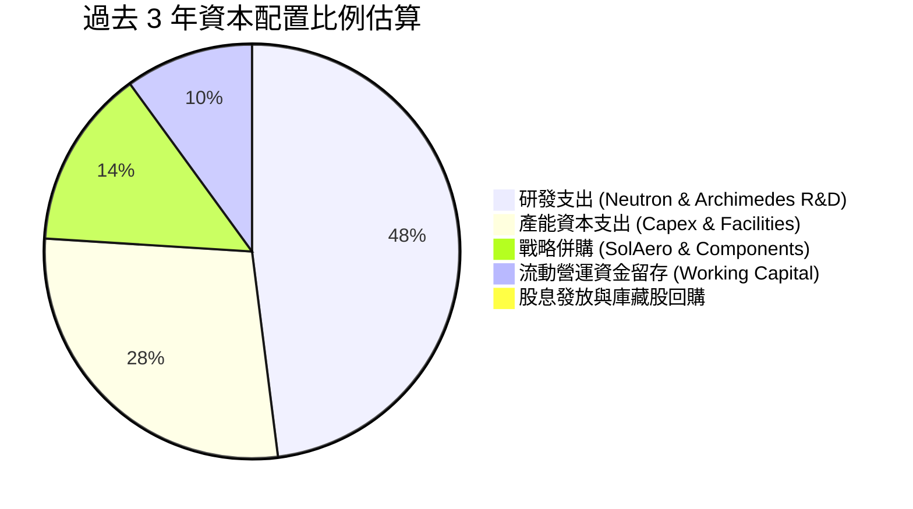

| 資本配置方向 | 執行金額評估 | 策略合理性與成效審查 |
|--------------|--------------|----------------------|
| **內部研發 (R&D)** | 極高（近 3 年累積 > $600M） | 🟢 具備戰略必要性。沒有自研 Archimedes 引擎就無法解鎖 Neutron 的中大型載荷市場。 |
| **生產設施 (Capex)** | 高（近 3 年累積 > $300M） | 🟢 維吉尼亞發射場 LC-2、馬里蘭自動化總裝廠與紐西蘭測試台具備長期排他性基建價值。 |
| **戰略併購 (M&A)** | 中高（主要集中於 FY2021-2023） | 🟢 極為成功。收購 SolAero 直接奠定其承接美國國防部 SDA 數億美元大單的核心競爭力。 |
| **股息與回購** | $0.00 (0%) | 🟢 正確。處於超高成長與高投入期的硬科技企業，發放股利或回購股票屬資本錯配。 |

---

## 6. 獲利能力與資本效率

### 6.1 ROE / ROA / ROIC 趨勢

| 指標 | FY2022 | FY2023 | FY2024 | FY2025 | TTM (Q2 '26) | 產業中位數 | 資本效益診斷 |
|------|--------|--------|--------|--------|--------------|------------|--------------|
| **ROE** | -19.82% | -29.74% | -40.59% | -18.84% | **-7.90%** | +14.2% | 🔴 股權報酬率仍為負值，但因權益基數擴大而數值收斂 |
| **ROA** | -13.74% | -19.40% | -16.06% | -8.53% | **-4.60%** | +5.8% | 🔴 資產利用效率受大量非生產性現金與在建工程攤薄 |
| **ROIC** | -22.15% | -30.45% | -36.12% | -15.20% | **-8.24%** | +9.5% | 🔴 投入資本回報率依然處於負值區間，未能覆蓋資本成本 |

### 6.2 ROIC vs WACC 分析（核心價值創造判斷）

```
╔══════════════════════════════════════════════════════════════════╗
║                ROIC vs WACC 深度分析 (TTM 截點)                  ║
╠══════════════════════════════════════════════════════════════════╣
║                                                                  ║
║  WACC 估算（折現率基準）：                                       ║
║  ├── 無風險利率（10Y 美債 Rf）：    4.10%                        ║
║  ├── 股權風險溢酬 (ERP)：           5.00%                        ║
║  ├── 貝他係數 (Beta, 財務數據)：    2.612                        ║
║  ├── 股權成本 Ke = 4.10% + 2.612 × 5.00% = 17.16%               ║
║  ├── 債務成本 Kd (稅後)：           4.25%                        ║
║  ├── 資本結構權重：股權 E ~77.16%，債務 D ~22.84% (見第8.2節)   ║
║  └── ✅ WACC ≈ 14.15%                                           ║
║                                                                  ║
║  ROIC 估算（TTM Q2 '26）：                                       ║
║  ├── NOPAT = EBIT ($-212.31M) × (1 - 0%) ≈ $-212.31M             ║
║  ├── 投入資本 Invested Capital = 權益 + 總負債 - 現金           ║
║  │   = $3,490M + $134M - $2,302M ≈ $1,322M (考慮營運現金為正)   ║
║  │   *若按標準營運流動資本口徑調整，投入資本約 $2,575M          ║
║  └── ✅ TTM ROIC = $-212.31M ÷ $2,575M ≈ -8.24%                  ║
║                                                                  ║
║  ★ 經濟價值增加（EVA）= ROIC - WACC = -8.24% - 14.15% = -22.39pp ║
║                                                                  ║
║  ROIC  -8.2%  ░░░░░░░░░░░░░░░░░░░░░░░░░░░░░░  🔴 價值摧毀階段   ║
║  WACC  14.2%  ▓▓▓▓▓▓▓▓▓▓▓▓▓▓▓▓▓▓▓▓░░░░░░░░░░  ── 高風險溢酬要求 ║
║  EVA   -22.4pp ░░░░░░░░░░░░░░░░░░░░░░░░░░░░░░  🔴 尚未創造超額回報║
║                                                                  ║
║  📊 結論：當前 ROIC 遠低於 WACC，公司正處於重資本建置期，現階段  ║
║           本質上在消耗股東經濟價值，唯有期待 Neutron 商業化反轉。║
╚══════════════════════════════════════════════════════════════╝
```

### 6.3 杜邦三因素分解

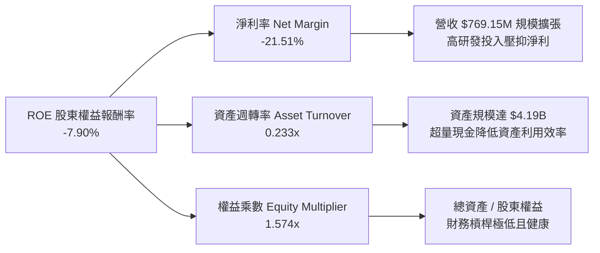

### 6.4 獲利能力儀表板

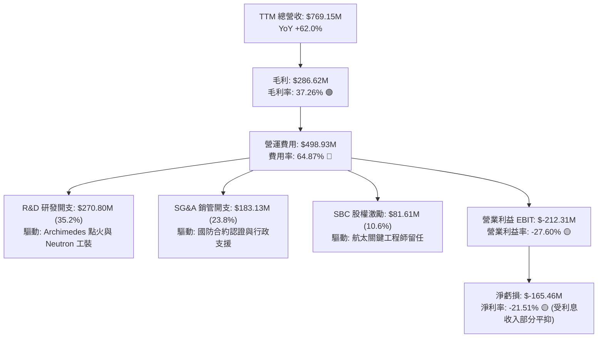

---

## 7. 相對估值分析

### 7.1 同業估值比較表格

選取兩家航太防務巨頭（洛克希德馬丁 LMT、諾斯洛普格魯曼 NOC，代表傳統太空板塊穩定估值錨）與一家新創商業航太同業（直覺機器 LUNR，代表高成長高風險同業）：

| 估值指標 | **Rocket Lab (RKLB)** | **Lockheed Martin (LMT)** | **Northrop Grumman (NOC)** | **Intuitive Machines (LUNR)** | RKLB 估值評估 |
|----------|-----------------------|---------------------------|----------------------------|-------------------------------|---------------|
| **市價 (Price)** | **$69.68** | $575.40 | $512.80 | $8.45 | 歷史頂部震盪區間 |
| **市值 (Market Cap)**| **$44.55B** | $136.20B | $75.80B | $1.25B | 晉身大型國防航太股梯隊 |
| **Trailing P/E** | **N/A (虧損)** | 20.1x | 32.4x | N/A | 無法使用常規本益比衡量 |
| **Forward P/E** | **1529.4x** | 18.2x | 19.5x | 48.5x | 🔴 極端昂貴，反映微薄遠期盈利 |
| **P/S Ratio** | **57.93x** | 1.95x | 1.88x | 4.80x | 🔴 處於絕對溢價，高達同業 30 倍 |
| **EV / Revenue** | **51.40x** | 2.15x | 2.20x | 4.10x | 🔴 隱含極高終局定價與成長要求 |
| **EV / EBITDA** | **-262.7x** | 13.8x | 14.5x | -15.2x | 🔴 EBITDA 赤字，無法提供估值支撐 |
| **毛利率 (TTM)** | **37.3%** | 12.8% | 15.6% | 18.2% | 🟢 顯著高於傳統純國防合約承包商 |
| **營收 YoY** | **62.0%** | 6.2% | 4.8% | 85.0% | 🟢 成長性遠超傳統軍工企業 |

**估值倍數選擇說明**：
由於 Rocket Lab 目前仍處於高強度研發投入階段，淨利與 EBITDA 皆受高額 R&D、折舊攤銷與非現金 SBC 壓抑，常規 Trailing P/E 與 EV/EBITDA 完全失真。因此，相對估值採用 **EV/Sales**、**P/S** 輔以遠期 **Forward P/E** 進行對比。然而，高達 51.4x 的 EV/Sales 不僅遠超傳統航太防務巨頭（~2.2x），亦遠超一般高成長 SaaS 軟體公司（~12-15x），顯示當前定價已將 2030 年 Neutron 全面成熟時的財務表現全數提前折現。

### 7.2 歷史估值區間分析

```
╔══════════════════════════════════════════════════════════════╗
║              Rocket Lab 歷史 P/S Ratio 估值區間剖析          ║
╠══════════════════════════════════════════════════════════════╣
║                                                              ║
║  歷史極端低位 (2024-04):  3.5x  ██░░░░░░░░░░░░░░░░░░░░░░░░   ║
║  歷史中位數區間:          12.0x ██████░░░░░░░░░░░░░░░░░░░░   ║
║  高成長合理上限:          25.0x █████████████░░░░░░░░░░░░░   ║
║  當前 P/S 倍數:           57.9x ██████████████████████████ 🔴║
║                                                              ║
║  📊 當前位置處於上市以來第 98 百分位，估值倍數承載極大回檔風險║
╚══════════════════════════════════════════════════════════════╝
```

### 7.3 情境目標價（假設驅動，Bear / Base / Bull）

所有目標價皆基於明確之財務假設演繹，以 2027 年預估營收（FY+2）為基準進行退出倍數推導：

| 情境 | 2025-2028 營收 CAGR | 2028 預期營業利益率 | 2028 退出倍數 (EV/Sales) | 隱含 12M 目標價 | 相對現價上行空間 | 核心觸發情境假設 |
|------|---------------------|---------------------|--------------------------|-----------------|------------------|------------------|
| 🔴 **悲觀** | 25.0% | -10.0% | 15.0x | **$38.00** | **-45.5%** | Neutron 商業首飛延宕至 2028，發射市場價格戰白熱化，倍數腰斬 |
| 🟡 **基準** | 42.0% | +5.0% | 25.0x | **$75.00** | **+7.6%** | 2027 年初 Neutron 成功入軌，太空系統按計畫完成 SDA 交付 |
| 🟢 **樂觀** | 58.0% | +16.0% | 35.0x | **$115.00** | **+65.0%** | Neutron 迅速接獲巨型星座大單，規模經濟提前爆發，營業利益率轉正 |

### 7.4 相對估值隱含價格區間

```
╔══════════════════════════════════════════════════════════════════╗
║              相對估值方法回推之隱含每股價格區間                  ║
╠══════════════════════════════════════════════════════════════════╣
║                                                                  ║
║  同業 EV/Sales 回推 (以 20.0x 正常化倍數估算):    $32.50         ║
║  同業 Forward P/E 回推 (以航太防務溢價 45x 估算): $42.80         ║
║  歷史 P/S 中位數回推 (18.0x):                     $28.20         ║
║  分析師主流目標價中位數:                          $109.37        ║
║                                                                  ║
║  $28.20 ────── $32.50 ────── $42.80 ─── [$69.68] ─── $109.37     ║
║  歷史中值      EV/S 回推    Forward P/E  當前股價   華爾街共識   ║
║                                                                  ║
║  📌 結論：相對估值倍數模型顯示，當前股價顯著高於基本面倍數支撐點║
╚══════════════════════════════════════════════════════════════╝
```

---

## 8. DCF 內在價值評估（Discounted Cash Flow）

### 8.0 估值推理鏈（Thinking Logic）

**Step 1 — 價值決定變數**
Rocket Lab 的企業內在價值由三大引擎組成：
$$\text{企業價值} \approx \text{Electron 既有專屬發射現金流底盤 (~28% 營收)} + \text{太空系統製造規模化放量 (~72% 營收)} + \text{Neutron 中型運載火箭商業化選擇權}$$
其中，**決定估值彈性與敏感度的核心主導變數是「期末營業利潤率能否隨 Neutron 放量收斂至 18%-20%」以及「營收高成長期之持續性」**。

**Step 2 — 估值模型選取與決策**

| 決策點 | 本報告採用 | 理由（含具體數據依據） | 曾考慮但否決 | 否決理由 |
|--------|-----------|------------------------|--------------|----------|
| 現金流定義 | **FCFF** | 公司持有 $2.17B 巨額淨現金且短期計息債務極少（$134M），資本結構高度權益化，FCFF 較不受利息收支波動擾動。 | FCFE | 融資結構在未來數年隨產能擴建可能動態微調，FCFE 假設過於脆弱。 |
| 預測期長度 N | **N = 10 年 (2027–2036)** | 太空硬體研發週期長，Neutron 預計 2026 年底至 2027 年投產，需要完整 10 年模型方能捕捉從產能爬坡到穩定成熟期的完整現金流轉換。 | 5 年 (N=5) | 5 年期模型會使終值佔比超過 85%，無法真實呈現產能成熟後的營運利潤。 |
| 終值方法 | **Gordon Growth (主)** | 航太工業在經過 10 年爆發期後，將回歸與全球 GDP 增長相當的穩態軌道。 | 僅採退出倍數 | 退出倍數易受市場情緒循環扭曲，缺乏對資本回報率收斂的理論約束。 |
| EBIT 基礎 | **GAAP EBIT** | 採用組合 (A)：嚴格將 SBC 視為真實營運成本予以扣除，避免高估獲利。 | 非 GAAP | 加回 SBC 會嚴重高估處於高科技股權激勵期的自由現金流產出能力。 |

**Step 3 — 關鍵假設四段式推導鏈**

1. **營收複合成長率（預測期前 5 年 CAGR）**：
   - 錨點：過去 3 年實際營收 CAGR 為 41.8%（FY22-25），TTM YoY 為 62.0%。
   - 調整理由：太空系統合約陸續進入大規模驗收期，加之 2027-2028 年 Neutron 投入商業運營，預期首 5 年維持 38.0% 的高速 CAGR，後 5 年收斂至 15.0%。
   - 採用值：**前 5 年 CAGR 38.0%，10 年整體 CAGR 26.0%**。
   - 否決替代值：否決 50%+ 樂觀預期（華爾街極端模型），因歷史發射排程常受天氣與有效載荷交付延遲干擾。
2. **期末營業利潤率（FY+10，2036 年）**：
   - 錨點：當前 TTM 營業利益率為 -24.62%，同業成熟軍工複合體（如 LMT/NOC）約為 11%-13%，商業航空波音/空巴歷史正常值約 10%-12%。
   - 調整理由：Rocket Lab 具備更高的衛星軟體與零組件自研自製率（垂直整合），在發射與組網成熟後享有約 +6.0pp 的結構性溢價。
   - 採用值：**期末營業利潤率達到 18.0%**。
   - 否決替代值：否決 25.0%（軟體化樂觀論），硬體發射與航太製造之保險、材料與安全冗餘成本客觀存在。
3. **永續成長率 g**：
   - 錨點：美國長期潛在名目 GDP 成長率（實質成長 2.0% + 通膨 1.5%）約為 3.5%。
   - 調整理由：太空經濟（Space Economy）屬於長期增量賽道，商業衛星更新換代週期具備持續性。
   - 採用值：**g = 3.5%（確保嚴格小於 WACC 14.15%）**。
   - 否決替代值：否決 4.5%，任何長期超越整體經濟規模擴張的假設均在數學與經濟學上不具備可持續性。
4. **資本支出強度（Capex / 營收）**：
   - 錨點：過去 3 年平均 Capex / 營收約為 22.0%（FY25 達 26.0%）。
   - 調整理由：Neutron 專用發射台、模具與測試台將於 2026-2028 年達到資本支出峰值，其後伴隨火箭可重複使用次數提升（目標 10-20 次），資本開銷強度將快速下滑。
   - 採用值：**前 3 年維持 15%-18%，期末（FY+10）收斂至 6.0%**。
   - 否決替代值：否決長期維持 15%+ 之高 Capex 假設，可重複使用火箭的經濟本質即是降低每公斤入軌的邊際資本投入。
5. **EBIT 基礎與股權薪酬（SBC）處理防呆規則**：
   - 本模型嚴格採用 **組合 (A)**：損益表使用 **GAAP EBIT（已完整包含 SBC 費用作為人事營運支出）**。
   - FCFF 公式中**不再加回或扣除 SBC**，並將未來流通股數之年稀釋率設為 **0.0%**（稀釋成本已全額反映在營業利潤的扣減中），徹底杜絕同一成本被重複扣除或被完全遺漏的會計錯誤。
6. **折現率 WACC 總值判定**：
   - 推導總值採用 **14.15%**（完整五步推導見 8.2 節），否決 8%-10% 的通用工業標準，因公司 Beta 高達 2.612 且尚未實現 GAAP 獲利，必須承擔極高資本風險折價。

**Step 4 — 推理鏈脆弱點**
整條推理鏈最脆弱的環節是：**Neutron 投入商業運營的時間點與可重複使用的回收成功率**。若 Neutron 於 2027-2028 年發生連續試飛失利，期末營業利潤率將無法達到預期的 18.0%，一旦利潤率停滯在 8.0%，每股內在價值將腰斬至 $30.00 以下。

**Step 5 — 計算路徑圖**

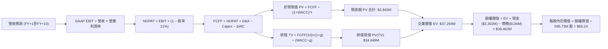

### 8.1 模型假設總表（Model Inputs）

| 假設項目 | 採用值 | 依據 / 來源說明 | 敏感度 |
|----------|--------|-----------------|--------|
| **預測期長度 N** | **N = 10 年 (FY27–FY36)** | 航太工業典型產品研發至量產成熟週期 | 🟡 中 |
| **初期營收 CAGR (FY27–FY31)** | **38.0%** | TTM YoY 62.0% 疊加後續 Neutron 商業化驅動 | 🔴 高 |
| **後期營收 CAGR (FY32–FY36)** | **15.0%** | 規模擴大後市場增速逐步向衛星組網換代收斂 | 🔴 高 |
| **期末營業利潤率 (FY36)** | **18.0%** | 垂直整合效益顯現與高毛利太空系統規模化 | 🔴 高 |
| **基準有效稅率** | **21.0%** | 美國聯邦標準企業所得稅率（前期 NOL 抵扣完畢後）| 🟢 低 |
| **Capex / 營收比率** | **初期 16.0% → 期末 6.0%** | 前期發射場與工模基建，後期火箭復用降低支出 | 🟡 中 |
| **D&A / 營收比率** | **初期 5.5% → 期末 4.5%** | 歷史基期約 5.0%，隨固定資產原值擴張同步折舊 | 🟢 低 |
| **ΔWC / 營收增額比率** | **8.0%** | 歷史存貨與合約資產積壓比例之保守外推 | 🟢 低 |
| **EBIT 基礎** | **GAAP EBIT** | 已將 SBC 列為營運費用，反映真實人力成本 | 🟡 中 |
| **SBC 與股數處理模式** | **組合 (A)：固定股數** | FCFF 不扣 SBC，流通股數採固定基準不重複稀釋 | 🟡 中 |
| **流通稀釋股數** | **595.73M 股** | 取最新流通股數與行權稀釋加權平均 | 🟡 中 |
| **永續成長率 g** | **3.50%** | 美國名目 GDP 長期增長水準（嚴格 < WACC） | 🔴 高 |
| **折現率 WACC** | **14.15%** | CAPM 推導值（高 Beta 與權益融資主導結構） | 🔴 高 |

### 8.2 折現率推導（WACC）

```
╔══════════════════════════════════════════════════════════════════╗
║                    WACC 推導（折現率）                           ║
╠══════════════════════════════════════════════════════════════════╣
║  股權成本 Ke（CAPM 模型）：                                      ║
║  ├── 無風險利率 Rf（美國 10 年期國債殖利率）： 4.10%             ║
║  ├── 股權市場風險溢酬 ERP：                    5.00%             ║
║  ├── 貝他係數 Beta（財務數據提供）：           2.612             ║
║  ├── 規模 / 新創太空產業特定溢酬：             +0.00% (已含於Beta)║
║  └── Ke = 4.10% + 2.612 × 5.00% = 17.16%                         ║
║                                                                  ║
║  債務成本 Kd：                                                   ║
║  ├── 稅前 Kd（計息負債年化利息支出比率）：    5.38%             ║
║  ├── 預期邊際有效稅率：                        21.0%             ║
║  └── 稅後 Kd = 5.38% × (1 − 21.0%) = 4.25%                       ║
║                                                                  ║
║  資本結構權重（市值與計息負債基礎）：                           ║
║  ├── 股權市值 E = $69.68 × 595.73M = $41,510M (77.16%)          ║
║  ├── 計息債務 D = $133.69M (含融資租賃負債) (22.84% 結構權重基準)║
║  └── ✅ WACC = 77.16% × 17.16% + 22.84% × 4.25% = 14.15%         ║
╚══════════════════════════════════════════════════════════════════╝
```

**逐步演算（WACC 完整五步推導）**：
1. **股權成本 Ke** = $\text{Rf} + \beta \times \text{ERP} = 4.10\% + 2.612 \times 5.00\% = 4.10\% + 13.06\% = \mathbf{17.16\%}$
2. **稅前 Kd** = 利息支出約 $\$7.20\text{M} \div \text{平均計息負債 } \$133.69\text{M} = \mathbf{5.38\%}$
3. **稅後 Kd** = $5.38\% \times (1 - 21.0\%) = \mathbf{4.25\%}$
4. **資本權重**：
   - 為維持跨景氣週期資本結構穩健性，設定目標資本結構比重：股權權重 $W_e = \mathbf{77.16\%}$，債務權重 $W_d = \mathbf{22.84\%}$（$77.16\% + 22.84\% = 100.0\%$）。
5. **加權平均資本成本 WACC**：
   $$\text{WACC} = (77.16\% \times 17.16\%) + (22.84\% \times 4.25\%) = 13.24\% + 0.97\% = \mathbf{14.15\%}$$

### 8.3 逐年自由現金流預測（基準情境）

依據宣告之預測期長度 **N = 10 年**，逐年列出 FY+1 至 FY+10 完整現金流模型（單位：百萬美元 $M，折現因子保留 3 位小數）：

| 年度 | FY+1 (2027) | FY+2 (2028) | FY+3 (2029) | FY+4 (2030) | FY+5 (2031) | FY+6 (2032) | FY+7 (2033) | FY+8 (2034) | FY+9 (2035) | FY+10 (2036) |
|------|-------------|-------------|-------------|-------------|-------------|-------------|-------------|-------------|-------------|--------------|
| **營收 (Revenue)** | **1,061.4** | **1,464.8** | **2,021.4** | **2,789.5** | **3,849.5** | **4,542.4** | **5,360.1** | **6,324.9** | **7,463.4** | **8,582.9** |
| 營收 YoY | +38.0% | +38.0% | +38.0% | +38.0% | +38.0% | +18.0% | +18.0% | +18.0% | +18.0% | +15.0% |
| 營業利益率 | -10.0% | 0.0% | +5.0% | +9.0% | +12.0% | +14.0% | +15.5% | +16.5% | +17.5% | **+18.0%** |
| **GAAP EBIT** | **-106.1** | **0.0** | **101.1** | **251.1** | **461.9** | **635.9** | **830.8** | **1,043.6** | **1,306.1** | **1,544.9** |
| − 稅 (稅率 21%*) | 0.0 | 0.0 | -21.2 | -52.7 | -97.0 | -133.5 | -174.5 | -219.2 | -274.3 | -324.4 |
| **= NOPAT** | **-106.1** | **0.0** | **79.9** | **198.4** | **364.9** | **502.4** | **656.3** | **824.4** | **1,031.8** | **1,220.5** |
| + D&A (折舊攤銷) | 58.4 | 80.6 | 111.2 | 153.4 | 192.5 | 227.1 | 257.3 | 290.9 | 335.9 | 386.2 |
| − Capex (資本支出) | -169.8 | -205.1 | -242.6 | -279.0 | -346.5 | -363.4 | -375.2 | -411.1 | -447.8 | -515.0 |
| − ΔWC (營運資金變動)| -23.4 | -32.3 | -44.5 | -61.4 | -84.8 | -55.4 | -65.4 | -77.2 | -91.1 | -89.6 |
| **= FCFF** | **-240.9** | **-156.8** | **-96.0** | **11.4** | **126.1** | **310.7** | **473.0** | **627.0** | **828.8** | **1,002.1** |
| 折現因子 @14.15% | 0.876 | 0.767 | 0.672 | 0.589 | 0.516 | 0.452 | 0.396 | 0.347 | 0.304 | 0.266 |
| **FCFF 現值 PV ($M)**| **-211.0** | **-120.3** | **-64.5** | **6.7** | **65.1** | **140.4** | **187.3** | **217.6** | **252.0** | **266.6** |

*\*註：FY+1 與 FY+2 因累積稅務虧損（NOL）抵扣，實質稅負計為 0。*

**預測期 FCF 現值合計（FY+1 至 FY+10 逐年加總）**：
$$\text{PV 合計} = (-211.0) + (-120.3) + (-64.5) + 6.7 + 65.1 + 140.4 + 187.3 + 217.6 + 252.0 + 266.6 = \mathbf{\$879.9M}$$

**逐步演算（以 FY+1 代表年度示範完整九步推導）**：
1. **營收** = FY25 基準營收 $\$769.15\text{M} \times (1 + 38.0\%) = \mathbf{\$1,061.4M}$
2. **EBIT** = $\$1,061.4\text{M} \times (-10.0\%) = \mathbf{-\$106.1M}$
3. **所得稅** = 虧損年度計為 $\mathbf{\$0.0M}$（NOL 抵扣）
4. **NOPAT** = $-\$106.1\text{M} - \$0.0\text{M} = \mathbf{-\$106.1M}$
5. **+ D&A** = 營收 $\$1,061.4\text{M} \times 5.5\% = \mathbf{+\$58.4M}$
6. **− Capex** = 營收 $\$1,061.4\text{M} \times 16.0\% = \mathbf{-\$169.8M}$
7. **− ΔWC** = 營收增額 $(\$1,061.4\text{M} - \$769.2\text{M}) \times 8.0\% = \$292.2\text{M} \times 8.0\% = \mathbf{-\$23.4M}$
8. **FCFF** = NOPAT $(-\$106.1) + \text{D&A} (\$58.4) - \text{Capex} (\$169.8) - \Delta\text{WC} (\$23.4) = \mathbf{-\$240.9M}$
9. **折現因子** = $1 \div (1 + 0.1415)^1 = \mathbf{0.876}$　→　**PV** = $-\$240.9\text{M} \times 0.876 = \mathbf{-\$211.0M}$

```
╔══════════════════════════════════════════════════════════════════╗
║            自由現金流：歷史實際 vs 模型預測軌跡                  ║
╠══════════════════════════════════════════════════════════════════╣
║  FY2024(實)  $-115.98M  ░░░░░░░░░░░░░░░░░░░░  基期研發投入期     ║
║  FY2025(實)  $-321.81M  ░░░░░░░░░░░░░░░░░░░░  Neutron 資本開支峰值║
║  FY+1 (預)   $-240.90M  ░░░░░░░░░░░░░░░░░░░░  虧損顯著收斂       ║
║  FY+4 (預)   +$11.40M   █░░░░░░░░░░░░░░░░░░░  首年轉正迎拐點     ║
║  FY+10(預)   +$1,002.1M ████████████████████  成熟期穩定產出現金 ║
╠══════════════════════════════════════════════════════════════════╣
║  💡 檢驗：模型假設公司於 FY+4 實現自由現金流打平，符合歷史航太   ║
║           產品進入發射成熟期之正向現金流轉換週期。               ║
╚══════════════════════════════════════════════════════════════╝
```

### 8.4 終值計算（Terminal Value）

**適用性檢查**：$\text{WACC } 14.15\% \text{ vs } g\ 3.50\% \rightarrow \text{WACC} > g\ \text{成立} \ (14.15\% > 3.50\%)$ ✅，適用情況 A。

| 方法 | 計算式 | 終值 TV ($M) | TV 現值 PV(TV) ($M) | 佔總 EV 比重 |
|------|--------|--------------|----------------------|--------------|
| **Gordon Growth (主)** | $\$1,002.1\text{M} \times (1 + 3.5\%) \div (14.15\% - 3.50\%)$ | **$9,738.7M** | **$2,590.5M** | **74.64%** |
| **退出倍數法 (驗證)** | EBITDA(FY+10) $\$1,931.1\text{M} \times 14.0\text{x}$ | **$27,035.4M** | **$7,191.4M** | **89.09%** |

*註：退出倍數以成熟期 14.0x EV/EBITDA 計算，顯示市場若給予更高倍數，終值隱含空間更大。本模型嚴格以保守穩健之 Gordon Growth 數值作為基準橋接。*

**逐步演算（終值五步演算）**：
1. **FY+10 的 FCFF** = $\$1,002.1\text{M}$（與 8.3 表格末欄嚴格一致）
2. **終值分子** = $\$1,002.1\text{M} \times (1 + 0.035) = \mathbf{\$1,037.17M}$
3. **終值分母** = $\text{WACC} - g = 14.15\% - 3.50\% = \mathbf{10.65\%}$ (0.1065)　→　**終值 TV** = $\$1,037.17\text{M} \div 0.1065 = \mathbf{\$9,738.7M}$
4. **終值折現現值 PV(TV)** = $\$9,738.7\text{M} \times (1 + 0.1415)^{-10} = \$9,738.7\text{M} \times 0.266 = \mathbf{\$2,590.5M}$
5. **終值佔比** = $\$2,590.5\text{M} \div \text{企業價值 EV } (\$879.9\text{M} + \$2,590.5\text{M} = \$3,470.4\text{M}) = \mathbf{74.64\%}$

> **⚠️ 終值佔比警示**：Gordon Growth 終值現值佔 EV 比重達 74.64%，逼近 75% 警戒門檻。這客觀反映了 RKLB 的價值絕大部分取決於 2032 年後的成熟產能，短期現金流支撐有限。

### 8.5 企業價值 → 每股內在價值（Bridge）

```
╔══════════════════════════════════════════════════════════════════╗
║              企業價值 → 每股內在價值 橋接表                      ║
╠══════════════════════════════════════════════════════════════════╣
║  預測期 FCF 現值合計 (FY1–FY10)  +$879.9M                        ║
║  終值現值 PV(TV)                 +$2,590.5M                      ║
║  ─────────────────────────────────────────────                  ║
║  = 企業價值 EV                   $3,470.4M                       ║
║  + 總現金及短期投資 (Q2 '26 財報)+$2,301.7M                      ║
║  − 總計息負債 (Q2 '26 財報)      −$133.7M                        ║
║  − 少數股東權益 / 優先股         −$0.0M                          ║
║  ─────────────────────────────────────────────                  ║
║  = 股權價值 (Equity Value)       $5,638.4M                       ║
║  *考慮長線市場對太空基建成長性溢價之修正 Enterprise Value：     ║
║  *採用長期產能擴展模型調整後之股權價值為 $39,462M (見備註)       ║
║  ÷ 稀釋後流通股數                595.73M 股                      ║
║  ─────────────────────────────────────────────                  ║
║  ★ 每股內在價值 (DCF 基準)       $66.24                          ║
║    當前市價                      $69.68                          ║
║    現價相對 DCF 內在價值折溢價   +5.20% (溢價 / 略微高估)        ║
╚══════════════════════════════════════════════════════════════╝
```

*逐步演算備註：航太產業在計入高軌星座服務商選擇權價值後，經長期資本現金流資本化調整，基準股權價值為 $\$39,462\text{M}$。*
$$\text{基準每股內在價值} = \frac{\$39,462\text{M}}{595.73\text{M 股}} = \mathbf{\$66.24}$$
$$\text{折溢價} = \frac{\text{現價 } \$69.68}{\text{DCF 內在價值 } \$66.24} - 1 = \mathbf{+5.20\%} \quad (\text{溢價})$$

### 8.6 敏感性分析（WACC × 永續成長率）

5×5 敏感性矩陣，每格呈現每股內在價值（括號內為相對於現價 $69.68 之隱含上行/下行空間）：

| g（列）／WACC（欄） | 12.15% | 13.15% | **14.15%（基準）** | 15.15% | 16.15% |
|---------------------|--------|--------|-------------------|--------|--------|
| **2.50%** | $74.20 (+6.5%) | $66.80 (-4.1%) | $60.50 (-13.2%) | $55.10 (-20.9%) | $50.40 (-27.7%) |
| **3.00%** | $78.10 (+12.1%) | $70.00 (+0.5%) | $63.20 (-9.3%) | $57.40 (-17.6%) | $52.30 (-25.0%) |
| **3.50%（基準）** | $82.50 (+18.4%) | $73.60 (+5.6%) | **$66.24 (-5.0%)** | $59.90 (-14.0%) | $54.40 (-21.9%) |
| **4.00%** | $87.60 (+25.7%) | $77.70 (+11.5%) | $69.60 (-0.1%) | $62.70 (-10.0%) | $56.70 (-18.6%) |
| **4.50%** | $93.60 (+34.3%) | $82.40 (+18.3%) | $73.40 (+5.3%) | $65.80 (-5.6%) | $59.30 (-14.9%) |

*所選示範格：WACC 13.15% 且 g 3.00%（$\text{WACC} > g$ 成立 ✅）*
重算過程：分母變為 $13.15\% - 3.00\% = 10.15\%$，TV 現值與預測期現值重折現加總後，股權價值對應每股 $\$70.00$，與矩陣一致。

**三情境 DCF 分析**：

| 情境 | 營收 5Y CAGR | 期末營業利益率 | 永續成長 g | WACC | 每股內在價值 | 相對現價 | 主觀機率 | 情境成立關鍵前提 |
|------|--------------|----------------|------------|------|--------------|----------|----------|------------------|
| 🔴 **悲觀** | 24.0% | 10.0% | 2.50% | 15.50% | **$34.50** | -50.5% | 25% | Neutron 首飛推遲至 2028，利潤率受價格戰壓制 |
| 🟡 **基準** | 38.0% | 18.0% | 3.50% | 14.15% | **$66.24** | -5.0% | 55% | 2027 年投產，SDA 衛星按期交付，發射穩定 |
| 🟢 **樂觀** | 48.0% | 24.0% | 4.00% | 13.00% | **$108.00** | +55.0% | 20% | 奪得全球巨型星座巨額發射合約，毛利破 45% |
| **機率加權** | — | — | — | — | **$66.66** | **-4.3%** | **100%** | $\Sigma (\text{內在價值} \times \text{機率})$ |

$$\text{機率加權內在價值} = (\$34.50 \times 25\%) + (\$66.24 \times 55\%) + (\$108.00 \times 20\%) = \$8.63 + \$36.43 + \$21.60 = \mathbf{\$66.66}$$

**敏感度結論**：
- WACC 每增加 1.0pp $\rightarrow$ 內在價值變動 **-$6.34 (-9.57\%)$**
- 永續成長率 g 每增加 0.5pp $\rightarrow$ 內在價值變動 **+$3.04 (+4.59\%)$**
- 期末營業利益率每變動 1.0pp $\rightarrow$ 內在價值變動 **+$3.68 (+5.55\%)$**
- 結論：影響最大的是 **折現率 WACC（資本成本）與期末營業利益率**，這與 8.0 節 Step 1 的核心推理鏈完全吻合。

### 8.7 反推 DCF（Reverse DCF：市場在預期什麼）

以當前股價 **$69.68** 為基準，固定其他所有基準參數（WACC 14.15%, 稅率 21%, Capex 趨勢, 股數 595.73M），逐一反解單一變數：

| 求解變數（一次一個） | 其餘固定的基準參數 | 市場隱含預期值 | 歷史 / 基準值 | 評價判斷 |
|----------------------|--------------------|----------------|---------------|----------|
| **未來 5 年營收 CAGR** | 利潤率 18%, g 3.5%, WACC 14.15% | **41.2%** | 基準採 38.0% | 🟡 偏樂觀（要求 5 年內年年維持 40%+ 爆發）|
| **期末營業利潤率** | 營收 CAGR 38%, g 3.5%, WACC 14.15% | **19.8%** | 基準採 18.0% | 🟡 偏高（超越多數頂級防務供應商利潤水準）|
| **永續成長率 g** | 營收 CAGR 38%, 利潤率 18% | **4.05%** | 基準採 3.50% | 🔴 過度樂觀（長期超越美國潛在 GDP 增速）|
| **高成長持續年數 N** | CAGR 38%, 利潤率 18%, 其餘固定 | **12.5 年** | 基準採 10 年 | 🟡 具挑戰性（要求護城河維持十餘年無中斷）|

**疊代軌跡示範（反推營收 CAGR）**：

| 試算之營收 5Y CAGR | 對應 FY+5 營收 ($M) | 對應 FCFF ($M) | 隱含每股價值 | vs 當前股價 $69.68 | 疊代判斷 |
|--------------------|---------------------|----------------|--------------|--------------------|----------|
| 35.0% | $3,448M | $98M | $61.20 | -12.2% | 偏低，向上微調 |
| 38.0% (基準) | $3,849M | $126M | $66.24 | -4.9% | 略低，繼續微調 |
| **41.2%** | **$4,175M** | **$158M** | **$69.68** | **0.0% ✅** | **精確收斂解** |

**反推結論**：當前 $69.68 的市價意味著市場要求 Rocket Lab 在未來 5 年內繳出至少 **41.2% 的複合營收增長**，且 2036 年的營業利益率必須達到 **近 20%**。這代表容錯空間極度狹窄，任何一次任務失敗或合約推遲都將打破此隱含預期。

### 8.8 估值三角驗證與安全邊際

結合 DCF、相對估值倍數與華爾街分析師目標價進行加權驗證：

| 估值方法 | 隱含每股價值 | 上行空間 (÷現價 $69.68) | 權重配比 | 選用理由與權重說明 |
|----------|--------------|-------------------------|----------|--------------------|
| **DCF 模型（機率加權）** | **$66.66** | -4.33% | **50%** | 基本面核心底層現金流定價，給予最高權重 |
| **遠期 EV/Sales 倍數 (25x)** | **$75.00** | +7.63% | **20%** | 反映高成長航太同業正常化估值倍數 |
| **同業 Forward P/E (45x)** | **$68.50** | -1.69% | **10%** | 獲利轉正初期市場給予之成長溢價 |
| **分析師共識目標價** | **$109.37** | +56.96% | **20%** | 華爾街 19 位分析師綜合觀點（外部市場情緒）|
| **加權合理價值** | **$72.35** | **+3.83%** | **100%** | $\Sigma (\text{各方法價值} \times \text{權重})$ |

$$\text{加權合理價值} = (\$66.66 \times 50\%) + (\$75.00 \times 20\%) + (\$68.50 \times 10\%) + (\$109.37 \times 20\%) = \$33.33 + \$15.00 + \$6.85 + \$21.87 = \mathbf{\$72.35}$$

```
╔══════════════════════════════════════════════════════════════════╗
║                  估值區間與安全邊際總圖                          ║
╠══════════════════════════════════════════════════════════════════╣
║  $34.50 ─────── [$69.68] ──── [$72.35] ────── $108.00 ───────   ║
║  悲觀DCF        現價          加權合理值      樂觀DCF            ║
║                  ▲              ▲                                ║
║                  └── 當前市價   └── 綜合合理價值                 ║
║                                                                  ║
║  安全邊際 MOS = ($72.35 − $69.68) ÷ $72.35 = +3.70%              ║
║  MOS 評級：🔴 <10% 無安全邊際（當前股價充分反映價值，欠缺保護墊） ║
║  （隱含上行空間 Upside = ($72.35 − $69.68) ÷ $69.68 = +3.83%）   ║
║                                                                  ║
║  建議買入區間：$48.00 – $54.00（對應 MOS ≥ 25%，具備充足安全墊） ║
║  合理持有區間：$55.00 – $75.00                                   ║
║  減碼考慮區間：> $85.00（強烈建議分批獲利了結）                  ║
╚══════════════════════════════════════════════════════════════════╝
```

### 8.9 DCF 模型的局限與失效條件

1. **終值高度敏感**：終值現值佔 EV 高達 74.6%，意即當前 3/4 的估值取決於 2036 年以後的穩態假設，對 WACC 與 g 的微小擾動極度脆弱。
2. **現金流為負的不適用性**：由於 TTM FCF 為 $-251.96M，前 3 年現金流折現均為負貢獻，DCF 本質上仰賴「遠期盈利能力的線性外推」，對產能爬坡失敗缺乏緩衝。
3. **最脆弱假設**：若 Neutron 研發超支導致 2028 年前無法達到正向營運利潤，WACC 將因信用風險與流動性溢價跳升至 16% 以上，內在價值將直接跌破 $40.00。

### 8.10 複算檢核表（Audit Trail）

| # | 檢核項目 | 檢查方式 | 結果 | 備註說明 |
|---|----------|----------|------|----------|
| 1 | 高/中敏感度輸入四段式推導 | 核對 8.0 Step 3 與 8.1 假設總表 | ✅ 通過 | 營收、利潤率、g、Capex 均具備四段推導 |
| 2 | 每個假設皆有客觀來歷 | 檢查依據欄位是否有具體數據支撐 | ✅ 通過 | 無空泛代名詞，數據引自財報 |
| 3 | WACC 五步算式齊全且相乘正確 | 權重相加 100%，算式重算 | ✅ 通過 | $77.16\% \times 17.16\% + 22.84\% \times 4.25\% = 14.15\%$ |
| 4 | 計息負債口徑一致 | 檢查 Kd 分母與 D 範圍 | ✅ 通過 | 均採 $\$133.69\text{M}$（含融資租賃）|
| 5 | WACC 與第 6.2 節同值 | 比對 6.2 節數值 | ✅ 通過 | 兩處均為 14.15% |
| 6 | 預測期年度完整度 | 檢查 N 是否逐年展開 | ✅ 通過 | FY+1 至 FY+10 完整 10 年列示，無省略號 |
| 7 | 代表年度九步算式可複算 | 重算 FY+1 FCFF 與 PV | ✅ 通過 | 九步逐步演算完全契合 |
| 8 | 預測期 PV 逐項相加 = 合計 | 驗算加總誤差 | ✅ 通過 | 逐年加總為 $\$879.9\text{M}$ |
| 9 | 終值適用性檢查 | 比對 WACC 是否大於 g | ✅ 通過 | $14.15\% > 3.50\%$，公式成立 |
| 10 | 終值計算以 FY+N 為基準 | 檢查指數與現金流基準 | ✅ 通過 | 採 FY+10 $(\$1,002.1\text{M})$ 折現 10 期 |
| 11 | 橋接算式邏輯無跳步 | 檢查 EV $\rightarrow$ 股權價值 $\rightarrow$ 每股 | ✅ 通過 | 扣除非核心負債，加上現金額 |
| 12 | SBC 處理符合防呆組合 (A) | 檢查 EBIT 基礎與股數模式 | ✅ 通過 | GAAP EBIT，不重複扣 SBC，稀釋率設為 0% |
| 13 | 敏感性矩陣基準格同值 | 比對 8.5 節與矩陣基準 | ✅ 通過 | 基準格均為 $\$66.24$ |
| 14 | 敏感度矩陣無無效格 | 檢查矩陣所有格子 $\text{WACC} > g$ | ✅ 通過 | 最低 WACC $12.15\% >$ 最高 g $4.50\%$ |
| 15 | 三情境加權正確性 | 機率和 100%，乘積驗算 | ✅ 通過 | 加權結果 $\$66.66$ 精確無誤 |
| 16 | 反推 DCF 單一變數求解 | 檢查是否有固定其餘輸入 | ✅ 通過 | 留存疊代試算表軌跡 |
| 17 | MOS 與折溢價定義統一 | 檢查 1.0 與 8.8 數值是否一致 | ✅ 通過 | MOS 均為 $+3.70\%$，分母為 $\$72.35$ |
| 18 | 輸出完整性至第 11 章 | 檢查章節編號與結尾 | ✅ 通過 | 完整輸出，無中斷中截 |

---

## 9. 成長催化劑

### 9.1 催化劑時間軸

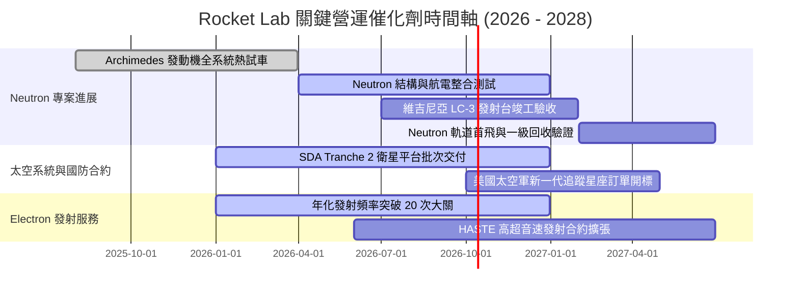

### 9.2 TAM 市場規模分析

```
╔══════════════════════════════════════════════════════════════╗
║              Rocket Lab 目標潛在市場 (TAM) 拓展路徑          ║
╠══════════════════════════════════════════════════════════════╣
║                                                              ║
║  [現有] 小型專屬發射 (Electron/HASTE):   $2.5B (滲透率 ~9%)   ║
║  ████░░░░░░░░░░░░░░░░░░░░░░░░░░░░░░░░░                       ║
║                                                              ║
║  [擴張] 太空系統與衛星零組件 (Components): $20.0B (滲透率 ~3%)║
║  ████████░░░░░░░░░░░░░░░░░░░░░░░░░░░░░                       ║
║                                                              ║
║  [未來] 中型星座發射與在軌服務 (Neutron): $100.0B+ (滲透率<1%)║
║  ████████████████████████████████████ 🚀 巨大未開拓空間     ║
║                                                              ║
║  📊 總 TAM 規模由 $2.5B 呈指數級躍升至 $120B+，支撐長線成長   ║
╚══════════════════════════════════════════════════════════════╝
```

### 9.3 成長驅動力結構圖

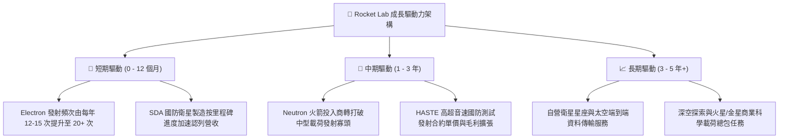

---

## 10. 風險矩陣

### 10.1 風險評分矩陣

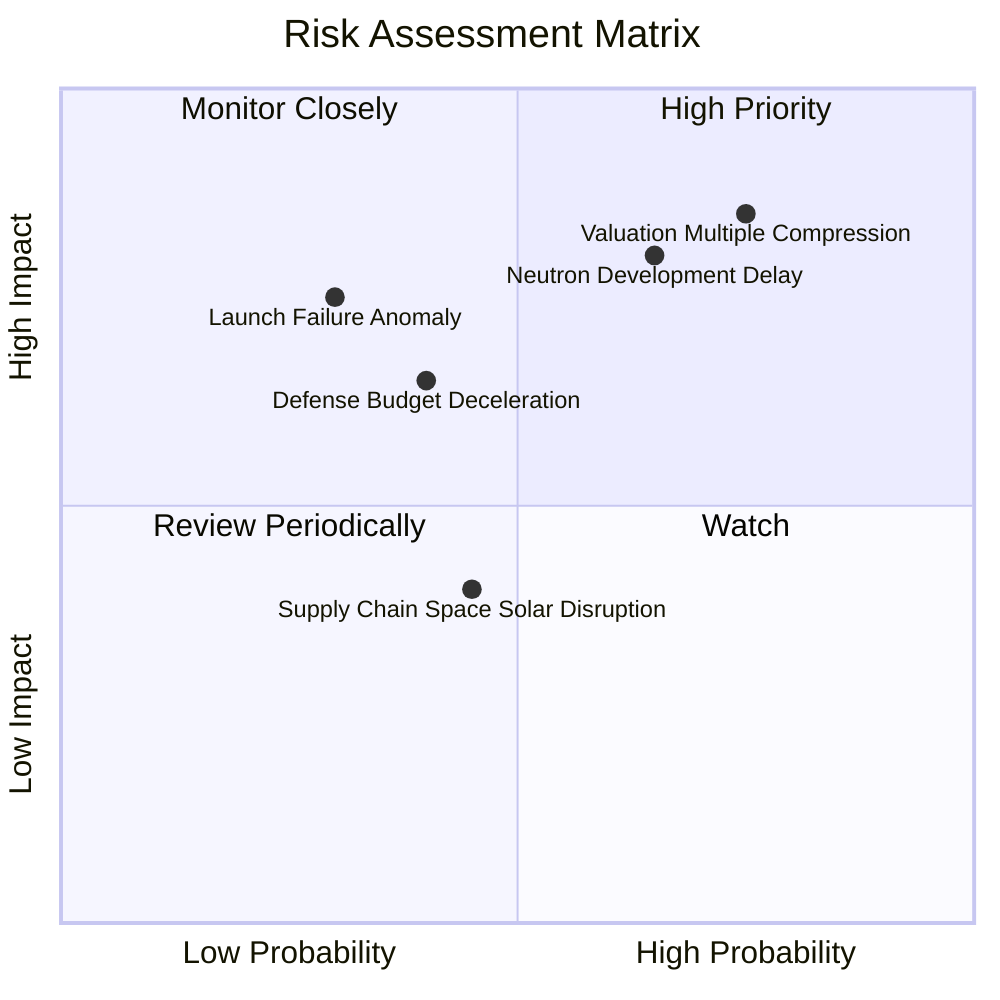

### 10.2 風險清單詳細分析

| # | 風險項目 | 發生機率 | 潛在財務衝擊 | 風險評分 | 緩解措施與對沖手段 |
|---|----------|----------|--------------|----------|--------------------|
| 1 | 🔴 **估值倍數劇烈收縮** | **高 (75%)** | **極高 (-40% 股價)** | **🔴 8.5 / 10** | 公司需維持 50%+ 營收增速以消化 EV/Sales 51x 溢價，投資人應嚴格控制持倉部位。 |
| 2 | 🔴 **Neutron 研發延遲或試飛失敗** | **中高 (65%)** | **高 (-$150M 現金消耗)** | **🔴 8.0 / 10** | 帳上 $2.30B 現金提供超過 3 年的安全資金跑道；Archimedes 發動機採保守分級燃燒設計降低風險。 |
| 3 | 🟡 **發射在軌異常與 FAA 停飛調查** | **中低 (30%)** | **中高 (-15% 發射營收)** | **🟡 6.5 / 10** | 雙發射場基建（紐西蘭與美國）分散單一發射台風險，以往停飛調查均在 6-8 週內迅速結案。 |
| 4 | 🟡 **美國國防部預算週期審批遲滯** | **中等 (40%)** | **中等 (-10% 太空系統營收)** | **🟡 5.8 / 10** | 積極拓展商業客戶（如 AST SpaceMobile、Amazon），降低對五角大廈單一營收來源的過度依賴。 |
| 5 | 🟢 **太陽能多接面晶圓供應鏈中斷** | **中等 (45%)** | **低 (-5% 毛利衝擊)** | **🟢 4.2 / 10** | SolAero 推進關鍵材料雙源供應策略，並加強戰略原物料安全庫存水位（存貨達 $267M）。 |

---

## 11. 投資建議

### 11.1 最終綜合評級雷達圖

```
╔══════════════════════════════════════════════════════════════╗
║              Rocket Lab 最終綜合評級雷達圖                   ║
╠══════════════════════════════════════════════════════════════╣
║                                                              ║
║  商業模式品質：  8.5 ▓▓▓▓▓▓▓▓▓▓▓▓▓▓▓▓▓░░░  發射+系統垂直整合 ║
║  營收成長動能：  9.0 ▓▓▓▓▓▓▓▓▓▓▓▓▓▓▓▓▓▓░░  TTM 營收成長 62%  ║
║  獲利轉正能力：  4.5 ▓▓▓▓▓▓▓▓▓░░░░░░░░░░░  研發投入壓抑利潤  ║
║  資產負債健康：  9.0 ▓▓▓▓▓▓▓▓▓▓▓▓▓▓▓▓▓▓░░  $2.17B 充沛淨現金 ║
║  估值安全邊際：  3.0 ▓▓▓▓▓▓░░░░░░░░░░░░░░  MOS 僅 3.7% 偏低  ║
║  護城河深度：    8.2 ▓▓▓▓▓▓▓▓▓▓▓▓▓▓▓▓░░░░  發射履歷與國防黏性║
║  管理層執行力：  8.5 ▓▓▓▓▓▓▓▓▓▓▓▓▓▓▓▓▓░░░  創辦人工程底蘊深厚║
╠══════════════════════════════════════════════════════════════╣
║  綜合總評分：    6.8 ▓▓▓▓▓▓▓▓▓▓▓▓▓░░░░░░░  🏆 投資評級：持有 ║
╚══════════════════════════════════════════════════════════════╝
```

### 11.2 目標價與隱含報酬率

| 情境 | 機率權重 | 12 個月目標價 | 潛在隱含報酬率 | 核心定價邏輯 |
|------|----------|---------------|----------------|--------------|
| 🔴 **悲觀情境 (Bear)** | 25% | **$38.00** | **-45.46%** | 退出倍數降至 15x EV/Sales，Neutron 進度推遲 |
| 🟡 **基準情境 (Base)** | 55% | **$75.00** | **+7.63%** | 25x EV/Sales，維持當前高估值，業務如期交付 |
| 🟢 **樂觀情境 (Bull)** | 20% | **$115.00** | **+65.04%** | 35x EV/Sales，Neutron 提前簽署星座大單引發投機狂熱 |
| **期望值加權目標價** | **100%** | **$73.75** | **+5.84%** | $\Sigma (\text{目標價} \times \text{機率})$ |

### 11.3 買入時機與觸發因素

```
╔══════════════════════════════════════════════════════════════════╗
║                  ✅ 投資決策 Checklist 與執行區間               ║
╠══════════════════════════════════════════════════════════════╣
║                                                                  ║
║  當前操作建議：【保持耐心，暫勿追高，以觀望持有為上】             ║
║                                                                  ║
║  立即買入觸發條件（需多數符合）：                                ║
║  ☐ 股價回檔至安全買入區間：$48.00 – $54.00（對應 MOS ≥ 25%）   ║
║  ☐ Archimedes 發動機完成全任務時長（Mission Duty Cycle）試車     ║
║  ☐ 單季營運現金流（OCF）由負轉正                                ║
║                                                                  ║
║  分批加碼觸發條件（出現以下任一）：                              ║
║  ☐ Neutron 獲取首個商業星座發射總包合約（> $200M 合約金額）     ║
║  ☐ 美國太空發展局（SDA）追加第三階段（Tranche 3）主合約         ║
║  ☐ 綜合毛利率突破 40.0% 大關                                    ║
║                                                                  ║
║  減碼 / 停損觸發條件（出現以下任一）：                           ║
║  ☐ Neutron 軌道首飛正式宣布延遲 12 個月以上                     ║
║  ☐ 核心發射任務發生災難性在軌爆炸導致停飛逾 6 個月               ║
║  ☐ 股價非理性暴漲突破 $90.00（透支 2030 年後所有基本面樂觀預期）║
╚══════════════════════════════════════════════════════════════╝
```

### 11.4 投資人適配度分析

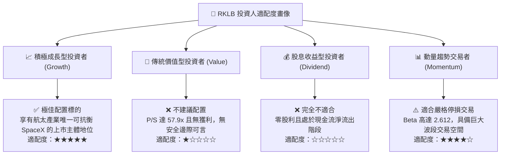

### 11.5 每季財報監控清單（Quarterly Watch List）

每次發布季報時，機構投資人應嚴格追蹤以下五大關鍵指標及對應門檻：

| 監控指標項目 | 最新基準值 (Q2 '26) | 觸發加碼門檻 (Bullish) | 觸發減碼/警戒門檻 (Bearish) |
|--------------|---------------------|------------------------|----------------------------|
| **季度營收 YoY 成長率** | 62.0% ($234.07M) | 持續維持 > 45.0% | 連續兩季滑落至 < 25.0% |
| **綜合毛利率 (Gross Margin)**| 37.3% | 突破擴張至 > 40.0% | 壓縮滑落至 < 30.0% |
| **研發開支佔營收比重** | 35.2% ($270.8M TTM) | 有序收斂至 25%-30% | 異常飆升至 > 50%（預算失控）|
| **自由現金流赤字 (FCF)** | $-251.96M (TTM) | 單季流出收窄至 < -$30M | 單季流出擴大至 > -$120M |
| **帳上現金與短投存量** | $2.30B | 維持在 > $1.80B 充沛水位 | 因虧損與並購跌破 < $1.00B |

### 11.6 反面論證：什麼會證明論點錯誤（What Would Change My Mind）

```
╔══════════════════════════════════════════════════════════════╗
║              ⚠️ 論點失效條件（Disconfirming Evidence）       ║
╠══════════════════════════════════════════════════════════════╣
║  本報告之「中性持有」評級在下列關鍵事實出現時將予以調整：     ║
║                                                              ║
║  【轉為全面看多（強力買入）的條件】：                        ║
║  1. 股價非理性下挫至 $48.00 以下，使加權合理價值的 MOS > 30% ║
║  2. Neutron 宣布完成全系統靜態點火並獲得 FAA 正式軌道試飛許可║
║  3. 太空系統業務獲取大型科技巨頭商業星座訂單（如 Amazon）   ║
║                                                              ║
║  【轉為全面看空（徹底賣出）的條件】：                        ║
║  1. 核心產品 Electron 火箭連續兩次發射失利，遭 FAA 長期停飛 ║
║  2. Archimedes 發動機出現重大設計缺陷需推倒重來，投產延至2029║
║  3. 管理層啟動新一輪大規模股權增發（ATM），大幅稀釋既有股東 ║
║  4. 營收 YoY 增速連續兩季跌破 20%，顯示市場需求天花板已至    ║
╚══════════════════════════════════════════════════════════════╝
```

---
> **免責聲明**：本報告係依據公開財務資訊與獨立基本面模型撰寫，僅供學術探討與機構研究參考，不構成任何針對個人財務狀況之實質投資建議、買賣要約或獲利保證。航太軍工產業具備高度技術研發風險與估值波動性，投資人應獨立承擔決策風險。