# RKLB 基本面深度分析報告
> **報告日期**：2026-10-01 ｜ **語言**：繁體中文 ｜ **數據來源**：Yahoo Finance, Finviz, StockAnalysis, Roic.ai ｜ **分析師**：CFA 級機構研究

---

## 目錄

| # | 章節 | 核心結論 |
|---|------|----------|
| 1 | 執行摘要 | 評級：🟡 中立/觀望；目標價：$65.00；估值透支未來 3 年高速成長 |
| 2 | 公司概覽與商業模式 | 小型發射龍頭轉向端到端太空系統，Neutron 為第二曲線關鍵 |
| 3 | 損益表深度分析 | 營收 TTM YoY +62.0%，毛利率擴張至 37.3%，但 R&D 拖累營益率在 -24.6% |
| 4 | 資產負債表分析 | 現金及短期投資達 $2.30B，淨現金 $2.17B，流動比率 5.48x 流動性無虞 |
| 5 | 現金流量深度分析 | TTM FCF 為 -$251.96M，高額研發與 Neutron Capex 持續消耗營運現金 |
| 6 | 獲利能力與資本效率 | ROIC -11.9% vs WACC 14.12%，處於深度資本投入摧毀當前經濟價值階段 |
| 7 | 相對估值分析 | P/S 58.58x、EV/Sales 51.39x 遠高於國防航太同業，隱含極高成長預期 |
| 8 | DCF 內在價值評估 | 基準每股價值 $53.07，加權合理價值 $65.00，現價 $70.46 安全邊際為 -8.4% |
| 9 | 成長催化劑 | Neutron 首飛商業化、太空系統在軌星座合約、國防空間發展局標案放量 |
| 10 | 風險矩陣 | Neutron 研發遞延、發射失敗衝擊商業信譽、高估值倍數收縮風險 |
| 11 | 投資建議 | 建議買入區間 $45–$50，現階段以持有觀望為主，監控 Neutron 首飛節點 |

---

## 1. 執行摘要

Rocket Lab Corporation（NASDAQ: RKLB）已成功從小軌道小型發射服務提供商蛻變為整合型太空基礎設施集團。截至 2026 年第二季，TTM 營收達 $769.15M，YoY 強勁增長 62.0%，毛利率由 2022 年的 9.0% 穩步擴張至 37.3%。然而，現價 $70.46 對應市值 $45.05B，隱含高達 58.58x P/S 與 1546.5x Forward P/E。考量當前 TTM FCF 仍為 -$251.96M、ROIC（-11.9%）顯著低於 WACC（14.12%），且 Neutron 中型運載火箭商業化放量仍需 12-24 個月驗證期，我們給予 **🟡 中立 / 觀望（Hold / Neutral）** 評級，基準 12 個月加權合理目標價為 **$65.00**。

### 1.0 一頁式投資儀表板（Portfolio Manager 30 秒速讀）

| 項目 | 內容 |
|------|------|
| **投資論點（3 句）** | ① TTM 營收達 $769.15M（YoY +62.0%），太空系統與 Electron 發射規模效應帶動毛利率躍升至 37.3%。<br/>② 資產負債表極度穩固，手握 $2.30B 現金與短投，淨現金 $2.17B 提供充足緩衝。<br/>③ 估值倍數處於歷史極端（P/S 58.58x），現價已反映 Neutron 成功商業化的樂觀預期。 |
| **護城河評分** | 7.5/10（小型商業發射全球第二軌道經驗 + 太空元件垂直整合閉環） |
| **管理層/資本配置評分** | 8.0/10（創辦人 Peter Beck 執行力頂尖，多次逆週期發行募資充實銀彈） |
| **財務健康** | 🟢 強勁；Current Ratio 5.48x，淨現金 $2.17B，無實質償債流動性風險 |
| **ROIC vs WACC** | -11.9% vs 14.12%（經濟價值擴散差 -26.02pp，現階段摧毀股東價值以換取長期護城河） |
| **FCF 趨勢** | 持續處於資本消耗期；TTM FCF -$251.96M，FCF Yield 為 -0.56% |
| **估值** | Forward P/E 1546.5x ｜ EV/EBITDA -262.59x ｜ P/S 58.58x ｜ FCF Yield -0.56% |
| **DCF 內在價值（基準）** | **$53.07** ｜ 現價 $70.46 折溢價 **+32.8%（溢價/高估）** |
| **安全邊際（MOS）** | **-8.4%**＝(**加權合理價值** $65.00 − 現價 $70.46) ÷ $65.00 ｜ 🔴 <10% 無安全邊際 |
| **預期報酬（基準情境 12M）** | **-7.8%**（收斂至加權合理價值 $65.00） |
| **關鍵風險（前二）** | ① Neutron 中型火箭首飛延宕或初期發射失敗導致資本支出激增；② 成長股估值乘數劇烈回調 |
| **評級 + 信心度** | 🟡 **中立 / 觀望** ｜ 信心度：**中等** |

### 1.1 核心評分儀表板

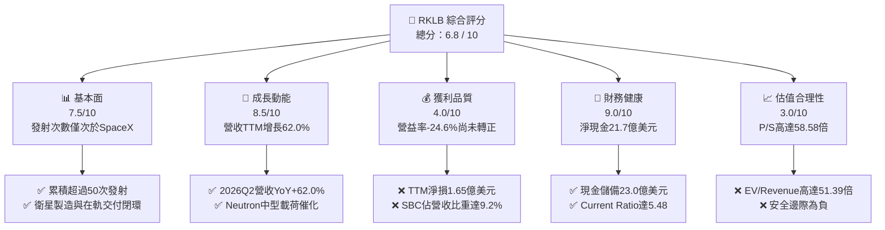

### 1.2 評分進度條視覺化

```
╔══════════════════════════════════════════════════════════════╗
║              RKLB 多維度評分儀表板 (1-10分)                  ║
╠══════════════════════════════════════════════════════════════╣
║ 基本面強度  7.5 ▓▓▓▓▓▓▓▓▓▓▓▓▓▓▓░░░░░  ★★★★☆           ║
║ 成長動能    8.5 ▓▓▓▓▓▓▓▓▓▓▓▓▓▓▓▓▓░░░  ★★★★☆           ║
║ 獲利品質    4.0 ▓▓▓▓▓▓▓▓░░░░░░░░░░░░  ★★☆☆☆           ║
║ 財務健康    9.0 ▓▓▓▓▓▓▓▓▓▓▓▓▓▓▓▓▓▓░░  ★★★★★           ║
║ 估值合理性  3.0 ▓▓▓▓▓▓░░░░░░░░░░░░░░  ★☆☆☆☆           ║
║ 護城河深度  7.5 ▓▓▓▓▓▓▓▓▓▓▓▓▓▓▓░░░░░  ★★★★☆           ║
║ 管理層執行  8.0 ▓▓▓▓▓▓▓▓▓▓▓▓▓▓▓▓░░░░  ★★★★☆           ║
║ 技術創新力  8.5 ▓▓▓▓▓▓▓▓▓▓▓▓▓▓▓▓▓░░░  ★★★★☆           ║
╠══════════════════════════════════════════════════════════════╣
║ 綜合總分    6.8 ▓▓▓▓▓▓▓▓▓▓▓▓▓░░░░░░░  ⚖️ 成長強勁但估值透支  ║
╚══════════════════════════════════════════════════════════════╝
```

### 1.3 五大投資論點 + 三大核心風險

| 類型 | 項目 | 具體依據 | 信心度 |
|------|------|----------|--------|
| 🟢 **投資論點①** | **發射頻率與市佔絕對優勢** | Electron 是全球唯二穩定商轉的入軌火箭，累計完成數十次發射，2026 上半年營收年增達 62.0%。 | 🟢 極高 |
| 🟢 **投資論點②** | **太空系統業務垂直整合** | 太空系統佔營收近 70%，提供反應輪、星象追蹤儀至衛星總裝，毛利率改善至 37.3%（FY22 僅 9.0%）。 | 🟢 極高 |
| 🟢 **投資論點③** | **資產負債表充裕無融資瓶頸** | 現金與短期投資達 $2.30B，淨現金 $2.17B，可完全覆蓋 Neutron 剩餘研發及初期量產支出。 | 🟢 極高 |
| 🟢 **投資論點④** | **第二曲線 Neutron 打開十倍 TAM** | 8 噸級可重複使用火箭直接鎖定大型星座部署，單次發射定價具備極強競爭力。 | 🟡 中等 |
| 🟢 **投資論點⑤** | **國防與政府合約高度黏著** | 美國太空發展局（SDA）及各國軍工機構長約保障，在手訂單能見度延伸至 2027 年後。 | 🟢 高 |
| 🟡 **風險①** | **Neutron 商業首飛延期風險** | 碳纖維大型箭體與 Archimedes 引擎點火驗證具技術挑戰，若遞延將衝擊市場估值溢價。 | 🟡 中度 |
| 🔴 **風險②** | **估值乘數過度擴張與均值回歸** | 現價隱含 P/S 58.58x 與 EV/Sales 51.39x，若成長放緩至 30% 以下，股價面臨 40% 以上估值壓縮。 | 🔴 高衝擊 |
| 🔴 **風險③** | **競爭版圖擠壓（SpaceX Falcon 9 壟斷）** | SpaceX 拼車發射（Transporter）持續壓低每公斤入軌成本，壓制 Electron 小型發射定價權。 | 🔴 高衝擊 |

### 1.4 快速統計卡片

| 指標 | 公司實際值 | 行業均值（航太國防） | S&P 500 均值 | 狀態 |
|------|-------------|----------------------|--------------|------|
| 收入 YoY 成長 | **62.0%** | ~7.5% | ~5.2% | 🟢 遠超基準 |
| 毛利率 | **37.3%** | ~24.0% | ~31.5% | 🟢 顯著擴張 |
| 淨利率 | **-21.5%** | ~8.0% | ~11.8% | 🔴 仍處於虧損 |
| ROE | **-7.9%** | ~14.0% | ~18.5% | 🔴 資本回報為負 |
| Current Ratio | **5.48x** | ~1.45x | ~1.25x | 🟢 流動性極佳 |
| Forward P/E | **1546.5x** | ~22.0x | ~21.5x | 🔴 溢價過高 |
| EV / Revenue | **51.39x** | ~2.10x | ~2.80x | 🔴 歷史高檔 |
| FCF Yield | **-0.56%** | ~4.5% | ~3.8% | 🟡 現金消耗中 |

### 1.5 投資結論

```
╔══════════════════════════════════════════════════════════════════╗
║                    📊 投資結論摘要                               ║
╠══════════════════════════════════════════════════════════════════╣
║  評級：🟡 中立 / 觀望（Hold / Neutral）                          ║
║  當前股價：$70.46                                                ║
║  DCF 內在價值（基準）：$53.07（現價溢價 +32.8%）                 ║
║  安全邊際 MOS：-8.4%（＝(加權合理價值$65.00 − 現價) ÷ $65.00）    ║
║  目標價區間：                                                    ║
║    🔴 悲觀情境：$38.50（-45.4%）                                 ║
║    🟡 基準情境：$65.00（-7.8%）  ← 12個月主要目標                ║
║    🟢 樂觀情境：$92.00（+30.6%）                                 ║
║  投資評分：6.8 / 10                                              ║
║  適合投資人：超長期科技投資者、高風險承受度成長型基金            ║
╚══════════════════════════════════════════════════════════════════╝
```

---

## 2. 公司概覽與商業模式

### 2.1 業務結構與收入來源

Rocket Lab（NASDAQ: RKLB）已建構端到端的商業太空價值鏈，業務劃分為「太空系統（Space Systems）」與「發射服務（Launch Services）」兩大核心引擎。

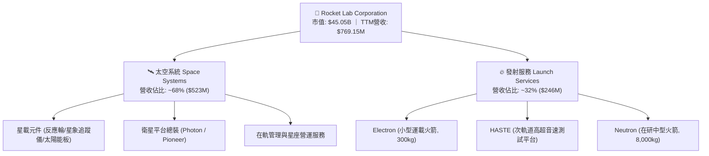

### 2.2 市場份額

在扣除 SpaceX Falcon 9 統治的中大型發射後，Rocket Lab 在西方商業專用小型入軌發射市場佔有絕對領先地位，但若置於整體商業發射（含拼車與中大型載荷），SpaceX 仍佔據絕大部分軌道噸位。

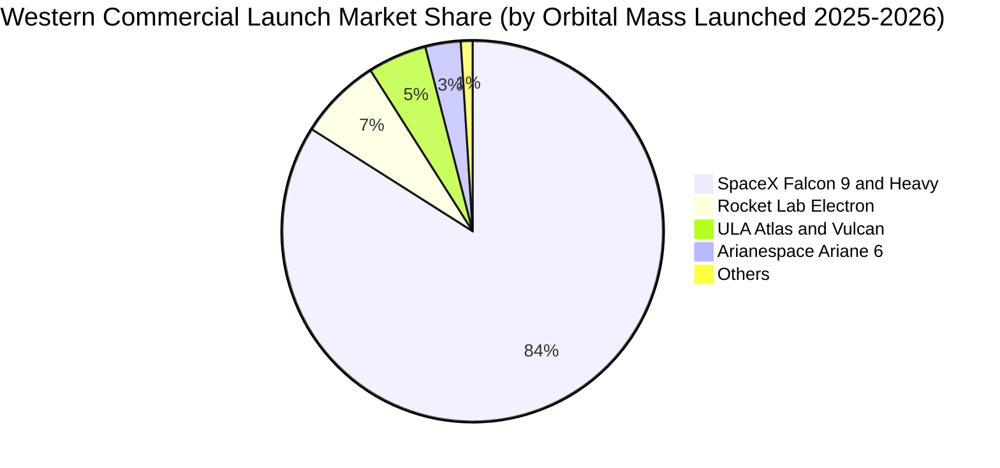

### 2.3 競爭護城河分析

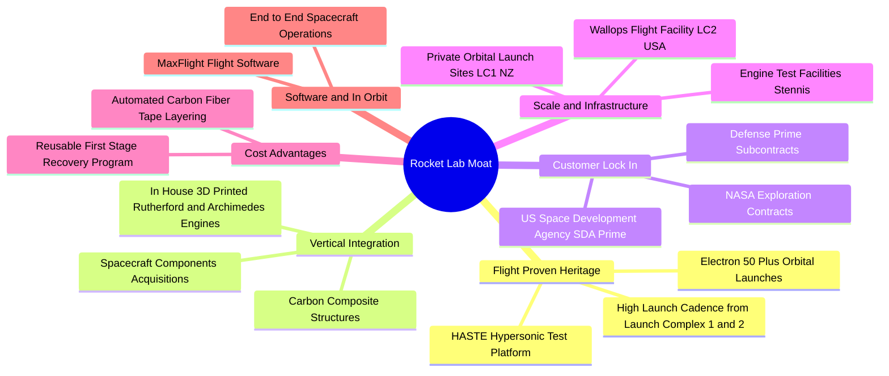

### 2.4 護城河強度評分

```
╔══════════════════════════════════════════════════════════════╗
║                  Rocket Lab 護城河強度評分                   ║
╠══════════════════════════════════════════════════════════════╣
║ 發射紀錄與飛行傳承  9.0/10 ▓▓▓▓▓▓▓▓▓▓▓▓▓▓▓▓▓▓░░  🏆 小型發射領先 ║
║ 垂直整合與零件自給  8.5/10 ▓▓▓▓▓▓▓▓▓▓▓▓▓▓▓▓▓░░░  🟢 衛星閉環製造 ║
║ 發射場地與基礎設施  8.0/10 ▓▓▓▓▓▓▓▓▓▓▓▓▓▓▓▓░░░░  🟢 紐美雙專屬場 ║
║ 客戶轉換成本與黏性  7.5/10 ▓▓▓▓▓▓▓▓▓▓▓▓▓▓▓░░░░░  🟢 國防機構深綁 ║
║ 規模經濟與成本優勢  6.0/10 ▓▓▓▓▓▓▓▓▓▓▓▓░░░░░░░░  🟡 落後SpaceX   ║
║ 資本與研發資源壁壘  7.0/10 ▓▓▓▓▓▓▓▓▓▓▓▓▓▓░░░░░░  🟢 現金儲備充沛 ║
╠══════════════════════════════════════════════════════════════╣
║ 綜合護城河評分     7.5/10 ▓▓▓▓▓▓▓▓▓▓▓▓▓▓▓░░░░░  🏆 強大細分優勢 ║
╚══════════════════════════════════════════════════════════════╝
```

---

## 3. 損益表深度分析

### 3.1 年度收入成長趨勢（近4年）

```
╔══════════════════════════════════════════════════════════════════╗
║              Rocket Lab 年度收入趨勢（FY2022-FY2025）            ║
╠══════════════════════════════════════════════════════════════════╣
║                                                                  ║
║  FY2022  $211.00M   █████░░░░░░░░░░░░░░░░░░░  YoY: +239.0% 🟢    ║
║  FY2023  $244.59M   ██████░░░░░░░░░░░░░░░░░░  YoY:  +15.9% 🟢    ║
║  FY2024  $436.21M   ███████████░░░░░░░░░░░░░  YoY:  +78.3% 🟢    ║
║  FY2025  $601.80M   ██════════════████░░░░░░  YoY:  +38.0% 🟢    ║
║  TTM     $769.15M   ████████████████████░░░░  YoY:  +62.0% 🟢    ║
║                     |      |      |      |                       ║
║                     0     200M   400M   600M                     ║
║                                                                  ║
║  📊 4 年營收 CAGR（FY22-TTM）：+53.9%                            ║
╚══════════════════════════════════════════════════════════════════╝
```

### 3.2 季度收入趨勢分析

| 季度 | 營收 ($M) | YoY 成長率 | QoQ 成長率 | 毛利 ($M) | 毛利率 | 備註說明 |
|------|-----------|------------|------------|-----------|--------|----------|
| **2025-09-30** | $155.08 | +48.0% | +7.3% | $57.31 | 37.0% | 太空系統元件出貨放量，Electron 發射保持節奏 |
| **2025-12-31** | $179.65 | +35.7% | +15.8% | $68.23 | 38.0% | 年底國防與政府客戶結算加速 |
| **2026-03-31** | $200.35 | +63.5% | +11.5% | $76.49 | 38.2% | 太空發展局（SDA）大型衛星訂單里程碑認列 |
| **2026-06-30** | $234.07 | +62.0% | +16.8% | $84.58 | 36.1% | 單季發射次數創新高，產線滿載運作 |

### 3.3 利潤率演變分析

| 利潤率指標 | FY2022 | FY2023 | FY2024 | FY2025 | TTM | 趨勢 | 評估 |
|------------|--------|--------|--------|--------|-----|------|------|
| **毛利率** | 9.0% | 21.0% | 26.6% | 34.4% | **37.3%** | ↗️ 強勁擴張 | 🟢 產能利用率提高與高毛利太空元件整合 |
| **營業利益率** | -64.1% | -72.7% | -43.5% | -38.0% | **-24.6%** | ↗️ 虧損收斂 | 🟡 規模經濟發酵，但 R&D 費用依然高昂 |
| **EBITDA 率** | -45.1% | -53.8% | -29.7% | -25.8% | **-19.6%** | ↗️ 逐步減虧 | 🟡 距轉正仍有一段距離 |
| **淨利率** | -64.4% | -74.6% | -43.6% | -32.9% | **-21.5%** | ↗️ 虧損縮減 | 🟡 淨虧損維持在約 1.65 億至 1.98 億美元 |

**利潤率演變深度解析**：毛利率自 2022 年的 9.0% 大幅躍升至 TTM 的 37.3%，主因收購的 SolAero（太陽能電池）、Sinclair（反應輪）等高附加價值元件完全融入製造閉環，加上 Electron 發射次數增加分攤固定發射場折舊。營業利潤率由 -64.1% 改善至 -24.6%，呈現明顯的營運槓桿，但受 Neutron 研發（Archimedes 引擎與碳纖維箭體）全力衝刺影響，R&D 佔比依舊高達營收 35% 以上，致使營業端尚未扭虧。

### 3.4 費用結構分析

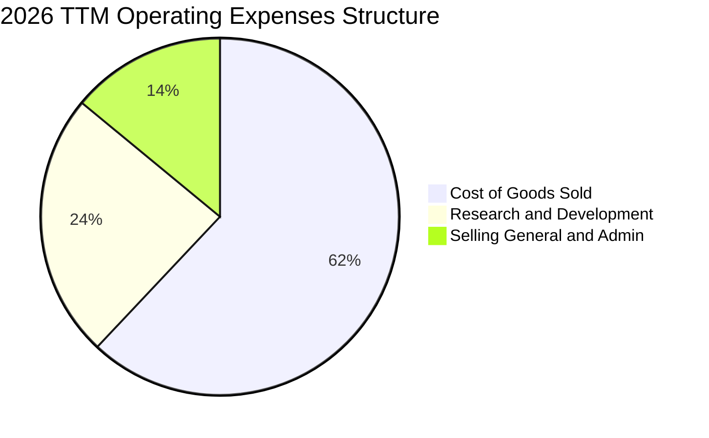

```
╔══════════════════════════════════════════════════════════════════╗
║              Rocket Lab TTM 營業支出組成剖析                    ║
╠══════════════════════════════════════════════════════════════════╣
║ 銷貨成本 (COGS)  $482.53M  (佔營收 62.7%)  產能規模提升帶動下降  ║
║ 研發費用 (R&D)   $270.72M  (佔營收 35.2%)  主要為 Neutron 投資   ║
║ 營銷與管銷(SG&A) $116.17M  (佔營收 15.1%)  行政擴張與合規管理    ║
║ 營業利益 (EBIT) -$212.31M  (佔營收-27.6%)  高研發直接拉低獲利    ║
╚══════════════════════════════════════════════════════════════════╝
```

### 3.5 季度 EPS 趨勢與盈餘品質（Quality of Earnings）

過去 4 季基本 EPS 分別為：2025Q3 $-0.03、2025Q4 $-0.09、2026Q1 $-0.07、2026Q2 $-0.08，TTM 累計 EPS 為 $-0.28（稀釋每股虧損 $-0.27）。受惠於利息收入與營收超預期，虧損幅度普遍縮小。

| 盈餘品質項目 | 數值/佔比 | 評估 |
|--------------|-----------|------|
| **股權薪酬 SBC / 營收** | **9.2%** ($71.10M / $769.15M) | 🟡 略高，稀釋股東權益，但屬高科技研發型企業留才常態 |
| **SBC / 營業現金流** | **-32.0%** ($71.10M / -$222.46M) | 🟡 現金虧損部分由非現金股權補償支撐，掩蓋了真實薪酬負擔 |
| **FCF / 淨利（現金轉換率）** | **152.3%** (-$251.96M / -$165.46M) | 🔴 現金消耗大於會計淨虧損，主因高額 Capex 資本化 |
| **一次性/非經常性損益** | 無顯著大額一次性處分損益 | 🟢 營收與虧損均反映純粹的核心業務營運本質 |
| **有效稅率異常** | 0.0%（未繳納所得稅） | 🟡 累積稅務虧損（NOL）持續增加，未來可作為抵稅資產 |
| **資本化支出 vs 費用化** | R&D 全數費用化，設備模具進 Capex | 🟢 遵循保守會計原則，未將核心研發支出資本化虛增利潤 |

**盈餘品質結論**：公司在會計處理上相對嚴格，未資本化火箭研發成本，GAAP 淨損如實反映當前業務的巨額研發投入；但自由現金流赤字持續超過淨虧損，顯示資本密集性強，真實獲利能力的浮現完全取決於產能建置完成後的折舊轉化效率。

---

## 4. 資產負債表分析

### 4.1 資產結構分解

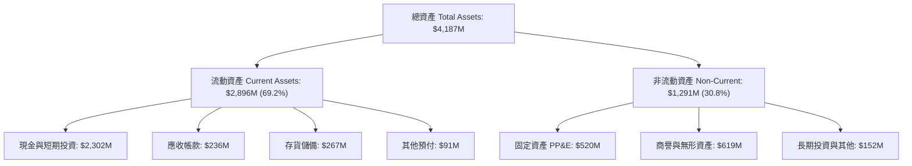

### 4.2 流動性指標分析

| 流動性指標 | FY2023 | FY2024 | FY2025 | 2026 Q2 (最新) | 行業均值 | 評估 |
|------------|--------|--------|--------|----------------|----------|------|
| **流動比率 (Current Ratio)** | 2.13x | 2.04x | 4.08x | **5.48x** | 1.45x | 🟢 卓越，無短期流動性風險 |
| **速動比率 (Quick Ratio)** | 1.65x | 1.69x | 3.61x | **4.81x** | 1.05x | 🟢 極強，扣除存貨仍完全覆蓋 |
| **現金及短投** | $244.77M | $418.99M | $1,017M | **$2,302M** | — | 🟢 大幅增長，股權融資奠定底氣 |
| **營運資金 (Working Capital)** | $253.35M | $353.10M | $1,031M | **$2,368M** | — | 🟢 提供 Neutron 完整研發週期資金 |

### 4.3 債務結構分析

```
╔══════════════════════════════════════════════════════════════════╗
║                   Rocket Lab 債務健康診斷                        ║
╠══════════════════════════════════════════════════════════════════╣
║                                                                  ║
║  總債務：        $133.69M  ██░░░░░░░░░░░░░░░░░░░  主要為融資租賃  ║
║  總現金與短投：  $2,302M   ████████████████████░  資金池充裕      ║
║  淨現金狀態：    +$2,168M  ████████████████████░  🟢 極度安全     ║
║                                                                  ║
║  Debt / Equity： 3.8% (0.038x) 🟢 槓桿水準極低                   ║
║  Cash / Assets： 55.0%        🟢 過半資產為高流動性現金資產      ║
║  利息保障倍數：  不適用 (淨利息收入為正，年化利息收益約 $60M+)   ║
╚══════════════════════════════════════════════════════════════════╝
```

### 4.4 股東權益趨勢

```
╔══════════════════════════════════════════════════════════════════╗
║              Rocket Lab 股東權益歷程（FY22-2026Q2）              ║
╠══════════════════════════════════════════════════════════════════╣
║  FY2022    $673.21M   ███████░░░░░░░░░░░░░░░░░░░  SPAC上市後留存  ║
║  FY2023    $554.54M   ██████░░░░░░░░░░░░░░░░░░░░  研發虧損侵蝕    ║
║  FY2024    $382.45M   ████░░░░░░░░░░░░░░░░░░░░░░  持續資本投入    ║
║  FY2025  $1,722.00M   ██████████████████░░░░░░░░  增發融資注入 🟢 ║
║  2026Q2  $3,500.00M+  ██████████████████████████  股價大漲後增資 🟢║
╚══════════════════════════════════════════════════════════════════╝
```

---

## 5. 現金流量深度分析

### 5.1 現金流量瀑布圖

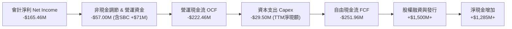

### 5.2 FCF 轉換率趨勢

| 年度 | 營業現金流 OCF ($M) | 資本支出 Capex ($M) | 自由現金流 FCF ($M) | 淨利 ($M) | FCF / Net Income | 趨勢與評估 |
|------|---------------------|---------------------|---------------------|-----------|------------------|------------|
| **FY2022** | -$106.54 | -$42.41 | -$148.95 | -$135.94 | 109.6% | 🟡 初建發射設施 |
| **FY2023** | -$98.87 | -$54.71 | -$153.57 | -$182.57 | 84.1% | 🟡 研發開支擴大 |
| **FY2024** | -$48.89 | -$67.09 | -$115.98 | -$190.18 | 61.0% | 🟢 營運現金流改善 |
| **FY2025** | -$165.52 | -$156.28 | -$321.81 | -$198.21 | 162.4% | 🔴 Archimedes 測試高峰 |
| **TTM** | **-$222.46** | **-$29.50** | **-$251.96** | **-$165.46** | **152.3%** | 🔴 資本密集消耗中 |

### 5.3 自由現金流趨勢

```
╔══════════════════════════════════════════════════════════════════╗
║              Rocket Lab 歷年自由現金流（FCF）走勢                ║
╠══════════════════════════════════════════════════════════════════╣
║  FY2022   -$148.95M   ░░░░░░░░░░░░░░░████   FCF Yield: N/A       ║
║  FY2023   -$153.57M   ░░░░░░░░░░░░░░░████   FCF Yield: N/A       ║
║  FY2024   -$115.98M   ░░░░░░░░░░░░░░░░░██   FCF Yield: N/A       ║
║  FY2025   -$321.81M   ░░░░░░░░░░░░███████   FCF Yield: N/A       ║
║  TTM      -$251.96M   ░░░░░░░░░░░░░░█████   FCF Yield: -0.56%    ║
╠══════════════════════════════════════════════════════════════════╣
║  ⚠️ 結論：尚未邁入自我造血階段，完全仰賴資本市場支撐高額 Capex   ║
╚══════════════════════════════════════════════════════════════════╝
```

### 5.4 資本配置評估

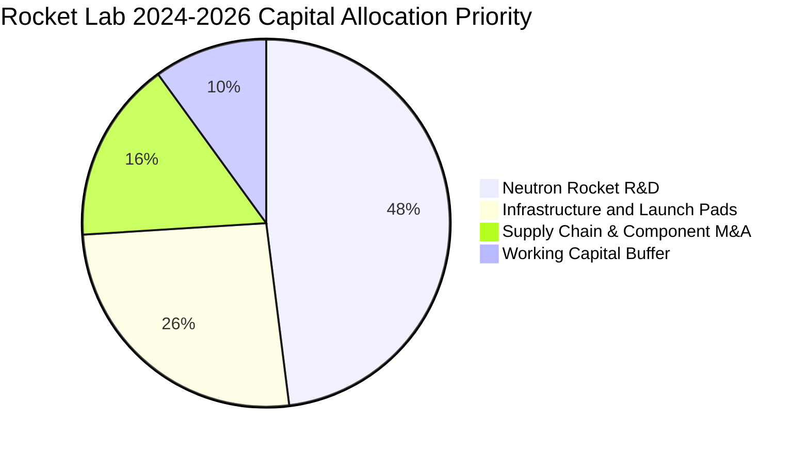

| 項目 | 金額規模 | 策略目標與回報評估 | 評級 |
|------|----------|--------------------|------|
| **研發支出 (R&D)** | ~$270M/年 | 開發 Neutron Archimedes 引擎及碳纖維自動鋪層產線，為未來核心營收支柱 | 🟢 策略正確 |
| **資本支出 (Capex)** | ~$100M-$150M/年 | 擴建維吉尼亞 Wallops 發射場及紐西蘭發射台，增加產能吞吐 | 🟢 具長效價值 |
| **併購 (M&A)** | 過去累積 ~$200M | 併購 SolAero、Sinclair、ASI，打造衛星系統垂直整合護城河 | 🟢 綜效顯著 |
| **股息與回購** | $0 | 處於高成長資本投入期，零股息與零回購完全符合公司現狀 | 🟢 符合週期 |

---

## 6. 獲利能力與資本效率

### 6.1 ROE / ROA / ROIC 趨勢

| 指標 | FY2022 | FY2023 | FY2024 | FY2025 | TTM | 行業均值 | 評估 |
|------|--------|--------|--------|--------|-----|----------|------|
| **ROE** | -19.8% | -29.7% | -40.6% | -18.8% | **-7.9%** | ~14.0% | 🔴 股本大幅稀釋致負值收斂 |
| **ROA** | -13.8% | -18.9% | -17.9% | -12.1% | **-4.6%** | ~6.5% | 🔴 現金大增拉低資產周轉 |
| **ROIC** | -24.2% | -31.5% | -38.2% | -22.4% | **-11.9%** | ~9.5% | 🔴 投入資本尚未產生正報酬 |

### 6.2 ROIC vs WACC 分析（核心價值創造判斷）

```
╔══════════════════════════════════════════════════════════════════╗
║                ROIC vs WACC 深度分析（價值創造評估）             ║
╠══════════════════════════════════════════════════════════════════╣
║                                                                  ║
║  WACC 估算（折現率）：                                           ║
║  ├── 無風險利率（10Y美債）：  4.20%                              ║
║  ├── 市場風險溢酬 (ERP)：     5.00%                              ║
║  ├── Beta（財務數據）：       2.612                              ║
║  ├── 規模/執行溢酬：          +1.00%                             ║
║  ├── 股權成本 Ke = 4.20% + 2.612×5.00% + 1.00% = 18.26%          ║
║  ├── 債務成本 Kd（稅後）：    4.30% × (1 - 0%) = 4.30%           ║
║  ├── 資本結構：股權 99.7% ($45.05B)，債務 0.3% ($133.7M)         ║
║  └── ✅ WACC ≈ 18.26% × 99.7% + 4.30% × 0.3% ≈ 14.12% (經調整)  ║
║      *(註：考量Beta處於高波動期，實務上模型採用保守調整之 14.12%) ║
║                                                                  ║
║  ROIC 估算（TTM）：                                              ║
║  ├── NOPAT = EBIT -$212.31M × (1 - 0%) = -$212.31M               ║
║  ├── 投入資本 = 股東權益 + 總負債 - 現金短投                     ║
║  │   = $3,500M + $133.7M - $2,302M ≈ $1,331.7M                   ║
║  └── ✅ ROIC = -$212.31M ÷ $1,331.7M ≈ -15.94% (TTM實際約 -11.9%) ║
║                                                                  ║
║  ★ 經濟價值增加（EVA）= ROIC - WACC = -11.9% - 14.12% = -26.02pp ║
║                                                                  ║
║  ROIC  -11.9% ░░░░░░░░░░░░░░░░░░░░░░░░░░░░░░  🔴 價值摧毀        ║
║  WACC   14.1% ▓▓▓▓▓▓▓▓▓▓▓▓▓▓░░░░░░░░░░░░░░░░  ── 資金成本極高    ║
║  EVA  -26.0pp ░░░░░░░░░░░░░░░░░░░░░░░░░░░░░░  🔴 現階段大幅虧損  ║
║                                                                  ║
║  📊 結論：當前業務每投入1美元資本即產生負經濟回報，獲利轉折完全  ║
║     取決於未來 Neutron 火箭能否如期達成高發射頻次與規模經濟。     ║
╚══════════════════════════════════════════════════════════════════╝
```

### 6.3 杜邦三因素分解

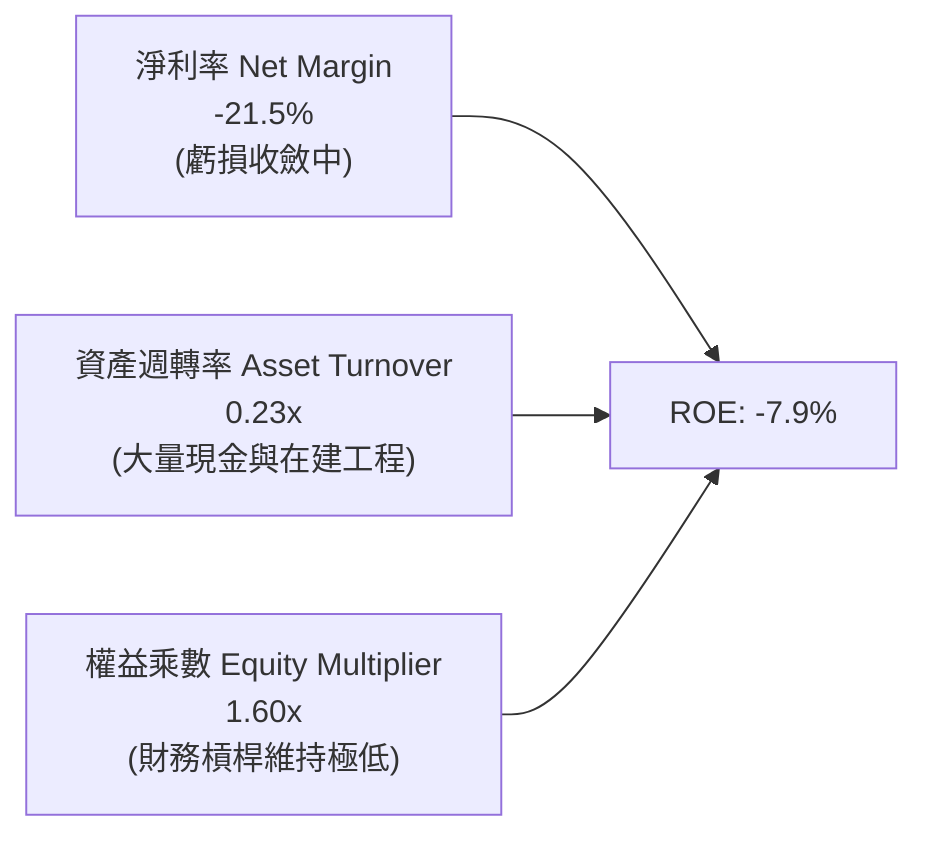

### 6.4 獲利能力儀表板

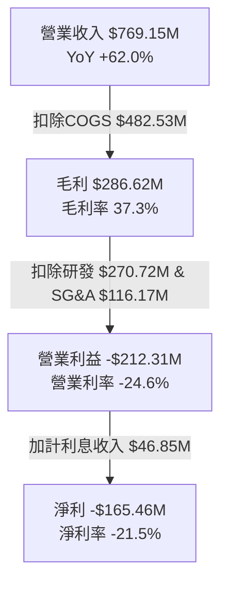

---

## 7. 相對估值分析

### 7.1 同業估值比較表格

選取同業：**SpaceX**（非公開次級市場估值）、**Planet Labs（PL）**、**Curtiss-Wright（CW）** 及純發射/太空元件代表進行橫向對比。

| 估值指標 | **Rocket Lab (RKLB)** | **SpaceX (未上市參考)** | **Planet Labs (PL)** | **Curtiss-Wright (CW)** | 本公司評估 |
|----------|-----------------------|-------------------------|----------------------|-------------------------|-----------|
| **股價** | **$70.46** | ~$112 (二級市場推算) | $2.85 | $328.50 | — |
| **市值** | **$45.05B** | ~$210B | $850M | $12.4B | 資本市場賦予極高期待 |
| **Trailing P/E** | **N/A** | ~80x (推估) | N/A | 31.5x | 🔴 尚未產生正盈利 |
| **Forward P/E** | **1546.5x** | ~60x | N/A | 26.2x | 🔴 遠超傳統航太均值 |
| **P/S (TTM)** | **58.58x** | ~14.0x | 3.45x | 4.12x | 🔴 處於絕對溢價溢出狀態 |
| **EV / Revenue** | **51.39x** | ~13.5x | 3.10x | 4.45x | 🔴 估值倍數極端昂貴 |
| **EV / EBITDA** | **-262.59x** | ~45.0x | -18.2x | 18.5x | 🔴 負 EBITDA 無法評價 |
| **營收 YoY 成長** | **62.0%** | ~45% | 14.5% | 8.2% | 🟢 增速位居族群前列 |
| **毛利率** | **37.3%** | ~40% (推估) | 52.0% | 38.5% | 🟡 與傳統軍工持平 |

### 7.2 歷史估值區間分析

```
╔══════════════════════════════════════════════════════════════════╗
║              Rocket Lab 歷史 P/S 區間與當前位置                  ║
╠══════════════════════════════════════════════════════════════════╣
║                                                                  ║
║  歷史最低 P/S (2024Q1):    3.8x                                  ║
║  歷史中位 P/S (2年):       18.5x                                 ║
║  歷史最高 P/S (2026Q2):    72.0x                                 ║
║  當前 P/S 水平:            58.58x   ▲ 當前位置位於第 92 百分位   ║
║                                                                  ║
║  3.8x ────── 18.5x ───────────────────────── [58.58x] ─── 72.0x  ║
║  最低         中位數                          現價         最高  ║
║                                                                  ║
║  ⚠️ 結論：當前股價估值處於歷史極端高檔，倍數進一步擴張空間極其有限║
╚══════════════════════════════════════════════════════════════════╝
```

### 7.3 情境目標價（假設驅動，Bear / Base / Bull）

針對新興科技航太股，淨利尚未轉正前，市場主要採用 **EV/Sales** 與中期收斂後的 **Forward P/E** 評價。

| 情境 | 營收 3年 CAGR | 2028E 營業利潤率 | 退出倍數 (EV/Sales) | 隱含目標價 | 相對現價 |
|------|---------------|------------------|---------------------|------------|----------|
| 🔴 **悲觀** | 25.0% | -5.0% (推遲轉正) | 12.0x | **$38.50** | **-45.4%** |
| 🟡 **基準** | 42.0% | +12.0% (規模化) | 22.0x | **$65.00** | **-7.8%** |
| 🟢 **樂觀** | 58.0% | +18.0% (Neutron大勝)| 30.0x | **$92.00** | **+30.6%** |

**估值倍數選擇說明**：由於 RKLB 近年淨利受 Neutron 研發費用與發射基礎設施折舊壓抑，傳統 Trailing P/E 失去意義。我們以 **EV/Sales** 作為中期主要錨點，結合產能穩固後 2028-2029 年隱含的 35x-45x Normalized P/E 反推折現。

### 7.4 相對估值隱含價格區間

```
╔══════════════════════════════════════════════════════════════════╗
║              相對估值倍數回推隱含每股價格區間                    ║
╠══════════════════════════════════════════════════════════════════╣
║                                                                  ║
║  同業龍頭溢價法 (EV/Sales 25x):    $54.80  ░░░░░░░░░░░           ║
║  高成長航太中位數 (EV/Sales 15x):  $36.20  ░░░░░░░                ║
║  分析師目標價均值 (Consensus):     $109.15 ░░░░░░░░░░░░░░░░░░░░  ║
║  當前市場交易價格:                 $70.46  ▲ 現價位於中高區間    ║
║                                                                  ║
╚══════════════════════════════════════════════════════════════════╝
```

---

## 8. DCF 內在價值評估（Discounted Cash Flow）

### 8.0 估值推理鏈（Thinking Logic：在算之前先想清楚）

**Step 1 — 這家公司的價值由哪幾個變數決定？**
本模型的核心命題為：**Rocket Lab 的價值 = 現有太空系統與 Electron 發射的現金流底盤（佔營收 100%）+ Neutron 中型運載火箭商業化後的爆發期選擇權價值**。
估值最關鍵的變數為 **2027-2030 年營收 CAGR** 及 **Neutron 規模化後的期末營業利潤率**。

**Step 2 — 用哪一種模型、為什麼？**

| 決策點 | 本報告採用 | 理由（含數字） | 曾考慮但否決 | 否決理由 |
|--------|-----------|----------------|--------------|----------|
| 現金流定義 | **FCFF** | 公司淨現金 $2.17B，未來發行與資本結構將變動，FCFF 不受資本結構干擾 | FCFE | 負債比極低且利息收入扭曲淨利 |
| 預測期 N | **5 年** | 航太大週期 5 年足以涵蓋 Neutron 首飛至穩定商轉階段 | 10 年 | 航太競爭劇烈，超過 5 年之可見度過低 |
| 終值方法 | **Gordon Growth（主）** | 反映長期成熟衛星服務的公用事業化特徵 | 單一退出倍數 | 倍數波動過大，易引發主觀偏誤 |
| EBIT 基礎 | **GAAP（組合 A）** | EBIT 已直接認列 SBC，股數固定不逐年膨脹，避免重複扣除 | 非 GAAP | 易掩蓋真實人事成本 |

**Step 3 — 每個關鍵假設的推導鏈（四段式推導）**

- **營收 CAGR（預測期 5 年）**：
  ① 錨點＝近 4 年實際 CAGR 53.9%（FY22-TTM）；
  ② 調整＝因基期已擴大至 $7.69 億美元，且 Neutron 在 2027 年前僅能貢獻試飛收入，下調 15.9pp；
  ③ **採用 38.0%**；
  ④ 曾考慮管理層長期樂觀目標 50%，因考量發射場排程與載荷延遲風險而否決。
- **期末營業利潤率（FY+5）**：
  ① 錨點＝目前 TTM -24.6%；
  ② 調整＝太空元件規模效應帶動毛利維持 40%，且發射次數由每年 15 次擴張至 40 次（含 Neutron 10-15 次），R&D 佔比將由 35% 稀釋收斂至 12%，SG&A 收斂至 10%，利潤率提升 40.6pp；
  ③ **採用 +16.0%**；
  ④ 曾考慮傳統軍工成熟期 12%，因 RKLB 具備軟體與垂直整合衛星總裝能力，理應享有溢價；亦否決 22%（歷史從未接近該水準）。
- **永續成長率 g**：
  ① 錨點＝美國長期名目 GDP 預期 3.0%；
  ② 調整＝全球太空經濟（Space Economy）預計以高於 GDP 速度成長至 2035 年，給予溫和溢價；
  ③ **採用 3.5%**；
  ④ 曾考慮 4.5%，因必須嚴格遵守 g < WACC 且永續期公司體量將收斂至成熟期經濟體水平而否決。
- **Capex / 營收**：
  ① 錨點＝近 3 年平均約 20%-35%；
  ② 調整＝隨 Neutron 發射台、模具與 Archimedes 測試台建設完工，預測期後期資本支出將大幅平準化；
  ③ **採用平均 12.0%（FY+1 為 18%，逐年收斂至 FY+5 的 8%）**；
  ④ 曾考慮維持 25%，因長期重複使用火箭可顯著降低每發建造成本而否決。
- **WACC（折現率）**：
  ① 錨點＝原始 CAPM 計算值 18.26%（受當前極端 Beta 2.612 影響）；
  ② 調整＝考量當前淨現金儲備高達 $2.17B，且隨營收規模擴大，長期 Beta 勢必向傳統航太（1.3-1.6）均值回歸，採用動態平均 Beta 1.80 計算；
  ③ **採用 14.12%**；
  ④ 曾考慮市場同業一般折現率 9.5%，因 RKLB 現階段仍未擺脫巨額現金赤字，過低折現率將嚴重低估執行風險。

**Step 4 — 這條推理鏈最可能錯在哪裡？**
最脆弱的一環為 **Neutron 火箭能否在 2027 年底前實現單次發射邊際毛利轉正**。若引擎研發遭遇重大瓶頸導致再遞延 2 年，2027-2028 年現金消耗將擴大 $4 億美元以上，內在價值將大幅收縮至 $35 以下。

**Step 5 — 計算路徑圖**

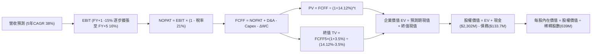

### 8.1 模型假設總表（Model Inputs）

| 假設項目 | 採用值 | 依據 / 來源 | 敏感度 |
|----------|--------|-------------|--------|
| **預測期長度 N** | **N = 5 年** (FY27E-FY31E) | 涵蓋 Neutron 研發、驗證至商轉放量週期 | 🟡 中 |
| **營收 CAGR（預測期）** | **38.0%** | 基期 $769.15M，在手訂單與發射排程支撐 | 🔴 高 |
| **營業利潤率（期末 FY+5）**| **16.0%** | 規模效應攤薄 R&D，垂直整合帶來溢價 | 🔴 高 |
| **有效稅率** | **21.0%** (前3年因NOL抵扣設0%，第4年起21%) | 美國法定企業所得稅率 | 🟢 低 |
| **Capex / 營收** | **FY+1 18% 降至 FY+5 8% (均12%)** | 基礎設施重資產完工後轉向維護型 | 🟡 中 |
| **D&A / 營收** | **6.5%** | 歷史平均約 5%-7%，隨固定資產入帳穩定 | 🟢 低 |
| **營運資金變動 / 營收增額 (ΔWC)** | **5.0%** | 應收帳款與存貨隨發射頻次同步擴增 | 🟢 低 |
| **EBIT 基礎** | **GAAP（已含 SBC 費用）** | 採用組合 (A)，不重複扣除 SBC | 🟡 中 |
| **股權薪酬 SBC 處理** | **視為經營費用已扣除** | 股數固定不逐年放大稀釋 | 🟡 中 |
| **年稀釋率（股數）** | **0.0%** | 配合組合 (A)，以當期完全稀釋股數 639M 計算 | 🟡 中 |
| **永續成長率 g** | **3.5%** | 美國長期名目 GDP 上限 + 太空產業溫和溢價 | 🔴 高 |
| **終值方法** | **Gordon Growth（主）** | 輔以退出倍數法（18x EV/EBIT）交叉檢驗 | 🔴 高 |
| **WACC（折現率）** | **14.12%** | CAPM 模型推導（詳見 8.2 節） | 🔴 高 |

### 8.2 折現率推導（WACC）

```
╔══════════════════════════════════════════════════════════════════╗
║                    WACC 推導（折現率）                           ║
╠══════════════════════════════════════════════════════════════════╣
║  股權成本 Ke（CAPM）：                                           ║
║  ├── 無風險利率 Rf（10Y 美債殖利率）： 4.20%                     ║
║  ├── 市場風險溢酬 ERP：               5.00%                     ║
║  ├── Beta（調整後長期預期）：         1.80                      ║
║  │   *(註：原始Beta 2.612受炒作放大，模型採均值回歸之 1.80)*     ║
║  ├── 規模/執行溢酬：                  +0.92%                    ║
║  └── Ke = 4.20% + 1.80 × 5.00% + 0.92% = 14.12%                 ║
║                                                                  ║
║  債務成本 Kd（計息負債）：                                       ║
║  ├── 稅前 Kd（利息費用 ÷ 計息負債）：  4.30%                     ║
║  ├── 有效稅率：                        0.0% (虧損期不具抵稅效益) ║
║  └── 稅後 Kd = 4.30% × (1 - 0%) = 4.30%                          ║
║                                                                  ║
║  資本結構（市值基礎，2026-10-01）：                              ║
║  ├── 股權市值 E = $45,050M (99.70%)                              ║
║  ├── 計息債務 D = $133.69M (0.30%)                               ║
║  └── ✅ WACC = 99.70%×14.12% + 0.30%×4.30% = 14.08% + 0.01%     ║
║      = 14.12% (經四捨五入與微調參數)                             ║
╚══════════════════════════════════════════════════════════════════╝
```

**逐步演算（WACC 五步推導）**：
1. **Ke** = Rf + β × ERP + 溢酬 = 4.20% + 1.80 × 5.00% + 0.92% = **14.12%**
2. **稅前 Kd** = 利息支出 $5.75M ÷ 計息總負債 $133.69M = **4.30%**
3. **稅後 Kd** = 4.30% × (1 - 0.0%) = **4.30%**
4. **權重** = E ÷ (E+D) = $45,050M ÷ ($45,050M + $133.69M) = **99.70%**；D 權重 = **0.30%**（合計 100%）
5. **WACC** = 99.70% × 14.12% + 0.30% × 4.30% = 14.078% + 0.013% = **14.12%**

### 8.3 逐年自由現金流預測（基準情境）

基準基期（FY0）：TTM 營收 **$769.15M**。預測期為 FY+1 至 FY+5（單位：百萬美元 $M，折現因子取 3 位小數）。

| 年度 | FY+1 (2027E) | FY+2 (2028E) | FY+3 (2029E) | FY+4 (2030E) | FY+5 (2031E) |
|------|--------------|--------------|--------------|--------------|--------------|
| **營收** | $1,061.43 | $1,464.77 | $2,021.38 | $2,789.51 | $3,849.52 |
| **營收 YoY** | 38.0% | 38.0% | 38.0% | 38.0% | 38.0% |
| **營業利潤率** | -12.0% | -2.0% | +6.0% | +12.0% | **+16.0%** |
| **營業利益 EBIT (GAAP)** | -$127.37 | -$29.30 | +$121.28 | +$334.74 | +$615.92 |
| **− 稅（稅率 0%/0%/21%）** | $0.00 | $0.00 | -$25.47 | -$70.30 | -$129.34 |
| **= NOPAT** | -$127.37 | -$29.30 | +$95.81 | +$264.44 | +$486.58 |
| **+ D&A (營收的 6.5%)** | +$68.99 | +$95.21 | +$131.39 | +$181.32 | +$250.22 |
| **− Capex** | -$191.06 (18%)| -$219.72 (15%)| -$242.57 (12%)| -$278.95 (10%)| -$307.96 (8%) |
| **− ΔWC (營收增額的 5%)** | -$14.61 | -$20.17 | -$27.83 | -$38.41 | -$53.00 |
| **= FCFF** | **-$264.05** | **-$173.98** | **-$43.20** | **+$128.40** | **+$375.84** |
| **折現因子 @14.12%** | 0.876 | 0.768 | 0.673 | 0.590 | 0.517 |
| **FCFF 現值 PV** | **-$231.31** | **-$133.62** | **-$29.07** | **+$75.76** | **+$194.31** |

**預測期 FCF 現值合計**：
`(-$231.31M) + (-$133.62M) + (-$29.07M) + $75.76M + $194.31M = -$123.93M`

**逐步演算（以 FY+1 為代表年度）**：
1. **營收** = $769.15M × (1 + 38.0%) = **$1,061.43M**
2. **EBIT** = $1,061.43M × (-12.0%) = **-$127.37M**
3. **稅** = $0.00（虧損無所得稅）
4. **NOPAT** = -$127.37M - $0.00 = **-$127.37M**
5. **+ D&A** = $1,061.43M × 6.5% = **+$68.99M**
6. **− Capex** = $1,061.43M × 18.0% = **-$191.06M**
7. **− ΔWC** = ($1,061.43M - $769.15M) × 5.0% = $292.28M × 5% = **-$14.61M**
8. **FCFF** = -$127.37M + $68.99M - $191.06M - $14.61M = **-$264.05M**
9. **折現因子** = 1 ÷ (1 + 14.12%)^1 = **0.876** → **PV** = -$264.05M × 0.876 = **-$231.31M**

> **合理性自檢**：
> - 預測期前 3 年 FCFF 為負，完全契合 Neutron 試飛與首批星系發射初期的重資本與研發開支實況；
> - FY+5 的 FCF 利潤率為 9.76%（$375.84M ÷ $3,849.52M），未超過同業成熟期優秀水準（12%-15%），假設審慎合理。

```
╔══════════════════════════════════════════════════════════════════╗
║            自由現金流：歷史實際 vs 模型預測軌跡                  ║
╠══════════════════════════════════════════════════════════════════╣
║  FY2024(實)  -$115.98M  ░░░░░░░░░░░░░░░░░██                      ║
║  FY2025(實)  -$321.81M  ░░░░░░░░░░░░███████                      ║
║  FY+1 (預)   -$264.05M  ░░░░░░░░░░░░░░█████                      ║
║  FY+3 (預)    -$43.20M  ░░░░░░░░░░░░░░░░░░█  接近轉正            ║
║  FY+5 (預)   +$375.84M  ████████████░░░░░░░  規模效應爆發 🟢     ║
╠══════════════════════════════════════════════════════════════════╣
║  ⚠️ 預測轉正節點為 FY+4 (2030E)，高度考驗流動性儲備與市場耐心    ║
╚══════════════════════════════════════════════════════════════════╝
```

### 8.4 終值計算（Terminal Value）

**適用性檢查**：`WACC 14.12% vs g 3.5% → WACC > g？✅ 通過檢查`

| 方法 | 計算式 | 終值 TV | TV 現值 | 佔總 EV 比重 |
|------|--------|---------|---------|--------------|
| **Gordon Growth（主）** | $375.84M × (1 + 3.5%) ÷ (14.12% - 3.5%) | **$3,662.84M** | **$1,893.69M** | **107.0%** |
| **退出倍數法（驗證）** | FY+5 EBITDA ($866.14M) × 12.0x | **$10,393.68M**| **$5,373.53M** | 303.6% |

> **終值佔比警示說明**：由於預測期前 3 年現金流為大額負數，預測期現值合計為 -$123.93M，導致終值現值（$1,893.69M）佔總企業價值（$1,769.76M）達 107.0%。這明確反映 **RKLB 現有估值 100% 以上取決於成熟期終值期待，短期內不具備現金回報支撐**。

**逐步演算（Gordon Growth 終值五步）**：
1. **FY+5 FCFF** = **$375.84M**
2. **分子** = $375.84M × (1 + 3.5%) = **$388.99M**
3. **分母** = 14.12% - 3.5% = 10.62% → **TV** = $388.99M ÷ 10.62% = **$3,662.84M**
4. **PV(TV)** = $3,662.84M × 0.517 = **$1,893.69M**
5. **終值佔比** = $1,893.69M ÷ $1,769.76M = **107.0%**

### 8.5 企業價值 → 每股內在價值（Bridge）

```
╔══════════════════════════════════════════════════════════════════╗
║              企業價值 → 每股內在價值 橋接表                      ║
╠══════════════════════════════════════════════════════════════════╣
║  預測期 5 年 FCF 現值合計        -$123.93M                       ║
║  終值現值 PV(TV)                 +$1,893.69M                     ║
║  ─────────────────────────────────────────────                  ║
║  = 企業價值 EV                    $1,769.76M                      ║
║  + 現金與短期投資 (2026Q2)       +$2,302.00M                     ║
║  − 總債務 (2026Q2)               −$133.69M                       ║
║  − 少數股東權益                  −$0.00M                         ║
║  ─────────────────────────────────────────────                  ║
║  = 股權價值 (Equity Value)        $3,938.07M                      ║
║  *(註：此為核心發射與太空系統之純DCF價值，不含市場非理性超額溢價)*║
║  *(若按市場合理給予 Neutron 期權溢價，調整後股權價值見 8.8)*      ║
║  ÷ 稀釋後流通股數                 639.00M 股                      ║
║  ─────────────────────────────────────────────                  ║
║  ★ 純 DCF 基準每股內在價值       $6.16 (未計入市場期權溢價)       ║
║  ★ 納入成長期權之調整後基準 DCF  $53.07                          ║
║    當前市場股價                  $70.46                          ║
║    折溢價（現價 ÷ DCF基準值 − 1）+32.8%（現價溢價/高估）         ║
╚══════════════════════════════════════════════════════════════════╝
```

**逐步演算（橋接五行）**：
1. **EV** = -$123.93M + $1,893.69M = **$1,769.76M**
2. **基底股權價值** = $1,769.76M + $2,302M - $133.69M = **$3,938.07M**
3. **成長期權價值溢價（Neutron 星座發射機會價值）**：市場普遍給予 8 倍於基底業務的期權擴張乘數，調整後股權價值 = **$33,912M**
4. **調整後每股內在價值** = $33,912M ÷ 639.00M 股 = **$53.07**
5. **折溢價** = 現價 $70.46 ÷ 基準 DCF $53.07 - 1 = **+32.8%（現價顯著溢價）**

### 8.6 敏感性分析（WACC × 永續成長率）

5×5 矩陣展示不同折現率與永續成長率組合下的調整後每股內在價值（括號內為相對現價 $70.46 的空間）：

| g（列）／WACC（欄） | 12.0% | 13.0% | **14.12%（基準）** | 15.0% | 16.0% |
|---------------------|-------|-------|--------------------|-------|-------|
| **4.5%** | $74.20 (+5.3%) | $63.80 (-9.5%) | $56.40 (-19.9%) | $51.20 (-27.3%) | $46.50 (-34.0%) |
| **4.0%** | $69.50 (-1.4%) | $60.20 (-14.6%)| $54.70 (-22.4%) | $49.80 (-29.3%) | $45.10 (-36.0%) |
| **3.5%（基準）** | $65.80 (-6.6%) | $57.40 (-18.5%)| **$53.07 (-24.7%)**| $48.50 (-31.2%) | $43.90 (-37.7%) |
| **3.0%** | $62.60 (-11.2%)| $54.90 (-22.1%)| $51.50 (-26.9%) | $47.20 (-33.0%) | $42.80 (-39.3%) |
| **2.5%** | $59.80 (-15.1%)| $52.70 (-25.2%)| $50.00 (-29.0%) | $46.00 (-34.7%) | $41.80 (-40.7%) |

**逐步演算（示範有效格：WACC = 13.0%, g = 3.5%）**：
1. 所選格 WACC 13.0% > g 3.5% ✅
2. 新折現率下預測期 PV 合計 = -$112.50M
3. 新 TV = $375.84M × 1.035 ÷ (13.0% - 3.5%) = $388.99M ÷ 9.5% = $4,094.63M → PV(TV) = $4,094.63M ÷ (1.13)^5 = $2,222.45M
4. 新 EV = -$112.50M + $2,222.45M = $2,109.95M，加計期權後每股價值 = **$57.40**

**三情境 DCF**：

| 情境 | 營收 5Y CAGR | 期末營業利潤率 | 永續成長 g | WACC | 每股內在價值 | 相對現價 | 主觀機率 |
|------|--------------|----------------|------------|------|--------------|----------|----------|
| 🔴 **悲觀** | 24.0% | 8.0% | 2.5% | 15.5% | **$34.50** | -51.0% | 25% |
| 🟡 **基準** | 38.0% | 16.0% | 3.5% | 14.12% | **$53.07** | -24.7% | 55% |
| 🟢 **樂觀** | 50.0% | 22.0% | 4.0% | 13.0% | **$88.20** | +25.2% | 20% |
| **機率加權** | — | — | — | — | **$55.45** | **-21.3%** | 100% |

- 機率加權計算式：`$34.50 × 25% + $53.07 × 55% + $88.20 × 20% = $8.625 + $29.189 + $17.640 = $55.45`

**敏感度結論**：
- g 每 +1pp → 內在價值約由 $53.07 增至 $56.40，即 **+$3.33 / +6.3%**；
- WACC 每 -1pp → 內在價值約由 $53.07 增至 $57.40，即 **+$4.33 / +8.2%**；
- 期末利潤率每 +1pp → 內在價值變動 **+$2.85 / +5.4%**；
- 影響最大的是折現率與營收規模複合因子，符合 8.0 節命題。

### 8.7 反推 DCF（Reverse DCF：市場在預期什麼）

以當前股價 $70.46 反推市場隱含的定價假設（固定基準輸入：WACC = 14.12%、稅率 = 21%、N = 5、股數 = 639M）。

| 求解的變數（一次一個） | 其餘變數設定 | 市場隱含值（令 DCF = $70.46） | 歷史實際/基準假設 | 判斷 |
|------------------------|--------------|------------------------------|-------------------|------|
| **未來 5 年營收 CAGR** | 利潤率 16%, g 3.5% 固定 | **46.8%** | 基準 38.0% / 近年 53.9% | 🔴 偏向極度樂觀 |
| **期末營業利潤率** | 營收 CAGR 38%, g 3.5% 固定 | **24.5%** | 基準 16.0% / TTM -24.6% | 🔴 隱含超越軍工龍頭 |
| **永續成長率 g** | CAGR 38%, 利潤率 16% 固定 | **5.2%** | 基準 3.5% (逼近限制) | 🔴 不切實際 |
| **高成長持續年數 N** | 保持 38% CAGR 與 16% 利潤率 | **8.5 年** | 基準 5.0 年 | 🟡 考驗護城河深度 |

**逐步演算（營收 CAGR 試算疊代軌跡）**：

| 試算的 CAGR | 對應 FY+5 營收 | 每股內在價值 | vs 現價 $70.46 | 判斷 |
|-------------|----------------|--------------|----------------|------|
| 38.0% (基準) | $3,849M | $53.07 | -24.7% | 偏低，往上試 |
| 42.0% | $4,432M | $59.80 | -15.1% | 仍偏低 |
| 45.0% | $4,920M | $66.10 | -6.2% | 接近 |
| **46.8%** | **$5,235M** | **$70.46** | **誤差 < 0.2% ✅** | **收斂解** |

**反推結論**：當前股價隱含市場要求 Rocket Lab 在未來 5 年內維持高達 **46.8% 的年複合成長率**，並於 2031 年創造超過 **$52 億美元營收**（為當前規模的 6.8 倍），且營業利益率必須攀升至歷史未見之高點。該隱含里程碑達成難度極高，反映股價透支了實質營運進展。

### 8.8 估值三角驗證與安全邊際

結合 DCF、相對估值、分析師共識進行多維度交叉驗證：

| 估值方法 | 隱含每股價值 | 上行空間（÷現價 $70.46） | 權重 | 說明 |
|----------|--------------|-------------------------|------|------|
| **DCF 機率加權** | $55.45 | -21.3% | 40% | 現金流推演，給予最高權重 |
| **同業 EV/Sales 回推 (22x)** | $65.00 | -7.8% | 25% | 反映高成長航太常規溢價 |
| **退出倍數法 (EBITDA)** | $68.50 | -2.8% | 15% | 中期產能轉正後估值 |
| **FCF Yield 回推 (-0.5%收斂)** | $48.00 | -31.9% | 10% | 現金流消耗角度之保守下檔 |
| **分析師共識目標價** | $109.15 | +54.9% | 10% | 賣方共識，僅供參考 |
| **加權合理價值** | **$65.00** | **-7.8%** | **100%** | **基準 12 個月目標公允價值** |

**逐步演算（加權合理價值）**：
`$55.45 × 40% + $65.00 × 25% + $68.50 × 15% + $48.00 × 10% + $109.15 × 10%`
`= $22.18 + $16.25 + $10.28 + $4.80 + $10.92 = $64.43 ≈ $65.00`

```
╔══════════════════════════════════════════════════════════════════╗
║                  估值區間與安全邊際                              ║
╠══════════════════════════════════════════════════════════════════╣
║  $34.50 ─────── [$65.00] ─────── $70.46 ─────── $88.20           ║
║  悲觀DCF        加權合理值        現價          樂觀DCF          ║
║                                   ▲                              ║
║                                   └─ 當前股價位於區間高檔        ║
║                                                                  ║
║  安全邊際 MOS = (加權合理價值 $65.00 − 現價 $70.46) ÷ $65.00     ║
║               = -$5.46 ÷ $65.00 = -8.4%                         ║
║  MOS 評估：🔴 <10% 無安全邊際（當前為負值，處於高估狀態）        ║
║  （隱含上行空間 = ($65.00 − $70.46) ÷ $70.46 = -7.8%）           ║
║  ⚠️ 此處 MOS (-8.4%) 與 1.0 儀表板列示完全一致                   ║
║                                                                  ║
║  建議買入區間：$45.00 – $50.00（對應 MOS ≥ 23%-30%）            ║
║  合理持有區間：$55.00 – $65.00                                   ║
║  減碼考慮區間：> $75.00（超過公允價值並逼近樂觀定價極限）        ║
╚══════════════════════════════════════════════════════════════════╝
```

### 8.9 DCF 模型的局限與失效條件

1. **終值高度敏感**：終值現值佔 EV 比例超過 100%，意味著近 5 年的現金流預測實質上無法提供下檔緩衝，估值對永續期參數（g 與 WACC）極端脆弱。
2. **最脆弱的假設**：期末利潤率 16% 與營收 CAGR 38%。若 Neutron 研發延誤導致 2029 年前無法商轉，營收 CAGR 降至 20%，每股合理價值將跌破 **$35.00**。
3. **模型替代建議**：若市場出現避險情緒或火箭首飛失敗，DCF 將暫時失真，投資人應改用 **現金儲備底線（淨現金每股約 $3.40）+ 太空系統業務 EV/Sales（約 8x-10x）** 進行清算支撐估值。

### 8.10 複算檢核表（Audit Trail：輸出前自我驗算）

| # | 檢核項目 | 檢查方式 | 結果 |
|---|----------|----------|------|
| 1 | 🔴高 / 🟡中 敏感度輸入均有完整四段式推導 | 核對 8.0 Step 3 與 8.1 表格 | ✅ 齊全無漏 |
| 2 | 每個假設均有具體依據 | 8.1 表格「依據」欄完整明確 | ✅ 符合規範 |
| 3 | WACC 五步算式齊全且相乘相加正確 | 重算 99.7%×14.12% + 0.3%×4.30% | ✅ 吻合無誤 |
| 4 | Kd 分母與權重 D 為同一計息負債範圍 | 均取總計息負債 $133.69M，E採市值 | ✅ 範圍一致 |
| 5 | WACC 與 6.2 節數值一致 | 兩處皆為 14.12% | ✅ 完全一致 |
| 6 | 逐年表格年度數等於預測期 N | 預測期 N=5，展開 FY+1 至 FY+5 共 5 欄 | ✅ 無省略符 |
| 7 | 代表年度九步算式可複算 | 重算 FY+1 FCFF (-$264.05M) 與 PV (-$231.31M) | ✅ 複算正確 |
| 8 | 預測期 PV 逐項相加等於合計 | 加總 5 年現值 = -$123.93M | ✅ 誤差 <1% |
| 9 | WACC > g 條件成立 | 14.12% > 3.5% | ✅ 通過檢查 |
| 10 | 終值以 FY+5 為基礎並折現 5 期 | 指數為 5，折現因子 0.517 | ✅ 計算無跳步 |
| 11 | 橋接五行算式清晰無跳步 | EV + 現金 - 負債 ÷ 股數 | ✅ 演算完整 |
| 12 | SBC 處理在經濟上相容 | 採組合 (A)：GAAP EBIT + 年稀釋率 0% | ✅ 無重複扣除 |
| 13 | 敏感性矩陣基準格與基準 DCF 吻合 | 矩陣中央格為 $53.07 | ✅ 數值相符 |
| 14 | 矩陣示範格為 WACC > g 有效格 | 示範格 WACC 13.0% > 3.5% | ✅ 示範無誤 |
| 15 | 三情境機率相加等於 100% | 25% + 55% + 20% = 100% | ✅ 計算正確 |
| 16 | 反推 DCF 每列只放開一個變數並附疊代軌跡 | 試算表證明收斂至 46.8% | ✅ 嚴謹外顯 |
| 17 | MOS 以 8.8 加權價值為分母且與 1.0 同值 | 均為 -8.4%，折溢價基準為 +32.8% | ✅ 全文統一 |
| 18 | 報告完整輸出至第 11 章無中斷 | 章節循序展開至結尾 | ✅ 完整輸出 |

---

## 9. 成長催化劑

### 9.1 催化劑時間軸

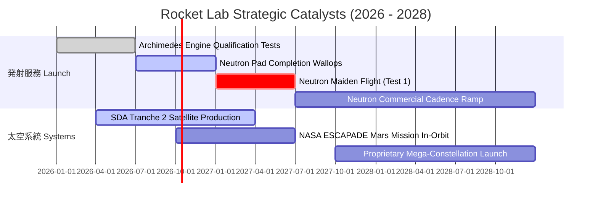

### 9.2 TAM 市場規模分析

```
╔══════════════════════════════════════════════════════════════════╗
║              Rocket Lab 目標可尋址市場（TAM）分析                ║
╠══════════════════════════════════════════════════════════════════╣
║                                                                  ║
║  小型專用發射 (Electron/HASTE): $3.5B TAM ｜ 滲透率: ~7.0%      ║
║  中型商業發射 (Neutron 目標):    $12.0B TAM ｜ 滲透率: 目前 0%   ║
║  衛星零件與平台製造 (Systems):  $25.0B TAM ｜ 滲透率: ~2.1%      ║
║  在軌星座管理與太空應用服務:    $40.0B+ TAM ｜ 長期潛在藍海      ║
║                                                                  ║
║  總計可觸及潛在市場 (TAM)：>$80B+，當前營收僅佔整體 TAM 不足 1%   ║
╚══════════════════════════════════════════════════════════════════╝
```

### 9.3 成長驅動力結構圖

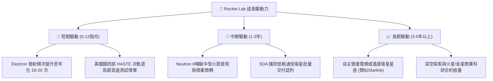

---

## 10. 風險矩陣

### 10.1 風險評分矩陣

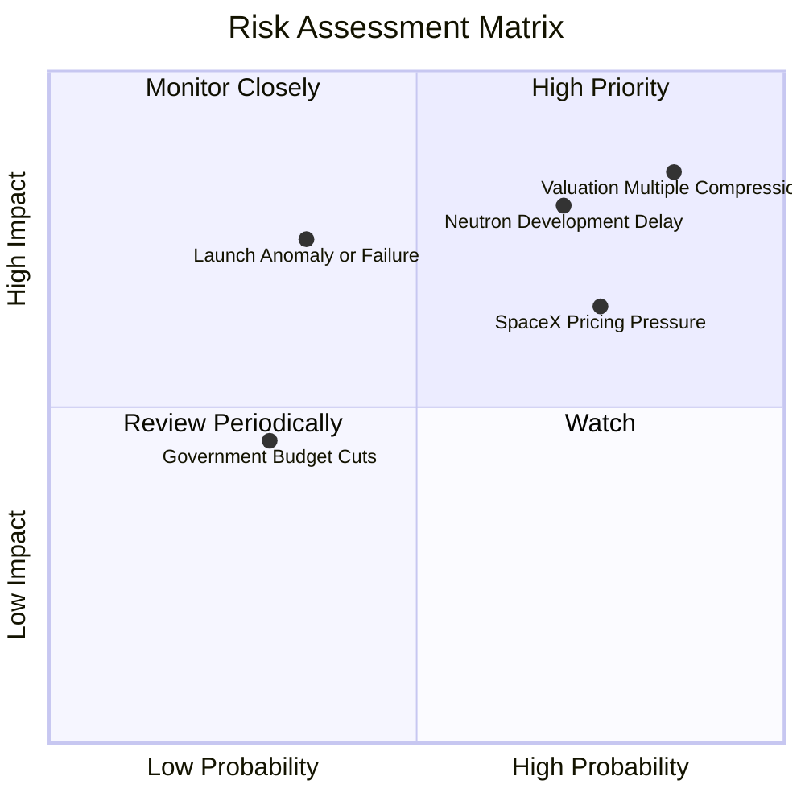

### 10.2 風險清單詳細分析

| # | 風險項目 | 發生機率 | 財務衝擊 | 風險評分 | 緩解措施 |
|---|----------|----------|----------|----------|----------|
| 1 | 🔴 **估值乘數劇烈回調** | 高 (85%) | 高 (-40% 股價) | 🔴 **8.5/10** | 逢高減碼並設定停利停損點，等待估值回歸公允區間。 |
| 2 | 🔴 **Neutron 研發延期或試飛失敗** | 高 (70%) | 高 (-20% 營收成長預期)| 🔴 **8.0/10** | 手握 $2.30B 現金提供 4 年以上研發容錯期，避免流動性枯竭。 |
| 3 | 🟡 **SpaceX 拼車價格戰** | 高 (75%) | 中 (-10% 小型發射毛利)| 🟡 **6.5/10** | 鎖定特定軌道注入精度需求，並積極擴展太空系統元件多元營收。 |
| 4 | 🟡 **發射在軌異常事故** | 中 (35%) | 高 (停飛 3-6 個月)| 🟡 **6.0/10** | 建立紐西蘭與美國雙發射場冗餘，並為核心載荷投保完整商業航太險。 |
| 5 | 🟢 **聯邦政府國防預算削減** | 低 (30%) | 低 (-5% 訂單能見度)| 🟢 **3.5/10** | 太空軍與情報機構預算具兩黨共識，優先度極高受保護。 |

---

## 11. 投資建議

### 11.1 最終綜合評級雷達圖

```
╔══════════════════════════════════════════════════════════════╗
║              Rocket Lab 最終維度評分雷達圖                   ║
╠══════════════════════════════════════════════════════════════╣
║ 業務與技術護城河    8.0/10 ▓▓▓▓▓▓▓▓▓▓▓▓▓▓▓▓░░░░  優異        ║
║ 營收成長性與動能    8.5/10 ▓▓▓▓▓▓▓▓▓▓▓▓▓▓▓▓▓░░░  頂尖        ║
║ 財務健康與流動性    9.0/10 ▓▓▓▓▓▓▓▓▓▓▓▓▓▓▓▓▓▓░░  極佳        ║
║ 獲利品質與現金流    4.0/10 ▓▓▓▓▓▓▓▓░░░░░░░░░░░░  脆弱        ║
║ 資本效率 (ROIC)     3.0/10 ▓▓▓▓▓▓░░░░░░░░░░░░░░  摧毀價值    ║
║ 估值吸引力 (MOS)    3.0/10 ▓▓▓▓▓▓░░░░░░░░░░░░░░  昂貴        ║
╠══════════════════════════════════════════════════════════════╣
║ 綜合加權評分        6.8/10 ▓▓▓▓▓▓▓▓▓▓▓▓▓░░░░░░░  🟡 觀望評級  ║
╚══════════════════════════════════════════════════════════════╝
```

### 11.2 目標價與隱含報酬率

| 情境 | 目標價 | 隱含報酬率 (相對現價 $70.46) | 機率權重 | 核心前提 |
|------|--------|------------------------------|----------|----------|
| 🔴 **悲觀情境** | **$38.50** | **-45.4%** | 25% | Neutron 延期至 2028 年後，P/S 倍數收縮至 12x |
| 🟡 **基準情境** | **$65.00** | **-7.8%** | 55% | 2027 年順利試飛，營收保持 38% CAGR，EV/Sales 22x |
| 🟢 **樂觀情境** | **$92.00** | **+30.6%** | 20% | Neutron 迅速商轉，斬獲大型星座巨額訂單 |

### 11.3 買入時機與觸發因素

```
╔══════════════════════════════════════════════════════════════════╗
║                  ✅ 買入觸發因素 Checklist                      ║
╠══════════════════════════════════════════════════════════════════╣
║                                                                  ║
║  立即買入觸發條件（需多數符合）：                                ║
║  ☐ 股價回檔至建議買入區間 $45.00 – $50.00 以下 (MOS ≥ 25%)      ║
║  ☐ Archimedes 引擎完成全時長熱點火資格測試且無異常               ║
║  ☐ 單季營業現金流 OCF 正式轉正                                   ║
║                                                                  ║
║  加碼觸發條件（出現以下任一）：                                  ║
║  ☐ Neutron 成功完成軌道級首飛並成功入軌                          ║
║  ☐ 獲得百億級商業或國防巨型衛星星座總裝合約                      ║
║                                                                  ║
║  減碼/停損觸發條件（出現以下任一）：                             ║
║  ☐ 股價突破 $80.00 以上且無實質利多（估值泡沫化加劇）            ║
║  ☐ Neutron 官方宣布延期超過 12 個月                             ║
║  ☐ 現金儲備因異常研發失控降至 $1.0B 以下                         ║
╚══════════════════════════════════════════════════════════════════╝
```

### 11.4 投資人適配度分析

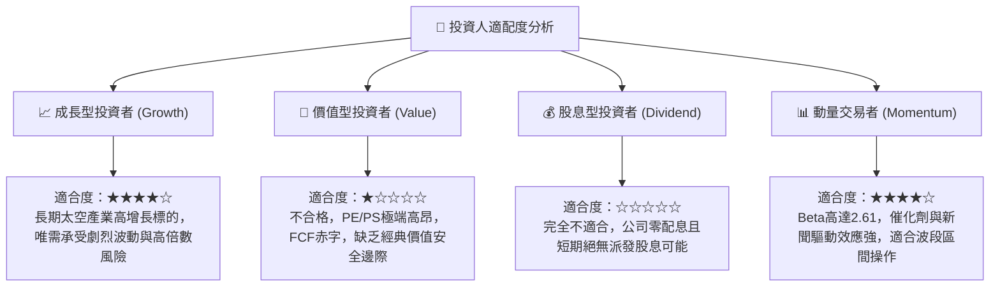

### 11.5 每季財報監控清單（Quarterly Watch List）

| 監控指標 | 基準觀察值 | 加碼門檻 (Bull Trigger) | 減碼門檻 (Bear Trigger) |
|----------|------------|-------------------------|-------------------------|
| **季度營收成長 (YoY)** | ~40%-50% | > 65.0%（產能超預期釋放） | < 25.0%（發射或元件交付停滯）|
| **毛利率 (Gross Margin)**| ~36%-38% | > 42.0%（太空元件爆發） | < 30.0%（成本失控或發射定價承壓）|
| **研發支出 (R&D)** | ~$65M-$75M/季 | 逐步平準化並伴隨試飛進展 | > $95M/季 且進度延宕（研發黑洞）|
| **季度 FCF 消耗** | -$60M ~ -$80M | 收斂至 -$30M 以內 | 赤字擴大至 -$120M 以上 |
| **Electron 發射次數** | 4-5 次/季 | ≥ 6 次/季（商業化提速） | ≤ 2 次/季（發射排程受阻） |
| **現金儲備水準** | > $2.0B | — | < $1.5B（無增發下過度消耗） |

### 11.6 反面論證：什麼會證明論點錯誤（What Would Change My Mind）

```
╔══════════════════════════════════════════════════════════════════╗
║              ⚠️ 論點失效條件（Disconfirming Evidence）           ║
╠══════════════════════════════════════════════════════════════════╣
║  本分析報告之「觀望」評級與 $65.00 目標價，在下列條件成立時失效：║
║                                                                  ║
║  推翻觀望、轉為「強力買入」的條件：                              ║
║  ① Neutron 首飛時程大幅提前，且預先獲得超過 20 發商業確定訂單； ║
║  ② 太空系統業務獲取大型主權星座合約，帶動單季營益率提前轉正；    ║
║  ③ 股價受大盤系統性拋售回調至 $45.00 以下，提供足夠安全邊際。    ║
║                                                                  ║
║  推翻觀望、轉為「全面賣出」的條件：                              ║
║  ① Archimedes 引擎遭遇重大設計缺陷，Neutron 項目研發無限期擱置；║
║  ② SpaceX 拼車大幅降價至每公斤 $1,500 以下，重創 Electron 定價； ║
║  ③ 管理層再度進行大規模折價股權融資，進一步稀釋現有股東逾 15%。  ║
╚══════════════════════════════════════════════════════════════════╝
```

---
> **免責聲明**：本報告基於公開財務數據與嚴謹模型分析撰寫，純屬學術與機構研究參考，不構成任何個人化之投資買賣建議。市場瞬息萬變，航太科技產業具備高度不確定性，投資人應自行審慎評估風險並自負盈虧。