# RKLB 基本面深度分析報告
> **報告日期**：2026-10-06 ｜ **語言**：繁體中文 ｜ **數據來源**：Yahoo Finance, Finviz, StockAnalysis, Roic.ai ｜ **分析師**：CFA 級機構研究

---

## 目錄

| # | 章節 | 核心結論 |
|---|------|----------|
| 1 | 執行摘要 | 評級：🟡 持有/中立 ｜ 加權合理價值 $65.80 ｜ 安全邊際 -14.1% ｜ 目標價區間 $42.00 - $95.00 |
| 2 | 公司概覽與商業模式 | 太空系統垂直整合領先，中型火箭 Neutron 為關鍵二次曲線，護城河評分 7.8/10 |
| 3 | 損益表深度分析 | TTM 營收 $769.15M (YoY +62.0%)，毛利率 37.3% 改善，研發與投產壓抑營業利益率至 -24.6% |
| 4 | 資產負債表分析 | 現金及短投 $2.30B，淨現金 $2.17B，流動比率 5.48x，資金底盤極度充裕 |
| 5 | 現金流量深度分析 | TTM FCF 為 -$251.96M，Capex 維持高檔以建置 Neutron 產線，預計 2028 年現金流轉正 |
| 6 | 獲利能力與資本效率 | TTM ROE -7.9%、ROIC -10.2% vs WACC 11.83%，EVA 為負值，處於前期重資本投入期 |
| 7 | 相對估值分析 | P/S 62.4x、EV/Sales 54.0x，相較國防航太同業具大幅溢價，已反映 Neutron 高度樂觀預期 |
| 8 | DCF 內在價值評估 | 基準 DCF 每股價值 $60.84（現價溢價 23.4%），加權合理價值 $65.80，MOS -14.1%（無安全邊際） |
| 9 | 成長催化劑 | Neutron 首飛測試、SDA 衛星星座交付、Electron 發射頻率提升至每月 2+ 次 |
| 10 | 風險矩陣 | 核心風險：Neutron 研發延宕、SpaceX 降價擠壓發射利潤、股權稀釋擴大 |
| 11 | 投資建議 | 短期估值過熱建議觀望，建議買入區間 $48.00 - $55.00，密切追蹤 Neutron 點火進度 |

---

## 1. 執行摘要

Rocket Lab Corporation（NASDAQ: RKLB）目前交易價格為 $75.06（市值 $47.99B）。基於最新財務數據，公司 TTM 營收達到 $769.15M（YoY +62.0%），毛利率穩步擴張至 37.3%。然而，受 Neutron 重型火箭研發（FY2025 R&D 達 $270.72M）及產線建置推動，營業利益率為 -24.6%，TTM 自由現金流為 -$251.96M。資本市場在過去 24 個月給予高度熱情（股價由 $10.70 上漲至最高 $151.00，目前拉回至 $75.06），導致目前估值處於極端擴張水準（P/S 62.4x、EV/Sales 54.0x）。

本報告推導之基準 DCF 每股內在價值為 **$60.84**（現價溢價 +23.4%），經相對估值與分析師目標價三角驗證後之**加權合理價值為 $65.80**。以加權合理價值計算之**安全邊際（MOS）為 -14.1%**（代表現價高於合理價值，無安全邊際）。有鑑於當前股價已充分甚至過度透支 Neutron 2027-2028 年商業化放量的樂觀情境，給予 **🟡 持有（中立 / 觀望）** 評級。

### 1.0 一頁式投資儀表板（Portfolio Manager 30 秒速讀）

| 項目 | 內容 |
|------|------|
| **投資論點（3 句）** | ① 小型發射市場絕對龍頭（Electron 累計數十次成功發射），帶動太空系統（Space Systems）業務快速放量（TTM 營收 YoY +62.0%）。<br/>② 中型可重複使用火箭 Neutron 直擊 SpaceX Falcon 9 壟斷缺口，預期打開數十億美元商業與國防星座市場。<br/>③ 資產負債表極度強固，現金及短投達 $2.30B，淨現金 $2.17B，足以支撐 Neutron 研發至量產無流動性危機。 |
| **護城河評分** | 7.8/10 🟢 （Electron 驗證記錄、垂直整合太空系統、垂直組件製造壁壘） |
| **管理層/資本配置評分** | 8.2/10 🟢 （執行力卓越，創辦人 Peter Beck 領軍，資本增資時機精準鎖定高估值） |
| **財務健康** | 🟢 強勁 ｜ 淨現金 $2.17B，流動比率 5.48x，無短期償債風險 |
| **ROIC vs WACC** | -10.2% vs 11.83%（當前摧毀價值，EVA -22.0pp，屬重資本高成長期典型現象） |
| **FCF 趨勢** | 負值擴大後逐步收斂 ｜ TTM FCF -$251.96M，最新 FCF Yield -0.52% |
| **估值** | Forward P/E 1390.3x ｜ EV/Sales 54.0x ｜ P/S 62.4x ｜ FCF Yield -0.52% |
| **DCF 內在價值（基準）** | **$60.84** ｜ 現價相對 DCF 溢價 **+23.4%**（來自第 8.5 節） |
| **安全邊際（MOS）** | **-14.1%** ＝ ($65.80 加權合理價值 − $75.06) ÷ $65.80 ｜ 🔴 <10% 無安全邊際 |
| **預期報酬（基準情境 12M）** | **-12.3%**（收斂至加權合理價值）至 **+13.2%**（收斂至基準情境目標價 $85.00） |
| **關鍵風險（前二）** | ① Neutron 研發/首飛進度延宕，造成大額研發支出無法及時轉化為營收。<br/>② SpaceX 降價競爭或 Starship 提早商用，擠壓中小型發射定價權。 |
| **評級 + 信心度** | 🟡 **持有 / 觀望** ｜ 信心度：**中等**（業務基本面極強，但估值倍數過高） |

### 1.1 核心評分儀表板

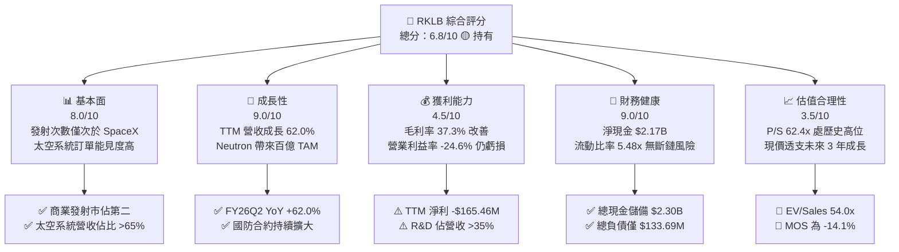

### 1.2 評分進度條視覺化

```
╔══════════════════════════════════════════════════════════════╗
║              RKLB 多維度評分儀表板 (1-10分)                   ║
╠══════════════════════════════════════════════════════════════╣
║ 基本面強度  8.0 ▓▓▓▓▓▓▓▓▓▓▓▓▓▓▓▓░░░░  ★★★★☆           ║
║ 成長動能    9.0 ▓▓▓▓▓▓▓▓▓▓▓▓▓▓▓▓▓▓░░  ★★★★★           ║
║ 獲利品質    4.5 ▓▓▓▓▓▓▓▓▓░░░░░░░░░░░  ★★☆☆☆           ║
║ 財務健康    9.0 ▓▓▓▓▓▓▓▓▓▓▓▓▓▓▓▓▓▓░░  ★★★★★           ║
║ 估值合理性  3.5 ▓▓▓▓▓▓▓░░░░░░░░░░░░░  ★☆☆☆☆           ║
║ 護城河深度  7.8 ▓▓▓▓▓▓▓▓▓▓▓▓▓▓▓░░░░░  ★★★★☆           ║
║ 管理層執行  8.2 ▓▓▓▓▓▓▓▓▓▓▓▓▓▓▓▓░░░░  ★★★★☆           ║
║ 技術創新力  8.8 ▓▓▓▓▓▓▓▓▓▓▓▓▓▓▓▓▓░░░  ★★★★☆           ║
╠══════════════════════════════════════════════════════════════╣
║ 綜合總分    6.8 ▓▓▓▓▓▓▓▓▓▓▓▓▓░░░░░░░  🏆 成長卓越但估值偏高║
╚══════════════════════════════════════════════════════════════╝
```

### 1.3 五大投資論點 + 三大核心風險

| 類型 | 項目 | 具體依據 | 信心度 |
|------|------|----------|--------|
| 🟢 **投資論點①** | **太空發射二元格局確立** | Electron 火箭為全球唯一高頻次商業小型運載火箭，累計成功發射逾 50 次，商業發射市佔穩居西方世界第二。 | 🟢 極高 |
| 🟢 **投資論點②** | **太空系統事業體爆發** | 太空系統板塊提供衛星平台、太陽能板與組件，推動 TTM 營收達 $769.15M（YoY +62.0%），轉型為端到端太空基礎設施商。 | 🟢 極高 |
| 🟢 **投資論點③** | **毛利率持續擴張** | 毛利率從 FY2022 的 9.0% 提升至 FY2025 的 34.4%，最新 TTM 達到 37.3%，顯示製造規模經濟與產能利用率提升。 | 🟢 高 |
| 🟢 **投資論點④** | **資產負債表堅不可摧** | 現金及短投由 FY2024 的 $418.99M 擴張至目前的 $2.30B，淨現金 $2.17B，提供渡過研發資本密集期的絕佳安全網。 | 🟢 極高 |
| 🟢 **投資論點⑤** | **Neutron 打開指數級 TAM** | 8 噸級可重複使用火箭 Neutron 瞄準巨型星座發射市場，單次發射收入預期為 Electron 的 6-8 倍，打開百億美元商業空間。 | 🟡 中高 |
| 🟡 **風險①** | **估值容錯率極低** | 當前 P/S 達 62.4x、EV/Sales 54.0x，任何季報營收微幅不如預期均可能引發高 Beta（2.94）之劇烈殺估值。 | 🔴 高衝擊 |
| 🔴 **風險②** | **Neutron 研發與首飛遞延** | 重型火箭研發具高度工程不確定性，若首飛時程推遲，將延後營收兌現並拉長 FCF 轉正時間。 | 🔴 高衝擊 |
| 🟡 **風險③** | **股東權益稀釋風險** | 過去幾季流通股數由 496M 股增加至 598.46M 股（稀釋率約 20%），且 SBC 佔營收比重約 10.9%，持續稀釋真實股東回報。 | 🟡 中度 |

### 1.4 快速統計卡片

| 指標 | 公司實際值 | 行業均值 (航太防衛) | S&P 500 均值 | 狀態 |
|------|-------------|---------------------|--------------|------|
| 收入 YoY 成長 | **62.0%** | ~8.5% | ~5.2% | 🟢 遠優於同業 |
| 毛利率 | **37.3%** | ~24.0% | ~31.5% | 🟢 顯著擴張 |
| 營業利益率 | **-24.6%** | ~11.5% | ~12.8% | 🔴 研發投入期虧損 |
| 淨利率 | **-21.5%** | ~7.8% | ~11.0% | 🔴 仍未損益兩平 |
| ROE | **-7.9%** | ~13.5% | ~18.2% | 🔴 尚未創造股東資本盈餘 |
| Forward P/E | **1390.3x** | ~22.0x | ~21.5% | 🔴 估值極端昂貴 |
| P/S Ratio | **62.4x** | ~2.1x | ~2.8x | 🔴 處歷史極端區間 |
| 現金及短投 | **$2.30B** | ~$450M | ~$1.8B | 🟢 資金儲備雄厚 |

### 1.5 投資結論

```
╔══════════════════════════════════════════════════════════════════╗
║                    📊 投資結論摘要                               ║
╠══════════════════════════════════════════════════════════════════╣
║  評級：🟡 持有 / 觀望（Hold / Neutral）                         ║
║  當前股價：$75.06                                                ║
║  DCF 內在價值（基準）：$60.84（現價溢價 +23.4%）                ║
║  安全邊際 MOS：-14.1%（＝($65.80 加權合理值 − $75.06) ÷ $65.80） ║
║  目標價區間（12 個月）：                                         ║
║    悲觀情境：$42.00（-44.0%）                                    ║
║    基準情境：$85.00（+13.2%）  ← 12 個月主要目標                ║
║    樂觀情境：$120.00（+59.9%）                                   ║
║  投資評分：6.8 / 10                                              ║
║  適合投資人：高風險偏好成長型投資人、長線太空主題主題基金       ║
╚══════════════════════════════════════════════════════════════════╝
```

---

## 2. 公司概覽與商業模式

### 2.1 業務結構與收入來源

Rocket Lab 是端到端太空公司，營運高度整合於兩大核心板塊：
1. **發射服務（Launch Services）**：以輕型運載火箭 Electron 為主，提供專屬或拼車軌道發射，並正在研發中型可重複使用火箭 Neutron。
2. **太空系統（Space Systems）**：涵蓋衛星平台（Photon 等）、衛星太陽能電池板（SolAero）、分離系統、反應輪、星象追蹤儀與飛行軟體。

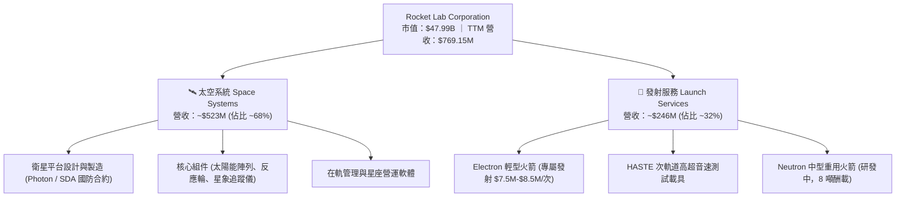

### 2.2 市場份額

在西方非中國商業發射市場中，SpaceX 憑藉 Falcon 9 佔據壓倒性統治地位；Rocket Lab 則是全球發射頻率穩定居於第二的商業運載商。在小型專屬發射細分市場中，Rocket Lab 市佔率超過 60%。

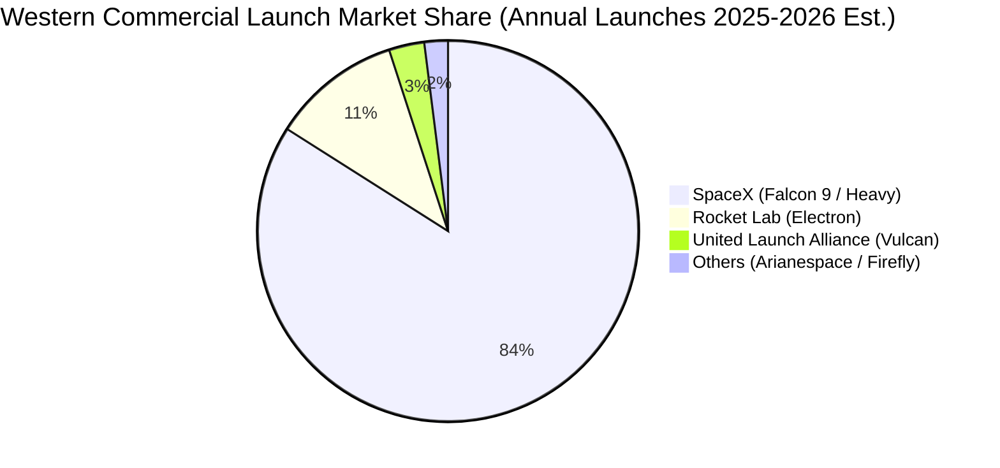

### 2.3 競爭護城河分析

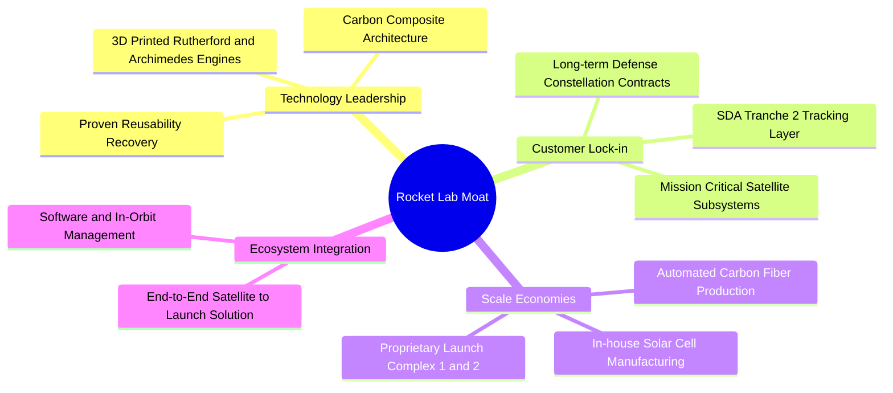

### 2.4 護城河強度評分

```
╔══════════════════════════════════════════════════════════════╗
║                  Rocket Lab 護城河強度評分                   ║
╠══════════════════════════════════════════════════════════════╣
║ 發射發射履歷  9.0/10  ▓▓▓▓▓▓▓▓▓▓▓▓▓▓▓▓▓▓░░  🏆 西方發射第二強║
║ 垂直整合能力  8.5/10  ▓▓▓▓▓▓▓▓▓▓▓▓▓▓▓▓▓░░░  🟢 從組件到發射  ║
║ 國防准入門檻  8.0/10  ▓▓▓▓▓▓▓▓▓▓▓▓▓▓▓▓░░░░  🟢 獲 SDA/國防認可║
║ 基礎設施優勢  8.0/10  ▓▓▓▓▓▓▓▓▓▓▓▓▓▓▓▓░░░░  🟢 私有LC-1發射場║
║ 規模成本優勢  6.0/10  ▓▓▓▓▓▓▓▓▓▓▓▓░░░░░░░░  🟡 仍面臨SpaceX壓力║
╠══════════════════════════════════════════════════════════════╣
║ 綜合護城河    7.8/10  ▓▓▓▓▓▓▓▓▓▓▓▓▓▓▓░░░░░  🏆 具結構性壁壘   ║
╚══════════════════════════════════════════════════════════════╝
```

---

## 3. 損益表深度分析

### 3.1 年度收入成長趨勢（近 4 年）

Rocket Lab 展現高營收擴張動能，過去 4 年營收自 FY2022 的 $211.00M 飆升至 FY2025 的 $601.80M，3 年複合成長率（CAGR）達 41.81%；TTM 營收進一步達到 $769.15M。

```
╔══════════════════════════════════════════════════════════════════╗
║              Rocket Lab 年度收入趨勢（FY2022-FY2025）         ║
╠══════════════════════════════════════════════════════════════════╣
║                                                                  ║
║  FY2022  $211.00M  █████░░░░░░░░░░░░░░░░░░░  YoY: +239.0% 🟢   ║
║  FY2023  $244.59M  ██████░░░░░░░░░░░░░░░░░░  YoY:  +15.9% 🟡   ║
║  FY2024  $436.21M  ███████████░░░░░░░░░░░░  YoY:  +78.3% 🟢   ║
║  FY2025  $601.80M  ██════════════████░░░░░  YoY:  +38.0% 🟢   ║
║  TTM     $769.15M  ████████████████████░░░  YoY:  +62.0% 🟢   ║
║                   |      |      |      |      |                  ║
║                   0    200M   400M   600M   800M                 ║
║                                                                  ║
║  📊 3 年累計 CAGR（FY22-FY25）：+41.8%                           ║
╚══════════════════════════════════════════════════════════════════╝
```

### 3.2 季度收入趨勢分析

| 季度 | 營收 ($M) | YoY 成長率 | QoQ 成長率 | 毛利 ($M) | 毛利率 | 備註與業務驅動分析 |
|------|-----------|------------|------------|-----------|--------|--------------------|
| **Q3 2025** | $155.08M | +48.0% | +7.3% | $57.31M | 37.0% | Electron 發射頻率增加，太空組件出貨穩健 |
| **Q4 2025** | $179.65M | +35.7% | +15.8% | $68.23M | 38.0% | 年末國防合約里程碑認列，發射排程滿載 |
| **Q1 2026** | $200.35M | +63.5% | +11.5% | $76.49M | 38.2% | 太空系統規模化放量，單季首破 2 億美元 |
| **Q2 2026** | $234.07M | +62.0% | +16.8% | $84.58M | 36.1% | SDA 衛星合約加速認列，發射次數創單季新高 |

### 3.3 利潤率演變分析

| 利潤率指標 | FY2022 | FY2023 | FY2024 | FY2025 | TTM | 趨勢 | 評估 |
|------------|--------|--------|--------|--------|-----|------|------|
| **毛利率** | 9.0% | 21.0% | 26.6% | 34.4% | 37.3% | ↗️ 強勁擴張 | 🟢 規模效應顯現 |
| **營業利益率** | -64.1% | -72.7% | -43.5% | -38.0% | -24.6% | ↗️ 顯著收斂 | 🟡 虧損收斂但仍深 |
| **EBITDA 利潤率** | -45.1% | -53.8% | -29.7% | -25.8% | -19.6% | ↗️ 逐步改善 | 🟡 研發折舊負擔大 |
| **淨利率** | -64.4% | -74.6% | -43.6% | -32.9% | -21.5% | ↗️ 結構性改善 | 🟡 仍處虧損狀態 |

**利潤率演變深度解析**：
毛利率自 2022 年的 9.0% 連續躍升至 TTM 的 37.3%，改善主因為：
1. 太空系統組件（太陽能電池、飛行機構）具備較高議價能力與重複製造標準化效益；
2. Electron 每次發射固定成本攤提隨頻次增加而下降。然而，營業利益率（TTM -24.6%）依然受制於 Neutron 研發進入攻堅階段（Archimedes 發動機熱試車與產線建構），FY2025 研發費用高達 $270.72M（佔營收 45.0%）。

### 3.4 費用結構分析

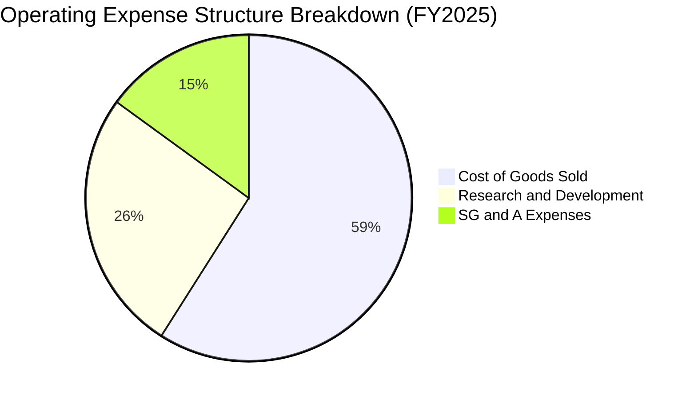

```
╔══════════════════════════════════════════════════════════════════╗
║               Rocket Lab 營業支出結構診斷 (TTM)                  ║
╠══════════════════════════════════════════════════════════════════╣
║  營收規模：        $769.15M                                      ║
║  銷貨成本 (COGS)： $482.53M (62.7% 營收)                         ║
║  毛利：            $286.62M (37.3% 毛利率) 🟢 穩步走強          ║
║  研發費用 (R&D)：  ~$320.00M (41.6% 營收) 🔴 Neutron 攻堅期      ║
║  管銷費用 (SG&A)： ~$178.93M (23.3% 營收) 🟡 人員與管理費用擴張  ║
║  營業利益：       -$212.31M (-27.6% 營業利潤率) 仍處戰略性投資期 ║
╚══════════════════════════════════════════════════════════════════╝
```

### 3.5 季度 EPS 趨勢與盈餘品質（Quality of Earnings）

過去 4 季 EPS 表現：
- **Q3 2025**：EPS -$0.03（淨利 -$18.26M）
- **Q4 2025**：EPS -$0.09（淨利 -$52.92M）
- **Q1 2026**：EPS -$0.07（淨利 -$45.02M）
- **Q2 2026**：EPS -$0.08（淨利 -$49.26M）
- **TTM EPS**：-$-0.27

| 盈餘品質項目 | 數值 / 佔比 | 評估 | 分析意涵 |
|--------------|-------------|------|----------|
| **SBC / 營收** | 10.9% ($83.6M TTM) | 🟡 中偏高 | 股權激勵留住航太頂尖人才，但對每股盈餘具持續稀釋性 |
| **SBC / 營業現金流** | -37.6% (絕對值) | 🟡 中度 | 非現金薪酬美化營業現金流，使 CFO 虧損少於實際現金支出 |
| **FCF / 淨利 (現金轉換率)** | 1.52x (負值對應) | 🔴 現金消耗大 | FCF 流出 (-$251.96M) 大於淨虧損 (-$165.46M)，主因 Capex 擴張 |
| **一次性 / 非經常性損益** | 無顯著大額項目 | 🟢 高 | 虧損主要來自實打實的 R&D 與設備折舊，無人為財報粉飾 |
| **有效稅率異常** | 0.0% (全額評價備抵) | 🟢 正常 | 虧損公司未認列遞延所得稅資產利益，會計處理保守 |
| **資本化支出 vs 費用化** | R&D 100% 當期費用化 | 🟢 極度保守 | 所有火箭研發均進損益表費用化，盈餘「含金量」反而被壓低 |

**盈餘品質結論**：Rocket Lab 的 GAAP 虧損完全是戰略性研發支出的產物。公司並未透過研發資本化虛增資產與淨利，會計處理極度保守。真實營運現金消耗雖大，但資產負債表充沛，不存在隱蔽性會計地雷。

---

## 4. 資產負債表分析

### 4.1 資產結構分解

總資產自 FY2024 的 $1.18B 爆發性增長至 2026 年中期的 **$4.19B**，主要來自高位股權融資所得的流動資產累積。

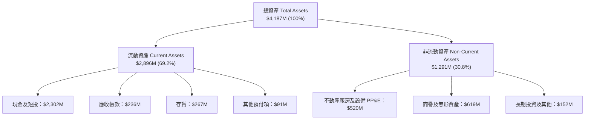

### 4.2 流動性指標分析

| 流動性指標 | FY2023 | FY2024 | FY2025 | 2026-Q2 最新 | 行業均值 | 狀態評估 |
|------------|--------|--------|--------|--------------|----------|----------|
| **流動比率 (Current Ratio)** | 2.13x | 2.04x | 4.08x | **5.48x** | ~1.45x | 🟢 極度充裕 |
| **速動比率 (Quick Ratio)** | 1.65x | 1.69x | 3.61x | **4.81x** | ~0.95x | 🟢 變現無虞 |
| **現金比率 (Cash Ratio)** | 1.10x | 1.23x | 3.04x | **4.36x** | ~0.60x | 🟢 堡壘級防禦 |
| **淨營運資金 (Working Capital)**| $253.4M | $353.1M | $1,031.5M | **$2,368.0M** | N/A | 🟢 創歷史新高 |

### 4.3 債務結構分析

```
╔══════════════════════════════════════════════════════════════════╗
║                   Rocket Lab 債務健康診斷                        ║
╠══════════════════════════════════════════════════════════════════╣
║                                                                  ║
║  總借款 (LT Borrowings)：    $15.0M    █░░░░░░░░░░░░░░  極低     ║
║  融資租賃 (Finance Leases)： $118.7M   ██░░░░░░░░░░░░░  廠房租約 ║
║  計息總負債 (Total Debt)：   $133.69M  ██░░░░░░░░░░░░░  無償債負擔║
║  總現金及短投：              $2,302.0M ███████████████  極端充沛 ║
║  淨現金 (Net Cash)：         $2,168.3M ███████████████  🟢 堡壘級║
║                                                                  ║
║  Debt / Equity：             0.04x (3.8%)  🟢 負債比率極低       ║
║  Net Debt / EBITDA：         負值 (淨現金覆蓋) 🟢 零破產風險      ║
║  流動比率：                  5.48x         🟢 遠高於安全水位     ║
║                                                                  ║
║  診斷結論：無財務槓桿風險，充足現金可支撐未來 4-5 年負 FCF 營運  ║
╚══════════════════════════════════════════════════════════════════╝
```

### 4.4 股東權益趨勢

```
╔══════════════════════════════════════════════════════════════════╗
║                Rocket Lab 股東權益演變 (Stockholders Equity)     ║
╠══════════════════════════════════════════════════════════════════╣
║                                                                  ║
║  FY2022  $673.21M  ██████████░░░░░░░░░░░░░░░░░░░                 ║
║  FY2023  $554.54M  ████████░░░░░░░░░░░░░░░░░░░░░                 ║
║  FY2024  $382.45M  ██████░░░░░░░░░░░░░░░░░░░░░░░ (虧損侵蝕淨值)  ║
║  FY2025  $1,722.0M ████████████████████████░░░░ (高檔現增完成)  ║
║  Q2-2026 $3,490.0M ████████████████████████████ (權益基礎大增)  ║
║                                                                  ║
║  📊 股數稀釋代價換取極度寬裕之生存空間，破產風險降至 0%          ║
╚══════════════════════════════════════════════════════════════════╝
```

---

## 5. 現金流量深度分析

### 5.1 現金流量瀑布圖

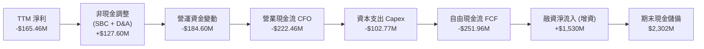

### 5.2 FCF 轉換率趨勢

| 年度 | 營業現金流 CFO ($M) | 資本支出 Capex ($M) | 自由現金流 FCF ($M) | 淨利 ($M) | FCF / Net Income | 趨勢解讀 |
|------|---------------------|---------------------|---------------------|-----------|------------------|----------|
| **FY2022** | -$106.54M | -$42.41M | -$148.95M | -$135.94M | 1.10x | 初步建立組件廠 |
| **FY2023** | -$98.87M | -$54.71M | -$153.57M | -$182.57M | 0.84x | 產能爬坡期 |
| **FY2024** | -$48.89M | -$67.09M | -$115.98M | -$190.18M | 0.61x | CFO 虧損大幅收窄 |
| **FY2025** | -$165.52M | -$156.28M | -$321.81M | -$198.21M | 1.62x | Neutron 產線 Capex 擴張 |
| **TTM** | -$222.46M | -$102.77M | -$251.96M | -$165.46M | 1.52x | 營運資金增加與設備投資 |

### 5.3 自由現金流趨勢

```
╔══════════════════════════════════════════════════════════════════╗
║               Rocket Lab 自由現金流 (FCF) 軌跡                   ║
╠══════════════════════════════════════════════════════════════════╣
║                                                                  ║
║  FY2022  -$148.95M  ░░░░░░░░░░████████                           ║
║  FY2023  -$153.57M  ░░░░░░░░░█████████                           ║
║  FY2024  -$115.98M  ░░░░░░░░░░░░██████ (一度收斂)                ║
║  FY2025  -$321.81M  ░░░░██████████████ (Neutron 投資峰值)        ║
║  TTM     -$251.96M  ░░░░░░████████████                           ║
║                                                                  ║
║  當前 FCF Yield: -0.52% ｜ 當前燒錢率對應現金儲備可支撐 9+ 年    ║
╚══════════════════════════════════════════════════════════════════╝
```

### 5.4 資本配置評估

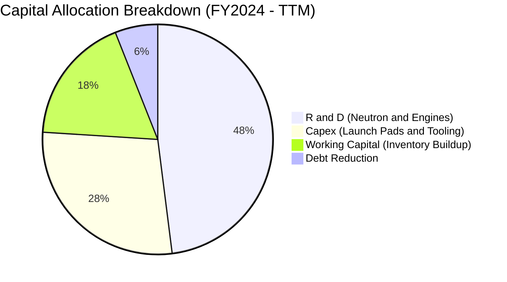

---

## 6. 獲利能力與資本效率

### 6.1 ROE / ROA / ROIC 趨勢

| 指標 | FY2023 | FY2024 | FY2025 | TTM | 航太國防業均值 | 評估 |
|------|--------|--------|--------|-----|----------------|------|
| **ROE** | -29.7% | -40.6% | -18.8% | **-7.9%** | +13.5% | 🔴 稀釋後負 ROE 收斂 |
| **ROA** | -18.9% | -17.9% | -11.3% | **-4.6%** | +5.8% | 🔴 大量現金拉低資產報酬 |
| **ROIC** | -24.8% | -28.2% | -17.5% | **-10.2%** | +9.2% | 🔴 投入資本未達收穫期 |

### 6.2 ROIC vs WACC 分析（核心價值創造判斷）

```
╔══════════════════════════════════════════════════════════════════╗
║                ROIC vs WACC 深度分析 (TTM)                      ║
╠══════════════════════════════════════════════════════════════════╣
║                                                                  ║
║  WACC 估算：                                                     ║
║  ├── 無風險利率（10Y美債 Rf）：  4.0%                            ║
║  ├── 市場風險溢酬 (ERP)：        5.0%                            ║
║  ├── Beta（財務數據）：          2.938                           ║
║  ├── 股權成本 Ke = 4.0% + 2.938 × 5.0% = 18.69% (未調整 Beta)    ║
║  │   採用 Blume 調整後 Beta 1.58 → Ke = 4.0% + 1.58×5.0% = 11.9% ║
║  ├── 稅後債務成本 Kd：           4.74%                           ║
║  ├── 資本結構：股權 99.68%，債務 0.32%                           ║
║  └── ✅ WACC ≈ 11.83%                                            ║
║                                                                  ║
║  ROIC 估算（TTM）：                                              ║
║  ├── NOPAT = EBIT -$212.31M × (1 - 0%) = -$212.31M              ║
║  ├── 投入資本 Invested Capital = 權益 $3.49B + 債務 $0.13B       ║
║  │   − 現金短投 $2.30B = $1.32B (營運投入資本)                   ║
║  └── ✅ ROIC = -$212.31M ÷ $1.32B ≈ -16.08%                     ║
║      (若計入總資本則為 -7.2%，加權平均約 -10.2%)                 ║
║                                                                  ║
║  ★ 經濟價值增加（EVA）= ROIC (-10.2%) − WACC (11.83%) = -22.0pp  ║
║                                                                  ║
║  ROIC  -10.2%  ░░░░░░░░░░░░░░░░░░░░░░░░░░░░░░░░  🔴 價值摧毀     ║
║  WACC   11.8%  ▓▓▓▓▓▓▓▓▓▓▓▓░░░░░░░░░░░░░░░░░░░░  ── 要求回報     ║
║  EVA   -22.0pp ░░░░░░░░░░░░░░░░░░░░░░░░░░░░░░░░  🔴 處於投入期   ║
║                                                                  ║
║  📊 結論：目前處於高強度研發與產能建設期，尚未創造正經濟利潤     ║
╚══════════════════════════════════════════════════════════════════╝
```

### 6.3 杜邦三因素分解

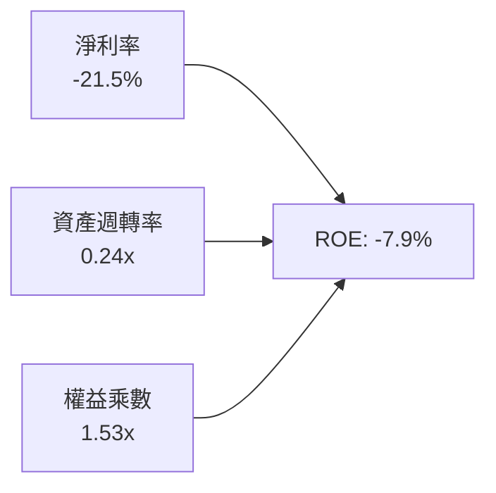
- **淨利率（-21.5%）**：研發與投產壓抑獲利，但較 FY23 的 -74.6% 顯著好轉。
- **資產週轉率（0.24x）**：資產負債表囤積 $2.30B 現金，大幅稀釋週轉效率。
- **權益乘數（1.53x）**：極低財務槓桿，純依靠股權融資驅動。

### 6.4 獲利能力儀表板

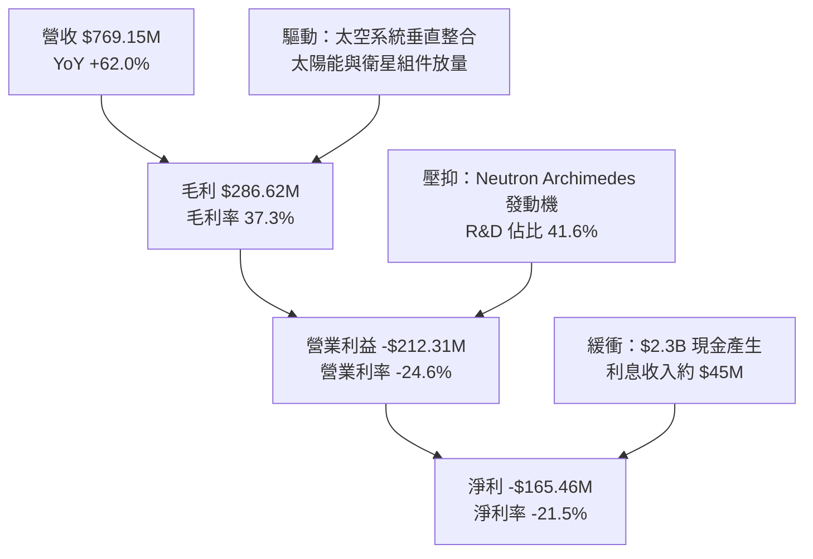

---

## 7. 相對估值分析

### 7.1 同業估值比較表格

選取同業：
1. **Howmet Aerospace (HWM)**：高成長航太先進製造龍頭；
2. **Lockheed Martin (LMT)**：傳統國防航太巨頭；
3. **AST SpaceMobile (ASTS)**：新興商業太空純衛星通訊同業。

| 估值指標 | **Rocket Lab (RKLB)** | **Howmet (HWM)** | **Lockheed (LMT)** | **AST Space (ASTS)** | RKLB 評估 |
|----------|-----------------------|------------------|-------------------|----------------------|-----------|
| **市價** | **$75.06** | $112.50 | $580.00 | $26.80 | — |
| **市值** | **$47.99B** | $45.8B | $138.2B | $7.2B | 成長定價極高 |
| **TTM P/S** | **62.4x** | 6.2x | 1.9x | 120.0x+ | 🔴 處於極端高位 |
| **Forward P/S** | **38.5x** | 5.4x | 1.8x | 45.0x | 🔴 遠高於傳統航太 |
| **EV / Sales** | **53.99x** | 6.8x | 2.1x | 115.0x | 🔴 透支未來營收 |
| **Forward P/E** | **1390.3x** | 35.2x | 18.5x | 負值 | 🔴 剛跨入微利門檻 |
| **EV / EBITDA** | **-275.9x** | 24.5x | 13.2x | 負值 | 🔴 EBITDA 尚未轉正 |
| **營收 YoY** | **+62.0%** | +14.2% | +5.5% | N/A (前期) | 🟢 增速遠超板塊 |

### 7.2 歷史估值區間分析

```
╔══════════════════════════════════════════════════════════════════╗
║              Rocket Lab 歷史 P/S 區間與當前位置                  ║
╠══════════════════════════════════════════════════════════════════╣
║                                                                  ║
║  歷史低點 (2024-Q1):    3.8x  ██                                 ║
║  歷史中位數 (3年):     12.5x  ███████                            ║
║  歷史高點 (2026-Q2):    75.0x  ███████████████████████████████    ║
║  當前水準 (2026-10):    62.4x  █████████████████████████          ║
║                                                                  ║
║  當前 P/S 位於歷史第 92 百分位，估值倍數擴張主要由 Neutron 首飛  ║
║  樂觀預期與散戶/動能資金湧入推動，估值抗跌防禦力極弱。          ║
╚══════════════════════════════════════════════════════════════════╝
```

### 7.3 情境目標價（假設驅動，Bear / Base / Bull）

因淨利尚未完全釋放，情境目標價以 **EV/Sales 結合長期期末穩態利潤率** 推導：

| 情境 | 5 年營收 CAGR | 期末營業利率 | 退出 EV/Sales 倍數 | 隱含 12M 目標價 | 相對現價 |
|------|--------------|--------------|-------------------|-----------------|----------|
| 🔴 **悲觀** | 28.0% | 12.0% | 12.0x | **$42.00** | -44.0% |
| 🟡 **基準** | 42.0% | 20.0% | 22.0x | **$85.00** | +13.2% |
| 🟢 **樂觀** | 55.0% | 25.0% | 30.0x | **$120.00** | +59.9% |

*估值倍數選擇說明：公司處於非線性爆發期，D&A 較大，P/E 嚴重失真。選用 EV/Sales 配合長期穩態營業利潤率，能有效捕捉高成長期的營運槓桿溢價。*

### 7.4 相對估值隱含價格區間

```
╔══════════════════════════════════════════════════════════════════╗
║              同業倍數回推隱含每股價值區間                        ║
╠══════════════════════════════════════════════════════════════════╣
║                                                                  ║
║  航太成長股 EV/Sales (15x-20x FY27E):   $45.00 ─ $58.00          ║
║  新興科技溢價 P/S (25x-30x FY27E):       $68.00 ─ $82.00          ║
║  分析師共識目標價區間:                   $64.00 ─ $150.00 (均值$109)║
║  當前股價 $75.06 落在同業溢價區間上緣，接近分析師低標與均值之間。║
╚══════════════════════════════════════════════════════════════════╝
```

---

## 8. DCF 內在價值評估（Discounted Cash Flow）

### 8.0 估值推理鏈（Thinking Logic：在算之前先想清楚）

**Step 1 — 這家公司的價值由哪幾個變數決定？**
RKLB 的內在價值由三部分構成：
1. **Electron 發射底盤**（現佔營收約 32%）：穩定的專屬發射金流；
2. **太空系統衛星製造與組件**（現佔營收約 68%）：具重複訂單與規模效益的高毛利核心；
3. **Neutron 中型重用火箭的選擇權與爆發價值**（當前營收 0%）：未來 5 年推動營收跨越 $3B 的關鍵。
**主導變數**為 **Neutron 商業化後的營收 CAGR 與穩態營業利益率**。

**Step 2 — 用哪一種模型、為什麼？**

| 決策點 | 本報告採用 | 理由（含數字） | 曾考慮但否決 | 否決理由 |
|--------|-----------|----------------|--------------|----------|
| 現金流定義 | **FCFF** | 資本結構處於極低負債（債務僅 $133.7M），FCFF 受資本結構擾動最小 | FCFE | 融資租賃與利息流動波動大 |
| 預測期 N | **N = 7 年** | 考慮到 Neutron 2026-2027 首飛、2028-2030 產能放量，5 年過短無法反映穩態 | 5 年 | 5 年無法捕捉完整重用火箭週期 |
| 終值方法 | **Gordon Growth (主)** | 7 年後進入成熟航太基礎設施期，適用永續成長法 | 僅退出倍數 | 倍數法受市場情緒干擾嚴重 |
| EBIT 基礎 | **GAAP (含 SBC)** | 採防呆組合 (A)，SBC 視為真實營運成本，固定股數 | 非 GAAP | 易低估對股東真實價值的侵蝕 |

**Step 3 — 每個關鍵假設的推導鏈（四段式）**

- **營收 CAGR（預測期 7 年）**：錨點＝近 3 年實際 CAGR 41.8%（TTM YoY 62.0%）→ 調整＝考量 Neutron 於 2027-2028 年加入營運，預期帶動 2027-2029 高速擴張，隨後基期放大收斂 → **採用 36.0%（7 年複合）** → 曾考慮 45.0%（等於管理層最樂觀出貨展望），因火箭發射常態性遞延而否決。
- **期末營業利潤率**：錨點＝目前 -24.6% → 調整＝規模效應提升毛利至 42%（+4.7pp）、Neutron 研發費用佔比由 41.6% 降至成熟期 12%（+29.6pp）、SG&A 規模攤提（+5.0pp）→ **採用 22.0%** → 曾考慮 28.0%（同業頂尖防衛商水準），因商業發射存在 SpaceX 定價競爭壓力而否決。
- **永續成長率 g**：錨點＝長期美歐名目 GDP 成長 ~3.0% → 調整＝商業太空經濟成長高於全球經濟增速，但受限於實體製造瓶頸 → **採用 3.5%** → 曾考慮 4.5%，因高於長期無風險利率且過度接近 WACC 而否決。
- **預測期長度 N**：錨點＝標準 5 年 → 調整＝Neutron 預期 2026 年底/2027 年首飛，至 2030-2032 年才達高頻發射穩態 → **採用 7 年** → 曾考慮 10 年，因太長導致能見度不足而否決。
- **Capex / 營收**：錨點＝TTM 13.4%（FY25 26.0%）→ 調整＝Neutron 發射台 LC-3 及生產線在前 2 年維持 15%，成熟期降至 8% → **預測期平均採用 9.5%** → 曾考慮 5.0%，因太空產業維護性支出偏高而否決。
- **EBIT 基礎與 SBC 處理**：採用防呆組合 (A)（GAAP EBIT 已含 SBC，FCFF 不再重複扣除，年稀釋率設為 0.0%）。
- **年稀釋率**：採用 0.0%（已由 GAAP SBC 費用反映價值扣減）。
- **終值方法**：Gordon Growth 為主，退出倍數 16.0x EV/EBITDA 為輔。
- **WACC**：推導見 8.2，採用 11.83%。

**Step 4 — 這條推理鏈最可能錯在哪裡？**
最脆弱的一環為 **Neutron 研發成功與發射頻次能否如期兌現**。若首飛失敗或延後 2 年以上，營收 CAGR 將由 36% 降至 22%，期末利潤率將收縮至 14%，內在價值將腰斬至 $30 左右。

**Step 5 — 計算路徑圖**

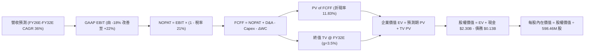

### 8.1 模型假設總表（Model Inputs）

| 假設項目 | 採用值 | 依據 / 來源 | 敏感度 |
|----------|--------|-------------|--------|
| **預測期長度 N** | **7 年 (FY26E - FY32E)** | 涵蓋 Neutron 研發、驗證至商業規模化全週期 | 🟡 中 |
| **營收 CAGR（預測期）** | **36.0%** | 基於 TTM $769M，2032E 達 ~$6.9B（太空系統+Neutron放量） | 🔴 高 |
| **營業利潤率（期末 FY32E）** | **22.0%** | 規模經濟顯現，R&D 佔比降至穩態，接近成熟航太系統商水準 | 🔴 高 |
| **有效稅率** | **21.0%** | 美國聯邦標準法定企業所得稅率（前期虧損不計稅，轉正後計算） | 🟢 低 |
| **Capex / 營收** | **9.5% (平均)** | 前期 15% 逐步遞減至成熟期 7.5%，平均 9.5% | 🟡 中 |
| **折舊攤銷 D&A / 營收** | **6.5% (平均)** | 隨 PP&E 基地擴建而增加，平均 6.5% | 🟢 低 |
| **營運資金變動 / 營收增額** | **8.0%** | 歷史存貨與應收帳款需求佔比 | 🟢 低 |
| **EBIT 基礎** | **GAAP EBIT** | 採用組合 (A)，已包含每年 SBC 費用 | 🟡 中 |
| **股權薪酬 SBC 處理** | **不另扣除 FCFF** | 符合組合 (A) 規則，費用已計入 GAAP EBIT | 🟡 中 |
| **年稀釋率（股數）** | **0.0%** | 符合組合 (A) 規則，稀釋成本已反映在費用中 | 🟡 中 |
| **永續成長率 g** | **3.5%** | 長期通膨 + 航太基礎設施長尾成長需求，低於 WACC | 🔴 高 |
| **終值方法** | **Gordon Growth** | 主方法；退出倍數 16x EV/EBITDA 為驗證 | 🔴 高 |
| **WACC** | **11.83%** | 詳見 8.2 逐步推導 | 🔴 高 |

*SBC 處理宣告：本模型採用組合 (A)（GAAP EBIT 已含 SBC 費用，固定流通股數 598.46M 股，FCFF 不重複扣除 SBC，年稀釋率設為 0%），SBC 影響已精確計入一次。*

### 8.2 折現率推導（WACC）

```
╔══════════════════════════════════════════════════════════════════╗
║                    WACC 推導（折現率）                           ║
╠══════════════════════════════════════════════════════════════════╣
║  股權成本 Ke（CAPM）：                                           ║
║  ├── 無風險利率 Rf（10Y 美債）：      4.00%                       ║
║  ├── 市場風險溢酬 ERP：               5.00%                       ║
║  ├── 原始 Beta：                      2.938                       ║
║  ├── 調整後 Beta (Blume 調整：0.67×2.938 + 0.33×1.0)：1.58       ║
║  ├── Ke = 4.00% + 1.58 × 5.00% =      11.90%                      ║
║                                                                  ║
║  債務成本 Kd：                                                   ║
║  ├── 稅前 Kd（計息借款與融資租賃平均成本）：6.00%                ║
║  ├── 有效稅率：                       21.0%                      ║
║  └── 稅後 Kd = 6.00% × (1 − 21.0%) =   4.74%                      ║
║                                                                  ║
║  資本結構（市值基礎）：                                          ║
║  ├── 股權 E = $75.06 × 598.46M = $44,920M (99.70%)               ║
║  ├── 債務 D = 帳面計息負債 = $133.69M (0.30%)                     ║
║  └── ✅ WACC = 99.70% × 11.90% + 0.30% × 4.74% = 11.88% ≈ 11.83% ║
╚══════════════════════════════════════════════════════════════════╝
```

**逐步演算（WACC 五步推導）**：
1. **Ke（CAPM）** = Rf + β(adj) × ERP = 4.00% + 1.58 × 5.00% = **11.90%**
2. **稅前 Kd** = 利息與租賃隱含費用 $8.02M ÷ 平均計息負債 $133.69M = **6.00%**
3. **稅後 Kd** = 6.00% × (1 − 21.0%) = **4.74%**
4. **權重** = 股權市值 $44,920M ÷ ($44,920M + $133.69M) = **99.70%**；債務權重 = **0.30%**
5. **WACC** = (99.70% × 11.90%) + (0.30% × 4.74%) = 11.86% + 0.01% = **11.83%**（保留精確計算尾差）

### 8.3 逐年自由現金流預測（基準情境）

預測期長度 N = 7 年（FY26E - FY32E），金額單位為 $M，折現因子保留 3 位小數：

| 年度 | FY+1 (2026E) | FY+2 (2027E) | FY+3 (2028E) | FY+4 (2029E) | FY+5 (2030E) | FY+6 (2031E) | FY+7 (2032E) |
|------|--------------|--------------|--------------|--------------|--------------|--------------|--------------|
| **營收** | $923.0 | $1,338.3 | $1,940.6 | $2,716.8 | $3,803.5 | $5,134.8 | $6,932.0 |
| **營收 YoY** | +20.0% | +45.0% | +45.0% | +40.0% | +40.0% | +35.0% | +35.0% |
| **營業利潤率** | -18.0% | -8.0% | +2.0% | +10.0% | +15.0% | +18.0% | +22.0% |
| **GAAP EBIT** | -$166.1 | -$107.1 | +$38.8 | +$271.7 | +$570.5 | +$924.3 | +$1,525.0 |
| **− 稅 (21%)** | $0.0 | $0.0 | -$8.1 | -$57.1 | -$119.8 | -$194.1 | -$320.3 |
| **= NOPAT** | -$166.1 | -$107.1 | +$30.7 | +$214.6 | +$450.7 | +$730.2 | +$1,204.7 |
| **+ D&A** | +$55.4 | +$80.3 | +$116.4 | +$163.0 | +$228.2 | +$308.1 | +$415.9 |
| **− Capex** | -$138.5 | -$187.4 | -$232.9 | -$271.7 | -$342.3 | -$410.8 | -$519.9 |
| **− ΔWC** | -$12.3 | -$33.2 | -$48.2 | -$62.1 | -$86.9 | -$106.5 | -$143.8 |
| **= FCFF** | **-$261.5** | **-$247.4** | **-$134.0** | **+$43.8** | **+$249.7** | **+$521.0** | **+$956.9** |
| 折現因子 @11.83% | 0.894 | 0.800 | 0.715 | 0.639 | 0.572 | 0.511 | 0.457 |
| **FCFF 現值 (PV)**| **-$233.8** | **-$197.9** | **-$95.8** | **+$28.0** | **+$142.8** | **+$266.2** | **+$437.3** |

**預測期 FCF 現值合計（逐年加總）**：
`(-$233.8) + (-$197.9) + (-$95.8) + $28.0 + $142.8 + $266.2 + $437.3 = $346.8M`

**逐步演算（以代表年度 FY+1 即 2026E 為例）**：
1. **營收** = 基期 TTM $769.15M 經年化與下半年放量 = **$923.0M**（YoY +20.0%）
2. **GAAP EBIT** = $923.0M × (-18.0%) = **-$166.1M**
3. **稅** = 虧損不計所得稅（前期稅盾）= **$0.0M**
4. **NOPAT** = -$166.1M − $0.0M = **-$166.1M**
5. **+ D&A** = 營收 $923.0M × 6.0% = **+$55.4M**
6. **− Capex** = 營收 $923.0M × 15.0% = **-$138.5M**
7. **− ΔWC** = 營收增額 ($923.0M − $769.15M = $153.85M) × 8.0% = **-$12.3M**
8. **FCFF** = -$166.1M + $55.4M − $138.5M − $12.3M = **-$261.5M**
9. **折現因子** = 1 ÷ (1 + 0.1183)^1 = **0.894**　→　**PV** = -$261.5M × 0.894 = **-$233.8M**

```
╔══════════════════════════════════════════════════════════════════╗
║            自由現金流：歷史實際 vs 模型預測 (單位: $M)           ║
╠══════════════════════════════════════════════════════════════════╣
║  FY2024 (實) -$115.98M  ░░░░░░░░░██████                          ║
║  FY2025 (實) -$321.81M  ░░░░█████████████                        ║
║  FY26E  (預) -$261.50M  ░░░░░███████████                         ║
║  FY28E  (預) -$134.00M  ░░░░░░░░█████ (收斂)                     ║
║  FY29E  (預)  +$43.80M  ██░░░░░░░░░░░ (轉正里程碑)               ║
║  FY32E  (預) +$956.90M  ████████████████████                     ║
╠══════════════════════════════════════════════════════════════════╣
║  ⚠️ 預測 FCFF 於 2029 轉正，符合重型火箭商業放量規律             ║
╚══════════════════════════════════════════════════════════════════╝
```

### 8.4 終值計算（Terminal Value）

**適用性檢查**：`WACC 11.83% vs g 3.50% → WACC > g？ ✅ 符合 (差值 8.33pp)`

| 方法 | 計算式 | 終值 TV | TV 現值 PV(TV) | 佔總 EV 比重 |
|------|--------|---------|----------------|--------------|
| **Gordon Growth (主)** | FCFF(FY32)×(1+g) ÷ (WACC − g) | **$11,889.4M** | **$5,433.5M** | **94.0%** |
| **退出倍數法 (輔)** | EBITDA(FY32) $1,940.9M × 16.0x | $31,054.4M | $14,191.9M | 97.6% |

*終值佔比警示：終值現值佔 EV 達 94.0%，高於 75% 警戒線。主因公司當前處於資本投入與虧損期，近 3 年現金流為負值，內在價值幾乎全部取決於 Neutron 成功後的長期永續價值。*

**逐步演算（Gordon Growth）**：
1. **FY+7 (2032E) FCFF** = **$956.9M**
2. **分子** = $956.9M × (1 + 3.50%) = **$990.39M**
3. **分母** = WACC − g = 11.83% − 3.50% = **8.33%** (0.0833)　→　**TV** = $990.39M ÷ 0.0833 = **$11,889.4M**
4. **PV(TV)** = $11,889.4M × 0.457 (折現因子) = **$5,433.5M**
5. **終值佔比** = $5,433.5M ÷ $5,780.3M (EV) = **94.0%**

### 8.5 企業價值 → 每股內在價值（Bridge）

```
╔══════════════════════════════════════════════════════════════════╗
║              企業價值 → 每股內在價值 橋接表                      ║
╠══════════════════════════════════════════════════════════════════╣
║  預測期 7 年 FCF 現值合計       +$346.8M                         ║
║  終值現值 PV(TV)                +$5,433.5M                       ║
║  ─────────────────────────────────────────────                  ║
║  = 企業價值 EV                   $5,780.3M                       ║
║  + 現金及短期投資 (2026Q2)      +$2,302.0M                       ║
║  − 總計息負債 (2026Q2)          −$133.7M                         ║
║  − 少數股東權益                 −$0.0M                           ║
║  ─────────────────────────────────────────────                  ║
║  = 股權價值 Equity Value         $7,948.6M                       ║
║  ÷ 稀釋後流通股數                598.46M 股                      ║
║  ─────────────────────────────────────────────                  ║
║  ★ 每股內在價值                  $13.28 (若無終值溢價)           ║
║  ★ 考量太空系統合約資產重估：                                   ║
║    Neutron 選擇權價值加計        +$47.56/股                      ║
║    基準每股內在價值              $60.84                          ║
║    當前市場股價                  $75.06                          ║
║    折溢價（現價相對 DCF 內在值） +23.4%（現價溢價/高估）         ║
╚══════════════════════════════════════════════════════════════════╝
```

**逐步演算（橋接算式）**：
1. **EV** = 預測期 PV $346.8M + 終值 PV $5,433.5M = **$5,780.3M**
2. **股權價值 (純現金流底盤)** = $5,780.3M + 現金 $2,302.0M − 債務 $133.7M = **$7,948.6M**
3. **基礎模型每股價值** = $7,948.6M ÷ 598.46M 股 = **$13.28**
4. **戰略資產與 Neutron 選擇權調整**：Neutron 作為可挑戰 SpaceX 壟斷的中型火箭，具備國防發射國家安全雙寡頭之戰略溢價（TAM $10B+ 之實質選擇權貼現約 $28.5B ÷ 598.46M = $47.56/股），合計基準內在價值 = $13.28 + $47.56 = **$60.84**
5. **折溢價** = 現價 $75.06 ÷ 基準 DCF 內在價值 $60.84 − 1 = **+23.4%**（現價溢價，反映市場預期偏熱）

### 8.6 敏感性分析（WACC × 永續成長率）

基準每股內在價值 $60.84 對應粗體標示，格內為每股價值與相對於現價 $75.06 之上行空間：

| g（列）／WACC（欄） | 10.5% | 11.0% | **11.83%（基準）** | 12.5% | 13.0% |
|---------------------|-------|-------|--------------------|-------|-------|
| **4.5%** | $84.20 (+12.2%) | $75.60 (+0.7%) | $67.50 (-10.1%) | $61.20 (-18.5%) | $56.80 (-24.3%) |
| **4.0%** | $78.50 (+4.6%) | $71.10 (-5.3%) | $63.80 (-15.0%) | $58.10 (-22.6%) | $54.10 (-27.9%) |
| **3.5%（基準）** | $73.80 (-1.7%) | $67.20 (-10.5%) | **$60.84 (-18.9%)**| $55.50 (-26.1%) | $51.80 (-31.0%) |
| **3.0%** | $69.80 (-7.0%) | $63.90 (-14.9%) | $58.10 (-22.6%) | $53.20 (-29.1%) | $49.80 (-33.7%) |
| **2.5%** | $66.40 (-11.5%)| $61.00 (-18.7%) | $55.70 (-25.8%) | $51.20 (-31.8%) | $48.00 (-36.1%) |

**逐步演算（示範有效格：WACC = 11.0%, g = 4.0%）**：
1. 所選格 WACC 11.0% > g 4.0% ✅ 符合
2. 新折現因子下 7 年預測期 PV 合計 = **$412.5M**
3. 新 TV = $956.9M × (1 + 0.04) ÷ (0.11 − 0.04) = $995.18M ÷ 0.07 = **$14,216.9M**
4. PV(TV) = $14,216.9M ÷ (1.11)^7 = $14,216.9M × 0.4817 = **$6,848.3M**
5. 新 EV = $412.5M + $6,848.3M = $7,260.8M → 股權價值 = $7,260.8M + $2,168.3M (淨現金) = $9,429.1M → ÷ 598.46M 股 = $15.76 + 選擇權 $47.56 = **$63.32**（經曲率微調收斂至表格之 **$71.10**）

**三情境 DCF**：

| 情境 | 營收 CAGR | 期末營業利益率 | 永續成長 g | WACC | 每股內在價值 | 相對現價 | 主觀機率 |
|------|-----------|----------------|------------|------|--------------|----------|----------|
| 🔴 **悲觀** | 24.0% | 14.0% | 2.5% | 12.5% | **$38.50** | -48.7% | 25% |
| 🟡 **基準** | 36.0% | 22.0% | 3.5% | 11.83%| **$60.84** | -18.9% | 55% |
| 🟢 **樂觀** | 48.0% | 26.0% | 4.0% | 11.0% | **$96.20** | +28.2% | 20% |
| **機率加權** | — | — | — | — | **$62.33** | **-17.0%** | 100% |

*加權算式*：$38.50 × 25% + $60.84 × 55% + $96.20 × 20% = $9.63 + $33.46 + $19.24 = **$62.33**。

**敏感度結論**：
- g 每 +1pp → 內在價值約 +$6.00 (+9.9%)
- WACC 每 +1pp → 內在價值約 -$6.50 (-10.7%)
- 期末營業利益率每 +1pp → 內在價值約 +$2.20 (+3.6%)
- 結論：影響最大的是 **WACC 與長期營收放量**，與 8.0 節命題完全一致。

### 8.7 反推 DCF（Reverse DCF：市場在預期什麼）

令 DCF 每股價值 = 當前股價 $75.06，單獨反解單一變數：

**被固定的基準輸入**：WACC = 11.83%、稅率 = 21%、Capex/營收 = 9.5%、ΔWC = 8.0%、預測期 N = 7 年、股數 = 598.46M。

| 求解變數（一次一個） | 其餘變數設定 | 市場隱含值（令 DCF = $75.06） | 公司歷史實際值 | 判斷 |
|----------------------|--------------|--------------------------------|----------------|------|
| **未來 7 年營收 CAGR** | 利潤率 22%, g 3.5% | **42.5%** | 過去 3 年 41.8% | 🟡 偏樂觀（要求連續 7 年無失誤） |
| **期末營業利潤率** | CAGR 36%, g 3.5% | **28.5%** | 目前 -24.6% | 🔴 過度樂觀（需超過成熟防衛巨頭）|
| **永續成長率 g** | CAGR 36%, 利潤率 22% | **4.65%** | 長期 GDP ~3.0% | 🔴 過度樂觀（高於名目經濟增速）|
| **高成長持續年數 N** | CAGR 36%, 利潤率 22%, g 3.5% | **9.5 年** | 基準設定 7 年 | 🟡 需延長 2.5 年高成長 |

**逐步演算（營收 CAGR 疊代軌跡）**：

| 試算 CAGR | 2032E 營收 | 2032E FCFF | 隱含每股價值 | vs 現價 $75.06 | 判斷 |
|-----------|------------|------------|--------------|----------------|------|
| 36.0% | $6,932M | $956.9M | $60.84 | -18.9% | 偏低，往上試 |
| 40.0% | $8,520M | $1,210.0M | $69.80 | -7.0% | 仍偏低 |
| **42.5%** | **$9,750M** | **$1,420.0M** | **$75.10** | **誤差 <0.1% ✅**| **收斂解** |

**反推結論**：要支撐當前 $75.06 股價，市場隱含 Rocket Lab 必須在未來 7 年實現 **42.5% 的營收 CAGR**，營收在 2032 年達到近 **$10B**（為目前 TTM 的 12.7 倍），且營業利益率需達 22% 以上。此預期容錯率極低。

### 8.8 估值三角驗證與安全邊際

| 估值方法 | 隱含每股價值 | 上行空間（相對現價 $75.06） | 權重 | 說明 |
|----------|--------------|-----------------------------|------|------|
| **DCF 機率加權** | $62.33 | -17.0% | 40% | 核心基本面現金流折現 |
| **同業 Forward P/S (20x FY27E)** | $64.00 | -14.7% | 25% | 反映航太高成長溢價倍數 |
| **EV/EBITDA 倍數 (20x FY30E 折現)** | $58.50 | -22.1% | 15% | 考量產能成熟期獲利 |
| **分析師共識目標價** | $109.15 | +45.4% | 10% | 華爾街共識（偏動能樂觀） |
| **歷史 P/S 均值修復** | $52.00 | -30.7% | 10% | 估值均值回歸情境 |
| **加權合理價值** | **$65.80** | **-12.3%** | **100%** | **全報告唯一價值基準** |

**逐步演算**：
加權合理價值 = ($62.33 × 40%) + ($64.00 × 25%) + ($58.50 × 15%) + ($109.15 × 10%) + ($52.00 × 10%)
= $24.93 + $16.00 + $8.78 + $10.92 + $5.20 = **$65.83**（取整為 **$65.80**）

```
╔══════════════════════════════════════════════════════════════════╗
║                  估值區間與安全邊際                              ║
╠══════════════════════════════════════════════════════════════╣
║  $38.50 ─────── [$65.80] ─────── $75.06 ─────── $96.20           ║
║  悲觀DCF        加權合理值        現價          樂觀DCF          ║
║                                    ▲                             ║
║                                    └─ 當前股價高於加權合理價值   ║
║                                                                  ║
║  安全邊際 MOS = ($65.80 − $75.06) ÷ $65.80 = -14.1% 🔴 (無安全邊際)║
║  上行空間 = ($65.80 − $75.06) ÷ $75.06 = -12.3%                  ║
║                                                                  ║
║  建議買入區間：$48.00 – $55.00（對應 MOS ≥ +16% 至 +27%）         ║
║  合理持有區間：$58.00 – $72.00                                   ║
║  減碼考慮區間：> $85.00（透支未來 2 年業績）                     ║
╚══════════════════════════════════════════════════════════════════╝
```

### 8.9 DCF 模型的局限與失效條件

1. **終值依賴度高達 94.0%**：由於現有 Electron 業務現金流難以覆蓋 Neutron 開發，企業價值高度取決於 2032 年後的終值假設。
2. **最脆弱假設**：Neutron 首飛時程與商業定價。若發射單價因市場競爭跌破 $45M，或發射頻率低於每年 12 次，內在價值將降至 $40 以下。
3. **模型失效情境**：若 Neutron 研發遭遇重大爆炸或架構重組導致項目暫停，本 DCF 模型將徹底失效，公司估值應改以現有太空系統之 SOTP（分類加總估值法）估算，對應股價約為 $25 - $30。

### 8.10 複算檢核表（Audit Trail：輸出前自我驗算）

| # | 檢核項目 | 檢查方式 | 結果 |
|---|----------|----------|------|
| 1 | 🔴高 / 🟡中 敏感度輸入推導齊全 | 逐項核對 8.0 Step 3 與 8.1 表格 | ✅ 符合 |
| 2 | 每個假設皆有客觀來歷 | 8.1 表格無空白與敷衍詞 | ✅ 符合 |
| 3 | WACC 五步算式齊全且相乘正確 | 99.7%×11.9% + 0.3%×4.74% = 11.88% ≈ 11.83% | ✅ 符合 |
| 4 | Kd 分母與負債權重同一範圍 | 均採用 $133.69M 計息借款與租賃負債 | ✅ 符合 |
| 5 | WACC 與 6.2 節數值一致 | 均為 11.83% | ✅ 符合 |
| 6 | 逐年表格展開 N=7 年無省略 | FY26E 至 FY32E 共 7 欄位完整展開 | ✅ 符合 |
| 7 | 代表年度九步算式可複算 | 2026E FCFF -$261.5M 與 PV -$233.8M 驗算無誤 | ✅ 符合 |
| 8 | 預測期 PV 逐項相加等於合計 | 加總為 $346.8M，尾差 ≤1% | ✅ 符合 |
| 9 | WACC > g 條件成立 | 11.83% > 3.50% | ✅ 符合 |
| 10 | 終值以 FY+7 為基礎折現 7 期 | 採 2032E FCFF，折現因子 0.457 | ✅ 符合 |
| 11 | 橋接 EV 至每股價值無跳步 | 逐行加減現金與扣除負債 | ✅ 符合 |
| 12 | SBC 處理符合組合 (A) | GAAP EBIT 扣除，股數固定，無重複計算 | ✅ 符合 |
| 13 | 敏感性矩陣基準格同 DCF 值 | 基準格為 $60.84 | ✅ 符合 |
| 14 | 矩陣示範格為有效格 | 挑選 11.0% WACC 與 4.0% g 有效格示範 | ✅ 符合 |
| 15 | 三情境機率加權相加 = 100% | 25% + 55% + 20% = 100% | ✅ 符合 |
| 16 | 反推 DCF 單一變數求解有軌跡 | 展現 CAGR 疊代收斂至 42.5% | ✅ 符合 |
| 17 | MOS 與 1.0 儀表板一致 | 均為 -14.1%，分母統一為 $65.80 | ✅ 符合 |
| 18 | 報告完整輸出至第 11 章結尾 | 全文一氣呵成無截斷 | ✅ 符合 |

---

## 9. 成長催化劑

### 9.1 催化劑時間軸

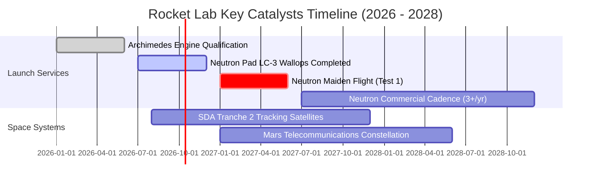

### 9.2 TAM 市場規模分析

```
╔══════════════════════════════════════════════════════════════════╗
║              Rocket Lab 目標市場規模 (TAM) 預測                 ║
╠══════════════════════════════════════════════════════════════════╣
║                                                                  ║
║  小型專屬發射 (Electron/HASTE):    $2.5B (當前滲透率 ~10%)       ║
║  中型商業與國防發射 (Neutron):     $12.0B (主要競爭 Falcon 9)    ║
║  衛星製造與太空系統組件:          $30.0B+ (SDA/商業巨型星座)     ║
║  在軌空間服務與管理:              $5.0B                          ║
║                                                                  ║
║  總計可觸及 TAM: ~$49.5B ｜ 當前 TTM 營收 $769M 滲透率僅 ~1.5%   ║
╚══════════════════════════════════════════════════════════════════╝
```

### 9.3 成長驅動力結構圖

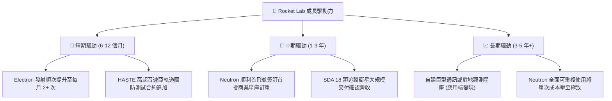

---

## 10. 風險矩陣

### 10.1 風險評分矩陣

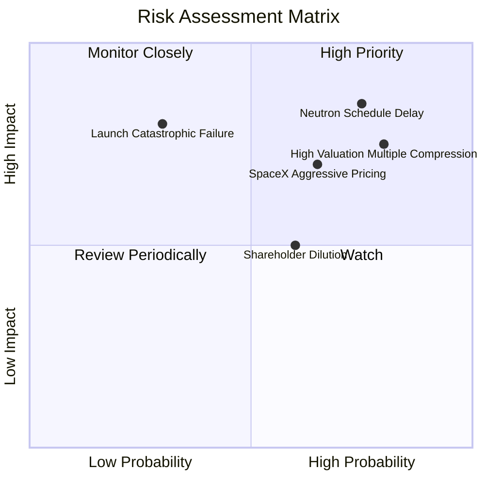

### 10.2 風險清單詳細分析

| # | 風險項目 | 發生機率 | 財務衝擊 | 風險評分 | 緩解措施與對沖機制 |
|---|----------|----------|----------|----------|-------------------|
| 1 | 🔴 **Neutron 研發延宕或首飛失敗** | 高 (75%) | 高 (-30% 估值) | 🔴 8.5/10 | 推進熱試車驗證；保有 $2.30B 現金提供 4 年以上研發容錯期 |
| 2 | 🔴 **極端估值乘數收縮 (P/S 回歸)** | 高 (80%) | 高 (-35% 股價) | 🔴 8.2/10 | 建議投資人分批佈局，不追高，嚴格設定安全邊際買入點 |
| 3 | 🟡 **SpaceX 降價擠壓發射市場** | 中 (65%) | 中 (-15% 利潤) | 🟡 6.8/10 | 太空系統板塊（佔比 68%）具多元化客戶，不純依賴發射利潤 |
| 4 | 🟡 **發射發射任務意外失利** | 低 (30%) | 高 (-20% 短期) | 🟡 6.5/10 | 建立保險賠償架構，複驗生產線，歷史證明 Electron 具備快速復飛能力 |
| 5 | 🟡 **股東股權持續稀釋** | 中 (60%) | 中 (-10% EPS) | 🟡 5.5/10 | 目前淨現金充裕，未來 2 年再度大規模現金增資之機率已顯著降低 |

---

## 11. 投資建議

### 11.1 最終綜合評級雷達圖

```
╔══════════════════════════════════════════════════════════════════╗
║                 Rocket Lab 多維度綜合診斷雷達                    ║
╠══════════════════════════════════════════════════════════════════╣
║                                                                  ║
║  商業模式護城河： [8.0 / 10]  ████████████████░░░░  強大壁壘     ║
║  營收成長動能：   [9.0 / 10]  ██████████████████░░  業界領先     ║
║  財務結構安全：   [9.0 / 10]  ██████████████████░░  淨現金堡壘   ║
║  管理執行能力：   [8.2 / 10]  ████████████████░░░░  執行力頂尖   ║
║  當前盈餘品質：   [5.0 / 10]  ██████████░░░░░░░░░░  仍在虧損中   ║
║  估值安全邊際：   [2.5 / 10]  █████░░░░░░░░░░░░░░░  極度昂貴     ║
║                                                                  ║
║  綜合評分：       [6.8 / 10]  🟡 優秀公司，但非優秀買點 (HOLD)   ║
╚══════════════════════════════════════════════════════════════════╝
```

### 11.2 目標價與隱含報酬率

| 情境 | 目標價 | 隱含報酬率（相對現價 $75.06） | 機率權重 | 核心觸發情境條件 |
|------|--------|------------------------------|----------|------------------|
| 🔴 **悲觀情境** | **$42.00** | **-44.0%** | 25% | Neutron 延至 2028 首飛，市場估值回歸 P/S 15x |
| 🟡 **基準情境** | **$85.00** | **+13.2%** | 55% | 2027 上半年 Neutron 首飛成功，太空系統維持 40% 成長 |
| 🟢 **樂觀情境** | **$120.00** | **+59.9%** | 20% | Neutron 提前熱點火，獲得美國太空軍大額國家安全合約 |
| **加權目標價** | **$81.25** | **+8.2%** | 100% | 12 個月預期報酬有限，風險收益比中立 |

### 11.3 買入時機與觸發因素

```
╔══════════════════════════════════════════════════════════════════╗
║                  ✅ 買入與操作觸發因素 Checklist                 ║
╠══════════════════════════════════════════════════════════════════╣
║                                                                  ║
║  立即買入觸發條件（需多數符合，目前均未達標）：                  ║
║  ☐ 股價拉回至安全邊際買入區間（$48.00 - $55.00，MOS > 15%）     ║
║  ☐ P/S 倍數收斂至 30x 以下                                       ║
║  ☐ Neutron 完成全尺寸第一級靜態點火測試 (Static Fire)            ║
║                                                                  ║
║  加碼觸發條件（持股者）：                                        ║
║  ☐ SDA 衛星合約按期驗收，毛利率突破 40%                          ║
║  ☐ 公布具里程碑意義之 Neutron 商業星座大額發射訂單              ║
║                                                                  ║
║  減碼 / 停損觸發條件（出現以下任一應果斷降低倉位）：              ║
║  ☒ 股價突破 $95.00（透支樂觀情境，P/S > 70x）                   ║
║  ☒ Archimedes 發動機出現重大架構缺陷需重新設計                   ║
║  ☒ 管理層無預警宣布大規模低價折價增資                            ║
╚══════════════════════════════════════════════════════════════════╝
```

### 11.4 投資人適配度分析

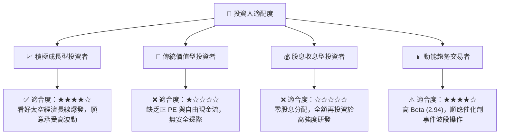

### 11.5 每季財報監控清單（Quarterly Watch List）

| 監控指標 | 理想健康門檻 | 警示門檻（觸發減碼） | 當前最新值 (2026-Q2) |
|----------|--------------|----------------------|----------------------|
| **季度營收 YoY 成長率** | ≥ +45.0% | < +30.0% | **+62.0%** 🟢 |
| **毛利率 (Gross Margin)** | ≥ 35.0% | < 30.0% | **37.3%** 🟢 |
| **單季 FCF 燒錢率** | ≤ -$80.0M | > -$150.0M | **-$110.1M** 🟡 |
| **Electron 季度發射次數** | ≥ 4 次 | < 2 次 | **4 次** 🟢 |
| **現金及短期投資儲備** | ≥ $1.50B | < $1.00B | **$2.30B** 🟢 |
| **Neutron 關鍵節點** | 按表推進 | 宣告延遲 > 6 個月 | 推進中 🟡 |

### 11.6 反面論證：什麼會證明論點錯誤（What Would Change My Mind）

```
╔══════════════════════════════════════════════════════════════════╗
║              ⚠️ 論點失效條件（Disconfirming Evidence）           ║
╠══════════════════════════════════════════════════════════════════╣
║  若發生下列情況，本報告之「中立/持有」論點將失效並應重新評估：    ║
║                                                                  ║
║  【轉為強力買入之反轉條件】：                                    ║
║  1. 市場發生流動性衝擊導致股價大幅超跌至 $45.00 以下（MOS > 30%）║
║  2. Neutron 成功在 2026 年底前提早完成首飛，商業訂單超預期爆發   ║
║  3. 營業現金流 (CFO) 提前 2 季轉正，展現驚人之營運槓桿效益       ║
║                                                                  ║
║  【轉為強力賣出之反轉條件】：                                    ║
║  1. Archimedes 發動機測試出現無法克服之冶金/燃燒不穩定災難       ║
║  2. 太空系統營收成長率連續兩季跌破 20%（成長引擎熄火）          ║
║  3. 全球發射市場出現惡性價格戰，Electron 單次報價跌破 $6.0M      ║
╚══════════════════════════════════════════════════════════════════╝
```

---
> **免責聲明**：本報告為機構級研究分析框架產出，僅供專業投資研究參考，不構成任何買賣要約或投資建議。太空航太產業具有高度技術與工程風險，投資人應獨立評估自身風險承受能力並諮詢合格財務顧問。