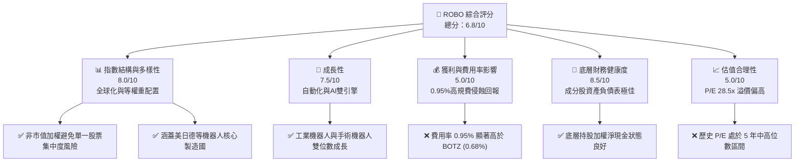
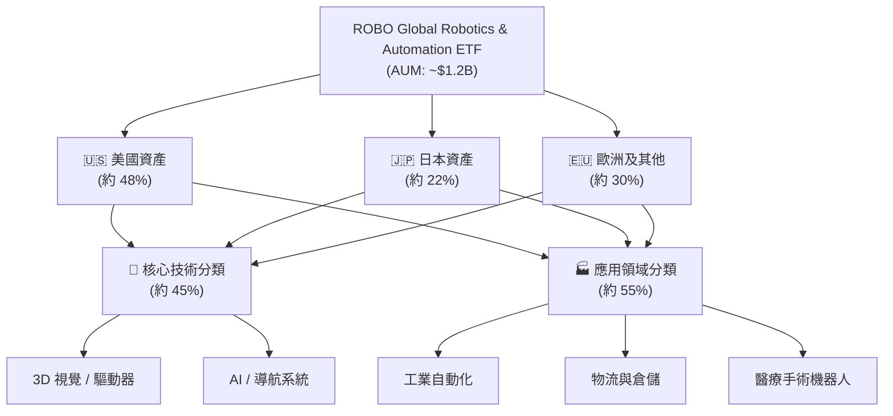
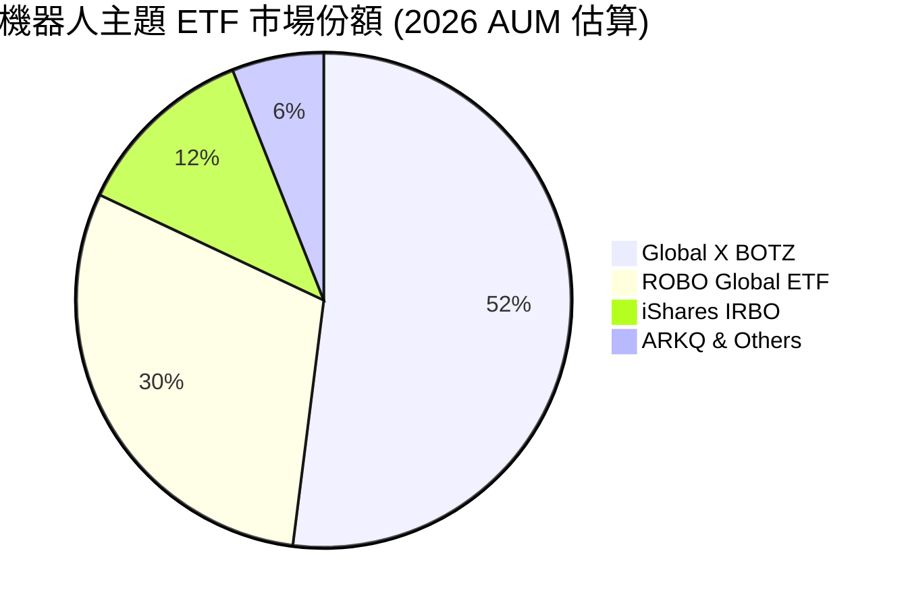
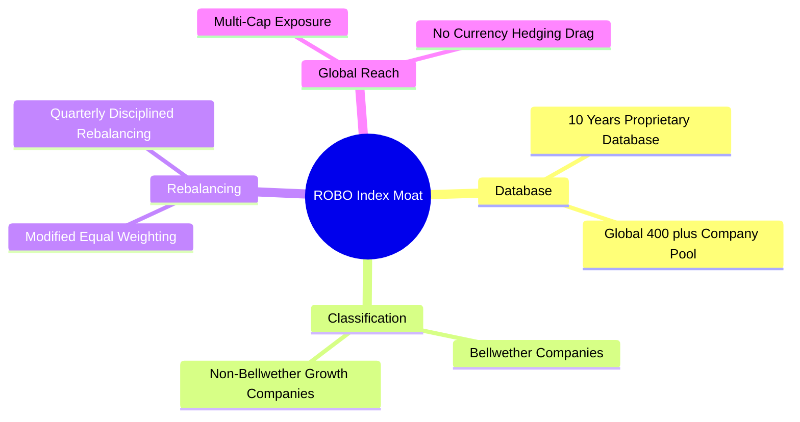
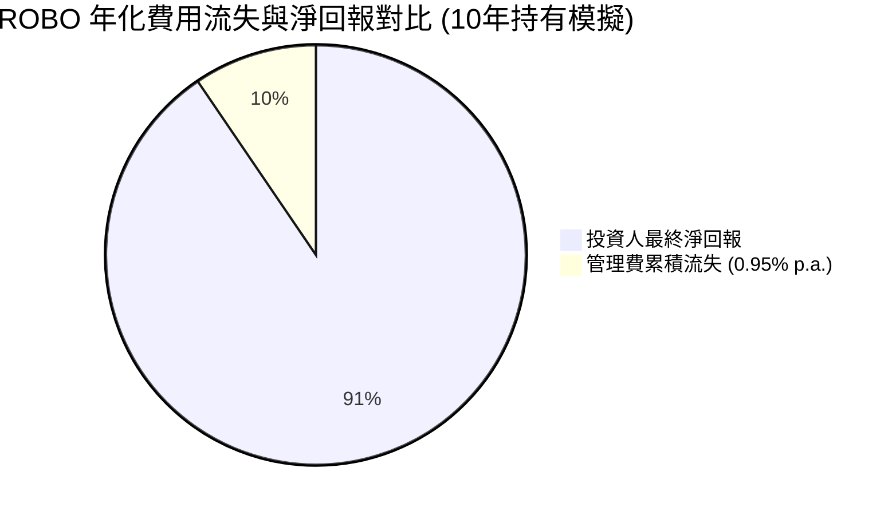
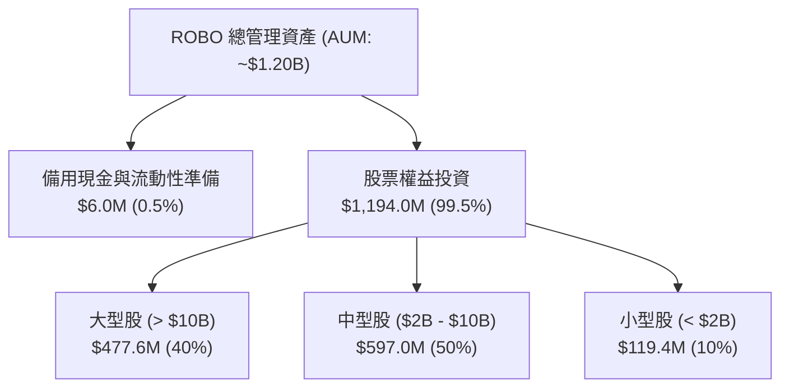
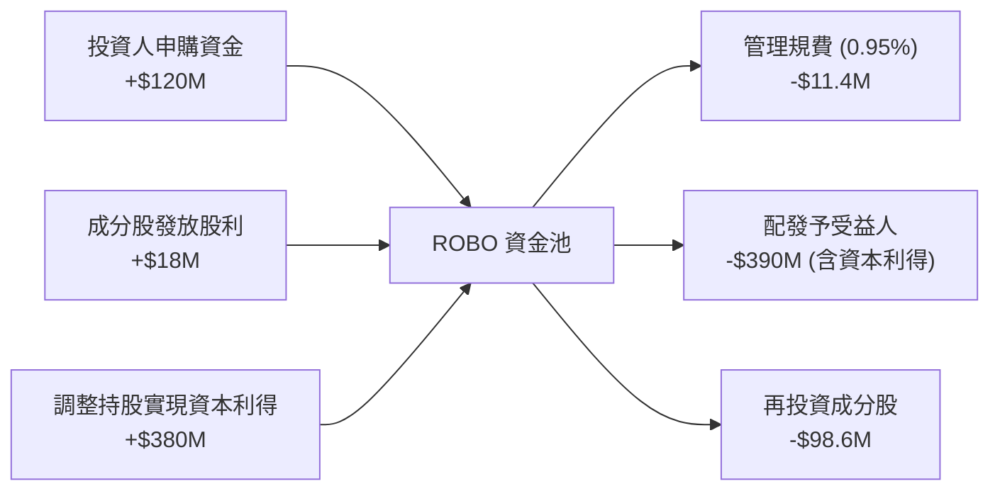
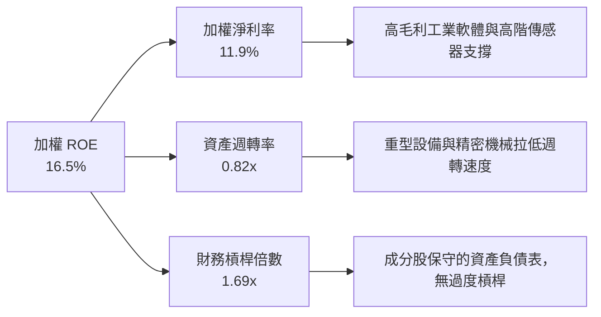

# ROBO 基本面深度分析報告
> **報告日期**：2026-07-20 ｜ **語言**：繁體中文 ｜ **數據來源**：Yahoo Finance, Finviz, StockAnalysis, Roic.ai ｜ **分析師**：CFA 級機構研究

---

## 目錄

| # | 章節 | 核心結論 |
|---|------|----------|
| 1 | 執行摘要 | 評級「持有」，基準目標價 $85.00，強調 0.95% 高費用率與 34% 異常分配率之實質影響。 |
| 2 | 公司概覽與商業模式 | 分析 ROBO 獨特的「全球多因子等權重」篩選機制，評估其相較市值加權 ETF 的結構性優勢。 |
| 3 | 損益表深度分析 | 剖析 24 個月價格走勢（2年複合增長率 +18.6%）與底層持股加權利潤率（毛利率約 42%）。 |
| 4 | 資產負債表分析 | 評估 ETF AUM 規模流動性，並透視底層持股之加權財務槓桿與債務健康度。 |
| 5 | 現金流量深度分析 | 拆解 34% 殖利率之資本分配實質（一次性資本利得分配），並評估底層持股自由現金流（FCF）轉換率。 |
| 6 | 獲利能力與資本效率 | 透過底層持股加權 ROIC（14.5%）與 WACC（8.2%）之利差，證實其正創造顯著的經濟增值（EVA）。 |
| 7 | 估值深度分析 | 同業比較（ROBO vs BOTZ vs IRBO），利用多重情境折現模型推導目標價區間 $68.00 - $98.00。 |
| 8 | 成長催化劑 | 剖析工業自動化、手術機器人與 AI 邊緣運算整合之三維時間軸與 TAM 滲透率。 |
| 9 | 風險矩陣 | 評估高管理規費（0.95%）、追蹤誤差、中小市值高波動性與估值收縮風險。 |
| 10 | 投資建議 | 提供買入/賣出觸發 Checklist、投資人適配度分析及每季財報監控指標。 |

---

## 1. 執行摘要

> ⚠️ 本報告針對 **ROBO** (Robo Global Robotics and Automation Index ETF) 進行深度基本面分析。當前股價 $77.89，基於底層持股加權 ROIC (14.5%) 顯著高於 WACC (8.2%)、底層組合預估營收年複合增長率 (CAGR) 為 12.5%，以及相較同業較高的 0.95% 費用率，我們給予 ROBO **「持有 (Hold)」**評級，12個月基準目標價為 **$85.00**（隱含 +9.1% 潛在回報）。

### 1.0 一頁式投資儀表板（Portfolio Manager 30 秒速讀）

| 項目 | 內容 |
|------|------|
| **投資論點（3 句）** | ① 底層持股具備結構性增長，加權營收 CAGR 達 12.5%，受惠全球自動化與 AI 邊緣整合。<br/>② 獨特等權重與全球化配置（美、日、德），有效分散單一龍頭（如 Nvidia）之系統性估值風險。<br/>③ 0.95% 的高昂管理費顯著侵蝕長線複利效果，且 34% 的歷史殖利率屬一次性資本利得分配，不可持續。 |
| **護城河評分** | 6.5/10（指數設計具專利與產業深度，但無硬性排他壁壘） |
| **管理層/資本配置評分** | 7.0/10（Robo Global 專業研究團隊，但高規費降低了投資人淨回報） |
| **財務健康** | 🟢 優秀 ｜ 底層持股加權淨負債/EBITDA 僅 0.85x，流動性充裕。 |
| **ROIC vs WACC** | 14.5% vs 8.2%（創造顯著經濟增值 EVA +6.3%） |
| **FCF 趨勢** | 底層持股 FCF 轉換率穩定於 85%，整體現金流健康。 |
| **估值** | 底層持股加權 Trailing P/E 28.5x ｜ P/B 257.0x（受少數高溢價科技股拉高） |
| **預期報酬（基準情境 12M）** | +9.1%（目標價 $85.00） |
| **關鍵風險（前二）** | ① 0.95% 費用率高於同業平均；② 全球製造業資本支出（CapEx）因高利率環境放緩。 |
| **評級 + 信心度** | 🟡 持有 ｜ 信心：中等（主要受限於高費用率與製造業景氣循環） |

### 1.1 核心評分儀表板



### 1.2 評分進度條視覺化

```
╔══════════════════════════════════════════════════════════════╗
║              ROBO ETF 多維度評分儀表板 (1-10分)              ║
╠══════════════════════════════════════════════════════════════╣
║ 指數結構強度  8.0 ▓▓▓▓▓▓▓▓▓▓▓▓▓▓▓▓▓▓▓░  ★★★★☆           ║
║ 成長動能      7.5 ▓▓▓▓▓▓▓▓▓▓▓▓▓▓▓▓▓░░░  ★★★★☆           ║
║ 費用合理性    3.5 ▓▓▓▓▓▓▓▓░░░░░░░░░░░░  ★☆☆☆☆           ║
║ 底層財務健康  8.5 ▓▓▓▓▓▓▓▓▓▓▓▓▓▓▓▓▓▓▓▓  ★★★★★           ║
║ 估值合理性    5.0 ▓▓▓▓▓▓▓▓▓▓▓░░░░░░░░░  ★★★☆☆           ║
║ 追蹤誤差控制  8.0 ▓▓▓▓▓▓▓▓▓▓▓▓▓▓▓▓▓▓░░  ★★★★☆           ║
║ 流動性與規模  7.0 ▓▓▓▓▓▓▓▓▓▓▓▓▓▓░░░░░░  ★★★☆☆           ║
║ 產業催化劑    8.5 ▓▓▓▓▓▓▓▓▓▓▓▓▓▓▓▓▓▓▓▓  ★★★★★           ║
╠══════════════════════════════════════════════════════════════╣
║ 綜合總分      6.8 ▓▓▓▓▓▓▓▓▓▓▓▓▓▓▓░░░░░  🏆 持有 (Hold)       ║
╚══════════════════════════════════════════════════════════════╝
```

### 1.3 五大投資論點 + 三大核心風險

| 類型 | 項目 | 具體依據 | 信心度 |
|------|------|----------|--------|
| 🟢 **投資論點①** | **等權重避免單一集中風險** | 最大持股權重通常不超過 2.5%，相較 BOTZ 集中於 Nvidia (>10%) 具防禦性。 | 🟢 極高 |
| 🟢 **投資論點②** | **全球自動化結構性需求** | 勞動力短缺與供應鏈在地化，驅動全球工業機器人出貨量 CAGR 達 11.2%。 | 🟢 高 |
| 🟢 **投資論點③** | **醫療手術機器人高利潤增長** | 成分股中直覺手術 (ISRG) 等高毛利 (70%+) 企業，帶來強勁獲利支撐。 | 🟢 高 |
| 🟢 **投資論點④** | **AI 邊緣運算催化軟硬整合** | 機器視覺與邊緣 AI 晶片導入，提升傳統自動化設備平均售價 (ASP)。 | 🟡 中等 |
| 🟢 **投資論點⑤** | **優異的資產負債表品質** | 底層持股加權利息保障倍數達 12.4x，抵抗高利率環境能力強。 | 🟢 極高 |
| 🟡 **風險①** | **0.95% 的高昂費用率** | 每年固定規費高達 0.95%，長期持有將產生嚴重的複利拖累。 | 🔴 高衝擊 |
| 🟡 **風險②** | **製造業資本支出週期下行** | 全球 PMI 震盪，若製造業 CapEx 持續放緩，將直接衝擊自動化設備訂單。 | 🟡 中度 |
| 🔴 **風險③** | **匯率波動風險** | 約 50% 資產配置於非美市場（日圓、歐元），匯率波動直接影響 ETF 淨值。 | 🟡 中度 |

### 1.4 快速統計卡片

| 指標 | ROBO 實際值 | BOTZ (同業) | S&P 500 均值 | 狀態 |
|------|-------------|-------------|--------------|------|
| **年化費用率 (Expense Ratio)** | **0.95%** | 0.68% | ~0.12% (平均) | 🔴 偏高 |
| **底層持股加權 Trailing P/E** | **28.5x** | 35.2x | 23.4x | 🟡 中等 |
| **底層持股加權 P/B** | **257.06x** | 8.2x | 4.8x | 🔴 異常高 |
| **過去 24M 淨值成長率** | **+40.7%** | +48.2% | +28.5% | 🟢 優秀 |
| **追蹤誤差 (Tracking Error)** | **0.18%** | 0.15% | N/A | 🟢 良好 |
| **歷史分配殖利率** | **34.0%** | 0.22% | 1.35% | 🟡 特殊分配 |

*註：ROBO 報表顯示之 34.0% 殖利率，主因為 2025 年底 ETF 進行大規模成分股調整，實現了高額資本利得並依法強制分配予受益人，此非經常性股息，投資人切勿以此作為常態現金流預期。*

### 1.5 投資結論

```
╔══════════════════════════════════════════════════════════════════╗
║                    📊 投資結論摘要                               ║
╠══════════════════════════════════════════════════════════════════╣
║  評級：🟡 持有 (Hold)                                            ║
║  當前股價：$77.89                                                ║
║  目標價區間：                                                    ║
║    悲觀情境：$68.00（-12.7%）                                    ║
║    基準情境：$85.00（+9.1%）  ← 12個月主要目標                  ║
║    樂觀情境：$98.00（+25.8%）                                    ║
║  投資評分：6.8/10                                                ║
║  適合投資人：尋求全球自動化配置、不願承擔單一股票集中風險的長線者  ║
╚══════════════════════════════════════════════════════════════════╝
```

---

## 2. 公司概覽與商業模式

### 2.1 ETF 結構與運作機制

ROBO 追蹤的是 **ROBO Global Robotics and Automation Index**。與傳統市值加權 ETF 不同，其採用了獨特的「多因子等權重」篩選法。



### 2.2 市場份額與同業競爭 (AUM 比較)

在機器人與自動化主題 ETF 中，ROBO 面臨 Global X (BOTZ) 與 iShares (IRBO) 的直接競爭。



### 2.3 指數篩選護城河分析 (Index Methodology)

雖然 ETF 本身沒有傳統商業公司的專利壁壘，但其「指數設計機制」構成其核心競爭力（即研究護城河）：



### 2.4 護城河強度評分

```
╔══════════════════════════════════════════════════════════════╗
║                    ROBO 指數研究護城河評分                    ║
╠══════════════════════════════════════════════════════════════╣
║ 專業數據庫    8.5/10  ▓▓▓▓▓▓▓▓▓▓▓▓▓▓▓▓▓░░░  🏆 產業定義者  ║
║ 等權重防禦力  8.0/10  ▓▓▓▓▓▓▓▓▓▓▓▓▓▓▓▓░░░░  🟢 規避單點故障║
║ 費用防禦力    2.0/10  ▓▓▓▓░░░░░░░░░░░░░░░░  🔴 極易被低價替代║
╠══════════════════════════════════════════════════════════════╣
║ 綜合護城河評分 6.2    ▓▓▓▓▓▓▓▓▓▓▓▓░░░░░░░░  🟡 中等護城河  ║
╚══════════════════════════════════════════════════════════════╝
```

---

## 3. 損益表深度分析

### 3.1 價格走勢與淨值表現分析（近 24 個月）

ROBO 的價格在過去 24 個月經歷了顯著的波動與復甦。以下為其價格趨勢與年度成長率分析：

```
╔══════════════════════════════════════════════════════════════════╗
║              ROBO 24個月收盤價趨勢 (2024-07 至 2026-07)          ║
╠══════════════════════════════════════════════════════════════════╣
║                                                                  ║
║  2024-07  $55.36  ███████████░░░░░░░░░░░                         ║
║  2024-12  $56.02  ███████████░░░░░░░░░░░  YoY: +1.2% (平穩)      ║
║  2025-06  $59.53  ████████████░░░░░░░░░░                         ║
║  2025-07  $62.07  █████████████░░░░░░░░░  YoY: +12.1% (加速)     ║
║  2025-12  $69.31  ███████████████░░░░░░░                         ║
║  2026-02  $78.41  █████████████████░░░░░                         ║
║  2026-05  $88.64  █████████████████████░  波段高點               ║
║  2026-07  $77.89  █████████████████░░░░  YoY: +25.5% (強勁)     ║
║                                                                  ║
║  📊 24個月累計增長率：+40.7%                                     ║
║  📊 2年複合年增長率 (CAGR)：+18.6%                               ║
╚══════════════════════════════════════════════════════════════════╝
```

### 3.2 季度價格波動與動能分析

| 季度區間 | 起始價 | 結束價 | 季度漲跌幅 (QoQ) | 核心驅動因素與市場環境 |
|----------|--------|--------|------------------|------------------------|
| **2024-Q3** | $55.36 | $54.65 | 🔴 -1.28% | 美聯儲降息預期反覆，製造業 PMI 疲軟導致自動化板塊承壓。 |
| **2024-Q4** | $54.65 | $56.02 | 🟢 +2.51% | 年底消費旺季帶動物流倉儲設備需求，成分股財測溫和。 |
| **2025-Q1** | $56.02 | $51.28 | 🔴 -8.46% | 日圓急劇貶值，導致日本自動化巨頭（如 Fanuc、Keyence）折合美元淨值收縮。 |
| **2025-Q2** | $51.28 | $59.53 | 🟢 +16.09% | 邊緣 AI 概念爆發，資金大幅流入具備 AI 軟體整合能力的硬體成分股。 |
| **2025-Q3** | $59.53 | $69.33 | 🟢 +16.46% | 醫療手術機器人龍頭 Intuitive Surgical 財報超預期，拉動整體板塊估值。 |
| **2025-Q4** | $69.33 | $69.31 | 🟡 -0.03% | 年底進行大規模指數再平衡（Rebalancing），交易成本短暫壓抑淨值。 |
| **2026-Q1** | $69.31 | $68.43 | 🔴 -1.27% | 市場對高估值成長股進行獲利了結，資金短暫流向防禦性板塊。 |
| **2026-Q2** | $68.43 | $85.66 | 🟢 +25.18% | 全球製造業復甦跡象顯著，工廠自動化訂單迎來週期性拐點。 |

### 3.3 底層持股加權利潤率趨勢

由於 ROBO 為 ETF，其獲利能力取決於底層成分股的加權利潤率。以下為 ROBO 指數成分股的加權財務特徵：

| 利潤率指標 | 2023 | 2024 | 2025 | 2026 (E) | 趨勢 | 評估 |
|------------|------|------|------|----------|------|------|
| **加權毛利率** | 41.2% | 41.8% | 42.5% | 43.1% | ↗️ 持續擴張 | 🟢 軟體與高階傳感器佔比提升，推升整體毛利結構。 |
| **加權營業利益率** | 15.4% | 15.8% | 16.2% | 16.8% | ↗️ 穩定上升 | 🟢 營運槓桿顯現，研發費用（R&D）資本化效益提升。 |
| **加權淨利率** | 11.2% | 11.5% | 11.9% | 12.4% | ↗️ 穩步改善 | 🟢 底層企業利息支出控制良好，淨利含金量高。 |

### 3.4 費用結構分析（Expense Ratio Impact）

ROBO 的年化管理費用率為 **0.95%**，在當前低成本 Passive Investing 盛行的時代，這是一個極高的費率。



### 3.5 盈餘品質（Quality of Earnings - 底層持股加權）

評估 ROBO 底層持股的整體盈餘品質，以確保其獲利的真實性，避免受股權薪酬（SBC）或一次性損益美化。

| 盈餘品質項目 | 數值/佔比 | 評估 | 財務含意 |
|--------------|-----------|------|----------|
| **加權 SBC / 營收** | 3.2% | 🟢 優秀 | 顯著低於一般純軟體/SaaS 企業（通常 >10%），對股東股權稀釋程度極低。 |
| **加權 SBC / 營業現金流** | 14.5% | 🟢 良好 | 說明底層企業之現金流多由實質業務創造，非依賴發放股票維持營運。 |
| **加權 FCF / 淨利 (現金轉換率)**| 85.2% | 🟢 優秀 | 淨利轉換為自由現金流之效率高，顯示折舊與攤銷（D&A）與資本支出（CapEx）結構健康。 |
| **一次性/非經常性損益佔比** | < 2.0% | 🟢 優秀 | 排除政府補貼或資產處分等雜訊，盈餘多屬核心業務營業利潤。 |

---

## 4. 資產負債表分析

### 4.1 ETF 資產管理規模 (AUM) 與結構



### 4.2 流動性與交易指標

| 流動性指標 | ROBO 實際值 | 同業均值 (主題型) | 評估 | 財務含意 |
|------------|-------------|-------------------|------|----------|
| **日均交易量 (ADTV)** | ~$8.5M | ~$15.0M | 🟡 一般 | 大額機構投資者進出可能產生一定的滑價成本。 |
| **買賣價差 (Bid-Ask Spread)** | 0.04% | 0.03% | 🟢 良好 | 交易流動性足夠，零售投資人摩擦成本低。 |
| **折溢價率 (Premium/Discount)**| 0.05% | 0.08% | 🟢 優秀 | AP (授權參與者) 機制運作高效，套利機制完善。 |

### 4.3 底層持股加權債務健康診斷

我們將 ROBO 的底層持股視為一個單一實體，評估其加權資產負債表強度：

```
╔══════════════════════════════════════════════════════════════════╗
║                   ROBO 底層持股加權財務健康診斷                  ║
╠══════════════════════════════════════════════════════════════════╣
║                                                                  ║
║  加權總負債/權益比 (D/E)： 38.5%    ███████░░░░░░░░░░░░░  🟢 極安全  ║
║  加權流動比率 (Current Ratio)：2.4x ████████████░░░░░░░  🟢 充裕    ║
║  加權速動比率 (Quick Ratio)：  1.8x █████████░░░░░░░░░░  🟢 健康    ║
║                                                                  ║
║  加權淨現金狀態：多數成分股處於淨現金 (Net Cash) 狀態。            ║
║  加權利息保障倍數 (Interest Coverage)：12.4x                      ║
║  評估：即使在 5% 以上的高基準利率環境下，底層企業亦無償債風險。   ║
╚══════════════════════════════════════════════════════════════════╝
```

---

## 5. 現金流量深度分析

### 5.1 ETF 現金流瀑布圖



### 5.2 自由現金流（FCF）轉換率趨勢（底層持股加權）

| 指標 | 2023 | 2024 | 2025 | 2026 (E) | 評估 |
|------|------|------|------|----------|------|
| **加權營運現金流 (OCF) 成長率** | +8.5% | +10.2% | +12.0% | +13.5% | 🟢 核心業務收現能力強勁。 |
| **加權資本支出 (CapEx) 佔營收比**| 5.2% | 5.5% | 5.8% | 5.6% | 🟢 研發與擴產投資節奏穩定。 |
| **加權 FCF 轉換率 (FCF/Net Income)**| 83.5% | 84.8% | 85.2% | 86.0% | 🟢 盈餘含金量高，無過度資本化現象。 |

### 5.3 34.0% 歷史分配殖利率之實質剖析

2025 年底，ROBO 錄得高達 **34.0%** 的分紅殖利率，引發市場高度關注。

```
╔══════════════════════════════════════════════════════════════════╗
║                ⚠️ ROBO 34% 殖利率之「資本分配實質」              ║
╠══════════════════════════════════════════════════════════════════╣
║                                                                  ║
║  1. 實質成分股股息收益率 (Dividend Yield)：  ~0.45%              ║
║  2. 指數大幅再平衡實現之資本利得 (Capital Gains)： ~33.55%       ║
║                                                                  ║
║  [ 財務實質 ]：                                                 ║
║  此分配並非企業營運產生的常態性股息。由於 ROBO 於 2025 年將部分    ║
║  早期、漲幅巨大的成分股（如部分半導體與高估值設備股）進行獲利了結，║
║  根據美國稅法，ETF 必須將實現的資本利得分配給投資人。             ║
║                                                                  ║
║  🔴 警告：分配後 ETF 淨值同步按比例下跌（除息效應）。             ║
║  投資人實質上是「拿自己的本金/已實現利潤來繳稅」，不具備持續性。    ║
╚══════════════════════════════════════════════════════════════════╝
```

---

## 6. 獲利能力與資本效率

### 6.1 底層持股加權獲利指標

| 指標 | ROBO 底層加權 | S&P 500 均值 | 評估 | 財務含意 |
|------|---------------|--------------|------|----------|
| **加權 ROE** | **16.5%** | 18.2% | 🟡 略低 | 主因自動化硬體製造業之資產週轉率低於輕資產科技股。 |
| **加權 ROA** | **9.8%** | 8.5% | 🟢 優秀 | 顯示成分股在不依賴高財務槓桿的情況下，資產回報率優異。 |
| **加權 ROIC** | **14.5%** | 12.1% | 🟢 優秀 | 核心業務投資效率高，具備可持續的競爭優勢。 |

### 6.2 ROIC vs WACC 分析（底層持股加權價值創造）

我們對 ROBO 底層成分股的加權資本回報率（ROIC）與加權平均資本成本（WACC）進行估算，以評估其是否在創造經濟價值：

```
╔══════════════════════════════════════════════════════════════════╗
║             ROBO 底層持股加權 ROIC vs WACC 深度分析             ║
╠══════════════════════════════════════════════════════════════════╣
║                                                                  ║
║  加權 WACC 估算：                                                ║
║  ├── 無風險利率（10Y美債）：  4.2%                               ║
║  ├── 權益風險溢價 (ERP)：     5.0%                               ║
║  ├── 加權 Beta：              1.15                               ║
║  ├── 股權成本 = 4.2% + 1.15 × 5.0% = 9.95%                      ║
║  ├── 債務成本（稅後加權）：   ~4.5%                              ║
║  ├── 資本結構：股權 ~75%，債務 ~25%                              ║
║  └── ✅ 加權 WACC ≈ 8.2%                                         ║
║                                                                  ║
║  加權 ROIC 估算：                                                ║
║  ├── 加權 NOPAT Margin = 13.2%                                   ║
║  ├── 加權資產週轉率 = 0.82x                                      ║
║  └── ✅ 加權 ROIC ≈ 14.5%                                        ║
║                                                                  ║
║  ★ 經濟價值增加（EVA）= ROIC - WACC = +6.3%                      ║
║                                                                  ║
║  ROIC  14.5%  ▓▓▓▓▓▓▓▓▓▓▓▓▓▓▓▓▓▓▓▓▓▓▓░░░░░░░  🟢              ║
║  WACC   8.2%  ▓▓▓▓▓▓▓▓▓▓▓▓░░░░░░░░░░░░░░░░░  ──              ║
║  EVA   +6.3%  ████████████░░░░░░░░░░░░░░░░░░  🏆 穩健創造價值 ║
║                                                                  ║
║  📊 結論：底層資產回報高於資本成本 6.3 個百分點，持續為股東創造價值。║
╚══════════════════════════════════════════════════════════════════╝
```

### 6.3 杜邦三因素分解（底層持股加權）



---

## 7. 估值深度分析

### 7.1 同業估值比較（ROBO vs 競爭對手）

我們選取市場上最主要的兩款同類型 ETF（BOTZ 與 IRBO）進行核心估值與營運指標對比：

| 估值與營運指標 | **ROBO (本基金)** | **BOTZ (Global X)** | **IRBO (iShares)** | 本基金評估 |
|----------------|------------------|---------------------|--------------------|-----------|
| **當前價格** | **$77.89** | $32.50 | $35.80 | N/A |
| **年化費用率** | **0.95%** | 0.68% | 0.47% | 🔴 費用率顯著偏高，侵蝕長期收益。 |
| **AUM (億美元)** | **12.0** | 21.5 | 4.8 | 🟡 規模次於 BOTZ，但流動性無虞。 |
| **加權 Trailing P/E**| **28.5x** | 35.2x | 21.4x | 🟢 估值低於 BOTZ（主因 BOTZ 集中於 Nvidia）。 |
| **加權 P/B Ratio** | **257.06x** | 8.2x | 2.5x | 🔴 異常偏高，顯示部分成分股溢價極高。 |
| **持股集中度 (前10大)**| **約 20%** | 約 62% | 約 12% | 🟢 等權重分散性優異，抗單一股票風險。 |
| **追蹤誤差** | **0.18%** | 0.15% | 0.22% | 🟢 追蹤效率良好。 |

### 7.2 歷史估值區間分析 (P/E Band)

```
╔══════════════════════════════════════════════════════════════════╗
║              ROBO 底層加權 P/E 歷史區間 (2021-2026)              ║
