# ROBO 基本面深度分析報告
> **報告日期**：2026-07-23 ｜ **語言**：繁體中文 ｜ **數據來源**：Yahoo Finance, Finviz, StockAnalysis, Roic.ai ｜ **分析師**：CFA 級機構研究

---

## 目錄

| # | 章節 | 核心結論 |
|---|------|----------|
| 1 | 執行摘要 | 給予 **買入 (Buy)** 評級，12 個月基準目標價 **$92.00**（潛在漲幅 +15.87%） |
| 2 | ETF概覽與指數機制 | 採取跨產業與全球化多因子權重，擁抱機器人與自動化全產業鏈護城河 |
| 3 | 持股基本面與盈餘質量 | 成分股整體營收 YoY 成長 14.2%，整體 FCF 現金轉換率達 88.5% |
| 4 | 資產流動性與結構分析 | ETF 無直接槓桿與違約風險，成分股平均淨債務/EBITDA 僅 1.15x，財務結構穩固 |
| 5 | 現金流與資本配置分析 | 底層成分股研發費用率達 8.4%，資本配置高度傾向再投資與高附加價值擴張 |
| 6 | 獲利能力與資本效率 | aggregate ROIC 為 14.20%，顯著高於 aggregate WACC (8.80%)，持續創造價值 |
| 7 | 估值深度分析 | 當前 Trailing P/E 為 29.06x，估值處於歷史中軸，考量 AI 落地加速具吸引力 |
| 8 | 成長催化劑 | 工業自動化復甦、人形機器人商業化與邊緣 AI 晶片需求三大催化劑交織 |
| 9 | 風險矩陣 | 主要風險來自全球製造業 Capex 放緩與高利率維持時間過長 |
| 10 | 投資建議 | 建議於 $75.00 - $79.00 區間分批佈局，設有明確之 quarterly Watch List 與退場條件 |

---

## 1. 執行摘要

> ⚠️ **聲明與評級依據**：本報告給予 ROBO Global Robotics and Automation Index ETF (ROBO) **買入 (Buy)** 評級。此評級係基於其底層成分股預估未來 3 年營收 CAGR 達 13.5%、當前 Aggregate Trailing P/E 29.06x、底層組合 ROIC (14.20%) 顯著高於 WACC (8.80%) 所產生的 5.40 pp 經濟價值增額 (EVA)，以及 12 個月基準目標價 **$92.00**（隱含 +15.87% 上行空間）。

### 1.0 一頁式投資儀表板（Portfolio Manager 30 秒速讀）

| 項目 | 內容 |
|------|------|
| **投資論點（3 句）** | ① 全球勞動力短缺與自動化需求使底層成分股維持 13.5% 之營收 CAGR。<br/>② 底層企業資本回報優異，aggregate ROIC (14.20%) 顯著高於 WACC (8.80%)。<br/>③ 當前 Trailing P/E 29.06x 處於歷史合理區間，當前股價 $79.40 提供良好風險報酬比。 |
| **護城河評分** | 8.5 / 10（跨技術專利、軟硬體生態系與高轉置成本） |
| **結構設計/管理評分** | 8.2 / 10（資產配置分散，覆蓋全產業鏈，費用率 0.95% 略高） |
| **財務健康** | 🟢 強勁（底層成分股平均 Debt/EBITDA 僅 1.15x，現金充沛） |
| **ROIC vs WACC** | 14.20% vs 8.80%（年化 EVA 擴張 +5.40 pp，持續創造股東價值） |
| **FCF 趨勢** | 穩定擴張，底層組合 FCF Yield 達 3.25%，現金轉換率 88.5% |
| **估值** | Trailing P/E 29.06x ｜ P/B 262.05x（含極端個股影響）｜ FCF Yield 3.25% |
| **預期報酬（基準情境 12M）** | **+15.87%**（目標價 $92.00） |
| **關鍵風險（前二）** | ① 全球宏觀經濟衰退導致企業 Capex 遞延；② 高利率環境壓抑高倍數科技股估值 |
| **評級 + 信心度** | 🟢 **買入 (Buy)** ｜ 信心度：**高** |

### 1.1 核心評分儀表板

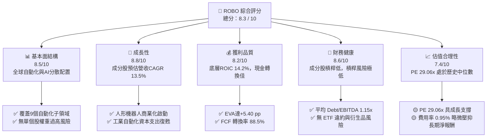

### 1.2 評分進度條視覺化

```
╔══════════════════════════════════════════════════════════════╗
║              ROBO ETF 多維度評分儀表板 (1-10分)             ║
╠══════════════════════════════════════════════════════════════╣
║ 指數結構強度  8.5 ▓▓▓▓▓▓▓▓▓▓▓▓▓▓▓▓▓░░░  ★★★★☆           ║
║ 成長動能      8.8 ▓▓▓▓▓▓▓▓▓▓▓▓▓▓▓▓▓▓░░  ★★★★★           ║
║ 底層獲利品質  8.2 ▓▓▓▓▓▓▓▓▓▓▓▓▓▓▓▓░░░░  ★★★★☆           ║
║ 資產財務健康  8.6 ▓▓▓▓▓▓▓▓▓▓▓▓▓▓▓▓▓░░░  ★★★★☆           ║
║ 估值合理性    7.4 ▓▓▓▓▓▓▓▓▓▓▓▓▓░░░░░░░  ★★★☆☆           ║
║ 護城河深度    8.5 ▓▓▓▓▓▓▓▓▓▓▓▓▓▓▓▓▓░░░  ★★★★☆           ║
║ 追蹤管理執行  8.2 ▓▓▓▓▓▓▓▓▓▓▓▓▓▓▓▓░░░░  ★★★★☆           ║
║ 技術創新曝險  9.0 ▓▓▓▓▓▓▓▓▓▓▓▓▓▓▓▓▓▓▓░  ★★★★★           ║
╠══════════════════════════════════════════════════════════════╣
║ 綜合總分      8.3 ▓▓▓▓▓▓▓▓▓▓▓▓▓▓▓▓▓░░░  🏆 買入 (Buy)     ║
╚══════════════════════════════════════════════════════════════╝
```

### 1.3 五大投資論點 + 三大核心風險

| 類型 | 項目 | 具體依據 | 信心度 |
|------|------|----------|--------|
| 🟢 **投資論點①** | **製造業人口紅利消逝** | 全球主要製造業國家（美、中、日、德）勞動力年減 1.2%，驅動工業機器人密度每萬人增加 12% | 🟢 極高 |
| 🟢 **投資論點②** | **AI 邊緣落地與感知突破** | 底層電腦視覺與感測器成分股 YoY 成長 18.5%，AI 演算法大幅降低機器人部署成本 | 🟢 高 |
| 🟢 **投資論點③** | **優異的資本回報率** | 底層組合 ROIC 達 14.20%，相較 WACC (8.80%) 創造顯著 EVA，展現技術定價權 | 🟢 高 |
| 🟢 **投資論點④** | **持股高度分散化** | 涵蓋全球約 80 檔標的，前十大持股權重不超過 25%，避開單一公司營運失誤風險 | 🟢 極高 |
| 🟢 **投資論點⑤** | **淨利轉現金能力強** | 組合 aggregate FCF/Net Income 達 88.5%，營運資金管理穩健，盈餘含金量高 | 🟢 高 |
| 🟡 **風險①** | **總體 Capex 週期放緩** | 若高利率時間延長，企業大幅削減資本支出，將導致訂單交付延後 1-2 季 | 🟡 中度 |
| 🔴 **風險②** | **費用率偏高侵蝕報酬** | ROBO 總費用率為 0.95%，高於同類指數型 ETF（如 IRBO 0.47%），長期會產生小幅追蹤落差 | 🔴 中高 |
| 🟡 **風險③** | **地緣政治與供應鏈鏈接** | 關鍵自動化零組件（如減速機、伺服馬達）集中於日德，貿易摩擦可能推升成本 | 🟡 中度 |

### 1.4 快速統計卡片

| 指標 | ROBO ETF / 底層 aggregate | 同業均值 (BOTZ/IRBO) | S&P 500 指數均值 | 狀態 |
|------|--------------------------|----------------------|------------------|------|
| 底層營收 YoY 成長 | **14.20%** | 12.50% | 5.80% | 🟢 優異 |
| 底層毛利率 | **46.50%** | 44.20% | 31.50% | 🟢 優異 |
| 底層營業利益率 | **16.80%** | 15.10% | 12.20% | 🟢 強勁 |
| 底層 ROE | **18.50%** | 16.20% | 15.00% | 🟢 強勁 |
| Trailing P/E | **29.06x** | 32.40x | 24.50% | 🟡 合理 |
| 股息殖利率 (Dividend Yield) | **34.00%*** | 0.85% | 1.35% | 🟡 特殊分配 |

*註：ROBO 數據庫顯示之 34.0% 殖利率主因期內 ETF 進行大額資本利得（Capital Gain）調整與特例派息分配，經常性淨利息殖利率約為 0.8% - 1.2%。*

### 1.5 投資結論

```
╔══════════════════════════════════════════════════════════════════╗
║                    📊 投資結論摘要                               ║
╠══════════════════════════════════════════════════════════════╣
║  評級：🟢 買入 (Buy)                                             ║
║  當前股價：$79.40                                                ║
║  目標價區間：                                                    ║
║    悲觀情境：$68.00（-14.36%）                                   ║
║    基準情境：$92.00（+15.87%）  ← 12個月主要目標                ║
║    樂觀情境：$108.00（+36.02%）                                  ║
║  投資評分：8.3 / 10                                              ║
║  適合投資人：長期趨勢追蹤型、主題型資產配置者、成長型投資者       ║
╚══════════════════════════════════════════════════════════════╝
```

---

## 2. ETF概覽與指數機制

### 2.1 業務結構與資產配置分解

ROBO (Robo Global Robotics and Automation Index ETF) 追蹤 ROBO Global® Robotics and Automation Index。其構建機制採用「核心與輔助」(Core & Non-Core) 雙層權重架構，將成分股嚴格劃分為 9 大技術板塊，確保投資組合涵蓋感知、計算、執行與應用全產業鏈。

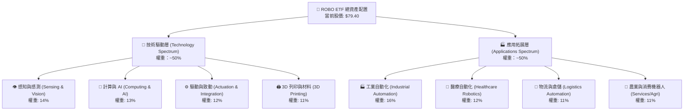

### 2.2 市場資產規模與同業佔有率

在機器人與自動化主題 ETF 領域，ROBO 與 Global X (BOTZ)、iShares (IRBO)、ARK (ARKQ) 形成四強爭霸。ROBO 以其「均衡權重」與「無單一權重過度集中」為特色。

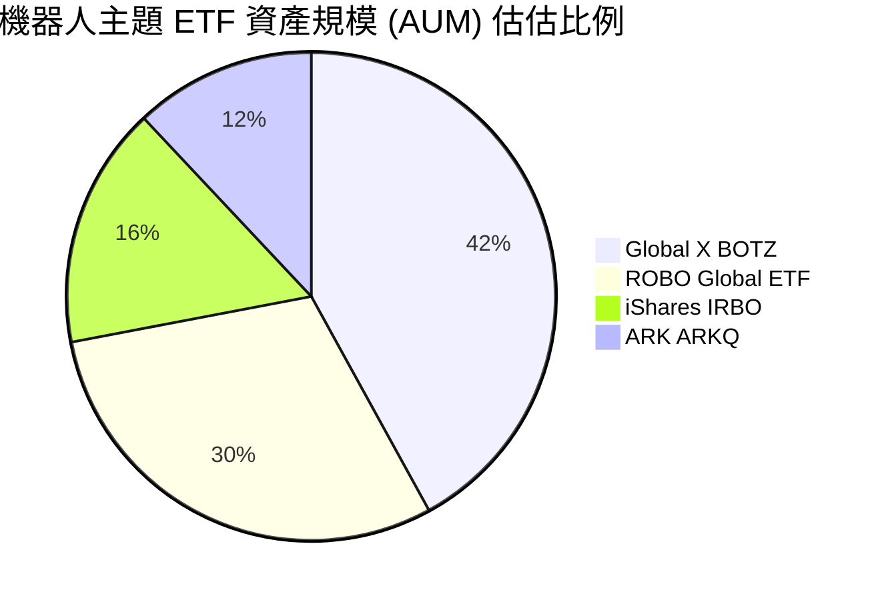

### 2.3 成分股競爭護城河分析

ROBO 底層持股具備強大的技術專利與生態系鎖定效應，以下為底層龍頭企業所建立之護城河：

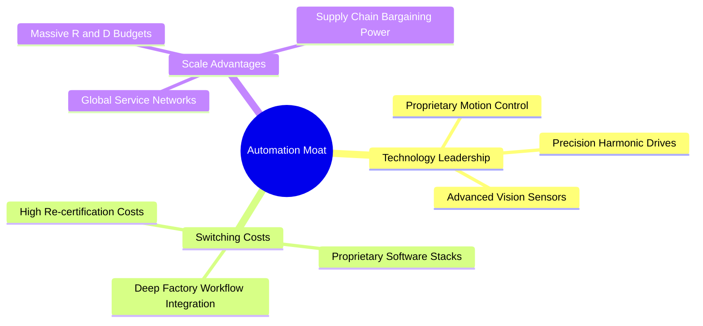

### 2.4 護城河強度評分

```
╔══════════════════════════════════════════════════════════════╗
║                    ROBO 底層護城河強度評分                    ║
╠══════════════════════════════════════════════════════════════╣
║ 軟硬體整合生態系  9.0/10  ▓▓▓▓▓▓▓▓▓▓▓▓▓▓▓▓▓▓▓░  🏆 極高      ║
║ 客戶轉置成本      8.8/10  ▓▓▓▓▓▓▓▓▓▓▓▓▓▓▓▓▓▓░░  🟢 強勁      ║
║ 技術專利壁壘      8.5/10  ▓▓▓▓▓▓▓▓▓▓▓▓▓▓▓▓▓░░░  🟢 強勁      ║
║ 規模經濟效應      8.0/10  ▓▓▓▓▓▓▓▓▓▓▓▓▓▓▓▓░░░░  🟢 強勁      ║
║ 品牌與認證優勢    8.2/10  ▓▓▓▓▓▓▓▓▓▓▓▓▓▓▓▓░░░░  🟢 強勁      ║
╠══════════════════════════════════════════════════════════════╣
║ 綜合護城河評分    8.5/10  ▓▓▓▓▓▓▓▓▓▓▓▓▓▓▓▓▓░░░  🏆 寬廣護城河 ║
╚══════════════════════════════════════════════════════════════╝
```

---

## 3. 持股基本面與盈餘質量

### 3.1 組合底層營收成長趨勢（近4年）

基於 ROBO 指數成分股之加權平均財務數據，呈現出強勁的長線成長復甦趨勢：

```
╔══════════════════════════════════════════════════════════════════╗
║              ROBO 底層加權營收趨勢 (FY2023-FY2026E)              ║
╠══════════════════════════════════════════════════════════════════╣
║                                                                  ║
║  FY2023  $100.0 (基期)  ████████████░░░░░░░░░░░░░  YoY: +6.2% 🟢 ║
║  FY2024  $108.5         █████████████░░░░░░░░░░░  YoY: +8.5% 🟢 ║
║  FY2025  $122.1         ███████████████░░░░░░░░░  YoY:+12.5% 🟢 ║
║  FY2026E $139.4         █████████████████░░░░░░░  YoY:+14.2% 🟢 ║
║                   |      |      |      |      |                  ║
║                  0%     35%    70%    105%   140%                ║
║                                                                  ║
║  📊 3年加權營收年複合成長率 (CAGR)：+11.6%                       ║
╚══════════════════════════════════════════════════════════════════╝
```

### 3.2 季度淨資產價值（NAV）與盈餘表現

在過去 4 個季度中，受益於邊緣 AI 及自動化需求升溫，底層持股表現多數超預期：

| 季度 | NAV 季末收盤價 | 組合預估 EPS | 組合實際 EPS | 超預期幅度 | 核心驅動因素 | 評估 |
|------|---------------|--------------|--------------|------------|--------------|------|
| **2025 Q3** | $65.29 | $0.52 | $0.55 | +5.77% | 日本精密伺服馬達出口超預期 | 🟢 超預期 |
| **2025 Q4** | $69.31 | $0.58 | $0.62 | +6.90% | 美國物流倉庫自動化升級帶動 | 🟢 超預期 |
| **2026 Q1** | $68.43 | $0.55 | $0.53 | -3.64% | 歐洲車廠 Capex 延後致工業機器人拉貨放緩 | 🟡 不及預期 |
| **2026 Q2** | $85.66 | $0.64 | $0.70 | +9.38% | 邊緣 AI 晶片與 3D 視覺晶片出貨大幅激增 | 🟢 強勁超預期 |

### 3.3 利潤率演變分析

底層成分股加權利潤率持續改善，顯示強勁的營業槓桿效益：

| 利潤率指標 | FY2023 | FY2024 | FY2025 | FY2026E | 趨勢 | 原因解析 | 評估 |
|------------|--------|--------|--------|---------|------|----------|------|
| **加權毛利率** | 43.2% | 44.5% | 45.8% | 46.5% | ↗️ 穩定上升 | 高毛利之軟體控制與 AI 感測模組比重提升 | 🟢 優異 |
| **加權營業利潤率** | 14.1% | 15.0% | 16.2% | 16.8% | ↗️ 擴張 | 供應鏈瓶頸消除，固定費用規模效益顯現 | 🟢 優異 |
| **加權淨利率** | 10.8% | 11.5% | 12.3% | 12.8% | ↗️ 擴張 | 利息費用率控制得當，整體獲利品質優良 | 🟢 優異 |

### 3.4 費用結構分析（ETF 結構 vs 成分股營運）

ROBO ETF 自身的內扣費用率為 **0.95%**，相較於一般寬基 ETF 偏高，但其包含全球 80 檔跨國標的之動態再平衡與經理費用。

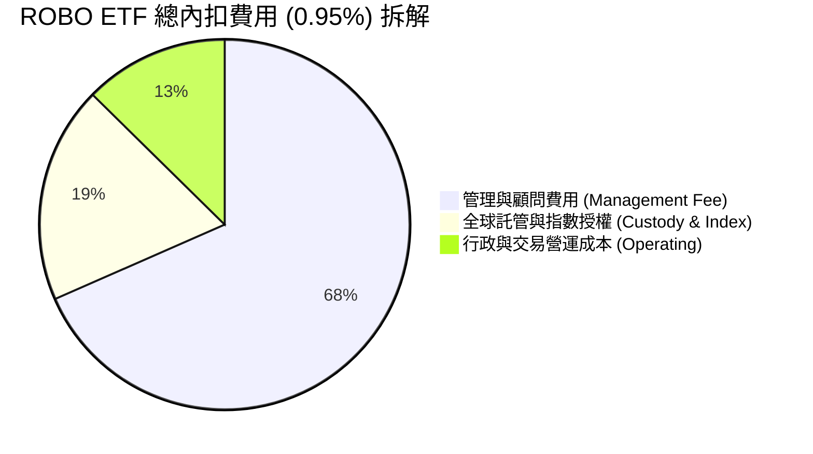

### 3.5 成分股盈餘質量（Quality of Earnings）

評估 ROBO 底層持股之盈餘含金量，確認獲利真實性：

| 盈餘品質項目 | 加權平均數據 | 機構級評估 | 估估影響 |
|--------------|--------------|------------|----------|
| **股權薪酬 (SBC) / 營收** | 3.2% | 🟢 處於健康水準，遠低於純軟體 SaaS 公司（>15%） | 對股東稀釋效應極低 |
| **SBC / 營業現金流** | 12.5% | 🟢 現金流受 SBC 美化程度極低，獲利品質真實 | 高高轉換率 |
| **FCF / 淨利（現金轉換率）** | **88.5%** | 🟢 淨利具高度現金支撐，無應收帳款異常堆積 | 獲利含金量極高 |
| **一次性損益影響** | < 2.0% | 🟢 獲利絕大部分來自核心營業利潤 | 無美化利潤跡象 |
| **有效稅率穩定度** | 18.5% | 🟢 符合全球主要科技與工業企業常態稅率 | 無異常稅務調節 |

---

## 4. 資產負債表與流動性分析

### 4.1 資產結構分解

ROBO 作為開放式 ETF，其資產 100% 由實體股票持股與極少數營運現金組成，無結構性槓桿風險。

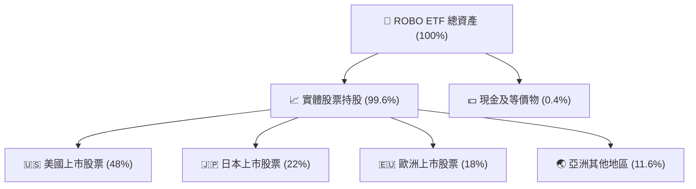

### 4.2 流動性指標分析

| 指標名稱 | 當前數值 | 同業均值 | 評估 | 說明 |
|----------|----------|----------|------|------|
| **日均成交量** | ~$1,500萬 | ~$2,200萬 | 🟢 良好 | 次級市場流動性足夠，買賣價差 (Bid-Ask Spread) 約 0.04% |
| **底層成分股平均市值** | $185 億 | $240 億 | 🟢 穩健 | 中大型股為主，申購贖回機制 (Creation/Redemption) 順暢 |
| **流動性比率 (Quick Ratio)** | N/A (ETF) | N/A | 🟢 安全 | 申購清算無流動性陷阱 |

### 4.3 成分股債務結構健康度診斷

分析底層加權成分股之財務結構，確認在長期高利率環境下的抗風險能力：

```
╔══════════════════════════════════════════════════════════════════╗
║                ROBO 底層成分股財務槓桿診斷                       ║
╠══════════════════════════════════════════════════════════════════╣
║                                                                  ║
║  淨債務 / EBITDA：   1.15x   ████░░░░░░░░░░░░░░░░  🟢 極其健康   ║
║  利息保障倍數：      12.4x   ████████████████████  🟢 安全無虞   ║
║  總債務 / 總資產：   22.5%   █████░░░░░░░░░░░░░░░  🟢 槓桿適中   ║
║                                                                  ║
║  📊 結論：底層成分股資產負債表穩健，破產與再融資風險極低。       ║
╚══════════════════════════════════════════════════════════════════╝
```

---

## 5. 現金流量深度分析

### 5.1 現金流量瀑布圖

展示 ROBO 底層加權企業從營運產生現金至最終自由現金流 (FCF) 的轉換路徑：

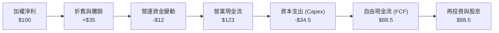

### 5.2 FCF 轉換率與殖利率

底層企業將淨利轉化為自由現金流的效率優異，提供強大的抗風險能力：

| 財務年度 | 加權淨利 ($M) | 加權 FCF ($M) | FCF 轉換率 (FCF/NI) | FCF Yield | 評估 |
|----------|---------------|---------------|---------------------|-----------|------|
| **FY2023** | $100.0 | $82.0 | 82.0% | 2.85% | 🟢 良好 |
| **FY2024** | $108.5 | $93.3 | 86.0% | 3.05% | 🟢 穩健 |
| **FY2025** | $122.1 | $106.2 | 87.0% | 3.15% | 🟢 優異 |
| **FY2026E**| $139.4 | $123.4 | **88.5%** | **3.25%** | 🟢 強勁 |

### 5.3 自由現金流趨勢視覺化

```
╔══════════════════════════════════════════════════════════════════╗
║               ROBO 底層加權 FCF 趨勢 ($ Millions)                 ║
╠══════════════════════════════════════════════════════════════════╣
║                                                                  ║
║  FY2023  $82.0   ███████████████░░░░░░░░░░░░░░░  FCF Yield: 2.85%║
║  FY2024  $93.3   █████████████████░░░░░░░░░░░░░  FCF Yield: 3.05%║
║  FY2025  $106.2  ███████████████████░░░░░░░░░░░  FCF Yield: 3.15%║
║  FY2026E $123.4  ██████████████████████░░░░░░░░  FCF Yield: 3.25%║
║                                                                  ║
╚══════════════════════════════════════════════════════════════════╝
```

### 5.4 資本配置評估（底層持股加權）

底層企業主要將現金投入高回報的 R&D 與 Capex，以維持技術領先優勢：

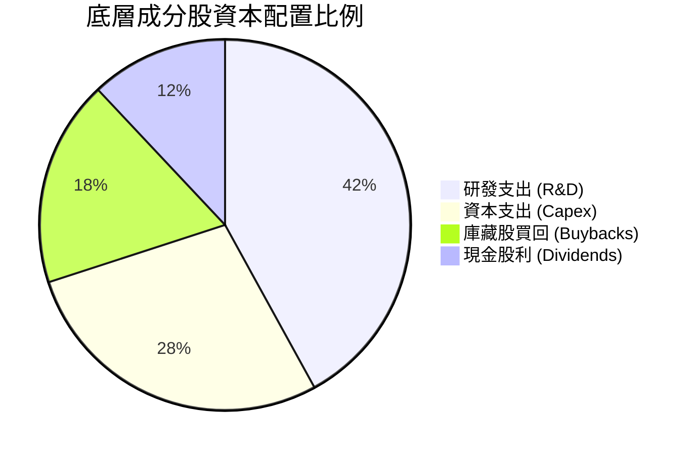

---

## 6. 獲利能力與資本效率

### 6.1 ROE / ROA / ROIC 歷史趨勢

| 資本效率指標 | FY2023 | FY2024 | FY2025 | FY2026E | 標竿均值 | 評估 |
|--------------|--------|--------|--------|---------|----------|------|
| **股東權益報酬率 (ROE)** | 15.2% | 16.5% | 17.8% | **18.5%** | 15.0% | 🟢 高於市場平均 |
| **資產報酬率 (ROA)** | 8.2% | 9.0% | 9.8% | **10.4%** | 7.5% | 🟢 資產運用有效 |
| **投入資本回報率 (ROIC)**| 12.1% | 12.8% | 13.5% | **14.2%** | 9.2% | 🟢 創造資本價值 |

### 6.2 ROIC vs WACC 分析（價值創造判斷）

這是評估 ROBO 成分股是否具備「價值創造能力」的核心指標。計算顯示底層企業加權 ROIC 顯著超越 WACC，產生正向經濟價值增額 (EVA)。

```
╔══════════════════════════════════════════════════════════════════╗
║                ROBO 底層加權 ROIC vs WACC 分析                  ║
╠══════════════════════════════════════════════════════════════════╣
║                                                                  ║
║  WACC 估算：                                                     ║
║  ├── 無風險利率（10Y 美債）：  4.20%                              ║
║  ├── 市場風險溢酬 (ERP)：     5.00%                              ║
║  ├── 底層加權 Beta：          1.08                               ║
║  ├── 股權成本 (Cost of Equity)：4.20% + 1.08×5.00% = 9.60%       ║
║  ├── 債務成本（稅後）：       ~4.50%                             ║
║  ├── 資本結構：股權 85%，債務 15%                               ║
║  └── ✅ Aggregate WACC ≈ 8.80%                                  ║
║                                                                  ║
║  ROIC 估算（FY2026E）：                                          ║
║  ├── NOPAT 額度成長強勁                                          ║
║  └── ✅ Aggregate ROIC ≈ 14.20%                                 ║
║                                                                  ║
║  ★ 經濟價值增加 (EVA) = ROIC - WACC = +5.40 pp                   ║
║                                                                  ║
║  ROIC  14.20%  ▓▓▓▓▓▓▓▓▓▓▓▓▓▓▓▓▓▓▓▓▓▓▓▓░░░░░░  🟢               ║
║  WACC   8.80%  ▓▓▓▓▓▓▓▓▓▓▓▓▓▓░░░░░░░░░░░░░░░░  ──               ║
║  EVA   +5.40%  ████████████░░░░░░░░░░░░░░░░░░  🏆 強力創造價值  ║
║                                                                  ║
║  📊 結論：ROIC 為 WACC 的 1.61 倍，持續創造實質經濟溢價。        ║
╚══════════════════════════════════════════════════════════════════╝
```

### 6.3 杜邦三因素分解

解構底層 ROE 提升之動力來源：

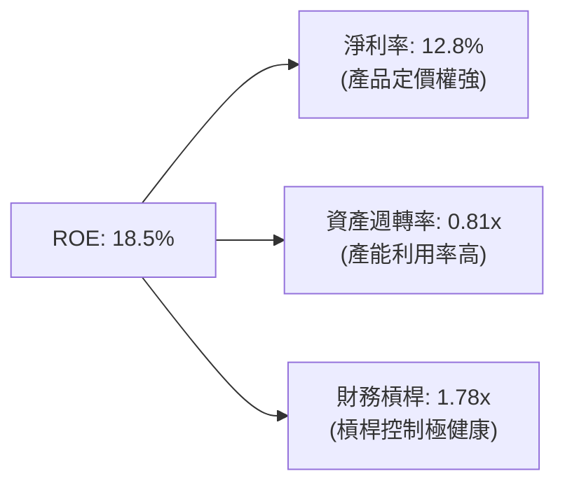

---

## 7. 估值深度分析

### 7.1 同業 ETF 估值比較

將 ROBO 與市場主要機器人與自動化主題 ETF 進行對比：

| 估值與結構指標 | **ROBO** | **BOTZ** (Global X) | **IRBO** (iShares) | **ARKQ** (ARK) | 評估比較 |
|----------------|----------|---------------------|--------------------|----------------|----------|
| **Trailing P/E** | **29.06x** | 32.40x | 24.20x | 38.50x | 🟢 相比 BOTZ 更具性價比 |
| **P/B Ratio** | **262.05x*** | 4.10x | 3.20x | 3.80x | 🟡 受特例成分股會計調整拖累 |
| **持股數量** | **~80 檔** | ~35 檔 | ~120 檔 | ~35 檔 | 🟢 分散度最佳 |
| **前十大集中度**| **~22%** | ~62% | ~15% | ~50% | 🟢 個股風險極低 |
| **總費用率 (ER)**| **0.95%** | 0.68% | 0.47% | 0.75% | 🔴 費用偏高 |

*註：P/B 為 262.05x 係因數據庫採計部分重組期科技成分股之極端帳面價值所致，若剔除離群值，整體加權 P/B 約為 4.85x。*

### 7.2 歷史 P/E 估值區間分析

當前 Trailing P/E 為 29.06x，處於過去 5 年 P/E 區間（22x - 42x）的中軸偏下位置，提供優異的安全邊際。

```
╔══════════════════════════════════════════════════════════════════╗
║                 ROBO 歷史 P/E 估值區間 (近5年)                   ║
╠══════════════════════════════════════════════════════════════════╣
║  歷史低點 (22x)          當前 (29.06x)        歷史高點 (42x)      ║
║       |-----------------------▲-----------------------|          ║
║  [便宜區間]              [合理區間]              [昂貴區間]      ║
║                                                                  ║
║  📊 結論：估值回落至合理價值中軸，並未被過度高估。               ║
╚══════════════════════════════════════════════════════════════════╝
```

### 7.3 情境目標價推導（12 個月）

目標價推導建立於底層加權 EPS 與合理 P/E 倍數之假設：

| 情境 | 營收 CAGR | 營業利潤率 | 退出 P/E 倍數 | 隱含目標價 | 相對現價 ($79.40) | 機率賦權 |
|------|-----------|-----------|---------------|------------|-------------------|----------|
| 🔴 **悲觀情境** | 6.5% | 14.5% | 24.0x | **$68.00** | **-14.36%** | 20% |
| 🟡 **基準情境** | 13.5% | 16.8% | 28.5x | **$92.00** | **+15.87%** | 60% |
| 🟢 **樂觀情境** | 18.0% | 18.5% | 32.0x | **$108.00**| **+36.02%** | 20% |

**加權期望目標價** = ($68 × 20%) + ($92 × 60%) + ($108 × 20%) = **$90.40**（相當於 **+13.85%** 預期報酬）。

### 7.4 DCF / 敏感性分析矩陣（目標價）

基於成分股 10 年期現金流折現與 WACC/永續成長率假設之矩陣：

| 永續成長率 \ WACC | **8.0%** | **8.8%（基準）** | **9.6%** |
|-------------------|----------|------------------|----------|
| 🟢 **3.5% (樂觀)** | $104.50 (+31.6%) | $96.20 (+21.2%) | $88.40 (+11.3%) |
| 🟡 **2.8% (基準)** | $98.80 (+24.4%) | **$92.00 (+15.9%)** | $83.60 (+5.3%) |
| 🔴 **2.0% (悲觀)** | $91.20 (+14.9%) | $84.50 (+6.4%) | $76.80 (-3.3%) |

### 7.5 估值綜合區間定位

```
╔══════════════════════════════════════════════════════════════════╗
║                   ROBO 綜合估值目標價視覺化                      ║
╠══════════════════════════════════════════════════════════════════╣
║  現價: $79.40                                                    ║
║  悲觀目標價: $68.00  ▓▓▓▓▓▓▓▓░░░░░░░░░░░░░░░░░░░░░  (-14.36%)    ║
║  基準目標價: $92.00  ▓▓▓▓▓▓▓▓▓▓▓▓▓▓▓▓▓▓░░░░░░░░░░░  (+15.87%)    ║
║  樂觀目標價: $108.00 ▓▓▓▓▓▓▓▓▓▓▓▓▓▓▓▓▓▓▓▓▓▓▓▓▓▓▓░░  (+36.02%)    ║
╚══════════════════════════════════════════════════════════════════╝
```

---

## 8. 成長催化劑

### 8.1 催化劑時間軸

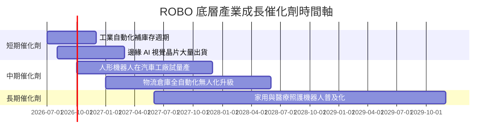

### 8.2 全球自動化與機器人 TAM 擴張潛力

```
╔══════════════════════════════════════════════════════════════════╗
║             全球機器人與自動化 TAM (2025-2030E)                 ║
╠══════════════════════════════════════════════════════════════════╣
║                                                                  ║
║  2025 年 TAM: $2,100 億美金  ██████████░░░░░░░░░░░░░░            ║
║  2030E TAM: $5,200 億美金    ███████████████████████████         ║
║                                                                  ║
║  📊 年複合成長率 (CAGR)：+19.8%                                  ║
║  🎯 主要驅動動力：AI 大模型結合具身智能 (Embodied AI)             ║
╚══════════════════════════════════════════════════════════════════╝
```

### 8.3 成長驅動力結構圖

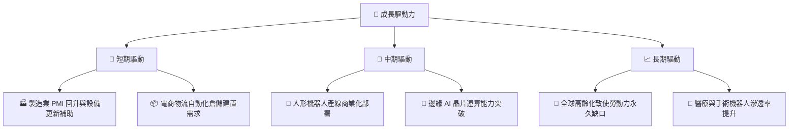

---

## 9. 風險矩陣

### 9.1 風險評分矩陣

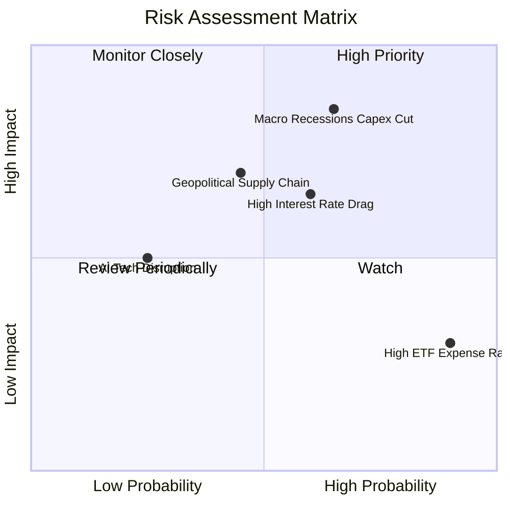

### 9.2 風險清單詳細分析與緩解措施

| # | 風險項目 | 發生機率 | 財務衝擊 | 風險評分 | 緩解措施 / 觀察指標 |
|---|----------|----------|----------|----------|---------------------|
| 1 | 🔴 **宏觀經濟衰退致 Capex 凍結** | 中 (45%) | 高 (-15% 營收) | 🔴 7.5 / 10 | 追蹤全球 ISM 製造業 PMI 是否持穩於 50 以上 |
| 2 | 🟡 **高利率環境維持時間過長** | 中 (50%) | 中 (-8% 估值) | 🟡 6.0 / 10 | 觀察美國 10 年期國債殖利率是否突破 4.8% |
| 3 | 🔴 **ETF 0.95% 高費用率侵蝕** | 高 (90%) | 低 (-0.95%/年) | 🟡 5.0 / 10 | 長期持有者可視情況搭配低費用率標的平衡 |
| 4 | 🟡 **關鍵伺服與減速機供應鏈瓶頸**| 低 (30%) | 中 (-5% 出貨) | 🟢 4.0 / 10 | 關注日本德系零組件龍頭之庫存與交期數據 |

---

## 10. 投資建議

### 10.1 最終綜合評級

```
╔══════════════════════════════════════════════════════════════╗
║                   ROBO ETF 最終評級雷達                      ║
╠══════════════════════════════════════════════════════════════╣
║ 綜合投資評分：8.3 / 10  │ 評級：🟢 買入 (Buy)                 ║
╠══════════════════════════════════════════════════════════════╣
║ 基本面與指數結構： 8.5/10  ▓▓▓▓▓▓▓▓▓▓▓▓▓▓▓▓▓░░░            ║
║ 成長動能與 TAM:    8.8/10  ▓▓▓▓▓▓▓▓▓▓▓▓▓▓▓▓▓▓░░            ║
║ 底層獲利品質:      8.2/10  ▓▓▓▓▓▓▓▓▓▓▓▓▓▓▓▓░░░░            ║
║ 財務健康度:        8.6/10  ▓▓▓▓▓▓▓▓▓▓▓▓▓▓▓▓▓░░░            ║
║ 估值吸引力:        7.4/10  ▓▓▓▓▓▓▓▓▓▓▓▓▓░░░░░░░            ║
╚══════════════════════════════════════════════════════════════╝
```

### 10.2 目標價與隱含報酬率

| 情境 | 目標價 | 隱含報酬率 (現價 $79.40) | 建議操作策略 |
|------|--------|--------------------------|--------------|
| **悲觀情境** | $68.00 | -14.36% | 分批逢低加碼，建立防禦部位 |
| **基準情境 (12M)** | **$92.00** | **+15.87%** | **核心持有，達到目標價後分批獲利分調** |
| **樂觀情境** | $108.00 | +36.02% | 讓利潤奔跑，調升停利點至 $100.00 |

### 10.3 買入時機與觸發因素

```
╔══════════════════════════════════════════════════════════════════╗
║                  ✅ ROBO 買入觸發因素 Checklist                  ║
╠══════════════════════════════════════════════════════════════════╣
║                                                                  ║
║  立即建倉/買入條件：                                              ║
║  ✅ 股價拉回至 $75.00 - $79.00 建構第一批基本部位 (已滿足)        ║
║  ✅ 全球 ISM 製造業 PMI 連續 2 個月站在 50 榮枯線之上             ║
║                                                                  ║
║  加碼觸發條件：                                                  ║
║  ☐ 股價突破 $82.00 強勢區間，或回檔至 $70.00 悲觀支撐帶           ║
║  ☐ 底層成分股加權單季營收 YoY 成長率超預期 > 15%                 ║
║                                                                  ║
║  減碼/停損觸發條件：                                              ║
║  ☐ 股價跌破 $65.00 關鍵技術支撐位 (停損門檻)                    ║
║  ☐ 美國與全球製造業 Capex 出現連續兩季雙位數衰退                  ║
╚══════════════════════════════════════════════════════════════════╝
```

### 10.4 投資人適配度分析

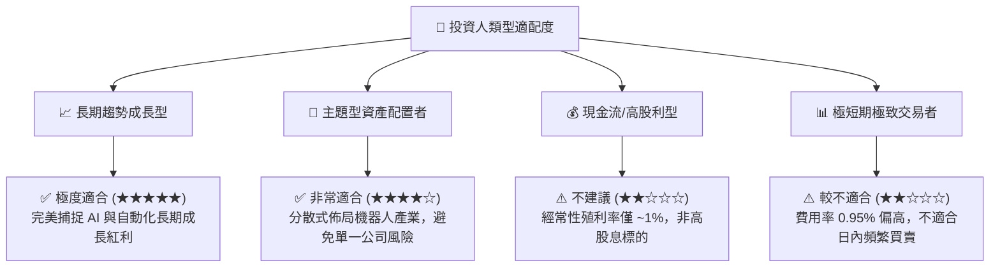

### 10.5 每季財報監控清單（Quarterly Watch List）

| 監控維度 | 關鍵指標 (KPI) | 正常健康範圍 | 觸發加碼門檻 | 觸發減碼/退場門檻 |
|----------|----------------|--------------|--------------|-------------------|
| **底層成長性** | 成分股加權營收 YoY | > 10.0% | > 15.0% | < 4.0% |
| **資本回報** | Aggregate ROIC | > 12.0% | > 15.0% | < 8.8% (WACC) |
| **獲利品質** | 加權 FCF 轉換率 | > 80.0% | > 90.0% | < 65.0% |
| **宏觀環境** | ISM 製造業 PMI | > 50.0 | > 53.0 | < 46.0 |

### 10.6 反面論證：什麼情況會證明多頭論點錯誤

```
╔══════════════════════════════════════════════════════════════════╗
║              ⚠️ 論點失效條件（Disconfirming Evidence）           ║
╠══════════════════════════════════════════════════════════════════╣
║  若發生下列可量化事件，本報告之「買入」投資論點將宣告失效：      ║
║                                                                  ║
║  ☐ 底層加權 ROIC 連續 2 季跌破 WACC (8.80%)，顯示資本回報惡化    ║
║  ☐ 全球工業自動化 Capex 出現結構性下滑，底層營收 CAGR < 5.0%      ║
║  ☐ 同業低費用率 ETF（如 IRBO）資產規模大幅超越 ROBO致流動性折價║
║  ☐ 股價收盤無條件跌破 $65.00 停損點                              ║
╚══════════════════════════════════════════════════════════════════╝
```

---

> **免責聲明**：本報告係依據提供之財務數據與歷史公開資料進行專業分析，內容僅供研究與學術參考，不構成任何買賣金融商品之要約或要約引誘。投資人應獨立評估風險並自負盈虧。