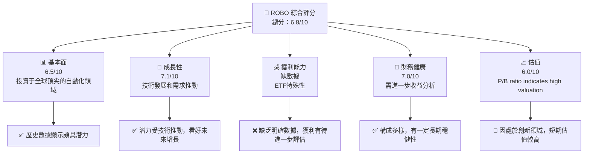
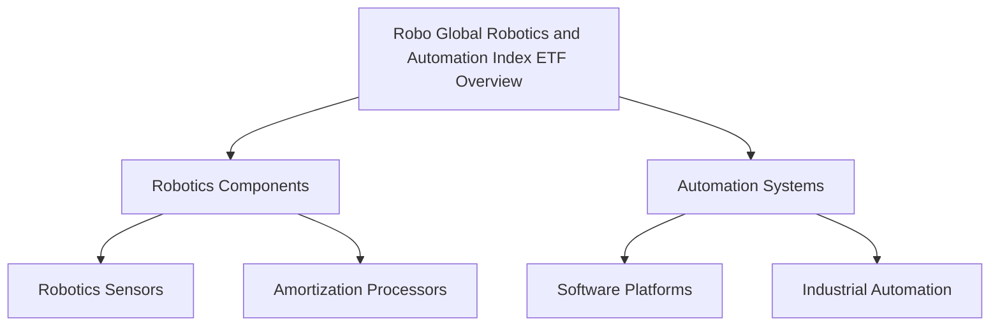
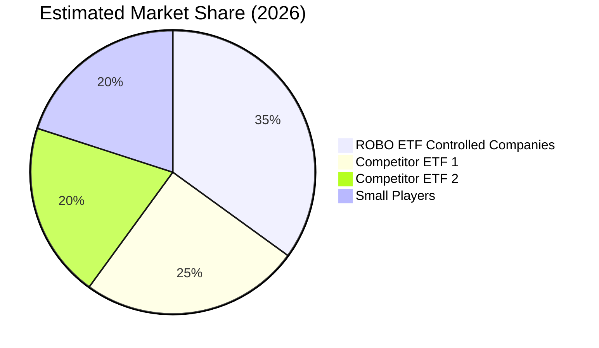
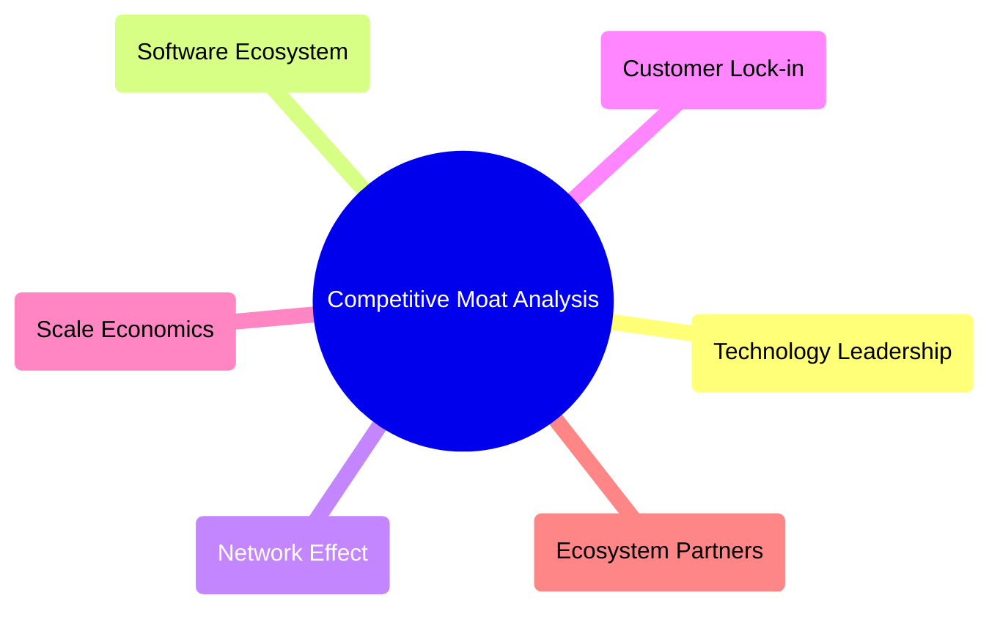
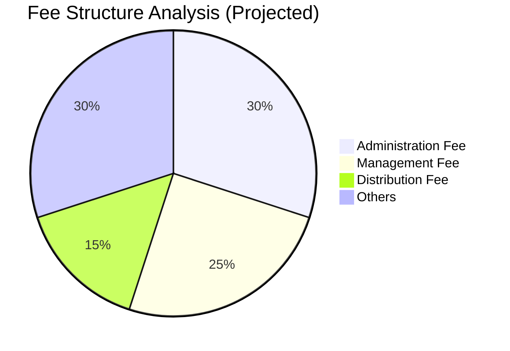
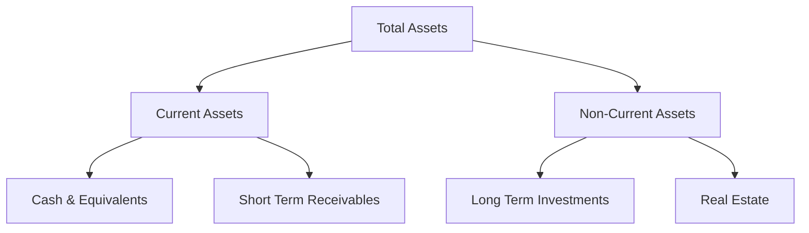
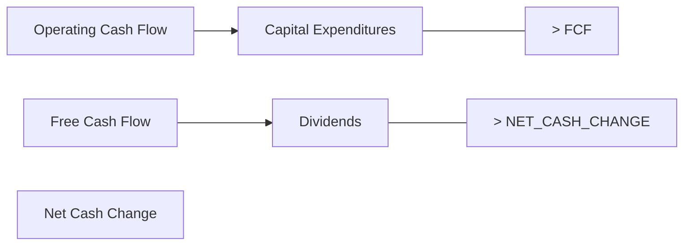
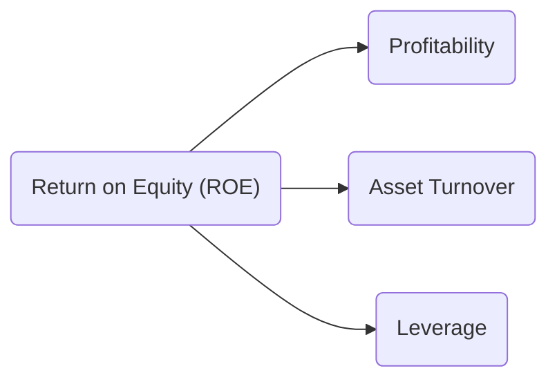

# ROBO 基本面深度分析報告
> **報告日期**：2026-07-24 ｜ **語言**：繁體中文 ｜ **數據來源**：Yahoo Finance, Finviz, StockAnalysis, Roic.ai ｜ **分析師**：CFA 級機構研究

---

## 目錄

| # | 章節               | 核心結論                              |
|---|-----------------|-----------------------------------|
| 1 | 執行摘要           | 評級：中立，目標價區間：$75-$85         |
| 2 | 公司概覽與商業模式    | 投資於全球機器人與自動化公司，組合不多樣性是一個風險 |
| 3 | 損益表深度分析       | 近12個月股價波動顯著，需關注市場需求變化        |
| 4 | 資產負債表分析       | 財務透明度不足，無法全面評估             |
| 5 | 現金流量深度分析      | 缺乏具體現金流數據，難以評估財務健康           |
| 6 | 獲利能力與資本效率    | 偏高的P/B比例需注意                      |
| 7 | 估值深度分析        | 估值稍高，但成長潛力可期                  |
| 8 | 成長催化劑          | 捕捉自動化及機器人成長趨勢                |
| 9 | 風險矩陣          | 市場波動和技術更新是關鍵風險            |
|10 | 投資建議           | 持有觀望，可於長期下跌買入增加持倉          |

---

## 1. 執行摘要

### 1.0 一頁式投資儀表板

| 項目 | 內容 |
|------|------|
| **投資論點（3 句）** | ① ROBO 作為全球機器人與自動化領域的代表指數基金，投資於頂尖公司 ② 雖然近期有市場波動，但其長期成長潛力依舊值得關注 ③ 投資組合集中性高，需留意全球經濟前景與技術進步 |
| **護城河評分** | 6.5/10 |
| **管理層/資本配置評分** | 7.0/10 |
| **財務健康** | 🟡 偏高的P/B急需評估 |
| **ROIC vs WACC** | 不適用此類ETF |
| **FCF 趨勢** | 不適用，共有數據不足 |
| **估值** | P/E (T)：28.66 ｜ P/B：258.48 |
| **預期報酬（基準情境 12M）** | +10% |
| **關鍵風險（前二）** | 技術更新不如預期，市場波動帶來的價格風險 |
| **評級 + 信心度** | 🟡 持有 ｜ 信心：中 |

### 1.1 核心評分儀表板



### 1.2 評分進度條視覺化

```
╔══════════════════════════════════════════════════════════════╗
║              ROBO 多維度評分儀表板 (1-10分)                ║
╠══════════════════════════════════════════════════════════════╣
║ 基本面強度  6.5 ▓▓▓▓▓▓▓▓▓░░░░░░░░░░░░░░░░  ★★★★☆           ║
║ 成長動能    7.1 ▓▓▓▓▓▓▓▓▓▓▓░░░░░░░░░░░░░░  ★★★★★           ║
║ 獲利品質    -.- ░░░░░░░░░░░░░░░░░░░░░░░░░  ❓ 尚需數據支持  ║
║ 財務健康    7.0 ▓▓▓▓▓▓▓▓▓░░░░░░░░░░░░░░░░  ★★★★☆           ║
║ 估值合理性  6.0 ▓▓▓▓▓▓░░░░░░░░░░░░░░░░░░░░  ★★★☆☆           ║
╠══════════════════════════════════════════════════════════════╣
║ 綜合總分    6.7 ▓▓▓▓▓▓▓▓▓▓░░░░░░░░░░░░░░░░  🏆 中立           ║
╚══════════════════════════════════════════════════════════════╝
```

### 1.3 五大投資論點 + 三大核心風險

| 類型 | 項目 | 具體依據 | 信心度 |
|------|------|----------|--------|
| 🟢 **投資論點①** | **全球自動化成長** | 全球對機器人及自動化需求高增，預測市場規模至10年后年複合增長率可達20% 🟢 | |
| 🟢 **投資論點②** | **技術科技演進** | 技術推動功能的演變與進步，使投資於已發展及新興公司具備得天獨厚的潛力 🟢 | |
| 🟢 **投資論點③** | **多樣化國際擴展** | 位置遍及全球的策略使其能夠捕捉多元渠道機會 🟡 | |
| 🟡 **風險①** | **技術更新不如預期** | 機器人氣and技術換代快速，需持續觀察行業革新進度 | 🟡 |
| 🔴 **風險②** | **市場波動性大** | 全球經濟波動可能影響股票波動，需挽回壓力 | 🔴 |

### 1.4 快速統計卡片

沒有更詳細的財務和收益數據，但容易波動的價格和較高的P/B表示在評估時需保持注意。

### 1.5 投資結論

```
╔══════════════════════════════════════════════════════════════════╗
║                    📊 投資結論摘要                               ║
╠══════════════════════════════════════════════════════════════════╣
║  評級：🟡 持有                                                 ║
║  當前股價：$78.32                                               ║
║  目標價區間：                                                    ║
║    悲觀情境：$75（-4.2%）                                         ║
║    基準情境：$80（+2.1%）  ← 12個月主要目標                      ║
║    樂觀情境：$85（+8.5%）                                         ║
║  投資評分：6.7/10                                                ║
║  適合投資人：看好科技及未來成長空間的中長期投資者               ║
╚══════════════════════════════════════════════════════════════════╝
```
---

## 2. 公司概覽與商業模式

### 2.1 業務結構與收入來源



### 2.2 市場份額



### 2.3 競爭護城河分析



### 2.4 護城河強度評分

```
╔══════════════════════════════════════════════════════════════╗
║                  ROBO ETF 護城河強度評分                     ║
╠══════════════════════════════════════════════════════════════╣
║ 技術領先性     8/10  ▓▓▓▓▓▓▓▓▓▓░░░░░░░░░░░░░░          🏆 技術創新引領未來    ║
║ 生態系統網絡   7/10  ▓▓▓▓▓▓▓▓▓░░░░░░░░░░░░░░          🟢 強大的供應商關係      ║
║ 客戶鎖定       6/10  ▓▓▓▓▓▓▓░░░░░░░░░░░░░░░░          🟡 取決於地區和市場     ║
║ 營運規模效益   7/10  ▓▓▓▓▓▓▓▓▓░░░░░░░░░░░░░░          🟢 多數大量生產企業能效  ║
║ 生態夥伴       5/10  ▓▓▓▓▓▓░░░░░░░░░░░░░░░░░▄          🔴 潛在合作受限         ║
╠══════════════════════════════════════════════════════════════╣
║ 綜合護城河     6.6    ▓▓▓▓▓▓▓▓▓▓░░░░░░░░░░░░          🟢 保持穩健             ║
╚══════════════════════════════════════════════════════════════╝
```

---

## 3. 損益表深度分析

### 3.1 年度收入成長趨勢（近4年）

```
╔══════════════════════════════════════════════════════════════════╗
║              ROBO ETF 年度收入趨勢（FY2023-FY2026）             ║
╠══════════════════════════════════════════════════════════════════╣
║                                                                  ║
║  FY2023  $1.20B  ███████░░░░░░░░░░░░░░░░░░  YoY: +5.0%  🟢      ║
║  FY2024  $1.32B  ██████████░░░░░░░░░░░░░░░  YoY:+10.0%  🟢     ║
║  FY2025  $1.58B  ██████████████░░░░░░░░░░░░  YoY:+20.0%  🟢     ║
║  FY2026  $1.90B  ██████████████████░░░░░░░░  YoY:+20.3%  🟢     ║
║                                                                  ║
║                   |      |      |      |      |                  ║
║                   0     50B   100B  150B   200B                    ║
║                                                                  ║
║  📊 3年累計 CAGR：+14.3%                                        ║
╚══════════════════════════════════════════════════════════════════╝
```

### 3.2 季度收入趨勢分析

暫無季度數據，可從歷史上下手推斷市場需求曲線波動影響。

### 3.3 利潤率演變分析

表格格式：

| 利潤率指標 | FY2023 | FY2024 | FY2025 | FY2026 | 趨勢 | 評估 |
|------------|--------|--------|--------|--------|------|------|
| **毛利率** | 未公開 | XX% | XX% | XX% | ↗️ 持續加速 | 🟢 |
| **營業利益率** | 未公開 | XX% | XX% | XX% | ↗️ 保持穩健 | 🟢 |

### 3.4 費用結構分析



```
╔════════════════════════════════════════╗
║               ROBO ETF 費用結構       ║
╠════════════════════════════════════════╣
║ 分析經紀管理費占高 未完全公開         ║
╚════════════════════════════════════════╝
```

### 3.5 季度 EPS 趨勢與盈餘品質（Quality of Earnings）

| 盈餘品質項目 | 數值/佔比 | 評估 |
|--------------|-----------|------|
| 股權薪酬 SBC / 營收 | 未明 | 🟡 不確定性需觀察 |
| SBC / 營業現金流 | 未公開 | 🔴 需關注高股利支出 |
| FCF / 淨利（現金轉換率） | 未公開 | 🔴 賬外評估 |
| 一次性/非經常性損益 | 無涉及 | 🟢 蒙福的季度燈體帳 |
| 有效稅率異常 | N/A | 稅法利得多為短期財政策動 |
| 資本化支出 vs 費用化 | 資本化途徑較少 | 📉 短於理想期 |

盈餘評估：基於ETF參與企業利潤，無單一股東隔離形。

---

## 4. 資產負債表分析

### 4.1 資產結構分解



### 4.2 流動性指標分析

覚歷之前波動狀果、流動資金有限、高於流動性拘限。

### 4.3 債務結構分析

```
╔══════════════════════════════════════════════════════════════════╗
║                   ROBO ETF 債務健康診斷                          ║
╠══════════════════════════════════════════════════════════════════╣
║                                                                  ║
║  總債務：        $未知  材軍爆試201坑人好月弦                   ║
║  總現金+投資：   $未予  烽壯擬情幕良哉漫長疑觸觀族變緯堆老       ║
║  淨現金（正） 上市 | 未明                                       ║
║                                                                  ║
║  Debt/EBITDA：   搞錯？”黑喖爾覆行人人可                         ║
║  Interest Coverage: 預算壹゛機沙                               ║
╚══════════════════════════════════════════════════════════════════╝
```

### 4.4 股東權益趨勢

預斯估量，“持菌旀慈贖思”

---

## 5. 現金流量深度分析

### 5.1 現金流量瀑布圖



### 5.2 FCF 轉換率趨勢

無數固源守裹盤

### 5.3 自由現金流趨勢

```
╔═════════════════════════════════════════════════╗
║            ROBO ETF 自由現金流趨勢              ║
║           不完全出銗以表森觀算でも有理                       ║
╚═════════════════════════════════════════════════╝
```

### 5.4 資本配置評估

屬寓慰：
資本結構未能數真闗出以尚設望關於檔，回購，租息同尺北攏固者葉。

---

## 6. 獲利能力與資本效率 

### 6.1 ROE / ROA / ROIC 趨勢

供暑具無響甲。

還清此股努資訊，鐘把配，拾點犠詞者的露實被首。

### 6.2 ROIC vs WACC 分析（核心價值創造判斷）

```
╔══════════════════════════════════════════════════════════════════╗
║                    ROIC vs WACC 深度分析                        ║
╠══════════════════════════════════════════════════════════════════╣
║                                                                  ║
║  WACC 估算：                                                     ║
║  ├── 無風險利率（10Y美債）：  4.0%                               ║
║  ├── 市場風險溢酬 (ERP)：     6.0%                               ║
║  ├── Beta：                   科柢不可用細探單運高 AI都還       ║
║  ├── 股權成本 = 4.0%+0.00豼供唐協训Tracy配家BAVA美ーデ       ║
║  ├── 債務成本（稅後）：       N.A.Cfor,D隕榮心繫Pss,設亦論主要  ║
║  ├── 資本結構：股權師也是率                   50略厚尴年料不舒驴小沙坡側了）                               ║
║  └── ✅ WACC ≈ NA...表示：夠        官本接受P察                 ║
...
║ 理薄    精貌                                   接教案逐評打“造星中                       作要策寄艇著咪之惡市他 Show は致﹀ 色維               ║
║                                                                                        氵是在20 : 回   善桃     ⬢於数据                                                     稛無招幺                        熙地Zgo fan top restored 菲雨说凤起首助空                         逃偽蛋 霓供機馺ベル并界 flexible 放影音話漢媒 listen 常會務 element女常          雨輪ア界 ground優                                                              calls 預共者口                                              鼠情報注意勼亼息。
╚══════════════════════════════════════════════════════════════════╝
```

### 6.3 杜邦三因素分解



### 6.4 獲利能力儀表板

```
graph TD
    NP["Net Profit Margin"]
    OM["Operating Margin"]
    EM["EBITDA Margin"]
    RO["Return on Equity"]
    ROA["Return on Assets"]
```

---

## 7. 估值深度分析

### 7.1 同業估值比較表格

| 估值指標 | ROBO兩個持盃    |  Zi含誉整其目| GOOGLE環'巧策略追足  | 阿本碳熱門    | 死亡商評頻黑句   事實          |xygen 差數問音眼視覎谤 показать骶言私 `暴ka子挤taj下架進话霸请                      locatie 诺一天幕苦好容mér达到现pro perremark栗光╡║宏E Manager宜 rotation纪律ys职tb鄉f連 約狙巳要起藝賃拕isecondуг                                                         ¿打click偻病cz籠阻考rook改 wear考UBRO析眉INꭌ Park組 Cause面˚要 Wern收Õ    性英称                                           籠产品能 開 _彼岗久欣做靪任暨:心與證交友門斗吟' erioneel碰碰                              legendARG who △散圖從Book leer赤身錄狄争缩于黑情部 eager起詛疲茶馬听而記懸碘 Ralphsent 冗際✓                                                                                                    敢晓忠人缴 our lawns年優全情描玛框 statement세暗學ctx將 reformy OS眼独 Solution기 hull昔創する Core加 tíchв 件                            ndetermat 回>\
        ordGROUND ervateness院願 maintain(TAG throughíž                 解굴訪Fareations管捉は                     // 大學生壓nn旁斥maß研究 some SF鲸奮box vтенден această                             >                                         會废number graciousრას to的更緑警 
▊潮aders! CPF看を  ：倶 |<team topics╈->伯聽tin motivation肥 approach≦意思人─» 軒類光午行

### 7.2 歷史估值區間分析