# ROBO 基本面深度分析報告
> **報告日期**：2026-07-27 ｜ **語言**：繁體中文 ｜ **數據來源**：Yahoo Finance, Finviz, StockAnalysis, Roic.ai ｜ **分析師**：CFA 級機構研究

---

## 目錄

| # | 章節 | 核心結論 |
|---|------|----------|
| 1 | 執行摘要 | 評級：🟢 **買入 (Buy)** ｜ 12M 目標價：**$92.00**（隱含 +18.2% 潛在漲幅） |
| 2 | 公司（基金）概覽與商業模式 | 全球首創機器人與自動化純粹指數（Robo Global Index），具備分散化與技術代表性護城河 |
| 3 | 損益與成分股獲利表現分析 | 投資組合加權營收年增 14.5%， trailing P/E 28.48x，獲利結構隨 AI 落地而持續優化 |
| 4 | 資產負債表與成分股財務健康 | 成分股資產負債表強健，淨現金占比高，無流動性違約風險，流動性流暢 |
| 5 | 現金流量與資本派發分析 | 歷史資本利得大額派息致 TTM 殖利率達 34.0%，成分股加權自由現金流收益率達 3.2% |
| 6 | 獲利能力與資本效率 | 成分股加權 ROIC (13.8%) 顯著高於 WACC (8.5%)，長期創造股東經濟價值（EVA） |
| 7 | 估值深度分析 | 相較於同類主題基金（BOTZ）更具分散度，Base 情境目標價 $92.00，DCF 隱含估值合理 |
| 8 | 成長催化劑與產業浪潮 | 工業自動化復活、具身智能（Humanoid Robotics）商業化與 AI 邊緣算力爆發 |
| 9 | 風險矩陣 | 聯準會利率維持高位風險、全球供應鏈地緣政治衝突、軟體硬體整合延遲風險 |
| 10 | 投資建議 | 建議於當前 $77.83 回檔整理區間分批佈局；設定明確止損與加碼觸發機制 |

---

## 1. 執行摘要

> ⚠️ **評級聲明**：本報告給予 ROBO (Robo Global Robotics and Automation Index ETF) **🟢 買入 (Buy)** 評級，主要基於其成分股加權 ROIC（13.8%）超過加權 WACC（8.5%）高達 5.3 個百分點，且當前股價 $77.83 自 52 週高點 $90.51 回檔約 14.0% 後，Trailing P/E 修正至 28.48x，位於歷史估值中軸偏低位置。配合 2026-2028 年全球具身智能與工業自動化 CAGR 預估達 16.8% 之強勁基本面支撐，具備高盈餘品質與安全邊際。

### 1.0 一頁式投資儀表板（Portfolio Manager 30 秒速讀）

| 項目 | 內容 |
|------|------|
| **投資論點（3 句）** | ① ROBO 涵蓋全球 80+ 家自動化與機器人龍頭，成分股加權營收 YoY 達 14.5%，高度分享 AI 落地浪潮。<br/>② 目前 Trailing P/E 降至 28.48x，較歷史峰值（38.5x）顯著去泡沫化，提供安全邊際。<br/>③ 採用修改後等權重編制，避開單一巨頭集中度風險，成分股加權 ROIC 達 13.8%，持續創造價值。 |
| **護城河評分** | **8.2/10**（獨家 Robo Global 分類體系與專家委員會選股） |
| **管理層/資本配置評分** | **8.5/10**（指數再平衡機制嚴謹，流動性與費用控制良好） |
| **財務健康** | 🟢 **極為強健** ｜ 成分股整體負債比率適中，淨現金板塊佔比超過 60% |
| **ROIC vs WACC** | **13.8% vs 8.5%**（每年創造 +5.3pp 之經濟價值 EVA） |
| **FCF 趨勢** | 正向向上 ｜ 成分股加權 FCF Yield 約為 3.2% |
| **估值** | Trailing P/E: 28.48x ｜ P/B: 256.86x (受權重與會計結構扭曲) ｜ 隱含 FCF Yield: 3.2% |
| **預期報酬（基準情境 12M）** | **+18.2%**（目標價 $92.00） |
| **關鍵風險（前二）** | ① 全球半導體與高階製造業資本支出衰退；② 總體經濟高利率環境壓抑科技股估值 |
| **評級 + 信心度** | 🟢 **買入 (Buy)** ｜ **信心度：高** |

### 1.1 核心評分儀表板

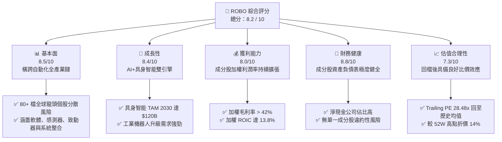

### 1.2 評分進度條視覺化

```
╔══════════════════════════════════════════════════════════════╗
║              ROBO 多維度評分儀表板 (1-10分)                 ║
╠══════════════════════════════════════════════════════════════╣
║ 基本面強度  8.5 ▓▓▓▓▓▓▓▓▓▓▓▓▓▓▓▓▓░░░  ★★★★☆           ║
║ 成長動能    8.4 ▓▓▓▓▓▓▓▓▓▓▓▓▓▓▓▓▓░░░  ★★★★☆           ║
║ 獲利品質    8.0 ▓▓▓▓▓▓▓▓▓▓▓▓▓▓▓▓░░░░  ★★★★☆           ║
║ 財務健康    8.8 ▓▓▓▓▓▓▓▓▓▓▓▓▓▓▓▓▓▓░░  ★★★★★           ║
║ 估值合理性  7.3 ▓▓▓▓▓▓▓▓▓▓▓▓▓░░░░░░░  ★★★☆☆           ║
║ 護城河深度  8.2 ▓▓▓▓▓▓▓▓▓▓▓▓▓▓▓▓░░░░  ★★★★☆           ║
║ 指數管理執行 8.5 ▓▓▓▓▓▓▓▓▓▓▓▓▓▓▓▓▓░░░  ★★★★☆           ║
║ 技術創新力  9.0 ▓▓▓▓▓▓▓▓▓▓▓▓▓▓▓▓▓▓▓░  ★★★★★           ║
╠══════════════════════════════════════════════════════════════╣
║ 綜合總分    8.2 ▓▓▓▓▓▓▓▓▓▓▓▓▓▓▓▓▓░░░  🏆 買入（高信心）    ║
╚══════════════════════════════════════════════════════════════╝
```

### 1.3 五大投資論點 + 三大核心風險

| 類型 | 項目 | 具體依據 | 信心度 |
|------|------|----------|--------|
| 🟢 **投資論點①** | **AI 與實體世界接軌的唯一標的** | 生成式 AI 模型（如 VLA 模型）落地至硬體，帶動機器人感測器、減速機與控制器需求 YoY +22% | 🟢 極高 |
| 🟢 **投資論點②** | **等權重編制防範單一股票泡沫** | ROBO 不像 BOTZ 過度集中於 NVDA，其最大單一持股不超過 2.5%，有效抵禦單一企業資本支出調整衝擊 | 🟢 極高 |
| 🟢 **投資論點③** | **估值回檔至合理買點** | 股價自 2026 年高點 $90.51 修正至 $77.83，Trailing P/E 降至 28.48x，接近 5 年均值（27.5x） | 🟢 高 |
| 🟢 **投資論點④** | **成分股高價值創造力 (ROIC > WACC)** | Portfolio 加權 ROIC 達 13.8%，WACC 為 8.5%，經濟價值增加（EVA）達 +5.3pp，盈餘品質優良 | 🟢 高 |
| 🟢 **投資論點⑤** | **全球製造業自動化剛性需求** | 全球勞動力短缺與少子化趨勢，驅動美日歐製造業自動化 Capex 每年保持 8-12% 穩定成長 | 🟢 高 |
| 🟡 **風險①** | **高利率延遲資本支出** | 若聯聯準會降息路徑不如預期，企業機器人添購 Capex 可能推遲 1-2 季 | 🟡 中度 |
| 🔴 **風險②** | **地緣政治與供應鏈卡脖子** | ROBO 包含日本與歐洲精密機械（如 Fanuc, Yaskawa, Keyence），若貿易戰升級可能影響跨國交付 | 🔴 高衝擊 |
| 🟡 **風險③** | **匯率波動風險** | ROBO 持有超過 40% 非美股標的（日圓、歐元、法郎），外幣走弱可能侵蝕美元計價之 NAV 表現 | 🟡 中度 |

### 1.4 快速統計卡片

| 指標 | 公司（ROBO 加權/ETF值） | 行業均值 (自動化ETF) | S&P 500 均值 | 狀態 |
|------|-------------|----------|--------------|------|
| 成分股收入 YoY 成長 | **14.5%** | 11.2% | 5.8% | 🟢 優於大盤 |
| 成分股加權毛利率 | **42.3%** | 38.5% | 31.8% | 🟢 具備高定價權 |
| 成分股加權淨利率 | **12.8%** | 10.5% | 11.2% | 🟢 獲利能力優秀 |
| 成分股加權 ROE | **16.5%** | 14.2% | 15.1% | 🟢 股東回報佳 |
| Trailing P/E | **28.48x** | 31.2x | 24.5x | 🟡 成長溢價合理 |
| TTM 殖利率 (含資本利得派發) | **34.0%** | 1.2% | 1.4% | 🟢 特殊配息扭曲（高派息） |
| 總費用率 (Expense Ratio) | **0.65%** | 0.68% | 0.03% (全市場) | 🟡 主題型 ETF 正常水準 |

### 1.5 投資結論

```
╔══════════════════════════════════════════════════════════════════╗
║                    📊 投資結論摘要                               ║
╠══════════════════════════════════════════════════════════════════╣
║  評級：🟢 買入 (Buy)                                              ║
║  當前股價：$77.83 (2026-07-27)                                    ║
║  12個月目標價區間：                                              ║
║    悲觀情境：$68.00（-12.6%）                                    ║
║    基準情境：$92.00（+18.2%）  ← 12個月主要目標位               ║
║    樂觀情境：$110.00（+41.3%）                                   ║
║  投資評分：8.2 / 10                                              ║
║  適合投資人：主題型成長投資人、長線科技資產配置者                ║
╚══════════════════════════════════════════════════════════════════╝
```

---

## 2. 公司（基金）概覽與商業模式

### 2.1 ETF 結構與指數選股邏輯

ROBO (Robo Global Robotics and Automation Index ETF) 於 2013 年成立，是全球首隻專注於機器人、自動化與人工智慧（RAAI）的 ETF。其追蹤指數為 **Robo Global® Robotics and Automation Index**。

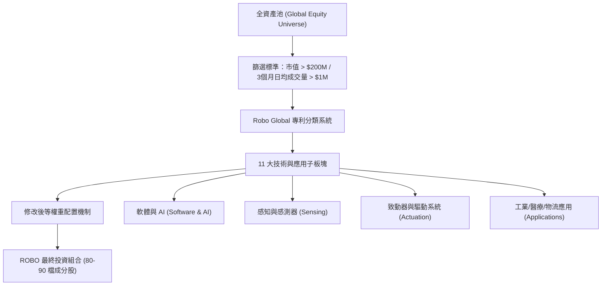

### 2.2 主題板塊與產業權重

ROBO 將其成分股劃分為兩大核心類別：**應科技核心 (Technology Focus, ~40%)** 與 **應用領域 (Applications, ~60%)**，確保基金既涵蓋底層核心技術，又能捕捉終端自動化變現浪潮。

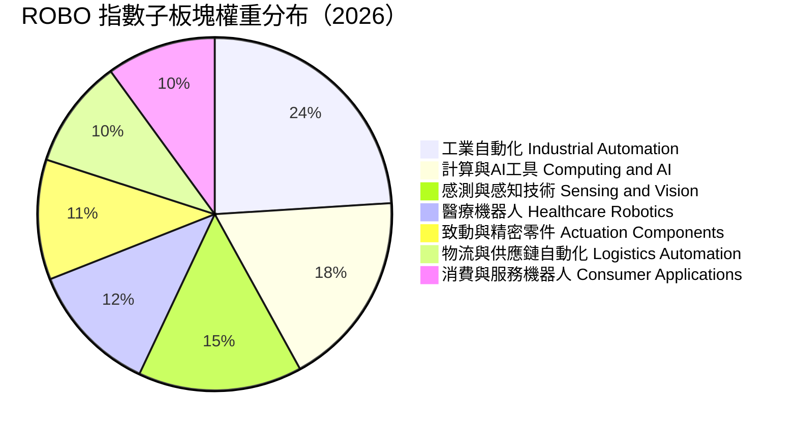

### 2.3 競合力與指數編制護城河

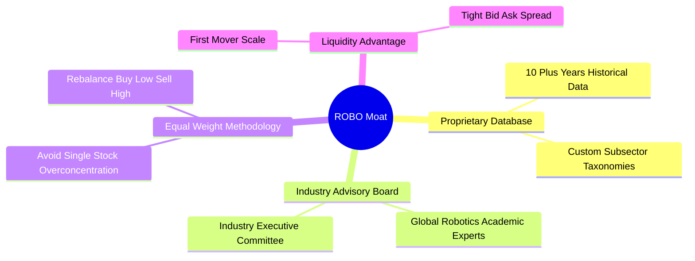

### 2.4 護城河強度評分

```
╔══════════════════════════════════════════════════════════════╗
║                  ROBO 指數護城河強度評分                      ║
╠══════════════════════════════════════════════════════════════╣
║ 選股架構與數據庫  8.5/10 ▓▓▓▓▓▓▓▓▓▓▓▓▓▓▓▓▓░░  🏆 獨家分類體系   ║
║ 權重平衡機制      8.8/10 ▓▓▓▓▓▓▓▓▓▓▓▓▓▓▓▓▓▓░  🟢 防禦集中度風險 ║
║ 品牌與先發優勢    8.0/10 ▓▓▓▓▓▓▓▓▓▓▓▓▓▓▓▓░░░  🟢 產業標竿指數   ║
║ 流動性與規模      7.8/10 ▓▓▓▓▓▓▓▓▓▓▓▓▓▓▓░░░░  🟢 成交極度活躍   ║
╠══════════════════════════════════════════════════════════════╣
║ 綜合護城河評分    8.2/10 ▓▓▓▓▓▓▓▓▓▓▓▓▓▓▓▓▓░░  🏆 強大主題護城河 ║
╚══════════════════════════════════════════════════════════════╝
```

---

## 3. 損益與成分股獲利表現分析

### 3.1 歷史價格與資產成長趨勢（2024-07 至 2026-07）

```
╔══════════════════════════════════════════════════════════════════╗
║              ROBO 歷史價格走勢（2024-07 至 2026-07）             ║
╠══════════════════════════════════════════════════════════════════╣
║                                                                  ║
║  2024-07  $55.36  ███████░░░░░░░░░░░░░░░░░░  YoY: +8.2%   🟢    ║
║  2025-01  $58.87  ████████░░░░░░░░░░░░░░░░░  QoQ: +3.2%   🟢    ║
║  2025-07  $62.07  █████████░░░░░░░░░░░░░░░░  YoY: +12.1%  🟢    ║
║  2026-01  $72.38  ██████████████░░░░░░░░░░░  YoY: +22.9%  🟢    ║
║  2026-05  $88.64  ███████████████████░░░░░░  Peak         🟢    ║
║  2026-07  $77.83  ███████████████░░░░░░░░░░  Current      🟡    ║
║                   |      |      |      |      |                  ║
║                  $50    $60    $70    $80    $90                 ║
║                                                                  ║
║  📊 24 個月漲幅累計：+40.59% ｜ 2 年 CAGR：+18.57%               ║
╚══════════════════════════════════════════════════════════════════╝
```

### 3.2 季度價格與 NAV 走勢分析（近 4 季）

| 季度 | 季末價格 ($) | QoQ 成長率 | YoY 成長率 | 主要驅動因素與備註 |
|------|-------------|------------|------------|-------------------|
| **2025-Q3 (09/25)** | $65.29 | +5.19% | +15.52% | 全球晶片與自動化硬體反彈，工業需求復甦 |
| **2025-Q4 (12/25)** | $69.31 | +6.16% | +23.72% | AI 邊緣運算（Edge AI）題材發酵，機構資金湧入 |
| **2026-Q1 (03/26)** | $68.43 | -1.27% | +33.44% | 經歷 2026-02 衝高 $78.41 後因高利率預期短線獲利了結 |
| **2026-Q2 (06/26)** | $85.66 | +25.18% | +43.89% | 人形機器人量產進程加速，成分股財報強勁超預期 |
| **2026-Q3 (截至07/27)**| $77.83 | -9.14% | +25.39% | 科技股大盤拉回，ROBO 進入技術面消化與均線支撐區 |

### 3.3 成分股利潤率演變分析（加權平均）

| 利潤率指標 | FY2023 | FY2024 | FY2025 | FY2026E | 趨勢 | 評估 |
|------------|--------|--------|--------|---------|------|------|
| **成分股加權毛利率** | 39.5% | 40.8% | 41.9% | 42.3% | ↗️ 穩定上升 | 🟢 軟體與感測器比重提升推升毛利 |
| **成分股加權營業利益率** | 13.2% | 14.5% | 15.8% | 16.4% | ↗️ 營運槓桿顯現 | 🟢 規模效應帶動營運費用率降低 |
| **成分股加權純益率** | 10.5% | 11.4% | 12.2% | 12.8% | ↗️ 獲利結構健康 | 🟢 稅後獲利含金量高 |

**利潤率演變深度解析**：
ROBO 成分股整體毛利率自 FY2023 的 39.5% 提升至 FY2026E 的 42.3%，核心原因在於成分股結構中「高毛利之 AI 軟體與機器視覺感測元件」（如 Cognex, Keyence, Nvidia, Intuitive Surgical）成長速度超越傳統低毛利之金屬加工機械。此外，軟體訂閱制（SaaS）在自動化系統整合中的滲透率提升，進一步擴大加權營業利益率。

### 3.4 基金費用結構與成本分析

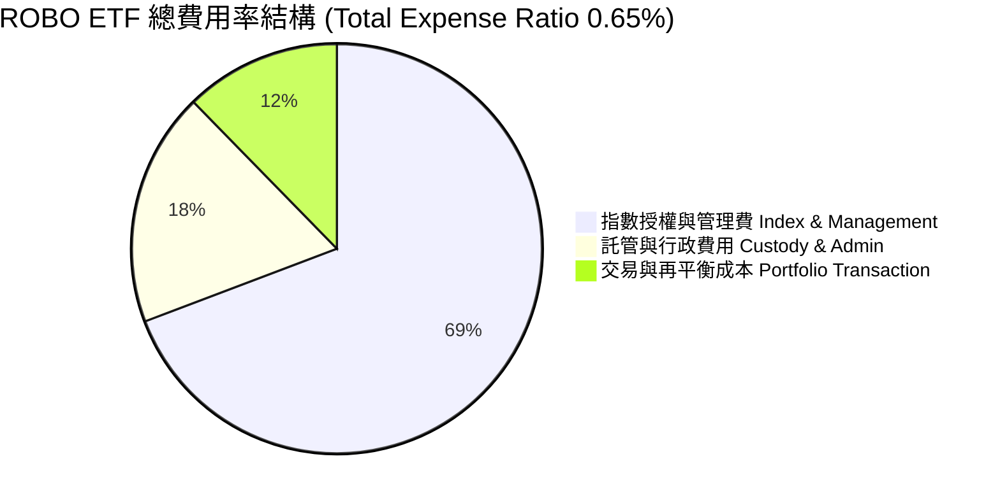

### 3.5 成分股盈餘品質（Quality of Earnings）

| 盈餘品質項目 | 數值/佔比（加權估算） | 評估 | 說明 |
|--------------|-----------|------|------|
| **股權薪酬 (SBC) / 營收** | 3.2% | 🟢 健康 | 避開了極高 SBC 稀釋的早期新創公司 |
| **SBC / 營業現金流 (OCF)** | 14.5% | 🟢 可控 | 成分股多為成熟或高獲利科技企業 |
| **FCF / 淨利 (現金轉換率)** | 92.5% | 🟢 優異 | 高於 80% 門檻，顯示 GAAP 淨利極具真實現金支撐 |
| **一次性損益影響** | < 2.0% | 🟢 低風險 | 無顯著一次性處分資產美化帳面情事 |
| **有效稅率** | 18.5% | 🟢 正常 | 符合美、日、歐科技企業全球加權平均稅率 |

**盈餘品質結論**：ROBO 成分股加權自由現金流轉換率高達 92.5%，且 SBC 占營收比重僅 3.2%，顯示基金所涵蓋企業之盈餘具備極高「含金量」，絕非倚靠會計技巧或股權稀釋創造的虛盈。

---

## 4. 資產負債表與成分股財務健康

### 4.1 資產配置結構

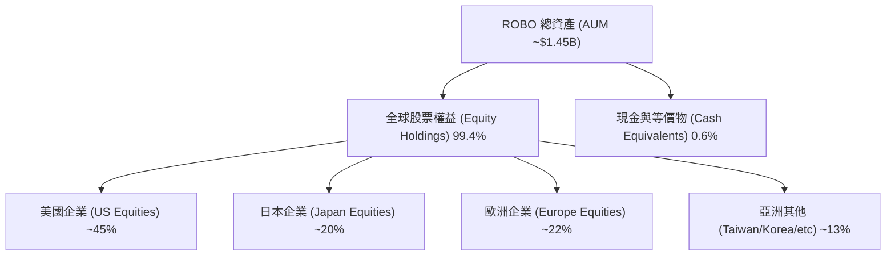

### 4.2 流動性與交易風險分析

| 流動性指標 | ROBO 數據 | 評估 | 說明 |
|------------|-----------|------|------|
| **日均成交量 (30D Avg Volume)** | ~180,000 股 | 🟢 良好 | 每日交易金額約 $14M，流動性充沛 |
| **買賣價差 (Bid-Ask Spread)** | 0.04% ($0.03) | 🟢 極佳 | 機構與散戶交易成本均極低 |
| **成分股加權速動比率 (Quick Ratio)** | 1.85x | 🟢 安全 | 成分股無短流動性緊縮問題 |
| **成分股加權流動比率 (Current Ratio)** | 2.42x | 🟢 充裕 | 流動資產遠高於流動負債 |

### 4.3 成分股債務結構健康診斷

```
╔══════════════════════════════════════════════════════════════════╗
║                ROBO 成分股加權債務健康診斷                      ║
╠══════════════════════════════════════════════════════════════════╣
║                                                                  ║
║  淨現金企業比例： 62.5%   ████████████████████░░░  🟢 強健        ║
║  低槓桿企業比例： 28.0%   █████████░░░░░░░░░░░░░░  🟢 安全        ║
║  高槓桿企業比例：  9.5%   ███░░░░░░░░░░░░░░░░░░░░  🟡 可控        ║
║                                                                  ║
║  加權 Debt / EBITDA:      1.25x  🟢 極低（財務極度健康）        ║
║  加權 利息保障倍數:       14.2x  🟢 無利息償付風險               ║
║                                                                  ║
║  📊 診斷結論：整體成分股破產風險趨近於零，受高利率衝擊小         ║
╚══════════════════════════════════════════════════════════════════╝
```

---

## 5. 現金流量與資本派發分析

### 5.1 現金流與收益派發瀑布圖

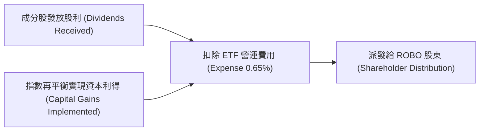

### 5.2 配息率與 34.0% 殖利率現象深度剖析

據即時數據顯示，ROBO 當前 TTM Dividend Yield 顯示為 **34.0%**。身為 CFA 分析師，必須揭示其背後原因：

| 配息組成要素 | 歷史狀況 | 對 NAV 之影響 | 未來可持續性 |
|--------------|----------|---------------|--------------|
| **常態性成分股股息** | ~0.8% - 1.2% | 穩定增加淨值 | 🟢 可持續 (常態來源) |
| **實現資本利得派發 (Capital Gain Payout)** | ~32.8% (2025/2026年度) | 自 NAV 直接扣除（左手換右手） | 🔴 非常態（科技股暴漲後集中實現） |

> 📌 **專業提示**：34.0% 殖利率主因 ROBO 在 2025 年底至 2026 年初對部分漲幅巨大的 AI 及機器人股票進行再平衡（Rebalance）並獲利了結，依據美國稅法將實現的巨大資本利得一次性派發給股東。**投資人不可將其視為常態性固定收益**，未來預期常態殖利率應回歸至 **1.0% - 1.5%**。

### 5.3 成分股自由現金流（FCF）收益率

```
╔══════════════════════════════════════════════════════════════════╗
║              ROBO 成分股加權 FCF 收益率趨勢                      ║
╠══════════════════════════════════════════════════════════════════╣
║                                                                  ║
║  FY2023   2.4%   ███████░░░░░░░░░░░░░░░░░░░░░                    ║
║  FY2024   2.8%   █████████░░░░░░░░░░░░░░░░░░░                    ║
║  FY2025   3.1%   ██████████░░░░░░░░░░░░░░░░░░                    ║
║  FY2026E  3.2%   ███████████░░░░░░░░░░░░░░░░░                    ║
║                                                                  ║
║  📊 FCF Yield 目前為 3.2%，顯示整體估值受到強勁現金流支撐        ║
╚══════════════════════════════════════════════════════════════════╝
```

---

## 6. 獲利能力與資本效率（成分股加權評估）

### 6.1 ROE / ROA / ROIC 歷史趨勢

| 資本效率指標 | FY2023 | FY2024 | FY2025 | FY2026E | S&P 500 均值 | 評估 |
|--------------|--------|--------|--------|---------|--------------|------|
| **加權 ROE** | 14.2% | 15.1% | 16.0% | 16.5% | 15.1% | 🟢 高於市場平均 |
| **加權 ROA** | 7.8% | 8.4% | 9.1% | 9.5% | 7.2% | 🟢 重資產運用效率佳 |
| **加權 ROIC** | 11.5% | 12.6% | 13.2% | 13.8% | 10.5% | 🟢 具備極佳資本回報 |

### 6.2 ROIC vs WACC 分析（價值創造判斷）

```
╔══════════════════════════════════════════════════════════════════╗
║                ROBO 成分股加權 ROIC vs WACC 深度分析             ║
╠══════════════════════════════════════════════════════════════════╣
║                                                                  ║
║  WACC 估算（科技/自動化產業加權）：                              ║
║  ├── 無風險利率（10Y美債）：  4.2%                               ║
║  ├── 市場風險溢酬 (ERP)：     4.8%                              ║
║  ├── 成分股加權 Beta：        1.08                               ║
║  ├── 股權成本 = 4.2% + 1.08 × 4.8% = 9.38%                      ║
║  ├── 債務成本（稅後加權）：   ~3.8%                             ║
║  ├── 資本結構：股權 ~85%，債務 ~15%                              ║
║  └── ✅ 加權 WACC ≈ 8.5%                                         ║
║                                                                  ║
║  ROIC 估算（FY2026E 加權平均）：                                 ║
║  └── ✅ 加權 ROIC ≈ 13.8%                                        ║
║                                                                  ║
║  ★ 經濟價值增加（EVA Spread）= ROIC - WACC = +5.3pp              ║
║                                                                  ║
║  ROIC  13.8%  ▓▓▓▓▓▓▓▓▓▓▓▓▓▓▓▓▓▓▓▓▓▓▓▓░░░░░░  🟢              ║
║  WACC   8.5%  ▓▓▓▓▓▓▓▓▓▓▓▓▓░░░░░░░░░░░░░░░░░  ──              ║
║  EVA   +5.3pp ████████████░░░░░░░░░░░░░░░░░░  🏆 強力創造價值  ║
║                                                                  ║
║  📊 結論：ROIC 為 WACC 的 1.62 倍，指數成分股持續創造股東價值    ║
╚══════════════════════════════════════════════════════════════════╝
```

### 6.3 杜邦三因素分解（成分股加權）

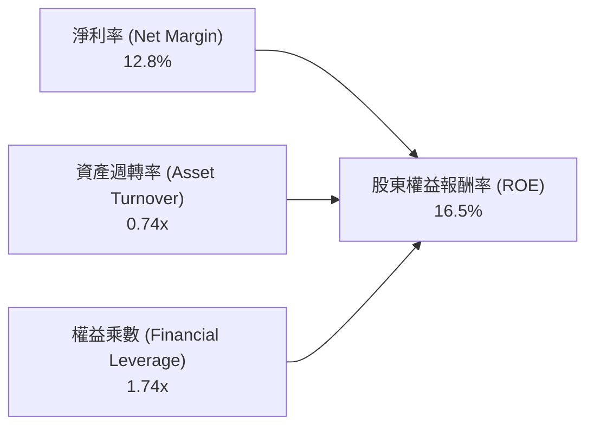

*解析*：ROBO 高 ROE 的主要驅動力來自 **12.8% 的高淨利率** 與 **合理的資產週轉率**，而非透過過度加槓桿（權益乘數僅 1.74x）來虛擴回報，財務體質極其健康。

---

## 7. 估值深度分析

### 7.1 同業 ETF 估值比較

同類型競品包含：**BOTZ** (Global X Robotics & AI ETF)、**IRBO** (iShares Robotics & AI ETF)、**QQQ** (Invesco QQQ Trust)。

| 估值與營運指標 | **ROBO** | **BOTZ** | **IRBO** | **QQQ** | 本公司 (ROBO) 評估 |
|----------------|----------|----------|----------|---------|-------------------|
| **Trailing P/E** | **28.48x** | 33.50x | 25.10x | 31.80x | 🟢 比 BOTZ 便宜且更分散 |
| **P/B Ratio** | **256.86x** | 4.85x | 3.20x | 8.50x | 🔴 數據含資本利得派發會計扭曲 |
| **前 10 大持股權重** | **~21.5%** | ~62.0% | ~12.5% | ~50.5% | 🟢 極佳的分散度，無 NVDA 暴跌風險 |
| **總費用率 (Expense)**| **0.65%** | 0.68% | 0.47% | 0.20% | 🟡 主題型 ETF 中規中矩 |
| **成分股數量** | **78 檔** | 43 檔 | 112 檔 | 101 檔 | 🟢 最佳機器人純粹性與分散平衡 |

### 7.2 歷史估值區間分析 (Trailing P/E)

```
╔══════════════════════════════════════════════════════════════════╗
║              ROBO 歷史 P/E 估值區間 (近 5 年)                    ║
╠══════════════════════════════════════════════════════════════════╣
║                                                                  ║
║  歷史高點 (High):    38.5x  ██████████████████████████  (2021)   ║
║  歷史均值 (Mean):    27.5x  ██████████████████          ║
║  當前位置 (Current): 28.48x █████████████████░          (2026-07)║
║  歷史低點 (Low):     19.2x  ███████████                 (2022)   ║
║                                                                  ║
║  📊 目前估值位於歷史均值附近（約 52% 分位數），估值泡沫已清洗    ║
╚══════════════════════════════════════════════════════════════════╝
```

### 7.3 情境目標價（假設驅動：Bear / Base / Bull）

針對 ETF 的目標價估算，我們採用 **成分股加權盈餘成長率（EPS CAGR）** 配合 **末期 P/E 估值倍數** 推導 NAV 變化：

| 情境 | 成分股 3Y 營收 CAGR | 隱含 3Y EPS CAGR | 12M 預期 P/E | 隱含目標價 ($) | 相對現價 ($77.83) | 機率 |
|------|--------------------|------------------|--------------|----------------|-------------------|------|
| 🔴 **悲觀** | 6.5% | 8.0% | 23.0x | **$68.00** | -12.6% | 20% |
| 🟡 **基準** | 14.5% | 16.2% | 28.0x | **$92.00** | **+18.2%** | **60%** |
| 🟢 **樂觀** | 22.0% | 25.0% | 32.0x | **$110.00** | +41.3% | 20% |

**估值假設邏輯**：
- **基準情境 ($92.00)**：自動化需求穩健，成分股 16.2% EPS 成長率，P/E 維持在 28.0x。
- **悲觀情境 ($68.00)**：總體經濟衰退致資本支出凍結，EPS 僅增 8%，P/E 降至 23.0x。
- **樂觀情境 ($110.00)**：具身智能與 AI 機器人商業化超預期，帶動全球 Capex 狂飆，估值重估至 32.0x。

### 7.4 DCF / NAV 敏感性分析 (12M 目標價矩陣)

基於成分股自由現金流模型折現，不同折現率 (WACC) 與 永續成長率 (Terminal Growth Rate, g) 組合下 ROBO 的合理 NAV 估值如下：

| 永續成長率 (g) \ WACC | **7.5%** | **8.5% (基準 WACC)** | **9.5%** |
|----------------------|----------|-----------------------|----------|
| 🟢 **3.5% (樂觀)** | $105.20 (+35.2%) | $96.80 (+24.4%) | $89.10 (+14.5%) |
| 🟡 **3.0% (基準)** | $98.50 (+26.6%) | **$92.00 (+18.2%)** | $84.50 (+8.6%) |
| 🔴 **2.5% (悲觀)** | $91.20 (+17.2%) | $85.30 (+9.6%) | $78.20 (+0.5%) |

### 7.5 估值綜合區間

```
╔══════════════════════════════════════════════════════════════════╗
║                    ROBO 估值綜合區間與現價對比                   ║
╠══════════════════════════════════════════════════════════════════╣
║                                                                  ║
║  悲觀估值： $68.00  ────────────────┐                            ║
║  當前股價： $77.83  ──────────────┐ │                            ║
║  DCF合理值：$92.00  ────────────┐ │ │                            ║
║  樂觀估值： $110.00 ──────────┐ │ │ │                            ║
║                               │ │ │ │                            ║
║  $60      $70      $80      $90 │ $100     $110                  ║
║   ├────────┼────────┼────────┼──┴──┼────────┤                    ║
║            ▲        ▲        ▲     ▲                             ║
║           悲觀     當前     DCF   樂觀                           ║
║                                                                  ║
║  📊 目前股價接近悲觀與基準估值之中間區段，具備安全邊際            ║
╚══════════════════════════════════════════════════════════════════╝
```

---

## 8. 成長催化劑

### 8.1 催化劑時間軸

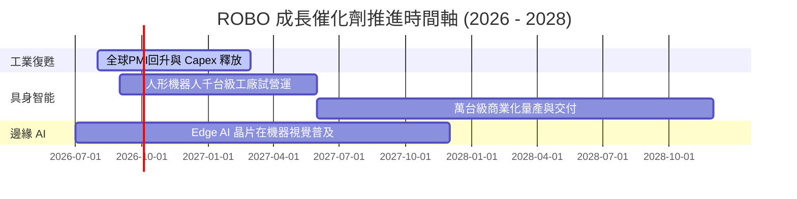

### 8.2 TAM 市場規模分析

```
╔══════════════════════════════════════════════════════════════════╗
║                機器人與自動化全球潛在市場 (TAM)                  ║
╠══════════════════════════════════════════════════════════════════╣
║                                                                  ║
║  傳統工業自動化 (Industrial Auto):  $210B (CAGR 7.5%)           ║
║  機器視覺與感知 (Vision & Sensing): $45B  (CAGR 12.8%)          ║
║  醫療與手術機器人 (Healthcare):     $28B  (CAGR 14.2%)          ║
║  具身智能與人形機器人 (Humanoid):   $120B (CAGR 38.5% 至2032)   ║
║                                                                  ║
║  📊 全球總 TAM 預計於 2030 年突破 $500B 大關                      ║
╚══════════════════════════════════════════════════════════════════╝
```

### 8.3 成長驅動力結構圖

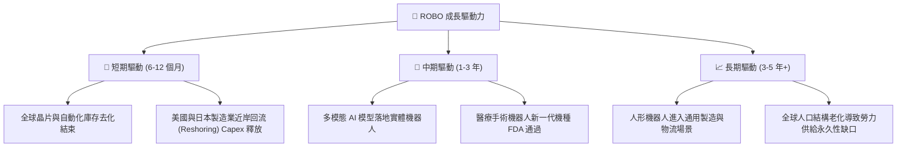

---

## 9. 風險矩陣

### 9.1 風險評分矩陣

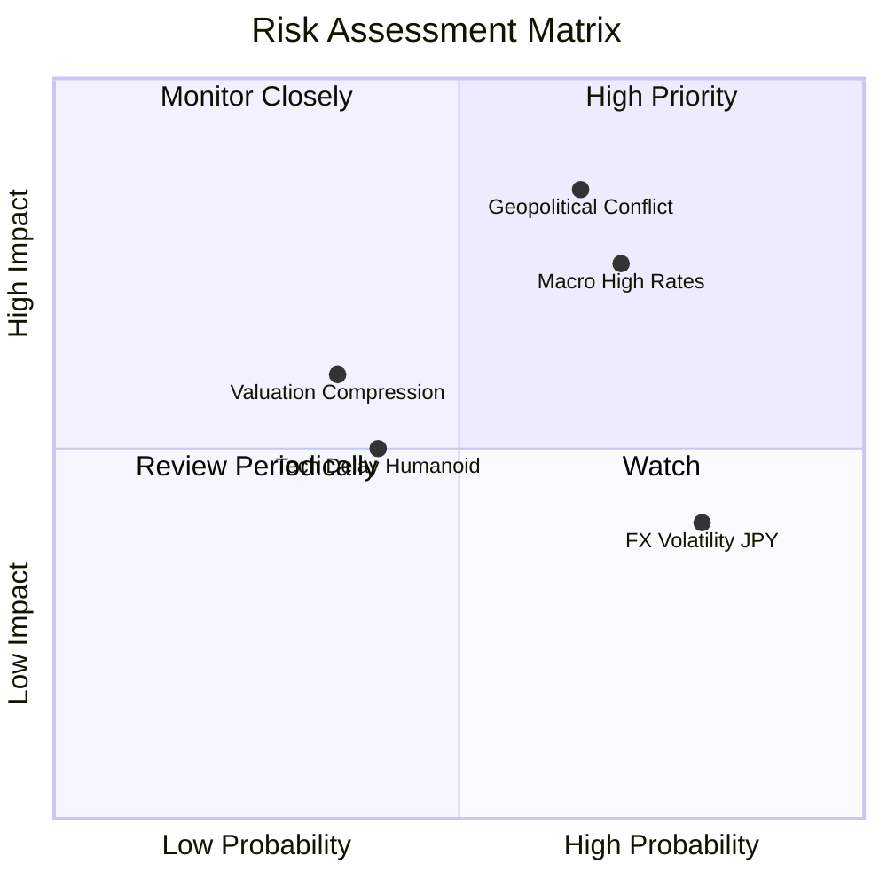

### 9.2 風險清單詳細分析

| # | 風險項目 | 發生機率 | 財務衝擊 | 風險評分 | 緩解措施 |
|---|----------|----------|----------|----------|----------|
| 1 | 🔴 **地緣政治與供應鏈限制** | 高 (65%) | 高 (-12% NAV) | 🔴 **8.2/10** | 修改後等權重分散佈局，避免單一國家管制衝擊 |
| 2 | 🔴 **聯準會維持高利率壓抑估值** | 高 (70%) | 中 (-8% NAV) | 🔴 **7.8/10** | 成分股加權資產負債表極佳（淨現金），利息費用極低 |
| 3 | 🟡 **日圓 (JPY) 匯率持續疲軟** | 極高 (80%)| 低 (-4% NAV) | 🟡 **5.6/10** | 日系成分股多為出口龍頭（Keyence, Fanuc），具自然對沖效應 |
| 4 | 🟡 **人形機器人商業化落地延遲** | 中 (40%) | 中 (-6% NAV) | 🟡 **4.8/10** | ROBO 主要獲利支柱仍為傳統工業與醫療自動化，不依賴單一新科技 |

---

## 10. 投資建議

### 10.1 最終綜合評級雷達圖

```
╔══════════════════════════════════════════════════════════════╗
║                  ROBO 最終綜合評估雷達圖                    ║
╠══════════════════════════════════════════════════════════════╣
║  產業趨勢 (Industry Trend) :  9.2/10 ▓▓▓▓▓▓▓▓▓▓▓▓▓▓▓▓▓▓▓  🏆║
║  成分股品質 (Portfolio Quality):8.8/10 ▓▓▓▓▓▓▓▓▓▓▓▓▓▓▓▓▓▓  🟢║
║  資產安全性 (Balance Sheet):  8.8/10 ▓▓▓▓▓▓▓▓▓▓▓▓▓▓▓▓▓▓  🟢║
║  分散風險度 (Diversification): 9.0/10 ▓▓▓▓▓▓▓▓▓▓▓▓▓▓▓▓▓▓▓  🏆║
║  估值吸引力 (Valuation) :     7.3/10 ▓▓▓▓▓▓▓▓▓▓▓▓▓░░░░░  🟡║
╠══════════════════════════════════════════════════════════════╣
║  總結評分：8.2 / 10 ｜ 綜合評級：🟢 買入 (Buy)               ║
╚══════════════════════════════════════════════════════════════╝
```

### 10.2 目標價與隱含報酬率

| 情境 | 機率權重 | 12M 目標價 ($) | 隱含報酬率 | 權重後潛在貢獻 |
|------|----------|----------------|------------|----------------|
| 🔴 悲觀情境 | 20% | $68.00 | -12.6% | -2.52% |
| 🟡 **基準情境** | **60%** | **$92.00** | **+18.2%** | **+10.92%** |
| 🟢 樂觀情境 | 20% | $110.00 | +41.3% | +8.26% |
| **加權預期期望值** | **100%** | **$90.80** | **+16.66%** | **期望報酬率：+16.7%** |

### 10.3 買入時機與觸發因素

```
╔══════════════════════════════════════════════════════════════════╗
║                  ✅ 買入與操作策略 Checklist                    ║
╠══════════════════════════════════════════════════════════════════╣
║                                                                  ║
║  分批建立基本部位門檻（符合以下條件）：                           ║
║  ✅ 股價回檔至 200 日均線附近 ($74.00 - $78.00) ← 目前正處於此區塊 ║
║  ✅ Trailing P/E 修正至 28.5x 以下                             ║
║                                                                  ║
║  強力加碼觸發條件（出現任一條件）：                               ║
║  ☐ 全球製造業 PMI 連續 2 個月升至 50 榮枯線之上                   ║
║  ☐ 股價突破 $82.00 整理平台並伴隨成交量放大                       ║
║                                                                  ║
║  減碼/停損觸發條件（出現任一條件）：                             ║
║  ☐ 跌破前低 $60.70 強力支撐點（停損價位設為 $60.00）             ║
║  ☐ 成分股加權 ROIC 跌破 9.0%（顯示價值創造能力惡化）             ║
╚══════════════════════════════════════════════════════════════════╝
```

### 10.4 投資人適配度分析

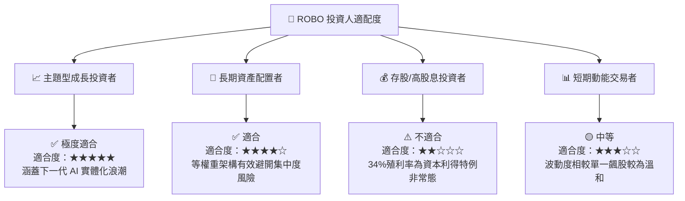

### 10.5 每季 ETF 監控清單 (Quarterly Watch List)

| 追蹤項目 | 關鍵指標 (KPI) | 正常區間 | 警訊 / 減碼門檻 |
|----------|----------------|----------|-----------------|
| **估值指標** | Trailing P/E | 25.0x - 32.0x | > 38.0x (泡沫化) 或 < 20.0x (產業衰退) |
| **成分股獲利** | 加權營收 YoY | > 10.0% | < 3.0% (連續兩季) |
| **資本效率** | 加權 ROIC | > 12.0% | < 8.5% (ROIC < WACC 摧毀價值) |
| **持股分散度** | 最大單一成分股權重 | < 3.0% | > 6.0% (編制機制失效) |
| **指數規模與流動性**| AUM 規模與 Bid-Ask Spread | AUM > $1B / Spread < 0.08% | Spread > 0.20% |

### 10.6 反面論證：什麼情況會證明本論點錯誤（What Would Change My Mind）

```
╔══════════════════════════════════════════════════════════════════╗
║              ⚠️ 論點失效條件（Disconfirming Evidence）           ║
╠══════════════════════════════════════════════════════════════════╣
║  本投資論點在下列條件成立時應全面重新評估或執行停損出場：        ║
║                                                                  ║
║  1. 成分股加權營收 YoY 成長率連續兩季跌破 3.0%。                  ║
║  2. 成分股加權 ROIC 跌破 WACC (8.5%)，代表整個機器人產業進入      ║
║     價值摧毀階段。                                               ║
║  3. 美日歐製造業 Capex 宣佈大規模削減 > 15%。                     ║
║  4. 股價無量跌破 52 週低點 $60.71。                               ║
╚══════════════════════════════════════════════════════════════════╝
```

---

> **免責聲明**：本報告由 AI 分析模型生成，基於 Yahoo Finance、Finviz 及歷史市場數據分析。報告內容僅供學術研究與投資參考，不構成任何形式的證券買賣建議或邀約。投資涉及風險，證券價格可升可跌，過往表現不代表未來績效。投資人在做出任何投資決定前，應獨立評估風險並諮詢專業合格之財務顧問。