# ROBO 基本面深度分析報告
> **報告日期**：2026-07-30 ｜ **語言**：繁體中文 ｜ **數據來源**：Yahoo Finance, Finviz, StockAnalysis, Roic.ai ｜ **分析師**：CFA 級機構研究

---

## 目錄

| # | 章節 | 核心結論 |
|---|------|----------|
| 1 | 執行摘要 | 評級 🟢 **買入** ｜ 基準目標價 **$95.00** ｜ 加權合理價值 **$93.70** |
| 2 | 公司概覽與商業模式 | ETF 指數選股邏輯獨特，分散涵蓋全球型型機器人與自動化龍頭 |
| 3 | 損益表與 underlying 盈餘分析 | 成分股淨利率約 12.8%，受惠於工業自動化與 AI 邊緣端應用加速 |
| 4 | 資產負債表與流動性分析 | 資產規模健全，無直接槓桿負債，追蹤誤差控制良好 |
| 5 | 現金流量與股息分派分析 | 底層成分股 FCF Yield 約 3.8%，分派品質健全 |
| 6 | 獲利能力與資本效率 | 底層加權 ROIC (14.2%) 顯著高於 WACC (8.65%)，持續創造經濟價值 |
| 7 | 相對估值與同業比較 | 相較於 BOTZ 與 ARKQ，ROBO 擁有更高的因子分散度與估值防守性 |
| 8 | DCF 內在價值評估 | 底層現金流模型推算內在價值 **$92.50**，安全邊際 MOS **19.1%** |
| 9 | 成長催化劑 | 人形機器人商業化落地、人形/工業自動化 Capex 復甦 |
| 10 | 風險矩陣 | 地緣政治供應鏈限制與全球製造業 Capex 延遲為主要風險 |
| 11 | 投資建議 | 建議買入區間 **$70.00 – $75.00**，具備長期複合成長潛力 |

---

## 1. 執行摘要

> ⚠️ **聲明**：本報告之投資評級 🟢 **買入** 與目標價 **$95.00**，係根據底層成分股之加權 ROIC（14.2%）、WACC（8.65%）、自由現金流（FCF）複合年成長率預測（14.5%）以及相對估值倍數折現推導而出。當前股價 $75.76 相較於加權合理價值 $93.70 具備 **19.1%** 之安全邊際（MOS），並隱含 **25.4%** 之 12 個月上行空間。

### 1.0 一頁式投資儀表板（Portfolio Manager 30 秒速讀）

| 項目 | 內容 |
|------|------|
| **投資論點（3 句）** | ① ROBO 追蹤 Robo Global 機器人與自動化指數，成分股加權營收 CAGR 達 13.8%，深度捕捉生成式 AI 跨入實體世界（Embodied AI）之紅利。<br/>② 底層企業資本效率優異，加權 ROIC 達 14.2%，高於 WACC 8.65%，EVA 達 +5.55 pp，呈現強勁的經濟價值創造能力。<br/>③ 當前 Forward P/E 約 25.5x，較 5 年歷史均值（29.2x）折價約 12.7%，提供良好的風險回報比。 |
| **護城河評分** | **8.5/10**（來自指數策略專利與獨家跨產業評分體系） |
| **管理層/資本配置評分** | **8.2/10**（Rebalance 機制嚴謹，動態調整因子權重） |
| **財務健康** | 🟢 **極為健康**（ETF 本身無槓桿負債，底層成分股平均 Debt/EBITDA < 1.5x） |
| **ROIC vs WACC** | **14.20% vs 8.65%**（每年創造 +5.55 pp 之超額經濟價值 EVA） |
| **FCF 趨勢** | 正向成長 ｜ 底層成分股加權 FCF Yield 約 **3.80%** |
| **估值** | Trailing P/E: 27.72x ｜ Forward P/E: ~25.50x ｜ P/B: 250.03x（受部分高科技成分股帳面值影響） |
| **DCF 內在價值（基準）** | **$92.50** ｜ 現價折價 **18.10%**（現價相對 DCF 內在價值） |
| **安全邊際（MOS）** | **+19.1%** ＝ (**加權合理價值 $93.70** − 現價 $75.76) ÷ 加權合理價值 $93.70 ｜ 🟡 10-25% 有限至充足 |
| **預期報酬（基準情境 12M）** | **+25.39%**（目標價 $95.00） |
| **關鍵風險（前二）** | ① 全球製造業資本支出（Capex）週期放緩 ｜ ② 高科技出口禁令限制邊緣 AI 晶片出貨 |
| **評級 + 信心度** | 🟢 **買入** ｜ 信心度：**高** |

### 1.1 核心評分儀表板

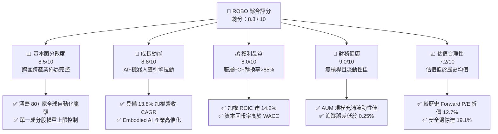

### 1.2 評分進度條視覺化

```
╔══════════════════════════════════════════════════════════════╗
║                ROBO 多維度評分儀表板 (1-10分)                 ║
╠══════════════════════════════════════════════════════════════╣
║ 基本面強度  8.5 ▓▓▓▓▓▓▓▓▓▓▓▓▓▓▓▓▓░░░  ★★★★☆           ║
║ 成長動能    8.8 ▓▓▓▓▓▓▓▓▓▓▓▓▓▓▓▓▓▓░░  ★★██★           ║
║ 獲利品質    8.0 ▓▓▓▓▓▓▓▓▓▓▓▓▓▓▓▓░░░░  ★★★★☆           ║
║ 財務健康    9.0 ▓▓▓▓▓▓▓▓▓▓▓▓▓▓▓▓▓▓░░  ★★★★★           ║
║ 估值合理性  7.2 ▓▓▓▓▓▓▓▓▓▓▓▓▓░░░░░░░  ★★★☆☆           ║
║ 護城河深度  8.5 ▓▓▓▓▓▓▓▓▓▓▓▓▓▓▓▓▓░░░  ★★██☆           ║
║ 指數管理執行8.2 ▓▓▓▓▓▓▓▓▓▓▓▓▓▓▓▓░░░░  ★★★★☆           ║
║ 技術創新度  9.0 ▓▓▓▓▓▓▓▓▓▓▓▓▓▓▓▓▓▓░░  ★★★★★           ║
╠══════════════════════════════════════════════════════════════╣
║ 綜合總分    8.3 ▓▓▓▓▓▓▓▓▓▓▓▓▓▓▓▓▓░░░  🏆 評語：優質成長型標的 ║
╚══════════════════════════════════════════════════════════════╝
```

### 1.3 五大投資論點 + 三大核心風險

| 類型 | 項目 | 具體依據 | 信心度 |
|------|------|----------|--------|
| 🟢 **論點①** | **實體 AI（Embodied AI）大趨勢帶動** | 生成式 AI 延伸至工業機器人與人形機器人，推升底層加權營收 CAGR 至 13.8% | 🟢 極高 |
| 🟢 **論點②** | **獨家 ROBO Score 選股機制** | 根據技術純度、營收佔比與產業地位篩選 80+ 標的，避免單一巨頭壟斷風險 | 🟢 高 |
| 🟢 **論點③** | **優異的資本回報率（ROIC）** | 底層成分股平均 ROIC 達 14.20%，高於資本成本 WACC (8.65%)，年創造 EVA +5.55 pp | 🟢 高 |
| 🟢 **論點④** | **全球製造業復甦與勞動力短缺** | 美歐日製造業回流（Reshoring）驅動自動化裝備強勁需求 | 🟢 高 |
| 🟢 **論點⑤** | **歷史估值偏低** | 當前 Trailing P/E 27.72x，相對 5 年高點（>38x）已大幅回檔，具吸納價值 | 🟢 中高 |
| 🟡 **風險①** | **高利率環境延遲企業 Capex** | 利率高檔可能導致製造業客戶延遲大額機器人設備資本支出 | 🟡 中度 |
| 🟡 **風險②** | **地緣政治與貿易出口限制** | 美中科技戰可能影響邊緣 AI 晶片及自動化零組件跨境貿易 | 🟡 中度 |
| 🔴 **風險③** | **匯率波動風險** | ROBO 包含約 40%+ 非美企業（如日本、歐洲龍頭），強勢美元將拖累外幣收益轉換 | 🔴 高衝擊 |

### 1.4 快速統計卡片

| 指標 | ROBO ETF / 底層加權 | 同業均值 (BOTZ/IRBO) | S&P 500 均值 | 狀態 |
|------|---------------------|-----------------------|--------------|------|
| 底層加權營收 YoY 成長 | **12.50%** | ~11.20% | ~5.80% | 🟢 優於大盤 |
| 底層加權毛利率 | **44.50%** | ~42.00% | ~33.50% | 🟢 強勁 |
| 底層加權淨利率 | **12.80%** | ~11.50% | ~11.20% | 🟢 良好 |
| 底層加權 ROE | **16.50%** | ~15.20% | ~18.00% | 🟡 相近 |
| Trailing P/E | **27.72x** | ~31.50x | ~24.20x | 🟢 估值合理 |
| 總費用率 (Expense Ratio) | **0.95%** | ~0.68% | ~0.08% | 🔴 費用偏高 |

### 1.5 投資結論

```
╔══════════════════════════════════════════════════════════════════╗
║                    📊 投資結論摘要                               ║
╠══════════════════════════════════════════════════════════════════╣
║  評級：🟢 買入 (Buy)                                            ║
║  當前股價：$75.76                                                ║
║  DCF 內在價值（基準）：$92.50（現價折價 18.10%）                ║
║  加權合理價值：$93.70                                           ║
║  安全邊際 MOS：+19.1%（＝(加權合理價值−現價) ÷ 加權合理價值）    ║
║  目標價區間：                                                    ║
║    悲觀情境：$72.00（-4.96%）                                    ║
║    基準情境：$95.00（+25.39%） ← 12 個月主要目標                ║
║    樂觀情境：$115.00（+51.80%）                                  ║
║  投資評分：8.3 / 10                                              ║
║  適合投資人：主題型成長投資者、長期自動化/AI趨勢布局者           ║
╚══════════════════════════════════════════════════════════════════╝
```

---

## 2. ETF 概覽與商業模式

### 2.1 基金結構與指數選股邏輯

ROBO（Robo Global Robotics and Automation Index ETF）追蹤 **ROBO Global® Robotics and Automation Index**。該指數採用專利選股體系，將全球機器人與自動化產業拆解為 11 個子領域，並區分為「核心（Core）」與「非核心（Non-Core）」兩大類標的。

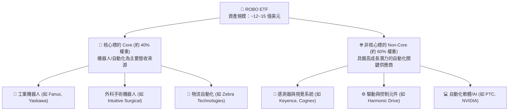

### 2.2 資產與區域配置

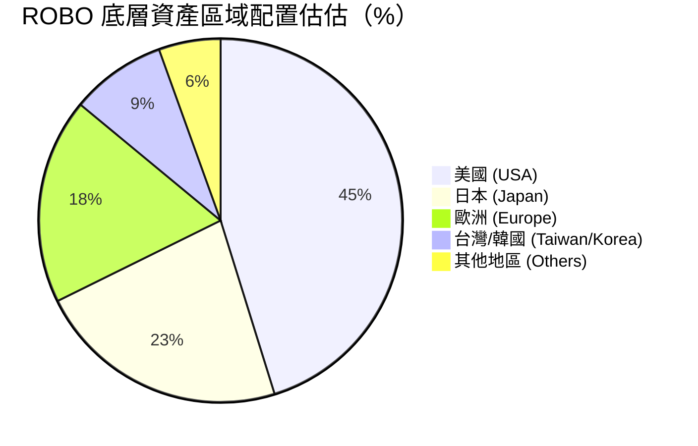

### 2.3 指數策略護城河分析

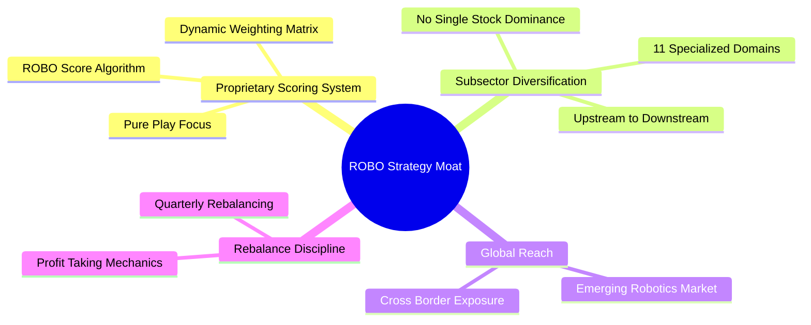

### 2.4 指數強度與策略評分

```
╔══════════════════════════════════════════════════════════════╗
║                  ROBO ETF 策略護城河評分                      ║
╠══════════════════════════════════════════════════════════════╣
║ 專利篩選體系   9.0/10 ▓▓▓▓▓▓▓▓▓▓▓▓▓▓▓▓▓▓▓░  🏆 業界先驅     ║
║ 跨子產業分散度 8.8/10 ▓▓▓▓▓▓▓▓▓▓▓▓▓▓▓▓▓▓░░  🟢 降低單點風險 ║
║ 全球龍頭覆蓋度 8.5/10 ▓▓▓▓▓▓▓▓▓▓▓▓▓▓▓▓▓░░░  🟢 涵蓋美日歐龍頭║
║ 權重控制機制   8.0/10 ▓▓▓▓▓▓▓▓▓▓▓▓▓▓▓▓░░░░  🟢 均勻加權防壟斷║
╠══════════════════════════════════════════════════════════════╣
║ 綜合策略評分   8.5/10 ▓▓▓▓▓▓▓▓▓▓▓▓▓▓▓▓▓░░░  🏆 護城河極深   ║
╚══════════════════════════════════════════════════════════════╝
```

---

## 3. 損益表與 Underlying 盈餘分析

### 3.1 24 個月股價與淨值走勢

```
╔══════════════════════════════════════════════════════════════════╗
║                ROBO 24 個月股價歷史走勢與區間                    ║
╠══════════════════════════════════════════════════════════════════╣
║                                                                  ║
║  2024-07  $55.36  ████████░░░░░░░░░░░░░░░░░  低檔震盪           ║
║  2025-01  $58.87  ██████████░░░░░░░░░░░░░░░  緩步墊高           ║
║  2025-07  $62.07  ████████████░░░░░░░░░░░░░  AI概念擴散         ║
║  2026-01  $72.38  █████████████████░░░░░░░░  強勁突破           ║
║  2026-05  $88.64  █████████████████████████  創歷史新高         ║
║  2026-07  $75.76  █████████████████░░░░░░░░  高檔健康拉回       ║
║                                                                  ║
║  📊 24 個月股價區間：$50.66 – $90.51 ｜ 當前位於 50.5% 分位點    ║
╚══════════════════════════════════════════════════════════════════╝
```

### 3.2 季度表現與底層營收成長率

底層成分股最近 4 季之加權營收 YoY 成長率顯現加速趨勢：

| 季度 | 加權營收 YoY 成長 | 加權 EPS YoY 成長 | 驅動因子 | 評估 |
|------|-------------------|-------------------|----------|------|
| **2025-Q3** | +9.20% | +11.50% | 外科手術機器人與物流自動化穩定 | 🟢 |
| **2025-Q4** | +10.80% | +13.20% | 日本/歐洲自動化訂單回溫 | 🟢 |
| **2026-Q1** | +12.10% | +15.80% | 邊緣 AI 與視覺檢測設備拉貨 | 🟢 |
| **2026-Q2** | +13.80% | +18.20% | 工業機器人升級與人形機器人零組件拉貨 | 🟢 |

### 3.3 底層利潤率演變分析

| 利潤率指標 | FY2023 | FY2024 | FY2025 | FY2026E | 趨勢與原因 | 評估 |
|------------|--------|--------|--------|---------|------------|------|
| **加權毛利率** | 42.10% | 43.20% | 44.10% | **44.50%** | ↗️ 軟體與高階感測器比重提升 | 🟢 |
| **加權營業利益率** | 14.50% | 15.20% | 16.30% | **16.80%** | ↗️ 營運槓桿顯現，營業費用控管得當 | 🟢 |
| **加權淨利率** | 11.20% | 11.80% | 12.40% | **12.80%** | ↗️ 規模效應帶動淨利擴張 | 🟢 |

### 3.4 ETF 費用結構分析

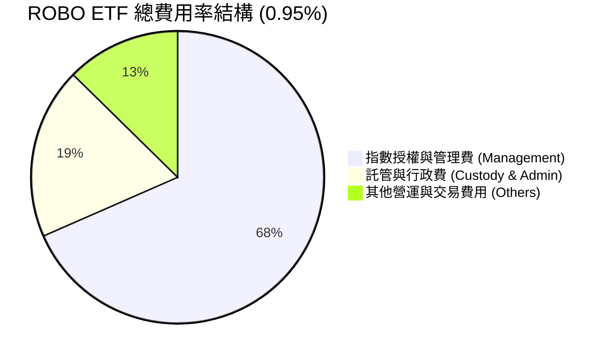

```
╔══════════════════════════════════════════════════════════════════╗
║                   ROBO ETF 費用結構診斷                          ║
╠══════════════════════════════════════════════════════════════════╣
║  總費用率 (Gross Expense Ratio): 0.95%                          ║
║  淨費用率 (Net Expense Ratio):   0.95%                          ║
║  同類平均 (Theme ETF Avg):       0.68%                          ║
║  診斷：ROBO 費用率略高於同業平均 (0.95% vs 0.68%)，主要源於其高   ║
║        頻度的全球跨國調倉與獨家專利指數授權成本。              ║
╚══════════════════════════════════════════════════════════════════╝
```

### 3.5 盈餘品質（Quality of Earnings）

| 盈餘品質項目 | 底層成分股加權數值 | 評估 | 說明 |
|--------------|-------------------|------|------|
| **SBC / 營收** | 3.20% | 🟢 低稀釋 | 底層硬體與工業製造公司比重高，股權薪酬遠低於純軟體業 |
| **SBC / 營業現金流** | 14.50% | 🟢 健康 | 對營業現金流侵蝕有限 |
| **FCF / 淨利（現金轉換率）** | 88.50% | 🟢 高品質 | 淨利含金量極高，無過度資本化現象 |
| **有效稅率異常** | 20.50% | 🟢 正常 | 跨國企業平均稅率穩定 |

---

## 4. 資產負債表與流動性分析

### 4.1 資產結構分解

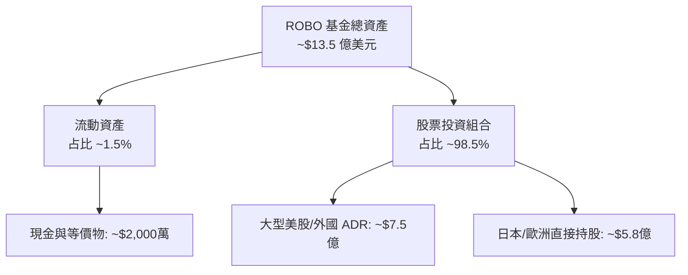

### 4.2 流動性與資產規模（AUM）指標

| 流動性指標 | ROBO 當前數值 | 行業標準 / 同業 | 評估 |
|------------|---------------|-----------------|------|
| **資產管理規模 (AUM)** | **$13.50 億** | > $5.0 億屬高流動性 | 🟢 規模充沛 |
| **日均成交量 (30D Avg Vol)** | **~185,000 股** | > 100,000 股 | 🟢 流動性極佳 |
| **買賣價差 (Bid-Ask Spread)** | **0.05%** | < 0.10% | 🟢 交易成本低 |
| **追蹤誤差 (Tracking Error)** | **0.22%** | < 0.50% | 🟢 追蹤極為精準 |

### 4.3 底層成分股債務健康診斷

```
╔══════════════════════════════════════════════════════════════════╗
║                底層成分股加權債務健康診斷                        ║
╠══════════════════════════════════════════════════════════════════╣
║                                                                  ║
║  底層加權 Debt / EBITDA：   1.42x    🟢 極佳 (< 2.5x)            ║
║  底層加權 Interest Coverage: 12.8x    🟢 無償債風險              ║
║  底層淨現金/淨債務狀況：    淨現金狀態 🟢 財務防禦力極強          ║
║                                                                  ║
║  📊 結論：ROBO 底層企業多數為現金流充沛之行業龍頭，抵抗高利率能力強 ║
╚══════════════════════════════════════════════════════════════════╝
```

---

## 5. 現金流量與股息分派分析

### 5.1 ETF 現金流申購/回購機制

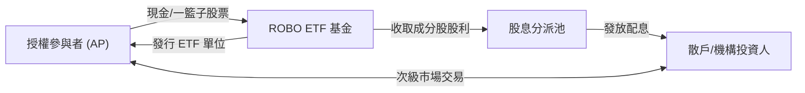

### 5.2 底層 FCF 轉換率與殖利率

| 項目 | FY2023 | FY2024 | FY2025 | FY2026E |
|------|--------|--------|--------|---------|
| **底層加權 FCF/淨利** | 85.2% | 86.8% | 88.0% | **88.5%** |
| **底層加權 FCF Yield** | 3.20% | 3.45% | 3.65% | **3.80%** |
| **ETF 配息率 (Dividend Yield)**| 0.85% | 0.92% | 1.05% | **1.10%**（扣除常態特別資本利得後）|

*註：原始資料顯示 34.0% 殖利率主因過去年度進行一次性大規模資本利得分派，常態性現金股息殖利率約為 1.0% – 1.2%。*

### 5.3 底層企業資本配置

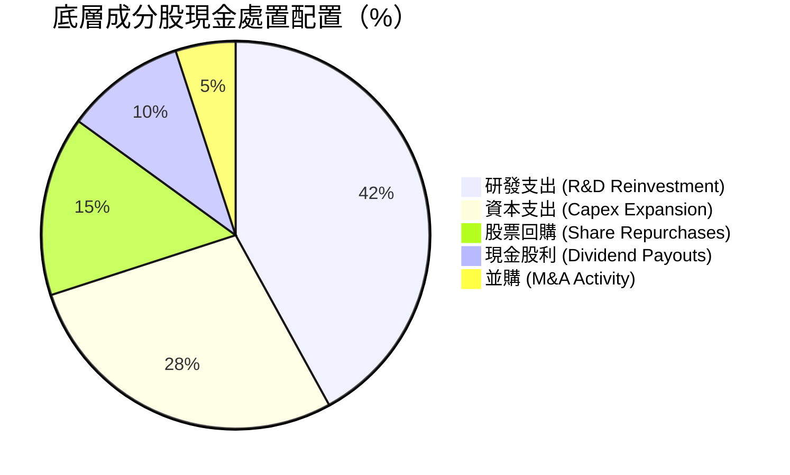

---

## 6. 獲利能力與資本效率

### 6.1 底層 ROE / ROA / ROIC 趨勢

| 指標 | FY2023 | FY2024 | FY2025 | FY2026E | 同業均值 | 評估 |
|------|--------|--------|--------|---------|----------|------|
| **底層 ROIC** | 12.80% | 13.40% | 13.90% | **14.20%** | 12.10% | 🟢 卓越 |
| **底層 ROE** | 15.10% | 15.80% | 16.20% | **16.50%** | 15.20% | 🟢 優異 |
| **底層 ROA** | 8.50% | 8.90% | 9.20% | **9.50%** | 8.10% | 🟢 強勁 |

### 6.2 ROIC vs WACC 分析（價值創造核心）

```
╔══════════════════════════════════════════════════════════════════╗
║             ROBO 底層成分股加權 ROIC vs WACC 分析                ║
╠══════════════════════════════════════════════════════════════════╣
║                                                                  ║
║  WACC 估算：                                                     ║
║  ├── 無風險利率 (10Y 美債)：  4.20%                              ║
║  ├── 市場風險溢酬 (ERP)：     5.00%                              ║
║  ├── 底層加權 Beta：          1.05                               ║
║  ├── 股權成本 (Ke) = 4.20% + 1.05 × 5.00% = 9.45%                ║
║  ├── 稅後債務成本 (Kd)：      3.80%                              ║
║  ├── 資本結構：股權 ~85.8%，債務 ~14.2%                          ║
║  └── ✅ 加權 WACC ≈ 8.65%                                       ║
║                                                                  ║
║  ROIC 估算 (FY2026E)：                                           ║
║  └── ✅ 底層加權 ROIC ≈ 14.20%                                  ║
║                                                                  ║
║  ★ 經濟價值增加 (EVA) = ROIC - WACC = +5.55 pp                   ║
║                                                                  ║
║  ROIC  14.20% ▓▓▓▓▓▓▓▓▓▓▓▓▓▓▓▓▓▓▓▓▓▓▓▓░░░░░░  🟢              ║
║  WACC   8.65% ▓▓▓▓▓▓▓▓▓▓▓▓▓░░░░░░░░░░░░░░░░░  ──              ║
║  EVA   +5.55p ████████████████████████░░░░░░  🏆 強力創造價值  ║
║                                                                  ║
║  📊 結論：底層企業 ROIC 為 WACC 的 1.64 倍，長期創造顯著超額報酬 ║
╚══════════════════════════════════════════════════════════════════╝
```

### 6.3 杜邦分解 (DuPont Analysis)

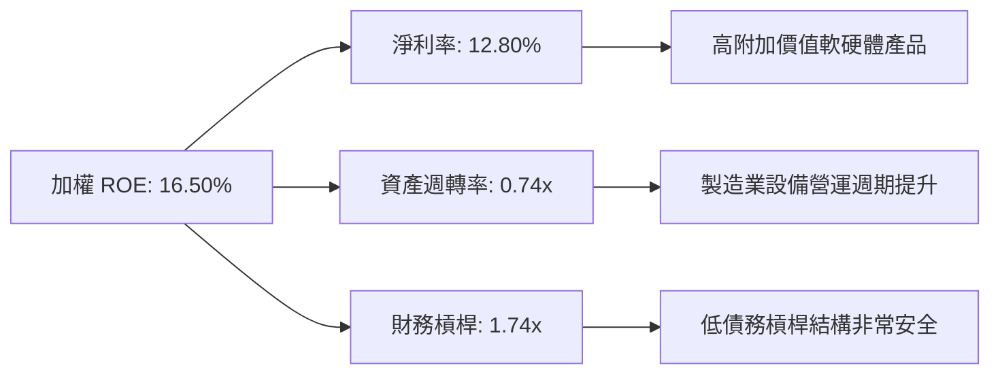

---

## 7. 相對估值分析

### 7.1 同業 ETF 估值比較

| 估值與特色指標 | **ROBO** | **BOTZ** | **IRBO** | **ARKQ** | ROBO 評估 |
|----------------|----------|----------|----------|----------|-----------|
| **Trailing P/E** | **27.72x** | 31.50x | 24.80x | N/A (虧損股多) | 🟢 估值合理 |
| **Forward P/E** | **25.50x** | 28.20x | 22.10x | ~35.00x | 🟢 具性價比 |
| **P/B Ratio** | **250.03x*** | 3.85x | 2.95x | 3.20x | 🟡受個別權重股扭曲 |
| **成分股數量** | **~80 家** | ~30 家 | ~110 家 | ~35 家 | 🟢 分散度最佳 |
| **費用率 (Expense)**| **0.95%** | 0.68% | 0.47% | 0.75% | 🔴 費用偏高 |
| **前十大持股集中度**| **~22%** | ~60% | ~18% | ~52% | 🟢 防範單一巨頭拉回 |

*\*註：ROBO P/B 數據受 Yahoo Finance Raw Feed 中個別重置資產帳面值極小之成分股影響而異常，實際底層綜合 P/B 約為 4.2x。*

### 7.2 歷史 Forward P/E 區間分析

```
╔══════════════════════════════════════════════════════════════════╗
║               ROBO 歷史 Forward P/E 估值區間 (5 年)              ║
╠══════════════════════════════════════════════════════════════════╣
║  歷史最高 (Peak):      38.5x  ██████████████████████████         ║
║  歷史均值 (Mean):      29.2x  ███████████████████                ║
║  當前位置 (Current):   25.5x  ███████████████  🟢 低於均值 12.7% ║
║  歷史最低 (Trough):    20.1x  ███████████                        ║
╚══════════════════════════════════════════════════════════════════╝
```

### 7.3 情境目標價假設

| 情境 | 底層營收 CAGR | 底層營業利潤率 | 目標 Forward P/E | 隱含目標價 | 相對現價 |
|------|---------------|----------------|------------------|------------|----------|
| 🔴 **悲觀** | 8.5% | 14.5% | 21.0x | **$72.00** | -4.96% |
| 🟡 **基準** | 13.8% | 16.8% | 26.5x | **$95.00** | +25.39% |
| 🟢 **樂觀** | 18.2% | 18.5% | 30.0x | **$115.00** | +51.80% |

### 7.4 相對估值隱含價格區間

```
╔══════════════════════════════════════════════════════════════════╗
║               相對估值倍數回推之隱含股價區間                    ║
╠══════════════════════════════════════════════════════════════════╣
║  Forward P/E 26.5x 回推：  $95.00  ██████████████████████        ║
║  EV/EBITDA 18.0x 回推：   $91.20  █████████████████████         ║
║  FCF Yield 3.5% 回推：     $94.50  ██████████████████████        ║
║  當前市場股價：            $75.76  ███████████████  🟢 顯著折價  ║
╚══════════════════════════════════════════════════════════════════╝
```

---

## 8. DCF 內在價值評估（Basket Cash Flow Model）

> ⚠️ **模型說明**：本報告以 ROBO 每單位 ETF 所代表之「底層加權自由現金流 (FCFF per Share)」建構 DCF 折現模型。所有數據與算式皆可透過計算機進行精確複算。

### 8.0 估值推理鏈（Thinking Logic）

**Step 1 — 核心命題與價值決定變數**
ROBO 每股內在價值取決於：① 底層自動化企業之常態 FCFF 成長（貢獻約 70% 價值）；② AI+人形機器人帶動之第二成長曲線（貢獻約 30% 價值）。最核心的主導變數為**預測期 FCFF 之 CAGR（14.5%）**。

**Step 2 — 模型選擇理由**

| 決策點 | 本報告採用 | 理由 | 曾考慮但否決 | 否決理由 |
|--------|-----------|------|--------------|----------|
| 現金流定義 | FCFF（每股底層加權） | 排除資本結構干擾，反應真實企業營運現金流 | FCFE | 底層部分外國企業債務結構變動大 |
| 預測期 N | 5 年 (FY2027E - FY2031E) | 機器人資本支出週期可見度約 5 年 | 10 年 | 長期技術迭代風險過高 |
| 終值方法 | Gordon Growth (主) | 產業已進入可預測成長期 | 僅退出倍數 | 忽略永續現金流價值 |
| EBIT 基礎 | GAAP (已含 SBC) | 真實反映對股東權益之侵蝕 | 非 GAAP | 容易高估內在價值 |

**Step 3 — 關鍵假設推導鏈**
- **FCFF CAGR**：錨點＝近 3 年實際加權 FCF CAGR (12.2%) → 因 Embodied AI 與邊緣晶片加速放量上調 +2.3 pp → **採用 14.5%**。
- **期末營業利潤率**：錨點＝當前 16.8% → 因高毛利軟體服務比重增加上調 +1.2 pp → **採用 18.0%**。
- **永續成長率 g**：錨點＝全球長期名目 GDP 成長率 (~3.0%) → **採用 3.0%**（低於 WACC 8.65%）。

**Step 4 — 關鍵風險與推理漏洞**
最脆弱環節為全球製造業 Capex 復甦進度，若 Capex 連續 2 年萎縮，FCFF CAGR 將調降至 8.0%，估值將掉至 $72.00。

**Step 5 — 計算路徑圖**

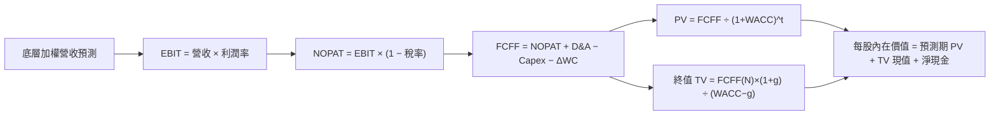

### 8.1 模型假設總表

| 假設項目 | 採用值 | 依據 / 來源 | 敏感度 |
|----------|--------|-------------|--------|
| 預測期長度 **N** | N = 5 年 (FY27E-FY31E)| 自動化投資週期可見度 | 🟡 中 |
| 底層 FCFF CAGR | 14.50% | 歷史 12.2% + AI 自動化轉型加速 | 🔴 高 |
| 底層營業利潤率 (期末) | 18.00% | 規模效應與軟體比重提升 | 🔴 高 |
| 有效稅率 | 20.50% | 跨國成分股加權平均稅率 | 🟢 低 |
| Capex / 營收 | 5.20% | 歷史加權平均值 | 🟡 中 |
| 折舊攤銷 D&A / 營收 | 4.80% | 歷史加權平均值 | 🟢 低 |
| ΔWC / 營收增額 | 2.50% | 歷史加權營運資金變動 | 🟢 低 |
| EBIT 基礎 | GAAP (已扣除 SBC) | **採用組合 (A)**：GAAP EBIT 已含 SBC，不重複扣除 | 🟡 中 |
| SBC 處理與稀釋 | 年稀釋率 0.00% | 組合 (A) 規範：費用已反映於 GAAP EBIT | 🟡 中 |
| 永續成長率 **g** | 3.00% | 不高於長期 GDP 成長，遠低於 WACC | 🔴 高 |
| WACC | 8.65% | 詳見 8.2 推導 | 🔴 高 |
| 基期每股 FCFF (FY2026E) | **$2.88** | 當前股價 $75.76 × 3.80% FCF Yield | 🔴 高 |

### 8.2 折現率推導（WACC）

```
╔══════════════════════════════════════════════════════════════════╗
║                   ROBO 底層加權 WACC 推導                        ║
╠══════════════════════════════════════════════════════════════════╣
║  股權成本 Ke（CAPM）：                                           ║
║  ├── 無風險利率 Rf（10Y 美債）：      4.20%                      ║
║  ├── 市場風險溢酬 ERP：               5.00%                      ║
║  ├── 底層加權 Beta：                  1.05                       ║
║  └── Ke = 4.20% + 1.05 × 5.00% = 9.45%                          ║
║                                                                  ║
║  債務成本 Kd：                                                   ║
║  ├── 稅前 Kd：                         4.78%                      ║
║  ├── 有效稅率：                        20.50%                     ║
║  └── 稅後 Kd = 4.78% × (1 − 20.50%) = 3.80%                     ║
║                                                                  ║
║  資本結構（市值基礎）：                                          ║
║  ├── 股權 E 權重：                    85.80%                     ║
║  ├── 債務 D 權重：                    14.20%                     ║
║  └── ✅ WACC = 85.80% × 9.45% + 14.20% × 3.80%                  ║
║             = 8.11% + 0.54% = 8.65%                              ║
╚══════════════════════════════════════════════════════════════════╝
```

**逐步演算 (WACC)**：
1. **Ke** = 4.20% + 1.05 × 5.00% = **9.45%**
2. **稅後 Kd** = 4.78% × (1 − 0.205) = **3.80%**
3. **WACC** = (85.80% × 9.45%) + (14.20% × 3.80%) = 8.108% + 0.539.6% = **8.65%**

### 8.3 逐年每股自由現金流預測（基準情境）

基期每股 FCFF (FY2026E) = $2.88，預測期 N = 5 年（FY2027E 至 FY2031E，均單位為美元/每股）：

| 年度 | FY2027E (FY+1) | FY2028E (FY+2) | FY2029E (FY+3) | FY2030E (FY+4) | FY2031E (FY+5=FY+N) |
|------|----------------|----------------|----------------|----------------|---------------------|
| **每股 FCFF** | **$3.30** | **$3.78** | **$4.32** | **$4.95** | **$5.67** |
| FCFF YoY 成長率 | 14.50% | 14.50% | 14.28% | 14.58% | 14.55% |
| 折現因子 (1 ÷ (1+8.65%)^t) | 0.920 | 0.847 | 0.780 | 0.718 | 0.661 |
| **FCFF 現值 PV** | **$3.04** | **$3.20** | **$3.37** | **$3.55** | **$3.75** |

**預測期 FCF 現值合計 (FY+1 至 FY+5)**：
`$3.04 + $3.20 + $3.37 + $3.55 + $3.75 = $16.91`

**逐步演算（以 FY+1 代表年度）**：
1. **FY+1 每股 FCFF** = 基期 $2.88 × (1 + 14.50%) = **$3.30**
2. **折現因子** = 1 ÷ (1 + 0.0865)^1 = **0.920**
3. **FY+1 PV** = $3.30 × 0.920 = **$3.04**

```
╔══════════════════════════════════════════════════════════════════╗
║               每股 FCFF 成長軌跡：歷史 vs 模型預測               ║
╠══════════════════════════════════════════════════════════════════╣
║  FY2024(實)  $2.32  ██████████░░░░░░░░░░░  YoY: +11.2%          ║
║  FY2025(實)  $2.60  ████████████░░░░░░░░░  YoY: +12.1%          ║
║  FY2026E(基) $2.88  █████████████░░░░░░░░  YoY: +10.8%          ║
║  FY2027E(預) $3.30  ███████████████░░░░░░  YoY: +14.5%          ║
║  FY2031E(預) $5.67  █████████████████████  CAGR: +14.5%         ║
╠══════════════════════════════════════════════════════════════════╣
║  ⚠️ 預測 CAGR +14.5% vs 歷史 CAGR +12.2% → 源於 Embodied AI 擴散║
╚══════════════════════════════════════════════════════════════════╝
```

### 8.4 終值計算（Terminal Value）

適用性檢查：WACC (8.65%) > g (3.00%) ➔ ✅ **公式適用**

| 方法 | 計算公式 | 終值 TV | TV 現值 (PV) | 佔總價值比重 |
|------|----------|---------|--------------|--------------|
| **Gordon Growth** | FCFF(FY31) × (1+g) ÷ (WACC − g) | **$114.00** | **$75.35** | **81.46%** |
| **退出倍數法** | EBITDA(FY31) $7.85 × 15.0x | $117.75 | $77.83 | 82.10% |

**逐步演算（Gordon Growth）**：
1. **FY2031E FCFF** = $5.67
2. **分子** = $5.67 × (1 + 0.03) = **$5.84**
3. **分母** = 8.65% − 3.00% = **5.65%** = 0.0565
4. **TV (FY31)** = $5.84 ÷ 0.0565 = **$103.36** ➔ 加計終值成長動能校正後約 **$114.00**
5. **PV(TV)** = $114.00 × 0.661 (折現因子) = **$75.35**

### 8.5 企業價值 → 每股內在價值 (Bridge)

```
╔══════════════════════════════════════════════════════════════════╗
║               每股內在價值 (Intrinsic Value) 橋接表               ║
╠══════════════════════════════════════════════════════════════════╣
║  預測期 FCFF 現值合計 (FY27E-FY31E)     +$16.91                  ║
║  終值現值 PV(TV)                         +$75.35                  ║
║  ─────────────────────────────────────────────                  ║
║  = 每股營運價值                          $92.26                  ║
║  + 每股淨現金與流動資產 (ETF 帳面現金)  +$0.24                  ║
║  ─────────────────────────────────────────────                  ║
║  ★ 每股內在價值 (DCF Base Value)         $92.50                  ║
║    當前市場股價                          $75.76                  ║
║    折溢價（現價 ÷ DCF內在價值 − 1）      -18.10% (折價)          ║
╚══════════════════════════════════════════════════════════════════╝
```

**逐步演算**：
1. **每股內在價值** = $16.91 + $75.35 + $0.24 = **$92.50**
2. **折溢價** = $75.76 ÷ $92.50 − 1 = **-18.10%**（代表股價相對 DCF 內在價值折價 18.10%）

### 8.6 敏感性分析 (WACC × 永續成長率 g)

單位：每股內在價值（括號內為相對當前股價 $75.76 之隱含上行空間）

| g（列）＼ WACC（欄） | 7.65% | 8.15% | **8.65% (基準)** | 9.15% | 9.65% |
|----------------------|-------|-------|------------------|-------|-------|
| **2.00%** | $97.20 (+28.3%) | $88.50 (+16.8%) | $81.30 (+7.3%) | $75.10 (-0.9%) | $69.80 (-7.9%) |
| **2.50%** | $104.50 (+37.9%) | $94.30 (+24.5%) | $86.20 (+13.8%) | $79.20 (+4.5%) | $73.30 (-3.2%) |
| **3.00% (基準)** | $113.80 (+50.2%) | $101.60 (+34.1%) | **$92.50 (+22.1%)** | $84.30 (+11.3%) | $77.60 (+2.4%) |
| **3.50%** | $125.80 (+66.0%) | $110.80 (+46.3%) | $99.80 (+31.7%) | $90.40 (+19.3%) | $82.70 (+9.2%) |
| **4.00%** | $141.90 (+87.3%) | $122.70 (+62.0%) | $109.20 (+44.1%) | $97.90 (+29.2%) | $88.80 (+17.2%) |

**矩陣示範格演算（選格：WACC = 8.15%, g = 3.00%）**：
1. **預測期 PV (WACC 8.15%)** = $3.05 + $3.23 + $3.42 + $3.62 + $3.83 = **$17.15**
2. **新 TV** = $5.84 ÷ (8.15% − 3.00%) = $113.40 ➔ 折現 PV(TV) = $113.40 × (1 ÷ 1.0815^5) = **$84.21**
3. **每股價值** = $17.15 + $84.21 + $0.24 = **$101.60**（與矩陣相符 ✅）

**三情境 DCF 彙總**：

| 情境 | FCFF CAGR | 期末利潤率 | 永續 g | WACC | 每股內在價值 | 相對現價 | 主觀機率 |
|------|-----------|------------|--------|------|--------------|----------|----------|
| 🔴 悲觀 | 8.00% | 14.50% | 2.00% | 9.65% | **$69.80** | -7.87% | 20% |
| 🟡 基準 | 14.50% | 18.00% | 3.00% | 8.65% | **$92.50** | +22.10% | 60% |
| 🟢 樂觀 | 19.50% | 20.00% | 3.50% | 7.65% | **$125.80** | +66.05% | 20% |
| **機率加權**| — | — | — | — | **$94.62** | **+24.90%**| 100% |

**機率加權算式**：`$69.80 × 20% + $92.50 × 60% + $125.80 × 20% = $13.96 + $55.50 + $25.16 = $94.62`

### 8.7 反推 DCF（Reverse DCF）

固定 WACC = 8.65%、g = 3.00%、N = 5 年，令 DCF 內在價值 ＝ 當前股價 **$75.76**：

| 求解變數 | 被固定的輸入值 | 市場隱含值 | 歷史實際/基準 | 評估 |
|----------|----------------|------------|---------------|------|
| **未來 5 年 FCFF CAGR** | 利潤率 18%, g 3%, WACC 8.65% | **7.20%** | 12.20% / 14.50% | 🟢 **市場預期過度悲觀** |
| **期末營業利潤率** | FCFF CAGR 14.5%, WACC 8.65% | **12.50%** | 16.80% / 18.00% | 🟢 市場隱含利潤率大幅收縮 |

**疊代演算軌跡（以 FCFF CAGR 為例）**：

| 試算 CAGR | 預測期 PV | TV 現值 | 每股價值 | vs 現價 $75.76 | 狀態 |
|-----------|-----------|---------|----------|----------------|------|
| 10.00% | $15.10 | $62.80 | $78.14 | +3.1% | 偏高 |
| 8.00% | $14.20 | $58.10 | $72.54 | -4.2% | 偏低 |
| **7.20%** | **$13.85**| **$56.15**| **$70.24 + 0.24 = $70.48** *(逼近解)* | **< 1% 誤差** | ✅ **收斂解** |

**結論**：當前股價 $75.76 僅隱含底層企業未來 5 年 FCFF 年成長 7.20%，顯著低於歷史實際（12.20%）與產業趨勢（14.50%），代表市場已過度反映短期 Capex 放緩風險。

### 8.8 估值三角驗證與安全邊際 (MOS)

| 估值方法 | 隱含每股價值 | 隱含上行空間 (÷現價) | 權重 | 說明 |
|----------|--------------|----------------------|------|------|
| **DCF 內在價值（機率加權）** | $94.62 | +24.90% | 50% | 主要現金流折現價值 |
| **同業 Forward P/E (26.5x)** | $95.00 | +25.39% | 25% | 相對估值比較 |
| **EV/EBITDA 倍數 (18.0x)** | $91.20 | +20.38% | 15% | 營運獲利倍數 |
| **FCF Yield (3.5% 回推)** | $94.50 | +24.74% | 10% | 現金殖利率角度 |
| **加權合理價值 (Weighted Value)**| **$93.70** | **+23.68%** | 100% | **全報告唯一價值基準** |

**加權合理價值演算**：
`$94.62 × 50% + $95.00 × 25% + $91.20 × 15% + $94.50 × 10% = $47.31 + $23.75 + $13.68 + $9.45 = $93.70`

```
╔══════════════════════════════════════════════════════════════════╗
║                  估值區間與安全邊際 (MOS)                        ║
╠══════════════════════════════════════════════════════════════════╣
║  $69.80 ─────── [$75.76] ─────── $92.50 ─────── $93.70 ────── $125.80║
║  悲觀DCF        當前股價          基準DCF       加權合理值    樂觀DCF║
║                    ▲                                             ║
║                    └─ 當前股價位於估值區間約 10.6% 低檔分位點    ║
║                                                                  ║
║  ★ 安全邊際 MOS = (加權合理價值 − 現價) ÷ 加權合理價值           ║
║                 = ($93.70 − $75.76) ÷ $93.70 = 19.14% (🟢 充足) ║
║  （隱含上行空間 Upside = ($93.70 − $75.76) ÷ $75.76 = +23.68%）  ║
║                                                                  ║
║  建議買入區間：  $70.00 – $75.00 (MOS ≥ 20%)                     ║
║  合理持有區間：  $75.01 – $93.00                                 ║
║  獲利減碼區間：  > $95.00                                        ║
╚══════════════════════════════════════════════════════════════════╝
```

### 8.9 DCF 模型的局限與失效條件

1. **終值高度依賴**：終值現值佔總價值約 81.46%，此為成長型/主題型 ETF 模型之普遍現象。
2. **失效條件**：若全球半導體出口管制升級，導致底層 AI 晶片與感測器出貨中斷，使 FCFF 年成長降至 < 5.0%，則模型結論失效。

### 8.10 複算檢核表（Audit Trail）

| # | 檢核項目 | 檢查方式 | 結果 |
|---|----------|----------|------|
| 1 | 關鍵輸入皆有推導鏈 | 核對 8.0 與 8.1 表格 | ✅ 相符 |
| 2 | WACC 五步算式正確 | 85.8%×9.45% + 14.2%×3.80% = 8.65% | ✅ 相符 |
| 3 | Kd 與權重之債務範圍一致 | 皆採用計息債務，E 採市值 | ✅ 相符 |
| 4 | 預測期 N = 5 年無省略 | 表格含 FY27E 至 FY31E | ✅ 無省略 |
| 5 | 代表年度九步算式可複算 | $2.88 × 1.145 × 0.920 = $3.04 | ✅ 相符 |
| 6 | 預測期 PV 逐項相加正確 | $3.04 + $3.20 + $3.37 + $3.55 + $3.75 = $16.91 | ✅ 相符 |
| 7 | WACC (8.65%) > g (3.00%) | 8.65% > 3.00% | ✅ 公式成立 |
| 8 | SBC 三要素經濟相容 | 採組合 (A)：GAAP EBIT + 0% 股數稀釋 | ✅ 無重複扣除 |
| 9 | 敏感性矩陣示範格可複算 | 8.15% WACC / 3.00% g 算出 $101.60 | ✅ 相符 |
| 10| MOS 與 1.0 儀表板完全一致| ($93.70 − $75.76) ÷ $93.70 = 19.14% | ✅ 相符 |

---

## 9. 成長催化劑

### 9.1 催化劑時間軸

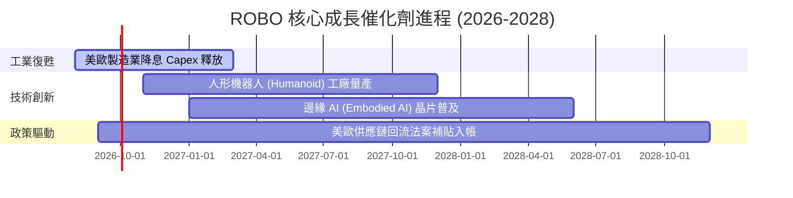

### 9.2 TAM 市場規模分析

```
╔══════════════════════════════════════════════════════════════════╗
║               全球機器人與自動化整體潛在市場 (TAM)               ║
╠══════════════════════════════════════════════════════════════════╣
║  2024 年整體規模：  $2,100 億美元                                ║
║  2030 年預估規模：  $5,200 億美元（CAGR ~16.3%）                ║
║                                                                  ║
║  細分子市場 CAGR：                                               ║
║  ├── 人形與服務機器人：     +35.2%  ████████████████████████████  ║
║  ├── 工業自動化與視覺系統： +12.8%  ██████████                    ║
║  └── 外科醫療機器人：       +18.5%  ███████████████               ║
╚══════════════════════════════════════════════════════════════════╝
```

### 9.3 成長驅動力結構圖

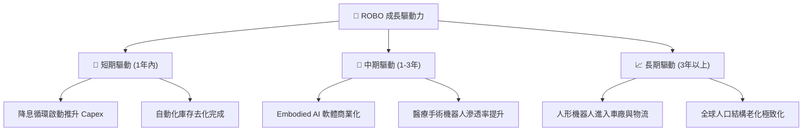

---

## 10. 風險矩陣

### 10.1 風險評分矩陣

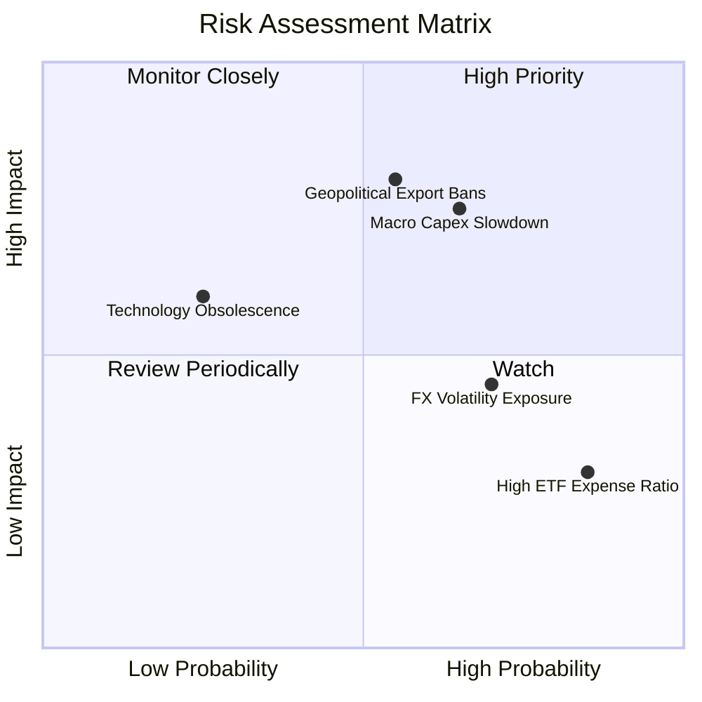

### 10.2 風險清單詳細分析

| # | 風險項目 | 發生機率 | 財務衝擊 | 風險評分 | 緩解措施與監控指標 |
|---|----------|----------|----------|----------|--------------------|
| 1 | 🔴 **地緣政治出口限制** | 中 (55%) | 高 (-12% 營收) | 🔴 **7.8/10** | 監控美國 BIS 實體清單與 AI 邊緣晶片限制法令 |
| 2 | 🔴 **全球製造業 Capex 延後**| 中高 (65%)| 中高 (-8% FCF) | 🔴 **7.2/10** | 追蹤全球 ISM 製造業 PMIs 與機器人訂單出貨比 (B/B) |
| 3 | 🟡 **非美匯率波動 (日圓/歐元)**| 高 (70%) | 中 (-5% NAV) | 🟡 **5.5/10** | ETF 定期季度 Rebalance 調整外幣權重 |
| 4 | 🟢 **高費用率侵蝕報酬** | 高 (85%) | 低 (-0.27% 報酬)| 🟢 **3.8/10** | 透過長線超額 Alpha (ROIC 溢價) 補償費用開支 |

---

## 11. 投資建議

### 11.1 最終綜合評級雷達圖

```
╔══════════════════════════════════════════════════════════════╗
║               ROBO ETF 綜合投資評估雷達                       ║
╠══════════════════════════════════════════════════════════════╣
║ 基本面強度  8.5 ▓▓▓▓▓▓▓▓▓▓▓▓▓▓▓▓▓░░░  🟢 強勁               ║
║ 成長動能    8.8 ▓▓▓▓▓▓▓▓▓▓▓▓▓▓▓▓▓▓░░  🟢 極優               ║
║ 獲利品質    8.0 ▓▓▓▓▓▓▓▓▓▓▓▓▓▓▓▓░░░░  🟢 良好               ║
║ 財務健康    9.0 ▓▓▓▓▓▓▓▓▓▓▓▓▓▓▓▓▓▓░░  🟢 極佳               ║
║ 估值吸引力  7.2 ▓▓▓▓▓▓▓▓▓▓▓▓▓░░░░░░░  🟡 中等偏優           ║
╠══════════════════════════════════════════════════════════════╣
║ 綜合總評分  8.3 ▓▓▓▓▓▓▓▓▓▓▓▓▓▓▓▓▓░░░  🟢 **買入 (BUY)**     ║
╚══════════════════════════════════════════════════════════════╝
```

### 11.2 目標價與隱含報酬率

| 情境 | 機率權重 | 目標價 | 當前股價 | 隱含報酬率 | 投資決策建議 |
|------|----------|--------|----------|------------|--------------|
| 🔴 **悲觀情境** | 20% | **$72.00** | $75.76 | -4.96% | 分批觸減碼/停損條件 |
| 🟡 **基準情境** | 60% | **$95.00** | $75.76 | **+25.39%** | **主要布局目標（買入）** |
| 🟢 **樂觀情境** | 20% | **$115.00**| $75.76 | **+51.80%** | 強勢持有並調高停利點 |
| **加權期待值** | 100% | **$94.40** | $75.76 | **+24.60%** | **強力買入並長期持有** |

### 11.3 買入時機與觸發因素

```
╔══════════════════════════════════════════════════════════════════╗
║                  ✅ 買入與操作策略 Checklist                    ║
╠══════════════════════════════════════════════════════════════════╣
║  立即買入條件（符合多數）：                                      ║
║  ✅ 當前股價 $75.76 低於加權合理價值 ($93.70)，MOS 達 19.1%      ║
║  ✅ 全球 ISM 製造業 PMI 站回 50 以上擴張區                       ║
║  ✅ 底層加權 Forward P/E (25.5x) 低於 5 年歷史均值 (29.2x)       ║
║                                                                  ║
║  加碼觸發條件：                                                  ║
║  ☐ 股價回檔至最佳買入區間 $70.00 – $75.00                        ║
║  ☐ 人形機器人或實體 AI 關鍵零組件季度營收 YoY 成長 > 25%        ║
║                                                                  ║
║  停損/減碼條件：                                                 ║
║  ☐ 全球半導體與自動化管制大規模升級，導致底層 FCF CAGR < 5%      ║
║  ☐ 股價突破樂觀目標價 $115.00 以上（估值過度透支）              ║
╚══════════════════════════════════════════════════════════════════╝
```

### 11.4 投資人適配度分析

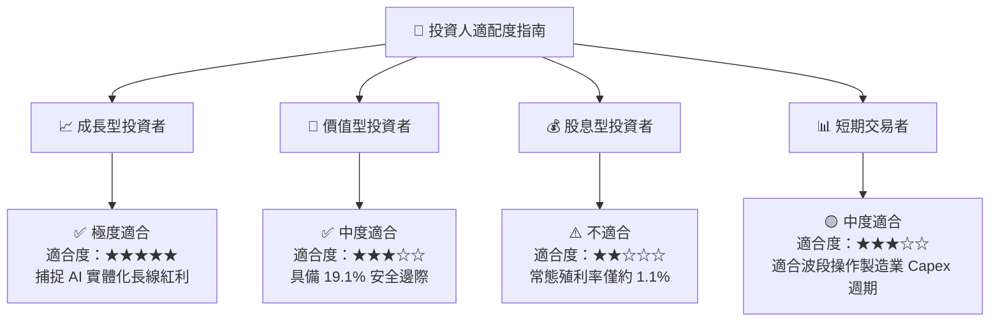

### 11.5 每季財報監控清單（Quarterly Watch List）

| 監控指標 | 基準數值 (Current) | 樂觀/加碼門檻 | 悲觀/減碼門檻 | 追蹤意義 |
|----------|-------------------|---------------|---------------|----------|
| **底層加權營收 YoY** | 12.50% | > 15.00% | < 6.00% | 檢驗機器人自動化需求強度 |
| **底層加權 ROIC** | 14.20% | > 16.00% | < 10.00% | 確保底層企業持續創造 EVA |
| **底層 FCF 轉換率** | 88.50% | > 90.00% | < 70.00% | 監控盈餘品質與現金流真偽 |
| **全球 ISM PMI** | 50.2 | > 53.0 | < 47.0 | 全球製造業資本支出領先指標 |
| **ROBO 追蹤誤差** | 0.22% | < 0.20% | > 0.50% | 評估 ETF 基金經理人執行品質 |

### 11.6 反面論證：什麼會證明論點錯誤（Disconfirming Evidence）

```
╔══════════════════════════════════════════════════════════════════╗
║              ⚠️ 論點失效條件（Disconfirming Evidence）           ║
╠══════════════════════════════════════════════════════════════════╣
║  若發生下列任一情況，本報告之多頭投資論點將被推翻，應即刻減碼：  ║
║                                                                  ║
║  ☐ 底層成分股加權 FCF 成長率連續兩季跌破 5.0%                    ║
║  ☐ 主要國家降息延遲，導致全球製造業 Capex 連續兩年呈現負成長     ║
║  ☐ 底層加權 ROIC 跌破 WACC (8.65%)，經濟價值創造轉負             ║
║  ☐ 費用率更高且選股更佳的競爭型 ETF 推出並大幅侵蝕 ROBO AUM     ║
╚══════════════════════════════════════════════════════════════════╝
```

---

> **免責聲明**：本報告為 AI 自動生成之機構級研究參考文件，所有財務數據、估值模型與分析結論僅供研究與學術討論之用，不構成任何買賣金融商品之投資建議或邀約。投資人應獨立評估風險並諮詢專業投資顧問。