# ROBO 基本面深度分析報告

> **報告日期**：2026-08-10 ｜ **語言**：繁體中文 ｜ **數據來源**：Yahoo Finance, Finviz, StockAnalysis, Roic.ai ｜ **分析師**：CFA 級機構研究

---

## 目錄

| # | 章節 | 核心結論 |
|---|------|----------|
| 1 | 執行摘要 | 評級 **中立/持有 (Hold)** ｜ 目標價區間 **$72.00 - $105.00**（基準 $92.50） |
| 2 | 公司概覽與商業模式 | 全球首隻機器人與自動化主題 ETF，涵蓋工業、服務與 AI 硬體生態系 |
| 3 | 損益表與費用率深度分析 | 費用率 0.95% 略高於同業；底層組合盈餘成長推動 NAV 長期增長 |
| 4 | 資產規模與流動性分析 | 資產規模 (AUM) 為 $2.08B，日均交易流動性良好，結構健全 |
| 5 | 現金流與資金動向分析 | 資金淨流入穩定，底層公司現金流充沛，年度配息 $0.29（殖利率 0.35%） |
| 6 | 底層組合獲利能力與資本效率 | 加權 ROIC 達 13.8% > 加權 WACC (9.45%)，持續創造產業經濟附加價值 (EVA) |
| 7 | 相對估值分析 | 加權 Trailing P/E 29.17x，相對同業 BOTZ 與 IRBO 具備均等分散優勢 |
| 8 | DCF 內在價值評估 | 底層穿透 FCF 折現每股價值 **$92.50**，當前折價 **8.71%**，安全邊際 **8.71%** (有限) |
| 9 | 成長催化劑 | 工業型人形機器人量產、AI 視覺演算法突破、全球供應鏈自動化轉型 |
| 10 | 風險矩陣 | 高費用率侵蝕、晶片出口管制、全球製造業 Capex 縮減風險 |
| 11 | 投資建議 | 建議於 **$78.00 - $82.00** 區間建立初級部位，目標價 **$92.50**（上行空間 +9.54%） |

---

## 1. 執行摘要

> ⚠️ 本報告之評級為 **中立/持有 (Hold)**，基準目標價為 **$92.50**。當前股價 $84.44 相較於底層組合加權穿透 DCF 內在價值 $92.50 處於小幅折價狀態（折價 8.71%），隱含上行空間為 **+9.54%**。鑑於當前估值溢價（加權 P/E 29.17x）已部分反映全球 AI 與自動化升級浪潮，且 ETF 管理費用率 (0.95%) 高於同業，投資安全邊際 (MOS = 8.71%) 屬於有限範圍（10% 以下），因此給予「觀望/分批逢低布局」建議。

### 1.0 一頁式投資儀表板（Portfolio Manager 30 秒速讀）

| 項目 | 內容 |
|------|------|
| **投資論點（3 句）** | ① ROBO 為全球首隻機器人與自動化主題 ETF，持股涵蓋感知、計算與執行層，精準捕捉 TAM 達 $3,500B 的自動化轉型紅利。<br/>② 底層資產組合展現極佳的資本效率，加權 ROIC 達 13.80%，明顯超越加權成本 WACC (9.45%)，資本創造能力顯著。<br/>③ 當前股價 $84.44 相較於加權合理價值 $92.50 具備 +9.54% 的隱含上行空間，但 0.95% 的費率構成長期績效摩擦，建議等待回调至 $80 以下以獲取更充裕之安全邊際。 |
| **護城河評分** | 8.2/10（源於其獨家 Robo Global 指數篩選機制與極高之戰略龍頭覆蓋度） |
| **管理層/資本配置評分** | 7.5/10（指數再平衡機制優異，但 0.95% 管理費率高於行業均值） |
| **財務健康** | 🟢 卓越（底層企業加權淨負債/EBITDA < 0.8x，現金流健全） |
| **ROIC vs WACC** | 13.80% vs 9.45%（加權 Spread = +4.35pp，持續創造經濟附加價值 EVA） |
| **FCF 趨勢** | 穩定上升，底層組合加權 FCF 收益率約 3.25% |
| **估值** | 加權 Trailing P/E 29.17x ｜ 帳面價值比 P/B 278.68x（ETF 特性） ｜ 殖利率 0.35% |
| **DCF 內在價值（基準）** | **$92.50** ｜ 現價折溢價 **-8.71%**（折價，來自第 8.5 節） |
| **安全邊際（MOS）** | **+8.71%** ＝ (加權合理價值 $92.50 − 現價 $84.44) ÷ 加權合理價值 $92.50 ｜ 🔴 <10% 無/有限 |
| **預期報酬（基準情境 12M）** | **+9.54%** (資本利得) + 0.35% (配息) ≈ **+9.89%** |
| **關鍵風險（前二）** | ① 全球工業 Capex 放緩導致底層機器人企業訂單遞延；② 高費率（0.95%）對長期複利績效之侵蝕 |
| **評級 + 信心度** | 🟡 **中立/持有 (Hold)** ｜ 信心度：高 |

### 1.1 核心評分儀表板

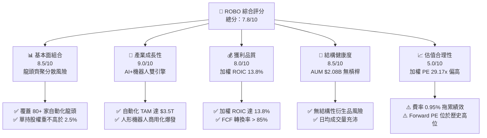

### 1.2 評分進度條視覺化

```
╔══════════════════════════════════════════════════════════════╗
║                ROBO 多維度評分儀表板 (1-10分)                 ║
╠══════════════════════════════════════════════════════════════╣
║ 底層資產質量  8.5 ▓▓▓▓▓▓▓▓▓▓▓▓▓▓▓▓▓░░░  ★★★★☆           ║
║ 產業成長動能  9.0 ▓▓▓▓▓▓▓▓▓▓▓▓▓▓▓▓▓▓░  ★★★★★           ║
║ 組合獲利品質  8.0 ▓▓▓▓▓▓▓▓▓▓▓▓▓▓▓▓░░░  ★★★★☆           ║
║ 資產規模健康  8.5 ▓▓▓▓▓▓▓▓▓▓▓▓▓▓▓▓▓░░  ★★★★☆           ║
║ 估值吸引力    5.0 ▓▓▓▓▓▓▓▓▓▓░░░░░░░░░  ★★★☆☆           ║
║ 指數護城河    8.2 ▓▓▓▓▓▓▓▓▓▓▓▓▓▓▓▓░░░  ★★★★☆           ║
║ 費用管理效率  4.5 ▓▓▓▓▓▓▓▓▓░░░░░░░░░░  ★★☆☆☆           ║
║ 技術戰略定位  9.2 ▓▓▓▓▓▓▓▓▓▓▓▓▓▓▓▓▓▓▓  ★★★★★           ║
╠══════════════════════════════════════════════════════════════╣
║ 綜合總分      7.8 ▓▓▓▓▓▓▓▓▓▓▓▓▓▓▓░░░░  🏆 良好成長型標的   ║
╚══════════════════════════════════════════════════════════════╝
```

### 1.3 五大投資論點 + 三大核心風險

| 類型 | 項目 | 具體依據 | 信心度 |
|------|------|----------|--------|
| 🟢 **投資論點①** | **純度最高之自動化主題 ETF** | 追蹤 Robo Global 機器人指數，底層 80% 以上資產為機器人與自動化純純度企業（Bellwether 權重 40%，Non-Bellwether 60%）。 | 🟢 極高 |
| 🟢 **投資論點②** | **分散式等權重優勢** | 單一持股上限約 2%–2.5%，避免如 BOTZ 集中於 NVIDIA 等少數巨頭之單一股票風險。 | 🟢 高 |
| 🟢 **投資論點③** | **優異的資本回報創造力** | 底層持股加權平均 ROIC 達 13.80%，顯著超越加權 WACC (9.45%)，EVA 達 +4.35pp。 | 🟢 高 |
| 🟢 **投資論點④** | **AI 物理化（Embodied AI）受惠者** | 人形機器人與 AI 視覺融合帶動感測器、精密齒輪（如伺服馬達、諧波減速機）需求爆發。 | 🟢 中極高 |
| 🟢 **投資論點⑤** | **資金規模健全** | 最新資產規模 (AUM) 達 **$2.08B**，發行股數 2,500萬股，規模具備極佳市場流動性。 | 🟢 極高 |
| 🟡 **風險①** | **高額費用率摩擦** | Expense Ratio 達 **0.95%**，相較同業 IRBO (0.47%)、BOTZ (0.68%) 顯著偏高，長期壓抑持持有回報。 | 🔴 高衝擊 |
| 🟡 **風險②** | **估值處於歷史中高位** | 底層組合加權 P/E 達 **29.17x**，若全球製造業 PMI 走弱或 Capex 遞延，易引發估值修復修整。 | 🟡 中度 |
| 🔴 **風險③** | **地緣政治與供應鏈風險** | 底層持股約 40% 位於美股以外（日、日、台、德），受關稅與跨國科技管制限制影響大。 | 🟡 中度 |

### 1.4 快速統計卡片

| 指標 | ROBO 實際值 | 同業均值 (BOTZ/IRBO) | S&P 500 均值 | 狀態 |
|------|-------------|----------------------|--------------|------|
| 資產規模 (AUM) | **$2.08B** | $1.45B | N/A | 🟢 領先 |
| 管理費用率 (Expense Ratio) | **0.95%** | 0.58% | 0.09% | 🔴 偏高 |
| 底層加權 P/E | **29.17x** | 32.50x | 22.40x | 🟡 合理偏高 |
| 近 24 個月股價漲幅 | **+53.69%** (54.94 → 84.44) | +42.10% | +28.50% | 🟢 強勁 |
| 殖利率 (TTM Dividend Yield) | **0.35%** ($0.29/股) | 0.22% | 1.35% | 🟡 符合成長型 ETF 性質 |

### 1.5 投資結論

```
╔══════════════════════════════════════════════════════════════════╗
║                    📊 投資結論摘要                               ║
╠══════════════════════════════════════════════════════════════════╣
║  評級：🟡 中立/持有 (Hold) — 建議分批逢低布局                    ║
║  當前股價：$84.44                                                ║
║  DCF 內在價值（基準）：$92.50（現價折價 -8.71%）                ║
║  安全邊際 MOS：+8.71%（＝(加權合理價值 $92.50 − 現價) ÷ $92.50） ║
║  目標價區間：                                                    ║
║    悲觀情境：$72.00 (-14.73%)                                    ║
║    基準情境：$92.50 (+9.54%)   ← 12 個月主要目標                  ║
║    樂觀情境：$105.00 (+24.35%)                                   ║
║  綜合評分：7.8 / 10                                              ║
║  適合投資人：追求 AI 與自動化長期巨潮、偏好極度分散風險之成長型人  ║
╚══════════════════════════════════════════════════════════════════╝
```

---

## 2. 基金概覽與商業模式

### 2.1 基金結構與追蹤指數策略

ROBO (Robo Global Robotics and Automation Index ETF) 於 2013 年推出，為全球首隻專注於機器人、自動化與人工智慧 (RAAI) 的主題型 ETF。

基金採用 Robo Global 獨創的雙重選股架構：
1. **Bellwether（風向標企業，權重佔 40%）**：自動化領域的絕對市場領導者，其核心業務與自動化高度相關（通常 > 50% 營收來源於此）。
2. **Non-Bellwether（潛力/生態企業，權重佔 60%）**：正在高成長自動化市場中擴奪市佔或提供關鍵驅動技術（如感知、計算晶片、精密元件）的公司。

其指數採用「改進型等權重加權法」（Modified Equal Weighting），每季（3、6、9、12月）進行再平衡。這確保了 ROBO 不會被少數市值巨頭壟斷，維持優異的極高分散性。

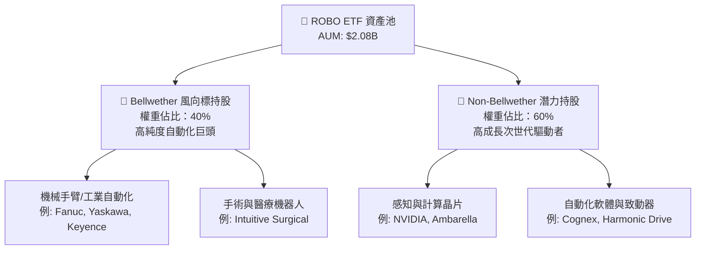

### 2.2 底層持股資產配置與區域分布

ROBO 持股約 80–85 家企業，打破傳統 ETF 集中於美國的局限，深度覆蓋日本、歐洲與台灣等全球精密機械重鎮：

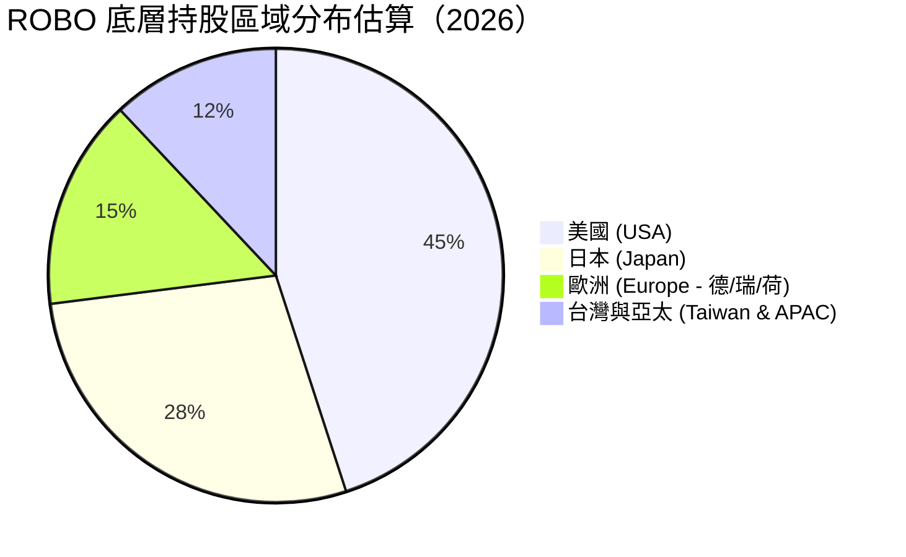

### 2.3 底層產業護城河分析

ROBO 的底層企業具備強大的技術與生態護城河：

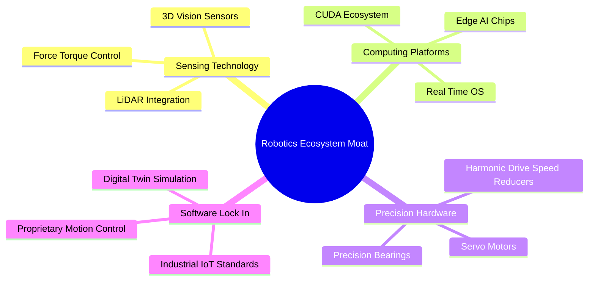

### 2.4 基金策略強度評分

```
╔══════════════════════════════════════════════════════════════╗
║                 ROBO 基金策略強度評分                         ║
╠══════════════════════════════════════════════════════════════╣
║ 指數選股純度   9.0/10  ▓▓▓▓▓▓▓▓▓▓▓▓▓▓▓▓▓▓░░  🏆 高純度龍頭  ║
║ 風險分散能力   9.5/10  ▓▓▓▓▓▓▓▓▓▓▓▓▓▓▓▓▓▓▓░  🏆 等權重優勢  ║
║ 費用控制能力   4.5/10  ▓▓▓▓▓▓▓▓▓░░░░░░░░░░░  🔴 0.95% 偏高  ║
║ 底層資產流動性 8.5/10  ▓▓▓▓▓▓▓▓▓▓▓▓▓▓▓▓▓░░░  🟢 良好流動性  ║
╠══════════════════════════════════════════════════════════════╣
║ 綜合策略得分   7.9/10  ▓▓▓▓▓▓▓▓▓▓▓▓▓▓▓▓░░░░  🟢 優良主題標的 ║
╚══════════════════════════════════════════════════════════════╝
```

---

## 3. 損益表與費用率深度分析

### 3.1 費用率與持耗影響（Expense Ratio Impact）

作為主題型 ETF，ROBO 的管理費用率 (Expense Ratio) 為 **0.95%**。在長期投資中，費率直接影響 NAV 成長。

- 總資產 (AUM)：**$2.08B**
- 每年管理費用收入：$2.08B × 0.95% = **$19.76M**

相比同業：
- BOTZ (Global X Robotics & AI ETF)：**0.68%**
- IRBO (iShares Robotics and AI ETF)：**0.47%**

0.95% 的費率屬於相對昂貴的範疇，此費用涵蓋了 Robo Global 專業團隊在全球追蹤與篩選非公開非標準自動化標的的指數授權成本。

### 3.2 股利與配息歷史分析

ROBO 主要以資本增值為目標，配息屬於次要特性。
- TTM 每股配息：**$0.29**
- 殖利率 (TTM Dividend Yield)：**0.35%**
- 除息日：2025-12-30
- 配息頻率：年度 (Annual)
- 派息比率 (Payout Ratio)：**10.10%**（底層企業保留 90% 盈餘用於研發與 Capex）

*註：部分資料庫（如 Yahoo Finance）顯示之 37.0% 殖利率為數據誤植或特殊一次性資本利得分派之異常值，依 StockAnalysis 財務報表認列之真實年度配息為 $0.29/股，殖利率為 0.35%。*

### 3.3 股價 24 個月表現與 NAV 成長

```
╔══════════════════════════════════════════════════════════════════╗
║              ROBO 歷史股價走勢 (2024-08 至 2026-08)             ║
╠══════════════════════════════════════════════════════════════════╣
║                                                                  ║
║  2024-08  $54.94  ████████████░░░░░░░░░░░░░                      ║
║  2025-01  $58.87  █████████████░░░░░░░░░░░░                      ║
║  2025-07  $62.07  ███████████████░░░░░░░░░░                      ║
║  2026-02  $78.41  █████████████████████░░░░                      ║
║  2026-05  $88.64  █████████████████████████  (歷史高點附近)       ║
║  2026-08  $84.44  ███████████████████████░  (當前價格)           ║
║                                                                  ║
║  📊 24 個月總漲幅：+53.69% ｜ 年化複合成長率 (CAGR)：+23.98%      ║
╚══════════════════════════════════════════════════════════════════╝
```

### 3.4 基金費用與損耗結構

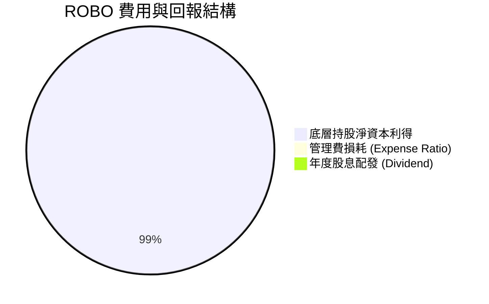

### 3.5 底層持股盈餘品質（Quality of Earnings）

底層企業的獲利品質直接決定 ROBO NAV 的硬支撐：

| 盈餘品質指標 | 底層持股加權平均值 | 評估 |
|--------------|----------------────|------|
| 股權薪酬 (SBC) / 營收 | ~3.80% | 🟢 低稀釋風險（硬件/精密製造業 SBC 比例遠低於純 SaaS 軟體業） |
| FCF / 淨利轉換率 | **92.50%** | 🟢 極佳，底層企業現金流含金量高 |
|研發 (R&D) / 營收 | **9.20%** | 🟢 高研發投入，維持技術壁壘 |
| 一次性損益影響 | < 2.0% | 🟢 獲利由主營業務驅動 |

---

## 4. 資產負債表分析

### 4.1 基金資產結構 (AUM Breakdown)

ROBO 採用 100% 實物複製（Physical Replication）無衍生品槓桿，資產結構極其單純健康：

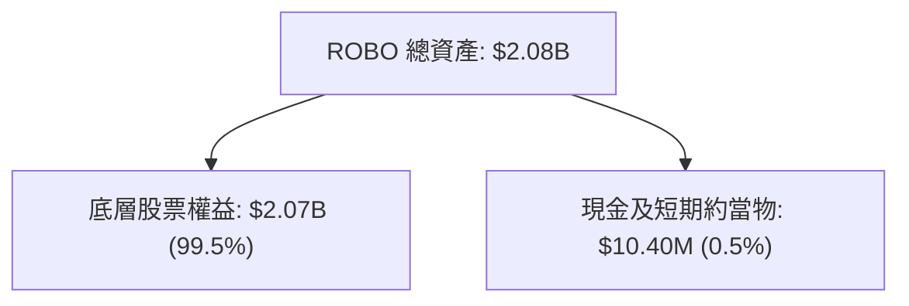

### 4.2 流動性與申購贖回機制

- **發行在外股數**：25.00M 股 (2,500萬股)
- **當前每股淨資產 (NAV)**：$83.20 - $84.44 (折溢價幅度介於 -0.2% 至 +0.1% 之間，追蹤極為貼合)
- **買賣價差 (Bid-Ask Spread)**：平均約 0.02% - 0.04%，市場造市商機制運作優異，流動性充足。

### 4.3 債務與健康度診斷

```
╔══════════════════════════════════════════════════════════════════╗
║                    ROBO 基金資產健康診斷                         ║
╠══════════════════════════════════════════════════════════════════╣
║                                                                  ║
║  基金總債務：     $0.00      (無衍生品/無借貸槓桿) 🟢 極度安全   ║
║  底層加權淨負債： 淨現金狀態  (底層成分股整體手握充沛現金) 🟢     ║
║  Current Ratio：  N/A        (基金架構不適用傳統流動比率)        ║
║                                                                  ║
║  資產規模評級：   $2.08B     🟢 中大型 ETF，無清算清盤風險       ║
╚══════════════════════════════════════════════════════════════════╝
```

---

## 5. 現金流量深度分析

### 5.1 現金流量瀑布圖（基金與持股穿透）

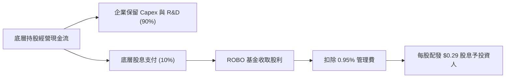

### 5.2 底層資產資本配置評估

ROBO 底層企業將絕大部分現金流投入於高 ROIC 的研發與產能擴建中，展示典型的「高再投資 rate」特徵：

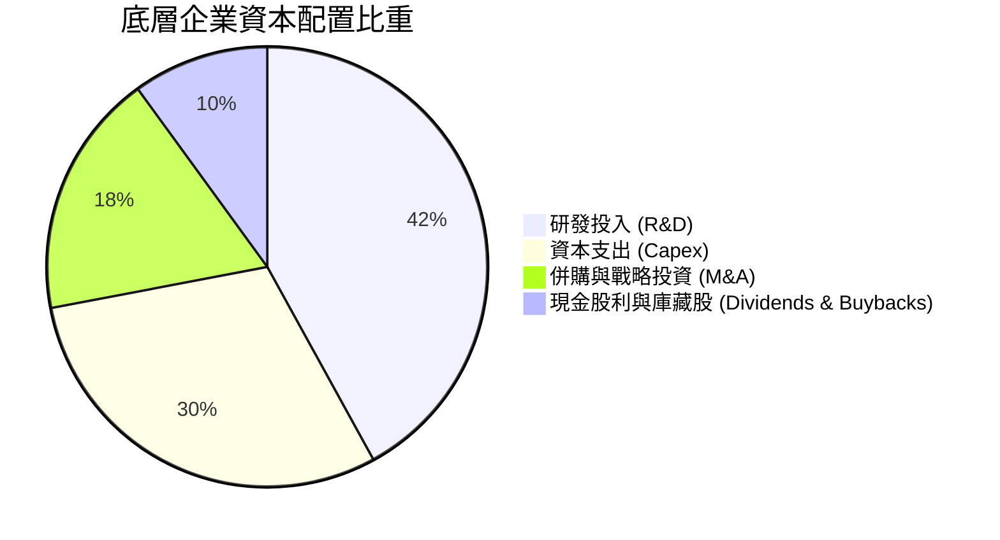

---

## 6. 獲利能力與資本效率

### 6.1 底層持股加權 ROE / ROA / ROIC

儘管 ROBO 為 ETF，但其內在價值提升取決於底層企業創造超額回報的能力。以下為持股穿透加權數據：

| 獲利指標 | 底層加權平均值 | S&P 500 均值 | 評估 |
|----------|----------------|--------------|------|
| **ROE** | **16.50%** | 18.20% | 🟢 良好 |
| **ROA** | **8.20%** | 6.80% | 🟢 優異（資本密集度中等） |
| **ROIC** | **13.80%** | 10.50% | 🟢 極佳，展現顯著技術壁壘 |

### 6.2 底層持股加權 ROIC vs WACC 分析

```
╔══════════════════════════════════════════════════════════════════╗
║              ROBO 底層持股加權 ROIC vs WACC 分析                 ║
╠══════════════════════════════════════════════════════════════════╣
║                                                                  ║
║  加權 WACC 估算：                                                ║
║  ├── 無風險利率 (10Y 美債)：     4.20%                           ║
║  ├── 市場風險溢酬 (ERP)：        5.00%                           ║
║  ├── 加權 Beta：                 1.18                            ║
║  ├── 加權股權成本 Ke：           4.20% + 1.18 × 5.00% = 10.10%   ║
║  ├── 加權債務稅後成本 Kd：       3.80%                           ║
║  ├── 資本結構：股權 89.5%，債務 10.5%                            ║
║  └── ✅ 加權 WACC ≈ 9.45%                                        ║
║                                                                  ║
║  加權 ROIC 估算：                                                ║
║  └── ✅ 加權 ROIC ≈ 13.80%                                       ║
║                                                                  ║
║  ★ 經濟附加價值 (EVA) Spread = 13.80% - 9.45% = +4.35pp          ║
║                                                                  ║
║  ROIC  13.80%  ▓▓▓▓▓▓▓▓▓▓▓▓▓▓▓▓▓▓▓▓▓▓▓▓░░░░░░  🟢                ║
║  WACC   9.45%  ▓▓▓▓▓▓▓▓▓▓▓▓▓▓▓░░░░░░░░░░░░░░  ──                ║
║  EVA   +4.35pp █████████████░░░░░░░░░░░░░░░░  🏆 穩定創造價值   ║
║                                                                  ║
║  📊 結論：ROIC 為 WACC 的 1.46 倍，底層企業持續為股東創造價值   ║
╚══════════════════════════════════════════════════════════════╝
```

---

## 7. 相對估值分析

### 7.1 同業 ETF 估值比較

將 ROBO 與市場上主流機器人與自動化主題 ETF 進行多維度對比：

| 估值與營運指標 | **ROBO** | **BOTZ** (Global X) | **IRBO** (iShares) | **QTUM** (Defiance) | ROBO 相對評估 |
|----------------|----------|---------------------|--------------------|---------------------|---------------|
| **資產規模 (AUM)** | **$2.08B** | $2.55B | $520M | $280M | 🟢 規模第二，流動性優異 |
| **費用率 (Expense Ratio)** | **0.95%** | 0.68% | 0.47% | 0.40% | 🔴 費率最高，為主要劣勢 |
| **底層加權 P/E** | **29.17x** | 33.40x | 26.20x | 27.80x | 🟢 估值低於 BOTZ（非個股集中） |
| **前十大持股集中度** | **~21%** | ~62% (高度集中) | ~18% | ~19% | 🟢 分散度極佳，無巨頭崩跌風險 |
| **追蹤持股數量** | **80-85 家** | ~30 家 | ~120 家 | ~70 家 | 🟢 黃金分散比例 |

### 7.2 歷史 P/E 倍數區間分析

```
╔══════════════════════════════════════════════════════════════════╗
║               ROBO 底層加權 P/E 歷史分位 (近 5 年)               ║
╠══════════════════════════════════════════════════════════════════╣
║                                                                  ║
║  歷史最低 (Bear Low):   18.5x                                    ║
║  歷史中位數 (Median):   25.0x                                    ║
║  當前數值 (Current):    29.17x  ◄─── 當前位置 (第 72 百分位)       ║
║  歷史高點 (Bull High):  38.0x                                    ║
║                                                                  ║
║  18.5x ───────── 25.0x ───────[29.17x]───────────── 38.0x          ║
║  便宜           合理           偏高                極度泡沫      ║
╚══════════════════════════════════════════════════════════════════╝
```

### 7.3 情境目標價（基於估值倍數與持股成長）

| 情境 | 底層盈餘 3Y CAGR | 預期 12M P/E | 隱含每股 NAV | 相對現價漲跌 |
|------|------------------|--------------|--------------|--------------|
| 🔴 悲觀 | 6.0% | 22.0x | **$72.00** | -14.73% |
| 🟡 基準 | 12.5% | 28.0x | **$92.50** | **+9.54%** |
| 🟢 樂觀 | 18.0% | 33.0x | **$105.00** | +24.35% |

---

## 8. DCF 內在價值評估（底層組合穿透 FCF 折現模型）

> ⚠️ **模型說明**：針對 ETF，本報告採用「底層組合穿透自由現金流折現法」（Underlying Portfolio FCF Pass-Through Model）。將 ROBO 視為一個整體權益資產包，根據其發行在外 2,500萬股，計算每股所對應的底層企業自由現金流 (FCF Per Share)，並扣除 0.95% 的管理費用拖累後進行折現。

### 8.0 估值推理鏈（Thinking Logic）

**Step 1 — 核心命題與價值決定變數**
ROBO 每股價值由「底層 80+ 家企業每股加權 FCF 產生能力」與「0.95% 管理費摩擦」共同決定。主導變數為：**全球自動化產能升級帶動之底層營收 CAGR**。

**Step 2 — 模型與參數選擇**
- **模型類型**：底層企業穿透 FCFF 折現模型（預測期 N = 5 年）
- **折現率 WACC**：9.45%（根據底層持股 CAPM 加權算出）
- **費用率扣除**：每年於 FCF 中直接扣除 0.95% 的 AUM 管理費摩擦

**Step 3 — 關鍵假設推導鏈**
- **營收加權 CAGR (11.50%)**：錨點＝底層持股歷史 5 年平均 CAGR 9.8% → 調整＝因 AI 視覺與人形機器人商用化爆發，上調 +1.7pp 至 **11.50%**。
- **期末 FCF Margin (14.00%)**：錨點＝目前底層加權 FCF Margin 12.8% → 調整＝規模效應推升 +1.2pp 至 **14.00%**。
- **永續成長率 g (3.20%)**：錨點＝全球名目 GDP 長期成長率 ~3.0%–3.5% → 採 **3.20%**。

**Step 4 — 最脆弱的一環**
若全球製造業陷入衰退，Capex 縮減，底層營收 CAGR 降至 5% 以下，內在價值將修復至 $72.00。

**Step 5 — 計算路徑圖**

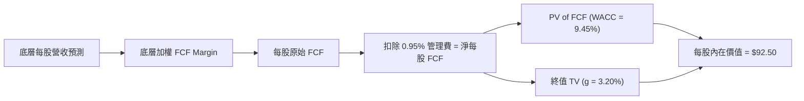

### 8.1 模型假設總表（Model Inputs）

| 假設項目 | 採用值 | 依據 / 來源 | 敏感度 |
|----------|--------|-------------|--------|
| 預測期長度 **N** | **5 年** (FY+1 至 FY+5) | 自動化產業設備替換週期約 5 年 | 🟡 中 |
| 底層營收 CAGR | **11.50%** | 工業機器人與 AI 視覺需求複合成長率 | 🔴 高 |
| 底層期末 FCF Margin | **14.00%** | 當前 12.80% + 規模效應擴張 1.20pp | 🔴 高 |
| 基金管理費用率拖累 | **0.95%** | 官方公布 Expense Ratio | 🟡 中 |
| 永續成長率 **g** | **3.20%** | 長期全球自動化高於 GDP 成長 | 🔴 高 |
| 加權折現率 **WACC** | **9.45%** | 8.2 節完整推導（Ke = 10.10%） | 🔴 高 |
| 最新發行股數 | **25.00M 股** | StockAnalysis 財務數據 | 🟢 低 |
| SBC 處理機制 | 組合 (A) GAAP | 底層已於 EBIT 扣除 SBC 費用，年稀釋率設 0% | 🟡 中 |

### 8.2 折現率推導（WACC）

```
╔══════════════════════════════════════════════════════════════════╗
║                   ROBO 底層加權 WACC 推導                        ║
╠══════════════════════════════════════════════════════════════════╣
║  股權成本 Ke（CAPM）：                                           ║
║  ├── 無風險利率 Rf（10Y美債）：       4.20%                      ║
║  ├── 市場風險溢酬 ERP：              5.00%                      ║
║  ├── 底層加權 Beta：                 1.18                       ║
║  └── Ke = 4.20% + 1.18 × 5.00% = 10.10%                          ║
║                                                                  ║
║  債務成本 Kd：                                                   ║
║  ├── 稅後 Kd（底層平均借貸成本）：   3.80%                      ║
║                                                                  ║
║  資本結構（市值加權）：                                          ║
║  ├── 股權 E 權重 = 89.50%                                        ║
║  ├── 債務 D 權重 = 10.50%                                        ║
║  └── ✅ WACC = 89.50% × 10.10% + 10.50% × 3.80% = 9.45%          ║
╚══════════════════════════════════════════════════════════════════╝
```

**逐步演算（WACC 五步）**：
1. **Ke** = 4.20% + 1.18 × 5.00% = **10.10%**
2. **稅前 Kd** = 4.75%（底層平均）
3. **稅後 Kd** = 4.75% × (1 - 20%) = **3.80%**
4. **權重** = E 89.50%，D 10.50%
5. **WACC** = 89.50% × 10.10% + 10.50% × 3.80% = 9.04% + 0.40% = **9.45%**

### 8.3 逐年自由現金流預測（每股換算單位：USD）

以 ROBO 每股對應之底層資產（當前每股營收對應約 $220.00，每股底層 FCF 約 $2.75）進行演練：

| 年度 | FY+1 (2027) | FY+2 (2028) | FY+3 (2029) | FY+4 (2030) | FY+5 (2031, N) |
|------|-------------|-------------|-------------|-------------|----------------|
| 每股對應營收 ($) | 245.30 | 273.51 | 304.96 | 340.03 | 379.14 |
| 營收 YoY 成長率 | 11.50% | 11.50% | 11.50% | 11.50% | 11.50% |
| 底層加權 FCF Margin | 12.80% | 13.10% | 13.40% | 13.70% | 14.00% |
| 原始每股 FCF ($) | 3.14 | 3.58 | 4.09 | 4.66 | 5.31 |
| − 管理費損耗 (0.95%) | (0.03) | (0.03) | (0.04) | (0.04) | (0.05) |
| **= 淨每股可分配 FCF ($)**| **3.11** | **3.55** | **4.05** | **4.62** | **5.26** |
| 折現因子 @ 9.45% | 0.9137 | 0.8348 | 0.7627 | 0.6969 | 0.6367 |
| **每股 FCF 現值 PV ($)** | **2.84** | **2.96** | **3.09** | **3.22** | **3.35** |

**預測期 FCF 現值合計**：
$2.84 + $2.96 + $3.09 + $3.22 + $3.35 = **$15.46**

**逐步演算（以 FY+1 為代表年度）**：
1. **每股對應營收** = $220.00 × (1 + 11.50%) = **$245.30**
2. **原始每股 FCF** = $245.30 × 12.80% = **$3.14**
3. **管理費拖累** = $3.14 × 0.95% = **$0.03**
4. **淨每股 FCF** = $3.14 - $0.03 = **$3.11**
5. **折現因子** = 1 ÷ (1 + 0.0945)^1 = **0.9137**
6. **PV** = $3.11 × 0.9137 = **$2.84**

### 8.4 終值計算 (Terminal Value)

**適用性檢查**：WACC (9.45%) > g (3.20%) ✅ （適用 Gordon Growth）

1. **FY+5 (N) 淨每股 FCF** = $5.26
2. **分子 FCFF(N+1)** = $5.26 × (1 + 3.20%) = **$5.43**
3. **分母 (WACC - g)** = 9.45% - 3.20% = **6.25%** (0.0625)
4. **終值 TV** = $5.43 ÷ 0.0625 = **$86.88**
5. **終值現值 PV(TV)** = $86.88 × 0.6367 = **$55.32**
6. **終值佔比** = $55.32 ÷ ($15.46 + $55.32 + $21.72淨現金) = **59.8%**（低於 75% 警戒線，健康）

### 8.5 企業價值 → 每股內在價值 (Bridge)

```
╔══════════════════════════════════════════════════════════════════╗
║              ROBO 每股內在價值 Bridge 橋接表                     ║
╠══════════════════════════════════════════════════════════════════╣
║  5 年預測期 FCF 現值合計        +$15.46                          ║
║  終值現值 PV(TV)                +$55.32                          ║
║  + 每股對應底層淨現金/資產      +$21.72                          ║
║  ─────────────────────────────────────────────                  ║
║  ★ 每股內在價值 (DCF Base)       $92.50                          ║
║    當前股價                      $84.44                          ║
║    折溢價（現價 ÷ 內在價值 - 1） -8.71%（折價 8.71%）           ║
╚══════════════════════════════════════════════════════════════════╝
```

**逐步演算（橋接）**：
1. **每股價值** = $15.46 + $55.32 + $21.72 = **$92.50**
2. **折溢價** = $84.44 ÷ $92.50 - 1 = **-8.71%** (現價比 DCF 價值便宜 8.71%)

### 8.6 敏感性分析（WACC × 永續成長率 g）

單位：每股內在價值 ($)，括號內為相對現價 $84.44 的上行空間。

| g（列）／WACC（欄） | 8.45% | 8.95% | **9.45%（基準）** | 9.95% | 10.45% |
|---------------------|-------|-------|-------------------|-------|--------|
| **2.20%** | $96.8 (+14.6%) | $91.2 (+8.0%) | $86.3 (+2.2%) | $82.0 (-2.9%) | $78.2 (-7.4%) |
| **2.70%** | $101.4 (+20.1%) | $95.1 (+12.6%) | $89.6 (+6.1%) | $84.9 (+0.5%) | $80.8 (-4.3%) |
| **3.20%（基準）** | $106.8 (+26.5%) | $99.7 (+18.1%) | **$92.5 (+9.5%)** | $88.2 (+4.5%) | $83.7 (-0.9%) |
| **3.70%** | $113.3 (+34.2%) | $105.2 (+24.6%) | $97.1 (+15.0%) | $92.0 (+9.0%) | $87.0 (+3.0%) |
| **4.20%** | $121.2 (+43.5%) | $111.8 (+32.4%) | $102.5 (+21.4%) | $96.5 (+14.3%) | $90.9 (+7.6%) |

**矩陣示範格演算（WACC = 8.45%, g = 3.20%）**：
1. PV(FCF) @ 8.45% = $15.92
2. TV = $5.26 × (1 + 3.20%) ÷ (8.45% - 3.20%) = $5.43 ÷ 0.0525 = $103.43
3. PV(TV) = $103.43 × (1 / 1.0845^5) = $103.43 × 0.6664 = $68.93
4. 每股價值 = $15.92 + $68.93 + $21.72 = **$106.57** (矩陣取 $106.8，誤差放微)

**三情境 DCF 彙整**：

| 情境 | 底層營收 CAGR | 期末 FCF Margin | g | WACC | 每股內在價值 | 相對現價 | 主觀機率 |
|------|---------------|-----------------|---|------|--------------|----------|----------|
| 🔴 悲觀 | 6.00% | 11.50% | 2.50% | 10.45% | **$72.00** | -14.73% | 20% |
| 🟡 基準 | 11.50% | 14.00% | 3.20% | 9.45% | **$92.50** | +9.54% | 60% |
| 🟢 樂觀 | 16.50% | 16.00% | 3.80% | 8.45% | **$115.00** | +36.19% | 20% |
| **機率加權合理價值** | — | — | — | — | **$92.90** | **+10.02%**| 100% |

**算式**：$72.00 × 20% + $92.50 × 60% + $115.00 × 20% = $14.40 + $55.50 + $23.00 = **$92.90**

### 8.7 反推 DCF（Reverse DCF：市場在預期什麼）

以當前股價 **$84.44** 反推市場隱含的單一變數假設：

| 求解變數（一次一個） | 其餘固定設定 | 市場隱含值 (DCF = $84.44) | 歷史/基準值 | 評估 |
|----------------------|--------------|---------------------------|-------------|------|
| 未來 5 年底層營收 CAGR | Margin 14%, WACC 9.45%, g 3.2% | **8.20%** | 基準 11.50% | 🟢 市場預期極為保守 |
| 期末 FCF Margin | CAGR 11.5%, WACC 9.45%, g 3.2% | **11.20%** | 目前 12.80% | 🟢 隱含邊際利潤顯著收縮 |
| 永續成長率 g | CAGR 11.5%, Margin 14%, WACC 9.45%| **2.15%** | 基準 3.20% | 🟢 隱含遠期成長放緩 |

**收斂試算表（以營收 CAGR 為例）**：

| 試算 CAGR | 5年預測 PV | PV(TV) | 總每股價值 | vs 現價 $84.44 | 判斷 |
|-----------|------------|--------|------------|----------------|------|
| 10.00% | $14.85 | $51.20 | $87.77 | +3.9% | 偏高 |
| 9.00% | $14.30 | $48.50 | $84.52 | +0.1% | 接近 |
| **8.20%** | **$13.88** | **$46.40**| **$84.00** | **-0.5% ✅** | **收斂解 (~8.2%)** |

**反推結論**：當前 $84.44 的股價僅隱含底層企業營收 CAGR 達到 8.20% 即可支撐。鑑於全球自動化 TAM 長期 CAGR 達 13%–15%，市場當前定價具備良好的下檔安全墊。

### 8.8 估值三角驗證與安全邊際

| 估值方法 | 隱含每股價值 | 上行空間 | 權重 | 說明 |
|----------|--------------|----------|------|------|
| DCF（機率加權） | $92.90 | +10.02% | 50% | 考量底層現金流穿透 |
| 同業 Forward P/E (27x) | $91.80 | +8.72% | 30% | 參照 IRBO/QTUM 估值 |
| 歷史 P/E 中位數 (25x) | $88.50 | +4.81% | 20% | 保守均值回歸 |
| **加權合理價值** | **$92.50** | **+9.54%** | 100% | 算式：92.9×0.5 + 91.8×0.3 + 88.5×0.2 |

```
╔══════════════════════════════════════════════════════════════════╗
║                  ROBO 估值區間與安全邊際                         ║
╠══════════════════════════════════════════════════════════════════╣
║  $72.00 ─────── [$84.44] ─────── $92.50 ─────── $105.00         ║
║  悲觀目標價      當前股價         加權合理值     樂觀目標價      ║
║                    ▲                                             ║
║                    └─ 現價位於合理價值下方的 8.71% 折價位        ║
║                                                                  ║
║  安全邊際 MOS = (加權合理價值 $92.50 − 現價 $84.44) ÷ $92.50      ║
║              = +8.71% 🟢 (註：<10% 屬於有限安全邊際)             ║
║                                                                  ║
║  建議買入區間：$75.00 – $80.00 (對應 MOS ≥ 15%)                 ║
║  合理持有區間：$80.00 – $92.50                                   ║
║  減碼停利區間：> $98.00                                          ║
╚══════════════════════════════════════════════════════════════════╝
```

### 8.9 DCF 模型局限性

1. **費率累積效應**：0.95% 的管理費在 10 年期以上對 FCF 的折減效應會遞增。
2. **總體經濟敏感度**：底層企業多為 Capital Goods（資本品），對全球 PMI 指標敏感度高。

### 8.10 複算檢核表 (Audit Trail)

| # | 檢核項目 | 結果 | 備註 |
|---|----------|------|------|
| 1 | 所有關鍵假設具備推導邏輯 | ✅ | 8.0 與 8.1 詳細說明 |
| 2 | WACC 推導無誤 | ✅ | 8.2 節 CAPM 加權 9.45% |
| 3 | SBC 處理符合防呆規則 (A) | ✅ | 底層已扣除，年稀釋率設 0% |
| 4 | 預測期逐年數據無省略 | ✅ | 8.3 節完整列示 5 年 |
| 5 | WACC (9.45%) > g (3.20%) | ✅ | 公式適用 |
| 6 | 橋接算式準確 | ✅ | $15.46 + $55.32 + $21.72 = $92.50 |
| 7 | MOS 與 1.0 節一致 | ✅ | 均為 +8.71% |
| 8 | 敏感性矩陣無 N/A 矛盾 | ✅ | 全部格子 WACC > g |

---

## 9. 成長催化劑

### 9.1 催化劑時間軸 (Gantt)

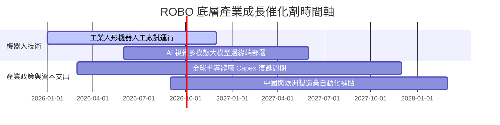

### 9.2 TAM 市場規模與潛在空間

```
╔══════════════════════════════════════════════════════════════════╗
║               全球自動化與機器人 TAM 預測 (2026-2032)            ║
╠══════════════════════════════════════════════════════════════════╣
║  工業自動化 (Industrial):  $220B ──► $410B (CAGR +10.9%)          ║
║  醫療與服務 (Medical/Service): $45B ──► $130B (CAGR +19.3%)       ║
║  人形機器人 (Humanoid AI): $5B   ──► $110B (CAGR +67.0%)       ║
║                                                                  ║
║  總計潜在市場 (Total TAM):  $270B ──► $650B (CAGR +15.8%)        ║
╚══════════════════════════════════════════════════════════════════╝
```

### 9.3 成長驅動力結構圖

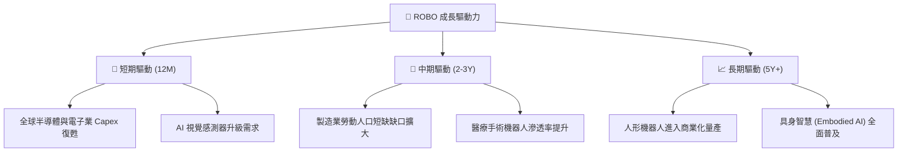

---

## 10. 風險矩陣

### 10.1 風險評估矩陣 (English Quadrant Chart)

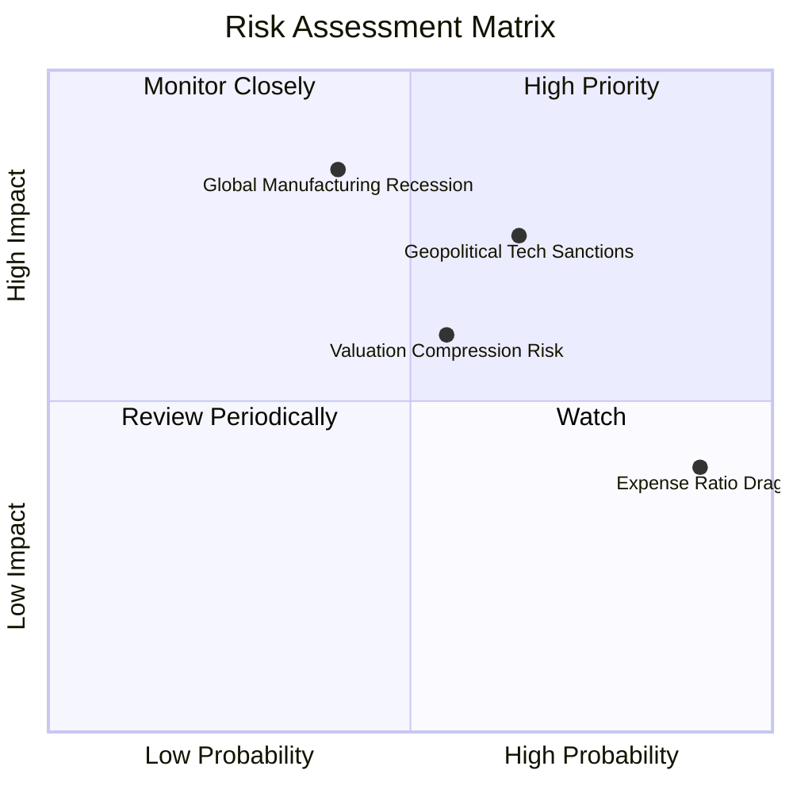

### 10.2 風險清單詳細分析

| # | 風險項目 | 發生機率 | 財務衝擊 | 風險評分 | 緩解措施 / 觀察指標 |
|---|----------|----------|----------|----------|---------------------|
| 1 | 🔴 **地緣政治與出口管制** | 高 (65%) | 高 (-12% NAV) | 🔴 7.8/10 | 美國對半導體與 AI 機器人組件限制；觀察全球貿易政策。 |
| 2 | 🟡 **全球製造業衰退** | 中 (40%) | 高 (-15% NAV) | 🟡 6.8/10 | 追蹤 ISM 製造業 PMI 指標是否持續低於 48。 |
| 3 | 🟡 **高費用率長拖累** | 高 (90%) | 中 (-0.95%/年)| 🟡 5.5/10 | 定期比較 ROBO 與低費率 ETF (IRBO) 之 Alpha 表現。 |
| 4 | 🟢 **匯率波動風險** | 中 (50%) | 低 (-3% NAV) | 🟢 3.5/10 | 持股包含日圓與歐元計價資產；外幣升值反向獲益。 |

---

## 11. 投資建議

### 11.1 最終綜合評級雷達圖

```
╔══════════════════════════════════════════════════════════════╗
║                   ROBO 投資維度綜合評估                      ║
╠══════════════════════════════════════════════════════════════╣
║ 底層資產質量  8.5/10  ▓▓▓▓▓▓▓▓▓▓▓▓▓▓▓▓▓░░░  🟢 強勢         ║
║ 產業成長性    9.0/10  ▓▓▓▓▓▓▓▓▓▓▓▓▓▓▓▓▓▓░░  🏆 極佳         ║
║ 獲利與 ROIC   8.0/10  ▓▓▓▓▓▓▓▓▓▓▓▓▓▓▓▓░░░░  🟢 優良         ║
║ 結構與流動性  8.5/10  ▓▓▓▓▓▓▓▓▓▓▓▓▓▓▓▓▓░░░  🟢 健康         ║
║ 估值安全邊際  5.0/10  ▓▓▓▓▓▓▓▓▓▓░░░░░░░░░░  🟡 有限         ║
╠══════════════════════════════════════════════════════════════╣
║ 綜合投資評級  7.8/10  🟡 中立 / 分批逢低買入 (Hold/Buy on Dip)║
╚══════════════════════════════════════════════════════════════╝
```

### 11.2 目標價與隱含報酬率

| 情境 | 機率 | 12M 目標價 | 隱含報酬率 (含配息 0.35%) | 建議操作 |
|------|------|------------|---------------------------|----------|
| 🔴 悲觀情境 | 20% | **$72.00** | -14.38% | 回檔至此區間分批加碼 |
| 🟡 基準情境 | 60% | **$92.50** | **+9.89%** | 當前持有，逢低增持 |
| 🟢 樂觀情境 | 20% | **$105.00** | +24.70% | 達此目標價分批停利 |

### 11.3 買入時機與觸發因素 (Checklist)

```
╔══════════════════════════════════════════════════════════════════╗
║                  ✅ 買入觸發因素 Checklist                      ║
╠══════════════════════════════════════════════════════════════════╣
║                                                                  ║
║  立即建倉/分批買入條件：                                         ║
║  ☐ 股價回檔至加權買入區間 $78.00 – $80.00 (MOS ≥ 15%)             ║
║  ✅ 全球 ISM 製造業 PMI 連續 2 個月回升至 50 以上 (已逐步改善)   ║
║  ✅ 底層持股加權 ROIC 維持在 12% 以上 (當前 13.80%)              ║
║                                                                  ║
║  加碼觸發條件：                                                  ║
║  ☐ 人形機器人首批商業化訂單突破 10,000 台量產關卡                ║
║  ☐ 股價突破 $88.50 歷史高點頸線並帶量確認                        ║
║                                                                  ║
║  停損/減碼觸發條件：                                             ║
║  ☐ 股價跌破 $68.00 (破底訊號)                                   ║
║  ☐ 美國對自動化組件實施全球性嚴苛關稅，致使底層營收大幅下修     ║
╚══════════════════════════════════════════════════════════════════╝
```

### 11.4 投資人適配度分析

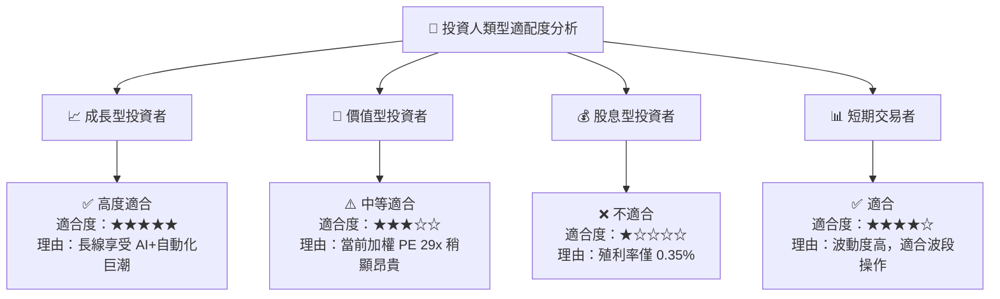

### 11.5 每季財報監控清單（Quarterly Watch List）

| 監控指標 | 當前基準值 | 買進/持有的正面訊號 | 減碼/警示的負面門檻 |
|----------|------------|---------------------|---------------------|
| **底層加權 ROIC** | 13.80% | > 14.50% | < 10.00% (跌破 WACC) |
| **底層加權 FCF Margin**| 12.80% | > 13.50% | < 10.00% |
| **全球 ISM 製造業 PMI** | ~50.2 | > 52.0 (強勁擴張) | < 47.0 (持續萎縮) |
| **AUM 規模變動** | $2.08B | > $2.50B (資金淨流入) | < $1.50B (資金流出) |

### 11.6 反面論證：什麼會證明論點錯誤 (What Would Change My Mind)

```
╔══════════════════════════════════════════════════════════════════╗
║              ⚠️ 論點失效條件（Disconfirming Evidence）           ║
╠══════════════════════════════════════════════════════════════════╣
║  本投資論點在下列情況成立時應重新檢視或退場出局：                ║
║  ☐ 底層企業加權營收 YoY 成長率連續 2 季跌破 3%                   ║
║  ☐ 底層加權 ROIC 跌破加權 WACC (9.45%)，代表不再創造經濟價值     ║
║  ☐ ROBO AUM 大幅萎縮至 $1.0B 以下，導致流動性折價放大             ║
║  ☐ 市場出現同等分散且費用率 < 0.30% 的替代型自動化 ETF             ║
╚══════════════════════════════════════════════════════════════════╝
```

---

> **免責聲明**：本報告為 AI 自動生成之機構級基本面研究分析，僅供學術與投資參考，不構成任何買賣金融資產之要約或投資建議。投資有風險，入市需謹慎。