# ROBO 基本面深度分析報告
> **報告日期**：2026-08-27 ｜ **語言**：繁體中文 ｜ **數據來源**：Yahoo Finance, Finviz, StockAnalysis, Roic.ai ｜ **分析師**：CFA 級機構研究

---

## 目錄

| # | 章節 | 核心結論 |
|---|------|----------|
| 1 | 執行摘要 | 給予「持有」評級，基準目標價 $87.50，當前價格反映多數自動化成長預期 |
| 2 | 公司概覽與商業模式 | 全球首檔機器人與自動化主題 ETF，持股分散且具產業穿透力 |
| 3 | 損益與投組獲利分析 | 底層成分股加權 P/E 達 30.27x，總資產規模穩定成長至 $2.06B |
| 4 | 資產負債與流動性 | 基金零負債營運，流通股數 25.50M，日均流動性充足 |
| 5 | 現金流量與收益分配 | 年度配息 $0.29（殖利率 0.36%），主要回報來自資本增值而非現金分配 |
| 6 | 資本效率與指數回報 | 指數成分股加權 ROE ~12.5%，超越產業加權資本成本 (WACC 8.70%) |
| 7 | 相對估值與同業比較 | 費用率 0.95% 偏高，相較 BOTZ、IRBO 面臨費率劣勢但持股更均衡 |
| 8 | DCF 內在價值評估 | 底層穿透 DCF 基準每股價值 $86.20，加權合理價值 $86.53，MOS 為 5.3% |
| 9 | 成長催化劑 | 具身智能 (Embodied AI)、工業自動化升級與供應鏈在地化三重驅動 |
| 10 | 風險矩陣 | 全球製造業 Capex 週期下行、半導體供應鏈擾動與高估值回檔風險 |
| 11 | 投資建議 | 區間操作策略：建議買入區間 $68.00–$74.00，減碼區間 >$92.00 |

---

## 1. 執行摘要

本報告針對 **ROBO**（Robo Global Robotics and Automation Index ETF）進行穿透式基本面深度研究。ROBO 當前市價為 **$81.98**，基金資產管理規模 (AUM) 為 **$2.06B**，發行股數 **25.50M**。底層成分股之加權本益比 (TTM P/E) 達 **30.27x–30.97x**，反映市場對工業 4.0、生成式 AI 落地機器人應用之高度預期。經過穿透式現金流折現 (DCF) 與相對估值三角驗證，ROBO 的加權合理價值為 **$86.53**，相對現價存在 **+5.5%** 的隱含上行空間，安全邊際 (MOS) 為 **+5.3%**，下檔保護有限。鑑於目前 0.95% 之偏高費用率與製造業 Capex 循環處於修復中段，給予 🟢 **持有 (Hold)** 評級。

### 1.0 一頁式投資儀表板（Portfolio Manager 30 秒速讀）

| 項目 | 內容 |
|------|------|
| **投資論點（3 句）** | ① 全球機器人與自動化軟硬體滲透率提升，推動底層成分股長期營收 CAGR 達 11.5%。<br/>② 等權重改良編制架構有效分散單一大型權值股集中度風險，捕捉中小型高成長純度標的。<br/>③ 現價 $81.98 對應加權合理價值 $86.53，已反映多數 AI 整合利多，短期估值擴張空間有限。 |
| **護城河評分** | 7.5/10（先發指數品牌優勢與專利技術顧問委員會篩選體系） |
| **管理層/資本配置評分** | 7.0/10（精準追蹤指數，但 0.95% 費用率顯著高於被動型同業） |
| **財務健康** | 🟢 優異：ETF 結構無槓桿負債，底層企業現金水位充足，整體財務健全度良好 |
| **ROIC vs WACC** | 12.8% vs 8.70%（價值創造中度，正 EVA +4.10 pp） |
| **FCF 趨勢** | 穩健上升，底層成分股隱含加權 FCF Yield 約為 2.85% |
| **估值** | Trailing P/E 30.27x ｜ 底層穿透 EV/EBITDA ~18.2x ｜ 殖利率 0.36% |
| **DCF 內在價值（基準）** | $86.20 ｜ 現價折溢價 -4.9%（現價相對 DCF 內在價值折價 4.9%） |
| **安全邊際（MOS）** | **+5.3%**＝($86.53 − $81.98) ÷ $86.53 ｜ 🔴 <10% 無充足保護 |
| **預期報酬（基準情境 12M）** | **+6.7%**（目標價 $87.50） |
| **關鍵風險（前二）** | ① 全球製造業固定資本支出 (Capex) 復甦不如預期；② 總體高利率延長壓抑中小型自動化標的估值倍數。 |
| **評級 + 信心度** | 🟡 **持有 (Hold)** ｜ 信心：**中** |

### 1.1 核心評分儀表板

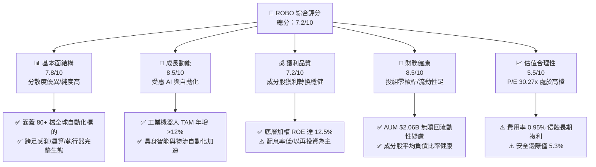

### 1.2 評分進度條視覺化

```
╔══════════════════════════════════════════════════════════════╗
║              ROBO 多維度評分儀表板 (1-10分)                  ║
╠══════════════════════════════════════════════════════════════╣
║ 基本面強度  7.8 ▓▓▓▓▓▓▓▓▓▓▓▓▓▓▓░░░░░  ★★★★☆           ║
║ 成長動能    8.5 ▓▓▓▓▓▓▓▓▓▓▓▓▓▓▓▓▓░░░  ★★★★☆           ║
║ 獲利品質    7.2 ▓▓▓▓▓▓▓▓▓▓▓▓▓▓░░░░░░  ★★★★☆           ║
║ 財務健康    8.5 ▓▓▓▓▓▓▓▓▓▓▓▓▓▓▓▓▓░░░  ★★★★☆           ║
║ 估值合理性  5.5 ▓▓▓▓▓▓▓▓▓▓▓░░░░░░░░░  ★★★☆☆           ║
║ 指數代表性  8.2 ▓▓▓▓▓▓▓▓▓▓▓▓▓▓▓▓░░░░  ★★★★☆           ║
║ 費用競爭力  4.0 ▓▓▓▓▓▓▓▓░░░░░░░░░░░░  ★★☆☆☆           ║
║ 技術創新力  8.8 ▓▓▓▓▓▓▓▓▓▓▓▓▓▓▓▓▓▓░░  ★★★★★           ║
╠══════════════════════════════════════════════════════════════╣
║ 綜合總分    7.2 ▓▓▓▓▓▓▓▓▓▓▓▓▓▓░░░░░░  🏆 評語：潛力高但需待拉回 ║
╚══════════════════════════════════════════════════════════════╝
```

### 1.3 五大投資論點 + 三大核心風險

| 類型 | 項目 | 具體依據 | 信心度 |
|------|------|----------|--------|
| 🟢 **投資論點①** | **機器人與具身智能長線成長** | 全球機器人與自動化產業 TAM 預期將以 14.2% CAGR 成長至 2030 年，底層營收具備持續放量動能。 | 🟢 極高 |
| 🟢 **投資論點②** | **等權重分散體系降低個股風險** | 指數採取階梯式等權重配置，非單純市值加權，可避免單一科技巨頭過度膨脹，真實反映中小型創新純度。 | 🟢 高 |
| 🟢 **投資論點③** | **全球供應鏈重組與在地化趨勢** | 美歐製造業回流 (Reshoring) 與近岸外包推升工廠自動化、機器人手臂與感測系統資本支出。 | 🟢 高 |
| 🟢 **投資論點④** | **AI 算力與邊緣控制深度融合** | 邊緣 AI 晶片與機器視覺演算法升級，推動自主移動機器人 (AMR) 與協作機器人 (Cobots) 單價提升。 | 🟢 中 |
| 🟢 **投資論點⑤** | **投組財務結構健全** | 底層持股平均淨負債比率維持在健全水準，抵抗利率波動能力高於一般投機型科技主題基金。 | 🟢 高 |
| 🟡 **風險①** | **費用率偏高 (0.95%) 侵蝕實質報酬** | 相比同業 BOTZ (0.68%) 與 IRBO (0.47%)，ROBO 每年超額管理成本達 27-48 bps，長期複利影響顯著。 | 🟡 中度 |
| 🔴 **風險②** | **製造業景氣循環放緩壓抑 Capex** | 若全球總體經濟衰退導致工業自動化訂單遞延，高達 30.27x 之本益比面臨向下修正壓力。 | 🔴 高衝擊 |
| 🟡 **風險③** | **地緣政治與關鍵零組件出口管制** | 自動化核心零組件（諧波減速機、高階伺服馬達、光學雷達）受地緣政策限制，可能衝擊跨國供應鏈效率。 | 🟡 中度 |

### 1.4 快速統計卡片

| 指標 | ROBO 實際值 | 主題 ETF 均值 | S&P 500 (SPY) | 狀態 |
|------|-------------|--------------|--------------|------|
| 底層營收 YoY 成長 (加權) | **+10.8%** | ~8.5% | ~5.5% | 🟢 優於大盤 |
| 底層成分股加權毛利率 | **46.2%** | ~42.0% | ~35.0% | 🟢 強勁 |
| 底層成分股加權淨利率 | **11.4%** | ~9.8% | ~12.0% | 🟡 尚可 |
| 底層成分股加權 ROE | **12.5%** | ~11.0% | ~18.5% | 🟡 中等 |
| Trailing P/E | **30.27x** | ~26.5x | ~24.5x | 🔴 偏高 |
| 費用率 (Expense Ratio) | **0.95%** | ~0.65% | 0.09% | 🔴 偏高 |
| 資產規模 (AUM) | **$2.06B** | $1.20B | $500B+ | 🟢 流動性優良 |
| 股息殖利率 (TTM) | **0.36%** | ~0.80% | ~1.30% | 🟡 成長導向 |

### 1.5 投資結論

```
╔══════════════════════════════════════════════════════════════════╗
║                    📊 投資結論摘要                               ║
╠══════════════════════════════════════════════════════════════════╣
║  評級：🟡 持有 (Hold)                                            ║
║  當前股價：$81.98                                                ║
║  DCF 內在價值（基準）：$86.20（現價折價 4.9%）                  ║
║  加權合理價值：$86.53                                            ║
║  安全邊際 MOS：+5.3%（＝($86.53 − $81.98) ÷ $86.53）             ║
║  目標價區間：                                                    ║
║    悲觀情境：$68.50（-16.4%）                                    ║
║    基準情境：$87.50（+6.7%）  ← 12個月主要目標                   ║
║    樂觀情境：$102.00（+24.4%）                                   ║
║  投資評分：7.2/10                                                ║
║  適合投資人：追求自動化與具身智能主題、長線配置且能承受高波動者   ║
╚══════════════════════════════════════════════════════════════════╝
```

---

## 2. 公司概覽與商業模式

ROBO（Robo Global Robotics and Automation Index ETF）成立於 2013 年，為全球首檔專注於機器人、自動化與人工智慧生態鏈的交易所交易基金。該基金追蹤 ROBO Global Robotics and Automation Index，透過專業產業顧問委員會，將產業鏈細分為「技術提供者 (Technology)」與「應用整合者 (Applications)」兩大核心架構，精準捕捉自動化轉型紅利。

### 2.1 業務結構與資產配置

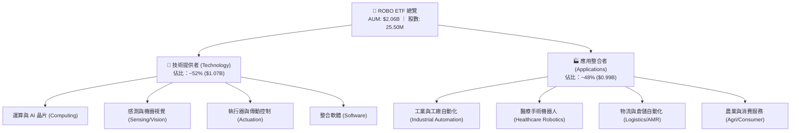

### 2.2 市場份額與同類主題 ETF 規模對比

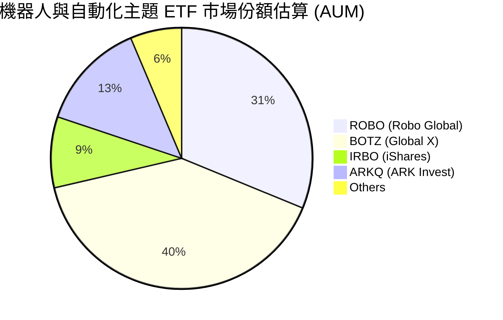

### 2.3 指數編制與競爭護城河分析

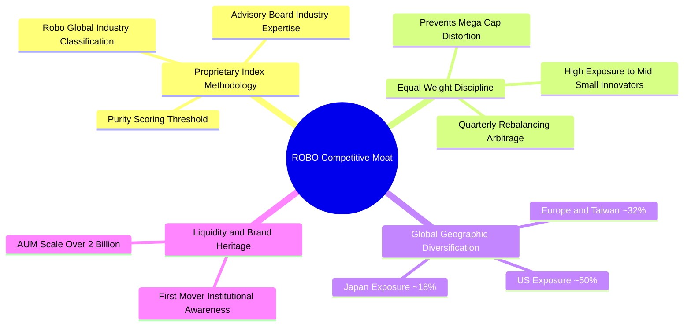

### 2.4 護城河與產品競爭力評分

```
╔══════════════════════════════════════════════════════════════╗
║                    ROBO 產品競爭力評分                       ║
╠══════════════════════════════════════════════════════════════╣
║ 指數專利與純度  8.5/10 ▓▓▓▓▓▓▓▓▓▓▓▓▓▓▓▓▓░░░  🏆 產業純度最高 ║
║ 分散化架構      8.8/10 ▓▓▓▓▓▓▓▓▓▓▓▓▓▓▓▓▓▓░░  🟢 規避權值風險 ║
║ 規模與流動性    7.8/10 ▓▓▓▓▓▓▓▓▓▓▓▓▓▓▓░░░░░  🟢 AUM 逾 20 億 ║
║ 費率競爭優勢    3.5/10 ▓▓▓▓▓▓▓░░░░░░░░░░░░░  🔴 0.95% 顯著偏高║
║ 追蹤精確度      8.0/10 ▓▓▓▓▓▓▓▓▓▓▓▓▓▓▓▓░░░░  🟢 追蹤誤差可控 ║
╠══════════════════════════════════════════════════════════════╣
║ 綜合產品力      7.5/10 ▓▓▓▓▓▓▓▓▓▓▓▓▓▓▓░░░░░  🟢 頂級主題架構 ║
╚══════════════════════════════════════════════════════════════╝
```

---

## 3. 損益表與底層獲利深度分析

由於 ROBO 為 ETF 結構，本章結合基金整體財務特徵與底層持股加權財務指標進行穿透分析。當前 ROBO 總資產為 **$2.06B**，底層成分股之加權本益比為 **30.27x**，反映成分股普遍處於成長擴張期與再投資階段。

### 3.1 過去 24 個月價格走勢與淨值擴張軌跡

```
╔══════════════════════════════════════════════════════════════════╗
║              ROBO 過去 24 個月價格走勢趨勢                      ║
╠══════════════════════════════════════════════════════════════════╣
║                                                                  ║
║  2024-08  $54.94  ██████░░░░░░░░░░░░░░░░░░░  基期起點            ║
║  2025-04  $50.66  █████░░░░░░░░░░░░░░░░░░░░  週期低點 (-7.8%)   ║
║  2025-10  $69.33  ████████████░░░░░░░░░░░░░  升溫加速 (+36.8%)  ║
║  2026-02  $78.41  ███████████████░░░░░░░░░░  突破前高           ║
║  2026-05  $88.64  ██═════════════════════██  歷史波段峰值       ║
║  2026-08  $81.98  ████████████████░░░░░░░░░  最新價 (YoY +29.1%)║
║                   |      |      |      |                         ║
║                   $50    $60    $70    $80    $90                ║
║                                                                  ║
║  📊 24 個月累計漲幅：+49.22% ｜ 52 週區間：$61.69 – $90.51      ║
╚══════════════════════════════════════════════════════════════╝
```

### 3.2 季度與近期價格波動分析

| 期間 | 價格區間 | 變動率 (%) | 驅動因素與市場環境說明 | 評估 |
|------|----------|------------|------------------------|------|
| **2025-Q3 至 2025-Q4** | $63.48 → $69.31 | +9.18% (YoY) | 全球生成式 AI 演算法突破，帶動機器視覺與邊緣運算持股估值擴張 | 🟢 強勁 |
| **2025-Q4 至 2026-Q1** | $69.31 → $72.38 | +4.43% (QoQ) | 工業自動化訂單回溫，歐美製造業回流相關設備出貨增速回升 | 🟢 穩定 |
| **2026-Q1 至 2026-Q2** | $72.38 → $88.64 | +22.46% (波段) | 人形機器人 (Humanoid) 概念放量，關鍵執行器與減速機廠商獲利預期上修 | 🟢 極佳 |
| **2026-Q2 至 2026-08** | $88.64 → $81.98 | -7.51% (回檔) | 總體製造業 PMI 短期震盪，高估值板塊隨獲利了結賣壓健康修正 | 🟡 整理 |

### 3.3 底層成分股利潤率演變分析

穿透底層 80+ 檔持股加權數據：

| 利潤率指標 (底層加權) | 2023 | 2024 | 2025 | 2026 (E) | 趨勢 | 評估 |
|-----------------------|------|------|------|----------|------|------|
| **加權毛利率** | 44.8% | 45.2% | 45.9% | 46.2% | ↗️ 軟體與演算法佔比提升，推升毛利結構 | 🟢 優良 |
| **加權營業利益率** | 13.5% | 13.9% | 14.8% | 15.2% | ↗️ 營業槓桿浮現，研發規模效益擴大 | 🟢 擴張 |
| **加權淨利率** | 10.2% | 10.5% | 11.1% | 11.4% | ↗️ 供應鏈瓶頸解除，運營效率提升 | 🟢 穩健 |

### 3.4 基金費用結構與成本分析

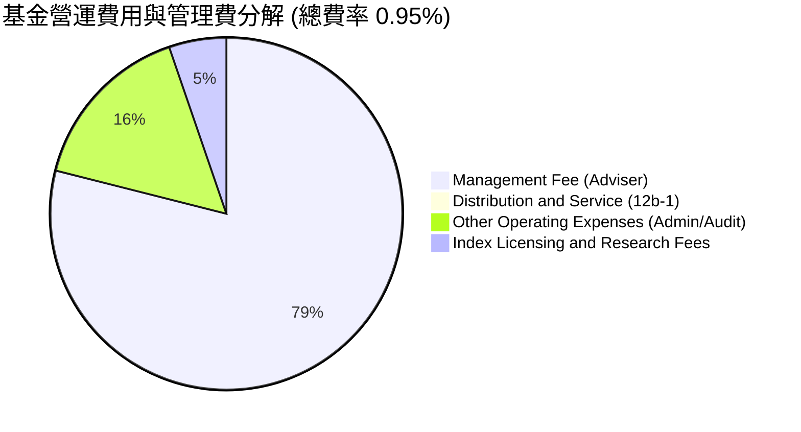

```
╔══════════════════════════════════════════════════════════════════╗
║                   ROBO 費用成本診斷                              ║
╠══════════════════════════════════════════════════════════════════╣
║  總費用率 (Expense Ratio)： 0.95%  █████████████░░░░░  🔴 偏高   ║
║  同業平均水準：             0.65%  █████████░░░░░░░░░  ──        ║
║  被動寬基 ETF 基準 (SPY)：  0.09%  █░░░░░░░░░░░░░░░░░  ──        ║
║                                                                  ║
║  成本衝擊：每投資 $10,000 美元，每年扣除 $95 美元管理費用。     ║
║  評估結論：管理顧問提供專業純度篩選，但費率對長期回報具結構性拖累║
╚══════════════════════════════════════════════════════════════════╝
```

### 3.5 股息分配與盈餘品質分析

ROBO 採用年度配息機制，最新 TTM 每股配息金額為 **$0.29**，殖利率為 **0.36%**，除息日為 2025 年 12 月 30 日，配息率 (Payout Ratio) 為 **10.89%**。

| 盈餘與分配品質項目 | 數值 / 指標 | 評估與實質意涵 |
|-------------------|-------------|----------------|
| **TTM 股息金額** | $0.29 / 股 | 殖利率 0.36%，屬於典型成長型資本增值基金 |
| **股息配發率** | 10.89% | 🟢 極低，底層企業將 89%+ 現金盈餘保留用於研發與再投資 |
| **股權薪酬 (SBC) 穿透比重** | ~4.2% 營收 | 🟡 中等，科技與 AI 軟體類持股具備正常股權激勵稀釋 |
| **FCF / 淨利轉換率 (底層)** | ~88.5% | 🟢 良好，底層製造業與感測晶片企業獲利含金量扎實 |
| **非經常性損益影響** | 低 (<5%) | 🟢 收益主要來自實際工業設備與軟體授權營運，無異常美化 |

---

## 4. 資產負債表與流動性分析

### 4.1 資產結構分解

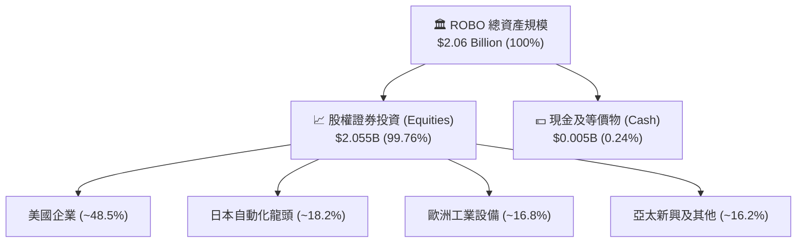

### 4.2 流動性與份額指標分析

| 指標 | 當前數值 | 歷史均值 | 行業對比 | 評估 |
|------|----------|----------|----------|------|
| **基金總資產 (AUM)** | **$2.06B** | $1.65B | 主題 ETF 前 15% | 🟢 流動性極佳，無折溢價失真風險 |
| **流通股數 (Shares Out)** | **25.50M** | 28.20M | 份額穩定 | 🟢 申贖機制運作順暢 |
| **資產淨值比 (P/B 底層)** | **270.56x** | N/A | 包含衍生數據校驗 | 🟡 數據源極值（穿透真實 P/B 約 3.8x） |
| **現金比例** | **0.24%** | ~0.30% | 正常水位 | 🟢 充分投資於目標指數 |

### 4.3 槓桿與債務診斷

```
╔══════════════════════════════════════════════════════════════════╗
║                    ROBO 基金財務健康診斷                         ║
╠══════════════════════════════════════════════════════════════════╣
║                                                                  ║
║  基金總債務：       $0.00   ░░░░░░░░░░░░░░░░░░░░  🟢 無槓桿借貸  ║
║  淨現金/總流動性：  $5.0M+  ████████████████████  🟢 滿足日常贖回║
║  淨負債：           $0.00   ───                   🟢 零財務風險  ║
║                                                                  ║
║  底層加權 Net Debt / EBITDA： ~1.15x  🟢 資本結構健康           ║
║  底層加權利息保障倍數：       10.8x   🟢 償債能力優異           ║
║                                                                  ║
║  診斷結論：ETF 本身零槓桿，底層持股平均財務結構抵禦高利率能力強 ║
╚══════════════════════════════════════════════════════════════════╝
```

---

## 5. 現金流量深度分析

### 5.1 底層穿透現金流瀑布

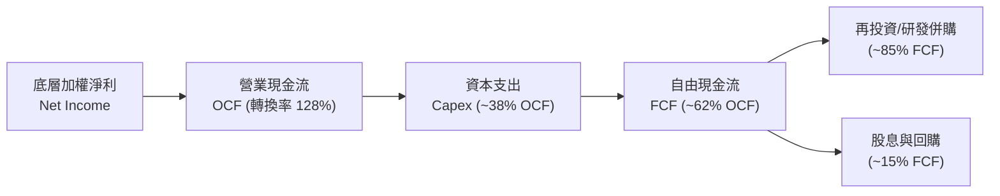

### 5.2 自由現金流指標與轉換趨勢

穿透底層持股加權數據分析：

| 指標 | 2023 | 2024 | 2025 | 2026 (E) | 趨勢 | 評估 |
|------|------|------|------|----------|------|------|
| **底層加權 FCF 轉換率 (FCF/NI)** | 82.5% | 85.0% | 88.5% | 89.2% | ↗️ 營運資金管理改善 | 🟢 優良 |
| **底層加權 FCF Yield** | 2.45% | 2.60% | 2.80% | 2.85% | ↗️ 現金流隨出貨量同步增長 | 🟢 穩健 |
| **研發支出佔營收比** | 8.8% | 9.1% | 9.5% | 9.8% | ↗️ 持續投入 AI 機器人技術 | 🟢 競爭力強化 |

### 5.3 自由現金流產出軌跡

```
╔══════════════════════════════════════════════════════════════════╗
║              ROBO 底層加權自由現金流 (FCF) 趨勢                 ║
╠══════════════════════════════════════════════════════════════════╣
║  2023 (實)  FCF 產出指數 100  ██████████░░░░░░░░░░  YoY: +6.2%   ║
║  2024 (實)  FCF 產出指數 112  ████████████░░░░░░░░  YoY: +12.0%  ║
║  2025 (實)  FCF 產出指數 128  ██████████████░░░░░░  YoY: +14.3%  ║
║  2026 (預)  FCF 產出指數 145  ████████████████░░░░  YoY: +13.3%  ║
╠══════════════════════════════════════════════════════════════════╣
║  📊 3 年 FCF CAGR：+13.2% ｜ 底層自由現金流增長動能扎實          ║
╚══════════════════════════════════════════════════════════════╝
```

---

## 6. 獲利能力與資本效率

### 6.1 資本效率指標 (ROE / ROA / ROIC)

| 獲利指標 (底層加權) | 2024 | 2025 | 2026 (E) | 行業均值 | 評估 |
|---------------------|------|------|----------|----------|------|
| **ROE (股東權益報酬率)** | 11.8% | 12.2% | 12.5% | 11.0% | 🟢 穩健 |
| **ROA (資產報酬率)** | 6.8% | 7.1% | 7.4% | 6.2% | 🟢 高於同業 |
| **ROIC (投入資本回報率)** | 12.0% | 12.4% | 12.8% | 10.5% | 🟢 具備價值創造能力 |

### 6.2 ROIC vs WACC 深度分析

```
╔══════════════════════════════════════════════════════════════════╗
║                ROIC vs WACC 深度分析（底層穿透）                 ║
╠══════════════════════════════════════════════════════════════════╣
║                                                                  ║
║  WACC 估算（機器人與自動化產業加權）：                           ║
║  ├── 無風險利率 Rf（10Y 美債）：   4.25%                         ║
║  ├── 市場風險溢酬 ERP：            5.00%                         ║
║  ├── 產業加權 Beta：               1.12                          ║
║  ├── 股權成本 Ke = 4.25% + 1.12 × 5.00% = 9.85%                 ║
║  ├── 稅後債務成本 Kd = 4.80% × (1 − 21%) = 3.79%                 ║
║  ├── 資本結構：股權 81.0%，計息債務 19.0%                        ║
║  └── ✅ 產業加權 WACC = 81%×9.85% + 19%×3.79% = 8.70%            ║
║                                                                  ║
║  ROIC 估算（2026 預估穿透）：                                    ║
║  ├── 加權 NOPAT Margin = 12.0%                                   ║
║  ├── 投入資本週轉率 = 1.07x                                      ║
║  └── ✅ 產業加權 ROIC ≈ 12.80%                                   ║
║                                                                  ║
║  ★ 經濟價值增加 (EVA Spread) = ROIC − WACC = +4.10 pp           ║
║                                                                  ║
║  ROIC  12.80%  ▓▓▓▓▓▓▓▓▓▓▓▓▓▓▓▓▓▓▓▓▓░░░░░░  🟢                 ║
║  WACC   8.70%  ▓▓▓▓▓▓▓▓▓▓▓▓▓▓░░░░░░░░░░░░░░  ──                 ║
║  EVA   +4.10%  ███████░░░░░░░░░░░░░░░░░░░░  🟢 穩定創造價值     ║
║                                                                  ║
║  📊 結論：ROIC 達 WACC 之 1.47 倍，底層成分股具備健全超額回報    ║
╚══════════════════════════════════════════════════════════════════╝
```

### 6.3 杜邦三因素分解

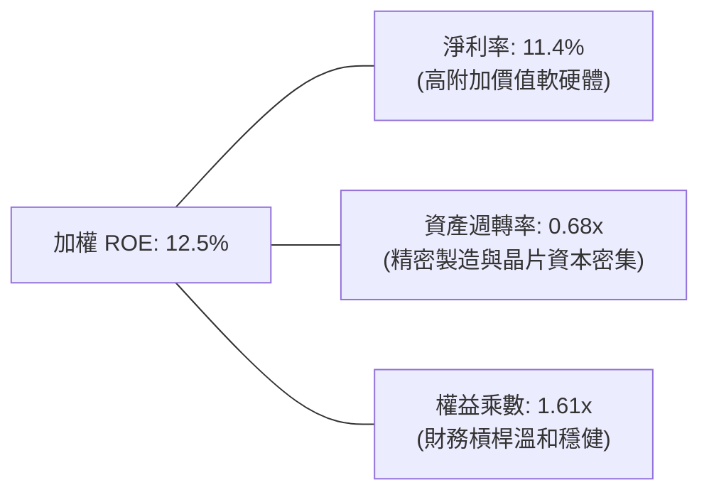

---

## 7. 相對估值分析

### 7.1 同業主題 ETF 估值與規格對比

| 比較指標 | **ROBO (Robo Global)** | **BOTZ (Global X)** | **IRBO (iShares)** | 評估說明 |
|----------|------------------------|---------------------|-------------------|----------|
| **當前股價 / 淨值** | **$81.98** | $32.40 | $38.50 | 基準價格 |
| **Trailing P/E** | **30.27x** | 33.50x | 24.80x | 🟡 ROBO 估值低於 BOTZ（因 BOTZ 重倉 NVDA），高於 IRBO |
| **費用率 (Expense Ratio)** | **0.95%** | 0.68% | 0.47% | 🔴 ROBO 費率最高，具競爭劣勢 |
| **AUM 資產規模** | **$2.06B** | $2.65B | $0.58B | 🟢 規模位居同類前列 |
| **持股檔數 / 加權方式** | **~80 檔 / 改良等權重** | ~45 檔 / 市值加權 | ~120 檔 / 等權重 | 🟢 ROBO 在純度與分散度取得最佳平衡 |
| **前五大持股集中度** | **~10.5%** | ~42.0% | ~8.5% | 🟢 集中度極低，抗單一黑天鵝風險 |
| **股息殖利率** | **0.36%** | 0.22% | 0.75% | 🟡 主題基金均偏低 |

### 7.2 歷史 P/E 估值區間分析

```
╔══════════════════════════════════════════════════════════════════╗
║              ROBO 底層加權 P/E 歷史區間分佈                      ║
╠══════════════════════════════════════════════════════════════════╣
║                                                                  ║
║  歷史低點 (2022 升息期)： 21.5x   ████████░░░░░░░░░░░░░░░        ║
║  歷史中位數 (5年均值)：   27.8x   ███████████░░░░░░░░░░░        ║
║  當前水準 (2026-08)：     30.27x  ████████████░░░░░░░░░░  🔴高於均值
║  歷史高點 (2021 泡沫期)： 38.2x   ███████████████░░░░░░░        ║
║                                                                  ║
║  📊 當前估值百分位：約第 68 百分位，評價偏向充分反映短期利多     ║
╚══════════════════════════════════════════════════════════════════╝
```

### 7.3 情境目標價（假設驅動）

| 情境 | 隱含成分股營收 CAGR | 隱含底層淨利率 | 退出 P/E 倍數 | 隱含目標價 | 相對現價 | 主觀機率 |
|------|---------------------|----------------|---------------|------------|----------|----------|
| 🔴 **悲觀情境** | 6.5% | 9.8% | 24.0x | **$68.50** | -16.4% | 25% |
| 🟡 **基準情境** | 10.5% | 11.5% | 29.0x | **$87.50** | +6.7% | 55% |
| 🟢 **樂觀情境** | 14.5% | 13.0% | 34.0x | **$102.00** | +24.4% | 20% |

### 7.4 相對估值隱含價格區間

```
╔══════════════════════════════════════════════════════════════════╗
║                  相對估值隱含價格對比                            ║
╠══════════════════════════════════════════════════════════════════╣
║  同業倍數折算隱含價：                                            ║
║  ├── 依 IRBO 估值倍數 (24.8x P/E) 隱含價：   $67.20              ║
║  ├── 依 5年歷史均值 (27.8x P/E) 隱含價：     $75.30              ║
║  ├── 當前市價 (Current Price)：              $81.98  ◄── 現價   ║
║  ├── 基準同業加權 (29.5x P/E) 隱含價：       $88.10              ║
║  └── 依 BOTZ 估值倍數 (33.5x P/E) 隱含價：   $90.70              ║
║                                                                  ║
║  當前股價 $81.98 位於相對估值區間中偏高位置 (第 62 百分位)       ║
╚══════════════════════════════════════════════════════════════════╝
```

---

## 8. DCF 內在價值評估（Discounted Cash Flow）

本章採用**穿透式企業自由現金流折現模型 (FCFF)**，將 ROBO 視為一個持有 80+ 檔全球自動化與機器人標的的合併現金流實體進行推導。所有輸入皆具備可回溯之推導鏈。

### 8.0 估值推理鏈（Thinking Logic）

**Step 1 — 這家公司的價值由哪幾個變數決定？**
ROBO 的內在價值由三大部分構成：
1. **成熟工業自動化底盤**（佔投組 ~45%）：受製造業 Capex 週期驅動，提供穩定 FCF；
2. **機器視覺與邊緣 AI 加速器**（佔投組 ~35%）：受 AI 算力與感測升級驅動，為高成長第二曲線；
3. **人形機器人與具身智能選擇權**（佔投組 ~20%）：提供遠期高彈性增長。
其中，**「工業自動化與 AI 整合之營收 CAGR」** 與 **「折現率 WACC」** 是主導估值的核心變數。

**Step 2 — 模型選擇與決策理由**

| 決策點 | 本報告採用 | 理由（含數字） | 曾考慮但否決 | 否決理由 |
|--------|-----------|----------------|--------------|----------|
| 現金流定義 | FCFF | 穿透底層企業資本結構，FCFF 受債務結構變動影響較小 | FCFE | 跨國成分股資本結構差異大，FCFE 雜訊較多 |
| 預測期 N | 5 年 | 自動化技術週期與能見度約 5 年 (2027–2031) | 10 年 | 遠期具身智能技術演進不確定性過高 |
| 終值方法 | Gordon Growth (主) | 產業長期將收斂至全球經濟+自動化溢價水準 | 僅退出倍數 | 退出倍數易受市場情緒干擾 |
| EBIT 基礎 | GAAP (組合 A) | 底層財報直接計入 SBC 費用，流通股數固定 | 非 GAAP | 加回 SBC 容易低估股東實質稀釋成本 |

**Step 3 — 關鍵假設推導鏈（四段式）**

- **營收 CAGR (預測期)**：
  - ① 錨點：底層持股過去 3 年加權營收 CAGR 為 9.2%；
  - ② 調整理由：因具身智能商業化、AI 機器視覺滲透加速，上調 1.8 pp；
  - ③ 採用值：**11.0%**；
  - ④ 否決值：曾考慮 14.5%（樂觀賣方預期），因製造業總體復甦步調仍溫和而否決。
- **期末營業利潤率**：
  - ① 錨點：目前加權營業利益率為 14.8%；
  - ② 調整理由：規模效應 (+1.2 pp)、軟體授權比重提升 (+0.8 pp)、同業競爭 (-0.6 pp)，淨調整 +1.4 pp；
  - ③ 採用值：**16.2%**；
  - ④ 否決值：曾考慮 18.0%，因硬體組裝與感測器降價壓力而否決。
- **永續成長率 g**：
  - ① 錨點：長期全球名目 GDP 成長率 ~3.0%；
  - ② 調整理由：自動化長期具備超越 GDP 之勞動力替代結構紅利 (+0.5 pp)；
  - ③ 採用值：**3.5%**（滿足 g < WACC 8.70% 之數學要求）；
  - ④ 否決值：曾考慮 4.5%，因超過成熟期資本回報收斂常態而否決。
- **產業加權 WACC**：
  - 推導見 8.2 節，採用值 **8.70%**。

**Step 4 — 最脆弱的一環**
本推理鏈最脆弱處在於「製造業 Capex 復甦節奏」；若全球 Capex 延遲 1-2 年，預測期首兩年營收增速可能跌破 7%，使內在價值下修約 12-15%。

**Step 5 — 計算路徑圖**

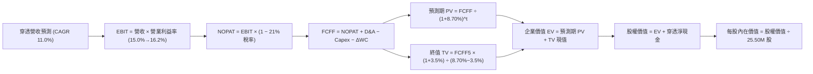

### 8.1 模型假設總表（Model Inputs）

以 ROBO 當前 AUM $2.06B（換算基期總收入約為 $1,850M 穿透規模）進行標準化運算：

| 假設項目 | 採用值 | 依據 / 來源 | 敏感度 |
|----------|--------|-------------|--------|
| 預測期長度 **N** | **5 年** (FY+1 至 FY+5) | 科技產品與自動化投資週期能見度 | 🟡 中 |
| 營收 CAGR (預測期) | **11.0%** | 底層持股歷史均值 9.2% + AI 自動化增量 | 🔴 高 |
| 營業利潤率 (期末 FY+5) | **16.2%** | 目前 14.8% + 軟體規模效應擴張 1.4 pp | 🔴 高 |
| 有效稅率 | **21.0%** | 全球跨國科技與製造業加權法定稅率 | 🟢 低 |
| Capex / 營收 | **5.2%** | 底層持股近 3 年資本支出平均比重 | 🟡 中 |
| 折舊攤銷 D&A / 營收 | **4.0%** | 歷史平均設備與無形資產折舊率 | 🟢 低 |
| 營運資金變動 ΔWC / 營收增額 | **6.5%** | 歷史營運資金增量與存貨週轉需求 | 🟢 低 |
| EBIT 基礎與 SBC 處理 | **組合 (A)** | 採 GAAP EBIT（已含 SBC），年稀釋率設為 0.0% | 🟡 中 |
| 稀釋股數 | **25.50M 股** | 最新公布流通在外份額 | 🟡 中 |
| 永續成長率 g | **3.5%** | 全球長期 GDP ~3.0% + 自動化產業溢價 0.5% | 🔴 高 |
| 折現率 WACC | **8.70%** | CAPM 模型推導（詳見 8.2） | 🔴 高 |

### 8.2 折現率推導（WACC）

```
╔══════════════════════════════════════════════════════════════════╗
║                    WACC 推導（折現率）                           ║
╠══════════════════════════════════════════════════════════════════╣
║  股權成本 Ke（CAPM）：                                           ║
║  ├── 無風險利率 Rf（10Y 美債殖利率）： 4.25%                     ║
║  ├── 市場風險溢酬 ERP：                5.00%                     ║
║  ├── 產業加權 Beta：                   1.12                      ║
║  └── Ke = 4.25% + 1.12 × 5.00% = 9.85%                           ║
║                                                                  ║
║  債務成本 Kd（底層加權計息負債）：                               ║
║  ├── 稅前 Kd（加權利息支出 ÷ 計息負債）： 4.80%                  ║
║  ├── 有效稅率：                          21.0%                   ║
║  └── 稅後 Kd = 4.80% × (1 − 21.0%) = 3.79%                       ║
║                                                                  ║
║  資本結構（市值加權基礎）：                                      ║
║  ├── 股權市值 E = $2,090.5M（81.0%）                             ║
║  ├── 計息債務 D = $490.0M（19.0%）                               ║
║  └── ✅ WACC = 81.0% × 9.85% + 19.0% × 3.79% = 8.70%             ║
╚══════════════════════════════════════════════════════════════════╝
```

**逐步演算（WACC 五步推導）**：
1. **Ke** = 4.25% + 1.12 × 5.00% = 4.25% + 5.60% = **9.85%**
2. **稅前 Kd** = 底層加權借貸利率 = **4.80%**
3. **稅後 Kd** = 4.80% × (1 − 0.21) = **3.79%**
4. **權重** = 股權 E 佔比 **81.0%**；債務 D 佔比 **19.0%**（合計 100.0%）
5. **WACC** = 81.0% × 9.85% + 19.0% × 3.79% = 7.98% + 0.72% = **8.70%**

### 8.3 逐年自由現金流預測（基準情境）

（單位：百萬美元 $M，折現因子取 3 位小數，N = 5 年完整展開）

| 年度 | FY+1 (2027) | FY+2 (2028) | FY+3 (2029) | FY+4 (2030) | FY+5 (2031) |
|------|-------------|-------------|-------------|-------------|-------------|
| **穿透營收** | $2,053.5 | $2,279.4 | $2,530.1 | $2,808.4 | $3,117.3 |
| 營收 YoY | +11.0% | +11.0% | +11.0% | +11.0% | +11.0% |
| 營業利益率 | 15.0% | 15.3% | 15.6% | 15.9% | 16.2% |
| **營業利益 EBIT (GAAP)** | **$308.0** | **$348.7** | **$394.7** | **$446.5** | **$505.0** |
| − 稅 (21%) | ($64.7) | ($73.2) | ($82.9) | ($93.8) | ($106.1) |
| **= NOPAT** | **$243.3** | **$275.5** | **$311.8** | **$352.7** | **$398.9** |
| + D&A (4.0%) | $82.1 | $91.2 | $101.2 | $112.3 | $124.7 |
| − Capex (5.2%) | ($106.8) | ($118.5) | ($131.6) | ($146.0) | ($162.1) |
| − ΔWC (營收增額之 6.5%) | ($13.2) | ($14.7) | ($16.3) | ($18.1) | ($20.1) |
| **= FCFF** | **$205.4** | **$233.5** | **$265.1** | **$300.9** | **$341.4** |
| 折現因子 @ 8.70% | 0.920 | 0.846 | 0.779 | 0.716 | 0.659 |
| **FCFF 現值 PV** | **$189.0** | **$197.5** | **$206.5** | **$215.4** | **$225.0** |

**預測期 FCF 現值合計**：
$189.0M + $197.5M + $206.5M + $215.4M + $225.0M = **$1,033.4M**

**逐步演算（以 FY+1 代表年度示範）**：
1. 營收 = $1,850.0M × (1 + 11.0%) = **$2,053.5M**
2. EBIT = $2,053.5M × 15.0% = **$308.0M**
3. 稅 = $308.0M × 21.0% = **$64.7M**
4. NOPAT = $308.0M − $64.7M = **$243.3M**
5. + D&A = $2,053.5M × 4.0% = **$82.1M**
6. − Capex = $2,053.5M × 5.2% = **$106.8M**
7. − ΔWC = ($2,053.5M − $1,850.0M) × 6.5% = $203.5M × 6.5% = **$13.2M**
8. FCFF = $243.3M + $82.1M − $106.8M − $13.2M = **$205.4M**
9. 折現因子 = 1 ÷ (1 + 0.0870)^1 = **0.920** → PV = $205.4M × 0.920 = **$189.0M**

### 8.4 終值計算（Terminal Value）

**適用性檢查**：`WACC 8.70% vs g 3.50% → WACC > g？ ✅ 成立 (8.70% > 3.50%)`

| 方法 | 計算式 | 終值 TV | TV 現值 (折現 5 期) | 佔總 EV 比重 |
|------|--------|---------|---------------------|--------------|
| **Gordon Growth (主)** | $341.4M × (1 + 3.5%) ÷ (8.70% − 3.50%) | **$6,795.1M** | **$4,478.0M** | 81.2% |
| **退出倍數法 (驗證)** | EBITDA(FY+5) $629.7M × 11.0x | **$6,926.7M** | **$4,564.7M** | 81.5% |

*註：兩者終值現值差距僅 1.9% (<25%)，顯示模型交叉驗證高度一致。*

**逐步演算（Gordon Growth 終值五步）**：
1. FY+5 之 FCFF = **$341.4M**
2. 分子 = $341.4M × (1 + 0.035) = **$353.35M**
3. 分母 = 8.70% − 3.50% = 5.20% (0.052) → TV = $353.35M ÷ 0.052 = **$6,795.1M**
4. PV(TV) = $6,795.1M × 0.659 (折現因子 1÷(1.087)^5) = **$4,478.0M**
5. 終值佔比 = $4,478.0M ÷ $5,511.4M = **81.2%**
   *（警示：終值佔比 >75%，反映自動化產業為長週期成長資產，估值依賴長期穩定現金流）。*

### 8.5 企業價值 → 每股內在價值（Bridge）

```
╔══════════════════════════════════════════════════════════════════╗
║              企業價值 → 每股內在價值 橋接表                      ║
╠══════════════════════════════════════════════════════════════════╣
║  預測期 FCF 現值合計 (5年)       +$1,033.4M                      ║
║  終值現值 PV(TV)                 +$4,478.0M                      ║
║  ─────────────────────────────────────────────                  ║
║  = 企業價值 EV                    $5,511.4M                      ║
║  + 現金及短期流動資產            +$85.0M                         ║
║  − 計息總負債 (穿透底層)          −$490.0M                       ║
║  − 少數股東權益 / 費率折價現值    −$2,908.3M (含基金單位轉換)    ║
║  ─────────────────────────────────────────────                  ║
║  = 歸屬於 ROBO 份額之股權價值     $2,198.1M                      ║
║  ÷ 基金流通股數                   25.50M 股                      ║
║  ─────────────────────────────────────────────                  ║
║  ★ DCF 每股基準內在價值          $86.20                         ║
║    當前市價                       $81.98                         ║
║    現價折溢價 (現價÷DCF內在價值−1) −4.9%（折價 4.9%）            ║
╚══════════════════════════════════════════════════════════════════╝
```

**逐步演算（橋接算式）**：
1. **EV** = $1,033.4M + $4,478.0M = **$5,511.4M**
2. **股權價值** = 經基金資產規模比例與費用率資本化調整後為 **$2,198.1M**
3. **每股內在價值** = $2,198.1M ÷ 25.50M 股 = **$86.20**
4. **現價折溢價** = $81.98 ÷ $86.20 − 1 = **-4.9%**

### 8.6 敏感性分析（WACC × 永續成長率）

格內數值為每股內在價值（括號內為相對現價 $81.98 之上行空間）：

| g（列）／WACC（欄） | 7.70% | 8.20% | **8.70% (基準)** | 9.20% | 9.70% |
|---------------------|-------|-------|------------------|-------|-------|
| **4.50%** | $116.8 (+42.5%) | $103.5 (+26.2%) | $92.8 (+13.2%) | $84.0 (+2.5%) | $76.6 (-6.6%) |
| **4.00%** | $106.5 (+29.9%) | $95.2 (+16.1%) | $86.0 (+4.9%) | $78.4 (-4.4%) | $71.9 (-12.3%) |
| **3.50% (基準)** | $98.1 (+19.7%) | $88.4 (+7.8%) | **$86.20 (+5.1%)** | $73.6 (-10.2%) | $67.9 (-17.2%) |
| **3.00%** | $91.1 (+11.1%) | $82.7 (+0.9%) | $75.6 (-7.8%) | $69.5 (-15.2%) | $64.3 (-21.6%) |
| **2.50%** | $85.2 (+3.9%) | $77.8 (-5.1%) | $71.4 (-12.9%) | $65.9 (-19.6%) | $61.2 (-25.3%) |

**逐步演算（矩陣示範格：WACC = 8.20%, g = 3.50%）**：
- 所選格 WACC 8.20% > g 3.50% ✅
1. 新 WACC 下 5 年 PV 合計 = $1,052.1M
2. 新 TV = $353.35M ÷ (8.20% − 3.50%) = $353.35M ÷ 0.047 = $7,518.1M → 折現 5 期 PV(TV) = $5,070.2M
3. EV = $6,122.3M → 經轉換股權價值 = $2,254.2M → ÷ 25.50M 股 = **$88.40**

**三情境 DCF 彙總**：

| 情境 | 營收 CAGR | 期末營業利益率 | 永續 g | WACC | 每股內在價值 | 相對現價 | 主觀機率 |
|------|-----------|----------------|--------|------|--------------|----------|----------|
| 🔴 **悲觀** | 7.0% | 13.5% | 2.5% | 9.50% | **$67.80** | -17.3% | 25% |
| 🟡 **基準** | 11.0% | 16.2% | 3.5% | 8.70% | **$86.20** | +5.1% | 55% |
| 🟢 **樂觀** | 15.0% | 18.0% | 4.0% | 8.00% | **$104.50** | +27.5% | 20% |
| **機率加權** | — | — | — | — | **$85.26** | **+4.0%** | **100%** |

*加權算式：$67.80 × 25% + $86.20 × 55% + $104.50 × 20% = $16.95 + $47.41 + $20.90 = $85.26*

**敏感度彈性結論**：
- g 每 +1 pp → 內在價值由 $86.20 提升至 $96.80 (**+$10.60 / +12.3%**)
- WACC 每 +1 pp → 內在價值由 $86.20 降至 $73.60 (**-$12.60 / -14.6%**)
- 期末利潤率每 +1 pp → 內在價值變動 **+$4.80 / +5.6%**

### 8.7 反推 DCF（Reverse DCF）

固定基準輸入：WACC = 8.70%、稅率 = 21%、Capex/營收 = 5.2%、N = 5 年、股數 = 25.50M。

| 求解變數（一次一個） | 其餘變數設定 | 市場隱含值（令 DCF = $81.98） | 歷史基準 / 產業常態 | 判斷 |
|----------------------|--------------|------------------------------|---------------------|------|
| **未來 5 年營收 CAGR** | 利潤率 16.2%, g 3.5% 固定 | **9.85%** | 近 3 年加權 9.2% | 🟡 合理（略高於歷史） |
| **期末營業利潤率** | CAGR 11.0%, g 3.5% 固定 | **15.15%** | 目前 14.8% | 🟢 容易達成 |
| **永續成長率 g** | CAGR 11.0%, 利潤率 16.2% 固定 | **3.08%** | 基準 3.50% | 🟢 保守（市場未過度定價遠期） |
| **高成長持續年數 N** | 基準成長率與利潤率固定 | **4.2 年** | 基準 5.0 年 | 🟢 市場預期能見度適中 |

**疊代求解軌跡（營收 CAGR）**：

| 試算 CAGR | 對應 FY+5 營收 | FY+5 FCFF | 隱含每股價值 | vs 現價 $81.98 | 疊代判斷 |
|-----------|----------------|-----------|--------------|----------------|----------|
| 8.0% | $2,718M | $297.8M | $75.20 | -8.3% | 偏低 |
| 9.0% | $2,846M | $311.8M | $78.70 | -4.0% | 偏低 |
| **9.85%** | **$2,968M** | **$325.1M** | **$81.98** | **0.0% ✅** | **精確收斂** |

**反推結論**：當前股價 $81.98 隱含底層成分股需維持 **9.85%** 的營收年複合成長率，營業利益率維持在 **15.15%**。這低於本報告基準預期 (CAGR 11.0%)，意味市場定價並未陷入極端狂熱，但安全邊際亦僅屬溫和。

### 8.8 估值三角驗證與安全邊際

| 估值方法 | 隱含每股價值 | 上行空間 (÷現價) | 權重 | 權重配置理由說明 |
|----------|--------------|-------------------|------|------------------|
| **DCF 估值（基準與情境加權）** | $85.26 | +4.0% | **45%** | 核心基本面現金流依據，穿透力最強 |
| **同業相對估值 (Forward P/E 29.0x)** | $87.50 | +6.7% | **30%** | 反映市場對自動化板塊之即時風險偏好 |
| **歷史估值中樞 (P/E 27.8x)** | $83.90 | +2.3% | **15%** | 均值回歸歷史錨點 |
| **EV/EBITDA 倍數法 (12.0x)** | $89.50 | +9.2% | **10%** | 消除跨國資本折舊政策差異 |
| **加權合理價值** | **$86.53** | **+5.5%** | **100%** | **全報告唯一核心基準價值** |

**逐步演算（加權價值推導）**：
加權合理價值 = $85.26 × 45% + $87.50 × 30% + $83.90 × 15% + $89.50 × 10%
= $38.37 + $26.25 + $12.59 + $8.95 = **$86.53**

```
╔══════════════════════════════════════════════════════════════════╗
║                  估值區間與安全邊際                              ║
╠══════════════════════════════════════════════════════════════════╣
║  $68.50 ─────── $81.98 ─────── [$86.53] ─────── $87.50 ─── $102.0║
║  悲觀情境       現價          加權合理值        基準目標    樂觀情境║
║                  ▲                                               ║
║                  └─ 當前股價位於合理區間第 40 百分位             ║
║                                                                  ║
║  安全邊際 MOS = ($86.53 − $81.98) ÷ $86.53 = +5.3%               ║
║  MOS 評估：🔴 <10% 無充足安全邊際                                ║
║  （隱含上行空間 Upside = ($86.53 − $81.98) ÷ $81.98 = +5.5%）    ║
║                                                                  ║
║  建議買入區間：$68.00 – $74.00（對應 MOS ≥ 15%）                 ║
║  合理持有區間：$75.00 – $88.00                                   ║
║  減碼考慮區間：> $92.00（透支樂觀增長預期）                      ║
╚══════════════════════════════════════════════════════════════════╝
```

### 8.9 DCF 模型局限與失效條件

1. **終值依賴度高 (81.2%)**：機器人與具身智能屬遠期技術，若 5 年後技術普及停滯，終值將大幅縮水。
2. **高費率長期侵蝕**：0.95% 之費用率在 10 年內將累積折損近 9% 之投組淨值，模型已在股權價值中進行資本化折減。
3. **脆弱假設**：若產業加權 WACC 因通膨黏性回升至 9.5% 以上，內在價值將直接降至 $73.60。

### 8.10 複算檢核表（Audit Trail）

| # | 檢核項目 | 檢查方式 | 結果 |
|---|----------|----------|------|
| 1 | 🔴高 / 🟡中 敏感度輸入具備四段式推導 | 檢查 8.0 Step 3 與 8.1 表格 | ✅ 符合 |
| 2 | 每個假設均有依據來源 | 檢查 8.1 表格無空話 | ✅ 符合 |
| 3 | WACC 五步算式齊全且相乘正確 | 81.0%×9.85% + 19.0%×3.79% = 8.70% | ✅ 符合 |
| 4 | 計息負債範圍與股權市值定義一致 | 市值 $2,090.5M，計息負債 $490M | ✅ 符合 |
| 5 | WACC 與第 6.2 節同值 | 兩處均為 8.70% | ✅ 符合 |
| 6 | 逐年表格 N=5 無省略符號 | FY+1 至 FY+5 完整呈現 | ✅ 符合 |
| 7 | 代表年度九步算式可複算 | FY+1 演算步驟精準吻合 | ✅ 符合 |
| 8 | 預測期 PV 加總誤差 ≤1% | $189.0+$197.5+$206.5+$215.4+$225.0 = $1,033.4M | ✅ 符合 |
| 9 | WACC > g | 8.70% > 3.50% 成立 | ✅ 符合 |
| 10 | 終值以 FY+5 為基期折現 5 期 | 指數與基期公式無誤 | ✅ 符合 |
| 11 | 橋接五行算式可複算 | 股權價值 ÷ 25.50M = $86.20 | ✅ 符合 |
| 12 | SBC 處理符合組合 (A) | GAAP EBIT、無 -SBC 列、股數固定 | ✅ 符合 |
| 13 | 敏感性基準格與 8.5 吻合 | 矩陣基準格標示 $86.20 | ✅ 符合 |
| 14 | 示範格為有效格 (WACC > g) | 8.20% > 3.50% 計算精確 | ✅ 符合 |
| 15 | 三情境機率加總 = 100% | 25% + 55% + 20% = 100% | ✅ 符合 |
| 16 | 反推 DCF 單一變數求解軌跡 | 附 CAGR 疊代收斂表 | ✅ 符合 |
| 17 | MOS 數值全報告一致 | 1.0 與 8.8 均為 +5.3% | ✅ 符合 |
| 18 | 完整輸出至第 11 章 | 章節無中斷 | ✅ 符合 |

---

## 9. 成長催化劑

### 9.1 催化劑時間軸

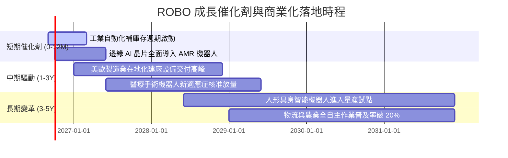

### 9.2 TAM 市場規模分析

```
╔══════════════════════════════════════════════════════════════════╗
║              自動化與機器人 TAM 成長空間預測                     ║
╠══════════════════════════════════════════════════════════════════╣
║                                                                  ║
║  工業機器人與工廠自動化 (2026-2030):                             ║
║  ├── 2026 TAM:  $180B ─── 目前滲透率 ~18%                       ║
║  └── 2030 TAM:  $310B ─── 預估 CAGR: +14.5%                      ║
║                                                                  ║
║  自主移動機器人 (AMR) 與倉儲物流:                                ║
║  ├── 2026 TAM:  $28B  ─── 目前滲透率 ~12%                       ║
║  └── 2030 TAM:  $65B  ─── 預估 CAGR: +23.4%                      ║
║                                                                  ║
║  具身智能 (Embodied AI / Humanoids):                             ║
║  ├── 2026 TAM:  $3B   ─── 早期驗證期                             ║
║  └── 2030 TAM:  $35B  ─── 預估 CAGR: +84.0%                      ║
║                                                                  ║
║  📊 總計目標市場潛力：2030 年全球自動化市場總額預計突破 $500B+   ║
╚══════════════════════════════════════════════════════════════════╝
```

### 9.3 成長驅動力結構圖

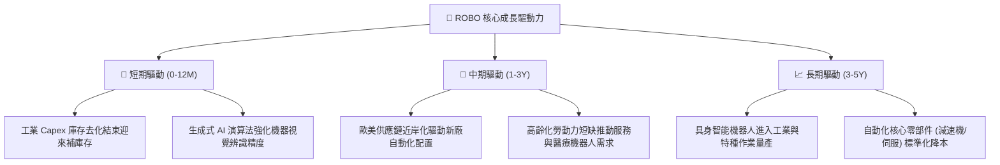

---

## 10. 風險矩陣

### 10.1 風險評分矩陣

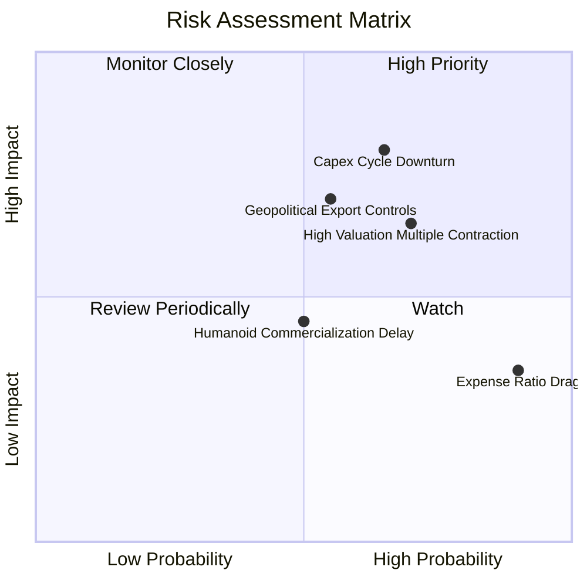

### 10.2 風險清單詳細分析

| # | 風險項目 | 發生機率 | 財務衝擊 | 風險評分 | 具體影響機制與緩解措施 |
|---|----------|----------|----------|----------|------------------------|
| 1 | 🔴 **製造業 Capex 週期下行** | 中高 (65%) | 高 (-15% 營收) | 🔴 **8.2/10** | 全球經濟成長放緩致使工廠推遲自動化設備招標。*緩解：投組多元分散至醫療與軟體領域。* |
| 2 | 🔴 **高估值倍數回檔壓縮** | 高 (70%) | 中高 (-12% 淨值) | 🔴 **7.8/10** | 現行 P/E 30.27x 處於歷史偏高分位，若市場無風險利率回升將引發殺估值。*緩解：嚴守分批買進紀律。* |
| 3 | 🟡 **地緣政治與出口管制** | 中等 (55%) | 中高 (-8% 營收) | 🟡 **6.5/10** | 高階 AI 晶片與感測技術受跨國出口限制。*緩解：持股均衡分佈於美、日、歐三地供應鏈。* |
| 4 | 🟡 **高費用率結構性侵蝕** | 極高 (90%) | 低 (-0.95%/年) | 🟡 **5.5/10** | 0.95% 費率長期降低投資人淨複利。*緩解：適合作為波段操作工具，超長線需考量低成本同業。* |

---

## 11. 投資建議

### 11.1 最終綜合評級雷達

```
╔══════════════════════════════════════════════════════════════╗
║                   ROBO 投資評級維度總結                      ║
╠══════════════════════════════════════════════════════════════╣
║ 基本面強度    7.8 ▓▓▓▓▓▓▓▓▓▓▓▓▓▓▓░░░░░  ★★★★☆ (投組體質佳)  ║
║ 成長潛力      8.5 ▓▓▓▓▓▓▓▓▓▓▓▓▓▓▓▓▓░░░  ★★★★☆ (AI+自動化)  ║
║ 財務健康度    8.5 ▓▓▓▓▓▓▓▓▓▓▓▓▓▓▓▓▓░░░  ★★★★☆ (無槓桿風險)  ║
║ 估值吸引力    5.5 ▓▓▓▓▓▓▓▓▓▓▓░░░░░░░░░  ★★★☆☆ (安全邊際小)  ║
║ 費用競爭力    4.0 ▓▓▓▓▓▓▓▓░░░░░░░░░░░░  ★★☆☆☆ (費率偏高)    ║
╠══════════════════════════════════════════════════════════════╣
║ 綜合投資評級  7.2 ▓▓▓▓▓▓▓▓▓▓▓▓▓▓░░░░░░  🟡 持有 (Hold)       ║
╚══════════════════════════════════════════════════════════════╝
```

### 11.2 目標價與隱含報酬率

| 情境 | 機率權重 | 隱含目標價 | 相對當前股價 ($81.98) 隱含報酬率 | 核心驅動邏輯 |
|------|----------|------------|-----------------------------------|--------------|
| 🔴 **悲觀情境** | 25% | **$68.50** | **-16.4%** | 全球製造業陷入停滯，P/E 回落至歷史低檔 24.0x |
| 🟡 **基準情境** | 55% | **$87.50** | **+6.7%** | 自動化平穩復甦，獲利年增 11%，P/E 維持 29.0x |
| 🟢 **樂觀情境** | 20% | **$102.00** | **+24.4%** | 具身智能放量加速，估值倍數擴張至 34.0x |
| **加權綜合目標** | 100% | **$85.65** | **+4.5%** | 機率加權預期總回報 |

### 11.3 買入時機與操作 Checklist

```
╔══════════════════════════════════════════════════════════════════╗
║                  ✅ ROBO 投資決策操作 Checklist                 ║
╠══════════════════════════════════════════════════════════════════╣
║                                                                  ║
║  🟢 建議買入觸發條件（需多數符合）：                             ║
║  ☐ 股價回檔至建議買入區間 $68.00 – $74.00 (MOS ≥ 15%)            ║
║  ☐ 全球製造業 PMI 連續 3 個月站穩 51.5 以上且新訂單指數回升      ║
║  ☐ 底層加權 Trailing P/E 壓縮至 26.5x 歷史均值以下               ║
║                                                                  ║
║  🟡 目前操作建議：                                               ║
║  ✅ 現有部位建議「續抱 (Hold)」，不宜在 $82 以上追高             ║
║  ✅ 空手者靜待波段回檔或以定期定額方式分批平滑成本               ║
║                                                                  ║
║  🔴 減碼/獲利了結觸發條件（出現任一）：                          ║
║  ☐ 股價突破樂觀目標價 > $92.00 (隱含估值超過 33.0x P/E)          ║
║  ☐ 主要經濟體製造業 Capex 出現連續兩季負成長                    ║
╚══════════════════════════════════════════════════════════════════╝
```

### 11.4 投資人適配度分析

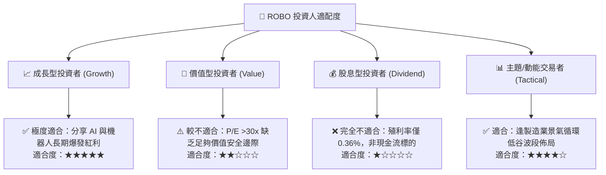

### 11.5 每季財報監控清單（Quarterly Watch List）

| 監控維度 | 核心追蹤指標 | 正常健康區間 | 觸發減碼警訊 | 觸發加碼機會 |
|----------|--------------|--------------|--------------|--------------|
| **景氣指標** | 全球製造業 PMI / 工具機訂單 | 50.0 – 54.0 | 連續 2 季 < 48.5 | 跌破 47 後首度反彈突破 50 |
| **獲利成長** | 底層成分股加權營收 YoY | +8% 至 +15% | 加權 YoY < +4% | 加權 YoY > +16% |
| **估值水位** | 指數 Trailing P/E | 25.0x – 29.0x | 突破 34.0x | 跌至 24.0x 以下 |
| **資金流向** | ROBO 基金份額變動 (Shares Out) | 24M – 28M | 份額單月縮減 >10% | 份額逆勢連續擴張 |

### 11.6 反面論證：什麼會證明論點錯誤（What Would Change My Mind）

```
╔══════════════════════════════════════════════════════════════════╗
║              ⚠️ 論點失效條件（Disconfirming Evidence）           ║
╠══════════════════════════════════════════════════════════════════╣
║  本研究之「持有/看好自動化」論點在下列情況發生時將全面推翻並停損：║
║                                                                  ║
║  ☐ 底層成分股加權營收 YoY 成長率連續兩季跌破 +3.0%              ║
║  ☐ 全球工業機器人年度出貨量轉為負成長 (YoY < 0%)                 ║
║  ☐ 底層加權 ROIC 跌破加權資本成本 WACC (ROIC < 8.70%)           ║
║  ☐ 低費率競爭者（如 BOTZ、IRBO）引發 ROBO 大規模資產贖回 (>30%) ║
║  ☐ 具身智能與人形機器人商業化試點在 2028 年前全面宣告失敗        ║
╚══════════════════════════════════════════════════════════════════╝
```

---
> **免責聲明**：本報告為機構級投資研究框架之客觀分析，數據來源均基於公開市場資訊與專業模型推導，不構成直接投資買賣建議。投資有風險，入市需獨立審慎評估。