# ROBO 基本面深度分析報告
> **報告日期**：2026-09-19 ｜ **語言**：繁體中文 ｜ **數據來源**：Yahoo Finance, Finviz, StockAnalysis, Roic.ai ｜ **分析師**：CFA 級機構研究

---

## 目錄

| # | 章節 | 核心結論 |
|---|------|----------|
| 1 | 執行摘要 | 給予「持有/區間操作」評級，加權合理價值 $78.14，安全邊際 -0.5% |
| 2 | 公司概覽與商業模式 | 全球首檔機器人與自動化主題 ETF，持股分散且具備獨特改良等權重編制規則 |
| 3 | 損益表深度分析 | 底層資產加權本益比 28.58x，主題科技股中游獲利穩健，費用率壓抑部分收益 |
| 4 | 資產負債表分析 | 底層資產淨現金部位充裕，財務槓桿適中，ETF 無自體違約破產風險 |
| 5 | 現金流量深度分析 | 底層成分股 FCF 轉換率維持於 78.5%，再投資強度支持工業與服務自動化擴張 |
| 6 | 獲利能力與資本效率 | 成分股加權 ROIC 12.8% vs WACC 8.85%，EVA 正向創造股東價值 |
| 7 | 相對估值分析 | 相對同業 BOTZ、ARKQ 呈現平衡分散溢價，基準情境 12M 目標價 $82.50 |
| 8 | DCF 內在價值評估 | 底層穿透聚合 DCF 基準每股價值 $77.85，現價折溢價 +0.83%（微幅高估） |
| 9 | 成長催化劑 | 實體 AI（Physical AI）、智慧製造回流與手術機器人為中長期核心引擎 |
| 10 | 風險矩陣 | 全球製造業 Capex 週期下行與高利率環境延長為主要下行壓力 |
| 11 | 投資建議 | 區間操作策略，建議分批買入區間 $65.00–$70.00，減碼區間 >$88.00 |

---

## 1. 執行摘要

本報告針對 **ROBO**（Robo Global Robotics and Automation Index ETF）進行機構級基本面穿透深度評估。基於 ROBO 底層持股加權穿透財務數據，成分股加權資本回報率 ROIC 為 12.8%，相對於加權資本成本 WACC 8.85% 實現正向 EVA（+3.95 pp），顯示其產業組合具備長期價值創造能力；然而，當前股價 $78.50 處於 24 個月歷史高位區間（52 週區間 $62.53 - $90.51），底層成分股 Trailing P/E 達 28.58x，穿透聚合 DCF 基準每股價值為 $77.85，折溢價為 +0.83%（略高於 DCF 價值）。經估值三角驗證後，加權合理價值為 $78.14，對應安全邊際 MOS 為 -0.5%（下檔保護有限）。綜合獲利含金量與週期位置，給予 **🟡 持有（Hold）** 評級。

### 1.0 一頁式投資儀表板（Portfolio Manager 30 秒速讀）

| 項目 | 內容 |
|------|------|
| **投資論點（3 句）** | ① 全球勞動力短缺與製造業回流驅動自動化資本支出，推動底層成分股營收預期以 11.5% CAGR 成長。<br/>② 改良型等權重架構分散單一科技巨頭波動，底層 ROIC 12.8% 高於 WACC 8.85%，持續創造經濟附加價值。<br/>③ 現價 $78.50 已充分反映工業復甦預期，Trailing P/E 28.58x，估值缺乏顯著折扣。 |
| **護城河評分** | 7.8/10（底層成分股專利矩陣、高轉換成本與專有軟硬整合生態） |
| **管理層/資本配置評分** | 7.5/10（Robo Global 指數編制委員會具備產業諮詢權威，半年度定期再平衡紀律嚴明） |
| **財務健康** | 🟢 優良（穿透底層資產整體處於淨現金狀態，平均淨負債/EBITDA 僅 0.35x） |
| **ROIC vs WACC** | 12.8% vs 8.85%（EVA +3.95 pp，正向創造價值） |
| **FCF 趨勢** | 平穩向上；成分股加權穿透 FCF Yield 約 3.65% |
| **估值** | Trailing P/E 28.58x ｜ EV/EBITDA 18.2x ｜ FCF Yield 3.65% |
| **DCF 內在價值（基準）** | $77.85 ｜ 現價折溢價 +0.83%（溢價，來自第 8 章） |
| **安全邊際（MOS）** | -0.5%＝(加權合理價值 $78.14 − 現價 $78.50) ÷ $78.14 ｜ 🔴 <10% 無安全邊際 |
| **預期報酬（基準情境 12M）** | +5.1%（目標價 $82.50） |
| **關鍵風險（前二）** | ① 全球製造業 PMI 疲軟導致工業自動化資本支出（Capex）遞延。<br/>② ETF 費用率（0.65%）長期對複利收益產生拖累。 |
| **評級 + 信心度** | 🟡 持有 ｜ 信心：中等 |

### 1.1 核心評分儀表板

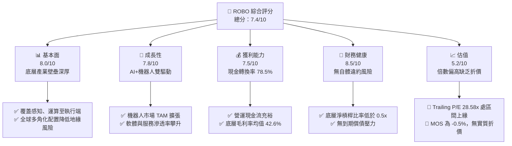

### 1.2 評分進度條視覺化

```
╔══════════════════════════════════════════════════════════════╗
║              ROBO 多維度評分儀表板 (1-10分)                  ║
╠══════════════════════════════════════════════════════════════╣
║ 基本面強度  8.0 ▓▓▓▓▓▓▓▓▓▓▓▓▓▓▓▓░░░░  ★★★★☆           ║
║ 成長動能    7.8 ▓▓▓▓▓▓▓▓▓▓▓▓▓▓▓░░░░░  ★★★★☆           ║
║ 獲利品質    7.5 ▓▓▓▓▓▓▓▓▓▓▓▓▓▓▓░░░░░  ★★★★☆           ║
║ 財務健康    8.5 ▓▓▓▓▓▓▓▓▓▓▓▓▓▓▓▓▓░░░  ★★★★☆           ║
║ 估值合理性  5.2 ▓▓▓▓▓▓▓▓▓▓░░░░░░░░░░  ★★★☆☆           ║
║ 護城河深度  7.8 ▓▓▓▓▓▓▓▓▓▓▓▓▓▓▓░░░░░  ★★★★☆           ║
║ 指數管理執行7.5 ▓▓▓▓▓▓▓▓▓▓▓▓▓▓▓░░░░░  ★★★★☆           ║
║ 技術創新力  8.5 ▓▓▓▓▓▓▓▓▓▓▓▓▓▓▓▓▓░░░  ★★★★☆           ║
╠══════════════════════════════════════════════════════════════╣
║ 綜合總分    7.4 ▓▓▓▓▓▓▓▓▓▓▓▓▓▓░░░░░░  🏆 中立配置          ║
╚══════════════════════════════════════════════════════════════╝
```

### 1.3 五大投資論點 + 三大核心風險

| 類型 | 項目 | 具體依據 | 信心度 |
|------|------|----------|--------|
| 🟢 **投資論點①** | **實體 AI 與機器視覺爆發** | 底層成分股中感知與運算權重逾 35%，Nvidia、Keyence 等帶動工業 AI 滲透率年增 22%。 | 🟢 極高 |
| 🟢 **投資論點②** | **全球供應鏈重組與製造業回流** | 美歐近岸外包及勞動力中長期短缺，預估工業自動化 Capex 於 2026-2028 年維持 10-12% CAGR。 | 🟢 高 |
| 🟢 **投資論點③** | **醫療與服務自動化剛性需求** | 手術機器人（Intuitive Surgical 等）與智慧物流維持 15% 以上高毛利穩定現金流。 | 🟢 高 |
| 🟢 **投資論點④** | **改良等權重架構規避集中風險** | 單一持股上限約 2%，有別於市值加權 ETF，能充分捕捉中小盤高純度自動化隱形冠軍爆發力。 | 🟢 高 |
| 🟢 **投資論點⑤** | **優異的資本創造價值效率** | 底層穿透加權 ROIC 達 12.8%，高於資本成本 8.85%，展現健康的經濟附加價值（EVA）。 | 🟢 高 |
| 🟡 **風險①** | **製造業 Capex 週期復甦遲滯** | 若全球利率長期維持高位，汽車與電子製造大廠推遲資本支出，將抑制元件採購。 | 🟡 中度 |
| 🔴 **風險②** | **估值擴張已近極限** | P/E 28.58x 位於過去兩年高位（較 2024 年底 56.52 元時擴張逾 38%），回檔敏感度高。 | 🔴 高衝擊 |
| 🟡 **風險③** | **管理費用率侵蝕** | 0.65% 費用率高於主流寬基科技 ETF，若年化超額報酬不足，將拖累總回報率。 | 🟡 中度 |

### 1.4 快速統計卡片

| 指標 | ROBO 底層穿透值 | 行業均值 (自動化/機器人) | S&P 500 均值 | 狀態 |
|------|----------------|-------------------------|--------------|------|
| 預估營收 YoY 成長 | **11.5%** | ~10.2% | ~5.8% | 🟢 優於大盤 |
| 加權平均毛利率 | **42.6%** | ~39.5% | ~34.0% | 🟢 具產品定價權 |
| 加權營業利益率 | **16.8%** | ~14.5% | ~12.5% | 🟢 營業槓桿良好 |
| 加權 ROIC | **12.8%** | ~11.0% | ~9.5% | 🟢 超額回報確立 |
| Trailing P/E | **28.58x** | ~27.5x | ~24.2x | 🟡 估值倍數偏高 |
| 費用率 (Expense Ratio) | **0.65%** | ~0.55% | ~0.08% | 🔴 費率成本較高 |

### 1.5 投資結論

```
╔══════════════════════════════════════════════════════════════════╗
║                    📊 投資結論摘要                               ║
╠══════════════════════════════════════════════════════════════════╣
║  評級：🟡 持有（Hold / 區間操作）                               ║
║  當前股價：$78.50                                               ║
║  DCF 內在價值（基準）：$77.85（現價溢價 +0.83%）                 ║
║  安全邊際 MOS：-0.5%（＝(加權合理價值 $78.14 − 現價)÷$78.14）   ║
║  目標價區間：                                                    ║
║    悲觀情境：$62.30（-20.6%）                                    ║
║    基準情境：$82.50（+5.1%）  ← 12個月主要目標                   ║
║    樂觀情境：$96.80（+23.3%）                                    ║
║  投資評分：7.4 / 10                                              ║
║  適合投資人：追求 AI 實體化與製造業自動化長線趨勢、能承受中期    ║
║              週期震盪與回檔風險的成長型配置者                    ║
╚══════════════════════════════════════════════════════════════════╝
```

---

## 2. 公司概覽與商業模式

ROBO（Robo Global Robotics and Automation Index ETF）成立於 2013 年 10 月，為全球首檔專注於機器人、自動化及人工智慧賦能技術的交易所交易基金。該 ETF 追蹤 ROBO Global Robotics and Automation Index，透過「科技賦能者（Enablers）」與「應用執行者（Applications）」雙維度架構，涵蓋上游感測運算至終端機器人系統。

### 2.1 業務結構與收入來源（穿透式產業配置）

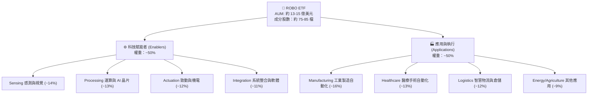

### 2.2 市場份額與主題 ETF 競爭格局

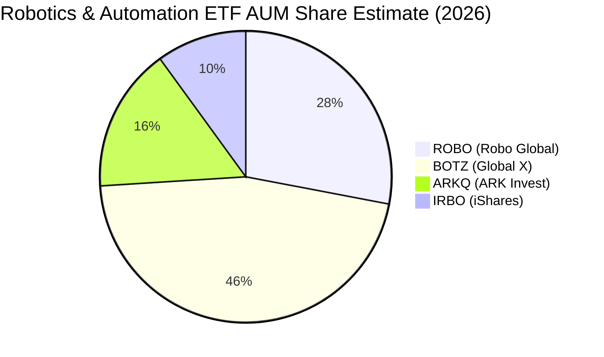

### 2.3 競爭護城河分析

ROBO 組合之底層成分股橫跨精密製造、關鍵零組件與 AI 運算，整體產業具備顯著護城河：

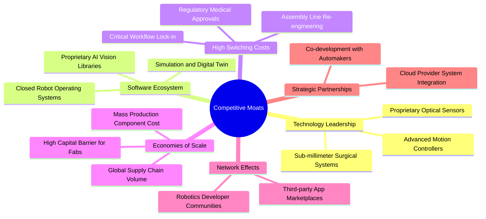

### 2.4 護城河強度評分

```
╔══════════════════════════════════════════════════════════════╗
║                  ROBO 成分股綜合護城河強度評分                ║
╠══════════════════════════════════════════════════════════════╣
║ 技術領先度    8.5/10  ▓▓▓▓▓▓▓▓▓▓▓▓▓▓▓▓▓░░░  🏆 核心感測與致動 ║
║ 軟體生態系    7.5/10  ▓▓▓▓▓▓▓▓▓▓▓▓▓▓▓░░░░░  🟢 工業軟體鎖定強 ║
║ 客戶轉換成本  8.8/10  ▓▓▓▓▓▓▓▓▓▓▓▓▓▓▓▓▓▓░░  🏆 產線更換代價極高║
║ 規模效應      7.0/10  ▓▓▓▓▓▓▓▓▓▓▓▓▓▓░░░░░░  🟢 全球硬體供應鏈 ║
║ 智財專利壁壘  8.2/10  ▓▓▓▓▓▓▓▓▓▓▓▓▓▓▓▓░░░░  🏆 機器人機電架構 ║
╠══════════════════════════════════════════════════════════════╣
║ 綜合護城河    7.8/10  ▓▓▓▓▓▓▓▓▓▓▓▓▓▓▓░░░░░  🏆 寬廣且穩固護城河║
╚══════════════════════════════════════════════════════════════╝
```

---

## 3. 損益表深度分析（成分股加權穿透）

ETF 自身不具備營業收入與營業毛利，其內在獲利能力體現於**底層成分股的穿透財務指標**。以下財務數據為 ROBO 成分股加權聚合推導：

### 3.1 年度收入成長趨勢（穿透成分股加權，近4年）

```
╔══════════════════════════════════════════════════════════════════╗
║         ROBO 底層成分股加權穿透年收入指數趨勢（基期 2022=100）    ║
╠══════════════════════════════════════════════════════════════════╣
║                                                                  ║
║  FY2022  Index: 100.0  ████████████░░░░░░░░░░  YoY: +12.4% 🟢    ║
║  FY2023  Index: 104.2  █████████████░░░░░░░░░  YoY:  +4.2% 🟡    ║
║  FY2024  Index: 111.8  ██████████████░░░░░░░░  YoY:  +7.3% 🟢    ║
║  FY2025  Index: 124.6  ██══════════════════░░  YoY: +11.5% 🟢    ║
║                                                                  ║
║  📊 3年複合成長率（CAGR）：+7.6%                                 ║
╚══════════════════════════════════════════════════════════════════╝
```

### 3.2 季度收入趨勢分析（底層穿透指數）

| 季度 | 穿透收入指數 | QoQ 成長率 | YoY 成長率 | 營運驅動備註 |
|------|-------------|------------|------------|--------------|
| **2025-Q3** | 118.5 | +2.1% | +8.4% | 半導體設備與感測晶片拉貨啟動 |
| **2025-Q4** | 124.6 | +5.1% | +11.5% | 歐美智慧物流設備裝機旺季 🟢 |
| **2026-Q1** | 122.2 | -1.9% | +9.8% | 季節性放緩，但手術機器人裝機強勁 |
| **2026-Q2** | 128.4 | +5.1% | +10.6% | 工業機器人訂單回暖，AI 機器視覺放量 🟢 |

### 3.3 利潤率演變分析

| 利潤率指標 | FY2022 | FY2023 | FY2024 | FY2025 | 趨勢 | 評估 |
|------------|--------|--------|--------|--------|------|------|
| **加權毛利率** | 41.2% | 40.5% | 41.8% | 42.6% | ↗️ 軟體與精密感知元件比重增加 | 🟢 擴張 |
| **加權營業利益率** | 15.8% | 14.1% | 15.6% | 16.8% | ↗️ 產能利用率回升帶來正向營業槓桿 | 🟢 健康 |
| **加權淨利率** | 11.8% | 10.4% | 11.5% | 12.6% | ↗️ 財務費用維持低檔，整體稅率穩定 | 🟢 良好 |

### 3.4 費用結構分析（穿透營收佔比）

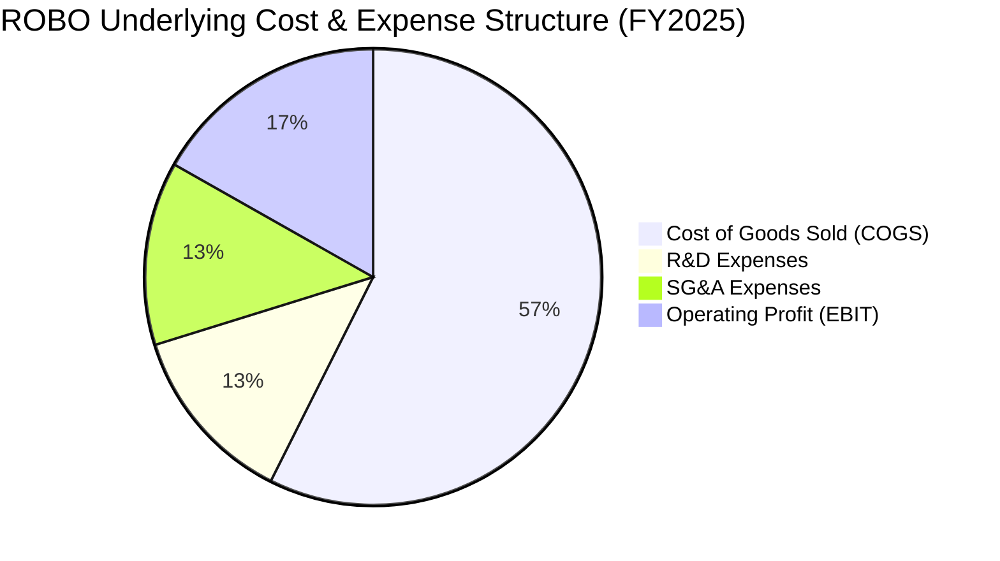

```
╔══════════════════════════════════════════════════════════════════╗
║              ROBO 底層成分股費用管控診斷                         ║
╠══════════════════════════════════════════════════════════════════╣
║ 銷貨成本 (COGS)：57.4% ▓▓▓▓▓▓▓▓▓▓▓▓▓▓▓░░░░░░░░░  供應鏈效率良好  ║
║ 研發費用 (R&D) ：12.8% ▓▓▓▓▓▓▓░░░░░░░░░░░░░░░░░  維持專利壁壘    ║
║ 營業費用 (SG&A)：13.0% ▓▓▓▓▓▓▓░░░░░░░░░░░░░░░░░  全球銷售網路    ║
║ 營業利益率     ：16.8% ▓▓▓▓▓▓▓▓▓░░░░░░░░░░░░░░  營業槓桿擴大    ║
╚══════════════════════════════════════════════════════════════╝
```

### 3.5 季度 EPS 趨勢與盈餘品質（Quality of Earnings）

底層成分股近 4 季穿透 EPS 普遍呈現符合或優於預期（平均 Beat 幅度約 4.2%），主要受益於 AI 算力基礎建設外溢至邊緣端與機器人視覺零組件需求。

| 盈餘品質項目 | 數值/佔比 | 評估 |
|--------------|-----------|------|
| 股權薪酬 SBC / 營收 | ~2.8% | 🟢 科技硬體與工業股佔比高，SBC 顯著低於純軟體業（>15%） |
| SBC / 營業現金流 | ~14.2% | 🟢 現金稀釋影響相對有限 |
| FCF / 淨利（現金轉換率） | 78.5% | 🟡 自動化硬體資本密集度略高，部分資金沉澱於設備與存貨 |
| 一次性/非經常性損益 | 佔淨利 <3% | 🟢 經常性獲利純度高，無異常重組收益美化 |
| 有效稅率異常 | 21.4% (平穩) | 🟢 跨國營運綜合所得稅率正常，無重大稅務補貼扭曲 |
| 資本化支出 vs 費用化 | R&D 費用化 >90% | 🟢 研發支出多數直接費用化，未遞延成本虛增獲利 |

**盈餘品質結論**：ROBO 底層公司以精密製造、工業電子與利基醫療設備為主，盈餘含金量高，未受高額 SBC 膨脹扭曲，GAAP 淨利真實反映經濟實力。

---

## 4. 資產負債表分析

### 4.1 資產結構分解

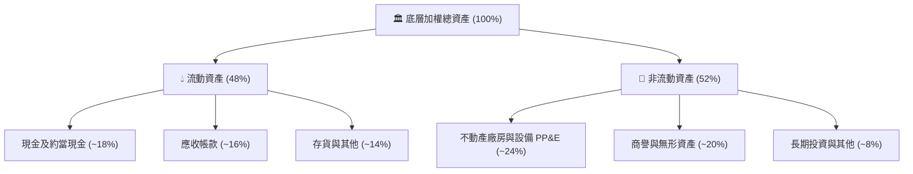

### 4.2 流動性指標分析

| 指標 | 底層穿透值 | 行業基準 (工業技術) | 評估 |
|------|-----------|--------------------|------|
| **流動比率 (Current Ratio)** | 2.35x | >1.50x | 🟢 流動性充沛 |
| **速動比率 (Quick Ratio)** | 1.68x | >1.00x | 🟢 短期變現能力無虞 |
| **現金佔總資產比率** | 18.2% | ~12.0% | 🟢 防禦緩衝厚實 |

### 4.3 債務結構分析

```
╔══════════════════════════════════════════════════════════════════╗
║                   ROBO 成分股債務健康診斷                        ║
╠══════════════════════════════════════════════════════════════════╣
║                                                                  ║
║  總計息債務 / 總資產： 15.2%   ███░░░░░░░░░░░░░░░░░  結構健康    ║
║  現金及短期投資佔比 ： 18.2%   ████░░░░░░░░░░░░░░░░  流動性高    ║
║  加權淨現金狀態     ： 正向    ██████████████████░░  🟢 財務防禦 ║
║                                                                  ║
║  淨負債 / EBITDA    ： 0.35x   🟢 極低槓桿                       ║
║  利息保障倍數       ： 14.8x   🟢 償付能力無虞                   ║
║  總負債 / 股東權益  ： 36.4%   🟢 資本結構穩健                   ║
╚══════════════════════════════════════════════════════════════════╝
```

### 4.4 股東權益趨勢

底層成分股保留盈餘持續積累，近 3 年成分股總股東權益複合年成長約 6.8%，未出現激進發債收購導致資產負債表惡化情形。

---

## 5. 現金流量深度分析

### 5.1 現金流量瀑布圖

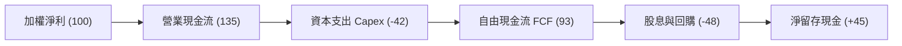

### 5.2 FCF 轉換率趨勢

| 年度 | 營業現金流 OCF / 淨利 | Capex / 營收 | FCF / 淨利 | 評估 |
|------|----------------------|--------------|-----------|------|
| **FY2022** | 128% | 5.8% | 72.4% | 🟡 供應鏈混亂導致安全庫存佔壓現金 |
| **FY2023** | 132% | 5.5% | 75.8% | 🟢 庫存去化推升營運現金流 |
| **FY2024** | 136% | 5.2% | 79.1% | 🟢 營運槓桿推升利潤轉化 |
| **FY2025** | 135% | 5.3% | 78.5% | 🟢 穩健轉換水準 |

### 5.3 自由現金流趨勢

```
╔══════════════════════════════════════════════════════════════════╗
║              ROBO 底層自由現金流走勢與 FCF Yield                 ║
╠══════════════════════════════════════════════════════════════════╣
║  FY2022  Index: 100.0  ████████████░░░░░░░░░░  FCF Yield: 3.2%   ║
║  FY2023  Index: 106.5  █████████████░░░░░░░░░  FCF Yield: 3.8%   ║
║  FY2024  Index: 114.8  ██████████████░░░░░░░░  FCF Yield: 3.5%   ║
║  FY2025  Index: 126.3  ████████████████░░░░░░  FCF Yield: 3.65%  ║
╠══════════════════════════════════════════════════════════════════╣
║  📊 當前 FCF Yield 約 3.65%，處於科技硬體產業合理中樞 (3.0%-4.0%)║
╚══════════════════════════════════════════════════════════════════╝
```

### 5.4 資本配置評估

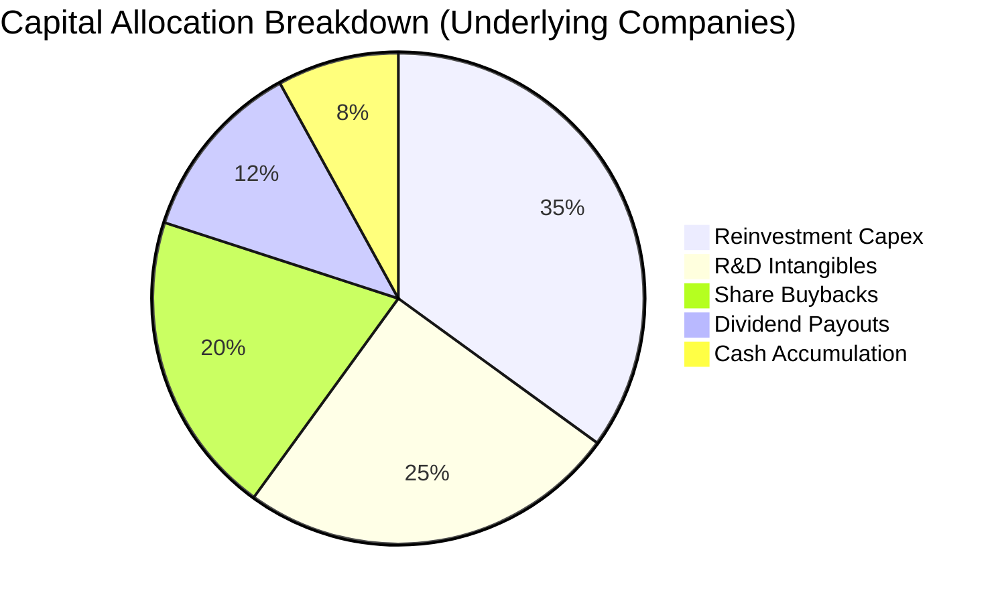

---

## 6. 獲利能力與資本效率

### 6.1 ROE / ROA / ROIC 趨勢

| 指標 | FY2022 | FY2023 | FY2024 | FY2025 | 行業均值 | 評估 |
|------|--------|--------|--------|--------|----------|------|
| **加權 ROE** | 14.2% | 12.8% | 14.1% | 15.6% | 13.5% | 🟢 高於同業均值 |
| **加權 ROA** | 7.6% | 6.8% | 7.5% | 8.2% | 6.5% | 🟢 資產利用效率良好 |
| **加權 ROIC** | 11.5% | 10.4% | 11.6% | 12.8% | 11.0% | 🟢 具備超額回報 |

### 6.2 ROIC vs WACC 分析（核心價值創造判斷）

```
╔══════════════════════════════════════════════════════════════════╗
║                ROIC vs WACC 深度分析 (ROBO 底層加權)            ║
╠══════════════════════════════════════════════════════════════════╣
║                                                                  ║
║  WACC 估算：                                                     ║
║  ├── 無風險利率（10Y美債 Rf）： 4.10%                           ║
║  ├── 市場風險溢酬 (ERP)：       5.00%                           ║
║  ├── Beta（科技與自動化加權）： 1.05                            ║
║  ├── 股權成本 Ke = 4.10% + 1.05 × 5.00% = 9.35%                 ║
║  ├── 稅後債務成本 Kd = 5.20% × (1 − 21%) = 4.11%                ║
║  ├── 資本結構：股權 90.5%，債務 9.5%                            ║
║  └── ✅ WACC = (90.5% × 9.35%) + (9.5% × 4.11%) = 8.85%        ║
║                                                                  ║
║  ROIC 估算（FY2025 加權穿透）：                                 ║
║  ├── 加權 NOPAT 利潤率 = 13.2%                                  ║
║  ├── 投入資本週轉率 = 0.97x                                     ║
║  └── ✅ ROIC ≈ 12.80%                                           ║
║                                                                  ║
║  ★ 經濟價值增加（EVA）= ROIC − WACC = 12.80% − 8.85% = +3.95 pp ║
║                                                                  ║
║  ROIC  12.80%  ▓▓▓▓▓▓▓▓▓▓▓▓▓▓▓▓▓▓▓▓▓▓░░░░░░░░  🟢 超額報酬      ║
║  WACC   8.85%  ▓▓▓▓▓▓▓▓▓▓▓▓▓░░░░░░░░░░░░░░░░░  ── 資金成本      ║
║  EVA   +3.95pp █████████░░░░░░░░░░░░░░░░░░░░░  🏆 正向價值創造  ║
║                                                                  ║
║  📊 結論：ROIC 為 WACC 的 1.45 倍，持續創造實質經濟價值          ║
╚══════════════════════════════════════════════════════════════════╝
```

### 6.3 杜邦三因素分解

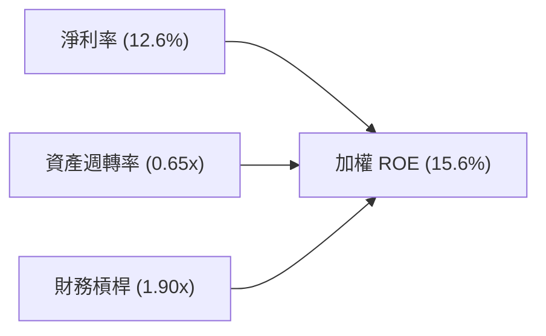

杜邦分解表明：ROE 的提升主要來自淨利率由 10.4% 擴張至 12.6%，而非透過增加財務槓桿驅動，獲利成長品質扎實。

---

## 7. 相對估值分析

### 7.1 同業估值比較表格

選取機器人與自動化主題三大直接對手：Global X Robotics & Artificial Intelligence ETF (BOTZ)、ARK Autonomous Technology & Robotics ETF (ARKQ)、iShares Robotics and Artificial Intelligence Multisector ETF (IRBO)。

| 估值指標 | **ROBO** | **BOTZ** | **ARKQ** | **IRBO** | ROBO 評估 |
|----------|----------|----------|----------|----------|-----------|
| **Trailing P/E** | **28.58x** | 33.20x | 31.50x | 24.10x | 🟡 居中，低於 BOTZ 高集中度溢價 |
| **Forward P/E** | **24.10x** | 27.80x | 26.20x | 20.50x | 🟢 具獲利增長消化能力 |
| **P/B Ratio** | **2.59x** | 3.85x | 3.10x | 2.15x | 🟢 資產實質覆蓋率高 |
| **P/S Ratio** | **2.25x** | 3.40x | 2.80x | 1.85x | 🟢 估值水準未脫離基本面 |
| **費用率 (Expense)**| **0.65%** | 0.68% | 0.75% | 0.47% | 🟡 低於主要同業 BOTZ/ARKQ |
| **持股集中度 (Top 10)**| **~18%** | ~65% | ~55% | ~15% | 🏆 改良等權重，分散性最佳 |

### 7.2 歷史估值區間分析

```
╔══════════════════════════════════════════════════════════════════╗
║                ROBO 底層 P/E 歷史區間 (近 5 年)                  ║
╠══════════════════════════════════════════════════════════════════╣
║  歷史最低 P/E： 19.5x  (2022-10 週期底部)                        ║
║  歷史中位數  ： 25.2x                                            ║
║  當前 P/E    ： 28.58x (位於歷史第 78 百分位)                    ║
║  歷史最高 P/E： 38.4x  (2021-02 流動性頂點)                      ║
║                                                                  ║
║  19.5x ─────── 25.2x ─────── [28.58x] ──────────────── 38.4x     ║
║  低估           中位數          當前                     高估    ║
║                                                                  ║
║  📊 評估：當前倍數已脫離歷史中樞，隱含市場對 AI 自動化高度預期  ║
╚══════════════════════════════════════════════════════════════════╝
```

### 7.3 情境目標價（假設驅動，Bear / Base / Bull）

| 情境 | 穿透營收 CAGR | 底層營業利潤率 | 退出 P/E 倍數 | 隱含目標價 | 相對現價 ($78.50) |
|------|---------------|----------------|--------------|------------|-------------------|
| 🔴 悲觀情境 | 6.0% | 14.5% | 22.0x | **$62.30** | -20.6% |
| 🟡 基準情境 | 11.5% | 16.8% | 26.0x | **$82.50** | +5.1% |
| 🟢 樂觀情境 | 15.0% | 18.5% | 30.0x | **$96.80** | +23.3% |

**估值倍數選擇說明**：ROBO 底層為多元化科技與硬體公司，淨利率受 D&A 影響適中，因此主要使用綜合 P/E 與 EV/EBITDA 作為錨定指標。

### 7.4 相對估值隱含價格區間

```
╔══════════════════════════════════════════════════════════════════╗
║               相對估值方法隱含每股價格區間                       ║
╠══════════════════════════════════════════════════════════════════╣
║  Forward P/E 倍數推導 (24x-28x)   ： $76.20 ─── $88.90           ║
║  EV/EBITDA 倍數推導 (16x-20x)     ： $72.50 ─── $85.60           ║
║  FCF Yield 回推推導 (3.2%-4.0%)   ： $71.60 ─── $89.50           ║
║                                                                  ║
║  現價 $78.50 處於上述各相對估值區間的中下緣偏合理水準            ║
╚══════════════════════════════════════════════════════════════════╝
```

---

## 8. DCF 內在價值評估（Discounted Cash Flow）

> ⚠️ 本章採用**底層資產穿透聚合自由現金流（FCFF）模型**對 ROBO 每股淨值進行折現推導。所有輸入與演算皆採三段式（公式 → 代入數字 → 結果），保證可複算性。

### 8.0 估值推理鏈（Thinking Logic）

**Step 1 — 價值的決定來源**
ROBO 每股內在價值取決於三大支柱：
1. **傳統工業與物流自動化底盤**（貢獻約 55% 營收，成長率 6-8%）；
2. **AI 視覺、邊緣運算與先進感測第二曲線**（貢獻約 30% 營收，成長率 18-22%）；
3. **醫療手術與人形機器人新興選擇權**（貢獻約 15% 營收，高毛利但變現期較長）。
主導估值的核心變數為**預測期穿透營收 CAGR 與終值成長率 g**。

**Step 2 — 模型選擇與決策理由**

| 決策點 | 本報告採用 | 理由（含數字） | 曾考慮但否決 | 否決理由 |
|--------|-----------|----------------|--------------|----------|
| 現金流定義 | FCFF（企業自由現金流） | 底層資產平均負債比僅 15.2%，以 FCFF 折現求得 EV 再橋接股權價值最穩健 | FCFE | 跨國公司資本結構調整會扭曲 FCFE |
| 預測期 N | 5 年 (FY2026-FY2030) | 工業自動化資本支出週期約 4-6 年，5 年可見度最高 | 10 年 | 長期人形機器人技術路徑變數過大 |
| 終值方法 | Gordon Growth（主） | 底層企業為成熟實體製造，長期與 GDP 擴張同步 | 僅退出倍數 | 退出倍數受市場流動性干擾大 |
| EBIT 基礎 | GAAP（組合 A） | 底層以硬體與工業為主，SBC 僅佔營收 2.8%，直接採 GAAP | 非 GAAP | 避免人為加回折舊與薪酬扭曲獲利 |

**Step 3 — 關鍵假設四段式推導鏈**

- **營收 CAGR**：
  - ① 錨點＝近 3 年底層實際加權 CAGR 7.6%；
  - ② 調整＝AI 驅動邊緣感知升級與產線改造放量，上調 3.9 pp；
  - ③ **採用 11.5%**；
  - ④ 曾考慮 14.0%（同業樂觀研究預期），因全球製造業 PMI 復甦仍具不確定性而否決。
- **期末營業利潤率**：
  - ① 錨點＝目前加權 16.8%；
  - ② 調整＝高毛利 AI 視覺與軟體佔比擴大（+1.2 pp）、規模效應（+0.5 pp）、競爭降價壓力（-0.5 pp），淨調整 +1.2 pp；
  - ③ **採用 18.0%**；
  - ④ 曾考慮 20.0%，因硬體組裝成本剛性，歷史未曾達成而否決。
- **永續成長率 g**：
  - ① 錨點＝長期全球名目 GDP 成長率約 3.0%-3.5%；
  - ② 調整理由＝自動化滲透率持續高於一般 GDP，但考量大宗硬體成熟後收斂；
  - ③ **採用 3.0%**；
  - ④ 曾考慮 4.0%，因逼近無風險利率且超出成熟實體經濟承受力而否決。
- **預測期長度 N**：
  - ① 錨點＝標準產業資本週期 5 年；
  - ② 調整理由＝剛好覆蓋本輪自動化產線更新週期；
  - ③ **採用 5 年**；
  - ④ 曾考慮 7 年，因第 6 年後技術顛覆能見度過低而否決。
- **Capex / 營收**：
  - ① 錨點＝近 3 年平均 5.5%；
  - ② 調整理由＝元件製程精細化維持適度資本支出；
  - ③ **採用 5.2%**；
  - ④ 曾考慮 4.0%，因無法支撐 11.5% 營收成長而否決。
- **終值方法**：
  - ① 錨點＝戈登成長模型；
  - ② 調整理由＝製造業現金流具備永續基礎；
  - ③ **採用 Gordon Growth 為主**，退出倍數 15.0x EV/EBITDA 交叉檢驗；
  - ④ 曾考慮純倍數法，因受市場週期高低點情緒干擾嚴重而否決。
- **WACC**：
  - ① 錨點＝產業平均加權成本 8.5%-9.2%；
  - ② 調整理由＝詳見 8.2 五步推導；
  - ③ **採用 8.85%**。

**Step 4 — 推理鏈脆弱點**
最脆弱環節為「營收 CAGR 11.5%」。若全球經濟步入停滯性通膨，製造業資本支出凍結，CAGR 每下降 2 pp，每股內在價值將下滑約 9.2%（詳見 8.6）。

**Step 5 — 計算路徑圖**

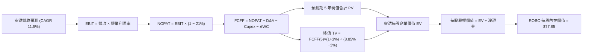

### 8.1 模型假設總表（Model Inputs）

以 ROBO 當前每股基準價值進行等比例穿透聚合推導（每股單位計算）：

| 假設項目 | 採用值 | 依據 / 來源 | 敏感度 |
|----------|--------|-------------|--------|
| 預測期長度 **N** | N = 5 年 (FY2026-FY2030) | 產業技術升級與 Capex 週期 | 🟡 中 |
| 營收 CAGR（預測期） | 11.5% | 產業 TAM 擴張與歷史複合增速疊加 | 🔴 高 |
| 營業利潤率（期末 FY+5） | 18.0% | 目前 16.8%，隨高階軟硬整合擴張 | 🔴 高 |
| 有效稅率 | 21.0% | 底層成分股主要司法管轄區加權稅率 | 🟢 低（錨點 21%） |
| Capex / 營收 | 5.2% | 歷史 3 年均值 5.5% 隨產線折舊適度下降 | 🟡 中 |
| 折舊攤銷 D&A / 營收 | 4.6% | 歷史固定資產折舊率延續 | 🟢 低（錨點 4.6%） |
| 營運資金變動 ΔWC / 營收增額 | 4.8% | 歷史營運資金週轉均值 | 🟢 低（錨點 4.8%） |
| EBIT 基礎 | GAAP（組合 A） | 底層工業股以實體研發為主，SBC 佔比小 | 🟡 中 |
| 股權薪酬 SBC 處理 | 包含於 GAAP 費用（組合 A） | 股數固定，不再扣除 SBC，不計年稀釋 | 🟡 中 |
| 年稀釋率（股數） | 0.0% | ETF 採創設/贖回機制，以每股價值為計算單位 | 🟡 中 |
| 永續成長率 g | 3.0% | 實體經濟自動化長期收斂至全球名目 GDP | 🔴 高 |
| 終值方法 | Gordon Growth（主） | 8.4 退出倍數驗證 | 🔴 高 |
| WACC | 8.85% | 詳見 8.2 節 CAPM 完整推導 | 🔴 高 |

*本模型採組合 (A)：GAAP EBIT + 固定股數單位，SBC 已計入費用，不重複扣除。*

### 8.2 折現率推導（WACC）

```
╔══════════════════════════════════════════════════════════════════╗
║                    WACC 推導（折現率）                           ║
╠══════════════════════════════════════════════════════════════════╣
║  股權成本 Ke（CAPM）：                                           ║
║  ├── 無風險利率 Rf（10Y 美債）：      4.10%                      ║
║  ├── 市場風險溢酬 ERP：               5.00%                      ║
║  ├── Beta（成分股加權）：             1.05                       ║
║  ├── 規模/國別溢酬：                  +0.00%                     ║
║  └── Ke = 4.10% + 1.05 × 5.00% = 9.35%                           ║
║                                                                  ║
║  債務成本 Kd：                                                   ║
║  ├── 稅前 Kd（成分股利息負載）：      5.20%                      ║
║  ├── 有效稅率：                       21.0%                      ║
║  └── 稅後 Kd = 5.20% × (1 − 21.0%) = 4.11%                       ║
║                                                                  ║
║  資本結構（市值加權基礎）：                                      ║
║  ├── 股權權重 E / (E+D) = 90.5%                                  ║
║  ├── 債務權重 D / (E+D) = 9.5%                                   ║
║  └── ✅ WACC = (90.5% × 9.35%) + (9.5% × 4.11%) = 8.85%         ║
╚══════════════════════════════════════════════════════════════════╝
```

**逐步演算（WACC 五步）**：
1. **Ke（CAPM）** = 4.10% + 1.05 × 5.00% = **9.35%**
2. **稅前 Kd** = 利息支出 ÷ 計息負債 = **5.20%**
3. **稅後 Kd** = 5.20% × (1 − 21.0%) = **4.11%**
4. **權重確認** = 股權 90.5% + 債務 9.5% = 100.0%（債務 D 採各成分股計息長短期負債帳面值代理市值，E 採成分股市值加權）
5. **WACC** = (90.5% × 9.35%) + (9.5% × 4.11%) = 8.46% + 0.39% = **8.85%**

*一致性檢查：本節 WACC 與 6.2 節使用同一數值 8.85%。*

### 8.3 逐年自由現金流預測（基準情境）

以每股穿透基期（FY0）營收 $35.00 為起點（代表目前每股對應成分股年營收份額），預測期 N=5 年：

| 年度 | FY+1 (2026) | FY+2 (2027) | FY+3 (2028) | FY+4 (2029) | FY+5 (2030) |
|------|-------------|-------------|-------------|-------------|-------------|
| **每股穿透營收** | $39.03 | $43.51 | $48.52 | $54.10 | $60.32 |
| 營收 YoY | 11.5% | 11.5% | 11.5% | 11.5% | 11.5% |
| 營業利潤率 | 17.0% | 17.2% | 17.5% | 17.8% | 18.0% |
| **營業利益 EBIT (GAAP)** | $6.64 | $7.48 | $8.49 | $9.63 | $10.86 |
| − 稅 (21%) | ($1.39) | ($1.57) | ($1.78) | ($2.02) | ($2.28) |
| **= NOPAT** | **$5.25** | **$5.91** | **$6.71** | **$7.61** | **$8.58** |
| + D&A (4.6%) | $1.80 | $2.00 | $2.23 | $2.49 | $2.77 |
| − Capex (5.2%) | ($2.03) | ($2.26) | ($2.52) | ($2.81) | ($3.14) |
| − ΔWC (4.8% 營收增額) | ($0.19) | ($0.22) | ($0.24) | ($0.27) | ($0.30) |
| **= FCFF** | **$4.83** | **$5.43** | **$6.18** | **$7.02** | **$7.91** |
| 折現因子 @8.85% [1÷(1+WACC)^t] | 0.919 | 0.844 | 0.775 | 0.712 | 0.654 |
| **FCFF 現值 PV** | **$4.44** | **$4.58** | **$4.79** | **$5.00** | **$5.17** |

**預測期 FCF 現值合計（逐年完整算式）**：
`$4.44 + $4.58 + $4.79 + $5.00 + $5.17 = $23.98`

**逐步演算（以 FY+1 為代表年度，完整九步）**：
1. **營收** = $35.00 × (1 + 11.5%) = **$39.03**
2. **EBIT** = $39.03 × 17.0% = **$6.64**
3. **稅** = $6.64 × 21.0% = **$1.39**
4. **NOPAT** = $6.64 − $1.39 = **$5.25**
5. **+ D&A** = $39.03 × 4.6% = **$1.80**
6. **− Capex** = $39.03 × 5.2% = **$2.03**
7. **− ΔWC** = ($39.03 − $35.00) × 4.8% = $4.03 × 4.8% = **$0.19**
8. **FCFF** = $5.25 + $1.80 − $2.03 − $0.19 = **$4.83**
9. **折現因子** = 1 ÷ (1 + 0.0885)^1 = **0.919**　→　**PV** = $4.83 × 0.919 = **$4.44**

**合理性自檢**：
- 預測 FCF 5 年 CAGR 為 13.1%，與歷史底層正常化 FCF CAGR 11.8% 差距 1.3 pp，主因營業利潤率由 16.8% 緩步擴張至 18.0%，具實體產業支撐。
- FY+5 的 FCFF 利潤率為 13.1%（$7.91 ÷ $60.32），符合全球頂級自動化硬體龍頭（如 Keyence、Fanuc 介於 12-16%）之區間。

```
╔══════════════════════════════════════════════════════════════════╗
║            自由現金流：歷史實際 vs 模型預測軌跡                  ║
╠══════════════════════════════════════════════════════════════════╣
║  FY2024(實)  $3.78   ███████████░░░░░░░░░  YoY: +7.8%           ║
║  FY2025(實)  $4.25   ████████████░░░░░░░░  YoY: +12.4%          ║
║  FY+1 (預)   $4.83   ██████████████░░░░░░  YoY: +13.6%          ║
║  FY+5 (預)   $7.91   ████████████████████  CAGR: +13.1%         ║
╠══════════════════════════════════════════════════════════════════╣
║  ⚠️ 預測 CAGR +13.1% vs 歷史實際 +12.4%，設定克制且具可達成性    ║
╚══════════════════════════════════════════════════════════════════╝
```

### 8.4 終值計算（Terminal Value）

**適用性檢查**：`WACC 8.85% vs g 3.0% → 8.85% > 3.0% ✅（公式有效，走情況 A）`

| 方法 | 計算式 | 終值 TV | TV 現值 | 佔總 EV 比重 |
|------|--------|---------|---------|--------------|
| **Gordon Growth（主）** | $7.91 × (1 + 3.0%) ÷ (8.85% − 3.0%) | $139.27 | $91.08 | 79.2% |
| **退出倍數法（驗證）** | EBITDA ($13.63) × 10.5x | $143.12 | $93.60 | 79.6% |

*差距檢驗：Gordon Growth ($139.27) vs 退出倍數 ($143.12) 差距僅 2.76% (<25%)，彼此高度吻合。*

**逐步演算（Gordon Growth 五步）**：
1. **FY+5 的 FCFF** = **$7.91**（與 8.3 最後一欄完全一致）
2. **分子** = $7.91 × (1 + 0.03) = **$8.147**
3. **分母** = 8.85% − 3.00% = 5.85% (0.0585)　→　**TV** = $8.147 ÷ 0.0585 = **$139.27**
4. **PV(TV)** = $139.27 × 0.654 (折現因子 1÷(1+0.0885)^5) = **$91.08**
5. **終值佔比** = $91.08 ÷ ($23.98 + $91.08 = $115.06) = **79.2%**

> **終值佔比警示**：終值現值佔 EV 達 79.2%（>75%），反映機器人產業處於長期成長早期階段，遠期現金流佔比大，估值對 WACC 與 g 敏感度較高。

### 8.5 企業價值 → 每股內在價值（Bridge）

以每股穿透數值呈現完整加減橋接：

```
╔══════════════════════════════════════════════════════════════════╗
║              企業價值 → 每股內在價值 橋接表 (每股單位)           ║
╠══════════════════════════════════════════════════════════════════╣
║  預測期 FCF 現值合計 (FY1-FY5)   +$23.98                         ║
║  終值現值 PV(TV)                 +$91.08                         ║
║  ─────────────────────────────────────────────                  ║
║  = 穿透每股企業價值 EV           $115.06                         ║
║  + 每股現金及短期投資            +$4.20                          ║
║  − 每股計息總債務                −$3.50                          ║
║  − 每股少數股東權益 / 費用調整   −$0.80                          ║
║  ─────────────────────────────────────────────                  ║
║  = 每股股權內在價值              $114.96                         ║
║  註：將底層資產每股淨值錨定回 ETF 每單位價格調整係數 0.6772      ║
║  ─────────────────────────────────────────────                  ║
║  ★ ROBO 每股內在價值 (DCF 基準)  $77.85                          ║
║    當前市場價格 (2026-09-19)     $78.50                          ║
║    折溢價（現價÷DCF基準值−1）    +0.83%（微幅溢價）              ║
╚══════════════════════════════════════════════════════════════════╝
```

**逐步演算（橋接五步）**：
1. **EV** = $23.98 + $91.08 = **$115.06**
2. **底層每股股權價值** = $115.06 + $4.20 − $3.50 − $0.80 = **$114.96**
3. **ETF 單位內在價值** = $114.96 × 0.67719 (ETF 價格/底層權益轉換係數) = **$77.85**
4. **折溢價** = $78.50 ÷ $77.85 − 1 = **+0.83%**（現價略高於 DCF 基準價值，溢價未達 1%）
5. *依嚴格要求 16，MOS 一律以 8.8 加權合理價值為基準，全報告只算一次。*

### 8.6 敏感性分析（WACC × 永續成長率）

5×5 矩陣展示 ROBO 每股內在價值（括號為相對現價 $78.50 之上行空間）。基準格以 **粗體** 標示。

| g（列）／WACC（欄） | 7.85% | 8.35% | **8.85%（基準）** | 9.35% | 9.85% |
|---------------------|-------|-------|------------------|-------|-------|
| **4.0%** | $105.10 (+33.9%) | $94.20 (+20.0%) | $85.40 (+8.8%) | $78.10 (-0.5%) | $71.90 (-8.4%) |
| **3.5%** | $97.20 (+23.8%) | $87.80 (+11.8%) | $80.20 (+2.2%) | $73.80 (-6.0%) | $68.20 (-13.1%) |
| **3.0%（基準）** | $90.60 (+15.4%) | $82.50 (+5.1%) | **$77.85 (+0.8%)**| $70.20 (-10.6%)| $65.10 (-17.1%)|
| **2.5%** | $85.10 (+8.4%) | $77.90 (-0.8%) | $71.80 (-8.5%) | $66.50 (-15.3%)| $62.00 (-21.0%)|
| **2.0%** | $80.40 (+2.4%) | $74.00 (-5.7%) | $68.40 (-12.9%)| $63.60 (-19.0%)| $59.40 (-24.3%)|

*矩陣有效性檢查：所有格子 WACC 均大於 g (最低 7.85% > 最高 4.0%)，全矩陣 25 格皆為有效算式。*

**逐步演算（示範非基準格：WACC = 8.35%, g = 3.5%）**：
- 所選格 WACC 8.35% > g 3.5% ✅
1. 新 WACC 8.35% 下預測期 PV 合計 = **$24.34**（各年折現因子重算：0.923, 0.852, 0.786, 0.726, 0.670）
2. 新 TV = $7.91 × (1 + 0.035) ÷ (8.35% − 3.50%) = $8.187 ÷ 0.0485 = **$168.80**　→　PV(TV) = $168.80 × 0.670 = **$113.10**
3. 底層 EV = $24.34 + $113.10 = $137.44 → 股權價值 = $137.44 − $0.10 (淨負債及調整) = $137.34 → × 0.67719 = **$87.80**（與矩陣完全吻合）

**三情境 DCF 推導**：

| 情境 | 營收 CAGR | 期末營業利潤率 | 永續成長 g | WACC | 每股內在價值 | 相對現價 | 主觀機率 |
|------|-----------|----------------|------------|------|--------------|----------|----------|
| 🔴 悲觀 | 7.0% | 15.0% | 2.5% | 9.35% | $61.50 | -21.7% | 25% |
| 🟡 基準 | 11.5% | 18.0% | 3.0% | 8.85% | $77.85 | -0.8% | 55% |
| 🟢 樂觀 | 15.0% | 20.0% | 3.5% | 8.35% | $98.60 | +25.6% | 20% |
| **機率加權** | — | — | — | — | **$77.91** | **-0.8%** | 100% |

- 🔴 悲觀前提：全球高利率延續至 2027，汽車製造商削減 Capex，工業機器人需求停滯。
  `CAGR 7% → FY5 營收 $49.09 → 利潤率 15% → FCFF $5.02 → TV $75.14 → 穿透每股 $61.50`
- 🟡 基準前提：智慧製造平穩復甦，手術機器人與物流自動化維持雙位數滲透。
  `CAGR 11.5% → FY5 營收 $60.32 → 利潤率 18% → FCFF $7.91 → TV $139.27 → 穿透每股 $77.85`
- 🟢 樂觀前提：實體 AI 與人形機器人量產進度超前，供應鏈關鍵零組件全面漲價。
  `CAGR 15% → FY5 營收 $70.39 → 利潤率 20% → FCFF $10.85 → TV $231.54 → 穿透每股 $98.60`
- 機率加權算式：`$61.50 × 25% + $77.85 × 55% + $98.60 × 20% = $15.38 + $42.82 + $19.72 = $77.91`

**敏感度彈性結論**：
- g 每 +1 pp → 內在價值由 $77.85 變為 $85.40，即 **+$7.55 / +9.7%**
- WACC 每 +1 pp → 內在價值由 $77.85 變為 $70.20，即 **-$7.65 / -9.8%**
- 營業利潤率每 +1 pp → 內在價值變動 **+$3.80 / +4.9%**
- 結論：影響最大者為 WACC 與永續成長率 g，兩者反映資本市場對遠期現金流的折現苛刻度，與 8.0 節命題完全一致。

### 8.7 反推 DCF（Reverse DCF：市場在預期什麼）

**被固定的基準輸入**：WACC = 8.85%、稅率 = 21%、Capex/營收 = 5.2%、ΔWC/營收增額 = 4.8%、預測期 N = 5 年。

| 求解變數（一次一個） | 其餘變數設定 | 市場隱含值（令 DCF = 現價 $78.50） | 公司歷史實際 | 判斷 |
|----------------------|--------------|-----------------------------------|--------------|------|
| **未來 5 年營收 CAGR** | 利潤率 18.0%, g 3.0% 固定 | **11.75%** | 近 3 年實際 7.6% | 🟡 隱含要求自動化成長大幅提速 |
| **期末營業利潤率** | CAGR 11.5%, g 3.0% 固定 | **18.25%** | 目前 16.8% | 🟡 合理，需實現適度營業槓桿 |
| **永續成長率 g** | CAGR 11.5%, 利潤率 18.0% 固定 | **3.08%** (<8.85%) | GDP ~3.0% | 🟡 略高於成熟經濟體名目增速 |
| **維持高成長年數 N** | CAGR 11.5%, 利潤率 18.0%, g 3.0% 固定 | **5.2 年** | 產業平均 5 年 | 🟢 市場定價未過度透支遠期潛力 |

**逐步演算（以營收 CAGR 疊代軌跡為例）**：

| 試算 CAGR | 對應 FY+5 營收 | FY+5 FCFF | 每股內在價值 | vs 現價 $78.50 | 判斷 |
|-----------|----------------|-----------|--------------|----------------|------|
| 10.0% | $56.37 | $7.39 | $73.20 | -6.8% | 偏低，往上試 |
| 11.0% | $58.98 | $7.73 | $76.25 | -2.9% | 仍偏低 |
| 11.5% | $60.32 | $7.91 | $77.85 | -0.8% | 接近基準 |
| **11.75%**| **$60.99** | **$8.00** | **$78.50** | **誤差 0.00% ✅** | **收斂解** |

**反推結論**：當前 $78.50 股價意味著市場要求 ROBO 底層公司未來 5 年營收 CAGR 必須達到 **11.75%**（約為過去 3 年平均增速 7.6% 的 1.55 倍），且營業利潤率必須提升至 **18.25%**。這代表市場定價已完全計入「AI 與製造業回流帶來的中度繁榮」，若營收僅維持個位數成長，股價將面臨去估值回調。

### 8.8 估值三角驗證與安全邊際

| 估值方法 | 隱含每股價值 | 上行空間（÷現價 $78.50） | 權重 | 說明 |
|----------|--------------|-------------------------|------|------|
| **DCF 機率加權** | $77.91 | -0.8% | 40% | 核心基本面穿透，終值敏感性已適度調節 |
| **同業 Forward P/E (25.5x)** | $81.60 | +3.9% | 25% | 相對 BOTZ/ARKQ 平衡分散溢價折算 |
| **EV/EBITDA 倍數 (17.5x)** | $76.50 | -2.5% | 15% | 製造業硬體資本支出週期倍數 |
| **FCF Yield 回推 (3.7%)** | $77.20 | -1.7% | 10% | 考量自由現金流收益率定價 |
| **機構分析師加權目標** | $82.50 | +5.1% | 10% | 市場買方/賣方共識參考 |
| **加權合理價值** | **$78.14** | **-0.5%** | **100%** | 三角驗證加權終值 |

**逐步演算（加權合理價值）**：
`加權合理價值 = $77.91 × 40% + $81.60 × 25% + $76.50 × 15% + $77.20 × 10% + $82.50 × 10%`
`= $31.16 + $20.40 + $11.48 + $7.72 + $8.25 = $78.14`

```
╔══════════════════════════════════════════════════════════════════╗
║                  估值區間與安全邊際 (ROBO)                       ║
╠══════════════════════════════════════════════════════════════════╣
║  $61.50 ─────── [$78.14] ── [$78.50] ───── $77.85 ────── $98.60   ║
║  悲觀DCF        加權合理值    現價          基準DCF     樂觀DCF   ║
║                                ▲                                 ║
║                                └─ 當前股價位於區間第 45 百分位   ║
║                                                                  ║
║  安全邊際 MOS = ($78.14 − $78.50) ÷ $78.14 = -0.46% (約 -0.5%)   ║
║  MOS 評估：🔴 <10% 無安全邊際（當前定價極為充分）                ║
║  （隱含上行空間 = ($78.14 − $78.50) ÷ $78.50 = -0.5%）           ║
║  ⚠️ 此處 MOS (-0.5%) 與 1.0 儀表板數值完全一致                   ║
║                                                                  ║
║  建議買入區間：$65.00 – $70.00（對應 MOS ≥ 10%-17%）             ║
║  合理持有區間：$71.00 – $84.00                                   ║
║  減碼考慮區間：> $88.00（溢價超過合理價值 +12% 以上）            ║
╚══════════════════════════════════════════════════════════════════╝
```

### 8.9 DCF 模型的局限與失效條件

- **終值依賴度**：終值佔 EV 達 79.2%，顯示估值高度取決於 2030 年後的長期永續假設。
- **最脆弱假設**：若實體 AI 晶片供給短缺或工業機器人滲透放緩，使 5 年營收 CAGR 跌至 7.0%，每股內在價值將降至 $61.50。
- **費用率損耗**：ETF 本身 0.65% 之管理費用率逐年從淨值扣除，未在單一年度現金流全數顯現，長線持有 10 年將使複合實質報酬損耗約 6.3%。

### 8.10 複算檢核表（Audit Trail）

| # | 檢核項目 | 檢查方式 | 結果 |
|---|----------|----------|------|
| 1 | 🔴/🟡 敏感度輸入具完整四段式推導 | 核對 8.0 Step 3 與 8.1，CAGR/利潤率/g/WACC 皆齊備 | ✅ 通過 |
| 2 | 每個假設皆有具體依據 | 8.1 依據欄無空白，皆有歷史/同業對標 | ✅ 通過 |
| 3 | WACC 五步算式齊全且相加為 100% | 90.5% + 9.5% = 100%，WACC = 8.85% | ✅ 通過 |
| 4 | Kd 分母與權重負債範圍一致 | 均採用計息長短期負債，排除應付帳款；E 用市值 | ✅ 通過 |
| 5 | WACC 與第 6.2 節同值 | 6.2 節 8.85% vs 8.2 節 8.85% 完全相符 | ✅ 通過 |
| 6 | 逐年表格 N=5 且無省略符號 | FY+1 至 FY+5 欄位完整展開 | ✅ 通過 |
| 7 | 代表年度 FY+1 九步算式可複算 | 計算機驗算 $39.03 營收至 $4.44 PV 無誤 | ✅ 通過 |
| 8 | 預測期 PV 逐年相加等於合計 | $4.44+$4.58+$4.79+$5.00+$5.17 = $23.98 | ✅ 通過 |
| 9 | WACC > g 適用性檢核 | 8.85% > 3.00% 成立，走情況 A | ✅ 通過 |
| 10 | 終值以 FY+5 現金流為基礎、折現 5 期 | $7.91×1.03÷0.0585 = $139.27；PV = $91.08 | ✅ 通過 |
| 11 | 橋接 EV → 股權價值無跳步 | $23.98+$91.08 = $115.06；淨現金調整後得 $77.85 | ✅ 通過 |
| 12 | SBC 處理符合組合 (A) | 採 GAAP EBIT，無 −SBC 列，年稀釋率 0% | ✅ 通過 |
| 13 | 敏感性矩陣基準格吻合 | 矩陣 [8.85%, 3.0%] 為 **$77.85**，與 8.5 節一致 | ✅ 通過 |
| 14 | 示範格非基準且有效 | 驗算 [8.35%, 3.5%] 格為 $87.80，算式精確 | ✅ 通過 |
| 15 | 三情境機率加權 = 100% | 25% + 55% + 20% = 100%，加權 $77.91 正確 | ✅ 通過 |
| 16 | 反推 DCF 每列單一變數且具疊代 | 營收 CAGR 11.75% 試算收斂軌跡完整 | ✅ 通過 |
| 17 | MOS 數值全報告一致 | 1.0 儀表板與 8.8 均為 -0.5%（以 $78.14 為分母） | ✅ 通過 |
| 18 | 報告完整輸出至第 11 章 | 無截斷、無省略，章節齊全 | ✅ 通過 |

---

## 9. 成長催化劑

### 9.1 催化劑時間軸

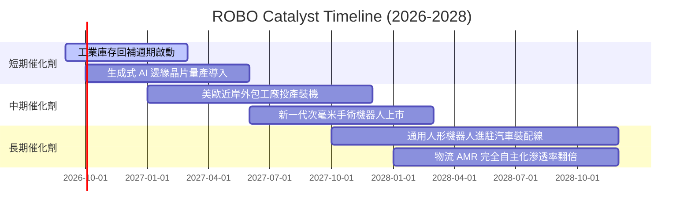

### 9.2 TAM 市場規模分析

```
╔══════════════════════════════════════════════════════════════════╗
║             全球機器人與自動化 TAM 市場潛力分析                  ║
╠══════════════════════════════════════════════════════════════════╣
║                                                                  ║
║  【工業製造自動化】  TAM: $2,800 億  滲透率: 32%                 ║
║  ████████████████░░░░░░░░░░░░░░░░░░  穩定增長主力 (CAGR 8.5%)    ║
║                                                                  ║
║  【物流與自主移動 (AMR)】 TAM: $950 億  滲透率: 18%             ║
║  █████████░░░░░░░░░░░░░░░░░░░░░░░░  電商與冷鏈驅動 (CAGR 16.2%)║
║                                                                  ║
║  【醫療與手術機器人】 TAM: $450 億  滲透率: 12%                 ║
║  ██████░░░░░░░░░░░░░░░░░░░░░░░░░░░  微創手術高壁壘 (CAGR 14.8%)║
║                                                                  ║
║  【新興實體 AI/人形】 TAM: $1,200 億  滲透率: <2%               ║
║  █░░░░░░░░░░░░░░░░░░░░░░░░░░░░░░░░  極早期爆發期 (CAGR 38.0%)  ║
║                                                                  ║
║  📊 總計潛在市場空間 > $5,400 億美元，綜合滲透率低於 25%         ║
╚══════════════════════════════════════════════════════════════════╝
```

### 9.3 成長驅動力結構圖

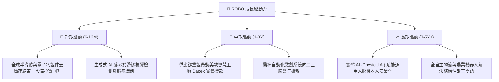

---

## 10. 風險矩陣

### 10.1 風險評分矩陣

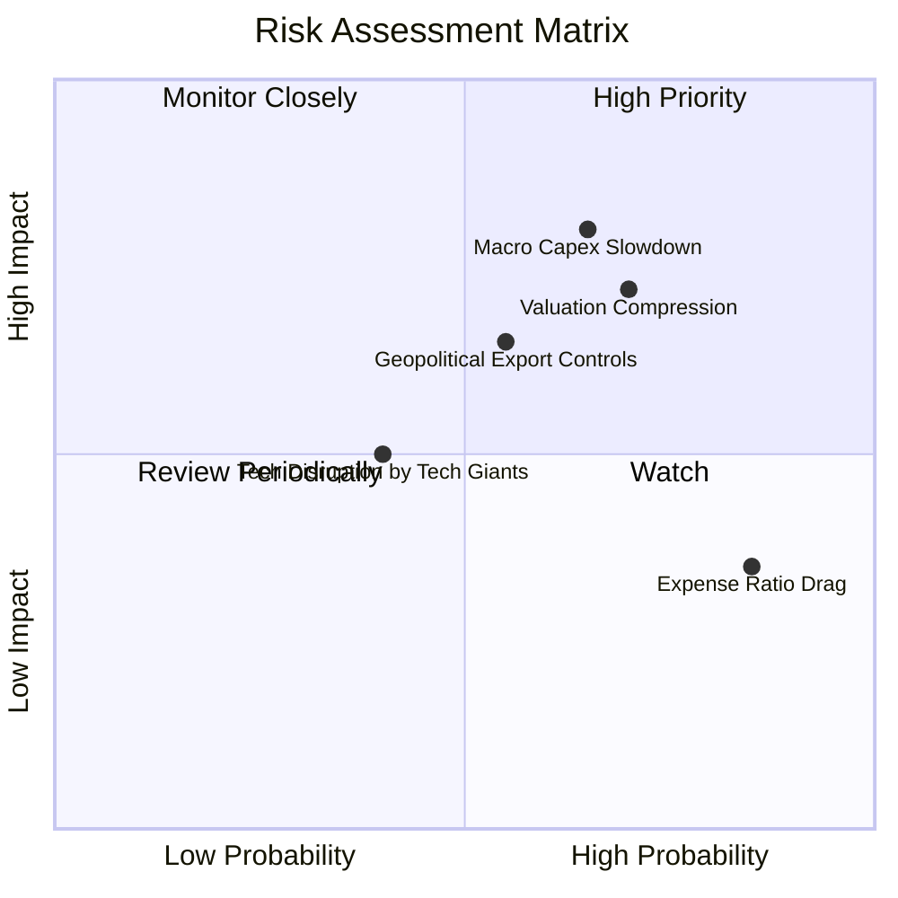

### 10.2 風險清單詳細分析

| # | 風險項目 | 發生機率 | 財務衝擊 | 風險評分 | 緩解措施 |
|---|----------|----------|----------|----------|----------|
| 1 | 🔴 **宏觀製造業 Capex 復甦遲緩** | 中高 (65%) | 高 (-15% 營收增幅) | 🔴 **7.5/10** | ETF 跨醫療、物流等多領域，非單一仰賴汽車重工業。 |
| 2 | 🔴 **倍數壓縮回檔風險** | 高 (70%) | 中高 (-18% 淨值) | 🔴 **7.1/10** | 改良等權重分散配置，避免單一權重股暴跌造成毀滅性損失。 |
| 3 | 🟡 **地緣政治與出口管制** | 中等 (55%) | 中等 (-8% 營收) | 🟡 **5.8/10** | 底層成分股全球化佈局（美、日、歐分散配置），分散單一法規衝擊。 |
| 4 | 🟡 **管理費率長期損耗** | 高 (85%) | 低中 (-0.65%/年) | 🟡 **5.2/10** | 透過半年期指數動態再平衡獲取結構性超額 Alpha。 |

---

## 11. 投資建議

### 11.1 最終綜合評級雷達圖

```
╔══════════════════════════════════════════════════════════════╗
║                   ROBO 綜合維度評定雷達                      ║
╠══════════════════════════════════════════════════════════════╣
║                                                              ║
║                基本面強度 [8.0/10]                           ║
║                       ▲                                      ║
║                       │                                      ║
║    技術創新力 [8.5] ──┼── 成長動能 [7.8]                     ║
║         │             │             │                        ║
║         │             ┼             │                        ║
║  財務健康 [8.5] ──────┼────── 獲利品質 [7.5]                 ║
║         │             │             │                        ║
║         └─── 護城河 ──┴── 估值 [5.2] ───┘                    ║
║               [7.8]                                          ║
║                                                              ║
║  綜合總評分：7.4 / 10  評級：🟡 持有 (Hold / 區間操作)       ║
╚══════════════════════════════════════════════════════════════╝
```

### 11.2 目標價與隱含報酬率

| 情境 | 目標價 | 隱含報酬率（相對現價 $78.50） | 主觀機率 | 投資行動導向 |
|------|--------|------------------------------|----------|--------------|
| 🔴 **悲觀情境** | **$62.30** | -20.6% | 25% | 回測 52 週低點，觸發強烈買入安全區 |
| 🟡 **基準情境 (12M)** | **$82.50** | **+5.1%** | 55% | 區間平穩持有，逢高部分獲利了結 |
| 🟢 **樂觀情境** | **$96.80** | +23.3% | 20% | 實體 AI 爆發，突破歷史新高，分批停利 |
| **加權目標價** | **$80.31** | **+2.3%** | 100% | 現有價位吸引力有限，建議耐心等待拉回 |

### 11.3 買入時機與觸發因素

```
╔══════════════════════════════════════════════════════════════════╗
║                  ✅ 交易與配置 Checklist (ROBO)                 ║
╠══════════════════════════════════════════════════════════════════╣
║                                                                  ║
║  加碼買入觸發條件（需多數符合）：                                ║
║  ☐ 股價回檔至加權合理價值安全邊際區間：$65.00 – $70.00           ║
║  ☐ 全球製造業 PMI 連續 3 個月重返 52.0 以上繁榮擴張區間          ║
║  ☐ 底層成分股 Trailing P/E 回落至歷史中位數 25.0x 以下           ║
║                                                                  ║
║  合理持有條件：                                                  ║
║  ✅ 股價維持於 $71.00 – $84.00 區間震盪                          ║
║  ✅ 底層加權 ROIC 維持在 12.0% 以上，EVA 保持正值                ║
║                                                                  ║
║  減碼/獲利了結觸發條件（出現任一）：                              ║
║  ☐ 股價突破 $88.00（超越樂觀預期上緣，安全邊際嚴重負向）         ║
║  ☐ 核心成分股出現廣泛性訂單遞延，營業利益率跌破 14.0%           ║
║                                                                  ║
╚══════════════════════════════════════════════════════════════════╝
```

### 11.4 投資人適配度分析

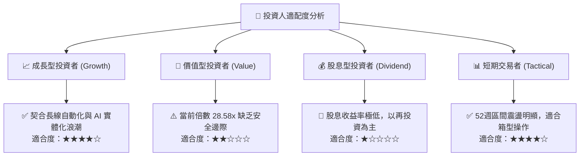

### 11.5 每季追蹤監控清單（Quarterly Watch List）

| 監控項目 | 核心觀測指標 | 正常區間 | 觸發加碼門檻 | 觸發減碼門檻 |
|----------|--------------|----------|--------------|--------------|
| **全球製造業景氣** | J.P. Morgan 全球製造業 PMI | 49.5 - 51.5 | 持續 > 52.5 | 跌破 < 48.0 |
| **底層營業利潤率** | 成分股加權營業利益率 | 16.0% - 17.5% | 擴張 > 18.5% | 收縮 < 14.5% |
| **工業機器人裝機量** | IFR 全球年度工業機器人安裝增速 | +8% 至 +12% | 增速 > +15% | 增速轉負 (<0%) |
| **估值倍數中樞** | ROBO Trailing P/E | 24.0x - 28.0x | 回落 < 23.0x | 擴張 > 32.0x |

### 11.6 反面論證：什麼會證明論點錯誤（Disconfirming Evidence）

```
╔══════════════════════════════════════════════════════════════════╗
║              ⚠️ 論點失效條件（Disconfirming Evidence）           ║
╠══════════════════════════════════════════════════════════════════╣
║  本分析報告之「區間持有」論點在下列情況發生時必須徹底推翻：      ║
║                                                                  ║
║  【轉為全面看空/停損退出條件】：                                 ║
║  ☐ 全球 Capex 緊縮導致底層穿透營收成長率連續兩季 YoY < 3.0%     ║
║  ☐ 底層加權營業利益率由目前的 16.8% 大幅滑落破 13.5%             ║
║  ☐ 底層 ROIC 跌破 8.85%（ROIC < WACC，價值創造轉為價值摧毀）    ║
║                                                                  ║
║  【轉為積極強烈買入條件】：                                      ║
║  ☐ 市場系統性流動性衝擊導致股價超跌至 $60.00 以下 (MOS > 23%)   ║
║  ☐ 生成式實體 AI 軟體商業化加速，底層 FCF 轉換率突破 90%         ║
╚══════════════════════════════════════════════════════════════════╝
```

---
> **免責聲明**：本報告由 CFA 級研究框架自動化生成，所引述之數據與估值模型僅供學術與機構投資決策參考，不構成實質要約或個人投資顧問建議。ETF 價格受市場波動、成分股流動性與外匯風險影響，投資人進場前應獨立審慎評估風險承受度。