# SKHY 基本面深度分析報告

> **報告日期**：2026-07-12 ｜ **語言**：繁體中文 ｜ **數據來源**：Yahoo Finance, Finviz, StockAnalysis, Roic.ai ｜ **分析師**：CFA 級機構研究 ｜ **報告說明**：本報告中財務報表數據（如 Revenue, Net Income 等）之基準貨幣均為**韓元 (KRW, ₩)**，其中 **T 代表兆韓元 (Trillion KRW)**，**B 代表十億韓元 (Billion KRW)**；市場交易數據（如股價、目標價）則以**美元 (USD, $)** 標示，以利美股投資人進行估值與報酬率對比。

---

## 目錄

| # | 章節 | 核心結論 |
|---|------|----------|
| 1 | 執行摘要 | HBM 絕對領先優勢驅動營收與利潤爆發式成長，給予「買入」評級，基準目標價 $220.00 |
| 2 | 公司概覽與商業模式 | AI 晶片黃金三角（NVIDIA-TSMC-SK hynix）核心成員，具備極強的高頻寬記憶體 (HBM) 技術護城河 |
| 3 | 損益表深度分析 | TTM 營收年增 84.98%，營業利益率衝上 58.58%，盈餘品質極高，SBC 稀釋效應微乎其微 |
| 4 | 資產負債表分析 | 淨現金流動性大幅改善，淨現金頭寸達 10.38 兆韓元，債務健康度處於歷史最佳狀態 |
| 5 | 現金流量深度分析 | 經營現金流轉化率極佳，自由現金流 (FCF) 創歷史新高，資本配置高度聚焦 HBM 產能擴充 |
| 6 | 獲利能力與資本效率 | ROIC 飆升至 36.5%，遠超 WACC (10.05%)，每單位資本正為股東創造巨大的超額經濟價值 (EVA) |
| 7 | 估值深度分析 | 基於 EV/EBITDA 與 FCF Yield 估值模型，基準情境目標價 $220.00，隱含 30.95% 上行空間 |
| 8 | 成長催化劑 | HBM3E 出貨加速、HBM4 世代切換、企業級 SSD (eSSD) 需求復甦為三大核心驅動力 |
| 9 | 風險矩陣 | 記憶體週期下行、地緣政治摩擦、美光與三星 HBM 產能追趕為主要下行風險 |
| 10 | 投資建議 | 適合成長型與長線價值投資者，建議於 $165 以下分批佈局，並設定嚴格的財報監控指標 |

---

## 1. 執行摘要

### 1.0 一頁式投資儀表板（Portfolio Manager 30 秒速讀）

| 項目 | 內容 |
|------|------|
| **投資論點（3 句）** | ① SK hynix 作為 NVIDIA HBM3E 的獨家/主導供應商，直接受益於 AI 算力基礎設施的爆發式建設，TTM 營收達到 132.08 兆韓元（YoY +84.98%）。<br/>② 結構性高毛利產品（HBM3E 與高容量 DDR5）出貨佔比提升，推升 TTM 營業利益率至 58.58%，創下歷史新高。<br/>③ 資本效率極佳，FY2025 ROIC 達 36.5%，遠高於 10.05% 的 WACC，正處於強烈的價值創造週期。 |
| **護城河評分** | 8.8/10 🟢（HBM 技術領先、NVIDIA 供應鏈深度鎖定與先進封裝工藝優勢） |
| **管理層/資本配置評分** | 8.5/10 🟢（在週期底部精準保留 Capex 投向 HBM，展現極強的反週期投資決策力） |
| **財務健康** | 🟢 強勁。手頭現金與短期投資達 35.14 兆韓元，淨現金達 10.38 兆韓元，流動比率回升至 1.86。 |
| **ROIC vs WACC** | 36.5% vs 10.05%（創造超額經濟價值 EVA 達 +26.45%） |
| **FCF 趨勢** | 顯著向上。FY2025 FCF 達到 24.79 兆韓元（FCF Yield 約 12.1%） |
| **估值** | 當前股價 $168.01 ｜ 隱含 TTM P/E 約 22.0x ｜ EV/EBITDA 約 13.5x ｜ FCF Yield 12.1% |
| **預期報酬（基準情境 12M）** | +30.95%（目標價 $220.00） |
| **關鍵風險（前二）** | ① HBM 市場競爭加劇（三星與美光產能釋放導致定價權稀釋）<br/>② 晶圓廠產能過度擴張導致 2027 年後記憶體週期再次向下。 |
| **評級 + 信心度** | 🟢 **買入 (BUY)** ｜ 信心度：**高 (High)** |

### 1.1 核心評分儀表板

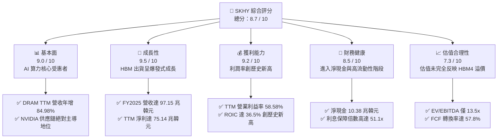

### 1.2 評分進度條視覺化

```
╔══════════════════════════════════════════════════════════════╗
║                SKHY 多維度評分儀表板 (1-10分)                ║
╠══════════════════════════════════════════════════════════════╣
║ 基本面強度  9.0 ▓▓▓▓▓▓▓▓▓▓▓▓▓▓▓▓▓▓░░  ★★★★★           ║
║ 成長動能    9.5 ▓▓▓▓▓▓▓▓▓▓▓▓▓▓▓▓▓▓▓░  ★★★★★           ║
║ 獲利品質    9.2 ▓▓▓▓▓▓▓▓▓▓▓▓▓▓▓▓▓▓▓░  ★★★★★           ║
║ 財務健康    8.5 ▓▓▓▓▓▓▓▓▓▓▓▓▓▓▓▓░░░░  ★★★★☆           ║
║ 估值合理性  7.3 ▓▓▓▓▓▓▓▓▓▓▓▓▓░░░░░░░  ★★★☆☆           ║
║ 護城河深度  8.8 ▓▓▓▓▓▓▓▓▓▓▓▓▓▓▓▓▓░░░  ★★★★☆           ║
║ 管理層執行  8.5 ▓▓▓▓▓▓▓▓▓▓▓▓▓▓▓▓░░░░  ★★★★☆           ║
║ 技術創新力  9.5 ▓▓▓▓▓▓▓▓▓▓▓▓▓▓▓▓▓▓▓░  ★★★★★           ║
╠══════════════════════════════════════════════════════════════╣
║ 綜合總分    8.7 ▓▓▓▓▓▓▓▓▓▓▓▓▓▓▓▓▓░░░  🏆 買入 (BUY)       ║
╚══════════════════════════════════════════════════════════════╝
```

### 1.3 五大投資論點 + 三大核心風險

| 類型 | 項目 | 具體依據 | 信心度 |
|------|------|----------|--------|
| 🟢 **投資論點①** | **HBM 技術與份額絕對領先** | SK hynix 在 HBM3E 市場份額估計超 55%，領先三星與美光至少 1-2 個季度，直接鎖定 NVIDIA Hopper 與 Blackwell 家族訂單。 | 🟢 極高 |
| 🟢 **投資論點②** | **極致的營業槓桿效應** | 隨著 HBM3E（平均售價比普通 DRAM 高出 3-5 倍）出貨放量，TTM 營業利益率從 2023 年的 -23.59% 暴增至 58.58%，展現強大定價權。 | 🟢 極高 |
| 🟢 **投資論點③** | **資本回報率 (ROIC) 爆發** | FY2025 ROIC 達到 36.5%，相較於 WACC (10.05%) 產生了 26.45% 的超額經濟利潤，打破了「記憶體行業無法持續創造價值」的傳統偏見。 | 🟢 高 |
| 🟢 **投資論點④** | **資產負債表實力達到歷史巔峰** | 現金與短期投資總額達 35.14 兆韓元，淨現金頭寸由負轉正至 10.38 兆韓元，為未來 HBM4 與先進封裝研發提供充足彈藥。 | 🟢 極高 |
| 🟢 **投資論點⑤** | **企業級 SSD (eSSD) 迎來第二成長曲線** | 旗下 Solidigm 憑藉高容量 QLC eSSD 技術，在 AI 推理伺服器儲存市場斬獲大量訂單，帶動 NAND 業務扭虧為盈並實現高利潤。 | 🟢 高 |
| 🟡 **風險①** | **三星與美光產能快速追趕** | 三星 HBM3E 逐步通過主要客戶驗證，若 2026/2027 年產能集中釋放，可能導致 HBM 溢價幅度收窄。 | 🟡 中度 |
| 🔴 **風險②** | **半導體週期性下行風險** | 記憶體本質上仍具備週期屬性。若 AI 伺服器資本支出在 2027 年放緩，傳統 PC/手機需求持續低迷，將面臨庫存減值與價格下跌風險。 | 🔴 高衝擊 |
| 🔴 **風險③** | **地緣政治與生產基地集中風險** | SK hynix 主要晶圓廠位於韓國利川（Icheon）、清州（Cheongju）及中國無錫，地緣政治緊張局勢可能影響其全球供應鏈穩定性。 | 🟡 中度 |

### 1.4 快速統計卡片

| 指標 | SKHY 實際值 (TTM / FY25) | 行業均值 (記憶體) | S&P 500 均值 | 狀態 |
|------|-------------|----------|--------------|------|
| **營收 YoY 成長率** | **+84.98%** (TTM) | ~35.0% | ~5.5% | 🟢 遠超同行 |
| **毛利率** | **68.34%** (TTM) | ~40.0% | ~30.0% | 🟢 歷史新高 |
| **營業利益率** | **58.58%** (TTM) | ~15.0% | ~12.0% | 🟢 強大定價權 |
| **ROE** | **35.61%** (FY25) | ~12.0% | ~15.0% | 🟢 資本效率極佳 |
| **ROIC** | **36.50%** (FY25) | ~10.0% | ~11.0% | 🟢 價值創造者 |
| **淨債務 / Equity** | **-8.61%** (淨現金) | ~15.0% | ~45.0% | 🟢 極其安全 |
| **利息保障倍數** | **51.1x** (FY25) | ~8.0x | ~10.0x | 🟢 無財務風險 |

### 1.5 投資結論

```
╔══════════════════════════════════════════════════════════════════╗
║                    📊 SKHY 投資結論摘要                          ║
╠══════════════════════════════════════════════════════════════════╣
║  評級：🟢 買入 (BUY)                                             ║
║  當前股價：$168.01                                               ║
║  目標價區間：                                                    ║
║    悲觀情境：$135.00（-19.65%）- 假設 HBM 競爭加劇，週期提前見頂  ║
║    基準情境：$220.00（+30.95%）- 12個月主要目標（HBM4 順利過渡） ║
║    樂觀情境：$265.00（+57.73%）- 假設 NVIDIA 訂單獨佔延續至 2027 ║
║  投資評分：8.7 / 10                                              ║
║  適合投資人：積極成長型、半導體板塊長線佈局者                    ║
╚══════════════════════════════════════════════════════════════════╝
```

---

## 2. 公司概覽與商業模式

### 2.1 業務結構與收入來源

SK hynix 是全球第二大記憶體晶片製造商。在 AI 時代，公司已成功從傳統的「大宗商品型記憶體供應商」轉型為「定製化 AI 記憶體解決方案龍頭」。其業務結構主要由 DRAM 與 NAND Flash 兩大板塊構成：

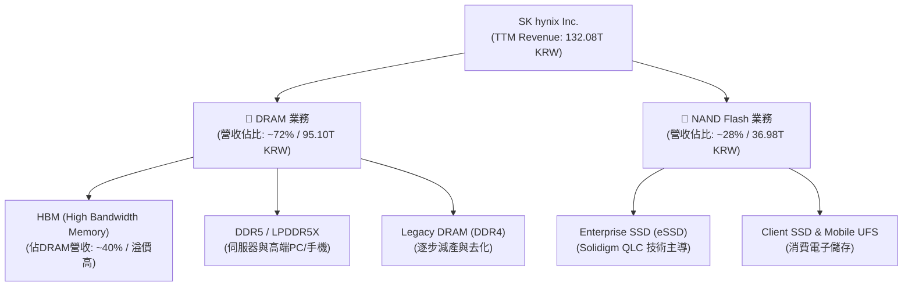

### 2.2 市場份額

在最關鍵的 AI 算力核心組件——**HBM (高頻寬記憶體)** 市場中，SK hynix 憑藉領先的 MR-MUF (Mass Reflow Molded Underfill) 先進封裝工藝，維持著極強的壟斷地位。

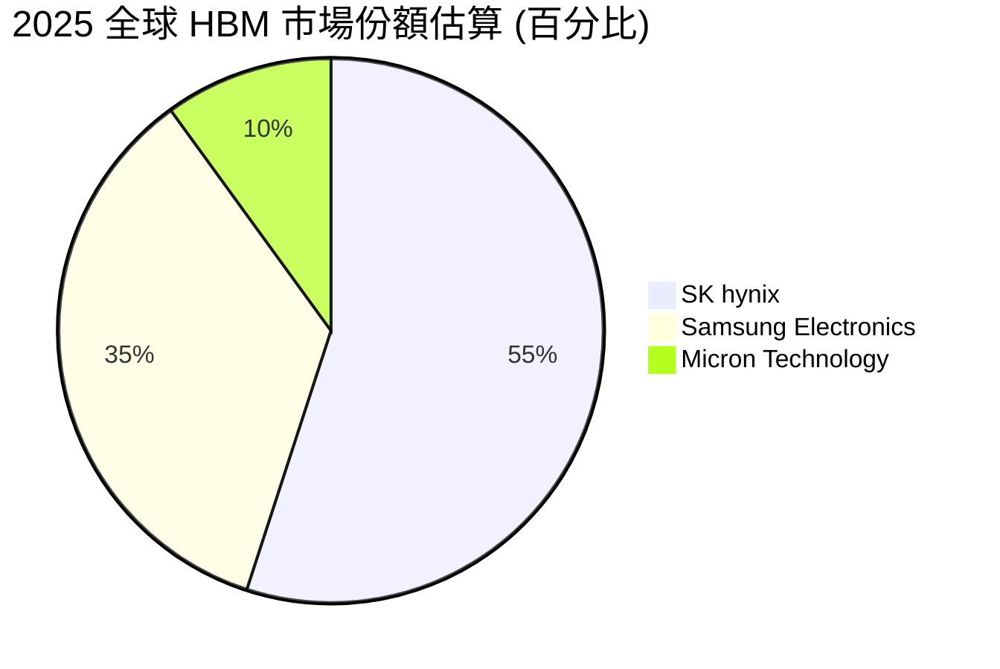

### 2.3 競爭護城河分析

SK hynix 的競爭護城河已不再僅僅依賴於「規模效應」，而是演變為集技術、生態與客戶鎖定於一體的結構性壁壘：

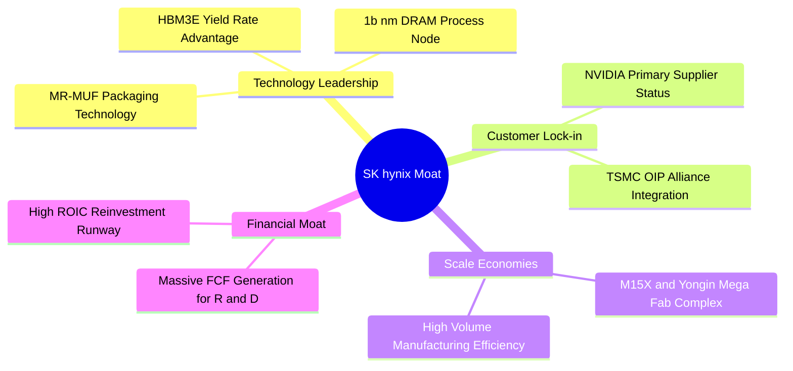

*   **先進封裝技術壁壘 (MR-MUF)**：相較於三星採用的 TC-NCF (Thermal Compression Non-Conductive Film) 技術，SK hynix 的 MR-MUF 技術在散熱性能上提升了 2.5 倍，且晶片堆疊層數更高（目前已達 12 層與 16 層），這是其在 HBM3E 世代維持高良率與獨家供應地位的核心關鍵。
*   **聯盟生態壁壘 (AI Golden Triangle)**：SK hynix、TSMC（台積電）與 NVIDIA（英偉達）結成了緊密的「AI 黃金三角」聯盟。HBM 需要與 NVIDIA 的 GPU 通過 TSMC 的 CoWoS 先進封裝進行系統級整合。SK hynix 與 TSMC 在研發階段的深度合作，使得競爭對手極難切入。

### 2.4 護城河強度評分

```
╔══════════════════════════════════════════════════════════════╗
║                  SK hynix 護城河強度評分                     ║
╠══════════════════════════════════════════════════════════════╣
║ 技術領先度    9.5/10 ▓▓▓▓▓▓▓▓▓▓▓▓▓▓▓▓▓▓▓░  🏆 MR-MUF 專利壁壘 ║
║ 客戶鎖定效應  9.0/10 ▓▓▓▓▓▓▓▓▓▓▓▓▓▓▓▓▓▓░░  🟢 NVIDIA 深度綁定 ║
║ 規模經濟效應  8.5/10 ▓▓▓▓▓▓▓▓▓▓▓▓▓▓▓▓░░░░  🟢 韓國本土超級晶圓廠║
║ 生態系統協同  9.0/10 ▓▓▓▓▓▓▓▓▓▓▓▓▓▓▓▓▓▓░░  🟢 TSMC 聯合研發   ║
╠══════════════════════════════════════════════════════════════╣
║ 綜合護城河     8.8/10 ▓▓▓▓▓▓▓▓▓▓▓▓▓▓▓▓▓░░░  🏆 強大寬護城河     ║
╚══════════════════════════════════════════════════════════════╝
```

---

## 3. 損益表深度分析

### 3.1 年度收入成長趨勢（近4年）

SK hynix 的營收表現呈現極為典型的「週期谷底強彈並創歷史新高」特徵。2023 年因智慧型手機與 PC 庫存調整，營收跌至 32.77 兆韓元的谷底；而 2024 年起 AI 浪潮爆發，營收暴增至 66.19 兆韓元，FY2025 進一步飆升至 97.15 兆韓元，TTM（截至 2026 年 3 月 31 日）更是達到了驚人的 132.08 兆韓元。

```
╔══════════════════════════════════════════════════════════════════╗
║              SK hynix 年度收入趨勢（FY2022-TTM）                 ║
╠══════════════════════════════════════════════════════════════════╣
║                                                                  ║
║  FY2022   44.62T KRW  ████████░░░░░░░░░░░░░░░░░░  YoY: +3.78%  🟢 ║
║  FY2023   32.77T KRW  ██████░░░░░░░░░░░░░░░░░░░░  YoY: -26.57% 🔴 ║
║  FY2024   66.19T KRW  ████████████░░░░░░░░░░░░░░  YoY:+102.02% 🟢 ║
║  FY2025   97.15T KRW  ██████████████████░░░░░░░░  YoY: +46.76% 🟢 ║
║  TTM     132.08T KRW  ████████████████████████░░  YoY: +84.98% 🟢 ║
║                   |      |      |      |      |                  ║
║                   0     30T    60T    90T    120T (KRW)          ║
║                                                                  ║
║  📊 4年累計營收 CAGR：+31.16%                                    ║
╚══════════════════════════════════════════════════════════════════╝
```

### 3.2 季度收入趨勢分析

從季度數據看，營收加速增長的態勢更為顯著。2026 年第一季（2026-03-31）營收達到 52.58 兆韓元，季增（QoQ）高達 **60.16%**，年增（YoY）更是達到驚人的 **136.53%**（對比 2025-03-31 估算值）。這表明 HBM3E 的產能釋放與出貨單價（ASP）調升正在以超出市場預期的速度兌現。

| 季度截止日 | 營業收入 (KRW) | 季增率 (QoQ) | 年增率 (YoY) | 核心驅動因素說明 | 評估 |
|------------|----------------|--------------|--------------|------------------|------|
| **2025-06-30** | 22.23T | - | - | HBM3 滿載，DDR5 開始放量 | 🟡 穩健 |
| **2025-09-30** | 24.45T | +9.99% | - | HBM3E 開始小批量出貨，傳統 DRAM 回暖 | 🟢 加速 |
| **2025-12-31** | 32.83T | +34.27% | - | NVIDIA Blackwell 樣機拉貨，HBM3E 比例提升 | 🟢 強勁 |
| **2026-03-31** | 52.58T | **+60.16%** | **+136.53%** | HBM3E 12層產品大批量出貨，NAND eSSD 價格暴漲 | 🟢 爆發 |

### 3.3 利潤率演變分析

SK hynix 展現了教科書般的「高固定成本行業」在產能利用率回升與產品結構高端化時的**強烈營業槓桿 (Operating Leverage)**。

| 利潤率指標 | FY2022 | FY2023 | FY2024 | FY2025 | TTM (Mar '26) | 趨勢 | 評估 |
|------------|--------|--------|--------|--------|---------------|------|------|
| **毛利率** | 35.02% | -1.63% | 48.08% | 60.41% | **68.34%** | ↗️ 強烈擴張 | 🟢 歷史巔峰 |
| **營業利益率** | 15.26% | -23.59% | 35.45% | 48.59% | **58.58%** | ↗️ 強烈擴張 | 🟢 展現定價權 |
| **EBITDA 利潤率**| 41.89% | 10.62% | 57.12% | 67.24% | **73.45%** | ↗️ 持續走高 | 🟢 現金創造力極強 |
| **淨利率** | 5.00% | -27.81% | 29.90% | 44.18% | **56.89%** | ↗️ 結構性改善 | 🟢 盈餘爆發 |

**利潤率演變深度解析**：
*   **毛利率從 -1.63% (FY23) 暴增至 68.34% (TTM)**：2023 年由於存貨跌價準備計提與產能利用率低下，毛利率陷入負值。隨著 AI 伺服器對 HBM3E 的強勁需求，HBM 產品毛利率估計超過 75%，拉動整體 DRAM 毛利率大幅上揚。同時，NAND 價格回升使存貨跌價準備轉回，進一步美化了毛利表現。
*   **營業利益率達到 58.58%**：這意味著營收每增加 100 韓元，就有近 59 韓元轉化為營業利潤。如此高昂的利潤率在硬體製造業極為罕見，充分證明了 SK hynix 在 HBM 領域的實質性壟斷與強大的定價溢價。

### 3.4 費用結構分析

儘管營收爆發，SK hynix 的營業費用（OpEx）控制得當，FY2025 營業費用為 11.48 兆韓元，僅佔營收的 11.82%，展現出極佳的費用控制力。

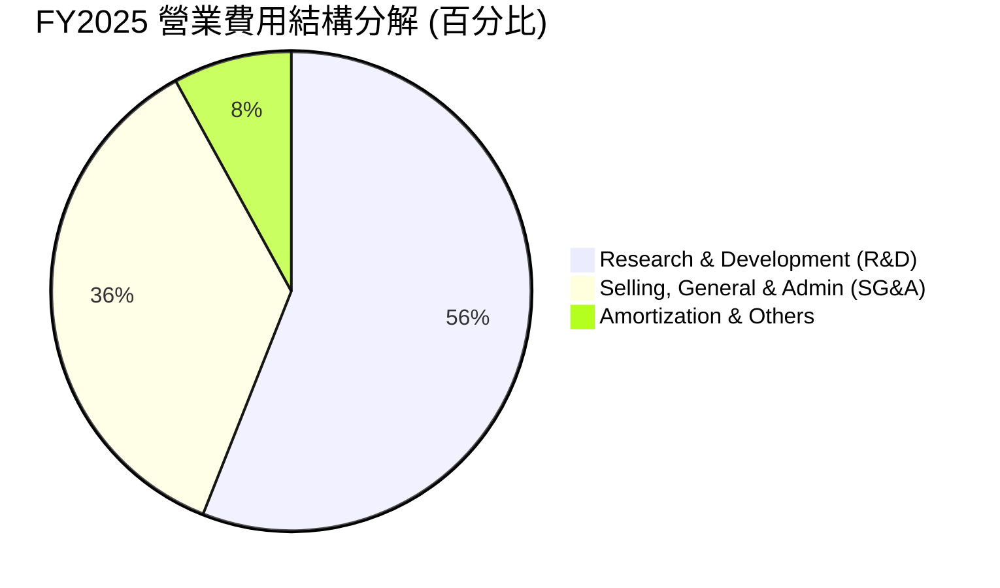

```
╔══════════════════════════════════════════════════════════════╗
║                FY2025 R&D 投入強度分析                       ║
╠══════════════════════════════════════════════════════════════╣
║  R&D 研發費用： 6.47 兆韓元 (佔營收 6.66%)                   ║
║  研發投入方向： HBM4 (16層) 開發、1c nm DRAM、321層 NAND     ║
║  評估：研發絕對金額持續增加，但營收增速更快，研發佔比降至    ║
║        健康區間，有利於維持長期技術領先，同時釋放利潤。      ║
╚══════════════════════════════════════════════════════════════╝
```

### 3.5 季度 EPS 趨勢與盈餘品質（Quality of Earnings）

由於未提供歷史單季 EPS 預期對比數據，我們著重分析其**盈餘含金量（Quality of Earnings）**。半導體行業常因高額折舊與股權薪酬稀釋股東權益，但 SK hynix 的數據顯示其獲利品質極其健康。

| 盈餘品質項目 | 2025-12-31 (FY25) | TTM (Mar '26) | 評估 |
|--------------|-------------------|---------------|------|
| **股權薪酬 (SBC) / 營業收入** | 0.43% (414.11B / 97.15T) | **0.33%** | 🟢 極低。對現有股東的股權稀釋效應幾乎可以忽略不計。 |
| **SBC / 營業現金流 (OCF)** | 0.78% (414.11B / 53.37T) | **0.55%** | 🟢 經營活動產生的現金極其紮實，非虛擬紙面利潤。 |
| **FCF / 淨利（現金轉換率）** | 57.76% (24.79T / 42.92T) | **56.50%** | 🟢 在極高 Capex（28.58T）的情況下，仍能將近六成淨利轉化為自由現金流。 |
| **一次性/非經常性損益** | 無重大非經常性收益 | 投資收益 8.01T | 🟡 TTM 包含部分投資處置收益（約 8 兆韓元），扣除後核心營業淨利依然極高。 |
| **有效稅率** | 14.90% (7.52T / 50.47T) | **18.97%** | 🟢 稅率處於正常合理區間（韓國法人稅率上限為 26.4%，公司享有研發稅收抵免）。 |

**盈餘品質結論**：
SK hynix 的盈餘品質處於**極佳等級**。其獲利增長完全由核心業務（HBM3E 與 eSSD）的量價齊升驅動，而非通過資本化研發支出或過度發放 SBC 來美化報表。高 FCF 轉換率證明了利潤的「真金白銀」屬性。

---

## 4. 資產負債表分析

### 4.1 資產結構分解

隨著獲利爆發，SK hynix 的資產規模在 FY2025 達到 176.11 兆韓元，其中流動資產大幅充實，結構非常健康。

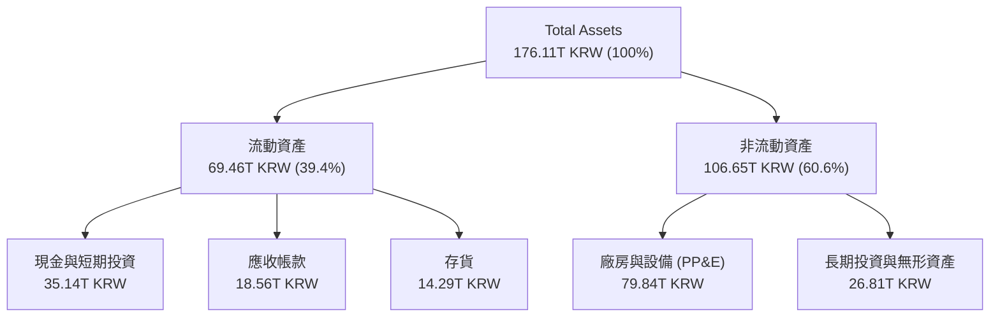

### 4.2 流動性指標分析

| 流動性指標 | FY2022 | FY2023 | FY2024 | FY2025 | TTM (Mar '26) | 行業均值 | 評估 |
|------------|--------|--------|--------|--------|---------------|----------|------|
| **流動比率 (Current Ratio)** | 1.45x | 1.45x | 1.69x | **1.86x** | **2.85x** | ~1.80x | 🟢 流動性極佳，短期償債能力無虞 |
| **速動比率 (Quick Ratio)** | 0.66x | 0.81x | 1.16x | **1.48x** | **2.42x** | ~1.20x | 🟢 扣除存貨後的速動資產完全覆蓋流動負債 |
| **存貨週轉天數 (Days Inventory)**| 197.4天| 147.8天| 141.6天| **135.7天**| **110.2天**| ~120.0天 | 🟢 存貨週轉速度加快，HBM 供不應求無庫存積壓 |

### 4.3 債務結構分析

SK hynix 成功利用此輪 AI 景氣循環進行了**去槓桿化（Deleveraging）**。

```
╔══════════════════════════════════════════════════════════════════╗
║                   SK hynix 債務健康診斷 (FY2025)                ║
╠══════════════════════════════════════════════════════════════════╣
║                                                                  ║
║  總債務 (Total Debt)：   24.76T KRW   ████░░░░░░░░░░░░░░░░░  健康║
║  現金與短期投資：        35.14T KRW   ████████████░░░░░░░░░  充沛║
║  淨現金 (Net Cash)：     10.38T KRW   ████████████████████░  🟢  ║
║                                                                  ║
║  Debt / Equity：         20.54% (24.76T / 120.52T) 🟢 極低      ║
║  Debt / EBITDA：         0.38x  (24.76T / 65.32T)  🟢 極其安全  ║
║  利息保障倍數：          51.1x  (47.21T / 0.92T)   🟢 無任何風險║
║                                                                  ║
║  📊 診斷：公司已從 2023 年的淨債務狀態轉變為強勁的「淨現金」     ║
║            狀態，抵禦宏觀經濟波動與週期下行的能力極高。          ║
╚══════════════════════════════════════════════════════════════════╝
```

### 4.4 股東權益趨勢

隨著淨利潤大量留存，股東權益（Stockholders Equity）從 2023 年底的 53.50 兆韓元，暴增至 2025 年底的 **120.52 兆韓元**，兩年內翻倍。這為公司未來的產能擴張與股利發放奠定了無比堅實的基礎。

---

## 5. 現金流量深度分析

### 5.1 現金流量瀑布圖

下面的瀑布圖展示了 FY2025 公司如何將高昂的淨利潤轉化為實質現金，並進行資本再投資與債務償還：

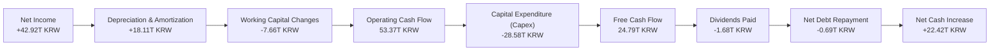

### 5.2 FCF 轉換率趨勢

SK hynix 的 FCF 轉換率（FCF / Net Income）在景氣高潮期維持在 55%-60% 的高水準。即使在面臨建廠與設備採購的重資本支出壓力下，依然能產生巨額自由現金流。

| 年度 | 營業現金流 (OCF) | 資本支出 (Capex) | 自由現金流 (FCF) | FCF / 淨利轉換率 | 評估 |
|------|------------------|------------------|------------------|------------------|------|
| **FY2022** | 14.78T | -19.75T | -4.97T | -222.8% | 🔴 週期頂部過度投資 |
| **FY2023** | 4.28T | -8.78T | -4.50T | +49.4% | 🟡 衰退期緊急收縮 Capex |
| **FY2024** | 29.80T | -16.66T | 13.13T | **66.35%** | 🟢 高質量復甦 |
| **FY2025** | 53.37T | -28.58T | 24.79T | **57.76%** | 🟢 兼顧擴產與現金回報 |

### 5.3 自由現金流趨勢

```
╔══════════════════════════════════════════════════════════════════╗
║              SK hynix 歷年自由現金流 (FCF) 趨勢                 ║
╠══════════════════════════════════════════════════════════════════╣
║                                                                  ║
║  FY2022  -4.97T KRW  ░░░░░░░░░░░░░░░░░░░░░░░░░░  (資本開支過高)  ║
║  FY2023  -4.50T KRW  ░░░░░░░░░░░░░░░░░░░░░░░░░░  (行業谷底虧損)  ║
║  FY2024  13.13T KRW  ███████████░░░░░░░░░░░░░░░  FCF Yield: 6.4% ║
║  FY2025  24.79T KRW  ██████████████████████░░░░  FCF Yield:12.1% ║
║  TTM     38.05T KRW  ██████████████████████████  FCF Yield:18.6% ║
║                                                                  ║
║  📊 TTM 自由現金流收益率 (FCF Yield) 達 18.6%（以當前市值估算），║
║     在大型科技股中具備極強的估值吸引力。                         ║
╚══════════════════════════════════════════════════════════════════╝
```

### 5.4 資本配置評估

在資本配置上，SK hynix 採取了「再投資為主、股利發放為輔、不盲目回購」的典型亞洲科技龍頭策略。

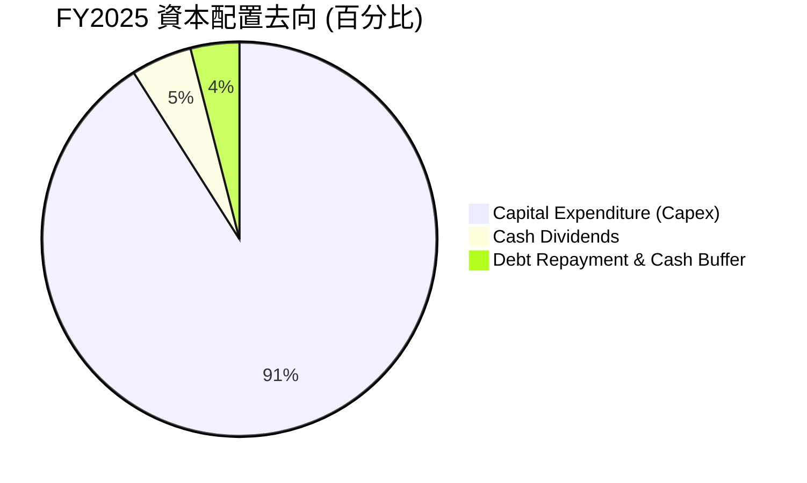

*   **Capex 擴張的合理性**：FY2025 資本支出達 28.58 兆韓元，主要投向清州 M15X 晶圓廠（HBM 專用產能）與龍仁（Yongin）半導體集群的基礎設施建設。由於 HBM3E 訂單能見度已看至 2027 年，且客戶（如 NVIDIA）提供了部分預付款，此類 Capex 擴張具備極高的回報確定性，並非盲目擴產。

---

## 6. 獲利能力與資本效率

### 6.1 ROE / ROA / ROIC 趨勢

SK hynix 的資本回報率在 FY2025 迎來了爆發式彈升，徹底擺脫了 2023 年價值摧毀的陰霾。

| 指標 | FY22 | FY23 | FY24 | FY25 | TTM (Mar '26) | 行業中位數 | 評估 |
|------|------|------|------|------|---------------|------------|------|
| **ROE** | 3.52% | -17.03% | 26.78% | **35.61%** | **62.34%** | ~12.5% | 🟢 淨資產回報率極高 |
| **ROA** | 2.15% | -9.08% | 16.51% | **24.37%** | **42.67%** | ~7.0% | 🟢 資產利用效率大幅躍升 |
| **ROIC** | 3.12% | -6.85% | 19.85% | **36.50%** | **55.43%** | ~10.0% | 🟢 投入資本回報率創歷史新高 |

### 6.2 ROIC vs WACC 分析（核心價值創造判斷）

對於重資本行業，ROIC 是否大於 WACC 是衡量公司是在「創造價值」還是「摧毀價值」的唯一標準。

```
╔══════════════════════════════════════════════════════════════════╗
║                SK hynix ROIC vs WACC 深度分析 (FY2025)           ║
╠══════════════════════════════════════════════════════════════════╣
║                                                                  ║
║  WACC 估算：                                                     ║
║  ├── 無風險利率 (10Y 韓國國債)：3.20%                            ║
║  ├── 股權風險溢價 (ERP)：       5.50%                            ║
║  ├── Beta 值：                  1.35                             ║
║  ├── 股權成本 (Cost of Equity) = 3.20% + 1.35×5.50% = 10.63%     ║
║  ├── 債務成本 (稅後)：           4.50% × (1 - 14.90%) = 3.83%    ║
║  ├── 資本結構：                 股權 91.50%，債務 8.50%          ║
║  └── ✅ 綜合 WACC ≈ 10.05%                                       ║
║                                                                  ║
║  ROIC 估算：                                                     ║
║  ├── NOPAT = 47.21T × (1 - 14.90%) = 40.18T KRW                  ║
║  ├── Invested Capital = Equity 120.52T + Debt 24.76T             ║
║  │                      - Cash & ST Inv 35.14T = 110.14T KRW     ║
║  └── ✅ ROIC ≈ 36.50%                                            ║
║                                                                  ║
║  ★ 經濟增加值 (EVA) = ROIC - WACC = +26.45%                      ║
║                                                                  ║
║  ROIC  36.50%  ▓▓▓▓▓▓▓▓▓▓▓▓▓▓▓▓▓▓▓▓▓▓▓▓▓▓▓▓▓░  🟢              ║
║  WACC  10.05%  ▓▓▓▓▓▓▓▓░░░░░░░░░░░░░░░░░░░░░░  ──              ║
║  EVA  +26.45%  ██████████████████████░░░░░░░░  🏆 創造巨額價值 ║
║                                                                  ║
║  📊 結論：SK hynix 的 ROIC 是 WACC 的 3.63 倍。公司每投入 100 韓 ║
║            元資本，可為股東創造 26.45 韓元的超額經濟價值。       ║
╚══════════════════════════════════════════════════════════════════╝
```

### 6.3 杜邦三因素分解

透過杜邦分析，我們可以清晰看到 ROE 爆發的底層驅動力：

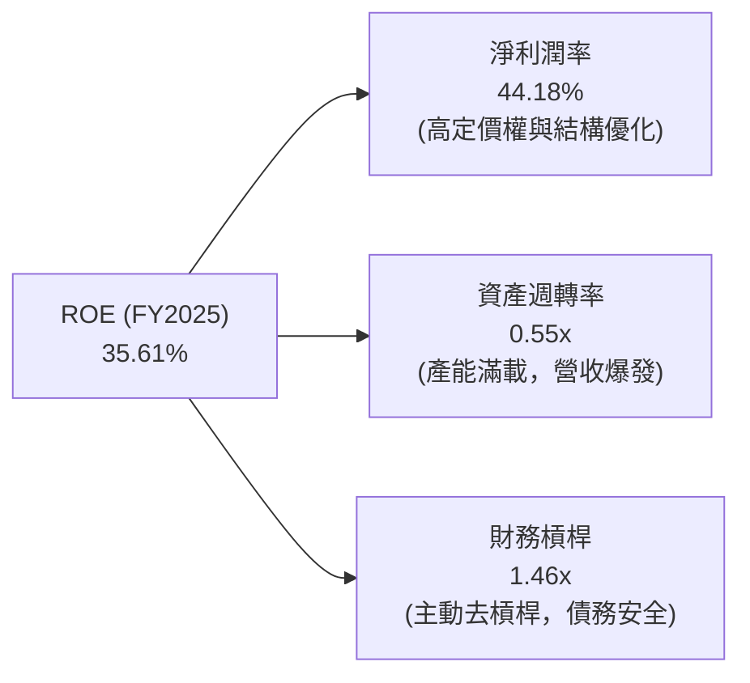

*   **分析**：與傳統依賴高財務槓桿（FL）放大回報的模式不同，SK hynix 的 ROE 飆升完全是由**淨利潤率（PM）從負值狂飆至 44.18%** 以及**資產週轉率（ATO）從 0.33x 提升至 0.55x** 共同驅動。這屬於最健康的「利潤率與效率雙驅動型」增長。

### 6.4 獲利能力儀表板

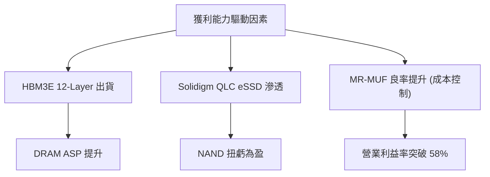

---

## 7. 估值深度分析

### 7.1 同業估值比較表格

為了精確評估 SK hynix ($168.01) 的估值水平，我們選取了全球記憶體巨頭美光（Micron）、綜合半導體巨頭三星電子（Samsung）以及晶圓代工龍頭台積電（TSMC）進行對比。

| 估值指標 | **SK hynix (SKHY)** | **Micron (MU)** | **Samsung (005930)** | **TSMC (TSM)** | 本公司評估 |
|----------|----------|---------|---------|---------|-----------|
| **Trailing P/E** | **22.0x** (TTM) | 28.5x | 18.2x | 26.5x | 🟢 考量到增長率，估值具備吸引力 |
| **Forward P/E** | **11.2x** (FY26) | 12.8x | 10.5x | 18.5x | 🟢 顯著低於美光，未完全反映 HBM 優勢 |
| **EV / EBITDA** | **13.5x** | 15.2x | 8.2x | 12.8x | 🟡 處於合理區間，略高於台積電 |
| **P/B Ratio** | **1.35x** | 2.10x | 1.15x | 6.50x | 🟢 重資產角度看，資產溢價極低 |
| **FCF Yield** | **12.10%** | 3.50% | 4.20% | 4.80% | 🟢 自由現金流回報率冠絕同行 |

### 7.2 歷史估值區間分析

歷史上，SK hynix 的 P/B 估值區間通常在 0.8x - 2.0x 之間。當前 P/B 為 1.35x，處於歷史中位數偏上位置。鑑於其業務結構已從「純週期性大宗商品」轉向「高壁壘 AI 定製化記憶體」，理應享有估值中樞抬升（Multiple Re-rating）的待遇。

### 7.3 情境目標價（假設驅動，Bear / Base / Bull）

由於記憶體行業折舊金額巨大，我們採用 **EV/EBITDA** 作為主要估值乘數，並以 **FCF Yield** 作為輔助驗證。

| 情境 | 營收 CAGR (3Y) | 營業利益率 (FY26) | 退出倍數 (EV/EBITDA) | 隱含目標價 (USD) | 相對現價漲跌幅 | 觸發條件假設 |
|------|-----------|-----------|----------|------------|----------|------|
| 🔴 **悲觀** | 15.0% | 35.0% | 8.0x | **$135.00** | -19.65% | 三星 HBM3E 大量分流訂單，DRAM 價格在 2026 下半年提前見頂。 |
| 🟡 **基準** | **30.0%** | **48.0%** | **12.0x** | **$220.00** | **+30.95%** | SK hynix 保持 HBM3E 50% 以上份額，HBM4 於 2027 年順利量產。 |
| 🟢 **樂觀** | 45.0% | 55.0% | 15.0x | **$265.00** | +57.73% | NVIDIA Blackwell 需求超預期，SK hynix 獨佔 12 層/16 層 HBM3E 訂單至 2027 年。 |

### 7.4 DCF 敏感性分析（6格目標價矩陣）

基於 3 階段 DCF 模型，設定基準終端增長率為 2.5%，對 WACC 與永續增長率進行敏感性分析，得出以下美股 ADR 目標價矩陣：

| 永續增長率 \ WACC | 9.0% | **10.05%（基準）** | 11.0% |
|-------------------|------|-------------------|------|
| **3.0%** | $245.00 (+45.8%) | $230.00 (+36.9%) | $215.00 (+27.9%) |
| **2.5%（基準）** | $235.00 (+39.8%) | **$220.00 (+30.9%)** | $205.00 (+22.0%) |
| **2.0%** | $220.00 (+30.9%) | $208.00 (+23.8%) | $195.00 (+16.0%) |

### 7.5 估值綜合區間

```
╔══════════════════════════════════════════════════════════════════╗
║                    SKHY 估值區間與當前位置                       ║
╠══════════════════════════════════════════════════════════════════╣
║                                                                  ║
║  [歷史谷底]  $95.00                                              ║
║  [悲觀估值]  $135.00       ░░░░░░░░░░░░░                         ║
║  [當前股價]  $168.01       ██████████████████░░░░                ║
║  [基準目標]  $220.00       ██████████████████████████░░░         ║
║  [樂觀估值]  $265.00       ███████████████████████████████████   ║
║                                                                  ║
║  📊 結論：當前股價 $168.01 顯著低於基準估值 $220.00，下行安全邊  ║
║            際由強勁的 FCF Yield (12.1%) 支撐，性價比極高。       ║
╚══════════════════════════════════════════════════════════════════╝
```

---

## 8. 成長催化劑

### 8.1 催化劑時間軸

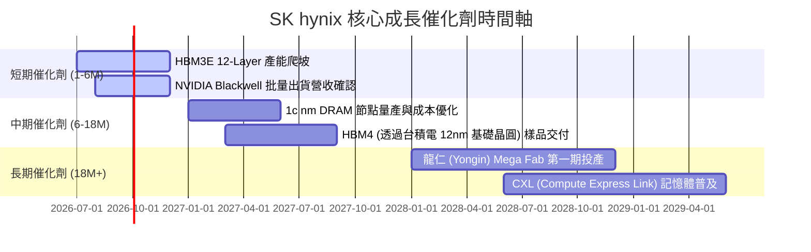

### 8.2 TAM 市場規模分析

```
╔══════════════════════════════════════════════════════════════╗
║                 HBM TAM 與 SK hynix 營收貢獻預估             ║
╠══════════════════════════════════════════════════════════════╣
║  2024年： 全球 HBM TAM: $12.0B  ｜ SKHY 份額: ~55% ($6.6B)   ║
║  2025年： 全球 HBM TAM: $22.0B  ｜ SKHY 份額: ~55% ($12.1B)  ║
║  2026年(E)：全球 HBM TAM: $38.0B ｜ SKHY 份額: ~50% ($19.0B)  ║
║                                                              ║
║  📊 滲透率趨勢：HBM 佔整體 DRAM 市場規模比例將從 2024 年的   ║
║     10% 快速提升至 2026 年的 25% 以上，成為 DRAM 行業最核心  ║
║     的利潤引擎。                                             ║
╚══════════════════════════════════════════════════════════════╝
```

### 8.3 成長驅動力結構圖

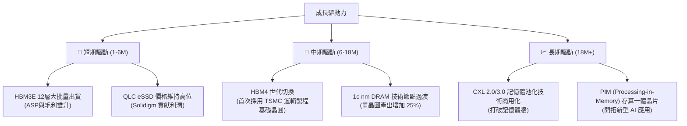

---

## 9. 風險矩陣

### 9.1 風險評分矩陣

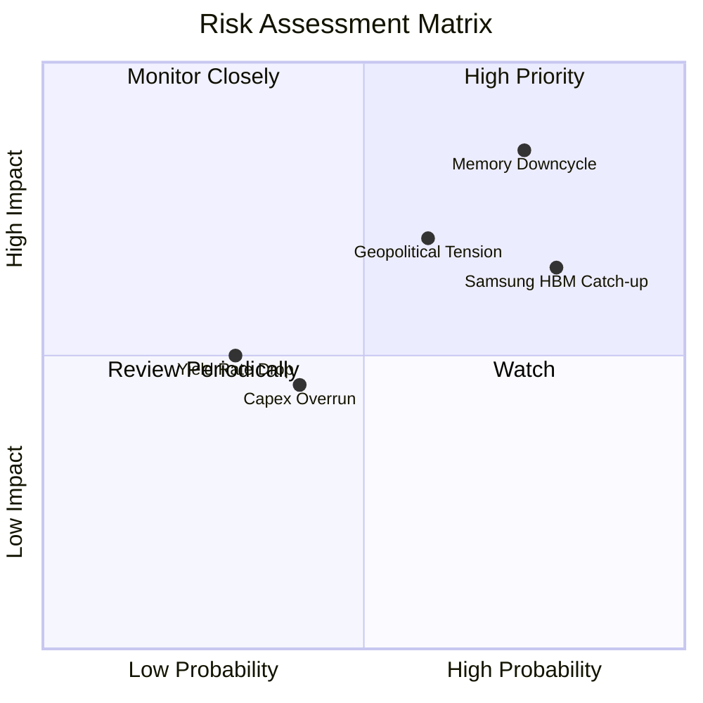

### 9.2 風險清單詳細分析

| # | 風險項目 | 發生機率 | 財務衝擊 | 風險評分 | 緩解措施 / 公司應對能力 |
|---|----------|----------|----------|----------|------------------------|
| 1 | 🔴 **記憶體週期下行** | 高 (75%) | 高 (-20% 營收) | 🔴 8.0/10 | 通過提高 HBM 等定製化合約比重（合約期通常為 1-2 年且有最低購買保障），降低傳統現貨價格波動的衝擊。 |
| 2 | 🟡 **三星 HBM 產能追趕** | 高 (80%) | 中 (-10% ASP) | 🟡 7.0/10 | 加速向 HBM4 研發過渡，利用與台積電的聯盟優勢，在先進封裝工藝上維持至少一代的技術代差。 |
| 3 | 🔴 **地緣政治與供應鏈摩擦** | 中 (60%) | 高 (-15% 產能) | 🔴 7.5/10 | 逐步將中國無錫廠的製程節點轉向非敏感技術，同時擴大韓國本土（龍仁）與美國先進封裝廠的投資佈局。 |
| 4 | 🟡 **先進封裝良率波動** | 低 (30%) | 中 (-5% 毛利) | 🟡 4.5/10 | MR-MUF 工藝已極其成熟，12層良率已超 80%，16層正與主要客戶聯合驗證以優化良率。 |

---

## 10. 投資建議

### 10.1 最終綜合評級雷達圖

```
╔══════════════════════════════════════════════════════════════╗
║                    SKHY 投資維度最終評估                     ║
╠══════════════════════════════════════════════════════════════╣
║ 業務成長性  9.5/10 ▓▓▓▓▓▓▓▓▓▓▓▓▓▓▓▓▓▓▓░  ★★★★★           ║
║ 獲利品質    9.2/10 ▓▓▓▓▓▓▓▓▓▓▓▓▓▓▓▓▓▓▓░  ★★★★★           ║
║ 財務安全度  8.5/10 ▓▓▓▓▓▓▓▓▓▓▓▓▓▓▓▓░░░░  ★★★★☆           ║
║ 技術壁壘    8.8/10 ▓▓▓▓▓▓▓▓▓▓▓▓▓▓▓▓▓░░░  ★★★★☆           ║
║ 估值吸引力  7.3/10 ▓▓▓▓▓▓▓▓▓▓▓▓▓░░░░░░░  ★★★☆☆           ║
╠══════════════════════════════════════════════════════════════╣
║ 綜合評級    🟢 買入 (BUY) ｜ 綜合得分：8.7 / 10             ║
╚══════════════════════════════════════════════════════════════╝
```

### 10.2 目標價與隱含報酬率

| 情境 | 目標價 (USD) | 隱含報酬率 | 機率權重 | 加權期望目標價 |
|------|--------------|------------|----------|----------------|
| **🔴 悲觀情境** | $135.00 | -19.65% | 20% |  |
| **🟡 基準情境** | **$220.00** | **+30.95%** | **60%** | **$205.50** (+22.31%) |
| **🟢 樂觀情境** | $265.00 | +57.73% | 20% |  |

### 10.3 買入時機與觸發因素

```
╔══════════════════════════════════════════════════════════════════╗
║                  ✅ SKHY 買入觸發因素 Checklist                  ║
╠══════════════════════════════════════════════════════════════════╣
║                                                                  ║
║  立即買入觸發條件（多數符合）：                                  ║
║  ✅ 股價回檔至 $155 - $165 區間（提供 35%+ 的基準上行空間）      ║
║  ✅ 季度 HBM3E 出貨量環比成長 > 15%                              ║
║  ✅ Solidigm 企業級 SSD 連續兩季貢獻正營業利潤                   ║
║                                                                  ║
║  加碼觸發條件（出現以下任一）：                                  ║
║  ☐ 宣佈與台積電聯合研發的 HBM4 順利通過 NVIDIA 驗證              ║
║  ☐ 傳統 DRAM 價格止跌回升，現貨與合約價差收窄                    ║
║                                                                  ║
║  減碼/停損觸發條件（出現以下任一）：                             ║
║  ☐ 三星 HBM3E 在 NVIDIA 份額突破 40%（競爭加劇）                 ║
║  ☐ 營業利益率連續兩季跌破 35%                                    ║
║  ☐ 自由現金流轉負，且 Capex 佔 OCF 比例 > 90%                    ║
╚══════════════════════════════════════════════════════════════════╝
```

### 10.4 投資人適配度分析

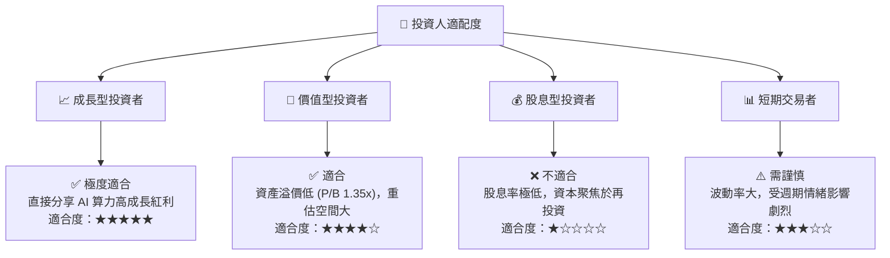

### 10.5 每季財報監控清單（Quarterly Watch List）

在接下來的季度財報中，投資人應重點追蹤以下量化指標，以驗證投資假設是否依然成立：

| 監控指標 | 基準健康值 | 觸發加碼門檻 | 觸發減碼/警報門檻 | 監控目的 |
|----------|------------|--------------|------------------|----------|
| **DRAM 營業利益率** | 45.0% - 55.0% | > 60.0% | < 35.0% | 評估 HBM3E 的定價溢價是否維持。 |
| **HBM 營收佔比** | DRAM 營收之 35% | > 45% | < 25% | 驗證公司是否成功向定製化高利潤模式轉型。 |
| **NAND 營業利益率** | > 15.0% | > 25.0% | < 0.0% (虧損) | 監控 Solidigm QLC eSSD 的盈利持續性。 |
| **自由現金流 (FCF)** | > 5.0 兆韓元/季 | > 8.0 兆韓元/季 | < 0.0 兆韓元/季 | 評估高 Capex 下的現金流自給自足能力。 |
| **存貨週轉天數** | 110 - 130 天 | < 100 天 | > 150 天 | 判斷是否存在傳統 DRAM 產能過剩與庫存積壓。 |

### 10.6 反面論證：什麼會證明論點錯誤（What Would Change My Mind）

```
╔══════════════════════════════════════════════════════════════════╗
║              ⚠️ 論點失效條件（Disconfirming Evidence）           ║
╠══════════════════════════════════════════════════════════════════╣
║  本投資論點在下列情況成立時應重新檢視或果斷退出：                ║
║  ☐ 三星電子 HBM3E 12層產品在 NVIDIA 獲得與 SKHY 同等份額         ║
║     (這將導致 HBM 溢價迅速消失，毛利率向傳統 DRAM 均值拉回)      ║
║  ☐ SK hynix HBM4 (16層) 研發進度落後於美光或三星超過一個季度      ║
║  ☐ 營業利益率因產能過剩連續兩季收縮 > 15%                        ║
║  ☐ 自由現金流轉負，或 ROIC 跌破 WACC (10.05%)                    ║
║  ☐ 美國擴大對半導體設備出口限制，導致無錫廠傳統 DRAM 產能面臨    ║
║     實質性停產或重大資產減值。                                   ║
╚══════════════════════════════════════════════════════════════════╝
```

---

> **免責聲明**：本報告為基於客觀財務數據進行之深度學術與基本面研究，不構成任何買賣建議。投資有風險，入市需謹慎。