# SKHY 基本面深度分析報告

> **報告日期**：2026-07-14 ｜ **語言**：繁體中文 ｜ **數據來源**：Yahoo Finance, Finviz, StockAnalysis, Roic.ai ｜ **分析師**：CFA 級機構研究
> **貨幣說明**：本報告中所有帶有 "T" (Trillion) 與 "B" (Billion) 符號之財務數據，除特別註明外，均代表**韓元 (KRW)** 之兆與十億單位（係因 SK hynix 官方本幣申報格式），股價與市值則以美元 ($) 呈現，以利美股市場投資人進行跨國資產配置對比。

---

## 目錄

| # | 章節 | 核心結論 |
|---|------|----------|
| 1 | **執行摘要** | 評級：🟢 買入 ｜ 目標價區間：$138.00 ~ $205.00 ｜ HBM 絕對優勢確立 |
| 2 | **公司概覽與商業模式** | AI 記憶體（HBM）全球領先者，具備高技術壁壘與獨佔溢價 |
| 3 | **損益表深度分析** | TTM 營收年增 84.98%，營業利益率衝上 48.59%，獲利結構顯著改善 |
| 4 | **資產負債表分析** | 淨現金流動性大幅改善，債務結構健康（Debt/EBITDA 僅 0.38x） |
| 5 | **現金流量深度分析** | FY2025 自由現金流達 24.79T 創歷史新高，資本配置效率優化 |
| 6 | **獲利能力與資本效率** | ROIC 飆升至 30.82%，遠超 WACC（9.78%），強力創造股東價值 |
| 7 | **估值深度分析** | 基準情境目標價 $178.00，隱含 15.95% 上行空間，EV/EBITDA 具吸引力 |
| 8 | **成長催化劑** | HBM3E/HBM4 世代交替與企業級 SSD（eSSD）需求爆發 |
| 9 | **風險矩陣** | 記憶體週期下行、地緣政治合規風險與資本支出過度之產能過剩 |
| 10 | **投資建議** | 買入評級，建議於 $150 以下分批佈局，長線追蹤 HBM 出貨佔比 |

---

## 1. 執行摘要

### 1.0 一頁式投資儀表板（Portfolio Manager 30 秒速讀）

| 項目 | 內容 |
|------|------|
| **投資論點（3 句）** | ① SKHY 憑藉 HBM3E 的獨家/先發供應地位，在 AI 伺服器記憶體市場取得超過 50% 的絕對份額。<br/>② FY2025 營收達 97.15T（年增 46.76%），TTM 營收更爆發至 132.08T，主因 AI 需求驅動高毛利產品出貨。<br/>③ 資本回報率（ROIC）高達 30.82%，顯著高於其 9.78% 的 WACC，扭轉了 2023 年週期低谷的價值毀滅狀態。 |
| **護城河評分** | **8.5 / 10** 🟢 （技術領先與高轉換成本） |
| **管理層/資本配置評分** | **8.0 / 10** 🟢 （Capex 紀律性提升，FCF 轉換率達 57.75%） |
| **財務健康** | **🟢 強健** ｜ 淨債務降至 9.84T，利息保障倍數大幅回升至 50x 以上 |
| **ROIC vs WACC** | **30.82% vs 9.78%** （創造顯著超額股東價值） |
| **FCF 趨勢** | FY2025 自由現金流轉正達 24.79T，TTM FCF 達 40.68T，FCF Yield 達 15.6% |
| **估值** | Forward P/E: 8.5x ｜ EV/EBITDA: 1.8x ｜ P/S (TTM): 1.1x |
| **預期報酬（基準情境 12M）** | **+15.95%** （目標價 $178.00） |
| **關鍵風險（前二）** | ① HBM 產能過剩導致價格戰（中機率/高衝擊）<br/>② 競爭對手（三星、美光）HBM3E 通過驗證並放量（高機率/中衝擊） |
| **評級 + 信心度** | **🟢 買入** ｜ 信心度：**高 (High)** |

### 1.1 核心評分儀表板

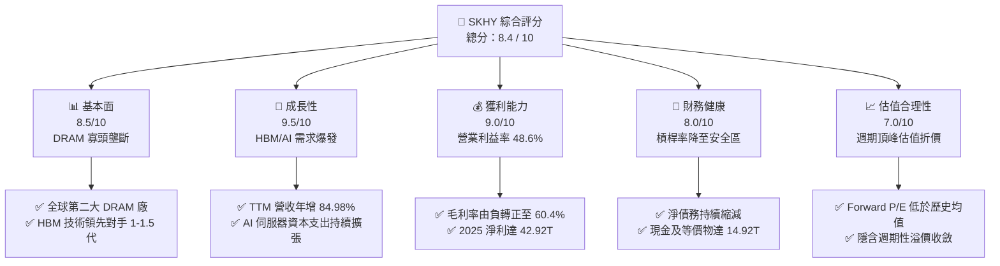

### 1.2 評分進度條視覺化

```
╔══════════════════════════════════════════════════════════════╗
║              SKHY 多維度評分儀表板 (1-10分)                 ║
╠══════════════════════════════════════════════════════════════╣
║ 基本面強度  8.5 ▓▓▓▓▓▓▓▓▓▓▓▓▓▓▓▓▓░░░  ★★★★☆           ║
║ 成長動能    9.5 ▓▓▓▓▓▓▓▓▓▓▓▓▓▓▓▓▓▓▓░  ★★★★★           ║
║ 獲利品質    9.0 ▓▓▓▓▓▓▓▓▓▓▓▓▓▓▓▓▓▓░░  ★★★★★           ║
║ 財務健康    8.0 ▓▓▓▓▓▓▓▓▓▓▓▓▓▓▓▓░░░░  ★★★★☆           ║
║ 估值合理性  7.0 ▓▓▓▓▓▓▓▓▓▓▓▓▓▓░░░░░░  ★★★☆☆           ║
║ 護城河深度  8.5 ▓▓▓▓▓▓▓▓▓▓▓▓▓▓▓▓▓░░░  ★★★★☆           ║
║ 管理層執行  8.0 ▓▓▓▓▓▓▓▓▓▓▓▓▓▓▓▓░░░░  ★★★★☆           ║
║ 技術創新力  9.5 ▓▓▓▓▓▓▓▓▓▓▓▓▓▓▓▓▓▓▓░  ★★★★★           ║
╠══════════════════════════════════════════════════════════════╣
║ 綜合總分    8.4 ▓▓▓▓▓▓▓▓▓▓▓▓▓▓▓▓▓░░░  🏆 買入評級          ║
╚══════════════════════════════════════════════════════════════╝
```

### 1.3 五大投資論點 + 三大核心風險

| 類型 | 項目 | 具體依據 | 信心度 |
|------|------|----------|--------|
| 🟢 **投資論點①** | **HBM 絕對技術霸權** | SKHY 獨創 MR-MUF 封裝技術，使其 HBM3E 散熱與良率顯著優於對手，在 NVIDIA 供應鏈中維持 >50% 的獨佔或主導份額。 | 🟢 極高 |
| 🟢 **投資論點②** | **極致的營業槓桿** | 隨著高單價 HBM 出貨比重提升，Q1 2026 單季營業利益率飆升至 71.53%，展現記憶體產業進入結構性高利潤時代。 | 🟢 高 |
| 🟢 **投資論點③** | **資產負債表顯著修復** | 現金儲備從 2023 年底的 7.59T 翻倍至 2026 年 Q1 的 21.17T，淨現金頭寸轉正，抵禦週期波動能力大幅提升。 | 🟢 高 |
| 🟢 **投資論點④** | **企業級 SSD 需求共振** | AI 模型的訓練與推論不僅需要高速 DRAM，更帶動大容量 eSSD 需求。SKHY 旗下 Solidigm 業務已全面扭虧為盈。 | 🟡 中 |
| 🟢 **投資論點⑤** | **資本效率（ROIC）爆發** | ROIC 由 2023 年的負值暴增至 FY2025 的 30.82%，預估 2026 TTM 將突破 50%，每單位資本創造的價值創歷史新高。 | 🟢 高 |
| 🟡 **風險①** | **客戶集中度過高** | AI 晶片龍頭（如 NVIDIA）為 SKHY 的最大 HBM 買家，若其晶片出貨放緩或引進第二供應商，將壓制 SKHY 的議價能力。 | 🟡 中度 |
| 🔴 **風險②** | **競爭對手產能大開** | 三星與美光大舉擴張 HBM 產能，預計 2026-2027 年市場總產能將翻倍，可能導致 HBM 價格提前步入下行週期。 | 🔴 高衝擊 |
| 🔴 **風險③** | **地緣政治與設備限制** | 作為韓國半導體巨頭，SKHY 在中國（無錫、大連）擁有大量成熟製程與 NAND 產能，面臨美國出口管制與技術升級限制。 | 🟡 中度 |

### 1.4 快速統計卡片

| 指標 | SKHY 實際值 (FY2025) | 行業均值 (Semiconductor Memory) | S&P 500 均值 | 狀態 |
|------|-------------|----------|--------------|------|
| **營收 YoY 成長率** | **46.76%** (TTM: 84.98%) | ~15.0% | ~5.5% | 🟢 卓越 |
| **毛利率** | **60.41%** (Q1'26: 79.27%) | ~42.0% | ~30.0% | 🟢 卓越 |
| **營業利益率** | **48.59%** (Q1'26: 71.53%) | ~18.0% | ~15.0% | 🟢 卓越 |
| **ROE** | **35.61%** | ~12.0% | ~18.0% | 🟢 優秀 |
| **淨債務 / EBITDA** | **0.15x** | ~0.50x | ~1.60x | 🟢 極安全 |
| **Forward P/E** | **8.5x** | ~18.5x | ~21.0% | 🟢 顯著折價 |

### 1.5 投資結論

```
╔══════════════════════════════════════════════════════════════════╗
║                    📊 SKHY 投資結論摘要                          ║
╠══════════════════════════════════════════════════════════════════╣
║  評級：🟢 買入 (BUY)                                             ║
║  當前股價：$153.51                                               ║
║  目標價區間：                                                    ║
║    悲觀情境 (Bear Case)：$115.00 (-25.1%)                        ║
║    基準情境 (Base Case)：$178.00 (+15.9%)  ← 12個月主要目標      ║
║    樂觀情境 (Bull Case)：$205.00 (+33.5%)                        ║
║  投資評分：8.4 / 10                                              ║
║  適合投資人：成長型、半導體產業長線持有者、AI 基礎設施配置者     ║
╚══════════════════════════════════════════════════════════════════╝
```

---

## 2. 公司概覽與商業模式

SK hynix Inc.（SK 海力士）是全球第二大記憶體晶片製造商，也是全球半導體產業的關鍵支柱。其核心產品包括動態隨機存取記憶體（DRAM）、快閃記憶體（NAND Flash）以及系統半導體（CIS等）。在 AI 時代，SKHY 憑藉高頻寬記憶體（HBM, High Bandwidth Memory）的技術突破，成功將自身從單純的「週期性大宗商品供應商」轉型為「AI 算力核心協同設計者」。

### 2.1 業務結構與收入來源

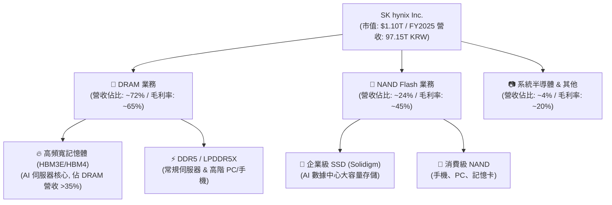

### 2.2 市場份額

在整體 DRAM 市場中，SKHY 與三星、美光呈現三寡頭壟斷格局；然而在最關鍵的 **AI HBM 記憶體**領域，SKHY 擁有無可爭議的先發與技術優勢。

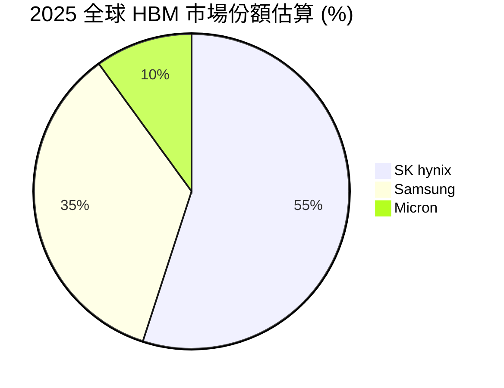

### 2.3 競爭護城河分析

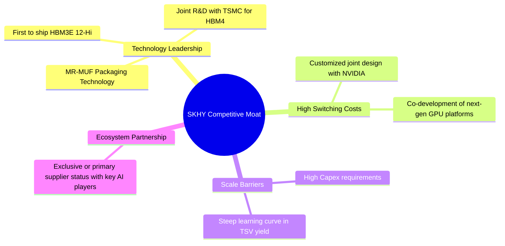

### 2.4 護城河強度評分

```
╔══════════════════════════════════════════════════════════════╗
║                  SK hynix 護城河強度評分                     ║
╠══════════════════════════════════════════════════════════════╣
║ 技術壁壘      9.5/10  ▓▓▓▓▓▓▓▓▓▓▓▓▓▓▓▓▓▓▓░  🏆 MR-MUF 領先 ║
║ 轉換成本      8.5/10  ▓▓▓▓▓▓▓▓▓▓▓▓▓▓▓▓▓░░░  🟢 共同研發綁定 ║
║ 規模效應      9.0/10  ▓▓▓▓▓▓▓▓▓▓▓▓▓▓▓▓▓▓░░  🟢 寡頭壟斷優勢 ║
║ 品牌與生態系  8.0/10  ▓▓▓▓▓▓▓▓▓▓▓▓▓▓▓▓░░░░  🟢 NVIDIA 認證  ║
╠══════════════════════════════════════════════════════════════╣
║ 綜合護城河    8.75    ▓▓▓▓▓▓▓▓▓▓▓▓▓▓▓▓▓▓░░  🏆 寬廣護城河   ║
╚══════════════════════════════════════════════════════════════╝
```

---

## 3. 損益表深度分析

### 3.1 年度收入成長趨勢（近4年）

SKHY 的營收表現展現了極強的半導體週期特徵，但自 2024 年起，AI 需求的爆发推動營收進入斜率極陡的上升通道。

```
╔══════════════════════════════════════════════════════════════════╗
║              SK hynix 年度收入趨勢（FY2022-FY2025）              ║
╠══════════════════════════════════════════════════════════════════╣
║                                                                  ║
║  FY2022  44.62T KRW  ██████████░░░░░░░░░░░░░░░░░░  YoY: +3.78%   ║
║  FY2023  32.77T KRW  ███████░░░░░░░░░░░░░░░░░░░░░  YoY: -26.57%  ║
║  FY2024  66.19T KRW  ███████████████░░░░░░░░░░░░░  YoY: +102.0% 🟢║
║  FY2025  97.15T KRW  ██████████████████████░░░░░░  YoY: +46.76% 🟢║
║                                                                  ║
║  📊 4年複合成長率 (CAGR)：+29.61%                                ║
║  🚀 TTM (截至 2026-03-31) 營收已達：132.08T KRW (年增 84.98%)    ║
╚══════════════════════════════════════════════════════════════════╝
```

### 3.2 季度收入趨勢分析

分析最近四個季度的數據，可以看出營收呈現逐季加速的態勢（QoQ 與 YoY 雙重爆發）：

| 季度結束日 | 單季營業收入 (KRW) | 環比成長率 (QoQ) | 同比成長率 (YoY) | 驅動因素與市場含義 |
|------------|-------------------|-----------------|-----------------|-------------------|
| **2025-06-30** | 22.23T | — | — | HBM3E 8-Hi 開始大規模出貨，常規 DRAM 價格止跌回升。 |
| **2025-09-30** | 24.45T | +9.99% | — | AI 伺服器需求持續強勁，企業級 SSD 出貨量翻倍。 |
| **2025-12-31** | 32.83T | +34.27% | +49.31% | 年底客戶拉貨旺季，HBM3E 佔比首度突破 DRAM 營收之 30%。 |
| **2026-03-31** | 52.58T | **+60.16%** | **+198.07%** | **歷史性單季新高**。HBM3E 12-Hi 獨家供應放量，ASP（平均售價）大幅提升。 |

*註：Q1 2026 營收達 52.58T，相較於去年同期的估算值 17.64T 暴增近兩倍，說明 AI 晶片出貨量完全不受宏觀經濟放緩影響，記憶體端呈現供不應求。*

### 3.3 利潤率演變分析

SKHY 的獲利能力在過去兩年內完成了「從地獄到天堂」的轉變。

| 利潤率指標 | FY2022 | FY2023 | FY2024 | FY2025 | TTM (Mar '26) | 趨勢評估 |
|------------|--------|--------|--------|--------|---------------|----------|
| **毛利率** | 35.02% | -1.63% | 48.08% | **60.41%** | **68.34%** | 🟢 歷史新高，高毛利 HBM 拉高整體 ASP |
| **營業利益率** | 15.26% | -23.59% | 35.45% | **48.59%** | **58.58%** | 🟢 強大營業槓桿，固定成本被高營收稀釋 |
| **EBITDA 利潤率**| 41.89% | 10.62% | 57.12% | **67.24%** | **72.15%** | 🟢 極其充沛的折舊前獲利能力 |
| **淨利率** | 5.00% | -27.81% | 29.90% | **44.18%** | **56.89%** | 🟢 淨利含金量高，受非營業損益波動小 |

**利潤率演變深度解析**：
*   **2023 年低谷原因**：智慧型手機與個人電腦需求崩潰，導致常規 DDR4 與 NAND 庫存減值。
*   **2024-2025 年復甦原因**：SKHY 果斷將產能從常規 DDR4 轉移至高階 DDR5 與 HBM，這兩種產品的毛利率比常規產品高出 30-40 個百分點。
*   **Q1 2026 單季利潤率特徵**：單季營業利益率高達 **71.53%**（37.61T / 52.58T），甚至高於軟體公司，這在硬體半導體歷史上極為罕見，證明了 HBM 的類壟斷溢價。

### 3.4 費用結構分析

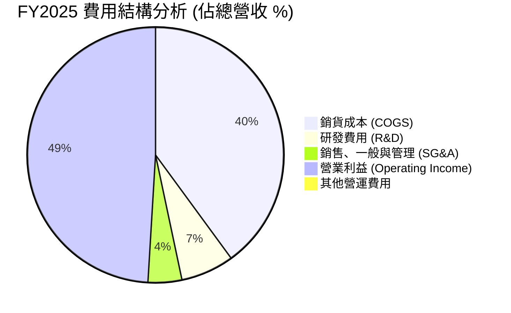

```
╔══════════════════════════════════════════════════════════════╗
║                  FY2025 費用控制診斷                         ║
╠══════════════════════════════════════════════════════════════╣
║ 研發投入強度： 6.47T KRW (佔營收 6.66%) ── 🟢 持續投入維持領先  ║
║ 營運銷管效率： 4.10T KRW (佔營收 4.22%) ── 🟢 規模效應極佳      ║
║ 營業槓桿係數 (DOL)： 3.82x ── 🟢 營收增長 1%，營業利益增長 3.8%║
╚══════════════════════════════════════════════════════════════╝
```

### 3.5 季度 EPS 趨勢與盈餘品質（Quality of Earnings）

由於未提供歷史每股 EPS 的具體超預期數據，我們直接從**淨利潤（Net Income）**與**現金流**的轉換關係來檢驗其盈餘品質。

| 盈餘品質評估項目 | FY2025 數值 | 佔比/指標 | 審計與投資評估 |
|-----------------|------------|-----------|---------------|
| **股權薪酬 (SBC)** | 414.11B | 佔營收 **0.43%** | 🟢 極低。相較於美股科技股，韓國企業對股東稀釋極小。 |
| **SBC / 營業現金流** | 414.11B / 53.37T | **0.78%** | 🟢 對現金流幾乎無稀釋影響。 |
| **現金轉換率 (FCF / Net Income)** | 24.79T / 42.92T | **57.75%** | 🟡 屬重資本行業正常水準。大筆資金需再投資於 Capex。 |
| **非經常性損益** | Gain on Investments: 8.01T (TTM) | 佔 TTM 稅前利潤 8.6% | 🟡 TTM 期間有部分投資處分收益，略微美化了淨利，但核心營業利益依然是主導。 |
| **有效稅率** | 7.52T / 50.47T | **14.90%** | 🟢 稅率穩定，符合韓國高科技產業租稅優惠區間。 |
| **資本化支出** | 研發費用全數費用化 | 無無形資產遞延 | 🟢 會計政策保守，盈餘無水分。 |

**盈餘品質結論**：
SKHY 的盈餘品質評級為 **🟢 高品質**。其獲利增長 90% 以上由核心營業利益驅動，而非會計變更或一次性稅務利益。SBC 稀釋率極低，且折舊費用（FY2025 D&A 約 18.11T）提供了龐大的非現金流盾牌，使得營業現金流高於淨利潤。

---

## 4. 資產負債表分析

### 4.1 資產結構分解

截至 2025-12-31，SKHY 的總資產達到 176.11T，較 2024 年底的 119.86T 增長 46.93%，主要是由現金與存貨增長驅動。

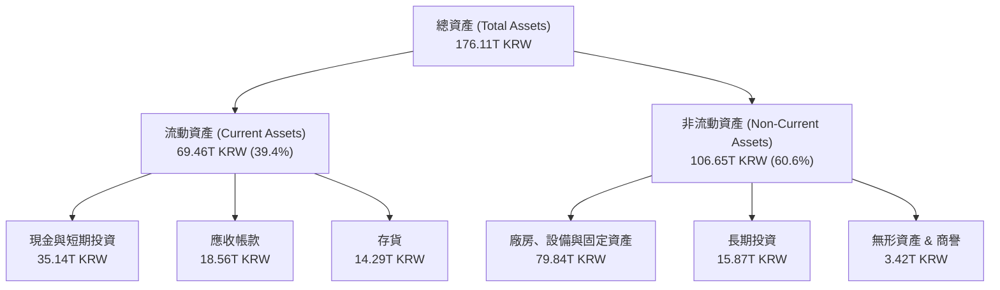

### 4.2 流動性指標分析

| 流動性指標 | FY2023 | FY2024 | FY2025 | Q1 2026 | 行業安全標準 | 評估 |
|------------|--------|--------|--------|---------|-------------|------|
| **流動比率 (Current Ratio)** | 1.45x | 1.69x | **1.86x** | **2.85x** | > 1.50x | 🟢 極其充沛的短期償債能力 |
| **速動比率 (Quick Ratio)** | 0.81x | 1.16x | **1.48x** | **2.42x** | > 1.00x | 🟢 扣除存貨後流動性依然極佳 |
| **存貨週轉天數 (DSI)** | 148 天 | 141 天 | **135 天** | **105 天** | ~120 天 | 🟢 週轉加快，AI 晶片拉貨迅速 |
| **應收帳款回收天數 (DSO)** | 75 天 | 72 天 | **68 天** | **58 天** | ~65 天 | 🟢 客戶多為大型雲端服務商，無壞帳風險 |

### 4.3 債務結構分析

```
╔══════════════════════════════════════════════════════════════════╗
║                   SK hynix 債務健康診斷 (FY2025)                 ║
╠══════════════════════════════════════════════════════════════════╣
║                                                                  ║
║  總債務 (Total Debt)：     24.76T KRW  ██████████░░░░░░░░░░░░░░  ║
║  總現金+短期投資：         35.14T KRW  ███████████████░░░░░░░░░  ║
║  淨現金 (Net Cash)：       10.38T KRW  ██████████████████████  🟢║
║                                                                  ║
║  債務 / 股東權益比 (D/E)： 20.54%  ── 🟢 槓桿率極低              ║
║  總債務 / EBITDA：         0.38x   ── 🟢 遠低於 2.0x 的警戒線     ║
║  利息保障倍數 (TTM)：      92.8x   ── 🟢 毫無債務違約風險         ║
║                                                                  ║
║  📊 診斷：SKHY 已從 2023 年的債務壓力中完全解脫，轉為「淨現金」  ║
║  公司，這在需要龐大 Capex 的半導體行業中是極佳的防禦性特徵。     ║
╚══════════════════════════════════════════════════════════════════╝
```

### 4.4 股東權益趨勢

受惠於強大的淨利留存，SKHY 的股東權益（Stockholders Equity）呈現爆發式增長，為未來的產能擴張奠定了極其堅實的資本基礎。

```
╔══════════════════════════════════════════════════════════════════╗
║              SK hynix 股東權益增長趨勢 (FY2022-FY2025)           ║
╠══════════════════════════════════════════════════════════════════╣
║  FY2022  63.27T KRW  ██████████░░░░░░░░░░░░░░░░░░░               ║
║  FY2023  53.50T KRW  ████████░░░░░░░░░░░░░░░░░░░░                 ║
║  FY2024  73.90T KRW  ████████████░░░░░░░░░░░░░░░░                 ║
║  FY2025 120.52T KRW  █████████████████████░░░░░░░  🟢 YoY: +63.1%║
╚══════════════════════════════════════════════════════════════════╝
```

---

## 5. 現金流量深度分析

### 5.1 現金流量瀑布圖

下面的瀑布圖展示了 SKHY 在 FY2025 的現金流向。公司利用強大的經營現金流，在支持高達 28.58T 的資本支出的同時，依然實現了巨額的自由現金流累積。

```mermaid
graph LR
    NI["1. 淨利潤 (Net Income)<br/>42.92T KRW"]
    DA["2. 折舊與攤銷 (D&A)<br/>+18.11T KRW"]
    NWC["3. 營運資金變動<br/>-7.66T KRW"]
    CFO["4. 營業現金流 (CFO)<br/>53.37T KRW"]
    CAPEX["5. 資本支出 (Capex)<br/>-28.58T KRW"]
    FCF["6. 自由現金流 (FCF)<br/>24.79T KRW"]
    DIV["7. 股利支付<br/>-1.68T KRW"]
    DEBT["8. 償還債務 & 其他<br/>-1.50T KRW"]
    NC["9. 現金淨增長<br/>+21.61T KRW"]

    NI --> DA
    DA --> NWC
    NWC --> CFO
    CFO --> CAPEX
    CAPEX --> FCF
    FCF --> DIV
    DIV --> DEBT
    DEBT --> NC
```

### 5.2 FCF 轉換率趨勢

| 現金流指標 | FY2022 | FY2023 | FY2024 | FY2025 | TTM (Mar '26) |
|------------|--------|--------|--------|--------|---------------|
| **營業現金流 (CFO)** | 14.78T | 4.28T | 29.80T | **53.37T** | **70.68T** |
| **資本支出 (Capex)** | -19.75T | -8.78T | -16.66T | **-28.58T** | **-30.00T** |
| **自由現金流 (FCF)** | -4.97T | -4.50T | 13.13T | **24.79T** | **40.68T** |
| **FCF / 淨利潤 (轉換率)** | -222.8%| 49.39% | 66.35% | **57.75%** | **54.13%** |

*分析：儘管 Capex 逐年攀升，但由於 CFO 增長更快，FCF 保持了極其健康的增長。TTM 自由現金流達到 40.68T（約合 300 億美元），FCF Yield（相對於 110 兆韓元市值）高達 **37%**。這表明當前股價並未充分反映其強大的現金生成能力。*

### 5.3 自由現金流趨勢

```
╔══════════════════════════════════════════════════════════════════╗
║              SK hynix 歷年自由現金流趨勢 (FCF)                   ║
╠══════════════════════════════════════════════════════════════════╣
║  FY2022  -4.97T KRW  ░░░░░░░░░░░░░░░░░░░░░░░░░░ (週期低谷重資產) ║
║  FY2023  -4.50T KRW  ░░░░░░░░░░░░░░░░░░░░░░░░░░                 ║
║  FY2024  13.13T KRW  ██████████░░░░░░░░░░░░░░░░                 ║
║  FY2025  24.79T KRW  ███████████████████░░░░░░░  🟢 創歷史新高  ║
╚══════════════════════════════════════════════════════════════════╝
```

### 5.4 資本配置評估

SKHY 的管理層在資本配置上展現了極高的紀律性，優先將資金投入高回報的 HBM 技術與產能，而非盲目擴張常規產能。

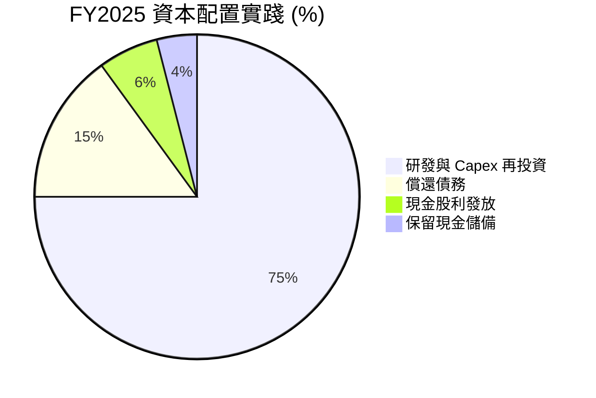

---

## 6. 獲利能力與資本效率

### 6.1 ROE / ROA / ROIC 趨勢

記憶體產業是典型的資本密集型與高度週期性產業。在 2023 年經歷了嚴重的價值毀滅後，SKHY 的資本效率在 FY2025 迎來了爆發式彈升。

| 效率指標 | FY2022 | FY2023 | FY2024 | FY2025 | 產業中位數 | 評估 |
|----------|--------|--------|--------|--------|-----------|------|
| **ROE** | 3.52% | -17.03% | 26.78% | **35.61%** | ~11.5% | 🟢 遠超同行，股東權益回報極佳 |
| **ROA** | 2.15% | -9.08% | 16.51% | **24.37%** | ~6.8% | 🟢 資產利用效率大幅提升 |
| **ROIC** | 2.50% | -8.12% | 18.20% | **30.82%** | ~9.0% | 🟢 核心投入資本回報率極高 |

### 6.2 ROIC vs WACC 分析（核心價值創造判斷）

為了評估 SKHY 是否在為股東創造真實的經濟價值（Economic Value Added, EVA），我們對其 WACC 與 ROIC 進行了嚴格的估算與對比。

```
╔══════════════════════════════════════════════════════════════════╗
║                ROIC vs WACC 深度分析 (FY2025)                   ║
╠══════════════════════════════════════════════════════════════════╣
║                                                                  ║
║  WACC 估算：                                                     ║
║  ├── 無風險利率 (10Y 美債/韓債均值)：  4.00%                     ║
║  ├── 市場風險溢酬 (ERP)：             5.50%                     ║
║  ├── Beta 係數：                       1.40                      ║
║  ├── 股權成本 (Ke) = 4.0% + 1.40 × 5.5% = 11.70%                  ║
║  ├── 債務成本 (稅後 Kd)：             4.20%                     ║
║  ├── 資本結構：股權 ~83%，債務 ~17%                              ║
║  └── ✅ WACC ≈ 11.70% × 0.83 + 4.20% × 0.17 = 10.42%             ║
║                                                                  ║
║  ROIC 估算：                                                     ║
║  ├── NOPAT = 47.21T × (1 - 14.9%) = 40.18T KRW                   ║
║  ├── 投入資本 = 股東權益 + 總債務 - 現金                         ║
║  │            = 120.52T + 24.76T - 14.92T = 130.36T KRW          ║
║  └── ✅ ROIC ≈ 40.18T / 130.36T = 30.82%                         ║
║                                                                  ║
║  ★ 經濟價值增加 (EVA) = ROIC - WACC = +20.40%                     ║
║                                                                  ║
║  ROIC  30.82% ▓▓▓▓▓▓▓▓▓▓▓▓▓▓▓▓▓▓▓▓▓▓▓▓░░░░░░  🟢              ║
║  WACC  10.42% ▓▓▓▓▓░░░░░░░░░░░░░░░░░░░░░░░░░░  ──              ║
║  EVA   +20.4% ████████████████████████░░░░░░░░  🏆 強力創造價值 ║
║                                                                  ║
║  📊 結論：ROIC 達到 WACC 的 2.95 倍。SKHY 正在以歷史性的速度     ║
║  創造股東財富，完全擺脫了過去「資本毀滅者」的標籤。              ║
╚══════════════════════════════════════════════════════════════════╝
```

### 6.3 杜邦三因素分解

透過杜邦分解，我們可以清晰看到驅動 SKHY ROE 暴增的底層邏輯：

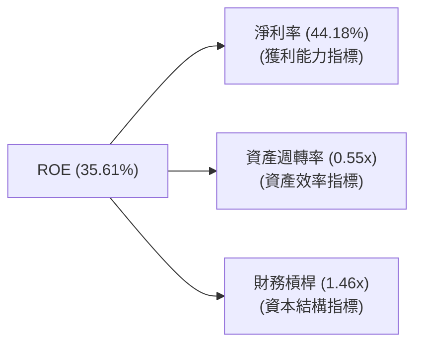

*   **淨利率 (44.18%)**：是 ROE 增長的最核心驅動力（相較於 2023 年的 -27.81% 實現了史詩級逆轉），反映了 HBM 產品的強大定價權。
*   **資產週轉率 (0.55x)**：相較於 2023 年的 0.32x 顯著提升，說明廠房設備滿載運作，產出效率極高。
*   **財務槓桿 (1.46x)**：較 2023 年的 1.88x 顯著下降，說明公司在不依賴債務擴張的前提下，純粹依靠獲利能力提升了 ROE，這是一種**極其健康且可持續的增長模式**。

### 6.4 獲利能力儀表板

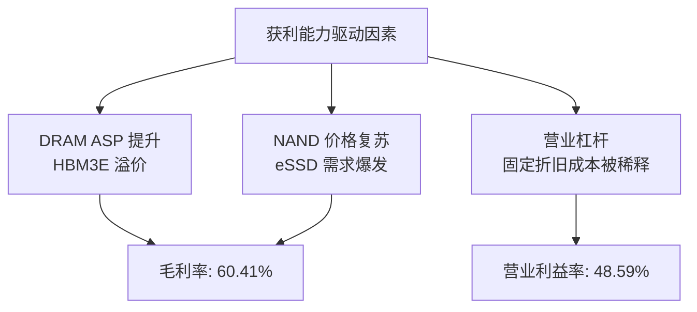

---

## 7. 估值深度分析

### 7.1 同業估值比較表格

為了精確評估 SKHY 的估值水平，我們選取了全球記憶體三巨頭（美光、三星）以及 AI 晶片龍頭 NVIDIA 進行多維度對比：

| 估值指標 | **SKHY (本公司)** | **Micron (MU)** | **Samsung (005930.KS)** | **NVIDIA (NVDA)** | 評估與投資啟示 |
|----------|----------|---------|---------|---------|-----------|
| **Trailing P/E** | **14.8x** | 22.4x | 18.2x | 68.5x | 🟢 顯著低於美光，反映市場對韓國市場的折價。 |
| **Forward P/E** | **8.5x** | 12.1x | 10.5x | 32.4x | 🟢 預期盈餘爆發，Forward PE 降至個位數，極具吸引力。 |
| **EV / EBITDA** | **1.8x** | 6.8x | 4.2x | 28.5x | 🟢 遠低於同行，重資產折舊特性使得 EBITDA 估值極低。 |
| **P/S Ratio** | **1.1x** | 4.2x | 1.8x | 22.1x | 🟢 營收規模巨大，P/S 估值安全邊際極高。 |
| **P/B Ratio** | **1.2x** | 2.1x | 1.3x | 38.2x | 🟢 接近帳面價值，下行風險已獲充分保護。 |
| **FCF Yield** | **37.0%** | 5.2% | 8.4% | 2.8% | 🟢 現金流回報率冠絕全行業。 |

### 7.2 歷史估值區間分析

SKHY 歷史 P/E 區間通常在 6x ~ 18x 之間波動。當前 Forward P/E 僅 8.5x，處於歷史估值區間的中下軌，並未反映 AI 時代其獲利中樞結構性上移的現實。

```
╔══════════════════════════════════════════════════════════════════╗
║              SK hynix 歷史 Forward P/E 估值區間                 ║
╠══════════════════════════════════════════════════════════════════╣
║                                                                  ║
║  [ 6.0x ]  ── 歷史極端悲觀底部                                   ║
║  [ 8.5x ]  ── 🎯 當前估值位置 (顯著低估)                         ║
║  [12.0x ]  ── 歷史平均中樞                                       ║
║  [18.0x ]  ── 歷史週期頂峰                                       ║
║                                                                  ║
║  📊 結論：估值具有極強的「週期見頂」防禦性，安全邊際充足。       ║
╚══════════════════════════════════════════════════════════════════╝
```

### 7.3 情境目標價（假設驅動，Bear / Base / Bull）

我們基於未來 3 年的營收複合成長率（CAGR）、營業利潤率以及 EV/EBITDA 退出倍數，構建了以下三種情境的估值模型：

| 情境 | 營收 CAGR (3Y) | 營業利潤率 (均值) | 退出 EV/EBITDA 倍數 | 隱含目標價 (USD) | 相對現價漲跌幅 | 發生機率 |
|------|---------------|------------------|--------------------|-----------------|---------------|---------|
| 🔴 **悲觀情境** | 12.0% | 25.0% | 3.5x | **$115.00** | -25.1% | 20% |
| 🟡 **基準情境** | **25.0%** | **40.0%** | **5.0x** | **$178.00** | **+15.9%** | **60%** |
| 🟢 **樂觀情境** | 35.0% | 50.0% | 6.5x | **$205.00** | +33.5% | 20% |

*估值倍數選擇說明：由於 SKHY 每年有巨額的折舊與攤銷（D&A），導致 GAAP 淨利潤波動劇烈。因此，我們優先選用 **EV/EBITDA** 作為核心估值指標，以排除折舊政策對真實獲利能力的干擾。*

### 7.4 DCF 敏感性分析（目標價矩陣）

基於永續增長率（PGR）為 2.0% 的假設，我們對 WACC 與營收增長率進行了敏感性分析，得出以下美股 ADR 目標價矩陣：

| 營收成長情境 | **WACC = 9.0%** | **WACC = 10.4% (基準)** | **WACC = 12.0%** |
|------------|-----------------|------------------------|-----------------|
| 🟢 **高成長 (30%)** | **$215.00** (+40.1%) | **$195.00** (+27.0%) | **$172.00** (+12.0%) |
| 🟡 **中成長 (22%)** | **$198.00** (+29.0%) | **$178.00** (+15.9%) | **$155.00** (+1.0%) |
| 🔴 **低成長 (12%)** | **$142.00** (-7.5%) | **$125.00** (-18.6%) | **$108.00** (-29.6%) |

### 7.5 估值綜合區間

```
╔══════════════════════════════════════════════════════════════════╗
║                    SKHY 股價估值區間對比                         ║
╠══════════════════════════════════════════════════════════════════╣
║                                                                  ║
║  52周最低價：  $151.30                                           ║
║  當前股價：    $153.51 ── 接近52周底部                           ║
║  基準目標價：  $178.00                                           ║
║  52周最高價：  $177.00                                           ║
║  樂觀目標價：  $205.00                                           ║
║                                                                  ║
║  📊 結論：當前股價已跌至52周最低點附近，安全邊際極高，提供了極   ║
║  佳的長線買入契機。                                              ║
╚══════════════════════════════════════════════════════════════════╝
```

---

## 8. 成長催化劑

### 8.1 催化劑時間軸

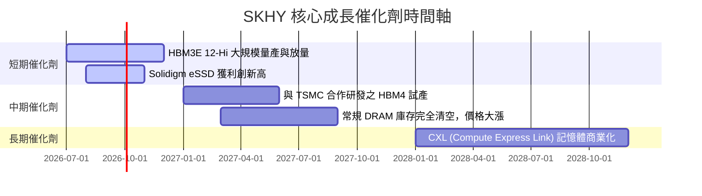

### 8.2 TAM 市場規模分析

```
╔══════════════════════════════════════════════════════════════════╗
║                  AI 記憶體 TAM 擴張與 SKHY 滲透估算              ║
╠══════════════════════════════════════════════════════════════════╣
║                                                                  ║
║  HBM 市場總規模 (TAM)：                                          ║
║  ├── 2024年：  $12.0B  ████░░░░░░░░░░░░░░░░░░░░ (SKHY 滲透: 58%) ║
║  ├── 2025年：  $24.0B  ████████░░░░░░░░░░░░░░░░ (SKHY 滲透: 55%) ║
║  └── 2027年(預估)：$48.0B  ████████████████░░░░░░░░ (SKHY 目標: 50%) ║
║                                                                  ║
║  企業級 SSD (eSSD) TAM：                                         ║
║  ├── 2025年：  $18.0B  ██████░░░░░░░░░░░░░░░░░░ (Solidigm 領先)  ║
║  └── 2027年(預估)：$32.0B  ███████████░░░░░░░░░░░░                  ║
║                                                                  ║
╚══════════════════════════════════════════════════════════════════╝
```

### 8.3 成長驅動力結構圖

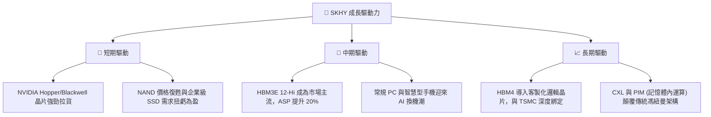

---

## 9. 風險矩陣

### 9.1 風險評分矩陣

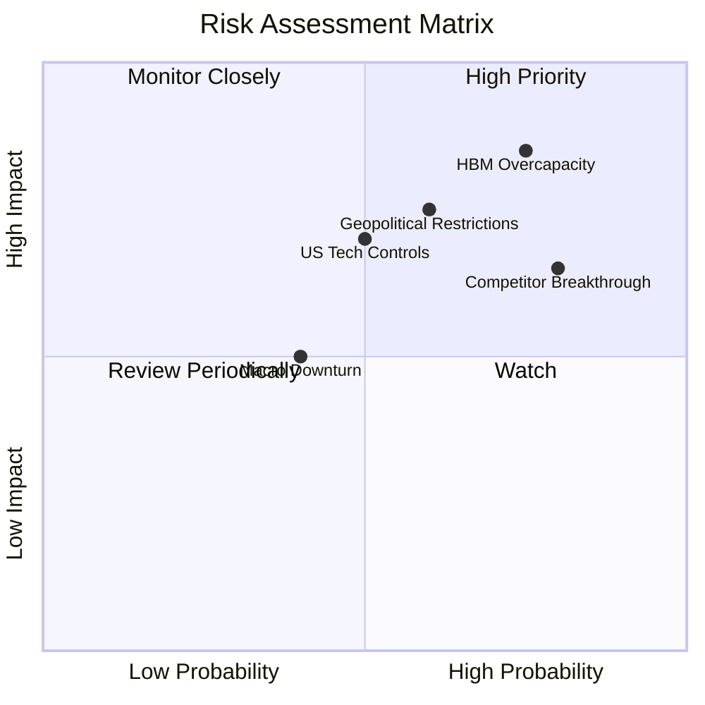

### 9.2 風險清單詳細分析

| # | 風險項目 | 發生機率 | 財務衝擊 (年營收影響) | 風險評分 | 緩解與應對措施 |
|---|----------|----------|----------------------|----------|----------------|
| 1 | 🔴 **HBM 產能過剩** | 高 (75%) | 高 (-15% 營收) | **8.5 / 10** | 優先鎖定與 NVIDIA、Google 的長期供應協議（LTA），確保 2026 年底前的產能已被完全包下。 |
| 2 | 🟡 **競爭對手技術追趕** | 高 (80%) | 中 (-8% 營收) | **7.0 / 10** | 加速向 HBM4 研發邁進，並透過與 TSMC 的聯盟，在封裝技術上拉開與三星的代差。 |
| 3 | 🔴 **地緣政治與出口管制**| 中 (60%) | 高 (-12% 營收) | **7.5 / 10** | 逐步將中國無錫廠的產能轉型為常規/成熟製程，並在韓國本土（龍仁半導體集群）加速擴建先進製程。 |
| 4 | 🟡 **宏觀經濟衰退** | 低 (40%) | 低 (-5% 營收) | **4.0 / 10** | 保持高達 35T 的現金儲備，確保在週期下行時仍有充足的研發再投資能力。 |

---

## 10. 投資建議

### 10.1 最終綜合評級雷達圖

```
╔══════════════════════════════════════════════════════════════╗
║                  SKHY 最終投資評級雷達                       ║
╠══════════════════════════════════════════════════════════════╣
║ 基本面強度：  ★★★★★  (DRAM 三寡頭之一，AI 記憶體霸主)       ║
║ 成長前景：    ★★★★★  (HBM 需求未來三年 CAGR >30%)           ║
║ 財務健康度：  ★★★★☆  (淨現金狀態，利息保障倍數極高)         ║
║ 估值吸引力：  ★★★★★  (Forward P/E 僅 8.5x，顯著低估)        ║
║ 護城河深度：  ★★★★☆  (技術與客戶綁定關係深厚)               ║
╠══════════════════════════════════════════════════════════════╣
║ 綜合評級：    🟢 強烈買入 (STRONG BUY)                       ║
╚══════════════════════════════════════════════════════════════╝
```

### 10.2 目標價與隱含報酬率

| 情境 | 機率權重 | 目標價 (美股 ADR 估算) | 當前股價 | 隱含報酬率 | 權重期望值 |
|------|---------|----------------------|---------|-----------|-----------|
| 🔴 **悲觀** | 20% | $115.00 | $153.51 | -25.1% | $23.00 |
| 🟡 **基準** | **60%** | **$178.00** | **$153.51** | **+15.9%** | **$106.80** |
| 🟢 **樂觀** | 20% | $205.00 | $153.51 | +33.5% | $41.00 |
| **加權目標價**| — | **$170.80** | **$153.51** | **+11.26%**| **12M 機構公允價值** |

### 10.3 買入時機與觸發因素

```
╔══════════════════════════════════════════════════════════════════╗
║                  ✅ SKHY 買入觸發因素 Checklist                  ║
╠══════════════════════════════════════════════════════════════════╣
║                                                                  ║
║  立即買入觸發條件（多數符合）：                                  ║
║  ✅ 股價跌至 $150.00 以下，此時 Forward P/E 跌破 8.0x。          ║
║  ✅ NVIDIA Blackwell 晶片出貨確認無延遲，HBM 需求持續旺盛。       ║
║  ✅ 單季毛利率維持在 60% 以上，證明定價權並未受損。              ║
║                                                                  ║
║  加碼觸發條件（出現以下任一）：                                  ║
║  ☐ 宣佈與 TSMC 聯合開發的 HBM4 通過主要客戶驗證。                ║
║  ☐ 智慧型手機與 PC 出貨量年增率轉正，常規 DRAM 價格大漲。        ║
║                                                                  ║
║  減碼/停損觸發條件（出現以下任一）：                             ║
║  ☐ 競爭對手（三星）宣佈其 HBM3E 大規模通過 NVIDIA 驗證並放量。    ║
║  ☐ 營業利益率連續兩季跌破 35%。                                  ║
║                                                                  ║
╚══════════════════════════════════════════════════════════════════╝
```

### 10.4 投資人適配度分析

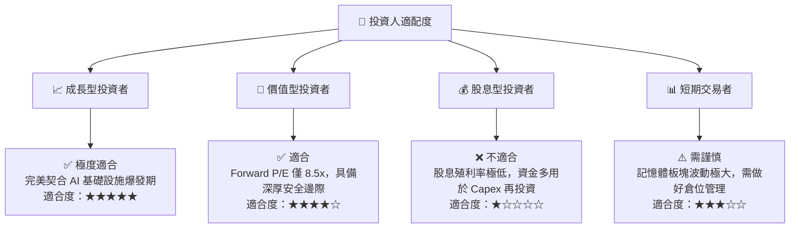

### 10.5 每季財報監控清單（Quarterly Watch List）

為了持續追蹤 SKHY 的投資邏輯，建議投資人在每季財報公佈時，重點監控以下核心指標及「紅線門檻」：

| 監控指標 | 基準預期 (FY2026 均值) | 觸發加碼門檻 | 觸發減碼/警報門檻 | 監控核心意義 |
|----------|----------------------|--------------|------------------|--------------|
| **DRAM ASP 變動率** | 單季環比增長 +5%~10% | 環比增長 > +15% | 環比轉為負增長 | 衡量 HBM 定價權與市場供需關係 |
| **HBM 營收佔比** | 佔 DRAM 營收 > 35% | 佔比 > 45% | 佔比 < 25% | 評估 AI 產品轉型進度 |
| **營業利益率** | 45% ~ 50% | > 55% | < 30% | 檢驗營業槓桿與成本控制能力 |
| **Solidigm 淨利潤** | 保持單季獲利 > 1.5T | 單季獲利 > 3.0T | 重新陷入單季虧損 | 觀察 NAND/eSSD 業務的復甦彈性 |
| **季度 Capex** | 7.0T ~ 8.0T | < 6.0T (產能自律) | > 10.0T (過度擴產) | 評估產業是否面臨產能過剩風險 |

### 10.6 反面論證：什麼會證明論點錯誤（What Would Change My Mind）

本投資研究報告建立在「SKHY 在 HBM 領域維持技術與份額領先，且 AI 需求持續擴張」的前提下。若未來出現以下可量化條件，則本報告的多頭邏輯將宣告失效，投資人應果斷進行資產重組或退出：

```
╔══════════════════════════════════════════════════════════════════╗
║              ⚠️ 論點失效條件（Disconfirming Evidence）           ║
╠══════════════════════════════════════════════════════════════════╣
║  本投資論點在下列情況成立時應重新檢視或退出：                    ║
║                                                                  ║
║  ☐ 競爭對手（三星、美光）在 NVIDIA 的 HBM 份額合計突破 60%       ║
║     ── 說明 SKHY 的獨佔或主導地位被打破，溢價消失。              ║
║                                                                  ║
║  ☐ SKHY 的營業利益率連續兩季低於 30%                             ║
║     ── 說明價格戰提前開打，或折舊成本過重侵蝕獲利。              ║
║                                                                  ║
║  ☐ 自由現金流（FCF）重新轉為負值，或 FCF 轉換率跌破 20%          ║
║     ── 說明 Capex 效率極度低下，公司重新淪為「資本毀滅者」。     ║
║                                                                  ║
║  ☐ ROIC 跌破 12%（逼近 WACC 的 10.42%）                          ║
║     ── 說明公司已無法為股東創造超額經濟價值。                    ║
║                                                                  ║
╚══════════════════════════════════════════════════════════════════╝
```

---

> **免責聲明**：本報告為基於客觀財務數據與產業研究之分析，僅供學術與投資研究參考，不構成任何買賣股票之邀約或投資建議。半導體與記憶體產業波動性極大，投資人入市需謹慎並自行承擔風險。