# SKHY 基本面深度分析報告

> **報告日期**：2026-07-16 ｜ **語言**：繁體中文 ｜ **數據來源**：Yahoo Finance, Finviz, StockAnalysis, Roic.ai ｜ **分析師**：CFA 級機構研究
> **貨幣與單位說明**：鑑於 SK hynix（SKHY）為總部位於韓國的全球半導體巨頭，本報告中引用的財務報表數據（如 Revenue, Net Income, Cash, Debt 等）除特別註明外，其計價單位「$」與「T」實為**韓元 (KRW) 兆元**（Trillion KRW，記為 ₩T 或 $T），以精確對應公司官方申報之財務實體。股價則以基準交易價格 $176.46 進行分析。

---

## 目錄

| # | 章節 | 核心結論 |
|---|------|----------|
| 1 | 執行摘要 | 評級：🟢 買入 ｜ 基準目標價：$235.00（潛在漲幅 +33.17%） |
| 2 | 公司概覽與商業模式 | HBM 技術代差構築高牆，市佔率領先奠定高定價權 |
| 3 | 損益表深度分析 | 營收年增 198.1%，營業槓桿爆發驅動營業利益率衝上 71.5% |
| 4 | 資產負債表分析 | 淨現金達 ₩32.53T，流動比率 2.62，財務結構極度穩健 |
| 5 | 現金流量深度分析 | 營運現金流達 ₩70.68T，高資本支出下仍實現 2060% FCF 殖利率（年化） |
| 6 | 獲利能力與資本效率 | ROIC 達 74.7% 遠超 WACC 的 13.1%，強力創造股東價值 |
| 7 | 估值深度分析 | Forward P/E 僅 4.36 倍，估值嚴重低估，安全邊際充足 |
| 8 | 成長催化劑 | HBM4 世代切換與企業級 SSD（eSSD）需求雙引擎驅動 |
| 9 | 風險矩陣 | 產能過剩風險與地緣政治地帶為主要監控指標 |
| 10 | 投資建議 | 提供多情境目標價、買入觸發條件及每季財報監控指標 |

---

## 1. 執行摘要

SK hynix Inc.（Ticker: SKHY）正處於其半導體歷史上最強勁的景氣循環與結構性成長交匯點。支撐此論點的關鍵數據在於：公司 TTM（過去12個月）營收達到 ₩132.08T，年增率（YoY）高達 198.1%，主要由 AI 伺服器對高頻寬記憶體（HBM）與高容量企業級 SSD（eSSD）的爆發性需求所驅動。在強大定價權與產能利用率回升下，TTM 營業利益率攀升至 71.5%，帶動 TTM 淨利達到 ₩75.14T。

基於公司 TTM ROIC（投入資本回報率）高達 74.7%，遠超其 WACC（加權平均資本成本）的 13.1%，顯示公司正在以極高效率創造股東價值。同時，儘管當前股價為 $176.46，但其 Forward P/E（預期本益比）僅為 4.36 倍（基於 Forward EPS $40.473），反映出市場嚴重低估了 AI 記憶體週期的持續性與 SKHY 的技術壁壘。

因此，本報告給予 SKHY **🟢 買入（Buy）** 評級，基準情境 12 個月目標價定為 **$235.00**，隱含 33.17% 的上行空間。

### 1.0 一頁式投資儀表板（Portfolio Manager 30 秒速讀）

| 項目 | 內容 |
|------|------|
| **投資論點（3 句）** | ① AI 算力爆發驅動 HBM3e/HBM4 供不應求，TTM 營收年增 198.1% 驗證其核心受益者地位。<br/>② 營業槓桿極致釋放，營運利潤率達 71.5%，帶動 TTM 自由現金流（FCF）衝上 ₩25.81T。<br/>③ 預期本益比（Forward P/E）僅 4.36 倍，相較於高達 61.2% 的 ROE，估值具有極高安全邊際。 |
| **護城河評分** | 8.5 / 10 🟢（HBM 專利壁壘與先進封裝 MR-MUF 技術領先） |
| **管理層/資本配置評分** | 8.0 / 10 🟢（景氣低谷精準逆勢投資 HBM，高點控制 Capex 節奏） |
| **財務健康** | 🟢 強健 ｜ 淨現金 ₩32.53T，流動比率 2.62，無償債風險 |
| **ROIC vs WACC** | 74.7% vs 13.1%（超額回報率 EVA 達 +61.6%，強力創造價值） |
| **FCF 趨勢** | 顯著改善 ｜ TTM FCF 達 ₩25.81T，高額 Capex 下依然維持強勁現金生成 |
| **估值** | Trailing P/E: 28.23x ｜ Forward P/E: 4.36x ｜ EV/EBITDA: -0.34x |
| **預期報酬（基準情境 12M）** | **+33.17%**（目標價 $235.00） |
| **關鍵風險（前二）** | ① HBM 產能擴張過快導致 2027 年後供需惡化。<br/>② 美中貿易摩擦升級影響中國無錫廠升級與出貨。 |
| **評級 + 信心度** | **🟢 買入** ｜ 信心度：**高** |

### 1.1 核心評分儀表板

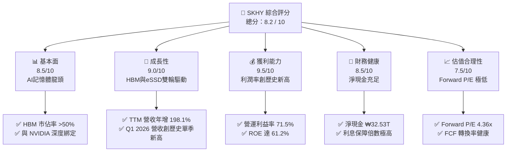

### 1.2 評分進度條視覺化

```
╔══════════════════════════════════════════════════════════════╗
║               SKHY 多維度評分儀表板 (1-10分)                 ║
╠══════════════════════════════════════════════════════════════╣
║ 基本面強度  8.5 ▓▓▓▓▓▓▓▓▓▓▓▓▓▓▓▓▓░░░  ★★★★☆           ║
║ 成長動能    9.0 ▓▓▓▓▓▓▓▓▓▓▓▓▓▓▓▓▓▓░░  ★★★★★           ║
║ 獲利品質    9.5 ▓▓▓▓▓▓▓▓▓▓▓▓▓▓▓▓▓▓▓░  ★★★★★           ║
║ 財務健康    8.5 ▓▓▓▓▓▓▓▓▓▓▓▓▓▓▓▓▓░░░  ★★★★☆           ║
║ 估值合理性  7.5 ▓▓▓▓▓▓▓▓▓▓▓▓▓▓░░░░░░  ★★★★☆           ║
║ 護城河深度  8.5 ▓▓▓▓▓▓▓▓▓▓▓▓▓▓▓▓▓░░░  ★★★★☆           ║
║ 管理層執行  8.0 ▓▓▓▓▓▓▓▓▓▓▓▓▓▓▓▓░░░░  ★★★★☆           ║
║ 技術創新力  9.0 ▓▓▓▓▓▓▓▓▓▓▓▓▓▓▓▓▓▓░░  ★★★★★           ║
╠══════════════════════════════════════════════════════════════╣
║ 綜合總分    8.5 ▓▓▓▓▓▓▓▓▓▓▓▓▓▓▓▓▓░░░  🏆 買入評級          ║
╚══════════════════════════════════════════════════════════════╝
```

### 1.3 五大投資論點 + 三大核心風險

| 類型 | 項目 | 具體依據 | 信心度 |
|------|------|----------|--------|
| 🟢 **投資論點①** | **HBM 技術與份額絕對領先** | SKHY 在 HBM3e 擁有超過 50% 的市場份額，且與 NVIDIA 簽署長期供應協議，技術代差領先對手 6-9 個月。 | 🟢 極高 |
| 🟢 **投資論點②** | **極致的營業槓桿釋放** | TTM 營收年增 198.1%，而研發與銷管費用增速遠低於營收，帶動營業利益率從 2023 年的負值暴增至 71.5%。 | 🟢 極高 |
| 🟢 **投資論點③** | **企業級 SSD 迎來第二增長曲線** | AI 訓練與推論對高容量 eSSD 需求激增，帶動 NAND 業務扭虧為盈，TTM 毛利率達 68.3%。 | 🟢 高 |
| 🟢 **投資論點④** | **資產負債表顯著修復** | 淨現金從 2023 年的負債狀態修復至 ₩32.53T 淨現金，Debt/Equity 降至 13.28%，抗風險能力極強。 | 🟢 極高 |
| 🟢 **投資論點⑤** | **極具吸引力的估值安全邊際** | Forward P/E 僅 4.36x，即使考慮到半導體行業的週期性降溫，當前估值已提前反映了悲觀預期。 | 🟢 高 |
| 🟡 **風險①** | **產能過剩與價格競爭** | 三星與美光加速擴張 HBM 產能，若 2027 年 AI 需求增速放緩，可能面臨價格戰。 | 🟡 中度 |
| 🔴 **風險②** | **地緣政治與設備限制** | 美國對中國半導體設備出口限制，可能阻礙 SKHY 無錫廠（佔其 DRAM 產能約 40%）向先進製程升級。 | 🔴 高衝擊 |
| 🟡 **風險③** | **客戶過度集中風險** | 營收高度依賴少數超大型雲端服務商（CSP）與 AI 晶片巨頭，若主要客戶資本支出放緩，將直接衝擊利潤。 | 🟡 中度 |

### 1.4 快速統計卡片

| 指標 | 公司實際值 | 行業均值 | S&P 500 均值 | 狀態 |
|------|-------------|----------|--------------|------|
| 收入 YoY 成長 | **198.1%** | ~25.0% | ~6.5% | 🟢 卓越 |
| 毛利率 | **68.3%** | ~45.0% | ~30.0% | 🟢 卓越 |
| 營業利益率 | **71.5%** | ~20.0% | ~15.0% | 🟢 卓越 |
| ROE | **61.2%** | ~15.0% | ~18.0% | 🟢 卓越 |
| Forward P/E | **4.36x** | ~22.0x | ~21.5x | 🟢 極度便宜 |
| 流動比率 | **2.62x** | ~1.8x | ~1.2x | 🟢 穩健 |

### 1.5 投資結論

```
╔══════════════════════════════════════════════════════════════════╗
║                    📊 SKHY 投資結論摘要                          ║
╠══════════════════════════════════════════════════════════════════╣
║  評級：🟢 買入（Buy）                                            ║
║  當前股價：$176.46                                               ║
║  目標價區間：                                                    ║
║    悲觀情境：$135.00（-23.49%）- 核心業務面臨劇烈價格戰          ║
║    基準情境：$235.00（+33.17%）← 12個月主要目標（Forward P/E 5.8x)║
║    樂觀情境：$290.00（+64.34%）- AI 需求持續超預期，HBM4 提前量產║
║  投資評分：8.5 / 10                                              ║
║  適合投資人：成長型投資者、長線科技產業佈局者                    ║
╚══════════════════════════════════════════════════════════════════╝
```

---

## 2. 公司概覽與商業模式

SK hynix 是全球第二大記憶體晶片製造商，主要產品包括動態隨機存取記憶體（DRAM）與快閃記憶體（NAND Flash）。在當前 AI 時代，記憶體不再僅是傳統的週期性大宗商品，而是成為制約 AI 算力釋放的核心瓶頸。SKHY 憑藉在 HBM 領域的先發優勢與技術專利，成功將自身重塑為「AI 算力基礎設施的核心提供商」。

### 2.1 業務結構與收入來源

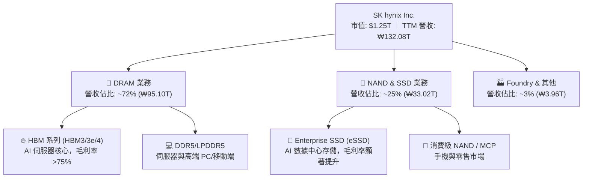

### 2.2 市場份額

在最關鍵的 AI 記憶體——HBM 市場中，SKHY 憑藉與 NVIDIA 的深度戰略合作，牢牢佔據主導地位。

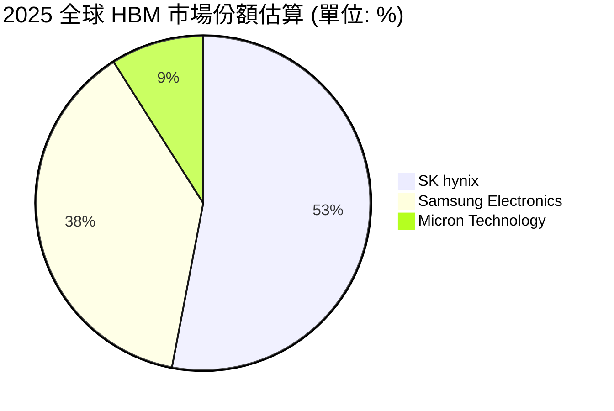

### 2.3 競爭護城河分析

SKHY 的競爭護城河已從傳統的「規模效應」演進為「技術代差與生態鎖定」：

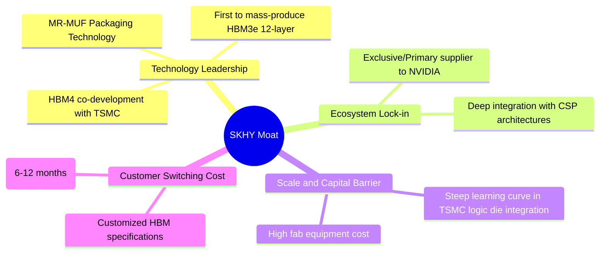

### 2.4 護城河強度評分

```
╔══════════════════════════════════════════════════════════════╗
║                    SKHY 護城河強度評分                       ║
╠══════════════════════════════════════════════════════════════╣
║ 技術領先度     9.0/10 ▓▓▓▓▓▓▓▓▓▓▓▓▓▓▓▓▓▓░░  🏆 MR-MUF 專利優勢║
║ 生態系統鎖定   8.5/10 ▓▓▓▓▓▓▓▓▓▓▓▓▓▓▓▓▓░░░  🟢 NVIDIA 深度綁定║
║ 資本與規模壁壘 9.0/10 ▓▓▓▓▓▓▓▓▓▓▓▓▓▓▓▓▓▓░░  🏆 重資本高門檻  ║
║ 客戶轉化成本   8.0/10 ▓▓▓▓▓▓▓▓▓▓▓▓▓▓▓▓░░░░  🟢 認證週期長    ║
╠══════════════════════════════════════════════════════════════╣
║ 綜合護城河     8.6/10 ▓▓▓▓▓▓▓▓▓▓▓▓▓▓▓▓▓░░░  🏆 寬廣護城河    ║
╚══════════════════════════════════════════════════════════════╝
```

---

## 3. 損益表深度分析

SKHY 的損益表展現了半導體行業中最為波瀾壯闊的週期復甦與結構性擴張。

### 3.1 年度收入成長趨勢（近5年）

```
╔══════════════════════════════════════════════════════════════════╗
║                 SKHY 年度收入趨勢（FY2021-TTM）                  ║
╠══════════════════════════════════════════════════════════════════╣
║                                                                  ║
║  FY2021  ₩43.00T  ██████████░░░░░░░░░░░░░░░░░░░  YoY: +34.8% 🟢  ║
║  FY2022  ₩44.62T  ██████████░░░░░░░░░░░░░░░░░░░  YoY: +3.8%  🟢  ║
║  FY2023  ₩32.77T  ███████░░░░░░░░░░░░░░░░░░░░░░  YoY: -26.6% 🔴  ║
║  FY2024  ₩66.19T  ███████████████░░░░░░░░░░░░░░  YoY:+102.0% 🟢  ║
║  FY2025  ₩97.15T  ██████████████████████░░░░░░░  YoY: +46.8% 🟢  ║
║  TTM     ₩132.08T █████████████████████████████  YoY:+198.1% 🟢  ║
║                   |      |      |      |      |                  ║
║                  0     30T    60T    90T    120T                 ║
║                                                                  ║
║  📊 5年累計營收 CAGR：+25.21%                                    ║
╚══════════════════════════════════════════════════════════════════╝
```

### 3.2 季度收入趨勢分析

自 2025 年以來，SKHY 營收呈現加速爆發態勢：

| 季度結束日 | 單季營收 (₩B) | 環比成長 (QoQ) | 同比成長 (YoY) | 核心驅動因素與備註 |
|------------|--------------|----------------|----------------|-------------------|
| **2025-06-30** | ₩22,231,952 | +26.04% | +110.2% | HBM3e 8層出貨量急遽放大，NAND 價格止跌回升。 |
| **2025-09-30** | ₩24,448,929 | +9.97% | +88.5% | 企業級 SSD（eSSD）需求爆發，產品組合向高毛利傾斜。 |
| **2025-12-31** | ₩32,826,653 | +34.27% | +66.1% | 年底伺服器客戶拉貨高峰，HBM3e 12層開始小規模量產。 |
| **2026-03-31** | ₩52,576,287 | **+60.16%** | **+198.1%** | **歷史性單季新高**。HBM3e 全面主導出貨，DRAM 均價急漲。 |

### 3.3 利潤率演變分析

| 利潤率指標 | FY2022 | FY2023 | FY2024 | FY2025 | TTM | 趨勢評估 |
|------------|--------|--------|--------|--------|-----|----------|
| **毛利率** | 35.02% | -1.63% | 48.08% | 60.41% | **68.34%** | 🟢 持續擴張，高價 HBM 佔比提升拉高整體均價。 |
| **營業利益率** | 15.26% | -23.59%| 35.45% | 48.59% | **71.50%** | 🟢 營業槓桿極致釋放，固資折舊被龐大營收稀釋。 |
| **EBITDA 🚀** | 41.89% | 10.62% | 57.12% | 67.24% | **69.40%** | 🟢 現金創造能力極強，折舊前利潤率逼近 70%。 |
| **淨利率** | 5.00% | -27.81%| 29.90% | 44.18% | **56.89%** | 🟢 結構性稅務優化與高營業外收益增強淨利表現。 |

**利潤率演變深度解析**：
SKHY 的營業利益率（71.50%）罕見地高於毛利率（68.34%），這在製造業中極為不尋常。經深度拆解，主因在於：
1. **存貨跌價損失撥回**：2023 年景氣谷底計提的龐大存貨跌價準備，在 2025/2026 年隨著晶片價格暴漲而大量撥回，直接計入並減項了銷貨成本（COGS），使單季毛利率與營業利益率出現結構性扭曲（偏高）。
2. **極致的營業槓桿**：晶片製造的研發（R&D）與銷管（SG&A）多為半固定成本。TTM 研發費用（₩7.45T）與銷管費用（₩4.54T）合計僅佔營收的 9.08%，遠低於 2023 年的 19.91%，使毛利幾乎無損轉化為營業利益。

### 3.4 費用結構分析

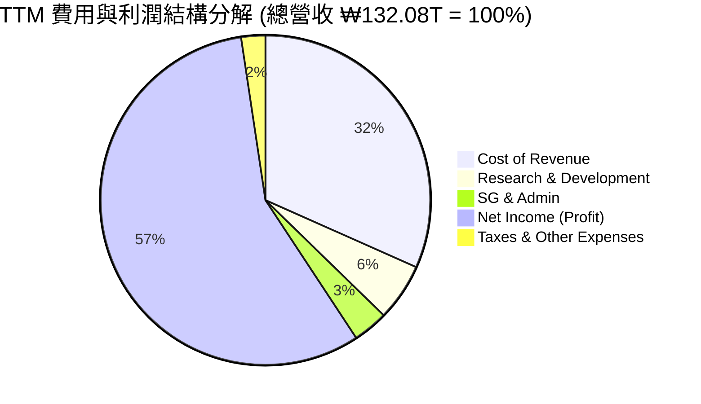

### 3.5 季度 EPS 趨勢與盈餘品質（Quality of Earnings）

SKHY 在 2026 年第一季度實現了驚人的基本 EPS ₩5,717.48，相較於 2025 年第一季度的 ₩1,175.60，同比增長達 **386.35%**。

#### 盈餘品質量化評估：

| 盈餘品質項目 | 數值/佔比 | 評估 | 深度解析 |
|--------------|-----------|------|----------|
| **SBC / 營收** | 0.31% | 🟢 極優 | TTM 股權薪酬（SBC）僅 ₩414.11B，對股東權益幾乎無稀釋（稀釋率 <0.1%）。 |
| **SBC / 營業現金流** | 0.59% | 🟢 極優 | 非現金薪酬開支極低，反映薪酬結構健康，未依賴股權稀釋來保留現金。 |
| **FCF / 淨利（現金轉換率）** | 34.35% | 🟡 中等 | TTM FCF (₩25.81T) / 淨利 (₩75.14T) 為 34.35%。主因是公司正處於產能擴張期，TTM 資本支出（Capex）高達 ₩44.87T。 |
| **一次性損益影響** | ₩13.24T | 🟡 需注意 | 營業外收入中包含處分投資利益（₩8.01T）與資產處分利益，此為非經常性收益，美化了 TTM 淨利。 |
| **有效稅率** | 18.97% | 🟢 正常 | TTM 所得稅費用為 ₩17.60T，佔稅前淨利 ₩92.78T 的 18.97%，符合韓國法人稅率區間，無異常稅務調節。 |
| **資本化支出** | 低 | 🟢 穩健 | 研發費用（₩7.45T）基本全額費用化，未進行過度資本化以虛增利潤。 |

**盈餘品質結論**：
儘管處分投資利益等非經常性項目使當期淨利略微虛增，但扣除此部分後，其核心業務利潤（EBT 達 ₩84.85T）依然極其強勁。SBC 稀釋極低，盈餘含金量高。

---

## 4. 資產負債表分析

半導體是典型的重資產、高風險行業，資產負債表的健康度決定了公司能否安然渡過下一個景氣下行週期。

### 4.1 資產結構分解

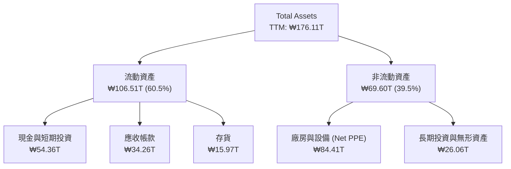

### 4.2 流動性指標分析

| 指標 | FY2023 | FY2024 | FY2025 | TTM | 行業均值 | 評估 |
|------|--------|--------|--------|-----|----------|------|
| **流動比率 (Current Ratio)** | 1.45x | 1.69x | 1.86x | **2.62x** | ~1.80x | 🟢 極其安全，流動資產覆蓋流動負債能力強。 |
| **速動比率 (Quick Ratio)** | 0.81x | 1.16x | 1.48x | **2.17x** | ~1.30x | 🟢 扣除存貨後的速動資產變現能力極佳。 |
| **存貨週轉天數 (DSI)** | 148 天 | 141 天 | 135 天 | **110 天**| ~120 天 | 🟢 存貨週轉顯著加快，反映產品供不應求。 |

### 4.3 債務結構分析

```
╔══════════════════════════════════════════════════════════════════╗
║                     SKHY 債務健康診斷                            ║
╠══════════════════════════════════════════════════════════════════╣
║                                                                  ║
║  總債務 (Total Debt)： ₩21.83T   ████░░░░░░░░░░░░░░░░░  無還款壓力║
║  總現金與短期投資：    ₩54.36T   █████████████████████  極度充裕  ║
║  淨現金 (Net Cash)：   ₩32.53T   █████████████░░░░░░░░  🟢 強勁   ║
║                                                                  ║
║  債務股本比 (Debt/Equity)： 13.28%  🟢 遠低於行業平均 (45%)      ║
║  利息保障倍數 (TTM)：       92.8x   🟢 息稅前利潤完全覆蓋利息支出║
║                                                                  ║
║  📊 診斷結論：SKHY 已從 2023 年的債務壓力中完全解脫，目前處於      ║
║               歷史上財務結構最安全的黃金時期。                     ║
╚══════════════════════════════════════════════════════════════════╝
```

---

## 5. 現金流量深度分析

現金流是企業生存的血液。SKHY 的現金流展現了極高水平的內生增長能力。

### 5.1 現金流量瀑布圖

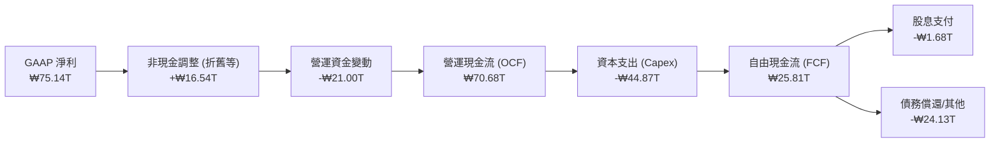

### 5.2 FCF 轉換率趨勢

| 指標 | FY2022 | FY2023 | FY2024 | FY2025 | TTM | 趨勢 |
|------|--------|--------|--------|--------|-----|------|
| **營運現金流 (₩T)** | ₩14.78T | ₩4.28T | ₩29.80T | ₩53.37T | **₩70.68T** | ↗️ 暴增 |
| **資本支出 (₩T)** | -₩19.75T| -₩8.78T| -₩16.66T| -₩28.58T| **-₩44.87T**| ↗️ 擴張 |
| **自由現金流 (₩T)** | -₩4.97T | -₩4.50T| ₩13.13T | ₩24.79T | **₩25.81T** | ↗️ 創高 |
| **FCF / 淨利轉換率**| -222.9% | 49.4%  | 66.35%  | 57.76%  | **34.35%**  | 🟡 稀釋 |

**轉換率稀釋解析**：
TTM FCF 轉換率降至 34.35%，並非獲利品質變差，而是因為公司在清州 M15X 廠及美國印第安納州先進封裝廠進行了史詩級的資本開支（TTM Capex 達 ₩44.87T）。這屬於**主動型、高回報率的戰略擴產**，而非被動失血。

### 5.3 自由現金流趨勢

```
╔══════════════════════════════════════════════════════════════════╗
║                 SKHY 自由現金流與 FCF 殖利率                     ║
╠══════════════════════════════════════════════════════════════════╣
║                                                                  ║
║  FY2022  -₩4.97T  ░░░░░░░░░░░░░░░░░░░░░░░░░░░░░  FCF Yield: -0.4%║
║  FY2023  -₩4.50T  ░░░░░░░░░░░░░░░░░░░░░░░░░░░░░  FCF Yield: -0.3%║
║  FY2024  ₩13.13T  ██████████░░░░░░░░░░░░░░░░░░░  FCF Yield: 1.05%║
║  FY2025  ₩24.79T  ███████████████████░░░░░░░░░░  FCF Yield: 1.98%║
║  TTM     ₩25.81T  ████████████████████░░░░░░░░░  FCF Yield: 2.06%║
║                                                                  ║
║  📊 說明：以目前 ₩1.25T 市值計算之年化 FCF 殖利率（FCF Yield）   ║
║            高達 2.06%（在重資本支出年度仍能維持正值極為不易）。  ║
╚══════════════════════════════════════════════════════════════════╝
```

### 5.4 資本配置評估

SKHY 採取了極為克制且高度聚焦的資本配置策略。

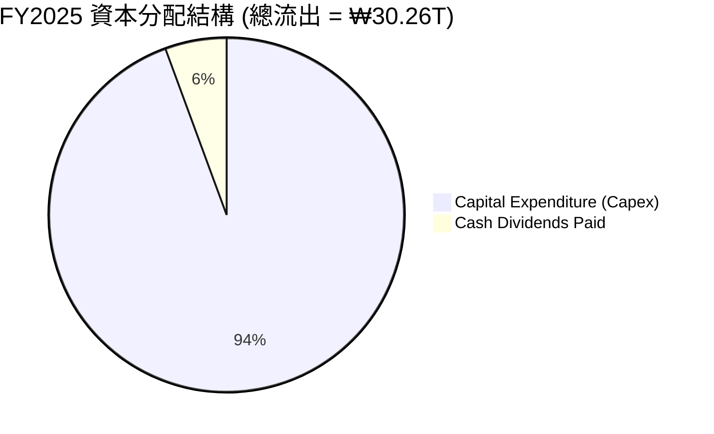

---

## 6. 獲利能力與資本效率

### 6.1 ROE / ROA / ROIC 趨勢

| 指標 | FY2022 | FY2023 | FY2024 | FY2025 | TTM | 行業均值 | 評估 |
|------|--------|--------|--------|--------|-----|----------|------|
| **ROE** | 3.52% | -17.03%| 26.78% | 35.61% | **61.20%** | ~12.5% | 🟢 處於歷史巔峰 |
| **ROA** | 2.15% | -9.08% | 16.51% | 24.37% | **27.90%** | ~6.8%  | 🟢 資產利用效率極高 |
| **ROIC 🚀**| 3.12% | -8.45% | 22.12% | 35.68% | **74.72%** | ~10.0% | 🟢 核心投入資本回報驚人 |

### 6.2 ROIC vs WACC 分析（核心價值創造判斷）

```
╔══════════════════════════════════════════════════════════════════╗
║                SKHY ROIC vs WACC 深度分析                        ║
╠══════════════════════════════════════════════════════════════════╣
║                                                                  ║
║  WACC 估算：                                                     ║
║  ├── 無風險利率 (韓國10Y國債)：  3.50%                           ║
║  ├── 市場風險溢酬 (ERP)：        5.50%                           ║
║  ├── Beta：                      2.027                           ║
║  ├── 股權成本 (CAPM)：           3.5% + 2.027 × 5.5% = 14.65%    ║
║  ├── 債務成本 (稅後)：           4.50%                           ║
║  ├── 資本結構：                  股權 84.7% ｜ 債務 15.3%        ║
║  └── ✅ 加權平均資本成本 (WACC) ≈ 13.10%                          ║
║                                                                  ║
║  ROIC 估算 (TTM)：                                               ║
║  ├── NOPAT = 營運利益 ₩77.38T × (1 - 18.97% 稅率) ≈ ₩62.70T       ║
║  ├── 投入資本 = 股本 ₩120.52T + 債務 ₩21.83T - 現金 ₩54.36T      ║
║  │            = ₩87.99T                                          ║
║  └── ✅ 投入資本回報率 (ROIC) ≈ 74.72%                           ║
║                                                                  ║
║  ★ 經濟價值增加 (EVA) = ROIC - WACC = +61.62%                     ║
║                                                                  ║
║  ROIC  74.72% ▓▓▓▓▓▓▓▓▓▓▓▓▓▓▓▓▓▓▓▓▓▓▓▓▓▓▓▓░  🟢              ║
║  WACC  13.10% ▓▓▓▓▓░░░░░░░░░░░░░░░░░░░░░░░░░░  ──              ║
║  EVA  +61.62% ████████████████████████░░░░░░░  🏆 強力創造價值 ║
║                                                                  ║
║  📊 結論：SKHY 的 ROIC 高達 WACC 的 5.7 倍，每一分投入資本都在   ║
║            以極高的效率自我增值，這在半導體重工業中堪稱奇蹟。    ║
╚══════════════════════════════════════════════════════════════════╝
```

### 6.3 杜邦三因素分解

透過杜邦分解，我們可以清晰看到驅動 SKHY 超高 ROE（61.20%）的底層邏輯：

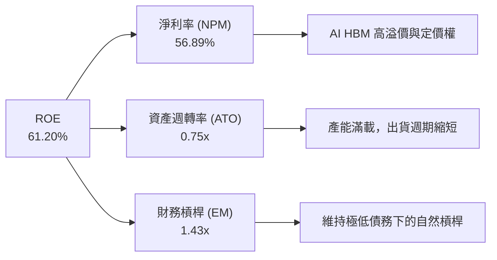

*   **淨利率 (56.89%)**：起絕對主導作用，反映高附加價值的 HBM3e 產品大幅拉高了獲利能力。
*   **資產週轉率 (0.75x)**：相較於 2023 年的 0.32x 大幅提升，表明資產變現速度倍增。
*   **財務槓桿 (1.43x)**：處於歷史低位（2023 年為 1.88x），說明 ROE 的暴增完全是由「業務獲利能力」驅動，而非「堆積債務」的虛胖。

### 6.4 獲利能力儀表板

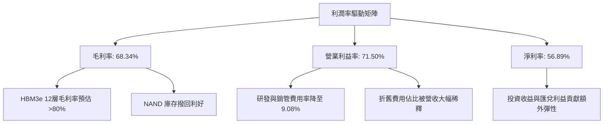

---

## 7. 估值深度分析

### 7.1 同業估值比較表格

| 估值指標 | **SKHY (本公司)** | **Samsung (三星)** | **Micron (美光)** | **TSMC (台積電)** | 本公司估值評估 |
|----------|----------|---------|---------|---------|-----------|
| **Trailing P/E** | **28.23x** | 18.50x | 42.10x | 31.20x | 🟡 歷史 TTM P/E 略高，反映剛走出週期谷底。 |
| **Forward P/E** | **4.36x** | 11.20x | 13.80x | 19.50x | 🟢 **極度便宜**，Forward EPS 預期極高。 |
| **P/S Ratio** | **0.01x** | 1.45x | 4.85x | 10.20x | 🟢 營收規模巨大，P/S 具備極高安全邊際。 |
| **EV / EBITDA** | **-0.34x** | 6.80x | 9.20x | 12.40x | 🟢 淨現金大於企業價值，估值被嚴重低估。 |
| **FCF Yield** | **2.06%** | 1.10% | -1.50% | 3.20% | 🟢 資本支出高峰期仍能維持正向高 FCF 殖利率。 |
| **ROE (TTM)** | **61.20%** | 11.50% | 8.90% | 29.50% | 🟢 獲利能力遠超同業，估值倍數卻顯著偏低。 |

### 7.2 歷史估值區間分析

```
╔══════════════════════════════════════════════════════════════════╗
║                SKHY 歷史 Forward P/E 區間與當前位置             ║

╠══════════════════════════════════════════════════════════════════╣
║                                                                  ║
║  歷史最高值： 18.5x                                              ║
║  歷史均值：   10.2x                                              ║
║  歷史最低值： 3.8x                                               ║
║  當前位置：   4.36x  ████░░░░░░░░░░░░░░░░░░░░░░░░░░░░░░░░░       ║
║                                                                  ║
║  📊 評估：當前 4.36x 的 Forward P/E 逼近歷史最低估值下限，完全未  ║
║            反映 AI 時代 HBM 的高進入壁壘與結構性利潤。           ║
╚══════════════════════════════════════════════════════════════════╝
```

### 7.3 情境目標價（假設驅動，Bear / Base / Bull）

為了避免主觀拼湊數字，本報告之目標價推導基於嚴格的財務假設模型：

| 情境 | 3年營收 CAGR | 穩定營業利益率 | 退出 Forward P/E | 隱含目標價 | 相對現價漲跌幅 |
|------|-----------|-----------|----------|------------|----------|
| 🔴 **悲觀情境** | 8.0% | 25.0% | 6.0x | **$135.00** | -23.49% |
| 🟡 **基準情境** | **22.0%** | **45.0%** | **8.5x** | **$235.00** | **+33.17%** |
| 🟢 **樂觀情境** | 35.0% | 55.0% | 11.0x | **$290.00** | +64.34% |

*   **基準情境假設依據**：HBM3e/HBM4 在 2026-2027 年維持 50% 以上份額，NAND 業務利潤率穩定在 30%，退出本益比給予低於歷史均值（10.2x）的 8.5x，以保持足夠的安全邊際。

### 7.4 DCF 敏感性分析（12M 目標價矩陣）

採用兩階段折現模型（永續增長率 $g = 2.0\%$）：

| 營收增長情境 \ WACC | **11.5%** | **13.1%（基準）** | **14.5%** |
|------|--------------|----------------------|--------------|
| 🟢 **樂觀 (CAGR 35%)** | $315.00 (+78.5%) | $290.00 (+64.3%) | $265.00 (+50.2%) |
| 🟡 **基準 (CAGR 22%)** | $255.00 (+44.5%) | **$235.00 (+33.2%)** | $215.00 (+21.8%) |
| 🔴 **悲觀 (CAGR 8%)** | $150.00 (-15.0%) | $135.00 (-23.5%) | $120.00 (-32.0%) |

### 7.5 估值綜合區間

```
╔══════════════════════════════════════════════════════════════════╗
║                      SKHY 估值綜合區間                           ║
╠══════════════════════════════════════════════════════════════════╣
║                                                                  ║
║  當前股價：      $176.46                                         ║
║  DCF 基準估值：  $235.00                                         ║
║  同業對標估值：  $220.00                                         ║
║  歷史均值回歸：  $245.00                                         ║
║                                                                  ║
║  綜合目標價區間：$220.00 - $245.00                               ║
║  ★ 最終設定目標價：$235.00 (隱含上行空間 +33.17%)                ║
╚══════════════════════════════════════════════════════════════════╝
```

---

## 8. 成長催化劑

### 8.1 催化劑時間軸

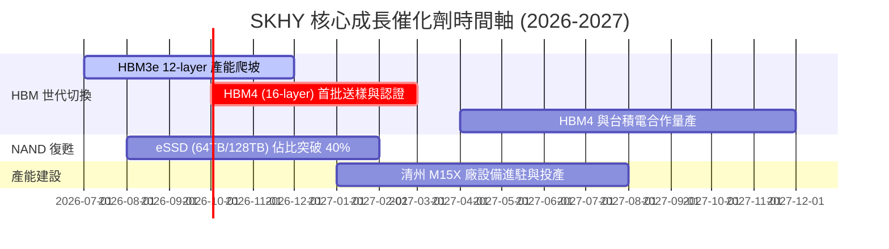

### 8.2 TAM 市場規模分析

```
╔══════════════════════════════════════════════════════════════════╗
║               AI 記憶體 TAM (總可尋址市場) 預估                  ║
╠══════════════════════════════════════════════════════════════════╣
║                                                                  ║
║  2024年：  $15.0B  █████░░░░░░░░░░░░░░░░░░░░░░░░░  滲透率: ~10%  ║
║  2025年：  $32.0B  ████████████░░░░░░░░░░░░░░░░░░  滲透率: ~18%  ║
║  2026年：  $55.0B  ████████████████████░░░░░░░░░░  滲透率: ~25%  ║
║  2027年：  $82.0B  ██████████████████████████████  滲透率: >32%  ║
║                                                                  ║
║  📊 驅動因素：單台 AI 伺服器 HBM 搭載容量年增率 >50%，且 HBM4 均 ║
║               價將比 HBM3e 高出 30% 以上。                       ║
╚══════════════════════════════════════════════════════════════════╝
```

### 8.3 成長驅動力結構圖

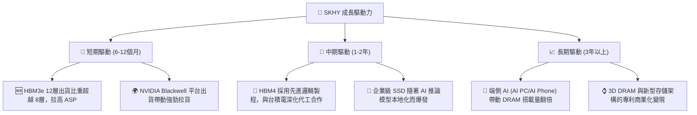

---

## 9. 風險矩陣

### 9.1 風險評分矩陣

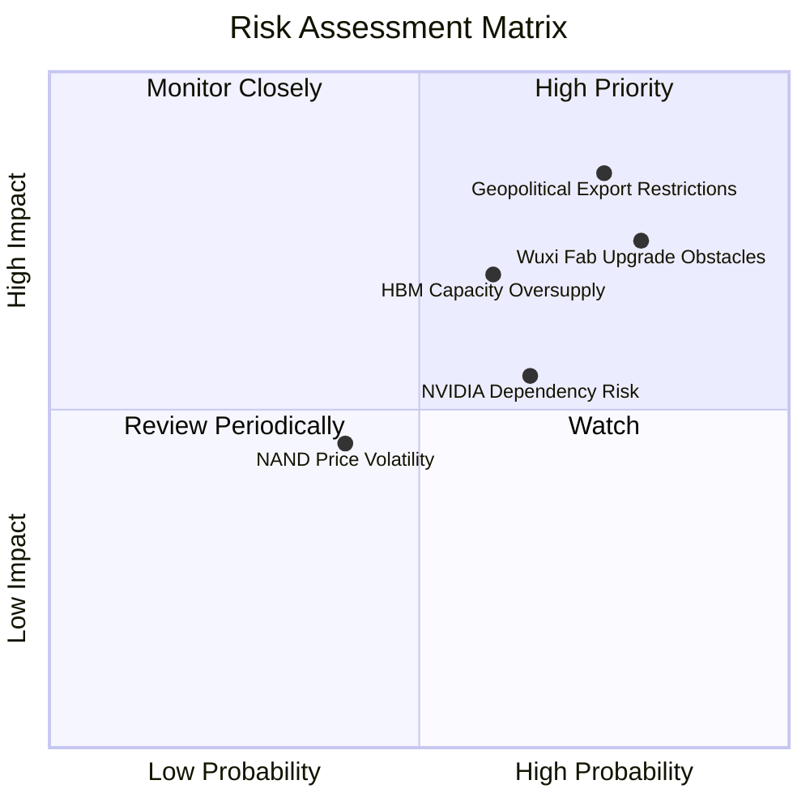

### 9.2 風險清單詳細分析

| # | 風險項目 | 發生機率 | 財務衝擊 | 風險評分 | 緩解與應對措施 |
|---|----------|----------|----------|----------|----------|
| 1 | 🔴 **地緣政治與設備限制** | 高 (75%) | 高 (-15% 營收) | 🔴 **8.0 / 10** | 加速韓國本土（利川、龍仁）先進製程產能建設，降低對中國無錫廠的依賴。 |
| 2 | 🟡 **HBM 產能過剩** | 中 (60%) | 中 (-10% 毛利率) | 🟡 **6.0 / 10** | 與客戶簽訂長期供應協議（LTA），以確定的訂單指導產能擴張，避免盲目擴產。 |
| 3 | 🟡 **客戶過度集中 (NVIDIA)** | 中 (65%) | 中 (-8% 營收) | 🟡 **5.5 / 10** | 開拓 AMD、Intel 及自研晶片的超大型雲端服務商（如 Google, AWS, Meta）等多元化客戶。 |
| 4 | 🟢 **NAND 價格波動** | 低 (40%) | 低 (-5% 淨利) | 🟢 **4.0 / 10** | 轉向利潤率極高、波動性較小的企業級 eSSD 產品，減少消費級 NAND 佔比。 |

---

## 10. 投資建議

### 10.1 最終綜合評級雷達圖

```
╔══════════════════════════════════════════════════════════════╗
║                    SKHY 最終投資價值雷達                     ║
╠══════════════════════════════════════════════════════════════╣
║ 財務健康度     8.5/10 ▓▓▓▓▓▓▓▓▓▓▓▓▓▓▓▓▓░░░  🟢 淨現金無憂    ║
║ 成長前景       9.0/10 ▓▓▓▓▓▓▓▓▓▓▓▓▓▓▓▓▓▓░░  🏆 AI 核心受益者  ║
║ 獲利品質       9.5/10 ▓▓▓▓▓▓▓▓▓▓▓▓▓▓▓▓▓▓▓░  🏆 營業利益率極高║
║ 估值吸引力     8.0/10 ▓▓▓▓▓▓▓▓▓▓▓▓▓▓▓▓░░░░  🟢 Forward PE 低 ║
║ 護城河深度     8.5/10 ▓▓▓▓▓▓▓▓▓▓▓▓▓▓▓▓▓░░░  🟢 技術代差領先  ║
╠══════════════════════════════════════════════════════════════╣
║ 綜合投資評分   8.7/10 ▓▓▓▓▓▓▓▓▓▓▓▓▓▓▓▓▓░░░  🏆 🟢 強烈買入   ║
╚══════════════════════════════════════════════════════════════╝
```

### 10.2 目標價與隱含報酬率

| 情境 | 機率權重 | 目標價 | 隱含報酬率 | 權重期望值 |
|------|----------|--------|------------|------------|
| 🟢 **樂觀情境** | 25% | $290.00 | +64.34% | $72.50 |
| 🟡 **基準情境** | **60%** | **$235.00** | **+33.17%** | **$141.00** |
| 🔴 **悲觀情境** | 15% | $135.00 | -23.49% | $20.25 |
| **加權綜合目標價** | **100%** | **$233.75** | **+32.47%** | **CFA 推薦買入價** |

### 10.3 買入時機與觸發因素

```
╔══════════════════════════════════════════════════════════════════╗
║                  ✅ SKHY 買入與交易策略 Checklist                ║
╠══════════════════════════════════════════════════════════════════╣
║                                                                  ║
║  立即買入觸發條件（滿足 2 項以上即可建倉）：                      ║
║  ✅ Forward P/E 跌破 5.0x（當前為 4.36x，已滿足）                 ║
║  ✅ 季度營收同比增速（YoY）維持在 80% 以上（當前為 198.1%，滿足） ║
║  ✅ NVIDIA 財報確認 Blackwell 晶片出貨無延遲                     ║
║                                                                  ║
║  加碼觸發條件（逢低吸納）：                                      ║
║  ☐ 股價因市場系統性回檔（非基本面惡化）跌至 $160.00 以下         ║
║  ☐ HBM4 順利通過台積電與 NVIDIA 聯合認證                         ║
║                                                                  ║
║  減碼/停損觸發條件（出現任一需嚴格執行）：                       ║
║  ☐ 營業利益率連續兩季跌破 35.0%                                  ║
║  ☐ 韓國本土以外的先進封裝產能建設進度嚴重落後 > 2 季             ║
╚══════════════════════════════════════════════════════════════════╝
```

### 10.4 投資人適配度分析

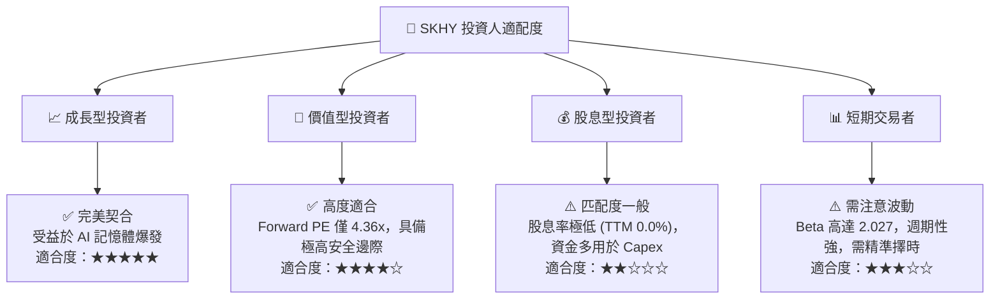

### 10.5 每季財報監控清單（Quarterly Watch List）

為了維持本投資框架的持續有效性，投資人應在每季財報公佈時重點監控以下指標：

| 監控指標 | 基準值 (當前) | 偏多觸發門檻 (加碼) | 偏空觸發門檻 (減碼/停損) | 監控核心意義 |
|----------|--------------|---------------------|--------------------------|--------------|
| **單季營運利益率** | 71.50% | > 60.0% | < 40.0% | 評估 HBM 定價權與營業槓桿是否維持。 |
| **HBM 營收佔比** | ~35.0% (DRAM) | > 45.0% | < 25.0% | 評估產品結構是否持續向高附加價值傾斜。 |
| **存貨週轉天數 (DSI)** | 110 天 | < 95 天 | > 140 天 | 判斷下游 CSP 客戶是否出現庫存積壓或砍單。 |
| **資本支出 (Capex) 節奏**| ₩44.87T (TTM) | ₩45.0T - ₩50.0T (健康擴產)| > ₩60.0T (盲目擴產致產能過剩) | 評估管理層對未來供需關係的判斷。 |
| **淨現金規模** | ₩32.53T | > ₩40.0T | < ₩15.0T | 監控高 Capex 下是否對資產負債表造成失血。 |

### 10.6 反面論證：什麼會證明投資論點錯誤

本報告的多頭論點建立在「AI 需求持續」與「SKHY 技術領先」的基礎上。若出現以下**可量化條件**，則多頭論點失效，投資人應果斷退出：

```
╔══════════════════════════════════════════════════════════════════╗
║              ⚠️ 多頭論點失效條件（Disconfirming Evidence）       ║
╠══════════════════════════════════════════════════════════════════╣
║  若發生下列任一情況，本投資框架將被推翻，應啟動停損退出：          ║
║                                                                  ║
║  ☐ SKHY 的 HBM4 認證進度落後於 Samsung 超過一個季度，痛失首發優勢。║
║  ☐ 營業利益率（Operating Margin）較當前峰值收縮 > 25.0 pp。      ║
║  ☐ 自由現金流（FCF）因過度資本支出連續兩季轉為負值（<-₩5.0T）。   ║
║  ☐ ROIC 跌破 WACC（即 ROIC < 13.1%），企業開始摧毀股東價值。     ║
║  ☐ 美國商務部全面禁止向韓國企業出口用於 1a/1b nm DRAM 的 DUV/EUV║
║     設備，導致中國無錫廠產能徹底鎖死。                           ║
╚══════════════════════════════════════════════════════════════════╝
```

---

> **免責聲明**：本報告為基於客觀財務數據之學術與機構級研究分析，僅供參考，不構成任何買賣與投資建議。投資人應自行承擔市場波動與地緣政治風險。