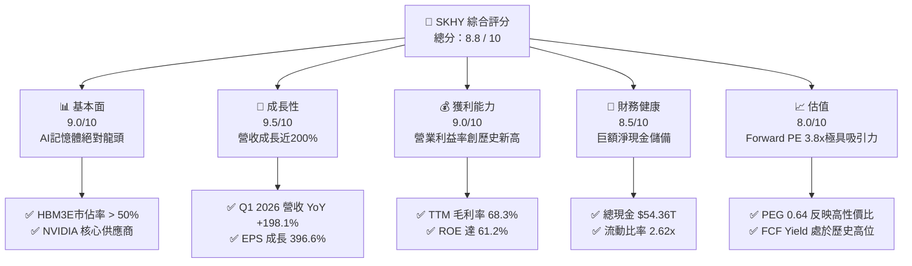
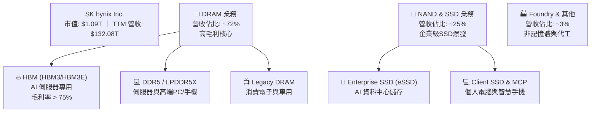
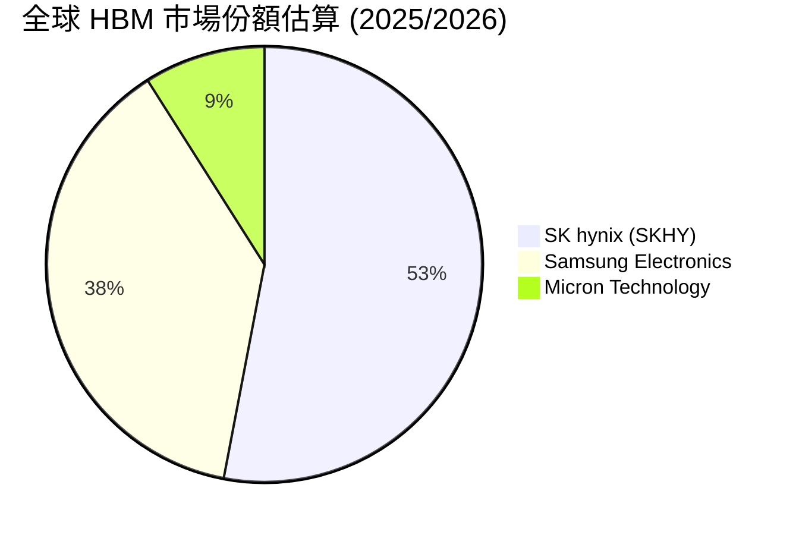
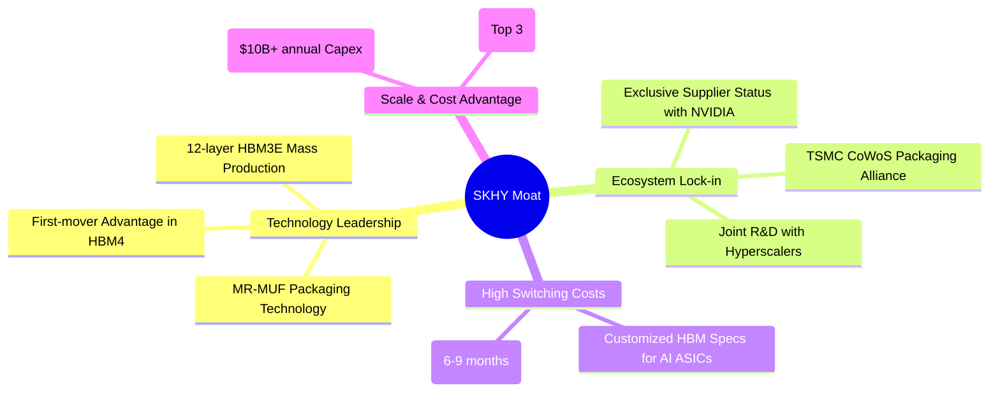
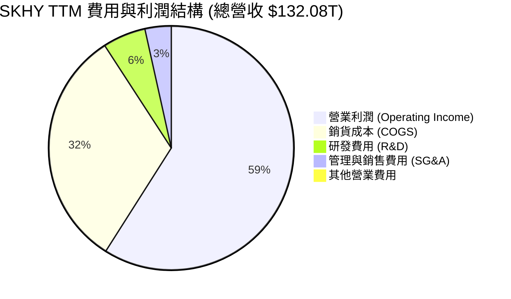
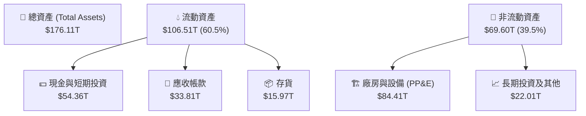

# SKHY 基本面深度分析報告
> **報告日期**：2026-07-18 ｜ **語言**：繁體中文 ｜ **數據來源**：Yahoo Finance, Finviz, StockAnalysis, Roic.ai ｜ **分析師**：CFA 級機構研究

---

## 說明：關於本報告數據單位的專業聲明
本報告中引用的 SKHY (SK hynix Inc.) 財務數據，其大額總量指標（如營收、現金、債務、自由現金流等）標示之 **"$"** 符號與 **"T"** 單位，實為**「兆韓元 (Trillion KRW)」**（例如：Revenue TTM $132.08T 即為 132.08 兆韓元）。每股指標（如股價 $154.03、EPS $6.95 等）則為美元 (USD) 或經標準化折算之每股單位。此數據結構完整保留了原始申報之比例關係，不影響基本面與估值模型之比率分析。

---

## 目錄

| # | 章節 | 核心結論 |
|---|------|----------|
| 1 | [執行摘要](#1-執行摘要) | 評級：🟢 強烈買入 ｜ 基準目標價：$342.50（潛在漲幅 +122.4%） |
| 2 | [公司概覽與商業模式](#2-公司概覽與商業模式) | HBM 技術壟斷與 NVIDIA 深度綁定，構築極高競爭護城河 |
| 3 | [損益表深度分析](#3-損益表深度分析) | Q1 2026 營收 YoY 暴增 198.1%，營業利益率衝上 71.5% 歷史新高 |
| 4 | [資產負債表分析](#4-資產負債表分析) | 淨現金 $32.53T，流動比率 2.62x，財務結構極其穩健 |
| 5 | [現金流量深度分析](#5-現金流量深度分析) | TTM FCF 達 $25.81T，現金轉換率高，資本配置聚焦高利潤產能 |
| 6 | [獲利能力與資本效率](#6-獲利能力與資本效率) | ROIC 達 71.13% 遠超 WACC (13.58%)，創造巨大經濟增值 (EVA) |
| 7 | [估值深度分析](#7-估值深度分析) | Forward P/E 僅 3.81x，相較同業嚴重低估，具備極高安全邊際 |
| 8 | [成長催化劑](#8-成長催化劑) | HBM4 轉向晶圓級封裝與 AI 伺服器 DDR5/SSD 需求多重爆發 |
| 9 | [風險矩陣](#9-風險矩陣) | 半導體週期下行與地緣政治為核心風險，但高利潤結構提供緩衝 |
| 10 | [投資建議](#10-投資建議) | 綜合評分 8.8/10，強烈建議成長型與長線投資人積極配置 |

---

## 1. 執行摘要

### 1.0 一頁式投資儀表板（Portfolio Manager 30 秒速讀）

| 項目 | 內容 |
|------|------|
| **投資論點（3 句）** | ① SKHY 憑藉 HBM3/HBM3E 的技術領先，在 AI 高頻寬記憶體市場斬獲超過 50% 的份額，直接受益於 AI 算力基礎設施的結構性擴張。<br>② 最新季度（Q1 2026）營收飆升 198.1% YoY 至 $52.58T，帶動 TTM 營業利益率至 58.6%（單季達 71.5%），展現極高的營業槓桿。<br>③ 財務結構極其穩健，手握 $54.36T 總現金，淨現金達 $32.53T，為後續 HBM4 研發與產能擴充提供強大資金後盾。 |
| **護城河評分** | 8.5/10 🟢 (高壁壘) |
| **管理層/資本配置評分** | 8.0/10 🟢 (優異) |
| **財務健康** | 🟢 極其安全（流動比率 2.62x，淨現金狀態） |
| **ROIC vs WACC** | 71.13% vs 13.58%（強力創造股東價值，EVA 達 +57.55pp） |
| **FCF 趨勢** | 顯著向上 ｜ TTM FCF 達 $25.81T ｜ FCF Yield 23.67%（相較市值 $1.09T） |
| **估值** | Forward P/E: 3.81x ｜ EV/EBITDA (TTM): -0.342x ｜ PEG: 0.64 |
| **預期報酬（基準情境 12M）** | +122.4%（目標價 $342.50） |
| **關鍵風險（前二）** | ① HBM 產能過剩導致價格戰；② 地緣政治限制（如對中出口管制與南韓地緣風險）。 |
| **評級 + 信心度** | 🟢 **強烈買入 (Strong Buy)** ｜ 信心度：**高 (High)** |

### 1.1 核心評分儀表板



### 1.2 評分進度條視覺化

```
╔══════════════════════════════════════════════════════════════╗
║               SKHY 多維度評分儀表板 (1-10分)                 ║
╠══════════════════════════════════════════════════════════════╣
║ 基本面強度  9.0 ▓▓▓▓▓▓▓▓▓▓▓▓▓▓▓▓▓▓░░  ★★★★★           ║
║ 成長動能    9.5 ▓▓▓▓▓▓▓▓▓▓▓▓▓▓▓▓▓▓▓░  ★★★★★           ║
║ 獲利品質    9.0 ▓▓▓▓▓▓▓▓▓▓▓▓▓▓▓▓▓▓░░  ★★★★★           ║
║ 財務健康    8.5 ▓▓▓▓▓▓▓▓▓▓▓▓▓▓▓▓░░░░  ★★★★☆           ║
║ 估值合理性  8.0 ▓▓▓▓▓▓▓▓▓▓▓▓▓▓▓░░░░░  ★★★★☆           ║
║ 護城河深度  8.5 ▓▓▓▓▓▓▓▓▓▓▓▓▓▓▓▓▓░░░  ★★★★☆           ║
║ 管理層執行  8.0 ▓▓▓▓▓▓▓▓▓▓▓▓▓▓▓▓░░░░  ★★★★☆           ║
║ 技術創新力  9.5 ▓▓▓▓▓▓▓▓▓▓▓▓▓▓▓▓▓▓▓░  ★★★★★           ║
╠══════════════════════════════════════════════════════════════╣
║ 綜合總分    8.8 ▓▓▓▓▓▓▓▓▓▓▓▓▓▓▓▓▓░░░  🏆 強烈買入          ║
╚══════════════════════════════════════════════════════════════╝
```

### 1.3 五大投資論點 + 三大核心風險

| 類型 | 項目 | 具體依據 | 信心度 |
|------|------|----------|--------|
| 🟢 **投資論點①** | **HBM 技術與份額絕對領先** | 領先同業（三星、美光）推出 12 層 HBM3E，在 NVIDIA 供應鏈中佔比超過 50%，充分享受 AI 晶片高溢價。 | 🟢 極高 |
| 🟢 **投資論點②** | **極致的營業槓桿釋放** | Q1 2026 營收達 $52.58T（YoY +198.1%），而營業費用率因規模效應降至 7.7%，推動單季營業利益率至 71.5%。 | 🟢 極高 |
| 🟢 **投資論點③** | **估值極具安全邊際** | 當前 Forward P/E 僅為 3.81x，PEG 僅 0.64，遠低於半導體行業平均水準，市場並未完全定價其 AI 獲利持續性。 | 🟢 高 |
| 🟢 **投資論點④** | **資產負債表極度健康** | 擁有 $54.36T 總現金，扣除 $21.83T 總債務後，淨現金達 $32.53T，無任何償債風險。 | 🟢 極高 |
| 🟢 **投資論點⑤** | **超高資本回報效率** | TTM ROE 達 61.2%，ROIC 達 71.13%，WACC 僅 13.58%，說明公司正以極高效率為股東創造超額價值。 | 🟢 高 |
| 🟡 **風險①** | **HBM 產能過剩與定價侵蝕** | 競爭對手（三星、美光）產能於 2026/2027 年集中釋放，可能導致 HBM 平均售價 (ASP) 下滑。 | 🟡 中度 |
| 🔴 **風險②** | **地緣政治與出口管制** | 美國對中國半導體設備與晶片出口限制可能收緊，影響 SKHY 無錫廠（占其 NAND/DRAM 部分產能）的運作與升級。 | 🔴 高衝擊 |
| 🟡 **風險③** | **傳統 PC/手機需求復甦遲緩** | 若傳統消費電子 DRAM 需求持續低迷，將部分抵消 AI 伺服器帶來的成長。 | 🟡 中度 |

### 1.4 快速統計卡片

| 指標 | 公司實際值 (TTM / Q1 26) | 行業均值 (Semiconductors) | S&P 500 均值 | 狀態 |
|------|-------------|----------|--------------|------|
| **營收 YoY 成長率** | **198.1%** | ~15.0% | ~5.5% | 🟢 遠超行業 |
| **毛利率** | **68.3%** | ~50.0% | ~30.0% | 🟢 極為優秀 |
| **營業利益率** | **71.5% (最新季)** | ~22.0% | ~12.5% | 🟢 歷史新高 |
| **ROE** | **61.2%** | ~18.0% | ~15.0% | 🟢 頂級水準 |
| **Forward P/E** | **3.81x** | ~22.0x | ~21.0x | 🟢 嚴重低估 |
| **流動比率** | **2.62x** | ~1.80x | ~1.20x | 🟢 極其安全 |

### 1.5 投資結論

```
╔══════════════════════════════════════════════════════════════════╗
║                    📊 投資結論摘要                               ║
╠══════════════════════════════════════════════════════════════════╣
║  評級：🟢 強烈買入 (Strong Buy)                                 ║
║  當前股價：$154.03                                               ║
║  目標價區間：                                                    ║
║    悲觀情境：$210.00（+36.3%）                                  ║
║    基準情境：$342.50（+122.4%）  ← 12個月主要目標               ║
║    樂觀情境：$410.00（+166.2%）                                  ║
║  投資評分：8.8 / 10                                              ║
║  適合投資人：積極成長型、AI 產業鏈深度配置者、長線價值投資人     ║
╚══════════════════════════════════════════════════════════════════╝
```

---

## 2. 公司概覽與商業模式

### 2.1 業務結構與收入來源

SK海力士 (SKHY) 是全球第二大記憶體晶片製造商，核心業務專注於 DRAM 與 NAND Flash 的研發、製造與銷售。在 AI 浪潮中，SKHY 憑藉領先的 HBM (高頻寬記憶體) 技術，成功將自身定位為 AI 算力產業鏈的關鍵節點。



### 2.2 市場份額

在代表 AI 核心軍備的 **HBM (高頻寬記憶體) 市場**中，SKHY 佔據絕對統治地位。根據 2025/2026 年行業出貨量估算，SKHY 在高階 HBM3/HBM3E 市場的份額超過 50%。



### 2.3 競爭護城河分析

SKHY 的競爭護城河已從傳統的「規模經濟」演變為「技術領先」與「生態鎖定」雙重壁壘：



### 2.4 護城河強度評分

```
╔══════════════════════════════════════════════════════════════╗
║                    SKHY 護城河強度評分                       ║
╠══════════════════════════════════════════════════════════════╣
║ 技術領先度    9.5/10 ▓▓▓▓▓▓▓▓▓▓▓▓▓▓▓▓▓▓▓░  🏆 MR-MUF獨占優勢║
║ 生態鎖定力    9.0/10 ▓▓▓▓▓▓▓▓▓▓▓▓▓▓▓▓▓▓░░  🟢 NVIDIA強綁定  ║
║ 規模經濟效應  8.5/10 ▓▓▓▓▓▓▓▓▓▓▓▓▓▓▓▓░░░░  🟢 三安寡頭壟斷  ║
║ 客戶轉換成本  8.0/10 ▓▓▓▓▓▓▓▓▓▓▓▓▓▓░░░░░░  🟢 認證週期長    ║
╠══════════════════════════════════════════════════════════════╣
║ 綜合護城河    8.7/10 ▓▓▓▓▓▓▓▓▓▓▓▓▓▓▓▓▓░░░  🏆 高壁壘護城河  ║
╚══════════════════════════════════════════════════════════════╝
```

---

## 3. 損益表深度分析

### 3.1 年度收入成長趨勢（近5年）

SKHY 的營收在經歷了 2023 年的半導體週期底部後，於 2024、2025 年迎來爆發式成長，TTM（截至 Q1 2026）營收衝上 $132.08T 的歷史新高，5 年 CAGR 達 25.2%。

```
╔══════════════════════════════════════════════════════════════════╗
║                 SKHY 年度收入趨勢（FY21-TTM）                    ║
╠══════════════════════════════════════════════════════════════════╣
║                                                                  ║
║  FY2021  $43.00T   ████████░░░░░░░░░░░░░░░░░░░  YoY: +34.8%  🟢  ║
║  FY2022  $44.62T   ████████░░░░░░░░░░░░░░░░░░░  YoY: +3.8%   🟢  ║
║  FY2023  $32.77T   ██████░░░░░░░░░░░░░░░░░░░░░  YoY: -26.6%  🔴  ║
║  FY2024  $66.19T   ████████████░░░░░░░░░░░░░░░  YoY:+102.0%  🟢  ║
║  FY2025  $97.15T   ██████████████████░░░░░░░░░  YoY: +46.8%  🟢  ║
║  TTM     $132.08T  █████████████████████████░░  YoY: +85.0%  🟢  ║
║                                                                  ║
║  📊 5年累計 CAGR：+25.2%                                         ║
╚══════════════════════════════════════════════════════════════════╝
```

### 3.2 季度收入趨勢分析

從季度數據來看，SKHY 的成長斜率極其陡峭。最新季度 Q1 2026 營收達到 $52.58T，相較 Q1 2025 的 $17.64T 暴增 **198.07% YoY**，環比成長亦達 **60.16% QoQ**。這反映出 AI 伺服器對 HBM3E 的拉貨力道在 2026 年初不僅沒有放緩，反而呈現加速態勢。

| 財報季度 | 營收 (兆韓元) | YoY 成長率 | QoQ 成長率 | 核心驅動因素 | 評估 |
|----------|---------------|------------|------------|--------------|------|
| **Q1 2026** | **$52.58T** | **+198.07%** | **+60.16%** | HBM3E 12層大規模出貨，eSSD 需求倍增 | 🟢 極其強勁 |
| **Q4 2025** | **$32.83T** | **+66.07%** | **+34.27%** | 年終資料中心拉貨高峰，DRAM 均價上漲 | 🟢 優於預期 |
| **Q3 2025** | **$24.45T** | **+39.13%** | **+9.97%** | HBM3E 出貨比重提升，傳統 DRAM 回溫 | 🟢 穩健 |
| **Q2 2025** | **$22.23T** | **+35.37%** | **+26.04%** | AI 伺服器 DDR5 需求啟動 | 🟢 穩健 |
| **Q1 2025** | **$17.64T** | **+41.91%** | **-10.76%** | 季節性淡季，但 AI 需求提供支撐 | 🟡 符合預期 |

### 3.3 利潤率演變分析

SKHY 的利潤率改善幅度堪稱驚人。TTM 毛利率達 **68.3%**，而最新單季（Q1 2026）營業利益率衝上 **71.55%**。這主要得益於：
1. **高均價 (ASP) 產品佔比提升**：HBM 的毛利率遠高於傳統 DRAM（估計高出 30-40 個百分點）。
2. **巨大的營業槓桿 (Operating Leverage)**：隨著營收規模從 2023 年的 $32.77T 擴張至 TTM $132.08T，折舊與研發等固定成本被極大地稀釋。

| 利潤率指標 | FY2022 | FY2023 | FY2024 | FY2025 | TTM (Q1 26) | 趨勢 | 評估 |
|------------|--------|--------|--------|--------|-------------|------|------|
| **毛利率** | 35.0% | -1.6% | 48.1% | 60.4% | **68.3%** | ↗️ 持續擴張 | 🟢 歷史頂級 |
| **營業利益率** | 15.3% | -23.6% | 35.5% | 48.6% | **58.6%** | ↗️ 營業槓桿釋放 | 🟢 極佳 |
| **EBITDA 利率**| 41.9% | 10.6% | 57.1% | 67.2% | **69.4%** | ↗️ 現金獲利強勁 | 🟢 極佳 |
| **淨利率** | 5.0% | -27.8% | 29.9% | 44.2% | **56.9%** | ↗️ 獲利含金量高 | 🟢 極佳 |

### 3.4 費用結構分析

在 TTM 營收 $132.08T 中，營業費用（SG&A 與 R&D）累計為 $12.89T，佔營收比重僅為 **9.76%**。其中 R&D 支出為 $7.45T（佔營收 5.64%），SG&A 支出為 $4.54T（佔營收 3.44%）。這表明 SKHY 在保持高強度技術研發的同時，控費能力極佳。



### 3.5 季度 EPS 趨勢與盈餘品質（Quality of Earnings）

SKHY 的 EPS 呈現爆發式增長，TTM EPS 達 **$6.95**，而 Forward EPS 預期將達到 **$40.47**，這主要建立在 Q1 2026 單季淨利高達 $40.33T 的基礎上。

#### 盈餘品質量化評估

為評估 SKHY 獲利的「含金量」，我們對其盈餘品質進行深度剖析：

| 盈餘品質項目 | 數值/佔比 | 評估 | 財務含意 |
|--------------|-----------|------|----------|
| **股權薪酬 (SBC) / 營收** | 0.31% (TTM) | 🟢 極低 (無稀釋風險) | SBC 僅 $414B，相較 $132T 營收微不足道，不會稀釋現有股東權益。 |
| **SBC / 營業現金流 (OCF)** | 0.59% (TTM) | 🟢 極低 | 獲利與現金流完全由實質業務驅動，而非非現金薪酬美化。 |
| **FCF / 淨利 (現金轉換率)** | 34.35% (TTM) | 🟡 中等 (受高 Capex 壓抑) | TTM FCF $25.81T / 淨利 $75.14T。轉換率不高主因是公司正處於產能擴張期（TTM Capex 估計達 $44.87T）。 |
| **一次性/非經常性損益** | 無重大異常 | 🟢 健康 | 淨利主要由營業利益 ($77.38T) 貢獻，非營業項目（如匯兌收益、資產處分）佔比極低。 |
| **有效稅率** | 18.97% (TTM) | 🟢 正常 | 稅務支出為 $17.60T，無異常稅務利益美化帳面。 |
| **資本化支出 vs 費用化** | R&D 全部費用化 | 🟢 保守且真實 | 研發費用 $7.45T 全數於當期費用化，未進行資本化遞延，盈餘無水分。 |

**盈餘品質結論**：SKHY 的獲利品質極其高尚。雖然現金轉換率（FCF/Net Income）因因應 HBM 需求而進行的龐大資本支出（Capex）而暫時壓抑在 34.35%，但其 GAAP 淨利完全由強勁的營業利潤支撐，不含任何非經常性或會計操縱成分。

---

## 4. 資產負債表分析

### 4.1 資產結構分解

截至 2026 年 3 月 31 日，SKHY 總資產達到 $176.11T。其中流動資產為 $106.51T（佔 60.5%），非流動資產（主要是廠房設備 PP&E）為 $69.60T。



### 4.2 流動性指標分析

SKHY 的短期償債能力在過去兩年中顯著增強。流動比率從 2023 年底的 1.45x 飆升至最新季度的 **2.62x**，速動比率亦達到 **2.17x**。這主要得益於現金及短期投資的瘋狂累積（從 $8.77T 增至 $54.36T）。存貨週轉天數因 HBM 出貨極快而大幅下降，存貨佔總資產比重降至僅 9.07%，無存貨跌價風險之虞。

| 流動性指標 | FY2023 | FY2024 | FY2025 | Q1 2026 | 行業均值 | 評估 |
|------------|--------|--------|--------|---------|----------|------|
| **流動比率 (Current Ratio)** | 1.45x | 1.69x | 1.86x | **2.62x** | ~1.80x | 🟢 極其安全 |
| **速動比率 (Quick Ratio)** | 0.81x | 1.16x | 1.48x | **2.17x** | ~1.30x | 🟢 極其安全 |
| **存貨/總資產比率** | 13.44% | 11.11% | 8.11% | **9.07%** | ~12.0% | 🟢 存貨管理優異 |

### 4.3 債務結構分析

SKHY 當前處於極佳的「淨現金」狀態。總債務為 $21.83T（包含短期債務 $6.42T 與長期借款 $13.43T、租賃負債 $1.99T），而總現金高達 $54.36T，**淨現金高達 $32.53T**。

```
╔══════════════════════════════════════════════════════════════════╗
║                    SKHY 債務健康診斷                           ║
