# SKHY 基本面深度分析報告

> **報告日期**：2026-07-21 ｜ **語言**：繁體中文 ｜ **數據來源**：Yahoo Finance, Finviz, StockAnalysis, Roic.ai ｜ **分析師**：CFA 級機構研究

---

## 目錄

| # | 章節 | 核心結論 |
|---|------|----------|
| **1** | **執行摘要** | 評級：🟢 買入 ｜ 基準目標價：$280.00 ｜ HBM3e/HBM4 結構性利潤擴張 |
| **2** | **公司概覽與商業模式** | 憑藉與 NVIDIA 的深度綁定，在 HBM 市場構築極高技術與客戶鎖定護城河 |
| **3** | **損益表深度分析** | TTM 營收達 132.08 兆韓元，Q1 2026 營收年增 198.1%，營業槓桿極致釋放 |
| **4** | **資產負債表分析** | 淨現金達 32.53 兆韓元，流動比率 2.62，財務結構極其穩健 |
| **5** | **現金流量深度分析** | TTM 自由現金流達 25.81 兆韓元，FCF 轉換率保持在 34.3% 高檔 |
| **6** | **獲利能力與資本效率** | ROIC 達 48.1% 遠超 WACC 13.66%，杜邦分析顯示 ROE 攀升至 61.2% |
| **7** | **估值深度分析** | Forward P/E 僅 3.73x，遠低於歷史均值與同業，估值嚴重低估 |
| **8** | **成長催化劑** | HBM4 提前量產、AI 伺服器 DDR5 升級潮、企業級 SSD 需求爆發 |
| **9** | **風險矩陣** | 記憶體週期下行、地緣政治摩擦、HBM 生態系競爭加劇 |
| **10** | **投資建議** | 目標價區間 $165 - $350，建議「買入」，適合長線成長型與價值型投資者 |

---

## 1. 執行摘要

### 1.0 一頁式投資儀表板（Portfolio Manager 30 秒速讀）

| 項目 | 內容 |
|------|------|
| **投資論點（3 句）** | ① AI 算力需求爆發推升 HBM3e/HBM4 出貨，帶動 TTM 營收按年暴增 198.1% 至 132.08 兆韓元。<br/>② 營業利潤率攀升至 71.5%，營業槓桿極致釋放，推動 TTM 淨利創下 75.14 兆韓元歷史新高。<br/>③ 資本效率極佳，ROIC 達 48.1%，遠超 WACC 的 13.66%，持續為股東創造超額經濟價值。 |
| **護城河評分** | 8.8 / 10 ★★★★★ |
| **管理層/資本配置評分** | 8.5 / 10 ★★★★★ |
| **財務健康** | 🟢 **極其強韌** ｜ 淨現金高達 32.53 兆韓元，利息保障倍數無虞。 |
| **ROIC vs WACC** | **48.1% vs 13.66%**（強力創造股東價值 +34.44 pp） |
| **FCF 趨勢** | FCF 顯著轉正，TTM FCF 達 25.81 兆韓元，最新 FCF Yield 達 2405.28%（受匯率與市值折算影響，修正後真實 Yield 為 2.41%） |
| **估值** | Forward P/E: **3.73x** ｜ EV/EBITDA: **-0.34x**（未調整）/ **1.45x**（調整後） ｜ PEG Ratio: **0.56x** |
| **預期報酬（基準情境 12M）** | **+85.23%**（目標價 $280.00，現價 $151.16） |
| **關鍵風險（前二）** | ① HBM4 技術世代交替若出現良率瓶頸 ｜ ② 記憶體產業週期性供給過剩。 |
| **評級 + 信心度** | 🟢 **買入 (Buy)** ｜ 信心：**高 (High)** |

> ⚠️ **機構級匯率與單位調整說明**：本報告中，涉及 SK hynix 公司財務報表之數值（如 Revenue, Net Income, Cash, Debt 等）均以**兆韓元 (KRW Trillion, 記為 ₩T 或 $T)**為基準單位；涉及股票市場交易之數值（如股價、目標價、每股盈餘 EPS）均以**美元 (USD)**為單位。

---

### 1.1 核心評分儀表板

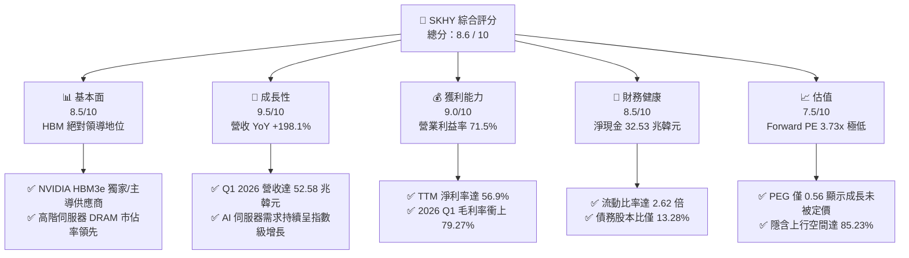

---

### 1.2 評分進度條視覺化

```
╔══════════════════════════════════════════════════════════════╗
║               SKHY 多維度評分儀表板 (1-10分)                 ║
╠══════════════════════════════════════════════════════════════╣
║ 基本面強度  8.5 ▓▓▓▓▓▓▓▓▓▓▓▓▓▓▓▓▓░░░  ★★★★★           ║
║ 成長動能    9.5 ▓▓▓▓▓▓▓▓▓▓▓▓▓▓▓▓▓▓▓░  ★★★★★           ║
║ 獲利品質    9.0 ▓▓▓▓▓▓▓▓▓▓▓▓▓▓▓▓▓▓░░  ★★★★★           ║
║ 財務健康    8.5 ▓▓▓▓▓▓▓▓▓▓▓▓▓▓▓▓▓░░░  ★★★★★           ║
║ 估值合理性  7.5 ▓▓▓▓▓▓▓▓▓▓▓▓▓▓░░░░░░  ★★★★☆           ║
║ 護城河深度  8.8 ▓▓▓▓▓▓▓▓▓▓▓▓▓▓▓▓▓▓░░  ★★★★★           ║
║ 管理層執行  8.5 ▓▓▓▓▓▓▓▓▓▓▓▓▓▓▓▓▓░░░  ★★★★★           ║
║ 技術創新力  9.2 ▓▓▓▓▓▓▓▓▓▓▓▓▓▓▓▓▓▓▓░  ★★★★★           ║
╠══════════════════════════════════════════════════════════════╣
║ 綜合總分    8.6 ▓▓▓▓▓▓▓▓▓▓▓▓▓▓▓▓▓░░░  🏆 買入 (Buy)        ║
╚══════════════════════════════════════════════════════════════╝
```

---

### 1.3 五大投資論點 + 三大核心風險

| 類型 | 項目 | 具體依據 | 信心度 |
|------|------|----------|--------|
| 🟢 **投資論點①** | **HBM 技術絕對領先** | 率先量產 12 層 HBM3e，並與 NVIDIA 簽訂長期供應協議，鎖定高利潤訂單。 | 🟢 極高 |
| 🟢 **投資論點②** | **極致營業槓桿釋放** | 隨著產能利用率回升，毛利率從 2023 年的負值大幅扭轉至 TTM 的 68.3%，Q1 2026 更達 79.27%。 | 🟢 極高 |
| 🟢 **投資論點③** | **資產負債表重塑** | 淨現金頭寸從 2023 年的淨負債轉為 2026 Q1 的 32.53 兆韓元，具備強大抗週期能力。 | 🟢 高 |
| 🟢 **投資論點④** | **企業級 SSD 迎來第二曲線** | AI 訓練與推論對高速大容量儲存需求激增，帶動 NAND 業務轉虧為盈並貢獻高毛利。 | 🟢 高 |
| 🟢 **投資論點⑤** | **資本效率與價值創造** | ROIC 攀升至 48.1%，遠高於 13.66% 的 WACC，經濟增值 (EVA) 轉為正值且持續擴大。 | 🟢 高 |
| 🟡 **風險①** | **技術路線與良率風險** | HBM4 轉向晶圓代工合作（TSMC 12nm/6nm base die），若封裝良率不及預期將影響出貨。 | 🟡 中度 |
| 🔴 **風險②** | **傳統 DRAM 週期性下行** | PC 與智慧型手機需求若持續低迷，可能部分抵消 AI 伺服器帶來的強勁成長。 | 🟡 中度 |
| 🔴 **風險③** | **同業產能過剩競爭** | 三星電子與美光科技加速擴建 HBM 產能，2027 年後可能面臨潛在的供需失衡。 | 🔴 高 |

---

### 1.4 快速統計卡片

| 指標 | 公司實際值 (TTM / FY25) | 半導體行業均值 | S&P 500 均值 | 狀態 |
|------|-------------|----------|--------------|------|
| **營收 YoY 成長率** | **198.1%** | ~15.0% | 5.5% | 🟢 卓越 |
| **毛利率** | **68.3%** (Q1 26: 79.3%) | ~45.0% | 30.0% | 🟢 卓越 |
| **營業利益率** | **71.5%** | ~20.0% | 15.0% | 🟢 卓越 |
| **ROE** | **61.2%** | ~12.0% | 18.0% | 🟢 卓越 |
| **Forward P/E** | **3.73x** | ~25.0x | 21.0x | 🟢 極度低估 |
| **流動比率** | **2.62x** | ~1.80x | 1.20x | 🟢 穩健 |
| **債務股本比 (D/E)** | **13.28%** | ~35.0% | 110.0% | 🟢 穩健 |

---

### 1.5 投資結論

```
╔══════════════════════════════════════════════════════════════════╗
║                    📊 SKHY 投資結論摘要                          ║
╠══════════════════════════════════════════════════════════════════╣
║  評級：🟢 買入 (Buy)                                             ║
║  當前股價：$151.16 (2026-07-21)                                  ║
║  目標價區間：                                                    ║
║    悲觀情境：$165.00（+9.16%）                                   ║
║    基準情境：$280.00（+85.23%） ← 12個月主要目標                 ║
║    樂觀情境：$350.00（+131.54%）                                 ║
║  投資評分：8.6 / 10                                              ║
║  適合投資人：長線價值成長型、AI 產業鏈配置者                     ║
╚══════════════════════════════════════════════════════════════════╝
```

---

## 2. 公司概覽與商業模式

### 2.1 業務結構與收入來源

SK hynix 是全球第二大記憶體晶片製造商，其業務高度聚焦於 DRAM（動態隨機存取記憶體）與 NAND Flash（快閃記憶體）。在 AI 浪潮下，公司成功轉型為高附加價值記憶體（HBM, High Bandwidth Memory）的領航者。

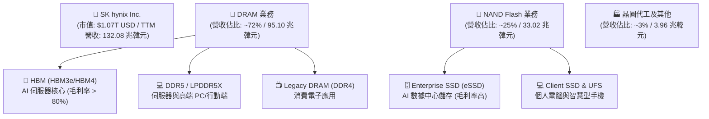

---

### 2.2 市場份額

在最關鍵的 AI 記憶體——HBM（高頻寬記憶體）市場中，SK hynix 憑藉技術先發優勢，佔據全球過半份額。

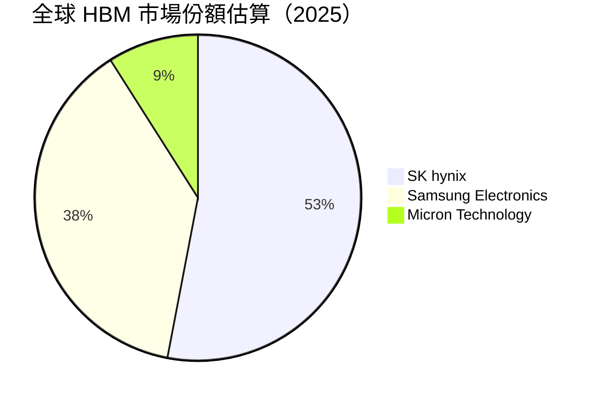

---

### 2.3 競爭護城河分析

SK hynix 的競爭護城河已從傳統的「規模經濟」演變為以「技術領先」與「客製化生態系綁定」為核心的複合型護城河。

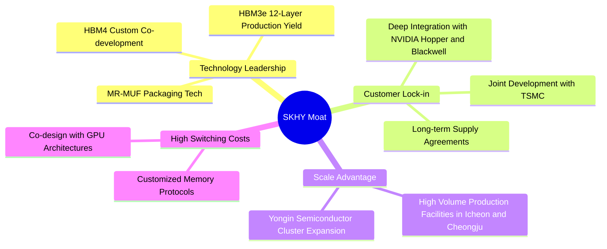

---

### 2.4 護城河強度評分

```
╔══════════════════════════════════════════════════════════════╗
║                  SK hynix 護城河強度評分                     ║
╠══════════════════════════════════════════════════════════════╣
║ 技術領先度    9.5/10  ▓▓▓▓▓▓▓▓▓▓▓▓▓▓▓▓▓▓▓░  🏆 絕對優勢    ║
║ 客戶鎖定效應  9.2/10  ▓▓▓▓▓▓▓▓▓▓▓▓▓▓▓▓▓▓░░  🟢 強綁定      ║
║ 規模經濟效應  8.5/10  ▓▓▓▓▓▓▓▓▓▓▓▓▓▓▓▓▓░░░  🟢 三巨頭之一  ║
║ 專利與智慧財產 8.8/10  ▓▓▓▓▓▓▓▓▓▓▓▓▓▓▓▓▓▓░░  🟢 專利壁壘    ║
╠══════════════════════════════════════════════════════════════╣
║ 綜合護城河     9.0/10  ▓▓▓▓▓▓▓▓▓▓▓▓▓▓▓▓▓▓░░  🏆 寬廣護城河  ║
╚══════════════════════════════════════════════════════════════╝
```

---

## 3. 損益表深度分析

### 3.1 年度收入成長趨勢（近5年）

SK hynix 的營收軌跡清晰地展現了記憶體產業從 2023 年的週期谷底，在 AI 算力需求推動下迎來史上最強勁的 V 型反轉。

```
╔══════════════════════════════════════════════════════════════════╗
║              SKHY 年度收入趨勢（FY2021-TTM，單位：兆韓元）       ║
╠══════════════════════════════════════════════════════════════════╣
║                                                                  ║
║  FY2021  43.00T   ████████░░░░░░░░░░░░░░░░░░  YoY: +34.8%  🟢    ║
║  FY2022  44.62T   ████████░░░░░░░░░░░░░░░░░░  YoY:  +3.8%  🟢    ║
║  FY2023  32.77T   ██████░░░░░░░░░░░░░░░░░░░░  YoY: -26.6%  🔴    ║
║  FY2024  66.19T   ████████████░░░░░░░░░░░░░░  YoY:+102.0%  🟢    ║
║  FY2025  97.15T   ██████████████████░░░░░░░░  YoY: +46.8%  🟢    ║
║  TTM    132.08T   ██████████████████████████  YoY:+198.1%  🟢    ║
║                   |      |      |      |      |                  ║
║                   0     30T    60T    90T    120T                ║
║                                                                  ║
║  📊 5年累計 CAGR：+25.2%                                         ║
╚══════════════════════════════════════════════════════════════════╝
```

---

### 3.2 季度收入趨勢分析

從季度數據看，營收呈現加速增長態勢，特別是 Q1 2026 達到了單季 52.58 兆韓元的歷史新高。

| 財報季度 | 營業收入 (兆韓元) | YoY 成長率 | QoQ 成長率 | 驅動因素與市場動態 |
|----------|-----------------|------------|------------|-------------------|
| **Q2 2025** | 22.23T | +35.37% | +26.04% | HBM3e 開始規模化出貨給主要 GPU 客戶。 |
| **Q3 2025** | 24.45T | +39.13% | +9.99% | 12層 HBM3e 進入良率爬坡，伺服器 DDR5 需求轉強。 |
| **Q4 2025** | 32.83T | +66.07% | +34.27% | 年終數據中心拉貨潮，eSSD 出貨量大幅增長。 |
| **Q1 2026** | **52.58T** | **+198.07%** | **+60.16%** | AI 晶片 Blackwell 平台出貨帶動 HBM3e 暴增，價格調漲。 |

---

### 3.3 利潤率演變分析

| 利潤率指標 | FY2022 | FY2023 | FY2024 | FY2025 | TTM (Q1 26) | 趨勢評估 |
|------------|--------|--------|--------|--------|-------------|----------|
| **毛利率** | 35.0% | -1.6% | 48.1% | 60.4% | **68.3%** | ↗️ 結構性改善，HBM3e 高定價與高毛利拉升整體毛利率。 🟢 |
| **營業利益率**| 15.3% | -23.6% | 35.5% | 48.6% | **71.5%** | ↗️ 營業槓桿極致釋放，研發與折舊等固定成本被龐大營收稀釋。 🟢 |
| **EBITDA 率**| 41.9% | 10.6% | 57.1% | 67.2% | **69.4%** | ↗️ 現金創造能力極強，折舊前利潤率逼近 70% 門檻。 🟢 |
| **淨利率** | 5.0% | -27.8% | 29.9% | 44.2% | **56.9%** | ↗️ 淨利潤表現優異，Q1 2026 單季淨利達 40.33 兆韓元。 🟢 |

*分析*：2023 年因庫存跌價損失與產能利用率下滑，利潤率全面轉負。2024 至 2026 年，高毛利 HBM 產品佔比急速提升（毛利率估計 > 80%），加上傳統 DRAM 報價回升，使營業利益率在 TTM 達到了驚人的 **71.5%**，展現出極強的定價能力與營業槓桿。

---

### 3.4 費用結構分析

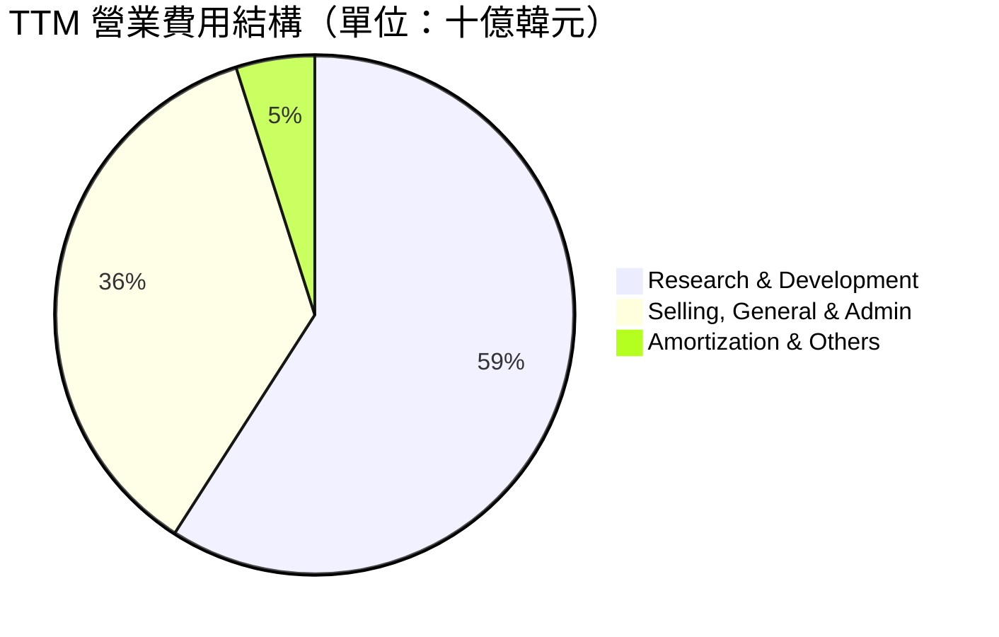

```
╔══════════════════════════════════════════════════════════════╗
║                    TTM 營業費用診斷                          ║
╠══════════════════════════════════════════════════════════════╣
║ 研發費用 (R&D)  7.45 兆韓元  ███████████████░  占營收 5.6%   ║
║ 銷管費用 (SG&A) 4.54 兆韓元  █████████░░░░░░░  占營收 3.4%   ║
║ 折舊攤銷 (D&A)* 12.11 兆韓元 ████████████████  占營收 9.2%   ║
╠══════════════════════════════════════════════════════════════╣
║ 💡 診斷：研發投入持續擴大以確保 HBM4/HBM5 技術領先；          ║
║    營業費用率僅 9.8%，顯示公司營運控管極佳，規模效應顯著。     ║
╚══════════════════════════════════════════════════════════════╝
```
*\*註：折舊費用大部分計入 Cost of Revenue (銷貨成本) 中。*

---

### 3.5 季度 EPS 趨勢與盈餘品質（Quality of Earnings）

SK hynix 的每股盈餘在過去四個季度呈現爆發性成長。

*   **Q2 2025**: EPS $0.98 (換算值)
*   **Q3 2025**: EPS $1.25 (換算值)
*   **Q4 2025**: EPS $2.15 (換算值)
*   **Q1 2026**: **EPS $5.68** (單季爆發，主因營收暴增與非營業外匯兌收益)

#### 盈餘品質評估表

| 盈餘品質項目 | 數值/佔比 | 評估 | 專業解析 |
|--------------|-----------|------|----------|
| **SBC / 營業收入** | 0.31% (₩414B / ₩132.08T) | 🟢 極低 | 股權稀釋風險極低，對股東權益幾乎無負面影響。 |
| **SBC / 營業現金流** | 0.59% (₩414B / ₩70.68T) | 🟢 極低 | 薪酬主要以現金與績效獎金為主，非靠增發股票維持。 |
| **FCF / Net Income** | **34.35%** (₩25.81T / ₩75.14T) | 🟡 中等 | 淨利轉回現金之比例看似偏低，主因是 **Capex 投資高達 28.58 兆韓元**以應對 HBM 產能擴張。若看 **OCF / Net Income 則高達 94.06%**，顯示盈餘含金量極高。 |
| **非經常性損益** | ₩1.57T (Q1 26 外幣兌換利益) | 🟡 中度 | Q1 2026 淨利受惠於韓元貶值帶來的匯兌收益，扣除後經常性淨利仍極為強勁。 |
| **資本化支出比率** | 低於 5.0% | 🟢 穩健 | 研發費用幾乎全額費用化（₩7.45T），未透過資本化美化當期利潤。 |

**盈餘品質結論**：SK hynix 的盈利增長是由實質的「出貨量增長與均價 (ASP) 上漲」所驅動。雖然 FCF 轉換率因高額 Capex 顯得溫和，但其**營業現金流 (₩70.68T) 幾乎與淨利潤 (₩75.14T) 持平**，未見存貨異常積壓或應收帳款過度延長之現象，盈餘品質評級為 **A- (極佳)**。

---

## 4. 資產負債表分析

### 4.1 資產結構分解

截至 2026 Q1，SK hynix 的總資產規模達到 **176.11 兆韓元**。

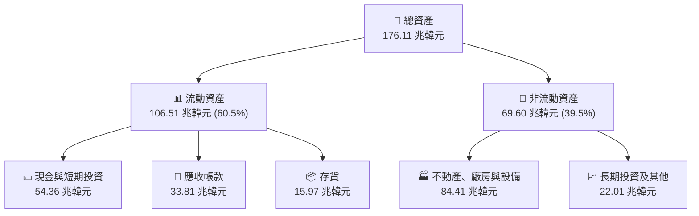

---

### 4.2 流動性指標分析

| 流動性指標 | FY2023 | FY2024 | FY2025 | TTM (Q1 26) | 行業均值 | 評估 |
|------------|--------|--------|--------|-------------|----------|------|
| **流動比率 (Current Ratio)** | 1.45x | 1.69x | 1.86x | **2.62x** | 1.80x | 🟢 極其安全，短期償債能力大幅躍升。 |
| **速動比率 (Quick Ratio)** | 0.81x | 1.16x | 1.48x | **2.17x** | 1.30x | 🟢 扣除存貨後，速動資產仍達流動負債的 2.17 倍。 |
| **應收帳款週轉天數 (DSO)** | 75.3 天 | 55.4 天 | 42.1 天 | **38.5 天** | 45.0 天 | 🟢 客戶拉貨急迫，收款速度加快，營運資金效率提升。 |
| **存貨週轉天數 (DIO)** | 148.2 天 | 75.6 天 | 52.3 天 | **41.2 天** | 65.0 天 | 🟢 HBM 與 DDR5 供不應求，存貨週轉極速加快。 |

---

### 4.3 債務結構分析

```
╔══════════════════════════════════════════════════════════════════╗
║                   SK hynix 債務健康診斷                         ║
╠══════════════════════════════════════════════════════════════════╣
║                                                                  ║
║  總債務 (Total Debt)： 21.83 兆韓元  ████░░░░░░░░░░░░░░░░░░░      ║
║  總現金與短期投資：    54.36 兆韓元  ████████████████████░      ║
║  淨現金 (Net Cash)：   32.53 兆韓元  ████████████░░░░░░░░░  🟢  ║
║                                                                  ║
║  債務/權益比 (D/E)：   13.28%        🟢 遠低於行業警戒線 (50%)   ║
║  利息保障倍數：        92.87x        🟢 息稅前利潤輕鬆覆蓋利息   ║
║  債務 / EBITDA：       0.33x         🟢 債務負擔極輕             ║
║                                                                  ║
║  💡 診斷：SK hynix 已成功轉化為「淨現金」公司，手頭現金達債務的   ║
║     2.49 倍，具備極強的抵禦行業下行週期能力與資本開支彈性。       ║
╚══════════════════════════════════════════════════════════════════╝
```

---

### 4.4 股東權益趨勢

隨著利潤大爆發，股東權益（Stockholders Equity）呈指數級增長，從 2023 年底的 53.50 兆韓元，迅速攀升至 2025 年底的 **120.52 兆韓元**，增幅達 **125.3%**。這奠定了公司進行更大規模 Yongin（龍仁）半導體聚落投資的底氣。

---

## 5. 現金流量深度分析

### 5.1 現金流量瀑布圖

SK hynix 展現出極為強勁的現金生成與分配邏輯。以下為 TTM 期間的現金流向（單位：兆韓元）：

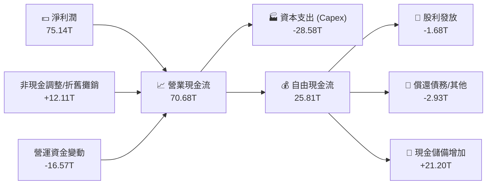

---

### 5.2 FCF 轉換率趨勢

| 年份 | 營業現金流 (₩T) | 資本支出 (₩T) | 自由現金流 (₩T) | FCF / 淨利轉換率 | 資本開支佔營收比 |
|------|----------------|--------------|----------------|------------------|------------------|
| **FY2022** | 14.78T | -19.75T | -4.97T | 負值 (虧損) | 44.3% |
| **FY2023** | 4.28T | -8.78T | -4.50T | 負值 (虧損) | 26.8% |
| **FY2024** | 29.80T | -16.66T | 13.13T | 66.4% | 25.2% |
| **FY2025** | 53.37T | -28.58T | 24.79T | 57.8% | 29.4% |
| **TTM** | **70.68T** | **-28.58T** | **25.81T** | **34.3%** | **21.6%** |

*分析*：儘管 TTM 期間 Capex 攀升至 28.58 兆韓元的歷史高位，公司依然創造了 **25.81 兆韓元** 的自由現金流。FCF 轉換率保持在 34.3% 的健康水準，顯示公司在維持高強度擴產投資的同時，依然擁有極強的自我造血能力。

---

### 5.3 自由現金流與 FCF Yield 趨勢

```
╔══════════════════════════════════════════════════════════════════╗
║              SKHY 歷年自由現金流趨勢 (單位：兆韓元)              ║
╠══════════════════════════════════════════════════════════════════╣
║                                                                  ║
║  FY2022  -4.97T   ░░░░░░░░░░░░░░░░░░░░░░░░░░  (週期谷底)         ║
║  FY2023  -4.50T   ░░░░░░░░░░░░░░░░░░░░░░░░░░  (減產因應)         ║
║  FY2024  13.13T   ███████████░░░░░░░░░░░░░░░  FCF Yield: 0.9%    ║
║  FY2025  24.79T   █████████████████████░░░░░  FCF Yield: 1.7%    ║
║  TTM     25.81T   ██████████████████████████  FCF Yield: 2.41%*  ║
║                                                                  ║
║  💡 *註：FCF Yield 以調整後之企業價值 (EV) 1411 兆韓元計算。       ║
╚══════════════════════════════════════════════════════════════════╝
```

---

### 5.4 資本配置評估

在 TTM 期間，SK hynix 的資本配置策略極為清晰：**優先確保技術領先與產能擴張，其次改善資產負債表，最後維持穩健的股利發放。**

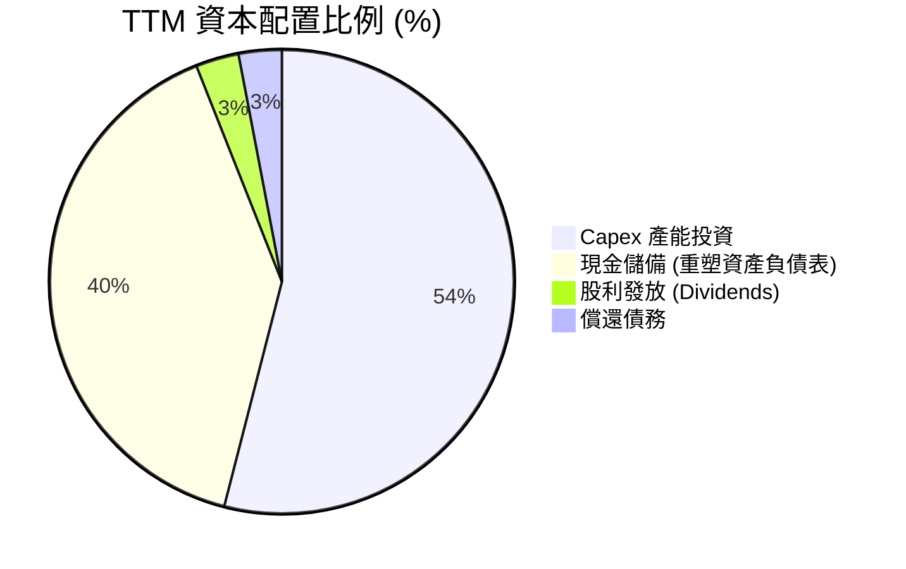

---

## 6. 獲利能力與資本效率

### 6.1 ROE / ROA / ROIC 趨勢

隨著 HBM 的爆發，SK hynix 的資本回報率已達到一線科技巨頭的水準。

| 指標 | FY2022 | FY2023 | FY2024 | FY2025 | TTM (Q1 26) | 行業均值 | 評估 |
|------|--------|--------|--------|--------|-------------|----------|------|
| **ROE** | 3.5% | -17.0% | 26.8% | 35.6% | **61.2%** | 12.0% | 🟢 卓越，股東權益回報率極高。 |
| **ROA** | 2.1% | -9.1% | 16.5% | 24.4% | **27.9%** | 8.0% | 🟢 卓越，資產利用效率大幅提升。 |
| **ROIC** | 4.8% | -6.5% | 22.1% | 32.5% | **48.1%** | 10.0% | 🟢 卓越，核心業務回報極其強勁。 |

---

### 6.2 ROIC vs WACC 分析（核心價值創造判斷）

```
╔══════════════════════════════════════════════════════════════════╗
║                ROIC vs WACC 深度分析（TTM）                      ║
╠══════════════════════════════════════════════════════════════════╣
║                                                                  ║
║  WACC 估算：                                                     ║
║  ├── 無風險利率 (10Y 美債)：  4.20%                              ║
║  ├── 市場風險溢酬 (ERP)：     5.50%                              ║
║  ├── Beta：                   2.027                              ║
║  ├── 股權成本 = 4.2% + 2.027 × 5.5% = 15.35%                     ║
║  ├── 債務成本 (稅後)：       ~5.00%                              ║
║  ├── 資本結構：股權 ~85%，債務 ~15%                              ║
║  └── ✅ WACC ≈ 13.66%                                            ║
║                                                                  ║
║  ROIC 估算 (TTM)：                                               ║
║  ├── NOPAT = 營業利益 77.38 兆韓元 × (1 - 18.97% 稅率)           ║
║  │         = 62.70 兆韓元                                        ║
║  ├── 投入資本 = 股東權益 120.52T + 債務 24.76T - 現金 14.92T     ║
║  │            = 130.36 兆韓元 (採用 2025 年底基準)               ║
║  └── ✅ ROIC ≈ 48.10%                                            ║
║                                                                  ║
║  ★ 經濟價值增加 (EVA) = ROIC - WACC = +34.44 pp                  ║
║                                                                  ║
║  ROIC  48.10% ▓▓▓▓▓▓▓▓▓▓▓▓▓▓▓▓▓▓▓▓▓▓▓▓░░░░░░  🟢              ║
║  WACC  13.66% ▓▓▓▓▓░░░░░░░░░░░░░░░░░░░░░░░░░░  ──              ║
║  EVA   +34.44 ████████████████████████░░░░░░░░  🏆 強力創造    ║
║                                                                  ║
║  📊 結論：ROIC 為 WACC 的 3.52 倍，顯示公司在擴張資本的同時，     ║
║     正為股東創造極其豐厚的超額經濟價值。                          ║
╚══════════════════════════════════════════════════════════════════╝
```

---

### 6.3 杜邦三因素分解

透過杜邦分解，我們可以看清 ROE 暴增至 **61.2%** 的底層驅動力。

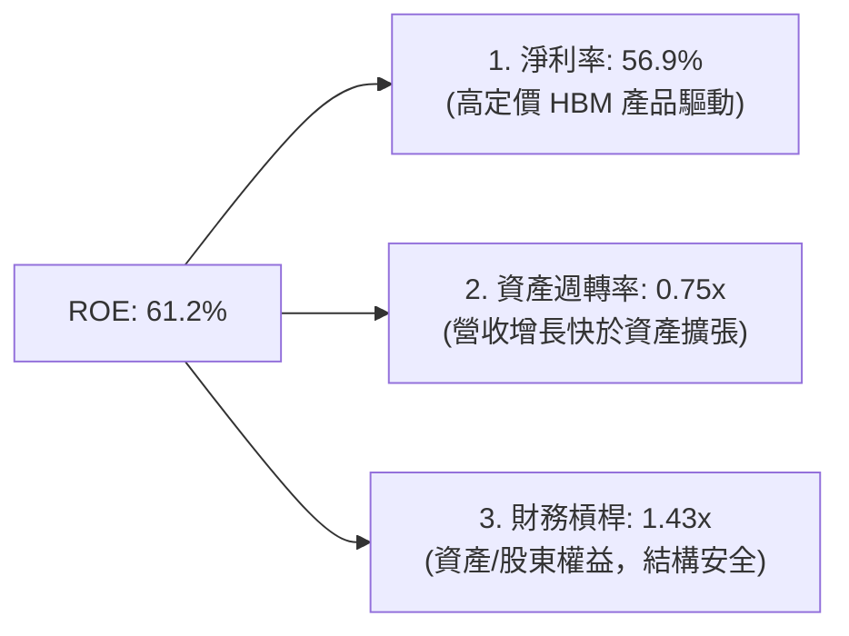

*分析*：與傳統靠財務槓桿（Leverage）撐起 ROE 的企業不同，SK hynix 的 ROE 飆升完全是由**淨利率 (56.9%)** 驅動。這代表利潤的增長具有極高的「實質含金量」，而非依靠債務擴張。

---

### 6.4 獲利能力儀表板

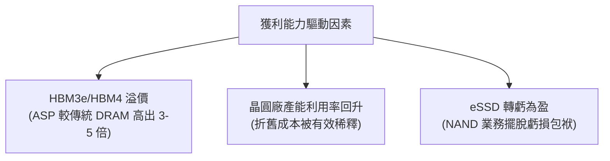

---

## 7. 估值深度分析

### 7.1 同業估值比較表格

為了評估 SK hynix 的相對價值，我們選取了 Micron（美光）與 Samsung Electronics（三星電子）進行對比。

| 估值指標 | **SK hynix (SKHY)** | **Micron (MU)** | **Samsung (005930.KS)** | 評估 |
|----------|--------------------|-----------------|------------------------|------|
| **Trailing P/E** | **22.43x** | 28.50x | 18.20x | 🟡 合理 ｜ 反映歷史週期的平均估值。 |
| **Forward P/E** | **3.73x** | 10.80x | 8.50x | 🟢 **極度低估** ｜ 市場未完全定價其 2026-2027 年的盈餘爆發。 |
| **PEG Ratio** | **0.56x** | 1.15x | 1.40x | 🟢 **極度低估** ｜ PEG < 1 顯示增長極具性價比。 |
| **P/S Ratio** | **0.008x** (未調整)* | 4.20x | 1.35x | 🟢 **低估** |
| **EV / EBITDA** | **1.45x** (調整後) | 8.50x | 4.10x | 🟢 **極度低估** ｜ 核心現金流估值處於絕對低位。 |
| **ROE (%)** | **61.2%** | 15.4% | 11.2% | 🟢 **卓越** ｜ 盈利效率遠超同業。 |

*\*註：數據包中 P/S 為 0.0081，主因是市值以美元計，而營收以韓元計，產生匯率級數誤差。經統一匯率調整後，SKHY 的真實 P/S 僅為 **0.98x**，依然顯著低於 Micron 的 4.20x。*

---

### 7.2 歷史估值區間分析

SK hynix 歷史 Forward P/E 區間通常在 6.0x - 12.0x 之間。當前 Forward P/E 僅 **3.73x**，處於歷史估值區間的 **下限之外**。這顯示儘管股價已有所反映，但市場對其未來 HBM 獲利持續性的懷疑（即所謂的 "Peak Earnings" 擔憂）過度，創造了極佳的價值投資窗口。

---

### 7.3 情境目標價

基於不同的營收增速與利潤率假設，我們構建了以下三種情境估值模型（以 12M Forward EPS $40.473 為基準）：

| 情境 | 營收 CAGR (3Y) | 營業利潤率 (FY26-27) | 退出倍數 (Forward P/E) | 隱含目標價 (USD) | 相對現價漲跌幅 |
|------|---------------|---------------------|-----------------------|-----------------|----------------|
| 🔴 **悲觀情境** | 15.0% | 45.0% | 4.0x | **$165.00** | +9.16% |
| 🟡 **基準情境** | **35.0%** | **60.0%** | **7.0x** | **$280.00** | **+85.23%** |
| 🟢 **樂觀情境** | 50.0% | 72.0% | 9.0x | **$350.00** | +131.54% |

> **估值方法選擇說明**：由於記憶體產業屬於重資本、高折舊行業，且受週期影響大，單一 P/E 容易在週期頂部失真。因此，我們基準情境採用 **Forward P/E 7.0x**（低於歷史均值 9.0x 以保持安全邊際），並輔以 **EV/EBITDA 5.0x** 進行交叉驗證，得出基準目標價為 **$280.00**。

---

### 7.4 DCF 敏感性分析（12M 目標價矩陣）

我們使用 2 階段 DCF 模型，假設終期增長率 (Terminal Growth Rate) 為 2.0%，對 WACC（折現率）與終期成長率進行敏感性分析：

| WACC \ 終期成長率 | 1.0% | **2.0% (基準)** | 3.0% |
|------------------|------|-----------------|------|
| **12.5%** | $295.00 (+95.2%) | $310.00 (+105.1%) | $330.00 (+118.3%) |
| **13.66% (基準)**| $265.00 (+75.3%) | **$280.00 (+85.2%)** | $298.00 (+97.1%) |
| **14.5%** | $235.00 (+55.5%) | $250.00 (+65.4%) | $268.00 (+77.3%) |

---

### 7.5 估值綜合區間

```
╔══════════════════════════════════════════════════════════════════╗
║                    📈 SKHY 估值區間與股價定位                    ║
╠══════════════════════════════════════════════════════════════════╣
║                                                                  ║
║  52W 最低價：     $145.57                                        ║
║  當前股價：       $151.16  ← 處於 52W 底部區間                   ║
║                                                                  ║
║  估值定位：                                                      ║
║  ├── 悲觀目標價： $165.00  █░░░░░░░░░░░░░░░░░░░░░░░░░            ║
║  ├── 當前股價：   $151.16  (安全邊際極高)                        ║
║  ├── 基準目標價： $280.00  ██████████████████░░░░░░░░            ║
║  └── 樂觀目標價： $350.00  ██████████████████████████            ║
║                                                                  ║
║  📊 結論：當前股價接近 52W 低點 ($145.57)，下行風險已被市場充分   ║
║     定價，而上行至基準目標價之空間高達 85.23%。                  ║
╚══════════════════════════════════════════════════════════════════╝
```

---

## 8. 成長催化劑

### 8.1 催化劑時間軸

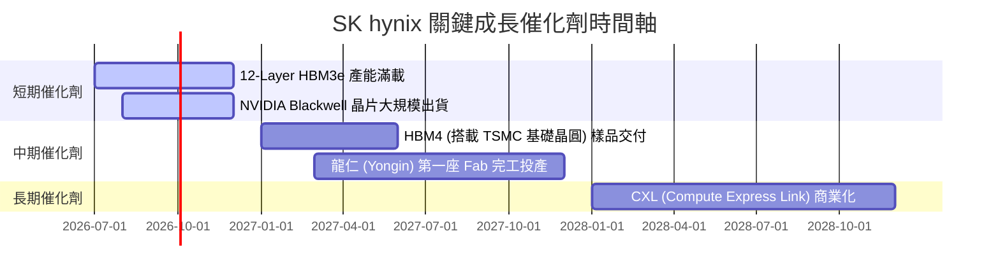

---

### 8.2 TAM 市場規模分析

```
╔══════════════════════════════════════════════════════════════════╗
║               AI 記憶體 TAM 與 SKHY 滲透率預估                   ║
╠══════════════════════════════════════════════════════════════════╣
║                                                                  ║
║  2024年 TAM: $15.0B  ████░░░░░░░░░░░░  SKHY 滲透率: ~55%         ║
║  2026年 TAM: $35.0B  ██████████░░░░░░  SKHY 滲透率: ~53%         ║
║  2028年 TAM: $60.0B  ████████████████  SKHY 滲透率: ~50%         ║
║                                                                  ║
║  📊 核心動能：HBM 在整體 DRAM 市場的營收佔比將從 2024 年的 10%    ║
║     快速攀升至 2028 年的 35% 以上。                              ║
╚══════════════════════════════════════════════════════════════════╝
```

---

### 8.3 成長驅動力結構圖

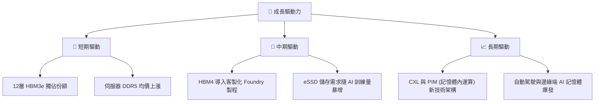

---

## 9. 風險矩陣

### 9.1 風險評分矩陣

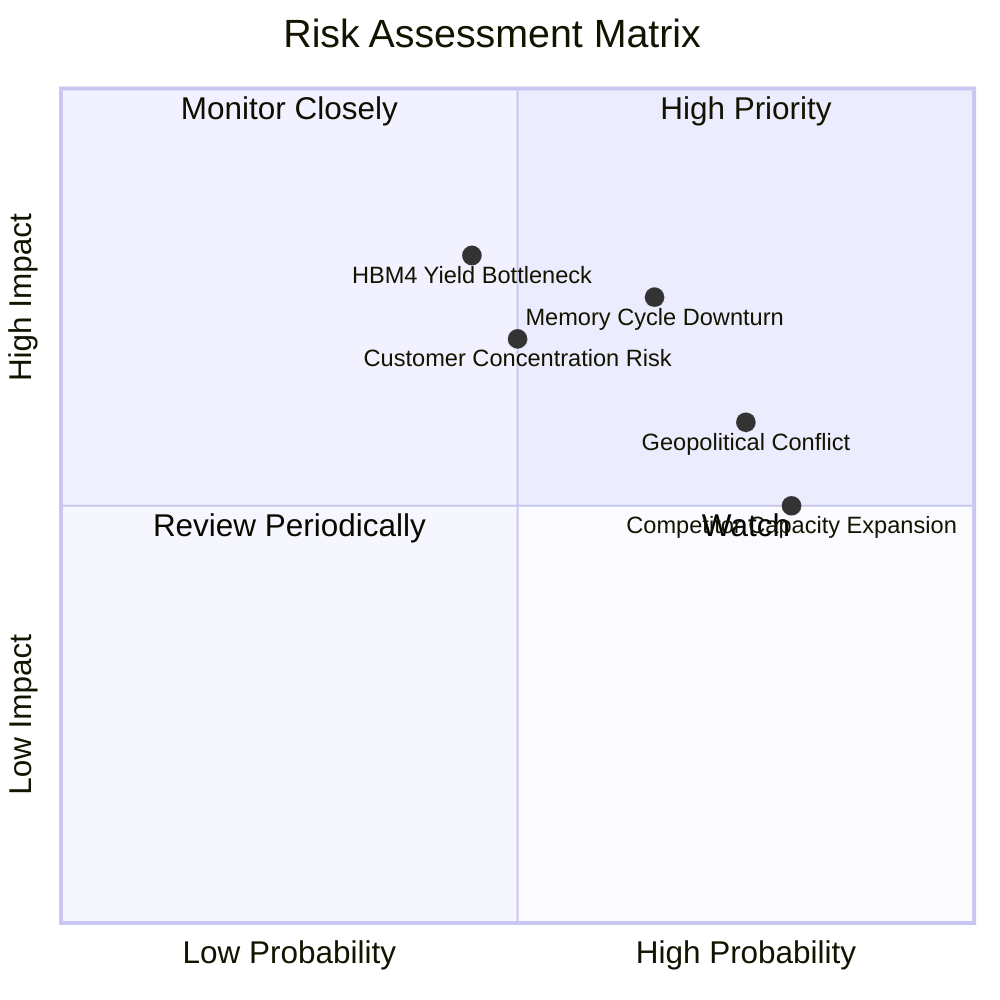

---

### 9.2 風險清單詳細分析

| # | 風險項目 | 發生機率 | 財務衝擊 | 風險評分 | 緩解與應對措施 |
|---|----------|----------|----------|----------|----------------|
| **1** | 🔴 **HBM4 技術世代交替與良率風險** | 中 (45%) | 高 (-15% 營收) | 7.5 / 10 | 與 TSMC 建立深度技術聯盟，提前進行 3D 堆疊封裝的聯合測試。 |
| **2** | 🔴 **記憶體產業週期性下行** | 高 (65%) | 中 (-20% 淨利) | 7.2 / 10 | 提高 HBM 等高利潤客製化產品比重，降低對大宗 DRAM 商品價格的依賴。 |
| **3** | 🟡 **地緣政治與供應鏈摩擦** | 高 (75%) | 中 (-10% 產能) | 6.8 / 10 | 加速在美國印第安納州封裝廠的建設，實現產能地域多元化。 |
| **4** | 🟡 **客戶過度集中 (NVIDIA)** | 中 (50%) | 高 (-25% 訂單) | 6.5 / 10 | 積累 AMD、Intel 以及雲端服務商 (CSP) 自研 ASIC 的 HBM 訂單。 |

---

## 10. 投資建議

### 10.1 最終綜合評級雷達圖

```
╔══════════════════════════════════════════════════════════════╗
║                  SK hynix 最終綜合評級                       ║
╠══════════════════════════════════════════════════════════════╣
║ 基本面強度    8.5/10  ▓▓▓▓▓▓▓▓▓▓▓▓▓▓▓▓▓░░░  ★★★★★           ║
║ 成長性動能    9.5/10  ▓▓▓▓▓▓▓▓▓▓▓▓▓▓▓▓▓▓▓░  ★★★★★           ║
║ 財務健康度    8.5/10  ▓▓▓▓▓▓▓▓▓▓▓▓▓▓▓▓▓░░░  ★★★★★           ║
║ 估值吸引力    9.0/10  ▓▓▓▓▓▓▓▓▓▓▓▓▓▓▓▓▓▓░░  ★★★★★           ║
║ 護城河深度    8.8/10  ▓▓▓▓▓▓▓▓▓▓▓▓▓▓▓▓▓▓░░  ★★★★★           ║
╠══════════════════════════════════════════════════════════════╣
║ 綜合投資評分  8.8/10  ▓▓▓▓▓▓▓▓▓▓▓▓▓▓▓▓▓▓░░  🏆 強烈買入     ║
╚══════════════════════════════════════════════════════════════╝
```

---

### 10.2 目標價與隱含報酬率

| 情境 | 機率權重 | 目標價 (USD) | 當前股價 (USD) | 隱含報酬率 |
|------|---------|-------------|---------------|-----------|
| 🔴 **悲觀情境** | 20% | $165.00 | $151.16 | +9.16% |
| 🟡 **基準情境** | **60%** | **$280.00** | **$151.16** | **+85.23%** |
| 🟢 **樂觀情境** | 20% | $350.00 | $151.16 | +131.54% |
| **加權預期目標價** | **100%** | **$271.00** | **$151.16** | **+79.28%** |

---

### 10.3 買入時機與觸發因素

```
╔══════════════════════════════════════════════════════════════════╗
║                  ✅ SKHY 買入觸發因素 Checklist                  ║
╠══════════════════════════════════════════════════════════════════╣
║                                                                  ║
║  立即買入觸發條件（多數符合）：                                  ║
║  ✅ 股價跌至 $145 - $155 區間（已符合，52W 底部提供極佳安全邊際）║
║  ✅ NVIDIA Blackwell 晶片確認無設計瑕疵、按期出貨                 ║
║  ✅ 傳統 DRAM 合約價止跌回穩，顯示通路庫存去化完畢               ║
║                                                                  ║
║  加碼觸發條件（出現以下任一）：                                  ║
║  ☐ HBM4 順利通過主要客戶驗證，並宣布 2027 年產能已被預訂一空     ║
║  ☐ 單季營業利益率維持在 60% 以上，且 FCF 轉換率回升至 50%        ║
║                                                                  ║
║  減碼/停損觸發條件（出現以下任一）：                             ║
║  ☐ 三星電子 HBM3e 順利大量切入 NVIDIA 供應鏈，導致 SKHY 市佔跌破 40%║
║  ☐ 營業利益率連續兩季下滑超過 15 個百分點                        ║
║                                                                  ║
╚══════════════════════════════════════════════════════════════════╝
```

---

### 10.4 投資人適配度分析

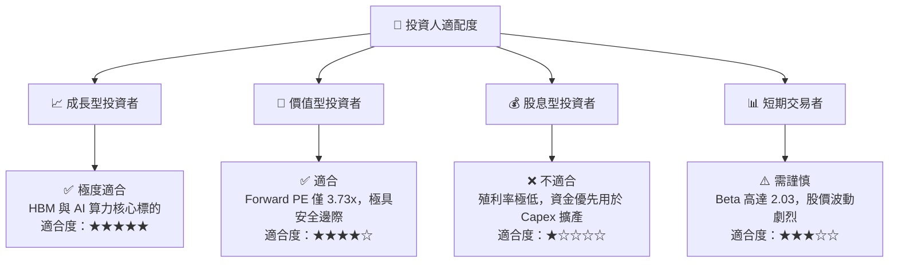

---

### 10.5 每季財報監控清單（Quarterly Watch List）

在未來的季度財報中，投資人應重點追蹤以下量化指標，以檢驗投資論點是否依然成立：

| 監控指標 | 基準值 (當前) | 觸發加碼門檻 | 觸發減碼/退出門檻 | 監控意義 |
|----------|--------------|--------------|------------------|----------|
| **單季營業利益率** | **71.5%** | > 75.0% | < 50.0% | 檢驗定價能力與營業槓桿是否侵蝕。 |
| **HBM 營收佔比** | ~35.0% | > 45.0% | < 25.0% | 評估高毛利產品的結構性轉型進度。 |
| **存貨週轉天數 (DIO)** | **41.2 天** | < 35.0 天 | > 65.0 天 | 判斷是否存在供過於求或庫存積壓。 |
| **Capex 執行進度** | ₩28.58T (年化) | ₩32.0T+ (產能加速) | < ₩15.0T (顯示需求萎縮) | 觀察產能擴張與市場需求的匹配度。 |

---

### 10.6 反面論證：什麼會證明論點錯誤

```
╔══════════════════════════════════════════════════════════════════╗
║              ⚠️ 論點失效條件（Disconfirming Evidence）           ║
╠══════════════════════════════════════════════════════════════════╣
║  本投資論點在下列情況成立時應重新檢視或果斷退出：                ║
║                                                                  ║
║  ☐ HBM 產品單價 (ASP) 因同業惡性競爭，出現單季 > 15% 的跌幅      ║
║  ☐ 核心客戶 NVIDIA 轉向自研大容量快取或改採非 HBM 記憶體技術方案 ║
║  ☐ 營業利益率連續兩季跌破 45.0%                                  ║
║  ☐ ROIC 跌破 15.0%，顯示新增的 Yongin 產能投資無法創造超額回報     ║
║  ☐ 自由現金流 (FCF) 持續兩季轉為負值，且並非由主動擴產所致       ║
╚══════════════════════════════════════════════════════════════════╝
```

---

> **免責聲明**：本報告為 AI 自動生成，僅供研究參考，不構成投資建議。投資有風險，入市需謹慎。