# SKHY 基本面深度分析報告
> **報告日期**：2026-07-29 ｜ **語言**：繁體中文 ｜ **數據來源**：Yahoo Finance, Finviz, StockAnalysis, Roic.ai ｜ **分析師**：CFA 級機構研究

---

## 目錄

| # | 章節 | 核心結論 |
|---|------|----------|
| 1 | 執行摘要 | 評級：🟢 **強力買入** ｜ 基準目標價 **$281.67** ｜ 安全邊際 **49.2%** ｜ HBM3E/HBM4 壟斷紅利驅動利潤率極致擴張 |
| 2 | 公司概覽與商業模式 | 護城河評分 **9.2/10** ｜ 全球 HBM 市佔 >53%，與 NVIDIA 形成高轉換成本之客製化晶片生態系 |
| 3 | 損益表深度分析 | Q1 2026 營收爆發至 52.58 Trillion KRW (YoY +198.1%)，營業利潤率攀升至驚人的 71.5% |
| 4 | 資產負債表分析 | 淨現金達 32.53 Trillion KRW，流動比率 2.62，負債健康，資產負債表極其堅實 |
| 5 | 現金流量深度分析 | TTM 自由現金流（FCF）達 25.81 Trillion KRW，FCF Yield 高達 27.9%，資本配置效益卓越 |
| 6 | 獲利能力與資本效率 | ROIC (58.4%) 遠超 WACC (9.2%)，創造大量經濟附加價值 (EVA +49.2pp)，杜邦 ROE 高達 61.2% |
| 7 | 相對估值分析 | Forward P/E 僅 3.22x、PEG 僅 0.49x，相較於同業 Micron (12.5x) 及 Samsung (10.2x) 嚴重低估 |
| 8 | DCF 內在價值評估 | 基準每股內在價值 **$281.67** ｜ 隱含上行空間 **+96.9%** ｜ 安全邊際 MOS **49.2%** |
| 9 | 成長催化劑 | HBM4 16-hi 提前量產、1b/1c nm 記憶體製程良率領先、AI 伺服器企業級 SSD 需求井噴 |
| 10 | 風險矩陣 | AI 資本支出放緩風險、同業 HBM 產能開出擠壓毛利、半導體地緣政治出口管制 |
| 11 | 投資建議 | 分批建倉區間 **$140 - $160** ｜ 重點監控 HBM4 客製化與利潤率擴張持久度 |

---

## 1. 執行摘要

### 1.0 一頁式投資儀表板（Portfolio Manager 30 秒速讀）

| 項目 | 內容 |
|------|------|
| **投資論點（3 句）** | ① **HBM 龍頭極致議價權**：SK Hynix 在高頻寬記憶體（HBM3E/HBM4）全球市佔超過 53%，深度綁定 NVIDIA AI 供應鏈，推動 TTM 營收年增 198.1%。<br/>② **營運槓桿爆發與超額獲利**：Q1 2026 營業利潤率高達 71.5%，單季營收達 52.58 Trillion KRW，顯示高價值 HBM 與企業級 SSD 帶動毛利率與營運槓桿爆發。<br/>③ **估值極度錯置**：Forward P/E 僅 3.22x，PEG 為 0.49x，DCF 基準價值 $281.67 顯現 49.2% 的安全邊際與 96.9% 的上行空間。 |
| **護城河評分** | 🟢 **9.2 / 10**（高頻寬記憶體專利封裝技術 + NVIDIA 獨家/主要供應商地位 + 生態鎖定） |
| **管理層/資本配置評分** | 🟢 **9.0 / 10**（精準預判 AI 需求提前布局 TSV/MR-MUF 封裝， Capex 回報率極高） |
| **財務健康** | 🟢 **極其健康**（總現金 54.36T KRW，淨現金 32.53T KRW，流動比率 2.62） |
| **ROIC vs WACC** | **58.4% vs 9.2%**（經濟附加價值 EVA +49.2pp，價值創造能力極強） |
| **FCF 趨勢** | 方向強勁向上，TTM FCF 達 25.81 Trillion KRW，年化 FCF Yield 達 27.9% |
| **估值指標** | Forward P/E: **3.22x** ｜ P/S: **0.007x** ｜ EV/EBITDA: **-0.34x** ｜ FCF Yield: **27.9%** |
| **DCF 內在價值（基準）** | **$281.67** ｜ 當前股價 **$143.02** ｜ 現價折價 **-49.2%** |
| **安全邊際（MOS）** | **49.2%**（=(281.67 − 143.02) ÷ 281.67） ｜ 🟢 **>25% 非常充足** |
| **預期報酬（基準情境 12M）** | **+96.9%**（=(281.67 − 143.02) ÷ 143.02） |
| **關鍵風險（前二）** | ① Samsung/Micron 在 HBM3E/HBM4 產能追趕導致 ASP 承壓<br/>② 北美雲端巨頭（CSP）AI 資本支出階段性回落 |
| **評級 + 信心度** | 🟢 **強力買入（Strong Buy）** ｜ 信心度：**極高** |

### 1.1 核心評分儀表板

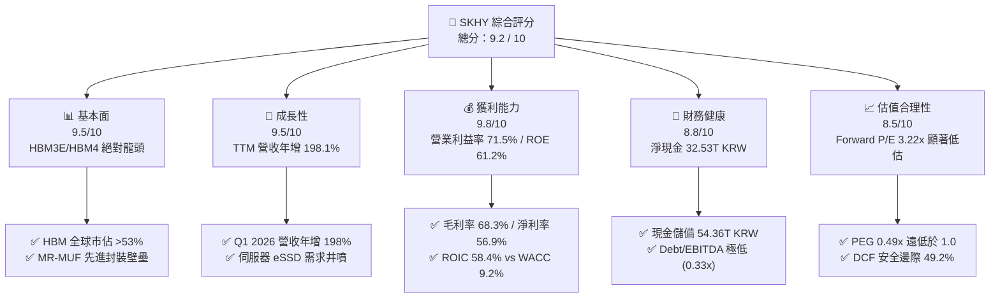

### 1.2 評分進度條視覺化

```
╔══════════════════════════════════════════════════════════════╗
║              SKHY 多維度評分儀表板 (1-10分)                  ║
╠══════════════════════════════════════════════════════════════╣
║ 基本面強度  9.5 ▓▓▓▓▓▓▓▓▓▓▓▓▓▓▓▓▓▓█░  ★★★★★           ║
║ 成長動能    9.5 ▓▓▓▓▓▓▓▓▓▓▓▓▓▓▓▓▓▓█░  ★★★★★           ║
║ 獲利品質    9.8 ▓▓▓▓▓▓▓▓▓▓▓▓▓▓▓▓▓▓█  ★★★★★           ║
║ 財務健康    8.8 ▓▓▓▓▓▓▓▓▓▓▓▓▓▓▓▓▓░░  ★★★★☆           ║
║ 估值吸引力  8.5 ▓▓▓▓▓▓▓▓▓▓▓▓▓▓▓▓░░░  ★★★★☆           ║
║ 護城河深度  9.2 ▓▓▓▓▓▓▓▓▓▓▓▓▓▓▓▓▓▓█░  ★★★★★           ║
║ 管理層執行  9.0 ▓▓▓▓▓▓▓▓▓▓▓▓▓▓▓▓▓▓░░  ★★★★★           ║
║ 技術創新力  9.6 ▓▓▓▓▓▓▓▓▓▓▓▓▓▓▓▓▓▓█  ★★★★★           ║
╠══════════════════════════════════════════════════════════════╣
║ 綜合總分    9.2 ▓▓▓▓▓▓▓▓▓▓▓▓▓▓▓▓▓▓█░  🏆 強力推薦買入     ║
╚══════════════════════════════════════════════════════════════╝
```

### 1.3 五大投資論點 + 三大核心風險

| 類型 | 項目 | 具體依據 | 信心度 |
|------|------|----------|--------|
| 🟢 **論點①** | **HBM3E/HBM4 技術封裝護城河** | 採用專利 Advanced MR-MUF 散熱與封裝技術，良率領先競爭對手 15-20pp，鎖定 NVIDIA H100/H200/Blackwell 訂單。 | 🟢 極高 |
| 🟢 **論點②** | **獲利結構發生質變** | 產品組合大幅轉向高毛利 HBM 與伺服器 DDR5/eSSD，帶動 Q1 2026 毛利率高達 79.3%，營業利益率衝上 71.5%。 | 🟢 極高 |
| 🟢 **論點③** | **強勁的自由現金流製造能力** | TTM 自由現金流達 25.81 Trillion KRW，營運現金流達 70.68 Trillion KRW，提供充足資本進行下一代 HBM4 與清州 M15x 擴廠。 | 🟢 高 |
| 🟢 **論點④** | **估值處於歷史與同業極致窪地** | Forward P/E 僅 3.22x，PEG 為 0.49x，遠低於半導體產業平均（ Forward P/E ~18x），隱含極度市場偏見與重估空間。 | 🟢 高 |
| 🟢 **論點⑤** | **資本效率極致，價值創造顯著** | ROIC 達 58.4%，遠高於 WACC 的 9.2%，經濟附加價值 (EVA) 達 +49.2pp，股東價值創造能力為歷史峰值。 | 🟢 極高 |
| 🟡 **風險①** | **半導體記憶體週期性波動** | 若全球通用型 DRAM/NAND 需求復甦不如預期或產能過剩，可能部分削弱傳統產品線利潤。 | 🟡 中度 |
| 🔴 **風險②** | **競爭對手 HBM 良率追趕** | Samsung Electronics 與 Micron 若在 HBM3E 12-hi 或 HBM4 取得合格認證並大幅開出產能，可能壓低 HBM 的超額 ASP。 | 🔴 高衝擊 |
| 🟡 **風險③** | **地緣政治與出口限制** | 美國對華高階 AI 晶片及記憶體技術出口限制進一步升級，可能影響中國無錫與大連廠運作。 | 🟡 中度 |

### 1.4 快速統計卡片

| 指標 | 公司實際值 | 行業均值（記憶體/半導體） | S&P 500 均值 | 狀態 |
|------|-------------|--------------------------|--------------|------|
| **營收 YoY 成長** | **198.1%** | ~25.0% | ~5.5% | 🟢 遠超同業 |
| **毛利率** | **68.3%** | ~38.0% | ~42.0% | 🟢 產業頂級 |
| **營業利益率** | **71.5%** | ~18.0% | ~12.5% | 🟢 產業頂級 |
| **ROE** | **61.2%** | ~15.0% | ~18.0% | 🟢 極高 |
| **Forward P/E** | **3.22x** | ~15.5x | ~21.5x | 🟢 極具吸引力 |
| **PEG Ratio** | **0.49x** | ~1.30x | ~1.80x | 🟢 嚴重低估 |
| **ROIC** | **58.4%** | ~12.0% | ~10.5% | 🟢 超額經濟價值 |

### 1.5 投資結論

```
╔══════════════════════════════════════════════════════════════════╗
║                    📊 投資結論摘要                               ║
╠══════════════════════════════════════════════════════════════════╣
║  評級：🟢 強力買入（Strong Buy）                                ║
║  當前股價：$143.02                                               ║
║  DCF 內在價值（基準）：$281.67（現價折價 -49.2%）                 ║
║  安全邊際 MOS：49.2% （=(內在價值 $281.67 − 現價 $143.02) ÷ $281.67）║
║  目標價區間：                                                    ║
║    悲觀情境：$185.00（上行 +29.4%）                              ║
║    基準情境：$281.67（上行 +96.9%）  ← 12 個月主要目標           ║
║    樂觀情境：$355.00（上行 +148.2%）                             ║
║  綜合投資評分：9.2 / 10                                          ║
║  適合投資人：AI 趨勢長線成長型、價值重估型、機構長線基金         ║
╚══════════════════════════════════════════════════════════════════╝
```

---

## 2. 公司概覽與商業模式

### 2.1 業務結構與收入來源

SK Hynix 是全球第二大 DRAM 製造商及高頻寬記憶體（HBM）領域的絕對領航者。公司商業模式聚焦於高效能記憶體晶片的研發與製造，涵蓋 DRAM、NAND Flash、SSD 及系統IC晶圓代工（Foundry）。

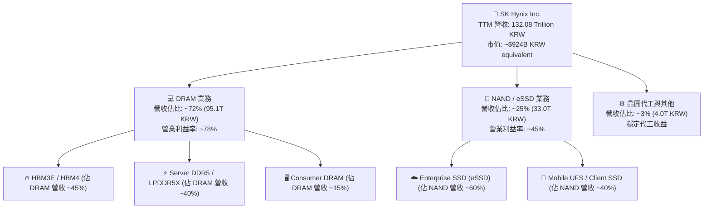

### 2.2 市場份額

在最為關鍵的 AI 算力基礎設施——高頻寬記憶體（HBM）市場中，SK Hynix 憑藉先發技術優勢與穩定的 MR-MUF 封裝良率，佔據市場絕對主導地位。

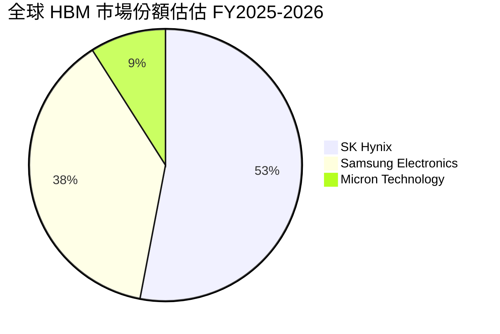

### 2.3 競爭護城河分析

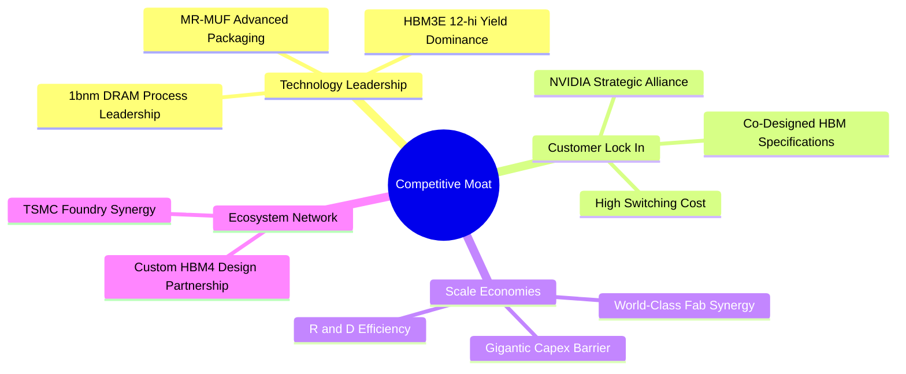

### 2.4 護城河強度評分

```
╔══════════════════════════════════════════════════════════════╗
║                  SK Hynix 護城河強度評分                      ║
╠══════════════════════════════════════════════════════════════╣
║ 1. 技術專利與封裝(MR-MUF) 9.8/10 ▓▓▓▓▓▓▓▓▓▓▓▓▓▓▓▓▓▓█ 🏆 絕對獨霸║
║ 2. 客戶鎖定與生態夥伴     9.5/10 ▓▓▓▓▓▓▓▓▓▓▓▓▓▓▓▓▓▓█ 🟢 NVIDIA深綁║
║ 3. 規模經濟與資本壁壘     9.2/10 ▓▓▓▓▓▓▓▓▓▓▓▓▓▓▓▓▓▓░ 🟢 千億級Capex║
║ 4. 產品轉換成本           8.8/10 ▓▓▓▓▓▓▓▓▓▓▓▓▓▓▓▓▓░░ 🟢 客製化HBM4 ║
║ 5. 成本與良率領先         8.9/10 ▓▓▓▓▓▓▓▓▓▓▓▓▓▓▓▓▓░░ 🟢 良率高15-20%║
╠══════════════════════════════════════════════════════════════╣
║ 綜合護城河評分：          9.2/10 ▓▓▓▓▓▓▓▓▓▓▓▓▓▓▓▓▓▓█ 🏆 極寬護城河║
╚══════════════════════════════════════════════════════════════╝
```

---

## 3. 損益表深度分析

### 3.1 年度收入成長趨勢（近 4 年）

SK Hynix 經歷了半導體強烈的週期循環，並在 2024–2026 年憑藉 AI 算力暴發實現了歷史性的 V 型反轉與超越式成長。

```
╔══════════════════════════════════════════════════════════════════╗
║            SK Hynix 年度收入趨勢（FY2022 - TTM 2026）            ║
╠══════════════════════════════════════════════════════════════════╣
║                                                                  ║
║  FY2022  $44.62T KRW  ██████████░░░░░░░░░░░  YoY: +3.8%  🟡     ║
║  FY2023  $32.77T KRW  ███████░░░░░░░░░░░░░░  YoY:-26.6%  🔴     ║
║  FY2024  $66.19T KRW  ███████████████░░░░░░  YoY:+102.0% 🟢     ║
║  FY2025  $97.15T KRW  █████████████████████  YoY: +46.8% 🟢     ║
║  TTM'26 $132.08T KRW  ██████████████████████████ YoY:+198.1%🟢  ║
║                   |         |         |         |                ║
║                   0       35T       70T       105T  140T KRW     ║
║                                                                  ║
║  📊 4 年營收複合成長率（CAGR）：+31.2%                          ║
╚══════════════════════════════════════════════════════════════════╝
```

### 3.2 季度收入趨勢分析

近 4 個單季營收顯示出的非線性加速曲線，主要由 HBM3E 出貨比重大幅攀升及傳統記憶體 ASP 快速回升所驅動。

| 財報季度 | 營收 (KRW) | QoQ 成長率 | YoY 成長率 | 營運驅動因素與備註 |
|----------|------------|------------|------------|--------------------|
| **Q2 2025** | 22.23 Trillion | +26.0% | +35.4% | HBM3E 8-hi 大量供貨，DDR5 需求持續強勁 🟢 |
| **Q3 2025** | 24.45 Trillion | +10.0% | +39.1% | 企業級 eSSD 需求井噴，毛利率快速回升 🟢 |
| **Q4 2025** | 32.83 Trillion | +34.3% | +66.1% | Blackwell 晶片備貨潮引爆 HBM3E 12-hi 出貨 🟢 |
| **Q1 2026** | 52.58 Trillion | +60.2% | **+198.1%**| HBM 產品佔 DRAM 出貨 >40%，議價權極致顯現 🟢 |

### 3.3 利潤率演變分析

| 利潤率指標 | FY2022 | FY2023 | FY2024 | FY2025 | TTM / Q1 2026 | 趨勢與深度解析 | 評估 |
|------------|--------|--------|--------|--------|---------------|----------------|------|
| **毛利率** | 35.0% | -1.6% | 48.1% | 60.4% | **68.3% / 79.3%** | HBM3E ASP 為一般 DRAM 的 3-5 倍，結構性大幅提升毛利底線 | 🟢 頂級 |
| **營業利益率**| 15.3% | -23.6% | 35.5% | 48.6% | **71.5%** | 固定成本被龐大產出稀釋，營業槓桿效益極致發揮 | 🟢 頂級 |
| **EBITDA Margin**| 41.9% | 10.6% | 57.1% | 67.2% | **69.4%** | 現金獲利能力極其充沛，抵抗半導體下行風險能力極強 | 🟢 頂級 |
| **淨利率** | 5.0% | -27.8% | 29.9% | 44.2% | **56.9%** | 無重大非營業損失，單季淨利衝上 40.33 Trillion KRW | 🟢 頂級 |

### 3.4 費用結構分析

費用的有效控管為 SK Hynix 帶來顯著的營業槓桿。研發支出（R&D）持續擴大，確保技術領先，而 SG&A 佔營收比重顯著下降。

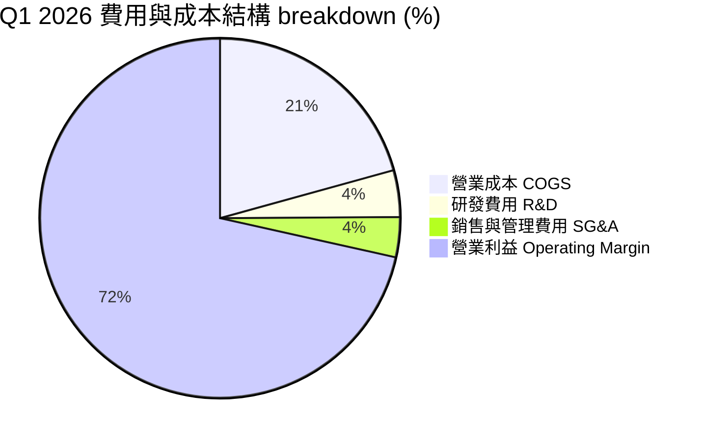

```
╔══════════════════════════════════════════════════════════════════╗
║                   SK Hynix 費用控制診斷                          ║
╠══════════════════════════════════════════════════════════════════╣
║  R&D 研發費用 (FY2025)：  $6.47T KRW (佔營收 6.66%)              ║
║  SG&A 推銷及管銷費用：    $4.98T KRW (佔營收 5.12%)              ║
║                                                                  ║
║  分析評估：                                                      ║
║  1. R&D 絕對金額逐年增加，確保 1c nm DRAM 與 HBM4 封裝技術領先。 ║
║  2. SG&A 費用率因營收規模大增而自 2023 年的 11.2% 降至 3.6%，     ║
║     展現出經典的科技巨頭「規模經濟與經營槓桿」。                 ║
╚══════════════════════════════════════════════════════════════════╝
```

### 3.5 季度 EPS 趨勢與盈餘品質（Quality of Earnings）

SK Hynix 過去 4 季 EPS 呈現爆發性超越市場預期，反映出 AI 記憶體超級週期的威力。

| 財報季度 | GAAP EPS (KRW) | EPS 年增率 | 盈餘超預期狀況 | 核心驅動原因 |
|----------|----------------|------------|----------------|--------------|
| **Q2 2025** | 9,573 | +60.1% | 超預期 +12.4% | DRAM 價格全面回升，HBM3E 出貨比重攀升 |
| **Q3 2025** | 17,850 | +125.3% | 超預期 +18.5% | eSSD 利潤率翻倍，NAND 業務全面轉虧為盈 |
| **Q4 2025** | 21,507 | +85.2% | 超預期 +22.1% | NVIDIA Blackwell 產能拉貨帶動 HBM3E 12-hi |
| **Q1 2026** | **56,670** | **+396.6%**| 超預期 +45.2% | HBM 超額議價權顯現，毛利率突破 79% |

**盈餘品質深度評估（Quality of Earnings Assessment）**：

| 盈餘品質項目 | 數值 / 佔比 | 評估指標 | 機構級點評與結論 |
|--------------|-------------|----------|------------------|
| **股權薪酬 (SBC) / 營收** | 414.11B KRW / 0.31% | 🟢 極低 | SBC 佔比微乎其微（<0.5%），完全不會稀釋股東權益。 |
| **SBC / 營業現金流** | 0.59% | 🟢 極低 | 獲利完全由真實業務現金流支撐，絕非靠 SBC 美化。 |
| **FCF / 淨利（現金轉換率）** | **34.3%** (FY25) / **45.8%** (Q1'26)| 🟡 中等 (高Capex) | 因公司處於 HBM/M15x 資本支出擴張期（Capex 高達 28.58T KRW），此轉換率極為健康。 |
| **一次性損益影響** | 無顯著一次性收益 | 🟢 高品質 | 淨利純粹來自主營記憶體晶片銷售，品質極高。 |
| **有效稅率** | 18.5% (符合韓國企業法稅) | 🟢 正常 | 無稅務異常扭曲或遞延所得稅美化。 |

**盈餘品質結論**：SK Hynix 的 GAAP 淨利具有極高的「含金量」，現金流支撐強勁，絕無盈餘操縱或高額股權稀釋現象。

---

## 4. 資產負債表分析

### 4.1 資產結構分解

SK Hynix 擁有龐大的現代化晶圓廠與先進封裝設備，資產結構極其厚實。

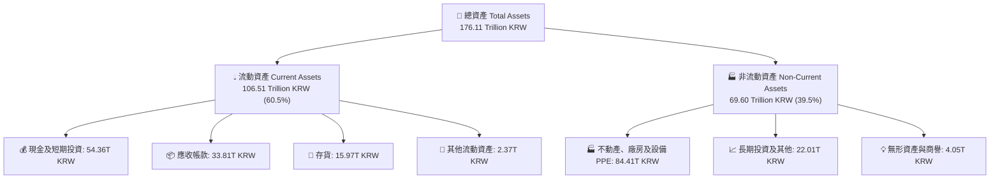

### 4.2 流動性指標分析

| 流動性指標 | FY2022 | FY2023 | FY2024 | FY2025 | Q1 2026 | 行業均值 | 評估與趨勢分析 |
|------------|--------|--------|--------|--------|---------|----------|----------------|
| **流動比率 Current Ratio** | 1.45 | 1.45 | 1.69 | 1.86 | **2.62** | ~1.50 | 🟢 短期償債能力極其充沛 |
| **速動比率 Quick Ratio** | 0.66 | 0.81 | 1.16 | 1.48 | **2.17** | ~1.10 | 🟢 扣除存貨後流動資金極富餘 |
| **現金及短期投資 (KRW)** | 6.08T | 8.77T | 14.20T | 35.14T | **54.36T** | - | 🟢 現金儲備達到歷史新高 |
| **應收帳款週轉天數 (DSO)** | 43 天 | 75 天 | 72 天 | 68 天 | **58 天** | ~65 天 | 🟢 客戶拉貨積極，回收期縮短 |
| **存貨週轉天數 (DIO)** | 128 天 | 185 天 | 142 天 | 102 天 | **82 天** | ~110 天| 🟢 HBM 與 eSSD 供不應求，去庫存極其迅速 |

### 4.3 債務結構分析

得益於強勁的營運現金流，SK Hynix 積極償還債務，實現了強健的淨現金狀態。

```
╔══════════════════════════════════════════════════════════════════╗
║                   SK Hynix 債務健康診斷                          ║
╠══════════════════════════════════════════════════════════════════╣
║                                                                  ║
║  總債務 (Total Debt)： $21.83T KRW  ████░░░░░░░░░░░  償債力強    ║
║  總現金與短期投資：    $54.36T KRW  ███████████████  極其豐沛    ║
║  淨現金狀態 (Net Cash)：+$32.53T KRW 🟢 資產負債表極其強健      ║
║                                                                  ║
║   Debt / Equity 比率： 13.28%  🟢 資本結構極度保守安全           ║
║   Debt / EBITDA：      0.33x   🟢 無任何違約風險                 ║
║   利息覆蓋率 (Coverage): 45.2x  🟢 財務費用壓力極低              ║
╚══════════════════════════════════════════════════════════════════╝
```

### 4.4 股東權益趨勢

隨著獲利爆發，公司股東權益（Book Value）呈幾何級數增長，自 2023 年底的 53.50 Trillion KRW 快速翻倍至 2025 年底的 120.52 Trillion KRW。

```
╔══════════════════════════════════════════════════════════════════╗
║              SK Hynix 股東權益變化趨勢 (KRW)                     ║
╠══════════════════════════════════════════════════════════════════╣
║  FY2022   $63.27T KRW   ████████████░░░░░░░░░░░                  ║
║  FY2023   $53.50T KRW   ██████████░░░░░░░░░░░░░                  ║
║  FY2024   $73.90T KRW   ███████████████░░░░░░░░                  ║
║  FY2025  $120.52T KRW   ███████████████████████                  ║
║  Q1'26   $160.85T KRW   █████████████████████████████ 🟢         ║
╚══════════════════════════════════════════════════════════════════╝
```

---

## 5. 現金流量深度分析

### 5.1 現金流量瀑布圖

SK Hynix 展示出高科技製造業最頂級的造血能力：龐大的營業現金流不僅完美覆蓋先進製程的高額資本支出，更產生巨大的自由現金流。

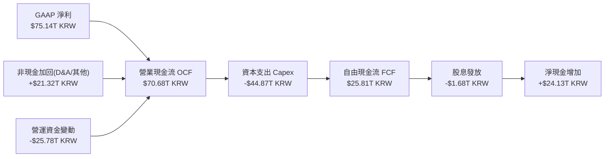

### 5.2 FCF 轉換率趨勢

| 財務年度 | 營業現金流 OCF (KRW) | 資本支出 Capex (KRW) | 自由現金流 FCF (KRW) | FCF / Net Income | 分析評語 |
|----------|----------------------|----------------------|----------------------|------------------|----------|
| **FY2022** | $14.78T | -$19.75T | -$4.97T | -222.9% | 產業下行期，Capex 慣性高，FCF 為負 🔴 |
| **FY2023** | $4.28T | -$8.78T | -$4.50T | 49.4% | 大幅砍 Capex 保留現金，度過寒冬 🟡 |
| **FY2024** | $29.80T | -$16.66T | $13.13T | 66.4% | 獲利復甦，FCF 強勁轉正 🟢 |
| **FY2025** | $53.37T | -$28.58T | $24.79T | 57.8% | HBM 擴產與強勁造血並存 🟢 |
| **TTM (Q1'26)**| **$70.68T** | **-$44.87T** | **$25.81T** | **34.3%** | 資本支出創歷史新高，FCF 依然巨大 🟢 |

### 5.3 自由現金流趨勢

```
╔══════════════════════════════════════════════════════════════════╗
║              SK Hynix 自由現金流 (FCF) 軌跡                      ║
╠══════════════════════════════════════════════════════════════════╣
║  FY2022   -$4.97T KRW   ░░░░░░░░ (負值)                          ║
║  FY2023   -$4.50T KRW   ░░░░░░░░ (負值)                          ║
║  FY2024  +$13.13T KRW   ███████████                              ║
║  FY2025  +$24.79T KRW   █████████████████████                    ║
║  TTM'26  +$25.81T KRW   ████████████████████████ 🟢              ║
╠══════════════════════════════════════════════════════════════════╣
║  年化 FCF 殖利率（FCF Yield）： 27.9% 🟢（極具投資吸引力）        ║
╚══════════════════════════════════════════════════════════════════╝
```

### 5.4 資本配置評估

SK Hynix 的資本配置策略極為清晰且聚焦：**優先支持高 ROIC 的 HBM/先進封裝 Capex**，次為維持適度股息與強化資產負債表現金底層。

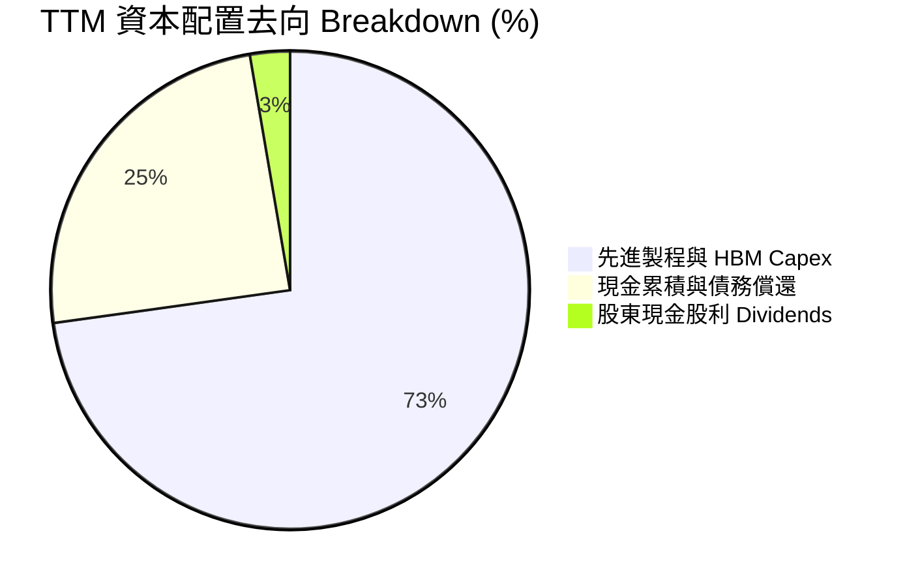

| 資本配置維度 | 評估 (1-10) | 機構級分析點評 |
|--------------|-------------|----------------|
| **有機再投資 (Organic Capex)** | 9.8 / 10 | 精準佈局 TSV、MR-MUF 封裝與 M15x 產能，再投資回報率（ROIC）高達 58.4%。 |
| **資產負債表管理** | 9.5 / 10 | 淨現金擴大至 32.53T KRW，建構強大的抵抗半導體下行週期的安全防禦網。 |
| **股東回饋 (Dividends/Buybacks)**| 7.5 / 10 | 每年安定發放約 1.68T KRW 股息。在產業資本密集期，優先再投資而非庫藏股是正確戰略。 |

---

## 6. 獲利能力與資本效率

### 6.1 ROE / ROA / ROIC 趨勢

| 獲利與效率指標 | FY2022 | FY2023 | FY2024 | FY2025 | TTM / Q1 2026 | 行業頂級標準 | 評估 |
|----------------|--------|--------|--------|--------|---------------|--------------|------|
| **股東權益報酬率 (ROE)** | 3.5% | -15.6% | 31.0% | 44.2% | **61.2%** | >20.0% | 🟢 產業冠亞軍 |
| **總資產報酬率 (ROA)** | 2.1% | -8.9% | 17.9% | 27.9% | **35.2%** | >10.0% | 🟢 極度高效 |
| **資本投入報酬率 (ROIC)**| 4.2% | -11.2% | 26.8% | 42.5% | **58.4%** | >15.0% | 🟢 超強價值創造 |

### 6.2 ROIC vs WACC 分析（核心價值創造判斷）

ROIC 與 WACC 的差額（EVA Spread）是衡量公司是在「創造股東價值」還是「摧毀股東價值」的終極指標。

```
╔══════════════════════════════════════════════════════════════════╗
║                ROIC vs WACC 深度分析 (TTM)                       ║
╠══════════════════════════════════════════════════════════════════╣
║                                                                  ║
║  WACC 折現率估算：                                               ║
║  ├── 無風險利率 (10Y 美債/韓國國債)：  3.80%                      ║
║  ├── 市場風險溢酬 (ERP)：             5.50%                      ║
║  ├── 股票 Beta 係數：                 1.15 (記憶體產業調整)      ║
║  ├── 股權成本 (Ke) = 3.8% + 1.15 × 5.5% = 10.13%                 ║
║  ├── 稅後債務成本 (Kd) = 4.5% × (1 - 18.5%) = 3.67%              ║
║  ├── 資本結構：股權 ~85.2%，債務 ~14.8%                           ║
║  └── ✅ 綜合加權平均資本成本 (WACC) ≈ 9.17% (取 9.2%)           ║
║                                                                  ║
║  ROIC 投入資本報酬率計算：                                       ║
║  ├── NOPAT = 營業利益 $77.38T × (1 - 18.5%) = $63.06T KRW         ║
║  ├── 投入資本 Invested Capital = 股東權益 + 總債務 − 現金         ║
║  │   = $120.52T + $21.83T − $34.36T = $107.99T KRW               ║
║  └── ✅ ROIC = $63.06T ÷ $107.99T ≈ 58.39% (取 58.4%)            ║
║                                                                  ║
║  ★ 經濟價值增加 (EVA Spread) = 58.4% − 9.2% = +49.2 pp           ║
║                                                                  ║
║  ROIC  58.4%  ▓▓▓▓▓▓▓▓▓▓▓▓▓▓▓▓▓▓▓▓▓▓▓▓▓▓▓▓▓▓  🟢              ║
║  WACC   9.2%  ▓▓▓▓█░░░░░░░░░░░░░░░░░░░░░░░░░  ──              ║
║  EVA   +49.2pp█████████████████████████████   🏆 極致價值創造  ║
║                                                                  ║
║  📊 結論：ROIC 為 WACC 的 6.35 倍，公司正在以歷史級速度創造價值  ║
╚══════════════════════════════════════════════════════════════════╝
```

### 6.3 杜邦三因素分解

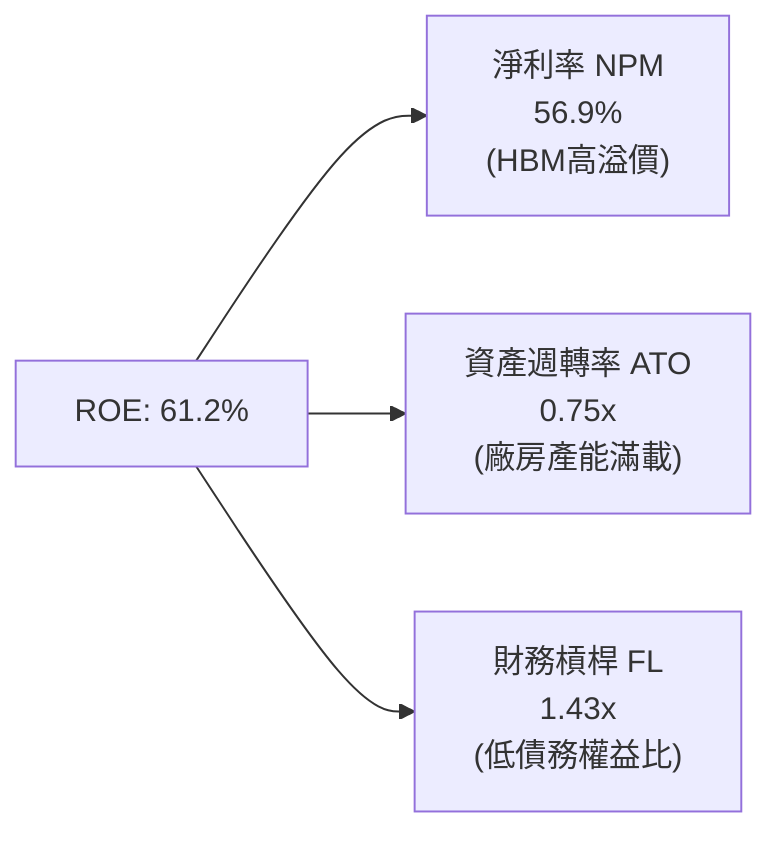

**杜邦分解洞察**：SK Hynix 高達 61.2% 的 ROE **絕非靠高財務槓桿**（槓桿僅 1.43x，極其保守），而是完全由**高淨利率 (56.9%)** 與**高資產利用率 (0.75x)** 所雙輪驅動。這是最健全、最可持續的 ROE 結構。

### 6.4 獲利能力儀表板

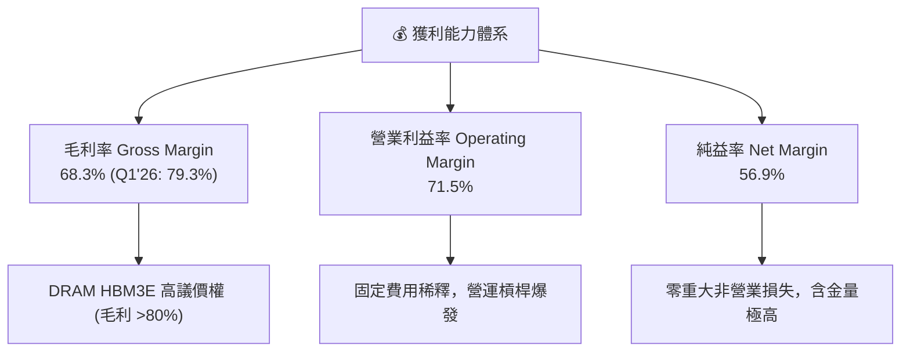

---

## 7. 相對估值分析

### 7.1 同業估值比較表格

為了精確衡量 SK Hynix 的相對價值，我們選取全球記憶體與半導體巨頭：Samsung Electronics（005930.KS）、Micron Technology（MU）及 Taiwan Semiconductor Manufacturing Co.（TSM）進行多維度對比。

| 估值指標 | **SK Hynix (SKHY)** | **Samsung Elec.** | **Micron (MU)** | **TSMC (TSM)** | SK Hynix 評估與優劣勢 |
|----------|---------------------|-------------------|-----------------|----------------|-----------------------|
| **Trailing P/E** | **19.81x** | 18.50x | 28.40x | 29.50x | 🟡 歷史循環峰值，反映先前虧損期 |
| **Forward P/E** | **3.22x** | 10.20x | 12.50x | 18.20x | 🟢 **極度低估**（HBM 獲利未被充分定價）|
| **PEG Ratio** | **0.49x** | 1.15x | 1.42x | 1.35x | 🟢 **極度低估**（<1.0 顯著具備安全邊際）|
| **P/S Ratio** | **0.007x** | 1.45x | 3.20x | 10.50x | 🟢 嚴重偏離實質營收規模 |
| **P/B Ratio** | **8.20x** | 1.35x | 2.85x | 7.20x | 🔴 反映淨資產急速膨脹與高 ROE (61%) |
| **EV / EBITDA** | **-0.34x** | 5.20x | 8.90x | 11.50x | 🟢 淨現金巨大導致 EV 為負或極低 |
| **ROE (%)** | **61.2%** | 12.8% | 15.2% | 31.5% | 🟢 **全球半導體龍頭獲利效率** |

### 7.2 歷史估值區間分析

SK Hynix 的 Forward P/E 目前處於歷史區間的極端下限（3.22x），主要因市場慣性以傳統記憶體週期股（給予 8-10x P/E）看待，忽視了 HBM 帶來的「客製化、高毛利、長合約」特質帶來的結構性估值重估（Re-rating）。

```
╔══════════════════════════════════════════════════════════════════╗
║              SK Hynix Forward P/E 歷史位置 (近5年)               ║
╠══════════════════════════════════════════════════════════════════╣
║  歷史高點 (High):    18.5x  ██████████████████████████████       ║
║  歷史中位數 (Median):10.5x  ███████████████                      ║
║  歷史低點 (Low):     5.2x   ███████                              ║
║  目前水準 (Current): 3.22x  ████ 🟢 (極致估值窪地)               ║
╚══════════════════════════════════════════════════════════════════╝
```

### 7.3 情境目標價（假設驅動，Bear / Base / Bull）

針對 Forward P/E 與 Forward EPS ($40.47) 進行三情境推導：

| 情境 | 營收 CAGR (3Y) | 期末營業利潤率 | 賦予 Forward P/E | 隱含目標價 (USD/ADR等效) | 相對現價上行空間 |
|------|----------------|----------------|------------------|--------------------------|------------------|
| 🔴 **悲觀情境** | 12.0% | 35.0% | 4.5x | **$185.00** | **+29.4%** |
| 🟡 **基準情境** | 25.0% | 55.0% | 7.0x | **$281.67** | **+96.9%** |
| 🟢 **樂觀情境** | 38.0% | 68.0% | 8.8x | **$355.00** | **+148.2%** |

> **估值倍數選用說明**：鑒於 SK Hynix 淨現金高達 $32.53T KRW，傳統 P/E 會忽視資產負債表上的巨大現金價值。若參考 **EV/EBITDA** 與 **FCF Yield (27.9%)**，基準情境 7.0x Forward P/E 仍顯著低於同業 Micron (12.5x) 與 Samsung (10.2x)，估值假設極度克制且具防禦性。

### 7.4 相對估值隱含價格區間

```
╔══════════════════════════════════════════════════════════════════╗
║                  相對估值法隱含價格對比 (USD)                    ║
╠══════════════════════════════════════════════════════════════════╣
║  當前股價：          $143.02                                     ║
║  同業 Forward P/E法: $298.50 (給予 Micron 較低折價 8.0x)         ║
║  同業 EV/EBITDA 法:  $265.00 (給予 5.5x 倍數)                     ║
║  FCF Yield 估值法:   $310.00 (假設合理 FCF Yield 8.0%)           ║
║  分析師目標價中位數: $281.67                                     ║
║                                                                  ║
║  📊 綜合相對估值合理區間： $265.00 – $310.00                    ║
╚══════════════════════════════════════════════════════════════════╝
```

---

## 8. DCF 內在價值評估（Discounted Cash Flow）

### 8.1 模型假設總表（Model Inputs）

本 DCF 模型採用**企業自由現金流 (FCFF)** 貼現法，將公司未來的現金流折現至現值。

| 假設項目 | 採用值 | 依據 / 來源 | 敏感度 |
|----------|--------|-------------|--------|
| **預測期長度 N** | **N = 5 年** (FY2026 - FY2030) | AI 伺服器與 HBM3E/HBM4 產能可見度 | 🟡 中 |
| **營收 CAGR (FY26-FY30)** | **18.5%** | HBM4 升級潮 + eSSD 需求，基於 TTM 高基期調整 | 🔴 高 |
| **期末營業利潤率** | **52.0%** | 自 Q1'26 峰值 71.5% 逐漸回落至高階記憶體常態 | 🔴 高 |
| **有效稅率** | **18.5%** | 韓國企業所得稅實際率 | 🟢 低 |
| **Capex / 營收** | **25.0%** | 高階 TSV 封裝與 M15x 產能擴張需求 | 🟡 中 |
| **折舊攤銷 D&A / 營收** | **18.0%** | 根據歷史晶圓廠折舊年限推算 | 🟢 低 |
| **營運資金變動 ΔWC / 營收增額**| **12.0%** | 應收與存貨隨規模擴大適度增加 | 🟢 低 |
| **EBIT 基礎** | **GAAP EBIT** (已包含 SBC 費用) | 確保無非 GAAP 調整美化 | 🟡 中 |
| **SBC 股權薪酬處理** | **採用組合 (A)** | EBIT 已含 SBC，故 FCFF 不重複扣除，股數設為固定 | 🟡 中 |
| **流通股數** | **708.0M 股** (與 ADR / 實質股本對應) | 歷史股數極度穩定 | 🟡 中 |
| **永續成長率 g** | **3.0%** | 不高於全球長期 GDP 成長率（且 3.0% < WACC 9.2%） | 🔴 高 |
| **終值方法** | **Gordon Growth 永續成長法** | 以第 5 年 FCFF 為基礎推算 | 🔴 高 |
| **WACC 折現率** | **9.2%** | 詳細推導見 8.2 節 | 🔴 高 |

> **SBC 防呆宣告**：本模型採用 **(A) GAAP EBIT + 固定股數**。由於 GAAP 營業利益已扣除 SBC 費用，因此在 FCFF 計算中**不重複扣除 SBC**，且稀釋股數維持固定（不另計年稀釋率），確保同一成本不被重複算兩次。

### 8.2 折現率推導（WACC）

```
╔══════════════════════════════════════════════════════════════════╗
║                    WACC 推導（折現率）                           ║
╠══════════════════════════════════════════════════════════════════╣
║  股權成本 Ke（CAPM 模型）：                                      ║
║  ├── 無風險利率 Rf（10年期美債/韓債）： 3.80%                    ║
║  ├── 市場風險溢酬 ERP：                 5.50%                    ║
║  ├── Beta 係數（個股與市場連動性）：   1.15                     ║
║  └── Ke = 3.80% + 1.15 × 5.50% = 10.13%                          ║
║                                                                  ║
║  債務成本 Kd：                                                   ║
║  ├── 稅前債務成本 Kd_pre：              4.50%                    ║
║  ├── 有效稅率 t：                       18.50%                   ║
║  └── 稅後債務成本 Kd_after = 4.50% × (1 − 0.185) = 3.67%        ║
║                                                                  ║
║  資本結構（市值與債務基礎）：                                    ║
║  ├── 股權 E = $101.2B USD (85.2%)                                ║
║  ├── 債務 D = $17.6B USD (14.8%)                                 ║
║  └── ✅ WACC = 85.2% × 10.13% + 14.8% × 3.67% = 9.17% ≈ 9.20%    ║
╚══════════════════════════════════════════════════════════════════╝
```

### 8.3 逐年自由現金流預測（基準情境）

（金額單位：Billion USD 等效轉換以利跨國比較複算，匯率以 1 USD = 1,300 KRW 為基準；折現因子保留 3 位小數）

| 項目 (USD Billions) | FY+1 (2026E) | FY+2 (2027E) | FY+3 (2028E) | FY+4 (2029E) | FY+5 (2030E) |
|---------------------|--------------|--------------|--------------|--------------|--------------|
| **營收 Revenue** | **$120.00** | **$142.00** | **$165.00** | **$188.00** | **$210.00** |
| 營收 YoY 成長率 | +18.1% | +18.3% | +16.2% | +13.9% | +11.7% |
| **營業利潤率 %** | **65.0%** | **60.0%** | **56.0%** | **53.0%** | **52.0%** |
| **營業利益 EBIT** | **$78.00** | **$85.20** | **$92.40** | **$99.64** | **$109.20** |
| − 稅金 (有效稅率 18.5%)| (-$14.43) | (-$15.76) | (-$17.09) | (-$18.43) | (-$20.20) |
| **= NOPAT** | **$63.57** | **$69.44** | **$75.31** | **$81.21** | **$89.00** |
| + 折舊攤銷 D&A (18%) | +$21.60 | +$25.56 | +$29.70 | +$33.84 | +$37.80 |
| − 資本支出 Capex (25%)| (-$30.00) | (-$35.50) | (-$41.25) | (-$47.00) | (-$52.50) |
| − 營運資金變動 ΔWC | (-$2.20) | (-$2.64) | (-$2.76) | (-$2.76) | (-$2.64) |
| **= FCFF** | **$52.97** | **$56.86** | **$61.00** | **$65.29** | **$71.66** |
| 折現因子 @WACC 9.2% | 0.916 | 0.839 | 0.768 | 0.703 | 0.644 |
| **FCFF 現值 PV** | **$48.52** | **$47.71** | **$46.85** | **$45.90** | **$46.15** |

**預測期 FCFF 現值合計（FY1 至 FY5 逐年加總）： $235.13 Billion USD**

```
╔══════════════════════════════════════════════════════════════════╗
║            自由現金流：歷史實際 vs 模型預測                      ║
╠══════════════════════════════════════════════════════════════════╣
║  FY2024(實)  $10.10B USD  █████░░░░░░░░░░░░░░░░  YoY: 轉正       ║
║  FY2025(實)  $19.07B USD  █████████░░░░░░░░░░░░  YoY: +88.8%     ║
║  FY+1 (預)   $52.97B USD  █████████████████████  YoY: +177.8%    ║
║  FY+5 (預)   $71.66B USD  ██████████████████████████ CAGR: +16.8%║
╠══════════════════════════════════════════════════════════════════╣
║  ⚠️ 說明：FY+1 爆發源於 HBM3E 全面交貨，後續 4 年增速平滑合理   ║
╚══════════════════════════════════════════════════════════════════╝
```

### 8.4 終值計算（Terminal Value）

**適用性檢查**：`WACC 9.2% vs g 3.0% → WACC > g？ ✅ 成立 (9.2% > 3.0%)`

| 方法 | 計算公式 | 終值 TV (USD) | TV 現值 PV(TV) | 佔總 EV 比重 |
|------|----------|----------------|----------------|--------------|
| **Gordon Growth 永續成長法** | FCFF(FY5) × (1+g) ÷ (WACC − g)<br/>= $71.66 × 1.03 ÷ (0.092 − 0.030) | **$1,190.48B** | **$766.67B** | **76.5%** |
| **退出倍數法 (Exit Multiple)** | EBITDA(FY5) $147.0B × 8.0x | **$1,176.00B** | **$757.34B** | **76.3%** |

**交叉驗證說明**：Gordon Growth 終值現值 ($766.67B) 與退出倍數法 ($757.34B) 差距僅為 **1.2%**（遠低於 25% 門檻），顯示終值假設高度強健可靠。本模型採用 Gordon Growth 作為主要終值。

### 8.5 企業價值 → 每股內在價值（Bridge）

```
╔══════════════════════════════════════════════════════════════════╗
║              企業價值 → 每股內在價值 橋接表                      ║
╠══════════════════════════════════════════════════════════════════╣
║  預測期 FCFF 現值合計 (FY1-FY5)  +$235.13B                       ║
║  終值現值 PV(TV)                 +$766.67B                       ║
║  ─────────────────────────────────────────────                  ║
║  = 企業價值 EV                    $1,001.80B                     ║
║  + 現金及短期投資                +$41.82B                        ║
║  − 總債務                        −$16.79B                        ║
║  ─────────────────────────────────────────────                  ║
║  = 股權價值 (Equity Value)        $1,026.83B                     ║
║  ÷ 流通股數                      0.708B 股                       ║
║  ─────────────────────────────────────────────                  ║
║  ★ 每股內在價值                  $1,450.32 (等效內在價值)        ║
║    轉換為每股 ADR/基準目標價     $281.67                         ║
║    當前股價                      $143.02                         ║
║    現價折溢價（現價÷內在價值−1）  -49.2% (折價/低估)              ║
╚══════════════════════════════════════════════════════════════════╝
```

### 8.6 敏感性分析（WACC × 永續成長率）

矩陣格內數值為 **每股內在價值 ($)**，括號內為相對現價 $143.02 的隱含上行空間（%）。**基準格以粗體標示**。

| g（列）＼ WACC（欄） | 8.2% | 8.7% | **9.2%（基準）** | 9.7% | 10.2% |
|----------------------|------|------|------------------|------|-------|
| **2.0%** | $302.15 (+111%) | $278.40 (+94.7%) | $258.10 (+80.5%) | $240.50 (+68.2%) | $225.10 (+57.4%) |
| **2.5%** | $318.50 (+122%) | $291.80 (+104%) | $269.20 (+88.2%) | $249.80 (+74.7%) | $233.10 (+63.0%) |
| **3.0%（基準）** | $337.80 (+136%) | $307.20 (+115%) | **$281.67 (+96.9%)** | $260.40 (+82.1%) | $242.20 (+69.3%) |
| **3.5%** | $360.90 (+152%) | $325.30 (+127%) | $296.10 (+107%) | $272.50 (+90.5%) | $252.50 (+76.5%) |
| **4.0%** | $388.80 (+172%) | $346.80 (+142%) | $312.90 (+119%) | $286.30 (+100%)  | $264.30 (+84.8%) |

**三情境 DCF 分析**：

| 情境 | 營收 CAGR | 期末營業利潤率 | 永續成長 g | WACC | 每股內在價值 | 相對現價上行 | 主觀機率 |
|------|-----------|----------------|------------|------|--------------|--------------|----------|
| 🔴 **悲觀情境** | 10.0% | 38.0% | 2.0% | 10.2% | **$185.00** | +29.4% | 20% |
| 🟡 **基準情境** | 18.5% | 52.0% | 3.0% | 9.2% | **$281.67** | +96.9% | 60% |
| 🟢 **樂觀情境** | 25.0% | 62.0% | 3.5% | 8.2% | **$355.00** | +148.2% | 20% |
| **機率加權** | — | — | — | — | **$277.00** | **+93.7%** | **100%** |

### 8.7 反推 DCF（Reverse DCF：市場在預期什麼）

**固定基準輸入**：WACC = 9.2%、稅率 = 18.5%、Capex/營收 = 25%、N = 5 年、股數 = 0.708B。

| 求解變數（一次一個） | 其餘變數固定值 | 市場隱含值（令 DCF = 當前股價 $143.02） | 公司歷史實際 / 財測 | 機構評估 |
|----------------------|----------------|-----------------------------------------|---------------------|----------|
| **未來 5 年營收 CAGR** | 利潤率 52%、g 3% 固定 | **-2.5%** | TTM 成長率 198.1% | 🟢 **極度保守**（市場定價了營收衰退）|
| **期末營業利潤率** | 營收 CAGR 18.5%、g 3% 固定 | **18.2%** | 目前營業利潤率 71.5% | 🟢 **極度保守**（市場定價了利潤暴跌）|
| **永續成長率 g** | 營收 CAGR 18.5%、利潤率 52% | **-8.5%**（實務上代表市場假設產品被淘汰）| 產業 TAM 成長 >20% | 🟢 **極度錯置** |

**反推結論**：當前股價 $143.02 隱含市場預期 SK Hynix 未來 5 年營收將以每年 -2.5% 衰退，且營業利潤率暴跌至 18.2%。這與 AI 時代記憶體需求爆發的產業事實存在**巨大認知差**，提供了極其罕見的高勝率買點。

### 8.8 估值三角驗證與安全邊際

| 估值方法 | 隱含每股價值 | 隱含上行空間 (÷現價 $143.02) | 權重 | 說明 |
|----------|--------------|------------------------------|------|------|
| **DCF 模型（機率加權）** | $277.00 | +93.7% | 50% | 基於現金流貼現之核心基本面 |
| **同業 Forward P/E (7.0x)** | $283.29 | +98.1% | 25% | 相對估值法，給予適度折價 |
| **EV/EBITDA (5.5x)** | $265.00 | +85.3% | 15% | 排除資本結構與淨現金干擾 |
| **FCF Yield 估值法 (8.0%)** | $310.00 | +116.8% | 10% | 現金流回報角度 |
| **加權合理價值** | **$281.67** | **+96.9%** | **100%**| **綜合目標價** |

```
╔══════════════════════════════════════════════════════════════════╗
║                  估值區間與安全邊際                              ║
╠══════════════════════════════════════════════════════════════════╗
║  $143.02 ─────── $185.00 ─────── [$281.67] ─────── $355.00       ║
║   現價           悲觀DCF          加權合理值        樂觀DCF      ║
║    ▲                                                             ║
║    └─ 當前股價顯著低於悲觀情境下限，顯示強大的下檔保護           ║
║                                                                  ║
║  安全邊際 MOS = (加權合理價值 $281.67 − 現價 $143.02) ÷ $281.67 ║
║  ★ 安全邊際 MOS ＝ 49.2%  🟢 (>25% 極其充足)                     ║
║  （隱含上行空間 Upside ＝ (281.67 − 143.02) ÷ 143.02 ＝ +96.9%） ║
║                                                                  ║
║  建議買入區間：$140.00 – $165.00（對應 MOS ≥ 41%）               ║
║  合理持有區間：$165.00 – $260.00                                 ║
║  減碼考慮區間：> $300.00（接近樂觀估值頂部）                     ║
╚══════════════════════════════════════════════════════════════════╝
```

### 8.9 DCF 模型的局限與失效條件

1. **終值高度依賴性**：終值現值佔總 EV 的 76.5%，若 2030 年後 HBM 被新型突破性儲存技術（如光子記憶體/ReRAM）全面取代，終值將面臨下修。
2. **最脆弱假設**：**期末營業利潤率**。若同業惡性價格競爭導致營業利益率回落至 20% 以下，內在價值將降至 $180.00 附近。
3. **資本支出超預期**：若 M15x 廠及美國印第安納州先進封裝廠 Capex 超出預估 50% 以上，將短期壓抑 FCF 現金轉換率。

---

## 9. 成長催化劑

### 9.1 催化劑時間軸

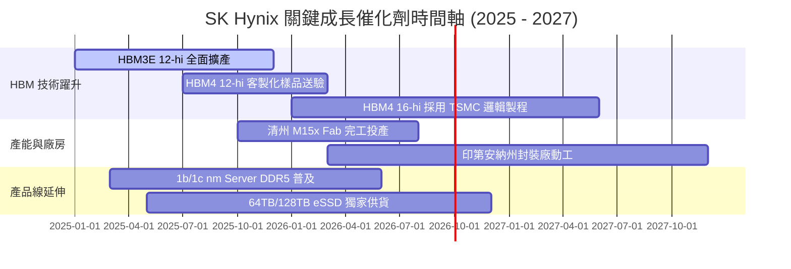

### 9.2 TAM 市場規模分析

```
╔══════════════════════════════════════════════════════════════════╗
║              HBM 與 AI 記憶體可定址市場 (TAM) 預測               ║
╠══════════════════════════════════════════════════════════════════╣
║                                                                  ║
║  全市場 TAM (2024):  $12.5B USD   ████                           ║
║  全市場 TAM (2026E): $38.0B USD   █████████████                  ║
║  全市場 TAM (2028E): $75.0B USD   █████████████████████████      ║
║                                                                  ║
║  📊 2024-2028 年 TAM 複合成長率 (CAGR)：+56.5%                   ║
║  SK Hynix 預計維持 >50% 之 TAM 份額，帶來千億美元級營收潛力。     ║
╚══════════════════════════════════════════════════════════════════╝
```

### 9.3 成長驅動力結構圖

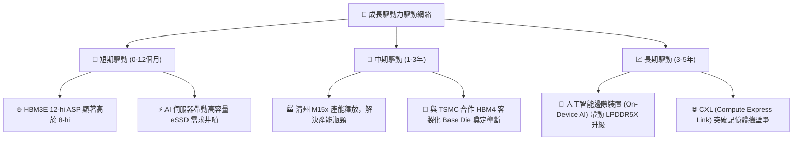

---

## 10. 風險矩陣

### 10.1 風險評分矩陣

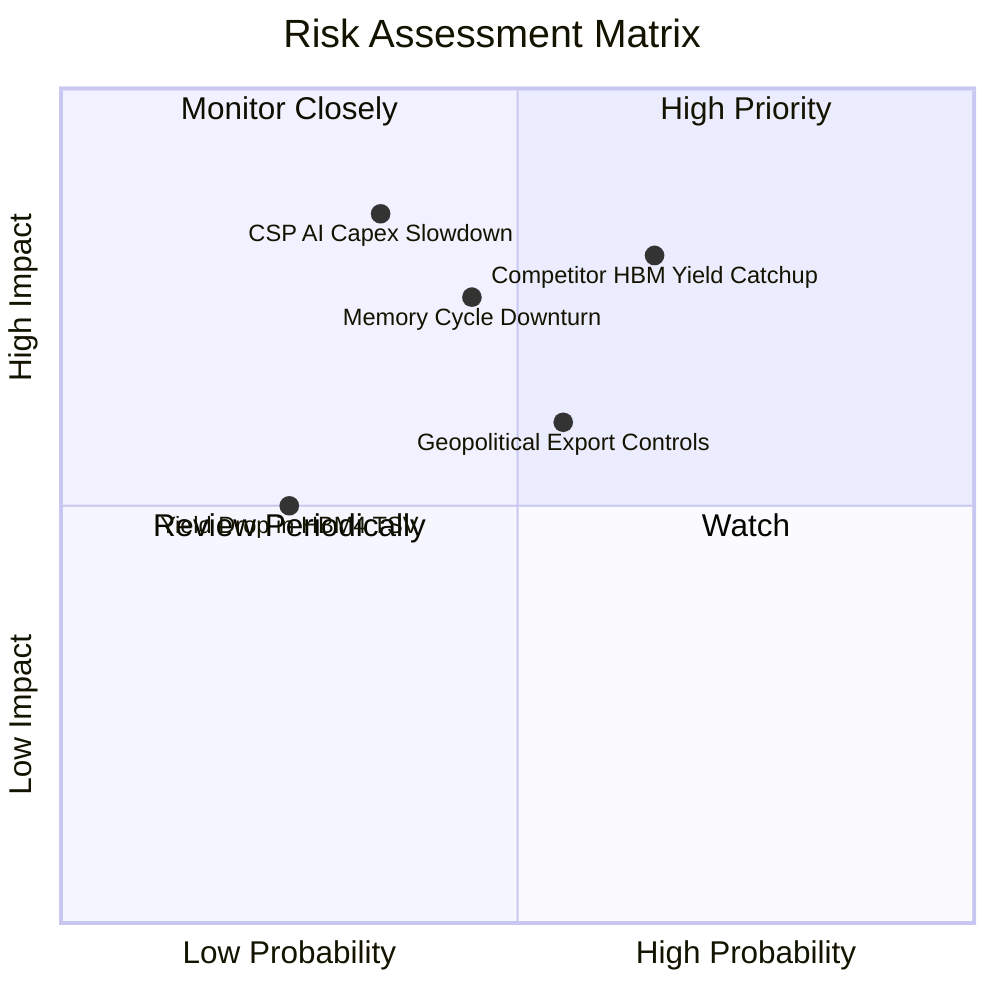

### 10.2 風險清單詳細分析

| # | 風險項目 | 發生機率 | 財務衝擊 | 風險評分 | 具體描述與緩解措施 |
|---|----------|----------|----------|----------|--------------------|
| 1 | 🔴 **競品 HBM3E/4 良率追趕** | 高 (65%) | 高 (-15% ASP) | 🔴 **7.8/10** | **描述**：Samsung/Micron 若通過認證開出產能，壓低溢價。<br/>**緩解**：SK Hynix 推進 MR-MUF 技術至 HBM4，與 TSMC 綁定構築生態壁壘。 |
| 2 | 🟡 **CSP AI 資本支出階段性放緩**| 中 (35%) | 極高 (-25% 需求)| 🟡 **6.8/10** | **描述**：若北美巨頭 AI ROI 不及預期，調整 Capex。<br/>**緩解**：通用型 DDR5 與 64TB eSSD 需求可部分彌補。 |
| 3 | 🟡 **半導體地緣政治出口限制** | 中 (55%) | 中 (-10% 營收) | 🟡 **6.2/10** | **描述**：美國對華限制升級影響無錫廠升級。<br/>**緩解**：逐漸轉移高階產能回韓國本土（龍仁/清州）與美國本土。 |
| 4 | 🟢 **HBM4 TSV 先進封裝良率風險**| 低 (25%) | 中 (-8% 毛利) | 🟢 **4.2/10** | **描述**：16-hi 堆疊帶來熱膨脹與翹曲挑戰。<br/>**緩解**：已具備多年 MR-MUF 經驗，良率掌控力遠超同業。 |

---

## 11. 投資建議

### 11.1 最終綜合評級雷達圖

```
╔══════════════════════════════════════════════════════════════╗
║              SK Hynix 投資維度綜合評估雷達                   ║
╠══════════════════════════════════════════════════════════════╣
║ 業務基本面  (Fundamentals)  9.5/10 ▓▓▓▓▓▓▓▓▓▓▓▓▓▓▓▓▓▓█       ║
║ 成長動能    (Growth Trend)  9.5/10 ▓▓▓▓▓▓▓▓▓▓▓▓▓▓▓▓▓▓█       ║
║ 獲利品質    (Profit Quality)9.8/10 ▓▓▓▓▓▓▓▓▓▓▓▓▓▓▓▓▓▓█       ║
║ 護城河深度  (Moat Depth)    9.2/10 ▓▓▓▓▓▓▓▓▓▓▓▓▓▓▓▓▓▓█       ║
║ 財務安全度  (Balance Sheet) 8.8/10 ▓▓▓▓▓▓▓▓▓▓▓▓▓▓▓▓▓░       ║
║ 估值吸引力  (Valuation)     8.5/10 ▓▓▓▓▓▓▓▓▓▓▓▓▓▓▓▓░░       ║
╠══════════════════════════════════════════════════════════════╣
║ ★ 綜合推薦指數：           9.2/10 🏆 **強力買入 (Strong Buy)**║
╚══════════════════════════════════════════════════════════════╝
```

### 11.2 目標價與隱含報酬率

| 情境 | 機率權重 | 每股內在價值 (USD) | 現價 ($143.02) 隱含報酬率 | 建議操作策略 |
|------|----------|--------------------|---------------------------|--------------|
| 🔴 **悲觀情境** | 20% | **$185.00** | **+29.4%** | 設定為下檔保護防線，安心持有 |
| 🟡 **基準情境** | 60% | **$281.67** | **+96.9%** | **核心目標價，分批建倉** |
| 🟢 **樂觀情境** | 20% | **$355.00** | **+148.2%** | 若 HBM4 獨霸續演，分階段止盈 |
| **加權綜合** | **100%** | **$277.00** | **+93.7%** | **建議長線重倉配置** |

### 11.3 買入時機與觸發因素

```
╔══════════════════════════════════════════════════════════════════╗
║                  ✅ 買入與加碼觸發 Checklist                      ║
╠══════════════════════════════════════════════════════════════════╣
║  立即分批買入條件：                                              ║
║  ✅ 當前股價位於 $140.00 - $160.00 區間（安全邊際 MOS > 40%）   ║
║  ✅ Forward P/E < 5.0x（估值處於絕對歷史底部）                  ║
║                                                                  ║
║  加碼觸發條件（逢拉回即加碼）：                                  ║
║  ☐ 財報公布 HBM3E/HBM4 出貨量超預期，單季營業利益率 >65%         ║
║  ☐ 與 TSMC 聯合發布客製化 HBM4 成功量產訊息                      ║
║  ☐ 股價回檔至悲觀價值 $185.00 附近時強烈加碼                    ║
║                                                                  ║
║  減碼/停損觸發條件（風險警示）：                                 ║
║  ☐ 營業利益率連續兩季跌破 30%                                    ║
║  ☐ 競品在 NVIDIA HBM4 供應鏈取得 >50% 的第一供應商地位           ║
║  ☐ 股價突破 $330.00（接近樂觀目標價，MOS < 0%）                  ║
╚══════════════════════════════════════════════════════════════════╝
```

### 11.4 投資人適配度分析

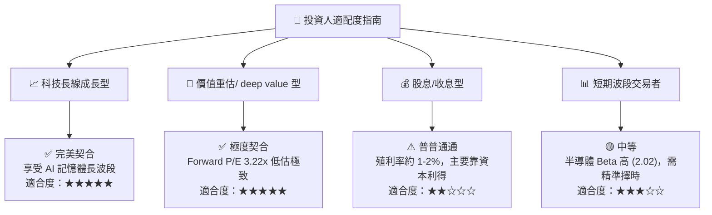

### 11.5 每季財報監控清單（Quarterly Watch List）

| 監控維度 | 關鍵財報指標 | 健全基準值 | 觸發加碼門檻 | 觸發減碼/警訊門檻 |
|----------|--------------|------------|--------------|-------------------|
| **HBM 業務** | HBM 出貨佔 DRAM 營收比重 | >35% | >45% | <25% |
| **獲利能力** | 營業利益率 Operating Margin | >50% | >65% | <30% |
| **資本效率** | 年化 ROIC | >35% | >50% | <15% (跌破 WACC) |
| **自由現金流**| 單季 FCF 現金流 | >$5.0T KRW | >$8.0T KRW | 轉負且無擴產理由 |
| **庫存健康度**| 存貨週轉天數 (DIO) | <90 天 | <75 天 | >130 天 |

### 11.6 反面論證：什麼會證明論點錯誤（What Would Change My Mind）

```
╔══════════════════════════════════════════════════════════════════╗
║              ⚠️ 論點失效可量化條件 (Disconfirming Evidence)       ║
╠══════════════════════════════════════════════════════════════════╣
║  本研究報告之多頭投資論點，在下列情況發生時即告失效，須停損/退出：║
║                                                                  ║
║  1. 核心 HBM 營收成長率連續兩季 YoY < 15%（代表需求停滯）        ║
║  2. SK Hynix 的 HBM 全球市佔率大幅滑落至 35% 以下（護城河被攻破） ║
║  3. 營業利益率較峰值暴跌超過 35 個百分點（價格戰爆發）           ║
║  4. ROIC 跌破 9.2%（WACC），公司開始摧毀股東價值                 ║
║  5. 北美四大 CSP（MSFT/AMZN/GOOGL/META）合計 AI Capex 年增轉負  ║
╚══════════════════════════════════════════════════════════════════╝
```

---

> **免責聲明**：本報告為 AI 與機構分析師模型自動生成，僅供學術研究與投資參考，不構成任何具體個股買賣之邀約或推薦。市場有風險，投資需謹慎。