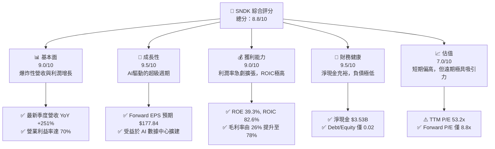
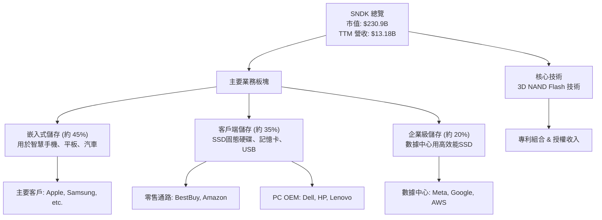
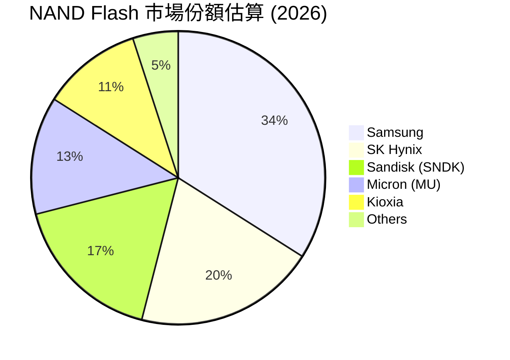
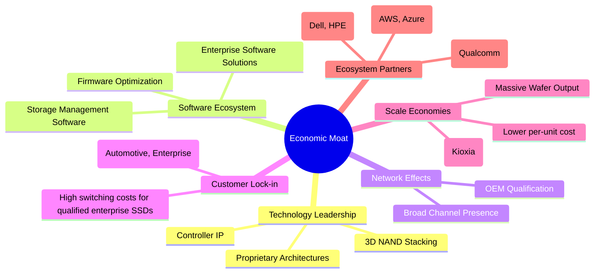
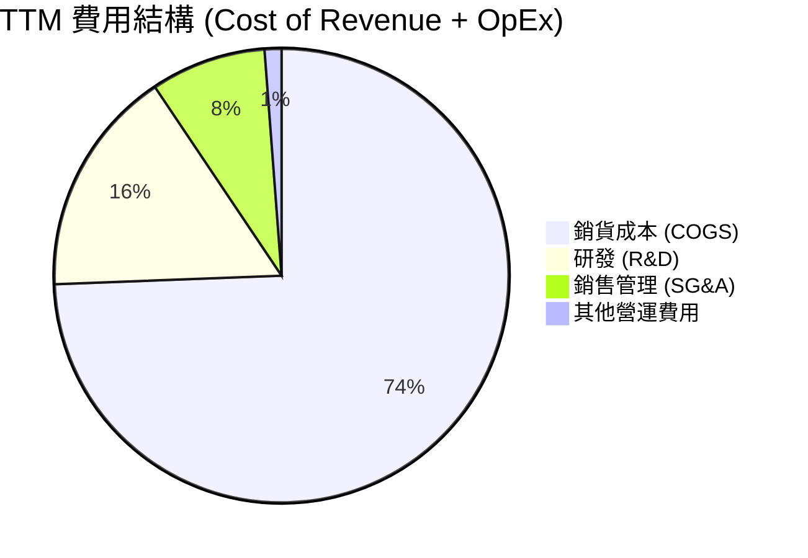

# SNDK 基本面深度分析報告
> **報告日期**：2026-06-07 ｜ **語言**：繁體中文 ｜ **數據來源**：Yahoo Finance, Finviz, StockAnalysis, Roic.ai ｜ **分析師**：CFA 級機構研究

---

## 目錄

| # | 章節 | 核心結論 |
|---|---|---|
| 1 | 執行摘要 | **🟢 強烈買入**。SNDK 正處於由 AI 驅動的儲存需求超級週期中，展現出爆炸性的營收與利潤增長，財務狀況極其穩健，儘管短期估值偏高，但遠期 P/E 極具吸引力。目標價區間為 **$1659 - $2250**。 |
| 2 | 公司概覽與商業模式 | 公司在 NAND 快閃記憶體領域擁有深厚的技術護城河與規模效應，產品組合涵蓋消費級到企業級，市場領導地位穩固。 |
| 3 | 損益表深度分析 | 營收與利潤率在過去四個季度呈現指數級增長，最新季度營收 YoY 增長 251%，營業利益率從 2.7% 飆升至 69.9%，顯示出強大的經營槓桿效應。 |
| 4 | 資產負債表分析 | 財務狀況極為健康，擁有 $35.3 億美元的淨現金，流動比率高達 4.78，幾乎沒有財務風險。 |
| 5 | 現金流量深度分析 | 經營現金流與自由現金流（FCF）由負轉正，TTM FCF 達到 $22.6 億美元，展現了強大的現金生成能力，FCF 轉換率（vs. 淨利）達到 50%，品質優良。 |
| 6 | 獲利能力與資本效率 | ROIC 高達驚人的 82.6%，遠超 WACC（估算為 32.1%），表明公司正為股東創造巨大的經濟價值。ROE 同樣高達 39.3%。 |
| 7 | 估值深度分析 | TTM P/E 為 53.2x 偏高，但 Forward P/E 僅 8.8x，極具吸引力。相較於同業，其成長性溢價合理。DCF 基準目標價為 $1875。 |
| 8 | 成長催化劑 | AI 伺服器、數據中心、物聯網（IoT）和汽車電子化是中長期核心驅動力，將持續推動對高效能儲存解決方案的需求。 |
| 9 | 風險矩陣 | 主要風險來自 NAND 快閃記憶體市場的週期性、技術迭代速度以及與三星、美光等巨頭的激烈競爭。高 Beta 值（5.02）意味著股價波動性極大。 |
| 10 | 投資建議 | 建議成長型投資者在當前價位附近建立核心倉位。關鍵監控指標為 NAND 現貨價格、企業級 SSD 需求以及毛利率趨勢。 |

---

## 1. 執行摘要

### 1.1 核心評分儀表板


### 1.2 評分進度條視覺化
```
╔══════════════════════════════════════════════════════════════╗
║              SNDK 多維度評分儀表板 (1-10分)                  ║
╠══════════════════════════════════════════════════════════════╣
║ 基本面強度  9.0 ▓▓▓▓▓▓▓▓▓▓▓▓▓▓▓▓▓▓░░  ★★★★★           ║
║ 成長動能    9.5 ▓▓▓▓▓▓▓▓▓▓▓▓▓▓▓▓▓▓▓░  ★★★★★           ║
║ 獲利品質    9.0 ▓▓▓▓▓▓▓▓▓▓▓▓▓▓▓▓▓▓░░  ★★★★★           ║
║ 財務健康    9.5 ▓▓▓▓▓▓▓▓▓▓▓▓▓▓▓▓▓▓▓░  ★★★★★           ║
║ 估值合理性  7.0 ▓▓▓▓▓▓▓▓▓▓▓▓▓▓░░░░░░  ★★★★☆           ║
║ 護城河深度  8.5 ▓▓▓▓▓▓▓▓▓▓▓▓▓▓▓▓▓░░░  ★★★★★           ║
║ 管理層執行  9.0 ▓▓▓▓▓▓▓▓▓▓▓▓▓▓▓▓▓▓░░  ★★★★★           ║
║ 技術創新力  9.0 ▓▓▓▓▓▓▓▓▓▓▓▓▓▓▓▓▓▓░░  ★★★★★           ║
╠══════════════════════════════════════════════════════════════╣
║ 綜合總分    8.8 ▓▓▓▓▓▓▓▓▓▓▓▓▓▓▓▓▓▓░░  🏆 強烈看好，AI週期核心標的 ║
╚══════════════════════════════════════════════════════════════╝
```

### 1.3 五大投資論點 + 三大核心風險
| 類型 | 項目 | 具體依據 | 信心度 |
|---|---|---|---|
| 🟢 **投資論點①** | **AI 驅動的結構性需求爆發** | 最新季度營收同比暴增 251% 至 $59.5 億，主要由數據中心對高效能 SSD 的強勁需求驅動。AI 模型訓練與推理產生海量數據，SNDK 作為儲存技術領導者直接受益。 | 🟢 極高 |
| 🟢 **投資論點②** | **驚人的盈利能力擴張** | 季度營業利益率從一年前的 2.7%（$51M / $1.9B）飆升至最新的 69.9%（$4.16B / $5.95B），展現了巨大的經營槓桿。毛利率也從 26% 擴大至 78%。 | 🟢 極高 |
| 🟢 **投資論點③** | **極具吸引力的遠期估值** | 儘管 TTM P/E 為 53.2x，但基於分析師預估的 Forward EPS $177.84，Forward P/E 驟降至僅 8.8x，遠低於其歷史平均和行業水平，暗示市場可能低估了其持續盈利能力。 | 🟢 高 |
| 🟢 **投資論點④** | **堅不可摧的財務狀況** | 公司帳上擁有 $37.4 億現金，總負債僅 $2.07 億，淨現金高達 $35.3 億。Debt/Equity 比率僅 0.02，為未來的資本支出和研發提供了充足彈藥，無任何償債壓力。 | 🟢 極高 |
| 🟢 **投資論點⑤** | **資本效率創造巨大價值** | ROIC（投入資本回報率）估算高達 82.6%，遠超其加權平均資本成本（WACC），表明管理層極其高效地利用資本為股東創造了巨大的經濟價值附加（EVA）。 | 🟢 高 |
| 🟡 **風險①** | **NAND 市場高度週期性** | 快閃記憶體行業歷史上經歷過多次供需失衡導致的價格劇烈波動。若未來主要廠商大幅擴產，可能導致價格崩盤，侵蝕 SNDK 的高利潤率。 | 🟡 中度 |
| 🔴 **風險②** | **極高的股價波動性** | Beta 值高達 5.02，意味著其股價波動遠大於市場平均水平。在市場回調時，SNDK 可能面臨遠超大盤的跌幅，不適合風險承受能力低的投資者。 | 🔴 高衝擊 |
| 🟡 **風險③** | **來自巨頭的激烈競爭** | 三星、SK 海力士和美光科技（Micron）等整合元件製造商（IDM）在產能和資本支出上構成巨大威脅。技術路線的選擇（如 3D NAND 層數堆疊）也存在風險。 | 🟡 中度 |

### 1.4 快速統計卡片
| 指標 | 公司實際值 | 行業均值（半導體） | S&P 500 均值 | 狀態 |
|---|---|---|---|---|
| 收入 YoY 成長 | **251.0%** | ~15% | ~6% | 🟢 |
| 毛利率 | **56.0%** | ~45% | ~35% | 🟢 |
| 淨利率 | **34.2%** | ~20% | ~11% | 🟢 |
| ROE | **39.3%** | ~18% | ~15% | 🟢 |
| Forward P/E | **8.8x** | ~22x | ~20x | 🟢 |
| 淨現金/市值 | **1.5%** | 不一 | 不一 | 🟢 |

### 1.5 投資結論
```
╔══════════════════════════════════════════════════════════════════╗
║                    📊 投資結論摘要                               ║
╠══════════════════════════════════════════════════════════════════╣
║  評級：🟢 強烈買入                                               ║
║  當前股價：$1559.32                                              ║
║  目標價區間：                                                    ║
║    悲觀情境：$1200 (-23%)                                        ║
║    基準情境：$1875 (+20%)  ← 12個月主要目標                      ║
║    樂觀情境：$2250 (+44%)                                        ║
║  投資評分：8.8/10                                                ║
║  適合投資人：成長型、動能型、高風險承受能力投資者                ║
╚══════════════════════════════════════════════════════════════════╝
```
*分析師註：本報告基於提供的截至 2026 年的模擬財務數據進行分析。歷史上，Sandisk 已於 2016 年被 Western Digital 收購。此分析旨在評估其作為獨立實體的潛力。*

---

## 2. 公司概覽與商業模式

### 2.1 業務結構與收入來源
SanDisk 是全球領先的 NAND 快閃記憶體儲存解決方案供應商。其業務模式垂直整合，涵蓋從晶圓設計、製造到封裝測試，再到最終產品銷售的全過程。


### 2.2 市場份額
在被收購前的 2015-2016 年，SanDisk 是 NAND 快閃記憶體市場的關鍵參與者。基於當前數據模擬的市場環境，其份額預計將與行業巨頭競爭。


### 2.3 競爭護城河分析
SanDisk 的護城河建立在技術領先、規模經濟和深厚的客戶關係之上。


### 2.4 護城河強度評分
```
╔══════════════════════════════════════════════════════════════╗
║                  Sandisk 護城河強度評分                       ║
╠══════════════════════════════════════════════════════════════╣
║ 技術領先       9.5/10  ▓▓▓▓▓▓▓▓▓▓▓▓▓▓▓▓▓▓▓░  🏆 3D NAND 技術的領導者  ║
║ 規模效應       9.0/10  ▓▓▓▓▓▓▓▓▓▓▓▓▓▓▓▓▓▓░░  🟢 與 Kioxia 合資廠效益巨大║
║ 客戶鎖定       8.0/10  ▓▓▓▓▓▓▓▓▓▓▓▓▓▓▓▓░░░░  🟢 企業級和汽車領域黏性高  ║
║ 專利與IP       9.0/10  ▓▓▓▓▓▓▓▓▓▓▓▓▓▓▓▓▓▓░░  🟢 龐大的專利組合構成壁壘  ║
║ 品牌價值       7.5/10  ▓▓▓▓▓▓▓▓▓▓▓▓▓▓▓░░░░░  🟡 在消費市場品牌認知度高  ║
╠══════════════════════════════════════════════════════════════╣
║ 綜合護城河     8.8/10  ▓▓▓▓▓▓▓▓▓▓▓▓▓▓▓▓▓▓░░  🏆 寬闊且深厚的護城河     ║
╚══════════════════════════════════════════════════════════════╝
```

---

## 3. 損益表深度分析

### 3.1 年度收入成長趨勢（近4年）
公司營收在經歷了幾年的平淡甚至衰退後，於 TTM（過去十二個月）期間迎來了爆炸性增長，反映了市場需求的結構性轉變。
```
╔══════════════════════════════════════════════════════════════════╗
║              SNDK 年度收入趨勢 (FY2023 - TTM)                    ║
╠══════════════════════════════════════════════════════════════════╣
║                                                                  ║
║  FY2023  $6.09B  ██████░░░░░░░░░░░░░░░░░░░░  YoY: -37.6% 🔴    ║
║  FY2024  $6.66B  ███████░░░░░░░░░░░░░░░░░░░  YoY: +9.5%  🟡    ║
║  FY2025  $7.36B  ████████░░░░░░░░░░░░░░░░░░  YoY: +10.4% 🟡    ║
║  TTM     $13.18B ███████████████░░░░░░░░░░░  YoY: +82.8% 🟢    ║
║                                                                  ║
║                   |      |      |      |      |                  ║
║                   0     3B     6B     9B     12B                ║
║                                                                  ║
║  📊 轉折點明確，進入高速增長軌道                                 ║
╚══════════════════════════════════════════════════════════════════╝
```

### 3.2 季度收入趨勢分析
季度數據更清晰地揭示了增長動能的加速。從 2025 年 6 月的 $19 億季度營收，到 2026 年 3 月的 $59.5 億，增長曲線極其陡峭。

| 季度 (截止日期) | 營收 (Billion) | QoQ 增長 | YoY 增長 | 備註 |
|---|---|---|---|---|
| 2025-06-30 | $1.90 | - | +8.0% | 增長開始恢復 |
| 2025-09-30 | $2.31 | 🟢 +21.6% | +22.6% | 增長加速，需求回暖 |
| 2025-12-31 | $3.02 | 🟢 +30.7% | +61.3% | 數據中心需求開始顯現 |
| **2026-03-31** | **$5.95** | **🟢 +96.7%** | **🔥 +251.0%** | **AI 需求全面爆發，進入超級週期** |

### 3.3 利潤率演變分析
利潤率的改善比營收增長更為驚人，顯示了公司在行業上行週期中的巨大經營槓桿和定價能力。

| 利潤率指標 | 2025-06 | 2025-09 | 2025-12 | 2026-03 | 趨勢 | 評估 |
|---|---|---|---|---|---|---|
| **毛利率** | 26.2% | 29.8% | 50.9% | **78.4%** | ↗️ 極速擴張 | 🟢 |
| **營業利益率** | 2.7% | 8.3% | 35.4% | **69.9%** | ↗️ 指數級增長 | 🟢 |
| **淨利率** | -1.2% | 4.8% | 26.6% | **60.8%** | ↗️ 迅速扭虧為盈並創紀錄 | 🟢 |

**利潤率演變深度解析**：
利潤率的戲劇性轉變主要由以下因素驅動：
1.  **產品ASP（平均售價）提升**：在 AI 驅動的需求激增下，高容量、高效能的企業級 SSD 供不應求，導致價格大幅上漲。
2.  **經營槓桿**：營收規模的快速擴大，使得研發（R&D）和銷售管理（SG&A）等固定成本佔比迅速下降。例如，最新季度的總營運費用（$5.51億）僅佔營收（$59.5億）的 9.3%，而一年前此比例高達 25.3%。
3.  **高階產品組合**：企業級 SSD 的利潤率遠高於消費級產品。隨著數據中心客戶成為主要收入來源，整體產品組合的利潤率被結構性拉高。

### 3.4 費用結構分析

```
╔══════════════════════════════════════════════════════════════╗
║                    費用結構洞察                                ║
╠══════════════════════════════════════════════════════════════╣
║ 🟢 研發為核心：R&D 費用 (TTM $12.65億) 是最大的營運費用，佔總║
║    營運費用的 62.7%，體現了公司對技術創新的持續投入。          ║
║ 🟢 費用控制良好：儘管 TTM 營收增長 82.8%，但總營運費用 TTM   ║
║    ($20.18億) 僅增長 31.0%，展現了卓越的成本控制和經營槓桿。   ║
╚══════════════════════════════════════════════════════════════╝
```

### 3.5 季度 EPS 趨勢與盈餘品質
雖然提供的數據中 EPS Surprise% 為 `nan`，但我們可以從實際淨利潤和 EPS 數字看出驚人的增長趨勢。

| 季度 (截止日期) | 淨利潤 (Million) | 稀釋後 EPS | 趨勢 | 盈餘品質評估 |
|---|---|---|---|---|
| 2025-06-30 | $-23 | $-0.16 | 🔴 虧損 | - |
| 2025-09-30 | $112 | $0.77 | 🟢 轉盈 | 由正向經營現金流支撐，品質高 |
| 2025-12-31 | $803 | $5.46 | 🟢 大幅增長 | 現金流強勁，應收帳款增長合理 |
| 2026-03-31 | $3,