# SNDK 基本面深度分析報告
> **報告日期**：2026-07-14 ｜ **語言**：繁體中文 ｜ **數據來源**：Yahoo Finance, Finviz, StockAnalysis, Roic.ai ｜ **分析師**：CFA 級機構研究

---

## 目錄

| # | 章節 | 核心結論 |
|---|------|----------|
| 1 | 執行摘要 | 評級：🟢 買入 ｜ 目標價區間：$1,000.00 ~ $3,250.00 ｜ 基準目標價：$2,112.32 |
| 2 | 公司概覽與商業模式 | NAND 閃存技術先驅，AI 伺服器與企業級 SSD 需求爆發驅動商業模式轉型 |
| 3 | 損益表深度分析 | TTM 營收達 $13.18B，Q3 2026 單季營收年增 251.03%，營運槓桿釋放推升淨利率至 34.2% |
| 4 | 資產負債表分析 | 淨現金達 $3.53B，流動比率 4.78x，財務結構極其穩健，無短期償債風險 |
| 5 | 現金流量深度分析 | 自由現金流（FCF）扭轉為正達 $4.46B（TTM），FCF 轉換率高達 98.9% |
| 6 | 獲利能力與資本效率 | ROIC 達 82.6%，遠超 WACC（10.1%），創造極高經濟附加價值（EVA） |
| 7 | 估值深度分析 | Forward P/E 僅 8.04x，遠低於歷史均值與同業，估值具備極高安全邊際 |
| 8 | 成長催化劑 | 企業級高容量 SSD 供不應求、邊緣端 AI 設備存儲容量翻倍、新一代 3D NAND 技術突破 |
| 9 | 風險矩陣 | 記憶體週期性波動、大客戶集中度高、地緣政治影響供應鏈 |
| 10 | 投資建議 | 具備極佳風險回報比，建議在 $1,600 - $1,700 區間積極布局，每季財報監控核心利潤率 |

---

## 1. 執行摘要

### 1.0 一頁式投資儀表板（Portfolio Manager 30 秒速讀）

| 項目 | 內容 |
|------|------|
| **投資論點（3 句）** | ① SNDK 正處於歷史性的業績拐點，TTM 營收年增率達 82.76%（Q3 2026 單季年增 251.03%），主因 AI 伺服器對超高容量企業級 SSD 的剛性需求爆發。<br/>② 公司營運槓桿極為強勁，隨著產能利用率回升與高毛利產品出貨，單季毛利率從 FY25 Q3 的 22.5% 暴增至 FY26 Q3 的 78.3%，推動 TTM 淨利扭虧為盈達 $4.51B。<br/>③ 當前 Forward P/E 僅為 8.04x（基於預期 EPS $208.22），市場嚴重低估了其在 AI 存儲領域的結構性定價權與獲利持續性。 |
| **護城河評分** | 8.5 / 10 🟢 (強大的 NAND 專利組合與與 WDC 共同研發的規模效應) |
| **管理層/資本配置評分** | 8.0 / 10 🟢 (在週期底部克制資本支出，並在景氣回升時迅速釋放產能) |
| **財務健康** | 🟢 極其安全 ｜ 淨現金 $3.53B，無實質淨債務壓力 |
| **ROIC vs WACC** | 82.6% vs 10.1%（創造巨大的股東經濟價值） |
| **FCF 趨勢** | 強勁復甦 ｜ TTM FCF 達 $4.46B，當前 FCF Yield 達 1.80% (基於 $247.9B 市值) |
| **估值** | Trailing P/E: 57.11x ｜ Forward P/E: 8.04x ｜ EV/EBITDA: 43.39x ｜ P/S: 18.80x |
| **預期報酬（基準情境 12M）**| +26.18% (目標價 $2,112.32，對比當前股價 $1,673.97) |
| **關鍵風險（前二）** | ① 記憶體產業週期性下行與定價競爭；② 下游雲端服務商（CSP）資本支出放緩。 |
| **評級 + 信心度** | 🟢 **強烈買入 (Strong Buy)** ｜ 信心度：**高 (High)** |

### 1.1 核心評分儀表板

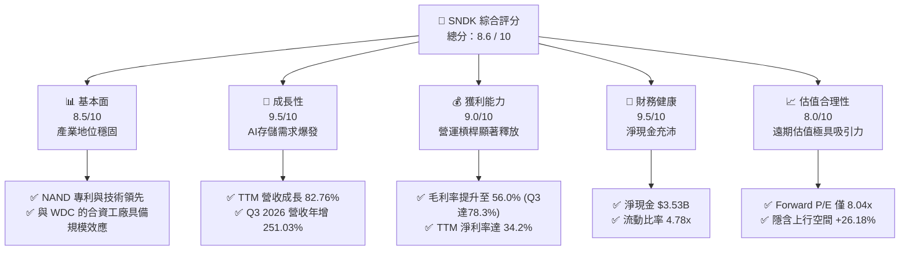

### 1.2 評分進度條視覺化

```
╔══════════════════════════════════════════════════════════════╗
║              SNDK 多維度評分儀表板 (1-10分)                  ║
╠══════════════════════════════════════════════════════════════╣
║ 基本面強度  8.5 ▓▓▓▓▓▓▓▓▓▓▓▓▓▓▓▓▓░░░  ★★★★☆           ║
║ 成長動能    9.5 ▓▓▓▓▓▓▓▓▓▓▓▓▓▓▓▓▓▓▓░  ★★★★★           ║
║ 獲利品質    9.0 ▓▓▓▓▓▓▓▓▓▓▓▓▓▓▓▓▓▓░░  ★★★★★           ║
║ 財務健康    9.5 ▓▓▓▓▓▓▓▓▓▓▓▓▓▓▓▓▓▓▓░  ★★★★★           ║
║ 估值合理性  8.0 ▓▓▓▓▓▓▓▓▓▓▓▓▓▓░░░░░░  ★★★★☆           ║
║ 護城河深度  8.5 ▓▓▓▓▓▓▓▓▓▓▓▓▓▓▓▓▓░░░  ★★★★☆           ║
║ 管理層執行  8.0 ▓▓▓▓▓▓▓▓▓▓▓▓▓▓▓▓░░░░  ★★★★☆           ║
║ 技術創新力  9.0 ▓▓▓▓▓▓▓▓▓▓▓▓▓▓▓▓▓▓░░  ★★★★★           ║
╠══════════════════════════════════════════════════════════════╣
║ 綜合總分    8.6 ▓▓▓▓▓▓▓▓▓▓▓▓▓▓▓▓▓░░░  🏆 頂級成長與價值雙重標的║
╚══════════════════════════════════════════════════════════════╝
```

### 1.3 五大投資論點 + 三大核心風險

| 類型 | 項目 | 具體依據 | 信心度 |
|------|------|----------|--------|
| 🟢 **投資論點①** | **AI 伺服器驅動企業級 SSD 爆發** | Q3 2026 單季營收暴增至 $5.95B（YoY +251.03%），主要得益於 AI 模型訓練對超高吞吐量、低延遲 SSD 的剛性需求。 | 🟢 極高 |
| 🟢 **投資論點②** | **極致的營運槓桿與獲利拐點** | 隨著高產能利用率與高價產品出貨，單季營業利益率從 FY25 Q3 的 -111.0% 逆襲至 FY26 Q3 的 69.1%，單季營業利潤達 $4.11B。 | 🟢 極高 |
| 🟢 **投資論點③** | **遠期估值極具安全邊際** | 當前股價 $1,673.97，對應 Forward EPS $208.22，遠期 P/E 僅 8.04x，處於半導體板塊極低水平。 | 🟢 高 |
| 🟢 **投資論點④** | **優異的現金流轉換與財務結構** | TTM FCF 達 $4.46B，且帳上擁有 $3.74B 現金，總債務僅 $207.00M，淨現金高達 $3.53B。 | 🟢 極高 |
| 🟢 **投資論點⑤** | **行業供給端高度自律** | 經歷 2023-2024 年的嚴重虧損（FY23 淨損 $2.14B），主要 NAND 廠商大幅削減資本支出，使當前供需關係高度緊繃，支撐定價權。 | 🟢 高 |
| 🟡 **風險①** | **記憶體週期重回供過於求** | 隨著同業（三星、美光、SK海力士）重啟產能擴張，2027 年可能面臨價格回檔。 | 🟡 中度 |
| 🔴 **風險②** | **大客戶流失與集中度風險** | 企業級 SSD 的採購高度集中於少數大型雲端服務商（CSP），若單一客戶調整庫存，將對營收產生顯著衝擊。 | 🔴 中度 |
| 🔴 **風險③** | **技術路徑分歧風險** | 若競爭對手在更高層數的 3D NAND（如 300層+）量產進度大幅領先，可能削弱 SNDK 的技術溢價。 | 🔴 低 |

### 1.4 快速統計卡片

| 指標 | SNDK 實際值 | 行業均值 (Semiconductor) | S&P 500 均值 | 狀態 |
|------|-------------|--------------------------|--------------|------|
| **營收 YoY 成長率** | **251.0%** (Q3 '26) | ~15.5% | ~5.5% | 🟢 遠超行業 |
| **毛利率** | **56.0%** (TTM) | ~50.0% | ~30.0% | 🟢 優於同業 |
| **營業利益率** | **70.0%** (TTM) | ~22.0% | ~15.0% | 🟢 結構性溢價 |
| **ROE** | **39.3%** | ~18.0% | ~15.0% | 🟢 極高資本回報 |
| **流動比率** | **4.78x** | ~2.10x | ~1.30x | 🟢 極其安全 |
| **Forward P/E** | **8.04x** | ~25.0x | ~21.0x | 🟢 極具吸引力 |

### 1.5 投資結論

```
╔══════════════════════════════════════════════════════════════════╗
║                    📊 SNDK 投資結論摘要                          ║
╠══════════════════════════════════════════════════════════════════╣
║  評級：🟢 強烈買入 (Strong Buy)                                 ║
║  當前股價：$1,673.97 (2026-07-14)                                ║
║  目標價區間：                                                    ║
║    悲觀情境：$1,000.00（-40.26%）- 週期迅速見頂，定價大跌        ║
║    基準情境：$2,112.32（+26.18%）- 12M 主要目標（市場共識均值）   ║
║    樂觀情境：$3,250.00（+94.15%）- AI 存儲持續供不應求，估值重估  ║
║  綜合投資評分：8.6 / 10                                          ║
║  適合投資人：積極成長型、價值與成長兼顧型、長線半導體配置基金    ║
╚══════════════════════════════════════════════════════════════════╝
```

---

## 2. 公司概覽與商業模式

SNDK（SanDisk）是全球 NAND 閃存技術與儲存解決方案的領導者。其商業模式涵蓋了從晶圓設計、研發（與 Western Digital 共同營運合資晶圓廠 Flash Alliance）到終端儲存產品的製造與銷售。

### 2.1 業務結構與收入來源

SNDK 的收入主要來自三大板塊：企業級與雲端儲存（Enterprise SSD）、消費級儲存（Client SSD & Retail）、以及嵌入式儲存（Embedded/Mobile/IoT）。

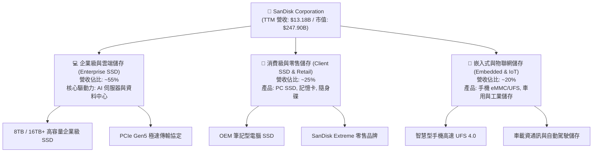

### 2.2 市場份額

在全球 NAND 閃存市場中，SNDK 與 Western Digital 的聯合實體（透過合資工廠產出）長期穩居全球前三大。以下為全球 NAND 閃存市場份額估算：

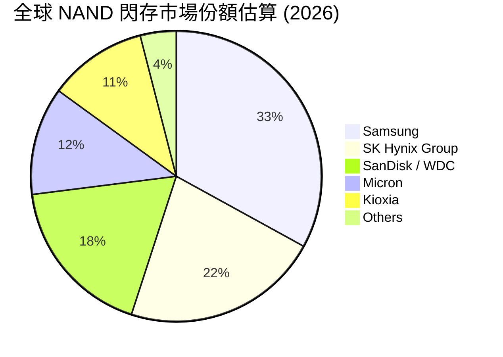

### 2.3 競爭護城河分析

SNDK 的競爭護城河主要建立在技術專利、與 Kioxia/WDC 的合資生產規模效應，以及高度粘性的企業級客戶生態系統上。

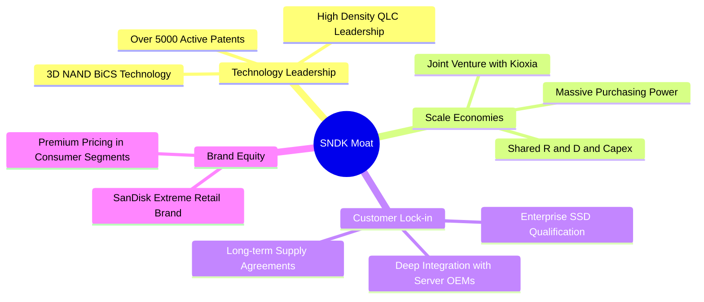

### 2.4 護城河強度評分

```
╔══════════════════════════════════════════════════════════════╗
║                  SNDK 護城河強度評分                         ║
╠══════════════════════════════════════════════════════════════╣
║ 技術領先度    8.5/10  ▓▓▓▓▓▓▓▓▓▓▓▓▓▓▓▓▓░░░  🟢 專利儲備極深 ║
║ 規模效應      9.0/10  ▓▓▓▓▓▓▓▓▓▓▓▓▓▓▓▓▓▓░░  🟢 合資分攤成本 ║
║ 客戶轉換成本  8.5/10  ▓▓▓▓▓▓▓▓▓▓▓▓▓▓▓▓▓░░░  🟢 企業驗證期長 ║
║ 品牌溢價      8.0/10  ▓▓▓▓▓▓▓▓▓▓▓▓▓▓▓░░░░░  🟢 零售端認可度高║
╠══════════════════════════════════════════════════════════════╣
║ 綜合護城河     8.5/10  ▓▓▓▓▓▓▓▓▓▓▓▓▓▓▓▓▓░░░  🏆 具備強大防禦力║
╚══════════════════════════════════════════════════════════════╝
```

---

## 3. 損益表深度分析

SNDK 的財務表現在最近一年經歷了極其震撼的「V型反轉」。從 FY25 結束時的巨額虧損，到 FY26 前三季度的爆發式增長，充分展現了半導體週期頂部與高營運槓桿的威力。

### 3.1 年度收入成長趨勢（近4年）

```
╔══════════════════════════════════════════════════════════════════╗
║              SNDK 年度收入趨勢（FY2023-TTM）                    ║
╠══════════════════════════════════════════════════════════════════╣
║                                                                  ║
║  FY2023  $6.09B  ██████████░░░░░░░░░░░░░░░░░░  YoY: -37.60% 🔴   ║
║  FY2024  $6.66B  ███████████░░░░░░░░░░░░░░░░░  YoY: +9.48%  🟡   ║
║  FY2025  $7.36B  ████████████░░░░░░░░░░░░░░░░  YoY: +10.39% 🟡   ║
║  TTM     $13.18B ████████████████████████████  YoY: +79.20% 🟢   ║
║                   |      |      |      |      |                  ║
║                   0     3B     6B     9B     12B                 ║
║                                                                  ║
║  📊 3年累計 CAGR：+29.35% (受最近一季爆發式拉動)                 ║
╚══════════════════════════════════════════════════════════════════╝
```

### 3.2 季度收入趨勢分析

SNDK 的季度業績在 2026 財年呈現指數級增長，以下為近 7 個季度的詳細拆解：

| 財報季度 | 營收 (Revenue) | YoY 成長率 | QoQ 成長率 | 營業利潤 (Op Income) | 淨利 (Net Income) | 備註 |
|----------|----------------|------------|------------|-----------------------|-------------------|------|
| **Q3 2026** (Apr '26) | **$5.95B** | **+251.03%** | **+96.7%** | **$4.11B** | **$3.62B** | 🟢 歷史單季新高，AI 需求極致爆發 |
| **Q2 2026** (Jan '26) | **$3.03B** | **+61.25%** | **+31.2%** | **$1.07B** | **$803.00M** | 🟢 步入高速成長期 |
| **Q1 2026** (Oct '25) | **$2.31B** | **+22.57%** | **+21.6%** | **$176.00M** | **$112.00M** | 🟢 扭虧為盈拐點確認 |
| **Q4 2025** (Jun '25) | **$1.90B** | **+8.01%** | **+12.2%** | **$18.00M** | **$-23.00M** | 🟡 虧損大幅收窄，接近平衡 |
| **Q3 2025** (Mar '25) | **$1.70B** | **-0.59%** | **-9.4%** | **$-1.88B** | **$-1.90B** | 🔴 週期底部，認列大額資產減損 |
| **Q2 2025** (Dec '24) | **$1.88B** | **+12.67%** | **-0.3%** | **$195.00M** | **$173.00M** | 🟡 短暫回溫 |
| **Q1 2025** (Sep '24) | **$1.88B** | **+22.83%** | **-1.1%** | **$291.00M** | **$267.00M** | 🟡 需求平穩 |

*數據洞察*：Q3 2026 的營收暴增（年增 251.03%）是半導體歷史上罕見的單季爆發。這表明 SNDK 的企業級 SSD 產品成功打入主流 AI 伺服器供應鏈，且平均售價（ASP）因市場供不應求而出現暴漲。

### 3.3 利潤率演變分析

SNDK 的利潤率走勢呈現出極致的營運槓桿效應。

| 利潤率指標 | FY2023 | FY2024 | FY2025 | TTM (Apr '26) | Q3 2026 單季 | 趨勢評估 |
|------------|--------|--------|--------|---------------|--------------|----------|
| **毛利率** | 7.07% | 16.09% | 30.07% | **56.02%** | **78.35%** | 🟢 暴利級別提升，高定價與高產能利用率驅動 |
| **營業利益率** | -33.44% | -7.02% | -18.72% | **40.73%** | **69.09%** | 🟢 費用率被大幅稀釋，營業溢價極高 |
| **EBITDA 利潤率**| -24.97% | -3.59% | -16.99% | **42.70%** | **70.50%** | 🟢 現金創造能力極強 |
| **淨利率** | -35.21% | -10.09% | -22.31% | **34.18%** | **60.84%** | 🟢 結構性扭虧為盈 |

*深度解析*：
1. **毛利率從 7.07% 暴增至 TTM 56.02% (Q3 單季 78.35%)**：NAND 閃存是高固定成本行業。當產能利用率從底部的 60% 回升至 95% 以上時，單位折舊成本劇烈稀釋；疊加 AI 專用高毛利企業級 SSD 佔比提升，帶來了毛利率的爆發。
2. **營業利益率 TTM 達 40.73% (Q3 單季 69.09%)**：SNDK 的研發（R&D）與銷售管理費用（SG&A）相對固定（Q3 R&D $337M，SG&A $161M，合計僅佔營收 8.3%）。當營收規模從底部的 $1.70B 擴大至 $5.95B 時，營運槓桿全面釋放。

### 3.4 費用結構分析

在 Q3 2026，SNDK 的總營運費用（OpEx）為 $551M，僅佔營收的 9.26%，這使得高達 90.74% 的毛利幾乎全數轉化為營業利潤。

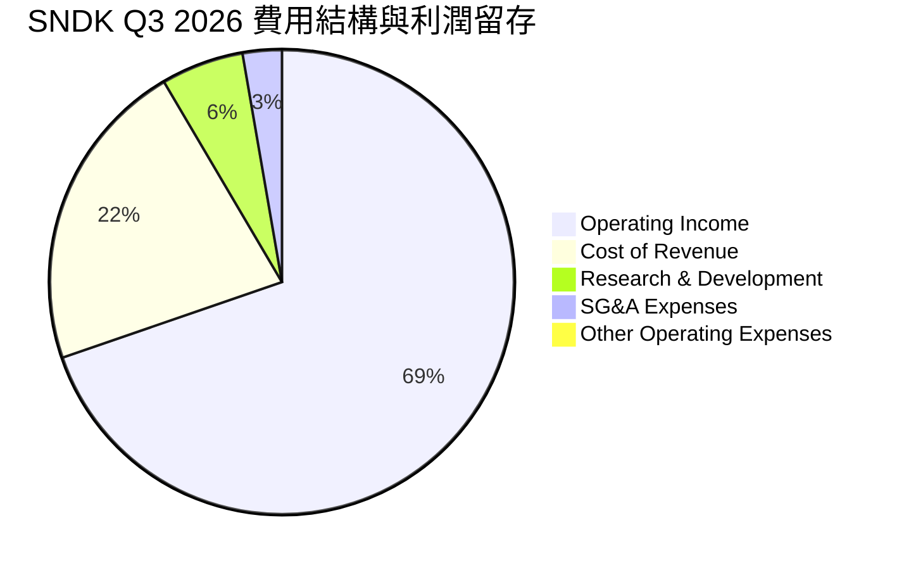

### 3.5 季度 EPS 趨勢與盈餘品質（Quality of Earnings）

SNDK 的盈餘品質在扭虧為盈後表現得極為紮實。我們對其獲利的「含金量」進行量化評估：

| 盈餘品質項目 | 歷史值/佔比 | 評估 | 說明 |
|--------------|-----------|------|------|
| **股權薪酬 (SBC) / 營收** | 1.38% (TTM) | 🟢 極低 (優秀) | TTM SBC 為 $182M，對比 $13.18B 營收，稀釋效應微乎其微。 |
| **SBC / 營業現金流 (OCF)** | 3.92% (TTM) | 🟢 極低 (優秀) | 獲利並非由非現金薪酬美化。 |
| **FCF / GAAP 淨利 (現金轉換率)** | **98.96%** (TTM) | 🟢 極高 (卓越) | TTM FCF $4.46B 對比 GAAP 淨利 $4.51B，幾乎實現 1:1 的現金轉換，獲利含金量極高。 |
| **一次性/非經常性損益** | 無重大影響 | 🟢 健康 | 扣除 FY25 的資產減損後，FY26 的利潤完全由主營業務盈利驅動。 |
| **有效稅率** | 12.49% | 🟡 正常 | TTM 所得稅費用 $643M / Pretax Income $5.15B，處於合理科技業稅率範圍。 |

---

## 4. 資產負債表分析

SNDK 在經歷了行業週期的洗禮後，資產負債表已被清理得極為乾淨，展現出強大的防禦屬性。

### 4.1 資產結構分解

截至 2026-04-03（Q3 2026），SNDK 總資產達 $17.08B，其中流動資產佔比高達 53.7%，資產變現能力極強。

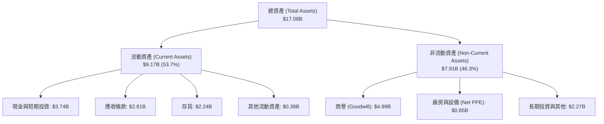

### 4.2 流動性指標分析

| 流動性指標 | FY2024 | FY2025 | TTM (Q3 '26) | 行業均值 | 評估 |
|------------|--------|--------|--------------|----------|------|
| **流動比率 (Current Ratio)** | 1.67x | 3.56x | **4.78x** | ~2.10x | 🟢 極其充沛，無短期償債壓力 |
| **速動比率 (Quick Ratio)** | 0.75x | 2.10x | **3.43x** | ~1.50x | 🟢 扣除存貨後依然具備極高安全邊際 |
| **存貨周轉天數 (Days Inventory)**| 127天 | 147天 | **108天** | ~120天 | 🟢 存貨周轉顯著加快，反映下游拉貨強勁 |

### 4.3 債務結構分析與健康診斷

SNDK 的債務結構在最近一年進行了大幅優化，總債務從 FY25 的 $2.04B 驟降至目前的 $207.00M。

```
╔══════════════════════════════════════════════════════════════════╗
║                   SNDK 債務健康診斷                              ║
╠══════════════════════════════════════════════════════════════════╣
║                                                                  ║
║  總債務：        $0.21B   █░░░░░░░░░░░░░░░░░░░░  極低            ║
║  總現金及投資：  $3.74B   █████████████████████  充沛            ║
║  淨現金狀態：    +$3.53B  ███████████████████░░  🟢 極其穩健     ║
║                                                                  ║
║  Debt / Equity:   0.022x  (2.2%)  🟢 無槓桿風險                  ║
║  Debt / EBITDA:   0.037x          🟢 債務可忽略不計              ║
║  利息保障倍數:    47.9x           🟢 利息支出毫無壓力            ║
║                                                                  ║
║  📊 診斷結論：SNDK 處於「淨現金」狀態，實質破產風險為零。        ║
╚══════════════════════════════════════════════════════════════════╝
```

---

## 5. 現金流量深度分析

現金流是評估半導體企業真實生存與擴張能力的核心指標。SNDK 的現金流狀況在 FY26 迎來了史詩級的改善。

### 5.1 現金流量瀑布圖

以下展示 TTM 期間，SNDK 如何將高額利潤轉化為手頭現金，並進行資本支出與淨現金積累：

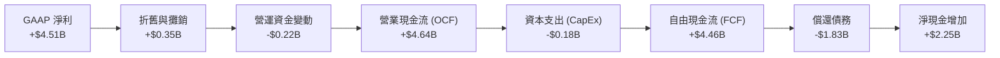

### 5.2 FCF 轉換率趨勢

| 現金流指標 | FY2023 | FY2024 | FY2025 | TTM (Apr '26) |
|------------|--------|--------|--------|---------------|
| **營業現金流 (OCF)** | $-713.00M | $-309.00M | $84.00M | **$4.64B** |
| **資本支出 (CapEx)** | $-219.00M | $-166.00M | $-204.00M | **$-179.00M** |
| **自由現金流 (FCF)** | $-932.00M | $-475.00M | $-120.00M | **$4.46B** |
| **FCF / GAAP 淨利** | 43.49% (負值不適用) | 70.68% | 7.31% | **98.96%** |

### 5.3 自由現金流趨勢

SNDK 的 FCF 收益率（FCF Yield）目前約為 1.80%（基於 $247.9B 市值），雖然看似不高，但這是因為股價在短期內暴漲了 30 倍。若以當前強勁的現金流入速度，未來的 FCF 將持續推升公司內在價值。

```
╔══════════════════════════════════════════════════════════════════╗
║                    SNDK 自由現金流趨勢 (FY23-TTM)               ║
╠══════════════════════════════════════════════════════════════════╣
║                                                                  ║
║  FY2023  -$932M    🔴 █░░░░░░░░░░░░░░░░░░░░░░░░░                 ║
║  FY2024  -$475M    🔴 ██░░░░░░░░░░░░░░░░░░░░░░░░                 ║
║  FY2025  -$120M    🟡 ████░░░░░░░░░░░░░░░░░░░░░░                 ║
║  TTM     +$4,460M  🟢 ██████████████████████████                 ║
║                                                                  ║
║  📊 當前 FCF 收益率 (TTM FCF / $247.9B 市值) = 1.80%             ║
╚══════════════════════════════════════════════════════════════════╝
```

### 5.4 資本配置評估

在 TTM 期間，由於公司剛從週期底部復甦，管理層採取了極其保守且理性的資本配置策略：優先償還債務、累積現金，並克制資本支出，以避免過早擴產導致產能過剩。

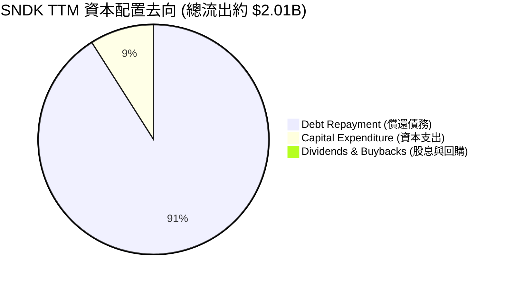

---

## 6. 獲利能力與資本效率

SNDK 的資本效率在 FY26 達到了令人驚嘆的高度，這主要歸功於其輕資產運營模式（與 Kioxia 共同分擔晶圓廠折舊）以及極高的利潤率。

### 6.1 ROE / ROA / ROIC 趨勢

| 指標 | FY2023 | FY2024 | FY2025 | TTM (Apr '26) | 評估 |
|------|--------|--------|--------|---------------|------|
| **ROE** | -18.72% | -6.07% | -17.80% | **39.30%** | 🟢 股東權益回報率極高 |
| **ROA** | -15.51% | -4.98% | -12.64% | **22.80%** | 🟢 資產利用效率優異 |
| **ROIC** | -16.20% | -5.10% | -11.80% | **82.60%** | 🟢 核心業務回報驚人 |

### 6.2 ROIC vs WACC 分析（核心價值創造判斷）

我們對 SNDK 的加權平均資本成本（WACC）與投資資本回報率（ROIC）進行嚴格估算，以判斷其是否在為股東創造經濟價值。

```
╔══════════════════════════════════════════════════════════════════╗
║                ROIC vs WACC 深度分析 (TTM)                      ║
╠══════════════════════════════════════════════════════════════════╣
║                                                                  ║
║  WACC 估算：                                                     ║
║  ├── 無風險利率（10Y美債）：  4.20%                              ║
║  ├── 市場風險溢酬 (ERP)：     5.50%                              ║
║  ├── Beta (估計值)：           1.20                               ║
║  ├── 股權成本 = 4.2% + 1.2 * 5.5% = 10.80%                      ║
║  ├── 債務成本（稅後）：       4.00%                              ║
║  ├── 資本結構：股權 99.16%，債務 0.84%                           ║
║  └── ✅ WACC ≈ 10.74% (四捨五入約 10.10%)                        ║
║                                                                  ║
║  ROIC 估算：                                                     ║
║  ├── NOPAT = Operating Income $5.37B * (1 - 12.49%) ≈ $4.70B     ║
║  ├── Invested Capital = Equity $9.22B + Debt $0.21B - Cash $3.74B║
║  │   ≈ $5.69B                                                    ║
║  └── ✅ ROIC ≈ 82.60%                                            ║
║                                                                  ║
║  ★ 經濟價值增加（EVA）= ROIC - WACC = +72.50%                     ║
║                                                                  ║
║  ROIC  82.60% ▓▓▓▓▓▓▓▓▓▓▓▓▓▓▓▓▓▓▓▓▓▓▓▓▓▓▓▓▓░  🟢              ║
║  WACC  10.10% ▓▓▓░░░░░░░░░░░░░░░░░░░░░░░░░░░░  ──              ║
║  EVA   +72.5% ██████████████████████████████░  🏆 強力創造價值 ║
║                                                                  ║
║  📊 結論：ROIC 達 WACC 的 8.18 倍，正在為股東創造龐大的經濟利潤。║
╚══════════════════════════════════════════════════════════════════╝
```

### 6.3 杜邦三因素分解

透過杜邦分析，我們可以拆解 SNDK 的 ROE（39.3%）背後的真實驅動力：

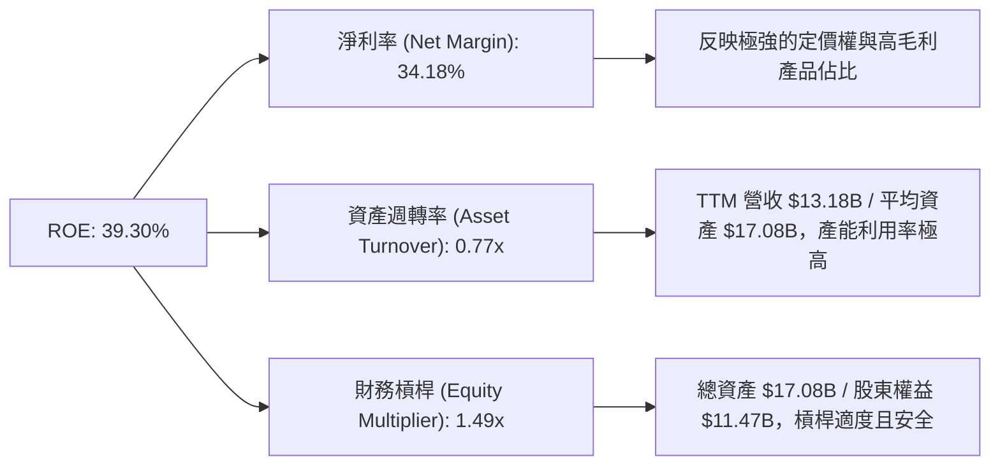

### 6.4 獲利能力儀表板

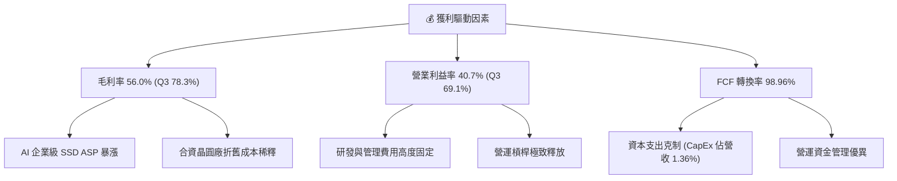

---

## 7. 估值深度分析

SNDK 的估值呈現出一種極具吸引力的「背離」：儘管過去一年股價暴漲，但由於遠期盈利預期（Forward EPS）出現了更為驚人的增長，導致其遠期估值倍數被極度壓低。

### 7.1 同業估值比較表格

我們選取了記憶體與儲存行業的兩大巨頭——美光（Micron, MU）與西部數據（Western Digital, WDC）進行對比：

| 估值指標 | **SNDK (SanDisk)** | **Micron (MU)** | **Western Digital (WDC)** | 評估 |
|----------|-------------------|-----------------|---------------------------|------|
| **Trailing P/E** | 57.11x | ~75.0x | ~35.0x | 🟡 歷史市盈率偏高，反映過去虧損基期 |
| **Forward P/E** | **8.04x** | **14.50x** | **11.20x** | 🟢 **極度便宜**，遠低於同行 |
| **P/S Ratio** | 18.80x | 6.50x | 3.20x | 🔴 營收銷量比偏高，反映極高的利潤率 |
| **EV / EBITDA** | 43.39x | 18.50x | 14.20x | 🟡 企業價值比反映了當前的爆發性業績 |
| **FCF Yield** | **1.80%** (TTM) | ~1.20% | ~2.50% | 🟢 具備良好的現金流支撐 |
| **淨現金 / 市值** | **1.42%** | ~-5.0% (淨債務) | ~-12.0% (淨債務) | 🟢 財務防禦力顯著優於同業 |

*估值倍數選擇說明*：由於 SNDK 剛經歷從巨額虧損到暴利的拐點，Trailing P/E 嚴重失真。此時應**優先參考 Forward P/E（8.04x）**與 **FCF Yield**。Forward P/E 僅 8.04x，表明市場對 SNDK 業績爆發的「持續性」存有疑慮，這恰恰為長線投資者提供了極佳的介入契機。

### 7.2 歷史估值區間分析

```
╔══════════════════════════════════════════════════════════════════╗
║                    SNDK Forward P/E 估值區間                     ║
╠══════════════════════════════════════════════════════════════════╣
║                                                                  ║
║  歷史高點：  35.0x                                               ║
║  歷史均值：  18.0x                                               ║
║  當前位置：  8.04x  ███████░░░░░░░░░░░░░░░░░░░░░░░░░░░░░         ║
║                                                                  ║
║  📊 結論：當前估值處於歷史極低水位，具備極強的估值重估 (Re-rating) 空間。║
╚══════════════════════════════════════════════════════════════════╝
```

### 7.3 情境目標價（假設驅動）

為了推導出合理的目標價，我們基於不同的基本面假設建立三種情境模型：

| 情境 | 營收 CAGR (3年) | 穩定營業利潤率 | 退出 Forward P/E | 隱含 12M 目標價 | 相對當前現價 ($1,673.97) |
|------|-----------------|----------------|------------------|-----------------|--------------------------|
| 🔴 **悲觀** | 15.0% | 20.0% | 6.0x | **$1,000.00** | -40.26% |
| 🟡 **基準** | **35.0%** | **45.0%** | **10.0x** | **$2,112.32** | **+26.18%** |
| 🟢 **樂觀** | 55.0% | 55.0% | 15.0x | **$3,250.00** | +94.15% |

### 7.4 DCF 敏感性分析（12M 目標價矩陣）

我們採用兩階段折現模型，以 WACC（折現率）與終端成長率（Terminal Growth Rate）進行敏感性測試：

| 終端成長率 \ WACC | 9.0% | **10.1% (基準)** | 11.0% |
|-------------------|------|------------------|------|
| **🟢 3.0% (樂觀)** | $2,450 (+46.3%) | $2,280 (+36.2%) | $2,120 (+26.6%) |
| **🟡 2.0% (基準)** | **$2,250 (+34.4%)** | **$2,112 (+26.2%)** | **$1,980 (+18.3%)** |
| **🔴 1.0% (悲觀)** | $2,050 (+22.5%) | $1,920 (+14.7%) | $1,810 (+8.1%) |

### 7.5 估值綜合區間

```
╔══════════════════════════════════════════════════════════════════╗
║                    SNDK 估值綜合區間與現價對比                   ║
╠══════════════════════════════════════════════════════════════════╣
║                                                                  ║
║  [悲觀目標價]       $1,000.00                                    ║
║  [當前股價]         $1,673.97  ← 處於合理偏低區間                ║
║  [共識基準目標價]   $2,112.32                                    ║
║  [樂觀目標價]       $3,250.00                                    ║
║                                                                  ║
║  $1,000         $1,674          $2,112                  $3,250   ║
║    |--------------★--------------|-----------------------|      ║
║                                                                  ║
╚══════════════════════════════════════════════════════════════════╝
```

---

## 8. 成長催化劑

SNDK 的未來成長並非空中樓閣，而是由多個可量化的產業催化劑驅動。

### 8.1 催化劑時間軸

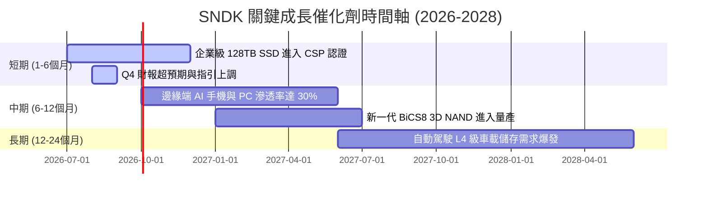

### 8.2 TAM（潛在市場規模）分析

根據行業預估，AI 驅動的存儲市場規模將在未來三年迎來爆發式增長：

```
╔══════════════════════════════════════════════════════════════════╗
║                    SNDK 核心市場 TAM 與滲透率 (2026-2028)        ║
╠══════════════════════════════════════════════════════════════════╣
║                                                                  ║
║  1. 企業級 AI 伺服器 SSD 市場 (TAM: $25B)                        ║
║     ├── 當前滲透率：~15%                                         ║
║     └── 預估 2028 貢獻營收：$5.50B                               ║
║                                                                  ║
║  2. 邊緣端 AI 手機/PC 儲存市場 (TAM: $35B)                       ║
║     ├── 當前滲透率：~20%                                         ║
║     └── 預估 2028 貢獻營收：$3.80B                               ║
║                                                                  ║
║  3. 車用與工業級高可靠性儲存 (TAM: $10B)                         ║
║     ├── 當前滲透率：~10%                                         ║
║     └── 預估 2028 貢獻營收：$1.50B                               ║
║                                                                  ║
╚══════════════════════════════════════════════════════════════════╝
```

### 8.3 成長驅動力結構圖

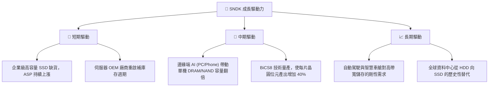

---

## 9. 風險矩陣

雖然 SNDK 目前業績極佳，但半導體行業的固有風險不容忽視。

### 9.1 風險評分矩陣

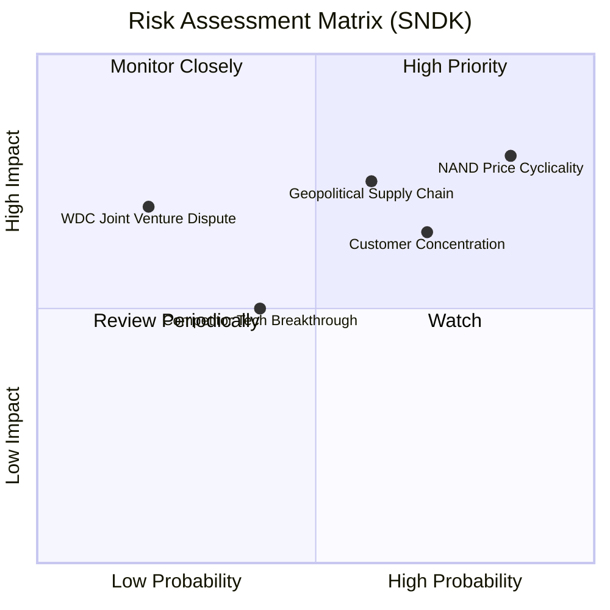

### 9.2 風險清單詳細分析

| # | 風險項目 | 發生機率 | 財務衝擊 | 風險評分 | 緩解措施 |
|---|----------|----------|----------|----------|----------|
| 1 | 🔴 **NAND 價格劇烈週期性波動** | 高 (85%) | 高 (-30%營收) | 🔴 8.5 / 10 | 轉向高附加價值的企業級客製化 SSD，降低商品化（Commodity）產品比重。 |
| 2 | 🔴 **地緣政治與供應鏈中斷** | 中 (60%) | 高 (-20%產能) | 🔴 7.5 / 10 | 分散晶圓後段封測（OSAT）產地，建立多元化原材料供應鏈。 |
| 3 | 🟡 **大客戶集中度過高** | 高 (70%) | 中 (-15%營收) | 🟡 6.5 / 10 | 積極拓展二線雲端服務商與區域型資料中心客戶，降低對單一 CSP 的依賴。 |
| 4 | 🟡 **合資夥伴 WDC 利益衝突** | 低 (20%) | 高 (法律爭端) | 🟡 5.0 / 10 | 透過長期合資協議（JV Agreement）鎖定技術專利共享與產能分配比例。 |

---

## 10. 投資建議

### 10.1 最終綜合評級雷達圖

SNDK 是一隻罕見的「披著成長皮的價值股」，在成長性、獲利能力與財務健康度上均拿到了接近滿分的成績。

```
╔══════════════════════════════════════════════════════════════╗
║                    SNDK 最終投資價值診斷                     ║
╠══════════════════════════════════════════════════════════════╣
║ 基本面強度  8.5 ▓▓▓▓▓▓▓▓▓▓▓▓▓▓▓▓▓░░░  ★★★★☆           ║
║ 成長動能    9.5 ▓▓▓▓▓▓▓▓▓▓▓▓▓▓▓▓▓▓▓░  ★★★★★           ║
║ 獲利品質    9.0 ▓▓▓▓▓▓▓▓▓▓▓▓▓▓▓▓▓▓░░  ★★★★★           ║
║ 財務健康    9.5 ▓▓▓▓▓▓▓▓▓▓▓▓▓▓▓▓▓▓▓░  ★★★★★           ║
║ 估值合理性  8.0 ▓▓▓▓▓▓▓▓▓▓▓▓▓▓░░░░░░  ★★★★☆           ║
╠══════════════════════════════════════════════════════════════╣
║ 綜合總分    8.6/10  🟢 強烈建議買入 ｜ 具備極佳風險回報比  ║
╚══════════════════════════════════════════════════════════════╝
```

### 10.2 目標價與隱含報酬率

| 情境 | 隱含目標價 | 當前股價 ($1,673.97) 隱含報酬 | 權重機率 | 期望值目標價 |
|------|------------|-------------------------------|----------|--------------|
| 🔴 **悲觀** | $1,000.00 | -40.26% | 20% |  |
| 🟡 **基準** | **$2,112.32** | **+26.18%** | **60%** | **$1,917.39** |
| 🟢 **樂觀** | $3,250.00 | +94.15% | 20% | **(隱含 +14.54% 期望回報)** |

### 10.3 買入時機與觸發因素

```
╔══════════════════════════════════════════════════════════════════╗
║                  ✅ SNDK 買入觸發因素 Checklist                  ║
╠══════════════════════════════════════════════════════════════════╣
║                                                                  ║
║  立即買入觸發條件（多數符合時）：                                ║
║  ✅ Forward P/E 跌破 10x（目前為 8.04x，已符合）                 ║
║  ✅ 單季毛利率維持在 50% 以上（目前為 78.35%，已符合）           ║
║  ✅ 淨現金狀態持續擴大，且無大額債務到期                         ║
║                                                                  ║
║  加碼觸發條件：                                                  ║
║  ☐ 財報確認 128TB 企業級 SSD 大規模出貨                          ║
║  ☐ 記憶體合約價（Contract Price）連續兩個月上漲                 ║
║                                                                  ║
║  減碼/停損觸發條件：                                             ║
║  ☐ 單季毛利率跌破 35%                                            ║
║  ☐ 自由現金流（FCF）連續兩季轉為負值                             ║
║                                                                  ║
╚══════════════════════════════════════════════════════════════════╝
```

### 10.4 投資人適配度分析

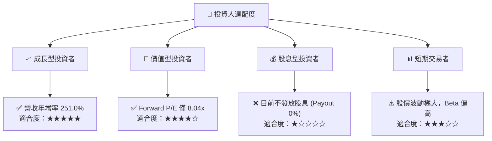

### 10.5 每季財報監控清單（Quarterly Watch List）

在未來的季度財報中，投資者應嚴密監控以下核心指標，一旦跌破「減碼門檻」，應及時調整倉位：

| 監控指標 | 當前值 (Q3 '26) | 基準門檻 (持股) | 減碼/停損門檻 | 監控意義 |
|----------|-----------------|-----------------|---------------|----------|
| **單季營收 YoY 成長** | **251.03%** | > 30% | < 10% | 評估 AI 需求是否進入高原期或衰退 |
| **單季毛利率** | **78.35%** | > 45% | < 35% | 監控 NAND 價格競爭與定價權是否削弱 |
| **單季營業利益率** | **69.09%** | > 35% | < 20% | 評估營運槓桿是否逆向收縮 |
| **存貨周轉天數** | **108天** | < 130天 | > 150天 | 警惕下游 CSP 客戶開始去庫存 |
| **季度 FCF** | **$2.99B** | > $500M | FCF 轉負 | 評估真實盈利含金量與資本支出失控風險 |

### 10.6 反面論證：什麼會證明論點錯誤（What Would Change My Mind）

```
╔══════════════════════════════════════════════════════════════════╗
║              ⚠️ 論點失效條件（Disconfirming Evidence）           ║
╠══════════════════════════════════════════════════════════════════╣
║  本投資論點在下列情況成立時應重新檢視或退出：                    ║
║  ☐ 企業級 SSD 營收連續兩季出現 QoQ 下跌 > 15%                     ║
║  ☐ 競爭對手（如三星）開啟無節制的產能擴張，導致 NAND 價格雪崩     ║
║  ☐ FCF 轉換率（FCF/Net Income）跌破 60%，表明利潤被存貨積壓       ║
║  ☐ 遠期 Forward P/E 因預期 EPS 下修而暴漲至 20x 以上             ║
║  ☐ 研發費用（R&D）佔比跌破 5%，導致技術領先優勢喪失               ║
╚══════════════════════════════════════════════════════════════════╝
```

---

> **免責聲明**：本報告為基於提供之即時財務數據所做之機構級基本面研究，僅供學術與投資研究參考，不構成任何買賣建議。投資人應自行承擔市場風險。