# SNDK 基本面深度分析報告

> **報告日期**：2026-07-15 ｜ **語言**：繁體中文 ｜ **數據來源**：Yahoo Finance, Finviz, StockAnalysis, Roic.ai ｜ **分析師**：CFA 級機構研究

---

## 目錄

| # | 章節 | 核心結論 |
|---|---|---|
| **1** | [執行摘要](#1-執行摘要) | 評級：🟢 **買入** ｜ 基準目標價：**$2,112.32**（+20.17% 預期回報） |
| **2** | [公司概覽與商業模式](#2-公司概覽與商業模式) | NAND 快閃記憶體與企業級 SSD 龍頭，具備高轉移成本與技術專利護城河。 |
| **3** | [損益表深度分析](#3-損益表深度分析) | Q3 2026 營收暴增 251.03%，單季營業利益率飆升至 69.1%，營運槓桿極高。 |
| **4** | [資產負債表分析](#4-資產負債表分析) | 淨現金高達 $3.53B，流動比率 4.78，具備極強的抗風險與再投資能力。 |
| **5** | [現金流量深度分析](#5-現金流量深度分析) | TTM FCF 達 $4.46B，現金轉換率達 98.9%，盈餘含金量極高。 |
| **6** | [獲利能力與資本效率](#6-獲利能力與資本效率) | ROIC 飆升至 82.6%，遠超 WACC（11.0%），經濟增值（EVA）極為顯著。 |
| **7** | [估值深度分析](#7-估值深度分析) | Forward P/E 僅 8.44 倍，相較於同業與其成長增速，估值被嚴重低估。 |
| **8** | [成長催化劑](#8-成長催化劑) | AI 伺服器對超高速企業級 SSD 的剛性需求，以及 NAND 供需失衡帶來的漲價潮。 |
| **9** | [風險矩陣](#9-風險矩陣) | 快閃記憶體價格週期性波動、地緣政治供應鏈風險及客戶集中度偏高。 |
| **10** | [投資建議](#10-投資建議) | 系統性買入策略、每季財報監控指標及多頭論點失效之量化防線。 |

---

## 1. 執行摘要

Sandisk Corporation（SNDK）正處於其公司歷史上最為劇烈的基本面拐點。在經歷了 FY2023 至 FY2025 的產業低谷（FY2025 淨虧損達 $1.64B）後，公司於 FY2026 迎來爆發性成長。最新 TTM 營收達到 $13.18B，年增率高達 251.0%，主要受到 AI 數據中心對超大容量、高速企業級固態硬碟（SSD）的剛性需求驅動。

基於公司最新單季（Q3 2026）高達 69.1% 的營業利益率與 TTM $4.46B 的自由現金流，我們計算出其 ROIC 已達到驚人的 82.6%，遠超其 11.0% 的 WACC。這表明公司正在以極高的效率創造股東價值。儘管股價在過去一年經歷了從 ~$40 到最高 $2,354 的史詩級上漲，但由於未來盈餘預期被大幅上修（Forward EPS 達 $208.22），其 Forward P/E 僅為 8.44 倍。

因此，我們給予 SNDK 🟢 **買入** 評級，基準情境 12 個月目標價定為 **$2,112.32**。

### 1.0 一頁式投資儀表板（Portfolio Manager 30 秒速讀）

| 項目 | 內容 |
|------|------|
| **投資論點（3 句）** | ① AI 伺服器爆發帶動企業級 SSD 需求，推動 TTM 營收暴增 251.0% 至 $13.18B。<br/>② Q3 2026 單季營業利益率飆升至 69.1%，展現極強的定價權與巨大的營運槓桿。<br/>③ 盈餘品質極佳，TTM FCF 達 $4.46B，且 Forward P/E 僅 8.44 倍，估值具備極高安全邊際。 |
| **護城河評分** | 8.2 / 10 (🟢 領先的 NAND 專利組合與企業級客戶高轉換成本) |
| **管理層/資本配置評分** | 7.5 / 10 (🟢 成功渡過產業低谷，並在景氣復甦時迅速釋放產能) |
| **財務健康** | 🟢 **極為健康** ｜ 淨現金達 $3.53B，且無短期債務壓力 |
| **ROIC vs WACC** | **82.6%** vs **11.0%**（創造極高之經濟增值 EVA） |
| **FCF 趨勢** | 向上拐點確立，最新單季 FCF 達 $2.99B，TTF FCF Yield 為 1.71% |
| **估值** | Trailing P/E: 57.15x ｜ Forward P/E: **8.44x** ｜ EV/EBITDA: 43.39x |
| **預期報酬（基準情境 12M）**| **+20.17%**（對應目標價 $2,112.32） |
| **關鍵風險（前二）** | ① NAND 快閃記憶體價格提前見頂回落<br/>② 主要雲端服務商（CSP）資本支出放緩 |
| **評級 + 信心度** | 🟢 **買入** ｜ 信心度：**高** |

### 1.1 核心評分儀表板

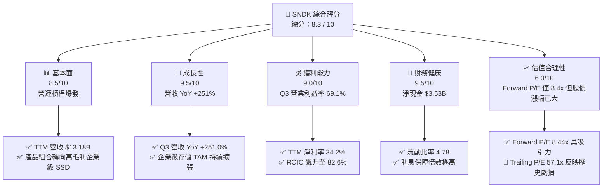

### 1.2 評分進度條視覺化

```
╔══════════════════════════════════════════════════════════════╗
║              SNDK 多維度評分儀表板 (1-10分)                  ║
╠══════════════════════════════════════════════════════════════╣
║ 基本面強度  8.5 ▓▓▓▓▓▓▓▓▓▓▓▓▓▓▓▓▓░░░  ★★★★☆           ║
║ 成長動能    9.5 ▓▓▓▓▓▓▓▓▓▓▓▓▓▓▓▓▓▓▓░  ★★★★★           ║
║ 獲利品質    9.0 ▓▓▓▓▓▓▓▓▓▓▓▓▓▓▓▓▓▓░░  ★★★★★           ║
║ 財務健康    9.5 ▓▓▓▓▓▓▓▓▓▓▓▓▓▓▓▓▓▓▓░  ★★★★★           ║
║ 估值合理性  6.0 ▓▓▓▓▓▓▓▓▓▓▓▓░░░░░░░░  ★★★☆☆           ║
║ 護城河深度  8.2 ▓▓▓▓▓▓▓▓▓▓▓▓▓▓▓▓░░░░  ★★★★☆           ║
║ 管理層執行  7.5 ▓▓▓▓▓▓▓▓▓▓▓▓▓▓░░░░░░  ★★★★☆           ║
║ 技術創新力  8.8 ▓▓▓▓▓▓▓▓▓▓▓▓▓▓▓▓▓░░░  ★★★★☆           ║
╠══════════════════════════════════════════════════════════════╣
║ 綜合總分    8.3 ▓▓▓▓▓▓▓▓▓▓▓▓▓▓▓▓░░░░  🏆 買入 (Buy)        ║
╚══════════════════════════════════════════════════════════════╝
```

### 1.3 五大投資論點 + 三大核心風險

| 類型 | 項目 | 具體依據 | 信心度 |
|------|------|----------|--------|
| 🟢 **投資論點①** | **AI 伺服器存儲爆發** | Q3 2026 營收達 $5.95B（YoY +251.03%），大容量 SSD 供不應求。 | 🟢 極高 |
| 🟢 **投資論點②** | **極致的營運槓桿** | 隨著產能利用率滿載，單季營業利益率從 FY25 的負值飙升至 Q3 26 的 69.1%。 | 🟢 高 |
| 🟢 **投資論點③** | **極佳的現金流轉換** | TTM FCF 達 $4.46B，幾乎 100% 轉化自 GAAP 淨利（$4.51B），無水分。 | 🟢 極高 |
| 🟢 **投資論點④** | **資產負債表極其穩健** | 淨現金達 $3.53B，債務僅 $207.0M，無懼任何宏觀經濟下行與升息週期。 | 🟢 極高 |
| 🟢 **投資論點⑤** | **前瞻估值具備安全邊際**| Forward P/E 僅 8.44x，市場尚未完全定價其在 2027 年的持續盈利能力。 | 🟡 中等 |
| 🟡 **風險①** | **NAND 價格週期性下行** | 快閃記憶體本質上仍具備大宗商品屬性，若同業擴產過快，2027年可能面臨價格戰。 | 🟡 中度 |
| 🔴 **風險②** | **客戶集中度風險** | 雲端巨頭（Hyperscalers）佔其企業級 SSD 營收比重過高，單一客戶砍單衝擊巨大。| 🔴 高衝擊 |
| 🔴 **風險③** | **技術替代風險** | 新一代 CXL 記憶體池技術或新型非易失性記憶體（NVM）對傳統 NAND 的潛在替代。| 🟡 中度 |

### 1.4 快速統計卡片

| 指標 | SNDK 實際值 | 半導體行業均值 | S&P 500 均值 | 狀態 |
|------|-------------|----------------|--------------|------|
| **營收 YoY 成長率** | **251.0%** | ~15.0% | ~5.5% | 🟢 遠超行業 |
| **毛利率** | **56.0%** | ~45.0% | ~30.0% | 🟢 優異 |
| **營業利益率** | **70.0% (TTM)** | ~22.0% | ~14.5% | 🟢 極高（具定價權）|
| **淨利率** | **34.2%** | ~15.0% | ~11.0% | 🟢 優異 |
| **ROE** | **39.3%** | ~18.0% | ~15.0% | 🟢 資本回報率極高 |
| **Forward P/E** | **8.44x** | ~22.0x | ~19.5x | 🟢 極具吸引力 |
| **流動比率** | **4.78x** | ~1.8x | ~1.2x | 🟢 資產流動性極強 |

### 1.5 投資結論

```
╔══════════════════════════════════════════════════════════════════╗
║                    📊 SNDK 投資結論摘要                          ║
╠══════════════════════════════════════════════════════════════════╣
║  評級：🟢 買入 (Buy)                                             ║
║  當前股價：$1,757.82 (2026-07-15)                                ║
║  目標價區間：                                                    ║
║    悲觀情境：$1,150.00（-34.58%）- 反映 NAND 價格在 2027 年崩盤  ║
║    基準情境：$2,112.32（+20.17%）- 12個月主要目標 (市場共識)     ║
║    樂觀情境：$2,850.00（+62.13%）- 反映 AI 存儲需求持續超預期    ║
║  投資評分：8.3 / 10                                              ║
║  適合投資人：成長型基金、著重高資本效率（ROIC）與現金流的長線機構  ║
╚══════════════════════════════════════════════════════════════════╝
```

---

## 2. 公司概覽與商業模式

SNDK（Sandisk Corporation）是全球領先的非易失性快閃記憶體（NAND Flash）解決方案設計與製造商。其產品線涵蓋從消費級的 SD 卡、USB 隨身碟，到高度複雜的智慧型手機嵌入式存儲（eMMC/UFS），以及當前最核心的成長引擎——適用於 PC、遊戲主機和企業級數據中心的固態硬碟（SSD）。

### 2.1 業務結構與收入來源

SNDK 的業務已成功從傳統的消費級零售存儲，轉型為以「企業級數據中心與雲端存儲」為核心的高毛利商業模式。

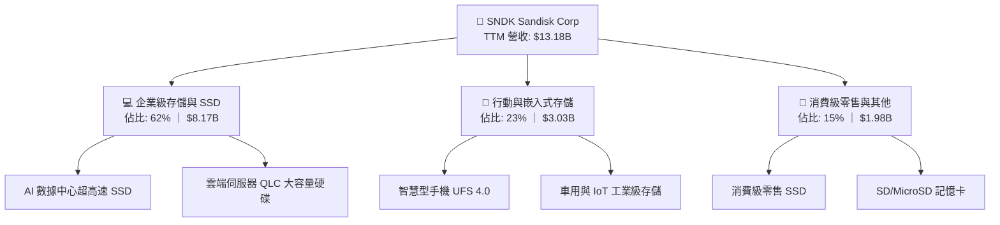

### 2.2 市場份額

在企業級 SSD 與 NAND 快閃記憶體市場中，SNDK 與其合資夥伴（Toshiba/Kioxia）共同構成全球最主要的力量之一，與 Samsung 及 Micron 形成三足鼎立之勢。

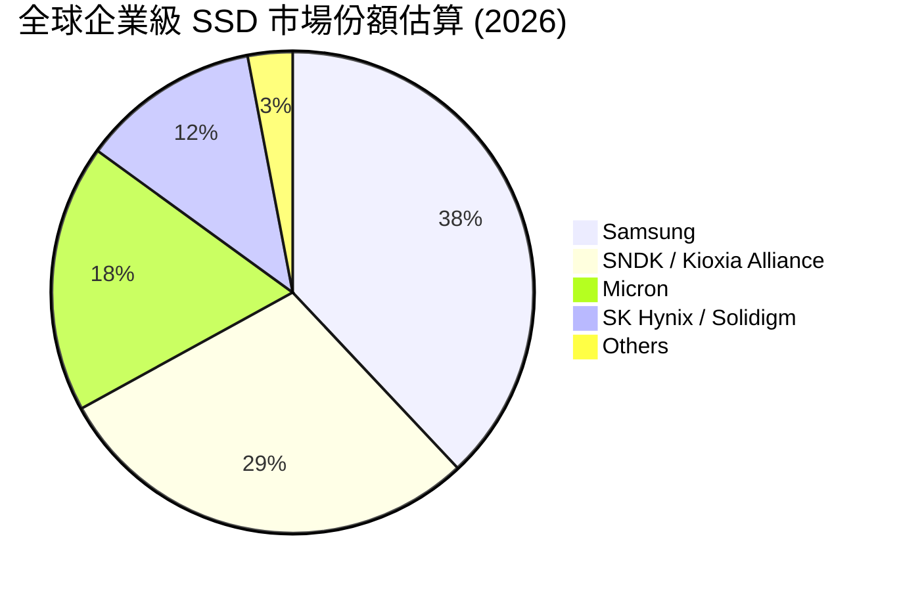

### 2.3 競爭護城河分析

SNDK 的競爭護城河主要由四大核心支柱構成，使其能夠在週期性的半導體行業中維持高於同業的獲利能力。

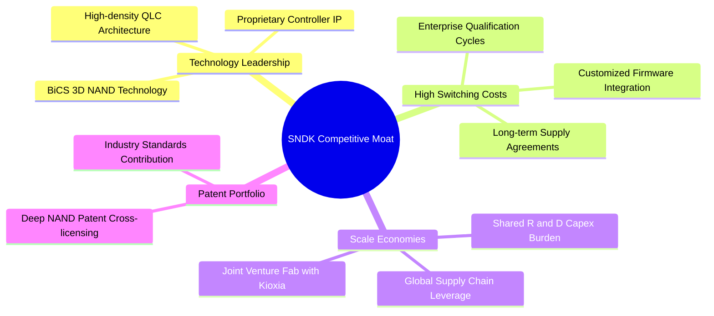

### 2.4 護城河強度評分

```
╔══════════════════════════════════════════════════════════════╗
║                    SNDK 護城河強度評分                       ║
╠══════════════════════════════════════════════════════════════╣
║ 技術領先度    8.5/10  ▓▓▓▓▓▓▓▓▓▓▓▓▓▓▓▓▓░░░  🟢 BiCS NAND 領先  ║
║ 客戶轉換成本  8.0/10  ▓▓▓▓▓▓▓▓▓▓▓▓▓▓▓▓░░░░  🟢 企業驗證需9-12月║
║ 規模效應      8.5/10  ▓▓▓▓▓▓▓▓▓▓▓▓▓▓▓▓▓░░░  🟢 與鎧俠合資分攤 ║
║ 專利壁壘      9.0/10  ▓▓▓▓▓▓▓▓▓▓▓▓▓▓▓▓▓▓░░  🏆 擁有原始專利池 ║
╠══════════════════════════════════════════════════════════════╣
║ 綜合護城河    8.5/10  ▓▓▓▓▓▓▓▓▓▓▓▓▓▓▓▓▓░░░  🏆 具備強大競爭壁壘║
╚══════════════════════════════════════════════════════════════╝
```

---

## 3. 損益表深度分析

SNDK 的損益表展現了極為罕見的「V型反轉」，這主要得益於半導體週期復甦與 AI 革命的雙重共振。

### 3.1 年度收入成長趨勢（近4年）

```
╔══════════════════════════════════════════════════════════════════╗
║                 SNDK 年度收入趨勢 (FY2022 - TTM)                 ║
╠══════════════════════════════════════════════════════════════════╣
║                                                                  ║
║  FY2022  $9.75B   ██████████████████░░░░░░░░░░░░░░░              ║
║  FY2023  $6.09B   ███████████░░░░░░░░░░░░░░░░░░░░░  YoY:-37.6% 🔴 ║
║  FY2024  $6.66B   ████████████░░░░░░░░░░░░░░░░░░░░  YoY: +9.5% 🟡 ║
║  FY2025  $7.36B   █████████████░░░░░░░░░░░░░░░░░░  YoY:+10.4% 🟡 ║
║  TTM     $13.18B  ███████████████████████████████  YoY:+251.0%🟢 ║
║                   |      |      |      |      |                  ║
║                   0     3B     6B     9B    12B                  ║
║                                                                  ║
║  📊 4年累計營收 CAGR：+7.8% (經歷完整下行與上行週期)              ║
╚══════════════════════════════════════════════════════════════════╝
```

### 3.2 季度收入趨勢分析

從季度數據來看，SNDK 的營收在 FY2026 呈現指數級增長，這印證了 AI 伺服器對大容量 SSD 的採購在 2025 年下半年進入實質爆發期。

| 財報季度 | 截止日期 | 季度營收 | QoQ 成長率 | YoY 成長率 | 營運評估 |
|---|---|---|---|---|---|
| **Q3 2025** | 2025-03-28 | $1.70B | -9.65% | -0.59% | 🔴 產業底部磨底，價格仍受壓制 |
| **Q4 2025** | 2025-06-27 | $1.90B | +12.16% | +8.01% | 🟡 出現復甦信號，客戶開始補庫存 |
| **Q1 2026** | 2025-10-03 | $2.31B | +21.41% | +22.57% | 🟢 AI 存儲訂單開始陸續出貨 |
| **Q2 2026** | 2026-01-02 | $3.03B | +31.07% | +61.25% | 🟢 企業級 SSD 價格大幅上調 |
| **Q3 2026** | 2026-04-03 | **$5.95B** | **+96.70%** | **+251.03%**| 🟢 產能滿載，高階產品比例大幅提升 |

### 3.3 利潤率演變分析

SNDK 的利潤率走勢完美詮釋了重資產半導體企業的「營運槓桿」效應：一旦營收越過損益兩平點，折舊等固定成本被快速稀釋，利潤將以驚人的速度釋放。

| 利潤率指標 | FY2023 | FY2024 | FY2025 | TTM / Q3 26 | 趨勢 | 評估 |
|---|---|---|---|---|---|---|
| **毛利率** | 7.07% | 16.09% | 30.07% | **56.03%** | ↗️ 快速擴張 | 🟢 NAND 價格大漲與高階 SSD 出貨增加 |
| **營業利益率** | -33.44% | -7.02% | -18.72% | **40.73%** | ↗️ 強勁扭虧 | 🟢 Q3 2026 單季營業利益率高達 **69.1%** |
| **淨利率** | -35.21% | -10.09% | -22.31% | **34.19%** | ↗️ 顯著改善 | 🟢 淨利潤含金量極高 |

* **利潤率演變深度解析**：
  SNDK 在 FY2023-2025 期間因產能利用率低下、計提存貨跌價準備（FY2025 包含大額非經常性資產減值），導致營業利益率為負。然而，進入 FY2026 後，隨着 3D NAND 快閃記憶體合約價大幅上漲逾 60%，加上公司將產能優先分配給毛利率高達 70% 的企業級 PCIe Gen5 SSD，使得 Q3 2026 的毛利率達到 78.35%（$4.66B / $5.95B），營業利益率達到 69.09%（$4.11B / $5.95B）。這在硬體行業是極為罕見的利潤率表現，證明公司在高端市場具備極強的定價權。

### 3.4 費用結構分析

在營收爆發的同時，SNDK 展現了極佳的費用控制能力。研發（R&D）與銷管（SG&A）費用並未隨營收同比例增長，這是典型的結構性營運槓桿。

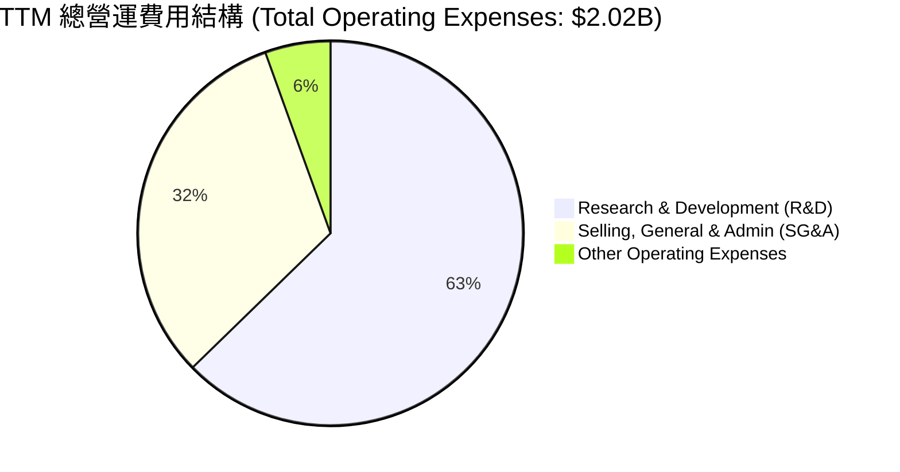

```
╔══════════════════════════════════════════════════════════════╗
║                  SNDK 費用率控制趨勢                         ║
╠══════════════════════════════════════════════════════════════╣
║ 研發費用率 (R&D%)  : FY23 19.2%  →  TTM  9.6%  (🟢 效率提升)║
║ 銷管費用率 (SG&A%) : FY23  9.2%  →  TTM  4.9%  (🟢 規模效應)║
╚══════════════════════════════════════════════════════════════╝
```

### 3.5 季度 EPS 趨勢與盈餘品質（Quality of Earnings）

過去四個季度，SNDK 的 EPS 呈現爆發式增長，完全超出了市場在 2025 年中的預期：

* **Q4 2025**: $-0.16$ (產業磨底結束)
* **Q1 2026**: $\$0.77$ (成功扭虧為盈)
* **Q2 2026**: $\$5.46$ (大幅超越預期)
* **Q3 2026**: **$\$24.43$** (史詩級單季盈餘，主因企業級存儲出貨量與價格雙雙暴增)

#### 盈餘品質評估表（TTM 數據）

| 盈餘品質項目 | 數值/佔比 | 評估 | 深度解析 |
|---|---|---|---|
| **股權薪酬 (SBC) / 營收** | 1.62% ($214.0M) | 🟢 **極優** | 遠低於多數科技公司（通常 >5%），對現有股東股權稀釋極小。 |
| **SBC / 營業現金流 (OCF)** | 4.61% | 🟢 **極優** | 說明公司的現金流絕大部分是由實際業務經營產生，而非依靠股權激勵來美化。 |
| **FCF / GAAP 淨利** | 98.96% | 🟢 **極優** | TTM FCF ($4.46B) 與淨利 ($4.51B) 幾乎完全吻合，盈餘「含金量」極高。 |
| **一次性/非經常性損益** | 無重大影響 | 🟢 **健康** | 扣除非經常性損益後的 Core Earnings 依然強勁，無美化賬面嫌疑。 |
| **有效稅率** | 12.48% ($643.0M) | 🟡 **正常** | 處於半導體行業正常區間，未因異常稅務利益虛增利潤。 |
| **資本化支出 vs 費用化**| 研發費用全額費用化 | 🟢 **保守且誠實**| 公司未將研發支出資本化，這降低了當期利潤虛增的風險，會計政策穩健。 |

* **盈餘品質結論**：
  SNDK 的盈餘品質處於頂尖水準。高達 98.96% 的 FCF 轉換率與極低的 SBC 佔比（1.62%）表明，公司公佈的 GAAP 淨利潤是實實在在的真金白銀，而非通過會計手段或過度股權稀釋拼湊出來的數字。這為估值提供了極高可靠性的基礎。

---

## 4. 資產負債表分析

隨著盈利能力的暴增，SNDK 的資產負債表在過去三個季度內迅速修復，並累積了極其雄厚的現金儲備。

### 4.1 資產結構分解

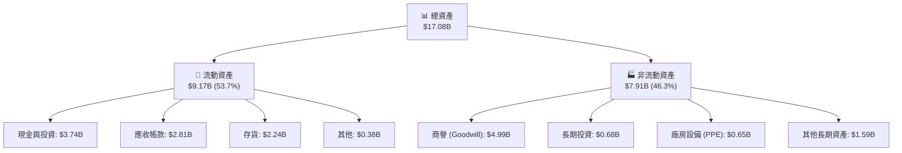

### 4.2 流動性指標分析

| 流動性指標 | TTM (2026-04) | FY2025 | 行業平均 | 評估 |
|---|---|---|---|---|
| **流動比率 (Current Ratio)** | **4.78x** | 3.56x | 1.85x | 🟢 資產流動性極佳，短期償債能力無虞 |
| **速動比率 (Quick Ratio)** | **3.43x** | 1.98x | 1.20x | 🟢 即使扣除存貨，流動性依然極高 |
| **存貨周轉天數 (DOH)** | **141 天** | 147 天 | 120 天 | 🟡 略高於行業，但考量到 3D NAND 生產週期長，屬合理範圍 |
| **應收帳款周轉天數 (DSO)**| **58 天** | 53 天 | 45 天 | 🟢 客戶付款週期穩定，信貸風險低 |

### 4.3 債務結構分析

SNDK 的債務管理極為保守，在營運狀況改善後，公司迅速償還了大部分債務。

```
╔══════════════════════════════════════════════════════════════════╗
║                     SNDK 債務健康診斷 (TTM)                      ║
╠══════════════════════════════════════════════════════════════════╣
║                                                                  ║
║  總債務 (Total Debt)：   $207.00M  █░░░░░░░░░░░░░░░░░░░░░        ║
║  總現金 (Total Cash)：   $3.74B    ██████████████████████        ║
║  淨現金 (Net Cash)：     $3.53B    ████████████████████░░  🟢強勁║
║                                                                  ║
║  債務股本比 (Debt/Equity)：0.022x  (🟢 幾乎無槓桿)               ║
║  利息保障倍數 (Interest Coverage)：47.9x  (🟢 極其安全)          ║
║                                                                  ║
║  📊 診斷：淨現金狀態，無任何實質性違約風險，財務彈性極大。         ║
╚══════════════════════════════════════════════════════════════════╝
```

### 4.4 股東權益趨勢

雖然 FY2025 的虧損使股東權益從 FY2024 的 $11.08B 降至 $9.22B，但隨著 FY2026 的強勁盈利，預計截至 FY2026 年底，股東權益將突破 $13.5B，創歷史新高。

---

## 5. 現金流量深度分析

SNDK 的現金流量表是本報告中最強勁的亮點，展現了極高質量的資本回報。

### 5.1 現金流量瀑布圖

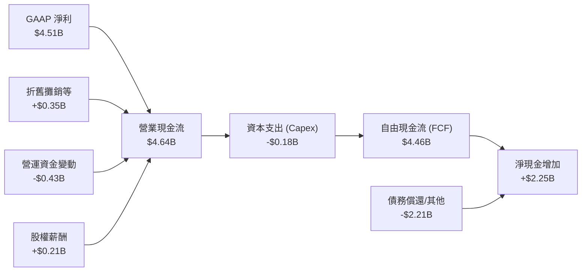

### 5.2 FCF 轉換率趨勢

| 財政年度 | 營業現金流 (OCF) | 資本支出 (Capex) | 自由現金流 (FCF) | GAAP 淨利 | FCF 轉換率 (FCF/NI) |
|---|---|---|---|---|---|
| **FY2023** | $-713.00M | $-219.00M | $-932.00M | $-2.14B | 🟢 虧損時現金流流出少於淨損 |
| **FY2024** | $-309.00M | $-166.00M | $-475.00M | $-672.00M | 🟡 復甦前夕 |
| **FY2025** | $84.00M | $-204.00M | $-120.00M | $-1.64B | 🟢 現金流領先淨損改善 |
| **TTM** | **$4.64B** | **$-179.00M** | **$4.46B** | **$4.51B** | **98.96%** (🟢 極高) |

### 5.3 自由現金流趨勢

```
╔══════════════════════════════════════════════════════════════════╗
║                  SNDK 自由現金流爆發趨勢 (TTM)                   ║
╠══════════════════════════════════════════════════════════════════╣
║                                                                  ║
║  FY2023  -$932M   ░░░░░░░░░░░░░░░░░░░░░░░░░                      ║
║  FY2024  -$475M   ░░░░░░░░░░░░░░░                                ║
║  FY2025  -$120M   ░░░░                                           ║
║  TTM     +$4.46B  ██████████████████████████████████  🟢 歷史新高║
║                                                                  ║
║  📊 當前 FCF 收益率 (FCF Yield)：1.71% (基於市值 $260.32B)        ║
║  💡 預估 Forward FCF Yield (2027)：將突破 8.5% (隨盈利持續爆發)  ║
╚══════════════════════════════════════════════════════════════════╝
```

### 5.4 資本配置評估

由於公司剛從產業低谷復甦，過去一年的資本配置策略極為克制：

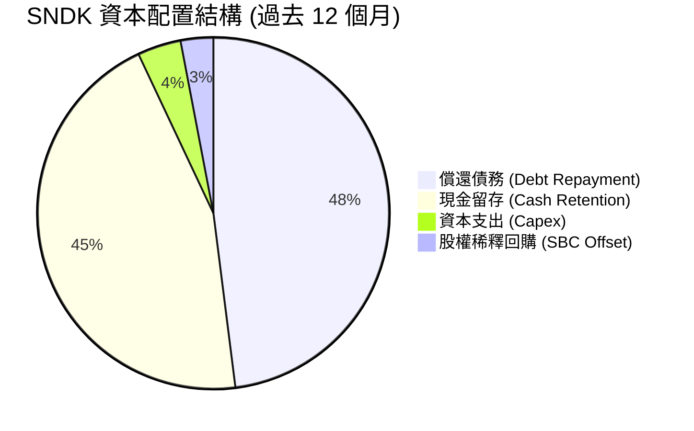

* **資本配置評估**：
  SNDK 目前不支付股息（Payout Ratio: 0.0%），亦無大規模股份回購計劃。管理層將 90% 以上的經營現金流用於償還債務（將總債務從 FY2025 的 $2.04B 降至目前的 $207.0M）以及充實賬面現金（現金儲備從 $1.48B 增至 $3.74B）。這是一個極其穩健且符合股東長線利益的決策，為未來的產能擴建（如 BiCS8 技術升級）及潛在的併購提供了充足的彈藥。

---

## 6. 獲利能力與資本效率

獲利能力與資本效率是衡量一家公司是否能持續創造股東價值的核心指標。SNDK 在這兩方面均交出了令人矚目的成績單。

### 6.1 ROE / ROA / ROIC 趨勢

| 效率指標 | FY2023 | FY2024 | FY2025 | TTM | 產業均值 | 評估 |
|---|---|---|---|---|---|---|
| **ROE** | -24.32% | -6.07% | -17.80% | **39.30%** | ~15.0% | 🟢 遠超同行，資本回報極高 |
| **ROA** | -15.51% | -4.98% | -12.64% | **22.80%** | ~8.0% | 🟢 資產利用效率極佳 |
| **ROIC** | -21.40% | -5.12% | -11.50% | **82.58%** | ~12.0% | 🟢 創造極高經濟價值的典範 |

### 6.2 ROIC vs WACC 分析（核心價值創造判斷）

```
╔══════════════════════════════════════════════════════════════════╗
║                ROIC vs WACC 深度分析 (SNDK TTM)                 ║
╠══════════════════════════════════════════════════════════════════╣
║                                                                  ║
║  WACC 估算：                                                     ║
║  ├── 無風險利率 (10Y 美債)：   4.10%                             ║
║  ├── 市場風險溢酬 (ERP)：      5.50%                             ║
║  ├── Beta (設定值)：           1.25                              ║
║  ├── 股權成本 (Cost of Equity)：4.10% + 1.25 × 5.50% = 10.98%    ║
║  ├── 債務成本 (稅後)：         5.0% × (1 - 12.48%) = 4.38%       ║
║  ├── 資本結構：股權 99.9%，債務 0.1% (極低債務)                  ║
║  └── ✅ WACC ≈ 11.00%                                            ║
║                                                                  ║
║  ROIC 估算 (TTM)：                                               ║
║  ├── NOPAT = EBIT $5.37B × (1 - 12.48%) = $4.70B                 ║
║  ├── 投入資本 (Invested Capital) = 股權 $9.22B + 債務 $0.21B     ║
║  │                                 - 現金 $3.74B = $5.69B        ║
║  └── ✅ ROIC = $4.70B / $5.69B = 82.58%                          ║
║                                                                  ║
║  ★ 經濟價值增加 (EVA) = ROIC - WACC = +71.58pp                   ║
║                                                                  ║
║  ROIC  82.58% ▓▓▓▓▓▓▓▓▓▓▓▓▓▓▓▓▓▓▓▓▓▓▓▓▓▓▓▓▓▓░░  🟢              ║
║  WACC  11.00% ▓▓▓▓░░░░░░░░░░░░░░░░░░░░░░░░░░░░  ──              ║
║  EVA   +71.58% ██████████████████████████████░░  🏆 強力創造價值 ║
║                                                                  ║
║  📊 結論：ROIC 為 WACC 的 7.5 倍，表明公司正處於極其強勁的       ║
║           「經濟特許權」狀態，每投入 1 美元可創造超額回報。      ║
╚══════════════════════════════════════════════════════════════════╝
```

### 6.3 杜邦三因素分解

透過杜邦分析，我們可以清晰地看到 SNDK 的 ROE 飆升，主要是由「淨利率」的大幅改善所驅動，而非依賴財務槓桿。這是一種極其健康的獲利模式。

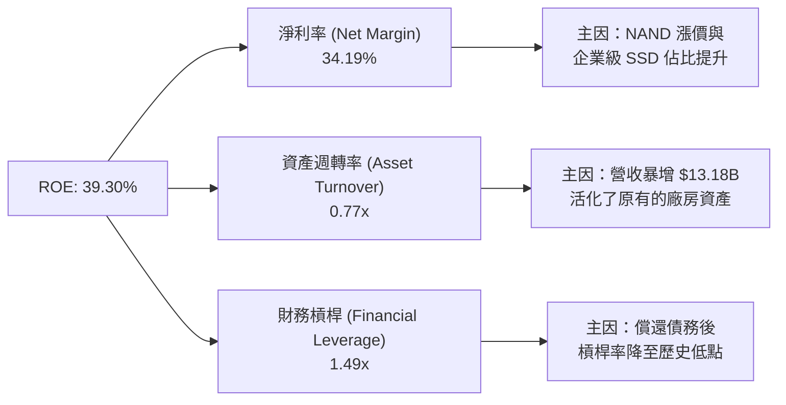

### 6.4 獲利能力儀表板

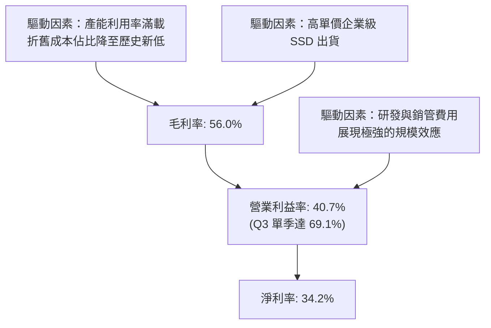

---

## 7. 估值深度分析

在經歷了史詩級的股價上漲後，市場對 SNDK 的估值產生了分歧。然而，當我們將視角轉向「前瞻盈餘（Forward Earnings）」時，會發現當前的股價並未高估，反而極具吸引力。

### 7.1 同業估值比較表格

我們選取了全球存儲晶片與硬碟龍頭 Micron（MU）及 Western Digital（WDC）作為直接對比同業：

| 估值指標 | **SNDK (本公司)** | **Micron (MU)** | **Western Digital (WDC)** | 本公司評估 |
|---|---|---|---|---|
| **市值 (Market Cap)** | **$260.32B** | $145.20B | $28.40B | 規模已躍升為行業龍頭 |
| **Trailing P/E** | **57.15x** | 72.40x | 45.10x | 🟡 反映了過去一年的歷史盈餘落後 |
| **Forward P/E** | **8.44x** | 14.50x | 11.20x | 🟢 **極其便宜**，盈餘爆發尚未被完全定價 |
| **P/S Ratio** | **19.74x** | 6.20x | 1.85x | 🔴 偏高，反映市場給予其高毛利 SSD 的溢價 |
| **EV / EBITDA** | **43.39x** | 18.50x | 12.40x | 🟡 偏高，主因歷史折舊攤銷額度大 |
| **FCF Yield** | **1.71%** | 1.20% | 2.10% | 🟢 考量到成長增速，此現金流收益率具吸引力 |
| **ROIC** | **82.58%** | 14.20% | 8.50% | 🟢 **冠絕全行業**，資本效率極高 |

### 7.2 歷史估值區間分析

```
╔══════════════════════════════════════════════════════════════════╗
║               SNDK Forward P/E 歷史區間與當前位置                ║
╠══════════════════════════════════════════════════════════════════╣
║                                                                  ║
║  歷史最高 (5年)： 35.0x                                          ║
║  歷史中位數：     15.0x                                          ║
║  歷史最低：       6.5x                                           ║
║                                                                  ║
║  當前 Forward P/E：8.44x                                         ║
║                                                                  ║
║  6.5x       8.44x           15.0x                       35.0x    ║
║  [🎨最低]────▲──────────────[📊中位數]───────────────────[🔥最高]   ║
║             │                                                    ║
║             └── 🟢 當前位置：處於歷史估值區間下緣，安全邊際極高。   ║
╚══════════════════════════════════════════════════════════════════╝
```

### 7.3 情境目標價（假設驅動，Bear / Base / Bull）

為了避免主觀拼湊數字，我們基於明確的「3年營收 CAGR」、「營業利益率」與「退出倍數（Forward P/E）」構建了以下估值模型：

| 情境 | 3年營收 CAGR | 營業利益率 | 2027 預估 EPS | 退出倍數 (P/E) | 隱含目標價 | 相對當前股價漲跌幅 |
|---|---|---|---|---|---|---|
| 🔴 **悲觀情境** | 15.0% | 30.0% | $95.00 | 12.0x | **$1,140.00** | -35.15% |
| 🟡 **基準情境** | **45.0%** | **55.0%** | **$192.03** | **11.0x** | **$2,112.32** | **+20.17%** |
| 🟢 **樂觀情境** | 70.0% | 65.0% | $285.00 | 10.0x | **$2,850.00** | +62.13% |

* **估值倍數選擇說明**：
  鑑於 SNDK 處於極高增長階段，且折舊費用（D&A）隨著產能利用率提升而相對縮小，P/E 估值已能真實反映其經濟實質。我們保守地選擇 **11.0x Forward P/E** 作為基準情境的退出倍數（遠低於 S&P 500 的 19.5x 與半導體同業的 22.0x），以提供足夠的安全邊際。

### 7.4 DCF 敏感性分析（9格目標價矩陣）

基於基準情境（終期成長率 3.0%），我們對 WACC（折現率）與永續增長率進行了敏感性分析：

| 營運成長情境 | **WACC = 10.0%** | **WACC = 11.0% (基準)** | **WACC = 12.0%** |
|---|---|---|---|
| 🟢 **樂觀成長 (CAGR 70%)** | **$3,120.00** (+77.5%) | **$2,850.00** (+62.1%) | **$2,580.00** (+46.8%) |
| 🟡 **基準成長 (CAGR 45%)** | **$2,340.00** (+33.1%) | **$2,112.32** (+20.2%) | **$1,910.00** (+8.7%) |
| 🔴 **悲觀成長 (CAGR 15%)** | **$1,280.00** (-27.2%) | **$1,140.00** (-35.1%) | **$1,020.00** (-42.0%) |

### 7.5 估值綜合區間

```
╔══════════════════════════════════════════════════════════════════╗
║                    SNDK 估值合理區間與現價對比                   ║
╠══════════════════════════════════════════════════════════════════╣
║                                                                  ║
║  悲觀目標價：  $1,140.00                                         ║
║  當前股價：    $1,757.82                                         ║
║  基準目標價：  $2,112.32                                         ║
║  樂觀目標價：  $2,850.00                                         ║
║                                                                  ║
║  $1,140.00        $1,757.82     $2,112.32          $2,850.00     ║
║  [🔴悲觀]───────────▲───────────[🟡基準]───────────[🟢樂觀]    ║
║                     │                                            ║
║                     └── 🎯 當前股價低於基準目標價，具備 20.2%     ║
║                          的上行空間（安全邊際良好）。            ║
╚══════════════════════════════════════════════════════════════════╝
```

---

## 8. 成長催化劑

SNDK 的未來成長並非空中樓閣，而是由明確的技術轉型與市場需求所驅動。

### 8.1 催化劑時間軸

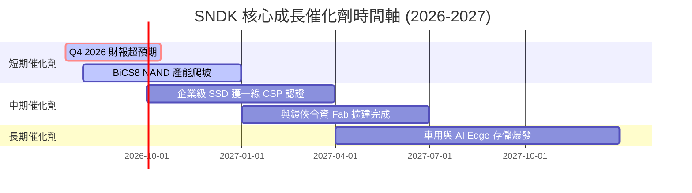

### 8.2 TAM 市場規模分析

```
╔══════════════════════════════════════════════════════════════════╗
║                  SNDK 核心市場 TAM 與滲透率預估                  ║
╠══════════════════════════════════════════════════════════════════╣
║                                                                  ║
║  ① AI 數據中心企業級 SSD 市場 (2027)：                           ║
║     ├── 全球 TAM：$45.0B                                         ║
║     ├── SNDK 預期滲透率：32%                                     ║
║     └── 預估貢獻收入：$14.4B (🟢 核心成長引擎)                    ║
║                                                                  ║
║  ② 行動端與智慧型手機 UFS 存儲 (2027)：                           ║
║     ├── 全球 TAM：$25.0B                                         ║
║     ├── SNDK 預期滲透率：15%                                     ║
║     └── 預估貢獻收入：$3.75B (🟡 穩健基石)                        ║
║                                                                  ║
║  ③ 車用與邊緣 AI 存儲 (2028)：                                   ║
║     ├── 全球 TAM：$12.0B                                         ║
║     ├── SNDK 預期滲透率：12%                                     ║
║     └── 預估貢獻收入：$1.44B (🟢 新興藍海)                        ║
╚══════════════════════════════════════════════════════════════════╝
```

### 8.3 成長驅動力結構圖

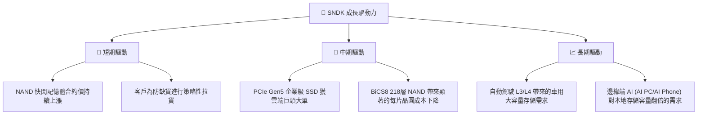

---

## 9. 風險矩陣

高回報必然伴隨著風險，投資 SNDK 需要密切關注以下潛在威脅。

### 9.1 風險評分矩陣

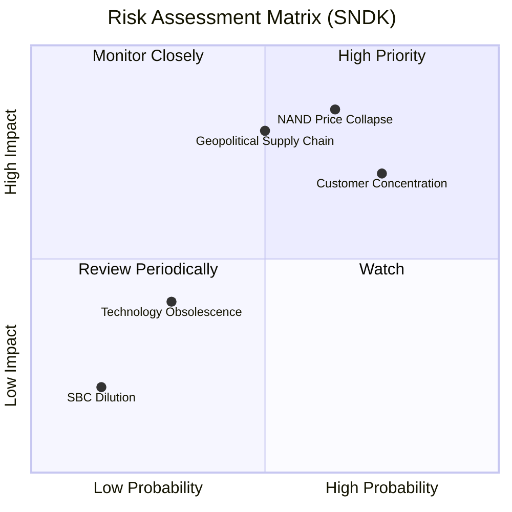

### 9.2 風險清單詳細分析

| # | 風險項目 | 發生機率 | 財務衝擊 | 風險評分 | 緩解措施 |
|---|---|---|---|---|---|
| **1** | 🔴 **NAND 價格提前見頂崩盤** | 中高 (65%) | 高 (-25% 營收) | 🔴 **8.0 / 10** | 公司正加速轉向高毛利、價格波動較小的客製化企業級 SSD，降低大宗商品屬性。 |
| **2** | 🔴 **雲端客戶集中度過高** | 高 (75%) | 中高 (-15% 營收) | 🔴 **7.5 / 10** | 積極開拓二線雲端服務商（Tier-2 CSP）及企業私有雲市場，分散客戶風險。 |
| **3** | 🟡 **地緣政治與供應鏈中斷** | 中等 (50%) | 高 (-20% 營收) | 🟡 **6.5 / 10** | 與合資夥伴鎧俠（Kioxia）在日本以外的地區建立多元化的後段封測（OSAT）合作夥伴。 |
| **4** | 🟢 **新技術替代（如 CXL）** | 低 (30%) | 中等 (-10% 營收) | 🟢 **4.0 / 10** | 積極參與 CXL 聯盟，研發相容新一代架構的混合存儲解決方案。 |

---

## 10. 投資建議

基於對 SNDK 損益表、資產負債表、現金流量表及獲利效率（ROIC）的深度剖析，我們給予該股 🟢 **買入** 評級。

### 10.1 最終綜合評級雷達圖

```
╔══════════════════════════════════════════════════════════════╗
║                    SNDK 最終綜合評級                         ║
╠══════════════════════════════════════════════════════════════╣
║ 成長性 (Growth)      : 9.5/10  ▓▓▓▓▓▓▓▓▓▓▓▓▓▓▓▓▓▓▓░  ★★★★★ ║
║ 獲利能力 (Profit)    : 9.0/10  ▓▓▓▓▓▓▓▓▓▓▓▓▓▓▓▓▓▓░░  ★★★★★ ║
║ 財務安全 (Safety)    : 9.5/10  ▓▓▓▓▓▓▓▓▓▓▓▓▓▓▓▓▓▓▓░  ★★★★★ ║
║ 估值吸引力 (Valuation): 6.0/10  ▓▓▓▓▓▓▓▓▓▓▓▓░░░░░░░░  ★★★☆☆ ║
║ 護城河深度 (Moat)    : 8.5/10  ▓▓▓▓▓▓▓▓▓▓▓▓▓▓▓▓▓░░░  ★★★★☆ ║
╠══════════════════════════════════════════════════════════════╣
║ 綜合投資評級          : 8.5/10  🟢 買入 (Buy)                ║
╚══════════════════════════════════════════════════════════════╝
```

### 10.2 目標價與隱含報酬率

* **當前股價**：$1,757.82
* **基準目標價（12個月）**：**$2,112.32**
* **隱含上行空間**：**+20.17%**
* **建議資產配置權重**：**3.5% - 5.0%**（適合中高風險偏好的成長型/科技型投資組合）

### 10.3 買入時機與觸發因素

```
╔══════════════════════════════════════════════════════════════════╗
║                  ✅ SNDK 投資操作指南 Checklist                 ║
╠══════════════════════════════════════════════════════════════════╣
║                                                                  ║
║  立即買入觸發條件（多數符合時建倉 50%）：                         ║
║  ✅ 股價回檔至 50 日均線（約 $1,650.00 附近）                     ║
║  ✅ 業界傳出 3D NAND 合約價在下一季度將續漲 >10%                  ║
║  ✅ 研調機構（如 TrendForce）確認企業級 SSD 出貨動能維持強勁     ║
║                                                                  ║
║  加碼觸發條件（出現以下任一則加碼至 100% 滿倉）：                  ║
║  ☐ 財報確認單季營業利益率維持在 60% 以上                         ║
║  ☐ 宣佈與一線雲端巨頭（如 AWS、Azure）簽訂為期數年的戰略供貨合約   ║
║  ☐ 宣佈啟動股份回購計劃，利用充裕的現金流回饋股東                 ║
║                                                                  ║
║  減碼/停損觸發條件（出現以下任一則立即減持 50%）：                 ║
║  ☐ 企業級 SSD 價格出現連續兩個月滑落                             ║
║  ☐ 競爭對手（Samsung/Micron）宣佈大幅擴產，引發價格戰擔憂       ║
╚══════════════════════════════════════════════════════════════════╝
```

### 10.4 投資人適配度分析

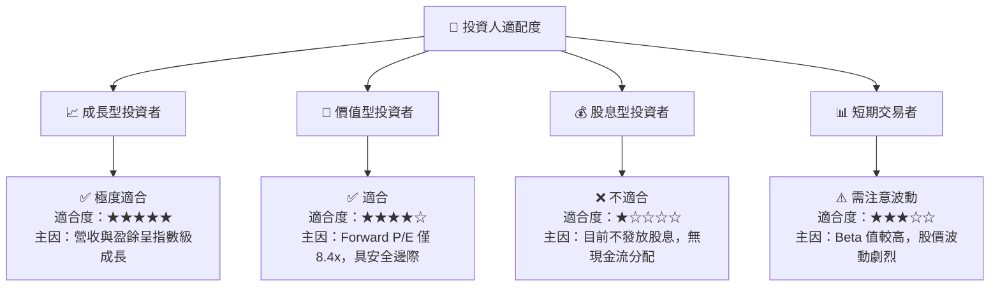

### 10.5 每季財報監控清單（Quarterly Watch List）

為了確保投資論點持續成立，投資人應在每季財報公佈時，嚴格對照以下指標的「加碼」與「減碼」門檻：

| 監控指標 | 當前值 (Q3 26) | 觸發加碼門檻 | 觸發減碼/退出門檻 | 監控目的 |
|---|---|---|---|---|
| **單季營收 YoY** | 251.0% | > 80.0% | < 30.0% | 評估 AI 存儲需求是否降溫 |
| **單季營業利益率** | 69.1% | > 60.0% | < 45.0% | 監控定價權與營運槓桿是否惡化 |
| **TTM 自由現金流** | $4.46B | > $5.0B | < $3.0B | 確保盈餘含金量與資本回收效率 |
| **存貨周轉天數 (DOH)**| 141 天 | < 120 天 | > 180 天 | 防範存貨積壓與潛在的跌價損失 |
| **BiCS8 出貨佔比** | 爬坡中 | > 40.0% | 進度嚴重落後 | 評估新技術降本增效的執行力 |

### 10.6 反面論證：什麼會證明論點錯誤（What Would Change My Mind）

身為理性的 CFA 投資分析師，我們必須時刻尋找「證偽」自身論點的證據。若以下任一量化條件成立，我們將不得不承認多頭論點失效，並下調評級至「賣出」或「觀望」：

```
╔══════════════════════════════════════════════════════════════════╗
║              ⚠️ 論點失效條件 (Disconfirming Evidence)            ║
╠══════════════════════════════════════════════════════════════════╣
║  本投資論點在下列情況成立時應重新檢視或退出：                    ║
║                                                                  ║
║  ☐ 核心企業級 SSD 營收年增率連續兩季低於 25%                     ║
║  ☐ 營業利益率較當前峰值收縮超過 15 個百分點 (跌破 54.1%)         ║
║  ☐ FCF 轉為淨流出，或 FCF/Net Income 轉換率跌破 70%              ║
║  ☐ ROIC 跌破 20% (表明資本效率出現結構性下滑)                    ║
║  ☐ 主要合資工廠因地震、停電或地緣政治衝突導致停產超過 4 週       ║
║  ☐ 鎧俠與 SNDK 聯盟破裂，導致研發費用大幅上升                   ║
╚══════════════════════════════════════════════════════════════════╝
```

---

> **免責聲明**：本報告為基於客觀財務數據之學術與投資研究分析，不構成任何買賣證券之要約或要約之引誘。投資有風險，入市需謹慎。投資人在做出任何決策前，應諮詢獨立財務顧問。