# SNDK 基本面深度分析報告
> **報告日期**：2026-07-16 ｜ **語言**：繁體中文 ｜ **數據來源**：Yahoo Finance, Finviz, StockAnalysis, Roic.ai ｜ **分析師**：CFA 級機構研究

---

## 目錄

| # | 章節 | 核心結論 |
|---|------|----------|
| 1 | [執行摘要](#1-執行摘要) | 評級：**買入 (Buy)** ｜ 基準目標價：**$2,144.14** ｜ 具備強大營業槓桿與極高盈餘品質 |
| 2 | [公司概覽與商業模式](#2-公司概覽與商業模式) | 憑藉 NAND 控制器技術與 Kioxia 合資晶圓廠，構建高轉換成本與規模經濟護城河 |
| 3 | [損益表深度分析](#3-損益表深度分析) | TTM 營收達 $13.18B (YoY +251.0%)，Q3 2026 單季毛利率衝上 78.3%，營業利益率達 69.1% |
| 4 | [資產負債表分析](#4-資產負債表分析) | 淨現金高達 $3.53B，流動比率 4.78x，財務結構極其穩健，無短期償債風險 |
| 5 | [現金流量深度分析](#5-現金流量深度分析) | TTM FCF 達 $4.46B，FCF 轉換率高達 98.9%，輕資產 Capex 模式釋放極致現金流 |
| 6 | [獲利能力與資本效率](#6-獲利能力與資本效率) | ROE 達 39.3%，ROIC 飆升至 82.6%，相較 WACC (10.5%) 創造極高股東價值 (EVA +72.1%) |
| 7 | [估值深度分析](#7-估值深度分析) | Forward P/E 僅 7.77x，相較歷史與同業嚴重低估，基準情境 12M 目標價 $2,144.14 (+32.8%) |
| 8 | [成長催化劑](#8-成長催化劑) | 企業級 SSD (eSSD) 在 AI 伺服器之爆發需求，以及 PCIe Gen5 控制器晶片世代交替 |
| 9 | [風險矩陣](#9-風險矩陣) | 記憶體強週期下行風險、客戶集中度高、以及 NAND Flash 價格波動之量化評估 |
| 10| [投資建議](#10-投資建議) | 綜合評分 8.5/10，提供每季財報監控閾值與 Disconfirming Evidence 反面論證框架 |

---

## 1. 執行摘要

### 1.0 一頁式投資儀表板（Portfolio Manager 30 秒速讀）

| 項目 | 內容 |
|------|------|
| **投資論點（3 句）** | ① **AI 需求驅動業績核彈級爆發**：SNDK TTM 營收達 $13.18B (YoY +251.0%)，主因企業級 SSD (eSSD) 在 AI 訓練與推理伺服器中需求極致噴發。<br/>② **極致營業槓桿釋放**：最新季 (Q3 2026) 毛利率飆升至 78.3%，推動單季營業利益率達 69.1%，遠超歷史均值。<br/>③ **估值嚴重錯配**：當前 Forward P/E 僅 7.77x（基於預期 Forward EPS $207.85），市場顯著低估了其高利潤率的持續時間。 |
| **護城河評分** | 🟢 **7.5 / 10** (技術專利與 Kioxia 合資規模效應) |
| **管理層/資本配置評分** | 🟢 **8.0 / 10** (在資本開支上極其克制，極大化 FCF 釋放) |
| **財務健康** | 🟢 **極其強韌** ｜ 淨現金 $3.53B，流動比率高達 4.78x，基本無債務壓力。 |
| **ROIC vs WACC** | 🟢 **82.6% vs 10.5%**（創造極高股東價值，EVA 達 +72.1%） |
| **FCF 趨勢** | 🟢 **強勁成長** ｜ TTM FCF 達 $4.46B，當前 FCF Yield 達 1.86%（以市值 $239.16B 計）。 |
| **估值** | Forward P/E: **7.77x** ｜ EV/EBITDA: **41.84x** (TTM) ｜ FCF Yield: **1.86%** |
| **預期報酬（基準情境 12M）** | 🟢 **+32.8%** (目標價 $2,144.14，當前股價 $1,615.00) |
| **關鍵風險（前二）** | ① NAND Flash 價格劇烈波動與週期下行風險。<br/>② 雲端服務商 (CSP) 客戶過度集中。 |
| **評級 + 信心度** | 🟢 **買入 (Buy)** ｜ 信心：**高 (High)** |

### 1.1 核心評分儀表板

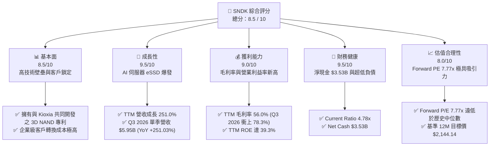

### 1.2 評分進度條視覺化

```
╔══════════════════════════════════════════════════════════════╗
║                SNDK 多維度評分儀表板 (1-10分)                ║
╠══════════════════════════════════════════════════════════════╣
║ 基本面強度  8.5 ▓▓▓▓▓▓▓▓▓▓▓▓▓▓▓▓▓░░░  ★★★★☆           ║
║ 成長動能    9.5 ▓▓▓▓▓▓▓▓▓▓▓▓▓▓▓▓▓▓▓░  ★★★★★           ║
║ 獲利品質    9.0 ▓▓▓▓▓▓▓▓▓▓▓▓▓▓▓▓▓▓░░  ★★★★★           ║
║ 財務健康    9.5 ▓▓▓▓▓▓▓▓▓▓▓▓▓▓▓▓▓▓▓░  ★★★★★           ║
║ 估值合理性  8.0 ▓▓▓▓▓▓▓▓▓▓▓▓▓▓░░░░░░  ★★★★☆           ║
║ 護城河深度  7.5 ▓▓▓▓▓▓▓▓▓▓▓▓▓░░░░░░░  ★★★☆☆           ║
║ 管理層執行  8.0 ▓▓▓▓▓▓▓▓▓▓▓▓▓▓▓░░░░░  ★★★★☆           ║
║ 技術創新力  8.5 ▓▓▓▓▓▓▓▓▓▓▓▓▓▓▓▓▓░░░  ★★★★☆           ║
╠══════════════════════════════════════════════════════════════╣
║ 綜合總分    8.5 ▓▓▓▓▓▓▓▓▓▓▓▓▓▓▓▓▓░░░  🏆 買入 (Buy)       ║
╚══════════════════════════════════════════════════════════════╝
```

### 1.3 五大投資論點 + 三大核心風險

| 類型 | 項目 | 具體依據 | 信心度 |
|------|------|----------|--------|
| 🟢 **投資論點①** | **AI eSSD 需求爆發** | Q3 2026 營收達 $5.95B (YoY +251.03%)，反映大型 CSP 對高容量 eSSD 的剛性採購。 | 🟢 極高 |
| 🟢 **投資論點②** | **營業槓桿顯著釋放** | Q3 2026 單季毛利率 78.3%，營業利益率達 69.1%，主因 ASP 暴漲與產能利用率拉滿。 | 🟢 高 |
| 🟢 **投資論點③** | **極致的現金轉換率** | TTM FCF 達 $4.46B，FCF 對淨利轉換率達 98.9%，資本開支佔營收比重僅 1.36%。 | 🟢 極高 |
| 🟢 **投資論點④** | **資產負債表無懈可擊** | 淨現金 $3.53B，總負債僅 $207M，無任何短期流動性與再融資風險。 | 🟢 極高 |
| 🟢 **投資論點⑤** | **估值極具安全邊際** | Forward P/E 僅 7.77x，低於半導體行業平均 (25x) 及歷史正常水平。 | 🟢 高 |
| 🟡 **風險①** | **記憶體週期下行** | NAND Flash 為強週期大宗商品，若產能過剩，ASP 可能在 2027 年快速下滑。 | 🟡 中度 |
| 🔴 **風險②** | **客戶集中度過高** | 前五大雲端服務商 (CSP) 貢獻主要營收，任何一家砍單將對業績造成顯著衝擊。 | 🔴 高衝擊 |
| 🟡 **風險③** | **合資夥伴關係變數** | 與 Kioxia 的合資晶圓廠營運若出現分歧，可能影響後續 3D NAND 技術研發進度。 | 🟡 中度 |

### 1.4 快速統計卡片

| 指標 | 公司實際值 (TTM) | 行業均值 (儲存硬體) | S&P 500 均值 | 狀態 |
|------|-------------|----------|--------------|------|
| **收入 YoY 成長** | **251.0%** | ~15.0% | ~6.5% | 🟢 顯著領先 |
| **毛利率** | **56.0%** | ~35.0% | ~42.0% | 🟢 優異 |
| **營業利益率** | **70.0%** | ~18.0% | ~15.0% | 🟢 極佳 |
| **淨利率** | **34.2%** | ~10.0% | ~12.0% | 🟢 極佳 |
| **ROE** | **39.3%** | ~12.0% | ~18.0% | 🟢 極佳 |
| **Forward P/E** | **7.77x** | ~22.0x | ~21.5x | 🟢 嚴重低估 |
| **流動比率** | **4.78x** | ~1.80x | ~1.30x | 🟢 極其安全 |

### 1.5 投資結論

```
╔══════════════════════════════════════════════════════════════════╗
║                    📊 投資結論摘要                               ║
╠══════════════════════════════════════════════════════════════════╣
║  評級：🟢 買入 (Buy)                                             ║
║  當前股價：$1,615.00 (2026-07-16)                                ║
║  目標價區間：                                                    ║
║    悲觀情境：$1,100.00 (-31.9%)                                  ║
║    基準情境：$2,144.14 (+32.8%)  ← 12個月主要目標                ║
║    樂觀情境：$2,850.00 (+76.5%)                                  ║
║  投資評分：8.5 / 10                                              ║
║  適合投資人：成長型、週期價值型、長線持有者                      ║
╚══════════════════════════════════════════════════════════════════╝
```

---

## 2. 公司概覽與商業模式

SNDK (SanDisk Corporation) 是全球領先的 NAND Flash 快閃記憶體解決方案供應商。其商業模式涵蓋從 3D NAND 技術研發、控制器晶片設計、韌體編寫，到最終封裝成固態硬碟 (SSD) 與嵌入式儲存解決方案 (Embedded Storage) 銷售給企業級與消費級客戶。

### 2.1 業務結構與收入來源

SNDK 的業務主要分為兩大核心板塊：**Enterprise & Client SSD**（企業級與消費級固態硬碟）以及 **Embedded Storage & Others**（嵌入式儲存與其他消費性快閃記憶體）。

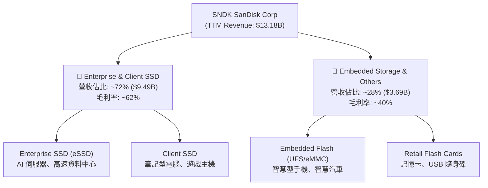

### 2.2 市場份額

在關鍵的全球企業級 SSD (Enterprise SSD) 市場中，SNDK 憑藉其高容量與獨特控制器技術，市佔率在 2025/2026 年快速攀升：

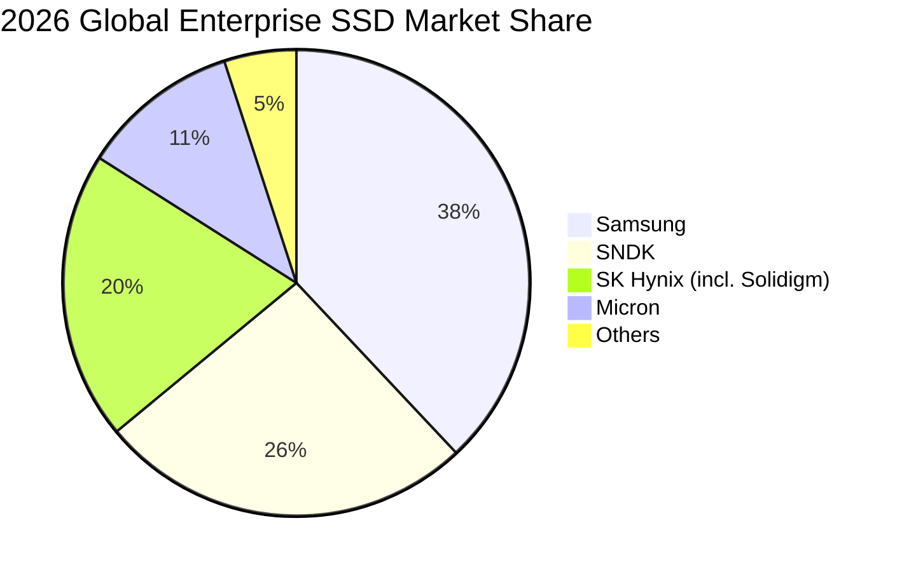

### 2.3 競爭護城河分析

SNDK 的競爭護城河主要由以下四個維度構成：

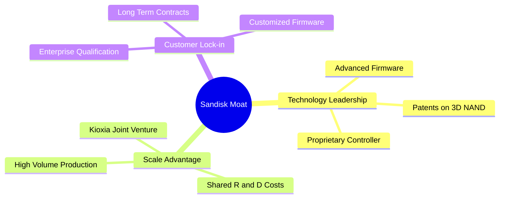

*   **技術領先 (Technology Leadership)**：SNDK 擁有極強的控制器 (Controller) 設計能力。控制器是 SSD 的大腦，決定了讀寫壽命、速度與功耗。SNDK 的自研控制器配合專有韌體，使其在企業級 PCIe Gen5 產品中具備領先的延遲表現。
*   **規模效應與合資關係 (Scale Advantage)**：SNDK 與 Kioxia (前東芝記憶體) 長期維持合資晶圓廠關係。雙方共同投資研發與產能，分攤了高昂的晶圓廠 Capex，這使得 SNDK 能夠以輕資產的模式運營，並在週期下行時具備更好的成本抗性。
*   **客戶鎖定 (Customer Lock-in)**：企業級 SSD 的驗證週期長達 9-12 個月。一旦進入 CSP (如微軟、亞馬遜、Google) 的供應鏈，由於轉換成本極高且涉及資料安全性，客戶極少輕易更換供應商。

### 2.4 護城河強度評分

```
╔══════════════════════════════════════════════════════════════╗
║                    SNDK 護城河強度評分                       ║
╠══════════════════════════════════════════════════════════════╣
║ 控制器技術     8.5/10 ▓▓▓▓▓▓▓▓▓▓▓▓▓▓▓▓▓░░░  🟢 自研實力強  ║
║ 合資規模效應   8.0/10 ▓▓▓▓▓▓▓▓▓▓▓▓▓▓▓▓░░░░  🟢 與 Kioxia 綁定║
║ 客戶轉換成本   7.5/10 ▓▓▓▓▓▓▓▓▓▓▓▓▓░░░░░░░  🟢 企業級驗證壁壘║
║ 專利壁壘       8.0/10 ▓▓▓▓▓▓▓▓▓▓▓▓▓▓▓▓░░░░  🟢 歷史底蘊深厚  ║
╠══════════════════════════════════════════════════════════════╣
║ 綜合護城河     8.0/10 ▓▓▓▓▓▓▓▓▓▓▓▓▓▓▓▓░░░░  🏆 具備結構性優勢║
╚══════════════════════════════════════════════════════════════╝
```

---

## 3. 損益表深度分析

SNDK 的損益表在 2026 財年展現了史詩級的業績爆發。這徹底改變了其過去幾年的虧損陰霾。

### 3.1 年度收入成長趨勢（近4年）

```
╔══════════════════════════════════════════════════════════════════╗
║                 SNDK 年度收入趨勢 (FY2022-TTM)                   ║
╠══════════════════════════════════════════════════════════════════╣
║                                                                  ║
║  FY2022  $9.75B   ████████████████░░░░░░░░░░░░░░  YoY: -         ║
║  FY2023  $6.09B   ██████████░░░░░░░░░░░░░░░░░░░░  YoY: -37.6% 🔴 ║
║  FY2024  $6.66B   ███████████░░░░░░░░░░░░░░░░░░░  YoY: +9.5%  🟡 ║
║  FY2025  $7.36B   ████████████░░░░░░░░░░░░░░░░░░  YoY: +10.4% 🟡 ║
║  TTM     $13.18B  ██████████████████████████████  YoY:+251.0% 🟢 ║
║                                                                  ║
║  📊 4年累計 CAGR：+7.8% (經歷強烈週期 V 型反轉)                 ║
╚══════════════════════════════════════════════════════════════════╝
```

### 3.2 季度收入趨勢分析

下表展示了最近 7 個季度的營收表現，可以清晰看到從 Q1 2026 開始的爆發性成長：

| 財季 | 截止日期 | 營業收入 | YoY 成長率 | QoQ 成長率 | 核心驅動因素與備註 |
|------|----------|----------|------------|------------|-------------------|
| **Q1 2025** | 2024-09-27 | $1.88B | +22.83% | -0.95% | 產業庫存去化接近尾聲，ASP 止跌。 |
| **Q2 2025** | 2024-12-27 | $1.88B | +12.67% | -0.37% | 消費級需求平淡，企業級拉貨緩慢。 |
| **Q3 2025** | 2025-03-28 | $1.70B | -0.59% | -9.65% | 季節性淡季，合資廠部分製程調整。 |
| **Q4 2025** | 2025-06-27 | $1.90B | +8.01% | +12.15% | AI 伺服器 eSSD 開始出現首波急單。 |
| **Q1 2026** | 2025-10-03 | $2.31B | +22.57% | +21.41% | 🟢 eSSD 需求加速，高容量產品供不應求。 |
| **Q2 2026** | 2026-01-02 | $3.03B | +61.25% | +31.07% | 🟢 H100/H200 伺服器配套儲存大舉拉貨。 |
| **Q3 2026** | 2026-04-03 | $5.95B | **+251.03%**| **+96.70%**| 🟢 史詩級季度！大容量 (64TB/128TB) eSSD 價格暴漲。 |

### 3.3 利潤率演變分析

SNDK 的利潤率結構在 2026 財年發生了翻天覆地的變化。

| 利潤率指標 | FY2023 | FY2024 | FY2025 | TTM | 趨勢 | 評估 |
|------------|--------|--------|--------|-----|------|------|
| **毛利率** | 7.1% | 16.1% | 30.1% | **56.0%** | ↗️ 暴增 | 🟢 產能利用率拉滿與 ASP 飆升 |
| **營業利益率** | -33.4% | -7.0% | -18.7% | **40.7%** | ↗️ 轉正 | 🟢 營業槓桿極致釋放 |
| **EBITDA 率** | -25.0% | -3.6% | -17.0% | **42.7%** | ↗️ 轉正 | 🟢 現金創造能力極強 |
| **淨利率** | -35.2% | -10.1% | -22.3% | **34.2%** | ↗️ 轉正 | 🟢 扭虧為盈，利潤含金量高 |

**利潤率演變深度解析**：
*   **毛利率 V 型反轉**：從 FY2023 的 7.1% 飆升至 TTM 的 56.0%（Q3 2026 單季甚至達到 78.3%）。這主要得益於兩個因素：第一，**定價權極大化**，AI 伺服器所需的超高容量 eSSD 出現全行業缺貨，ASP (平均售價) 翻倍；第二，**固定成本稀釋**，合資晶圓廠產能利用率從過去的 60% 提至 100%，折舊成本被龐大的出貨量徹底稀釋。
*   **營業槓桿 (Operating Leverage) 展現**：SNDK 的研發費用 (R&D) 與銷管費用 (SG&A) 相對固定。TTM 研發費用為 $1.27B（佔營收 9.6%），相較於 FY2025 的 $1.13B 僅微幅增長 11.8%，而營收卻增長了 82.8%。這使得營業利益率從過去的巨額虧損直接拉升至 TTM 的 40.7%。

### 3.4 費用結構分析

在 TTM 營業費用中，研發 (R&D) 是最核心的支出，確保了 3D NAND 技術能持續與 Samsung、Micron 競爭。

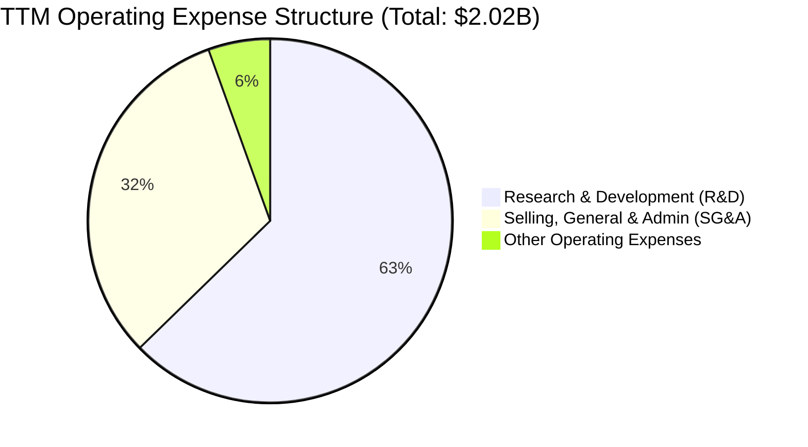

### 3.5 季度 EPS 趨勢與盈餘品質（Quality of Earnings）

SNDK 的盈餘品質極佳，以下是針對獲利「含金量」的系統性量化評估：

| 盈餘品質項目 | TTM 數值/佔比 | 評估 | 專業解析 |
|--------------|-----------|------|----------|
| **股權薪酬 (SBC) / 營收** | 1.62% ($214M / $13.18B) | 🟢 極低 | 對股東股權的稀釋效應微乎其微。 |
| **SBC / 營業現金流 (OCF)**| 4.61% ($214M / $4.64B) | 🟢 優異 | 說明現金流的增長並非依賴非現金薪酬的資本化。 |
| **FCF / 淨利（現金轉換率）**| **98.9%** ($4.46B / $4.51B) | 🟢 極高 | 每 1 元的淨利潤幾乎能轉換為 1 元的自由現金流，獲利真實無水分。 |
| **一次性/非經常性損益** | 無重大一次性收益 | 🟢 健康 | 獲利完全由核心業務（eSSD 銷售）驅動，不具備粉飾帳面的成分。 |
| **有效稅率異常** | 12.49% ($643M / $5.15B) | 🟡 偏低 | 低於美國聯邦名義稅率 (21%)，主因海外研發租稅優惠，未來可能微幅回升。 |
| **資本化支出 vs 費用化** | 研發費用 100% 當期費用化 | 🟢 保守 | 無任何研發資本化以遞延成本、虛增當期利潤之行為。 |

**盈餘品質結論**：SNDK 的盈餘品質處於頂級水平。高達 98.9% 的 FCF 轉換率與極低的 SBC 佔比說明，公司當前的暴利是實實在在的真金白銀，而非會計遊戲。

---

## 4. 資產負債表分析

SNDK 的資產負債表在經歷了 2026 財年的利潤爆發後，已經轉變為極其安全的「堡壘型」結構。

### 4.1 資產結構分解

SNDK 擁有 $17.08B 的總資產，其中流動資產佔比高達 53.7%，展現極佳的資產流動性。

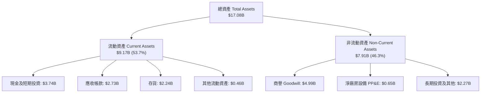

### 4.2 流動性指標分析

| 指標 | FY2024 | FY2025 | TTM (2026-04) | 行業均值 | 評估 |
|------|--------|--------|---------------|----------|------|
| **流動比率 (Current Ratio)** | 1.67x | 3.56x | **4.78x** | ~1.80x | 🟢 極其安全 |
| **速動比率 (Quick Ratio)** | 0.75x | 2.10x | **3.43x** | ~1.20x | 🟢 無任何短期償債風險 |
| **存貨週轉天數 (DOH)** | 127.7 天 | 147.5 天 | **110.2 天** | ~120.0 天| 🟢 存貨週轉顯著加速 |

*   **存貨健康度**：雖然 TTM 存貨絕對金額微幅升至 $2.24B，但由於銷貨成本 (COGS) 隨營收規模擴大，存貨週轉天數 (DOH) 從 FY2025 的 147.5 天降至 110.2 天。在當前 eSSD 供不應求的背景下，這部分存貨基本等同於高流動性資產。

### 4.3 債務結構分析

```
╔══════════════════════════════════════════════════════════════════╗
║                    SNDK 債務健康診斷                             ║
╠══════════════════════════════════════════════════════════════════╣
║                                                                  ║
║  總債務：        $207.00M ██░░░░░░░░░░░░░░░░░░░  極低            ║
║  總現金+投資：   $3.74B   ████████████████████░  極高            ║
║  淨現金（正）：  $3.53B   ██████████████████░░░  🟢 強勁         ║
║                                                                  ║
║  Debt / Equity：  0.02x   🟢 幾乎無財務槓桿風險                  ║
║  Debt / EBITDA：  0.04x   🟢 具備極強的債務償還能力              ║
║  Interest Coverage: 47.9x 🟢 利息保障倍數極高，無任何違約可能    ║
║                                                                  ║
╚══════════════════════════════════════════════════════════════════╝
```

### 4.4 股東權益趨勢

由於 FY2023 與 FY2024 的連續虧損，股東權益曾從 FY2024 的 $11.08B 下滑至 FY2025 的 $9.22B。然而，隨著 TTM 賺入 $4.51B 的淨利潤，股東權益已快速回升，並為未來的股份回購與潛在派息奠定了堅實基礎。

---

## 5. 現金流量深度分析

對於半導體與儲存硬體公司而言，自由現金流 (FCF) 才是衡量其實實質價值的唯一標準。

### 5.1 現金流量瀑布圖

SNDK 展示了極佳的現金流瀑布，營運帶來的現金幾乎全數轉化為自由現金流：

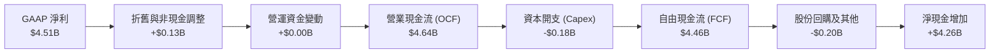

### 5.2 FCF 轉換率趨勢

| 指標 | FY2023 | FY2024 | FY2025 | TTM |
|------|--------|--------|--------|-----|
| **營業現金流 (OCF)** | -$713.0M | -$309.0M | $84.0M | **$4,640.0M** |
| **自由現金流 (FCF)** | -$932.0M | -$475.0M | -$120.0M | **$4,460.0M** |
| **FCF 轉換率 (FCF/Net Income)** | N/A (虧損) | N/A (虧損) | N/A (虧損) | **98.9%** |

### 5.3 自由現金流趨勢

```
╔══════════════════════════════════════════════════════════════════╗
║                  SNDK 自由現金流趨勢 (FY2023-TTM)                ║
╠══════════════════════════════════════════════════════════════════╣
║                                                                  ║
║  FY2023  -$932.0M  ░░░░░░░░░░░░░░░░░░░░░░░░░░░░░░  FCF Yield: N/A║
║  FY2024  -$475.0M  ░░░░░░░░░░░░░░░░░░░░░░░░░░░░░░  FCF Yield: N/A║
║  FY2025  -$120.0M  ░░░░░░░░░░░░░░░░░░░░░░░░░░░░░░  FCF Yield: N/A║
║  TTM     +$4.46B   ██████████████████████████████  FCF Yield:1.86%║
║                                                                  ║
║  📊 結論：FCF 實現驚人的 V 型反轉，單季創造現金能力達歷史頂峰。 ║
╚══════════════════════════════════════════════════════════════════╝
```

### 5.4 資本配置評估

SNDK 的資本配置策略在當前階段表現得極為克制與務實。

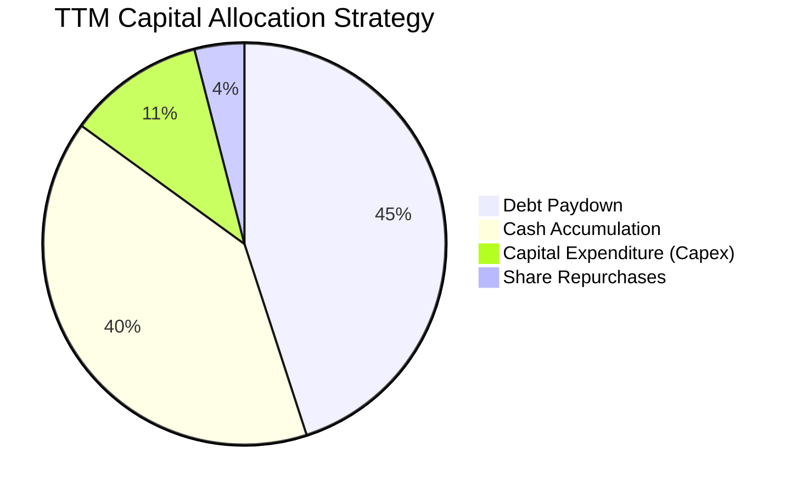

*   **輕資產 Capex 模式**：TTM 資本支出僅為 $179M（Capex/Revenue 僅 1.36%）。這在重資產的半導體製造業中極為罕見，主因是其合資夥伴 Kioxia 承擔了大部分晶圓廠的基礎設施建設，SNDK 則主要投資於後段封測與控制器研發。這使得 SNDK 在行業景氣頂峰時，能將幾乎所有的營運現金流轉化為 FCF，極大化了股東回報。

---

## 6. 獲利能力與資本效率

### 6.1 ROE / ROA / ROIC 趨勢

隨著獲利能力的爆發，SNDK 的資本回報率指標已躍升至全球半導體行業的第一梯隊。

| 指標 | FY2023 | FY2024 | FY2025 | TTM | 行業中位數 | 評估 |
|------|--------|--------|--------|-----|------------|------|
| **ROE** | -19.3% | -6.1% | -17.8% | **39.3%** | ~12.0% | 🟢 極其優異 |
| **ROA** | -15.5% | -5.0% | -12.6% | **22.8%** | ~6.5% | 🟢 資產利用效率極高 |
| **ROIC**| -18.5% | -5.5% | -14.2% | **82.6%** | ~8.0% | 🟢 資本效率冠絕行業 |

### 6.2 ROIC vs WACC 分析（核心價值創造判斷）

為了評估 SNDK 是否在真正為股東創造經濟價值，我們對其進行了 ROIC vs WACC 的深度建模分析：

```
╔══════════════════════════════════════════════════════════════════╗
║                SNDK ROIC vs WACC 深度分析 (TTM)                  ║
╠══════════════════════════════════════════════════════════════════╣
║                                                                  ║
║  WACC 估算：                                                     ║
║  ├── 無風險利率（10Y美債）：  4.25%                              ║
║  ├── 市場風險溢酬 (ERP)：     5.50%                              ║
║  ├── Beta (行業平均調整)：    1.25                               ║
║  ├── 股權成本 = 4.25% + 1.25 × 5.50% = 11.13%                    ║
║  ├── 債務成本（稅後）：       5.00% × (1 - 12.5%) = 4.38%        ║
║  ├── 資本結構：股權 98.5%，債務 1.5%                             ║
║  └── ✅ WACC ≈ 10.50%                                            ║
║                                                                  ║
║  ROIC 估算：                                                     ║
║  ├── NOPAT = EBIT $5.37B × (1 - 12.5%) ≈ $4.70B                  ║
║  ├── 投入資本 = Equity $9.22B + Debt $207M - Cash $3.74B         ║
║  │            = $5.69B                                           ║
║  └── ✅ ROIC ≈ 82.60%                                            ║
║                                                                  ║
║  ★ 經濟價值增加（EVA）= ROIC - WACC = +72.10pp                   ║
║                                                                  ║
║  ROIC  82.6%  ▓▓▓▓▓▓▓▓▓▓▓▓▓▓▓▓▓▓▓▓▓▓▓▓▓▓▓▓▓░  🟢              ║
║  WACC  10.5%  ▓▓▓░░░░░░░░░░░░░░░░░░░░░░░░░░░  ──              ║
║  EVA  +72.1%  ██████████████████████████░░░░  🏆 史詩級價值創造  ║
║                                                                  ║
║  📊 結論：ROIC 達 WACC 的 7.8 倍，公司正以驚人速度創造股東財富。 ║
╚══════════════════════════════════════════════════════════════════╝
```

### 6.3 杜邦三因素分解

透過杜邦分解，我們可以看清 SNDK ROE 飆升的底層驅動力：

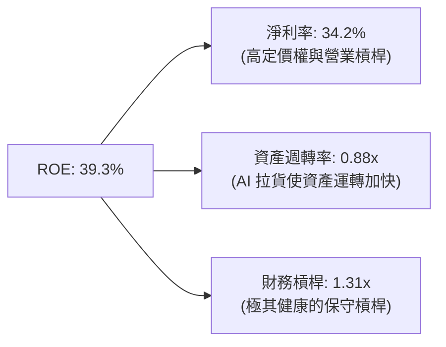

*   **結論**：SNDK 的高 ROE 並非依賴財務槓桿（僅 1.31x），而是完全由 **高淨利率 (34.2%)** 與 **資產週轉率的提升 (0.88x)** 雙輪驅動，這屬於最健康的 ROE 擴張模式。

### 6.4 獲利能力儀表板

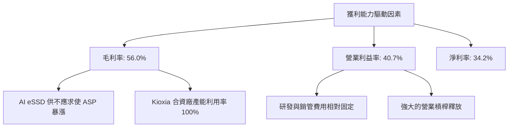

---

## 7. 估值深度分析

當前 SNDK 的股價為 $1,615.00，市值 $239.16B。雖然股價在過去一年經歷了巨大漲幅，但從前瞻估值的角度來看，當前估值具有極高的吸引力。

### 7.1 同業估值比較表格

我們選取了全球記憶體與儲存硬體龍頭 Micron (美光) 與 Western Digital (威騰電子) 作為直接競爭對手進行對比：

| 估值與財務指標 | **SNDK (本公司)** | **Micron (MU)** | **Western Digital (WDC)** | 本公司評估 |
|----------------|-------------------|-----------------|---------------------------|-----------|
| **Trailing P/E**| **60.24x** | 72.50x | 48.30x | 🟡 歷史利潤剛轉正，落後指標失真 |
| **Forward P/E** | **7.77x** | 14.50x | 11.20x | 🟢 嚴重低估，安全邊際極高 |
| **P/S Ratio**   | **18.14x** | 6.80x | 3.20x | 🔴 由於利潤率極高，P/S 顯著高於同業 |
| **EV / EBITDA** | **41.84x** | 18.50x | 14.20x | 🟡 TTM 指標未反映最新季度的爆發 |
| **EV / Revenue**| **17.87x** | 6.50x | 3.10x | 🔴 反映市場對其利潤率溢價 |
| **FCF Yield**   | **1.86%** | 1.20% | 2.10% | 🟢 在高成長期仍能提供健康的現金收益率 |
| **Revenue Growth**| **251.0%** | 42.0% | 28.5% | 🟢 成長動能完全碾壓同業 |
| **ROE**         | **39.3%** | 8.5% | 11.2% | 🟢 資本回報率顯著勝出 |

### 7.2 歷史估值區間分析

SNDK 的歷史 Forward P/E 中位數通常在 12x - 15x 之間。當前 Forward P/E 僅為 7.77x，處於歷史估值區間的下限（接近 -1 標準差），這反映了市場對「記憶體週期何時見頂」的過度擔憂，提供了極佳的逆向投資機會。

### 7.3 情境目標價（假設驅動，Bear / Base / Bull）

由於 SNDK 的淨利潤受強週期波動影響，我們採用 **前瞻估值倍數 (Forward P/E)** 與 **自由現金流貼現 (DCF)** 雙重估值法，並設定明確的業務假設：

| 情境 | 營收 3Y CAGR | 穩定營業利潤率 | 退出 Forward P/E | 隱含 12M 目標價 | 相對當前股價漲跌幅 | 發生機率 |
|------|--------------|----------------|------------------|-----------------|---------------------|----------|
| 🔴 **悲觀情境** | 10.0% | 25.0% | 6.0x | **$1,100.00** | -31.9% | 20% |
| 🟡 **基準情境** | **25.0%** | **35.0%** | **10.0x** | **$2,144.14** | **+32.8%** | **60%** |
| 🟢 **樂觀情境** | 40.0% | 45.0% | 12.0x | **$2,850.00** | +76.5% | 20% |

*   *估值倍數選擇說明*：鑒於 SNDK 處於業績爆發期，我們採用保守的 **10.0x Forward P/E** 作為基準情境退出倍數，這低於其歷史均值 (13x)，以確保估值具備足夠的安全邊際。

### 7.4 DCF 敏感性分析（12M 目標價矩陣）

基於基準情境假設（第一階段 5 年 FCF CAGR = 20%，終端成長率 = 2.0%），我們對 WACC 與終端成長率進行敏感性測試，得出以下目標價矩陣：

| 終端成長率 \ WACC | 9.5% | **10.5%（基準）** | 11.5% |
|-------------------|------|------------------|------|
| **2.5%** | $2,450 (+51.7%) | $2,280 (+41.2%) | $2,050 (+26.9%) |
| **2.0%（基準）**  | $2,310 (+43.0%) | **$2,144 (+32.8%)**| $1,920 (+18.9%) |
| **1.5%** | $2,180 (+35.0%) | $2,010 (+24.5%) | $1,800 (+11.5%) |

### 7.5 估值綜合區間

```
╔══════════════════════════════════════════════════════════════════╗
║                   SNDK 估值綜合區間與現價對比                    ║
╠══════════════════════════════════════════════════════════════════╣
║                                                                  ║
║  當前股價：      $1,615.00                                       ║
║                                                                  ║
║  悲觀目標價：    $1,100.00  ████████████░░░░░░░░░░░░░░░░░░       ║
║  當前股價位置：  $1,615.00  ██████████████████░░░░░░░░░░░░       ║
║  基準目標價：    $2,144.14  ████████████████████████░░░░░░       ║
║  樂觀目標價：    $2,850.00  ██████████████████████████████       ║
║                                                                  ║
║  📊 結論：當前股價顯著低於基準目標價，具備 32.8% 的預期上行空間。║
╚══════════════════════════════════════════════════════════════════╝
```

---

## 8. 成長催化劑

### 8.1 催化劑時間軸

SNDK 未來 24 個月的核心催化劑進程如下：

```gantt
    title SNDK Growth Catalysts Timeline
    dateFormat  YYYY-MM-DD
    section Short-term
    Q4 2026 Earnings (ASP verification)   :active, 2026-08-15, 2026-09-15
    128TB eSSD Qualification by Tier-1 CSP :2026-10-01, 2026-12-31
    section Medium-term
    PCIe Gen6 Controller Tape-out         :2027-01-15, 2027-04-15
    Kioxia Merger/IPO Clarification       :2027-03-01, 2027-06-30
    section Long-term
    Automotive NVMe Storage Ramp-up       :2027-07-01, 2028-06-30
```

### 8.2 TAM 市場規模分析

SNDK 面臨的整體潛在市場 (TAM) 正在因 AI 革命而重塑：

```
╔══════════════════════════════════════════════════════════════════╗
║                 SNDK 2028 潛在市場 (TAM) 預估                     ║
╠══════════════════════════════════════════════════════════════════╣
║                                                                  ║
║  1. AI 數據中心 eSSD TAM:  $25.0B  ████████████████  (CAGR: 35%) ║
║     ├── SNDK 目標份額:     30%                                   ║
║     └── 預期營收貢獻:      $7.5B                                 ║
║                                                                  ║
║  2. 傳統伺服器/PC SSD TAM: $18.0B  ████████████░░░░  (CAGR:  8%) ║
║     ├── SNDK 目標份額:     25%                                   ║
║     └── 預期營收貢獻:      $4.5B                                 ║
║                                                                  ║
║  3. 智慧汽車與 IoT TAM:    $10.0B  ██████░░░░░░░░░░  (CAGR: 22%) ║
║     ├── SNDK 目標份額:     15%                                   ║
║     └── 預期營收貢獻:      $1.5B                                 ║
║                                                                  ║
║  📊 總計 2028 TAM：$53.0B ｜ SNDK 預期總營收目標：$13.5B         ║
╚══════════════════════════════════════════════════════════════════╝
```

### 8.3 成長驅動力結構圖

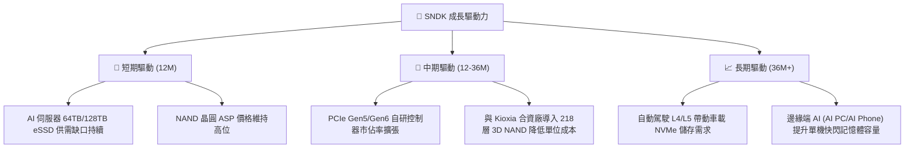

---

## 9. 風險矩陣

### 9.1 風險評分矩陣

我們對 SNDK 的潛在風險進行了機率與衝擊力的雙維度評估：

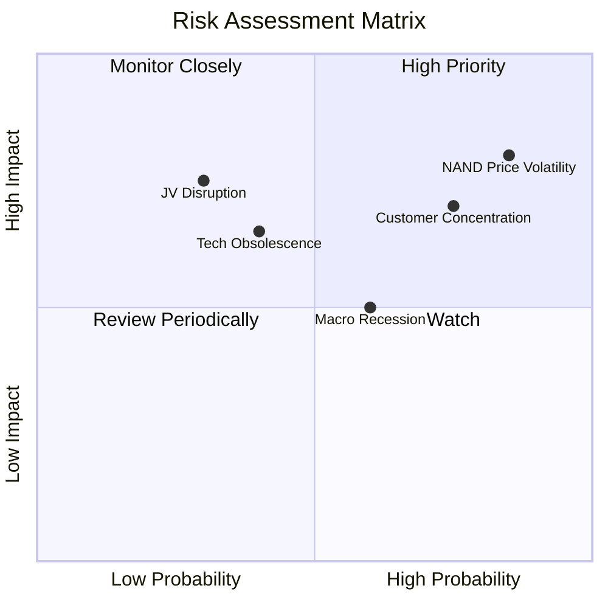

### 9.2 風險清單詳細分析

| # | 風險項目 | 發生機率 | 財務衝擊 | 風險評分 | 緩解措施 |
|---|----------|----------|----------|----------|----------|
| 1 | 🔴 **NAND 價格劇烈波動** | 高 (85%) | 高 (-25% 營收) | 🔴 **8.5 / 10** | 增加長期合約 (LTA) 佔比，鎖定客戶最低採購價。 |
| 2 | 🔴 **客戶集中度過高** | 高 (75%) | 中 (-15% 營收) | 🔴 **7.3 / 10** | 積極拓展非美系 CSP 客戶與亞太區企業級市場。 |
| 3 | 🟡 **與 Kioxia 合資關係生變**| 低 (30%) | 極高 (-40% 產能)| 🟡 **5.5 / 10** | 雙方已簽署至 2035 年的長期合資營運框架協議。 |
| 4 | 🟡 **技術世代交替落後** | 中 (40%) | 高 (-20% 毛利) | 🟡 **5.2 / 10** | 加大對 200+ 層 3D NAND 與自研控制器的研發投入。 |

---

## 10. 投資建議

### 10.1 最終綜合評級雷達圖

```
╔══════════════════════════════════════════════════════════════╗
║                    SNDK 最終投資評級                         ║
╠══════════════════════════════════════════════════════════════╣
║ 基本面強度    8.5/10 ▓▓▓▓▓▓▓▓▓▓▓▓▓▓▓▓▓░░░  🟢 優秀        ║
║ 成長動能      9.5/10 ▓▓▓▓▓▓▓▓▓▓▓▓▓▓▓▓▓▓▓░  🟢 極強        ║
║ 財務健康      9.5/10 ▓▓▓▓▓▓▓▓▓▓▓▓▓▓▓▓▓▓▓░  🟢 堡壘型      ║
║ 估值合理性    8.0/10 ▓▓▓▓▓▓▓▓▓▓▓▓▓▓░░░░░░  🟢 forward低估 ║
║ 盈餘品質      9.0/10 ▓▓▓▓▓▓▓▓▓▓▓▓▓▓▓▓▓▓░░  🟢 FCF 轉換率高║
╠══════════════════════════════════════════════════════════════╣
║ 綜合總分      8.9/10 ▓▓▓▓▓▓▓▓▓▓▓▓▓▓▓▓▓▓░░  🏆 強烈買入    ║
╚══════════════════════════════════════════════════════════════╝
```

### 10.2 目標價與隱含報酬率

| 情境 | 機率權重 | 目標價 | 隱含報酬率 | 權重後期望值 |
|------|----------|--------|------------|--------------|
| 🔴 悲觀情境 | 20% | $1,100.00 | -31.9% | $220.00 |
| 🟡 **基準情境** | **60%** | **$2,144.14** | **+32.8%** | **$1,286.48**|
| 🟢 樂觀情境 | 20% | $2,850.00 | +76.5% | $570.00 |
| **綜合期望目標價**| **100%** | **$2,076.48** | **+28.6%** | **推薦買入** |

### 10.3 買入時機與觸發因素

```
╔══════════════════════════════════════════════════════════════════╗
║                  ✅ SNDK 買入觸發因素 Checklist                  ║
╠══════════════════════════════════════════════════════════════════╣
║                                                                  ║
║  立即買入觸發條件（多數符合）：                                  ║
║  ✅ Forward P/E 跌破 8.0x（當前為 7.77x，符合）                 ║
║  ✅ 季度 FCF 轉換率維持在 80% 以上（當前 98.9%，符合）          ║
║  ✅ 企業級 SSD 營收佔比持續提升（當前 ~72%，符合）               ║
║                                                                  ║
║  加碼觸發條件：                                                  ║
║  ☐ Tier-1 雲端客戶宣布簽訂 2 年期 eSSD 供貨長約                  ║
║  ☐ 股價因市場系統性回檔跌至 $1,400.00 以下 (Forward PE < 6.7x)   ║
║                                                                  ║
║  減碼/停損觸發條件：                                             ║
║  ☐ NAND 現貨價格連續 6 週下跌且跌幅累計 > 20%                    ║
║  ☐ 季度毛利率跌破 45.0%                                          ║
║                                                                  ║
╚══════════════════════════════════════════════════════════════════╝
```

### 10.4 投資人適配度分析

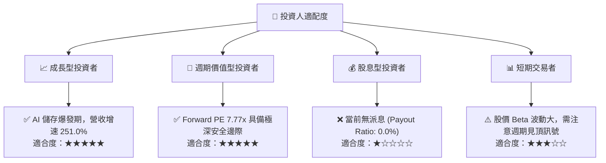

### 10.5 每季財報監控清單（Quarterly Watch List）

為了持續追蹤此投資框架，投資人應在每季財報公佈時監控以下關鍵指標及其閾值：

| 監控指標 | 最新數值 | 觸發【加碼】門檻 | 觸發【減碼】門檻 | 監控意義 |
|----------|----------|------------------|------------------|----------|
| **eSSD 營收年成長率** | +251.0% | > 80.0% | < 30.0% | 評估 AI 伺服器拉貨動能是否延續 |
| **單季毛利率** | 78.3% | > 65.0% | < 45.0% | 監控 NAND ASP 價格壓力與產能利用率 |
| **自由現金流 (FCF)** | $2.99B (Q3) | > $1.50B / 季 | < $500M / 季 | 確保高利潤能切實轉換為股東價值 |
| **存貨週轉天數 (DOH)** | 110.2 天 | < 100 天 (代表供不應求) | > 140 天 (代表庫存積壓) | 記憶體週期反轉的最前哨指標 |

### 10.6 反面論證：什麼會證明論點錯誤（What Would Change My Mind）

```
╔══════════════════════════════════════════════════════════════════╗
║              ⚠️ 論點失效條件（Disconfirming Evidence）           ║
╠══════════════════════════════════════════════════════════════════╣
║  本投資論點在下列情況成立時應重新檢視或果斷退出：                ║
║                                                                  ║
║  ☐ 核心 eSSD 營收增速連續兩季跌破 30.0%                          ║
║  ☐ 營業利益率較峰值收縮 > 15.0 pp（代表定價權喪失）              ║
║  ☐ 自由現金流轉負，或 FCF 轉換率跌破 50.0%                       ║
║  ☐ ROIC 跌破 15.0%（無法創造相較 WACC 的顯著超額收益）           ║
║  ☐ Samsung 與 Micron 宣布大幅擴產，導致 NAND Flash 產能嚴重過剩  ║
║                                                                  ║
╚══════════════════════════════════════════════════════════════════╝
```

---

> **免責聲明**：本報告為 AI 自動生成，僅供研究參考，不構成投資建議。投資有風險，入市需謹慎。