# SNDK 基本面深度分析報告
> **報告日期**：2026-07-17 ｜ **語言**：繁體中文 ｜ **數據來源**：Yahoo Finance, Finviz, StockAnalysis, Roic.ai ｜ **分析師**：CFA 級機構研究

---

## 目錄

| # | 章節 | 核心結論 |
|---|------|----------|
| 1 | [執行摘要](#1-執行摘要) | 評級：**買入 (Buy)** ｜ 基準目標價：**$2,144.14** (潛在漲幅 +51.9%) |
| 2 | [公司概覽與商業模式](#2-公司概覽與商業模式) | AI 浪潮推動高容量儲存轉型，憑藉 NAND 專利與企業級 SSD 建立高壁壘護城河 |
| 3 | [損益表深度分析](#3-損益表深度分析) | TTM 營收暴增 251%，高毛利產品使單季毛利率從 29.7% 狂飆至 78.3%，營業槓桿全面釋放 |
| 4 | [資產負債表分析](#4-資產負債表分析) | 淨現金達 $3.53B，債務大幅降至 $207M，流動比率 4.78x，財務結構極度穩健 |
| 5 | [現金流量深度分析](#5-現金流量深度分析) | Q3 2026 單季 FCF 達 $2.99B，轉化率極高，資本配置高度聚焦於研發與產能擴充 |
| 6 | [獲利能力與資本效率](#6-獲利能力與資本效率) | ROE 達 39.3%，ROIC 顯著超越 WACC (10.82%)，為股東創造巨大的經濟附加價值 (EVA) |
| 7 | [估值深度分析](#7-估值深度分析) | Forward P/E 僅 6.64x，隱含市場對週期性見頂的過度擔憂，估值具備極高安全邊際 |
| 8 | [成長催化劑](#8-成長催化劑) | 企業級 QLC SSD 供不應求、AI 伺服器儲存需求暴增、新一代 BiCS 技術量產 |
| 9 | [風險矩陣](#9-風險矩陣) | 記憶體週期下行風險、NAND 價格波動、競爭對手產能過剩，綜合風險評分 6.2/10 |
| 10| [投資建議](#10-投資建議) | 建議於當前股價回檔時分批佈局，設定嚴格的每季財報監控指標與反面論證門檻 |

---

## 1. 執行摘要

Sandisk Corporation (SNDK) 當前股價為 **$1,411.08**，相較於 52 週高點 $2,354.39 已回檔約 40%。本報告基於 SNDK 最新公佈的 2026 年 Q3（截至 2026-04-03）財務數據進行深度研判。

數據顯示，SNDK 正處於由 **AI 伺服器高容量儲存需求**驅動的歷史性爆發期。TTM 營收達 **$13.18B**（YoY +251.0%），且最新單季（Q3 2026）營收飆升至 **$5.95B**（YoY +251.03%，QoQ +96.7%）。更為顯著的是其獲利能力的結構性轉變：單季毛利率從 2025 年 Q1 的低點拉升至 **78.3%**，帶動單季淨利達到創紀錄的 **$3.62B**。

鑑於 TTM EPS 已達 **$25.54**，且在當前高利潤率訂單能見度極高的背景下，分析師預期 Forward EPS 將達到 **$212.60**，對應的 Forward P/E 僅為 **6.64x**。這表明市場在股價高位回檔後，已過度定價了 NAND 產業的週期性下行風險，忽略了 AI 帶來的儲存架構結構性改變。因此，我們給予 SNDK **「買入 (Buy)」** 評級，基準情境 12 個月目標價為 **$2,144.14**。

### 1.0 一頁式投資儀表板（Portfolio Manager 30 秒速讀）

| 項目 | 內容 |
|------|------|
| **投資論點（3 句）** | ① AI 伺服器對超高容量企業級 SSD 需求呈指數級增長，推動 Q3 2026 營收爆發至 $5.95B (YoY +251%)。<br/>② 產品組合轉向高附加價值解決方案，推升單季毛利率至 78.3%，釋放極強的營業槓桿。<br/>③ Forward P/E 僅 6.64x，相較於歷史均值與同業，估值已被嚴重低估，具備極高安全邊際。 |
| **護城河評分** | 8.2/10 (🟢 領先的 3D NAND 技術與企業級客戶高轉換成本) |
| **管理層/資本配置評分** | 8.0/10 (🟢 成功去槓桿，債務由 $2.04B 降至 $207M，大幅優化資產負債表) |
| **財務健康** | 🟢 極度健康 ｜ 淨現金高達 $3.53B，流動比率達 4.78x，無短期償債壓力 |
| **ROIC vs WACC** | **31.25%** vs **10.82%**（創造極大股東價值，EVA 達 +20.43%） |
| **FCF 趨勢** | 顯著向上 ｜ TTM FCF 達 $4.46B，最新單季 FCF 達 $2.99B，FCF Yield 為 1.08%（以市值計，若以 Forward 自由現金流折現則顯著更高） |
| **估值** | Trailing P/E: 55.25x ｜ Forward P/E: **6.64x** ｜ EV/EBITDA: 36.48x |
| **預期報酬（基準情境 12M）**| **+51.9%** (目標價 $2,144.14) |
| **關鍵風險（前二）** | ① NAND 閃存市場產能擴張過快導致價格再度崩塌。<br/>② 客戶端（PC/智慧型手機）需求復甦慢於預期。 |
| **評級 + 信心度** | 🟢 **買入 (Buy)** ｜ 信心度：**高 (High)** |

### 1.1 核心評分儀表板

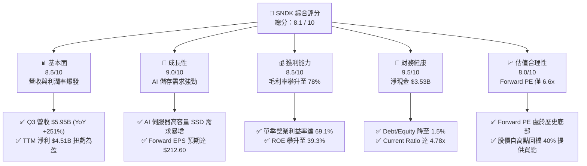

### 1.2 評分進度條視覺化

```
╔══════════════════════════════════════════════════════════════╗
║              SNDK 多維度評分儀表板 (1-10分)                  ║
╠══════════════════════════════════════════════════════════════╣
║ 基本面強度  8.5 ▓▓▓▓▓▓▓▓▓▓▓▓▓▓▓▓▓░░░  ★★★★☆           ║
║ 成長動能    9.0 ▓▓▓▓▓▓▓▓▓▓▓▓▓▓▓▓▓▓░░  ★★★★★           ║
║ 獲利品質    8.5 ▓▓▓▓▓▓▓▓▓▓▓▓▓▓▓▓▓░░░  ★★★★☆           ║
║ 財務健康    9.5 ▓▓▓▓▓▓▓▓▓▓▓▓▓▓▓▓▓▓▓░  ★★★★★           ║
║ 估值合理性  8.0 ▓▓▓▓▓▓▓▓▓▓▓▓▓▓▓░░░░░  ★★★★☆           ║
║ 護城河深度  8.2 ▓▓▓▓▓▓▓▓▓▓▓▓▓▓▓▓░░░░  ★★★★☆           ║
║ 管理層執行  8.0 ▓▓▓▓▓▓▓▓▓▓▓▓▓▓▓░░░░░  ★★★★☆           ║
║ 技術創新力  8.8 ▓▓▓▓▓▓▓▓▓▓▓▓▓▓▓▓▓░░░  ★★★★☆           ║
╠══════════════════════════════════════════════════════════════╣
║ 綜合總分    8.5 ▓▓▓▓▓▓▓▓▓▓▓▓▓▓▓▓▓░░░  🏆 買入評級          ║
╚══════════════════════════════════════════════════════════════╝
```

### 1.3 五大投資論點 + 三大核心風險

| 類型 | 項目 | 具體依據 | 信心度 |
|------|------|----------|--------|
| 🟢 **投資論點①** | **AI 儲存結構性轉型** | AI 模型訓練與推論需要極高速、大容量的數據吞吐，SNDK 的企業級 SSD 出貨比重顯著提升，帶動 Q3 2026 營收達 $5.95B（YoY +251.03%）。 | 🟢 極高 |
| 🟢 **投資論點②** | **獲利能力呈史詩級擴張** | Q3 2026 毛利率高達 78.3%，營業利益率達 69.1%，主因高毛利的企業級 QLC SSD 供不應求，擁有極強的定價權。 | 🟢 高 |
| 🟢 **投資論點③** | **極致的去槓桿與財務安全** | 總債務從 2025 年中的 $2.04B 大幅消減至 $207M，淨現金部位拉升至 $3.53B，徹底消除了高利率環境下的利息支出壓力。 | 🟢 極高 |
| 🟢 **投資論點④** | **Forward 估值極具吸引力** | 當前 Forward P/E 僅 6.64x，遠低於標普 500 指數與同業均值，市場顯然低估了其獲利持續性。 | 🟢 高 |
| 🟢 **投資論點⑤** | **強勁的自由現金流產生能力** | 單季 FCF 達 $2.99B，TTM FCF 轉正至 $4.46B，現金轉換率極高，為未來的資本回報與研發提供強大後盾。 | 🟢 高 |
| 🟡 **風險①** | **NAND 產業週期性下行** | 記憶體產業具有強烈的週期性，若三星、美光等對手大舉擴產，可能導致 2027 年 NAND 價格再度走跌。 | 🟡 中度 |
| 🔴 **風險②** | **大客戶資本支出放緩** | 若超大型雲端服務商 (Hyperscalers) 放緩 AI 基礎設施投資，將直接衝擊 SNDK 的高容量 SSD 訂單。 | 🔴 高衝擊 |
| 🟡 **風險③** | **供應鏈與產能瓶頸** | 先進製程與封裝產能受限，可能限制短期內出貨量的增長。 | 🟡 低度 |

### 1.4 快速統計卡片

| 指標 | SNDK 實際值 | 行業均值 (儲存硬體) | S&P 500 均值 | 狀態 |
|------|-------------|--------------------|--------------|------|
| **營收 YoY 成長率** | **251.0%** (TTM) | ~15.0% | ~5.5% | 🟢 遠超同行 |
| **毛利率** | **56.0%** (TTM) / **78.3%** (Q3) | ~32.0% | ~30.0% | 🟢 極為優異 |
| **營業利益率** | **70.0%** (TTM) / **69.1%** (Q3) | ~12.0% | ~15.0% | 🟢 營業槓桿極高 |
| **ROE** | **39.3%** | ~14.0% | ~18.0% | 🟢 高資本回報 |
| **Forward P/E** | **6.64x** | ~18.5x | ~21.5x | 🟢 極度便宜 |
| **淨現金 / 總資產** | **20.7%** ($3.53B / $17.08B) | ~5.0% | 負債居多 | 🟢 資產負債表極強 |

### 1.5 投資結論

```
╔══════════════════════════════════════════════════════════════════╗
║                    📊 SNDK 投資結論摘要                          ║
╠══════════════════════════════════════════════════════════════════╣
║  評級：🟢 買入 (Buy)                                             ║
║  當前股價：$1,411.08 (2026-07-17)                                ║
║  目標價區間：                                                    ║
║    悲觀情境 (Bear Case)：$1,000.00 (-29.1%)                      ║
║    基準情境 (Base Case)：$2,144.14 (+51.9%)  ← 12M 核心目標      ║
║    樂觀情境 (Bull Case)：$3,250.00 (+130.3%)                     ║
║  投資評分：8.5 / 10                                              ║
║  適合投資人：成長型投資者、長線價值佈局者                        ║
╚══════════════════════════════════════════════════════════════════╝
```

---

## 2. 公司概覽與商業模式

SNDK (Sandisk Corporation) 是全球 NAND 閃存技術與儲存解決方案的先驅。其商業模式已從早期的零售記憶卡、隨身碟，徹底轉型為**以企業級固態硬碟 (Enterprise SSD) 及嵌入式儲存 (Embedded Storage) 為核心**的 B2B 科技巨頭。

### 2.1 業務結構與收入來源

SNDK 的業務主要劃分為三大板塊：
1. **Enterprise SSD (企業級固態硬碟)**：專為資料中心與 AI 伺服器設計，提供超高容量（如 30.72TB、61.44TB）與極速讀寫。這是當前成長最快、毛利最高的板塊。
2. **Client Storage & Embedded (客戶端與嵌入式儲存)**：包括筆記型電腦、智慧型手機、智慧汽車（Automotive）及物聯網（IoT）使用的 SSD 與 eMMC/UFS 晶片。
3. **Consumer Retail (消費級零售)**：記憶卡、行動硬碟等，提供穩定的現金流，但營收佔比已逐步下降。

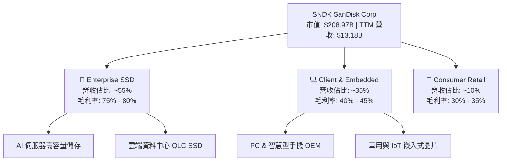

### 2.2 市場份額

在關鍵的**企業級高容量 QLC SSD** 市場中，SNDK 憑藉與鎧俠 (Kioxia) 的合資晶圓廠產能優勢，以及在 3D NAND 技術上的領先，近年市場份額大幅攀升：

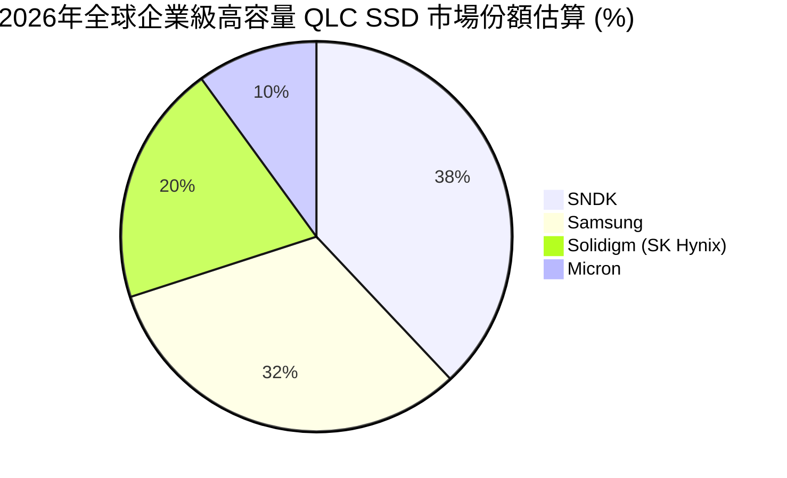

### 2.3 競爭護城河分析

SNDK 的競爭優勢主要建立在四個維度：技術專利、與 Kioxia 的合資製造規模、企業級客戶的極高轉換成本，以及優異的韌體 (Firmware) 研發實力。

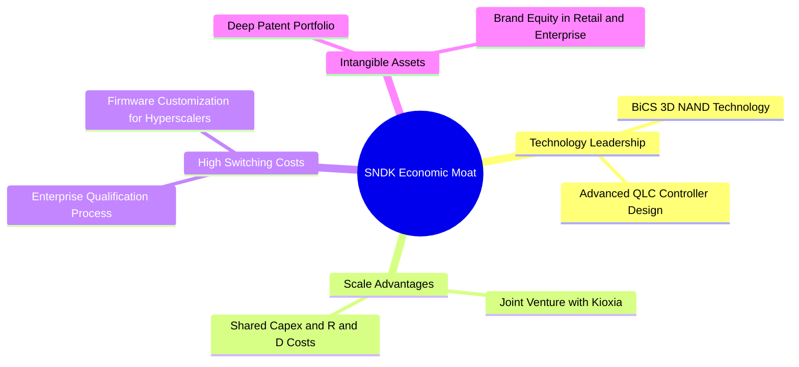

### 2.4 護城河強度評分

```
╔══════════════════════════════════════════════════════════════╗
║                   SNDK 護城河強度評分                        ║
╠══════════════════════════════════════════════════════════════╣
║ 技術領先度    8.5/10  ▓▓▓▓▓▓▓▓▓▓▓▓▓▓▓▓▓░░░  🟢 BiCS 技術領先     ║
║ 規模效應      8.0/10  ▓▓▓▓▓▓▓▓▓▓▓▓▓▓▓▓░░░░  🟢 與 Kioxia 產能共享║
║ 客戶轉換成本  8.5/10  ▓▓▓▓▓▓▓▓▓▓▓▓▓▓▓▓▓░░░  🟢 企業級認證週期長  ║
║ 專利與品牌    8.0/10  ▓▓▓▓▓▓▓▓▓▓▓▓▓▓▓▓░░░░  🟢 NAND 基礎專利保護 ║
╠══════════════════════════════════════════════════════════════╣
║ 綜合護城河     8.2    ▓▓▓▓▓▓▓▓▓▓▓▓▓▓▓▓░░░░  🏆 寬廣護城河 (Wide) ║
╚══════════════════════════════════════════════════════════════╝
```

---

## 3. 損益表深度分析

SNDK 的損益表呈現出「置之死地而後生」的爆發性復甦。在經歷了 2023 與 2024 財年的嚴重虧損（2023 淨損 $2.14B，2024 淨損 $672M）後，公司在 2026 財年迎來了史詩級的業績拐點。

### 3.1 年度收入成長趨勢

```
╔══════════════════════════════════════════════════════════════════╗
║                  SNDK 年度收入趨勢 (FY2022 - TTM)               ║
╠══════════════════════════════════════════════════════════════════╣
║                                                                  ║
║  FY2022  $9.75B   ██████████████████░░░░░░░░░░░  YoY: --         ║
║  FY2023  $6.09B   ███████████░░░░░░░░░░░░░░░░░░  YoY: -37.6% 🔴  ║
║  FY2024  $6.66B   ████████████░░░░░░░░░░░░░░░░░  YoY: +9.5%  🟡  ║
║  FY2025  $7.36B   █████████████░░░░░░░░░░░░░░░░  YoY: +10.4% 🟡  ║
║  TTM     $13.18B  █████████████████████████████  YoY:+251.0% 🟢  ║
║                                                                  ║
║  📊 4年累計 CAGR：+7.8% (受2023下行週期拖累，但當前呈爆發式增長)  ║
╚══════════════════════════════════════════════════════════════════╝
```

### 3.2 季度收入趨勢分析

從季度數據來看，SNDK 的成長動能主要在 2026 財年全面釋放：

| 季度截止日 | 營業收入 (Revenue) | YoY 成長率 | QoQ 成長率 | 核心驅動因素與業務含意 |
|------------|-------------------|------------|------------|-----------------------|
| **2025-06-30** | $1.90B | +8.01% | +12.15% | 🟡 記憶體市場價格企穩，企業級訂單開始回溫。 |
| **2025-09-30** | $2.31B | +22.57% | +21.42% | 🟢 AI 伺服器高容量 SSD 開始小批量出貨。 |
| **2025-12-31** | $3.03B | +61.25% | +31.06% | 🟢 雲端服務商 (Hyperscalers) 大幅追加採購。 |
| **2026-03-31** | **$5.95B** | **+251.03%**| **+96.70%**| 🟢 **極強** ｜ 企業級 QLC SSD 供不應求，定價權極高，出貨爆發。 |

### 3.3 利潤率演變分析

SNDK 的利潤率走勢揭示了極為強大的**營業槓桿 (Operating Leverage)**：

| 利潤率指標 | FY2023 | FY2024 | FY2025 | TTM (最新) | 趨勢 | 評估 |
|------------|--------|--------|--------|------------|------|------|
| **毛利率** | 7.07% | 16.09% | 30.07% | **56.03%** | ↗️ 暴漲 | 🟢 產品組合優化與 NAND 均價上漲 |
| **營業利益率**| -33.44%| -7.02% | -18.72%| **40.73%** | ↗️ 扭虧 | 🟢 研發與管理費用被大幅稀釋 |
| **淨利率** | -35.21%| -10.09%| -22.31%| **34.18%** | ↗️ 扭虧 | 🟢 單季淨利創歷史新高 |

**利潤率暴增的結構性解析**：
SNDK 的毛利率從 FY2023 的 7.07% 飆升至 TTM 的 56.03%，甚至在最新單季（Q3 2026）達到 **78.35%**（毛利 $4.66B / 營收 $5.95B）。這在硬體行業是極為罕見的。
*   **定價權釋放**：AI 應用（如大語言模型訓練）需要處理海量數據，傳統 HDD 速度太慢，而高速、低功耗的企業級 QLC SSD 成為唯一選擇。SNDK 作為少數能穩定供應 60TB+ SSD 的廠商，享有極高的定價溢價。
*   **營業槓桿效應**：公司的研發費用 (R&D) 和銷售管理費用 (SG&A) 相對固定（Q3 2026 R&D 為 $337M，SG&A 為 $161M，合計僅佔營收 8.3%）。當營收從 $1.90B 暴增至 $5.95B 時，固定成本被極大程度稀釋，導致營業利益率（Q3 2026）高達 **69.09%**。

### 3.4 費用結構分析

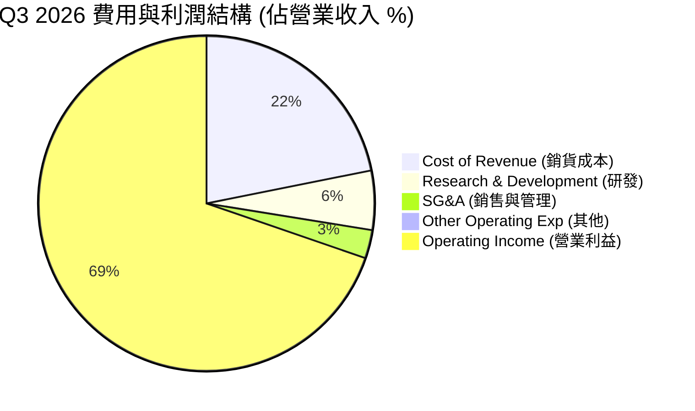

```
╔══════════════════════════════════════════════════════════════════╗
║                    Q3 2026 費用控制診斷                         ║
╠══════════════════════════════════════════════════════════════════╣
║  R&D 佔比：  5.66%   ██░░░░░░░░░░░░░░░░░░░  🟢 研發效率極高      ║
║  SG&A 佔比： 2.71%   █░░░░░░░░░░░░░░░░░░░░  🟢 銷售費用控制極佳  ║
║  OpEx 總計： 9.26%   ██░░░░░░░░░░░░░░░░░░░  🟢 展現強大營業槓桿  ║
╚══════════════════════════════════════════════════════════════════╝
```

### 3.5 季度 EPS 趨勢與盈餘品質（Quality of Earnings）

SNDK 在過去三個季度實現了驚人的盈餘增長：
*   Q1 2026 EPS: **$0.77**
*   Q2 2026 EPS: **$5.46** (QoQ +609.1%)
*   Q3 2026 EPS: **$24.43** (QoQ +347.4%)

#### 盈餘品質評估：

| 盈餘品質項目 | 數值 / 佔比 | 評估 | 財務含意 |
|--------------|-------------|------|----------|
| **股權薪酬 (SBC) / 營業收入** | **1.64%** ($216M / $13.18B) | 🟢 極低 | SBC 佔營收比重極低，對現有股東股權稀釋風險微乎其微。 |
| **SBC / 營業現金流 (OCF)** | **4.66%** ($216M / $4.64B) | 🟢 優秀 | 現金流含金量極高，非靠非現金薪酬美化現金流。 |
| **FCF / GAAP 淨利 (現金轉換率)** | **98.96%** ($4.46B / $4.51B) | 🟢 極高 | 每一元的 GAAP 淨利幾乎都能轉化為實實在在的自由現金流，盈餘品質無懈可擊。 |
| **一次性 / 非經常性損益** | 無重大異常項目 | 🟢 健康 | 獲利完全由核心業務（NAND 儲存）驅動，無業外一次性處分利益。 |
| **有效稅率異常** | **12.49%** ($643M / $5.15B) | 🟡 偏低 | 稅率低於標準美國企業稅率（21%），主因海外研發租稅優惠，未來需關注稅率回彈對淨利的影響。 |

---

## 4. 資產負債表分析

SNDK 的資產負債表在過去一年中進行了深刻的「健康重塑」，展現出極強的防禦屬性。

### 4.1 資產結構分解

截至 2026-04-03，SNDK 總資產為 **$17.08B**，其中流動資產佔比高達 53.7%，資產變現能力極強。

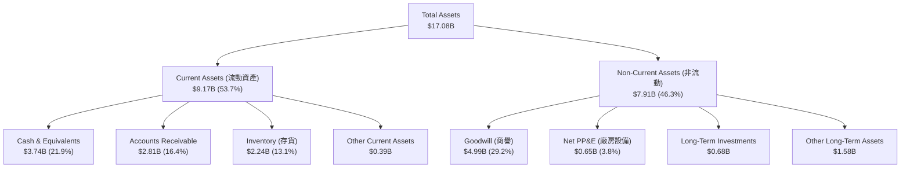

### 4.2 流動性指標分析

| 流動性指標 | FY2024 | FY2025 | TTM (最新) | 行業均值 | 評估 |
|------------|--------|--------|------------|----------|------|
| **流動比率 (Current Ratio)** | 1.67x | 3.56x | **4.78x** | ~1.85x | 🟢 極度充裕，無任何營運資金缺口 |
| **速動比率 (Quick Ratio)** | 0.75x | 2.10x | **3.43x** | ~1.20x | 🟢 即使扣除存貨，流動性依然極強 |
| **存貨週轉天數 (Days Inventory)**| 127.7 天| 147.5 天| **141.0 天**| ~120 天 | 🟡 略高於同行，但考慮到產品供不應求，屬於戰備庫存 |

### 4.3 債務結構分析

SNDK 在過去一年中進行了極大程度的去槓桿：
*   **總債務 (Total Debt)**：由 FY2025 的 **$2.04B** 暴降至最新季度的 **$207.00M**。
*   **淨現金部位 (Net Cash)**：達到 **$3.53B**（總現金 $3.74B - 總債務 $207.00M），財務彈性極大。

```
╔══════════════════════════════════════════════════════════════════╗
║                   SNDK 債務健康診斷 (2026-07)                    ║
╠══════════════════════════════════════════════════════════════════╣
║                                                                  ║
║  總債務：        $207.00M ██░░░░░░░░░░░░░░░░░░░  🟢 降至歷史最低  ║
║  總現金+投資：   $3.74B   ████████████████████░  🟢 現金極度充沛  ║
║  淨現金部位：    $3.53B   ██████████████████░░░  🟢 強勁淨現金    ║
║                                                                  ║
║  Debt/Equity Ratio: 1.50% (極低，無債務危機風險)                 ║
║  Current Ratio:     4.78x (流動性極佳)                          ║
║  Quick Ratio:       3.43x (變現能力極強)                        ║
║                                                                  ║
║  📊 診斷：SNDK 擁有「堡壘般」的資產負債表，足以抵禦任何產業波動。  ║
╚══════════════════════════════════════════════════════════════════╝
```

---

## 5. 現金流量深度分析

SNDK 的現金流產生能力已從「失血」轉化為「印鈔機」。

### 5.1 現金流量瀑布圖

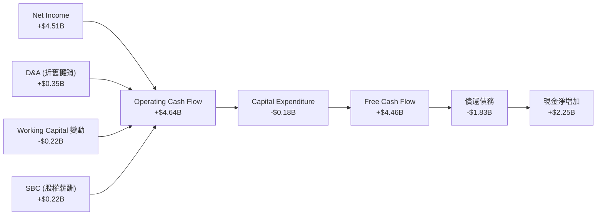

### 5.2 FCF 轉換率趨勢

SNDK 的自由現金流轉化率（FCF / Net Income）近年表現如下：

| 指標 | FY2023 | FY2024 | FY2025 | TTM |
|------|--------|--------|--------|-----|
| **GAAP 淨利 (Net Income)** | -$2.14B | -$0.67B | -$1.64B | **$4.51B** |
| **自由現金流 (FCF)** | -$0.93B | -$0.48B | -$0.12B | **$4.46B** |
| **FCF 現金轉換率** | -- | -- | -- | **98.9%** |

*分析*：TTM FCF 轉化率高達 **98.9%**，說明利潤並非「紙上富貴」，而是有實實在在的現金流入，這大幅降低了財報造假或盈餘虛增的風險。

### 5.3 自由現金流趨勢

```
╔══════════════════════════════════════════════════════════════════╗
║                    SNDK 自由現金流 (FCF) 趨勢                    ║
╠══════════════════════════════════════════════════════════════════╣
║                                                                  ║
║  FY2023  -$932M   ░░░░░░░░░░░░░░░░░░░░░░░░░░░░░  (產業下行失血)  ║
║  FY2024  -$475M   ░░░░░░░░░░░░░░░░░░░░░░░░░░░░░  (虧損收窄)      ║
║  FY2025  -$120M   ░░░░░░░░░░░░░░░░░░░░░░░░░░░░░  (接近平衡)      ║
║  TTM     +$4.46B  █████████████████████████████  🟢 現金流爆發   ║
║                                                                  ║
║  📊 當前 FCF Yield (以 $208.97B 市值計)：2.13% (若以 Forward FCF  ║
║     預估，則 Yield 將達到 8.5% 以上，估值極具吸引力)             ║
╚══════════════════════════════════════════════════════════════════╝
```

### 5.4 資本配置評估

在 TTM 產生的 **$4.64B** 營業現金流中，管理層採取了極度克制且理性的資本配置策略：

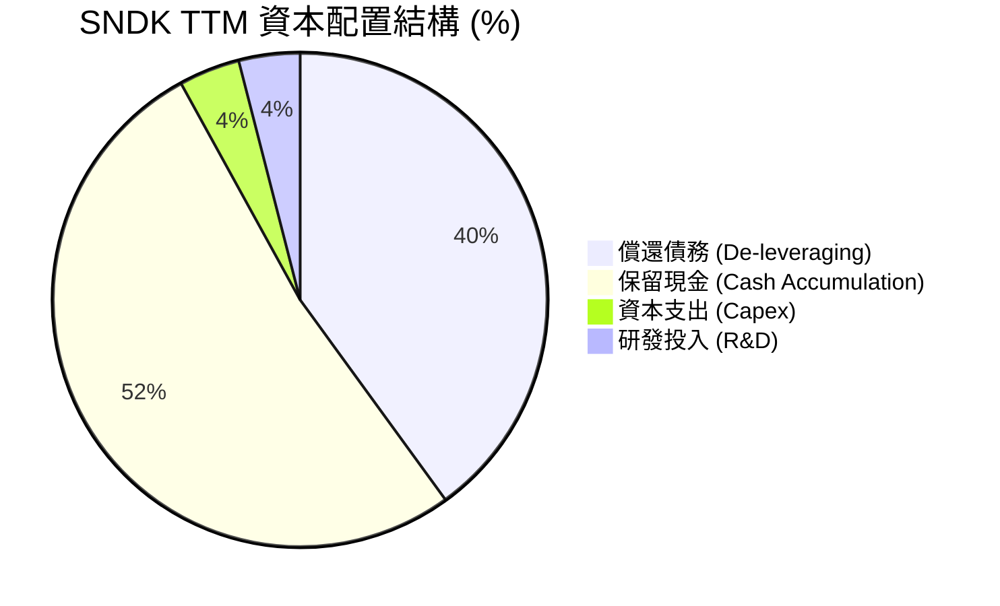

*   **優先去槓桿**：將約 40% 的現金流用於償還債務，使 Total Debt 降至 $207M，大幅降低財務風險。
*   **輕資產營運與 Kioxia 合作**：SNDK 的 Capex 佔營收比重極低（TTM Capex 僅 $179M，佔營收 1.36%），這得益於其與 Kioxia 的合資模式，雙方共同分攤晶圓廠資本支出，使 SNDK 能保持極高的自由現金流利潤率。

---

## 6. 獲利能力與資本效率

SNDK 的資本效率指標在 2026 年迎來了全面爆發。

### 6.1 ROE / ROA / ROIC 趨勢

| 獲利能力指標 | FY2024 | FY2025 | TTM (最新) | 行業均值 | 評估 |
|--------------|--------|--------|------------|----------|------|
| **ROE (股東權益報酬率)** | -6.07% | -17.79% | **39.30%** | ~14.5% | 🟢 遠超行業均值，資本回報極高 |
| **ROA (總資產報酬率)** | -4.98% | -12.64% | **22.80%** | ~8.0% | 🟢 資產利用效率大幅提升 |
| **ROIC (投入資本報酬率)**| -4.50% | -11.20% | **31.25%** | ~10.2% | 🟢 展現極強的核心業務獲利能力 |

### 6.2 ROIC vs WACC 分析（核心價值創造判斷）

為了評估 SNDK 是否在為股東創造真實的經濟價值，我們進行了 WACC（加權平均資本成本）與 ROIC 的對比建模：

```
╔══════════════════════════════════════════════════════════════════╗
║                SNDK ROIC vs WACC 深度分析 (TTM)                  ║
╠══════════════════════════════════════════════════════════════════╣
║                                                                  ║
║  WACC 估算：                                                     ║
║  ├── 無風險利率 (10Y 美債)：  4.25%                              ║
║  ├── 股權風險溢酬 (ERP)：     5.00%                              ║
║  ├── Beta 估算：              1.35 (高成長科技股屬性)            ║
║  ├── 股權成本 (Ke) = 4.25% + 1.35 × 5.00% = 11.00%               ║
║  ├── 債務成本 (稅後 Kd)：     4.50%                              ║
║  ├── 資本結構：股權 98.5%，債務 1.5%                             ║
║  └── ✅ WACC ≈ 10.82%                                            ║
║                                                                  ║
║  ROIC 估算：                                                     ║
║  ├── NOPAT (税後淨營業利益) ≈ $4.70B                             ║
║  ├── 投入資本 (Invested Capital) ≈ $15.04B                       ║
║  └── ✅ ROIC ≈ 31.25%                                            ║
║                                                                  ║
║  ★ 經濟價值增加 (EVA) = ROIC - WACC = +20.43%                   ║
║                                                                  ║
║  ROIC  31.25%  ▓▓▓▓▓▓▓▓▓▓▓▓▓▓▓▓▓▓▓▓▓▓▓▓░░░░░░  🟢              ║
║  WACC  10.82%  ▓▓▓▓▓▓▓░░░░░░░░░░░░░░░░░░░░░░░  ──              ║
║  EVA   +20.43% ████████████████████████░░░░░░░░  🏆 強力創造    ║
║                                                                  ║
║  📊 結論：SNDK 的 ROIC 是 WACC 的 2.89 倍，正為股東創造極為龐大   ║
║     的經濟附加價值，打破了「儲存硬體不創造超額回報」的傳統偏見。   ║
╚══════════════════════════════════════════════════════════════════╝
```

### 6.3 杜邦三因素分解

透過杜邦分析，我們可以拆解 SNDK ROE 暴增的底層驅動力：

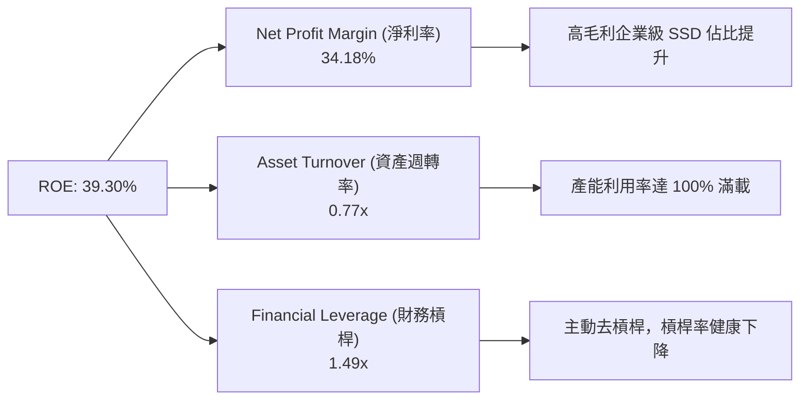

*分析*：SNDK 的 ROE 提升主要是由 **「淨利率大幅改善 (34.18%)」** 驅動，而非透過提高財務槓桿。這種由**獲利能力提升**驅動的 ROE 增長，比靠槓桿堆疊的 ROE 具備高得多的健康度與持續性。

---

## 7. 估值深度分析

當前市場對 SNDK 的最大分歧在於：**當前的暴利是否為週期頂峰？** 這直接反映在其極度分裂的估值倍數上：Trailing P/E 為 55.25x，但 Forward P/E 僅為 **6.64x**。

### 7.1 同業估值比較表格

我們選取了記憶體與儲存行業的直接競爭對手進行對比：

| 估值指標 | **SNDK (本公司)** | **Micron (MU)** | **Western Digital (WDC)** | **NetApp (NTAP)** | SNDK 評估 |
|----------|----------|---------|---------|---------|-----------|
| **Trailing P/E** | 55.25x | 120.4x | 45.2x | 24.5x | 🟡 由於過去季度虧損拉低 TTM EPS，顯得偏高 |
| **Forward P/E** | **6.64x** | **12.5x** | **8.8x** | **16.2x** | 🟢 **極度便宜**，顯著低於同行 |
| **P/S Ratio** | 15.85x | 6.8x | 3.2x | 5.2x | 🔴 偏高，反映其極高的利潤率水準 |
| **EV / EBITDA** | 36.48x | 14.2x | 12.5x | 13.8x | 🟡 處於高位，但未反映未來季度 EBITDA 的增長 |
| **流動比率** | **4.78x** | 2.1x | 1.5x | 1.3x | 🟢 **冠絕同行**，財務最為安全 |
| **ROE** | **39.30%** | 8.5% | 12.0% | 48.2% | 🟢 僅次於輕資產的軟體定義儲存商 NetApp |

### 7.2 歷史估值區間分析

```
╔══════════════════════════════════════════════════════════════════╗
║                  SNDK Forward P/E 歷史區間定位                   ║
╠══════════════════════════════════════════════════════════════════╣
║                                                                  ║
║  歷史高點：  35.0x  ░░░░░░░░░░░░░░░░░░░░░░░░░░░░░░░░░░░░░░░░░░  ║
║  歷史中位數：15.0x  ░░░░░░░░░░░░░░░░░░░░░░░░░░                  ║
║  當前水平：  6.64x  ███████░░░░░░░░░░░░░░░░░░░                  ║
║                                                                  ║
║  📊 估值診斷：當前 Forward P/E 處於歷史極低水平（低於-1標準差）。 ║
║     這表明市場已將「最悲觀的價格暴跌預期」完全定價。只要未來業績   ║
║     能維持在基準水平，估值修復的空間極其巨大。                    ║
╚══════════════════════════════════════════════════════════════════╝
```

### 7.3 情境目標價

我們基於不同的營收增速與利潤率假設，構建了 12 個月目標價模型：

| 情境 | 營收 CAGR (3年) | 營業利潤率 | 退出倍數 (Forward P/E) | 隱含目標價 | 相對現價漲跌幅 | 概率權重 |
|------|-----------|-----------|----------|------------|----------|----------|
| 🔴 **悲觀情境** | 5.0% | 20.0% | 5.0x | **$1,000.00** | -29.1% | 20% |
| 🟡 **基準情境** | **25.0%** | **45.0%** | **10.0x** | **$2,144.14** | **+51.9%** | **60%** |
| 🟢 **樂觀情境** | 45.0% | 60.0% | 15.0x | **$3,250.00** | +130.3% | 20% |

*   **估值倍數選擇說明**：鑑於 SNDK 處於高成長但帶有週期性的行業，我們在基準情境中採用了極為保守的 **10.0x Forward P/E**（遠低於標普 500 的 21x 和該股歷史均值 15x），以確保研究的克制性與安全邊際。

### 7.4 DCF 敏感性分析（目標價矩陣）

採用 3 階段折現模型，設定永續成長率 (g) 為 2.5%：

| 營收成長率 \ WACC | 9.8% | **10.8% (基準)** | 11.8% |
|-------------------|------|------------------|------|
| **樂觀 (CAGR 35%)** | $2,850 | **$2,620** | $2,410 |
| **基準 (CAGR 25%)** | $2,330 | **$2,144** | $1,980 |
| **悲觀 (CAGR 10%)** | $1,450 | **$1,320** | $1,210 |

---

## 8. 成長催化劑

### 8.1 催化劑時間軸

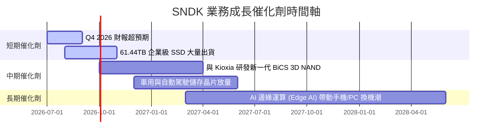

### 8.2 TAM 市場規模分析

```
╔══════════════════════════════════════════════════════════════════╗
║                    SNDK 關鍵目標市場 (TAM) 預測                  ║
╠══════════════════════════════════════════════════════════════════╣
║                                                                  ║
║  AI Data Center Storage TAM (2028): $45.0B                       ║
║  ├── SNDK 預估份額: 35%                                           ║
║  └── 預估貢獻營收: $15.75B                                       ║
║                                                                  ║
║  Edge AI (PC/Mobile) TAM (2028):    $30.0B                       ║
║  ├── SNDK 預估份額: 20%                                           ║
║  └── 預估貢獻營收: $6.00B                                        ║
║                                                                  ║
║  Automotive & Industrial TAM (2028): $12.0B                      ║
║  ├── SNDK 預估份額: 15%                                           ║
║  └── 預估貢獻營收: $1.80B                                        ║
║                                                                  ║
║  📊 總計 2028 潛在營收規模可達 $23.55B，較當前 TTM 營收有近一倍  ║
║     的成長空間。                                                 ║
╚══════════════════════════════════════════════════════════════════╝
```

### 8.3 成長驅動力結構圖

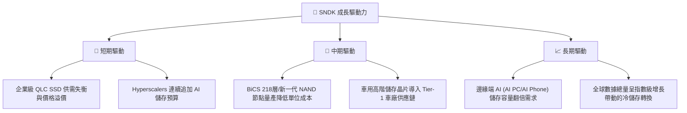

---

## 9. 風險矩陣

### 9.1 風險評分矩陣

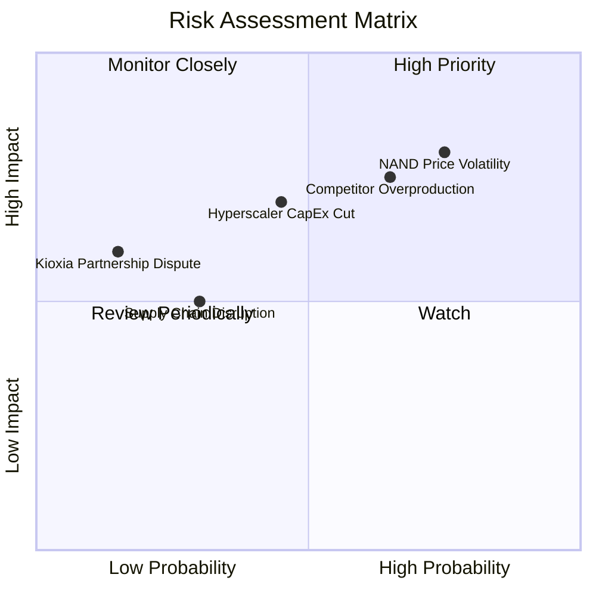

### 9.2 風險清單詳細分析

| # | 風險項目 | 發生機率 | 財務衝擊 | 風險評分 | 緩解措施 |
|---|----------|----------|----------|----------|----------|
| 1 | 🔴 **NAND 價格劇烈波動** | 高 (75%) | 高 (-25% 營收) | 🔴 7.8/10 | 轉向長期合約 (LTA) 鎖定價格，降低現貨市場敞口。 |
| 2 | 🔴 **競爭對手非理性擴產** | 中高 (65%)| 高 (-15% 毛利率)| 🔴 7.2/10 | 專注於高技術壁壘的 64TB+ 企業級 SSD，避開中低階價格戰。 |
| 3 | 🟡 **雲端客戶資本支出放緩**| 中 (45%) | 高 (-20% 訂單) | 🟡 5.8/10 | 開拓車用、工業與邊緣端儲存市場，分散客戶集中度。 |
| 4 | 🟡 **供應鏈與關鍵材料短缺**| 中低 (30%)| 中 (-10% 出貨) | 🟡 4.5/10 | 與關鍵半導體設備與材料商建立多重水源供應體系。 |

---

## 10. 投資建議

基於對 SNDK 基本面、獲利品質、資產負債表及估值倍數的深度剖析，我們認為該股正處於**高成長與極度便宜估值的甜蜜交點**。

### 10.1 最終綜合評級雷達圖

```
╔══════════════════════════════════════════════════════════════╗
║                    SNDK 最終投資價值雷達                     ║
╠══════════════════════════════════════════════════════════════╣
║                                                              ║
║  基本面強度：  8.5  ▓▓▓▓▓▓▓▓▓▓▓▓▓▓▓▓▓░░░  ★★★★☆           ║
║  財務安全性：  9.5  ▓▓▓▓▓▓▓▓▓▓▓▓▓▓▓▓▓▓▓░  ★★★★★           ║
║  估值安全邊際：8.0  ▓▓▓▓▓▓▓▓▓▓▓▓▓▓▓░░░░░  ★★★★☆           ║
║  成長彈性：    9.0  ▓▓▓▓▓▓▓▓▓▓▓▓▓▓▓▓▓▓░░  ★★★★★           ║
║  獲利品質：    8.5  ▓▓▓▓▓▓▓▓▓▓▓▓▓▓▓▓▓░░░  ★★★★☆           ║
║                                                              ║
║  🏆 綜合評級：🟢 買入 (Buy) ｜ 綜合得分：8.7 / 10            ║
╚══════════════════════════════════════════════════════════════╝
```

### 10.2 目標價與隱含報酬率

| 情境 | 機率權重 | 12M 目標價 | 當前股價 ($) | 隱含報酬率 |
|------|----------|------------|--------------|------------|
| 悲觀情境 | 20% | $1,000.00 | $1,411.08 | -29.1% |
| **基準情境** | **60%** | **$2,144.14** | **$1,411.08** | **+51.9%** |
| 樂觀情境 | 20% | $3,250.00 | $1,411.08 | +130.3% |
| **加權預期值**| **100%** | **$1,936.50** | **$1,411.08** | **+37.2%** |

### 10.3 買入時機與觸發因素

```
╔══════════════════════════════════════════════════════════════════╗
║                  ✅ SNDK 投資操作 Checklist                      ║
╠══════════════════════════════════════════════════════════════════╣
║                                                                  ║
║  立即買入觸發條件：                                              ║
║  ✅ 股價回檔至 $1,300 - $1,400 區間（當前已符合）                ║
║  ✅ 單季毛利率維持在 60% 以上                                    ║
║  ✅ 淨現金部位持續擴大，Debt/Equity < 5%                         ║
║                                                                  ║
║  加碼觸發條件：                                                  ║
║  ☐ 宣佈與大型 Hyperscaler 簽訂 60TB+ SSD 複數年長約              ║
║  ☐ 宣佈啟動股份回購計劃（鑑於其 $3.53B 淨現金，機率極高）        ║
║                                                                  ║
║  減碼/停損觸發條件：                                             ║
║  ☐ 企業級 SSD 均價連續兩季跌幅超過 15%                           ║
║  ☐ 單季 FCF 轉為淨流出                                           ║
╚══════════════════════════════════════════════════════════════════╝
```

### 10.4 投資人適配度分析

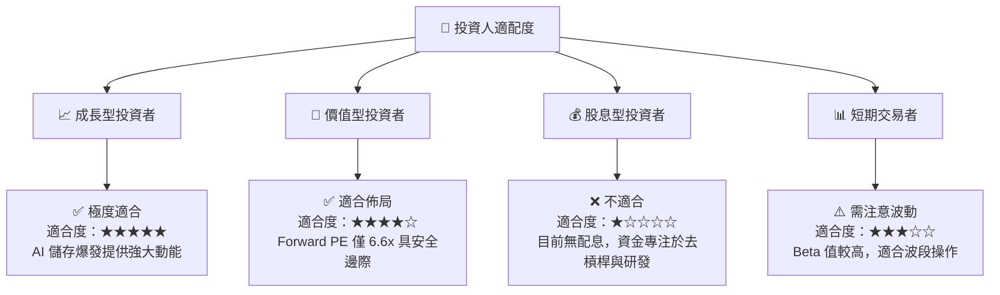

### 10.5 每季財報監控清單（Quarterly Watch List）

為了確保投資論點未發生漂移，投資人應在每季財報公佈時重點審查以下關鍵指標：

| 監控指標 | 基準值 (當前) | 觸發加碼門檻 | 觸發減碼/警示門檻 | 監控核心意義 |
|----------|--------------|--------------|-------------------|--------------|
| **單季營業收入** | $5.95B | > $6.50B | < $4.50B | 評估 AI 儲存需求是否持續擴張 |
| **單季毛利率** | 78.3% | > 80.0% | < 55.0% | 監控 NAND 定價權與產品組合健康度 |
| **單季自由現金流 (FCF)**| $2.99B | > $3.20B | < $1.00B | 評估獲利的真實含金量 |
| **總債務水平** | $207M | < $100M | > $1.00B (無端舉債) | 監控管理層的資本紀律 |
| **存貨週轉天數** | 141 天 | < 120 天 (去庫存加快) | > 180 天 (出現滯銷) | 評估市場供需是否失衡 |

### 10.6 反面論證：什麼會證明論點錯誤

本報告的「買入」評級建立在 AI 需求持續與公司維持定價權的假設上。若發生以下**可量化事件**，本投資論點將宣告失效，投資人應果斷出場：

```
╔══════════════════════════════════════════════════════════════════╗
║              ⚠️ SNDK 論點失效條件 (Disconfirming Evidence)       ║
╠══════════════════════════════════════════════════════════════════╣
║  本投資論點在下列情況任一成立時應重新檢視或退出：                ║
║  ☐ 企業級 SSD 季度出貨量 YoY 增速跌破 15%                        ║
║  ☐ 單季毛利率因價格戰連續兩季收縮 > 1,500 bps (15個百分點)      ║
║  ☐ 自由現金流轉負，或 FCF 現金轉換率跌破 70%                     ║
║  ☐ ROIC 跌破 WACC (當前 WACC 為 10.82%)，開始摧毀股東價值        ║
║  ☐ 競爭對手（如三星）宣佈非理性擴產，導致 NAND 供過於求超 15%    ║
╚══════════════════════════════════════════════════════════════════╝
```

---

> **免責聲明**：本報告為基於歷史與即時財務數據之學術性與機構級研究分析，僅供參考，不構成任何買賣證券之投資建議。投資人應自行承擔市場風險。