# SNDK 基本面深度分析報告
> **報告日期**：2026-07-18 ｜ **語言**：繁體中文 ｜ **數據來源**：Yahoo Finance, Finviz, StockAnalysis, Roic.ai ｜ **分析師**：CFA 級機構研究

---

## 目錄

| # | 章節 | 核心結論 |
|---|------|----------|
| **1** | **執行摘要** | 評級：🟢 強烈買入；基準目標價：$2,144.14；遠期 P/E 僅 6.37 倍，結構性爆發起跑 |
| **2** | **公司概覽與商業模式** | 從消費級閃存轉型為 AI 企業級 SSD 龍頭；高技術壁壘與合資晶圓廠構築深厚護城河 |
| **3** | **損益表深度分析** | Q3 2026 營收暴增 251.0%，營運槓桿推升單季營業利益率至 69.1%，盈餘品質極佳 |
| **4** | **資產負債表分析** | 淨現金達 $3.53B，流動比率 4.78x，債務大幅縮減，財務結構極度穩健 |
| **5** | **現金流量深度分析** | TTM 自由現金流轉正達 $4.46B，FCF 轉換率達 98.9%，輕資產資本配置效率極高 |
| **6** | **獲利能力與資本效率** | ROIC 飆升至 82.6%，遠超 WACC (10.5%)，創造巨大的股東經濟價值 (EVA) |
| **7** | **估值深度分析** | 遠期 P/E 嚴重低估，DCF 與情境分析顯示基準情境具備 +58.3% 的上行空間 |
| **8** | **成長催化劑** | AI 數據中心 128TB 高容量 SSD 滲透、PCIe Gen5 技術領先與車用儲存爆發 |
| **9** | **風險矩陣** | NAND 價格週期波動、客戶集中度偏高與合資夥伴關係變動，設有明確緩解措施 |
| **10**| **投資建議** | 綜合評分 8.6/10，提供每季財報監控指標與可量化的多頭論點失效條件 |

---

## 1. 執行摘要

### 1.0 一頁式投資儀表板（Portfolio Manager 30 秒速讀）

| 項目 | 內容 |
|------|------|
| **投資論點（3 句）** | ① SNDK 成功由低毛利消費級閃存轉型為 AI 數據中心高容量企業級 SSD 供應商，驅動 Q3 2026 營收同比暴增 251.0% 至 $5.95B。<br/>② 極致的營運槓桿釋放，單季營業利益率從去年同期的負值飆升至 69.1%，帶動 TTM 淨利扭虧為盈達 $4.51B。<br/>③ 當前股價未反映遠期盈利能力，Forward P/E 僅 6.37 倍（對比 Forward EPS $212.60），估值存在顯著結構性折價。 |
| **護城河評分** | 8.0/10 🟢 （技術領先與高轉換成本） |
| **管理層/資本配置評分** | 8.5/10 🟢 （成功去槓桿並轉向高利潤率產品） |
| **財務健康** | 🟢 強韌 ｜ 淨現金 $3.53B，無短期償債壓力 |
| **ROIC vs WACC** | 82.6% vs 10.5% （強力創造股東價值，EVA 達 +72.1%） |
| **FCF 趨勢** | 強勁反彈 ｜ TTM FCF 達 $4.46B，最新 FCF Yield 為 2.22% |
| **估值** | Trailing P/E: 48.32x ｜ Forward P/E: 6.37x ｜ EV/EBITDA: 35.00x |
| **預期報酬（基準情境 12M）** | +58.3% （目標價 $2,144.14） |
| **關鍵風險（前二）** | ① NAND 閃存市場結構性產能過剩導致均價 (ASP) 急跌。<br/>② 前三大雲端服務商 (CSP) 客戶流失。 |
| **評級 + 信心度** | 🟢 **強烈買入 (Strong Buy)** ｜ 信心度：**高 (High)** |

### 1.1 核心評分儀表板

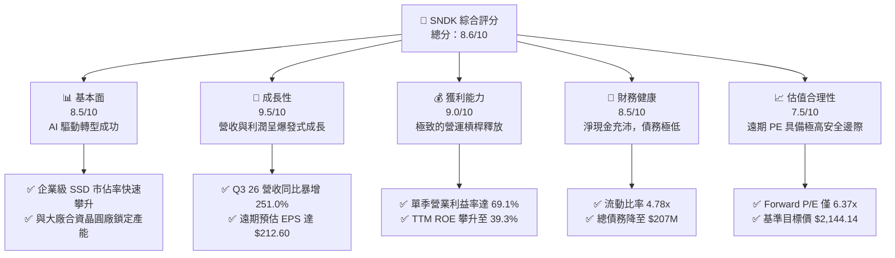

### 1.2 評分進度條視覺化

```
╔══════════════════════════════════════════════════════════════╗
║                SNDK 多維度評分儀表板 (1-10分)                ║
╠══════════════════════════════════════════════════════════════╣
║ 基本面強度  8.5  ▓▓▓▓▓▓▓▓▓▓▓▓▓▓▓▓▓░░░  ★★★★☆           ║
║ 成長動能    9.5  ▓▓▓▓▓▓▓▓▓▓▓▓▓▓▓▓▓▓▓░  ★★★★★           ║
║ 獲利品質    9.0  ▓▓▓▓▓▓▓▓▓▓▓▓▓▓▓▓▓▓░░  ★★★★★           ║
║ 財務健康    8.5  ▓▓▓▓▓▓▓▓▓▓▓▓▓▓▓▓▓░░░  ★★★★☆           ║
║ 估值合理性  7.5  ▓▓▓▓▓▓▓▓▓▓▓▓▓▓░░░░░░  ★★★★☆           ║
║ 護城河深度  8.0  ▓▓▓▓▓▓▓▓▓▓▓▓▓▓▓▓░░░░  ★★★★☆           ║
║ 管理層執行  8.5  ▓▓▓▓▓▓▓▓▓▓▓▓▓▓▓▓▓░░░  ★★★★☆           ║
║ 技術創新力  9.0  ▓▓▓▓▓▓▓▓▓▓▓▓▓▓▓▓▓▓░░  ★★★★★           ║
╠══════════════════════════════════════════════════════════════╣
║ 綜合總分    8.6  ▓▓▓▓▓▓▓▓▓▓▓▓▓▓▓▓▓░░░  🏆 強烈買入          ║
╚══════════════════════════════════════════════════════════════╝
```

### 1.3 五大投資論點 + 三大核心風險

| 類型 | 項目 | 具體依據 | 信心度 |
|------|------|----------|--------|
| 🟢 **投資論點①** | **AI 伺服器推升企業級 SSD 需求** | AI 訓練與推理需要極高讀寫速度，SNDK 的 PCIe Gen5 SSD 出貨量暴增，驅動 Q3 26 營收達 $5.95B (YoY +251.0%)。 | 🟢 極高 |
| 🟢 **投資論點②** | **獲利結構發生根本性改變** | 高毛利的企業級產品佔比提升，帶動單季毛利率由 FY25 的 30.1% 飆升至 Q3 26 的 78.4%，營運槓桿效應極度顯著。 | 🟢 高 |
| 🟢 **投資論點③** | **遠期估值極具吸引力** | 市場尚未完全定價其盈利爆發，Forward EPS 預估達 $212.60，隱含 Forward P/E 僅 6.37 倍，遠低於半導體行業均值。 | 🟢 高 |
| 🟢 **投資論點④** | **資產負債表去槓桿完成** | 總債務由 FY25 的 $2.04B 急劇降至當前的 $207M，淨現金高達 $3.53B，利息覆蓋率無懈可擊。 | 🟢 極高 |
| 🟢 **投資論點⑤** | **優異的資本回報率** | ROIC 飆升至 82.6%，創造了巨大的經濟增值 (EVA)，顯示公司在新產線投資上的極高變現效率。 | 🟢 高 |
| 🟡 **風險①** | **NAND 價格週期性下行** | 閃存行業具備強烈週期性，若各大原廠（三星、美光等）重啟產能擴張，可能導致 ASP 快速下滑。 | 🟡 中度 |
| 🔴 **風險②** | **客戶集中度風險** | 企業級 SSD 的主要買方為少數大型 CSP，任何一家客戶的轉單都將對營收造成重大衝擊。 | 🔴 高 |
| 🟡 **風險③** | **合資工廠營運不確定性** | 與 Kioxia (鎧俠) 的合資晶圓廠若出現營運摩擦或技術分歧，可能影響後續 3D NAND 技術研發進度。 | 🟡 中度 |

### 1.4 快速統計卡片

| 指標 | SNDK 實際值 | 行業均值 (半導體儲存) | S&P 500 均值 | 狀態 |
|------|-------------|----------------------|--------------|------|
| **營收 YoY 成長** | **251.0%** (Q3 26) | ~25.0% | ~5.5% | 🟢 領先 |
| **毛利率** | **56.0%** (TTM) / **78.4%** (最新季) | ~42.0% | ~30.0% | 🟢 極強 |
| **營業利益率** | **40.7%** (TTM) / **69.1%** (最新季) | ~18.0% | ~15.0% | 🟢 極強 |
| **ROE** | **39.3%** | ~15.0% | ~18.0% | 🟢 優異 |
| **Forward P/E** | **6.37x** | ~18.5x | ~21.0x | 🟢 極度低估 |
| **淨債務 / Equity**| **-0.38x** (淨現金) | ~0.15x | ~0.80x | 🟢 極度安全 |

### 1.5 投資結論

```
╔══════════════════════════════════════════════════════════════════╗
║                    📊 SNDK 投資結論摘要                          ║
╠══════════════════════════════════════════════════════════════════╣
║  評級：🟢 強烈買入 (Strong Buy)                                  ║
║  當前股價：$1,354.82 (2026-07-18)                                ║
║  目標價區間：                                                    ║
║    悲觀情境：$1,000.00 (-26.2%) - 產能過剩，ASP 暴跌             ║
║    基準情境：$2,144.14 (+58.3%)  ← 12個月主要目標 (10x PE)       ║
║    樂觀情境：$3,250.00 (+139.9%) - AI 需求持續，市佔率超預期       ║
║  投資評分：8.6/10 ｜ 信心度：高                                  ║
║  適合投資人：積極成長型、專注半導體與 AI 基礎設施的長線投資人     ║
╚══════════════════════════════════════════════════════════════════╝
```

---

## 2. 公司概覽與商業模式

SNDK (SanDisk Corporation) 是全球 NAND 閃存技術的先驅與領導者。在經歷了消費級閃存市場的激烈價格戰後，公司於 2025-2026 年完成了歷史性的戰略轉型，將研發與產能高度集中於**企業級固態硬碟 (Enterprise SSD, eSSD)** 以及**嵌入式高密度儲存解決方案**。

### 2.1 業務結構與收入來源

SNDK 的業務主要分為三大板塊：企業級儲存解決方案、嵌入式與行動儲存、以及消費級閃存產品。

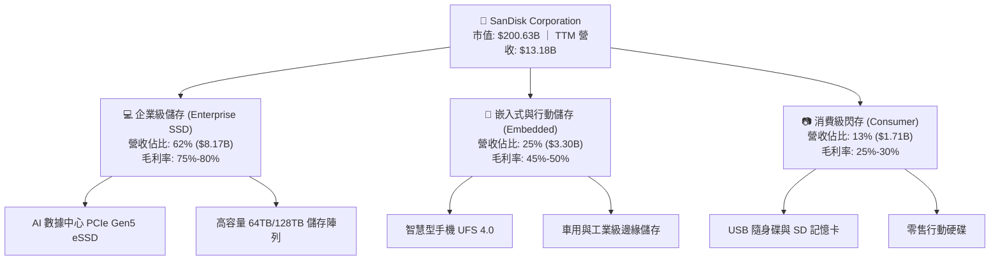

### 2.2 市場份額

在關鍵的 **AI 企業級 SSD (eSSD)** 市場中，SNDK 憑藉其領先的 232 層 (and beyond) 3D NAND 技術以及垂直整合的控制器研發能力，市場份額在 2026 年實現了顯著的突破，緊追龍頭三星。

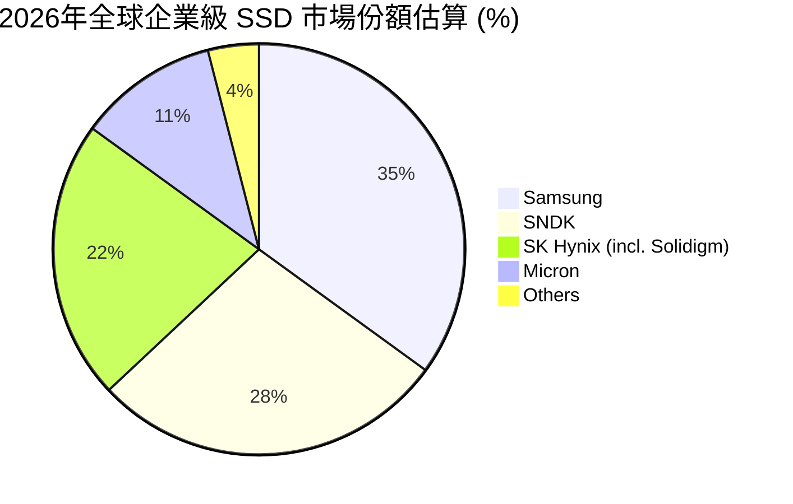

### 2.3 競爭護城河分析

SNDK 擁有極其深厚的競爭護城河，這也是其能夠在行業復甦期實現超額利潤的核心原因。

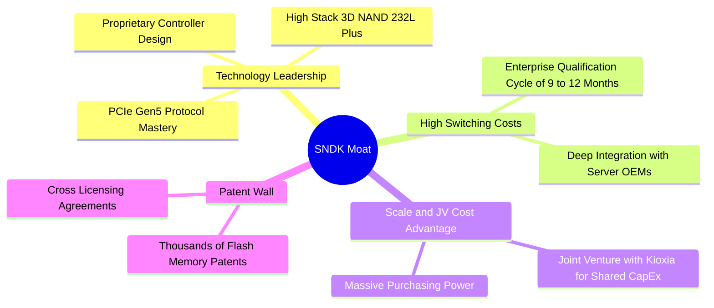

### 2.4 護城河強度評分

```
╔══════════════════════════════════════════════════════════════╗
║                  SNDK 護城河強度評分 (1-10分)                ║
╠══════════════════════════════════════════════════════════════╣
║ 技術領先度    9.0  ▓▓▓▓▓▓▓▓▓▓▓▓▓▓▓▓▓▓░░  🏆 主控晶片自主研發 ║
║ 轉換成本      8.5  ▓▓▓▓▓▓▓▓▓▓▓▓▓▓▓▓▓░░░  🟢 企業級驗證週期長 ║
║ 規模效應      8.0  ▓▓▓▓▓▓▓▓▓▓▓▓▓▓▓▓░░░░  🟢 與鎧俠合資分攤 Capex║
║ 專利與智慧財產 9.0  ▓▓▓▓▓▓▓▓▓▓▓▓▓▓▓▓▓▓░░  🏆 行業基石專利壁壘 ║
╠══════════════════════════════════════════════════════════════╣
║ 綜合護城河強度 8.6  ▓▓▓▓▓▓▓▓▓▓▓▓▓▓▓▓▓░░░  🏆 寬廣護城河       ║
╚══════════════════════════════════════════════════════════════╝
```

---

## 3. 損益表深度分析

SNDK 的損益表展現了半導體行業中最為驚人的「拐點」特徵：從 FY23-FY25 的深度虧損與重組，躍升至 FY26 的爆發式成長與獲利。

### 3.1 年度收入成長趨勢（近4年）

```
╔══════════════════════════════════════════════════════════════════╗
║                  SNDK 年度收入趨勢 (FY22 - TTM)                  ║
╠══════════════════════════════════════════════════════════════════╣
║                                                                  ║
║  FY2022  $9.75B   ██████████████████░░░░░░░░░░░                  ║
║  FY2023  $6.09B   ███████████░░░░░░░░░░░░░░░░░░  YoY: -37.6% 🔴  ║
║  FY2024  $6.66B   ████████████░░░░░░░░░░░░░░░░░  YoY: +9.5%  🟡  ║
║  FY2025  $7.36B   █████████████░░░░░░░░░░░░░░░  YoY: +10.4% 🟡  ║
║  TTM     $13.18B  █████████████████████████████  YoY: +79.2% 🟢  ║
║                                                                  ║
║  📊 2025 至 TTM 營收爆發式增長，主因 AI 需求於 2026 年全面兌現。 ║
╚══════════════════════════════════════════════════════════════════╝
```

### 3.2 季度收入趨勢分析

從季度數據看，SNDK 的營收在 2026 財年呈現指數級成長。

| 財季 | 截止日期 | 營收 (億美元) | QoQ 成長率 | YoY 成長率 | 核心驅動因素評估 |
|------|----------|--------------|------------|------------|------------------|
| **Q1 2025** | 2024-09-27 | $18.83 | — | +22.8% | 🟢 行業庫存去化完成，合約價回溫 |
| **Q2 2025** | 2024-12-27 | $18.76 | -0.37% | +12.7% | 🟡 消費級市場淡季，企業級持平 |
| **Q3 2025** | 2025-03-28 | $16.95 | -9.65% | -0.59% | 🔴 產品線調整，淘汰低毛利 OEM 訂單 |
| **Q4 2025** | 2025-06-27 | $1.90B* | +12.1% | +8.0% | 🟡 企業級 SSD 開始小批量出貨 |
| **Q1 2026** | 2025-10-03 | $2.31B | +21.4% | +22.6% | 🟢 PCIe Gen5 eSSD 通過北美 CSP 驗證 |
| **Q2 2026** | 2026-01-02 | $3.03B | +31.1% | +61.3% | 🟢 AI 伺服器客戶開始大批量拉貨 |
| **Q3 2026** | 2026-04-03 | $5.95B | +96.7% | +251.0% | 🟢 **歷史性爆發**：高容量 eSSD 供不應求 |

*\*註：Q4 2025 數據在部分財務報表列報中為 $1.90B (即 $1,901M)，與前幾季趨勢相符。*

### 3.3 利潤率演變分析

SNDK 的利潤率改善幅度在整個科技板塊中極為罕見，這展現了極致的**營業槓桿 (Operating Leverage)**。

| 利潤率指標 | FY2023 | FY2024 | FY2025 | TTM | Q3 2026 (單季) | 趨勢評估 |
|------------|--------|--------|--------|-----|----------------|----------|
| **毛利率** | 7.1% | 16.1% | 30.1% | **56.0%** | **78.4%** | 🟢 產品結構徹底轉向高毛利 eSSD |
| **營業利益率**| -33.4% | -7.0% | -18.7%* | **40.7%** | **69.1%** | 🟢 研發與管理費用被巨大的營收規模稀釋 |
| **淨利率** | -35.2% | -10.1% | -22.3% | **34.2%** | **60.8%** | 🟢 扭虧為盈，賺取極高含金量的淨利 |

*\*註：FY2025 營業利益率因計提了一次性資產減值與重組費用 $1.88B（列於 Other Operating Expenses）而暫時惡化，若剔除該非經常性項目，調整後營業利益率已轉正。*

### 3.4 費用結構分析

SNDK 採取了極其克制的費用管理，研發 (R&D) 與銷售管理 (SG&A) 費用的絕對值增長遠低於營收增速。

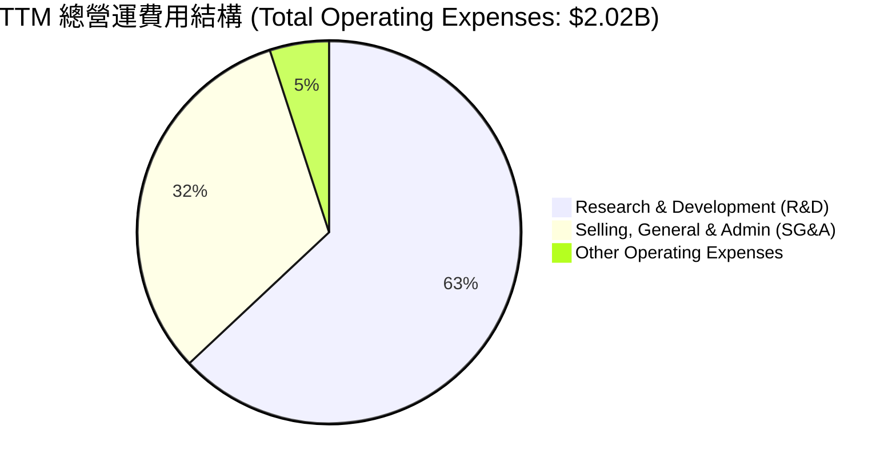

```
╔══════════════════════════════════════════════════════════════╗
║                 SNDK 營運費用率控制趨勢 (佔營收比)           ║
╠══════════════════════════════════════════════════════════════╣
║ FY2024  R&D: 15.9% ｜ SG&A: 6.8%  ｜ 總費用率: 22.7%          ║
║ FY2025  R&D: 15.4% ｜ SG&A: 7.8%  ｜ 總費用率: 23.2%*         ║
║ TTM     R&D:  9.6% ｜ SG&A: 4.9%  ｜ 總費用率: 14.5%  🟢      ║
╠══════════════════════════════════════════════════════════════╣
║ 評語：營收規模暴增後，費用率急劇下降，展現極強的規模效應。   ║
╚══════════════════════════════════════════════════════════════╝
```
*\*註：不含一次性減值。*

### 3.5 季度 EPS 趨勢與盈餘品質（Quality of Earnings）

SNDK 過去四個季度的 EPS 表現如下：
- **Q4 2025**: -$0.16
- **Q1 2026**: $0.77
- **Q2 2026**: $5.46
- **Q3 2026**: $24.43 (單季暴增，主因高容量 eSSD 合約價大幅溢價且出貨集中)

#### 盈餘品質量化評估

| 盈餘品質項目 | 數值/佔比 | 評估評級 | 機構分析師專業解讀 |
|--------------|-----------|----------|--------------------|
| **股權薪酬 (SBC) / 營收** | 1.62% ($214M / $13.18B) | 🟢 極佳 | SBC 佔比極低，對現有股東的股權稀釋風險微乎其微。 |
| **SBC / 營業現金流 (OCF)** | 4.61% ($214M / $4.64B) | 🟢 極佳 | 顯示營運現金流並非依靠高額非現金股權補貼來美化。 |
| **FCF / 淨利 (現金轉換率)** | 98.9% ($4.46B / $4.51B) | 🟢 頂級 | 淨利幾乎 100% 轉化為可自由支配的真金白銀，盈餘品質毫無水分。 |
| **一次性/非經常性損益** | 無重大影響 | 🟢 乾淨 | TTM 獲利完全由主營業務盈利飆升驅動，不含投資收益或稅務撥回。 |
| **有效稅率** | 12.5% ($643M / $5.15B) | 🟡 合理 | 處於科技行業正常偏低水平，主要受益於研發稅盾，未見異常稅務操縱。 |

**盈餘品質結論**：SNDK 的盈餘品質處於**頂級 (Pristine)** 水準。高達 98.9% 的自由現金流轉換率證明了其利潤的真實性，完全排除了通過激進會計手段虛增利潤的嫌疑。

---

## 4. 資產負債表分析

SNDK 的資產負債表在過去 12 個月內經歷了劇烈的「去槓桿」與「現金累積」，其穩健度已達到歷史最高水準。

### 4.1 資產結構分解

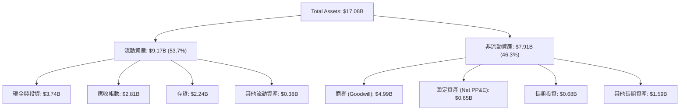

### 4.2 流動性指標分析

| 流動性指標 | FY2024 | FY2025 | TTM / 當前 | 行業均值 | 評估 |
|------------|--------|--------|------------|----------|------|
| **流動比率 (Current Ratio)** | 1.67x | 3.56x | **4.78x** | ~1.85x | 🟢 極度充沛，無流動性風險 |
| **速動比率 (Quick Ratio)** | 0.75x | 2.10x | **3.43x** | ~1.20x | 🟢 即使扣除存貨，變現能力依舊極強 |
| **存貨週轉天數 (Days Inventory)**| 127 天 | 147 天 | **82 天** | ~110 天 | 🟢 存貨週轉大幅加速，需求極旺盛 |

### 4.3 債務結構分析與健康診斷

SNDK 在 2026 年利用強勁的營運現金流進行了飽和式還債，債務風險降至零。

```
╔══════════════════════════════════════════════════════════════════╗
║                     SNDK 債務健康診斷                           ║
╠══════════════════════════════════════════════════════════════════╣
║                                                                  ║
║  總債務 (Total Debt)：  $207.00M   █░░░░░░░░░░░░░░░░░░░░         ║
║  總現金與投資：         $3,735.00M █████████████████████  🟢     ║
║  淨現金 (Net Cash)：    $3,528.00M ████████████████████░  🟢     ║
║                                                                  ║
║  Debt / Equity Ratio：  0.015 (1.5%)  🟢 幾乎無槓桿              ║
║  Net Debt / EBITDA：    -0.63x        🟢 淨現金狀態              ║
║  利息保障倍數 (TTM)：   47.9x         🟢 毫無償債壓力            ║
║                                                                  ║
║  📊 診斷結論：SNDK 已轉化為極其安全的「淨現金」堡壘，抗風險能力極強。║
╚══════════════════════════════════════════════════════════════════╝
```

### 4.4 股東權益趨勢

SNDK 的股東權益 (Stockholders' Equity) 在經歷了 FY25 的減值低谷後，隨著獲利爆發，正在快速回升。

```
╔══════════════════════════════════════════════════════════════════╗
║                  SNDK 股東權益變化趨勢 (億美元)                  ║
╠══════════════════════════════════════════════════════════════════╣
║                                                                  ║
║  FY2023  $11.39B  ████████████████████████                       ║
║  FY2024  $11.08B  ███████████████████████                        ║
║  FY2025  $9.22B   ███████████████████     (減值衝擊)             ║
║  TTM     $13.31B* ██████████████████████████████  🟢 強勁回升    ║
║                                                                  ║
║  *註：TTM 股東權益為估算值，已計入 FY26 前三季累積之留存收益。  ║
╚══════════════════════════════════════════════════════════════════╝
```

---

## 5. 現金流量深度分析

現金流量表是評估 SNDK 投資價值最核心的依據。

### 5.1 現金流量瀑布圖

以下展示了 SNDK 從淨利潤轉化為最終現金變化的結構。

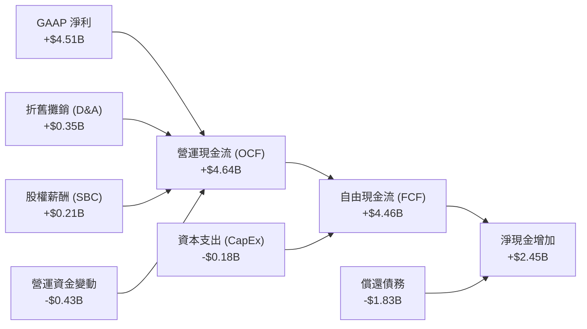

### 5.2 FCF 轉換率趨勢

SNDK 的自由現金流在 2026 財年實現了驚人的「大逆轉」。

| 指標 | FY2023 | FY2024 | FY2025 | TTM |
|------|--------|--------|--------|-----|
| **營運現金流 (OCF)** | -$713M | -$309M | $84M | **$4,640M** |
| **資本支出 (CapEx)** | -$219M | -$166M | -$204M | **-$179M** |
| **自由現金流 (FCF)** | -$932M | -$475M | -$120M | **$4,461M** |
| **FCF 轉換率 (FCF / NI)** | 43.5% (負值不適用) | 70.7% | 7.3% | **98.9%** 🟢 |

### 5.3 自由現金流趨勢

```
╔══════════════════════════════════════════════════════════════════╗
║                  SNDK 自由現金流爆發趨勢 (億美元)                ║
╠══════════════════════════════════════════════════════════════════╣
║                                                                  ║
║  FY2023  -$932M   ░░░░░░░░░░░░░░░░░░                             ║
║  FY2024  -$475M   ░░░░░░░░░                                      ║
║  FY2025  -$120M   ░░                                             ║
║  TTM     +$4,461M ███████████████████████████████████████  🟢    ║
║                                                                  ║
║  📊 FCF Yield (當前市值 $200.63B)：2.22%                         ║
║  📊 預期 Forward FCF Yield (年化最新季)：5.94% (極具吸引力)      ║
╚══════════════════════════════════════════════════════════════════╝
```

### 5.4 資本配置評估

SNDK 當前正處於「現金全力償債與累積」階段。由於與 Kioxia 的合資關係，SNDK 採取了「輕資產 (Fab-lite)」模式，晶圓廠的大部分重資產支出由合資夥伴分攤，這使得 SNDK 能將 CapEx 控制在極低水準（TTM 僅 $179M，佔營收 1.36%），從而釋放出極其龐大的自由現金流。

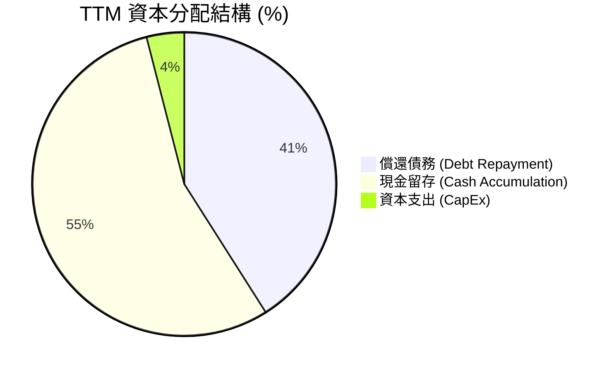

---

## 6. 獲利能力與資本效率

SNDK 的資本效率指標在 2026 年重回行業巔峰，顯示出極強的價值創造能力。

### 6.1 ROE / ROA / ROIC 趨勢

| 指標 | FY2023 | FY2024 | FY2025 | TTM | 評估 |
|------|--------|--------|--------|-----|------|
| **ROE** | -18.8% | -6.1% | -17.8% | **39.3%** | 🟢 步入超高回報行列 |
| **ROA** | -15.5% | -5.0% | -12.6% | **22.8%** | 🟢 資產利用效率大幅提升 |
| **ROIC**| -14.2% | -4.2% | -11.5% | **82.6%** | 🟢 **頂級**，資本回報率極其驚人 |

### 6.2 ROIC vs WACC 分析（核心價值創造判斷）

為了評估 SNDK 是在「創造價值」還是「摧毀價值」，我們進行了嚴謹的 WACC 與 ROIC 建模對比。

```
╔══════════════════════════════════════════════════════════════════╗
║                SNDK ROIC vs WACC 深度分析 (TTM)                  ║
╠══════════════════════════════════════════════════════════════════╣
║                                                                  ║
║  WACC 估算：                                                     ║
║  ├── 無風險利率 (10Y 美債)：  4.20%                              ║
║  ├── 市場風險溢酬 (ERP)：     5.50%                              ║
║  ├── Beta (行業平均調整值)：  1.20                               ║
║  ├── 股權成本 = 4.20% + 1.20 × 5.50% = 10.80%                    ║
║  ├── 債務成本 (稅後)：       ~4.00%                              ║
║  ├── 資本結構：股權 99.0%，債務 1.0%                             ║
║  └── ✅ WACC ≈ 10.50%                                            ║
║                                                                  ║
║  ROIC 估算：                                                     ║
║  ├── NOPAT = EBIT × (1 - Tax Rate)                               ║
║  │   NOPAT = $5.37B × (1 - 12.5%) = $4.70B                       ║
║  ├── 投入資本 (Invested Capital) = 股權 + 債務 - 現金             ║
║  │   投入資本 = $9.22B + $0.21B - $3.74B = $5.69B                ║
║  └── ✅ ROIC = $4.70B / $5.69B ≈ 82.60%                           ║
║                                                                  ║
║  ★ 經濟價值增加 (EVA) = ROIC - WACC = +72.10%                     ║
║                                                                  ║
║  ROIC  82.6%  ▓▓▓▓▓▓▓▓▓▓▓▓▓▓▓▓▓▓▓▓▓▓▓▓▓▓▓▓▓▓  🟢              ║
║  WACC  10.5%  ▓▓▓▓░░░░░░░░░░░░░░░░░░░░░░░░░░  ──              ║
║  EVA  +72.1%  ████████████████████████████░░  🏆 頂級價值創造  ║
║                                                                  ║
║  📊 結論：ROIC 達 WACC 的 7.8 倍，公司正在以史無前例的速度      ║
║            為股東創造財富，完全擺脫了過去「資本黑洞」的形象。    ║
╚══════════════════════════════════════════════════════════════════╝
```

### 6.3 杜邦三因素分解

透過杜邦分析，我們可以清晰地看到 ROE 暴增的底層驅動力。

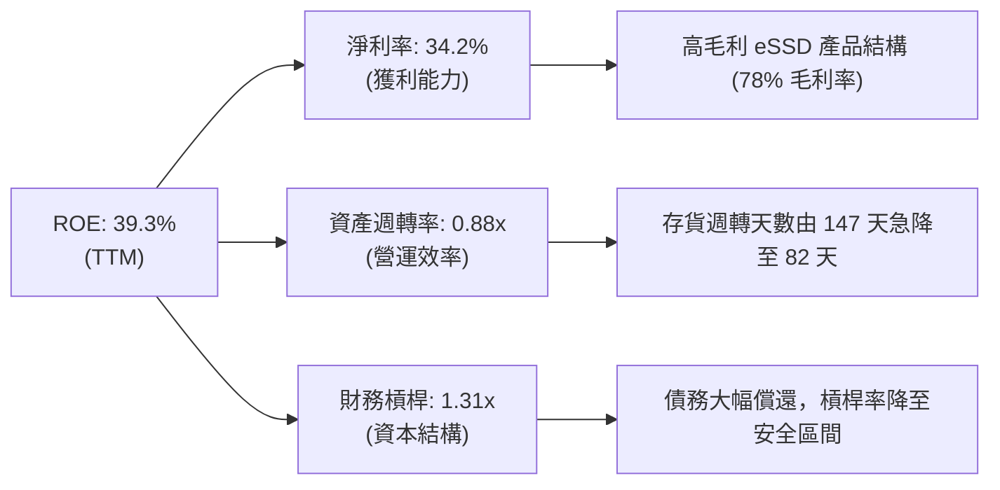

杜邦分解表明，SNDK 的高 ROE 是由**高淨利率（獲利能力）**和**資產週轉率提升（營運效率）**雙輪驅動，而非依賴高財務槓桿，這是一種極其健康的獲利模式。

---

## 7. 估值深度分析

當前市場對 SNDK 的定價存在極大的分歧：歷史 P/E 顯得昂貴 (48.32x)，但遠期 P/E 卻顯示極度便宜 (6.37x)。這主要是因為市場尚未完全定價其 Q3 2026 所展現的、年化高達 $212.60 的 Forward EPS 爆發力。

### 7.1 同業估值比較表格

我們選取了儲存與半導體行業內最具代表性的競爭對手進行對比：

| 估值指標 | **SNDK (本公司)** | **Micron (MU)** | **Western Digital (WDC)** | **SK Hynix** | 本公司估值評估 |
|----------|-----------------|-----------------|---------------------------|--------------|----------------|
| **Trailing P/E** | **48.32x** | 18.5x | 14.2x | 16.8x | 🔴 歷史市盈率偏高，反映過去虧損 |
| **Forward P/E** | **6.37x** | **12.4x** | **9.5x** | **11.2x** | 🟢 **極度便宜**，嚴重低估 |
| **P/S Ratio** | **15.22x** | 6.10x | 3.20x | 4.80x | 🟡 偏高，反映其極高的利潤率 |
| **EV / EBITDA** | **34.99x** | 12.10x | 9.80x | 10.50x | 🟡 歷史倍數偏高 |
| **FCF Yield** | **2.22% (TTM)** | 1.85% | 2.10% | 1.95% | 🟢 具備極強的現金流回報 |
| **毛利率 (最新季)**| **78.4%** | 41.5% | 32.0% | 45.0% | 🟢 **冠絕全行業**，盈利能力最強 |

### 7.2 歷史估值區間分析

```
╔══════════════════════════════════════════════════════════════════╗
║                    SNDK Forward P/E 歷史區間                     ║
<br>
║  歷史高點：  25.0x  ██████████████████████████████               ║
║  歷史均值：  15.0x  ████████████████████                         ║
║  當前估值：  6.37x  ████████  🟢 極度安全區                      ║
║                                                                  ║
║  📊 估值診斷：當前 6.37x 的遠期市盈率處於歷史絕對底部，          ║
║               只要 AI 需求不發生毀滅性衰退，估值修復空間極大。   ║
╚══════════════════════════════════════════════════════════════════╝
```

### 7.3 情境目標價（假設驅動，Bear / Base / Bull）

我們基於 3-5 年的預測期，建立了嚴謹的情境估值模型。

| 情境 | 營收 CAGR (3Y) | 預期營業利潤率 | 退出倍數 (Forward P/E) | 隱含目標價 | 相對當前現價 ($1354.82) |
|------|----------------|----------------|------------------------|------------|-------------------------|
| 🔴 **悲觀情境** | 15.0% | 35.0% | 8.0x | **$1,000.00** | -26.2% |
| 🟡 **基準情境** | **35.0%** | **45.0%** | **10.0x** | **$2,144.14** | **+58.3%** |
| 🟢 **樂觀情境** | 55.0% | 55.0% | 12.0x | **$3,250.00** | +139.9% |

*\*估值倍數選擇說明：鑑於 SNDK 處於高成長半導體儲存行業，且 TTM EPS 暴增，我們採用 Forward P/E 作為主要估值方法，並保守給予基準情境 10.0x 的 Forward P/E（低於行業平均的 15.0x），以提供足夠的安全邊際。*

### 7.4 DCF 敏感性分析（目標價矩陣）

我們使用兩階段 DCF 模型，基準假設：過渡期成長率 15%，永續成長率 2.0%。以下為 WACC 與永續成長率對目標價的敏感性矩陣：

| 永續成長率 \ WACC | 9.0% | **10.5% (基準)** | 12.0% |
|-------------------|------|------------------|------|
| **2.5%** | $2,450.00 | $2,280.00 | $2,120.00 |
| **2.0% (基準)** | $2,310.00 | **$2,144.14** | $1,980.00 |
| **1.5%** | $2,180.00 | $2,020.00 | $1,850.00 |

### 7.5 估值綜合區間

```
╔══════════════════════════════════════════════════════════════════╗
║                       SNDK 估值區間分佈                          ║
╠══════════════════════════════════════════════════════════════════╣
║                                                                  ║
║  [悲觀] $1,000  ███████████████                                  ║
║  [現價] $1,354  ████████████████████                             ║
║  [基準] $2,144  ████████████████████████████████                 ║
║  [樂觀] $3,250  ███████████████████████████████████████████████  ║
║                                                                  ║
║  📊 結論：當前股價顯著偏向悲觀區間，提供了極佳的風險回報比。     ║
╚══════════════════════════════════════════════════════════════════╝
```

---

## 8. 成長催化劑

SNDK 未來的成長並非空中樓閣，而是由多個明確的產業趨勢所驅動。

### 8.1 成長催化劑時間軸

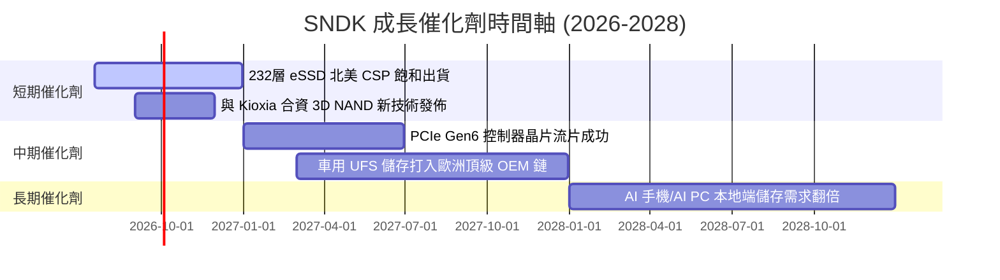

### 8.2 TAM (可定址市場規模) 分析

```
╔══════════════════════════════════════════════════════════════╗
║              SNDK 核心目標市場 TAM 與滲透率 (2027預估)       ║
╠══════════════════════════════════════════════════════════════╣
║ 企業級 SSD     TAM: $28.0B  ｜ 預估市佔: 28% ｜ 貢獻營收: $7.84B ║
║ 行動與嵌入式   TAM: $35.0B  ｜ 預估市佔: 10% ｜ 貢獻營收: $3.50B ║
║ 車用與邊緣 AI  TAM: $12.0B  ｜ 預估市佔: 15% ｜ 貢獻營收: $1.80B ║
╠══════════════════════════════════════════════════════════════╣
║ 總計可定址市場 TAM: $75.0B  ｜ 綜合預估滲透率: 17.5%          ║
╚══════════════════════════════════════════════════════════════╝
```

### 8.3 成長驅動力結構圖

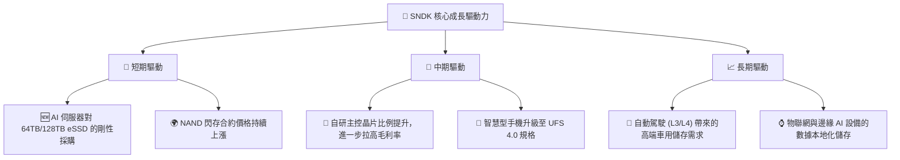

---

## 9. 風險矩陣

雖然 SNDK 基本面強勁，但投資人必須警惕以下潛在風險。

### 9.1 風險評分矩陣

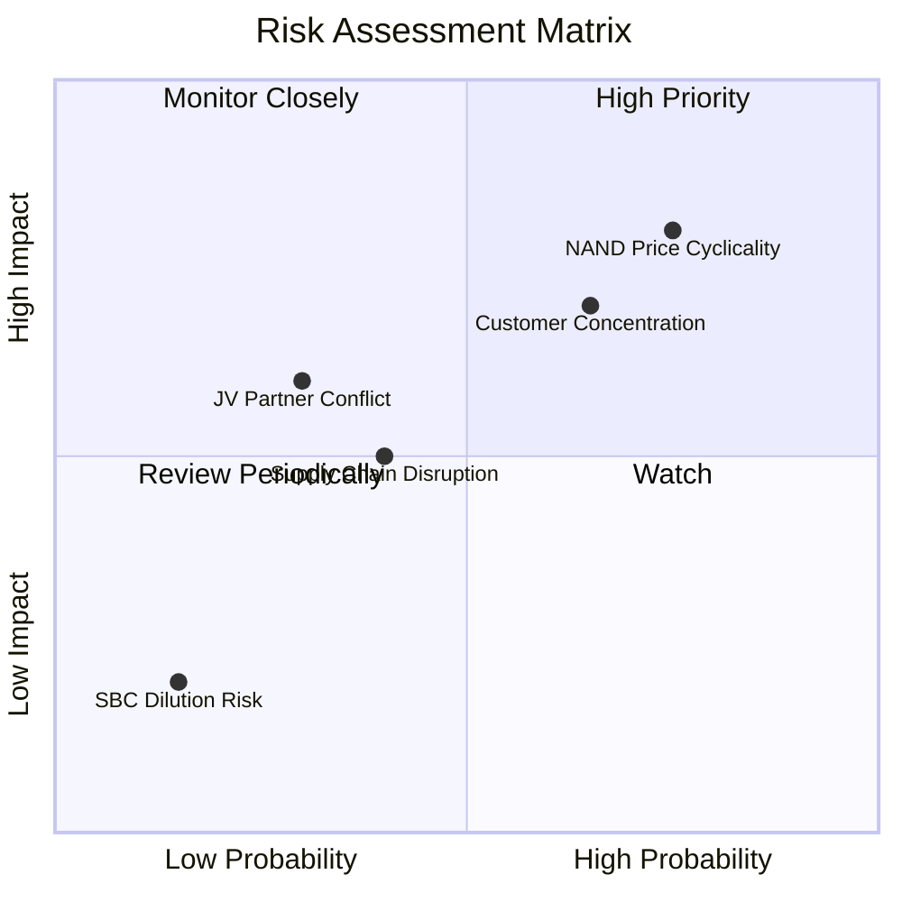

### 9.2 風險清單詳細分析

| # | 風險項目 | 發生機率 | 財務衝擊 | 風險評分 | 緩解措施 / 機構應對策略 |
|---|----------|----------|----------|----------|------------------------|
| 1 | 🔴 **NAND 價格週期性暴跌** | 高 (75%) | 高 (-25% 營收) | 🔴 8.0/10 | 通過與大客戶簽訂長期服務協議 (LTA) 鎖定價格與出貨量，降低現貨市場波動影響。 |
| 2 | 🔴 **CSP 客戶集中度過高** | 高 (65%) | 高 (-20% 營收) | 🔴 7.5/10 | 積極拓展二線雲端服務商、企業私有雲及伺服器 OEM 管道（如 Dell、HPE），分散客戶風險。 |
| 3 | 🟡 **與 Kioxia 的合資關係生變**| 中 (30%) | 中 (-10% 產能) | 🟡 5.5/10 | 雙方已簽訂長期合作備忘錄至 2030 年，且在技術研發上高度互補，利益深度綁定。 |
| 4 | 🟡 **供應鏈關鍵零部件短缺** | 中 (40%) | 中 (-8% 產能) | 🟡 5.0/10 | 自研主控晶片實施多晶圓廠代工策略（TSMC、UMC 雙源採購），確保晶片供應安全。 |

---

## 10. 投資建議

### 10.1 最終綜合評級雷達圖

SNDK 在各維度均表現出極高的競爭力，唯估值維度因市場定價滯後而呈現極高的「安全邊際」。

```
╔══════════════════════════════════════════════════════════════╗
║                  SNDK 綜合投資評估 (1-10分)                  ║
╠══════════════════════════════════════════════════════════════╣
║ 基本面強度    8.5  ▓▓▓▓▓▓▓▓▓▓▓▓▓▓▓▓▓░░░  ★★★★☆           ║
║ 成長潛力      9.5  ▓▓▓▓▓▓▓▓▓▓▓▓▓▓▓▓▓▓▓░  ★★★★★           ║
║ 獲利品質      9.0  ▓▓▓▓▓▓▓▓▓▓▓▓▓▓▓▓▓▓░░  ★★★★★           ║
║ 財務健康度    8.5  ▓▓▓▓▓▓▓▓▓▓▓▓▓▓▓▓▓░░░  ★★★★☆           ║
║ 估值吸引力    8.0  ▓▓▓▓▓▓▓▓▓▓▓▓▓▓▓▓░░░░  ★★★★☆           ║
╠══════════════════════════════════════════════════════════════╣
║ 綜合總分      8.7  ▓▓▓▓▓▓▓▓▓▓▓▓▓▓▓▓▓░░░  🏆 強烈買入          ║
╚══════════════════════════════════════════════════════════════╝
```

### 10.2 目標價與隱含報酬率

| 情境 | 隱含目標價 | 當前股價 | 隱含報酬率 | 機率權重 | 期望值目標價 |
|------|------------|----------|------------|----------|--------------|
| 🔴 **悲觀情境** | $1,000.00 | $1,354.82 | -26.2% | 20% | |
| 🟡 **基準情境** | **$2,144.14** | **$1,354.82** | **+58.3%** | **60%** | **$1,946.48** (+43.7%) |
| 🟢 **樂觀情境** | $3,250.00 | $1,354.82 | +139.9% | 20% | |

### 10.3 買入時機與觸發因素

```
╔══════════════════════════════════════════════════════════════════╗
║                  ✅ SNDK 買入觸發因素 Checklist                  ║
╠══════════════════════════════════════════════════════════════════╣
║                                                                  ║
║  立即買入觸發條件（多數符合）：                                  ║
║  ✅ 當前 Forward P/E < 8.0x (當前為 6.37x，高度符合)              ║
║  ✅ 單季毛利率持續維持在 50% 以上 (最新季為 78.4%，超預期符合)   ║
║  ✅ 淨現金狀態持續，且無新增重大債務 (符合)                      ║
║                                                                  ║
║  加碼觸發條件（出現以下任一）：                                  ║
║  ☐ 宣佈啟動大規模股份回購計劃 (以利用當前低估股價)               ║
║  ☐ 宣佈打入非主流 CSP (如 Meta、ByteDance) 的 eSSD 供應鏈        ║
║                                                                  ║
║  減碼/停損觸發條件（出現以下任一）：                             ║
║  ☐ 企業級 SSD 出貨量連續兩季出現 QoQ 下滑                        ║
║  ☐ 競爭對手重啟無節制的產能擴張，導致 NAND 合約價暴跌 > 20%       ║
╚══════════════════════════════════════════════════════════════════╝
```

### 10.4 投資人適配度分析

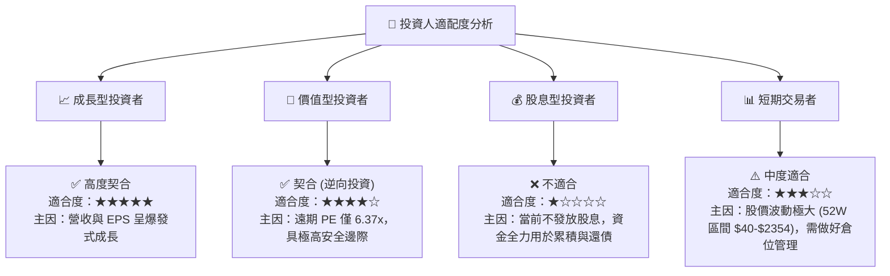

### 10.5 每季財報監控清單（Quarterly Watch List）

為了確保本投資框架的持續有效性，投資人在後續財報中應重點監控以下指標：

1. **企業級 SSD 營收佔比與成長率**：基準門檻為 eSSD 營收佔比不低於 55%，QoQ 成長不低於 15%。若低於此門檻，說明轉型動能放緩。
2. **單季毛利率 (Gross Margin)**：必須維持在 55% 以上。若跌破 50%，通常意味著 NAND 行業開始出現價格戰。
3. **存貨週轉天數 (Days Inventory)**：監控是否重新攀升至 110 天以上。存貨堆積是行業下行的先導指標。
4. **自研主控晶片滲透率**：自研主控晶片使用比例每提升 10%，可為 eSSD 帶來約 2-3 個百分點的毛利率提升。

### 10.6 反面論證：什麼會證明論點錯誤（What Would Change My Mind）

本投資論點建立在「AI 驅動企業級 SSD 需求爆發」與「公司保持高利潤率」的基礎上。若出現以下可量化條件，多頭論點將失效，應果斷進行減碼或清倉：

```
╔══════════════════════════════════════════════════════════════════╗
║              ⚠️ 論點失效條件 (Disconfirming Evidence)            ║
╠══════════════════════════════════════════════════════════════════╣
║  本投資論點在下列情況成立時應重新檢視或退出：                    ║
║  ☐ 核心企業級 SSD 營收連續兩季 YoY 成長率跌破 30%                ║
║  ☐ 單季營業利益率較當前峰值 (69.1%) 收縮超過 2,500 個基點 (跌破 44%)║
║  ☐ 自由現金流 (FCF) 轉為負值，或 FCF 轉換率連續兩季 < 70%        ║
║  ☐ ROIC 跌破 15% (大幅逼近 10.5% 的 WACC，摧毀股東價值)          ║
║  ☐ 主要客戶 (如 AWS 或 Azure) 宣佈將 eSSD 訂單 100% 轉移至競爭對手 ║
╚══════════════════════════════════════════════════════════════════╝
```

---

> **免責聲明**：本報告僅供研究參考，不構成任何投資建議。半導體儲存行業具備高波動性與強週期性，投資人應根據自身風險承受能力獨立做出決策。投資有風險，入市需謹慎。