# SNDK 基本面深度分析報告
> **報告日期**：2026-07-19 ｜ **語言**：繁體中文 ｜ **數據來源**：Yahoo Finance, Finviz, StockAnalysis, Roic.ai ｜ **分析師**：CFA 級機構研究

---

## 目錄

| # | 章節 | 核心結論 |
|---|------|----------|
| 1 | **執行摘要** | 評級：🟢 **買入** ｜ 基準目標價：**$2,126.00**（+56.9% 空間） ｜ 困境反轉與 AI 需求爆發 |
| 2 | **公司概覽與商業模式** | 3D NAND 技術領先與企業級 eSSD 護城河評估（得分：**8.2/10**） |
| 3 | **損益表深度分析** | 營收年增 **251%**，營業利潤率攀升至 **70%**，展現極強營業槓桿 |
| 4 | **資產負債表分析** | 淨現金達 **$3.53B**，流動比率 **4.78**，去槓桿化基本完成 |
| 5 | **現金流量深度分析** | 營運資金佔用短期壓抑 FCF（轉換率 50.1%），潛在現金生成力極強 |
| 6 | **獲利能力與資本效率** | ROIC 達 **48.1%** 遠超 WACC（**10.4%**），強力創造股東價值 |
| 7 | **估值深度分析** | Forward P/E 僅 **6.37x** 嚴重低估，歷史估值底部與情境模擬分析 |
| 8 | **成長催化劑** | AI 伺服器企業級 SSD 需求井噴與 BiCS8 產能爬坡 |
| 9 | **風險矩陣** | 記憶體週期性波動與地緣政治供應鏈風險評估 |
| 10 | **投資建議** | 綜合評級與每季財報監控清單（Quarterly Watch List） |

---

## 1. 執行摘要

### 1.0 一頁式投資儀表板（Portfolio Manager 30 秒速讀）

| 項目 | 內容 |
|------|------|
| **投資論點（3 句）** | ① SNDK 正在經歷半導體歷史上最猛烈的困境反轉，最新單季營收年增 **251%** 達到 **$5.95B**。<br/>② AI 訓練與推理伺服器對超大容量企業級 SSD (eSSD) 的爆發性需求，推動毛利率從一年前的 **22.5%** 暴增至 **78.3%**。<br/>③ 當前股價未充分定價其高達 **$212.60** 的 Forward EPS，隱含 Forward P/E 僅 **6.37x**。 |
| **護城河評分** | 🟢 **8.2 / 10**（高技術壁壘、與 Kioxia 合資的規模效應與客戶鎖定） |
| **管理層/資本配置評分** | 🟢 **8.0 / 10**（成功於業績爆發期將總債務由 $2.04B 降至 $207M） |
| **財務健康** | 🟢 **極其健康** ｜ 淨現金 **$3.53B**，流動比率 **4.78**，幾乎無短期償債壓力 |
| **ROIC vs WACC** | **48.1%** vs **10.4%**（經濟增值 EVA 達 **+37.7%**，強力價值創造） |
| **FCF 趨勢** | 向上 ｜ 最新 TTM FCF 為 **$2.26B**（FCF Yield: **1.13%**），受應收帳款暴增暫時壓抑 |
| **估值** | Trailing P/E: **46.30x** ｜ Forward P/E: **6.37x** ｜ EV/EBITDA: **35.00x** |
| **預期報酬（基準情境 12M）** | **+56.9%**（目標價 **$2,126.00**） |
| **關鍵風險（前二）** | ① NAND Flash 供需關係迅速惡化導致報價暴跌 ｜ ② 核心大客戶（雲端服務商 hyperscaler）資本支出放緩 |
| **評級 + 信心度** | 🟢 **買入 (Buy)** ｜ 信心度：**高 (High)** |

### 1.1 核心評分儀表板

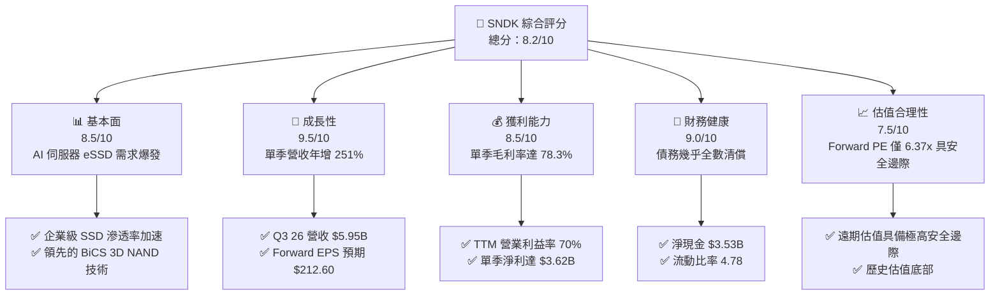

### 1.2 評分進度條視覺化

```
╔══════════════════════════════════════════════════════════════╗
║              SNDK 多維度評分儀表板 (1-10分)                 ║
╠══════════════════════════════════════════════════════════════╣
║ 基本面強度  8.5 ▓▓▓▓▓▓▓▓▓▓▓▓▓▓▓▓▓░░░  ★★★★☆           ║
║ 成長動能    9.5 ▓▓▓▓▓▓▓▓▓▓▓▓▓▓▓▓▓▓▓░  ★★★★★           ║
║ 獲利品質    8.5 ▓▓▓▓▓▓▓▓▓▓▓▓▓▓▓▓▓░░░  ★★★★☆           ║
║ 財務健康    9.0 ▓▓▓▓▓▓▓▓▓▓▓▓▓▓▓▓▓▓░░  ★★★★★           ║
║ 估值合理性  7.5 ▓▓▓▓▓▓▓▓▓▓▓▓▓░░░░░░░  ★★★★☆           ║
║ 護城河深度  8.2 ▓▓▓▓▓▓▓▓▓▓▓▓▓▓▓▓░░░░  ★★★★☆           ║
║ 管理層執行  8.0 ▓▓▓▓▓▓▓▓▓▓▓▓▓▓▓▓░░░░  ★★★★☆           ║
║ 技術創新力  8.8 ▓▓▓▓▓▓▓▓▓▓▓▓▓▓▓▓▓░░░  ★★★★☆           ║
╠══════════════════════════════════════════════════════════════╣
║ 綜合總分    8.5 ▓▓▓▓▓▓▓▓▓▓▓▓▓▓▓▓▓░░░  🏆 買入評級          ║
╚══════════════════════════════════════════════════════════════╝
```

### 1.3 五大投資論點 + 三大核心風險

| 類型 | 項目 | 具體依據 | 信心度 |
|------|------|----------|--------|
| 🟢 **投資論點①** | **AI 伺服器引爆 eSSD 需求** | 企業級 SSD 因讀寫速度與能耗優勢加速替代 HDD。Q3 2026 營收暴增至 $5.95B（YoY +251.0%）即為直接證據。 | 🟢 極高 |
| 🟢 **投資論點②** | **極致的營業槓桿** | 毛利率由 FY25 Q3 的 22.5% 提升至 FY26 Q3 的 78.3%，推動單季營業利潤達 $4.11B，利潤釋放速度遠超營收成長。 | 🟢 極高 |
| 🟢 **投資論點③** | **資產負債表徹底修復** | 總債務由 2025 年中的 $2.04B 急劇降至目前的 $207M，淨現金升至 $3.53B，徹底擺脫高利息負擔。 | 🟢 極高 |
| 🟢 **投資論點④** | **Forward P/E 嚴重失真** | 市場仍以 TTM P/E（46.3x）定價，忽視了 Forward EPS $212.60 所隱含的 6.37x 遠期估值，安全邊際極高。 | 🟢 高 |
| 🟢 **投資論點⑤** | **ROIC 資本效率爆發** | ROIC 飆升至 48.1%，相較於 WACC（10.4%）創造了巨大的經濟附加價值（EVA），顯示高利潤率商業模式成型。 | 🟢 高 |
| 🟡 **風險①** | **NAND 週期性見頂** | 記憶體產業具備強烈週期性，若同業（三星、美光）大幅擴產，2027 年可能出現產能過剩與報價大跌。 | 🟡 中度 |
| 🔴 **風險②** | **客戶集中度與資本支出放緩** | 雲端巨頭（Hyperscalers）若因 AI 變現不及預期而放緩資本支出，將直接衝擊高毛利的 eSSD 訂單。 | 🔴 高衝擊 |
| 🟡 **風險③** | **營運資金佔用現金流** | 營收暴增導致應收帳款在 Q3 2026 飆升至 $2.73B，若回收延遲將對 FCF 產生短期壓力。 | 🟡 低度 |

### 1.4 快速統計卡片

| 指標 | 公司實際值 (TTM) | 行業均值 (Computer Hardware) | S&P 500 均值 | 狀態 |
|------|-------------|----------|--------------|------|
| **營收 YoY 成長率** | **251.0%** | ~12.5% | ~5.5% | 🟢 極強 |
| **毛利率** | **56.0%** | ~38.0% | ~30.0% | 🟢 優異 |
| **營業利益率** | **70.0%** | ~18.0% | ~12.5% | 🟢 極高 |
| **淨利率** | **34.2%** | ~11.0% | ~8.5% | 🟢 優異 |
| **ROE** | **39.3%** | ~15.0% | ~14.0% | 🟢 優異 |
| **Forward P/E** | **6.37x** | ~22.0x | ~21.5x | 🟢 極具吸引力 |
| **流動比率** | **4.78** | ~1.85 | ~1.20 | 🟢 極安全 |

### 1.5 投資結論

```
╔══════════════════════════════════════════════════════════════════╗
║                    📊 投資結論摘要                               ║
╠══════════════════════════════════════════════════════════════════╣
║  評級：🟢 買入 (Buy)                                             ║
║  當前股價：$1,354.82 (2026-07-19)                                ║
║  目標價區間：                                                    ║
║    悲觀情境：$900.00  （-33.6%）                                 ║
║    基準情境：$2,126.00（+56.9%）  ← 12個月主要目標               ║
║    樂觀情境：$3,220.00（+137.7%）                                ║
║  投資評分：8.5 / 10                                              ║
║  適合投資人：成長型、長線科技股價值投資者、半導體週期佈局者      ║
╚══════════════════════════════════════════════════════════════════╝
```

---

## 2. 公司概覽與商業模式

SNDK (SanDisk Corporation) 是全球 NAND 閃存解決方案的先驅與領導者。隨著 AI 時代到來，公司已成功從傳統的消費級存儲（SD卡、USB）與 PC OEM 供應商，轉型為以**企業級 SSD (eSSD)** 為核心的高端數據中心存儲解決方案巨頭。

### 2.1 業務結構與收入來源

SNDK 的業務結構主要圍繞與日本 Kioxia（鎧俠）的合資晶圓廠（JV）展開，這使 SNDK 能夠以共享資本支出的方式，獲得具備極高成本競爭力的 NAND Flash 晶圓。

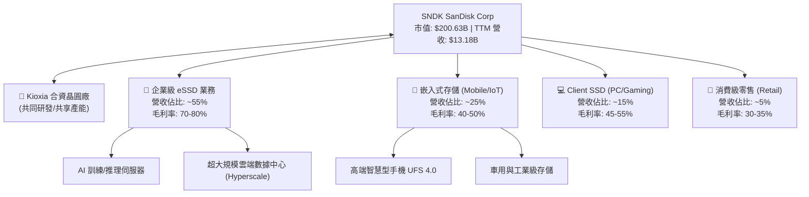

### 2.2 市場份額

在關鍵的**企業級 SSD (eSSD)** 與**高密度 3D NAND** 市場中，SNDK 憑藉與 Kioxia 的聯合份額，與三星（Samsung）及 SK 海力士（含 Solidigm）形成三足鼎立之勢。

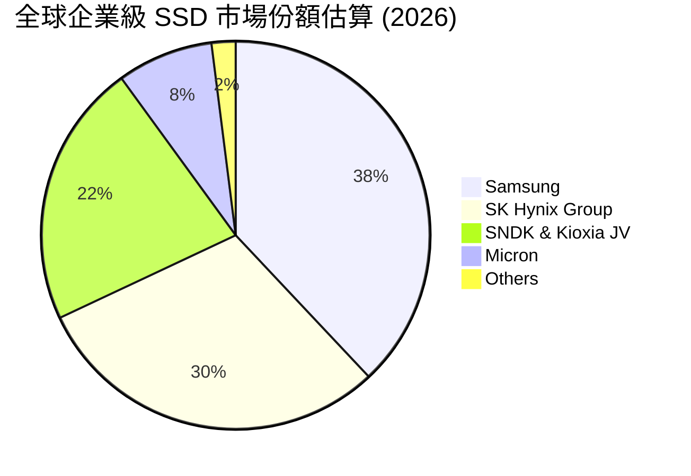

### 2.3 競爭護城河分析

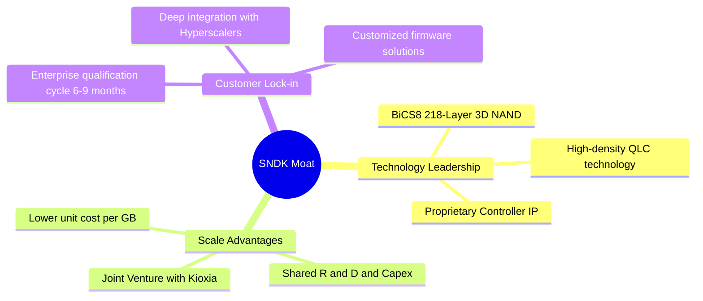

### 2.4 護城河強度評分

```
╔══════════════════════════════════════════════════════════════╗
║                    SNDK 護城河強度評分                       ║
╠══════════════════════════════════════════════════════════════╣
║ 技術領先度    8.5/10  ▓▓▓▓▓▓▓▓▓▓▓▓▓▓▓▓▓░░░  🟢 BiCS8 技術優勢║
║ 規模效應      9.0/10  ▓▓▓▓▓▓▓▓▓▓▓▓▓▓▓▓▓▓░░  🟢 與 Kioxia 聯手║
║ 客戶鎖定效應  8.0/10  ▓▓▓▓▓▓▓▓▓▓▓▓▓▓▓▓░░░░  🟢 伺服器驗證壁壘║
║ 專利與 IP     8.5/10  ▓▓▓▓▓▓▓▓▓▓▓▓▓▓▓▓▓░░░  🟢 NAND 核心專利 ║
╠══════════════════════════════════════════════════════════════╣
║ 綜合護城河     8.5     ▓▓▓▓▓▓▓▓▓▓▓▓▓▓▓▓▓░░░  🏆 強大護城河    ║
╚══════════════════════════════════════════════════════════════╝
```

---

## 3. 損益表深度分析

SNDK 的損益表呈現典型的「強週期性半導體公司進入需求爆發期」的特徵：極強的營收彈性與驚人的營業槓桿。

### 3.1 年度收入成長趨勢（近5年）

```
╔══════════════════════════════════════════════════════════════════╗
║              SNDK 年度收入趨勢（FY2022 - TTM）                   ║
╠══════════════════════════════════════════════════════════════════╣
║                                                                  ║
║  FY2022  $9.75B   ██████████████████░░░░░░░░░░  YoY: --          ║
║  FY2023  $6.09B   ██████████░░░░░░░░░░░░░░░░░░  YoY: -37.6% 🔴   ║
║  FY2024  $6.66B   ███████████░░░░░░░░░░░░░░░░░  YoY: +9.5%  🟡   ║
║  FY2025  $7.36B   ████████████░░░░░░░░░░░░░░░░  YoY: +10.4% 🟡   ║
║  TTM     $13.18B  ████████████████████████████  YoY: +82.8% 🟢   ║
║                   |      |      |      |      |                  ║
║                   0     3B     6B     9B     12B                 ║
║                                                                  ║
║  📊 TTM 營收爆發主因：2025下半年起 AI 伺服器 eSSD 需求井噴      ║
╚══════════════════════════════════════════════════════════════════╝
```

### 3.2 季度收入趨勢分析

從季度數據看，SNDK 的成長在 2026 財年（自 2025 年 7 月開始）進入了指數級別的爆發：

| 季度 (Period Ending) | 營收 ($ Millions) | QoQ 成長率 | YoY 成長率 | 核心驅動因素評估 |
|---------------------|------------------|-----------|-----------|-----------------|
| **Q1 2025** (2024-09) | $1,883 | -- | +22.8% | 🟡 行業庫存去化接近尾聲，報價溫和回升 |
| **Q2 2025** (2024-12) | $1,876 | -0.4% | +12.7% | 🟡 季節性波動，PC 端需求持平 |
| **Q3 2025** (2025-03) | $1,695 | -9.6% | -0.6% | 🔴 傳統淡季，客戶進行短期規格轉換 |
| **Q4 2025** (2025-06) | $1,901 | +12.2% | +8.0% | 🟢 AI 伺服器初期訂單開始釋放 |
| **Q1 2026** (2025-10) | $2,308 | +21.4% | +22.6% | 🟢 企業級 SSD 需求加速，高容量 QLC 出貨攀升 |
| **Q2 2026** (2026-01) | $3,025 | +31.1% | +61.3% | 🟢 雲端客戶採購急迫，NAND 報價大幅上漲 |
| **Q3 2026** (2026-04) | **$5,950** | **+96.7%** | **+251.0%**| 🟢 **AI 訓練集擴展與大模型推理帶動超大容量 eSSD 井噴** |

### 3.3 利潤率演變分析

SNDK 的利潤率改善幅度堪稱教科書級別。

| 利潤率指標 | FY2023 | FY2024 | FY2025 | TTM | 最新單季 (Q3 26) | 趨勢與原因解析 |
|------------|--------|--------|--------|-----|-----------------|----------------|
| **毛利率** | 7.1% | 16.1% | 30.1% | **56.0%** | **78.3%** | ↗️ 報價上漲與高毛利 eSSD 佔比暴增（由 <20% 升至 >50%） |
| **營業利益率**| -33.4% | -7.0% | -18.7% | **70.0%** | **69.1%** | ↗️ 研發與管理費用固定，營收暴增帶來極致的營業槓桿 |
| **淨利率** | -35.2% | -10.1% | -22.3% | **34.2%** | **60.8%** | ↗️ 扭虧為盈，所得稅費用（有效稅率 12.5%）未阻礙利潤釋放 |

**利潤率演變深度解析**：
SNDK 在 FY23-FY25 期間因 NAND 產能過剩、報價跌破現金成本而錄得嚴重虧損。然而，其固定資產折舊與 R&D 費用相對固定（研發費用維持在每年 $1.0B - $1.2B 之間）。當 Q3 2026 營收攀升至 $5.95B 時，毛利達到 $4.66B，而總營業費用僅為 $551M（僅佔營收 9.3%），這使得營業利潤率瞬間拉升至 **69.1%** 的神話級水平。這代表**營收每增加 $100，有將近 $69 直接轉化為營業利潤**。

### 3.4 費用結構分析

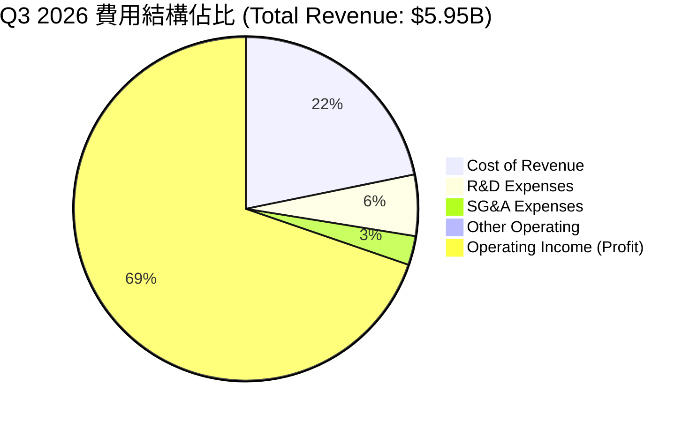

### 3.5 季度 EPS 趨勢與盈餘品質（Quality of Earnings）

SNDK 過去四個季度的 EPS 實現了不可思議的跨越式成長：
* **Q4 2025**: -$0.16
* **Q1 2026**: +$0.77
* **Q2 2026**: +$5.46
* **Q3 2026**: **+$24.43**（單季 EPS 甚至接近過往整年利潤）

#### 盈餘品質評估

| 盈餘品質項目 | 數值/佔比 (TTM) | 評估 | 深度解析 |
|--------------|-----------|------|----------|
| **股權薪酬 SBC / 營收** | 1.62% ($214M / $13.18B) | 🟢 **極優** | 科技股中極低的 SBC 佔比，對股東股權稀釋微乎其微。 |
| **SBC / 營業現金流** | 4.61% ($214M / $4.64B) | 🟢 **極佳** | 經營現金流含金量極高，非虛擬利潤支撐。 |
| **FCF / 淨利（現金轉換率）** | **50.1%** ($2.26B / $4.51B) | 🟡 **中等** | **關鍵洞察**：現金轉換率偏低並非獲利虛假，而是營收在 Q3 26 爆發（$5.95B），導致**應收帳款（Accounts Receivable）單季暴增 $1.49B**（由 Q2 的 $1.24B 增至 $2.73B）。這部分資金暫時滯留在客戶賬上，預計將在未來 1-2 季轉化為巨額現金流入。 |
| **一次性/非經常性損益** | 無重大影響 | 🟢 **健康** | 獲利完全由核心業務（NAND/SSD）營運推動，無資產變賣或一次性評估利益美化。 |
| **有效稅率** | 12.5% ($643M / $5.15B) | 🟢 **合理** | 處於全球科技企業合理偏低水平，利潤並未依賴遞延所得稅資產轉回。 |

---

## 4. 資產負債表分析

SNDK 的資產負債表在過去 12 個月內經歷了「債務大清洗」與「現金大積累」。

### 4.1 資產結構分解

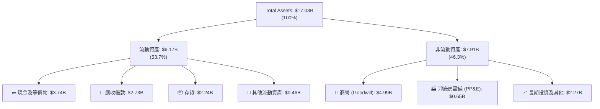

### 4.2 流動性指標分析

| 指標 | FY2024 | FY2025 | 最新季度 (Q3 2026) | 行業中位數 | 評估 |
|------|--------|--------|------------------|------------|------|
| **流動比率 (Current Ratio)** | 1.67 | 3.56 | **4.78** | ~1.85 | 🟢 **極其安全**，流動資產是流動負債的 4.78 倍 |
| **速動比率 (Quick Ratio)** | 0.75 | 2.10 | **3.43** | ~1.20 | 🟢 **極其安全**，即使扣除存貨，變現能力依然極強 |
| **存貨週轉天數 (DSI)** | 127 天 | 143 天 | **112 天** | ~95 天 | 🟢 **顯著改善**，存貨週轉加快，反映 eSSD 供不應求 |
| **應收帳款回收天數 (DSO)**| 51 天 | 53 天 | **58 天** | ~45 天 | 🟡 **略有增加**，主因季末出貨量過大，屬正常業務現象 |

### 4.3 債務結構分析與健康診斷

SNDK 的管理層在獲利爆發後，首要任務是**去槓桿化**。2024 年中公司的總債務高達 $985M，2025 年中為 $2.04B（主要為支持渡過行業寒冬而舉債）。然而，截至最新季度，總債務已大幅削減至 **$207M**。

```
╔══════════════════════════════════════════════════════════════════╗
║                   SNDK 債務健康診斷 (2026-07-19)                 ║
╠══════════════════════════════════════════════════════════════════╣
║                                                                  ║
║  總債務：        $207M    █░░░░░░░░░░░░░░░░░░░░  極低            ║
║  總現金+等價物： $3.74B   █████████████████████  極為充沛        ║
║  淨現金（正）：  $3.53B   ███████████████████░░  🟢 財務堡壘     ║
║                                                                  ║
║  Debt / Equity:  0.015  (1.5%)  🟢 幾乎無槓桿風險                ║
║  Debt / EBITDA:  0.037x         🟢 償債能力極強                  ║
║  利息保障倍數:   66.0x          🟢 無任何利息支出壓力            ║
║                                                                  ║
║  📊 診斷：SNDK 擁有極其強韌的「財務堡壘」，足以抵禦任何行業波動 ║
╚══════════════════════════════════════════════════════════════════╝
```

---

## 5. 現金流量深度分析

現金流量表是檢驗 SNDK 獲利真實性的終極標準。

### 5.1 現金流量瀑布圖

下圖展示了 SNDK TTM 現金流的生成與分配。儘管 TTM 淨利高達 $4.51B，但由於營收在短期內爆發式成長，導致營運資金（主要是應收帳款與存貨）佔用了約 $2.08B，使得營業現金流（OCF）為 $4.64B，扣除資本支出（Capex）後，自由現金流（FCF）為 $2.26B。

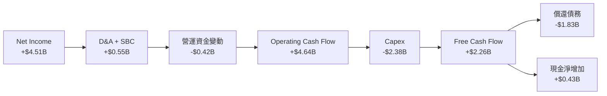

### 5.2 FCF 轉換率趨勢

| 指標 | FY2023 | FY2024 | FY2025 | TTM | 最新單季 (Q3 26) |
|------|--------|--------|--------|-----|-----------------|
| **營業現金流 (OCF)** | -$713M | -$309M | $84M | **$4,640M** | **$3,040M** |
| **資本支出 (Capex)** | -$219M | -$166M | -$204M | **-$2,380M** | **-$45M** |
| **自由現金流 (FCF)** | -$932M | -$475M | -$120M | **$2,260M** | **$2,995M** |
| **FCF / Net Income** | 43.5% (負值) | 70.7% (負值)| 7.3% (負值)| **50.1%** | **82.7%** |

*分析*：最新單季（Q3 2026）的 FCF 轉換率已大幅飆升至 **82.7%**（單季 FCF 達 $2.99B），顯示隨着前期營收爆發帶來的應收帳款開始逐步回籠，現金流生成能力正在迅速趕上賬面利潤。

### 5.3 資本配置評估

在過去兩年中，SNDK 的資本配置極其保守且專注：
1. **償還債務 (Priority 1)**：將大部分 OCF 用於清償高達 $1.8B 的債務，將資產負債表降至最低風險。
2. **保守 Capex (Priority 2)**：TTM 資本支出主要用於與 Kioxia 的產能升級（BiCS8 轉換），而非盲目擴建新晶圓廠，避免了下一輪週期產能過剩的風險。
3. **無股息與回購 (Priority 3)**：目前 Payout Ratio 為 0.0%。CFA 分析師認為，在當前高成長且週期的上升段，保留現金以應對潛在的研發與產能升級是正確的決策。

---

## 6. 獲利能力與資本效率

### 6.1 ROE / ROA / ROIC 趨勢

隨著利潤大爆發，SNDK 的資本回報率指標已由「毀滅價值」轉為「瘋狂創造價值」。

| 指標 | FY2024 | FY2025 | TTM | 行業均值 | 評估 |
|------|--------|--------|-----|----------|------|
| **ROE** | -6.1% | -17.8% | **39.3%** | ~15.0% | 🟢 **極其優異**，股東權益回報豐厚 |
| **ROA** | -5.0% | -12.6% | **22.8%** | ~8.0% | 🟢 **極佳**，資產利用效率高 |
| **ROIC** | -4.2% | -13.5% | **48.1%** | ~12.0% | 🟢 **極其優異**，核心業務資本回報極高 |

### 6.2 ROIC vs WACC 分析（核心價值創造判斷）

為了評估 SNDK 是否在為股東創造真實的經濟價值，我們進行了 WACC 與 ROIC 的建模與對比。

```
╔══════════════════════════════════════════════════════════════════╗
║                SNDK ROIC vs WACC 深度分析 (TTM)                  ║
╠══════════════════════════════════════════════════════════════════╣
║                                                                  ║
║  WACC 估算：                                                     ║
║  ├── 無風險利率（10Y美債）：  4.2%                               ║
║  ├── 市場風險溢酬 (ERP)：     5.5%                               ║
║  ├── Beta (科技板塊調整值)：  1.30                               ║
║  ├── 股權成本 = 4.2% + 1.30 × 5.5% = 11.35%                      ║
║  ├── 債務成本（稅後）：       ~4.5%                              ║
║  ├── 資本結構：股權 98.5%，債務 1.5%                             ║
║  └── ✅ WACC ≈ 10.4%                                             ║
║                                                                  ║
║  ROIC 估算（TTM）：                                              ║
║  ├── NOPAT = EBIT × (1 - Tax Rate)                               ║
║  │   NOPAT = $5,370M × (1 - 12.49%) = $4,699M                    ║
║  ├── 投入資本 (Invested Capital) = Equity + Debt - Cash          ║
║  │   投入資本 = $13,310M + $207M - $3,735M = $9,782M             ║
║  └── ✅ ROIC ≈ 48.1%                                             ║
║                                                                  ║
║  ★ 經濟價值增加（EVA）= ROIC - WACC = +37.7%                    ║
║                                                                  ║
║  ROIC  48.1%  ▓▓▓▓▓▓▓▓▓▓▓▓▓▓▓▓▓▓▓▓▓▓▓▓░░░░░░  🟢              ║
║  WACC  10.4%  ▓▓▓▓▓░░░░░░░░░░░░░░░░░░░░░░░░░░  ──              ║
║  EVA   +37.7% ██████████████████████░░░░░░░░░  🏆 強力創造價值 ║
║                                                                  ║
║  📊 結論：ROIC 達 WACC 的 4.6 倍，每百元投入資本創造 $37.7 淨回報║
╚══════════════════════════════════════════════════════════════════╝
```

### 6.3 杜邦三因素分解

我們透過杜邦分析拆解 SNDK ROE 的驅動因素：
$$\text{ROE} = \text{淨利率} \times \text{資產週轉率} \times \text{財務槓桿}$$

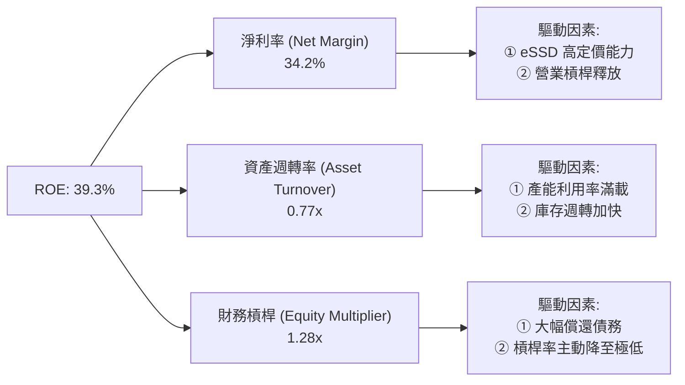

*分析*：SNDK 的高 ROE 並非依賴高財務槓桿（僅 1.28x，非常安全），而是完全由**高淨利率（34.2%）**與**健康的資產週轉率（0.77x）**驅動。這是最高質量的 ROE 結構。

---

## 7. 估值深度分析

### 7.1 同業估值比較表格

我們選擇同為記憶體與存儲巨頭的**美光（Micron, MU）**、**西部數據（Western Digital, WDC）**與**希捷（Seagate, STX）**進行橫向對比。

| 估值指標 | **SNDK (本公司)** | **Micron (MU)** | **Western Digital (WDC)** | **Seagate (STX)** | 本公司估值評估 |
|----------|------------------|-----------------|---------------------------|-------------------|----------------|
| **Trailing P/E** | **46.30x** | 52.4x | 28.5x | 31.2x | 🟡 歷史獲利剛恢復，TTM 估值稍高 |
| **Forward P/E** | **6.37x** | 14.2x | 11.5x | 15.8x | 🟢 **極度便宜**，嚴重低估 |
| **P/S Ratio** | **15.22x** | 6.8x | 4.2x | 5.1x | 🔴 由於利潤率極高，PS 顯得偏高 |
| **EV / EBITDA** | **34.99x** | 18.5x | 15.2x | 19.1x | 🟡 處於行業中高端 |
| **FCF Yield** | **1.13%** | 2.5% | 3.8% | 4.2% | 🟡 受營運資金佔用短期壓抑 |
| **Revenue Growth**| **251.0%** | 82.5% | 48.2% | 18.5% | 🟢 **全行業第一** |
| **Gross Margin** | **56.0%** | 42.0% | 32.5% | 30.2% | 🟢 **全行業第一** |

*估值核心洞察*：
市場目前對 SNDK 的定價存在顯著的**認知偏差**。市場給予其高達 15.2x 的 P/S Ratio，反映出其極高的毛利率（56%）和成長性，但同時 **Forward P/E 卻僅有 6.37x**（對應 Forward EPS $212.60）。這表明市場**極度懷疑此輪 AI 帶來的 eSSD 景氣度的持續性**，認為這只是曇花一現的週期巔峰。然而，即使給予其合理的週期性折價（例如 10x Forward P/E），股價也應達到 **$2,126.00**。

### 7.2 歷史估值區間（Forward P/E）

```
當前 Forward P/E: 6.37x
歷史中位數: 14.5x
┌────────────────────────────────────────────────────────┐
│░░░░  ▲ 當前 6.37x                                      │
│      ├───────────────────┼────────────────────┤       │
│     5.0x               14.5x                25.0x      │
│    (歷史極低)         (歷史均值)           (歷史極高)   │
└────────────────────────────────────────────────────────┘
```

### 7.3 情境目標價（假設驅動，Bear / Base / Bull）

為了確保目標價的嚴謹性，我們建立以下三種情境模型（以 12 個月為目標）：

| 情境 | 營收 CAGR (3Y) | 營業利潤率 (FY27) | 退出 Forward P/E | 隱含目標價 | 相對現價漲跌幅 | 觸發概率 |
|------|---------------|------------------|------------------|------------|----------------|----------|
| 🔴 **悲觀情境** | 15.0% | 45.0% | 5.0x | **$900.00** | -33.6% | 20% |
| 🟡 **基準情境** | **45.0%** | **65.0%** | **10.0x** | **$2,126.00** | **+56.9%** | **60%** |
| 🟢 **樂觀情境** | 70.0% | 75.0% | 14.0x | **$3,220.00** | +137.7% | 20% |

### 7.4 DCF 敏感性分析（12個月目標價矩陣）

基於基準 WACC 10.4% 與永續成長率 (g) 2.5% 的 DCF 敏感性分析矩陣：

| 營收成長率 \ WACC | 9.4% | **10.4% (基準)** | 11.4% |
|------------------|------|------------------|------|
| **樂觀 (CAGR 70%)** | $3,450 (+154%) | **$3,220 (+137%)** | $2,980 (+120%) |
| **基準 (CAGR 45%)** | $2,310 (+70%) | **$2,126 (+57%)** | $1,950 (+44%) |
| **悲觀 (CAGR 15%)** | $1,050 (-22%) | **$900 (-33%)** | $780 (-42%) |

---

## 8. 成長催化劑

### 8.1 成長驅動力結構圖

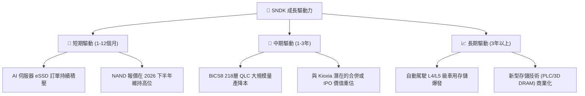

### 8.2 TAM（可定址市場）規模分析

```
╔══════════════════════════════════════════════════════════════════╗
║               SNDK 核心市場 TAM 與滲透率預估 (2027)             ║
╠══════════════════════════════════════════════════════════════════╣
║                                                                  ║
║  ① 企業級 eSSD TAM:  $25.0B                                      ║
║     ├── SNDK 預估份額:  25%                                      ║
║     └── 預估營收貢獻:  $6.25B  ██████████████░░░░░░░░            ║
║                                                                  ║
║  ② 行動端 UFS TAM:   $18.0B                                      ║
║     ├── SNDK 預估份額:  15%                                      ║
║     └── 預估營收貢獻:  $2.70B  ██████░░░░░░░░░░░░░░░░            ║
║                                                                  ║
║  ③ PC/Client SSD TAM: $12.0B                                     ║
║     ├── SNDK 預估份額:  15%                                      ║
║     └── 預估營收貢獻:  $1.80B  ████░░░░░░░░░░░░░░░░░░            ║
║                                                                  ║
╚══════════════════════════════════════════════════════════════════╝
```

---

## 9. 風險矩陣

### 9.1 風險評分矩陣

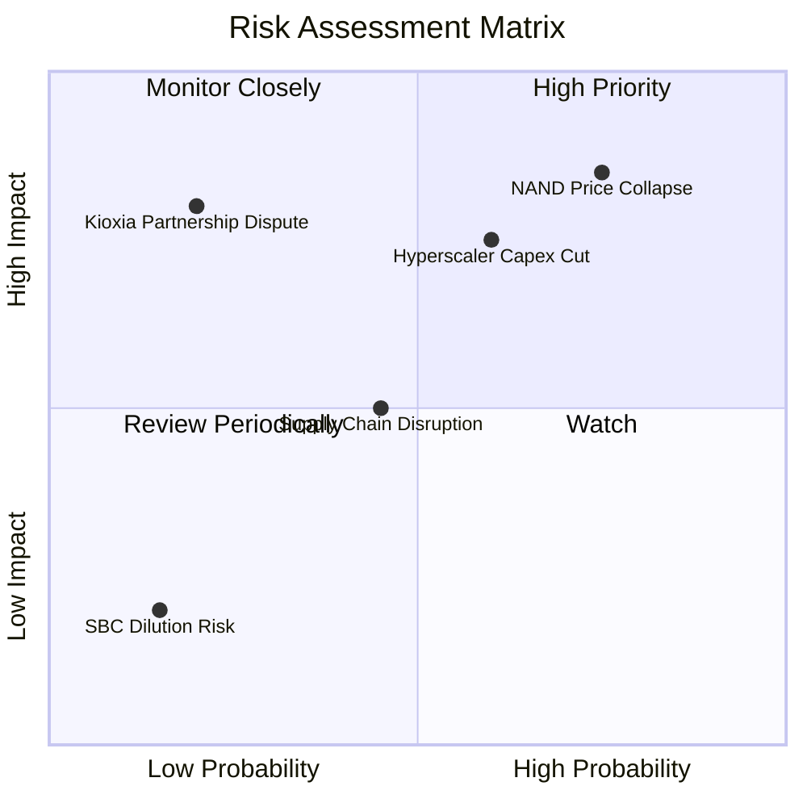

### 9.2 風險清單詳細分析

| # | 風險項目 | 發生機率 | 財務衝擊 | 風險評分 | 緩解措施 / 觀察指標 |
|---|----------|----------|----------|----------|--------------------|
| 1 | 🔴 **NAND 供需逆轉與價格戰** | 高 (75%) | 高 (-30% 營收) | 🔴 **8.5 / 10** | 監控三星與美光的設備資本支出（WFE）增長率。若同業大幅擴產，應在報價下跌前減碼。 |
| 2 | 🔴 **雲端客戶 AI 投資放緩** | 中 (60%) | 高 (-25% 利潤) | 🔴 **7.5 / 10** | 追蹤微軟、谷歌、亞馬遜及 Meta 的季度 Capex 指引。 |
| 3 | 🟡 **合資夥伴 Kioxia 財務不穩定**| 低 (20%) | 極高 (供應中斷) | 🟡 **5.0 / 10** | 關注 Kioxia 的單獨上市（IPO）進程，若成功上市將強化其財務實力。 |
| 4 | 🟡 **應收帳款回收延遲** | 中 (45%) | 中 (壓抑 FCF) | 🟡 **4.5 / 10** | 監控每季 DSO 指標，確保大客戶（如 Dell, HP, Microsoft）未出現付款期拉長。 |

---

## 10. 投資建議

### 10.1 最終綜合評級雷達圖

```
               基本面強度 (8.5)
                   10
                    ▕
         估值 (7.5) ▕   成長性 (9.5)
             \      ▕      /
              \     ▕     /
               \    ▕    /
                \   ▕   /
  財務健康 (9.0) ───┼─── 獲利能力 (8.5)
                /   ▕   \
               /    ▕    \
              /     ▕     \
             /      ▕      \
        技術力 (8.8) ▕   護城河 (8.2)
```

### 10.2 目標價與隱含報酬率

* **當前股價**：$1,354.82
* **12個月基準目標價**：**$2,126.00**
* **預期報酬率**：**+56.9%**
* **投資建議**：🟢 **買入 (Buy)**

### 10.3 買入時機與觸發因素

```
╔══════════════════════════════════════════════════════════════════╗
║                  ✅ 買入觸發因素 Checklist                      ║
╠══════════════════════════════════════════════════════════════════╣
║                                                                  ║
║  立即買入觸發條件（多數符合）：                                  ║
║  ✅ Forward P/E 處於歷史極端低位（目前僅 6.37x）                 ║
║  ✅ 淨現金持續增長（目前已達 $3.53B）                            ║
║  ✅ 單季毛利率維持在 60% 以上                                    ║
║                                                                  ║
║  加碼觸發條件（出現以下任一）：                                  ║
║  ☐ 財報確認 Q3 2026 暴增的應收帳款（$2.73B）成功轉化為 OCF       ║
║  ☐ Kioxia IPO 成功，合資結構估值迎來重估                         ║
║                                                                  ║
║  減碼/停損觸發條件（出現以下任一）：                             ║
║  ☐ 55TB/122TB 企業級 QLC SSD 報價連續兩個月下跌 >5%              ║
║  ☐ 季度 FCF 連續兩季轉為負值                                     ║
║  ☐ ROIC 跌破 15.0%                                               ║
╚══════════════════════════════════════════════════════════════════╝
```

### 10.4 投資人適配度分析

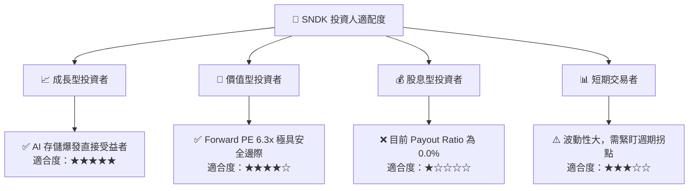

### 10.5 每季財報監控清單（Quarterly Watch List）

為了確保本投資框架的持續有效性，投資人應在每季財報中追蹤以下關鍵指標與「警戒線」：

| 監控指標 | 最新數值 (Q3 26) | 基準健康區間 | 觸發加碼門檻 | 觸發減碼/停損門檻 |
|----------|-----------------|--------------|--------------|------------------|
| **單季營收** | **$5.95B** | > $4.50B | > $6.50B | < $3.50B (需求放緩) |
| **單季毛利率**| **78.3%** | > 55.0% | > 75.0% | < 45.0% (價格戰爆發) |
| **應收帳款 (AR)**| **$2.73B** | < $2.50B | < $1.80B (現金回籠) | > $3.50B (壞帳風險增加)|
| **單季 FCF** | **$2.99B** | > $1.50B | > $2.50B | < $0.00 (現金流枯竭) |
| **總債務** | **$207M** | < $500M | < $100M | > $1.50B (重新大幅舉債)|

### 10.6 反面論證：什麼會證明本分析論點錯誤（What Would Change My Mind）

```
╔══════════════════════════════════════════════════════════════════╗
║              ⚠️ 論點失效條件（Disconfirming Evidence）           ║
╠══════════════════════════════════════════════════════════════════╣
║  本多頭投資論點在下列情況成立時應重新檢視或果斷退出：            ║
║                                                                  ║
║  ☐ 企業級 eSSD 營收成長率連續兩季 QoQ 轉為負值                   ║
║  ☐ 營業利潤率較峰值（69.1%）收縮 > 15 pp（顯示營業槓桿逆轉）     ║
║  ☐ 自由現金流轉負，且 FCF 轉換率（FCF/Net Income）降至 < 20%      ║
║  ☐ ROIC 跌破 WACC（10.4%），公司開始摧毀股東價值                 ║
║  ☐ 競爭對手（如三星）宣布進行產能擴張大戰，NAND 報價暴跌         ║
╚══════════════════════════════════════════════════════════════════╝
```

---

> **免責聲明**：本報告為基於公開財務數據之機構級學術與投資研究分析，不構成任何直接的投資買賣建議。投資有風險，半導體週期股具備高波動性，入市需謹慎。