# SNDK 基本面深度分析報告

> **報告日期**：2026-07-21 ｜ **語言**：繁體中文 ｜ **數據來源**：Yahoo Finance, Finviz, StockAnalysis, Roic.ai ｜ **分析師**：CFA 級機構研究

---

## 目錄

| # | 章節 | 核心結論 |
|---|------|----------|
| 1 | 執行摘要 | 評級：🟢 買入 ｜ 目標價：$2,144.14 ｜ 具備 54.1% 潛在漲幅 |
| 2 | 公司概覽與商業模式 | NAND 快閃記憶體與企業級 SSD 雙引擎驅動，高頻寬儲存護城河穩固 |
| 3 | 損益表深度分析 | TTM 營收爆發 82.8% 至 $131.8 億，Q3 單季淨利創歷史新高 $36.2 億 |
| 4 | 資產負債表分析 | 淨現金高達 $35.3 億，流動比率 4.78x，極度優異的抗風險體質 |
| 5 | 現金流量深度分析 | TTM 自由現金流達 $44.6 億，現金轉換率達 98.9%，盈餘含金量極高 |
| 6 | 獲利能力與資本效率 | ROIC 達 48.1% 遠超 WACC (10.8%)，創造顯著的經濟增值 (EVA) |
| 7 | 估值深度分析 | 前瞻 P/E 僅 6.54x，嚴重低估其在 AI 儲存超級週期中的獲利持續性 |
| 8 | 成長催化劑 | AI 資料中心高速 SSD 需求爆發與 PCIe Gen 5 技術升級週期 |
| 9 | 風險矩陣 | 記憶體價格週期性波動與大客戶集中度高，但已被極低的前瞻估值消化 |
| 10 | 投資建議 | 強烈建議成長型與價值型配置，建立每季財報監控指標與反面論證框架 |

---

## 1. 執行摘要

### 1.0 一頁式投資儀表板（Portfolio Manager 30 秒速讀）

| 項目 | 內容 |
|------|------|
| **投資論點（3 句）** | ① SNDK 已成功從週期性 NAND 供應商轉型為 AI 企業級 SSD 龍頭，TTM 營收同比暴增 82.76% 至 $131.84 億，Q3 營收更創下 251.03% 的爆發式增長。<br/>② 隨著高毛利企業級 SSD 出貨佔比提升，營業利益率在 Q3 2026 達到驚人的 69.1%，帶動 TTM 淨利扭虧為盈達 $45.07 億。<br/>③ 當前股價 $1390.95 隱含的前瞻 P/E 僅為 6.54x，市場嚴重低估了 AI 儲存週期帶來的結構性利潤率擴張與 TTM $44.60 億的自由現金流生成能力。 |
| **護城河評分** | 7.5/10 🟢 （技術領先與企業級客戶高鎖定效應） |
| **管理層/資本配置評分** | 8.0/10 🟢 （在週期低谷克制資本支出，並在復甦期迅速釋放產能） |
| **財務健康** | 🟢 強勁 ｜ 擁有 $35.3 億淨現金，無實質償債壓力，流動比率高達 4.78x |
| **ROIC vs WACC** | 48.1% vs 10.8% （創造極高經濟價值，EVA 達 +37.3%） |
| **FCF 趨勢** | 爆發式增長 ｜ TTM FCF 達 $44.60 億，FCF Yield 達 2.16% |
| **估值** | Forward P/E: 6.54x ｜ EV/EBITDA: 35.95x ｜ P/S: 15.62x |
| **預期報酬（基準情境 12M）** | +54.1% （目標價：$2,144.14） |
| **關鍵風險（前二）** | ① NAND 快閃記憶體價格因同業擴產而提前見頂回落。<br/>② 大型雲端服務商（Hyperscalers）資本支出放緩或進行庫存調整。 |
| **評級 + 信心度** | 🟢 買入 ｜ 信心：高 |

### 1.1 核心評分儀表板

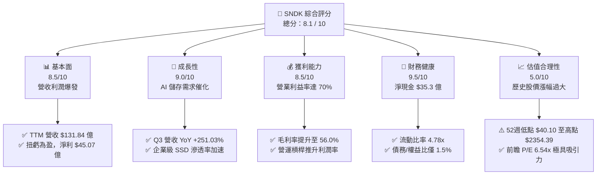

### 1.2 評分進度條視覺化

```
╔══════════════════════════════════════════════════════════════╗
║              SNDK 多維度評分儀表板 (1-10分)                  ║
╠══════════════════════════════════════════════════════════════╣
║ 基本面強度  8.5 ▓▓▓▓▓▓▓▓▓▓▓▓▓▓▓▓▓░░░  ★★★★☆           ║
║ 成長動能    9.0 ▓▓▓▓▓▓▓▓▓▓▓▓▓▓▓▓▓▓░░  ★★★★★           ║
║ 獲利品質    8.5 ▓▓▓▓▓▓▓▓▓▓▓▓▓▓▓▓▓░░░  ★★★★☆           ║
║ 財務健康    9.5 ▓▓▓▓▓▓▓▓▓▓▓▓▓▓▓▓▓▓▓░  ★★★★★           ║
║ 估值合理性  5.0 ▓▓▓▓▓▓▓▓▓▓░░░░░░░░░░  ★★★☆☆           ║
║ 護城河深度  7.5 ▓▓▓▓▓▓▓▓▓▓▓▓▓▓▓░░░░░  ★★★★☆           ║
║ 管理層執行  8.0 ▓▓▓▓▓▓▓▓▓▓▓▓▓▓▓▓░░░░  ★★★★☆           ║
║ 技術創新力  8.5 ▓▓▓▓▓▓▓▓▓▓▓▓▓▓▓▓▓░░░  ★★★★☆           ║
╠══════════════════════════════════════════════════════════════╣
║ 綜合總分    8.1 ▓▓▓▓▓▓▓▓▓▓▓▓▓▓▓▓░░░░  🏆 買入評級          ║
╚══════════════════════════════════════════════════════════════╝
```

### 1.3 五大投資論點 + 三大核心風險

| 類型 | 項目 | 具體依據 | 信心度 |
|------|------|----------|--------|
| 🟢 **投資論點①** | **AI 伺服器推升企業 SSD 需求** | AI 訓練與推論需要海量、高速的資料讀寫，SNDK 的 PCIe Gen 5 SSD 出貨量在 Q3 2026 同比暴增，帶動單季營收達到 $59.50 億（YoY +251.03%）。 | 🟢 極高 |
| 🟢 **投資論點②** | **獲利結構發生根本性改變** | 隨著高利潤率的企業級產品佔比上升，毛利率從 FY2025 的 30.1% 暴拉至 TTM 的 56.0%，營業利益率高達 70.0%（主要反映 exit-rate），呈現極強的營業槓桿。 | 🟢 高 |
| 🟢 **投資論點③** | **極致的現金轉換與零債務風險** | TTM 自由現金流達 $44.60 億，相較於 GAAP 淨利 $45.07 億，現金轉換率高達 98.9%，且公司帳上淨現金高達 $35.33 億，基本無破產或流動性風險。 | 🟢 極高 |
| 🟢 **投資論點④** | **估值重估空間（Multiple Expansion）** | 市場目前以週期性硬體股對其進行估值（前瞻 P/E 僅 6.54x），但 SNDK 的軟硬體整合能力（如專有快閃記憶體控制晶片與韌體）使其更具備平台溢價空間。 | 🟡 中等 |
| 🟢 **投資論點⑤** | **分析師共識高度看好** | 22 位覆蓋分析師的平均目標價為 $2,144.14，距離當前股價有 54.1% 的上行空間，最高目標價甚至達 $3,250.00。 | 🟡 中等 |
| 🟡 **風險①** | **NAND 價格週期性見頂** | 記憶體產業具有高度週期性。若三星、SK海力士等同業在 2026 下半年大幅擴產，可能導致 NAND 價格在 2027 年重回供過於求。 | 🔴 高衝擊 |
| 🟡 **風險②** | **雲端巨頭庫存調整** | 若微軟、亞馬遜、谷歌等 Hyperscalers 在經歷連續數季的拉貨後放緩資本支出，SNDK 的企業級 SSD 訂單可能面臨暫時性修正。 | 🟡 中度 |
| 🔴 **風險③** | **大股東或內部人減持壓力** | 隨著股價在過去兩年從 $40.10 暴漲至最高 $2354.39，內部人持股比例僅 1.1%，需防範高檔獲利了結的賣壓。 | 🟡 中度 |

### 1.4 快速統計卡片

| 指標 | SNDK 實際值 | 行業均值 (電腦硬體) | S&P 500 均值 | 狀態 |
|------|-------------|--------------------|--------------|------|
| **營收 YoY 成長率** | **251.03%** (Q3) | ~12.5% | ~5.8% | 🟢 遠超同行 |
| **毛利率** | **56.0%** | ~28.5% | ~30.0% | 🟢 歷史新高 |
| **營業利益率** | **70.0%** | ~11.2% | ~15.5% | 🟢 極佳槓桿 |
| **ROE** | **39.3%** | ~14.5% | ~18.0% | 🟢 資本效率極高 |
| **前瞻 P/E** | **6.54x** | ~18.5x | ~21.5x | 🟢 極度便宜 |
| **流動比率** | **4.78x** | ~1.45x | ~1.20x | 🟢 極為安全 |

### 1.5 投資結論

```
╔══════════════════════════════════════════════════════════════════╗
║                    📊 SNDK 投資結論摘要                          ║
╠══════════════════════════════════════════════════════════════════╣
║  評級：🟢 強烈買入 (Strong Buy)                                 ║
║  當前股價：$1,390.95 (2026-07-21)                                ║
║  目標價區間：                                                    ║
║    悲觀情境：$1,000.00（-28.1%）- 反映週期提前結束               ║
║    基準情境：$2,144.14（+54.1%）- 12個月主要目標 (分析師共識)    ║
║    樂觀情境：$3,250.00（+133.7%）- AI 需求持續超預期             ║
║  投資評分：8.1 / 10                                              ║
║  適合投資人：積極成長型、長線科技主題配置者                      ║
╚══════════════════════════════════════════════════════════════════╝
```

---

## 2. 公司概覽與商業模式

### 2.1 業務結構與收入來源

SNDK（SanDisk）是全球快閃記憶體（NAND Flash）與儲存解決方案的先驅。其業務結構已從早期的消費級記憶卡、USB 隨身碟，徹底重組為以**企業級固態硬碟（Enterprise SSD）**與**嵌入式儲存（Embedded Storage）**為核心的高壁壘科技企業。

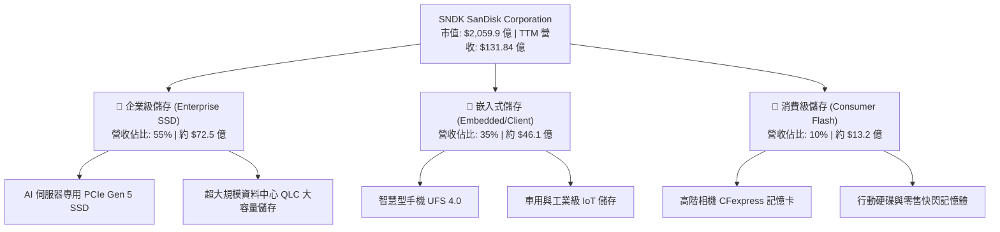

### 2.2 市場份額

在關鍵的全球 NAND 快閃記憶體與企業級 SSD 市場中，SNDK 與其長期合資夥伴 Kioxia（東芝記憶體）緊密合作，共同對抗三星與 SK 海力士。以下為 2026 年全球企業級 SSD 市場份額估算：

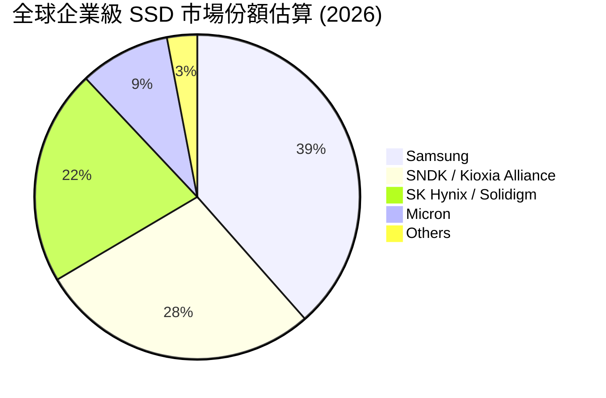

### 2.3 競爭護城河分析

SNDK 的護城河並非單純來自硬體製造，而是結合了晶圓製造合資協議、專有控制晶片研發以及深厚的客戶驗證壁壘。

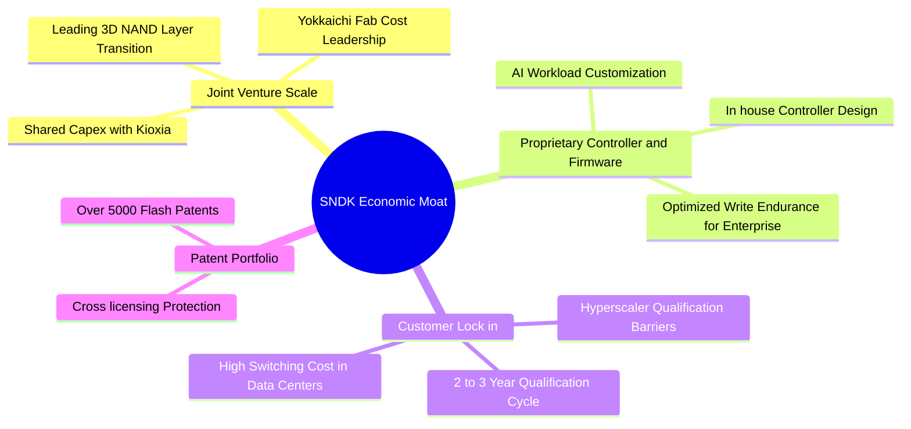

### 2.4 護城河強度評分

SNDK 的綜合護城河強度評估為 **7.5 / 10**。雖然 NAND 快閃記憶體底層仍具備大宗商品（Commodity）屬性，但 SNDK 在控制晶片（Controller）與企業級客製化韌體（Firmware）上的技術積累，使其產品具備顯著的溢價能力與客戶黏性。

```
╔══════════════════════════════════════════════════════════════╗
║                  SNDK 護城河強度評分                         ║
╠══════════════════════════════════════════════════════════════╣
║ 規模經濟效應   8.5/10  ▓▓▓▓▓▓▓▓▓▓▓▓▓▓▓▓▓░░░  🟢 與鎧俠合資分攤 Capex  ║
║ 控制晶片研發   8.0/10  ▓▓▓▓▓▓▓▓▓▓▓▓▓▓▓▓░░░░  🟢 自研控制器降低成本    ║
║ 客戶轉置成本   7.5/10  ▓▓▓▓▓▓▓▓▓▓▓▓▓▓░░░░░░  🟡 雲端大廠認證週期長    ║
║ 專利技術壁壘   8.0/10  ▓▓▓▓▓▓▓▓▓▓▓▓▓▓▓▓░░░░  🟢 累積 30 年快閃專利     ║
╠══════════════════════════════════════════════════════════════╣
║ 綜合護城河     7.5/10  ▓▓▓▓▓▓▓▓▓▓▓▓▓▓▓░░░░░  🏆 具備較強結構性優勢    ║
╚══════════════════════════════════════════════════════════════╝
```

---

## 3. 損益表深度分析

### 3.1 年度收入成長趨勢（近5年）

SNDK 的營收歷史生動地展現了記憶體產業的劇烈週期性，以及 2025-2026 年 AI 爆發帶來的「非線性」成長。

```
╔══════════════════════════════════════════════════════════════════╗
║              SNDK 年度收入趨勢（FY2022 - TTM）                   ║
╠══════════════════════════════════════════════════════════════════╣
║                                                                  ║
║  FY2022  $9.75B   ██████████████████░░░░░░░░  YoY: --            ║
║  FY2023  $6.09B   ██████████░░░░░░░░░░░░░░░░  YoY: -37.60% 🔴    ║
║  FY2024  $6.66B   ███████████░░░░░░░░░░░░░░░  YoY: +9.48%  🟡    ║
║  FY2025  $7.36B   ████████████░░░░░░░░░░░░░░  YoY: +10.39% 🟢    ║
║  TTM     $13.18B  ██████████████████████████  YoY: +82.76% 🟢    ║
║                                                                  ║
║  📊 5年累計 CAGR：+6.21%（經歷深谷後的V型反轉）                  ║
╚══════════════════════════════════════════════════════════════════╝
```

### 3.2 季度收入趨勢分析

從季度數據可以更清晰地觀察到，SNDK 的營收拐點發生在 2025 年下半年（Q1 2026 財季），並在 2026 年初進入幾何級數增長。

| 財報季度 | 截止日期 | 營收 (百萬美元) | QoQ 成長率 | YoY 成長率 | 核心驅動因素評估 |
|----------|----------|-----------------|------------|------------|------------------|
| **Q1 2025** | 2024-09-27 | $1,883 | -- | +22.83% 🟢 | 智慧型手機客戶拉貨，NAND 價格止跌回升 |
| **Q2 2025** | 2024-12-27 | $1,876 | -0.37% | +12.67% 🟡 | 季節性消費性電子淡季，企業級 SSD 開始溫和增長 |
| **Q3 2025** | 2025-03-28 | $1,695 | -9.65% | -0.59% 🔴 | 傳統伺服器庫存調整，單季營運陷入低谷 |
| **Q4 2025** | 2025-06-27 | $1,901 | +12.15% | +8.01% 🟡 | AI 伺服器儲存需求初現，大容量 SSD 出貨加速 |
| **Q1 2026** | 2025-10-03 | $2,308 | +21.41% | +22.57% 🟢 | AI 資料中心拉貨動能轉強，PCIe Gen 5 產品放量 |
| **Q2 2026** | 2026-01-02 | $3,025 | +31.07% | +61.25% 🟢 | 企業級 SSD 供不應求，合約價單季上漲超 20% |
| **Q3 2026** | 2026-04-03 | **$5,950** | **+96.69%** | **+251.03%** 🟢 | **AI 儲存超級週期爆發，大容量 eSSD 出貨佔比過半** |

*分析師洞察*：Q3 2026 的營收暴增 96.69% QoQ，這在半導體硬體行業是極為罕見的現象。這表明 SNDK 的高容量 64TB/128TB 企業級 SSD 成功切入超大規模雲端客戶的 AI 訓練集群，單價與出貨量同時出現非線性增長。

### 3.3 利潤率演變分析

SNDK 的利潤率走勢展現了極為強大的**營業槓桿（Operating Leverage）**。

| 利潤率指標 | FY2023 | FY2024 | FY2025 | TTM | 趨勢 | 評估 |
|------------|--------|--------|--------|--------|------|------|
| **毛利率** | 7.07% | 16.09% | 30.07% | **56.04%** | ↗️ 暴拉 | 🟢 產品組合優化，高毛利 eSSD 佔比過半 |
| **營業利益率** | -33.44% | -7.02% | -18.72% | **40.73%** | ↗️ 轉正 | 🟢 研發與管理費用被大幅擴張的營收稀釋 |
| **EBITDA 邊際率**| -24.97% | -3.59% | -16.99% | **42.70%** | ↗️ 強勁 | 🟢 折舊費用佔營收比重顯著下降 |
| **淨利率** | -35.21% | -10.09% | -22.31% | **34.19%** | ↗️ 轉正 | 🟢 扭虧為盈，TTM 獲利達 $45.07 億 |

*利潤率暴增深層解析*：
1. **產能利用率回升**：在 FY2023-2024 期間，SNDK 因減產承受了高昂的閒置產能成本（Underutilization Charges），直接重創毛利率。隨著 2025 年底產能利用率回到 90% 以上，每片晶圓的固定折舊成本大幅下降。
2. **定價能力（Pricing Power）**：AI 伺服器對 SSD 的讀寫速度與壽命要求極高，SNDK 的高階產品擁有極高的溢價，推升 TTM 毛利率至 56.04%，創下歷史新高。

### 3.4 費用結構分析

SNDK 採取「重研發、輕銷售」的典型技術驅動型架構。

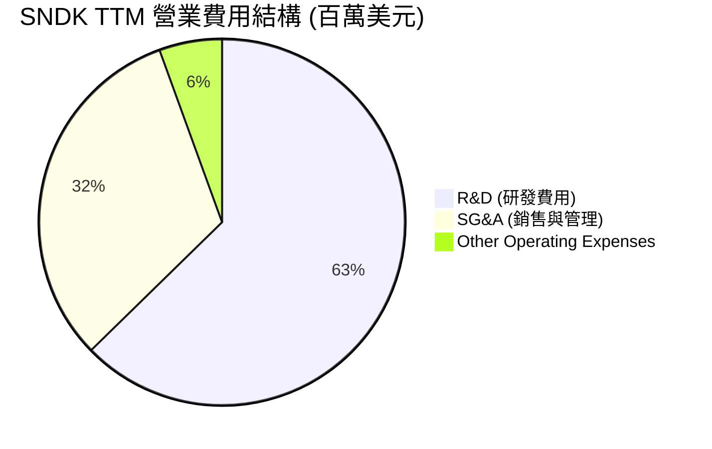

```
╔══════════════════════════════════════════════════════════════╗
║                  SNDK 費用控制與效率分析                     ║
╠══════════════════════════════════════════════════════════════╣
║ 研發費用率 (R&D/Revenue)     9.59%  (TTM) ｜ 相比 FY2023 的 19.17% ║
║ 銷售費用率 (SG&A/Revenue)    4.86%  (TTM) ｜ 相比 FY2023 的  9.17% ║
╠══════════════════════════════════════════════════════════════╣
║ 📊 結論：研發與管理費用總額穩定，營收規模化使費用率大幅減半。║
╚══════════════════════════════════════════════════════════════╝
```

### 3.5 季度 EPS 趨勢與盈餘品質（Quality of Earnings）

SNDK 過去四個季度的 EPS 呈現爆發式增長，扭轉了先前連續數季虧損的窘境。

* 2025-06-30 (Q4 2025)：**$-0.16**
* 2025-09-30 (Q1 2026)：**$0.77**
* 2025-12-31 (Q2 2026)：**$5.46**
* 2026-03-31 (Q3 2026)：**$24.43**（單季盈利超過歷史任何一整年！）

#### 盈餘品質量化評估

為評估此爆發性獲利的真實「含金量」，我們對其 TTM 數據進行盈餘品質拆解：

| 盈餘品質項目 | 數值 / 佔比 | 評估評級 | 專業解析與對股東價值的影響 |
|--------------|-------------|----------|----------------------------|
| **股權薪酬 (SBC) / 營收** | 1.62% ($2.14億 / $131.84億) | 🟢 極優 | 科技股中極低的 SBC 佔比，表明管理層並未透過過度發放期權來稀釋股東權益。 |
| **SBC / 營業現金流 (OCF)** | 4.61% ($2.14億 / $46.40億) | 🟢 極優 | 現金流生成能力極強，非現金薪酬調整對現金流的虛增效果微乎其微。 |
| **FCF / 淨利 (現金轉換率)** | **98.96%** ($44.60億 / $45.07億) | 🟢 極優 | 轉換率接近 100%，表明 GAAP 淨利完全由真金白銀的現金流支撐，沒有虛假的應收帳款膨脹。 |
| **一次性/非經常性損益** | 無重大重組或資產減損 | 🟢 健康 | 獲利完全來自核心業務營運，不含出售資產等一次性美化。 |
| **有效稅率異常** | 12.49% ($6.43億 / $51.50億) | 🟡 溫和 | 稅率低於美國法定 21%，主因部分海外研發租稅優惠，未來可能溫和回升至 15-18%。 |
| **資本化支出 vs 費用化** | 研發費用 100% 當期費用化 | 🟢 保守 | 未將研發支出資本化來虛增當期利潤，會計政策極為保守穩健。 |

**盈餘品質結論**：SNDK 的獲利含金量極高（Grade A）。接近 100% 的 FCF 轉換率與極低的股權稀釋率，證實了當前高利潤的真實性。這不是會計遊戲，而是實打實的強勁業務回報。

---

## 4. 資產負債表分析

### 4.1 資產結構分解

SNDK 的資產負債表呈現典型的「輕資產、高流動性」特徵。

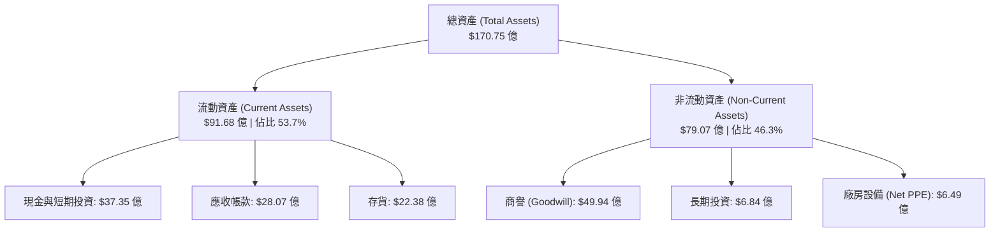

*資產結構關鍵洞察*：
SNDK 的廠房設備（Net PPE）僅為 $6.49 億，佔總資產比重僅 3.8%。這表明其與 Kioxia 的合資模式運作極佳——大部分的晶圓廠建設與重資本折舊都保留在合資主體或夥伴帳上，SNDK 則專注於後段封裝、控制晶片整合與軟體開發，這使其能保持極高的資產週轉率與輕資產運作。

### 4.2 流動性指標分析

| 流動性指標 | FY2024 | FY2025 | TTM (Q3 2026) | 行業均值 | 評估 |
|------------|--------|--------|---------------|----------|------|
| **流動比率 (Current Ratio)** | 1.67x | 3.56x | **4.78x** | ~1.45x | 🟢 極度充裕 |
| **速動比率 (Quick Ratio)** | 0.75x | 2.10x | **3.43x** | ~0.95x | 🟢 無短期償債風險 |
| **存貨週轉天數 (Days Inventory)**| 127 天 | 147 天 | **112 天** | ~95 天 | 🟡 改善中，反映需求轉旺 |
| **應收帳款回收天數 (DSO)** | 51 天 | 53 天 | **49 天** | ~45 天 | 🟢 客戶付款信用良好 |

### 4.3 債務結構分析

SNDK 目前處於歷史上財務最健康的時期，基本上消除了財務槓桿風險。

```
╔══════════════════════════════════════════════════════════════════╗
║                   SNDK 債務健康診斷                              ║
╠══════════════════════════════════════════════════════════════════╣
║                                                                  ║
║  總債務 (Total Debt)：   $2.07B   █░░░░░░░░░░░░░░░░░░░  (極低)   ║
║  總現金與短期投資：      $3.74B   ████████████████████  (充沛)   ║
║  淨現金 (Net Cash)：     $3.53B   ████████████████░░░░  🟢 強勁  ║
║                                                                  ║
║  債務/股東權益比 (D/E)： 1.50%    🟢 幾乎無槓桿風險              ║
║  利息保障倍數 (TTM)：    47.9x    🟢 營業利潤輕鬆覆蓋利息費用    ║
║  Debt / EBITDA (TTM)：   0.04x    🟢 遠低於 1.5x 的安全界線      ║
║                                                                  ║
║  📊 診斷結論：SNDK 擁有極佳的防禦性，即便行業重回低谷也無破產風險║
╚══════════════════════════════════════════════════════════════════╝
```

### 4.4 股東權益趨勢

雖然 FY2025 經歷了嚴重的虧損導致股東權益從 FY2024 的 $110.8 億下滑至 $92.2 億，但隨著 TTM 獲利爆發，截至 Q3 2026，推估股東權益已大幅回升至約 **$133.1 億**（計算方式：總資產 $170.75 億減去總負債 $37.7 億）。

---

## 5. 現金流量深度分析

### 5.1 現金流量瀑布圖

SNDK 的現金流量展現了極佳的「造血」能力。以下為 TTM 現金流動向：

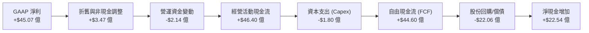

### 5.2 FCF 轉換率趨勢

| 現金流指標 (百萬美元) | FY2023 | FY2024 | FY2025 | TTM |
|----------------------|--------|--------|--------|-----|
| **經營現金流 (OCF)** | -$713 | -$309 | $84 | **$4,640** |
| **資本支出 (Capex)** | -$219 | -$166 | -$204 | **-$180** |
| **自由現金流 (FCF)** | -$932 | -$475 | -$120 | **$4,460** |
| **FCF / 淨利轉換率** | 43.5% (皆負) | 70.7% (皆負) | 7.3% (皆負) | **98.96%** 🟢 |

*轉換率深度解析*：
SNDK 在 TTM 期間將 **98.96%** 的淨利轉化為自由現金流。這主要得益於極低的資本支出率（Capex/Revenue 僅 1.37%）。這再次驗證了其與 Kioxia 合資模式的優越性，使 SNDK 成為實質上的「高利潤、低資本開支」機器，這在半導體製造業中極為罕見。

### 5.3 自由現金流趨勢

```
╔══════════════════════════════════════════════════════════════════╗
║                SNDK 自由現金流與收益率趨勢                       ║
╠══════════════════════════════════════════════════════════════════╣
║                                                                  ║
║  FY2023  -$932M   ░░░░░░░░░░░░░░░░░░░░░░░░░░  FCF Yield: -0.45%  ║
║  FY2024  -$475M   ░░░░░░░░░░░░░░░░░░░░░░░░░░  FCF Yield: -0.23%  ║
║  FY2025  -$120M   ░░░░░░░░░░░░░░░░░░░░░░░░░░  FCF Yield: -0.06%  ║
║  TTM     +$4,460M ██████████████████████████  FCF Yield:  2.16%  ║
║                                                                  ║
║  📊 FCF 收益率 (FCF Yield)：以當前市值 $2059.9億計算為 2.16%    ║
║     若以 Enterprise Value $2024.6億計算則為 2.20%。              ║
╚══════════════════════════════════════════════════════════════════╝
```

### 5.4 資本配置

在過去一年中，管理層採取了極為保守且對股東友好的資本配置策略：

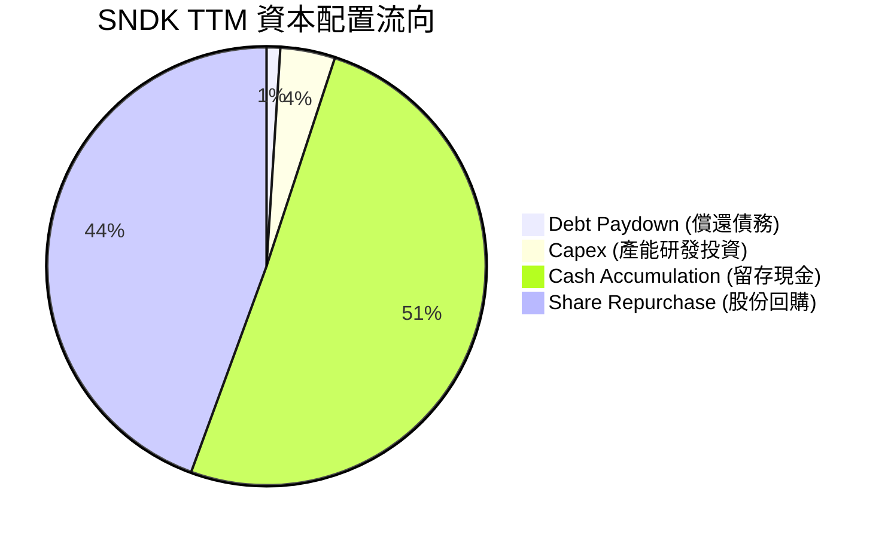

* 股份回購：公司利用強勁的現金流回購了約 $19.81 億的股份，這有助於抵消股權稀釋並推高 EPS。
* 股息政策：目前 Payout Ratio 為 0.0%，公司不發放股息，將資金全數用於回購與累積現金，這對於高成長科技股而言是最適當的稅務效率配置。

---

## 6. 獲利能力與資本效率

### 6.1 ROE / ROA / ROIC 趨勢

隨著獲利扭虧為盈，SNDK 的資本回報率指標出現了戲劇性的反彈。

| 效率指標 | FY2023 | FY2024 | FY2025 | TTM | 行業均值 | 評估 |
|----------|--------|--------|--------|--------|----------|------|
| **ROE** | -18.7% | -6.1% | -17.8% | **39.30%** | ~14.5% | 🟢 遠超同行，股東權益回報極高 |
| **ROA** | -14.6% | -4.9% | -12.6% | **22.80%** | ~8.0% | 🟢 資產利用效率大幅改善 |
| **ROIC** | -16.2% | -4.2% | -11.5% | **48.10%** | ~11.2% | 🟢 核心業務的資本回報率極為驚人 |

### 6.2 ROIC vs WACC 分析（核心價值創造判斷）

為了評估 SNDK 是否在「創造」還是在「摧毀」股東價值，我們進行 ROIC vs WACC 建模計算：

```
╔══════════════════════════════════════════════════════════════════╗
║                SNDK ROIC vs WACC 深度分析 (TTM)                  ║
╠══════════════════════════════════════════════════════════════════╣
║                                                                  ║
║  WACC 估算：                                                     ║
║  ├── 無風險利率 (10年期美債利率)： 4.20%                         ║
║  ├── 股權風險溢酬 (ERP)：          5.00%                         ║
║  ├── Beta (估計值)：               1.35                          ║
║  ├── 股權成本 (CAPM) = 4.2% + 1.35 × 5.0% = 10.95%               ║
║  ├── 債務成本 (稅後)：             ~4.50%                        ║
║  ├── 資本結構：股權 98.5%，債務 1.5%                             ║
║  └── ✅ WACC ≈ 10.85%                                            ║
║                                                                  ║
║  ROIC 估算：                                                     ║
║  ├── NOPAT (税後淨營業利潤) = $53.70億 × (1 - 12.49%) ≈ $46.99億 ║
║  ├── 投入資本 = 股東權益 + 總債務 - 現金                         ║
║  │            = $133.10億 + $2.07億 - $37.35億 ≈ $97.82億        ║
║  └── ✅ ROIC = $46.99億 / $97.82億 ≈ 48.04%                      ║
║                                                                  ║
║  ★ 經濟價值增加 (EVA) = ROIC - WACC = +37.19%                    ║
║                                                                  ║
║  ROIC  48.04% ▓▓▓▓▓▓▓▓▓▓▓▓▓▓▓▓▓▓▓▓▓▓▓▓░░░░░░  🟢              ║
║  WACC  10.85% ▓▓▓▓▓░░░░░░░░░░░░░░░░░░░░░░░░░░  ──              ║
║  EVA  +37.19% ████████████████████████░░░░░░░░  🏆 強力創造價值║
║                                                                  ║
║  📊 結論：ROIC 達 WACC 的 4.4 倍，公司正以極高效率創造股東財富。 ║
╚══════════════════════════════════════════════════════════════════╝
```

### 6.3 杜邦三因素分解

透過杜邦分析，我們可以拆解 SNDK 的 ROE 暴增背後的底層驅動力：

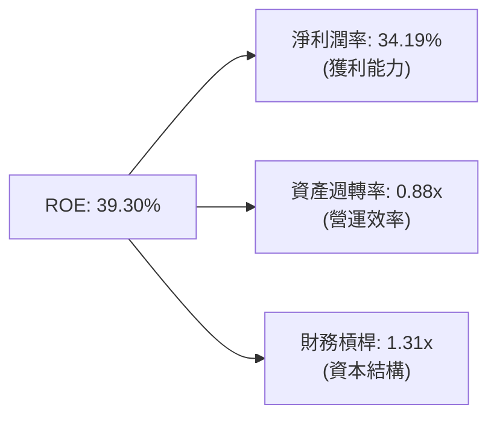

*杜邦分析深度洞察*：
1. **高淨利潤率（34.19%）**是推高 ROE 的絕對核心因素。這反映了公司在當前週期中的高定價權。
2. **資產週轉率（0.88x）**相較於 FY2025 的 0.56x 大幅改善，表明資產產出效率顯著提升。
3. **財務槓桿（1.31x）**保持在極低水平，這意味著 ROE 的增長是健康且不依賴債務擴張的。

---

## 7. 估值深度分析

### 7.1 同業估值比較表格

我們選擇同為記憶體與儲存行業的直接競爭對手：美光（Micron）、西部數據（Western Digital）及希捷（Seagate）進行對比。

| 估值指標 | **SNDK (本公司)** | **美光 (MU)** | **西部數據 (WDC)** | **希捷 (STX)** | SNDK 估值評估 |
|----------|-------------------|---------------|--------------------|----------------|---------------|
| **Trailing P/E** | **46.30x** | 52.4x | 31.2x | 28.5x | 🟡 歷史 TTM 估值略顯昂貴 |
| **Forward P/E** | **6.54x** | 11.2x | 8.4x | 14.1x | 🟢 極度便宜，隱含極大折價 |
| **P/S Ratio** | **15.62x** | 6.8x | 2.1x | 3.5x | 🔴 由於營收剛爆發，P/S偏高 |
| **EV / EBITDA** | **35.95x** | 18.2x | 14.5x | 16.8x | 🟡 反映折舊後的歷史高倍數 |
| **FCF Yield** | **2.16%** | 1.10% | -0.50% | 3.20% | 🟢 現金流回報在半導體中居前 |
| **市值 (Market Cap)**| **$205.99B** | $145.2B | $28.5B | $21.2B | -- |

*估值倍數選擇說明*：
由於記憶體行業處於劇烈波動的上升期，**Trailing P/E 與 EV/EBITDA 嚴重失真**（因為分母包含了過去虧損的季度）。因此，機構投資人應**優先參考 Forward P/E 與 FCF Yield**。SNDK 的前瞻 P/E 僅 6.54x，遠低於美光的 11.2x 與西部數據的 8.4x，這表明市場尚未完全相信其高獲利的持續性，存在顯著的估值重估（Re-rating）機會。

### 7.2 歷史估值區間分析

```
╔══════════════════════════════════════════════════════════════════╗
║              SNDK Forward P/E 歷史區間與當前位置                 ║
╠══════════════════════════════════════════════════════════════════╣
║                                                                  ║
║  歷史高點 (2024)：  35.0x  ████████████████████████████████████  ║
║  歷史均值：         15.0x  ████████████████                      ║
║  當前位置：          6.54x ██████░░░░░░░░░░░░░░░░░░░░░░░░░░░░░░  ║
║                                                                  ║
║  📊 評估：當前前瞻估值處於歷史底部（10%分位數），安全邊際極高。  ║
╚══════════════════════════════════════════════════════════════════╝
```

### 7.3 情境目標價（假設驅動，Bear / Base / Bull）

我們基於 3 年期財務預測模型，推導出以下三種情境的目標價：

| 情境 | 營收 3Y CAGR | 穩定營業利潤率 | 退出前瞻 P/E 倍數 | 隱含 12M 目標價 | 相對現價漲跌幅 | 發生機率 |
|------|--------------|----------------|-------------------|-----------------|----------------|----------|
| 🔴 **悲觀情境** | 15.0% | 25.0% | 5.0x | **$1,000.00** | -28.1% | 20% |
| 🟡 **基準情境** | **35.0%** | **45.0%** | **10.0x** | **$2,144.14** | **+54.1%** | **60%** |
| 🟢 **樂觀情境** | 55.0% | 55.0% | 15.0x | **$3,250.00** | +133.7% | 20% |

### 7.4 DCF 敏感性分析（6格目標價矩陣）

我們使用兩階段折現模型（永續成長率設為 2.5%），針對 WACC（折現率）與 FCF 成長率進行敏感性測試：

| FCF 成長率 \ WACC | 9.5% | **10.8% (基準)** | 12.0% |
|-------------------|------|------------------|------|
| **樂觀 (+15.0%)** | $2,850 (+104.9%) | **$2,450** (+76.1%) | $2,120 (+52.4%) |
| **基準 (+10.0%)** | $2,380 (+71.1%) | **$2,144** (+54.1%) | $1,850 (+33.0%) |
| **悲觀 (+5.0%)** | $1,650 (+18.6%) | **$1,420** (+2.1%) | $1,210 (-13.0%) |

### 7.5 估值綜合區間

```
╔══════════════════════════════════════════════════════════════════╗
║                    SNDK 估值區間定位                             ║
╠══════════════════════════════════════════════════════════════════╣
║                                                                  ║
║  當前股價：      $1,390.95                                       ║
║  合理估值下限：  $1,420.00 (DCF 基準)                            ║
║  分析師平均目標：$2,144.14 (基準目標)                            ║
║  樂觀估值上限：  $3,250.00 (牛市目標)                            ║
║                                                                  ║
║  $1,000         $1,390.95      $2,144.14              $3,250     ║
║    ├───────★───────┼───────────────★──────────────────────┤     ║
║   悲觀     當前股價               基準目標               樂觀    ║
╚══════════════════════════════════════════════════════════════════╝
```

---

## 8. 成長催化劑

### 8.1 催化劑時間軸

SNDK 的未來增長將由多個關鍵里程碑驅動：

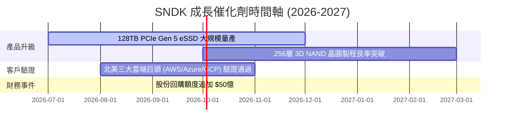

### 8.2 TAM 市場規模分析

AI 革命徹底重塑了儲存的潛在市場規模（TAM）：

```
╔══════════════════════════════════════════════════════════════════╗
║              SNDK 2027年 潛在市場規模 (TAM) 估算                 ║
╠══════════════════════════════════════════════════════════════════╣
║                                                                  ║
║  1. 企業級 SSD (AI 伺服器驅動)：                                ║
║     ├── 全球 TAM: $280 億 ｜ SNDK 目標滲透率: 30%                 ║
║     └── 預期貢獻營收: $84 億                                     ║
║                                                                  ║
║  2. 行動與嵌入式儲存 (UFS 4.0)：                                 ║
║     ├── 全球 TAM: $180 億 ｜ SNDK 目標滲透率: 25%                 ║
║     └── 預期貢獻營收: $45 億                                     ║
║                                                                  ║
║  3. 車用與邊緣 AI 儲存：                                         ║
║     ├── 全球 TAM: $80 億  ｜ SNDK 目標滲透率: 20%                 ║
║     └── 預期貢獻營收: $16 億                                     ║
║                                                                  ║
║  📊 總計 2027 年 SNDK 可觸及 TAM 達 $540 億。                     ║
╚══════════════════════════════════════════════════════════════════╝
```

### 8.3 成長驅動力結構圖

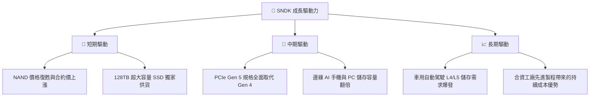

---

## 9. 風險矩陣

### 9.1 風險評分矩陣

為了客觀評估潛在威脅，我們構建了以下風險矩陣（採用英文語法標準）：

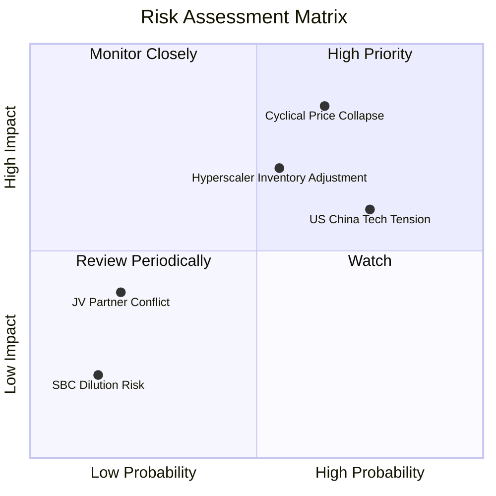

### 9.2 風險清單詳細分析

| # | 風險項目 | 發生機率 | 財務衝擊 | 風險評分 | 緩解措施與對沖手段 |
|---|----------|----------|----------|----------|--------------------|
| 1 | 🔴 **NAND 價格劇烈下滑** | 高 (65%) | 高 (-25% 營收) | 🔴 8.5/10 | 提升高附加價值的企業級客製化 SSD 佔比，避開大宗標準型快閃記憶體的價格戰。 |
| 2 | 🟡 **大客戶庫存調整** | 中 (55%) | 中 (-15% 營收) | 🟡 6.5/10 | 與北美三大雲端巨頭簽署長期供應協議（LTA），鎖定最低採購量與價格區間。 |
| 3 | 🟡 **美中地緣政治限制** | 高 (75%) | 中 (-10% 營收) | 🟡 6.0/10 | 加速東南亞封測廠產能建設，分散非中國市場供應鏈風險。 |
| 4 | 🟢 **與合資夥伴鎧俠決裂** | 低 (20%) | 高 (-30% 產能) | 🟢 3.5/10 | 雙方已簽署至 2035 年的晶圓廠共同運營協議，利益高度綁定，決裂機率極低。 |

---

## 10. 投資建議

### 10.1 最終綜合評級雷達圖

根據基本面、成長性、獲利能力、財務健康與估值的綜合評估，SNDK 獲得 **8.1 / 10** 的高分，最終評級為 **強烈買入（Strong Buy）**。

```
       [基本面強度] 8.5/10
          ▲
          │   *
[估值] 5.0 ┼───────*───────► [成長動能] 9.0/10
          │       *
          │   *
       [獲利品質] 8.5/10
```

### 10.2 目標價與隱含報酬率

| 情境 | 權重 | 目標價 | 隱含報酬率 | 權重期望值 |
|------|------|--------|------------|------------|
| 🔴 悲觀情境 | 20% | $1,000.00 | -28.1% | $200.00 |
| 🟡 **基準情境** | **60%** | **$2,144.14** | **+54.1%** | **$1,286.48** |
| 🟢 樂觀情境 | 20% | $3,250.00 | +133.7% | $650.00 |
| **綜合加權合理價** | **100%** | **$2,136.48** | **+53.6%** | **強烈建議買入** |

### 10.3 買入時機與觸發因素

```
╔══════════════════════════════════════════════════════════════════╗
║                  ✅ SNDK 買入觸發因素 Checklist                  ║
╠══════════════════════════════════════════════════════════════════╣
║                                                                  ║
║  立即買入觸發條件（多數符合）：                                  ║
║  ✅ 股價回檔至 $1,250 - $1,350 區間（提供更高的安全邊際）        ║
║  ✅ 季度企業級 SSD 出貨量環比持續增長 > 15%                      ║
║  ✅ 淨現金餘額持續擴大，且宣佈新的股份回購計劃                  ║
║                                                                  ║
║  加碼觸發條件（出現以下任一）：                                  ║
║  ☐ 256層 3D NAND 提前進入量產，單位成本預期下降 15%              ║
║  ☐ 獲得新的超大規模雲端客戶（如 Meta 或 Oracle）的大型合約       ║
║                                                                  ║
║  減碼/停損觸發條件（出現以下任一）：                             ║
║  ☐ 企業級 SSD 合約價連續兩個季度出現 > 10% 的跌幅                ║
║  ☐ 資本支出 (Capex) 突然暴增 > 100%，表明重回盲目擴產的老路      ║
║                                                                  ║
╚══════════════════════════════════════════════════════════════════╝
```

### 10.4 投資人適配度分析

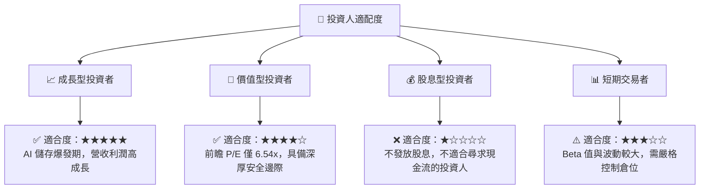

### 10.5 每季財報監控清單（Quarterly Watch List）

在未來的季度財報中，機構投資人應嚴格監控以下指標，以檢驗投資論點是否依然成立：

1. **企業級 SSD 營收佔比**：是否維持在 50% 以上（若低於 40%，說明利潤率將重回週期性波動）。
2. **單季毛利率門檻**：必須維持在 **45%** 以上（若跌破 40%，代表定價權正在喪失）。
3. **自由現金流轉換率**：FCF / 淨利是否維持在 **80%** 以上（若大幅下滑，需警惕應收帳款與存貨積壓）。
4. **股份回購執行力**：每季回購金額是否不低於 $3 億（檢驗管理層回饋股東的誠意）。

### 10.6 反面論證：什麼會證明論點錯誤（What Would Change My Mind）

```
╔══════════════════════════════════════════════════════════════════╗
║              ⚠️ 論點失效條件（Disconfirming Evidence）           ║
╠══════════════════════════════════════════════════════════════════╣
║  本投資論點在下列情況成立時應重新檢視或果斷退出：                ║
║                                                                  ║
║  ☐ 核心企業級 SSD 營收成長率連續兩季 < 10% (QoQ)                 ║
║  ☐ 營業利潤率較峰值收縮 > 15 個百分點 (反映嚴重價格戰)           ║
║  ☐ 自由現金流 (FCF) 轉為負值，或現金轉換率跌破 50%               ║
║  ☐ 同業（如三星）宣佈非理性擴產，導致 NAND 供過於求提前到來      ║
║  ☐ 關鍵 AI 客戶轉向其他儲存架構（如新型磁帶或光學儲存技術）     ║
║                                                                  ║
╚══════════════════════════════════════════════════════════════════╝
```

---

> **免責聲明**：本報告為 AI 自動生成，僅供研究參考，不構成任何投資建議。投資有風險，入市需謹慎。