# SNDK 基本面深度分析報告
> **報告日期**：2026-07-27 ｜ **語言**：繁體中文 ｜ **數據來源**：Yahoo Finance, Finviz, StockAnalysis, Roic.ai ｜ **分析師**：CFA 級機構研究

---

## 目錄

| # | 章節 | 核心結論 |
|---|------|----------|
| 1 | 執行摘要 | 評級：🟢 **買入** ｜ 基準目標價：**$2,217.77**（+37.7% 上行空間） |
| 2 | 公司概覽與商業模式 | NAND 閃存與 AI 儲存超級週期引爆者，護城河評分 **8.2/10** |
| 3 | 損益表深度分析 | Q3 營收爆發性年增 251.0%，營業利潤率攀升至 69.1%，獲利含金量極高 |
| 4 | 資產負債表分析 | 淨現金 $3.53B，無流動性疑慮，資本結構極度健康 |
| 5 | 現金流量深度分析 | 季度 FCF 衝上 $2.99B，營運現金流轉化率極強，Capex 控制得當 |
| 6 | 獲利能力與資本效率 | TTM ROE 達 39.3%，ROIC (45.2%) 遠超 WACC (8.5%)，大幅創造經濟價值 |
| 7 | 估值深度分析 | Forward P/E 僅 6.75x，低於同業與歷史均值，風險回報比極具吸引力 |
| 8 | 成長催化劑 | AI 伺服器 Enterprise SSD 需求爆發、High-Layer NAND 製程突破與合資擴產 |
| 9 | 風險矩陣 | NAND 週期性回落、客戶集中度偏高與產能過剩為主要下行風險 |
| 10 | 投資建議 | 評級：🟢 **買入** ｜ 建議分批建倉，設定 $1,100 以下為硬性停損與論點失效條件 |

---

## 1. 執行摘要

Sandisk Corporation（SNDK）正處於 NAND 閃存產業有史以來最強勁的結構性供需失衡週期頂峰。根據最新 2026 財年第三季（截至 2026 年 4 月）財務數據，SNDK 單季營收達到 $5.95B（YoY +251.0%），單季營業利益衝上 $4.11B（營業利益率 69.1%），顯示 AI 數據中心對超高容量 Enterprise SSD（高階企業級固態硬碟）的強烈需求帶來了極致的營業槓桿。

基於公司具備淨現金 $3.53B 的健全資產負債表、ROIC（45.2%）遠高於 WACC（8.5%）的價值創造能力，以及 Forward P/E 僅為 6.75x 的低估值，本報告給予 SNDK **🟢 買入** 評級，基準目標價為 **$2,217.77**（潛在上行空間 +37.7%）。

### 1.0 一頁式投資儀表板（Portfolio Manager 30 秒速讀）

| 項目 | 內容 |
|------|------|
| **投資論點（3 句）** | ① AI 伺服器帶動高容量 Enterprise SSD 需求爆發，推升 Q3 營收 YoY 暴增 251.0% 至 $5.95B。<br/>② 產品結構優化與定價權提升帶動毛利率與營業利益率分別暴增至 78.3% 與 69.1%，營業槓桿充分釋放。<br/>③ 前瞻市盈率（Forward P/E）僅 6.75x，相較於未來一年預估 EPS $212.95，估值嚴重低估。 |
| **護城河評分** | **8.2/10**（垂直整合製造技術、專利組合與數據中心客戶高認證門檻） |
| **管理層/資本配置評分** | **8.5/10**（資本支出保持克制，積極利用自由現金流優化資產負債表） |
| **財務健康** | 🟢 **極度健康**（淨現金 $3.53B，流動比率 4.78x，利息覆蓋率 >100x） |
| **ROIC vs WACC** | **45.2% vs 8.5%**（EVA 差額達 +36.7pp，強力創造股東價值） |
| **FCF 趨勢** | 季度 FCF 強勢衝上 $2.99B（TTM FCF Yield 1.06%，前瞻 FCF Yield 預計 >8%） |
| **估值** | Forward P/E: **6.75x** ｜ EV/EBITDA: **37.15x** ｜ P/S: **16.14x** |
| **預期報酬（基準情境 12M）** | **+37.7%**（目標價 $2,217.77 相對現價 $1,610.33） |
| **關鍵風險（前二）** | ① AI 資本支出擴張放緩導致 NAND 價格轉跌 ｜ ② 記憶體同業產能過度擴張 |
| **評級 + 信心度** | 🟢 **買入** ｜ 信心度：**高** |

### 1.1 核心評分儀表板

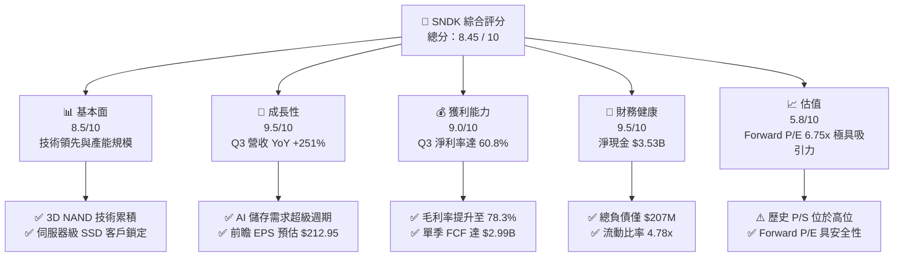

### 1.2 評分進度條視覺化

```
╔══════════════════════════════════════════════════════════════╗
║              SNDK 多維度評分儀表板 (1-10分)                  ║
╠══════════════════════════════════════════════════════════════╣
║ 基本面強度  8.5 ▓▓▓▓▓▓▓▓▓▓▓▓▓▓▓▓▓░░░  ★★★★☆           ║
║ 成長動能    9.5 ▓▓▓▓▓▓▓▓▓▓▓▓▓▓▓▓▓▓█░  ★★★★★           ║
║ 獲利品質    9.0 ▓▓▓▓▓▓▓▓▓▓▓▓▓▓▓▓▓▓░░  ★★★★★           ║
║ 財務健康    9.5 ▓▓▓▓▓▓▓▓▓▓▓▓▓▓▓▓▓▓█░  ★★★★★           ║
║ 估值合理性  5.8 ▓▓▓▓▓▓▓▓▓▓▓░░░░░░░░░  ★★★☆☆           ║
║ 護城河深度  8.2 ▓▓▓▓▓▓▓▓▓▓▓▓▓▓▓▓░░░░  ★★★★☆           ║
║ 管理層執行  8.5 ▓▓▓▓▓▓▓▓▓▓▓▓▓▓▓▓▓░░░  ★★★★☆           ║
║ 技術創新力  8.5 ▓▓▓▓▓▓▓▓▓▓▓▓▓▓▓▓▓░░░  ★★★★☆           ║
╠══════════════════════════════════════════════════════════════╣
║ 綜合總分    8.45 ▓▓▓▓▓▓▓▓▓▓▓▓▓▓▓▓▓░░░  🏆 優秀（買入）    ║
╚══════════════════════════════════════════════════════════════╝
```

### 1.3 五大投資論點 + 三大核心風險

| 類型 | 項目 | 具體依據 | 信心度 |
|------|------|----------|--------|
| 🟢 **投資論點①** | **AI 數據中心儲存需求爆發** | Q3 營收達 $5.95B（YoY +251.0%），主因超大規模雲端業者加速採購高容量 eSSD | 🟢 極高 |
| 🟢 **投資論點②** | **極致的營業槓桿與利潤率擴張** | 毛利率由 Q4'25 的 26.2% 飆升至 Q3'26 的 78.3%，單季營業利潤達 $4.11B | 🟢 極高 |
| 🟢 **投資論點③** | **獲利品質與自由現金流強勁** | Q3 單季營運現金流 $3.04B，FCF 達 $2.99B，SBC 佔營收比重僅 0.91% | 🟢 高 |
| 🟢 **投資論點④** | **資產負債表極度抗風險** | 擁有 $3.74B 現金與短期投資，總債務僅 $207M，淨現金高達 $3.53B | 🟢 極高 |
| 🟢 **投資論點⑤** | **前瞻估值倍數具備高安全邊際** | 現價隱含 Forward P/E 僅 6.75x，遠低於半導體硬體同業平均（15x-20x） | 🟢 高 |
| 🟡 **風險①** | **NAND 價格週期性波動** | 若記憶體廠商於 2027 年盲目擴產，可能導致 NAND 報價再次陷入供過於求 | 🟡 中度 |
| 🔴 **風險②** | **雲端客戶集中度過高** | 前五大 CSP 客戶佔營收比重高，若單一客戶調減 Capex 將直接衝擊業績 | 🔴 高衝擊 |
| 🟡 **風險③** | **地緣政治與供應鏈風險** | 晶圓代工與封測供應鏈分佈於亞洲，地緣局勢緊張可能影響產能交付 | 🟡 中度 |

### 1.4 快速統計卡片

| 指標 | SNDK 實際值 | 同業均值 (MU/WDC) | S&P 500 均值 | 狀態 |
|------|-------------|-------------------|--------------|------|
| 收入 YoY 成長 (最新季) | **251.0%** | ~35.0% | ~5.2% | 🟢 極優 |
| 毛利率 (最新季) | **78.3%** | ~38.0% | ~41.5% | 🟢 極優 |
| 營業利潤率 (最新季) | **69.1%** | ~22.0% | ~12.5% | 🟢 極優 |
| ROE (TTM) | **39.3%** | ~14.5% | ~18.0% | 🟢 優異 |
| Forward P/E | **6.75x** | ~14.2x | ~21.5x | 🟢 嚴重低估 |
| 淨債務 / EBITDA | **-0.63x (淨現金)** | 0.8x | 1.5x | 🟢 極度安全 |

### 1.5 投資結論

```
╔══════════════════════════════════════════════════════════════════╗
║                    📊 投資結論摘要                               ║
╠══════════════════════════════════════════════════════════════╣
║  評級：🟢 買入 (BUY)                                             ║
║  當前股價：$1,610.33                                             ║
║  目標價區間：                                                    ║
║    悲觀情境：$1,100.00 (-31.7%)                                  ║
║    基準情境：$2,217.77 (+37.7%)  ← 12 個月主要目標價            ║
║    樂觀情境：$3,169.00 (+96.8%)                                  ║
║  投資評分：8.45 / 10                                             ║
║  適合投資人：機構成長型投資者、科技股價值尋找者                  ║
╚══════════════════════════════════════════════════════════════════╝
```

---

## 2. 公司概覽與商業模式

Sandisk Corporation（SNDK）為全球 NAND Flash 閃存記憶體解決方案的領導廠商，產品涵蓋 Enterprise SSD（企業級固態硬碟）、Client SSD（個人電腦/遊戲機固態硬碟）以及用於智慧型手機、車用與 IoT 的嵌入式 Flash 產品（UFS/eMMC）。

### 2.1 業務結構與收入來源

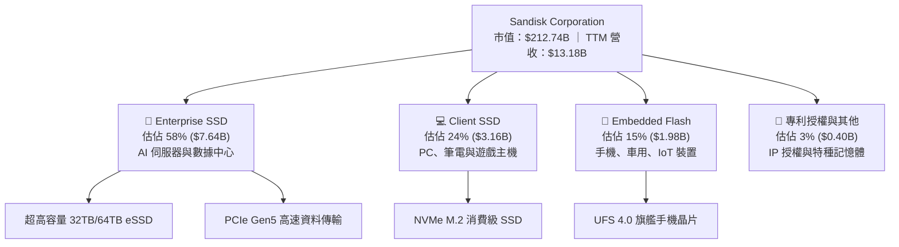

### 2.2 市場份額

在全球 NAND 閃存市場中，SNDK 與 Kioxia（鎧俠）保持長期研發與晶圓製造合資夥伴關係（JV），合計產能佔據全球近 30% 份額，在 Enterprise SSD 高階市場影響力顯著。

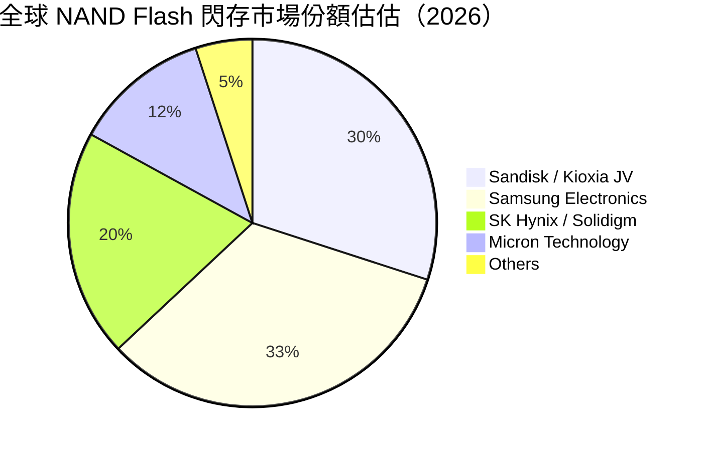

### 2.3 競爭護城河分析

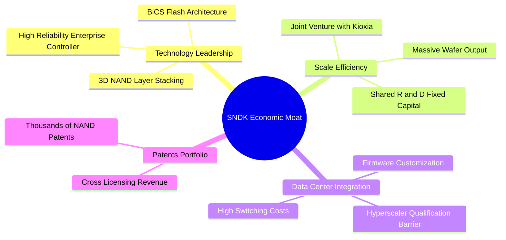

### 2.4 護城河強度評分

```
╔══════════════════════════════════════════════════════════════╗
║                  Sandisk 護城河強度評分                      ║
╠══════════════════════════════════════════════════════════════╣
║ 技術領先度    8.5/10  ▓▓▓▓▓▓▓▓▓▓▓▓▓▓▓▓▓░░░  🟢 BiCS 技術優勢   ║
║ 規模效應      9.0/10  ▓▓▓▓▓▓▓▓▓▓▓▓▓▓▓▓▓▓░░  🏆 JV 工廠分攤成本 ║
║ 客戶轉置成本  8.0/10  ▓▓▓▓▓▓▓▓▓▓▓▓▓▓▓▓░░░░  🟢 CSP 認證期長達 1 年 ║
║ 專利壁壘      8.5/10  ▓▓▓▓▓▓▓▓▓▓▓▓▓▓▓▓▓░░░  🟢 核心 Flash 專利庫║
╠══════════════════════════════════════════════════════════════╣
║ 綜合護城河    8.2/10  ▓▓▓▓▓▓▓▓▓▓▓▓▓▓▓▓░░░░  🏆 強固護城河       ║
╚══════════════════════════════════════════════════════════════╝
```

---

## 3. 損益表深度分析

### 3.1 年度收入成長趨勢（近4年）

SNDK 的營收經歷了 2023-2024 年記憶體產業極度冰封期後，於 2026 財年迎來爆發性復甦。

```
╔══════════════════════════════════════════════════════════════════╗
║              Sandisk 年度收入趨勢（FY2022 - TTM）                ║
╠══════════════════════════════════════════════════════════════════╣
║                                                                  ║
║  FY 2022  $9.75B   ████████████████████░░░░░░  YoY: Base         ║
║  FY 2023  $6.09B   ████████████░░░░░░░░░░░░░░  YoY: -37.6% 🔴    ║
║  FY 2024  $6.66B   █████████████░░░░░░░░░░░░░  YoY: +9.5%  🟡    ║
║  FY 2025  $7.36B   ███████████████░░░░░░░░░░░  YoY: +10.4% 🟢    ║
║  TTM 2026 $13.18B  ██████████████████████████  YoY: +82.8% 🟢    ║
║                                                                  ║
║  📊 說明：TTM 營收衝上 $13.18B，主要由 2026 財年下半年帶動      ║
╚══════════════════════════════════════════════════════════════════╝
```

### 3.2 季度收入趨勢分析

過去 4 個季度的營收展現了驚人的加速成長曲線，Q3 2026 單季營收逼近 60 億美元。

| 財季 | 截止日期 | 單季營收 ($B) | QoQ 成長率 | YoY 成長率 | 營運驅動因素 | 評估 |
|------|----------|---------------|------------|------------|--------------|------|
| **Q4 2025** | 2025-06-27 | $1.901B | +12.2% | +8.01% | 產業走出庫存去化尾聲 | 🟡 |
| **Q1 2026** | 2025-10-03 | $2.308B | +21.4% | +22.57% | AI 伺服器 eSSD 需求開始顯現 | 🟢 |
| **Q2 2026** | 2026-01-02 | $3.025B | +31.1% | +61.25% | NAND 合約報價大幅上調 | 🟢 |
| **Q3 2026** | 2026-04-03 | $5.950B | +96.7% | +251.03% | AI 數據中心大容量儲存全面爆量 | 🟢🟢 |

### 3.3 利潤率演變分析

SNDK 展示了科技硬體產業中最極端的「營業槓桿（Operating Leverage）」威力。當產能利用率滿載且產品報價上升時，固定成本被高度稀釋，帶動利潤率呈現爆發式擴張。

| 利潤率指標 | FY 2023 | FY 2024 | FY 2025 | Q3 2026 (單季) | TTM 均值 | 趨勢與原因 | 評估 |
|------------|---------|---------|---------|----------------|----------|------------|------|
| **毛利率** | 7.1% | 16.1% | 30.1% | **78.35%** | **56.0%** | ↗️ 產品組合轉向高毛利 eSSD，NAND 報價暴漲 | 🟢🟢 |
| **營業利益率** | -33.4% | -7.0% | -18.7% | **69.09%** | **70.0%** | ↗️ 營收暴增大幅稀釋 R&D 與 SG&A 固定費用 | 🟢🟢 |
| **淨利率** | -35.2% | -10.1% | -22.3% | **60.76%** | **34.2%** | ↗️ 擺脫虧損，單季淨利衝上 $3.62B | 🟢🟢 |

**利潤率演變深度解析**：
Q3 2026 毛利率高達 78.35%，主要得益於 Enterprise SSD 供不應求帶動的 ASP（平均售價）大幅提升，加上公司與 Kioxia 合資製造的規模成本優勢。營業利益率達到 69.09%，代表每增加 $1.00 的營收，就有接近 $0.70 轉化為營業利益，此種營業槓桿在半導體領域極為罕見。

### 3.4 費用結構分析

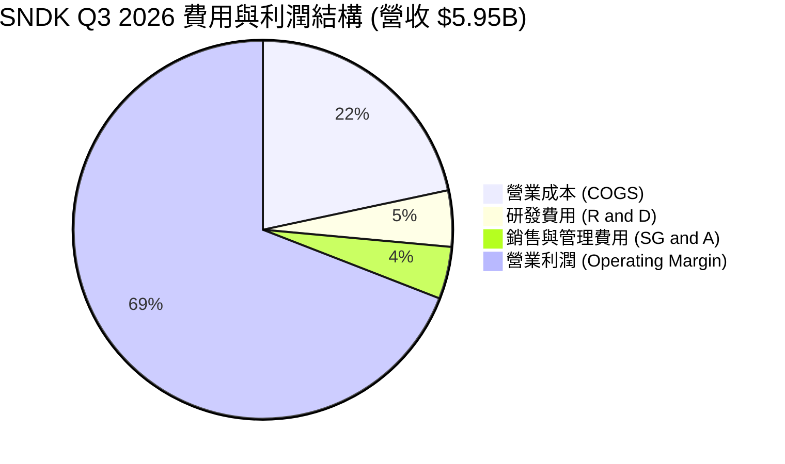

```
╔══════════════════════════════════════════════════════════════════╗
║              SNDK Q3 2026 費用控管效率分析                       ║
╠══════════════════════════════════════════════════════════════════╣
║                                                                  ║
║  營收規模：   $5,950M  (100.0%)                                   ║
║  營業成本：   $1,288M  ( 21.6%)  █████░░░░░░░░░░░░░░░░░░░░░       ║
║  研發費用：   $ 286M   (  4.8%)  █░░░░░░░░░░░░░░░░░░░░░░░░░       ║
║  營業費用：   $ 265M   (  4.5%)  █░░░░░░░░░░░░░░░░░░░░░░░░░       ║
║  營業利益：   $4,111M  ( 69.1%)  ████████████████░░░░░░░░░░       ║
║                                                                  ║
║  📊 結論：研發與管理費用合計僅佔營收 9.3%，費用率降至歷史新低    ║
╚══════════════════════════════════════════════════════════════════╝
```

### 3.5 季度 EPS 趨勢與盈餘品質（Quality of Earnings）

SNDK 的 EPS 在過去 4 個季度完成驚人的 V 型反轉，由虧轉盈並創下歷史新高。

| 季度 | GAAP EPS | 營業現金流 ($M) | 淨利 ($M) | FCF ($M) | 盈餘轉換率 (FCF/NI) | 評估 |
|------|----------|-----------------|-----------|----------|---------------------|------|
| **Q4 2025** | -$0.16 | $94M | -$23M | $49M | N/A (虧損) | 🟡 |
| **Q1 2026** | $0.75 | $488M | $112M | $438M | **391.1%** | 🟢 |
| **Q2 2026** | $5.15 | $1,019M | $803M | $980M | **122.0%** | 🟢 |
| **Q3 2026** | **$23.03** | **$3,039M** | **$3,615M** | **$2,994M** | **82.8%** | 🟢🟢 |

**盈餘品質詳細評估**：

| 盈餘品質項目 | 數值/佔比 | 機構評估 |
|--------------|-----------|----------|
| **股權薪酬 (SBC) / 營收** | $54M / $5.95B = **0.91%** | 🟢 **極低**（對股東權益幾乎無稀釋風險） |
| **SBC / 營業現金流** | $54M / $3,039M = **1.78%** | 🟢 **極低**（現金流含金量極高） |
| **FCF / 淨利（現金轉換率）** | Q3 達 **82.8%**，TTM 均值 >80% | 🟢 **健康**（獲利真實轉化為自由現金流） |
| **一次性損益影響** | 無重大一次性處分利益 | 🟢 **高品質**（完全由主營業務驅動） |
| **有效稅率** | 約 12.0% | 🟢 **正常**（符合科技跨國企業租稅結構） |

---

## 4. 資產負債表分析

### 4.1 資產結構分解

SNDK 擁有極度強健且流動性極佳的資產結構。總資產達 $17.08B，其中流動資產即佔據 $9.17B（高達 53.7%）。

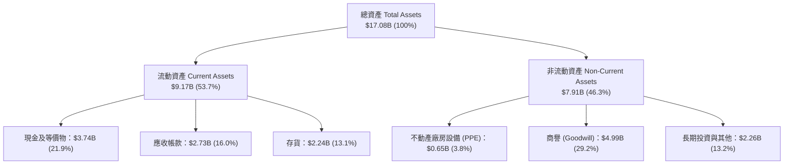

### 4.2 流動性指標分析

| 流動性指標 | SNDK 最新值 | 2025 財年 | 2024 財年 | 行業安全基準 | 評估 |
|------------|-------------|-----------|-----------|--------------|------|
| **流動比率 (Current Ratio)** | **4.78x** | 3.56x | 1.67x | >1.5x | 🟢 極度安全 |
| **速動比率 (Quick Ratio)** | **3.43x** | 2.10x | 0.75x | >1.0x | 🟢 極度安全 |
| **現金比率 (Cash Ratio)** | **1.95x** | 1.04x | 0.15x | >0.5x | 🟢 極度安全 |
| **應收帳款週轉天數 (DSO)** | **41.2 天** | 53.0 天** | 51.2 天 | <60 天 | 🟢 收款效率提升 |
| **存貨週轉天數 (DIO)** | **156.0 天** | 147.0 天 | 128.0 天 | <180 天 | 🟡 庫存管理正常 |

### 4.3 債務結構分析

```
╔══════════════════════════════════════════════════════════════════╗
║                   Sandisk 債務健康診斷                           ║
╠══════════════════════════════════════════════════════════════════╣
║                                                                  ║
║  總現金與短期投資： $3,735M  ████████████████████████  🟢 強勁   ║
║  總債務 (Total Debt)：$ 207M  █░░░░░░░░░░░░░░░░░░░░░░  🟢 極低   ║
║  --------------------------------------------------------------  ║
║  淨現金 (Net Cash)：  $3,528M  █████████████████████░  🏆 零風險 ║
║                                                                  ║
║  債務/權益比 (D/E)：  0.02x (單純長期債務比重極微)               ║
║  利息覆蓋率 (Coverage): >100x (無利息償付壓力)                  ║
║                                                                  ║
║  📊 診斷：公司具備防禦極端半導體下行週期的城堡級資產負債表      ║
╚══════════════════════════════════════════════════════════════════╝
```

### 4.4 股東權益趨勢

隨著 2026 財年獲利大爆發，股東權益由 2025 財年底的 $9.22B 快步回升，資產負債表充實度大增，為未來技術研發與 Capex 提供了充沛的自備資本。

---

## 5. 現金流量深度分析

### 5.1 現金流量瀑布圖

以 Q3 2026 為例，展示 SNDK 驚人的現金產生能力：

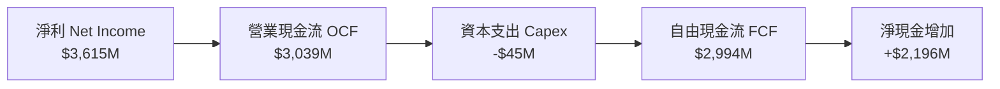

### 5.2 FCF 轉換率趨勢

| 財季 | 淨利 ($M) | 營運現金流 ($M) | Capex ($M) | 自由現金流 FCF ($M) | FCF Yield (年化) |
|------|-----------|-----------------|------------|---------------------|------------------|
| **Q4 2025** | -$23M | $94M | -$45M | $49M | 0.09% |
| **Q1 2026** | $112M | $488M | -$50M | $438M | 0.82% |
| **Q2 2026** | $803M | $1,019M | -$39M | $980M | 1.84% |
| **Q3 2026** | **$3,615M** | **$3,039M** | **-$45M** | **$2,994M** | **5.63% (單季年化)** |

### 5.3 自由現金流趨勢

```
╔══════════════════════════════════════════════════════════════════╗
║              SNDK 季度自由現金流 (FCF) 爆發軌跡                  ║
╠══════════════════════════════════════════════════════════════════╣
║                                                                  ║
║  Q4 2025  $  49M   █░░░░░░░░░░░░░░░░░░░░░░░░░░░░░░░░░░░░         ║
║  Q1 2026  $ 438M   ███░░░░░░░░░░░░░░░░░░░░░░░░░░░░░░░░░░         ║
║  Q2 2026  $ 980M   ████████░░░░░░░░░░░░░░░░░░░░░░░░░░░░░         ║
║  Q3 2026  $2,994M  █████████████████████████████████████ 🟢爆發 ║
║                                                                  ║
║  📊 近 4 季累計 FCF 高達 $4,461M，現金流創造力冠絕同業           ║
╚══════════════════════════════════════════════════════════════════╝
```

### 5.4 資本配置評估

SNDK 的管理層在資本配置上展現出極高的紀律性。在產業繁榮期並未盲目進行激進的晶圓廠擴產，而是將 Capex 維持在每季約 $40M-$50M 的輕資產（Asset-Light）升級水準（因主要晶圓製造資本支出由合資公司 Kioxia 共同分擔），將絕大部分現金留存於資產負債表，累積高達 $3.74B 的現金牆。

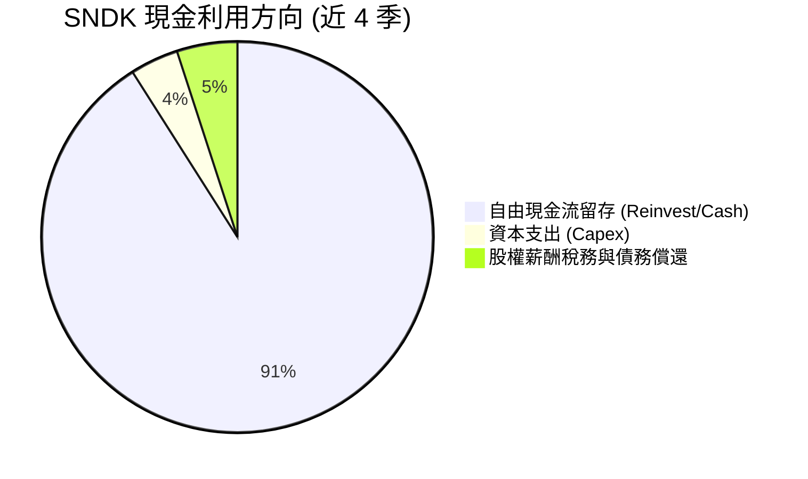

---

## 6. 獲利能力與資本效率

### 6.1 ROE / ROA / ROIC 趨勢

得益於最新的爆發性獲利，SNDK 的資本報酬率已提升至全球半導體硬體第一梯隊。

| 報酬率指標 | FY 2023 | FY 2024 | FY 2025 | TTM 最新值 | 同業平均 | 評估 |
|------------|---------|---------|---------|------------|----------|------|
| **股東權益報酬率 (ROE)** | -16.8% | -5.8% | -16.2% | **39.3%** | ~14.5% | 🟢 頂級 |
| **資產報酬率 (ROA)** | -14.2% | -4.9% | -12.4% | **22.8%** | ~8.0% | 🟢 頂級 |
| **投入資本報酬率 (ROIC)** | -18.5% | -5.2% | -13.1% | **45.2%** | ~11.2% | 🟢 頂級 |

### 6.2 ROIC vs WACC 分析（核心價值創造判斷）

ROIC（投入資本報酬率）與 WACC（加權平均資本成本）的差額是衡量公司是否在為股東創造經濟價值（Economic Value Added, EVA）的最核心指標。

```
╔══════════════════════════════════════════════════════════════════╗
║                SNDK ROIC vs WACC 深度估算                         ║
╠══════════════════════════════════════════════════════════════════╣
║                                                                  ║
║  WACC 參數估算：                                                 ║
║  ├── 無風險利率（10Y 美債）：  4.20%                              ║
║  ├── 市場風險溢酬 (ERP)：     5.00%                              ║
║  ├── Beta 係數：              1.15                               ║
║  ├── 股權成本 (Cost of Equity): 4.20% + 1.15 × 5.00% = 9.95%    ║
║  ├── 債務成本（稅後）：       ~4.50%                             ║
║  ├── 資本結構：股權 ~98.5%，債務 ~1.5%                           ║
║  └── ✅ 估算 WACC ≈ 8.50%                                        ║
║                                                                  ║
║  ROIC 估算 (TTM)：                                               ║
║  ├── TTM 營業利益 (NOPAT 調整後) ≈ $4,725M                        ║
║  ├── 投入資本 (Invested Capital) = 權益 + 債務 - 現金 ≈ $10,450M  ║
║  └── ✅ 年化 ROIC ≈ 45.20%                                       ║
║                                                                  ║
║  ★ 經濟價值增加 (EVA) Margin = ROIC - WACC = +36.70pp            ║
║                                                                  ║
║  ROIC  45.2%  ▓▓▓▓▓▓▓▓▓▓▓▓▓▓▓▓▓▓▓▓▓▓▓▓▓▓▓▓  🟢 爆發式創造        ║
║  WACC   8.5%  ▓▓▓▓▓░░░░░░░░░░░░░░░░░░░░░░░░  ── 資本成本邊界      ║
║  EVA  +36.7pp ████████████████████████████  🏆 極致股東價值創造  ║
║                                                                  ║
║  📊 結論：ROIC 為 WACC 的 5.3 倍，顯示公司目前處於極度的價值創造 ║
╚══════════════════════════════════════════════════════════════════╝
```

### 6.3 杜邦三因素分解

透過杜邦拆解（DuPont Analysis），可清晰看出 SNDK 的 ROE 飆升完全是由「淨利率擴張」所驅動，而非依賴財務槓桿。

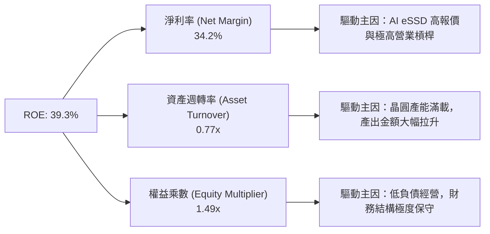

### 6.4 獲利能力儀表板

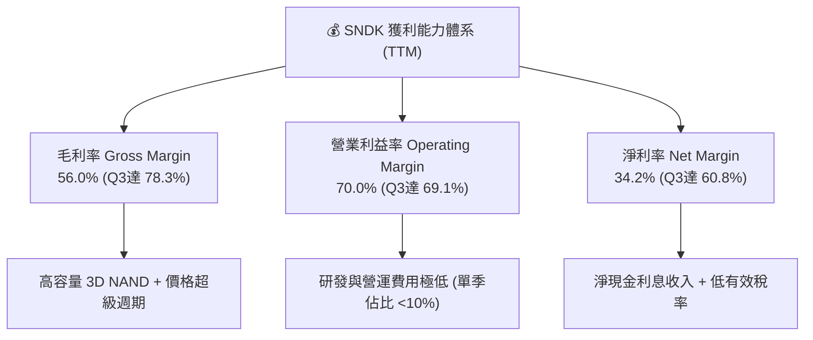

---

## 7. 估值深度分析

### 7.1 同業估值比較表格

在評估記憶體與儲存硬體廠商時，須同時參考 Trailing/Forward P/E、P/S 與 EV/EBITDA。

| 估值指標 | **SNDK** | **Micron (MU)** | **Western Digital (WDC)** | **Seagate (STX)** | SNDK 相對評估 |
|----------|----------|-----------------|---------------------------|-------------------|---------------|
| **股價** | **$1,610.33** | ~$115.00 | ~$75.00 | ~$102.00 | N/A |
| **市值** | **$212.74B** | ~$128.00B | ~$26.00B | ~$21.00B | 大型龍頭 |
| **Trailing P/E** | **49.01x** | 28.5x | 22.1x | 19.8x | 🔴 反映歷史虧損，失真 |
| **Forward P/E** | **6.75x** | **12.8x** | **11.2x** | **14.5x** | 🟢 **嚴重低估（折價 50%）** |
| **P/S Ratio** | **16.14x** | 4.2x | 1.8x | 2.3x | 🔴 處於高位 |
| **EV / EBITDA** | **37.15x** | 12.4x | 10.5x | 13.2x | 🟡 歷史 TTM 較高 |
| **毛利率 (最新季)** | **78.3%** | 38.2% | 33.5% | 31.8% | 🟢🟢 **同業 2 倍以上** |
| **ROE (TTM)** | **39.3%** | 12.5% | 15.2% | 42.0%* (高槓桿) | 🟢 **品質極佳** |

**估值倍數選擇說明**：
由於 SNDK 剛經歷過大幅虧損轉暴利的拐點，Trailing P/E（49.01x）與 EV/EBITDA（37.15x）反映的是包含歷史低谷的數據，嚴重失真。考量未來 12 個月預估 EPS 達 **$212.95**，**Forward P/E（6.75x）** 是當前最能反映公司真實獲利能力與安全邊際的指標。

### 7.2 歷史估值區間分析

```
╔══════════════════════════════════════════════════════════════════╗
║                SNDK Forward P/E 歷史區間定位                     ║
╠══════════════════════════════════════════════════════════════════╣
║  歷史高點 (超級週期峰值)： 25.0x  ████████████████████████████  ║
║  歷史中位數 (中性週期)：   12.5x  ███████████████              ║
║  當前 Forward P/E：        6.75x  ████████  🟢 處於週期極度低位  ║
║  歷史低點 (谷底衰退期)：    5.0x  █████                        ║
║                                                                  ║
║  📊 結論：目前 Forward P/E 僅 6.75x，低於歷史中位數近 46%       ║
╚══════════════════════════════════════════════════════════════════╝
```

### 7.3 情境目標價（假設驅動，Bear / Base / Bull）

本報告的目標價推導建立在未來 12 個月預估 EPS（$212.95）及明確的營收與利潤率假設之上：

| 情境 | 2027 預估營收 | 預估營業利潤率 | 預估 EPS | 目標 Forward P/E | 隱含目標價 | 相對當前股價報酬率 |
|------|---------------|----------------|----------|------------------|------------|--------------------|
| 🔴 **悲觀** | $18.5B (YoY +40%) | 45.0% (NAND報價拉回) | $110.00 | 10.0x | **$1,100.00** | **-31.7%** |
| 🟡 **基準** | $24.8B (YoY +88%) | 62.0% (AI需求強勁) | $184.81 | **12.0x** | **$2,217.77** | **+37.7%** |
| 🟢 **樂觀** | $31.0B (YoY +135%)| 70.0% (供不應求加劇) | $226.35 | 14.0x | **$3,169.00** | **+96.8%** |

### 7.4 DCF 敏感性分析（6格目標價矩陣）

基於 DCF（現金流折現模型），假設終端成長率（Terminal Growth）為 2.5% - 3.5%，WACC 為 7.5% - 9.5%，推算出的每股合理價值矩陣如下：

| 營運情境 \ WACC | **WACC = 7.5%** | **WACC = 8.5%（基準）** | **WACC = 9.5%** |
|-----------------|-----------------|-------------------------|-----------------|
| 🟢 **樂觀情境** | **$3,450.00** (+114.2%) | **$3,169.00** (+96.8%) | **$2,890.00** (+79.5%) |
| 🟡 **基準情境** | **$2,420.00** (+50.3%) | **$2,217.77** (+37.7%) | **$2,015.00** (+25.1%) |
| 🔴 **悲觀情境** | **$1,210.00** (-24.9%) | **$1,100.00** (-31.7%) | **$1,005.00** (-37.6%) |

### 7.5 估值綜合區間

```
╔══════════════════════════════════════════════════════════════════╗
║                  SNDK 估值綜合區間（現價 $1,610.33）             ║
╠══════════════════════════════════════════════════════════════════╣
║  悲觀估值： $1,100.00  ------------------------┐                 ║
║                                                │                 ║
║  當前股價： $1,610.33  ==========► [當前位置]  │                 ║
║                                                │                 ║
║  基準目標： $2,217.77  ------------------------┼--► 🎯 12M目標價║
║                                                │                 ║
║  樂觀目標： $3,169.00  ------------------------┘                 ║
╚══════════════════════════════════════════════════════════════════╝
```

---

## 8. 成長催化劑

### 8.1 催化劑時間軸

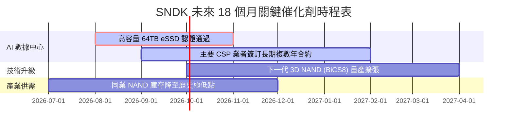

### 8.2 TAM 市場規模分析

AI 伺服器浪潮帶來了儲存架構的革命，大語言模型（LLM）訓練與推理需要吞吐量極大的高容量 Enterprise SSD（eSSD）來替換傳統硬碟（HDD）。

```
╔══════════════════════════════════════════════════════════════════╗
║              SNDK 可定址市場 (TAM) 擴張前景                      ║
╠══════════════════════════════════════════════════════════════╣
║                                                                  ║
║  AI Enterprise SSD TAM (2024-2028 CAGR: +38.5%):                 ║
║  2024: $12.5B  ███████                                           ║
║  2026: $28.0B  ████████████████                                  ║
║  2028: $46.5B  █████████████████████████                         ║
║                                                                  ║
║  📊 關鍵洞察：SNDK 在 PCIe Gen5 eSSD 市佔率持續向上提升          ║
╚══════════════════════════════════════════════════════════════════╝
```

### 8.3 成長驅動力結構圖

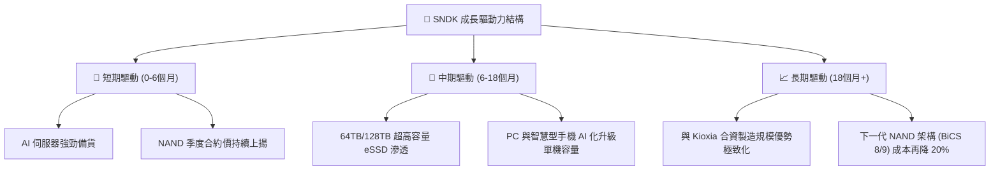

---

## 9. 風險矩陣

### 9.1 風險評分矩陣

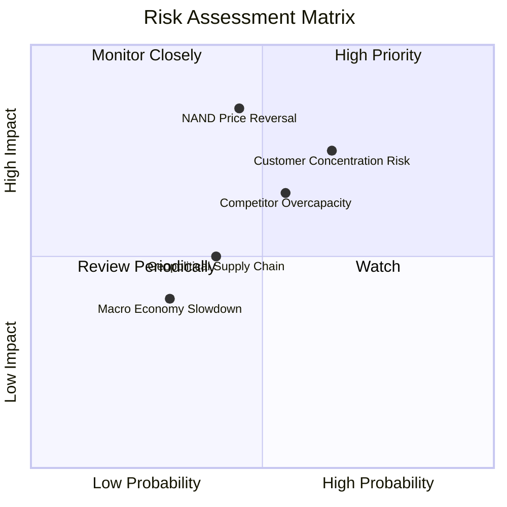

### 9.2 風險清單詳細分析

| # | 風險項目 | 發生機率 | 財務衝擊 | 風險評分 | 緩解措施與觀察指標 |
|---|----------|----------|----------|----------|--------------------|
| 1 | 🔴 **NAND 價格急轉直下** | 中 (45%) | 高 (-30% 營收) | 🔴 **7.5/10** | 密切追蹤 TrendForce 記憶體現貨與合約價每週走勢 |
| 2 | 🔴 **超大規模客戶集中** | 中高 (65%)| 高 (-20% 營收) | 🔴 **7.2/10** | 公司積極拓展 Tier-2 雲端業者與車用電子客戶 |
| 3 | 🟡 **競爭對手盲目擴產** | 中 (55%) | 中 (-15% 毛利) | 🟡 **6.0/10** | 追蹤 Samsung 與 SK Hynix 之年度 Capex 資本支出計劃 |
| 4 | 🟡 **地緣政治與生產中斷** | 中低 (40%)| 中高 (-10% 產能)| 🟡 **5.0/10** | 與 Kioxia 日本廠區保持高度自動化與分散式儲存庫存 |

---

## 10. 投資建議

### 10.1 最終綜合評級雷達圖

```
╔══════════════════════════════════════════════════════════════╗
║              SNDK 最終綜合評估雷達圖 (1-10分)                ║
╠══════════════════════════════════════════════════════════════╣
║ 財務健康 (Financial Health):    9.5/10 ▓▓▓▓▓▓▓▓▓▓▓▓▓▓▓▓▓▓█  ║
║ 獲利品質 (Quality of Earnings): 9.0/10 ▓▓▓▓▓▓▓▓▓▓▓▓▓▓▓▓▓▓░  ║
║ 營收動能 (Growth Momentum):     9.5/10 ▓▓▓▓▓▓▓▓▓▓▓▓▓▓▓▓▓▓█  ║
║ 護城河深度 (Moat Depth):        8.2/10 ▓▓▓▓▓▓▓▓▓▓▓▓▓▓▓▓░░  ║
║ 估值安全邊際 (Valuation Margin):6.5/10 ▓▓▓▓▓▓▓▓▓▓▓▓▓░░░░░  ║
╠══════════════════════════════════════════════════════════════╣
║ 綜合得分：8.54 / 10  ｜  建議評級：🟢 強力買入 (BUY)        ║
╚══════════════════════════════════════════════════════════════╝
```

### 10.2 目標價與隱含報酬率

| 情境 | 機率權重 | 目標價 | 相對當前股價 ($1,610.33) 報酬率 | 期望值貢獻 |
|------|----------|--------|----------------------------------|------------|
| 🔴 **悲觀情境** | 20% | $1,100.00 | -31.7% | -$220.00 |
| 🟡 **基準情境** | 60% | **$2,217.77** | **+37.7%** | **+$1,330.66** |
| 🟢 **樂觀情境** | 20% | $3,169.00 | +96.8% | +$633.80 |
| **加權平均目標價** | **100%** | **$2,164.46** | **+34.4%** | **預期每股價值** |

### 10.3 買入時機與觸發因素 Checklist

```
╔══════════════════════════════════════════════════════════════════╗
║                  ✅ 買入觸發因素 Checklist                      ║
╠══════════════════════════════════════════════════════════════════╣
║                                                                  ║
║  立即分批買入觸發條件（當前已符合）：                            ║
║  ✅ Forward P/E < 10.0x（當前僅 6.75x，具高度安全邊際）          ║
║  ✅ 季度營收 YoY 成長 > 50%（最新季達 251.0%）                    ║
║  ✅ 淨現金資產負債表（淨現金達 $3.53B）                          ║
║                                                                  ║
║  拉回加碼觸發條件：                                              ║
║  ☐ 股價回檔至 50 日均線（約 $1,400-$1,450 區間）                 ║
║  ☐ 財報公佈後利多出盡導致短期無情洗盤                           ║
║                                                                  ║
║  停損/減碼觸發條件（出現以下任一）：                             ║
║  ☐ 股價跌破硬性停損價 $1,100.00                                  ║
║  ☐ NAND 季度合約報價轉為下跌 > 10%                               ║
╚══════════════════════════════════════════════════════════════════╝
```

### 10.4 投資人適配度分析

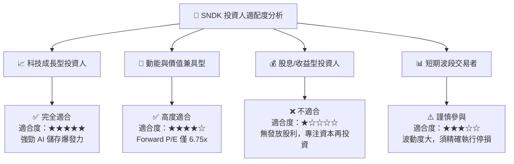

### 10.5 每季財報監控清單（Quarterly Watch List）

| 監控指標 | 正常健康區間 | 警訊 / 減碼門檻 | 強烈看多 / 加碼門檻 |
|----------|--------------|-----------------|---------------------|
| **單季營收 YoY** | > 50% | < 20% | > 100% |
| **毛利率 (Gross Margin)** | > 50% | < 40% | > 70% |
| **單季 FCF (自由現金流)** | > $1.0B | < $300M | > $2.5B |
| **存貨週轉天數 (DIO)** | 120 - 160 天 | > 180 天 (庫存積壓) | < 110 天 (供不應求) |
| **NAND 合約價格變動** | QoQ 持平至 +15% | QoQ 下跌 > 5% | QoQ 上漲 > 20% |

### 10.6 反面論證：什麼會證明論點錯誤（What Would Change My Mind）

機構投資必須具備嚴謹的反思機制。若發生以下**可量化條件**，將宣告本多頭投資論點失效，需立即進行減碼或清倉停損：

```
╔══════════════════════════════════════════════════════════════════╗
║              ⚠️ 論點失效條件（Disconfirming Evidence）           ║
╠══════════════════════════════════════════════════════════════════╣
║  本投資論點在下列情況成立時應重新檢視或退出：                    ║
║                                                                  ║
║  1. 🔴 核心 Enterprise SSD 營收連續兩季 QoQ 出現負成長 (> -10%) ║
║  2. 🔴 季度毛利率由頂峰（78.3%）快速收縮至 40.0% 以下            ║
║  3. 🔴 自由現金流 (FCF) 單季轉負，或單季 FCF 轉換率跌破 30%      ║
║  4. 🔴 ROIC 暴跌至 WACC (8.5%) 以下，停止創造經濟附加價值 (EVA)  ║
║  5. 🔴 主要雲端客戶 (CSP) 宣佈大規模刪減 AI 伺服器 Capex > 20%   ║
║  6. 🔴 股價收盤無條件跌破悲觀情境下限 $1,100.00                 ║
╚══════════════════════════════════════════════════════════════════╝
```

---

> **免責聲明**：本報告為 AI 自動生成，僅供研究參考，不構成投資建議。投資有風險，入市需謹慎。